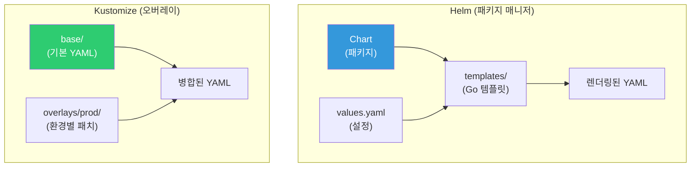
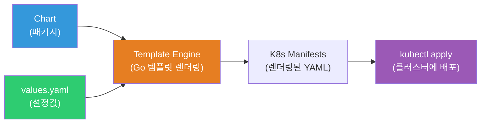
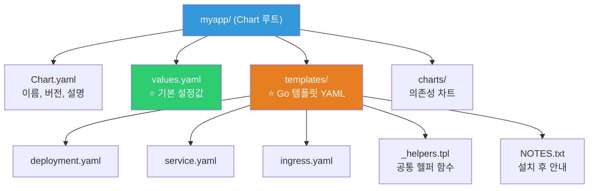
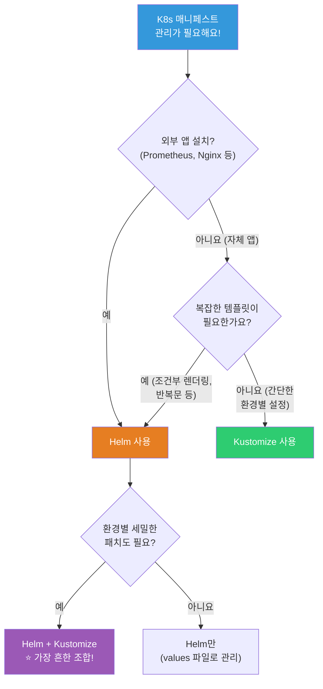

# Helm / Kustomize

> K8s YAML이 50개가 넘으면? 환경별(dev/staging/prod)로 다르게 배포하려면? 같은 앱을 여러 팀에 배포하려면? **Helm**은 K8s의 패키지 매니저이고, **Kustomize**는 YAML 오버레이 도구예요. 둘 다 실무에서 매일 쓰는 필수 도구예요.

---

## 🎯 이걸 왜 알아야 하나?

```
실무에서 Helm/Kustomize가 필요한 순간:
• YAML 파일이 너무 많아서 관리 불가                → 패키지화
• dev/staging/prod에 같은 앱, 다른 설정             → 환경별 오버라이드
• "Nginx Ingress를 설치해주세요"                   → helm install
• "Prometheus를 K8s에 설치해주세요"                → helm install
• CI/CD에서 K8s 배포 자동화                        → Helm + ArgoCD
• 반복되는 YAML 패턴 (Deployment+Service+Ingress)  → 템플릿화
```

---

## 🧠 핵심 개념

### Helm vs Kustomize



| 항목 | Helm | Kustomize |
|------|------|-----------|
| 방식 | 템플릿 + 변수 | 기본 YAML + 패치(오버레이) |
| 설치 | helm CLI 별도 설치 | kubectl 내장! (`-k` 옵션) |
| 에코시스템 | ⭐ 수천 개 차트 (Artifact Hub) | 자체 차트 없음 |
| 학습 곡선 | 중간 (Go 템플릿) | 낮음 |
| 외부 앱 설치 | ⭐ `helm install prometheus` | ❌ 직접 YAML 관리 |
| 환경별 설정 | values-dev.yaml, values-prod.yaml | overlays/dev, overlays/prod |
| GitOps | ArgoCD + Helm ⭐ | ArgoCD + Kustomize ⭐ |
| 추천 | 외부 앱 설치 + 자체 앱 | 간단한 환경별 설정 |

---

## 🔍 상세 설명 — Helm

### Helm이란?



K8s의 **패키지 매니저**예요. apt(Ubuntu)나 brew(Mac)처럼, 복잡한 앱을 한 줄로 설치해요.

```bash
# Helm 없이 Prometheus 설치:
# → YAML 20개+ 직접 작성 (Deployment, Service, ConfigMap, RBAC, PV...)
# → 업그레이드/롤백 수동 관리
# → 설정 변경 시 YAML 직접 수정

# Helm으로:
helm install prometheus prometheus-community/kube-prometheus-stack
# → 한 줄로 끝! YAML 20개가 자동 생성 + 배포!
```

### Helm 핵심 용어

```bash
# Chart  = 패키지 (Deployment+Service+... 묶음)
# Release = Chart의 설치 인스턴스 (이름으로 관리)
# Repository = Chart 저장소 (Artifact Hub)
# values.yaml = 설정 파일 (변수)

# 비유:
# Chart = 앱 설치 파일 (예: Photoshop 설치 프로그램)
# values.yaml = 설치 옵션 (언어: 한국어, 경로: /opt)
# Release = 설치된 앱 (내 컴퓨터의 Photoshop)
# Repository = 앱스토어 (Artifact Hub)
```

### Helm 기본 명령어

```bash
# === 레포지토리 관리 ===
helm repo add bitnami https://charts.bitnami.com/bitnami
helm repo add prometheus-community https://prometheus-community.github.io/helm-charts
helm repo add ingress-nginx https://kubernetes.github.io/ingress-nginx
helm repo update
helm repo list
# NAME                 URL
# bitnami              https://charts.bitnami.com/bitnami
# prometheus-community https://prometheus-community.github.io/helm-charts

# 차트 검색
helm search repo nginx
# NAME                            CHART VERSION   APP VERSION
# bitnami/nginx                   15.0.0          1.25.3
# ingress-nginx/ingress-nginx     4.9.0           1.9.5
# bitnami/nginx-ingress-controller 10.0.0         1.9.5

# === 설치 ===
helm install my-nginx bitnami/nginx \
    --namespace web \
    --create-namespace \
    --set service.type=ClusterIP \
    --set replicaCount=3

# NAME: my-nginx
# STATUS: deployed
# REVISION: 1
# → "my-nginx"라는 이름으로 설치됨!

# values 파일로 설치 (⭐ 실무 추천!)
helm install my-nginx bitnami/nginx \
    -f my-values.yaml \
    --namespace web

# === 조회 ===
helm list -A
# NAME         NAMESPACE   REVISION   STATUS     CHART          APP VERSION
# my-nginx     web         1          deployed   nginx-15.0.0   1.25.3
# prometheus   monitoring  3          deployed   kube-prom-55   0.70.0

helm status my-nginx -n web
# STATUS: deployed
# REVISION: 1
# NOTES:
# ...installation notes...

# 설치된 values 확인
helm get values my-nginx -n web
# replicaCount: 3
# service:
#   type: ClusterIP

# 모든 렌더링된 YAML 보기
helm get manifest my-nginx -n web

# === 업그레이드 ===
helm upgrade my-nginx bitnami/nginx \
    -f my-values.yaml \
    --set replicaCount=5 \
    --namespace web
# Release "my-nginx" has been upgraded. Happy Helming!
# REVISION: 2

# === 롤백 ===
helm rollback my-nginx 1 -n web
# Rollback was a success! Happy Helming!
# → 리비전 1로 롤백!

helm history my-nginx -n web
# REVISION   STATUS       CHART          DESCRIPTION
# 1          superseded   nginx-15.0.0   Install complete
# 2          superseded   nginx-15.0.0   Upgrade complete
# 3          deployed     nginx-15.0.0   Rollback to 1

# === 삭제 ===
helm uninstall my-nginx -n web
# release "my-nginx" uninstalled

# === 드라이런 (적용하지 않고 확인만!) ===
helm install test bitnami/nginx --dry-run --debug -f values.yaml
# → 렌더링된 YAML만 출력 (실제 설치 안 함!)

# === 템플릿 렌더링 ===
helm template my-nginx bitnami/nginx -f values.yaml
# → Release 없이 YAML만 출력 (CI/CD에서 유용!)
```

### Helm Chart 구조 (직접 만들기)



```bash
# Chart 생성
helm create myapp
# myapp/
# ├── Chart.yaml          ← 차트 메타데이터 (이름, 버전)
# ├── values.yaml          ← ⭐ 기본 설정값
# ├── charts/              ← 의존성 차트
# ├── templates/           ← ⭐ Go 템플릿 YAML들
# │   ├── deployment.yaml
# │   ├── service.yaml
# │   ├── ingress.yaml
# │   ├── hpa.yaml
# │   ├── serviceaccount.yaml
# │   ├── _helpers.tpl      ← 공통 헬퍼 함수
# │   ├── NOTES.txt         ← 설치 후 안내 메시지
# │   └── tests/
# │       └── test-connection.yaml
# └── .helmignore
```

### values.yaml

```yaml
# values.yaml — 기본 설정 (사용자가 오버라이드 가능!)
replicaCount: 3

image:
  repository: myapp
  tag: "v1.0.0"
  pullPolicy: IfNotPresent

service:
  type: ClusterIP
  port: 80

ingress:
  enabled: true
  className: nginx
  hosts:
  - host: api.example.com
    paths:
    - path: /
      pathType: Prefix
  tls:
  - secretName: api-tls
    hosts:
    - api.example.com

resources:
  requests:
    cpu: "250m"
    memory: "256Mi"
  limits:
    cpu: "500m"
    memory: "512Mi"

autoscaling:
  enabled: true
  minReplicas: 2
  maxReplicas: 20
  targetCPUUtilizationPercentage: 60

env:
  NODE_ENV: production
  LOG_LEVEL: info

secrets:
  enabled: true
  externalSecretName: myapp-db-credentials
```

### Go 템플릿 (templates/deployment.yaml)

```yaml
apiVersion: apps/v1
kind: Deployment
metadata:
  name: {{ include "myapp.fullname" . }}
  labels:
    {{- include "myapp.labels" . | nindent 4 }}
spec:
  {{- if not .Values.autoscaling.enabled }}
  replicas: {{ .Values.replicaCount }}
  {{- end }}
  selector:
    matchLabels:
      {{- include "myapp.selectorLabels" . | nindent 6 }}
  template:
    metadata:
      labels:
        {{- include "myapp.selectorLabels" . | nindent 8 }}
    spec:
      serviceAccountName: {{ include "myapp.serviceAccountName" . }}
      containers:
      - name: {{ .Chart.Name }}
        image: "{{ .Values.image.repository }}:{{ .Values.image.tag }}"
        imagePullPolicy: {{ .Values.image.pullPolicy }}
        ports:
        - containerPort: {{ .Values.service.port }}
        {{- if .Values.env }}
        env:
        {{- range $key, $value := .Values.env }}
        - name: {{ $key }}
          value: {{ $value | quote }}
        {{- end }}
        {{- end }}
        resources:
          {{- toYaml .Values.resources | nindent 12 }}
        readinessProbe:
          httpGet:
            path: /ready
            port: {{ .Values.service.port }}
          periodSeconds: 5
        livenessProbe:
          httpGet:
            path: /health
            port: {{ .Values.service.port }}
          periodSeconds: 10
```

### 환경별 values 파일 (★ 실무 핵심!)

```bash
# values-dev.yaml
# replicaCount: 1
# image:
#   tag: "latest"
# resources:
#   requests:
#     cpu: "100m"
#     memory: "128Mi"
# ingress:
#   hosts:
#   - host: api-dev.example.com

# values-prod.yaml
# replicaCount: 3
# image:
#   tag: "v1.2.3"
# resources:
#   requests:
#     cpu: "500m"
#     memory: "512Mi"
# ingress:
#   hosts:
#   - host: api.example.com

# 배포:
helm upgrade --install myapp ./myapp \
    -f values.yaml \
    -f values-prod.yaml \           # prod 값이 기본값을 오버라이드!
    --set image.tag=v1.2.4 \        # 추가 오버라이드 (최우선!)
    --namespace production

# 우선순위: --set > -f values-prod.yaml > -f values.yaml > Chart의 values.yaml
```

---

## 🔍 상세 설명 — Kustomize

### Kustomize란?

**기본 YAML 위에 환경별 패치를 덮어씌우는** 도구예요. 템플릿이 아니라 **순수 YAML**로 동작해요.

```bash
# Kustomize 장점:
# ✅ kubectl 내장! 별도 설치 불필요 (kubectl apply -k)
# ✅ 순수 YAML! Go 템플릿 문법 불필요
# ✅ 배우기 쉬움
# ✅ GitOps(ArgoCD)와 잘 맞음

# Kustomize 단점:
# ❌ 외부 앱 설치 기능 없음 (helm install처럼)
# ❌ 복잡한 조건부 렌더링은 어려움
# ❌ 차트 공유/배포 에코시스템 없음
```

### Kustomize 디렉토리 구조

```bash
myapp/
├── base/                        # ⭐ 기본 YAML (공통)
│   ├── kustomization.yaml
│   ├── deployment.yaml
│   ├── service.yaml
│   └── ingress.yaml
├── overlays/                    # ⭐ 환경별 패치
│   ├── dev/
│   │   ├── kustomization.yaml
│   │   ├── replicas-patch.yaml
│   │   └── ingress-patch.yaml
│   ├── staging/
│   │   ├── kustomization.yaml
│   │   └── replicas-patch.yaml
│   └── prod/
│       ├── kustomization.yaml
│       ├── replicas-patch.yaml
│       ├── resources-patch.yaml
│       └── ingress-patch.yaml
```

### base/ — 기본 YAML

```yaml
# base/kustomization.yaml
apiVersion: kustomize.config.k8s.io/v1beta1
kind: Kustomization

resources:
- deployment.yaml
- service.yaml
- ingress.yaml

commonLabels:
  app: myapp

# base/deployment.yaml — 순수 K8s YAML! (템플릿 아님!)
apiVersion: apps/v1
kind: Deployment
metadata:
  name: myapp
spec:
  replicas: 1                    # 기본 1개 (환경별로 오버라이드)
  selector:
    matchLabels:
      app: myapp
  template:
    metadata:
      labels:
        app: myapp
    spec:
      containers:
      - name: myapp
        image: myapp:latest      # 기본 이미지 (환경별로 변경)
        ports:
        - containerPort: 3000
        resources:
          requests:
            cpu: "100m"
            memory: "128Mi"
```

### overlays/ — 환경별 패치

```yaml
# overlays/prod/kustomization.yaml
apiVersion: kustomize.config.k8s.io/v1beta1
kind: Kustomization

resources:
- ../../base                     # base를 참조!

namespace: production            # 네임스페이스 추가

# 이미지 태그 변경!
images:
- name: myapp
  newTag: v1.2.3                 # latest → v1.2.3

# ConfigMap 자동 생성
configMapGenerator:
- name: myapp-config
  literals:
  - NODE_ENV=production
  - LOG_LEVEL=warn

# 패치 (기존 YAML을 부분 수정)
patches:
# replicas 변경
- target:
    kind: Deployment
    name: myapp
  patch: |-
    - op: replace
      path: /spec/replicas
      value: 5

# resources 변경
- target:
    kind: Deployment
    name: myapp
  patch: |-
    - op: replace
      path: /spec/template/spec/containers/0/resources
      value:
        requests:
          cpu: "500m"
          memory: "512Mi"
        limits:
          cpu: "1000m"
          memory: "1Gi"
```

```yaml
# overlays/dev/kustomization.yaml
apiVersion: kustomize.config.k8s.io/v1beta1
kind: Kustomization

resources:
- ../../base

namespace: dev

images:
- name: myapp
  newTag: latest                 # dev는 latest

namePrefix: dev-                 # 모든 리소스 이름에 "dev-" 접두사

configMapGenerator:
- name: myapp-config
  literals:
  - NODE_ENV=development
  - LOG_LEVEL=debug
```

### Kustomize 명령어

```bash
# === 빌드 (렌더링만, 적용 안 함) ===
kubectl kustomize overlays/prod
# → 병합된 YAML 출력 (확인용!)

# 또는
kustomize build overlays/prod

# === 적용 ===
kubectl apply -k overlays/prod
# namespace/production created
# configmap/myapp-config-abc123 created
# deployment.apps/myapp created
# service/myapp created

# === 환경별 적용 ===
kubectl apply -k overlays/dev      # dev 환경
kubectl apply -k overlays/staging  # staging 환경
kubectl apply -k overlays/prod     # prod 환경

# === 삭제 ===
kubectl delete -k overlays/prod

# === diff (변경사항 미리 보기!) ===
kubectl diff -k overlays/prod
# → 현재 상태와 적용될 상태의 차이!
```

### Kustomize 주요 기능

```yaml
# === 이미지 태그 변경 (가장 많이 씀!) ===
images:
- name: myapp
  newName: 123456.dkr.ecr.ap-northeast-2.amazonaws.com/myapp
  newTag: v1.2.3
# → base의 "myapp:latest"를 ECR 주소 + v1.2.3으로 변경!
# → CI/CD에서: kustomize edit set image myapp=...:$TAG

# === ConfigMap/Secret 자동 생성 ===
configMapGenerator:
- name: myapp-config
  files:
  - config/app.properties        # 파일에서
  literals:
  - KEY=value                    # 직접 값

secretGenerator:
- name: myapp-secret
  literals:
  - password=S3cret!
  type: Opaque
# → 이름에 해시 접미사 자동 추가! (myapp-config-abc123)
# → ConfigMap이 바뀌면 해시가 바뀜 → Pod 자동 재시작!

# === 공통 레이블/어노테이션 ===
commonLabels:
  app: myapp
  team: backend
commonAnnotations:
  managed-by: kustomize

# === 네임스페이스 일괄 설정 ===
namespace: production

# === 이름 접두사/접미사 ===
namePrefix: prod-
nameSuffix: -v2

# === 전략적 병합 패치 ===
patchesStrategicMerge:
- add-sidecar.yaml              # 사이드카 컨테이너 추가

# add-sidecar.yaml:
# apiVersion: apps/v1
# kind: Deployment
# metadata:
#   name: myapp
# spec:
#   template:
#     spec:
#       containers:
#       - name: log-shipper           ← 사이드카 추가!
#         image: fluentd:latest
```

---

## 🔍 상세 설명 — Helm + Kustomize 함께 쓰기

### 실무 패턴: Helm으로 설치, Kustomize로 커스텀

```bash
# Prometheus를 Helm으로 설치하되, 일부 설정을 Kustomize로 패치

# 1. Helm 차트를 YAML로 렌더링
helm template prometheus prometheus-community/kube-prometheus-stack \
    -f values-prometheus.yaml \
    --namespace monitoring > base/prometheus-all.yaml

# 2. Kustomize base에 넣기
# base/kustomization.yaml
# resources:
# - prometheus-all.yaml

# 3. overlays로 환경별 패치
# overlays/prod/kustomization.yaml
# resources:
# - ../../base
# patches:
# - retention-patch.yaml    ← 프로드에서는 retention 30일로

# → 이 방식을 "Helm post-rendering"이라고도 해요
# → ArgoCD에서는 Helm + Kustomize를 직접 지원!
```

### ArgoCD에서 Helm / Kustomize (07-cicd에서 상세히!)

```yaml
# ArgoCD Application — Helm 타입
apiVersion: argoproj.io/v1alpha1
kind: Application
metadata:
  name: myapp
spec:
  source:
    repoURL: https://github.com/myorg/myapp-helm.git
    path: charts/myapp
    helm:
      valueFiles:
      - values.yaml
      - values-prod.yaml

---
# ArgoCD Application — Kustomize 타입
apiVersion: argoproj.io/v1alpha1
kind: Application
metadata:
  name: myapp
spec:
  source:
    repoURL: https://github.com/myorg/myapp-k8s.git
    path: overlays/prod
    # ArgoCD가 자동으로 kustomize build!
```

---

## 💻 실습 예제

### 실습 1: Helm으로 외부 앱 설치 (Nginx Ingress)

```bash
# 1. 레포 추가
helm repo add ingress-nginx https://kubernetes.github.io/ingress-nginx
helm repo update

# 2. 설치 전 values 확인
helm show values ingress-nginx/ingress-nginx | head -50

# 3. 커스텀 values로 설치
helm install ingress-nginx ingress-nginx/ingress-nginx \
    --namespace ingress-nginx \
    --create-namespace \
    --set controller.replicaCount=2 \
    --set controller.service.type=LoadBalancer

# 4. 확인
helm list -n ingress-nginx
# NAME           REVISION   STATUS     CHART
# ingress-nginx  1          deployed   ingress-nginx-4.9.0

kubectl get pods -n ingress-nginx
# NAME                                       READY   STATUS
# ingress-nginx-controller-abc123-1          1/1     Running
# ingress-nginx-controller-abc123-2          1/1     Running

# 5. 업그레이드 (replicas 변경)
helm upgrade ingress-nginx ingress-nginx/ingress-nginx \
    --namespace ingress-nginx \
    --set controller.replicaCount=3 \
    --reuse-values                  # ⭐ 기존 values 유지!
# REVISION: 2

# 6. 롤백
helm rollback ingress-nginx 1 -n ingress-nginx

# 7. 정리
helm uninstall ingress-nginx -n ingress-nginx
kubectl delete namespace ingress-nginx
```

### 실습 2: Helm Chart 직접 만들기

```bash
# 1. Chart 생성
helm create myapp-chart
cd myapp-chart

# 2. values.yaml 수정
cat << 'EOF' > values.yaml
replicaCount: 2
image:
  repository: nginx
  tag: "1.25-alpine"
service:
  type: ClusterIP
  port: 80
resources:
  requests:
    cpu: "50m"
    memory: "64Mi"
  limits:
    memory: "128Mi"
EOF

# 3. 린트 (문법 검사)
helm lint .
# ==> Linting .
# [INFO] Chart.yaml: icon is recommended
# 1 chart(s) linted, 0 chart(s) failed

# 4. 드라이런 (렌더링 확인)
helm template test . | head -40

# 5. 설치
helm install myapp . --namespace default

# 6. 확인
kubectl get pods -l app.kubernetes.io/name=myapp-chart
# NAME                           READY   STATUS
# myapp-myapp-chart-abc123       1/1     Running
# myapp-myapp-chart-def456       1/1     Running

# 7. 업그레이드 (이미지 변경)
helm upgrade myapp . --set image.tag="1.24-alpine"

# 8. 정리
helm uninstall myapp
cd .. && rm -rf myapp-chart
```

### 실습 3: Kustomize로 환경별 배포

```bash
# 1. 디렉토리 구조 생성
mkdir -p myapp-kustomize/{base,overlays/{dev,prod}}
cd myapp-kustomize

# 2. base 작성
cat << 'EOF' > base/deployment.yaml
apiVersion: apps/v1
kind: Deployment
metadata:
  name: myapp
spec:
  replicas: 1
  selector:
    matchLabels:
      app: myapp
  template:
    metadata:
      labels:
        app: myapp
    spec:
      containers:
      - name: myapp
        image: nginx:latest
        ports:
        - containerPort: 80
        resources:
          requests:
            cpu: "50m"
            memory: "64Mi"
EOF

cat << 'EOF' > base/service.yaml
apiVersion: v1
kind: Service
metadata:
  name: myapp
spec:
  selector:
    app: myapp
  ports:
  - port: 80
EOF

cat << 'EOF' > base/kustomization.yaml
apiVersion: kustomize.config.k8s.io/v1beta1
kind: Kustomization
resources:
- deployment.yaml
- service.yaml
EOF

# 3. dev overlay
cat << 'EOF' > overlays/dev/kustomization.yaml
apiVersion: kustomize.config.k8s.io/v1beta1
kind: Kustomization
resources:
- ../../base
namespace: dev
namePrefix: dev-
images:
- name: nginx
  newTag: "1.25-alpine"
configMapGenerator:
- name: myapp-config
  literals:
  - ENV=development
EOF

# 4. prod overlay
cat << 'EOF' > overlays/prod/kustomization.yaml
apiVersion: kustomize.config.k8s.io/v1beta1
kind: Kustomization
resources:
- ../../base
namespace: prod
images:
- name: nginx
  newTag: "1.25-alpine"
patches:
- target:
    kind: Deployment
    name: myapp
  patch: |-
    - op: replace
      path: /spec/replicas
      value: 3
    - op: replace
      path: /spec/template/spec/containers/0/resources
      value:
        requests:
          cpu: "250m"
          memory: "256Mi"
        limits:
          memory: "512Mi"
configMapGenerator:
- name: myapp-config
  literals:
  - ENV=production
EOF

# 5. 렌더링 비교
echo "=== DEV ==="
kubectl kustomize overlays/dev | grep -E "replicas:|image:|namespace:" | head -5

echo "=== PROD ==="
kubectl kustomize overlays/prod | grep -E "replicas:|image:|namespace:" | head -5

# DEV:  namespace: dev, replicas: 1, image: nginx:1.25-alpine
# PROD: namespace: prod, replicas: 3, image: nginx:1.25-alpine

# 6. 적용
kubectl create namespace dev
kubectl apply -k overlays/dev

kubectl create namespace prod
kubectl apply -k overlays/prod

# 7. 확인
kubectl get deployments -n dev
# NAME         READY   IMAGE
# dev-myapp    1/1     nginx:1.25-alpine

kubectl get deployments -n prod
# NAME    READY   IMAGE
# myapp   3/3     nginx:1.25-alpine    ← 3개!

# 8. 정리
kubectl delete -k overlays/dev
kubectl delete -k overlays/prod
kubectl delete namespace dev prod
cd .. && rm -rf myapp-kustomize
```

---

## 🏢 실무에서는?

### 시나리오 1: Helm vs Kustomize 선택

```bash
# 질문: "어떤 걸 써야 하나요?"

# Helm을 쓰는 경우:
# ✅ 외부 앱 설치 (Prometheus, Nginx Ingress, cert-manager...)
# ✅ 복잡한 조건부 렌더링 (if/else, range)
# ✅ 차트를 패키징해서 다른 팀/회사에 배포
# ✅ Helm 에코시스템 활용 (Artifact Hub)

# Kustomize를 쓰는 경우:
# ✅ 간단한 환경별 설정 차이
# ✅ 순수 YAML (Go 템플릿 안 배우고 싶으면)
# ✅ kubectl 내장 (도구 설치 없이)
# ✅ 기존 YAML을 그대로 활용

# 둘 다 쓰는 경우 (⭐ 가장 흔함!):
# → 외부 앱: Helm
# → 자체 앱: Helm 또는 Kustomize (팀 선호)
# → ArgoCD에서 둘 다 지원!
```

### 시나리오 2: CI/CD에서 이미지 태그 업데이트

```bash
# GitHub Actions에서 빌드 후 K8s 배포

# === Helm 방식 ===
# values.yaml의 image.tag를 업데이트
helm upgrade myapp ./chart \
    --set image.tag=$GITHUB_SHA \
    --namespace production

# === Kustomize 방식 ===
cd overlays/prod
kustomize edit set image myapp=123456.dkr.ecr.../myapp:$GITHUB_SHA
git add .
git commit -m "deploy: update image to $GITHUB_SHA"
git push
# → ArgoCD가 Git 변경 감지 → 자동 배포! (GitOps!)

# → 07-cicd 강의에서 ArgoCD + Helm/Kustomize 파이프라인 상세히!
```

### 시나리오 3: Helm Chart 업그레이드 안전하게

```bash
# "Prometheus Helm 차트를 업그레이드해야 해요"

# 1. 현재 버전 확인
helm list -n monitoring
# prometheus   3   deployed   kube-prometheus-stack-55.0.0

# 2. 새 버전의 변경사항 확인
helm show chart prometheus-community/kube-prometheus-stack | grep version
# version: 56.0.0

# 3. diff로 변경사항 미리 보기 (⭐ helm-diff 플러그인!)
helm diff upgrade prometheus prometheus-community/kube-prometheus-stack \
    -f values-prometheus.yaml \
    --namespace monitoring
# → 변경될 리소스만 diff로 보여줌!

# 4. 드라이런
helm upgrade prometheus prometheus-community/kube-prometheus-stack \
    -f values-prometheus.yaml \
    --namespace monitoring \
    --dry-run

# 5. 적용
helm upgrade prometheus prometheus-community/kube-prometheus-stack \
    -f values-prometheus.yaml \
    --namespace monitoring

# 6. 확인
kubectl get pods -n monitoring
helm history prometheus -n monitoring

# 7. 문제 시 롤백
helm rollback prometheus 3 -n monitoring
```

---

## ⚠️ 자주 하는 실수

### 1. helm upgrade에서 --reuse-values 안 쓰기

```bash
# ❌ --set으로 일부만 변경 + 기존 values 날아감!
helm upgrade myapp ./chart --set image.tag=v2.0
# → 이전에 설정했던 다른 values가 기본값으로 리셋!

# ✅ --reuse-values로 기존 values 유지
helm upgrade myapp ./chart --set image.tag=v2.0 --reuse-values

# ✅ 또는 항상 values 파일 명시 (가장 안전!)
helm upgrade myapp ./chart -f values-prod.yaml --set image.tag=v2.0
```

### 2. Kustomize에서 base를 직접 수정

```bash
# ❌ base/deployment.yaml에서 replicas를 3으로 변경
# → 모든 환경(dev/staging/prod)에 영향!

# ✅ base는 그대로, overlays에서 패치
# overlays/prod/kustomization.yaml에서 replicas: 3
```

### 3. Helm Chart를 values 없이 설치

```bash
# ❌ 기본값으로 설치 → 프로덕션에 맞지 않을 수 있음!
helm install prometheus prometheus-community/kube-prometheus-stack

# ✅ values 파일로 커스텀!
helm install prometheus prometheus-community/kube-prometheus-stack \
    -f values-prometheus-prod.yaml

# 기본값 확인:
helm show values prometheus-community/kube-prometheus-stack > default-values.yaml
# → 필요한 부분만 커스텀 values에 복사해서 수정
```

### 4. Secret을 values.yaml에 평문으로

```bash
# ❌ values.yaml에 비밀번호
# dbPassword: "SuperSecret123!"
# → Git에 커밋되면 노출!

# ✅ External Secrets + Helm (./04-config-secret 참고)
# → values에는 ExternalSecret 이름만
# → 실제 비밀은 AWS Secrets Manager에

# ✅ 또는 helm-secrets 플러그인 (SOPS로 암호화)
helm secrets install myapp ./chart -f secrets.yaml
```

### 5. Kustomize configMapGenerator의 해시를 모르기

```bash
# Kustomize의 configMapGenerator는 이름에 해시를 붙임!
# myapp-config → myapp-config-abc123

# ✅ 장점: ConfigMap이 바뀌면 해시가 바뀜 → Pod 자동 재생성!
# → (./04-config-secret의 "변경 시 업데이트" 문제 해결!)

# ⚠️ 주의: Deployment에서 ConfigMap 이름을 하드코딩하면 안 됨!
# → Kustomize가 자동으로 참조를 업데이트해줌
```

---

## 📝 정리

### Helm vs Kustomize 선택 가이드



```
외부 앱 설치 (Prometheus, Nginx...)  → Helm ⭐
자체 앱, 간단한 환경별 설정         → Kustomize
복잡한 템플릿, 조건부 렌더링        → Helm
순수 YAML, kubectl 내장             → Kustomize
패키지 공유/배포                    → Helm
GitOps (ArgoCD)                    → 둘 다 지원!
실무                               → 보통 둘 다 씀!
```

### 핵심 명령어

```bash
# === Helm ===
helm repo add NAME URL && helm repo update
helm install RELEASE CHART [-f values.yaml] [-n NS]
helm upgrade RELEASE CHART [-f values.yaml] [--reuse-values]
helm rollback RELEASE REVISION [-n NS]
helm list [-A]
helm uninstall RELEASE [-n NS]
helm template RELEASE CHART [-f values.yaml]    # 렌더링만
helm show values CHART                           # 기본 values

# === Kustomize ===
kubectl kustomize overlays/prod                  # 렌더링만
kubectl apply -k overlays/prod                   # 적용
kubectl diff -k overlays/prod                    # 차이 확인
kubectl delete -k overlays/prod                  # 삭제
kustomize edit set image NAME=REPO:TAG           # 이미지 변경
```

---

## 🔗 다음 강의

다음은 **[13-kubectl-tips](./13-kubectl-tips)** — kubectl 확장 / krew / 실전 팁이에요.

kubectl을 더 효율적으로 쓰는 방법 — 자동완성, alias, krew 플러그인, 유용한 명령어 조합, 컨텍스트 관리까지 배워볼게요.
