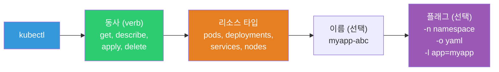
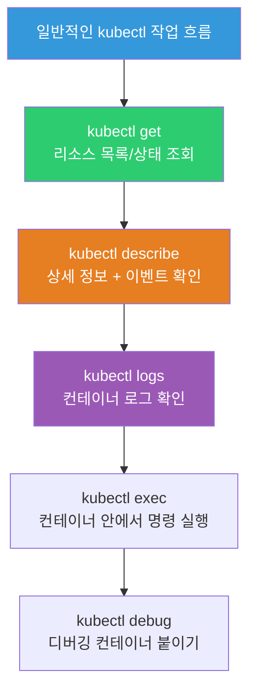
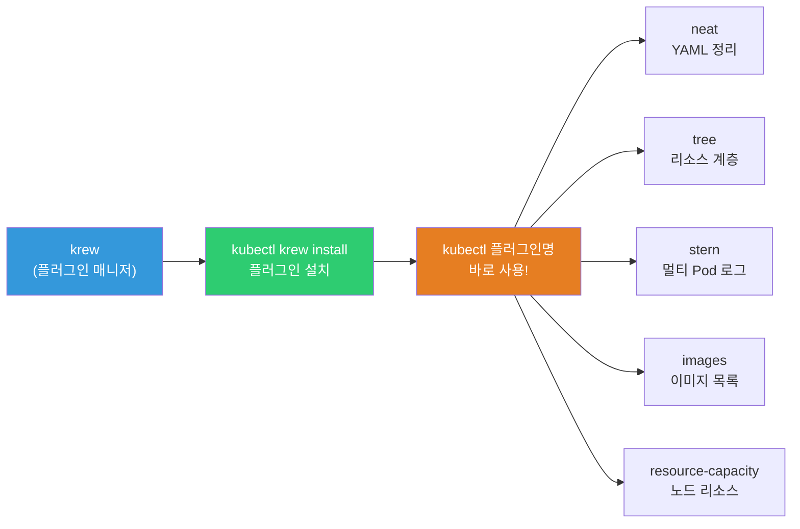
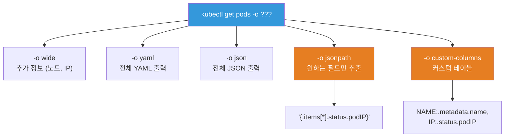

# kubectl 확장 / krew / 실전 팁

> kubectl은 매일 수백 번 치는 명령어예요. 자동완성, alias, 플러그인 하나만 설정해도 생산성이 **2~3배** 올라가요. 실무에서 쓰는 kubectl 고급 기법과 유용한 도구들을 총정리해요.

---

## 🎯 이걸 왜 알아야 하나?

```
이 강의를 배우면:
• kubectl 자동완성 → Tab 키로 리소스/네임스페이스 완성
• alias(k=kubectl) → 타이핑 70% 감소!
• krew 플러그인 → kubectl을 강화하는 200+ 플러그인
• 복잡한 조회 → jsonpath, custom-columns로 원하는 정보만
• 멀티 클러스터 관리 → context 전환, kubectx/kubens
• 일상 업무 속도 2~3배 향상!
```

---

## 🧠 핵심 개념

**kubectl**은 K8s 클러스터와 소통하는 유일한 CLI 도구예요. K8s API 서버에 요청을 보내서 리소스를 조회/생성/수정/삭제하는 역할이에요.



**꼭 알아야 할 핵심:**

* **Context** — "어떤 클러스터에, 어떤 사용자로, 어떤 네임스페이스에서" 작업하는지를 정의해요. `~/.kube/config`에 저장돼요.
* **Namespace** — 클러스터 안에서 리소스를 논리적으로 분리하는 단위예요. `-n` 플래그로 지정해요.
* **리소스 타입** — Pod, Deployment, Service, Node 등 K8s가 관리하는 모든 객체예요. `kubectl api-resources`로 전체 목록을 볼 수 있어요.



---

## 🔍 상세 설명 — 필수 초기 설정

### 자동완성 (⭐ 가장 먼저 하세요!)

```bash
# Bash 자동완성
echo 'source <(kubectl completion bash)' >> ~/.bashrc
source ~/.bashrc

# Zsh 자동완성
echo 'source <(kubectl completion zsh)' >> ~/.zshrc
source ~/.zshrc

# 이제 Tab 키로!
kubectl get p[TAB]           # → pods, pv, pvc, ...
kubectl get pods -n kube[TAB] # → kube-system, kube-public
kubectl describe pod my[TAB]  # → my-pod-abc123
kubectl logs [TAB]            # → Pod 이름 자동완성!
```

### Alias 설정 (⭐ 생산성 핵심!)

```bash
# 기본 alias
echo 'alias k=kubectl' >> ~/.bashrc
echo 'complete -o default -F __start_kubectl k' >> ~/.bashrc  # alias에도 자동완성!

# 실무에서 매일 쓰는 alias
cat << 'EOF' >> ~/.bashrc

# 기본
alias k='kubectl'
alias kg='kubectl get'
alias kd='kubectl describe'
alias kl='kubectl logs'
alias ke='kubectl exec -it'
alias ka='kubectl apply -f'
alias kdel='kubectl delete'

# Pod
alias kgp='kubectl get pods'
alias kgpw='kubectl get pods -o wide'
alias kgpa='kubectl get pods -A'
alias kdp='kubectl describe pod'
alias ktp='kubectl top pods'

# Deployment
alias kgd='kubectl get deployments'
alias kdd='kubectl describe deployment'
alias ksd='kubectl scale deployment'

# Service
alias kgs='kubectl get svc'
alias kge='kubectl get endpoints'

# Node
alias kgn='kubectl get nodes -o wide'
alias ktn='kubectl top nodes'
alias kdn='kubectl describe node'

# 네임스페이스
alias kgns='kubectl get namespaces'
alias kcn='kubectl config set-context --current --namespace'  # kcn production

# 이벤트
alias kev='kubectl get events --sort-by=.lastTimestamp'

# 전체
alias kga='kubectl get all'
alias kgaa='kubectl get all -A'

# 빠른 임시 Pod
alias krun='kubectl run tmp --image=busybox --rm -it --restart=Never --'
alias knetshoot='kubectl run netshoot --image=nicolaka/netshoot --rm -it --restart=Never --'
EOF

source ~/.bashrc

# 사용 예시:
kgp                            # kubectl get pods
kgp -n production              # kubectl get pods -n production
kgpw                           # kubectl get pods -o wide
kl myapp-abc -f --tail 20      # kubectl logs myapp-abc -f --tail 20
ke myapp-abc -- sh             # kubectl exec -it myapp-abc -- sh
kcn production                 # 네임스페이스를 production으로 전환!
krun sh                        # 임시 busybox Pod에서 sh 실행
knetshoot bash                 # netshoot으로 네트워크 디버깅
```

### kubectx / kubens (★ 멀티 클러스터 필수!)

```bash
# 설치
# brew install kubectx  (Mac)
# sudo apt install kubectx  (Ubuntu, snap)
# 또는 krew: kubectl krew install ctx ns

# kubectx — 클러스터(context) 전환
kubectx
# dev-cluster
# staging-cluster
# * prod-cluster            ← 현재 컨텍스트

kubectx dev-cluster          # dev로 전환!
# Switched to context "dev-cluster"

kubectx -                    # 이전 컨텍스트로 돌아가기 (cd - 처럼!)

# kubens — 네임스페이스 전환
kubens
# default
# kube-system
# * production              ← 현재 네임스페이스

kubens monitoring            # monitoring으로 전환!
# Context "prod-cluster" modified.
# Active namespace is "monitoring"

kubens -                     # 이전 네임스페이스로

# → -n production 매번 안 붙여도 됨!

# ⚠️ 실수 방지! 프로덕션에서:
# → 프롬프트에 현재 컨텍스트+네임스페이스 표시하기!
# → kube-ps1 사용 (아래 참고)
```

### 쉘 프롬프트에 K8s 정보 표시

```bash
# kube-ps1: 프롬프트에 클러스터+네임스페이스 표시
# 설치: brew install kube-ps1 (Mac) 또는 git clone

# .bashrc에 추가:
# source /path/to/kube-ps1.sh
# PS1='[\W $(kube_ps1)] $ '

# 결과:
# [~ (⎈ |prod-cluster:production)] $ kubectl get pods
#       ^^^^^^^^^^^^^^^^^^^^^^^^^^
#       현재 prod 클러스터의 production 네임스페이스!
# → "지금 어디에 있는지" 항상 보임 → 실수 방지!
```

---

## 🔍 상세 설명 — krew (kubectl 플러그인 매니저)



### krew 설치 + 필수 플러그인

```bash
# krew 설치
# https://krew.sigs.k8s.io/docs/user-guide/setup/install/

# 플러그인 검색
kubectl krew search
# NAME          DESCRIPTION
# ctx           Switch between contexts (kubectx)
# ns            Switch between namespaces (kubens)
# neat          Remove clutter from YAML output
# tree          Show resource hierarchy
# images        Show container images in a cluster
# resource-capacity  Show node resource usage
# stern         Multi-pod log tailing
# ...

# 플러그인 설치
kubectl krew install ctx ns neat tree images resource-capacity stern whoami

# 설치된 플러그인
kubectl krew list
# ctx
# images
# neat
# ns
# resource-capacity
# stern
# tree
# whoami
```

### 필수 플러그인 사용법

```bash
# === kubectl neat — YAML 정리 (⭐ 매우 유용!) ===
# kubectl get으로 YAML을 뽑으면 managed fields 등 쓸데없는 것이 많음
kubectl get deployment myapp -o yaml                # → 200줄+ (지저분)
kubectl get deployment myapp -o yaml | kubectl neat  # → 50줄 (깔끔!)
# → managedFields, status, resourceVersion 등 제거
# → "이 Deployment를 YAML로 백업하고 싶어요" → neat가 핵심!

# === kubectl tree — 리소스 계층 구조 ===
kubectl tree deployment myapp
# NAMESPACE  NAME                              READY  REASON  AGE
# default    Deployment/myapp                  3/3            5d
# default    ├─ReplicaSet/myapp-abc123         3/3            5d
# default    │ ├─Pod/myapp-abc123-xxxxx        True           5d
# default    │ ├─Pod/myapp-abc123-yyyyy        True           5d
# default    │ └─Pod/myapp-abc123-zzzzz        True           5d
# default    └─ReplicaSet/myapp-def456 (old)   0/0            3d
# → Deployment → ReplicaSet → Pod 관계가 한눈에!

# === kubectl images — 클러스터의 모든 이미지 ===
kubectl images -A
# NAMESPACE    POD                      CONTAINER   IMAGE
# default      myapp-abc-1              myapp       myapp:v1.2.3
# default      myapp-abc-2              myapp       myapp:v1.2.3
# kube-system  coredns-5644d7b6d9-xxx   coredns     registry.k8s.io/coredns:v1.11.1
# kube-system  kube-proxy-xxx           kube-proxy  registry.k8s.io/kube-proxy:v1.28.0
# → 어떤 이미지가 쓰이는지 전체 파악!

# === kubectl resource-capacity — 노드 리소스 한눈에 ===
kubectl resource-capacity
# NODE      CPU REQUESTS   CPU LIMITS   MEMORY REQUESTS   MEMORY LIMITS
# node-1    1200m (30%)    2400m (61%)  3072Mi (41%)       6144Mi (82%)
# node-2    800m (20%)     1600m (40%)  2048Mi (27%)       4096Mi (55%)
# *Total    2000m (25%)    4000m (50%)  5120Mi (34%)       10240Mi (68%)
# → 노드별 리소스 사용률이 한눈에!

kubectl resource-capacity --pods --util
# → Pod별 실제 사용량까지!

# === stern — 여러 Pod 로그 동시에 ===
stern myapp -n production
# → "myapp"이 포함된 모든 Pod의 로그를 색상 구분해서 실시간!
# myapp-abc-1 │ [10:00:00] GET /api/users 200
# myapp-abc-2 │ [10:00:01] POST /api/orders 201
# myapp-abc-3 │ [10:00:02] GET /api/health 200

stern "myapp|redis" -n production
# → myapp과 redis 로그를 동시에!

stern myapp -n production --since 1h --tail 10
# → 최근 1시간, 각 Pod 10줄부터

# === kubectl whoami — 현재 사용자 확인 ===
kubectl whoami
# arn:aws:iam::123456789:user/developer
# → "내가 누구로 접속하고 있지?" (./11-rbac 디버깅에 유용!)
```

---

## 🔍 상세 설명 — 고급 조회 기법

### 출력 형식 옵션



### jsonpath — 원하는 필드만 추출

```bash
# Pod IP만
kubectl get pods -o jsonpath='{.items[*].status.podIP}'
# 10.0.1.50 10.0.1.51 10.0.1.52

# Pod 이름 + IP (줄바꿈)
kubectl get pods -o jsonpath='{range .items[*]}{.metadata.name}{"\t"}{.status.podIP}{"\n"}{end}'
# myapp-abc-1   10.0.1.50
# myapp-abc-2   10.0.1.51
# myapp-abc-3   10.0.1.52

# 노드별 Pod 수
kubectl get pods -A -o jsonpath='{range .items[*]}{.spec.nodeName}{"\n"}{end}' | sort | uniq -c | sort -rn
# 25 node-1
# 20 node-2
# 18 node-3

# 모든 이미지 (중복 제거)
kubectl get pods -A -o jsonpath='{range .items[*]}{range .spec.containers[*]}{.image}{"\n"}{end}{end}' | sort -u

# 특정 조건 필터
kubectl get pods -o jsonpath='{.items[?(@.status.phase=="Running")].metadata.name}'
# → Running Pod만!

kubectl get nodes -o jsonpath='{.items[?(@.status.conditions[?(@.type=="Ready")].status=="True")].metadata.name}'
# → Ready 노드만!

# Secret 값 디코딩
kubectl get secret db-creds -o jsonpath='{.data.password}' | base64 -d
# S3cur3P@ss!
```

### custom-columns — 테이블 형식 커스텀

```bash
# Pod 이름 + 노드 + IP + 상태
kubectl get pods -o custom-columns=\
NAME:.metadata.name,\
NODE:.spec.nodeName,\
IP:.status.podIP,\
STATUS:.status.phase
# NAME            NODE     IP           STATUS
# myapp-abc-1     node-1   10.0.1.50    Running
# myapp-abc-2     node-2   10.0.1.51    Running

# 이미지 + 태그
kubectl get pods -o custom-columns=\
POD:.metadata.name,\
IMAGE:.spec.containers[0].image,\
RESTARTS:.status.containerStatuses[0].restartCount
# POD              IMAGE          RESTARTS
# myapp-abc-1      myapp:v1.2.3   0
# myapp-abc-2      myapp:v1.2.3   2

# 노드 리소스 (Allocatable)
kubectl get nodes -o custom-columns=\
NAME:.metadata.name,\
CPU:.status.allocatable.cpu,\
MEMORY:.status.allocatable.memory,\
PODS:.status.allocatable.pods
# NAME     CPU    MEMORY    PODS
# node-1   3920m  7484Mi    110
# node-2   3920m  7484Mi    110
```

### 유용한 조합 명령어

```bash
# === Pod 관련 ===

# CrashLoopBackOff Pod만
kubectl get pods -A --field-selector=status.phase!=Running | grep -v Completed

# 재시작 많은 Pod (3회 이상)
kubectl get pods -A -o json | jq -r '.items[] | select(.status.containerStatuses[0].restartCount > 3) | "\(.metadata.namespace)/\(.metadata.name) restarts=\(.status.containerStatuses[0].restartCount)"'

# Pod 나이순 정렬 (오래된 것 먼저)
kubectl get pods --sort-by='.metadata.creationTimestamp'

# 리소스 requests/limits 확인
kubectl get pods -o custom-columns=\
NAME:.metadata.name,\
CPU_REQ:.spec.containers[0].resources.requests.cpu,\
MEM_REQ:.spec.containers[0].resources.requests.memory,\
CPU_LIM:.spec.containers[0].resources.limits.cpu,\
MEM_LIM:.spec.containers[0].resources.limits.memory

# === 노드 관련 ===

# NotReady 노드
kubectl get nodes | grep NotReady

# 노드별 Pod 분포
kubectl get pods -A -o wide --no-headers | awk '{print $8}' | sort | uniq -c | sort -rn

# 특정 노드의 Pod 목록
kubectl get pods -A --field-selector spec.nodeName=node-1

# === 이벤트 ===

# Warning 이벤트만 (최근 1시간)
kubectl get events -A --field-selector type=Warning --sort-by='.lastTimestamp' | tail -20

# 특정 리소스의 이벤트
kubectl get events --field-selector involvedObject.name=myapp-abc-1

# === 디버깅 ===

# 모든 리소스 한번에
kubectl get all -n production

# Pod에서 DNS 테스트
kubectl run test --image=busybox --rm -it --restart=Never -- nslookup kubernetes

# Pod에서 HTTP 테스트
kubectl run test --image=curlimages/curl --rm -it --restart=Never -- curl -s http://myapp-service/health

# Pod에서 네트워크 디버깅 (netshoot — ../03-containers/08-troubleshooting)
kubectl run netshoot --image=nicolaka/netshoot --rm -it --restart=Never -- bash
```

---

## 🔍 상세 설명 — 컨텍스트 관리

### kubeconfig 구조

```bash
# kubeconfig 파일: ~/.kube/config
# → 클러스터, 사용자, 컨텍스트 정보가 들어있음

kubectl config view
# apiVersion: v1
# clusters:
# - cluster:
#     server: https://ABC123.eks.amazonaws.com
#   name: prod-cluster
# - cluster:
#     server: https://DEF456.eks.amazonaws.com
#   name: dev-cluster
# 
# users:
# - name: prod-user
#   user:
#     exec: ...
# - name: dev-user
#   user:
#     exec: ...
# 
# contexts:
# - context:
#     cluster: prod-cluster
#     user: prod-user
#     namespace: production
#   name: prod
# - context:
#     cluster: dev-cluster
#     user: dev-user
#     namespace: default
#   name: dev
# 
# current-context: prod

# 현재 컨텍스트
kubectl config current-context
# prod

# 컨텍스트 전환
kubectl config use-context dev
# Switched to context "dev"

# 네임스페이스 전환 (컨텍스트 내에서)
kubectl config set-context --current --namespace=monitoring
# Context "prod" modified.

# EKS 클러스터 추가
aws eks update-kubeconfig --name my-cluster --region ap-northeast-2 --alias prod
# → ~/.kube/config에 prod 컨텍스트 추가!

# 여러 kubeconfig 파일 사용
export KUBECONFIG=~/.kube/config:~/.kube/config-dev:~/.kube/config-staging
# → 여러 파일을 합쳐서 사용
```

### 안전한 멀티 클러스터 운영

```bash
# ⚠️ 가장 위험한 실수: 프로덕션에서 명령어 실행하려다 dev에서!
# → 또는 반대로, dev라고 생각했는데 prod에서!

# 방어 방법:

# 1. kube-ps1으로 프롬프트에 표시 (항상 확인!)
# [~ (⎈ |prod-cluster:production)] $

# 2. 프로덕션에서 삭제 명령어 전 확인
# kubectl delete deployment myapp -n production
# → "정말 prod에서 삭제?" 한 번 더 확인!

# 3. 프로덕션 context에 별칭으로 경고
# contexts:
# - context:
#     cluster: prod-cluster
#   name: ⚠️-PRODUCTION     ← 이름에 경고!

# 4. kubectl-safe 플러그인 (삭제 시 확인 요청)
# kubectl krew install safe
# → kubectl safe delete → "Are you sure? (prod cluster)" 확인!

# 5. RBAC으로 권한 제한 (./11-rbac)
# → 개발자에게 prod에서 delete 권한을 안 줌!
```

---

## 🔍 상세 설명 — 생산성 팁 모음

### dry-run으로 YAML 생성

```bash
# "YAML을 처음부터 쓰기 귀찮아요" → dry-run으로 기본 YAML 생성!

# Deployment YAML 생성
kubectl create deployment myapp --image=myapp:v1.0 --replicas=3 \
    --dry-run=client -o yaml > deployment.yaml
# → 파일을 수정해서 apply!

# Service YAML 생성
kubectl expose deployment myapp --port=80 --target-port=3000 \
    --dry-run=client -o yaml > service.yaml

# Job YAML 생성
kubectl create job test-job --image=busybox -- echo "hello" \
    --dry-run=client -o yaml > job.yaml

# CronJob YAML 생성
kubectl create cronjob backup --image=backup:v1 --schedule="0 3 * * *" \
    -- /bin/sh -c "backup.sh" \
    --dry-run=client -o yaml > cronjob.yaml

# ConfigMap YAML 생성
kubectl create configmap myconfig --from-literal=key=value \
    --dry-run=client -o yaml > configmap.yaml

# Secret YAML 생성
kubectl create secret generic mysecret --from-literal=password=secret \
    --dry-run=client -o yaml > secret.yaml

# → CKA/CKAD 시험에서도 이 기법이 필수!
```

### diff — 변경사항 미리 보기

```bash
# apply 전에 뭐가 바뀌는지 확인!
kubectl diff -f deployment.yaml
# -  replicas: 3
# +  replicas: 5
# -  image: myapp:v1.0
# +  image: myapp:v2.0
# → 변경될 부분만 diff로 보여줌!

kubectl diff -k overlays/prod
# → Kustomize도!
```

### 빠른 디버깅 패턴

```bash
# 1. "이 Pod 왜 안 떠요?" — 3초 진단
kgp                                        # 상태 확인
kdp <pod-name> | tail -20                  # 이벤트 확인
kl <pod-name> --previous                   # 이전 로그

# 2. "서비스 접근이 안 돼요" — 5초 진단
kge <service>                              # Endpoints 확인 (비었나?)
kgp -l app=<name>                          # Pod 있나? Ready인가?

# 3. "배포가 안 돼요" — 5초 진단
kubectl rollout status deployment/<name>   # 상태
kev | tail -10                             # 최근 이벤트
kgp | grep -v Running                     # 비정상 Pod

# 4. 임시 Pod로 빠른 테스트
krun -- wget -qO- http://service:80         # HTTP 테스트
krun -- nslookup service                    # DNS 테스트
krun -- nc -zv service 5432                # 포트 테스트
knetshoot -- bash                           # 풀 네트워크 도구

# 5. YAML 깔끔하게 백업
kubectl get deployment myapp -o yaml | kubectl neat > myapp-backup.yaml
```

---

## 💻 실습 예제

### 실습 1: 환경 설정

```bash
# 1. 자동완성 설정
source <(kubectl completion bash)
echo 'source <(kubectl completion bash)' >> ~/.bashrc

# 2. alias 설정
alias k=kubectl
complete -o default -F __start_kubectl k

# 3. 테스트
k get no[TAB]     # → nodes
k get pods -n ku[TAB]  # → kube-system

# 4. krew 설치 후 플러그인
# kubectl krew install neat tree ctx ns

# 5. kubectx/kubens 테스트
# kubectx
# kubens
```

### 실습 2: 고급 조회 연습

```bash
# 테스트 리소스 생성
kubectl create deployment web --image=nginx --replicas=3
kubectl expose deployment web --port=80

# 1. jsonpath 연습
kubectl get pods -l app=web -o jsonpath='{range .items[*]}{.metadata.name}{"\t"}{.status.podIP}{"\n"}{end}'

# 2. custom-columns
kubectl get pods -l app=web -o custom-columns=\
NAME:.metadata.name,\
NODE:.spec.nodeName,\
IP:.status.podIP,\
READY:.status.conditions[?(@.type==\"Ready\")].status

# 3. sort-by
kubectl get pods --sort-by='.metadata.creationTimestamp'

# 4. field-selector
kubectl get pods --field-selector status.phase=Running

# 5. 정리
kubectl delete deployment web
kubectl delete svc web
```

### 실습 3: dry-run으로 YAML 생성

```bash
# 1. Deployment YAML 생성
kubectl create deployment myapp --image=myapp:v1.0 --replicas=3 \
    --dry-run=client -o yaml
# → 화면에 YAML 출력 (적용은 안 됨!)

# 2. Service YAML 생성
kubectl create service clusterip myapp --tcp=80:3000 \
    --dry-run=client -o yaml

# 3. Job YAML 생성
kubectl create job myjob --image=busybox -- echo hello \
    --dry-run=client -o yaml

# → 출력된 YAML을 파일로 저장 → 수정 → apply
# → YAML을 외우지 않아도 됨!
```

---

## 🏢 실무에서는?

### 시나리오 1: 일일 운영 체크 스크립트

```bash
#!/bin/bash
# daily-check.sh — 매일 아침 클러스터 점검

echo "=== 클러스터 상태 ==="
kubectl get nodes -o wide | head -5
echo ""

echo "=== 비정상 Pod ==="
kubectl get pods -A | grep -v "Running\|Completed" | grep -v "NAME"
echo ""

echo "=== 재시작 많은 Pod (3회+) ==="
kubectl get pods -A -o custom-columns=\
NS:.metadata.namespace,\
POD:.metadata.name,\
RESTARTS:.status.containerStatuses[0].restartCount \
| awk '$3 > 3 {print}'
echo ""

echo "=== 노드 리소스 ==="
kubectl top nodes 2>/dev/null
echo ""

echo "=== Warning 이벤트 (최근 1시간) ==="
kubectl get events -A --field-selector type=Warning --sort-by='.lastTimestamp' 2>/dev/null | tail -10
echo ""

echo "=== PVC 사용량 높은 것 ==="
kubectl get pvc -A 2>/dev/null | head -10
echo ""

echo "=== 점검 완료! ==="
```

### 시나리오 2: 장애 시 빠른 진단

```bash
# "서비스가 안 돼요!" → 60초 진단 루틴

# 1. Pod 상태 (5초)
kgp -n production | grep -v Running

# 2. 이벤트 (5초)
kev -n production | tail -5

# 3. 서비스 Endpoints (5초)
kge -n production

# 4. 노드 상태 (5초)
kgn | grep -v Ready

# 5. 리소스 (5초)
ktn
ktp -n production

# 6. 비정상 Pod 로그 (15초)
kl <problem-pod> --tail 20
kl <problem-pod> --previous  # 이전 실행

# 7. 상세 (15초)
kdp <problem-pod> | tail -20

# → 이 루틴으로 대부분의 문제 원인을 60초 안에 파악!
```

---

## ⚠️ 자주 하는 실수

### 1. 자동완성을 안 쓰기

```bash
# ❌ 매번 전체 타이핑
kubectl get pods -n kube-system -l app=coredns

# ✅ Tab으로 자동완성!
k get po[TAB] -n kube[TAB] -l app=core[TAB]
```

### 2. 잘못된 컨텍스트에서 명령 실행

```bash
# ❌ prod라고 생각했는데 dev에서... 또는 반대로!

# ✅ kube-ps1으로 항상 확인!
# ✅ 위험한 명령 전에: kubectl config current-context
# ✅ kubectx로 명확하게 전환
```

### 3. kubectl get -o yaml의 지저분한 출력 그대로 사용

```bash
# ❌ managedFields, resourceVersion, uid 등이 포함된 YAML을 apply
# → 불필요한 필드 때문에 충돌!

# ✅ kubectl neat으로 정리
kubectl get deployment myapp -o yaml | kubectl neat > clean.yaml
```

### 4. 임시 Pod를 --rm 없이 생성

```bash
# ❌ 테스트 Pod가 쌓임
kubectl run test1 --image=busybox -- sleep 3600
kubectl run test2 --image=busybox -- sleep 3600
# → 정리 안 하면 계속 쌓임!

# ✅ --rm -it --restart=Never
kubectl run test --image=busybox --rm -it --restart=Never -- sh
# → 종료 시 자동 삭제!
```

### 5. stern을 모르고 여러 터미널에서 logs

```bash
# ❌ Pod 3개 로그를 터미널 3개에서
kubectl logs myapp-1 -f    # 터미널 1
kubectl logs myapp-2 -f    # 터미널 2
kubectl logs myapp-3 -f    # 터미널 3

# ✅ stern 한 줄로!
stern myapp -n production
# → 3개 Pod 로그가 색상 구분되어 한 화면에!
```

---

## 📝 정리

### 생산성 도구 설치 순서

```
1. 자동완성 (bash/zsh completion)         → 즉시!
2. alias (k=kubectl, kgp, kl 등)          → 즉시!
3. kubectx + kubens                       → 멀티 클러스터면 즉시!
4. kube-ps1 (프롬프트 표시)               → 프로덕션 다루면 즉시!
5. krew + 플러그인                        → 점진적으로
   ├── neat (YAML 정리)
   ├── tree (리소스 계층)
   ├── ctx, ns (컨텍스트/NS 전환)
   ├── images (이미지 목록)
   ├── resource-capacity (노드 리소스)
   └── stern (멀티 Pod 로그) ← 또는 별도 설치
```

### 필수 alias

```bash
alias k=kubectl
alias kgp='kubectl get pods'
alias kgpw='kubectl get pods -o wide'
alias kgpa='kubectl get pods -A'
alias kdp='kubectl describe pod'
alias kl='kubectl logs'
alias ke='kubectl exec -it'
alias kev='kubectl get events --sort-by=.lastTimestamp'
alias kcn='kubectl config set-context --current --namespace'
```

### 필수 고급 기법

```bash
# YAML 생성
kubectl create deployment NAME --image=IMG --dry-run=client -o yaml

# 변경 확인
kubectl diff -f file.yaml

# 원하는 필드만
kubectl get pods -o jsonpath='{.items[*].status.podIP}'
kubectl get pods -o custom-columns=NAME:.metadata.name,IP:.status.podIP

# YAML 정리
kubectl get deploy NAME -o yaml | kubectl neat

# 멀티 Pod 로그
stern PATTERN -n NAMESPACE
```

---

## 🔗 다음 강의

다음은 **[14-troubleshooting](./14-troubleshooting)** — K8s 트러블슈팅 전체 이에요.

지금까지 각 강의에서 부분적으로 다뤘던 디버깅을 한데 모아서, **K8s 장애를 체계적으로 진단하는 프레임워크**를 완성해요. [컨테이너 트러블슈팅](../03-containers/08-troubleshooting)과 [네트워크 디버깅](../02-networking/08-debugging)의 K8s 통합 버전이에요.
