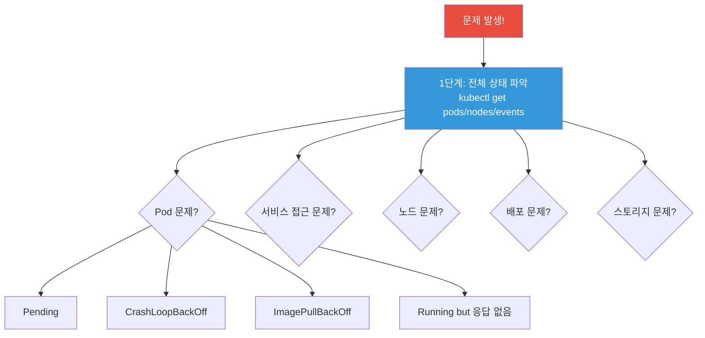
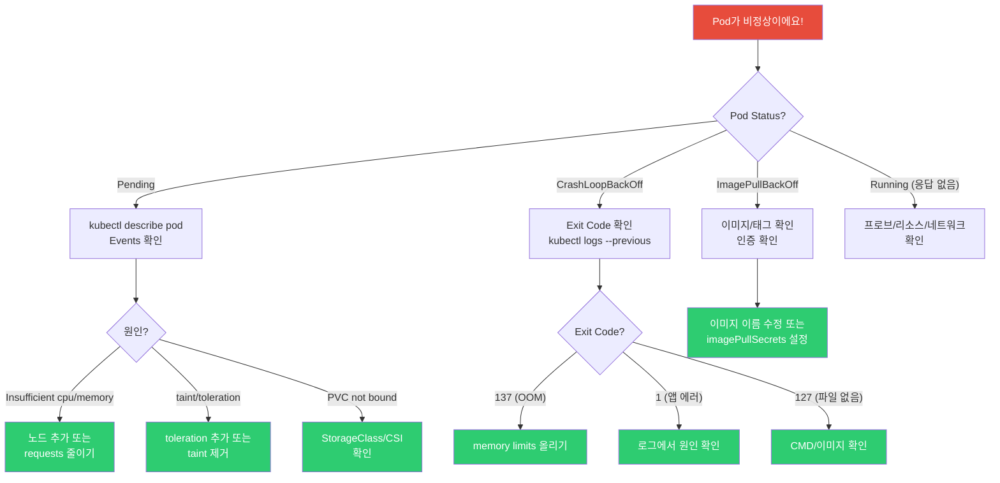
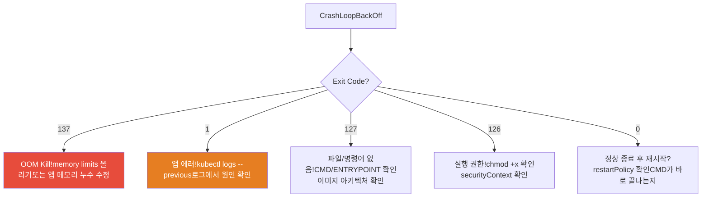
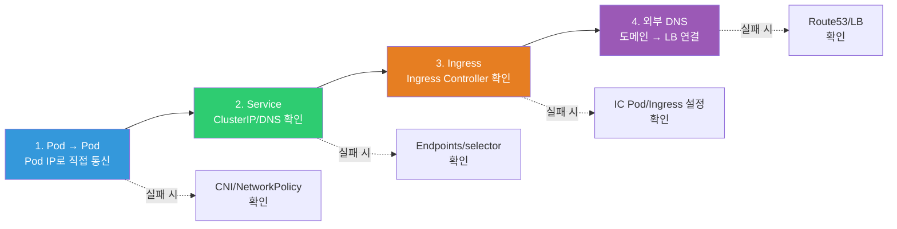

# K8s 트러블슈팅 전체

> 각 강의에서 부분적으로 다뤘던 디버깅을 **한데 모아** 체계적인 프레임워크로 완성해요. [컨테이너 트러블슈팅](../03-containers/08-troubleshooting)에서 Exit Code를, [네트워크 디버깅](../02-networking/08-debugging)에서 5단계 프레임워크를, [kubectl 팁](./13-kubectl-tips)에서 고급 조회를 배웠죠? 이번에는 K8s에서 발생하는 **모든 유형의 장애**를 체계적으로 진단하는 방법이에요.

---

## 🎯 이걸 왜 알아야 하나?

```
K8s 운영에서 가장 시간을 많이 쓰는 게 트러블슈팅:
• "Pod가 Pending이에요"                    → 스케줄링 문제
• "Pod가 CrashLoopBackOff이에요"           → 앱/설정 문제
• "Pod가 Running인데 응답 안 해요"         → 프로브/네트워크 문제
• "배포가 진행이 안 돼요"                  → 롤아웃 문제
• "서비스에 접속이 안 돼요"                → Service/Ingress 문제
• "노드가 NotReady예요"                   → 노드 문제
• "PVC가 Pending이에요"                   → 스토리지 문제
```

---

## 🧠 K8s 트러블슈팅 마스터 프레임워크



### 1단계: 전체 상태 파악 (항상 이것부터!)

```bash
# === 30초 전체 점검 ===

# Pod 상태
kubectl get pods -n production
# NAME        READY   STATUS             RESTARTS   AGE
# myapp-abc   1/1     Running            0          5d     ← 정상
# myapp-def   0/1     CrashLoopBackOff   5          10m    ← 문제!
# myapp-ghi   0/1     Pending            0          5m     ← 문제!

# 노드 상태
kubectl get nodes
# NAME     STATUS     ROLES    AGE   VERSION
# node-1   Ready         30d   v1.28.0
# node-2   NotReady      30d   v1.28.0    ← 문제!

# 최근 이벤트 (⭐ 가장 빠르게 원인 파악!)
kubectl get events -n production --sort-by='.lastTimestamp' | tail -15

# 전체 리소스
kubectl get all -n production
```

---

### Pod 트러블슈팅 의사결정 트리



---

## 🔍 Pod 문제 — Pending

### "스케줄링이 안 돼요!"

```bash
kubectl get pods -n production
# myapp-ghi   0/1   Pending   0   5m

# === 즉시 describe! ===
kubectl describe pod myapp-ghi -n production | grep -A 10 "Events"
# Events:
#   Warning  FailedScheduling  default-scheduler  
#   0/3 nodes are available:
#   2 Insufficient cpu.                    ← 원인 1: CPU 부족!
#   1 node(s) had taint ... NoSchedule.    ← 원인 2: taint!
```

**Pending 원인별 해결:**

```bash
# === 원인 1: 리소스 부족 (가장 흔함!) ===
# "Insufficient cpu" 또는 "Insufficient memory"

# 노드 리소스 확인
kubectl describe node node-1 | grep -A 10 "Allocated resources"
# Allocated resources:
#   CPU Requests: 3500m (89%)    ← 89% 사용! 여유 없음!
#   Memory Requests: 6000Mi (80%)

kubectl top nodes
# NAME     CPU%   MEMORY%
# node-1   85%    78%
# node-2   90%    82%
# node-3   NotReady

# 해결:
# a. 노드 추가 (Cluster Autoscaler/Karpenter — ./10-autoscaling)
# b. Pod의 requests 줄이기 (과도하게 설정한 경우)
# c. 불필요한 Pod 정리
# d. 노드 인스턴스 타입 키우기

# === 원인 2: nodeSelector/affinity 불일치 ===
# "didn't match Pod's node affinity/selector"

kubectl get pod myapp-ghi -o jsonpath='{.spec.nodeSelector}'
# {"disk":"ssd"}    ← disk=ssd 레이블이 있는 노드에만!

kubectl get nodes --show-labels | grep disk
# (없음!) → ssd 레이블이 있는 노드가 없음!

# 해결:
# a. 노드에 레이블 추가: kubectl label node node-1 disk=ssd
# b. nodeSelector 수정/제거

# === 원인 3: taint/toleration ===
# "had taint {key: NoSchedule}"

kubectl describe node node-1 | grep Taints
# Taints: dedicated=gpu:NoSchedule

# Pod에 toleration 추가:
# tolerations:
# - key: "dedicated"
#   operator: "Equal"
#   value: "gpu"
#   effect: "NoSchedule"

# === 원인 4: PVC 바인딩 대기 ===
# "persistentvolumeclaim 'mydata' is not bound"
kubectl get pvc mydata -n production
# STATUS: Pending    ← PVC가 안 붙음!
# → ./07-storage의 PVC 트러블슈팅 참고!
```

---

## 🔍 Pod 문제 — CrashLoopBackOff

### "시작하자마자 죽어요!"

```bash
kubectl get pods
# myapp-def   0/1   CrashLoopBackOff   5   10m
#                                       ^
#                                       5번 재시작!

# === Exit Code 확인 (가장 먼저!) ===
kubectl get pod myapp-def -o jsonpath='{.status.containerStatuses[0].lastState.terminated.exitCode}'
# 137 → OOM Kill! (메모리 초과)
# 1   → 앱 에러 (로그 확인)
# 127 → 파일/명령어 없음 (이미지 확인)
# 126 → 실행 권한 없음

# (../03-containers/08-troubleshooting의 Exit Code 상세 참고!)
```



```bash
# === Exit Code 137: OOM Kill ===
kubectl describe pod myapp-def | grep -i oom
# Last State: Terminated
#   Reason: OOMKilled

# 현재 limits 확인
kubectl get pod myapp-def -o jsonpath='{.spec.containers[0].resources.limits.memory}'
# 256Mi    ← 너무 작나?

# 해결:
# a. memory limits 올리기 (Deployment에서)
# b. VPA 추천값 확인 (./10-autoscaling)
# c. 앱의 메모리 누수 수정 (프로파일링)

# === Exit Code 1: 앱 에러 ===
kubectl logs myapp-def --previous    # ⭐ 이전 실행 로그!
# Error: Cannot find module 'express'
# → npm install이 안 됨! Dockerfile 확인 (../03-containers/03-dockerfile)

# 또는
# Error: ECONNREFUSED 10.0.2.10:5432
# → DB 연결 실패! DB Pod/Service 확인

# 또는
# Error: EACCES: permission denied, open '/app/data/config.json'
# → 파일 권한 문제! securityContext/USER 확인 (../03-containers/09-security)

# === Exit Code 127: 파일 없음 ===
# 이미지의 CMD/ENTRYPOINT가 잘못됨
kubectl get pod myapp-def -o jsonpath='{.spec.containers[0].command}'
# ["/app/nonexistent"]    ← 이 파일이 이미지에 없음!

# 이미지 확인:
kubectl run debug --image=myapp:v1.0 --rm -it --restart=Never --command -- ls -la /app/

# Alpine에서 glibc 바이너리? (../03-containers/06-image-optimization)
# ARM에서 AMD64 바이너리? (멀티 아키텍처 확인)

# === Exit Code 0: 바로 끝남 ===
# CMD가 echo "hello" 같은 즉시 종료 명령어?
# → 웹서버처럼 포그라운드에서 계속 실행되어야 함!
# CMD ["node", "server.js"]    ← foreground로 실행!
```

---

## 🔍 Pod 문제 — ImagePullBackOff

```bash
kubectl get pods
# myapp-xyz   0/1   ImagePullBackOff   0   3m

kubectl describe pod myapp-xyz | grep -A 5 "Events"
# Warning  Failed  Failed to pull image "myapp:v9.9.9":
#   rpc error: code = NotFound desc = failed to pull and unpack image:
#   manifest not found

# (../03-containers/07-registry의 이미지 pull 실패 디버깅 참고!)
```

```bash
# 원인 1: 이미지/태그가 없음
# → 이미지 이름, 태그 오타 확인!
kubectl get pod myapp-xyz -o jsonpath='{.spec.containers[0].image}'
# myapp:v9.9.9    ← 이 태그가 레지스트리에 있나?

# 원인 2: 레지스트리 인증 실패
# → imagePullSecrets 확인 (./04-config-secret)
kubectl get pod myapp-xyz -o jsonpath='{.spec.imagePullSecrets}'
# → 비어있으면 인증 없이 pull 시도!

# 원인 3: 프라이빗 레지스트리 접근 불가
# → ECR 토큰 만료 (12시간!), 네트워크/방화벽

# 원인 4: Docker Hub rate limit
# → 익명 100회/6시간 → ECR Pull Through Cache (../03-containers/07-registry)
```

---

## 🔍 Pod 문제 — Running인데 응답 없음

```bash
kubectl get pods
# myapp-abc   1/1   Running   0   5d    ← Running인데 응답 안 함!

# === 1. 프로브 확인 ===
kubectl describe pod myapp-abc | grep -A 15 "Liveness\|Readiness"
# Liveness: http-get http://:3000/health
#   → 통과하고 있나? 실패하면 재시작됨

# readiness가 실패 중이면:
kubectl get endpoints myapp-service
# ENDPOINTS:     ← 비어있음! 트래픽이 안 감!
# → (./08-healthcheck 참고!)

# === 2. 앱 내부에서 직접 테스트 ===
kubectl exec myapp-abc -- curl -s localhost:3000/health
# → 앱 자체가 응답하는지?

# 응답 없으면:
kubectl exec myapp-abc -- ps aux
# → 앱 프로세스가 살아있는지?
kubectl exec myapp-abc -- top -bn1
# → CPU를 누가 쓰고 있는지?

# === 3. 네트워크 문제 ===
# 다른 Pod에서 접근 테스트
kubectl run test --image=busybox --rm -it --restart=Never -- \
    wget -qO- --timeout=3 http://myapp-abc-ip:3000/health
# → Pod IP로 직접 접근 가능?

# Service를 통해 접근
kubectl run test --image=busybox --rm -it --restart=Never -- \
    wget -qO- --timeout=3 http://myapp-service/health
# → (./05-service-ingress의 Service 디버깅 참고!)

# === 4. 리소스 문제 ===
kubectl top pod myapp-abc
# CPU: 490m/500m (98%!)    ← CPU throttling!
# Memory: 500Mi/512Mi      ← OOM 직전!
# → resources.limits 올리기 (./02-pod-deployment)
```

---

## 🔍 Service/Ingress 문제

### 네트워크 트러블슈팅 흐름



### "서비스에 접속이 안 돼요!"

```bash
# (./05-service-ingress의 디버깅 플로우차트 참고!)

# === 빠른 체크리스트 ===

# 1. Endpoints 확인 (⭐ 가장 먼저!)
kubectl get endpoints myapp-service -n production
# ENDPOINTS:     ← 비어있으면 아래 확인!

# Endpoints가 비어있는 이유:
# a. selector가 맞는 Pod가 없음
kubectl get svc myapp-service -o jsonpath='{.spec.selector}'
# {"app":"myapp"}
kubectl get pods -l app=myapp    # 이 레이블의 Pod가 있나?

# b. Pod가 있지만 Ready가 아님
kubectl get pods -l app=myapp
# myapp-abc   0/1   Running    ← READY 0/1! readinessProbe 실패!

# 2. Service → Pod 직접 테스트
POD_IP=$(kubectl get pod myapp-abc -o jsonpath='{.status.podIP}')
kubectl run test --image=busybox --rm -it --restart=Never -- wget -qO- http://$POD_IP:3000
# → Pod에 직접 접근 되나?

# 3. DNS 확인
kubectl run test --image=busybox --rm -it --restart=Never -- nslookup myapp-service
# → DNS 해석 되나? (../02-networking/12-service-discovery)

# 4. Ingress 확인
kubectl get ingress -n production
# ADDRESS 비어있으면 → Ingress Controller 문제!
kubectl get pods -n ingress-nginx    # IC Pod 상태

# 5. 외부 접근 (Ingress 거치는 전체 경로)
curl -v https://api.example.com/health
# → DNS → LB → Ingress → Service → Pod 어디서 끊기나?
# → (../02-networking/08-debugging의 5단계 프레임워크!)
```

---

## 🔍 노드 문제

### "노드가 NotReady예요!"

```bash
kubectl get nodes
# node-2   NotReady      30d   v1.28.0

# === 1. Conditions 확인 ===
kubectl describe node node-2 | grep -A 15 "Conditions:"
# Type                Status   Reason
# MemoryPressure      True     KubeletHasMemoryPressure    ← 메모리 부족!
# DiskPressure        True     KubeletHasDiskPressure      ← 디스크 부족!
# PIDPressure         False    KubeletHasSufficientPID
# Ready               False    KubeletNotReady

# === 2. 노드에 SSH 접속해서 확인 ===
ssh node-2

# 메모리 (../01-linux/12-performance)
free -h
# total  used   free   available
# 7.8G   7.5G   100M   200M    ← 거의 다 씀!

# 디스크 (../01-linux/07-disk)
df -h /
# /dev/sda1   50G   48G   0   100%    ← 100%!

# kubelet 상태
systemctl status kubelet
# Active: active (running)    ← 살아있긴 함

# kubelet 로그 (핵심!)
sudo journalctl -u kubelet --since "10 min ago" | tail -30
# PLEG is not healthy    ← PLEG(Pod Lifecycle Event Generator) 문제!
# eviction manager: attempting to reclaim memory
# → 메모리 부족으로 Pod를 퇴거(evict) 중!

# containerd 상태 (../03-containers/04-runtime)
systemctl status containerd
sudo crictl ps

# === 3. 해결 ===
# 메모리 부족:
# → 불필요한 프로세스 종료
# → Docker/containerd 이미지 정리: sudo crictl rmi --prune
# → 노드 인스턴스 타입 키우기

# 디스크 부족:
# → Docker 이미지/로그 정리
sudo crictl rmi --prune
sudo find /var/log -name "*.log" -size +100M -exec truncate -s 0 {} \;
# → /var/lib/containerd 정리
# → 노드 EBS 볼륨 크기 늘리기

# kubelet 재시작:
sudo systemctl restart kubelet
# → 잠시 후 NotReady → Ready
```

### "노드에서 Pod가 계속 Evicted"

```bash
kubectl get pods -A --field-selector=status.phase=Failed | grep Evicted
# myapp-abc   0/1   Evicted   0   5m
# myapp-def   0/1   Evicted   0   3m

# 원인: kubelet이 리소스 부족으로 Pod를 퇴거
# → 메모리/디스크 부족 시 우선순위 낮은 Pod부터 퇴거

# Evicted Pod 정리
kubectl get pods -A --field-selector=status.phase=Failed -o name | xargs kubectl delete

# 근본 해결:
# → 노드 리소스 모니터링 (Prometheus — 08-observability)
# → 리소스 부족 시 알림 → 노드 추가 또는 Pod 정리
# → Pod resources.requests 적절히 설정 (./02-pod-deployment)
```

---

## 🔍 배포 문제

### "롤아웃이 진행 안 돼요!"

```bash
kubectl rollout status deployment/myapp -n production
# Waiting for deployment "myapp" rollout to finish: 1 out of 3 new replicas...
# → 5분째 진행 안 됨!

# === 1. 새 Pod 상태 확인 ===
kubectl get pods -l app=myapp -n production
# myapp-new-abc   0/1   Running       0   5m     ← Ready 0/1!
# myapp-old-def   1/1   Running       0   1d     ← 이전 버전 정상

# 새 Pod가 Ready 안 되는 이유?
kubectl describe pod myapp-new-abc | tail -15
# Warning  Unhealthy  Readiness probe failed: connection refused
# → 새 버전의 앱이 /ready에 응답 안 함!

# === 2. 새 Pod 로그 확인 ===
kubectl logs myapp-new-abc
# Error: DATABASE_URL is not defined
# → 환경 변수 누락! ConfigMap/Secret 확인 (./04-config-secret)

# === 3. 롤백! ===
kubectl rollout undo deployment/myapp -n production
# → 이전 안정 버전으로 즉시 복구!
# → (./09-operations)

# === 4. 수정 후 재배포 ===
# 환경 변수 추가 → 이미지 수정/배포 재시도
```

### "helm upgrade가 실패했어요"

```bash
helm list -n production
# NAME    REVISION   STATUS   CHART
# myapp   3          failed   myapp-1.2.0    ← failed!

# 히스토리 확인
helm history myapp -n production
# REVISION   STATUS       DESCRIPTION
# 1          superseded   Install complete
# 2          deployed     Upgrade complete    ← 이전 성공 버전
# 3          failed       Upgrade "myapp" failed

# 롤백
helm rollback myapp 2 -n production
# Rollback was a success!
# → (./12-helm-kustomize)

# 실패 원인 확인
helm get manifest myapp -n production | kubectl apply --dry-run=server -f -
# → 어떤 리소스가 실패하는지 확인
```

---

## 🔍 스토리지 문제

### "PVC가 Pending이에요!"

```bash
kubectl get pvc -n production
# NAME       STATUS    STORAGECLASS   CAPACITY   AGE
# mydata     Pending   gp3                5m

kubectl describe pvc mydata | tail -10
# Events:
#   Warning  ProvisioningFailed  ...

# (./07-storage의 PVC 트러블슈팅 상세 참고!)

# 빠른 체크:
# 1. StorageClass가 있나?
kubectl get storageclass

# 2. CSI 드라이버가 설치되었나?
kubectl get pods -n kube-system | grep csi

# 3. volumeBindingMode가 WaitForFirstConsumer인데 Pod가 안 뜬 건 아닌지?
kubectl get sc gp3 -o jsonpath='{.volumeBindingMode}'
# WaitForFirstConsumer → Pod가 스케줄되어야 PV 생성!

# 4. IAM 권한 (EBS CSI)
kubectl logs -n kube-system -l app=ebs-csi-controller --tail 10
# UnauthorizedOperation → IAM Role에 ec2:CreateVolume 필요!
```

---

## 🔍 DNS 문제

### "서비스 이름으로 접근이 안 돼요"

```bash
# (../02-networking/12-service-discovery의 CoreDNS 트러블슈팅 상세 참고!)

# 1. CoreDNS Pod 상태
kubectl get pods -n kube-system -l k8s-app=kube-dns
# coredns-xxx   1/1   Running    ← 살아있나?

# 2. DNS 직접 테스트
kubectl run test --image=busybox --rm -it --restart=Never -- nslookup myapp-service
# Server: 10.96.0.10
# Name: myapp-service
# Address: 10.96.100.50    ← 해석 됨!
# 또는
# ** server can't find myapp-service: NXDOMAIN    ← 해석 안 됨!

# 3. Service가 있는지 확인
kubectl get svc myapp-service
# → 없으면 당연히 DNS도 안 됨!

# 4. 다른 네임스페이스면 FQDN 필요!
nslookup myapp-service.other-namespace.svc.cluster.local

# 5. 외부 DNS는 되는지?
kubectl run test --image=busybox --rm -it --restart=Never -- nslookup google.com
# 안 되면 → CoreDNS의 forward 설정 또는 노드 DNS 문제

# 6. NetworkPolicy가 DNS(53 포트)를 차단?
# → (./06-cni → 15-security의 NetworkPolicy 참고!)
```

---

## 🔍 RBAC 문제

### "Forbidden이에요!"

```bash
kubectl get pods -n production
# Error from server (Forbidden): pods is forbidden:
# User "dev@example.com" cannot list resource "pods" in namespace "production"

# (./11-rbac의 Forbidden 디버깅 참고!)

# 빠른 체크:
# 1. 현재 사용자
kubectl config current-context
kubectl whoami    # krew whoami 플러그인

# 2. 권한 확인
kubectl auth can-i list pods -n production
# no

kubectl auth can-i --list -n production
# → 가진 권한 전체 목록

# 3. RoleBinding 확인
kubectl get rolebindings -n production -o wide

# 4. EKS aws-auth 확인
kubectl get cm aws-auth -n kube-system -o yaml | grep -A 5 $(kubectl whoami 2>/dev/null || echo "user")
```

---

## 💻 실습 예제

### 실습 1: 종합 트러블슈팅 연습

```bash
# 일부러 여러 문제를 만들고 진단하기!

# 문제 1: 이미지 없음
kubectl create deployment broken1 --image=nginx:nonexistent
sleep 5
kubectl get pods -l app=broken1
# STATUS: ErrImagePull

kubectl describe pod -l app=broken1 | grep "Failed"
# Failed to pull image "nginx:nonexistent": ... not found

# 해결
kubectl set image deployment/broken1 nginx=nginx:1.25

# 문제 2: 리소스 부족으로 Pending
kubectl apply -f - << 'EOF'
apiVersion: apps/v1
kind: Deployment
metadata:
  name: broken2
spec:
  replicas: 1
  selector:
    matchLabels:
      app: broken2
  template:
    metadata:
      labels:
        app: broken2
    spec:
      containers:
      - name: app
        image: nginx
        resources:
          requests:
            cpu: "100"        # 100 코어! 불가능!
            memory: "100Gi"
EOF

sleep 5
kubectl get pods -l app=broken2
# STATUS: Pending

kubectl describe pod -l app=broken2 | grep "FailedScheduling"
# 0/3 nodes are available: 3 Insufficient cpu

# 해결
kubectl patch deployment broken2 -p '{"spec":{"template":{"spec":{"containers":[{"name":"app","resources":{"requests":{"cpu":"100m","memory":"128Mi"}}}]}}}}'

# 문제 3: CrashLoopBackOff (CMD 오류)
kubectl apply -f - << 'EOF'
apiVersion: v1
kind: Pod
metadata:
  name: broken3
spec:
  containers:
  - name: app
    image: busybox
    command: ["/nonexistent"]
  restartPolicy: Always
EOF

sleep 15
kubectl get pod broken3
# STATUS: CrashLoopBackOff

kubectl describe pod broken3 | grep "Exit Code"
# Exit Code: 127    ← 파일 없음!

# 정리
kubectl delete deployment broken1 broken2
kubectl delete pod broken3
```

### 실습 2: 빠른 진단 루틴 연습

```bash
# 60초 진단 루틴을 스크립트로!

cat << 'SCRIPT' > /tmp/k8s-diagnose.sh
#!/bin/bash
NS="${1:-default}"
echo "=== 네임스페이스: $NS ==="
echo ""

echo "--- Pod 상태 ---"
kubectl get pods -n $NS | grep -v "Running\|Completed" | grep -v "NAME" || echo "모두 정상! ✅"
echo ""

echo "--- 재시작 많은 Pod ---"
kubectl get pods -n $NS -o custom-columns=NAME:.metadata.name,RESTARTS:.status.containerStatuses[0].restartCount 2>/dev/null | awk 'NR>1 && $2>2'
echo ""

echo "--- 최근 Warning 이벤트 ---"
kubectl get events -n $NS --field-selector type=Warning --sort-by='.lastTimestamp' 2>/dev/null | tail -5
echo ""

echo "--- Endpoints 확인 ---"
kubectl get endpoints -n $NS 2>/dev/null | awk '$2 == "" || $2 == "" {print "⚠️ " $1 " — Endpoints 비어있음!"}'
echo ""

echo "--- 노드 상태 ---"
kubectl get nodes | grep -v Ready | grep -v NAME || echo "노드 모두 Ready ✅"
echo ""

echo "=== 진단 완료 ==="
SCRIPT

chmod +x /tmp/k8s-diagnose.sh
/tmp/k8s-diagnose.sh production
```

---

## 🏢 실무에서는?

### 시나리오 1: 금요일 오후 5시, 전체 서비스 장애

```bash
# Slack 알림: "프로덕션 API 전부 502입니다!"
# 심장이 쿵. 일단 침착하게 30초 진단부터!

# 1단계: 전체 파악 (10초)
kubectl get nodes
# node-1   Ready
# node-2   Ready
# node-3   NotReady    ← 노드 하나 죽음!

kubectl get pods -n production | grep -v Running
# myapp-abc   0/1   Pending        ← node-3에 있던 Pod!
# myapp-def   0/1   Pending
# payment-a   0/1   Pending        ← 결제 서비스까지!

# 2단계: 원인 (20초)
kubectl describe node node-3 | grep -A 5 "Conditions"
# MemoryPressure: True
# Ready: False — kubelet stopped posting node status

# 3단계: 즉시 대응 (2분)
# → Pending Pod들이 다른 노드에 못 뜨는 이유?
kubectl describe pod myapp-abc | grep FailedScheduling
# "Insufficient memory" — 나머지 노드도 리소스 빡빡!

# → 긴급: 불필요한 Pod 줄이거나 노드 추가
kubectl scale deployment monitoring-heavy --replicas=0 -n production  # 임시 축소
# → 5분 후 Pending Pod들이 Running으로!

# 4단계: 근본 해결 (사후)
# → Cluster Autoscaler가 왜 안 떴나? → max 노드 수 제한이었음
# → 노드 3대 → max 5대로 변경
# → 메모리 알림 임계값 추가 (80%에서 경고)
```

### 시나리오 2: 배포 후 에러율 급증

```bash
# 모니터링: "5xx 에러율 0.1% → 15%로 급증!"
# 10분 전에 v2.3.0 배포했음

# 1단계: 새 Pod 상태 확인
kubectl get pods -l app=api-server -n production
# api-server-new-xxx   1/1   Running   0   10m   ← Running이긴 한데...
# api-server-new-yyy   1/1   Running   0   10m
# api-server-old-zzz   1/1   Running   0   3d    ← 아직 이전 버전도 있음

# 2단계: 새 Pod 로그에서 에러 패턴
kubectl logs -l app=api-server --since=10m | grep -i error | head -5
# Error: Redis connection timeout
# Error: ETIMEDOUT 10.0.5.20:6379
# → Redis 연결 문제! 새 버전에서 Redis 설정이 바뀌었나?

# 3단계: 즉시 롤백! (고객 영향 최소화가 우선)
kubectl rollout undo deployment/api-server -n production
# → 30초 후 이전 버전으로 복구, 에러율 0.1%로 복귀

# 4단계: 원인 분석 (롤백 후 여유 있게)
# → v2.3.0에서 Redis 연결 풀 설정이 변경됨
# → 스테이징에서는 Redis가 같은 AZ라 문제 없었지만
# → 프로덕션은 cross-AZ라 timeout이 짧아서 실패
# → 수정: timeout 값 조정 후 v2.3.1 재배포
```

### 시나리오 3: 새벽 3시 PagerDuty — Pod 반복 재시작

```bash
# 알림: "api-worker Pod가 30분간 15번 재시작"

# 1단계: 패턴 확인
kubectl get pod api-worker-xxx -n production -o jsonpath='{.status.containerStatuses[0].restartCount}'
# 15

# Exit Code 확인
kubectl get pod api-worker-xxx -o jsonpath='{.status.containerStatuses[0].lastState.terminated}'
# {"exitCode":137,"reason":"OOMKilled"}    ← 메모리!

# 2단계: 메모리 사용량 추이
kubectl top pod api-worker-xxx
# MEMORY: 490Mi/512Mi    ← limits에 거의 도달!

# 3단계: 임시 조치 (새벽이니까 빠르게!)
kubectl patch deployment api-worker -n production \
  -p '{"spec":{"template":{"spec":{"containers":[{"name":"worker","resources":{"limits":{"memory":"1Gi"}}}]}}}}'
# → limits 512Mi → 1Gi로 올려서 재시작 멈춤

# 4단계: 다음 날 근본 원인
# → 특정 시간대에 대량 메시지 처리 → 메모리 급증
# → 배치 크기 조정 + VPA 설정으로 자동 조절
```

---

## ⚠️ 자주 하는 실수

### 1. describe 안 보고 로그부터 뒤지기

```bash
# ❌ Pending인데 로그부터 보려고 함
kubectl logs pending-pod
# Error: container "app" in pod "pending-pod" is waiting to start

# ✅ Pending/ImagePull 등은 describe의 Events가 답!
kubectl describe pod pending-pod | grep -A 10 "Events"
# → 스케줄링 실패 이유가 바로 나옴!

# 규칙:
# Running → kubectl logs
# 그 외 → kubectl describe
```

### 2. --previous 플래그를 모르고 "로그가 없어요"

```bash
# ❌ CrashLoopBackOff Pod의 현재 로그 (재시작 직후라 비어있음)
kubectl logs crashing-pod
# (빈 출력 또는 시작 로그만)

# ✅ 이전 실행(크래시 직전) 로그!
kubectl logs crashing-pod --previous
# Error: Cannot connect to database
# → 진짜 원인!
```

### 3. 네임스페이스 빼먹기

```bash
# ❌ "Pod가 없어요!"
kubectl get pods
# No resources found in default namespace.

# ✅ 네임스페이스 지정!
kubectl get pods -n production
# myapp-abc   1/1   Running

# 팁: 자주 쓰는 네임스페이스 기본값 설정
kubectl config set-context --current --namespace=production
```

### 4. 롤백 안 하고 디버깅에 시간 쏟기

```bash
# ❌ 프로덕션 장애 중에 원인 분석에 30분...
# → 고객은 계속 에러를 보고 있음!

# ✅ 먼저 롤백 → 복구 확인 → 그 다음 원인 분석!
kubectl rollout undo deployment/myapp -n production  # 30초 복구
# → 여유 있게 원인 파악

# 실무 원칙: MTTR(복구 시간) > MTTD(진단 시간)
# "왜 죽었는지"보다 "빨리 살리기"가 먼저!
```

### 5. 임시 디버그 리소스 안 지우기

```bash
# ❌ 디버깅하다 남긴 Pod들이 쌓임
kubectl get pods -n production
# debug-test-1   1/1   Running   0   7d     ← 일주일 전 디버그!
# busybox-temp   1/1   Running   0   3d
# curl-test      1/1   Running   0   5d

# ✅ --rm 플래그로 자동 삭제!
kubectl run test --image=busybox --rm -it --restart=Never -- nslookup myapp
# → 종료하면 자동 삭제!

# 이미 남아있는 것 정리:
kubectl delete pod -l run=test -n production
kubectl delete pod -l run=debug -n production
```

---

## 📝 정리

### 증상 → 원인 → 해결 빠른 참조

```
Pending
  → FailedScheduling + Insufficient cpu/memory → 노드 추가/requests 줄이기
  → FailedScheduling + taint                   → toleration 추가
  → FailedScheduling + node selector           → 레이블 확인
  → PVC not bound                              → StorageClass/CSI 확인

CrashLoopBackOff
  → Exit 137 (OOM)     → memory limits 올리기
  → Exit 1 (앱 에러)   → logs --previous 확인
  → Exit 127 (파일없음) → CMD/이미지 확인
  → Exit 126 (권한없음) → chmod/securityContext

ImagePullBackOff
  → manifest not found  → 이미지/태그 오타
  → unauthorized        → imagePullSecrets/인증
  → too many requests   → Docker Hub rate limit

Running but 응답 없음
  → readiness 실패     → Endpoints에서 빠짐 → 프로브 확인
  → CPU throttling     → resources.limits.cpu
  → 앱 교착 상태       → liveness가 감지 → 재시작

Service 접근 불가
  → Endpoints <none>    → selector/readiness 확인
  → DNS 안 됨          → CoreDNS 확인
  → Ingress ADDRESS 없음 → Ingress Controller 확인

노드 NotReady
  → MemoryPressure     → 메모리 정리/확장
  → DiskPressure       → 디스크 정리/확장
  → kubelet 죽음       → systemctl restart kubelet
```

### 진단 명령어 치트시트

```bash
# 전체 상태
kubectl get pods/nodes/events -n NS

# Pod 진단
kubectl describe pod NAME                    # 이벤트!
kubectl logs NAME [--previous]               # 로그
kubectl get pod NAME -o jsonpath='{.status.containerStatuses[0].lastState.terminated.exitCode}'

# Service 진단
kubectl get endpoints NAME                   # 비었나?
kubectl get pods -l app=NAME                 # selector 매칭?

# 노드 진단
kubectl describe node NAME                   # Conditions
ssh NODE && journalctl -u kubelet --tail 30  # kubelet 로그

# 리소스
kubectl top pods/nodes
kubectl describe node NAME | grep Allocated

# 네트워크
kubectl run test --image=busybox --rm -it -- nslookup SERVICE
kubectl run test --image=busybox --rm -it -- wget -qO- http://SERVICE

# RBAC
kubectl auth can-i VERB RESOURCE [-n NS]
```

---

## 🔗 다음 강의

다음은 **[15-security](./15-security)** — NetworkPolicy / PSS / OPA / Falco 이에요.

트러블슈팅으로 문제를 고치는 법을 배웠으니, 이제 문제를 **예방**하는 보안을 배워볼게요. [RBAC](./11-rbac)에서 "누가 뭘 할 수 있는지"를 배웠고, 이번에는 "Pod가 무엇을 할 수 있는지"를 제어하는 NetworkPolicy, Pod Security Standards, 정책 엔진(OPA), 런타임 보안(Falco)을 다뤄요.