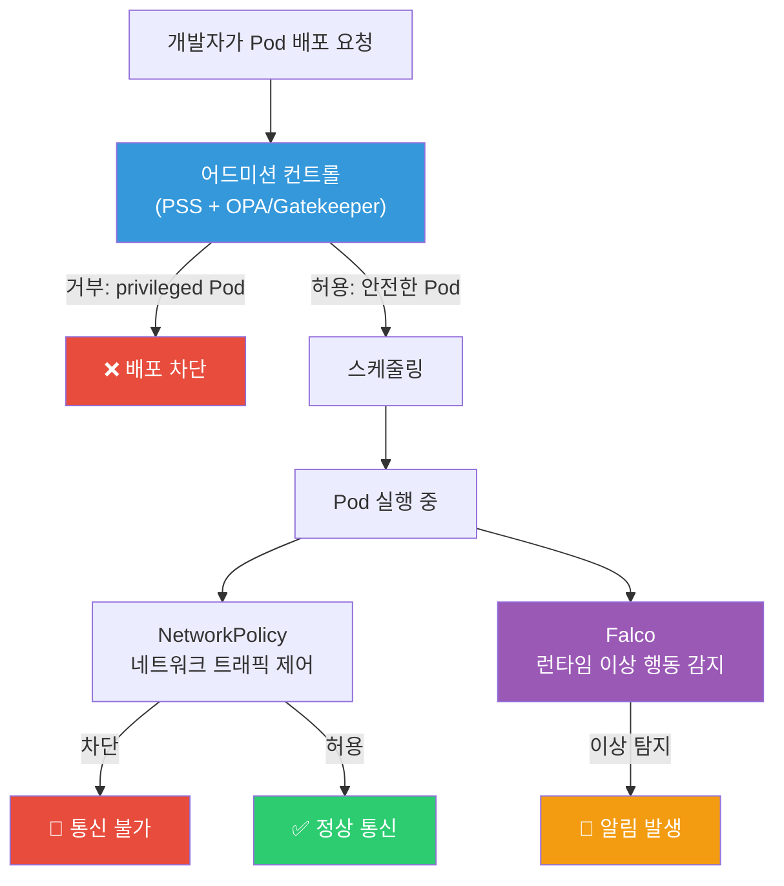
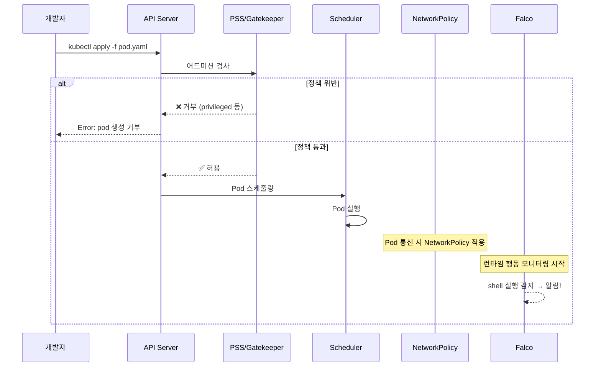
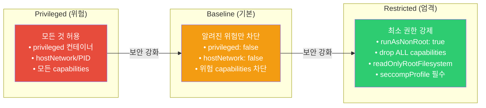
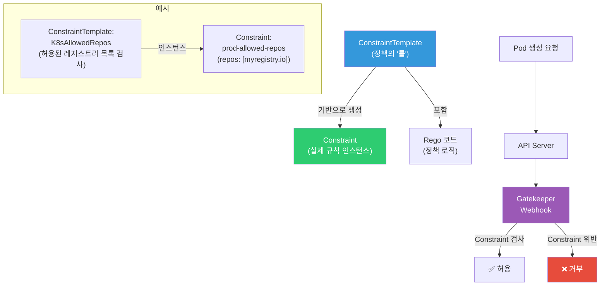
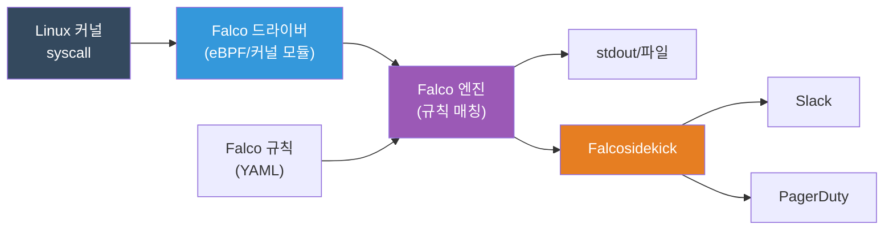

# NetworkPolicy / PSS / OPA / Falco

> [RBAC](./11-rbac)에서 "누가 무엇을 할 수 있는지"를 배웠고, [컨테이너 보안](../03-containers/09-security)에서 이미지 취약점 스캔을 배웠죠? 이번에는 **클러스터 내부 트래픽 제어**(NetworkPolicy), **Pod 실행 제한**(PSS), **정책 자동 강제**(OPA/Gatekeeper), **런타임 위협 탐지**(Falco)까지 — K8s 보안의 나머지 퍼즐을 완성해요.

---

## 🎯 이걸 왜 알아야 하나?

```
실무에서 K8s 보안을 모르면 생기는 일:
• Pod 하나 뚫리면 클러스터 전체가 위험         → NetworkPolicy 없으면 횡이동(lateral movement) 자유
• 누군가 privileged 컨테이너 배포              → 노드 root 권한 탈취 가능
• latest 태그 이미지가 프로덕션에 배포됨        → 어떤 버전인지 추적 불가
• 컨테이너 안에서 shell 실행, 파일 변조         → 빌드/배포 시점 검사로는 못 잡음
• 보안 감사: "네트워크 격리 정책 보여주세요"    → 답변 못 하면 감사 실패
• 규정 준수: PCI-DSS, ISMS — 접근 제어 증명 필요
```

K8s 보안은 4개 계층으로 나눠서 생각해요:

| 계층 | 도구 | 역할 |
|------|------|------|
| **네트워크** | NetworkPolicy | Pod 간 트래픽 허용/차단 |
| **어드미션** | PSS, OPA/Gatekeeper | 위험한 Pod 생성 자체를 막음 |
| **런타임** | Falco | 실행 중 이상 행동 탐지 |
| **권한** | [RBAC](./11-rbac) | 누가 무엇을 할 수 있는지 |

---

## 🧠 핵심 개념

### 비유: 아파트 단지 보안 시스템

K8s 클러스터를 **아파트 단지**로 비유하면:

* **NetworkPolicy** = 동(棟) 간 출입문 + CCTV. "101동 사람만 102동 헬스장 출입 가능"
* **PSS (Pod Security Standards)** = 입주 규정. "폭죽, 위험물 반입 금지" — 입주 시 검사
* **OPA/Gatekeeper** = 관리사무소 세부 규칙. "반려동물은 소형견만", "오토바이 주차 금지" — 입주 규정보다 더 세밀한 커스텀 규칙
* **Falco** = 24시간 순찰 경비원. 이미 입주한 후에도 "새벽 3시에 비상구 열림", "옥상 출입" 같은 이상 행동 감지

### K8s 보안 4계층 구조



### 보안 적용 시점



---

## 🔍 상세 설명

### 1. NetworkPolicy — Pod 간 트래픽 제어

[CNI](./06-cni)에서 배운 것처럼, 기본적으로 K8s의 모든 Pod는 서로 자유롭게 통신해요. NetworkPolicy는 이 "기본 허용"을 **화이트리스트 방식**으로 바꿔주는 방화벽이에요.

#### 핵심 원리

```
NetworkPolicy 없음  → 모든 Pod 간 통신 허용 (기본값)
NetworkPolicy 있음  → 해당 Pod는 명시적으로 허용된 것만 통신 가능
```

**중요**: NetworkPolicy는 [CNI 플러그인](./06-cni)이 지원해야 작동해요!

| CNI | NetworkPolicy 지원 |
|-----|-------------------|
| **Calico** | 완전 지원 (L3/L4) |
| **Cilium** | 완전 지원 (L3/L4/L7) |
| **AWS VPC CNI** | Calico 추가 설치 필요 |
| **Flannel** | 미지원! |

#### Default Deny All — 가장 먼저 적용할 정책

```yaml
# default-deny-all.yaml
# 네임스페이스 내 모든 Pod의 인바운드/아웃바운드 차단
apiVersion: networking.k8s.io/v1
kind: NetworkPolicy
metadata:
  name: default-deny-all
  namespace: production
spec:
  podSelector: {}          # {} = 이 네임스페이스의 모든 Pod
  policyTypes:
    - Ingress              # 들어오는 트래픽 차단
    - Egress               # 나가는 트래픽 차단
```

```bash
kubectl apply -f default-deny-all.yaml
# networkpolicy.networking.k8s.io/default-deny-all created

kubectl get networkpolicy -n production
# NAME               POD-SELECTOR   AGE
# default-deny-all   <none>         5s
```

이 정책을 적용하면 **모든 통신이 차단**돼요. 여기서부터 필요한 것만 하나씩 열어주는 게 보안의 기본이에요.

#### Ingress 규칙 — 들어오는 트래픽 허용

```yaml
# allow-frontend-to-backend.yaml
# frontend Pod에서 backend Pod로의 80포트 통신만 허용
apiVersion: networking.k8s.io/v1
kind: NetworkPolicy
metadata:
  name: allow-frontend-to-backend
  namespace: production
spec:
  podSelector:
    matchLabels:
      app: backend           # 이 정책이 적용될 대상: backend Pod
  policyTypes:
    - Ingress
  ingress:
    - from:
        - podSelector:
            matchLabels:
              app: frontend  # frontend 라벨이 있는 Pod에서만
      ports:
        - protocol: TCP
          port: 8080         # 8080 포트만 허용
```

#### Egress 규칙 — DNS 허용은 필수!

Default deny를 걸면 **DNS(53번 포트)도 차단**돼요. DNS 없이는 서비스 디스커버리가 안 되기 때문에 반드시 열어줘야 해요.

```yaml
# allow-dns.yaml
# 모든 Pod에서 DNS 조회 허용 (kube-dns/CoreDNS)
apiVersion: networking.k8s.io/v1
kind: NetworkPolicy
metadata:
  name: allow-dns
  namespace: production
spec:
  podSelector: {}            # 모든 Pod
  policyTypes:
    - Egress
  egress:
    - to:
        - namespaceSelector:
            matchLabels:
              kubernetes.io/metadata.name: kube-system
          podSelector:
            matchLabels:
              k8s-app: kube-dns
      ports:
        - protocol: UDP
          port: 53
        - protocol: TCP
          port: 53
```

#### namespaceSelector — 다른 네임스페이스에서 접근 허용

```yaml
# allow-monitoring-namespace.yaml
# monitoring 네임스페이스의 Prometheus가 메트릭 수집 가능하도록
apiVersion: networking.k8s.io/v1
kind: NetworkPolicy
metadata:
  name: allow-monitoring
  namespace: production
spec:
  podSelector:
    matchLabels:
      app: backend
  policyTypes:
    - Ingress
  ingress:
    - from:
        - namespaceSelector:
            matchLabels:
              kubernetes.io/metadata.name: monitoring
          podSelector:
            matchLabels:
              app: prometheus
      ports:
        - protocol: TCP
          port: 9090          # 메트릭 포트
```

#### NetworkPolicy 확인 명령어

```bash
# 현재 적용된 정책 확인
kubectl get networkpolicy -n production
# NAME                        POD-SELECTOR   AGE
# default-deny-all            <none>         10m
# allow-frontend-to-backend   app=backend    8m
# allow-dns                   <none>         9m
# allow-monitoring            app=backend    5m

# 상세 확인
kubectl describe networkpolicy allow-frontend-to-backend -n production
# Name:         allow-frontend-to-backend
# Namespace:    production
# Created on:   2026-03-13 10:00:00
# Labels:       <none>
# Spec:
#   PodSelector:     app=backend
#   Allowing ingress traffic:
#     To Port: 8080/TCP
#     From:
#       PodSelector: app=frontend
#   Not affecting egress traffic

# 통신 테스트 (임시 Pod에서)
kubectl run test-curl --rm -it --image=curlimages/curl \
  -n production -- curl -s -o /dev/null -w "%{http_code}" \
  http://backend-svc:8080/health
# 200  ← frontend 라벨이 없으면 차단됨
```

#### Calico vs Cilium NetworkPolicy 차이

```yaml
# Calico 확장: GlobalNetworkPolicy (클러스터 전체 범위)
apiVersion: projectcalico.org/v3
kind: GlobalNetworkPolicy
metadata:
  name: deny-external-egress
spec:
  selector: all()
  types:
    - Egress
  egress:
    - action: Deny
      destination:
        notNets:
          - 10.0.0.0/8       # 클러스터 내부만 허용
          - 172.16.0.0/12
```

```yaml
# Cilium 확장: L7(HTTP) 레벨 필터링 가능!
apiVersion: cilium.io/v2
kind: CiliumNetworkPolicy
metadata:
  name: l7-rule
  namespace: production
spec:
  endpointSelector:
    matchLabels:
      app: backend
  ingress:
    - fromEndpoints:
        - matchLabels:
            app: frontend
      toPorts:
        - ports:
            - port: "8080"
              protocol: TCP
          rules:
            http:                    # L7 필터링!
              - method: "GET"
                path: "/api/v1/.*"   # GET /api/v1/* 만 허용
```

---

### 2. Pod Security Standards (PSS) — Pod 실행 제한

PSS는 **Pod가 얼마나 위험한 권한으로 실행될 수 있는지**를 3단계로 제한하는 표준이에요. K8s 1.25부터 기본 내장된 `PodSecurity` 어드미션 컨트롤러로 적용해요.

> 이전의 PodSecurityPolicy(PSP)는 K8s 1.25에서 완전 제거됐어요. PSS가 후속이에요.

#### 3단계 보안 수준



| 수준 | 대상 | 주요 제한 |
|------|------|----------|
| **Privileged** | 시스템 컴포넌트 (kube-system) | 제한 없음 |
| **Baseline** | 대부분의 워크로드 | privileged, hostNetwork, 위험 capabilities 차단 |
| **Restricted** | 보안 민감 워크로드 | root 실행 금지, 읽기 전용 파일시스템, seccomp 필수 |

#### Namespace Label로 적용

PSS는 네임스페이스에 라벨을 붙여서 적용해요. 3가지 모드가 있어요:

| 모드 | 동작 | 용도 |
|------|------|------|
| **enforce** | 위반 시 Pod 생성 **거부** | 프로덕션 |
| **audit** | 위반 시 감사 로그에 **기록** (Pod는 생성됨) | 마이그레이션 중간 단계 |
| **warn** | 위반 시 사용자에게 **경고** 표시 (Pod는 생성됨) | 개발 환경 |

```bash
# production 네임스페이스에 Baseline enforce + Restricted warn 적용
kubectl label namespace production \
  pod-security.kubernetes.io/enforce=baseline \
  pod-security.kubernetes.io/enforce-version=latest \
  pod-security.kubernetes.io/warn=restricted \
  pod-security.kubernetes.io/warn-version=latest
# namespace/production labeled

# 확인
kubectl get namespace production --show-labels
# NAME         STATUS   AGE   LABELS
# production   Active   30d   pod-security.kubernetes.io/enforce=baseline,
#                             pod-security.kubernetes.io/warn=restricted,...
```

#### PSS 위반 테스트

```bash
# privileged Pod 생성 시도 (Baseline에서 차단됨)
kubectl run test-priv --image=nginx \
  --overrides='{"spec":{"containers":[{"name":"test","image":"nginx","securityContext":{"privileged":true}}]}}' \
  -n production
# Error from server (Forbidden): pods "test-priv" is forbidden:
# violates PodSecurity "baseline:latest":
# privileged (container "test" must not set securityContext.privileged=true)

# Restricted 경고 확인 (warn 모드)
kubectl run test-root --image=nginx -n production
# Warning: would violate PodSecurity "restricted:latest":
# allowPrivilegeEscalation != false
# unrestricted capabilities
# runAsNonRoot != true
# seccompProfile
# pod/test-root created   ← warn이므로 생성은 됨
```

#### Restricted 수준에 맞는 Pod 스펙

```yaml
# secure-pod.yaml
# Restricted PSS를 만족하는 안전한 Pod
apiVersion: v1
kind: Pod
metadata:
  name: secure-app
  namespace: production
spec:
  securityContext:
    runAsNonRoot: true           # root 실행 금지
    runAsUser: 1000              # UID 1000으로 실행
    runAsGroup: 1000
    fsGroup: 1000
    seccompProfile:
      type: RuntimeDefault       # seccomp 프로파일 필수
  containers:
    - name: app
      image: myregistry.io/app:v1.2.3   # 태그 명시
      securityContext:
        allowPrivilegeEscalation: false  # 권한 상승 금지
        readOnlyRootFilesystem: true     # 읽기 전용 파일시스템
        capabilities:
          drop:
            - ALL                        # 모든 capabilities 제거
      volumeMounts:
        - name: tmp
          mountPath: /tmp                # 쓰기 필요한 곳만 별도 볼륨
  volumes:
    - name: tmp
      emptyDir: {}
```

#### 마이그레이션 전략 (점진적 적용)

```bash
# 1단계: audit/warn으로 먼저 영향 파악 (프로덕션에 바로 enforce 금지!)
kubectl label namespace production \
  pod-security.kubernetes.io/audit=baseline \
  pod-security.kubernetes.io/warn=baseline

# 2단계: 감사 로그 확인 — 어떤 Pod가 위반하는지 파악
kubectl get events -n production --field-selector reason=FailedCreate

# 3단계: 위반 Pod들의 securityContext 수정

# 4단계: enforce 적용
kubectl label namespace production \
  pod-security.kubernetes.io/enforce=baseline \
  --overwrite

# 5단계: Restricted로 올리기 (같은 과정 반복)
kubectl label namespace production \
  pod-security.kubernetes.io/warn=restricted \
  --overwrite
```

---

### 3. OPA/Gatekeeper — 커스텀 정책 엔진

PSS는 "Pod 보안"에 특화된 표준이에요. 하지만 실무에서는 이런 규칙도 필요하죠:

* "이미지는 반드시 회사 내부 레지스트리에서만 가져와야 해요"
* "`latest` 태그는 금지예요"
* "모든 리소스에 `team` 라벨이 있어야 해요"
* "Ingress에 TLS 설정이 반드시 있어야 해요"

이런 **커스텀 정책**은 PSS로 못 해요. OPA(Open Policy Agent) + Gatekeeper가 필요해요.

#### 구조: ConstraintTemplate + Constraint



#### Gatekeeper 설치

```bash
# Gatekeeper 설치 (Helm)
helm repo add gatekeeper https://open-policy-agent.github.io/gatekeeper/charts
helm install gatekeeper gatekeeper/gatekeeper \
  --namespace gatekeeper-system \
  --create-namespace

# 설치 확인
kubectl get pods -n gatekeeper-system
# NAME                                            READY   STATUS    RESTARTS   AGE
# gatekeeper-audit-7c84869dbf-xxxxx               1/1     Running   0          60s
# gatekeeper-controller-manager-6bcc7f8fb5-xxxxx  1/1     Running   0          60s
# gatekeeper-controller-manager-6bcc7f8fb5-yyyyy  1/1     Running   0          60s
```

#### 예시 1: 허용된 이미지 레지스트리만 사용

```yaml
# constraint-template-allowed-repos.yaml
apiVersion: templates.gatekeeper.sh/v1
kind: ConstraintTemplate
metadata:
  name: k8sallowedrepos
spec:
  crd:
    spec:
      names:
        kind: K8sAllowedRepos
      validation:
        openAPIV3Schema:
          type: object
          properties:
            repos:
              type: array
              items:
                type: string
  targets:
    - target: admission.k8s.gatekeeper.sh
      rego: |
        package k8sallowedrepos

        # 위반 조건 정의
        violation[{"msg": msg}] {
          container := input.review.object.spec.containers[_]
          satisfied := [good | repo = input.parameters.repos[_]
                               good = startswith(container.image, repo)]
          not any(satisfied)
          msg := sprintf("컨테이너 '%v'의 이미지 '%v'는 허용된 레지스트리가 아니에요. 허용: %v",
                         [container.name, container.image, input.parameters.repos])
        }
```

```yaml
# constraint-prod-repos.yaml
# 프로덕션에서는 내부 레지스트리만 허용
apiVersion: constraints.gatekeeper.sh/v1beta1
kind: K8sAllowedRepos
metadata:
  name: prod-allowed-repos
spec:
  enforcementAction: deny          # deny | dryrun | warn
  match:
    kinds:
      - apiGroups: [""]
        kinds: ["Pod"]
    namespaces: ["production"]
  parameters:
    repos:
      - "myregistry.io/"
      - "gcr.io/my-project/"
```

```bash
kubectl apply -f constraint-template-allowed-repos.yaml
# constrainttemplate.templates.gatekeeper.sh/k8sallowedrepos created

kubectl apply -f constraint-prod-repos.yaml
# k8sallowedrepos.constraints.gatekeeper.sh/prod-allowed-repos created

# 테스트: Docker Hub 이미지 시도 → 차단!
kubectl run nginx --image=nginx -n production
# Error from server (Forbidden): admission webhook "validation.gatekeeper.sh" denied the request:
# [prod-allowed-repos] 컨테이너 'nginx'의 이미지 'nginx'는 허용된 레지스트리가 아니에요.
# 허용: ["myregistry.io/", "gcr.io/my-project/"]

# 내부 레지스트리 이미지 → 통과!
kubectl run nginx --image=myregistry.io/nginx:1.25 -n production
# pod/nginx created
```

#### 예시 2: latest 태그 금지

```yaml
# constraint-template-no-latest.yaml
apiVersion: templates.gatekeeper.sh/v1
kind: ConstraintTemplate
metadata:
  name: k8sdisallowedtags
spec:
  crd:
    spec:
      names:
        kind: K8sDisallowedTags
      validation:
        openAPIV3Schema:
          type: object
          properties:
            tags:
              type: array
              items:
                type: string
  targets:
    - target: admission.k8s.gatekeeper.sh
      rego: |
        package k8sdisallowedtags

        violation[{"msg": msg}] {
          container := input.review.object.spec.containers[_]
          # 태그가 없으면 latest로 간주
          tag := [t | t = split(container.image, ":")[1]][0]
          disallowed := input.parameters.tags[_]
          tag == disallowed
          msg := sprintf("컨테이너 '%v'에서 '%v' 태그는 사용할 수 없어요. 정확한 버전 태그를 사용하세요.",
                         [container.name, tag])
        }

        # 태그가 아예 없는 경우 (= latest)
        violation[{"msg": msg}] {
          container := input.review.object.spec.containers[_]
          not contains(container.image, ":")
          msg := sprintf("컨테이너 '%v'의 이미지 '%v'에 태그가 없어요. 정확한 버전 태그를 명시하세요.",
                         [container.name, container.image])
        }
```

```yaml
# constraint-no-latest.yaml
apiVersion: constraints.gatekeeper.sh/v1beta1
kind: K8sDisallowedTags
metadata:
  name: no-latest-tag
spec:
  enforcementAction: deny
  match:
    kinds:
      - apiGroups: [""]
        kinds: ["Pod"]
      - apiGroups: ["apps"]
        kinds: ["Deployment", "StatefulSet", "DaemonSet"]
    namespaces: ["production", "staging"]
  parameters:
    tags:
      - "latest"
```

#### dry-run 모드 — 정책 적용 전 테스트

```bash
# 먼저 dryrun으로 적용 (실제 차단 안 함, 감사만)
kubectl patch k8sallowedrepos prod-allowed-repos \
  -p '{"spec":{"enforcementAction":"dryrun"}}' --type=merge
# k8sallowedrepos.constraints.gatekeeper.sh/prod-allowed-repos patched

# 위반 현황 확인
kubectl get k8sallowedrepos prod-allowed-repos -o yaml
# status:
#   totalViolations: 3
#   violations:
#   - enforcementAction: dryrun
#     kind: Pod
#     message: '컨테이너 nginx의 이미지 nginx:latest는 허용된 레지스트리가 아니에요...'
#     name: legacy-nginx
#     namespace: production

# 영향 범위 파악 후 deny로 전환
kubectl patch k8sallowedrepos prod-allowed-repos \
  -p '{"spec":{"enforcementAction":"deny"}}' --type=merge
```

---

### 4. Falco — 런타임 보안 모니터링

빌드 시점(이미지 스캔)과 배포 시점(PSS/Gatekeeper)에서 검사해도, **실행 중에 발생하는 위협**은 잡을 수 없어요:

* 컨테이너 안에서 shell 실행 (해킹 시도)
* `/etc/shadow` 같은 민감 파일 읽기
* 예상치 못한 네트워크 연결 (C2 서버 접속)
* 바이너리 다운로드 후 실행 (크립토마이너)

Falco는 **리눅스 커널 syscall을 모니터링**해서 이런 이상 행동을 실시간으로 탐지해요.

#### Falco 아키텍처



#### Falco 설치 (Helm)

```bash
# Falco 설치
helm repo add falcosecurity https://falcosecurity.github.io/charts
helm install falco falcosecurity/falco \
  --namespace falco \
  --create-namespace \
  --set driver.kind=ebpf \
  --set falcosidekick.enabled=true \
  --set falcosidekick.config.slack.webhookurl="https://hooks.slack.com/services/XXX"

# 설치 확인
kubectl get pods -n falco
# NAME                                   READY   STATUS    RESTARTS   AGE
# falco-xxxxx                            2/2     Running   0          60s
# falco-falcosidekick-yyyyy              1/1     Running   0          60s
```

#### 기본 내장 규칙 예시

Falco는 수십 개의 기본 규칙이 내장되어 있어요:

```yaml
# 컨테이너에서 shell 실행 감지
- rule: Terminal shell in container
  desc: 컨테이너 안에서 터미널 셸이 실행됨
  condition: >
    spawned_process and
    container and
    shell_procs and
    proc.tty != 0
  output: >
    셸이 컨테이너에서 실행됨
    (user=%user.name container=%container.name
     shell=%proc.name parent=%proc.pname
     cmdline=%proc.cmdline
     image=%container.image.repository)
  priority: WARNING
  tags: [container, shell, mitre_execution]
```

```yaml
# 민감 파일 읽기 감지
- rule: Read sensitive file untrusted
  desc: 신뢰하지 않는 프로세스가 민감 파일을 읽음
  condition: >
    sensitive_files and open_read and
    container and
    not proc.name in (trusted_processes)
  output: >
    민감 파일 접근 감지
    (user=%user.name command=%proc.cmdline
     file=%fd.name container=%container.name
     image=%container.image.repository)
  priority: WARNING
  tags: [filesystem, mitre_credential_access]
```

#### 커스텀 규칙 작성

```yaml
# custom-rules.yaml (ConfigMap으로 주입)
apiVersion: v1
kind: ConfigMap
metadata:
  name: falco-custom-rules
  namespace: falco
data:
  custom-rules.yaml: |
    # production 네임스페이스에서 kubectl exec 감지
    - rule: Exec into production pod
      desc: production 네임스페이스의 Pod에 exec 접근
      condition: >
        spawned_process and
        container and
        k8s.ns.name = "production" and
        proc.pname = "runc"
      output: >
        프로덕션 Pod에 exec 접근 감지!
        (user=%user.name pod=%k8s.pod.name
         namespace=%k8s.ns.name
         command=%proc.cmdline)
      priority: CRITICAL
      tags: [production, exec, mitre_execution]

    # 컨테이너에서 패키지 매니저 실행 감지
    - rule: Package manager in container
      desc: 컨테이너에서 패키지 매니저 실행 (의심스러움)
      condition: >
        spawned_process and
        container and
        proc.name in (apt, apt-get, yum, dnf, apk, pip, npm)
      output: >
        컨테이너에서 패키지 설치 시도!
        (command=%proc.cmdline container=%container.name
         image=%container.image.repository)
      priority: ERROR
      tags: [container, package_manager, mitre_persistence]
```

#### Falco 로그 확인

```bash
# Falco 로그 실시간 확인
kubectl logs -f -n falco -l app.kubernetes.io/name=falco

# 테스트: 컨테이너에서 shell 실행
kubectl exec -it nginx -n production -- /bin/bash
# Falco 로그에 즉시 출력:
# 14:23:45.678 Warning 셸이 컨테이너에서 실행됨
# (user=root container=nginx shell=/bin/bash parent=runc
#  cmdline=bash image=myregistry.io/nginx)
```

#### Falcosidekick 알림 연동

Falcosidekick은 Falco 이벤트를 다양한 채널로 전달해요:

```yaml
# falcosidekick values.yaml (Helm)
config:
  slack:
    webhookurl: "https://hooks.slack.com/services/T00/B00/XXXXX"
    channel: "#security-alerts"
    minimumpriority: "warning"     # warning 이상만 Slack으로

  pagerduty:
    routingkey: "xxxxxxxxxxxxxxxx"
    minimumpriority: "critical"    # critical만 PagerDuty로

  webhook:
    address: "http://siem-collector:8080/falco"
    minimumpriority: "notice"      # 모든 이벤트 SIEM으로
```

---

## 💻 실습 예제

### 실습 1: NetworkPolicy로 마이크로서비스 격리

3-tier 아키텍처(frontend/backend/database)에서 NetworkPolicy로 최소 권한 네트워크를 구성해요.

```bash
# 1. 네임스페이스 생성
kubectl create namespace netpol-lab
```

```yaml
# netpol-lab-apps.yaml
# 3-tier 앱 배포
apiVersion: apps/v1
kind: Deployment
metadata:
  name: frontend
  namespace: netpol-lab
spec:
  replicas: 1
  selector:
    matchLabels:
      app: frontend
      tier: frontend
  template:
    metadata:
      labels:
        app: frontend
        tier: frontend
    spec:
      containers:
        - name: nginx
          image: nginx:1.25
          ports:
            - containerPort: 80
---
apiVersion: apps/v1
kind: Deployment
metadata:
  name: backend
  namespace: netpol-lab
spec:
  replicas: 1
  selector:
    matchLabels:
      app: backend
      tier: backend
  template:
    metadata:
      labels:
        app: backend
        tier: backend
    spec:
      containers:
        - name: nginx
          image: nginx:1.25
          ports:
            - containerPort: 8080
---
apiVersion: apps/v1
kind: Deployment
metadata:
  name: database
  namespace: netpol-lab
spec:
  replicas: 1
  selector:
    matchLabels:
      app: database
      tier: database
  template:
    metadata:
      labels:
        app: database
        tier: database
    spec:
      containers:
        - name: postgres
          image: postgres:16
          ports:
            - containerPort: 5432
          env:
            - name: POSTGRES_PASSWORD
              value: "lab-password"    # 실습용, 프로덕션에서는 Secret 사용!
```

```yaml
# netpol-lab-policies.yaml
# Step 1: Default Deny All
apiVersion: networking.k8s.io/v1
kind: NetworkPolicy
metadata:
  name: default-deny-all
  namespace: netpol-lab
spec:
  podSelector: {}
  policyTypes:
    - Ingress
    - Egress
---
# Step 2: DNS 허용 (모든 Pod)
apiVersion: networking.k8s.io/v1
kind: NetworkPolicy
metadata:
  name: allow-dns
  namespace: netpol-lab
spec:
  podSelector: {}
  policyTypes:
    - Egress
  egress:
    - to:
        - namespaceSelector:
            matchLabels:
              kubernetes.io/metadata.name: kube-system
      ports:
        - protocol: UDP
          port: 53
        - protocol: TCP
          port: 53
---
# Step 3: frontend → backend 허용
apiVersion: networking.k8s.io/v1
kind: NetworkPolicy
metadata:
  name: frontend-to-backend
  namespace: netpol-lab
spec:
  podSelector:
    matchLabels:
      tier: backend
  policyTypes:
    - Ingress
  ingress:
    - from:
        - podSelector:
            matchLabels:
              tier: frontend
      ports:
        - protocol: TCP
          port: 8080
---
# Step 4: backend → database 허용
apiVersion: networking.k8s.io/v1
kind: NetworkPolicy
metadata:
  name: backend-to-database
  namespace: netpol-lab
spec:
  podSelector:
    matchLabels:
      tier: database
  policyTypes:
    - Ingress
  ingress:
    - from:
        - podSelector:
            matchLabels:
              tier: backend
      ports:
        - protocol: TCP
          port: 5432
---
# Step 5: backend의 Egress — database로만
apiVersion: networking.k8s.io/v1
kind: NetworkPolicy
metadata:
  name: backend-egress
  namespace: netpol-lab
spec:
  podSelector:
    matchLabels:
      tier: backend
  policyTypes:
    - Egress
  egress:
    - to:
        - podSelector:
            matchLabels:
              tier: database
      ports:
        - protocol: TCP
          port: 5432
    - to:                           # DNS도 허용
        - namespaceSelector:
            matchLabels:
              kubernetes.io/metadata.name: kube-system
      ports:
        - protocol: UDP
          port: 53
```

```bash
# 적용
kubectl apply -f netpol-lab-apps.yaml
kubectl apply -f netpol-lab-policies.yaml

# 확인
kubectl get networkpolicy -n netpol-lab
# NAME                   POD-SELECTOR     AGE
# default-deny-all       <none>           10s
# allow-dns              <none>           10s
# frontend-to-backend    tier=backend     10s
# backend-to-database    tier=database    10s
# backend-egress         tier=backend     10s

# 통신 테스트 — frontend에서 backend로 (성공해야 함)
kubectl exec -n netpol-lab deploy/frontend -- \
  curl -s -o /dev/null -w "%{http_code}" http://backend:8080 --max-time 3
# 200

# 통신 테스트 — frontend에서 database로 직접 (차단돼야 함)
kubectl exec -n netpol-lab deploy/frontend -- \
  curl -s http://database:5432 --max-time 3
# curl: (28) Connection timed out   ← 차단됨!

# 정리
kubectl delete namespace netpol-lab
```

---

### 실습 2: PSS 적용 및 테스트

```bash
# 1. 테스트 네임스페이스 생성
kubectl create namespace pss-lab

# 2. Baseline enforce + Restricted warn 적용
kubectl label namespace pss-lab \
  pod-security.kubernetes.io/enforce=baseline \
  pod-security.kubernetes.io/enforce-version=latest \
  pod-security.kubernetes.io/warn=restricted \
  pod-security.kubernetes.io/warn-version=latest
# namespace/pss-lab labeled
```

```bash
# 3. Privileged Pod → 거부됨!
kubectl run priv-test --image=nginx -n pss-lab \
  --overrides='{
    "spec": {
      "containers": [{
        "name": "priv",
        "image": "nginx:1.25",
        "securityContext": {"privileged": true}
      }]
    }
  }'
# Error from server (Forbidden): pods "priv-test" is forbidden:
# violates PodSecurity "baseline:latest":
# privileged (container "priv" must not set securityContext.privileged=true)

# 4. 일반 Pod → 생성됨 (Restricted 경고만)
kubectl run normal-test --image=nginx:1.25 -n pss-lab
# Warning: would violate PodSecurity "restricted:latest":
# allowPrivilegeEscalation != false, ...
# pod/normal-test created
```

```yaml
# 5. Restricted 수준을 만족하는 Pod 배포
# pss-lab-restricted-pod.yaml
apiVersion: v1
kind: Pod
metadata:
  name: restricted-test
  namespace: pss-lab
spec:
  securityContext:
    runAsNonRoot: true
    runAsUser: 65534           # nobody 사용자
    seccompProfile:
      type: RuntimeDefault
  containers:
    - name: app
      image: nginx:1.25
      securityContext:
        allowPrivilegeEscalation: false
        readOnlyRootFilesystem: true
        capabilities:
          drop:
            - ALL
      volumeMounts:
        - name: tmp
          mountPath: /tmp
        - name: cache
          mountPath: /var/cache/nginx
        - name: run
          mountPath: /var/run
  volumes:
    - name: tmp
      emptyDir: {}
    - name: cache
      emptyDir: {}
    - name: run
      emptyDir: {}
```

```bash
kubectl apply -f pss-lab-restricted-pod.yaml
# pod/restricted-test created   ← 경고 없이 깨끗하게 생성!

# 정리
kubectl delete namespace pss-lab
```

---

### 실습 3: Gatekeeper로 latest 태그 차단

```bash
# 1. Gatekeeper 설치 (이미 설치되어 있다면 건너뛰기)
helm repo add gatekeeper https://open-policy-agent.github.io/gatekeeper/charts
helm install gatekeeper gatekeeper/gatekeeper \
  --namespace gatekeeper-system --create-namespace

# 설치 완료 대기
kubectl wait --for=condition=Ready pods -l control-plane=controller-manager \
  -n gatekeeper-system --timeout=120s
```

```yaml
# gk-template-disallow-latest.yaml
apiVersion: templates.gatekeeper.sh/v1
kind: ConstraintTemplate
metadata:
  name: k8sdisallowlatest
spec:
  crd:
    spec:
      names:
        kind: K8sDisallowLatest
  targets:
    - target: admission.k8s.gatekeeper.sh
      rego: |
        package k8sdisallowlatest

        violation[{"msg": msg}] {
          container := input.review.object.spec.containers[_]
          endswith(container.image, ":latest")
          msg := sprintf("이미지 '%v'에서 :latest 태그는 금지예요. 정확한 버전을 사용하세요.", [container.image])
        }

        violation[{"msg": msg}] {
          container := input.review.object.spec.containers[_]
          not contains(container.image, ":")
          msg := sprintf("이미지 '%v'에 태그가 없어요 (latest로 간주). 정확한 버전을 명시하세요.", [container.image])
        }
```

```yaml
# gk-constraint-disallow-latest.yaml
apiVersion: constraints.gatekeeper.sh/v1beta1
kind: K8sDisallowLatest
metadata:
  name: disallow-latest-tag
spec:
  enforcementAction: deny
  match:
    kinds:
      - apiGroups: [""]
        kinds: ["Pod"]
      - apiGroups: ["apps"]
        kinds: ["Deployment", "StatefulSet", "DaemonSet"]
    excludedNamespaces:
      - kube-system
      - gatekeeper-system
```

```bash
# 2. 적용
kubectl apply -f gk-template-disallow-latest.yaml
kubectl apply -f gk-constraint-disallow-latest.yaml

# 3. 테스트
kubectl run test-latest --image=nginx
# Error from server (Forbidden): admission webhook "validation.gatekeeper.sh" denied:
# [disallow-latest-tag] 이미지 'nginx'에 태그가 없어요 (latest로 간주).
# 정확한 버전을 명시하세요.

kubectl run test-latest2 --image=nginx:latest
# Error from server (Forbidden): ...
# [disallow-latest-tag] 이미지 'nginx:latest'에서 :latest 태그는 금지예요.

kubectl run test-versioned --image=nginx:1.25
# pod/test-versioned created   ← 버전 태그가 있으면 통과!

# 위반 현황 확인
kubectl get k8sdisallowlatest disallow-latest-tag -o json | \
  python3 -c "import sys,json; d=json.load(sys.stdin); print(f'총 위반: {d[\"status\"][\"totalViolations\"]}')"
# 총 위반: 0
```

---

## 🏢 실무에서는?

### 시나리오 1: 핀테크 스타트업 — PCI-DSS 준수

```
요구사항: 카드 결제 데이터를 다루므로 PCI-DSS 보안 기준 필수

적용한 것:
1. NetworkPolicy: 결제 서비스 네임스페이스에 Default Deny
   → 결제 API만 프론트엔드에서 접근 가능, DB는 결제 서비스에서만
2. PSS: payment 네임스페이스에 Restricted enforce
   → 모든 컨테이너가 non-root, 읽기 전용 파일시스템
3. Gatekeeper: 내부 레지스트리 강제 + 이미지 서명 검증
   → 검증되지 않은 이미지 배포 원천 차단
4. Falco: 결제 Pod에서 shell/exec 실행 시 즉시 PagerDuty 알림
   → SOC 팀이 5분 내 대응

결과: PCI-DSS 감사 통과, 보안 사고 탐지 시간 평균 30초 이내
```

### 시나리오 2: 대기업 멀티 테넌트 플랫폼

```
요구사항: 여러 팀이 하나의 K8s 클러스터 공유, 팀 간 격리 필수

적용한 것:
1. NetworkPolicy: 팀별 네임스페이스 간 Default Deny
   → 같은 팀 내에서만 통신 가능
   → 공통 서비스(모니터링, 로깅)는 namespaceSelector로 허용
2. PSS: 모든 팀 네임스페이스에 Baseline enforce
   → kube-system만 Privileged
3. Gatekeeper: 15개 정책 적용
   → 리소스 라벨 필수 (team, cost-center)
   → CPU/메모리 limit 필수
   → Ingress TLS 강제
   → 특정 nodeSelector 강제 (팀별 노드 풀)
4. Falco: 네임스페이스별 이상 행동 모니터링
   → 팀별 Slack 채널로 알림 분기

결과: 40개 팀이 안전하게 클러스터 공유, 격리 위반 사고 제로
```

### 시나리오 3: SaaS 회사 — 보안 사고 대응 강화

```
요구사항: 크립토마이너 공격 이후 런타임 보안 강화

적용한 것 (사고 이후 순서):
1. Falco: 즉시 배포 — 크립토마이너 패턴 규칙 추가
   → 새 바이너리 다운로드 + 실행 감지
   → CPU 사용량 급증 + 외부 마이닝풀 접속 감지
2. NetworkPolicy: 외부 Egress 화이트리스트로 전환
   → 허용된 외부 API만 접근 가능 (마이닝풀 접속 원천 차단)
3. Gatekeeper: 이미지 소스 + 태그 + 서명 검증 3중 정책
4. PSS: Restricted 전면 적용 (readOnlyRootFilesystem으로 바이너리 다운로드 방지)

결과: 재공격 시도 3건 모두 Falco가 30초 내 탐지, 자동 차단
```

---

## ⚠️ 자주 하는 실수

### 실수 1: Default Deny 없이 허용 규칙만 추가

```
❌ 잘못된 예: "frontend→backend 허용" 정책만 만듦
   → 결과: 다른 모든 Pod에서도 backend에 접근 가능
   → NetworkPolicy는 "추가"만으로는 차단이 안 돼요!
```

```yaml
# ✅ 올바른 예: Default Deny를 먼저 적용하고, 필요한 것만 열기
# 1. 먼저 이것!
apiVersion: networking.k8s.io/v1
kind: NetworkPolicy
metadata:
  name: default-deny-all
  namespace: production
spec:
  podSelector: {}
  policyTypes:
    - Ingress
    - Egress
# 2. 그 다음 필요한 통신만 허용
```

### 실수 2: DNS Egress 허용 안 함

```
❌ 잘못된 예: Default Deny Egress 적용 후 서비스 디스커버리 안 됨
   → "curl backend-svc:8080" → "Could not resolve host"
   → DNS(53번 포트)도 Egress에 포함되기 때문!
```

```yaml
# ✅ 올바른 예: Default Deny 적용 시 DNS는 반드시 함께 허용
# allow-dns.yaml도 항상 같이 적용하세요
spec:
  podSelector: {}
  policyTypes:
    - Egress
  egress:
    - to:
        - namespaceSelector:
            matchLabels:
              kubernetes.io/metadata.name: kube-system
      ports:
        - protocol: UDP
          port: 53
        - protocol: TCP
          port: 53
```

### 실수 3: PSS를 프로덕션에 바로 enforce 적용

```
❌ 잘못된 예:
   kubectl label namespace production \
     pod-security.kubernetes.io/enforce=restricted
   → 기존 Pod는 영향 없지만, 새 배포/롤링 업데이트 시 전부 실패!
   → 장애 발생!
```

```bash
# ✅ 올바른 예: 단계적 마이그레이션
# 1단계: warn으로 시작 (영향 파악)
kubectl label namespace production \
  pod-security.kubernetes.io/warn=baseline

# 2단계: audit 추가 (로그 기록)
kubectl label namespace production \
  pod-security.kubernetes.io/audit=baseline

# 3단계: 위반 Pod 수정 완료 후 enforce
kubectl label namespace production \
  pod-security.kubernetes.io/enforce=baseline --overwrite
```

### 실수 4: Gatekeeper Constraint를 전체 클러스터에 무조건 적용

```
❌ 잘못된 예: excludedNamespaces 없이 적용
   → kube-system, gatekeeper-system 자체도 차단됨
   → 클러스터 컴포넌트 업데이트 불가 → 장애!
```

```yaml
# ✅ 올바른 예: 시스템 네임스페이스는 반드시 제외
spec:
  match:
    kinds:
      - apiGroups: [""]
        kinds: ["Pod"]
    excludedNamespaces:          # 반드시!
      - kube-system
      - kube-public
      - gatekeeper-system
      - falco
```

### 실수 5: Falco 규칙을 너무 엄격하게 → 알림 폭탄

```
❌ 잘못된 예: 모든 파일 읽기/쓰기를 탐지하는 규칙
   → 1분에 수천 개 알림 → 팀이 알림을 무시하기 시작
   → 진짜 보안 사고를 놓침! (경보 피로, alert fatigue)
```

```yaml
# ✅ 올바른 예: 단계적 규칙 적용 + 적절한 우선순위
# CRITICAL: 즉시 대응 (PagerDuty) — 하루 0~2건
- rule: Shell in production container
  condition: spawned_process and container and shell_procs and k8s.ns.name = "production"
  priority: CRITICAL

# WARNING: Slack 알림 — 하루 10건 이내
- rule: Sensitive file access
  priority: WARNING

# NOTICE: 로그만 기록 — 나중에 분석
- rule: Unexpected network connection
  priority: NOTICE

# 알림 채널별 우선순위 설정
# PagerDuty: CRITICAL만
# Slack: WARNING 이상
# SIEM: 전부
```

---

## 📝 정리

### K8s 보안 4계층 체크리스트

| 계층 | 도구 | 핵심 설정 | 확인 명령 |
|------|------|----------|----------|
| **네트워크** | NetworkPolicy | Default Deny → 화이트리스트 | `kubectl get netpol -A` |
| **어드미션 (내장)** | PSS | namespace label enforce/warn | `kubectl get ns --show-labels` |
| **어드미션 (커스텀)** | OPA/Gatekeeper | ConstraintTemplate + Constraint | `kubectl get constraints` |
| **런타임** | Falco | 규칙 + 알림 연동 | `kubectl logs -n falco` |
| **권한** | [RBAC](./11-rbac) | Role/ClusterRole + Binding | `kubectl auth can-i --list` |

### 적용 순서 (권장)

```
1. RBAC (누가 무엇을 할 수 있는지)         ← 이미 적용됐어야 함
2. PSS (위험한 Pod 생성 방지)              ← warn → audit → enforce
3. NetworkPolicy (Pod 간 트래픽 격리)       ← Default Deny 먼저
4. Gatekeeper (커스텀 정책)                ← dryrun → deny
5. Falco (런타임 모니터링)                  ← 알림 채널 연동
```

### 빠른 참조 표

| 하고 싶은 일 | 도구 | 핵심 리소스 |
|-------------|------|-----------|
| Pod 간 트래픽 차단 | NetworkPolicy | `networking.k8s.io/v1` NetworkPolicy |
| privileged 컨테이너 금지 | PSS | Namespace label `enforce=baseline` |
| latest 태그 금지 | Gatekeeper | ConstraintTemplate + Constraint |
| 특정 레지스트리만 허용 | Gatekeeper | ConstraintTemplate (Rego) |
| 컨테이너 내 shell 실행 감지 | Falco | Falco Rule (YAML) |
| API 호출 권한 제어 | [RBAC](./11-rbac) | Role + RoleBinding |

### 관련 강의 연결

| 주제 | 링크 |
|------|------|
| K8s 권한 관리 | [RBAC / ServiceAccount](./11-rbac) |
| Pod 네트워크 기초 | [CNI / Calico / Cilium](./06-cni) |
| K8s 장애 대응 | [트러블슈팅 전체](./14-troubleshooting) |
| 컨테이너 이미지 보안 | [컨테이너 보안](../03-containers/09-security) |
| 네트워크 보안 기초 | [네트워크 보안](../02-networking/09-network-security) |
| OS 수준 보안 | [Linux 보안](../01-linux/14-security) |

---

## 🔗 다음 강의

> 보안 정책으로 클러스터를 안전하게 만들었으면, 이제 **"만약 장애가 나면?"**에 대비해야 해요. 다음에는 etcd 백업, Velero를 이용한 클러스터 복구, DR(재해 복구) 전략을 배워볼게요.

[다음: 백업과 재해 복구 →](./16-backup-dr)
