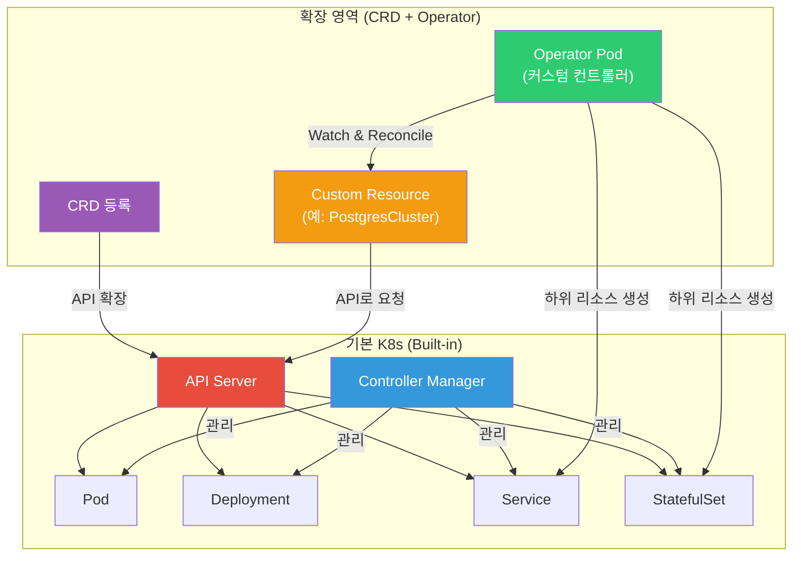
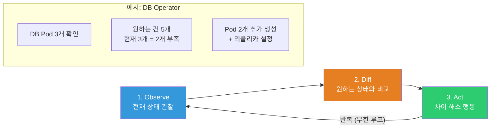
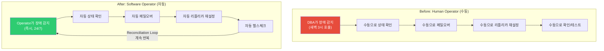
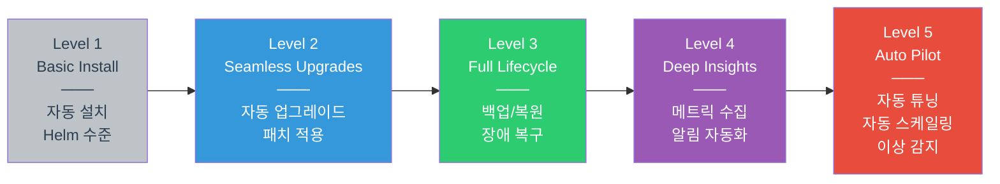
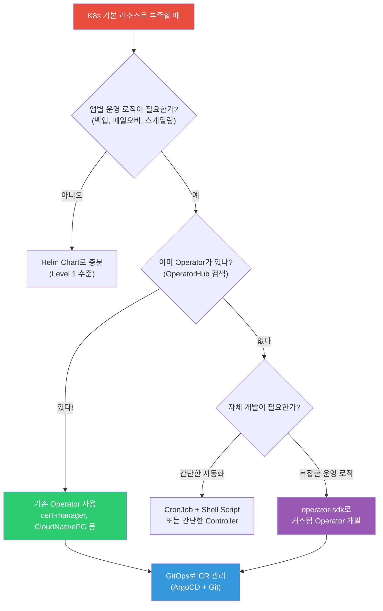

# Operator / CRD

> K8s의 기본 리소스(Deployment, StatefulSet 등)만으로는 복잡한 애플리케이션의 운영 자동화가 어려워요. [K8s 아키텍처](./01-architecture)에서 배운 Controller Manager가 기본 리소스를 관리하듯, **CRD로 나만의 리소스를 정의**하고 **Operator로 운영 로직을 자동화**하는 방법을 배워요. [Helm](./12-helm-kustomize)으로 설치하고, [StatefulSet](./03-statefulset-daemonset)으로 부족했던 DB 운영 자동화까지 해결하는 핵심 패턴이에요.

---

## 🎯 이걸 왜 알아야 하나?

```
실무에서 Operator/CRD가 필요한 순간:
• "PostgreSQL 클러스터 자동 페일오버 해주세요"         → CloudNativePG Operator
• "TLS 인증서 자동 갱신 해주세요"                     → cert-manager Operator
• "Kafka 클러스터 스케일링 자동화 해주세요"            → Strimzi Operator
• "모니터링 대상 자동 등록 해주세요"                   → Prometheus Operator
• "DB 백업을 CRD로 선언적으로 관리하고 싶어요"        → 커스텀 Operator
• "kubectl get 으로 우리 앱 상태도 보고 싶어요"       → CRD 정의
• 면접: "Operator 패턴을 설명해주세요" (시니어 필수 질문!)
```

---

## 🧠 핵심 개념

### 비유: 아파트 자동 관리 시스템

Operator를 **아파트 자동 관리 시스템**에 비유해볼게요.

* **CRD (Custom Resource Definition)** = 관리 규칙서. "수영장 온도는 28도, 주차장은 자동 배정, 택배는 무인함에 보관" 같은 새로운 관리 항목을 정의해요.
* **CR (Custom Resource)** = 실제 관리 요청서. "수영장 온도를 30도로 올려주세요"라는 구체적인 요청이에요.
* **Operator** = AI 관리인 로봇. 규칙서(CRD)에 따라 요청(CR)을 읽고, 현재 상태를 확인하고, 원하는 상태로 자동으로 맞춰줘요.
* **Reconciliation Loop** = 관리인의 순찰. "수영장 온도가 28도인가? 아니면 히터를 켜자!" — 끊임없이 원하는 상태와 현재 상태를 비교하고 맞춰요.

일반 관리인(사람)은 퇴근하면 문제가 생겨도 대응 못 하지만, **Operator(AI 로봇 관리인)** 는 24시간 쉬지 않고 자동으로 관리해요!

### K8s API 확장 구조



### Operator 패턴 = Reconciliation Loop



### Operator가 없으면 vs 있으면

| 상황 | Operator 없이 (수동) | Operator 있으면 (자동) |
|------|---------------------|---------------------|
| DB 복제본 추가 | StatefulSet replicas 수정 + 수동으로 replication 설정 | CR에서 `replicas: 5` 변경하면 끝 |
| DB 페일오버 | 장애 감지 → 수동으로 promote → 설정 변경 | 자동 감지 → 자동 promote → 자동 설정 |
| TLS 인증서 갱신 | 만료 전에 수동 갱신 → Secret 업데이트 | cert-manager가 자동 갱신 |
| 백업 | CronJob 수동 설정 + 스크립트 관리 | `Schedule: "0 2 * * *"` CRD로 선언 |
| 버전 업그레이드 | 롤링 업데이트 수동 관리 + 호환성 체크 | Operator가 안전하게 순차 업그레이드 |

---

## 🔍 상세 설명

### CRD란?

CRD(Custom Resource Definition)는 K8s API를 **확장**하는 방법이에요. K8s에는 기본적으로 Pod, Service, Deployment 등이 있지만, CRD를 등록하면 `PostgresCluster`, `Certificate`, `Kafka` 같은 **나만의 리소스 타입**을 만들 수 있어요.

```yaml
# === CRD 정의 예시: 나만의 "Website" 리소스 만들기 ===
apiVersion: apiextensions.k8s.io/v1   # CRD 전용 API 그룹
kind: CustomResourceDefinition
metadata:
  name: websites.webapp.example.com    # 반드시 {plural}.{group} 형식
spec:
  group: webapp.example.com            # API 그룹 (도메인 역순)

  versions:
    - name: v1                         # API 버전
      served: true                     # 이 버전으로 요청 가능?
      storage: true                    # etcd에 이 버전으로 저장?
      schema:
        openAPIV3Schema:               # 리소스 스키마 (필수!)
          type: object
          properties:
            spec:
              type: object
              required: ["image", "replicas"]    # 필수 필드
              properties:
                image:
                  type: string
                  description: "컨테이너 이미지"
                replicas:
                  type: integer
                  minimum: 1
                  maximum: 10
                  description: "레플리카 수"
                domain:
                  type: string
                  description: "도메인 이름"
            status:
              type: object
              properties:
                availableReplicas:
                  type: integer
                url:
                  type: string

      # kubectl get 시 보여줄 컬럼 (가독성!)
      additionalPrinterColumns:
        - name: Image
          type: string
          jsonPath: .spec.image
        - name: Replicas
          type: integer
          jsonPath: .spec.replicas
        - name: URL
          type: string
          jsonPath: .status.url
        - name: Age
          type: date
          jsonPath: .metadata.creationTimestamp

  scope: Namespaced                    # Namespaced 또는 Cluster

  names:
    plural: websites                   # kubectl get websites
    singular: website                  # kubectl get website
    kind: Website                      # YAML에서 kind: Website
    shortNames:
      - ws                             # kubectl get ws (단축명)
    categories:
      - all                            # kubectl get all 에 포함
```

```bash
# CRD 등록
kubectl apply -f website-crd.yaml
# customresourcedefinition.apiextensions.k8s.io/websites.webapp.example.com created

# 등록된 CRD 확인
kubectl get crd
# NAME                                CREATED AT
# websites.webapp.example.com         2026-03-13T09:00:00Z
# certificates.cert-manager.io        2026-03-10T08:00:00Z     ← cert-manager가 설치한 CRD
# prometheuses.monitoring.coreos.com  2026-03-10T08:00:00Z     ← Prometheus Operator CRD

# CRD 상세 정보
kubectl describe crd websites.webapp.example.com
# Name:         websites.webapp.example.com
# Group:        webapp.example.com
# Version:      v1
# Scope:        Namespaced
# Kind:         Website
# Short Names:  ws
```

CRD를 등록하면, 이제 `Website` 타입의 리소스를 만들 수 있어요.

```yaml
# === Custom Resource (CR) 생성: Website 인스턴스 ===
apiVersion: webapp.example.com/v1     # CRD에서 정의한 group/version
kind: Website                         # CRD에서 정의한 kind
metadata:
  name: my-portfolio
  namespace: default
spec:
  image: nginx:1.25                   # CRD 스키마에 맞는 필드
  replicas: 3
  domain: portfolio.example.com
```

```bash
# CR 생성
kubectl apply -f my-website.yaml
# website.webapp.example.com/my-portfolio created

# CR 조회 (단축명 사용!)
kubectl get ws
# NAME           IMAGE        REPLICAS   URL   AGE
# my-portfolio   nginx:1.25   3                 5s

# CR 상세 정보
kubectl describe ws my-portfolio

# CR 삭제
kubectl delete ws my-portfolio
```

> 여기까지는 CRD + CR만 있는 상태예요. **아직 실제로 Pod가 생성되진 않아요!** 실제 동작을 만들려면 Operator(컨트롤러)가 필요해요.

---

### Operator 패턴

#### 왜 필요한가? — StatefulSet만으로 부족한 것들

[StatefulSet](./03-statefulset-daemonset)은 안정적인 네트워크 ID와 영구 스토리지를 제공하지만, **애플리케이션 레벨의 운영 로직**은 처리하지 못해요.

```
StatefulSet이 해주는 것:
✅ 순서대로 Pod 생성 (db-0 → db-1 → db-2)
✅ 안정적인 DNS (db-0.db-svc.ns.svc.cluster.local)
✅ Pod별 고유 PVC
✅ 순차적 업데이트

StatefulSet이 해주지 못하는 것:
❌ Primary/Replica 자동 설정 (replication 구성)
❌ 자동 페일오버 (Primary 죽으면 Replica를 promote)
❌ 자동 백업/복원
❌ 버전 업그레이드 시 데이터 마이그레이션
❌ 모니터링 자동 등록
❌ Connection Pooling 관리
```

이것이 Operator가 필요한 이유예요. **사람이 하던 운영 작업을 소프트웨어가 대신**해요!

#### Human Operator에서 Software Operator로



#### Reconciliation Loop 상세

Operator의 핵심은 **Reconciliation Loop(조정 루프)** 예요. [K8s 아키텍처](./01-architecture)에서 배운 Controller Manager의 동작과 동일한 패턴이에요.

```go
// === Operator의 핵심 로직 (의사 코드) ===
// controller-runtime 기반 Reconcile 함수

func (r *PostgresClusterReconciler) Reconcile(ctx context.Context, req ctrl.Request) (ctrl.Result, error) {
    // 1. CR(Custom Resource) 가져오기
    cluster := &v1.PostgresCluster{}
    err := r.Get(ctx, req.NamespacedName, cluster)

    // 2. 원하는 상태(Desired State) 읽기
    desiredReplicas := cluster.Spec.Replicas   // 예: 3

    // 3. 현재 상태(Current State) 확인
    currentPods := r.listPostgresPods(cluster)  // 예: 2개 실행 중

    // 4. 차이(Diff) 계산 + 행동(Act)
    if len(currentPods) < desiredReplicas {
        // Pod 추가 + Replication 설정
        r.scaleUp(cluster)
    } else if len(currentPods) > desiredReplicas {
        // 안전하게 Pod 제거 + 데이터 동기화
        r.scaleDown(cluster)
    }

    // 5. Primary 장애 체크
    if !r.isPrimaryHealthy(cluster) {
        r.performFailover(cluster)  // 자동 페일오버!
    }

    // 6. 상태 업데이트
    cluster.Status.ReadyReplicas = len(healthyPods)
    r.Status().Update(ctx, cluster)

    // 7. 일정 시간 후 다시 Reconcile (주기적 확인)
    return ctrl.Result{RequeueAfter: 30 * time.Second}, nil
}
```

---

### 주요 Operator 예시

#### 1. Prometheus Operator (모니터링)

```yaml
# === ServiceMonitor CRD — 모니터링 대상 자동 등록 ===
# Prometheus Operator가 설치한 CRD
apiVersion: monitoring.coreos.com/v1
kind: ServiceMonitor
metadata:
  name: my-app-monitor
  namespace: monitoring
  labels:
    release: prometheus                 # Prometheus가 이 라벨을 봐요
spec:
  selector:
    matchLabels:
      app: my-web-app                   # 이 라벨을 가진 Service를 모니터링
  endpoints:
    - port: metrics                     # Service의 metrics 포트
      interval: 15s                     # 15초마다 스크랩
      path: /metrics                    # 메트릭 엔드포인트
  namespaceSelector:
    matchNames:
      - production                      # production 네임스페이스에서 찾기
```

```bash
# Prometheus Operator가 제공하는 CRD들
kubectl get crd | grep monitoring
# alertmanagerconfigs.monitoring.coreos.com
# alertmanagers.monitoring.coreos.com
# podmonitors.monitoring.coreos.com
# prometheuses.monitoring.coreos.com
# prometheusrules.monitoring.coreos.com
# servicemonitors.monitoring.coreos.com
# thanosrulers.monitoring.coreos.com

# ServiceMonitor 조회
kubectl get servicemonitor -n monitoring
# NAME              AGE
# my-app-monitor    5m
```

#### 2. cert-manager (인증서 자동화)

```yaml
# === Certificate CRD — TLS 인증서 자동 발급/갱신 ===
apiVersion: cert-manager.io/v1
kind: Certificate
metadata:
  name: my-app-tls
  namespace: production
spec:
  secretName: my-app-tls-secret        # 인증서가 저장될 Secret
  issuerRef:
    name: letsencrypt-prod             # 어떤 Issuer를 사용할지
    kind: ClusterIssuer
  dnsNames:
    - myapp.example.com                # 인증서 도메인
    - www.myapp.example.com
  renewBefore: 360h                    # 만료 15일 전 자동 갱신
---
# === ClusterIssuer CRD — 인증서 발급자 설정 ===
apiVersion: cert-manager.io/v1
kind: ClusterIssuer
metadata:
  name: letsencrypt-prod
spec:
  acme:
    server: https://acme-v02.api.letsencrypt.org/directory
    email: admin@example.com
    privateKeySecretRef:
      name: letsencrypt-prod-key
    solvers:
      - http01:
          ingress:
            class: nginx
```

```bash
# cert-manager CRD들
kubectl get crd | grep cert-manager
# certificaterequests.cert-manager.io
# certificates.cert-manager.io
# challenges.acme.cert-manager.io
# clusterissuers.cert-manager.io
# issuers.cert-manager.io
# orders.acme.cert-manager.io

# 인증서 상태 확인
kubectl get certificate -n production
# NAME         READY   SECRET              AGE
# my-app-tls   True    my-app-tls-secret   30m

# 인증서 상세 (만료일, 갱신일 등)
kubectl describe certificate my-app-tls -n production
```

#### 3. CloudNativePG (PostgreSQL Operator)

```yaml
# === Cluster CRD — PostgreSQL 클러스터 선언적 관리 ===
apiVersion: postgresql.cnpg.io/v1
kind: Cluster
metadata:
  name: my-postgres
  namespace: database
spec:
  instances: 3                         # Primary 1 + Replica 2 (자동 구성!)

  postgresql:
    parameters:
      max_connections: "200"
      shared_buffers: "512MB"

  storage:
    size: 50Gi
    storageClass: gp3

  backup:
    barmanObjectStore:                 # S3에 자동 백업!
      destinationPath: s3://my-backups/postgres/
      s3Credentials:
        accessKeyId:
          name: aws-creds
          key: ACCESS_KEY_ID
        secretAccessKey:
          name: aws-creds
          key: SECRET_ACCESS_KEY
    retentionPolicy: "30d"            # 30일 보관

  monitoring:
    enablePodMonitor: true            # Prometheus 자동 연동
```

```bash
# CloudNativePG 클러스터 상태
kubectl get cluster -n database
# NAME          INSTANCES   READY   STATUS                   AGE
# my-postgres   3           3       Cluster in healthy state  1h

# Pod 확인 — Primary/Replica 자동 구성!
kubectl get pods -n database -l cnpg.io/cluster=my-postgres
# NAME            READY   STATUS    ROLE      AGE
# my-postgres-1   1/1     Running   primary   1h
# my-postgres-2   1/1     Running   replica   1h
# my-postgres-3   1/1     Running   replica   1h
```

#### 4. Strimzi (Kafka Operator)

```yaml
# === Kafka CRD — Kafka 클러스터 선언적 관리 ===
apiVersion: kafka.strimzi.io/v1beta2
kind: Kafka
metadata:
  name: my-cluster
  namespace: kafka
spec:
  kafka:
    version: 3.7.0
    replicas: 3                        # 브로커 3개
    listeners:
      - name: plain
        port: 9092
        type: internal
        tls: false
      - name: tls
        port: 9093
        type: internal
        tls: true
    storage:
      type: persistent-claim
      size: 100Gi
      class: gp3
    config:
      offsets.topic.replication.factor: 3
      transaction.state.log.replication.factor: 3
      default.replication.factor: 3

  zookeeper:
    replicas: 3
    storage:
      type: persistent-claim
      size: 20Gi

  entityOperator:                      # Topic/User 관리 Operator도 포함!
    topicOperator: {}
    userOperator: {}
```

---

### Operator 설치/관리

#### 방법 1: Helm으로 설치 (가장 일반적)

[Helm](./12-helm-kustomize)을 사용한 Operator 설치가 실무에서 가장 흔해요.

```bash
# === cert-manager 설치 (Helm) ===

# 1. 레포 추가
helm repo add jetstack https://charts.jetstack.io
helm repo update

# 2. CRD와 함께 설치
helm install cert-manager jetstack/cert-manager \
  --namespace cert-manager \
  --create-namespace \
  --set crds.enabled=true \
  --version v1.14.4

# 설치 확인
kubectl get pods -n cert-manager
# NAME                                       READY   STATUS    AGE
# cert-manager-7b8c77d4bd-xxxxx              1/1     Running   1m
# cert-manager-cainjector-5c5695d97c-xxxxx   1/1     Running   1m
# cert-manager-webhook-6f97bb7d84-xxxxx      1/1     Running   1m

# CRD 확인
kubectl get crd | grep cert-manager
# certificates.cert-manager.io               2026-03-13T09:00:00Z
# clusterissuers.cert-manager.io             2026-03-13T09:00:00Z
# issuers.cert-manager.io                    2026-03-13T09:00:00Z
# ...
```

```bash
# === Prometheus Operator (kube-prometheus-stack) 설치 ===
helm repo add prometheus-community https://prometheus-community.github.io/helm-charts
helm repo update

helm install prometheus prometheus-community/kube-prometheus-stack \
  --namespace monitoring \
  --create-namespace \
  --set grafana.adminPassword=mypassword
```

#### 방법 2: OLM (Operator Lifecycle Manager)

OLM은 Operator의 설치, 업그레이드, RBAC를 관리하는 **Operator를 위한 Operator**예요. OpenShift에서 기본 제공되고, 일반 K8s에서도 설치할 수 있어요.

```bash
# OLM 설치 (일반 K8s)
curl -sL https://github.com/operator-framework/operator-lifecycle-manager/releases/download/v0.28.0/install.sh | bash -s v0.28.0

# OLM 확인
kubectl get pods -n olm
# NAME                                READY   STATUS    AGE
# olm-operator-xxxx                   1/1     Running   1m
# catalog-operator-xxxx               1/1     Running   1m
# packageserver-xxxx                  1/1     Running   1m

# OperatorHub에서 사용 가능한 Operator 목록
kubectl get packagemanifest
# NAME                      CATALOG               AGE
# prometheus                Community Operators   1m
# strimzi-kafka-operator    Community Operators   1m
# ...
```

#### 방법 3: OperatorHub.io

[OperatorHub.io](https://operatorhub.io)는 Operator들의 카탈로그 사이트예요. 각 Operator의 설치 방법, CRD 목록, 사용 예시를 확인할 수 있어요.

```bash
# OperatorHub에서 직접 kubectl로 설치하는 경우
# (보통 해당 Operator 문서에 설치 명령어가 있어요)

# 예: Strimzi Kafka Operator 직접 설치
kubectl create namespace kafka
kubectl apply -f https://strimzi.io/install/latest?namespace=kafka

# 설치 확인
kubectl get pods -n kafka
# NAME                                        READY   STATUS    AGE
# strimzi-cluster-operator-xxxx               1/1     Running   1m
```

#### operator-sdk 소개

직접 Operator를 만들고 싶다면 `operator-sdk`를 사용해요. Go, Ansible, Helm 기반으로 Operator를 생성할 수 있어요.

```bash
# operator-sdk 설치
brew install operator-sdk   # macOS
# 또는
curl -LO https://github.com/operator-framework/operator-sdk/releases/download/v1.34.0/operator-sdk_linux_amd64
chmod +x operator-sdk_linux_amd64 && sudo mv operator-sdk_linux_amd64 /usr/local/bin/operator-sdk

# Go 기반 Operator 프로젝트 생성
operator-sdk init --domain example.com --repo github.com/example/my-operator

# API(CRD) + Controller 스캐폴딩
operator-sdk create api --group webapp --version v1 --kind Website --resource --controller

# 생성된 프로젝트 구조
# my-operator/
# ├── api/v1/                    # CRD 타입 정의
# │   └── website_types.go       # Website 구조체
# ├── internal/controller/       # 컨트롤러 로직
# │   └── website_controller.go  # Reconcile 함수
# ├── config/
# │   ├── crd/                   # 자동 생성된 CRD YAML
# │   ├── rbac/                  # RBAC 설정
# │   └── manager/               # Operator Deployment
# ├── Dockerfile                 # Operator 이미지 빌드
# └── Makefile                   # 빌드/배포 자동화
```

---

### Operator Maturity Model

Operator의 성숙도를 5단계로 나눠요. 수준이 높을수록 자동화가 깊어져요.



| Level | 이름 | 자동화 범위 | 예시 |
|-------|------|------------|------|
| 1 | Basic Install | 자동 설치/삭제 | Helm Chart 수준 |
| 2 | Seamless Upgrades | 자동 업그레이드, 설정 변경 | 무중단 버전 업그레이드 |
| 3 | Full Lifecycle | 백업, 복원, 장애 복구 | CloudNativePG, Strimzi |
| 4 | Deep Insights | 메트릭, 알림, 로그 통합 | Prometheus Operator |
| 5 | Auto Pilot | 자동 튜닝, 이상 감지, 자동 스케일링 | 일부 상용 Operator |

---

## 💻 실습 예제

### 실습 1: CRD 정의 + CR 생성

직접 CRD를 만들고, Custom Resource를 생성해봐요.

```yaml
# website-crd.yaml
# === 나만의 Website 리소스 타입 정의 ===
apiVersion: apiextensions.k8s.io/v1
kind: CustomResourceDefinition
metadata:
  name: websites.webapp.example.com
spec:
  group: webapp.example.com
  versions:
    - name: v1
      served: true
      storage: true
      schema:
        openAPIV3Schema:
          type: object
          properties:
            spec:
              type: object
              required: ["image", "replicas"]
              properties:
                image:
                  type: string
                replicas:
                  type: integer
                  minimum: 1
                  maximum: 10
                domain:
                  type: string
            status:
              type: object
              properties:
                phase:
                  type: string
                availableReplicas:
                  type: integer
      subresources:
        status: {}                      # /status 서브리소스 활성화
      additionalPrinterColumns:
        - name: Image
          type: string
          jsonPath: .spec.image
        - name: Replicas
          type: integer
          jsonPath: .spec.replicas
        - name: Phase
          type: string
          jsonPath: .status.phase
        - name: Age
          type: date
          jsonPath: .metadata.creationTimestamp
  scope: Namespaced
  names:
    plural: websites
    singular: website
    kind: Website
    shortNames:
      - ws
```

```bash
# 1단계: CRD 등록
kubectl apply -f website-crd.yaml
# customresourcedefinition.apiextensions.k8s.io/websites.webapp.example.com created

# 2단계: CRD가 등록되었는지 확인
kubectl get crd websites.webapp.example.com
# NAME                            CREATED AT
# websites.webapp.example.com     2026-03-13T09:00:00Z

# 3단계: API 리소스에 추가되었는지 확인
kubectl api-resources | grep website
# websites   ws   webapp.example.com/v1   true   Website
```

```yaml
# my-website.yaml
# === Custom Resource 인스턴스 생성 ===
apiVersion: webapp.example.com/v1
kind: Website
metadata:
  name: my-portfolio
  namespace: default
spec:
  image: nginx:1.25-alpine
  replicas: 3
  domain: portfolio.example.com
```

```bash
# 4단계: CR 생성
kubectl apply -f my-website.yaml
# website.webapp.example.com/my-portfolio created

# 5단계: CR 조회 (단축명 ws 사용)
kubectl get ws
# NAME           IMAGE               REPLICAS   PHASE   AGE
# my-portfolio   nginx:1.25-alpine   3                  10s

# 6단계: YAML 출력
kubectl get ws my-portfolio -o yaml
# apiVersion: webapp.example.com/v1
# kind: Website
# metadata:
#   name: my-portfolio
#   namespace: default
# spec:
#   image: nginx:1.25-alpine
#   replicas: 3
#   domain: portfolio.example.com

# 7단계: 스키마 유효성 검사 확인 — replicas 범위 초과 시 에러!
# (replicas: 20으로 설정하면)
# The Website "test" is invalid: spec.replicas: Invalid value: 20: spec.replicas in body should be less than or equal to 10

# 8단계: 정리
kubectl delete ws my-portfolio
kubectl delete crd websites.webapp.example.com
```

---

### 실습 2: cert-manager 설치 + 인증서 발급

실무에서 가장 많이 쓰는 Operator 중 하나인 cert-manager를 설치하고 사용해봐요.

```bash
# === 1단계: cert-manager 설치 (Helm) ===
helm repo add jetstack https://charts.jetstack.io
helm repo update

helm install cert-manager jetstack/cert-manager \
  --namespace cert-manager \
  --create-namespace \
  --set crds.enabled=true \
  --version v1.14.4

# 설치 확인
kubectl get pods -n cert-manager
# NAME                                       READY   STATUS    AGE
# cert-manager-7b8c77d4bd-xxxxx              1/1     Running   30s
# cert-manager-cainjector-5c5695d97c-xxxxx   1/1     Running   30s
# cert-manager-webhook-6f97bb7d84-xxxxx      1/1     Running   30s

# CRD 확인 — cert-manager가 등록한 CRD들!
kubectl get crd | grep cert-manager
# certificaterequests.cert-manager.io         2026-03-13T09:00:00Z
# certificates.cert-manager.io               2026-03-13T09:00:00Z
# challenges.acme.cert-manager.io            2026-03-13T09:00:00Z
# clusterissuers.cert-manager.io             2026-03-13T09:00:00Z
# issuers.cert-manager.io                    2026-03-13T09:00:00Z
# orders.acme.cert-manager.io                2026-03-13T09:00:00Z
```

```yaml
# === 2단계: Self-Signed Issuer 생성 (테스트용) ===
# self-signed-issuer.yaml
apiVersion: cert-manager.io/v1
kind: ClusterIssuer
metadata:
  name: selfsigned-issuer
spec:
  selfSigned: {}                        # 자체 서명 (테스트용)
---
# === 3단계: Certificate 요청 ===
# test-certificate.yaml
apiVersion: cert-manager.io/v1
kind: Certificate
metadata:
  name: test-tls
  namespace: default
spec:
  secretName: test-tls-secret           # 인증서가 이 Secret에 저장됨
  duration: 2160h                       # 90일 유효
  renewBefore: 360h                     # 만료 15일 전 자동 갱신!
  issuerRef:
    name: selfsigned-issuer
    kind: ClusterIssuer
  commonName: test.example.com
  dnsNames:
    - test.example.com
    - www.test.example.com
```

```bash
# Issuer + Certificate 생성
kubectl apply -f self-signed-issuer.yaml
kubectl apply -f test-certificate.yaml

# 인증서 상태 확인
kubectl get certificate
# NAME       READY   SECRET            AGE
# test-tls   True    test-tls-secret   30s

# 인증서 상세 확인
kubectl describe certificate test-tls
# Events:
#   Normal  Issuing    10s   cert-manager  Issuing certificate as Secret does not exist
#   Normal  Generated  9s    cert-manager  Stored new private key in temporary Secret
#   Normal  Requested  9s    cert-manager  Created new CertificateRequest resource "test-tls-xxxxx"
#   Normal  Issuing    9s    cert-manager  The certificate has been successfully issued

# Secret에 인증서가 자동 생성됨!
kubectl get secret test-tls-secret
# NAME              TYPE                DATA   AGE
# test-tls-secret   kubernetes.io/tls   3      30s

# 인증서 내용 확인
kubectl get secret test-tls-secret -o jsonpath='{.data.tls\.crt}' | base64 -d | openssl x509 -text -noout | head -15
# Certificate:
#     Data:
#         Version: 3 (0x2)
#         Serial Number: ...
#     Signature Algorithm: ...
#         Issuer: CN = test.example.com
#         Validity
#             Not Before: Mar 13 09:00:00 2026 GMT
#             Not After : Jun 11 09:00:00 2026 GMT
#         Subject: CN = test.example.com
```

---

### 실습 3: Prometheus Operator로 ServiceMonitor 설정

Prometheus Operator를 사용해서 애플리케이션 모니터링을 자동 등록해봐요.

```bash
# === 1단계: kube-prometheus-stack 설치 (이미 설치되어 있다면 생략) ===
helm repo add prometheus-community https://prometheus-community.github.io/helm-charts
helm repo update

helm install prometheus prometheus-community/kube-prometheus-stack \
  --namespace monitoring \
  --create-namespace

# Prometheus Operator CRD 확인
kubectl get crd | grep monitoring.coreos.com
# alertmanagerconfigs.monitoring.coreos.com    2026-03-13T09:00:00Z
# prometheuses.monitoring.coreos.com          2026-03-13T09:00:00Z
# servicemonitors.monitoring.coreos.com       2026-03-13T09:00:00Z
# ...
```

```yaml
# === 2단계: 샘플 앱 + Service 배포 ===
# sample-app.yaml
apiVersion: apps/v1
kind: Deployment
metadata:
  name: sample-app
  namespace: default
spec:
  replicas: 2
  selector:
    matchLabels:
      app: sample-app
  template:
    metadata:
      labels:
        app: sample-app
    spec:
      containers:
        - name: app
          image: prom/prometheus:latest    # 메트릭을 노출하는 앱 예시
          ports:
            - name: metrics
              containerPort: 9090
---
apiVersion: v1
kind: Service
metadata:
  name: sample-app-svc
  namespace: default
  labels:
    app: sample-app                        # ServiceMonitor가 이 라벨을 봐요!
spec:
  selector:
    app: sample-app
  ports:
    - name: metrics
      port: 9090
      targetPort: metrics
```

```yaml
# === 3단계: ServiceMonitor로 모니터링 자동 등록 ===
# service-monitor.yaml
apiVersion: monitoring.coreos.com/v1
kind: ServiceMonitor
metadata:
  name: sample-app-monitor
  namespace: monitoring                    # Prometheus가 있는 네임스페이스
  labels:
    release: prometheus                    # kube-prometheus-stack이 이 라벨을 봐요!
spec:
  selector:
    matchLabels:
      app: sample-app                      # 대상 Service의 라벨
  namespaceSelector:
    matchNames:
      - default                            # 대상 Service의 네임스페이스
  endpoints:
    - port: metrics                        # Service 포트 이름
      interval: 30s                        # 30초마다 메트릭 수집
      path: /metrics                       # 메트릭 경로
```

```bash
# 배포
kubectl apply -f sample-app.yaml
kubectl apply -f service-monitor.yaml

# ServiceMonitor 확인
kubectl get servicemonitor -n monitoring
# NAME                 AGE
# sample-app-monitor   10s

# Prometheus 타겟에 자동 등록되었는지 확인
# (Prometheus UI에서 Status > Targets 확인)
kubectl port-forward svc/prometheus-kube-prometheus-prometheus -n monitoring 9090:9090
# 브라우저에서 http://localhost:9090/targets 접속
# → serviceMonitor/monitoring/sample-app-monitor 확인!
```

---

## 🏢 실무에서는?

### 시나리오 1: PostgreSQL 클러스터 자동 운영

```yaml
# === CloudNativePG로 PostgreSQL 프로덕션 클러스터 ===
apiVersion: postgresql.cnpg.io/v1
kind: Cluster
metadata:
  name: prod-postgres
  namespace: database
spec:
  instances: 3                             # Primary 1 + Replica 2 자동 구성

  postgresql:
    parameters:
      max_connections: "300"
      shared_buffers: "1GB"
      effective_cache_size: "3GB"
      work_mem: "16MB"

  resources:
    requests:
      memory: "2Gi"
      cpu: "1"
    limits:
      memory: "4Gi"
      cpu: "2"

  storage:
    size: 100Gi
    storageClass: gp3-encrypted

  # 자동 백업 설정 (S3)
  backup:
    barmanObjectStore:
      destinationPath: s3://company-backups/postgres/prod/
      s3Credentials:
        accessKeyId:
          name: aws-creds
          key: ACCESS_KEY_ID
        secretAccessKey:
          name: aws-creds
          key: SECRET_ACCESS_KEY
      wal:
        compression: gzip
    retentionPolicy: "30d"               # 30일 보관

  # 자동 페일오버 설정
  minSyncReplicas: 1                     # 최소 동기 리플리카 1개
  maxSyncReplicas: 1                     # 최대 동기 리플리카 1개

  # 모니터링 자동 연동
  monitoring:
    enablePodMonitor: true               # Prometheus 자동 연동!
```

```bash
# 자동 페일오버 테스트
kubectl delete pod prod-postgres-1 -n database
# → Operator가 자동으로:
#   1. Replica(prod-postgres-2)를 Primary로 promote
#   2. 새 Pod를 생성해서 Replica로 등록
#   3. Replication 재설정
#   4. 애플리케이션 연결 자동 전환
```

### 시나리오 2: Kafka + 모니터링 자동화

```yaml
# === Strimzi로 Kafka 클러스터 + 자동 모니터링 ===
apiVersion: kafka.strimzi.io/v1beta2
kind: Kafka
metadata:
  name: prod-kafka
  namespace: kafka
spec:
  kafka:
    version: 3.7.0
    replicas: 3
    listeners:
      - name: internal
        port: 9092
        type: internal
        tls: true                          # 내부 통신도 TLS!
    storage:
      type: persistent-claim
      size: 500Gi
      class: gp3
    metricsConfig:                         # JMX 메트릭 자동 노출
      type: jmxPrometheusExporter
      valueFrom:
        configMapKeyRef:
          name: kafka-metrics
          key: kafka-metrics-config.yml
  zookeeper:
    replicas: 3
    storage:
      type: persistent-claim
      size: 20Gi
---
# Topic도 CRD로 선언적 관리!
apiVersion: kafka.strimzi.io/v1beta2
kind: KafkaTopic
metadata:
  name: orders
  namespace: kafka
  labels:
    strimzi.io/cluster: prod-kafka
spec:
  partitions: 12                           # 파티션 12개
  replicas: 3                              # 리플리카 팩터 3
  config:
    retention.ms: "604800000"              # 7일 보관
    segment.bytes: "1073741824"            # 1GB 세그먼트
```

### 시나리오 3: GitOps + Operator 조합

[Helm](./12-helm-kustomize)과 ArgoCD를 사용해서 Operator 기반 인프라를 GitOps로 관리하는 패턴이에요.

```yaml
# === ArgoCD Application — Operator를 GitOps로 관리 ===
# argocd-apps/cert-manager.yaml
apiVersion: argoproj.io/v1alpha1
kind: Application
metadata:
  name: cert-manager
  namespace: argocd
spec:
  project: infrastructure
  source:
    repoURL: https://charts.jetstack.io
    targetRevision: v1.14.4
    chart: cert-manager
    helm:
      values: |
        crds:
          enabled: true
        replicaCount: 2
        podDisruptionBudget:
          enabled: true
  destination:
    server: https://kubernetes.default.svc
    namespace: cert-manager
  syncPolicy:
    automated:
      prune: true
      selfHeal: true                       # 누가 수동으로 바꿔도 자동 복원!
---
# argocd-apps/postgres-cluster.yaml
apiVersion: argoproj.io/v1alpha1
kind: Application
metadata:
  name: prod-postgres
  namespace: argocd
spec:
  project: database
  source:
    repoURL: https://github.com/company/k8s-manifests.git
    path: database/postgres               # CR YAML이 있는 경로
    targetRevision: main
  destination:
    server: https://kubernetes.default.svc
    namespace: database
  syncPolicy:
    automated:
      selfHeal: true
```

```
Git 저장소 구조:
k8s-manifests/
├── operators/                    # Operator 설치 (Helm values)
│   ├── cert-manager/
│   ├── cloudnativepg/
│   └── strimzi/
├── database/                     # CR (Custom Resource) 관리
│   └── postgres/
│       ├── cluster.yaml          # PostgreSQL 클러스터 CR
│       └── backup-schedule.yaml  # 백업 스케줄 CR
├── kafka/
│   ├── kafka-cluster.yaml
│   └── topics/
│       ├── orders.yaml
│       └── events.yaml
└── certificates/
    ├── issuers/
    │   └── letsencrypt-prod.yaml
    └── certs/
        ├── api-tls.yaml
        └── web-tls.yaml
```

---

## ⚠️ 자주 하는 실수

### 실수 1: CRD 삭제 시 CR도 같이 삭제되는 것을 모름

```
❌ CRD를 삭제하면 해당 타입의 모든 CR(데이터)이 함께 삭제돼요!
   kubectl delete crd clusters.postgresql.cnpg.io
   → 모든 PostgresCluster CR이 삭제 → 데이터 유실 위험!

✅ CRD 삭제 전에 반드시 CR 백업 + 의존성 확인
   kubectl get clusters.postgresql.cnpg.io --all-namespaces  # 먼저 확인
   # Finalizer 문제 시에도 CRD 삭제보다는 Finalizer 제거가 안전
```

### 실수 2: Operator 업그레이드 시 CRD 호환성 미확인

```
❌ Operator를 메이저 버전 업그레이드하면서 CRD 변경사항을 확인하지 않음
   helm upgrade cert-manager --version v2.0.0  # CRD 스키마가 바뀌었을 수 있음!
   → 기존 CR이 새 스키마와 호환되지 않아 오류 발생

✅ 업그레이드 전 릴리스 노트에서 Breaking Changes 확인
   # CRD 변경사항 미리 확인
   helm template cert-manager jetstack/cert-manager --version v2.0.0 --show-only crds/ > new-crds.yaml
   kubectl diff -f new-crds.yaml
   # 단계적 업그레이드 (1.12 → 1.13 → 1.14, 메이저 점프 금지)
```

### 실수 3: Operator의 RBAC 권한 부족

```
❌ Operator Pod가 필요한 리소스를 생성/수정할 권한이 없음
   # Operator 로그에 "forbidden" 에러가 계속 발생
   # → CR을 만들어도 하위 리소스(Pod, Service 등)가 안 만들어짐

✅ Operator의 ServiceAccount + ClusterRole 확인
   kubectl get clusterrolebinding | grep operator-name
   kubectl describe clusterrole operator-name-role
   # Helm values에서 RBAC 설정 확인
   # rbac.create: true (기본값이지만 확인!)
```

### 실수 4: CR의 Status를 spec에서 수동 수정

```
❌ CR의 status 필드를 kubectl edit로 직접 수정
   kubectl edit website my-site
   # status.phase: "Ready"  ← 직접 수정 (Operator가 덮어씀!)

✅ Status는 Operator가 관리하는 영역이에요. spec만 수정하세요.
   # spec 변경 → Operator가 감지 → 작업 수행 → status 자동 업데이트
   kubectl patch website my-site --type=merge -p '{"spec":{"replicas":5}}'
   # status는 Operator가 알아서 업데이트해요
```

### 실수 5: Finalizer로 인한 리소스 삭제 불가 방치

```
❌ CR 삭제가 안 되는데 원인을 모르고 강제 삭제
   kubectl delete cluster my-postgres --force --grace-period=0
   → 하위 리소스(PVC, Secret 등)가 정리되지 않고 남음!

✅ Finalizer를 이해하고 순서대로 해결
   # 1. 왜 삭제가 안 되는지 확인
   kubectl get cluster my-postgres -o jsonpath='{.metadata.finalizers}'
   # ["cnpg.io/cluster"]

   # 2. Operator가 살아있는지 확인 (Operator가 finalizer를 제거해야 함)
   kubectl get pods -n cnpg-system

   # 3. Operator가 정상인데도 안 되면 → Operator 로그 확인
   kubectl logs -n cnpg-system deploy/cnpg-controller-manager

   # 4. 최후의 수단: Finalizer 수동 제거 (하위 리소스는 수동 정리 필요!)
   kubectl patch cluster my-postgres -p '{"metadata":{"finalizers":null}}' --type=merge
```

---

## 📝 정리

```
CRD / Operator 핵심 정리:

1. CRD = K8s API 확장
   - apiextensions.k8s.io/v1 으로 새 리소스 타입 정의
   - kubectl get/create/delete 로 관리 가능
   - OpenAPI v3 스키마로 유효성 검사

2. Operator = 자동화된 운영자
   - CRD + Controller (Reconciliation Loop)
   - Human Operator의 지식을 소프트웨어로 구현
   - 설치/업그레이드/백업/페일오버 자동화

3. 주요 Operator
   - cert-manager: TLS 인증서 자동 발급/갱신
   - Prometheus Operator: ServiceMonitor로 모니터링 자동화
   - CloudNativePG: PostgreSQL 클러스터 자동 운영
   - Strimzi: Kafka 클러스터 자동 운영

4. 설치 방법
   - Helm (가장 일반적) → helm install
   - OLM (Operator Lifecycle Manager) → OpenShift 기본
   - OperatorHub.io → 카탈로그 검색

5. Maturity Model
   - Level 1: Basic Install (자동 설치)
   - Level 2: Seamless Upgrades (자동 업그레이드)
   - Level 3: Full Lifecycle (백업/복원/페일오버)
   - Level 4: Deep Insights (메트릭/알림 통합)
   - Level 5: Auto Pilot (자동 튜닝/스케일링)

6. 핵심 명령어
   - kubectl get crd                    → 등록된 CRD 목록
   - kubectl describe crd <name>        → CRD 상세 정보
   - kubectl get <resource>             → CR 목록 조회
   - kubectl api-resources | grep <name> → API에 등록 확인
```



| 개념 | 한 줄 정리 |
|------|-----------|
| CRD | K8s API에 새 리소스 타입을 등록하는 방법 |
| CR | CRD로 정의된 타입의 실제 인스턴스 |
| Operator | CRD를 Watch하고 Reconcile하는 커스텀 컨트롤러 |
| Reconciliation Loop | 현재 상태 → 원하는 상태로 맞추는 무한 루프 |
| Finalizer | CR 삭제 전에 정리 작업을 보장하는 메커니즘 |
| OLM | Operator의 설치/업그레이드를 관리하는 프레임워크 |
| operator-sdk | Operator 개발을 도와주는 SDK/CLI 도구 |

---

## 🔗 다음 강의

> Operator로 K8s의 확장성을 경험했어요. 다음은 마이크로서비스 간 네트워크를 지능적으로 관리하는 **Service Mesh**를 배워요. Istio/Linkerd도 CRD 기반으로 동작하니, 이번 강의의 개념이 바로 이어져요!

[다음: Service Mesh (Istio/Linkerd) ->](./18-service-mesh)

**관련 강의 되돌아보기:**
- [K8s 아키텍처](./01-architecture) -- Controller Manager의 Reconciliation Loop
- [StatefulSet](./03-statefulset-daemonset) -- Operator가 보완하는 상태 관리
- [Helm / Kustomize](./12-helm-kustomize) -- Operator 설치에 가장 많이 쓰는 도구
- [백업 / DR](./16-backup-dr) -- Velero도 CRD 기반으로 백업 관리
