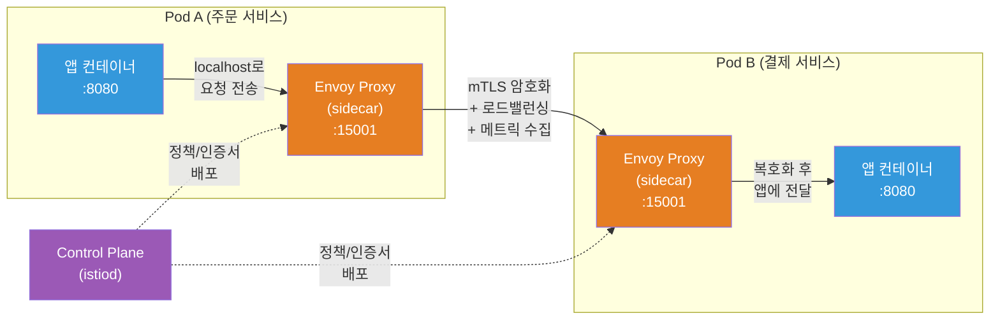
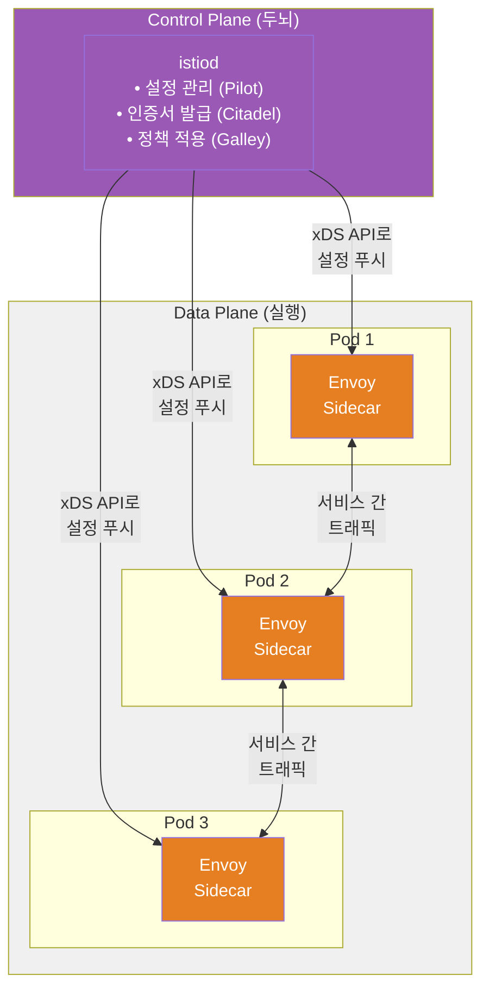
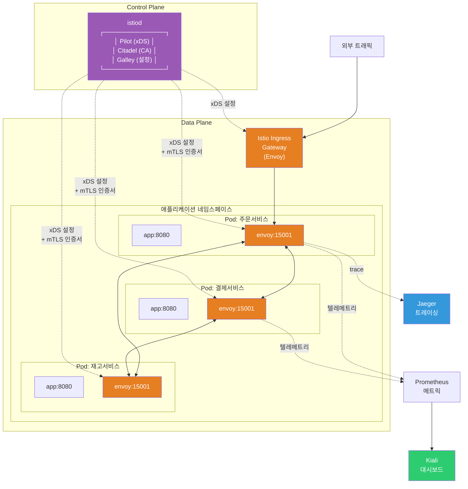
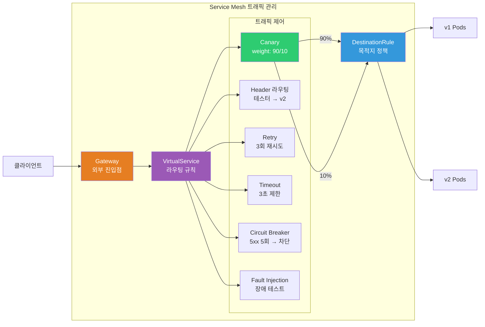

# Service Mesh — Envoy / Istio / Linkerd

> [Service/Ingress](./05-service-ingress)에서 클러스터 내부 통신과 외부 라우팅을, [CNI](./06-cni)에서 Pod 네트워크 계층을, [배포 전략](./09-operations)에서 카나리/블루그린을 배웠죠? 마이크로서비스가 수십~수백 개로 늘어나면 서비스 간 통신을 **애플리케이션 코드 밖에서** 일괄 관리하고 싶어져요. 그게 바로 **Service Mesh**예요.

---

## 🎯 이걸 왜 알아야 하나?

```
Service Mesh를 알면 해결되는 것들:
• "서비스 간 통신에 mTLS를 적용하고 싶어요"          → Istio 자동 mTLS
• "카나리 배포를 비율로 정밀하게 하고 싶어요"          → VirtualService weight
• "서비스 간 호출이 실패할 때 자동 재시도/차단"        → retry, circuit breaker
• "어떤 서비스가 어디를 호출하는지 보고 싶어요"        → 분산 트레이싱 자동화
• "Nginx Ingress로는 한계가 있어요"                   → Istio Gateway
• "통신 관련 로직을 앱 코드에서 빼고 싶어요"          → sidecar proxy 패턴
• 면접: "Service Mesh를 설명하고, Istio와 Linkerd 비교해주세요"
```

---

## 🧠 핵심 개념

### 비유: 도시 교통 관리 시스템

마이크로서비스 간 통신을 **도시의 교통**에 비유해볼게요.

* **Service Mesh가 없는 상태** = 신호등도 없고, 교통경찰도 없는 도시. 각 차량(서비스)이 알아서 길을 찾고, 사고 나면 스스로 처리해야 해요
* **Sidecar Proxy (Envoy)** = 각 차량에 붙은 **전담 내비게이션 + 블랙박스**. 어디로 갈지 안내하고, 이동 기록을 전부 남겨요
* **Control Plane (Istiod)** = **도시 교통관제센터**. 전체 교통 규칙을 정하고 내비게이션에 실시간으로 내려보내요
* **mTLS** = 차량마다 **전자 통행증**이 있어서, 인증된 차량끼리만 도로를 이용할 수 있어요
* **Circuit Breaker** = 사고 구간 **자동 통행 차단**. 고장난 길로 계속 보내지 않아요
* **Canary Routing** = 새 도로를 개통할 때, 전체 차량의 **10%만 먼저** 새 길로 보내서 테스트

### Sidecar Proxy 패턴

Service Mesh의 핵심은 **애플리케이션 컨테이너 옆에 프록시를 자동 주입**하는 거예요.



### Data Plane vs Control Plane



| 구분 | Data Plane | Control Plane |
|------|-----------|---------------|
| **역할** | 실제 트래픽 처리 | 정책/설정 관리 |
| **구성요소** | Envoy sidecar proxy | istiod (Istio), linkerd-destination (Linkerd) |
| **동작** | 프록시가 모든 요청 가로채서 처리 | 프록시에게 규칙 배포 |
| **비유** | 각 차량의 내비게이션 | 교통관제센터 |

---

## 🔍 상세 설명

### Service Mesh가 뭔가?

**Service Mesh**는 마이크로서비스 간 통신을 **인프라 레이어에서 투명하게 관리**하는 전용 계층이에요.

```bash
# Service Mesh가 없을 때의 마이크로서비스 통신 문제들:
# 1. 서비스 A → 서비스 B 호출 시 재시도 로직 → 앱 코드에 구현
# 2. mTLS 통신 → 앱마다 인증서 관리 코드 필요
# 3. 카나리 배포 → 앱이나 Ingress에서 라우팅 로직 구현
# 4. 메트릭 수집 → 앱마다 Prometheus 계측 코드 추가
# 5. 서킷 브레이커 → 각 앱에 라이브러리 (Hystrix 등) 통합

# Service Mesh가 있으면:
# → 위의 모든 것을 sidecar proxy가 대신 처리!
# → 앱 코드는 비즈니스 로직에만 집중!
# → 인프라 팀이 중앙에서 정책 일괄 관리!
```

**sidecar proxy 패턴**은 [CNI](./06-cni)가 Pod 네트워크를 제공하는 **위에서** 동작해요. CNI는 L3/L4 (IP/TCP) 레벨이고, Service Mesh는 **L7 (HTTP/gRPC)** 레벨에서 트래픽을 제어해요.

```bash
# 계층 구조로 이해하기:
# ┌─────────────────────────────────────┐
# │  Application (비즈니스 로직)          │  ← 앱 개발자
# ├─────────────────────────────────────┤
# │  Service Mesh (L7 트래픽 관리)       │  ← Envoy sidecar ★ 이 강의
# ├─────────────────────────────────────┤
# │  Service/Ingress (서비스 디스커버리)  │  ← kube-proxy, Ingress Controller
# ├─────────────────────────────────────┤
# │  CNI (Pod 네트워킹, L3/L4)          │  ← Calico, Cilium, VPC CNI
# ├─────────────────────────────────────┤
# │  Node Network (물리/가상 네트워크)    │  ← AWS VPC, 온프레미스
# └─────────────────────────────────────┘
```

---

### Envoy Proxy

**Envoy**는 Lyft에서 만든 고성능 L7 프록시예요. Istio, Linkerd 2 (linkerd-proxy는 Rust지만 개념 동일), AWS App Mesh 등 대부분의 Service Mesh가 Data Plane으로 Envoy를 사용해요.

```bash
# Envoy가 표준이 된 이유:
# 1. L7 프로토콜 지원: HTTP/1.1, HTTP/2, gRPC, WebSocket, TCP
# 2. xDS API: 동적 설정 변경 (재시작 없이!)
# 3. 풍부한 필터 체인: 인증, 속도 제한, 변환 등 플러그인 구조
# 4. 관측성 내장: 자동 메트릭, 액세스 로그, 트레이싱
# 5. CNCF 졸업 프로젝트: 커뮤니티와 생태계가 큼
```

#### xDS API (동적 설정의 핵심)

```bash
# xDS = x Discovery Service (x는 다양한 리소스 유형)
# Envoy는 설정 파일이 아니라 API로 설정을 받아요!

# 주요 xDS API:
# • LDS (Listener Discovery): 어떤 포트에서 트래픽을 받을지
# • RDS (Route Discovery):    어떤 경로를 어디로 라우팅할지
# • CDS (Cluster Discovery):  업스트림 클러스터(서비스) 목록
# • EDS (Endpoint Discovery): 각 클러스터의 실제 Pod IP 목록
# • SDS (Secret Discovery):   TLS 인증서/키

# Control Plane (istiod)이 xDS API로 Envoy에 설정 푸시
# → VirtualService 변경하면 → istiod가 RDS 업데이트 → Envoy에 즉시 반영!
# → Pod가 추가/삭제되면 → istiod가 EDS 업데이트 → Envoy가 즉시 인지!
```

#### Envoy 필터 체인

```bash
# 요청이 Envoy를 통과하는 흐름:
#
# [요청 수신] → [Listener] → [Filter Chain] → [Router] → [Upstream Cluster]
#                               │
#                               ├── Network Filters (L4)
#                               │   ├── TCP Proxy
#                               │   └── Rate Limit
#                               │
#                               └── HTTP Filters (L7)
#                                   ├── Authentication (JWT 검증)
#                                   ├── Authorization (RBAC)
#                                   ├── Rate Limit
#                                   ├── Fault Injection (테스트용)
#                                   └── Router (최종 라우팅)
```

---

### Istio

Istio는 가장 많이 쓰이는 Service Mesh예요. Google, IBM, Lyft가 만들었고, 현재 CNCF 졸업 프로젝트예요. [Operator 패턴](./17-operator-crd)으로 설치하고 CRD로 설정해요.

#### Istio 아키텍처



#### Istio 설치 (istioctl)

```bash
# istioctl 설치
curl -L https://istio.io/downloadIstio | sh -
cd istio-1.22.0
export PATH=$PWD/bin:$PATH

# 프로필 확인
istioctl profile list
# Istio configuration profiles:
#     default      ← 프로덕션 권장 (istiod + ingress gateway)
#     demo         ← 학습용 (모든 컴포넌트)
#     minimal      ← istiod만
#     remote       ← 멀티클러스터 원격
#     ambient      ← ambient mesh (sidecar 없이!)
#     empty

# demo 프로필로 설치 (학습용)
istioctl install --set profile=demo -y
# ✔ Istio core installed
# ✔ Istiod installed
# ✔ Egress gateways installed
# ✔ Ingress gateways installed
# ✔ Installation complete

# 설치 확인
kubectl get pods -n istio-system
# NAME                                   READY   STATUS    AGE
# istiod-5d8f8b6b4-xxxxx                1/1     Running   30s
# istio-ingressgateway-7f8b9c-xxxxx     1/1     Running   25s
# istio-egressgateway-6c8d7a-xxxxx      1/1     Running   25s

# 네임스페이스에 사이드카 자동 주입 활성화
kubectl label namespace default istio-injection=enabled
# namespace/default labeled

# 확인
kubectl get namespace default --show-labels
# NAME      STATUS   AGE   LABELS
# default   Active   10d   istio-injection=enabled
```

#### Sidecar 자동 주입 확인

```bash
# 앱 배포 (사이드카가 자동으로 추가됨!)
kubectl apply -f - <<EOF
apiVersion: apps/v1
kind: Deployment
metadata:
  name: httpbin
spec:
  replicas: 1
  selector:
    matchLabels:
      app: httpbin
  template:
    metadata:
      labels:
        app: httpbin
    spec:
      containers:
      - name: httpbin
        image: kong/httpbin:0.1.0
        ports:
        - containerPort: 80
EOF

# Pod 확인 → 컨테이너가 2개! (앱 + istio-proxy)
kubectl get pods
# NAME                      READY   STATUS    RESTARTS   AGE
# httpbin-7f9d8c-xxxxx      2/2     Running   0          10s
#                           ^^^
#                           2/2 = 앱 컨테이너 + Envoy sidecar

# sidecar 컨테이너 확인
kubectl describe pod httpbin-7f9d8c-xxxxx | grep -A 2 "Container ID"
# Container ID:  ...
#     Image:     docker.io/istio/proxyv2:1.22.0   ← Envoy 프록시!
```

#### VirtualService (트래픽 라우팅)

VirtualService는 Istio의 핵심 CRD로, **L7 라우팅 규칙**을 정의해요. [Ingress](./05-service-ingress)의 라우팅보다 훨씬 정교해요.

```yaml
# VirtualService — 카나리 배포 (90% v1, 10% v2)
apiVersion: networking.istio.io/v1beta1
kind: VirtualService
metadata:
  name: reviews                     # 라우팅 규칙 이름
spec:
  hosts:
  - reviews                         # 대상 서비스 (K8s Service 이름)
  http:
  - route:
    - destination:
        host: reviews               # 실제 K8s Service
        subset: v1                  # DestinationRule에서 정의한 서브셋
      weight: 90                    # ⭐ 90% 트래픽 → v1
    - destination:
        host: reviews
        subset: v2
      weight: 10                    # ⭐ 10% 트래픽 → v2 (카나리!)
```

```yaml
# VirtualService — 헤더 기반 라우팅 (테스터만 v2로)
apiVersion: networking.istio.io/v1beta1
kind: VirtualService
metadata:
  name: reviews
spec:
  hosts:
  - reviews
  http:
  - match:
    - headers:
        x-user-group:
          exact: "canary-tester"    # 이 헤더가 있으면 → v2
    route:
    - destination:
        host: reviews
        subset: v2
  - route:                          # 나머지 트래픽 → v1
    - destination:
        host: reviews
        subset: v1
```

```yaml
# VirtualService — 재시도 + 타임아웃
apiVersion: networking.istio.io/v1beta1
kind: VirtualService
metadata:
  name: ratings
spec:
  hosts:
  - ratings
  http:
  - route:
    - destination:
        host: ratings
    timeout: 3s                     # ⭐ 3초 초과하면 타임아웃
    retries:
      attempts: 3                   # ⭐ 최대 3회 재시도
      perTryTimeout: 1s             # 각 시도당 1초 제한
      retryOn: "5xx,reset,connect-failure"  # 재시도 조건
```

#### DestinationRule (로드밸런싱 / 서킷브레이커)

DestinationRule은 트래픽이 **목적지에 도착하는 방식**을 정의해요. [로드밸런싱](../02-networking/06-load-balancing) 정책과 서킷 브레이커를 설정해요.

```yaml
# DestinationRule — 서브셋 정의 + 로드밸런싱
apiVersion: networking.istio.io/v1beta1
kind: DestinationRule
metadata:
  name: reviews
spec:
  host: reviews                     # 대상 K8s Service
  trafficPolicy:
    loadBalancer:
      simple: ROUND_ROBIN           # 기본 로드밸런싱 (RANDOM, LEAST_REQUEST 도 가능)
  subsets:
  - name: v1                        # VirtualService에서 참조하는 서브셋
    labels:
      version: v1                   # Pod label로 매칭
  - name: v2
    labels:
      version: v2
```

```yaml
# DestinationRule — 서킷 브레이커 (Circuit Breaker)
apiVersion: networking.istio.io/v1beta1
kind: DestinationRule
metadata:
  name: reviews
spec:
  host: reviews
  trafficPolicy:
    connectionPool:
      tcp:
        maxConnections: 100         # TCP 최대 연결 수
      http:
        h2UpgradePolicy: DEFAULT
        http1MaxPendingRequests: 100  # 대기 요청 최대 수
        http2MaxRequests: 1000        # HTTP/2 최대 동시 요청
    outlierDetection:               # ⭐ 서킷 브레이커 핵심!
      consecutive5xxErrors: 5       # 연속 5xx 에러 5회 발생하면
      interval: 10s                 # 10초 간격으로 체크
      baseEjectionTime: 30s         # 30초 동안 트래픽 차단 (ejection)
      maxEjectionPercent: 50        # 최대 50%의 엔드포인트까지 차단
```

#### Gateway (외부 트래픽 진입점)

```yaml
# Istio Gateway — 외부 HTTPS 트래픽 수신
apiVersion: networking.istio.io/v1beta1
kind: Gateway
metadata:
  name: myapp-gateway
spec:
  selector:
    istio: ingressgateway           # Istio Ingress Gateway Pod 선택
  servers:
  - port:
      number: 443
      name: https
      protocol: HTTPS
    tls:
      mode: SIMPLE                  # TLS 종료 (MUTUAL = mTLS)
      credentialName: myapp-tls     # K8s Secret 이름 (TLS 인증서)
    hosts:
    - "myapp.example.com"           # 호스트 이름
  - port:
      number: 80
      name: http
      protocol: HTTP
    hosts:
    - "myapp.example.com"
---
# Gateway에 연결하는 VirtualService
apiVersion: networking.istio.io/v1beta1
kind: VirtualService
metadata:
  name: myapp
spec:
  hosts:
  - "myapp.example.com"
  gateways:
  - myapp-gateway                   # 위 Gateway와 연결
  http:
  - match:
    - uri:
        prefix: /api
    route:
    - destination:
        host: api-service
        port:
          number: 8080
  - match:
    - uri:
        prefix: /
    route:
    - destination:
        host: web-service
        port:
          number: 3000
```

#### mTLS 자동화

[TLS 강의](../02-networking/05-tls-certificate)에서 배운 TLS를 서비스 간에 **자동으로** 적용하는 게 Istio의 큰 장점이에요.

```yaml
# PeerAuthentication — 네임스페이스 전체에 mTLS 강제
apiVersion: security.istio.io/v1beta1
kind: PeerAuthentication
metadata:
  name: default
  namespace: production             # 이 네임스페이스의 모든 서비스
spec:
  mtls:
    mode: STRICT                    # ⭐ STRICT = mTLS 필수 (평문 차단)
                                    # PERMISSIVE = mTLS + 평문 모두 허용 (마이그레이션용)
                                    # DISABLE = mTLS 비활성화
```

```bash
# mTLS 상태 확인
istioctl x describe service reviews
# Service: reviews
#    Port: http 9080/HTTP targets pod port 9080
# RBAC policies: ...
# mTLS: STRICT                     ← ⭐ mTLS 활성화됨!

# 실제 인증서 확인 (sidecar가 자동 관리)
istioctl proxy-config secret deploy/reviews | head -5
# RESOURCE NAME     TYPE           STATUS   VALID CERT   SERIAL NUMBER
# default           Cert Chain     ACTIVE   true         xxx...
# ROOTCA            CA             ACTIVE   true         xxx...

# Pod 간 통신이 암호화되는지 확인 (tcpdump)
kubectl exec -it deploy/reviews -c istio-proxy -- \
  openssl s_client -connect ratings:9080 -alpn istio-peer-exchange
# Certificate chain
#  0 s:O = cluster.local
#    i:O = cluster.local
# → 인증서가 자동 발급/교체돼요!
```

#### istioctl 핵심 명령어

```bash
# 프록시 상태 확인
istioctl proxy-status
# NAME                        CDS    LDS    EDS    RDS    ECDS   ISTIOD
# httpbin-7f9d8c.default      SYNCED SYNCED SYNCED SYNCED        istiod-xxx
# reviews-6c8d7a.default      SYNCED SYNCED SYNCED SYNCED        istiod-xxx
# ⭐ 모든 컬럼이 SYNCED여야 정상!

# 특정 Pod의 Envoy 설정 조회
istioctl proxy-config routes deploy/reviews
# NAME          DOMAINS                   MATCH     VIRTUAL SERVICE
# 9080          reviews                   /*        reviews.default
# 9080          ratings                   /*        ratings.default

# 서비스 간 통신 문제 분석
istioctl analyze
# ✔ No validation issues found when analyzing namespace: default
# → 설정 오류가 있으면 여기서 알려줘요!

# Envoy 설정 상세 덤프 (디버깅용)
istioctl proxy-config cluster deploy/reviews -o json | head -30

# 특정 서비스의 라우팅 규칙 확인
istioctl x describe service reviews
```

---

### Linkerd (경량 대안)

Linkerd는 Buoyant에서 만든 Service Mesh로, Istio 대비 **경량하고 설치가 쉬워요**. 자체 Rust 기반 프록시(linkerd2-proxy)를 사용해요.

```bash
# Linkerd 설치 (Istio보다 훨씬 간단!)
curl --proto '=https' --tlsv1.2 -sSfL https://run.linkerd.io/install | sh
export PATH=$HOME/.linkerd2/bin:$PATH

# 사전 점검
linkerd check --pre
# Status check results are √

# 설치
linkerd install --crds | kubectl apply -f -
linkerd install | kubectl apply -f -

# 설치 확인
linkerd check
# Status check results are √
# ...
# control-plane-version: stable-2.14.0

# 네임스페이스에 메시 주입
kubectl annotate namespace default linkerd.io/inject=enabled

# 기존 Deployment 재시작 (sidecar 주입)
kubectl rollout restart deploy -n default

# 대시보드 (Viz extension 필요)
linkerd viz install | kubectl apply -f -
linkerd viz dashboard
# → 브라우저에서 서비스 토폴로지, 메트릭, 성공률 확인!
```

#### Istio vs Linkerd 비교

| 항목 | Istio | Linkerd |
|------|-------|---------|
| **프록시** | Envoy (C++) | linkerd2-proxy (Rust) |
| **리소스 사용량** | 높음 (Envoy 무겁) | 낮음 (경량 프록시) |
| **설치 복잡도** | 중~높 | ⭐ 매우 쉬움 |
| **기능 범위** | 매우 넓음 (풀 스택) | 핵심에 집중 |
| **mTLS** | 자동 (Citadel) | 자동 (identity) |
| **트래픽 관리** | VirtualService, DestinationRule 등 풍부 | ServiceProfile (상대적 단순) |
| **멀티클러스터** | 지원 | 지원 |
| **학습 곡선** | 높음 (CRD 많음) | 낮음 |
| **커뮤니티** | 매우 큼 (CNCF 졸업) | 큼 (CNCF 졸업) |
| **적합한 규모** | 대규모, 복잡한 요구사항 | 중소규모, 빠른 도입 |

```bash
# 선택 기준 요약:
# "기능이 많이 필요하고 팀에 전문가가 있다" → Istio
# "빨리 도입하고 싶고, 핵심 기능만 있으면 된다" → Linkerd
# "AWS 환경에서 관리형을 쓰고 싶다" → AWS App Mesh (Envoy 기반)
# "사이드카 오버헤드를 줄이고 싶다" → Istio Ambient Mode (ztunnel)
```

---

### 트래픽 관리

Service Mesh의 핵심 가치 중 하나는 **앱 코드 수정 없이** 트래픽을 정밀하게 제어하는 거예요. [배포 전략](./09-operations)에서 배운 카나리를 Istio로 구현하면 훨씬 정교해요.

#### Canary (Weight-based Routing)

```yaml
# 단계적 카나리 배포 — VirtualService weight 조절
# Step 1: 5%만 v2로
apiVersion: networking.istio.io/v1beta1
kind: VirtualService
metadata:
  name: reviews
spec:
  hosts:
  - reviews
  http:
  - route:
    - destination:
        host: reviews
        subset: v1
      weight: 95
    - destination:
        host: reviews
        subset: v2
      weight: 5                     # ⭐ 5%만 새 버전으로!

# Step 2: 메트릭 확인 후 50%로 증가
# → weight를 50/50으로 변경

# Step 3: 문제 없으면 100%
# → v2를 100으로, v1 제거
```

#### Fault Injection (장애 주입 테스트)

```yaml
# 일부러 장애를 주입해서 시스템 복원력 테스트
apiVersion: networking.istio.io/v1beta1
kind: VirtualService
metadata:
  name: ratings
spec:
  hosts:
  - ratings
  http:
  - fault:
      delay:
        percentage:
          value: 10                 # 10% 요청에
        fixedDelay: 5s              # 5초 지연 주입
      abort:
        percentage:
          value: 5                  # 5% 요청에
        httpStatus: 500             # 500 에러 주입
    route:
    - destination:
        host: ratings
```

#### 트래픽 관리 전체 흐름



---

### Observability (관측성 자동화)

Service Mesh의 또 다른 핵심 가치는 **코드 변경 없이** 메트릭, 트레이싱, 로깅을 자동으로 수집하는 거예요.

#### 자동 메트릭 (RED Method)

```bash
# Envoy sidecar가 자동으로 수집하는 메트릭 (Prometheus 형식):
# R - Rate:     istio_requests_total (초당 요청 수)
# E - Errors:   istio_requests_total{response_code="5xx"} (에러 비율)
# D - Duration: istio_request_duration_milliseconds (응답 시간)

# Prometheus에서 조회 예시:
# 서비스별 초당 요청 수
# rate(istio_requests_total{destination_service="reviews.default.svc.cluster.local"}[5m])

# 서비스별 에러율
# sum(rate(istio_requests_total{destination_service="reviews.default.svc.cluster.local",response_code=~"5.."}[5m]))
# /
# sum(rate(istio_requests_total{destination_service="reviews.default.svc.cluster.local"}[5m]))

# 서비스별 p99 레이턴시
# histogram_quantile(0.99, sum(rate(istio_request_duration_milliseconds_bucket{destination_service="reviews.default.svc.cluster.local"}[5m])) by (le))
```

#### Kiali 대시보드

```bash
# Kiali = Istio 전용 관측성 대시보드
# 서비스 간 호출 관계를 그래프로 시각화!

# 설치 (Istio demo 프로필에는 포함)
kubectl apply -f https://raw.githubusercontent.com/istio/istio/release-1.22/samples/addons/kiali.yaml

# 대시보드 열기
istioctl dashboard kiali
# → 브라우저에서 열림

# Kiali에서 볼 수 있는 것:
# • 서비스 토폴로지 (어떤 서비스가 어디를 호출하는지)
# • 실시간 트래픽 흐름 (요청 수, 에러율, 레이턴시)
# • VirtualService/DestinationRule 설정 상태
# • mTLS 상태 확인
# • 설정 검증 (오류 탐지)
```

#### Jaeger 분산 트레이싱

```bash
# Jaeger = 분산 트레이싱 시스템
# 요청이 서비스를 거치는 전체 경로를 추적!

# 설치
kubectl apply -f https://raw.githubusercontent.com/istio/istio/release-1.22/samples/addons/jaeger.yaml

# 대시보드 열기
istioctl dashboard jaeger

# Jaeger에서 볼 수 있는 것:
# • 요청의 전체 호출 체인 (A → B → C → D)
# • 각 구간(span)의 소요 시간
# • 어디서 병목이 생기는지 시각적으로 확인
# • 에러가 어느 서비스에서 발생했는지

# ⚠️ 주의: 트레이싱이 작동하려면 앱에서 trace 헤더를 전파해야 해요!
# 다음 헤더들을 요청 시 전달해야 함:
# • x-request-id
# • x-b3-traceid
# • x-b3-spanid
# • x-b3-parentspanid
# • x-b3-sampled
# • x-b3-flags
# • b3
# → Envoy가 헤더를 추가하지만, 앱이 받은 헤더를 다음 호출에 전달해야 연결됨!
```

---

## 💻 실습 예제

### 실습 1: Istio 설치 + Bookinfo 앱 배포

Istio 공식 샘플인 Bookinfo 앱으로 Service Mesh를 체험해볼게요.

```bash
# 1. Istio 설치 (demo 프로필)
istioctl install --set profile=demo -y

# 2. default 네임스페이스에 sidecar 자동 주입
kubectl label namespace default istio-injection=enabled

# 3. Bookinfo 앱 배포
kubectl apply -f https://raw.githubusercontent.com/istio/istio/release-1.22/samples/bookinfo/platform/kube/bookinfo.yaml

# 4. Pod 상태 확인 (모두 2/2 = sidecar 주입됨!)
kubectl get pods
# NAME                             READY   STATUS    AGE
# details-v1-7f8b9c-xxxxx         2/2     Running   30s
# productpage-v1-6c8d7a-xxxxx     2/2     Running   30s
# ratings-v1-5d8f8b-xxxxx         2/2     Running   30s
# reviews-v1-7f9d8c-xxxxx         2/2     Running   30s
# reviews-v2-8g0e9d-xxxxx         2/2     Running   30s
# reviews-v3-9h1f0e-xxxxx         2/2     Running   30s

# 5. 내부에서 접근 테스트
kubectl exec "$(kubectl get pod -l app=ratings -o jsonpath='{.items[0].metadata.name}')" \
  -c ratings -- curl -sS productpage:9080/productpage | head -5
# <!DOCTYPE html>
# <html>
# <head>
#     <title>Simple Bookstore App</title>
# → 정상 동작!

# 6. Gateway + VirtualService로 외부 노출
kubectl apply -f https://raw.githubusercontent.com/istio/istio/release-1.22/samples/bookinfo/networking/bookinfo-gateway.yaml

# 7. 외부 접근 URL 확인
export INGRESS_HOST=$(kubectl -n istio-system get service istio-ingressgateway \
  -o jsonpath='{.status.loadBalancer.ingress[0].ip}')
export INGRESS_PORT=$(kubectl -n istio-system get service istio-ingressgateway \
  -o jsonpath='{.spec.ports[?(@.name=="http2")].port}')
echo "http://$INGRESS_HOST:$INGRESS_PORT/productpage"
# → 브라우저에서 접속!
```

### 실습 2: VirtualService로 카나리 배포

```bash
# 1. DestinationRule로 서브셋 정의
kubectl apply -f - <<EOF
apiVersion: networking.istio.io/v1beta1
kind: DestinationRule
metadata:
  name: reviews
spec:
  host: reviews
  subsets:
  - name: v1
    labels:
      version: v1              # 별점 없음
  - name: v2
    labels:
      version: v2              # 검은 별점
  - name: v3
    labels:
      version: v3              # 빨간 별점
EOF

# 2. 모든 트래픽을 v1으로
kubectl apply -f - <<EOF
apiVersion: networking.istio.io/v1beta1
kind: VirtualService
metadata:
  name: reviews
spec:
  hosts:
  - reviews
  http:
  - route:
    - destination:
        host: reviews
        subset: v1
      weight: 100
EOF

# 확인: 새로고침해도 항상 별점 없는 화면
echo "http://$INGRESS_HOST:$INGRESS_PORT/productpage"

# 3. 카나리 시작 — v3로 20% 보내기
kubectl apply -f - <<EOF
apiVersion: networking.istio.io/v1beta1
kind: VirtualService
metadata:
  name: reviews
spec:
  hosts:
  - reviews
  http:
  - route:
    - destination:
        host: reviews
        subset: v1
      weight: 80               # 80% → v1 (별점 없음)
    - destination:
        host: reviews
        subset: v3
      weight: 20               # 20% → v3 (빨간 별점)
EOF

# 확인: 새로고침하면 약 5번 중 1번 빨간 별점 나옴!

# 4. 문제 없으면 100% v3로 전환
kubectl apply -f - <<EOF
apiVersion: networking.istio.io/v1beta1
kind: VirtualService
metadata:
  name: reviews
spec:
  hosts:
  - reviews
  http:
  - route:
    - destination:
        host: reviews
        subset: v3
      weight: 100              # 100% → v3 (빨간 별점)
EOF

# 확인: 항상 빨간 별점!
```

### 실습 3: 서킷 브레이커 + Fault Injection 테스트

```bash
# 1. ratings 서비스에 서킷 브레이커 설정
kubectl apply -f - <<EOF
apiVersion: networking.istio.io/v1beta1
kind: DestinationRule
metadata:
  name: ratings
spec:
  host: ratings
  trafficPolicy:
    connectionPool:
      tcp:
        maxConnections: 1          # 최대 1개 연결만 허용 (테스트용!)
      http:
        http1MaxPendingRequests: 1 # 대기 요청 1개만
        maxRequestsPerConnection: 1
    outlierDetection:
      consecutive5xxErrors: 1      # 5xx 1회만 발생해도
      interval: 1s                 # 1초마다 체크
      baseEjectionTime: 30s        # 30초 차단
      maxEjectionPercent: 100
EOF

# 2. 부하 테스트 클라이언트 배포
kubectl apply -f https://raw.githubusercontent.com/istio/istio/release-1.22/samples/httpbin/fortio-deploy.yaml

# 3. 동시 연결 3개로 부하 발생
FORTIO_POD=$(kubectl get pods -l app=fortio -o jsonpath='{.items[0].metadata.name}')
kubectl exec "$FORTIO_POD" -c fortio -- \
  /usr/bin/fortio load -c 3 -qps 0 -n 30 -loglevel Warning \
  http://ratings:9080/ratings/0
# Sockets used: 15 (for perfect 30 - wouldass 3, err 12)
# Code 200 : 18 (60.0 %)
# Code 503 : 12 (40.0 %)        ← ⭐ 서킷 브레이커가 트래픽 차단!

# 4. Fault Injection으로 장애 주입
kubectl apply -f - <<EOF
apiVersion: networking.istio.io/v1beta1
kind: VirtualService
metadata:
  name: ratings
spec:
  hosts:
  - ratings
  http:
  - fault:
      delay:
        percentage:
          value: 50                # 50% 요청에 2초 지연
        fixedDelay: 2s
    route:
    - destination:
        host: ratings
EOF

# 5. 테스트 — 절반의 요청이 느려짐
kubectl exec "$FORTIO_POD" -c fortio -- \
  /usr/bin/fortio load -c 1 -qps 1 -n 10 -loglevel Warning \
  http://ratings:9080/ratings/0
# → 약 50%의 요청이 2초대 응답시간!

# 6. 정리 (fault injection 제거)
kubectl delete virtualservice ratings
kubectl delete destinationrule ratings
```

---

## 🏢 실무에서는?

### 시나리오 1: 마이크로서비스 mTLS 전환

> "보안 감사에서 서비스 간 통신을 모두 암호화하라고 했어요."

```yaml
# Step 1: PERMISSIVE 모드로 시작 (기존 서비스 영향 없이)
apiVersion: security.istio.io/v1beta1
kind: PeerAuthentication
metadata:
  name: default
  namespace: production
spec:
  mtls:
    mode: PERMISSIVE               # 평문 + mTLS 둘 다 허용

---
# Step 2: Kiali에서 mTLS 상태 확인
# → 모든 서비스가 mTLS로 통신하는지 확인

# Step 3: 확인 후 STRICT로 전환
apiVersion: security.istio.io/v1beta1
kind: PeerAuthentication
metadata:
  name: default
  namespace: production
spec:
  mtls:
    mode: STRICT                   # 평문 차단, mTLS만 허용
```

```bash
# mTLS 전환 후 확인
istioctl x describe service api-server -n production
# mTLS: STRICT ✔

# 메시 외부 서비스 (DB 등)와 통신이 끊기지 않았는지 확인!
# → 메시 외부 서비스는 DestinationRule에서 tls.mode: DISABLE 설정 필요
```

### 시나리오 2: 프로덕션 카나리 배포 파이프라인

> "신규 버전을 5% → 25% → 50% → 100%로 단계적 배포하고, 에러율이 1% 넘으면 자동 롤백하고 싶어요."

```bash
# Argo Rollouts + Istio 연동 (자동화된 카나리)
# → Argo Rollouts이 VirtualService weight를 자동 조절!
```

```yaml
apiVersion: argoproj.io/v1alpha1
kind: Rollout
metadata:
  name: reviews
spec:
  replicas: 5
  strategy:
    canary:
      canaryService: reviews-canary
      stableService: reviews-stable
      trafficRouting:
        istio:
          virtualServices:
          - name: reviews            # Istio VirtualService 이름
            routes:
            - primary
      steps:
      - setWeight: 5                 # 5% 트래픽
      - pause: { duration: 5m }     # 5분 대기 (메트릭 확인)
      - setWeight: 25
      - pause: { duration: 5m }
      - setWeight: 50
      - pause: { duration: 10m }
      - setWeight: 100               # 전량 전환
      analysis:
        templates:
        - templateName: success-rate
        startingStep: 1              # 첫 단계부터 분석 시작
---
apiVersion: argoproj.io/v1alpha1
kind: AnalysisTemplate
metadata:
  name: success-rate
spec:
  metrics:
  - name: success-rate
    interval: 60s
    successCondition: result[0] > 0.99   # 성공률 99% 이상
    failureLimit: 3
    provider:
      prometheus:
        address: http://prometheus:9090
        query: |
          sum(rate(istio_requests_total{
            destination_service=~"reviews.*",
            response_code!~"5.*"
          }[2m])) /
          sum(rate(istio_requests_total{
            destination_service=~"reviews.*"
          }[2m]))
```

### 시나리오 3: 멀티 팀 환경에서의 트래픽 격리

> "개발팀 A와 B가 같은 클러스터를 쓰는데, 서로의 서비스에 영향을 주면 안 돼요."

```yaml
# 네임스페이스별 Sidecar 리소스로 트래픽 범위 제한
apiVersion: networking.istio.io/v1beta1
kind: Sidecar
metadata:
  name: default
  namespace: team-a                 # team-a 네임스페이스
spec:
  egress:
  - hosts:
    - "./*"                         # 같은 네임스페이스 내 서비스만
    - "istio-system/*"              # Istio 시스템
    - "shared-services/*"           # 공유 서비스 (DB, 캐시 등)
    # ⭐ team-b 네임스페이스는 포함 안 됨 → 접근 불가!
---
# AuthorizationPolicy로 접근 제어 강화
apiVersion: security.istio.io/v1beta1
kind: AuthorizationPolicy
metadata:
  name: team-a-only
  namespace: team-a
spec:
  rules:
  - from:
    - source:
        namespaces: ["team-a"]     # team-a에서 오는 요청만 허용
    - source:
        namespaces: ["shared-services"]
```

---

## ⚠️ 자주 하는 실수

### ❌ 실수 1: sidecar 주입 없이 VirtualService 적용

```bash
# ❌ 네임스페이스에 istio-injection 라벨이 없으면 sidecar가 없음
kubectl get namespace myapp --show-labels
# NAME    STATUS   AGE   LABELS
# myapp   Active   5d    <없음!>

# → VirtualService를 만들어도 아무 효과 없음!
# Pod에 Envoy sidecar가 없으니 라우팅 규칙을 적용할 프록시가 없는 거예요
```

```bash
# ✅ 올바른 방법
kubectl label namespace myapp istio-injection=enabled
kubectl rollout restart deployment -n myapp   # 기존 Pod 재시작해야 sidecar 주입!
```

### ❌ 실수 2: DestinationRule 없이 VirtualService에서 subset 사용

```yaml
# ❌ VirtualService에서 subset: v2를 참조하는데, DestinationRule이 없음
apiVersion: networking.istio.io/v1beta1
kind: VirtualService
metadata:
  name: reviews
spec:
  hosts:
  - reviews
  http:
  - route:
    - destination:
        host: reviews
        subset: v2            # ← 이 subset이 정의된 DestinationRule이 없으면 503 에러!
```

```yaml
# ✅ DestinationRule에서 subset을 먼저 정의
apiVersion: networking.istio.io/v1beta1
kind: DestinationRule
metadata:
  name: reviews
spec:
  host: reviews
  subsets:
  - name: v2                 # ← VirtualService에서 참조하는 이름과 일치!
    labels:
      version: v2            # Pod의 label과 매칭
```

### ❌ 실수 3: mTLS STRICT에서 메시 외부 서비스 통신 실패

```bash
# ❌ 메시 전체에 STRICT mTLS를 적용했는데, 외부 DB 연결이 끊김!
# 외부 MySQL은 Envoy sidecar가 없으니 mTLS를 할 수 없음

# ✅ 외부 서비스는 DestinationRule에서 TLS 비활성화
```

```yaml
apiVersion: networking.istio.io/v1beta1
kind: DestinationRule
metadata:
  name: external-mysql
spec:
  host: mysql.external.svc.cluster.local
  trafficPolicy:
    tls:
      mode: DISABLE                # 외부 서비스는 mTLS 비활성화
---
# 또는 ServiceEntry로 외부 서비스 등록
apiVersion: networking.istio.io/v1beta1
kind: ServiceEntry
metadata:
  name: external-mysql
spec:
  hosts:
  - mysql.company.internal
  ports:
  - number: 3306
    name: tcp-mysql
    protocol: TCP
  location: MESH_EXTERNAL          # 메시 외부임을 명시
  resolution: DNS
```

### ❌ 실수 4: 트레이싱 헤더 전파를 안 해서 trace가 끊김

```bash
# ❌ Jaeger에서 trace를 보면 첫 번째 서비스만 나오고 뒤가 끊김
# → 앱에서 trace 헤더를 전파하지 않았기 때문!
# Envoy가 헤더를 생성하지만, 앱이 다음 서비스 호출 시 헤더를 복사해서 전달해야 해요
```

```python
# ✅ Python (Flask) 예시 — 헤더 전파
import requests
from flask import Flask, request

app = Flask(__name__)

# 전파해야 하는 헤더 목록
TRACE_HEADERS = [
    'x-request-id',
    'x-b3-traceid',
    'x-b3-spanid',
    'x-b3-parentspanid',
    'x-b3-sampled',
    'x-b3-flags',
    'b3',
]

@app.route('/api/orders')
def get_orders():
    # 수신한 trace 헤더를 추출
    headers = {h: request.headers.get(h)
               for h in TRACE_HEADERS
               if request.headers.get(h)}

    # 다음 서비스 호출 시 헤더를 함께 전달!
    response = requests.get(
        'http://payment:8080/api/charge',
        headers=headers              # ⭐ 헤더 전파!
    )
    return response.json()
```

### ❌ 실수 5: 리소스 고려 없이 모든 네임스페이스에 mesh 적용

```bash
# ❌ 클러스터 전체에 istio-injection=enabled 하면
# → 모든 Pod에 Envoy sidecar 추가 → 메모리/CPU 폭증!
# Envoy sidecar 하나당 약 50~100MB 메모리, 0.1 CPU 사용

# 예: Pod 100개 클러스터
# 추가 메모리: 100 x 100MB = 10GB!
# 추가 CPU: 100 x 0.1 = 10 core!
```

```bash
# ✅ 필요한 네임스페이스만 선택적으로 적용
kubectl label namespace production istio-injection=enabled    # 프로덕션만
kubectl label namespace monitoring istio-injection-          # 모니터링은 제외

# 또는 Pod 단위로 제외
# Pod annotation으로 특정 Pod의 sidecar 주입 제외
```

```yaml
# 특정 Pod에서 sidecar 주입 제외
apiVersion: apps/v1
kind: Deployment
metadata:
  name: monitoring-agent
spec:
  template:
    metadata:
      annotations:
        sidecar.istio.io/inject: "false"   # ⭐ 이 Pod는 sidecar 주입 안 함
```

---

## 📝 정리

| 개념 | 핵심 | 기억할 것 |
|------|------|----------|
| **Service Mesh** | 마이크로서비스 통신 인프라 레이어 | 앱 코드 밖에서 L7 트래픽 관리 |
| **Sidecar Proxy** | Pod마다 Envoy 프록시 자동 주입 | 모든 트래픽이 프록시를 경유 |
| **Data / Control Plane** | 실행 vs 관리 분리 | Data=Envoy, Control=istiod |
| **Envoy** | L7 프록시, xDS API로 동적 설정 | 대부분의 Service Mesh가 사용 |
| **Istio** | 가장 기능이 풍부한 Service Mesh | VirtualService, DestinationRule, mTLS |
| **Linkerd** | 경량 대안, Rust 프록시 | 설치 쉽고 리소스 적음, 기능은 Istio보다 적음 |
| **VirtualService** | 트래픽 라우팅 규칙 | canary weight, header 라우팅, retry/timeout |
| **DestinationRule** | 목적지 정책 | subset, 로드밸런싱, 서킷 브레이커 |
| **mTLS** | 서비스 간 자동 암호화 | PERMISSIVE → STRICT 단계적 전환 |
| **Observability** | 자동 메트릭/트레이싱 | RED 메트릭, Kiali, Jaeger |

```bash
# Service Mesh 도입 체크리스트:
# □ 마이크로서비스가 충분히 많은가? (5개 이하면 오버엔지니어링일 수 있음)
# □ mTLS, 트래픽 관리, 관측성 중 2개 이상 필요한가?
# □ sidecar 리소스 오버헤드를 감당할 수 있는가?
# □ 팀에 Service Mesh 운영 역량이 있는가?
# □ Istio vs Linkerd 중 팀 상황에 맞는 것을 선택했는가?

# 핵심 명령어:
istioctl install --set profile=demo -y      # Istio 설치
kubectl label ns default istio-injection=enabled  # sidecar 자동 주입
istioctl proxy-status                        # 프록시 동기화 상태
istioctl analyze                             # 설정 오류 분석
istioctl dashboard kiali                     # Kiali 대시보드
```

---

## 🔗 다음 강의

Service Mesh로 **단일 클러스터 내** 서비스 간 통신을 관리하는 법을 배웠어요.
하지만 실무에서는 클러스터가 여러 개인 경우가 많아요 — DR(재해 복구), 멀티 리전, 하이브리드 클라우드 등.

다음 강의에서는 [Multi-Cluster](./19-multi-cluster)를 배워볼게요.
여러 K8s 클러스터를 하나처럼 운영하는 방법, 페더레이션, Istio 멀티클러스터 설정을 다뤄요.
