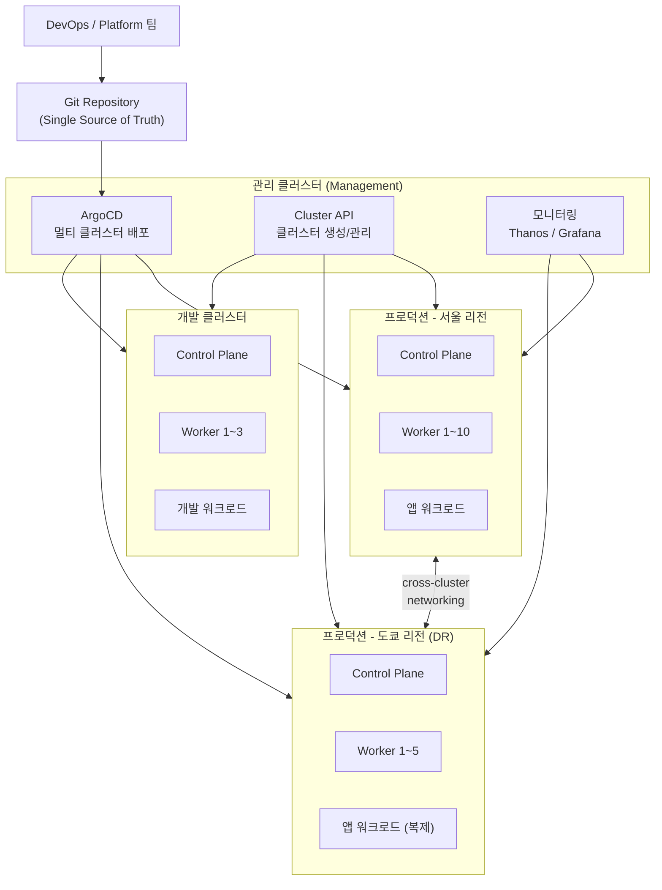
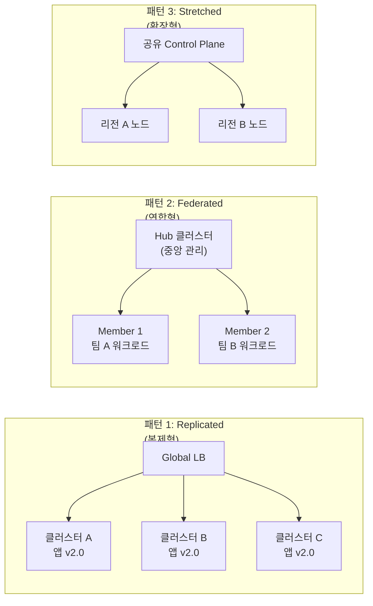
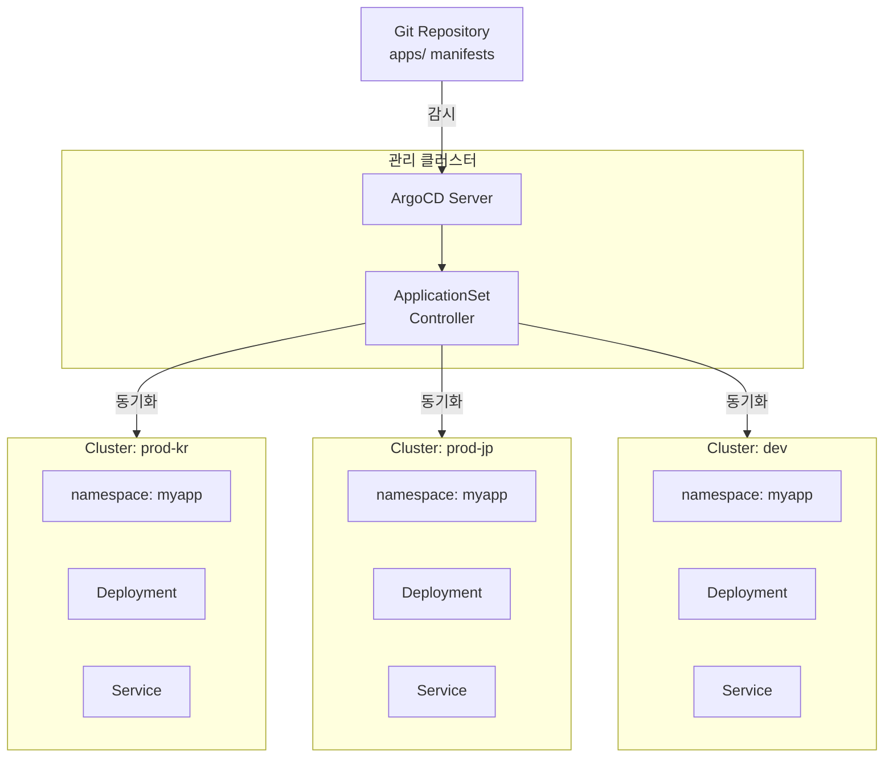
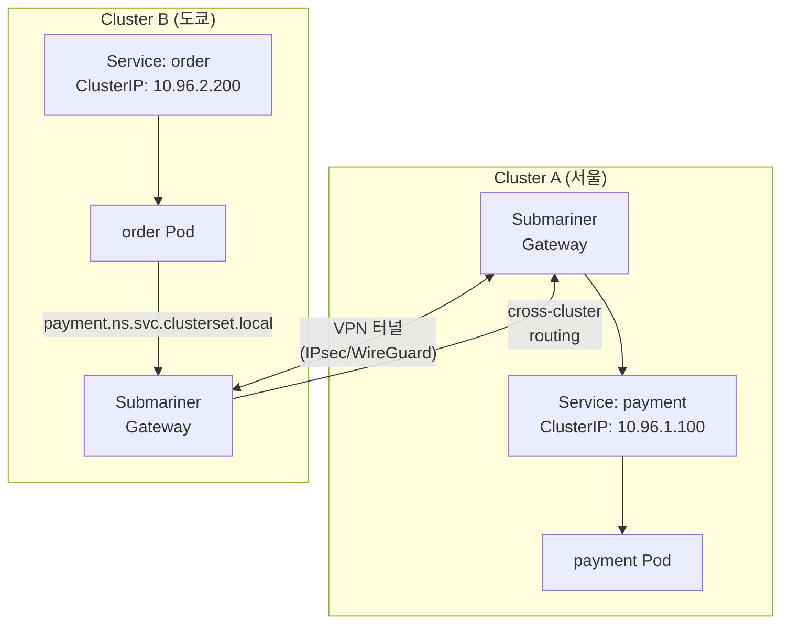

# 멀티 클러스터 / 하이브리드 K8s

> 하나의 K8s 클러스터로 시작했지만, 서비스가 커지면 반드시 **여러 클러스터**를 운영하게 돼요. DR, 지역 분산, 팀 분리, 규모 한계 — 모두 멀티 클러스터가 답이에요. [Service Mesh](./18-service-mesh)에서 클러스터 내부 통신을 배웠다면, 이제는 **클러스터 간 통신과 통합 관리**를 배울 차례예요. 이번 강의로 04-kubernetes 카테고리를 완성해요!

---

## 🎯 이걸 왜 알아야 하나?

```
실무에서 멀티 클러스터가 필요한 순간:
• "서울 리전 장애 시 도쿄로 전환해야 해요"           → DR/HA
• "유럽 사용자 응답이 느려요"                        → 지역 분산 (latency)
• "dev/staging/prod를 완전히 격리하고 싶어요"        → 환경 분리
• "팀마다 독립적인 클러스터를 운영하고 싶어요"       → 팀 분리
• "노드 5,000대인데 한 클러스터로 안 돼요"           → 규모 한계
• "개인정보는 반드시 국내에 저장해야 해요"           → 데이터 주권/규제
• "온프레미스 + AWS를 함께 쓰고 싶어요"              → 하이브리드 클라우드
• 면접: "멀티 클러스터 전략을 설명해주세요"
```

---

## 🧠 핵심 개념

### 비유: 프랜차이즈 체인점 운영

멀티 클러스터를 **프랜차이즈 체인점**에 비유해볼게요.

* **단일 클러스터** = 매장 1개로 모든 걸 처리. 매장이 커지면 관리 한계
* **멀티 클러스터** = 여러 지역에 매장을 내는 것. 각 매장은 독립적으로 운영
* **본사 (Control Plane)** = ArgoCD, Cluster API 같은 중앙 관리 도구
* **메뉴판 (Git 저장소)** = 모든 매장이 같은 메뉴를 제공하도록 표준화
* **배송 네트워크** = 클러스터 간 네트워킹 (Submariner, Cilium ClusterMesh)
* **지역 본부** = 하이브리드 클라우드에서 온프레미스/클라우드 각각의 관리 체계

하나의 매장(단일 클러스터)에서 모든 주문을 처리하다가 한계에 도달하면, 지역별로 매장(클러스터)을 분산시키고 본사(중앙 관리)에서 통합 관리하는 구조가 되는 거예요.

---

### 멀티 클러스터 전체 토폴로지



---

### 멀티 클러스터 3가지 패턴



| 패턴 | 설명 | 장점 | 단점 | 예시 |
|------|------|------|------|------|
| **Replicated** | 같은 앱을 여러 클러스터에 복제 | DR, 지역 분산 쉬움 | 데이터 동기화 필요 | Global SaaS |
| **Federated** | 중앙 Hub에서 Member 클러스터 관리 | 통합 정책, 가시성 | Hub 장애 시 위험 | 대기업 플랫폼 팀 |
| **Stretched** | 하나의 논리 클러스터를 여러 리전에 확장 | 단일 API, 간단한 운영 | 네트워크 지연 민감 | 같은 리전 내 AZ 분산 |

---

## 🔍 상세 설명

### 왜 멀티 클러스터?

단일 클러스터의 한계를 정리해볼게요.

```
단일 클러스터의 한계점:

1. DR/HA
   - 리전 장애 시 전체 서비스 다운
   - 복구 시간(RTO)이 길어짐
   → [백업/DR](./16-backup-dr) 참고

2. 지역 분산 (Latency)
   - 서울에만 클러스터 → 미국 사용자 응답 200ms+
   - 사용자 가까운 리전에 클러스터 배치 필요
   → [DNS 기반 라우팅](../02-networking/03-dns) 활용

3. 팀/환경 분리
   - dev/staging/prod 혼재 → 사고 위험
   - 팀 간 리소스 충돌, RBAC 복잡
   → Namespace 분리로 부족한 경우

4. 규모 한계
   - K8s 권장: 노드 5,000대, Pod 150,000개
   - etcd 성능 한계, API Server 부하

5. 데이터 주권/규제
   - GDPR: EU 데이터는 EU에 저장
   - 국내법: 개인정보 국내 보관 의무
   - 리전별 클러스터로 규제 준수
```

---

### kubeconfig 멀티 클러스터 관리

멀티 클러스터 운영의 기본은 **kubeconfig context 관리**예요.

```yaml
# ~/.kube/config — 멀티 클러스터 kubeconfig 예시
apiVersion: v1
kind: Config

# 클러스터 정의
clusters:
- name: prod-kr            # 프로덕션 서울
  cluster:
    server: https://api.prod-kr.example.com:6443
    certificate-authority-data: LS0tLS1CRUd...
- name: prod-jp            # 프로덕션 도쿄 (DR)
  cluster:
    server: https://api.prod-jp.example.com:6443
    certificate-authority-data: LS0tLS1CRUd...
- name: dev                # 개발 클러스터
  cluster:
    server: https://api.dev.example.com:6443
    certificate-authority-data: LS0tLS1CRUd...

# 사용자 인증 정보
users:
- name: admin-prod-kr
  user:
    token: eyJhbGciOiJS...
- name: admin-prod-jp
  user:
    token: eyJhbGciOiJS...
- name: dev-user
  user:
    token: eyJhbGciOiJS...

# 컨텍스트: 클러스터 + 사용자 + 네임스페이스 조합
contexts:
- name: prod-kr             # 서울 프로덕션
  context:
    cluster: prod-kr
    user: admin-prod-kr
    namespace: default
- name: prod-jp             # 도쿄 DR
  context:
    cluster: prod-jp
    user: admin-prod-jp
    namespace: default
- name: dev                 # 개발
  context:
    cluster: dev
    user: dev-user
    namespace: dev-team

# 현재 활성 컨텍스트
current-context: prod-kr
```

```bash
# 현재 컨텍스트 확인
kubectl config current-context
# 출력: prod-kr

# 모든 컨텍스트 목록
kubectl config get-contexts
# 출력:
# CURRENT   NAME      CLUSTER    AUTHINFO        NAMESPACE
# *         prod-kr   prod-kr    admin-prod-kr   default
#           prod-jp   prod-jp    admin-prod-jp   default
#           dev       dev        dev-user        dev-team

# 컨텍스트 전환
kubectl config use-context prod-jp
# 출력: Switched to context "prod-jp".

# 특정 컨텍스트로 명령 실행 (전환 없이)
kubectl --context=dev get pods
# 출력: dev 클러스터의 Pod 목록

# 여러 클러스터 동시 조회 (for 루프)
for ctx in prod-kr prod-jp dev; do
  echo "=== $ctx ==="
  kubectl --context=$ctx get nodes -o wide
done
# 출력:
# === prod-kr ===
# NAME       STATUS   ROLES    AGE   VERSION   INTERNAL-IP    ...
# node-kr-1  Ready    <none>   30d   v1.28.4   10.10.1.11     ...
# node-kr-2  Ready    <none>   30d   v1.28.4   10.10.1.12     ...
# === prod-jp ===
# NAME       STATUS   ROLES    AGE   VERSION   INTERNAL-IP    ...
# node-jp-1  Ready    <none>   15d   v1.28.4   10.20.1.11     ...
# === dev ===
# NAME       STATUS   ROLES    AGE   VERSION   INTERNAL-IP    ...
# node-dev-1 Ready    <none>   7d    v1.29.1   10.30.1.11     ...
```

#### kubectx / kubens (편의 도구)

```bash
# kubectx 설치 (macOS)
brew install kubectx

# 컨텍스트 전환 (kubectx)
kubectx prod-kr
# 출력: Switched to context "prod-kr".

# 이전 컨텍스트로 복귀 (- 사용)
kubectx -
# 출력: Switched to context "prod-jp".

# 네임스페이스 전환 (kubens)
kubens kube-system
# 출력: Context "prod-kr" modified.
#        Active namespace is "kube-system".

# 모든 컨텍스트 목록 (현재 컨텍스트 하이라이팅)
kubectx
# 출력:
# dev
# prod-jp
# prod-kr  ← 현재 컨텍스트 (하이라이팅)
```

---

### 멀티 클러스터 패턴 상세

#### 패턴 1: Replicated (복제형)

같은 애플리케이션을 **여러 클러스터에 동일하게 배포**하는 패턴이에요. Global Load Balancer(Route 53, Cloudflare)가 트래픽을 분산해요.

```
사용 시나리오:
- 글로벌 SaaS 서비스 (사용자 가까운 리전에서 서비스)
- Active-Active DR (서울 장애 시 도쿄가 즉시 처리)
- 규제 대응 (EU 트래픽은 EU 클러스터, 아시아는 아시아 클러스터)

비유: 맥도날드 — 전 세계 매장에서 같은 빅맥을 팔아요.
      메뉴(앱)는 동일, 재료 공급(데이터)만 지역별로 다름.
```

#### 패턴 2: Federated (연합형)

**Hub 클러스터**가 여러 **Member 클러스터**를 중앙에서 관리하는 패턴이에요.

```
사용 시나리오:
- 플랫폼 팀이 여러 팀의 클러스터를 통합 관리
- 통합 정책 적용 (보안, 네트워크, 리소스 쿼터)
- 워크로드 스케줄링 (부하에 따라 클러스터 간 이동)

비유: 본사-지사 구조 — 본사가 정책/표준을 정하고,
      각 지사는 본사 기준에 맞춰 독립적으로 운영해요.
```

#### 패턴 3: Stretched (확장형)

하나의 **논리적 클러스터**를 여러 리전/AZ에 걸쳐 확장하는 패턴이에요.

```
사용 시나리오:
- 같은 리전 내 AZ 분산 (서울 a, b, c 가용 영역)
- 네트워크 지연이 매우 낮은 환경 (<2ms)
- 단일 API로 관리하고 싶은 경우

비유: 하나의 대형 매장이 여러 건물에 걸쳐 있는 것.
      고객은 하나의 매장으로 인식하지만, 내부는 분산됨.

주의: 리전 간 지연이 크면 etcd 동기화 문제 발생!
```

---

### ArgoCD 멀티 클러스터 배포

[Helm/Kustomize](./12-helm-kustomize)에서 배운 ArgoCD를 멀티 클러스터로 확장해볼게요.



#### ArgoCD에 클러스터 등록

```bash
# ArgoCD CLI 로그인
argocd login argocd.example.com --username admin --password $ARGO_PASSWORD
# 출력: 'admin:login' logged in successfully

# 대상 클러스터 등록 (kubeconfig context 이름 사용)
argocd cluster add prod-kr --name prod-kr
# 출력:
# INFO[0000] ServiceAccount "argocd-manager" created in namespace "kube-system"
# INFO[0000] ClusterRole "argocd-manager-role" created
# INFO[0000] ClusterRoleBinding "argocd-manager-role-binding" created
# Cluster 'https://api.prod-kr.example.com:6443' added

argocd cluster add prod-jp --name prod-jp
# 출력: Cluster 'https://api.prod-jp.example.com:6443' added

argocd cluster add dev --name dev
# 출력: Cluster 'https://api.dev.example.com:6443' added

# 등록된 클러스터 확인
argocd cluster list
# 출력:
# SERVER                                       NAME     VERSION  STATUS
# https://kubernetes.default.svc               in-cluster  1.28  Successful
# https://api.prod-kr.example.com:6443         prod-kr     1.28  Successful
# https://api.prod-jp.example.com:6443         prod-jp     1.28  Successful
# https://api.dev.example.com:6443             dev         1.29  Successful
```

#### ApplicationSet — 여러 클러스터에 동시 배포

```yaml
# applicationset-myapp.yaml
# Git의 앱 매니페스트를 여러 클러스터에 한 번에 배포
apiVersion: argoproj.io/v1alpha1
kind: ApplicationSet
metadata:
  name: myapp-multi-cluster
  namespace: argocd
spec:
  generators:
  # Cluster Generator: ArgoCD에 등록된 클러스터 기반으로 생성
  - clusters:
      selector:
        matchLabels:
          env: production          # 'production' 라벨이 있는 클러스터만 대상
  template:
    metadata:
      # 각 클러스터 이름을 포함한 Application 이름
      name: 'myapp-{{name}}'
    spec:
      project: default
      source:
        repoURL: https://github.com/myorg/k8s-apps.git
        targetRevision: main
        path: apps/myapp/overlays/{{metadata.labels.region}}  # 리전별 오버레이
      destination:
        server: '{{server}}'       # 각 클러스터의 API 서버 URL
        namespace: myapp
      syncPolicy:
        automated:
          prune: true              # Git에서 삭제된 리소스 자동 삭제
          selfHeal: true           # 수동 변경 시 자동 복구
        syncOptions:
        - CreateNamespace=true     # 네임스페이스 자동 생성
```

```bash
# ApplicationSet 배포
kubectl apply -f applicationset-myapp.yaml --context=mgmt-cluster
# 출력: applicationset.argoproj.io/myapp-multi-cluster created

# 생성된 Application 확인
argocd app list
# 출력:
# NAME              CLUSTER                                  STATUS  HEALTH   SYNC
# myapp-prod-kr     https://api.prod-kr.example.com:6443     Synced  Healthy  Synced
# myapp-prod-jp     https://api.prod-jp.example.com:6443     Synced  Healthy  Synced
```

---

### Cluster API — 선언적 클러스터 생성/관리

Cluster API(CAPI)는 K8s 클러스터 자체를 **K8s 리소스로 선언적으로 관리**하는 프로젝트예요. [K8s 아키텍처](./01-architecture)에서 배운 선언적 관리 방식을 클러스터 생성에도 적용하는 거예요.

```yaml
# cluster-prod-jp.yaml
# Cluster API로 AWS에 K8s 클러스터를 선언적으로 생성
apiVersion: cluster.x-k8s.io/v1beta1
kind: Cluster
metadata:
  name: prod-jp
  namespace: clusters
spec:
  clusterNetwork:
    pods:
      cidrBlocks: ["192.168.0.0/16"]       # Pod 네트워크 대역
    services:
      cidrBlocks: ["10.96.0.0/12"]          # Service 네트워크 대역
  controlPlaneRef:
    apiVersion: controlplane.cluster.x-k8s.io/v1beta2
    kind: KubeadmControlPlane
    name: prod-jp-control-plane
  infrastructureRef:
    apiVersion: infrastructure.cluster.x-k8s.io/v1beta2
    kind: AWSCluster                         # AWS Infrastructure Provider
    name: prod-jp
---
# AWS 클러스터 인프라 설정
apiVersion: infrastructure.cluster.x-k8s.io/v1beta2
kind: AWSCluster
metadata:
  name: prod-jp
  namespace: clusters
spec:
  region: ap-northeast-1                     # 도쿄 리전
  sshKeyName: k8s-admin
  network:
    vpc:
      cidrBlock: 10.20.0.0/16
---
# Control Plane 설정
apiVersion: controlplane.cluster.x-k8s.io/v1beta2
kind: KubeadmControlPlane
metadata:
  name: prod-jp-control-plane
  namespace: clusters
spec:
  replicas: 3                                # HA를 위해 3개
  version: v1.28.4
  machineTemplate:
    infrastructureRef:
      apiVersion: infrastructure.cluster.x-k8s.io/v1beta2
      kind: AWSMachineTemplate
      name: prod-jp-control-plane
---
# Worker 노드 (MachineDeployment)
apiVersion: cluster.x-k8s.io/v1beta1
kind: MachineDeployment
metadata:
  name: prod-jp-workers
  namespace: clusters
spec:
  clusterName: prod-jp
  replicas: 5                                # Worker 노드 5대
  selector:
    matchLabels: {}
  template:
    spec:
      clusterName: prod-jp
      version: v1.28.4
      bootstrap:
        configRef:
          apiVersion: bootstrap.cluster.x-k8s.io/v1beta1
          kind: KubeadmConfigTemplate
          name: prod-jp-workers
      infrastructureRef:
        apiVersion: infrastructure.cluster.x-k8s.io/v1beta2
        kind: AWSMachineTemplate
        name: prod-jp-workers
```

```bash
# Cluster API로 클러스터 생성
kubectl apply -f cluster-prod-jp.yaml --context=mgmt-cluster
# 출력:
# cluster.cluster.x-k8s.io/prod-jp created
# awscluster.infrastructure.cluster.x-k8s.io/prod-jp created
# kubeadmcontrolplane.controlplane.cluster.x-k8s.io/prod-jp-control-plane created
# machinedeployment.cluster.x-k8s.io/prod-jp-workers created

# 클러스터 프로비저닝 상태 확인
kubectl get clusters --context=mgmt-cluster
# 출력:
# NAME      PHASE         AGE    VERSION
# prod-kr   Provisioned   30d    v1.28.4
# prod-jp   Provisioning  2m     v1.28.4

# 상세 상태 (Machine 단위)
kubectl get machines -l cluster.x-k8s.io/cluster-name=prod-jp --context=mgmt-cluster
# 출력:
# NAME                          CLUSTER   NODENAME   PROVIDERID   PHASE        AGE
# prod-jp-control-plane-abc12   prod-jp                           Provisioning 2m
# prod-jp-control-plane-def34   prod-jp                           Pending      2m
# prod-jp-control-plane-ghi56   prod-jp                           Pending      2m
```

---

### 멀티 클러스터 네트워킹

클러스터 간 **서비스 디스커버리와 통신**이 멀티 클러스터의 핵심 과제예요. [Service/Ingress](./05-service-ingress)는 단일 클러스터 내부 통신이었다면, 이제는 클러스터를 넘는 통신이에요.



#### Submariner — 클러스터 간 네트워크 연결

```bash
# subctl 설치 (Submariner CLI)
curl -Ls https://get.submariner.io | VERSION=v0.17.0 bash

# Broker 설정 (관리 클러스터에서)
subctl deploy-broker --context mgmt-cluster
# 출력:
# ✓ Setting up broker RBAC
# ✓ Deploying the Submariner operator
# ✓ Created Broker namespace: submariner-k8s-broker
# ✓ Broker deployed successfully

# 클러스터 A (서울) 연결
subctl join broker-info.subm --context prod-kr \
  --clusterid prod-kr \
  --natt=false
# 출력:
# ✓ Deploying Submariner gateway node
# ✓ Deploying Submariner route agent
# ✓ Connected to broker

# 클러스터 B (도쿄) 연결
subctl join broker-info.subm --context prod-jp \
  --clusterid prod-jp \
  --natt=false
# 출력:
# ✓ Deploying Submariner gateway node
# ✓ Connected to broker

# 연결 상태 확인
subctl show connections --context prod-kr
# 출력:
# GATEWAY       CLUSTER   REMOTE IP     NAT   CABLE DRIVER   STATUS
# node-jp-gw    prod-jp   52.xx.xx.xx   no    vxlan          connected

# cross-cluster 서비스 디스커버리 확인
subctl show endpoints --context prod-kr
# 출력:
# CLUSTER   ENDPOINT IP    PUBLIC IP       CABLE DRIVER
# prod-kr   10.10.1.5      3.xx.xx.xx      vxlan
# prod-jp   10.20.1.5      52.xx.xx.xx     vxlan
```

#### ServiceExport / ServiceImport — cross-cluster 서비스 노출

```yaml
# 서울 클러스터에서 payment 서비스를 다른 클러스터에 노출
# service-export.yaml
apiVersion: multicluster.x-k8s.io/v1alpha1
kind: ServiceExport
metadata:
  name: payment              # 노출할 Service 이름
  namespace: finance
```

```bash
# 서울 클러스터에 ServiceExport 적용
kubectl apply -f service-export.yaml --context=prod-kr
# 출력: serviceexport.multicluster.x-k8s.io/payment created

# 도쿄 클러스터에서 서울의 payment 서비스 접근
kubectl --context=prod-jp run test-pod --rm -it --image=curlimages/curl -- \
  curl http://payment.finance.svc.clusterset.local:8080/health
# 출력: {"status":"healthy","cluster":"prod-kr"}
# → clusterset.local 도메인으로 다른 클러스터의 서비스에 접근!
```

#### Cilium ClusterMesh (대안)

```bash
# Cilium ClusterMesh 활성화
cilium clustermesh enable --context prod-kr
cilium clustermesh enable --context prod-jp

# 클러스터 연결
cilium clustermesh connect --context prod-kr --destination-context prod-jp
# 출력:
# ✅ Connected cluster prod-kr <-> prod-jp
# ℹ️  Run 'cilium clustermesh status' to monitor

# 상태 확인
cilium clustermesh status --context prod-kr
# 출력:
#   ✅ ClusterMesh is enabled
#   ✅ 1 connected cluster(s):
#     - prod-jp: connected (2 nodes)
```

---

### 하이브리드 클라우드

온프레미스와 클라우드를 함께 쓰는 **하이브리드** 구성이에요. [VPN](../02-networking/10-vpn)을 통해 두 환경을 연결하는 것이 기본이에요.

```
하이브리드 클라우드 도구 비교:

┌─────────────────┬──────────────┬──────────────┬───────────────┐
│ 도구            │ 제공사       │ 특징         │ 적합한 상황   │
├─────────────────┼──────────────┼──────────────┼───────────────┤
│ EKS Anywhere    │ AWS          │ 온프레미스에  │ AWS 중심 환경 │
│                 │              │ EKS 동일 경험│               │
├─────────────────┼──────────────┼──────────────┼───────────────┤
│ Anthos          │ Google       │ GKE 일관성   │ GCP 중심 환경 │
│                 │              │ 멀티클라우드 │               │
├─────────────────┼──────────────┼──────────────┼───────────────┤
│ Rancher         │ SUSE         │ 벤더 중립    │ 멀티클라우드  │
│                 │              │ 웹 UI 강점   │ 중소기업      │
├─────────────────┼──────────────┼──────────────┼───────────────┤
│ OpenShift       │ Red Hat      │ 엔터프라이즈 │ 대기업 온프렘 │
│                 │              │ 보안 강점    │               │
├─────────────────┼──────────────┼──────────────┼───────────────┤
│ Tanzu           │ VMware       │ vSphere 통합 │ VMware 환경   │
│                 │              │              │               │
└─────────────────┴──────────────┴──────────────┴───────────────┘
```

#### EKS Anywhere 예시

```bash
# EKS Anywhere CLI 설치
curl -fsSL https://anywhere.eks.amazonaws.com/install.sh | bash

# 클러스터 스펙 생성
eksctl anywhere generate clusterconfig hybrid-cluster \
  --provider vsphere > cluster-config.yaml
```

```yaml
# cluster-config.yaml (EKS Anywhere — vSphere 기반)
apiVersion: anywhere.eks.amazonaws.com/v1alpha1
kind: Cluster
metadata:
  name: hybrid-cluster
spec:
  clusterNetwork:
    cniConfig:
      cilium: {}                        # CNI는 Cilium 사용
    pods:
      cidrBlocks: ["192.168.0.0/16"]
    services:
      cidrBlocks: ["10.96.0.0/12"]
  controlPlaneConfiguration:
    count: 3                            # Control Plane 3대 (HA)
    endpoint:
      host: "10.0.0.100"               # 온프레미스 VIP
    machineGroupRef:
      kind: VSphereMachineConfig
      name: cp-machines
  workerNodeGroupConfigurations:
  - count: 5                            # Worker 5대
    machineGroupRef:
      kind: VSphereMachineConfig
      name: worker-machines
    name: workers
  kubernetesVersion: "1.28"
  managementCluster:
    name: hybrid-cluster
```

```bash
# 클러스터 생성 (온프레미스 vSphere에)
eksctl anywhere create cluster -f cluster-config.yaml
# 출력:
# Creating new bootstrap cluster
# Installing cluster-api providers on bootstrap cluster
# Creating new workload cluster
# Moving cluster management to workload cluster
# ✅ Cluster created!

# 생성 확인
kubectl get nodes --kubeconfig hybrid-cluster/hybrid-cluster-eks-a-cluster.kubeconfig
# 출력:
# NAME           STATUS   ROLES           AGE   VERSION
# cp-node-1      Ready    control-plane   10m   v1.28.4-eks-anywhere
# cp-node-2      Ready    control-plane   9m    v1.28.4-eks-anywhere
# cp-node-3      Ready    control-plane   8m    v1.28.4-eks-anywhere
# worker-node-1  Ready    <none>          5m    v1.28.4-eks-anywhere
# worker-node-2  Ready    <none>          5m    v1.28.4-eks-anywhere
```

---

### GitOps로 멀티 클러스터 관리

멀티 클러스터 환경에서 **Git을 Single Source of Truth**로 사용하는 것이 핵심이에요.

```
Git 저장소 구조 (멀티 클러스터 GitOps):

k8s-platform/
├── clusters/                      # 클러스터 정의 (Cluster API)
│   ├── prod-kr.yaml
│   ├── prod-jp.yaml
│   └── dev.yaml
├── infrastructure/                # 공통 인프라 컴포넌트
│   ├── base/
│   │   ├── cert-manager/
│   │   ├── ingress-nginx/
│   │   ├── monitoring/           # Prometheus, Grafana
│   │   └── service-mesh/         # Istio
│   └── overlays/
│       ├── prod/                 # 프로덕션 설정 오버레이
│       └── dev/                  # 개발 설정 오버레이
├── apps/                         # 애플리케이션 매니페스트
│   ├── myapp/
│   │   ├── base/                 # 공통 Deployment, Service
│   │   │   ├── kustomization.yaml
│   │   │   ├── deployment.yaml
│   │   │   └── service.yaml
│   │   └── overlays/
│   │       ├── prod-kr/          # 서울: replicas 10, 고사양
│   │       ├── prod-jp/          # 도쿄: replicas 5, DR용
│   │       └── dev/              # 개발: replicas 1, 저사양
│   └── payment/
│       ├── base/
│       └── overlays/
└── argocd/                       # ArgoCD ApplicationSet 정의
    ├── applicationsets/
    │   ├── infra-appset.yaml     # 인프라 컴포넌트 배포
    │   └── apps-appset.yaml      # 앱 배포
    └── projects/
        └── default.yaml
```

```yaml
# argocd/applicationsets/apps-appset.yaml
# 모든 앱을 모든 대상 클러스터에 자동 배포하는 ApplicationSet
apiVersion: argoproj.io/v1alpha1
kind: ApplicationSet
metadata:
  name: all-apps
  namespace: argocd
spec:
  generators:
  # Matrix Generator: 앱 목록 x 클러스터 목록의 조합 생성
  - matrix:
      generators:
      # Git 디렉토리에서 앱 목록 자동 감지
      - git:
          repoURL: https://github.com/myorg/k8s-platform.git
          revision: main
          directories:
          - path: apps/*/base         # apps/ 아래 모든 앱
      # 등록된 클러스터 중 production 라벨만
      - clusters:
          selector:
            matchLabels:
              env: production
  template:
    metadata:
      name: '{{path.basename}}-{{name}}'   # 예: myapp-prod-kr
    spec:
      project: default
      source:
        repoURL: https://github.com/myorg/k8s-platform.git
        targetRevision: main
        path: 'apps/{{path.basename}}/overlays/{{name}}'
      destination:
        server: '{{server}}'
        namespace: '{{path.basename}}'
      syncPolicy:
        automated:
          prune: true
          selfHeal: true
        syncOptions:
        - CreateNamespace=true
        retry:
          limit: 3                        # 실패 시 3회 재시도
          backoff:
            duration: 30s
            factor: 2
            maxDuration: 3m
```

---

## 💻 실습 예제

### 실습 1: kubeconfig 멀티 컨텍스트 설정

여러 클러스터의 kubeconfig를 합치고 컨텍스트를 전환하는 연습이에요.

```bash
# 1. 여러 kubeconfig 파일 합치기
# 각 클러스터에서 받은 kubeconfig가 별도 파일로 있다고 가정
export KUBECONFIG=~/.kube/cluster-a.yaml:~/.kube/cluster-b.yaml:~/.kube/cluster-c.yaml

# 합쳐진 설정 확인
kubectl config view
# 출력: 모든 클러스터, 사용자, 컨텍스트가 합쳐져서 표시

# 2. 영구 합치기 (하나의 파일로)
kubectl config view --flatten > ~/.kube/config-merged
cp ~/.kube/config ~/.kube/config-backup     # 백업!
cp ~/.kube/config-merged ~/.kube/config

# 3. 컨텍스트 확인
kubectl config get-contexts
# 출력:
# CURRENT   NAME         CLUSTER      AUTHINFO       NAMESPACE
# *         cluster-a    cluster-a    user-a         default
#           cluster-b    cluster-b    user-b         default
#           cluster-c    cluster-c    user-c         default

# 4. 컨텍스트 전환 및 확인
kubectl config use-context cluster-b
kubectl get nodes
# 출력: cluster-b의 노드 목록

# 5. 컨텍스트 이름 변경 (읽기 쉽게)
kubectl config rename-context cluster-a prod-kr
kubectl config rename-context cluster-b prod-jp
kubectl config rename-context cluster-c dev
# 출력: Context "cluster-a" renamed to "prod-kr".
#        Context "cluster-b" renamed to "prod-jp".
#        Context "cluster-c" renamed to "dev".

# 6. 여러 클러스터 상태 한눈에 보기
for ctx in prod-kr prod-jp dev; do
  echo ""
  echo "=============================="
  echo " Cluster: $ctx"
  echo "=============================="
  kubectl --context=$ctx get nodes -o wide 2>/dev/null || echo "  ❌ 연결 실패"
  kubectl --context=$ctx get pods -A --field-selector=status.phase!=Running 2>/dev/null | head -5
done
```

---

### 실습 2: ArgoCD ApplicationSet으로 멀티 클러스터 배포

ArgoCD가 설치된 관리 클러스터에서 여러 클러스터에 nginx를 배포하는 실습이에요.

```bash
# 1. ArgoCD에 대상 클러스터 등록 (이미 kubeconfig에 있어야 함)
argocd cluster add prod-kr --name prod-kr --label env=production --label region=kr
argocd cluster add prod-jp --name prod-jp --label env=production --label region=jp
argocd cluster add dev --name dev --label env=development --label region=kr
```

```yaml
# 2. 앱 매니페스트 준비 (Git 저장소에 커밋)
# apps/nginx-demo/base/deployment.yaml
apiVersion: apps/v1
kind: Deployment
metadata:
  name: nginx-demo
spec:
  selector:
    matchLabels:
      app: nginx-demo
  template:
    metadata:
      labels:
        app: nginx-demo
    spec:
      containers:
      - name: nginx
        image: nginx:1.25
        ports:
        - containerPort: 80
        resources:
          requests:
            cpu: 100m
            memory: 128Mi
          limits:
            cpu: 200m
            memory: 256Mi
---
# apps/nginx-demo/base/service.yaml
apiVersion: v1
kind: Service
metadata:
  name: nginx-demo
spec:
  selector:
    app: nginx-demo
  ports:
  - port: 80
    targetPort: 80
---
# apps/nginx-demo/base/kustomization.yaml
apiVersion: kustomize.config.k8s.io/v1beta1
kind: Kustomization
resources:
- deployment.yaml
- service.yaml
```

```yaml
# apps/nginx-demo/overlays/prod-kr/kustomization.yaml
# 서울 프로덕션: replicas 5
apiVersion: kustomize.config.k8s.io/v1beta1
kind: Kustomization
resources:
- ../../base
patches:
- patch: |-
    apiVersion: apps/v1
    kind: Deployment
    metadata:
      name: nginx-demo
    spec:
      replicas: 5    # 서울: 메인 트래픽, 5대
```

```yaml
# apps/nginx-demo/overlays/prod-jp/kustomization.yaml
# 도쿄 DR: replicas 2
apiVersion: kustomize.config.k8s.io/v1beta1
kind: Kustomization
resources:
- ../../base
patches:
- patch: |-
    apiVersion: apps/v1
    kind: Deployment
    metadata:
      name: nginx-demo
    spec:
      replicas: 2    # 도쿄: DR 대기, 2대
```

```yaml
# 3. ApplicationSet 생성
# applicationset-nginx-demo.yaml
apiVersion: argoproj.io/v1alpha1
kind: ApplicationSet
metadata:
  name: nginx-demo
  namespace: argocd
spec:
  generators:
  - clusters:
      selector:
        matchLabels:
          env: production        # production 라벨 클러스터만
  template:
    metadata:
      name: 'nginx-demo-{{name}}'
    spec:
      project: default
      source:
        repoURL: https://github.com/myorg/k8s-platform.git
        targetRevision: main
        path: 'apps/nginx-demo/overlays/{{metadata.labels.region}}'
      destination:
        server: '{{server}}'
        namespace: nginx-demo
      syncPolicy:
        automated:
          prune: true
          selfHeal: true
        syncOptions:
        - CreateNamespace=true
```

```bash
# 4. ApplicationSet 배포
kubectl apply -f applicationset-nginx-demo.yaml --context=mgmt-cluster
# 출력: applicationset.argoproj.io/nginx-demo created

# 5. 배포 상태 확인
argocd app list | grep nginx
# 출력:
# nginx-demo-prod-kr  https://api.prod-kr...  Synced  Healthy  Automated
# nginx-demo-prod-jp  https://api.prod-jp...  Synced  Healthy  Automated

# 6. 각 클러스터에서 Pod 확인
kubectl --context=prod-kr get pods -n nginx-demo
# 출력:
# NAME                          READY   STATUS    RESTARTS   AGE
# nginx-demo-7d9f8b6c4d-abc12  1/1     Running   0          2m
# nginx-demo-7d9f8b6c4d-def34  1/1     Running   0          2m
# nginx-demo-7d9f8b6c4d-ghi56  1/1     Running   0          2m
# nginx-demo-7d9f8b6c4d-jkl78  1/1     Running   0          2m
# nginx-demo-7d9f8b6c4d-mno90  1/1     Running   0          2m
# → 서울: 5개 Pod

kubectl --context=prod-jp get pods -n nginx-demo
# 출력:
# NAME                          READY   STATUS    RESTARTS   AGE
# nginx-demo-7d9f8b6c4d-pqr12  1/1     Running   0          2m
# nginx-demo-7d9f8b6c4d-stu34  1/1     Running   0          2m
# → 도쿄: 2개 Pod (DR 대기)
```

---

### 실습 3: 멀티 클러스터 모니터링 스크립트

여러 클러스터의 상태를 한눈에 확인하는 스크립트예요.

```bash
#!/bin/bash
# multi-cluster-status.sh
# 모든 클러스터의 핵심 상태를 한눈에 보여주는 스크립트

# 대상 클러스터 목록
CLUSTERS=("prod-kr" "prod-jp" "dev")

# 색상 정의
RED='\033[0;31m'
GREEN='\033[0;32m'
YELLOW='\033[1;33m'
NC='\033[0m' # No Color

echo "============================================"
echo " Multi-Cluster Status Dashboard"
echo " $(date '+%Y-%m-%d %H:%M:%S')"
echo "============================================"

for cluster in "${CLUSTERS[@]}"; do
  echo ""
  echo "━━━━━━━━━━━━━━━━━━━━━━━━━━━━━━━━━━━━━━━━"
  echo -e " Cluster: ${YELLOW}${cluster}${NC}"
  echo "━━━━━━━━━━━━━━━━━━━━━━━━━━━━━━━━━━━━━━━━"

  # 연결 테스트
  if ! kubectl --context="$cluster" cluster-info &>/dev/null; then
    echo -e "  ${RED}Connection FAILED${NC}"
    continue
  fi

  # 노드 상태
  echo ""
  echo "  [Nodes]"
  total_nodes=$(kubectl --context="$cluster" get nodes --no-headers 2>/dev/null | wc -l)
  ready_nodes=$(kubectl --context="$cluster" get nodes --no-headers 2>/dev/null | grep " Ready" | wc -l)
  if [ "$total_nodes" -eq "$ready_nodes" ]; then
    echo -e "  ${GREEN}Ready: ${ready_nodes}/${total_nodes}${NC}"
  else
    echo -e "  ${RED}Ready: ${ready_nodes}/${total_nodes} ⚠️${NC}"
  fi

  # Pod 상태 요약
  echo ""
  echo "  [Pods]"
  total_pods=$(kubectl --context="$cluster" get pods -A --no-headers 2>/dev/null | wc -l)
  running_pods=$(kubectl --context="$cluster" get pods -A --no-headers 2>/dev/null | grep "Running" | wc -l)
  failed_pods=$(kubectl --context="$cluster" get pods -A --no-headers 2>/dev/null | grep -E "Error|CrashLoop|Failed" | wc -l)
  echo "  Total: $total_pods | Running: $running_pods | Failed: $failed_pods"

  # 문제 있는 Pod 표시
  if [ "$failed_pods" -gt 0 ]; then
    echo -e "  ${RED}Problem Pods:${NC}"
    kubectl --context="$cluster" get pods -A --no-headers 2>/dev/null | \
      grep -E "Error|CrashLoop|Failed" | \
      awk '{printf "    %-20s %-40s %s\n", $1, $2, $4}'
  fi

  # 리소스 사용량
  echo ""
  echo "  [Resource Usage]"
  kubectl --context="$cluster" top nodes --no-headers 2>/dev/null | \
    awk '{printf "    %-15s CPU: %-8s MEM: %s\n", $1, $3, $5}' || \
    echo "    (metrics-server not available)"
done

echo ""
echo "============================================"
echo " Scan complete."
echo "============================================"
```

```bash
# 스크립트 실행
chmod +x multi-cluster-status.sh
./multi-cluster-status.sh
# 출력:
# ============================================
#  Multi-Cluster Status Dashboard
#  2026-03-13 14:30:00
# ============================================
#
# ━━━━━━━━━━━━━━━━━━━━━━━━━━━━━━━━━━━━━━━━
#  Cluster: prod-kr
# ━━━━━━━━━━━━━━━━━━━━━━━━━━━━━━━━━━━━━━━━
#
#   [Nodes]
#   Ready: 10/10
#
#   [Pods]
#   Total: 87 | Running: 85 | Failed: 2
#   Problem Pods:
#     monitoring          alertmanager-xxx                         CrashLoopBackOff
#     logging             fluentd-abc12                            Error
#
#   [Resource Usage]
#     node-kr-1       CPU: 45%     MEM: 62%
#     node-kr-2       CPU: 38%     MEM: 55%
#     ...
```

---

## 🏢 실무에서는?

### 시나리오 1: 글로벌 SaaS — Active-Active 멀티 리전

```
상황: B2B SaaS를 서울, 도쿄, 싱가포르에서 서비스

구성:
- 패턴: Replicated (각 리전에 동일한 앱 배포)
- 관리: ArgoCD ApplicationSet (Git push 한 번에 3개 리전 동시 배포)
- 네트워크: Cilium ClusterMesh (cross-cluster service discovery)
- 라우팅: Route 53 Latency-based Routing (사용자 가까운 리전)
- 데이터: CockroachDB 멀티 리전 (리전 간 데이터 자동 복제)
- DR: 한 리전 장애 시 다른 리전이 즉시 처리 (Active-Active)

포인트:
- Route 53 헬스체크로 장애 리전 자동 제외
- 데이터 주권 이슈: EU 고객 데이터는 EU 리전에만 저장
- 배포는 롤링으로 리전 순차 적용 (서울 → 도쿄 → 싱가포르)
```

### 시나리오 2: 금융사 — 온프레미스 + 클라우드 하이브리드

```
상황: 핵심 금융 시스템은 온프레미스, 비핵심 서비스는 클라우드

구성:
- 온프레미스: OpenShift (보안 강화, 금융 규제 준수)
  → 핵심 거래 시스템, 고객 DB
- 클라우드 (AWS): EKS
  → 웹 프론트엔드, API Gateway, 분석 시스템
- 연결: AWS Direct Connect + VPN 이중화
- 관리: Rancher로 양쪽 클러스터 통합 관리
- 네트워크: Submariner로 cross-cluster 통신

포인트:
- 금감원 규제: 고객 개인정보는 반드시 온프레미스
- 온프레미스 ↔ 클라우드 지연: Direct Connect로 <5ms 보장
- 장애 대응: 클라우드 장애 시 온프레미스만으로 핵심 서비스 유지
- 비용: 온프레미스 고정 비용 + 클라우드 변동 비용 최적화
```

### 시나리오 3: 스타트업 성장기 — 단일 → 멀티 클러스터 전환

```
상황: 사용자 급증으로 단일 클러스터 한계에 도달

전환 과정:
1단계 (현재): 단일 클러스터 — dev/staging/prod 모두 Namespace 분리
  → 문제: prod 배포 실패가 dev에도 영향, etcd 부하 증가

2단계: 환경 분리 — prod/non-prod 2개 클러스터
  → prod 클러스터: 안정성 우선, 변경 최소화
  → non-prod 클러스터: dev + staging, 자유롭게 실험
  → ArgoCD로 두 클러스터 동시 관리 시작

3단계: 리전 확장 — 서울 + 도쿄(DR) 3개 클러스터
  → 도쿄에 DR 클러스터 추가
  → Velero로 서울 → 도쿄 백업/복원 자동화
  → [백업/DR 전략](./16-backup-dr) 적용

포인트:
- 처음부터 멀티 클러스터는 과도한 복잡성 (YAGNI)
- 문제가 생길 때마다 점진적으로 확장
- GitOps 기반이면 클러스터 추가가 쉬움 (Git에 클러스터 설정만 추가)
```

---

## ⚠️ 자주 하는 실수

### ❌ 실수 1: 처음부터 멀티 클러스터로 시작

```
❌ 잘못된 판단:
"우리도 대기업처럼 멀티 클러스터로 시작하자!"
→ 운영 복잡도 급증, 소규모 팀으로 감당 불가

✅ 올바른 접근:
단일 클러스터로 시작 → 한계에 도달할 때 분리
→ 멀티 클러스터는 "필요할 때" 도입하는 것이지, "있으면 좋은 것"이 아니에요
→ 3명 DevOps 팀으로 5개 클러스터 운영? 불가능에 가까워요
```

### ❌ 실수 2: kubeconfig context 미확인으로 잘못된 클러스터에 배포

```bash
# ❌ 현재 context 확인 없이 바로 배포
kubectl apply -f production-deploy.yaml
# → 개발 클러스터에 프로덕션 설정이 배포될 수 있음!

# ✅ 항상 context 확인 후 명시적으로 지정
kubectl config current-context           # 먼저 확인
kubectl apply -f production-deploy.yaml --context=prod-kr  # 명시적 지정

# 추가 안전장치: 프롬프트에 클러스터 이름 표시
# ~/.bashrc에 추가
export PS1="\[\e[33m\](k8s: \$(kubectl config current-context 2>/dev/null))\[\e[0m\] \$ "
# 출력: (k8s: prod-kr) $
```

### ❌ 실수 3: 클러스터 간 네트워크 대역 충돌

```
❌ 잘못된 설정:
Cluster A — Pod CIDR: 10.244.0.0/16, Service CIDR: 10.96.0.0/12
Cluster B — Pod CIDR: 10.244.0.0/16, Service CIDR: 10.96.0.0/12
→ Submariner/ClusterMesh 연결 시 IP 충돌!

✅ 올바른 설정 (클러스터마다 다른 대역):
Cluster A — Pod CIDR: 10.10.0.0/16,  Service CIDR: 10.110.0.0/16
Cluster B — Pod CIDR: 10.20.0.0/16,  Service CIDR: 10.120.0.0/16
Cluster C — Pod CIDR: 10.30.0.0/16,  Service CIDR: 10.130.0.0/16
→ 클러스터 생성 시 반드시 CIDR 계획을 먼저 세우세요!
```

### ❌ 실수 4: 모든 클러스터에 동일한 설정 배포

```yaml
# ❌ 환경 차이를 무시한 배포
# dev/staging/prod 모두 replicas: 10, resources 동일
spec:
  replicas: 10
  resources:
    requests:
      cpu: "2"
      memory: "4Gi"
# → dev에서 리소스 낭비, 비용 폭탄

# ✅ Kustomize overlay로 환경별 차등 설정
# overlays/dev/kustomization.yaml
patches:
- patch: |-
    apiVersion: apps/v1
    kind: Deployment
    metadata:
      name: myapp
    spec:
      replicas: 1                # dev는 1개면 충분
      template:
        spec:
          containers:
          - name: myapp
            resources:
              requests:
                cpu: "100m"      # dev는 최소 리소스
                memory: "256Mi"
```

### ❌ 실수 5: DR 클러스터를 한 번도 테스트하지 않음

```
❌ 잘못된 접근:
"도쿄 DR 클러스터 구축 완료!" → 6개월 방치 → 실제 장애 시 전환 실패
→ DR 클러스터 K8s 버전 불일치, 인증서 만료, 데이터 동기화 중단

✅ 올바른 접근:
- 월 1회: DR 클러스터로 트래픽 전환 훈련 (Chaos Engineering)
- 주 1회: DR 클러스터 헬스체크 자동화
- 항상: ArgoCD로 DR 클러스터도 동일하게 동기화 상태 유지
- K8s 버전, 앱 버전, 설정 모두 메인 클러스터와 일치하는지 확인
→ [백업/DR 전략](./16-backup-dr)의 RTO/RPO 목표를 정기적으로 검증하세요
```

---

## 📝 정리

```
멀티 클러스터 / 하이브리드 K8s 핵심 요약:

1. 왜 멀티 클러스터?
   - DR/HA, 지역 분산, 팀 분리, 규모 한계, 데이터 주권
   - 필요할 때 도입 (처음부터 X)

2. 3가지 패턴
   - Replicated: 같은 앱 여러 클러스터 (글로벌 서비스)
   - Federated: Hub-Member 중앙 관리 (플랫폼 팀)
   - Stretched: 하나의 논리 클러스터 확장 (같은 리전 내)

3. 필수 도구
   - kubeconfig/kubectx: 컨텍스트 관리 기본
   - ArgoCD ApplicationSet: Git → 여러 클러스터 동시 배포
   - Cluster API: 클러스터를 K8s 리소스로 선언적 관리
   - Submariner/Cilium: cross-cluster 네트워킹

4. 하이브리드 클라우드
   - EKS Anywhere, Anthos, Rancher, OpenShift
   - VPN/Direct Connect로 온프레미스 ↔ 클라우드 연결

5. GitOps가 핵심
   - Git = Single Source of Truth
   - 클러스터 추가 = Git에 오버레이 추가
   - 모든 변경은 PR 리뷰 → 머지 → 자동 배포

6. 주의사항
   - CIDR 대역 사전 계획 (충돌 방지)
   - kubeconfig context 항상 확인
   - DR 클러스터 정기 테스트
   - 복잡성 vs 이점 트레이드오프 판단
```

```
멀티 클러스터 도입 판단 체크리스트:

□ 단일 클러스터로 해결 가능한 문제인가? (Namespace 분리로 충분한가?)
□ 운영할 인력이 충분한가? (클러스터당 최소 1~2명 DevOps)
□ 네트워크 아키텍처가 준비되었는가? (CIDR 계획, VPN/Peering)
□ GitOps 파이프라인이 구축되었는가? (수동 배포는 멀티 클러스터에서 불가능)
□ 모니터링/로깅이 통합 가능한가? (Thanos, Loki 등)
□ DR 시나리오가 문서화되고 테스트되었는가?
□ 비용 대비 효과가 명확한가?
```

---

## 🔗 다음 강의

🎉 **04-Kubernetes 카테고리 완료!**

19개 강의를 통해 K8s의 기본 아키텍처부터 Pod, Service, Deployment, Storage, RBAC, Helm, 트러블슈팅, 그리고 멀티 클러스터까지 전체 여정을 마쳤어요.

다음은 **[05-cloud-aws/01-iam — AWS IAM](../05-cloud-aws/01-iam)** 으로 넘어가요.

이 K8s 클러스터들이 **실제로 어디서 돌아가는지** — 클라우드 인프라를 배울 차례예요. K8s의 [RBAC](./11-rbac)과 AWS IAM이 어떻게 연결되는지 알게 되면, 실무 인프라 설계가 한층 명확해질 거예요!
