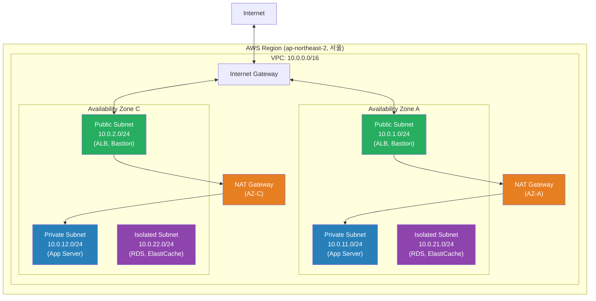
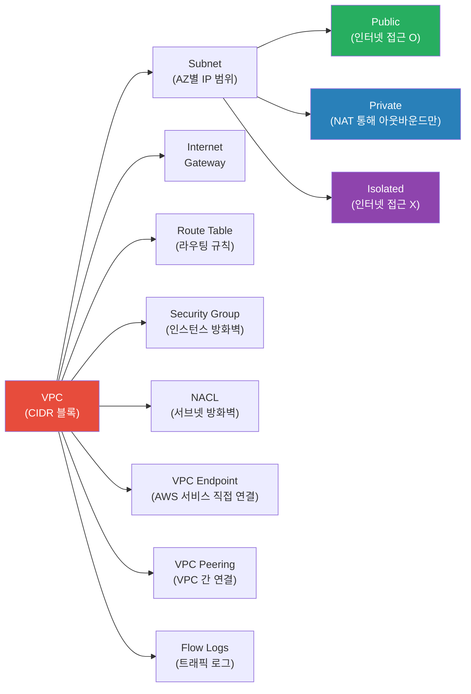
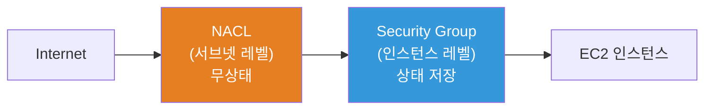
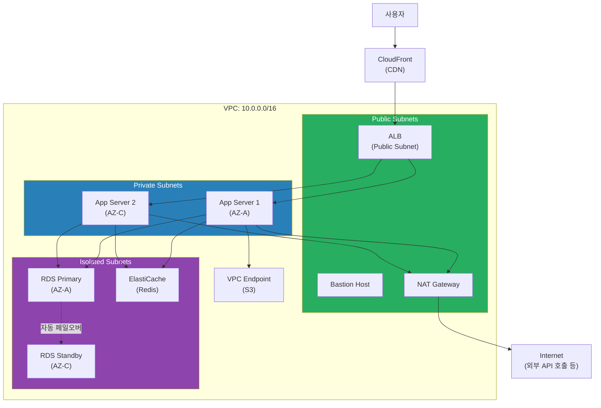

# VPC / Subnet / Routing / Peering

> AWS에서 서버를 띄우려면 가장 먼저 만들어야 하는 게 **VPC(Virtual Private Cloud)** 예요. VPC는 AWS 안에 나만의 격리된 네트워크를 만드는 거예요. [이전 강의](./01-iam)에서 IAM으로 "누가 접근할 수 있는지"를 배웠다면, 이번에는 **"어디에 배치할 것인지"** — 네트워크 설계를 배워볼게요.

---

## 🎯 이걸 왜 알아야 하나?

```
실무에서 VPC 관련 업무가 필요한 순간:
- AWS 계정을 새로 만들고 인프라를 세팅해요        → VPC부터 설계
- "프라이빗 서브넷의 서버가 인터넷이 안 돼요"      → NAT Gateway 확인
- "DB가 외부에서 접근 가능한 상태예요!"            → 서브넷/라우팅 잘못 설정
- NAT Gateway 비용이 월 100만 원이 넘어요         → VPC Endpoint 도입 검토
- 개발/운영 VPC 간 통신이 필요해요                → VPC Peering / Transit Gateway
- Security Group vs NACL 차이가 뭐예요?           → 계층별 방화벽 이해
- K8s EKS 클러스터를 만들 때 서브넷이 필요해요     → VPC 서브넷 사전 설계
- VPC Flow Log로 트래픽을 분석해야 해요           → 보안 감사 대응
```

[네트워크 기초 강의](../02-networking/04-network-structure)에서 CIDR, 서브넷, NAT의 개념을 배웠죠? 이번에는 그 개념을 **AWS VPC에 직접 적용**해볼게요.

---

## 🧠 핵심 개념

### 비유: 신도시 건설

VPC를 **신도시 건설**에 비유해볼게요. AWS 리전 안에 나만의 도시를 짓는 거예요.

| 현실 세계 | AWS VPC |
|-----------|---------|
| 신도시 전체 부지 | VPC (예: 10.0.0.0/16) |
| 도시 안의 구역 (주거, 상업, 산업) | Subnet (Public, Private, Isolated) |
| 도시 정문 (외부 도로 연결) | Internet Gateway (IGW) |
| 구역 내부의 도로 표지판 | Route Table |
| 아파트 단지 경비실 (세대별 출입 관리) | Security Group |
| 구역 입구의 검문소 (구역 전체 통제) | NACL |
| 내부 우체국 (외부에 내 주소 안 알려주고 대신 발송) | NAT Gateway |
| 이웃 도시와의 연결 도로 | VPC Peering |
| 고속도로 허브 (여러 도시 연결) | Transit Gateway |
| 지하 전용 통로 (외부 거치지 않고 AWS 서비스 접근) | VPC Endpoint |

---

### 전체 구조 한눈에 보기



---

### VPC 핵심 구성 요소 관계



---

## 🔍 상세 설명

### 1. VPC 기본: Region과 AZ

VPC는 하나의 **AWS Region**에 속해요. Region 안에는 여러 **Availability Zone(AZ)** 이 있고, 서브넷은 반드시 하나의 AZ에 배치돼요.

```
Region: ap-northeast-2 (서울)
├── AZ: ap-northeast-2a
├── AZ: ap-northeast-2b
├── AZ: ap-northeast-2c
└── AZ: ap-northeast-2d

VPC는 Region 레벨 → 여러 AZ에 걸쳐 존재
Subnet은 AZ 레벨 → 하나의 AZ에만 존재
```

#### VPC CIDR 블록

VPC를 만들 때 **CIDR 블록**을 지정해야 해요. ([CIDR 복습 - 네트워크 구조](../02-networking/04-network-structure))

```
VPC CIDR 허용 범위: /16(65,536 IPs) ~ /28(16 IPs)
실무 권장: 10.0.0.0/16 — 넉넉하게 잡아야 나중에 고생 안 해요
```

#### Default VPC vs Custom VPC

```bash
# Default VPC 확인 — 모든 리전에 자동 생성되어 있어요
aws ec2 describe-vpcs --filters "Name=isDefault,Values=true" --output table

# 출력: CidrBlock=172.31.0.0/16, IsDefault=True, State=available
```

| 항목 | Default VPC | Custom VPC |
|------|-------------|------------|
| CIDR | 172.31.0.0/16 (고정) | 원하는 대로 설정 |
| 서브넷 | AZ마다 /20 퍼블릭 서브넷 자동 생성 | 직접 설계 |
| IGW | 자동 연결 | 직접 생성/연결 |
| 용도 | 테스트, 학습용 | **운영 환경 (필수)** |
| 보안 | 기본 설정이 느슨함 | 직접 보안 규칙 설계 |

> **실무 규칙**: Default VPC는 절대 운영에 쓰지 마세요. 항상 Custom VPC를 설계해서 사용해요.

---

### 2. Subnet 설계

서브넷은 **용도별**로 3가지 타입으로 나눠요.

| 타입 | 인터넷 접근 | 용도 | Route Table |
|------|-------------|------|-------------|
| **Public** | 인바운드 + 아웃바운드 | ALB, Bastion, NAT GW | 0.0.0.0/0 -> IGW |
| **Private** | 아웃바운드만 (NAT 경유) | App Server, EKS Node | 0.0.0.0/0 -> NAT GW |
| **Isolated** | 없음 | RDS, ElastiCache | 로컬 라우팅만 |

#### CIDR 설계 예시 (/24 권장)

```
VPC: 10.0.0.0/16 (65,536 IPs)
│
├── Public Subnets (인터넷 접근 가능)
│   ├── 10.0.1.0/24  (AZ-A) — 256 IPs
│   ├── 10.0.2.0/24  (AZ-C) — 256 IPs
│   └── 10.0.3.0/24  (AZ-D) — 예비
│
├── Private Subnets (NAT 경유 아웃바운드)
│   ├── 10.0.11.0/24 (AZ-A) — App 서버
│   ├── 10.0.12.0/24 (AZ-C) — App 서버
│   └── 10.0.13.0/24 (AZ-D) — 예비
│
├── Isolated Subnets (인터넷 완전 차단)
│   ├── 10.0.21.0/24 (AZ-A) — RDS Primary
│   ├── 10.0.22.0/24 (AZ-C) — RDS Standby
│   └── 10.0.23.0/24 (AZ-D) — 예비
│
└── 여유 공간: 10.0.100.0/24 ~ (EKS, 추가 서비스용)
```

> **팁**: 서브넷 번호 체계를 만들어두면 관리가 편해요. Public=1~9, Private=11~19, Isolated=21~29 같은 식으로요.

```bash
# 서브넷 생성 예시
aws ec2 create-subnet \
  --vpc-id vpc-0abc1234def56789 \
  --cidr-block 10.0.1.0/24 \
  --availability-zone ap-northeast-2a \
  --tag-specifications 'ResourceType=subnet,Tags=[{Key=Name,Value=prod-public-a}]'

# 출력: SubnetId=subnet-0aaa1111bbb22222, AvailableIpAddressCount=251, State=available
```

> **주의**: /24 서브넷은 256개 IP인데, AWS가 5개를 예약해요 (네트워크 주소, VPC 라우터, DNS, 미래 예약, 브로드캐스트). 실제 사용 가능 IP는 **251개**예요.

---

### 3. Internet Gateway + NAT Gateway

#### Internet Gateway (IGW)

IGW는 VPC의 **정문**이에요. VPC당 하나만 연결할 수 있어요.

```bash
# Internet Gateway 생성 및 VPC에 연결
aws ec2 create-internet-gateway \
  --tag-specifications 'ResourceType=internet-gateway,Tags=[{Key=Name,Value=prod-igw}]'
# 출력: InternetGatewayId=igw-0abc1234def56789

aws ec2 attach-internet-gateway \
  --internet-gateway-id igw-0abc1234def56789 \
  --vpc-id vpc-0abc1234def56789
```

#### NAT Gateway

NAT Gateway는 **프라이빗 서브넷의 서버가 인터넷에 나갈 수 있게** 해주는 관문이에요. 외부에서 안으로는 못 들어와요. ([NAT 개념 복습](../02-networking/04-network-structure))

```bash
# 1. Elastic IP 할당 (NAT Gateway에 필요)
aws ec2 allocate-address --domain vpc
# 출력: AllocationId=eipalloc-0abc1234, PublicIp=52.78.xxx.xxx

# 2. NAT Gateway 생성 (퍼블릭 서브넷에 배치!)
aws ec2 create-nat-gateway \
  --subnet-id subnet-0aaa1111bbb22222 \
  --allocation-id eipalloc-0abc1234 \
  --tag-specifications 'ResourceType=natgateway,Tags=[{Key=Name,Value=prod-nat-a}]'
# 출력: NatGatewayId=nat-0abc1234def56789, State=pending
```

#### NAT 비용 최적화

NAT Gateway는 **비싸요** (시간당 + 데이터 전송량 과금). 비용을 줄이는 방법이 있어요.

| 방법 | 비용 | 가용성 | 추천 상황 |
|------|------|--------|-----------|
| NAT Gateway (AZ당 1개) | $$$ | 높음 (AWS 관리형) | 운영 환경 |
| NAT Gateway (1개만 공유) | $$ | 중간 (AZ 장애 시 영향) | 비용 절감 필요할 때 |
| NAT Instance (EC2) | $ | 낮음 (직접 관리) | 개발/테스트 환경 |
| VPC Endpoint | 무료~$ | 높음 | S3, DynamoDB 접근이 대부분일 때 |

```bash
# S3 접근이 NAT 비용의 주범인 경우 → VPC Endpoint로 해결
# (뒤에서 자세히 다뤄요)
```

---

### 4. Route Table (라우팅 테이블)

Route Table은 **서브넷의 도로 표지판**이에요. "이 목적지로 가려면 어디로 가라"를 정해줘요.

#### Public Subnet Route Table

```
Destination        Target              설명
10.0.0.0/16        local               VPC 내부 통신 (자동)
0.0.0.0/0          igw-0abc1234...     나머지는 전부 인터넷으로
```

#### Private Subnet Route Table

```
Destination        Target              설명
10.0.0.0/16        local               VPC 내부 통신 (자동)
0.0.0.0/0          nat-0abc1234...     나머지는 NAT Gateway로
```

#### Isolated Subnet Route Table

```
Destination        Target              설명
10.0.0.0/16        local               VPC 내부 통신만 (이게 전부!)
```

```bash
# Route Table 생성
aws ec2 create-route-table \
  --vpc-id vpc-0abc1234def56789 \
  --tag-specifications 'ResourceType=route-table,Tags=[{Key=Name,Value=prod-private-rt}]'
# 출력: RouteTableId=rtb-0abc1234def56789

# NAT Gateway로 가는 기본 라우트 추가 (Private Subnet용)
aws ec2 create-route \
  --route-table-id rtb-0abc1234def56789 \
  --destination-cidr-block 0.0.0.0/0 \
  --nat-gateway-id nat-0abc1234def56789

# Route Table을 서브넷에 연결
aws ec2 associate-route-table \
  --route-table-id rtb-0abc1234def56789 \
  --subnet-id subnet-0bbb3333ccc44444
```

> **주의**: 서브넷에 Route Table을 명시적으로 연결하지 않으면 VPC의 **Main Route Table**이 적용돼요. Main Route Table에 IGW 라우트가 있으면 모든 서브넷이 퍼블릭이 될 수 있어요!

---

### 5. Security Group vs NACL

이 둘은 모두 **방화벽**이지만 동작 방식이 달라요. ([네트워크 보안 심화](../02-networking/09-network-security))



| 항목 | Security Group | NACL |
|------|----------------|------|
| 적용 레벨 | 인스턴스 (ENI) | 서브넷 |
| 상태 | **Stateful** (응답 자동 허용) | **Stateless** (인/아웃 각각 설정) |
| 규칙 | 허용만 가능 (Allow only) | 허용 + 거부 가능 |
| 평가 순서 | 모든 규칙 평가 후 허용 | **번호 순서대로** 평가 |
| 기본 동작 | 모든 인바운드 차단 | 모든 트래픽 허용 (default NACL) |

#### Security Group 실전 규칙 설계

```bash
# ALB용 Security Group — 외부에서 HTTP/HTTPS만 허용
aws ec2 create-security-group \
  --group-name prod-alb-sg \
  --description "ALB Security Group" \
  --vpc-id vpc-0abc1234def56789

# HTTP 허용
aws ec2 authorize-security-group-ingress \
  --group-id sg-0alb1234 \
  --protocol tcp \
  --port 80 \
  --cidr 0.0.0.0/0

# HTTPS 허용
aws ec2 authorize-security-group-ingress \
  --group-id sg-0alb1234 \
  --protocol tcp \
  --port 443 \
  --cidr 0.0.0.0/0
```

```bash
# App 서버용 Security Group — ALB SG에서만 접근 허용
aws ec2 authorize-security-group-ingress \
  --group-id sg-0app5678 \
  --protocol tcp \
  --port 8080 \
  --source-group sg-0alb1234

# DB용 Security Group — App SG에서만 3306 허용
aws ec2 authorize-security-group-ingress \
  --group-id sg-0db9012 \
  --protocol tcp \
  --port 3306 \
  --source-group sg-0app5678
```

> **핵심**: Security Group은 **다른 SG를 소스로 참조**할 수 있어요. IP가 아니라 "이 SG에 속한 리소스에서 오는 트래픽"을 허용하는 거예요. 이게 AWS 네트워크 보안의 핵심 패턴이에요.

#### NACL 규칙 예시

```bash
# NACL 규칙 추가 — 특정 IP 차단 (Security Group으로는 불가능!)
aws ec2 create-network-acl-entry \
  --network-acl-id acl-0abc1234 \
  --rule-number 50 \
  --protocol tcp \
  --port-range From=0,To=65535 \
  --cidr-block 203.0.113.50/32 \
  --egress \
  --rule-action deny

# NACL은 번호가 낮을수록 먼저 평가돼요
# Rule 50 (deny 203.0.113.50) → Rule 100 (allow 0.0.0.0/0)
```

---

### 6. VPC Peering

VPC Peering은 **두 VPC를 직접 연결**하는 거예요. 마치 이웃 도시 사이에 전용 도로를 까는 것과 같아요.

```bash
# 개발 VPC → 운영 VPC 피어링 요청
aws ec2 create-vpc-peering-connection \
  --vpc-id vpc-dev-1234 \
  --peer-vpc-id vpc-prod-5678 \
  --tag-specifications 'ResourceType=vpc-peering-connection,Tags=[{Key=Name,Value=dev-to-prod}]'
# 출력: VpcPeeringConnectionId=pcx-0abc1234def56789, Status=initiating-request

# 상대방(운영) 측에서 수락
aws ec2 accept-vpc-peering-connection \
  --vpc-peering-connection-id pcx-0abc1234def56789

# 양쪽 Route Table에 피어링 라우트 추가 (양쪽 다 해야 해요!)
aws ec2 create-route --route-table-id rtb-dev-1234 \
  --destination-cidr-block 10.1.0.0/16 \
  --vpc-peering-connection-id pcx-0abc1234def56789

aws ec2 create-route --route-table-id rtb-prod-5678 \
  --destination-cidr-block 10.0.0.0/16 \
  --vpc-peering-connection-id pcx-0abc1234def56789
```

#### VPC Peering 제한사항

```
- CIDR이 겹치면 피어링 불가 (10.0.0.0/16 <-> 10.0.0.0/16 X)
- 전이적 라우팅(Transitive Routing) 불가
  A <-> B, B <-> C 연결해도 A <-> C 통신 안 됨
- 리전 간 피어링 가능하지만 대역폭/지연 시간 고려 필요
```

#### Transit Gateway (VPC가 많을 때)

VPC가 3개 이상이면 피어링이 복잡해져요. Transit Gateway가 **허브 역할**을 해요.

```
VPC Peering (N개 VPC):                Transit Gateway:
A -- B                                    A
A -- C         →  연결 수: N(N-1)/2       B -- [TGW] -- 허브 하나로 전부 연결
B -- C                                    C
VPC 10개면 = 45개 피어링 필요!            VPC 10개면 = 10개 연결만
```

---

### 7. VPC Endpoint

VPC Endpoint는 **인터넷을 거치지 않고 AWS 서비스에 직접 연결**하는 지하 전용 통로예요. NAT Gateway 비용도 줄이고, 보안도 높아져요.

| 타입 | 대상 서비스 | 비용 | 구현 방식 |
|------|-------------|------|-----------|
| **Gateway Endpoint** | S3, DynamoDB | **무료** | Route Table에 라우트 추가 |
| **Interface Endpoint (PrivateLink)** | 나머지 서비스 (SQS, SNS, ECR, CloudWatch 등) | 시간당 + 데이터 | 서브넷에 ENI 생성 |

```bash
# S3 Gateway Endpoint 생성 (무료! 무조건 만드세요)
aws ec2 create-vpc-endpoint \
  --vpc-id vpc-0abc1234def56789 \
  --service-name com.amazonaws.ap-northeast-2.s3 \
  --route-table-ids rtb-0abc1234def56789
# 출력: VpcEndpointId=vpce-0abc1234, Type=Gateway, State=available
# Route Table에 S3 prefix list → vpce-0abc1234 라우트가 자동 추가됨
```

```bash
# ECR Interface Endpoint (EKS에서 이미지 pull 할 때 NAT 비용 절감)
aws ec2 create-vpc-endpoint \
  --vpc-id vpc-0abc1234def56789 \
  --vpc-endpoint-type Interface \
  --service-name com.amazonaws.ap-northeast-2.ecr.dkr \
  --subnet-ids subnet-0bbb3333ccc44444 \
  --security-group-ids sg-0endpoint1234

# ECR 사용 시 필요한 Endpoint 3개:
# 1. com.amazonaws.{region}.ecr.api
# 2. com.amazonaws.{region}.ecr.dkr
# 3. com.amazonaws.{region}.s3 (Gateway — 이미지 레이어 저장소)
```

> **EKS 운영 팁**: EKS 노드가 ECR에서 이미지를 pull하는 트래픽이 NAT Gateway 비용의 주범인 경우가 많아요. VPC Endpoint를 도입하면 비용을 크게 줄일 수 있어요. ([K8s CNI와 VPC 관계](../04-kubernetes/06-cni))

---

### 8. VPC Flow Logs

VPC Flow Logs는 VPC 내 네트워크 인터페이스를 오가는 **IP 트래픽 정보를 캡처**해요. 보안 감사, 트래픽 분석, 문제 해결에 필수예요.

```bash
# VPC 레벨 Flow Log 생성 (CloudWatch Logs로 전송)
aws ec2 create-flow-logs \
  --resource-type VPC \
  --resource-ids vpc-0abc1234def56789 \
  --traffic-type ALL \
  --log-destination-type cloud-watch-logs \
  --log-group-name /vpc/flow-logs/prod \
  --deliver-logs-permission-arn arn:aws:iam::123456789012:role/VPCFlowLogRole
# S3로 전송하려면: --log-destination-type s3 --log-destination arn:aws:s3:::my-bucket/
```

#### Flow Log 레코드 분석

```
# 형식: version account-id eni-id srcaddr dstaddr srcport dstport protocol packets bytes start end action log-status

# 허용된 SSH 접속
2 123456789012 eni-0abc1234 10.0.1.50 10.0.11.100 52634 22 6 10 840 1616729292 1616729349 ACCEPT OK

# 거부된 RDP 접근 시도 (3389 포트)
2 123456789012 eni-0abc1234 203.0.113.50 10.0.1.50 45321 3389 6 5 280 1616729292 1616729349 REJECT OK
```

주요 필드: `srcaddr/dstaddr`(IP), `srcport/dstport`(포트), `protocol`(6=TCP, 17=UDP), `action`(ACCEPT/REJECT)

---

### 9. 실전 3-Tier 아키텍처 VPC 설계

운영 환경에서 가장 많이 사용하는 3-Tier 아키텍처 VPC 전체 구조예요.



---

## 💻 실습 예제

### 실습 1: Custom VPC 처음부터 만들기

실제 운영에서 사용할 수 있는 3-Tier VPC를 처음부터 만들어볼게요.

```bash
#!/bin/bash
# 실습: 3-Tier VPC 구축 스크립트
# 목표: Public + Private + Isolated 서브넷이 있는 VPC 만들기

REGION="ap-northeast-2"

# === 1단계: VPC 생성 ===
echo ">>> VPC 생성 중..."
VPC_ID=$(aws ec2 create-vpc \
  --cidr-block 10.0.0.0/16 \
  --tag-specifications 'ResourceType=vpc,Tags=[{Key=Name,Value=practice-vpc}]' \
  --query 'Vpc.VpcId' \
  --output text \
  --region $REGION)
echo "VPC 생성 완료: $VPC_ID"

# DNS 호스트네임 활성화 (RDS, ELB 등에 필요)
aws ec2 modify-vpc-attribute \
  --vpc-id $VPC_ID \
  --enable-dns-hostnames '{"Value":true}' \
  --region $REGION

# === 2단계: Internet Gateway 생성 및 연결 ===
echo ">>> IGW 생성 중..."
IGW_ID=$(aws ec2 create-internet-gateway \
  --tag-specifications 'ResourceType=internet-gateway,Tags=[{Key=Name,Value=practice-igw}]' \
  --query 'InternetGateway.InternetGatewayId' \
  --output text \
  --region $REGION)

aws ec2 attach-internet-gateway \
  --internet-gateway-id $IGW_ID \
  --vpc-id $VPC_ID \
  --region $REGION
echo "IGW 연결 완료: $IGW_ID"

# === 3단계: 서브넷 생성 (AZ 2개, 총 6개) ===
echo ">>> 서브넷 생성 중..."

# 서브넷 생성 헬퍼 함수
create_subnet() {  # $1=cidr, $2=az_suffix, $3=name
  aws ec2 create-subnet --vpc-id $VPC_ID --cidr-block $1 \
    --availability-zone ${REGION}$2 \
    --tag-specifications "ResourceType=subnet,Tags=[{Key=Name,Value=$3}]" \
    --query 'Subnet.SubnetId' --output text --region $REGION
}

PUB_SUB_A=$(create_subnet 10.0.1.0/24  a practice-public-a)
PUB_SUB_C=$(create_subnet 10.0.2.0/24  c practice-public-c)
PRIV_SUB_A=$(create_subnet 10.0.11.0/24 a practice-private-a)
PRIV_SUB_C=$(create_subnet 10.0.12.0/24 c practice-private-c)
ISO_SUB_A=$(create_subnet 10.0.21.0/24  a practice-isolated-a)
ISO_SUB_C=$(create_subnet 10.0.22.0/24  c practice-isolated-c)

echo "서브넷 6개 생성 완료"

# === 4단계: Route Table 설정 ===
echo ">>> Route Table 설정 중..."

# Public Route Table — IGW로 가는 기본 라우트
PUB_RT=$(aws ec2 create-route-table \
  --vpc-id $VPC_ID \
  --tag-specifications 'ResourceType=route-table,Tags=[{Key=Name,Value=practice-public-rt}]' \
  --query 'RouteTable.RouteTableId' --output text --region $REGION)

aws ec2 create-route \
  --route-table-id $PUB_RT \
  --destination-cidr-block 0.0.0.0/0 \
  --gateway-id $IGW_ID \
  --region $REGION

# Public 서브넷에 연결
aws ec2 associate-route-table --route-table-id $PUB_RT --subnet-id $PUB_SUB_A --region $REGION
aws ec2 associate-route-table --route-table-id $PUB_RT --subnet-id $PUB_SUB_C --region $REGION

# Isolated Route Table — 로컬만 (라우트 추가 안 함)
ISO_RT=$(aws ec2 create-route-table \
  --vpc-id $VPC_ID \
  --tag-specifications 'ResourceType=route-table,Tags=[{Key=Name,Value=practice-isolated-rt}]' \
  --query 'RouteTable.RouteTableId' --output text --region $REGION)

aws ec2 associate-route-table --route-table-id $ISO_RT --subnet-id $ISO_SUB_A --region $REGION
aws ec2 associate-route-table --route-table-id $ISO_RT --subnet-id $ISO_SUB_C --region $REGION

echo "Route Table 설정 완료"

# === 5단계: S3 Gateway Endpoint 생성 (무료, 필수!) ===
aws ec2 create-vpc-endpoint \
  --vpc-id $VPC_ID \
  --service-name com.amazonaws.${REGION}.s3 \
  --route-table-ids $PUB_RT $ISO_RT \
  --region $REGION

echo "=== VPC 구축 완료 ==="
echo "VPC:     $VPC_ID"
echo "IGW:     $IGW_ID"
echo "Public:  $PUB_SUB_A, $PUB_SUB_C"
echo "Private: $PRIV_SUB_A, $PRIV_SUB_C"
echo "Isolated: $ISO_SUB_A, $ISO_SUB_C"
```

```bash
# 생성 결과 확인
aws ec2 describe-subnets \
  --filters "Name=vpc-id,Values=$VPC_ID" \
  --query 'Subnets[*].[Tags[?Key==`Name`].Value|[0],CidrBlock,AvailabilityZone]' \
  --output table --region ap-northeast-2

# 출력 예시:
# practice-public-a   | 10.0.1.0/24  | ap-northeast-2a
# practice-public-c   | 10.0.2.0/24  | ap-northeast-2c
# practice-private-a  | 10.0.11.0/24 | ap-northeast-2a
# practice-private-c  | 10.0.12.0/24 | ap-northeast-2c
# practice-isolated-a | 10.0.21.0/24 | ap-northeast-2a
# practice-isolated-c | 10.0.22.0/24 | ap-northeast-2c
```

---

### 실습 2: Security Group 체인 구성

3-Tier 아키텍처에 맞는 Security Group을 체인으로 연결해볼게요. ALB -> App -> DB 순서로요.

```bash
#!/bin/bash
# 실습: Security Group 체인 구성
# 패턴: ALB(SG) -> App(SG) -> DB(SG) — 각각 이전 단계의 SG만 허용

VPC_ID="vpc-0abc1234def56789"  # 실습 1에서 만든 VPC
REGION="ap-northeast-2"

# === ALB Security Group ===
ALB_SG=$(aws ec2 create-security-group \
  --group-name practice-alb-sg \
  --description "ALB - HTTP/HTTPS from anywhere" \
  --vpc-id $VPC_ID \
  --query 'GroupId' --output text --region $REGION)

# 외부에서 HTTP/HTTPS 허용
aws ec2 authorize-security-group-ingress \
  --group-id $ALB_SG --protocol tcp --port 80 --cidr 0.0.0.0/0 --region $REGION
aws ec2 authorize-security-group-ingress \
  --group-id $ALB_SG --protocol tcp --port 443 --cidr 0.0.0.0/0 --region $REGION

echo "ALB SG: $ALB_SG (80, 443 from 0.0.0.0/0)"

# === App Security Group ===
APP_SG=$(aws ec2 create-security-group \
  --group-name practice-app-sg \
  --description "App - 8080 from ALB only" \
  --vpc-id $VPC_ID \
  --query 'GroupId' --output text --region $REGION)

# ALB SG에서만 8080 허용 (IP가 아니라 SG 참조!)
aws ec2 authorize-security-group-ingress \
  --group-id $APP_SG \
  --protocol tcp \
  --port 8080 \
  --source-group $ALB_SG \
  --region $REGION

echo "App SG: $APP_SG (8080 from ALB SG only)"

# === DB Security Group ===
DB_SG=$(aws ec2 create-security-group \
  --group-name practice-db-sg \
  --description "DB - 3306 from App only" \
  --vpc-id $VPC_ID \
  --query 'GroupId' --output text --region $REGION)

# App SG에서만 MySQL(3306) 허용
aws ec2 authorize-security-group-ingress \
  --group-id $DB_SG \
  --protocol tcp \
  --port 3306 \
  --source-group $APP_SG \
  --region $REGION

echo "DB SG: $DB_SG (3306 from App SG only)"

# === 결과 확인 ===
echo ""
echo "=== Security Group 체인 ==="
echo "인터넷 → [80,443] → ALB($ALB_SG)"
echo "  ALB  → [8080]   → App($APP_SG)"
echo "  App  → [3306]   → DB($DB_SG)"
```

```bash
# Security Group 규칙 확인
aws ec2 describe-security-groups \
  --group-ids $APP_SG \
  --query 'SecurityGroups[0].IpPermissions' \
  --output json --region ap-northeast-2

# 출력: FromPort=8080, ToPort=8080, Protocol=tcp
#       Source: UserIdGroupPairs → GroupId=sg-0alb1234
#       → IP가 아니라 SG ID로 참조하고 있음!
```

---

### 실습 3: VPC Peering으로 개발/운영 VPC 연결

두 개의 VPC(개발 10.0.0.0/16, 운영 10.1.0.0/16)를 피어링으로 연결해볼게요.

```bash
#!/bin/bash
# 실습: VPC Peering — 개발 환경에서 운영 DB 읽기 복제본 접근
REGION="ap-northeast-2"

# 1단계: 피어링 생성 + 수락
PEER_ID=$(aws ec2 create-vpc-peering-connection \
  --vpc-id vpc-dev-1234 --peer-vpc-id vpc-prod-5678 \
  --query 'VpcPeeringConnection.VpcPeeringConnectionId' \
  --output text --region $REGION)

aws ec2 accept-vpc-peering-connection \
  --vpc-peering-connection-id $PEER_ID --region $REGION

# 2단계: 양쪽 Route Table에 라우트 추가 (양쪽 다 해야 해요!)
aws ec2 create-route --route-table-id rtb-dev-private \
  --destination-cidr-block 10.1.0.0/16 \
  --vpc-peering-connection-id $PEER_ID --region $REGION

aws ec2 create-route --route-table-id rtb-prod-private \
  --destination-cidr-block 10.0.0.0/16 \
  --vpc-peering-connection-id $PEER_ID --region $REGION

# 3단계: 운영 DB SG에 개발 VPC CIDR 허용
aws ec2 authorize-security-group-ingress \
  --group-id sg-prod-db-1234 --protocol tcp --port 3306 \
  --cidr 10.0.0.0/16 --region $REGION

# 4단계: 확인
aws ec2 describe-vpc-peering-connections \
  --vpc-peering-connection-ids $PEER_ID \
  --query 'VpcPeeringConnections[0].Status.Code' --output text
# 출력: active

# 개발 EC2에서 운영 DB 연결 테스트
mysql -h 10.1.21.50 -u readonly -p
# Connected to MySQL at 10.1.21.50
```

> **주의**: 피어링 시 CIDR이 겹치면 안 돼요! VPC 설계 시 대역을 미리 분리하세요 (개발: 10.0.0.0/16, 운영: 10.1.0.0/16, 스테이징: 10.2.0.0/16).

---

## 🏢 실무에서는?

### 시나리오 1: NAT Gateway 비용 폭탄 해결

```
상황: 월 NAT Gateway 비용이 $800 발생. 원인 분석이 필요해요.

1. VPC Flow Log 분석으로 NAT 트래픽 확인
   → S3 접근이 전체 트래픽의 70%
   → ECR 이미지 pull이 20%

2. 해결:
   - S3 Gateway Endpoint 추가 (무료) → 70% 절감
   - ECR Interface Endpoint 추가 → 20% 절감
   - 남은 10%만 NAT Gateway 경유

3. 결과: 월 $800 → $120 (85% 비용 절감)
```

### 시나리오 2: 멀티 계정 VPC 네트워크 설계

```
상황: 팀별 AWS 계정이 5개. 공통 서비스(모니터링, 로깅)를 공유해야 해요.

설계:
- 공유 서비스 계정: 10.100.0.0/16 (Transit Gateway 운영)
- 개발 계정: 10.0.0.0/16
- 스테이징 계정: 10.1.0.0/16
- 운영 계정: 10.2.0.0/16
- 데이터 계정: 10.3.0.0/16

Transit Gateway로 허브-스포크 구조:
- 모든 계정 → 공유 서비스 계정 통신 허용
- 운영 → 데이터 계정 통신 허용
- 개발 → 운영 직접 통신 차단 (Route Table로 제어)
```

### 시나리오 3: EKS 클러스터용 VPC 설계

```
상황: EKS 클러스터를 배포해야 하는데 VPC 서브넷 설계가 필요해요.

고려사항:
- Pod 하나당 VPC IP 하나를 소비 (VPC CNI 특성)
- 노드 50대, Pod 평균 30개 → 1,500개 IP 필요
- /24 서브넷 = 251개 IP → 부족!

설계: (K8s CNI 관련: ../04-kubernetes/06-cni)
- EKS 노드 서브넷: /20 (4,091 IPs) x AZ 2개
- Pod 전용 서브넷: /18 (16,379 IPs) — Secondary CIDR 추가
  → VPC에 100.64.0.0/16 CIDR 추가 (RFC 6598)
- Public 서브넷: /24 x 2 (ALB Ingress Controller용)
- Isolated 서브넷: /24 x 2 (RDS용)

aws ec2 associate-vpc-cidr-block \
  --vpc-id vpc-0abc1234 \
  --cidr-block 100.64.0.0/16
# → Pod에 Secondary CIDR의 IP를 할당해서 Primary CIDR 고갈 방지
```

---

## ⚠️ 자주 하는 실수

### 1. CIDR 설계를 너무 좁게 잡기

```
❌ VPC를 /24로 만들어서 256개 IP밖에 없음
   → 서브넷 나누기도 어렵고, 서비스 확장 시 IP 고갈

✅ 처음부터 /16으로 넉넉하게 잡기 (65,536 IPs)
   → VPC CIDR은 나중에 추가할 수 있지만, 변경은 안 돼요
   → 피어링 고려해서 다른 VPC와 CIDR 겹치지 않게 설계
```

### 2. Main Route Table에 IGW 라우트 추가

```
❌ Main Route Table에 0.0.0.0/0 → IGW 추가
   → 새로 만드는 모든 서브넷이 자동으로 퍼블릭이 됨!
   → DB 서브넷이 인터넷에 노출되는 보안 사고

✅ Main Route Table은 건드리지 않기 (로컬 라우팅만 유지)
   → 퍼블릭 서브넷 전용 Route Table을 별도로 만들어 명시적으로 연결
   → 새 서브넷의 기본 동작 = Private (안전)
```

### 3. NAT Gateway를 Private Subnet에 배치

```
❌ NAT Gateway를 프라이빗 서브넷에 생성
   → NAT Gateway 자체가 인터넷에 접근할 수 없어서 동작 안 함

✅ NAT Gateway는 반드시 퍼블릭 서브넷에 배치
   → NAT Gateway가 IGW를 통해 인터넷에 접근 가능해야 프라이빗 서브넷의
     아웃바운드 트래픽을 중계할 수 있어요
```

### 4. Security Group에서 0.0.0.0/0으로 모든 포트 열기

```
❌ 인바운드: All Traffic / 0.0.0.0/0 허용
   → "일단 열어놓고 나중에 좁히자" → 결국 안 좁힘 → 보안 사고

✅ 최소 권한 원칙으로 필요한 포트와 소스만 허용
   → SG 참조로 체이닝 (ALB SG → App SG → DB SG)
   → 0.0.0.0/0은 ALB의 80/443에만 허용
   → (보안 상세: ../02-networking/09-network-security)
```

### 5. VPC Peering 후 양쪽 Route Table 업데이트 빠뜨리기

```
❌ 피어링만 만들고 한쪽 Route Table만 업데이트
   → 요청은 가지만 응답이 돌아오지 못함 → 통신 안 됨

✅ 피어링 설정 시 체크리스트:
   1. 피어링 연결 생성 ✓
   2. 상대방 수락 ✓
   3. 양쪽 Route Table에 라우트 추가 ✓ ✓
   4. 양쪽 Security Group에 상대방 CIDR 허용 ✓ ✓
   → 4개 모두 완료해야 통신 가능!
```

---

## 📝 정리

```
VPC 핵심 요약:
┌──────────────────────────────────────────────────────────┐
│ VPC = AWS에서 나만의 격리된 네트워크                      │
│                                                          │
│ 서브넷 3가지:                                            │
│   Public  — IGW 연결, ALB/Bastion 배치                   │
│   Private — NAT 경유 아웃바운드, App 서버                 │
│   Isolated — 인터넷 없음, DB/캐시                         │
│                                                          │
│ 보안 2계층:                                               │
│   Security Group — 인스턴스 레벨, Stateful, 허용만         │
│   NACL — 서브넷 레벨, Stateless, 허용+거부                │
│                                                          │
│ 비용 최적화:                                              │
│   S3 Gateway Endpoint — 무료, 무조건 만들기               │
│   ECR Interface Endpoint — NAT 비용 절감                  │
│                                                          │
│ VPC 간 연결:                                              │
│   2~3개 VPC → VPC Peering                                │
│   4개 이상 → Transit Gateway                              │
│                                                          │
│ 설계 원칙:                                                │
│   CIDR /16으로 넉넉하게, 다른 VPC와 겹치지 않게            │
│   Main Route Table 건드리지 않기                          │
│   SG 참조로 체이닝 (ALB → App → DB)                      │
│   Flow Log로 트래픽 모니터링                               │
└──────────────────────────────────────────────────────────┘
```

### 관련 강의 링크

- 네트워크 기초(CIDR/서브넷/NAT): [네트워크 구조](../02-networking/04-network-structure)
- DNS 관련: [DNS 강의](../02-networking/03-dns)
- VPN 관련: [VPN 강의](../02-networking/10-vpn)
- 네트워크 보안(SG/NACL 심화): [네트워크 보안](../02-networking/09-network-security)
- K8s VPC CNI: [CNI 강의](../04-kubernetes/06-cni)
- IAM 권한 관리: [IAM 강의](./01-iam)

---

## 🔗 다음 강의 → [03-ec2-autoscaling](./03-ec2-autoscaling)

> VPC라는 네트워크를 설계했으니, 이제 그 안에 **EC2 서버를 배치하고 Auto Scaling으로 자동 확장**하는 방법을 배워볼게요.
