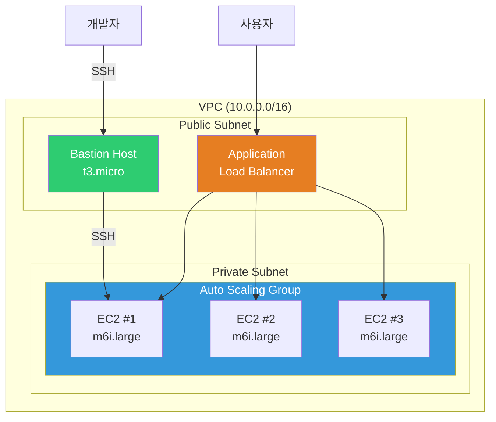
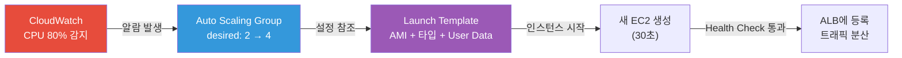
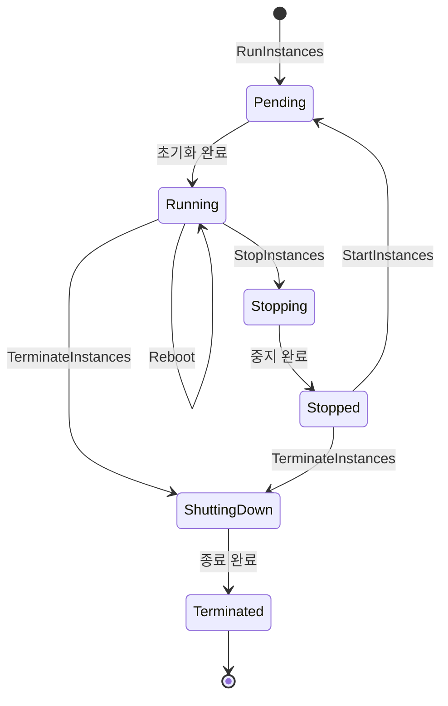

# EC2 / Auto Scaling

> 클라우드의 핵심은 "필요할 때 서버를 만들고, 필요 없으면 없앤다"예요. [IAM](./01-iam)으로 권한을 만들고, [VPC](./02-vpc)로 네트워크를 깔았으니 — 이제 그 위에 올라갈 서버(EC2)와 트래픽에 따라 자동으로 늘고 줄어드는 Auto Scaling을 배워볼게요.

---

## 🎯 이걸 왜 알아야 하나?

```
DevOps가 EC2 + Auto Scaling으로 하는 일들:
• 서비스 서버 운영                     → EC2 인스턴스 생성/관리
• 트래픽 급증 대응                     → Auto Scaling으로 자동 확장
• 비용 최적화                          → Spot + Reserved 조합
• 서버 이미지 관리                     → AMI(Golden Image) 빌드
• 무중단 배포                          → Launch Template + Rolling Update
• 야간/주말 비용 절감                  → Scheduled Scaling
• 장애 자동 복구                       → Health Check + 자동 교체
```

온프레미스에서는 서버를 사려면 발주부터 설치까지 몇 주가 걸렸어요. EC2는 **30초**면 서버가 생겨요. Auto Scaling은 그걸 **자동**으로 해줘요.

---

## 🧠 핵심 개념

### 비유: 사무실 임대와 직원 채용

EC2와 Auto Scaling은 **사무실 임대**와 **직원 채용**에 비유할 수 있어요.

| 현실 세계 | AWS |
|-----------|-----|
| 사무실 건물 | VPC ([02-vpc](./02-vpc)) |
| 층/구역 | 서브넷 (Public / Private) |
| 사무실 한 칸 (임대) | EC2 인스턴스 |
| 사무실 크기 (10평/50평) | 인스턴스 타입 (t3.micro ~ m6i.24xlarge) |
| 사무실 가구/세팅 | AMI (서버 이미지) |
| 임대 계약서 | Launch Template |
| 인력파견 회사 | Auto Scaling Group |
| "바쁘면 직원 더 뽑고, 한가하면 줄여줘" | Scaling Policy |
| 일용직 (싸지만 갑자기 그만둘 수 있음) | Spot Instance |
| 1년 계약직 (할인) | Reserved Instance |
| 정규직 (정가) | On-Demand |

### EC2 전체 구조



### Auto Scaling 동작 흐름



### 인스턴스 라이프사이클



---

## 🔍 상세 설명

### 1. 인스턴스 타입 — 서버 스펙 선택

EC2 인스턴스 타입은 **패밀리 + 세대 + 크기** 조합이에요.

```
네이밍 규칙:  m 6 i . xlarge
              │ │ │   └── 크기 (nano < micro < small < medium < large < xlarge < 2xlarge ...)
              │ │ └────── 추가 속성 (i=Intel, g=Graviton, a=AMD, d=NVMe SSD, n=네트워크 강화)
              │ └──────── 세대 (높을수록 최신, 가성비 좋음)
              └────────── 패밀리 (용도별 분류)
```

#### 패밀리별 용도

| 패밀리 | 용도 | 비유 | 대표 타입 | 사용 사례 |
|--------|------|------|----------|----------|
| **T** (Turbo) | 범용 (버스트) | 일반 사무직 | t3.micro, t3.medium | 개발 서버, 소규모 웹 |
| **M** (Main) | 범용 (균형) | 올라운더 | m6i.large, m7g.xlarge | 웹 서버, API 서버 |
| **C** (Compute) | 컴퓨팅 최적화 | 수학 교수 | c6i.xlarge, c7g.2xlarge | 배치 처리, 인코딩 |
| **R** (RAM) | 메모리 최적화 | 기억력 천재 | r6i.large, r7g.xlarge | Redis, DB 캐시 |
| **G/P** (GPU) | 가속 컴퓨팅 | AI 연구원 | g5.xlarge, p4d.24xlarge | ML 학습, 추론 |
| **I** (I/O) | 스토리지 최적화 | 물류 창고 | i3.large, i4i.xlarge | NoSQL, 데이터 웨어하우스 |

#### Graviton (ARM) — 최대 40% 가성비 향상

```bash
# Graviton 인스턴스 = 타입에 'g'가 붙음
# m6g.large   → Graviton2 (ARM)
# m7g.large   → Graviton3 (ARM) ← 현재 추천
# m6i.large   → Intel x86

# 같은 크기(large) 기준 시간당 비용 비교 (서울 리전 기준)
# m6i.large  (Intel):    $0.096/hr
# m6g.large  (Graviton): $0.077/hr  → 약 20% 저렴
# m7g.large  (Graviton): $0.082/hr  → 신세대지만 여전히 Intel보다 저렴

# ⚠️ 주의: ARM이라 x86 바이너리는 안 돌아요!
# Docker 이미지를 multi-arch(linux/amd64 + linux/arm64)로 빌드해야 해요
docker buildx build --platform linux/amd64,linux/arm64 -t myapp:latest .
```

### 2. AMI — 서버 이미지

AMI(Amazon Machine Image)는 EC2의 **설치 DVD**예요. OS + 소프트웨어 + 설정이 다 들어있어요.

#### AMI 종류

```bash
# 공식 AMI 검색
aws ec2 describe-images \
  --owners amazon \
  --filters "Name=name,Values=al2023-ami-2023*-x86_64" \
  --query "Images | sort_by(@, &CreationDate) | [-1].[ImageId,Name]" \
  --output text
# ami-0abcdef1234567890    al2023-ami-2023.6.20261201.0-kernel-6.1-x86_64

# 마켓플레이스 AMI (미리 설정된 소프트웨어)
# → AWS 콘솔에서 검색 (Nginx, WordPress, GitLab 등)

# 내 커스텀 AMI 목록
aws ec2 describe-images --owners self \
  --query "Images[*].[ImageId,Name,CreationDate]" \
  --output table
# ---------------------------------------------------------------
# |                      DescribeImages                          |
# +------------------------+--------------------+----------------+
# |  ami-0abc123def456789  |  myapp-golden-v12  |  2026-03-01    |
# |  ami-0def456789abc123  |  myapp-golden-v11  |  2026-02-15    |
# +------------------------+--------------------+----------------+
```

#### Golden AMI 패턴

운영에 필요한 모든 것이 미리 설치된 AMI를 **Golden AMI**라고 불러요. 배포할 때마다 패키지를 설치하지 않으니 **시작 시간이 빠르고 일관성**이 보장돼요.

```bash
# Golden AMI에 포함되는 것들:
# ✅ OS 패치 + 보안 설정
# ✅ 모니터링 에이전트 (CloudWatch Agent, Datadog 등)
# ✅ 로그 수집기 (Fluent Bit 등)
# ✅ 애플리케이션 런타임 (Java, Node.js 등)
# ✅ 회사 보안 정책 (CIS Benchmark 적용)
# ❌ 애플리케이션 코드 → 이건 배포 시점에 넣어요 (User Data 또는 CodeDeploy)
```

#### Packer로 AMI 자동 빌드

```hcl
# golden-ami.pkr.hcl (핵심 부분만)
source "amazon-ebs" "golden" {
  ami_name      = "myapp-golden-{{timestamp}}"
  instance_type = "t3.medium"
  region        = "ap-northeast-2"
  source_ami_filter {
    filters = { name = "al2023-ami-2023*-x86_64", root-device-type = "ebs" }
    owners      = ["amazon"]
    most_recent = true
  }
  ssh_username = "ec2-user"
}

build {
  sources = ["source.amazon-ebs.golden"]
  provisioner "shell" {
    inline = [
      "sudo dnf update -y",
      "sudo dnf install -y docker amazon-cloudwatch-agent",
      "sudo systemctl enable docker amazon-cloudwatch-agent",
    ]
  }
}
```

```bash
# Packer로 AMI 빌드
packer init golden-ami.pkr.hcl && packer build golden-ami.pkr.hcl
# ==> amazon-ebs.golden: Creating temporary EC2 instance...
# ==> amazon-ebs.golden: Running provisioner shell...
# ==> amazon-ebs.golden: Creating AMI: myapp-golden-1710345600
# Build 'amazon-ebs.golden' finished. → AMI: ami-0new123golden456
```

### 3. 스토리지 — Instance Store vs EBS

```
Instance Store (임시 디스크)          EBS (영구 디스크)
├── 물리 서버에 붙어있는 SSD          ├── 네트워크로 연결된 블록 스토리지
├── 매우 빠름 (NVMe)                 ├── 안정적 (서버와 독립)
├── 인스턴스 중지/종료 시 데이터 삭제! ├── 인스턴스 중지해도 데이터 유지
├── 용도: 캐시, 임시 파일             ├── 용도: OS, DB, 영구 데이터
└── 무료 (인스턴스 비용에 포함)        └── 유료 (GB당 과금)
```

#### EBS 볼륨 타입

| 타입 | 용도 | IOPS | 처리량 | 비용 |
|------|------|------|--------|------|
| **gp3** (범용) | 대부분의 워크로드 | 3,000~16,000 | 125~1,000 MB/s | $0.08/GB |
| **io2** (프로비전) | DB, 고성능 I/O | 최대 64,000 | 최대 1,000 MB/s | $0.125/GB + IOPS |
| **st1** (HDD) | 로그, 빅데이터 | 500 (기준) | 최대 500 MB/s | $0.045/GB |
| **sc1** (Cold HDD) | 아카이브 | 250 (기준) | 최대 250 MB/s | $0.015/GB |

```bash
# gp3 볼륨 생성 (가장 많이 쓰는 타입)
aws ec2 create-volume \
  --volume-type gp3 \
  --size 100 \
  --iops 5000 \
  --throughput 250 \
  --availability-zone ap-northeast-2a \
  --tag-specifications 'ResourceType=volume,Tags=[{Key=Name,Value=myapp-data}]'
# {
#     "VolumeId": "vol-0abc123def456789",
#     "Size": 100,
#     "VolumeType": "gp3",
#     "Iops": 5000,
#     "Throughput": 250,
#     "State": "creating",
#     "AvailabilityZone": "ap-northeast-2a"
# }
```

### 4. 네트워크 — ENI, Elastic IP, Placement Group

```bash
# ENI (Elastic Network Interface) — 가상 네트워크 카드
# EC2에 기본으로 1개 붙어있고, 추가로 더 붙일 수 있어요
aws ec2 describe-network-interfaces \
  --filters "Name=attachment.instance-id,Values=i-0abc123" \
  --query "NetworkInterfaces[*].[NetworkInterfaceId,PrivateIpAddress,Description]" \
  --output table
# -----------------------------------------------
# |         DescribeNetworkInterfaces            |
# +------------------+--------------+------------+
# |  eni-0abc123456  |  10.0.1.50   |  Primary   |
# +------------------+--------------+------------+

# Elastic IP — 고정 공인 IP (EC2가 재시작해도 IP가 안 변해요)
aws ec2 allocate-address --domain vpc
# {
#     "PublicIp": "54.180.100.50",
#     "AllocationId": "eipalloc-0abc123",
#     "Domain": "vpc"
# }

# EC2에 Elastic IP 연결
aws ec2 associate-address \
  --instance-id i-0abc123 \
  --allocation-id eipalloc-0abc123

# ⚠️ 주의: Elastic IP는 EC2에 연결 안 하면 시간당 과금돼요!
```

#### Placement Group (배치 그룹)

| 전략 | 설명 | 용도 |
|------|------|------|
| **Cluster** | 같은 랙에 모아서 배치 → 초저지연 | HPC, 분산 ML 학습 |
| **Spread** | 서로 다른 하드웨어에 분산 → 고가용성 | 중요 서비스 (최대 7개/AZ) |
| **Partition** | 파티션(랙 그룹)별 분리 → 장애 격리 | Kafka, Cassandra, HDFS |

### 5. Launch Template — EC2 설정 템플릿

Launch Template은 EC2를 만들 때 필요한 설정을 **미리 정의**해두는 거예요. Auto Scaling Group이 이걸 보고 인스턴스를 찍어내요.

```bash
# Launch Template 생성 (핵심 설정)
aws ec2 create-launch-template \
  --launch-template-name myapp-lt \
  --launch-template-data '{
    "ImageId": "ami-0abc123golden456",
    "InstanceType": "m6i.large",
    "KeyName": "my-keypair",
    "SecurityGroupIds": ["sg-0abc123"],
    "IamInstanceProfile": { "Name": "myapp-instance-profile" },
    "BlockDeviceMappings": [{
      "DeviceName": "/dev/xvda",
      "Ebs": { "VolumeSize": 50, "VolumeType": "gp3", "Encrypted": true }
    }],
    "MetadataOptions": { "HttpTokens": "required", "HttpEndpoint": "enabled" },
    "UserData": "'$(base64 -w0 <<'USERDATA'
#!/bin/bash
# cloud-init — 인스턴스 시작 시 자동 실행
dnf update -y
# CloudWatch Agent 시작
/opt/aws/amazon-cloudwatch-agent/bin/amazon-cloudwatch-agent-ctl \
  -a fetch-config -m ec2 -c file:/opt/aws/amazon-cloudwatch-agent/etc/cloudwatch-agent.json -s
# 애플리케이션 배포
aws s3 cp s3://myapp-deploy/latest/app.tar.gz /opt/myapp/
cd /opt/myapp && tar xzf app.tar.gz && systemctl start myapp
USERDATA
)'"
# {
#     "LaunchTemplate": {
#         "LaunchTemplateId": "lt-0abc123def456789",
#         "LaunchTemplateName": "myapp-lt",
#         "LatestVersionNumber": 1
#     }
# }
```

#### IMDSv2 — 인스턴스 메타데이터 (보안 강화)

EC2 내부에서 자기 자신의 정보를 조회하는 서비스예요. **반드시 IMDSv2(토큰 기반)를 사용**해야 해요. IMDSv1은 SSRF 공격에 취약해요.

```bash
# IMDSv2로 메타데이터 조회 (EC2 내부에서 실행)
# 1단계: 토큰 발급
TOKEN=$(curl -X PUT "http://169.254.169.254/latest/api/token" \
  -H "X-aws-ec2-metadata-token-ttl-seconds: 21600" -s)

# 2단계: 토큰으로 메타데이터 조회
curl -H "X-aws-ec2-metadata-token: $TOKEN" \
  http://169.254.169.254/latest/meta-data/instance-id
# i-0abc123def456789

curl -H "X-aws-ec2-metadata-token: $TOKEN" \
  http://169.254.169.254/latest/meta-data/instance-type
# m6i.large

curl -H "X-aws-ec2-metadata-token: $TOKEN" \
  http://169.254.169.254/latest/meta-data/local-ipv4
# 10.0.1.50

# Instance Profile의 임시 자격증명도 여기서 가져와요 (→ IAM 01-iam 참조)
curl -H "X-aws-ec2-metadata-token: $TOKEN" \
  http://169.254.169.254/latest/meta-data/iam/security-credentials/myapp-role
# {
#   "AccessKeyId": "ASIA...",
#   "SecretAccessKey": "...",
#   "Token": "...",
#   "Expiration": "2026-03-13T18:00:00Z"
# }
```

### 6. Auto Scaling Group (ASG) — 핵심

ASG는 EC2 인스턴스를 **자동으로 늘리고 줄이는** 서비스예요.

```bash
# Auto Scaling Group 생성
aws autoscaling create-auto-scaling-group \
  --auto-scaling-group-name myapp-asg \
  --launch-template "LaunchTemplateId=lt-0abc123def456789,Version=\$Latest" \
  --min-size 2 \
  --max-size 10 \
  --desired-capacity 3 \
  --vpc-zone-identifier "subnet-0aaa111,subnet-0bbb222" \
  --target-group-arns "arn:aws:elasticloadbalancing:ap-northeast-2:123456789012:targetgroup/myapp-tg/abc123" \
  --health-check-type ELB \
  --health-check-grace-period 300 \
  --tags "Key=Name,Value=myapp-asg,PropagateAtLaunch=true" \
         "Key=Environment,Value=production,PropagateAtLaunch=true"

# ASG 상태 확인
aws autoscaling describe-auto-scaling-groups \
  --auto-scaling-group-names myapp-asg \
  --query "AutoScalingGroups[0].{
    Min:MinSize, Max:MaxSize, Desired:DesiredCapacity,
    Instances:Instances[*].{Id:InstanceId,AZ:AvailabilityZone,Health:HealthStatus,State:LifecycleState}
  }" --output yaml
# Desired: 3
# Max: 10
# Min: 2
# Instances:
# - AZ: ap-northeast-2a
#   Health: Healthy
#   Id: i-0abc111
#   State: InService
# - AZ: ap-northeast-2c
#   Health: Healthy
#   Id: i-0abc222
#   State: InService
# - AZ: ap-northeast-2a
#   Health: Healthy
#   Id: i-0abc333
#   State: InService
```

#### Scaling Policy 종류

```
┌─────────────────────────────────────────────────────────────────────┐
│                     Scaling Policy 비교                             │
├──────────────────┬──────────────────────────────────────────────────┤
│ Target Tracking  │ "CPU 60% 유지해줘" → AWS가 알아서 조절          │
│ (가장 추천 ⭐)  │ 에어컨 자동 온도 조절처럼 작동                  │
├──────────────────┼──────────────────────────────────────────────────┤
│ Step Scaling     │ "CPU 70%→+2대, 90%→+4대" 단계별 규칙           │
│                  │ 세밀한 제어가 필요할 때                          │
├──────────────────┼──────────────────────────────────────────────────┤
│ Scheduled        │ "매일 아침 9시에 5대로, 밤 10시에 2대로"         │
│                  │ 트래픽 패턴이 예측 가능할 때                     │
├──────────────────┼──────────────────────────────────────────────────┤
│ Predictive       │ ML이 과거 패턴을 분석해서 미리 스케일            │
│                  │ Target Tracking과 함께 사용                     │
└──────────────────┴──────────────────────────────────────────────────┘
```

```bash
# Target Tracking Policy (가장 추천)
aws autoscaling put-scaling-policy \
  --auto-scaling-group-name myapp-asg \
  --policy-name cpu-target-60 \
  --policy-type TargetTrackingScaling \
  --target-tracking-configuration '{
    "PredefinedMetricSpecification": {
      "PredefinedMetricType": "ASGAverageCPUUtilization"
    },
    "TargetValue": 60.0,
    "ScaleInCooldown": 300,
    "ScaleOutCooldown": 60
  }'
# {
#     "PolicyARN": "arn:aws:autoscaling:...:scalingPolicy:...",
#     "Alarms": [
#         { "AlarmName": "TargetTracking-myapp-asg-AlarmHigh-..." },
#         { "AlarmName": "TargetTracking-myapp-asg-AlarmLow-..." }
#     ]
# }

# Scheduled Scaling (정기적 트래픽 패턴)
aws autoscaling put-scheduled-update-group-action \
  --auto-scaling-group-name myapp-asg \
  --scheduled-action-name morning-scale-out \
  --recurrence "0 0 * * MON-FRI" \
  --min-size 5 \
  --max-size 15 \
  --desired-capacity 5 \
  --time-zone "Asia/Seoul"

aws autoscaling put-scheduled-update-group-action \
  --auto-scaling-group-name myapp-asg \
  --scheduled-action-name night-scale-in \
  --recurrence "0 13 * * MON-FRI" \
  --min-size 2 \
  --max-size 10 \
  --desired-capacity 2 \
  --time-zone "Asia/Seoul"
# 서울 기준 아침 9시(UTC 0시) 스케일 아웃, 밤 10시(UTC 13시) 스케일 인
```

#### Cooldown과 Lifecycle Hook

```bash
# Cooldown — 스케일링 후 추가 스케일링 방지 (flapping 방지)
# ScaleOutCooldown: 60초  → 확장 후 60초 대기
# ScaleInCooldown: 300초  → 축소 후 5분 대기

# Lifecycle Hook — 시작/종료 전 작업 수행
aws autoscaling put-lifecycle-hook \
  --auto-scaling-group-name myapp-asg \
  --lifecycle-hook-name launch-hook \
  --lifecycle-transition autoscaling:EC2_INSTANCE_LAUNCHING \
  --heartbeat-timeout 300 --default-result CONTINUE
# → 서비스 투입 전: 설정 다운로드, 헬스체크, 에이전트 확인

aws autoscaling put-lifecycle-hook \
  --auto-scaling-group-name myapp-asg \
  --lifecycle-hook-name terminate-hook \
  --lifecycle-transition autoscaling:EC2_INSTANCE_TERMINATING \
  --heartbeat-timeout 120 --default-result CONTINUE
# → 종료 전: graceful shutdown, 로그 S3 백업, 모니터링 해제
```

#### Warm Pool — 미리 데워두기

```bash
# Warm Pool: 미리 인스턴스를 생성해두고 Stopped 상태로 대기
# → 필요할 때 바로 Running으로 전환 (부팅 시간 단축)
aws autoscaling put-warm-pool \
  --auto-scaling-group-name myapp-asg \
  --pool-state Stopped \
  --min-size 2 \
  --max-group-prepared-capacity 5

# 일반 스케일 아웃: AMI로 새 인스턴스 생성 → 3~5분
# Warm Pool 사용:   Stopped → Running           → 30초~1분
```

### 7. Spot Instance — 최대 90% 할인

Spot Instance는 AWS의 **잉여 컴퓨팅 자원**을 경매 방식으로 싸게 쓰는 거예요. 단, AWS가 자원이 필요하면 **2분 전 경고 후 회수**해요.

```bash
# Spot 가격 확인
aws ec2 describe-spot-price-history \
  --instance-types m6i.large \
  --product-descriptions "Linux/UNIX" \
  --start-time "$(date -u +%Y-%m-%dT%H:%M:%S)" \
  --query "SpotPriceHistory[*].[AvailabilityZone,SpotPrice]" \
  --output table
# ----------------------------------------
# |      DescribeSpotPriceHistory         |
# +--------------------+------------------+
# |  ap-northeast-2a   |  0.028800        |
# |  ap-northeast-2c   |  0.029200        |
# +--------------------+------------------+
# On-Demand: $0.096/hr → Spot: ~$0.029/hr (약 70% 할인!)
```

#### Spot 중단 처리

```bash
# Spot 중단 2분 전 알림 감지 (EC2 내부에서 IMDSv2로 확인)
TOKEN=$(curl -X PUT "http://169.254.169.254/latest/api/token" \
  -H "X-aws-ec2-metadata-token-ttl-seconds: 21600" -s)
curl -H "X-aws-ec2-metadata-token: $TOKEN" \
  http://169.254.169.254/latest/meta-data/spot/instance-action
# 중단 예정 없으면 404, 있으면 → {"action":"terminate","time":"2026-03-13T12:34:56Z"}
# → 시그널 받으면: 작업 완료 → 로그 플러시 → ALB deregister (드레이닝)
```

#### Mixed Instances Policy (Spot + On-Demand 혼합)

```bash
# ASG에서 Spot + On-Demand 혼합 사용
aws autoscaling create-auto-scaling-group \
  --auto-scaling-group-name myapp-mixed-asg \
  --mixed-instances-policy '{
    "LaunchTemplate": {
      "LaunchTemplateSpecification": {
        "LaunchTemplateId": "lt-0abc123def456789",
        "Version": "$Latest"
      },
      "Overrides": [
        {"InstanceType": "m6i.large"},
        {"InstanceType": "m6g.large"},
        {"InstanceType": "m5.large"},
        {"InstanceType": "m5a.large"}
      ]
    },
    "InstancesDistribution": {
      "OnDemandBaseCapacity": 2,
      "OnDemandPercentageAboveBaseCapacity": 30,
      "SpotAllocationStrategy": "capacity-optimized"
    }
  }' \
  --min-size 2 \
  --max-size 20 \
  --desired-capacity 6 \
  --vpc-zone-identifier "subnet-0aaa111,subnet-0bbb222"

# 결과: 6대 중
# - On-Demand 기본: 2대 (항상 보장)
# - 나머지 4대 중: 30% On-Demand(1대) + 70% Spot(3대)
# - Spot이 중단되면? ASG가 자동으로 다른 타입으로 대체!
```

### 8. 모니터링 — CloudWatch + Status Check

```bash
# 기본 모니터링 (5분 간격, 무료) / 상세 모니터링 (1분 간격, 유료 ← 프로덕션 추천)
aws ec2 monitor-instances --instance-ids i-0abc123
# { "InstanceMonitorings": [{ "Monitoring": { "State": "enabled" } }] }

# CloudWatch 메트릭 조회 — CPU 사용률
aws cloudwatch get-metric-statistics \
  --namespace AWS/EC2 --metric-name CPUUtilization \
  --dimensions Name=InstanceId,Value=i-0abc123 \
  --start-time "$(date -u -d '1 hour ago' +%Y-%m-%dT%H:%M:%S)" \
  --end-time "$(date -u +%Y-%m-%dT%H:%M:%S)" \
  --period 300 --statistics Average --output table
# +---------------------+----------+--------+
# |      Timestamp      | Average  |  Unit  |
# +---------------------+----------+--------+
# |  2026-03-13T05:00Z  |  23.456  |Percent |
# |  2026-03-13T05:05Z  |  45.789  |Percent |
# |  2026-03-13T05:10Z  |  67.123  |Percent |
# +---------------------+----------+--------+

# Status Check — 인프라(System) + OS(Instance) 이중 체크
aws ec2 describe-instance-status --instance-ids i-0abc123 \
  --query "InstanceStatuses[0].{System:SystemStatus.Status,Instance:InstanceStatus.Status}"
# { "System": "ok", "Instance": "ok" }
# System 실패 → AWS 인프라 문제 → 다른 호스트로 이동
# Instance 실패 → OS 문제 → 재부팅 또는 재생성
```

### 9. 비용 — On-Demand vs Reserved vs Savings Plans vs Spot

```
비용 모델 비교 (m6i.large 기준, 서울 리전)

┌─────────────────┬───────────┬──────────┬────────────────────────────┐
│ 모델             │ 시간당    │ 절감율   │ 특징                       │
├─────────────────┼───────────┼──────────┼────────────────────────────┤
│ On-Demand       │ $0.096    │ 0%       │ 유연, 약정 없음            │
│ Reserved (1년)  │ ~$0.060   │ ~37%     │ 1년 약정, 특정 타입 고정   │
│ Reserved (3년)  │ ~$0.040   │ ~58%     │ 3년 약정, 최대 할인        │
│ Savings Plans   │ ~$0.060   │ ~37%     │ 1년 약정, 타입 유연        │
│ Spot            │ ~$0.029   │ ~70%     │ 중단 가능, 배치/비핵심용   │
└─────────────────┴───────────┴──────────┴────────────────────────────┘

실무 전략:
• 기본 트래픽 → Reserved / Savings Plans (항상 필요한 만큼)
• 피크 트래픽 → On-Demand (가끔 필요한 만큼)
• 배치/비핵심 → Spot (중단되어도 괜찮은 만큼)
```

---

## 💻 실습 예제

### 실습 1: EC2 인스턴스 생성부터 SSH 접속까지

```bash
# ── 1단계: 키페어 생성 ──
aws ec2 create-key-pair \
  --key-name myapp-key \
  --key-type ed25519 \
  --query "KeyMaterial" \
  --output text > ~/.ssh/myapp-key.pem

chmod 400 ~/.ssh/myapp-key.pem  # 권한 설정 (SSH 참조: ../01-linux/10-ssh)

# ── 2단계: 보안 그룹 생성 (VPC 참조: ./02-vpc) ──
aws ec2 create-security-group \
  --group-name myapp-sg \
  --description "My App Security Group" \
  --vpc-id vpc-0abc123
# { "GroupId": "sg-0abc123456" }

# SSH 접근 허용 (내 IP만)
MY_IP=$(curl -s https://checkip.amazonaws.com)
aws ec2 authorize-security-group-ingress \
  --group-id sg-0abc123456 \
  --protocol tcp --port 22 \
  --cidr "${MY_IP}/32"

# ── 3단계: EC2 인스턴스 생성 ──
aws ec2 run-instances \
  --image-id ami-0abcdef1234567890 \
  --instance-type t3.micro \
  --key-name myapp-key \
  --security-group-ids sg-0abc123456 \
  --subnet-id subnet-0aaa111 \
  --associate-public-ip-address \
  --tag-specifications 'ResourceType=instance,Tags=[{Key=Name,Value=myapp-dev}]' \
  --query "Instances[0].{Id:InstanceId,State:State.Name,AZ:Placement.AvailabilityZone}" \
  --output table
# -----------------------------------------------
# |                  RunInstances                |
# +-----------+-------------------+--------------+
# | AZ        | Id                | State        |
# +-----------+-------------------+--------------+
# | ap-ne-2a  | i-0abc123def456  | pending      |
# +-----------+-------------------+--------------+

# ── 4단계: 상태 확인 후 SSH 접속 ──
aws ec2 wait instance-running --instance-ids i-0abc123def456

# 공인 IP 확인
aws ec2 describe-instances --instance-ids i-0abc123def456 \
  --query "Reservations[0].Instances[0].PublicIpAddress" --output text
# 3.38.100.50

# SSH 접속
ssh -i ~/.ssh/myapp-key.pem ec2-user@3.38.100.50
# The authenticity of host '3.38.100.50' can't be established.
# ED25519 key fingerprint is SHA256:abc123...
# Are you sure you want to continue connecting (yes/no)? yes
#
#    ,     #_
#    ~\_  ####_        Amazon Linux 2023
#   ~~  \_#####\
#   ~~     \###|
#   ~~       \#/ ___   https://aws.amazon.com/linux/amazon-linux-2023
#    ~~       V~' '->
#     ~~~         /
#       ~~._.   _/
#          _/ _/
#        _/m/'
# [ec2-user@ip-10-0-1-50 ~]$
```

### 실습 2: Launch Template + Auto Scaling Group 구성

```bash
# ── 1단계: Launch Template 생성 ──
# User Data 스크립트 준비
cat << 'EOF' > /tmp/userdata.sh
#!/bin/bash
# 간단한 웹 서버 설치 (실습용)
dnf install -y httpd
INSTANCE_ID=$(curl -s -H "X-aws-ec2-metadata-token: $(curl -s -X PUT \
  http://169.254.169.254/latest/api/token \
  -H 'X-aws-ec2-metadata-token-ttl-seconds: 21600')" \
  http://169.254.169.254/latest/meta-data/instance-id)

echo "<h1>Hello from ${INSTANCE_ID}</h1>" > /var/www/html/index.html
systemctl enable --now httpd
EOF

aws ec2 create-launch-template \
  --launch-template-name myapp-web-lt \
  --launch-template-data "{
    \"ImageId\": \"ami-0abcdef1234567890\",
    \"InstanceType\": \"t3.small\",
    \"SecurityGroupIds\": [\"sg-0abc123456\"],
    \"UserData\": \"$(base64 -w0 /tmp/userdata.sh)\",
    \"TagSpecifications\": [{
      \"ResourceType\": \"instance\",
      \"Tags\": [{\"Key\": \"Name\", \"Value\": \"myapp-web\"}]
    }]
  }"
# {
#     "LaunchTemplate": {
#         "LaunchTemplateId": "lt-0web123456",
#         "LaunchTemplateName": "myapp-web-lt",
#         "LatestVersionNumber": 1
#     }
# }

# ── 2단계: Auto Scaling Group 생성 ──
aws autoscaling create-auto-scaling-group \
  --auto-scaling-group-name myapp-web-asg \
  --launch-template "LaunchTemplateId=lt-0web123456,Version=\$Latest" \
  --min-size 2 \
  --max-size 6 \
  --desired-capacity 2 \
  --vpc-zone-identifier "subnet-0aaa111,subnet-0bbb222" \
  --health-check-type EC2 \
  --health-check-grace-period 120

# ── 3단계: Target Tracking Policy 추가 ──
aws autoscaling put-scaling-policy \
  --auto-scaling-group-name myapp-web-asg \
  --policy-name cpu-target-60 \
  --policy-type TargetTrackingScaling \
  --target-tracking-configuration '{
    "PredefinedMetricSpecification": {
      "PredefinedMetricType": "ASGAverageCPUUtilization"
    },
    "TargetValue": 60.0
  }'

# ── 4단계: 확인 ──
aws autoscaling describe-auto-scaling-groups \
  --auto-scaling-group-names myapp-web-asg \
  --query "AutoScalingGroups[0].{
    Status:Status,
    Min:MinSize,Max:MaxSize,Desired:DesiredCapacity,
    Instances:Instances[*].{Id:InstanceId,State:LifecycleState,Health:HealthStatus}
  }" --output yaml
# Desired: 2
# Max: 6
# Min: 2
# Instances:
# - Health: Healthy
#   Id: i-0web001
#   State: InService
# - Health: Healthy
#   Id: i-0web002
#   State: InService
```

### 실습 3: Spot + On-Demand 혼합 ASG + 부하 테스트

```bash
# ── 1단계: Mixed Instances ASG 생성 ──
aws autoscaling create-auto-scaling-group \
  --auto-scaling-group-name myapp-mixed-asg \
  --mixed-instances-policy '{
    "LaunchTemplate": {
      "LaunchTemplateSpecification": {
        "LaunchTemplateId": "lt-0web123456",
        "Version": "$Latest"
      },
      "Overrides": [
        {"InstanceType": "t3.small"},
        {"InstanceType": "t3a.small"},
        {"InstanceType": "t3.medium"}
      ]
    },
    "InstancesDistribution": {
      "OnDemandBaseCapacity": 1,
      "OnDemandPercentageAboveBaseCapacity": 25,
      "SpotAllocationStrategy": "capacity-optimized"
    }
  }' \
  --min-size 2 \
  --max-size 8 \
  --desired-capacity 4 \
  --vpc-zone-identifier "subnet-0aaa111,subnet-0bbb222"

# ── 2단계: 스케일링 정책 추가 ──
aws autoscaling put-scaling-policy \
  --auto-scaling-group-name myapp-mixed-asg \
  --policy-name cpu-target-50 \
  --policy-type TargetTrackingScaling \
  --target-tracking-configuration '{
    "PredefinedMetricSpecification": {
      "PredefinedMetricType": "ASGAverageCPUUtilization"
    },
    "TargetValue": 50.0
  }'

# ── 3단계: 부하 테스트로 Auto Scaling 확인 ──
# EC2에 SSH 접속 후 CPU 부하 발생 (성능 분석: ../01-linux/12-performance)
ssh -i ~/.ssh/myapp-key.pem ec2-user@<인스턴스-IP>

# stress 도구로 CPU 부하 발생
sudo dnf install -y stress-ng
stress-ng --cpu 2 --timeout 300
# stress-ng: info:  [1234] dispatching hogs: 2 cpu
# → CPU 사용률이 올라가면서 CloudWatch 알람 발생
# → ASG가 인스턴스를 자동 추가

# ── 4단계: 스케일링 활동 확인 ──
aws autoscaling describe-scaling-activities \
  --auto-scaling-group-name myapp-mixed-asg \
  --max-items 5 \
  --query "Activities[*].{Time:StartTime,Status:StatusCode,Cause:Cause}" \
  --output table
# -----------------------------------------------------------------------
# |                    DescribeScalingActivities                         |
# +-------------------------+-----------+-------------------------------+
# |          Time           |  Status   |           Cause               |
# +-------------------------+-----------+-------------------------------+
# | 2026-03-13T06:05:00Z    | Successful| At 2026-03-13T06:04:00Z a    |
# |                         |           | monitor alarm TargetTracking  |
# |                         |           | -myapp-mixed-asg-AlarmHigh    |
# |                         |           | was in state ALARM...         |
# +-------------------------+-----------+-------------------------------+

# 정리 (실습 후 비용 방지!)
aws autoscaling delete-auto-scaling-group \
  --auto-scaling-group-name myapp-mixed-asg \
  --force-delete
```

---

## 🏢 실무에서는?

### 시나리오 1: 이커머스 — 블랙프라이데이 대비

```
평소: EC2 5대 (On-Demand 2 + Spot 3)
블프 전: Scheduled Scaling으로 미리 20대로 확장
블프 중: Target Tracking이 최대 50대까지 자동 확장
블프 후: 서서히 축소 (ScaleIn Cooldown 10분)

비용 전략:
• 기본 5대 → Reserved Instance (1년)
• 피크 15대 → On-Demand
• 나머지 30대 → Spot (중단되면 On-Demand로 대체)
• 예상 절감: On-Demand 대비 약 45%

Launch Template:
• Golden AMI (Packer로 매주 자동 빌드)
• User Data에서 최신 코드 배포 (CodeDeploy)
• Warm Pool로 5대 미리 대기 (시작 시간 30초)
```

### 시나리오 2: SaaS API 서버 — 안정성 우선

```
구성:
• Multi-AZ (2a + 2c) 분산 배치
• min: 4, desired: 6, max: 20
• Health Check: ELB (HTTP 200 확인)
• Lifecycle Hook: 종료 전 Connection Draining 60초

스케일링:
• Target Tracking: CPU 60% + ALBRequestCountPerTarget 1000
  (CPU와 요청 수 두 가지 기준)
• Predictive Scaling 활성화 (평일/주말 패턴 학습)

모니터링:
• CloudWatch 상세 모니터링 (1분 간격)
• 커스텀 메트릭: 애플리케이션 응답 시간
• CloudWatch Alarm → SNS → Slack 알림

K8s와 비교 (→ ../04-kubernetes/10-autoscaling):
• EC2 ASG = K8s Cluster Autoscaler (노드 레벨)
• ASG Scaling Policy = K8s HPA (워크로드 레벨)
• EC2 방식이 더 단순하지만, 컨테이너 기반은 K8s가 효율적
```

### 시나리오 3: ML 학습 파이프라인 — 비용 최적화

```
워크로드 특성:
• GPU 인스턴스 (g5.xlarge ~ p4d.24xlarge)
• 학습은 중단되면 체크포인트에서 재시작 가능
• 24시간 내 완료되면 OK → Spot에 딱 맞는 유스케이스

구성:
• Spot Fleet: g5.xlarge, g5.2xlarge, g5.4xlarge 혼합
• capacity-optimized 전략 (가장 가용성 높은 타입 선택)
• 중단 시: 학습 체크포인트 S3 저장 → 새 Spot에서 재개

비용 효과:
• On-Demand g5.xlarge: $1.006/hr
• Spot g5.xlarge:      ~$0.302/hr (70% 절감)
• 하루 8시간 학습: $2.42 vs $8.05 → 월 $170 절감 (1대 기준)
```

---

## ⚠️ 자주 하는 실수

### 1. Security Group에서 0.0.0.0/0으로 SSH(22번) 허용

```bash
# ❌ 전 세계에서 SSH 접근 가능 → 무차별 공격 대상
aws ec2 authorize-security-group-ingress \
  --group-id sg-0abc123 \
  --protocol tcp --port 22 --cidr 0.0.0.0/0

# ✅ 내 IP 또는 VPN/Bastion만 허용 (SSH: ../01-linux/10-ssh)
MY_IP=$(curl -s https://checkip.amazonaws.com)
aws ec2 authorize-security-group-ingress \
  --group-id sg-0abc123 \
  --protocol tcp --port 22 --cidr "${MY_IP}/32"
# 더 좋은 방법: SSM Session Manager 사용 (SSH 포트 불필요)
```

### 2. IMDSv1 허용 → SSRF 공격에 취약

```bash
# ❌ IMDSv1은 토큰 없이 메타데이터 접근 가능 → IAM Role 탈취 가능
# (기본값이 optional이라 v1도 허용됨)
curl http://169.254.169.254/latest/meta-data/iam/security-credentials/my-role
# → SSRF 공격으로 이 URL을 호출하면 IAM 자격증명 유출!

# ✅ IMDSv2만 허용 (HttpTokens: required)
aws ec2 modify-instance-metadata-options \
  --instance-id i-0abc123 \
  --http-tokens required \
  --http-endpoint enabled
# Launch Template에서 처음부터 설정하는 게 가장 좋아요
```

### 3. Auto Scaling min을 0으로 설정

```bash
# ❌ min: 0 → 트래픽이 줄면 모든 인스턴스 종료 → 다음 요청 시 콜드 스타트!
aws autoscaling update-auto-scaling-group \
  --auto-scaling-group-name myapp-asg \
  --min-size 0

# ✅ min은 최소 서비스 유지 가능한 수 (보통 2 이상)
aws autoscaling update-auto-scaling-group \
  --auto-scaling-group-name myapp-asg \
  --min-size 2
# 0으로 하고 싶다면 Warm Pool과 함께 사용하세요
```

### 4. EBS 볼륨 암호화 안 함

```bash
# ❌ 기본값은 암호화 안 됨 → 컴플라이언스 위반 가능
aws ec2 create-volume --volume-type gp3 --size 100 \
  --availability-zone ap-northeast-2a

# ✅ 항상 암호화 활성화 (계정 기본값으로 설정 추천)
aws ec2 enable-ebs-encryption-by-default
# { "EbsEncryptionByDefault": true }
# → 이후 생성되는 모든 EBS 볼륨이 자동 암호화
```

### 5. Spot만으로 프로덕션 서비스 운영

```bash
# ❌ Spot만 사용 → 동시 중단 시 서비스 장애!
# 특히 같은 인스턴스 타입만 쓰면 한꺼번에 회수될 확률 높음

# ✅ Mixed Instances: On-Demand 기본 + Spot 추가
# - OnDemandBaseCapacity: 최소 보장 대수
# - 여러 인스턴스 타입 + 여러 AZ로 분산
# - capacity-optimized 전략으로 가장 안정적인 Spot 풀 선택
# 자세한 설정은 위의 "Mixed Instances Policy" 섹션 참조
```

---

## 📝 정리

### EC2 + Auto Scaling 치트시트

```bash
# === EC2 인스턴스 관리 ===
aws ec2 run-instances ...           # 인스턴스 생성
aws ec2 describe-instances          # 인스턴스 목록
aws ec2 start-instances             # 시작
aws ec2 stop-instances              # 중지 (EBS 유지)
aws ec2 terminate-instances         # 종료 (삭제)
aws ec2 describe-instance-status    # 상태 체크

# === AMI ===
aws ec2 create-image                # AMI 생성 (스냅샷)
aws ec2 describe-images --owners self  # 내 AMI 목록
aws ec2 deregister-image            # AMI 삭제

# === Launch Template ===
aws ec2 create-launch-template      # 템플릿 생성
aws ec2 create-launch-template-version  # 새 버전
aws ec2 describe-launch-templates   # 목록

# === Auto Scaling ===
aws autoscaling create-auto-scaling-group   # ASG 생성
aws autoscaling describe-auto-scaling-groups # ASG 상태
aws autoscaling update-auto-scaling-group   # ASG 수정
aws autoscaling set-desired-capacity        # 수동 조절
aws autoscaling put-scaling-policy          # 정책 추가
aws autoscaling describe-scaling-activities # 활동 로그

# === Spot ===
aws ec2 describe-spot-price-history  # 현재 Spot 가격
aws ec2 request-spot-instances       # Spot 요청 (단일)
```

### 인스턴스 타입 선택 가이드

```
웹/API 서버 (범용)      → m6i / m7g (Graviton) ⭐
개발/테스트             → t3.micro ~ t3.medium (버스트)
CPU 집약 (인코딩/배치)  → c6i / c7g
메모리 집약 (캐시/DB)   → r6i / r7g
ML 학습                → g5 / p4d (GPU)
가성비 우선             → Graviton (m7g, c7g, r7g) ⭐
```

### Auto Scaling 체크리스트

```
✅ Launch Template 사용 (Launch Configuration은 레거시)
✅ Multi-AZ 배치 (최소 2개 AZ)
✅ Health Check Type: ELB (ALB 사용 시)
✅ Health Check Grace Period 충분히 (보통 120~300초)
✅ min >= 2 (단일 장애점 방지)
✅ Scaling Policy: Target Tracking 우선
✅ Cooldown 설정 (ScaleOut 짧게, ScaleIn 길게)
✅ Mixed Instances (Spot 활용 시 여러 타입 + 여러 AZ)
✅ IMDSv2 필수 (HttpTokens: required)
✅ EBS 암호화 기본값 활성화
```

---

## 🔗 다음 강의

다음은 **[04-storage](./04-storage)** — S3 / EBS / EFS / FSx 예요.

EC2에 붙이는 EBS 말고도, 객체 스토리지(S3), 공유 파일 시스템(EFS), 고성능 파일 시스템(FSx) 등 AWS의 다양한 스토리지 서비스를 비교하고 실무에서 어떻게 선택하는지 배워볼게요.
