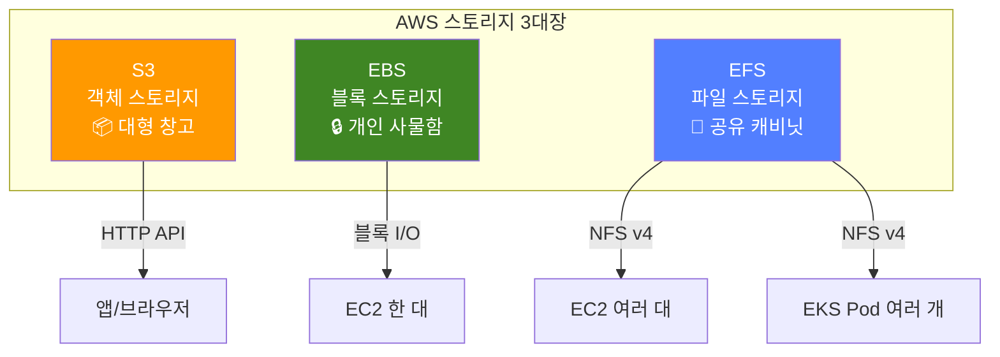
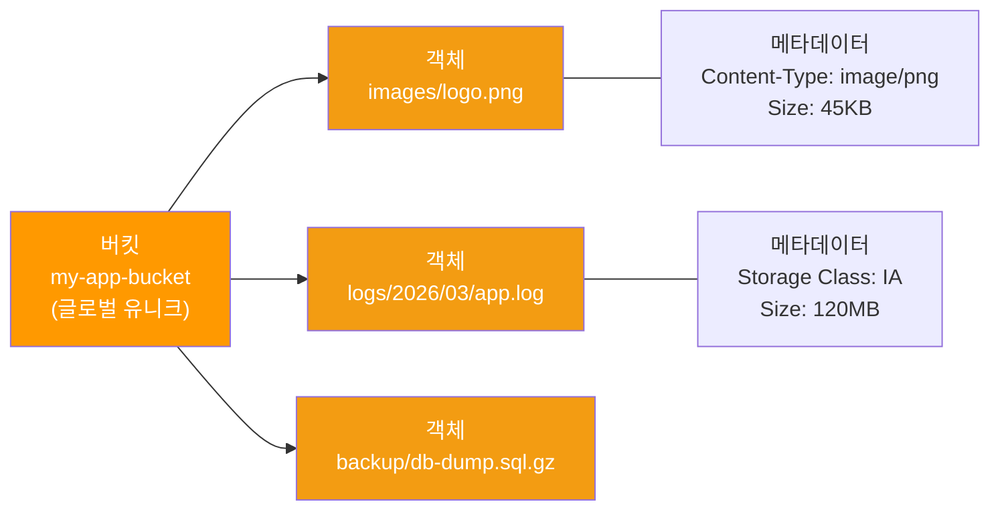
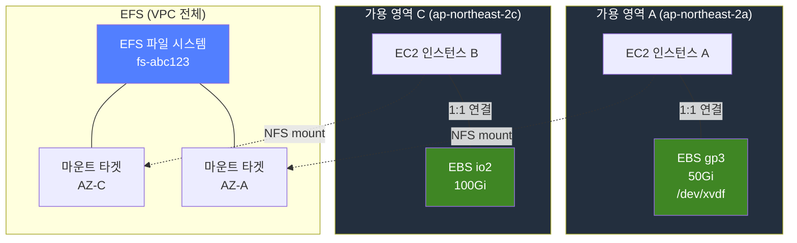
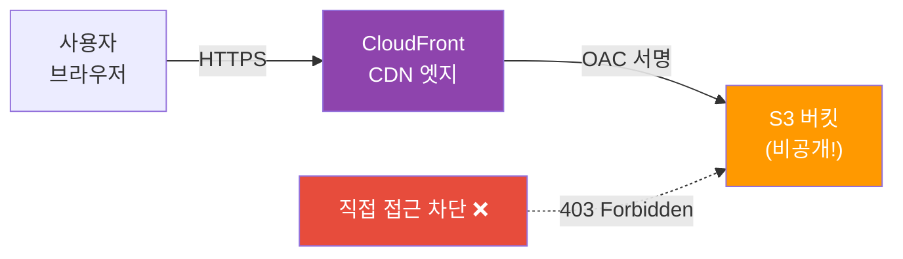
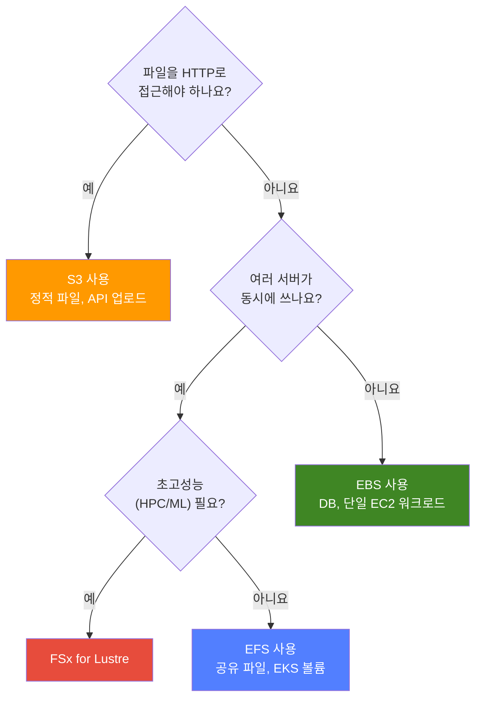

# S3 / EBS / EFS

> 클라우드에서 데이터를 어디에 저장할지 결정하는 건, 집에서 옷을 옷장에 넣을지 창고에 넣을지 고르는 것과 같아요. [IAM](./01-iam)으로 "누가 접근하나"를 정했고, [VPC](./02-vpc)로 "어디서 접근하나"를 정했다면, 이제 "데이터를 어디에 담을까"를 배울 차례예요.

---

## 🎯 이걸 왜 알아야 하나?

```
실무에서 스토리지 관련으로 하는 일들:
• 정적 파일(이미지, CSS, JS) 배포         → S3 + CloudFront
• 애플리케이션 로그/백업 저장              → S3 수명주기 정책
• EC2에 고성능 디스크 붙이기              → EBS gp3/io2
• 여러 EC2/Pod에서 공유 파일 시스템       → EFS
• "S3 비용이 너무 나와요!"               → 스토리지 클래스 최적화
• "EBS 스냅샷 복구해주세요"              → 스냅샷 관리
• DB 데이터 영구 저장                    → EBS (K8s에서는 PVC로 연결)
```

[Linux 디스크 관리](../01-linux/07-disk)에서 `lsblk`, `mount`, `fdisk`를 배웠죠? EBS는 그 디스크를 클라우드에서 제공하는 거예요. S3는 완전히 다른 개념 — HTTP로 접근하는 객체 저장소예요. EFS는 여러 서버가 동시에 쓸 수 있는 NFS 파일 시스템이에요.

---

## 🧠 핵심 개념

### 비유: 세 가지 수납 방식

AWS 스토리지를 집의 수납공간에 비유하면 이해하기 쉬워요.

* **S3 (Simple Storage Service)** = 대형 창고. 물건(파일)을 박스에 넣고 라벨(키)을 붙여서 보관해요. 용량 제한 없고, 꺼낼 때 라벨로 찾아요. HTTP로 접근하니까 "드라이브 마운트" 개념이 아니에요.
* **EBS (Elastic Block Storage)** = 개인 사물함. 한 사람(EC2)만 쓸 수 있고, 크기를 정해놓고 빠르게 접근해요. [Linux의 /dev/sda](../01-linux/07-disk)처럼 블록 디바이스로 마운트해요.
* **EFS (Elastic File System)** = 공유 파일 캐비닛. 여러 사람(EC2/Pod)이 동시에 열어서 읽고 쓸 수 있어요. NFS 프로토콜을 사용하는 네트워크 파일 시스템이에요.

### 스토리지 유형 비교



### S3 객체 구조



### EBS/EFS와 EC2의 관계



> **핵심 포인트**: EBS는 같은 가용 영역(AZ)의 EC2 한 대에만 붙일 수 있어요. EFS는 VPC 안의 여러 AZ에서 동시에 접근할 수 있어요. S3는 AZ 개념 없이 리전 전체에서 접근해요.

---

## 🔍 상세 설명

### 1. S3 기본

#### 버킷과 객체

S3의 기본 단위는 **버킷**(Bucket)과 **객체**(Object)예요.

```bash
# 버킷 만들기 (이름은 글로벌 유니크!)
aws s3 mb s3://my-company-app-prod-2026
# make_bucket: my-company-app-prod-2026

# 버킷 목록 확인
aws s3 ls
# 2026-03-13 09:00:00 my-company-app-prod-2026

# 파일 업로드 (cp)
aws s3 cp ./index.html s3://my-company-app-prod-2026/static/index.html
# upload: ./index.html to s3://my-company-app-prod-2026/static/index.html

# 폴더 전체 업로드 (sync = 변경분만 전송, cp --recursive = 전체 전송)
aws s3 sync ./dist/ s3://my-company-app-prod-2026/static/
# upload: dist/main.js to s3://my-company-app-prod-2026/static/main.js
# upload: dist/style.css to s3://my-company-app-prod-2026/static/style.css
# (이미 동일한 파일은 건너뜀!)

# 객체 목록 확인
aws s3 ls s3://my-company-app-prod-2026/static/
# 2026-03-13 09:01:00       1024 index.html
# 2026-03-13 09:01:02      45678 main.js
# 2026-03-13 09:01:03       8901 style.css

# 파일 다운로드
aws s3 cp s3://my-company-app-prod-2026/static/index.html ./downloaded.html
# download: s3://my-company-app-prod-2026/static/index.html to ./downloaded.html

# 파일 삭제
aws s3 rm s3://my-company-app-prod-2026/static/style.css
# delete: s3://my-company-app-prod-2026/static/style.css
```

> **알아두세요**: S3는 "폴더"가 실제로 존재하지 않아요. `static/index.html`에서 `static/`은 키(key)의 접두사(prefix)일 뿐이에요. 콘솔에서 폴더처럼 보여줄 뿐이죠.

#### 스토리지 클래스

데이터의 접근 빈도에 따라 비용을 최적화할 수 있어요.

| 스토리지 클래스 | 접근 빈도 | 비용 (GB/월) | 검색 비용 | 사용 사례 |
|---|---|---|---|---|
| **Standard** | 자주 | ~$0.025 | 없음 | 활성 데이터, 웹 콘텐츠 |
| **Standard-IA** | 가끔 (30일+) | ~$0.0138 | 있음 | 백업, 오래된 로그 |
| **One Zone-IA** | 가끔 + 내구성 낮아도 OK | ~$0.011 | 있음 | 재생성 가능한 데이터 |
| **Glacier Instant** | 드물게 (90일+) | ~$0.005 | 있음 (즉시) | 아카이브 (바로 접근) |
| **Glacier Flexible** | 거의 안 함 | ~$0.004 | 분~시간 | 장기 아카이브 |
| **Glacier Deep Archive** | 연 1~2회 | ~$0.002 | 12~48시간 | 규정 보관, 7년 보관 |
| **Intelligent-Tiering** | 패턴 모를 때 | ~$0.025 + 모니터링 | 자동 | 접근 패턴 예측 불가 |

```bash
# 특정 스토리지 클래스로 업로드
aws s3 cp backup.tar.gz s3://my-company-app-prod-2026/backups/ \
  --storage-class STANDARD_IA
# upload: ./backup.tar.gz to s3://my-company-app-prod-2026/backups/backup.tar.gz

# 스토리지 클래스 확인
aws s3api head-object \
  --bucket my-company-app-prod-2026 \
  --key backups/backup.tar.gz
# {
#     "StorageClass": "STANDARD_IA",
#     "ContentLength": 524288000,
#     "LastModified": "2026-03-13T09:05:00+00:00"
# }
```

#### 수명주기 정책

시간이 지나면 자동으로 스토리지 클래스를 변경하거나 삭제할 수 있어요.

```json
// lifecycle.json - 수명주기 정책 예시
{
  "Rules": [
    {
      "ID": "LogRetention",
      "Status": "Enabled",
      "Filter": { "Prefix": "logs/" },
      "Transitions": [
        {
          "Days": 30,
          "StorageClass": "STANDARD_IA"
        },
        {
          "Days": 90,
          "StorageClass": "GLACIER"
        }
      ],
      "Expiration": {
        "Days": 365
      }
    }
  ]
}
```

```bash
# 수명주기 정책 적용
aws s3api put-bucket-lifecycle-configuration \
  --bucket my-company-app-prod-2026 \
  --lifecycle-configuration file://lifecycle.json

# 정책 확인
aws s3api get-bucket-lifecycle-configuration \
  --bucket my-company-app-prod-2026
# → 위 JSON 출력
```


---

### 2. S3 고급 기능

#### 버전 관리 (Versioning)

실수로 파일을 덮어쓰거나 삭제해도 복구할 수 있어요.

```bash
# 버전 관리 활성화
aws s3api put-bucket-versioning \
  --bucket my-company-app-prod-2026 \
  --versioning-configuration Status=Enabled

# 같은 키에 파일을 다시 업로드하면 새 버전이 생겨요
aws s3 cp v2-index.html s3://my-company-app-prod-2026/static/index.html
# upload: ./v2-index.html to s3://my-company-app-prod-2026/static/index.html

# 모든 버전 확인
aws s3api list-object-versions \
  --bucket my-company-app-prod-2026 \
  --prefix static/index.html
# Versions: [{ "VersionId": "abc123", "IsLatest": true, "Size": 2048 },
#            { "VersionId": "def456", "IsLatest": false, "Size": 1024 }]

# 이전 버전으로 복구
aws s3api get-object \
  --bucket my-company-app-prod-2026 \
  --key static/index.html \
  --version-id def456 restored-index.html
```

#### 암호화

S3 객체 암호화에는 세 가지 방식이 있어요.

| 방식 | 키 관리 | 사용 사례 |
|---|---|---|
| **SSE-S3** | AWS가 키 관리 (기본값) | 일반 데이터 |
| **SSE-KMS** | KMS에서 키 관리 + 감사 로그 | 규정 준수 필요 데이터 |
| **SSE-C** | 고객이 직접 키 제공 | 키를 완전히 통제하고 싶을 때 |

```bash
# SSE-KMS로 암호화 업로드
aws s3 cp sensitive-data.csv s3://my-company-app-prod-2026/secure/ \
  --sse aws:kms \
  --sse-kms-key-id alias/my-s3-key

# 버킷 기본 암호화 설정 (모든 새 객체에 자동 적용)
aws s3api put-bucket-encryption \
  --bucket my-company-app-prod-2026 \
  --server-side-encryption-configuration '{
    "Rules": [{
      "ApplyServerSideEncryptionByDefault": {
        "SSEAlgorithm": "aws:kms",
        "KMSMasterKeyID": "alias/my-s3-key"
      },
      "BucketKeyEnabled": true
    }]
  }'
```

#### 버킷 정책 vs ACL

[IAM 정책](./01-iam)으로 사용자 권한을 관리하지만, S3에는 **버킷 정책**이라는 리소스 기반 정책도 있어요.

```json
// 버킷 정책 예시: 특정 VPC에서만 접근 허용
{
  "Version": "2012-10-17",
  "Statement": [
    {
      "Sid": "VPCOnly",
      "Effect": "Deny",
      "Principal": "*",
      "Action": "s3:*",
      "Resource": [
        "arn:aws:s3:::my-company-app-prod-2026",
        "arn:aws:s3:::my-company-app-prod-2026/*"
      ],
      "Condition": {
        "StringNotEquals": {
          "aws:sourceVpc": "vpc-abc123"
        }
      }
    }
  ]
}
```

> **ACL은 비권장이에요!** AWS는 2023년부터 새 버킷에 ACL을 기본 비활성화했어요. 버킷 정책 + IAM 정책 조합을 사용하세요. ACL은 레거시 호환용으로만 남아 있어요.

#### Presigned URL

비공개 객체를 임시로 외부에 공유할 때 사용해요. URL에 서명이 포함되어 있어서 만료 시간이 지나면 접근 불가예요.

```bash
# 15분짜리 다운로드 URL 생성
aws s3 presign s3://my-company-app-prod-2026/secure/report.pdf \
  --expires-in 900
# https://my-company-app-prod-2026.s3.amazonaws.com/secure/report.pdf?X-Amz-Algorithm=...&X-Amz-Expires=900&X-Amz-Signature=abc123...
# → 900초(15분) 후 만료! 서명 없이는 접근 불가
```

#### S3 이벤트 알림 (Lambda 트리거)

파일이 업로드되면 자동으로 Lambda를 실행할 수 있어요.

```bash
# S3 이벤트 → Lambda 트리거 (uploads/*.jpg 업로드 시 자동 실행)
aws s3api put-bucket-notification-configuration \
  --bucket my-company-app-prod-2026 \
  --notification-configuration '{
    "LambdaFunctionConfigurations": [{
      "LambdaFunctionArn": "arn:aws:lambda:ap-northeast-2:123456789012:function:process-upload",
      "Events": ["s3:ObjectCreated:*"],
      "Filter": {"Key":{"FilterRules":[
        {"Name":"prefix","Value":"uploads/"},{"Name":"suffix","Value":".jpg"}
      ]}}
    }]
  }'
```

#### Cross-Region Replication (CRR)

재해 복구를 위해 다른 리전으로 자동 복제할 수 있어요. **양쪽 버킷 모두 버전 관리가 활성화**되어야 해요.

```bash
# 복제 대상 버킷 생성 + 버전 관리 활성화
aws s3 mb s3://my-company-app-dr-2026 --region us-west-2
aws s3api put-bucket-versioning \
  --bucket my-company-app-dr-2026 \
  --versioning-configuration Status=Enabled

# 복제 규칙 설정 (이후 업로드되는 객체가 자동으로 us-west-2로 복제!)
aws s3api put-bucket-replication \
  --bucket my-company-app-prod-2026 \
  --replication-configuration '{
    "Role": "arn:aws:iam::123456789012:role/s3-replication-role",
    "Rules": [{"Status":"Enabled","Destination":{"Bucket":"arn:aws:s3:::my-company-app-dr-2026","StorageClass":"STANDARD_IA"}}]
  }'
```

#### Transfer Acceleration

전 세계에서 S3로 업로드할 때 CloudFront 엣지 로케이션을 경유해서 속도를 높여요.

```bash
# 활성화 후 가속 엔드포인트 사용 (s3.amazonaws.com → s3-accelerate.amazonaws.com)
aws s3api put-bucket-accelerate-configuration \
  --bucket my-company-app-prod-2026 \
  --accelerate-configuration Status=Enabled

aws s3 cp large-video.mp4 s3://my-company-app-prod-2026/videos/ \
  --endpoint-url https://s3-accelerate.amazonaws.com
```

---

### 3. S3 정적 웹사이트 호스팅

S3에 HTML/CSS/JS를 올리고 웹사이트를 호스팅할 수 있어요. [CDN(CloudFront)](../02-networking/11-cdn)과 함께 사용하면 전 세계에서 빠르게 접근할 수 있어요.

```bash
# 정적 웹사이트 호스팅 활성화
aws s3 website s3://my-company-app-prod-2026 \
  --index-document index.html \
  --error-document error.html

# 빌드 파일 업로드
aws s3 sync ./build/ s3://my-company-app-prod-2026/ \
  --cache-control "public, max-age=31536000" \
  --exclude "index.html"

# index.html은 캐시를 짧게!
aws s3 cp ./build/index.html s3://my-company-app-prod-2026/ \
  --cache-control "no-cache"
```

#### CloudFront + S3 OAC (Origin Access Control)

S3 버킷을 퍼블릭으로 열지 않고, CloudFront만 접근할 수 있게 하는 권장 방식이에요.



```json
// S3 버킷 정책: CloudFront OAC만 허용
{
  "Version": "2012-10-17",
  "Statement": [
    {
      "Sid": "AllowCloudFrontOAC",
      "Effect": "Allow",
      "Principal": {
        "Service": "cloudfront.amazonaws.com"
      },
      "Action": "s3:GetObject",
      "Resource": "arn:aws:s3:::my-company-app-prod-2026/*",
      "Condition": {
        "StringEquals": {
          "AWS:SourceArn": "arn:aws:cloudfront::123456789012:distribution/E1234567890"
        }
      }
    }
  ]
}
```

> **OAI vs OAC**: OAI(Origin Access Identity)는 레거시예요. 새로 만들 때는 반드시 **OAC(Origin Access Control)** 를 사용하세요. OAC는 SSE-KMS 암호화, 더 세분화된 정책을 지원해요.

---

### 4. EBS (Elastic Block Storage)

EC2에 붙이는 가상 하드디스크예요. [Linux 디스크 관리](../01-linux/07-disk)에서 배운 것처럼 파티션, 파일 시스템, 마운트를 그대로 사용해요.

#### 볼륨 타입

| 타입 | 카테고리 | IOPS (최대) | 처리량 (최대) | 사용 사례 |
|---|---|---|---|---|
| **gp3** | 범용 SSD | 16,000 | 1,000 MB/s | 대부분의 워크로드 (기본 추천!) |
| **gp2** | 범용 SSD (구형) | 16,000 | 250 MB/s | 레거시 (gp3로 전환 권장) |
| **io2 Block Express** | 프로비저닝 SSD | 256,000 | 4,000 MB/s | 고성능 DB (Oracle, SAP HANA) |
| **st1** | 처리량 HDD | 500 | 500 MB/s | 빅데이터, 로그 처리 |
| **sc1** | 콜드 HDD | 250 | 250 MB/s | 아카이브, 자주 안 쓰는 데이터 |

> **gp3 vs gp2**: gp3는 IOPS와 처리량을 독립적으로 설정할 수 있고, gp2보다 20% 저렴해요. 신규 볼륨은 gp3를 쓰세요.

> **IOPS vs 처리량**: IOPS는 "초당 읽기/쓰기 횟수" (DB 트랜잭션에 중요), 처리량은 "초당 전송 데이터량" (대용량 파일 처리에 중요)이에요.

#### EBS 생성, 연결, 마운트

```bash
# EBS 볼륨 생성 (같은 AZ에 생성해야 EC2에 붙일 수 있어요!)
aws ec2 create-volume \
  --volume-type gp3 --size 100 --iops 3000 --throughput 125 \
  --availability-zone ap-northeast-2a --encrypted \
  --tag-specifications 'ResourceType=volume,Tags=[{Key=Name,Value=app-data}]'
# { "VolumeId": "vol-0abc123def456789", "Size": 100, "VolumeType": "gp3",
#   "AvailabilityZone": "ap-northeast-2a", "State": "creating" }

# EC2 인스턴스에 연결
aws ec2 attach-volume \
  --volume-id vol-0abc123def456789 \
  --instance-id i-0abc123def456789 \
  --device /dev/xvdf
# { "Device": "/dev/xvdf", "State": "attaching" }
```

연결 후 EC2에 SSH로 접속해서 마운트해요.

```bash
# EC2 내부에서 실행 (Linux 디스크 관리와 동일!)
# 디스크 확인
lsblk
# NAME    MAJ:MIN RM  SIZE RO TYPE MOUNTPOINTS
# xvda    202:0    0   20G  0 disk
# └─xvda1 202:1    0   20G  0 part /
# xvdf    202:80   0  100G  0 disk              ← 새로 연결된 EBS

# 파일 시스템 생성 (처음 한 번만!)
sudo mkfs.ext4 /dev/xvdf
# mke2fs 1.46.5 (30-Dec-2021)
# Creating filesystem with 26214400 4k blocks and 6553600 inodes

# 마운트 포인트 생성 및 마운트
sudo mkdir -p /data
sudo mount /dev/xvdf /data

# 재부팅 후에도 자동 마운트 (fstab 등록)
echo '/dev/xvdf /data ext4 defaults,nofail 0 2' | sudo tee -a /etc/fstab

# 확인
df -h /data
# Filesystem      Size  Used Avail Use% Mounted on
# /dev/xvdf        98G   61M   93G   1% /data
```

#### EBS 스냅샷

스냅샷은 EBS의 특정 시점 백업이에요. 증분(incremental) 방식이라 변경된 블록만 저장해요.

```bash
# 스냅샷 생성 (증분 방식 — 변경된 블록만 저장!)
aws ec2 create-snapshot \
  --volume-id vol-0abc123def456789 \
  --description "app-data backup before deploy 2026-03-13" \
  --tag-specifications 'ResourceType=snapshot,Tags=[{Key=Name,Value=app-data-backup}]'
# { "SnapshotId": "snap-0abc123def456789", "State": "pending" }

# 스냅샷으로 새 볼륨 생성 (다른 AZ에도 가능!)
aws ec2 create-volume \
  --snapshot-id snap-0abc123def456789 \
  --volume-type gp3 \
  --availability-zone ap-northeast-2c
# → AZ-a의 데이터를 AZ-c로 복구할 수 있어요
```

#### Multi-Attach (io2 전용)

io2 볼륨은 같은 AZ의 여러 EC2에 동시 연결할 수 있어요. 클러스터링 워크로드에 사용해요.

```bash
# Multi-Attach 활성화된 io2 볼륨 생성
aws ec2 create-volume \
  --volume-type io2 \
  --size 100 \
  --iops 10000 \
  --multi-attach-enabled \
  --availability-zone ap-northeast-2a
# 주의: 애플리케이션 레벨에서 동시 쓰기 제어 (ex: 클러스터 파일 시스템)가 필요해요!
```

---

### 5. EFS (Elastic File System)

여러 EC2/Pod에서 동시에 읽고 쓸 수 있는 NFS 파일 시스템이에요. 용량이 자동으로 늘어나고 줄어들어요 (프로비저닝 불필요).

#### 성능 모드 vs 처리량 모드

| 설정 | 옵션 | 설명 |
|---|---|---|
| **성능 모드** | General Purpose | 대부분의 워크로드 (기본, 지연 시간 낮음) |
| | Max I/O | 수천 개 클라이언트 동시 접근 (빅데이터) |
| **처리량 모드** | Bursting | 파일 시스템 크기에 비례 (소규모에 적합) |
| | Provisioned | 고정 처리량 보장 (예측 가능한 워크로드) |
| | Elastic | 워크로드에 따라 자동 스케일 (권장!) |

```bash
# EFS 파일 시스템 생성
aws efs create-file-system \
  --performance-mode generalPurpose \
  --throughput-mode elastic \
  --encrypted \
  --tags Key=Name,Value=shared-app-data
# { "FileSystemId": "fs-0abc123def456789", "ThroughputMode": "elastic", "Encrypted": true }

# 마운트 타겟 생성 (각 AZ의 서브넷에 하나씩!)
aws efs create-mount-target \
  --file-system-id fs-0abc123def456789 \
  --subnet-id subnet-aaa111 \
  --security-groups sg-efs-mount
# { "MountTargetId": "fsmt-0abc123", "IpAddress": "10.0.1.55" }

aws efs create-mount-target \
  --file-system-id fs-0abc123def456789 \
  --subnet-id subnet-ccc333 \
  --security-groups sg-efs-mount
```

```bash
# EC2에서 마운트 (amazon-efs-utils 패키지 필요)
sudo yum install -y amazon-efs-utils    # Amazon Linux
# 또는
sudo apt install -y amazon-efs-utils    # Ubuntu

# TLS 암호화 마운트 (권장)
sudo mkdir -p /shared
sudo mount -t efs -o tls fs-0abc123def456789:/ /shared

# fstab에 등록 (재부팅 후 자동 마운트)
echo 'fs-0abc123def456789:/ /shared efs _netdev,tls 0 0' | sudo tee -a /etc/fstab

# 확인
df -h /shared
# Filesystem                   Size  Used Avail Use% Mounted on
# fs-0abc123def456789.efs...   8.0E     0  8.0E   0% /shared
# → 8 엑사바이트! (자동 확장이라 최대치로 표시돼요)
```

#### EFS + EKS (Kubernetes)

[K8s 스토리지(CSI/PV)](../04-kubernetes/07-storage)에서 배운 PVC를 EFS와 연결할 수 있어요. 여러 Pod에서 ReadWriteMany로 공유해요.

```yaml
# StorageClass - EFS CSI 드라이버 사용
apiVersion: storage.k8s.io/v1
kind: StorageClass
metadata:
  name: efs-sc
provisioner: efs.csi.aws.com
parameters:
  provisioningMode: efs-ap           # Access Point 자동 생성
  fileSystemId: fs-0abc123def456789
  directoryPerms: "700"
---
# PVC
apiVersion: v1
kind: PersistentVolumeClaim
metadata:
  name: shared-data
spec:
  accessModes:
    - ReadWriteMany          # 여러 Pod에서 동시 읽기/쓰기!
  storageClassName: efs-sc
  resources:
    requests:
      storage: 5Gi           # EFS는 자동 확장이라 참고용
---
# Deployment에서 사용
apiVersion: apps/v1
kind: Deployment
metadata:
  name: web-app
spec:
  replicas: 3                # 3개 Pod 모두 같은 EFS를 공유
  selector:
    matchLabels:
      app: web-app
  template:
    metadata:
      labels:
        app: web-app
    spec:
      containers:
      - name: app
        image: nginx:1.25
        volumeMounts:
        - name: shared
          mountPath: /usr/share/nginx/html   # 3개 Pod 모두 같은 파일을 서빙
      volumes:
      - name: shared
        persistentVolumeClaim:
          claimName: shared-data
```

---

### 6. 선택 가이드: S3 vs EBS vs EFS vs FSx

어떤 스토리지를 써야 할지 헷갈릴 때 이 비교표를 참고하세요.

| 기준 | S3 | EBS | EFS | FSx for Lustre |
|---|---|---|---|---|
| **타입** | 객체 스토리지 | 블록 스토리지 | 파일 스토리지 (NFS) | 파일 스토리지 (고성능) |
| **접근 방식** | HTTP API | EC2에 마운트 | NFS 마운트 | Lustre 클라이언트 |
| **동시 접근** | 무제한 | 1개 EC2 (io2 Multi-Attach 제외) | 여러 EC2/Pod | 여러 EC2/Pod |
| **용량** | 무제한 | 1GiB ~ 64TiB | 자동 확장 (무제한) | 1.2TiB ~ 수백 PiB |
| **성능** | 높은 처리량 | 매우 높음 (io2) | 중간 ~ 높음 | 매우 높음 (HPC) |
| **비용** | 가장 저렴 | 중간 | 높음 (GB당) | 높음 |
| **내구성** | 99.999999999% (11 9s) | AZ 내 복제 | 다중 AZ 복제 | 다중 AZ 복제 |
| **백업** | 버전 관리, CRR | 스냅샷 | AWS Backup | AWS Backup |
| **대표 사용 사례** | 정적 파일, 백업, 데이터 레이크 | DB, OS 볼륨 | 공유 홈 디렉터리, CMS | ML 트레이닝, HPC |



---

## 💻 실습 예제

### 실습 1: S3 정적 웹사이트 + CloudFront

> 간단한 HTML 페이지를 S3에 올리고, CloudFront로 배포해 봐요.

```bash
# 1. 버킷 생성 + HTML 파일 준비
aws s3 mb s3://my-static-site-demo-2026

cat > /tmp/index.html << 'EOF'
<!DOCTYPE html>
<html><head><title>Demo</title></head>
<body><h1>S3 정적 호스팅 실습</h1></body></html>
EOF

# 2. 업로드 + 정적 웹 호스팅 활성화
aws s3 cp /tmp/index.html s3://my-static-site-demo-2026/
aws s3 website s3://my-static-site-demo-2026 --index-document index.html

# 3. CloudFront 배포 생성 (OAC 사용)
aws cloudfront create-distribution \
  --origin-domain-name my-static-site-demo-2026.s3.ap-northeast-2.amazonaws.com \
  --default-root-object index.html
# → DomainName: d1234567.cloudfront.net 출력

# 4. 버킷 정책에 CloudFront OAC 허용 추가 (위의 OAC 정책 JSON 참고)

# 5. 접속 확인
curl -s https://d1234567.cloudfront.net/
# → HTML 내용이 출력되면 성공!
```

### 실습 2: EBS 볼륨 생성 + 확장

> EBS 볼륨을 만들고 EC2에 붙인 후, 온라인으로 용량을 확장해 봐요.

```bash
# 1. EC2 메타데이터에서 인스턴스 정보 확인 (IMDSv2)
TOKEN=$(curl -s -X PUT "http://169.254.169.254/latest/api/token" \
  -H "X-aws-ec2-metadata-token-ttl-seconds: 21600")
INSTANCE_ID=$(curl -s -H "X-aws-ec2-metadata-token: $TOKEN" \
  http://169.254.169.254/latest/meta-data/instance-id)
AZ=$(curl -s -H "X-aws-ec2-metadata-token: $TOKEN" \
  http://169.254.169.254/latest/meta-data/placement/availability-zone)

# 2. 50GB 볼륨 생성 → 연결 → 포맷 → 마운트
VOLUME_ID=$(aws ec2 create-volume --volume-type gp3 --size 50 \
  --availability-zone $AZ --encrypted --query 'VolumeId' --output text)
aws ec2 wait volume-available --volume-ids $VOLUME_ID
aws ec2 attach-volume --volume-id $VOLUME_ID --instance-id $INSTANCE_ID --device /dev/xvdf
sleep 10

sudo mkfs.ext4 /dev/xvdf && sudo mkdir -p /data && sudo mount /dev/xvdf /data
df -h /data
# /dev/xvdf  49G  53M  47G  1% /data

# 3. 볼륨 확장 50GB → 100GB (무중단!)
aws ec2 modify-volume --volume-id $VOLUME_ID --size 100
# { "ModificationState": "modifying", "TargetSize": 100, "OriginalSize": 50 }

# 4. OS에서 파일 시스템 확장 (Linux 디스크 관리에서 배운 내용!)
sudo growpart /dev/xvdf 1 2>/dev/null || true   # 파티션 확장 (있는 경우)
sudo resize2fs /dev/xvdf                         # ext4 파일 시스템 확장

df -h /data
# /dev/xvdf  98G  53M  93G  1% /data  ← 무중단 확장 완료!
```

### 실습 3: EFS 공유 스토리지 (다중 EC2)

> 두 대의 EC2에서 같은 EFS를 마운트하고 파일을 공유해 봐요.

```bash
# 1. EFS 생성 + 보안 그룹 (NFS 포트 2049 허용)
EFS_ID=$(aws efs create-file-system \
  --performance-mode generalPurpose --throughput-mode elastic --encrypted \
  --tags Key=Name,Value=shared-demo --query 'FileSystemId' --output text)

SG_ID=$(aws ec2 create-security-group \
  --group-name efs-mount-sg --description "Allow NFS" \
  --vpc-id vpc-abc123 --query 'GroupId' --output text)
aws ec2 authorize-security-group-ingress \
  --group-id $SG_ID --protocol tcp --port 2049 --source-group sg-ec2-instances

# 2. 마운트 타겟 생성 (각 AZ에 하나씩)
aws efs create-mount-target --file-system-id $EFS_ID --subnet-id subnet-aaa111 --security-groups $SG_ID
aws efs create-mount-target --file-system-id $EFS_ID --subnet-id subnet-ccc333 --security-groups $SG_ID

# 3. EC2-A에서 마운트 + 파일 생성
sudo yum install -y amazon-efs-utils
sudo mkdir -p /shared && sudo mount -t efs -o tls $EFS_ID:/ /shared
echo "Hello from EC2-A" | sudo tee /shared/test.txt

# 4. EC2-B에서 같은 EFS 마운트 → EC2-A가 만든 파일이 보여요!
sudo yum install -y amazon-efs-utils
sudo mkdir -p /shared && sudo mount -t efs -o tls $EFS_ID:/ /shared
cat /shared/test.txt
# Hello from EC2-A
```

---

## 🏢 실무에서는?

### 시나리오 1: 프론트엔드 배포 파이프라인 (S3 + CloudFront)

```
문제: React 앱을 배포할 때마다 서버를 관리하기 싫어요
해결: S3 + CloudFront + GitHub Actions

파이프라인:
1. PR 머지 → GitHub Actions 트리거
2. npm run build → 빌드 결과물 생성
3. aws s3 sync --delete → S3에 업로드 (기존 파일 정리)
4. aws cloudfront create-invalidation → CDN 캐시 무효화
5. 전 세계 엣지에서 새 버전 서빙!

비용: 월 $1~5 (트래픽에 따라) — EC2 운영 대비 90% 절감
```

### 시나리오 2: DB 서버 디스크 관리 (EBS io2)

```
문제: RDS 쓰기 싫고 EC2에서 직접 DB 운영 (성능 최적화 필요)
해결: EBS io2 + 자동 스냅샷

구성:
- OS: gp3 20GiB (/dev/xvda)
- DB 데이터: io2 500GiB, 10,000 IOPS (/dev/xvdf → /var/lib/mysql)
- DB WAL: io2 100GiB, 5,000 IOPS (/dev/xvdg → /var/lib/mysql-wal)

스냅샷 정책:
- 매일 새벽 3시 자동 스냅샷 (AWS Backup 또는 DLM)
- 7일 보관 후 자동 삭제
- 월간 스냅샷은 1년 보관
```

### 시나리오 3: ML 팀 공유 데이터셋 (EFS + EKS)

```
문제: ML 엔지니어 5명이 같은 데이터셋(100GB)을 각자 복사해서 사용
해결: EFS에 데이터셋 저장 + EKS Pod에서 ReadWriteMany 마운트

구성:
- EFS Elastic 처리량 모드 (트레이닝 시 자동 스케일업)
- StorageClass: efs-sc (CSI 드라이버)
- /datasets (ReadOnlyMany) → 원본 데이터셋
- /outputs (ReadWriteMany) → 각 Pod의 결과물

효과:
- 데이터 중복 제거 → S3 복사 비용 절감
- 새 팀원이 Pod 띄우면 즉시 데이터 접근 가능
- 데이터셋 업데이트가 모든 Pod에 즉시 반영
```

---

## ⚠️ 자주 하는 실수

### 1. S3 버킷을 퍼블릭으로 열기

```
❌ 잘못된 방법:
   S3 버킷 정책에 "Principal": "*", "Action": "s3:GetObject"
   → 전 세계에서 모든 파일에 접근 가능! 데이터 유출 사고!

✅ 올바른 방법:
   CloudFront OAC를 사용해서 CloudFront만 접근 허용
   Presigned URL로 필요한 파일만 임시 공유
   → "S3 Block Public Access" 설정을 버킷/계정 레벨에서 반드시 활성화!
```

### 2. EBS를 다른 AZ의 EC2에 붙이려고 하기

```
❌ 잘못된 방법:
   AZ-a에서 만든 EBS 볼륨을 AZ-c의 EC2에 attach
   → "The volume is not in the same availability zone" 에러!

✅ 올바른 방법:
   1. 스냅샷 생성: aws ec2 create-snapshot --volume-id vol-xxx
   2. 스냅샷으로 새 볼륨 생성: aws ec2 create-volume --snapshot-id snap-xxx --availability-zone ap-northeast-2c
   3. 새 볼륨을 AZ-c의 EC2에 연결
```

### 3. EBS 볼륨 확장 후 파일 시스템 리사이즈를 잊음

```
❌ 잘못된 방법:
   aws ec2 modify-volume --size 200 만 하고 끝냄
   → df -h 해보면 여전히 100G! OS가 새 용량을 인식 못 해요

✅ 올바른 방법:
   1. aws ec2 modify-volume --size 200           (AWS 레벨 확장)
   2. sudo growpart /dev/xvdf 1                  (파티션 확장 - 파티션이 있는 경우)
   3. sudo resize2fs /dev/xvdf1                  (파일 시스템 확장 - ext4)
   또는 sudo xfs_growfs /data                    (xfs인 경우)
```

### 4. S3 수명주기 정책 없이 로그를 계속 쌓기

```
❌ 잘못된 방법:
   로그를 S3 Standard에 무한정 저장
   → 1년 후 수백 TB, 월 비용 수천 달러!

✅ 올바른 방법:
   수명주기 정책 설정:
   - 30일: Standard → Standard-IA (비용 45% 절감)
   - 90일: Standard-IA → Glacier (비용 80% 절감)
   - 365일: 삭제 또는 Glacier Deep Archive
   → 규정 준수 기간만큼 보관하고 자동 정리!
```

### 5. EFS 보안 그룹에서 NFS 포트를 안 열기

```
❌ 잘못된 방법:
   EFS 마운트 타겟의 보안 그룹에 포트 2049를 안 열어놓음
   → mount 명령이 타임아웃! "Connection timed out"

✅ 올바른 방법:
   마운트 타겟 보안 그룹에서:
   - 인바운드: TCP 2049 (NFS) ← EC2/Pod 보안 그룹으로부터 허용
   - VPC 내부 통신이므로 0.0.0.0/0은 불필요! 소스를 EC2 SG로 제한하세요
```

---

## 📝 정리

```
S3 (객체 스토리지):
├── HTTP API로 접근하는 무제한 저장소
├── 스토리지 클래스로 비용 최적화 (Standard → IA → Glacier)
├── 수명주기 정책으로 자동 전환/삭제
├── 버전 관리로 실수 복구
├── 버킷 정책 + IAM으로 접근 제어 (ACL 비권장)
├── CloudFront + OAC로 정적 웹 호스팅
└── 이벤트 알림으로 Lambda 트리거 가능

EBS (블록 스토리지):
├── EC2에 붙이는 가상 디스크 (Linux 디스크처럼 사용)
├── gp3 = 기본 추천, io2 = 고성능 DB
├── 같은 AZ의 EC2 한 대에만 연결 (io2 Multi-Attach 제외)
├── 스냅샷으로 백업 + AZ 간 복구
└── 용량 확장 후 반드시 OS에서 resize 필요!

EFS (파일 스토리지):
├── 여러 EC2/Pod에서 동시 읽기/쓰기 (NFS v4)
├── 자동 용량 확장 (프로비저닝 불필요)
├── Elastic 처리량 모드 권장
├── EKS + CSI 드라이버로 K8s PVC 연동
└── 마운트 타겟 보안 그룹에 포트 2049 열기 필수!

선택 기준:
• HTTP 접근 + 무제한 → S3
• 단일 EC2 + 고성능 → EBS
• 다중 EC2/Pod + 공유 → EFS
• HPC/ML 초고성능 → FSx for Lustre
```

---

## 🔗 다음 강의 → [05-database](./05-database)

> 데이터를 "어디에" 저장하는지 배웠으니, 다음은 데이터를 "어떻게" 관리하는지 — RDS, DynamoDB, ElastiCache 같은 AWS 데이터베이스 서비스를 배울 거예요.

**관련 강의 링크:**
- [Linux 디스크 관리](../01-linux/07-disk) -- EBS를 EC2에서 다룰 때 필수 지식
- [K8s 스토리지 (CSI/PV)](../04-kubernetes/07-storage) -- EBS/EFS를 K8s Pod에 연결
- [VPC](./02-vpc) -- EFS 마운트 타겟이 위치하는 네트워크
- [IAM (S3 정책)](./01-iam) -- S3 버킷 정책과 IAM 역할
- [CDN (CloudFront+S3)](../02-networking/11-cdn) -- S3 정적 웹사이트를 전 세계에 배포
