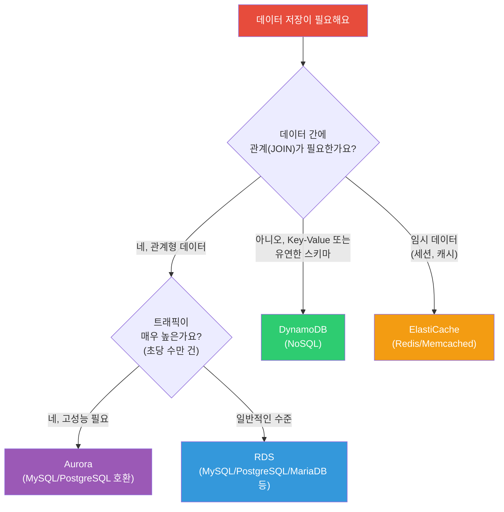
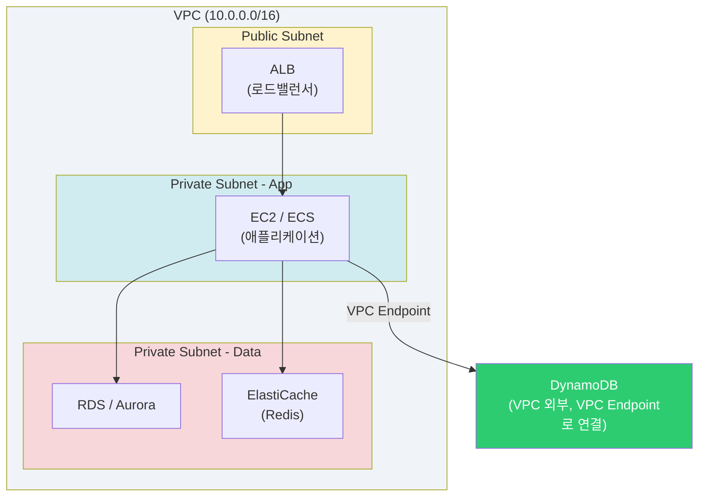
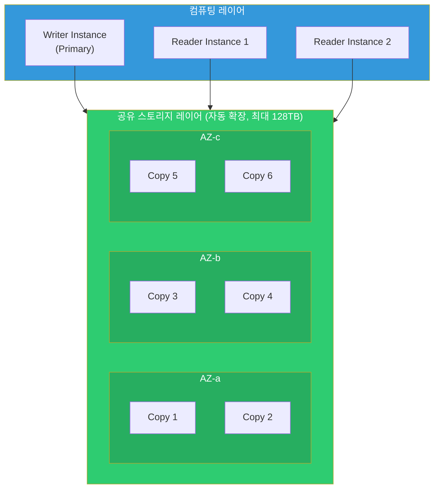
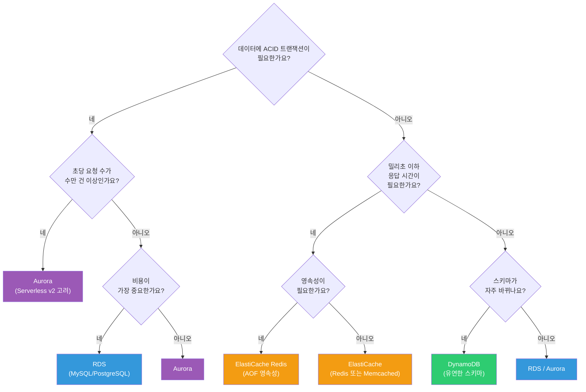

# RDS / Aurora / DynamoDB / ElastiCache

> AWS에서 데이터를 저장하고 관리하는 핵심 데이터베이스 서비스들이에요. 이전 강의에서 [S3, EBS, EFS 같은 스토리지](./04-storage)를 배웠다면, 이번에는 **구조화된 데이터**를 다루는 방법을 알아볼게요.

---

## 🎯 이걸 왜 알아야 하나?

서비스를 운영하면 반드시 데이터베이스가 필요해요.

```
"회원 정보 어디에 저장하지?"       → RDS (MySQL/PostgreSQL)
"초당 10만 건 읽기가 필요한데?"     → DynamoDB + DAX
"DB 장애나면 자동 복구되게 하고 싶어" → Aurora Multi-AZ
"로그인 세션 어디에 저장하지?"       → ElastiCache (Redis)
```

EC2에 MySQL 직접 설치해서 쓰면 되지 않냐고요? 가능은 해요. 하지만 이런 일이 전부 **여러분 몫**이 돼요.

- 패치/업그레이드
- 백업/복원
- 장애 발생 시 failover
- 스토리지 용량 관리
- 모니터링 설정

AWS Managed Database 서비스를 쓰면 이런 운영 부담을 AWS에게 넘기고, 여러분은 **애플리케이션 로직**에 집중할 수 있어요.

---

## 🧠 핵심 개념

### 비유: 데이터 저장소를 음식점에 비유하면

| 서비스 | 비유 | 설명 |
|--------|------|------|
| **RDS** | 동네 식당 | 메뉴판(스키마)이 정해져 있고, 검증된 레시피(SQL 엔진)로 요리해요 |
| **Aurora** | 프랜차이즈 식당 | 동네 식당과 같은 메뉴인데, 주방이 6개로 분산되어 있어서 빠르고 안정적이에요 |
| **DynamoDB** | 뷔페 | 메뉴판 없이 원하는 걸 가져다 놓으면 돼요. 사람이 많아져도 테이블만 늘리면 돼요 |
| **ElastiCache** | 카운터 위 반찬통 | 자주 찾는 건 미리 꺼내놔서 바로 가져갈 수 있어요 (캐시) |

### RDBMS vs NoSQL vs Cache — 언제 뭘 쓸까?



### 전체 구조 — VPC 안에서의 위치

데이터베이스는 보통 **Private Subnet**에 배치해요. 외부에서 직접 접근하면 안 되니까요.



> DynamoDB는 VPC 바깥의 AWS 관리형 서비스예요. VPC Endpoint를 사용하면 인터넷을 거치지 않고 Private Subnet에서 안전하게 접근할 수 있어요. VPC 개념은 [VPC 강의](./02-vpc)를 참고하세요.

### 관리 수준 비교

AWS가 얼마나 많이 관리해주는지도 서비스마다 달라요.

```mermaid
flowchart LR
    subgraph SELF["직접 관리 (EC2에 DB 설치)"]
        direction TB
        S1["OS 패치"]
        S2["DB 설치/업그레이드"]
        S3["백업/복원"]
        S4["Failover"]
        S5["스토리지 관리"]
    end

    subgraph MANAGED["RDS / Aurora"]
        direction TB
        M1["OS 패치 ✅ AWS"]
        M2["DB 설치/업그레이드 ✅ AWS"]
        M3["백업/복원 ✅ AWS"]
        M4["Failover ✅ AWS"]
        M5["스토리지 관리 ✅ AWS"]
    end

    subgraph SERVERLESS["DynamoDB"]
        direction TB
        D1["인프라 전체 ✅ AWS"]
        D2["용량 관리 ✅ AWS"]
        D3["스케일링 ✅ AWS"]
        D4["패치/업그레이드 ✅ AWS"]
        D5["테이블 설계만 내가!"]
    end

    SELF --> MANAGED --> SERVERLESS

    style SELF fill:#e74c3c,color:#fff
    style MANAGED fill:#f39c12,color:#fff
    style SERVERLESS fill:#2ecc71,color:#fff
```



---

## 🔍 상세 설명

### 1. Amazon RDS (Relational Database Service)

RDS는 **관계형 데이터베이스를 관리형으로 제공**하는 서비스예요. 직접 서버에 MySQL을 설치하는 대신, AWS가 설치/패치/백업을 전부 해줘요.

#### 지원 엔진

| 엔진 | 특징 | 주 사용처 |
|------|------|-----------|
| **MySQL** | 가장 널리 쓰이는 오픈소스 DB | 웹 애플리케이션 전반 |
| **PostgreSQL** | 고급 기능(JSON, GIS) 풍부 | 복잡한 쿼리, 분석 워크로드 |
| **MariaDB** | MySQL 포크, 성능 개선 | MySQL 대안 |
| **Oracle** | 엔터프라이즈 기능 | 레거시 시스템, 금융 |
| **SQL Server** | Microsoft 생태계 | .NET 애플리케이션 |

#### 핵심 구성 요소

**인스턴스 클래스** — DB 서버의 사양을 결정해요.

```
db.t3.micro   → 개발/테스트용 (vCPU 2, 메모리 1GB)
db.r6g.large  → 운영용 (vCPU 2, 메모리 16GB) — 메모리 최적화
db.m6g.xlarge → 범용 (vCPU 4, 메모리 16GB)
```

> 비유: 엑셀 파일을 열 때 컴퓨터 사양이 좋으면 빠르게 열리잖아요? 인스턴스 클래스가 바로 그 "사양"이에요.

**DB Subnet Group** — DB가 배치될 서브넷을 지정해요.

```bash
# DB Subnet Group 조회
aws rds describe-db-subnet-groups \
  --query 'DBSubnetGroups[*].{Name:DBSubnetGroupName,VPC:VpcId,Subnets:Subnets[*].SubnetIdentifier}'

# 출력 예시
# {
#     "Name": "my-db-subnet-group",
#     "VPC": "vpc-0abc123def456",
#     "Subnets": [
#         "subnet-0aaa111",   ← AZ-a의 Private Subnet
#         "subnet-0bbb222"    ← AZ-c의 Private Subnet
#     ]
# }
```

> Multi-AZ를 쓰려면 **최소 2개 AZ의 서브넷**이 필요해요. [VPC 강의](./02-vpc)에서 서브넷 설계를 복습하세요.

**Parameter Group** — DB 엔진의 세부 설정을 관리해요.

```bash
# 파라미터 그룹 내용 확인 (MySQL의 max_connections 등)
aws rds describe-db-parameters \
  --db-parameter-group-name default.mysql8.0 \
  --query 'Parameters[?ParameterName==`max_connections`]'

# 출력 예시
# {
#     "ParameterName": "max_connections",
#     "ParameterValue": "{DBInstanceClassMemory/12582880}",
#     "Description": "The number of simultaneous client connections allowed.",
#     "ApplyType": "dynamic"
# }
```

#### Multi-AZ (고가용성)

Multi-AZ를 켜면 **다른 AZ에 Standby 복제본**이 자동 생성돼요. Primary가 장애나면 자동으로 Standby로 전환(failover)해요.

```
┌─────────────────┐          ┌─────────────────┐
│   AZ-a          │          │   AZ-c          │
│  ┌───────────┐  │  동기    │  ┌───────────┐  │
│  │  Primary  │──┼──복제──→─┼──│  Standby  │  │
│  │   (R/W)   │  │          │  │   (대기)   │  │
│  └───────────┘  │          │  └───────────┘  │
└─────────────────┘          └─────────────────┘
        ↑                            ↑
   평소 여기로 접속              장애 시 자동 전환 (약 60초)
```

- **동기 복제** — Primary에 쓴 데이터가 Standby에도 반영된 후 커밋 완료
- **자동 Failover** — 약 60초 내에 DNS 엔드포인트가 Standby를 가리키도록 변경
- **Standby는 읽기 불가** — 순수 대기 용도 (읽기 분산은 Read Replica를 쓰세요)

#### Read Replica (읽기 분산)

읽기 트래픽이 많으면 **Read Replica**를 만들어서 분산해요.

```
        쓰기 ──→ Primary ──→ 비동기 복제 ──→ Read Replica 1
                                         ──→ Read Replica 2
        읽기 ──→ Read Replica 1 또는 2
```

- **비동기 복제** — 약간의 지연(lag)이 있을 수 있어요
- 최대 **15개** Read Replica 생성 가능 (Aurora는 15개, RDS는 5개)
- **Cross-Region** Read Replica도 가능 (재해 복구 용도)

```bash
# RDS 인스턴스 목록 조회
aws rds describe-db-instances \
  --query 'DBInstances[*].{ID:DBInstanceIdentifier,Engine:Engine,Class:DBInstanceClass,Status:DBInstanceStatus,MultiAZ:MultiAZ}' \
  --output table

# 출력 예시
# ┌──────────────────┬─────────┬──────────────┬───────────┬─────────┐
# │       ID         │ Engine  │    Class     │  Status   │ MultiAZ │
# ├──────────────────┼─────────┼──────────────┼───────────┼─────────┤
# │ my-prod-db       │ mysql   │ db.r6g.large │ available │ True    │
# │ my-dev-db        │ mysql   │ db.t3.micro  │ available │ False   │
# │ my-prod-db-read1 │ mysql   │ db.r6g.large │ available │ False   │
# └──────────────────┴─────────┴──────────────┴───────────┴─────────┘
```

---

### 2. Amazon Aurora

Aurora는 **AWS가 MySQL/PostgreSQL을 재설계한 클라우드 네이티브 데이터베이스**예요. 기존 RDS와 호환되지만, 내부 아키텍처가 완전히 다르기 때문에 성능과 안정성이 훨씬 좋아요.

#### Aurora가 특별한 이유: 6-Copy 분산 스토리지



**핵심 포인트:**
- 데이터가 **3개 AZ에 6개 복사본**으로 자동 저장돼요
- 쓰기는 6개 중 **4개만 성공**하면 커밋 (Write Quorum)
- 읽기는 6개 중 **3개만 성공**하면 반환 (Read Quorum)
- 2개 복사본이 동시에 죽어도 쓰기 가능, 3개까지 죽어도 읽기 가능

> 비유: 중요한 문서를 6개 복사해서 3개 지점에 2장씩 보관하는 거예요. 한 지점이 불타도 다른 지점에서 꺼내면 돼요.

#### Aurora Serverless v2

트래픽에 따라 **자동으로 컴퓨팅 용량이 조절**돼요.

```
트래픽 낮을 때: 0.5 ACU (약 1GB 메모리)  ← 비용 절감
트래픽 높을 때: 128 ACU (약 256GB 메모리) ← 자동 확장

ACU(Aurora Capacity Unit) = vCPU + 메모리 조합 단위
```

- **최소/최대 ACU만 설정**하면 나머지는 Aurora가 알아서 해요
- 개발/스테이징 환경이나 트래픽 변동이 큰 서비스에 적합해요
- 기존 Aurora 클러스터에 Serverless v2 인스턴스를 **혼합 배치**할 수도 있어요

#### Aurora Global Database

전 세계 여러 리전에 데이터를 복제해요.

```
서울 리전 (Primary)
    ↓  1초 이내 비동기 복제
버지니아 리전 (Secondary) — 읽기 전용
    ↓
유럽 리전 (Secondary) — 읽기 전용
```

- **RPO(데이터 손실)**: 보통 1초 이내
- **RTO(복구 시간)**: 1분 이내에 Secondary를 Primary로 승격 가능
- 해외 사용자에게 **로컬 리전에서 읽기** 제공 가능

#### Blue/Green Deployment

데이터베이스 업그레이드를 **무중단**으로 수행할 수 있어요.

```
Blue (현재 운영) ──→ 그대로 서비스 중
                        ↕ 실시간 복제
Green (새 버전)  ──→ 업그레이드/테스트 완료 후 전환

전환 시: DNS가 Green을 가리키도록 변경 (약 1분)
롤백 시: 다시 Blue로 전환
```

---

### 3. Amazon DynamoDB

DynamoDB는 **완전관리형 NoSQL 데이터베이스**예요. 서버 프로비저닝, 패치, 스케일링 전부 AWS가 해줘요. 여러분은 **테이블 설계**만 하면 돼요.

> 비유: RDS가 "엑셀 파일"(행과 열이 미리 정해져 있음)이라면, DynamoDB는 "메모장"(원하는 내용을 자유롭게 적음)이에요. 대신 메모장에도 **제목(파티션 키)**은 반드시 있어야 해요.

#### 파티션 키와 정렬 키

DynamoDB 테이블의 기본 키는 두 가지 형태예요.

```
1. 파티션 키만 (Simple Primary Key)
   ┌─────────────────┬──────────┬────────┐
   │ user_id (PK)    │ name     │ email  │
   ├─────────────────┼──────────┼────────┤
   │ user-001        │ 홍길동    │ ...    │
   │ user-002        │ 김철수    │ ...    │
   └─────────────────┴──────────┴────────┘

2. 파티션 키 + 정렬 키 (Composite Primary Key)
   ┌─────────────────┬──────────────────┬──────────┐
   │ user_id (PK)    │ order_date (SK)  │ amount   │
   ├─────────────────┼──────────────────┼──────────┤
   │ user-001        │ 2026-01-15       │ 50000    │
   │ user-001        │ 2026-02-20       │ 30000    │
   │ user-002        │ 2026-01-10       │ 80000    │
   └─────────────────┴──────────────────┴──────────┘
   → 같은 user_id 내에서 order_date로 정렬/범위 검색 가능
```

- **파티션 키(PK)**: 데이터가 어느 파티션에 저장될지 결정 (고르게 분산되도록 설계)
- **정렬 키(SK)**: 같은 파티션 내에서의 정렬 기준 (범위 쿼리 가능)

#### 용량 모드: On-Demand vs Provisioned

| 항목 | On-Demand | Provisioned |
|------|-----------|-------------|
| 과금 | 요청당 과금 | 미리 RCU/WCU 설정 |
| 스케일링 | 자동 | Auto Scaling 설정 필요 |
| 비용 | 트래픽 적을 때 저렴 | 트래픽 예측 가능할 때 저렴 |
| 적합한 상황 | 신규 서비스, 변동 큰 트래픽 | 안정적인 트래픽 패턴 |

```
RCU(Read Capacity Unit):  4KB 강한 일관성 읽기 1회/초
                          또는 4KB 최종 일관성 읽기 2회/초
WCU(Write Capacity Unit): 1KB 쓰기 1회/초
```

#### GSI / LSI (보조 인덱스)

기본 키 외에 다른 조건으로도 검색하고 싶을 때 사용해요.

```
원본 테이블:  PK=user_id, SK=order_date
             → user_id로만 조회 가능

GSI 추가:    PK=product_id, SK=order_date
             → product_id로도 조회 가능!

LSI 추가:    PK=user_id (동일), SK=amount
             → 같은 user 내에서 금액 기준 정렬/검색 가능
```

- **GSI(Global Secondary Index)**: 테이블 생성 후에도 추가 가능, 별도 RCU/WCU 소비
- **LSI(Local Secondary Index)**: 테이블 생성 시에만 추가 가능, 테이블의 RCU/WCU 공유

#### DynamoDB Streams

테이블 데이터가 변경될 때 **이벤트를 발생**시켜요.

```
Item 추가/수정/삭제
       ↓
  DynamoDB Stream (변경 로그)
       ↓
  Lambda 함수 트리거
       ↓
  알림 전송, 다른 테이블 동기화, 분석 파이프라인 등
```

#### TTL (Time to Live)

항목에 만료 시간을 설정하면 **자동으로 삭제**돼요. 세션 데이터나 로그에 유용해요.

```json
{
  "session_id": "abc-123",
  "user_id": "user-001",
  "expires_at": 1773561600    // Unix 타임스탬프, 이 시간 지나면 자동 삭제
}
```

#### DAX (DynamoDB Accelerator)

DynamoDB 앞에 놓는 **인메모리 캐시**예요.

```
                  캐시 히트 → 마이크로초 응답
애플리케이션 → DAX ──────────→ DynamoDB
                  캐시 미스 → DynamoDB에서 가져와 캐싱
```

- 코드 변경 최소화 (DynamoDB SDK와 호환)
- 읽기가 **수십 배 빠르게** (밀리초 → 마이크로초)
- 자주 읽는 데이터에 효과적 (리더보드, 카탈로그 등)

---

### 4. Amazon ElastiCache

ElastiCache는 **인메모리 데이터 스토어**를 관리형으로 제공해요. 디스크가 아니라 **메모리에 데이터를 저장**하기 때문에 매우 빨라요.

> 비유: 도서관(RDS)에서 책을 찾으려면 시간이 걸리잖아요. 자주 보는 책은 **책상 위(캐시)**에 꺼내 놓으면 바로 볼 수 있어요. 그게 ElastiCache예요.

#### Redis vs Memcached

| 기능 | Redis | Memcached |
|------|-------|-----------|
| 데이터 구조 | String, List, Set, Hash, Sorted Set 등 | String만 |
| 영속성 | AOF/RDB로 디스크 저장 가능 | 메모리만 (재시작 시 소멸) |
| 복제 | Primary-Replica 지원 | 지원 안 함 |
| 클러스터 | 클러스터 모드 지원 | 멀티노드 지원 |
| Pub/Sub | 지원 | 미지원 |
| 사용 사례 | 세션, 캐시, 리더보드, 큐 | 단순 캐시 |
| **결론** | **대부분 Redis를 선택해요** | 단순 캐시만 필요할 때 |

#### Redis 클러스터 모드

```
클러스터 모드 비활성화 (Replication Group):
  Primary ──→ Replica 1
           ──→ Replica 2
  → 데이터 1세트, 읽기 분산

클러스터 모드 활성화:
  Shard 1: Primary + Replica  (슬롯 0~5460)
  Shard 2: Primary + Replica  (슬롯 5461~10922)
  Shard 3: Primary + Replica  (슬롯 10923~16383)
  → 데이터 분산 저장, 더 큰 용량과 처리량
```

#### 주요 사용 패턴

**1. 세션 스토어**
```
사용자 로그인 → 세션을 Redis에 저장
                (TTL 30분 설정)
다음 요청   → Redis에서 세션 확인 → 빠른 인증
```

**2. 데이터베이스 캐시**
```
1. 애플리케이션 → Redis에서 먼저 조회 (캐시 히트)
2. 캐시 미스 → RDS에서 조회 → 결과를 Redis에 저장
3. 다음 동일 요청 → Redis에서 바로 반환
```

**3. 리더보드 (Sorted Set)**
```
ZADD leaderboard 95000 "player-001"    # 점수 등록
ZADD leaderboard 87000 "player-002"
ZREVRANGE leaderboard 0 9              # 상위 10명 조회
```

---

### 5. 선택 가이드: 결정 트리

서비스를 설계할 때 어떤 데이터베이스를 선택해야 할지 정리해 볼게요.



| 사용 사례 | 추천 서비스 | 이유 |
|-----------|-----------|------|
| 일반 웹 서비스 (게시판, 쇼핑몰) | RDS (PostgreSQL) | ACID, JOIN, 검증된 생태계 |
| 대규모 SaaS (초당 수만 건) | Aurora Serverless v2 | 자동 스케일링, 고가용성 |
| IoT 센서 데이터, 게임 상태 | DynamoDB | 유연한 스키마, 무제한 스케일링 |
| 로그인 세션, API 응답 캐시 | ElastiCache Redis | 밀리초 이하 응답 |
| 리더보드, 실시간 분석 | ElastiCache Redis + DynamoDB | 빠른 조회 + 영속 저장 |

---

## 💻 실습 예제

### 실습 1: RDS MySQL 인스턴스 생성 및 확인

```bash
# 1. DB Subnet Group 생성 (Private 서브넷 2개 필요)
aws rds create-db-subnet-group \
  --db-subnet-group-name my-db-subnets \
  --db-subnet-group-description "Private subnets for RDS" \
  --subnet-ids '["subnet-0aaa111","subnet-0bbb222"]'

# 출력 예시
# {
#     "DBSubnetGroup": {
#         "DBSubnetGroupName": "my-db-subnets",
#         "DBSubnetGroupDescription": "Private subnets for RDS",
#         "VpcId": "vpc-0abc123def456",
#         "SubnetGroupStatus": "Complete",
#         "Subnets": [
#             {"SubnetIdentifier": "subnet-0aaa111", "SubnetAvailabilityZone": {"Name": "ap-northeast-2a"}},
#             {"SubnetIdentifier": "subnet-0bbb222", "SubnetAvailabilityZone": {"Name": "ap-northeast-2c"}}
#         ]
#     }
# }

# 2. RDS 인스턴스 생성
aws rds create-db-instance \
  --db-instance-identifier my-prod-db \
  --db-instance-class db.t3.micro \
  --engine mysql \
  --engine-version 8.0 \
  --master-username admin \
  --master-user-password 'MySecureP@ss123' \
  --allocated-storage 20 \
  --db-subnet-group-name my-db-subnets \
  --vpc-security-group-ids sg-0db12345 \
  --multi-az \
  --backup-retention-period 7 \
  --storage-encrypted \
  --no-publicly-accessible

# 출력 예시 (일부)
# {
#     "DBInstance": {
#         "DBInstanceIdentifier": "my-prod-db",
#         "DBInstanceClass": "db.t3.micro",
#         "Engine": "mysql",
#         "DBInstanceStatus": "creating",
#         "MultiAZ": true,
#         "StorageEncrypted": true,
#         "Endpoint": null   ← 생성 완료 후 엔드포인트가 나와요
#     }
# }

# 3. 생성 완료 대기 (약 5~10분)
aws rds wait db-instance-available \
  --db-instance-identifier my-prod-db

# 4. 엔드포인트 확인
aws rds describe-db-instances \
  --db-instance-identifier my-prod-db \
  --query 'DBInstances[0].Endpoint'

# 출력 예시
# {
#     "Address": "my-prod-db.c1xyz2abc3.ap-northeast-2.rds.amazonaws.com",
#     "Port": 3306,
#     "HostedZoneId": "Z3K1VBHNE..."
# }

# 5. 접속 테스트 (EC2에서 실행)
mysql -h my-prod-db.c1xyz2abc3.ap-northeast-2.rds.amazonaws.com \
      -u admin -p \
      -e "SELECT VERSION();"

# 출력 예시
# +------------+
# | VERSION()  |
# +------------+
# | 8.0.35     |
# +------------+
```

> Security Group에서 3306 포트를 열어줘야 접속할 수 있어요. [IAM 강의](./01-iam)와 [VPC 강의](./02-vpc)의 Security Group 부분을 참고하세요.

---

### 실습 2: DynamoDB 테이블 생성 및 CRUD

```bash
# 1. 테이블 생성 (주문 테이블)
aws dynamodb create-table \
  --table-name Orders \
  --attribute-definitions \
    AttributeName=user_id,AttributeType=S \
    AttributeName=order_date,AttributeType=S \
  --key-schema \
    AttributeName=user_id,KeyType=HASH \
    AttributeName=order_date,KeyType=RANGE \
  --billing-mode PAY_PER_REQUEST

# 출력 예시
# {
#     "TableDescription": {
#         "TableName": "Orders",
#         "TableStatus": "CREATING",
#         "KeySchema": [
#             {"AttributeName": "user_id", "KeyType": "HASH"},
#             {"AttributeName": "order_date", "KeyType": "RANGE"}
#         ],
#         "BillingModeSummary": {
#             "BillingMode": "PAY_PER_REQUEST"
#         }
#     }
# }

# 2. 테이블 상태 확인
aws dynamodb describe-table \
  --table-name Orders \
  --query 'Table.{Name:TableName,Status:TableStatus,ItemCount:ItemCount}'

# 출력 예시
# {
#     "Name": "Orders",
#     "Status": "ACTIVE",
#     "ItemCount": 0
# }

# 3. 데이터 추가 (PutItem)
aws dynamodb put-item \
  --table-name Orders \
  --item '{
    "user_id": {"S": "user-001"},
    "order_date": {"S": "2026-03-13"},
    "product": {"S": "AWS 강의"},
    "amount": {"N": "49000"},
    "status": {"S": "completed"}
  }'

# (반환값 없으면 성공)

# 4. 데이터 조회 (GetItem — 정확한 키로 조회)
aws dynamodb get-item \
  --table-name Orders \
  --key '{
    "user_id": {"S": "user-001"},
    "order_date": {"S": "2026-03-13"}
  }'

# 출력 예시
# {
#     "Item": {
#         "user_id": {"S": "user-001"},
#         "order_date": {"S": "2026-03-13"},
#         "product": {"S": "AWS 강의"},
#         "amount": {"N": "49000"},
#         "status": {"S": "completed"}
#     }
# }

# 5. 범위 검색 (Query — user-001의 2026년 3월 주문 전체)
aws dynamodb query \
  --table-name Orders \
  --key-condition-expression "user_id = :uid AND begins_with(order_date, :month)" \
  --expression-attribute-values '{
    ":uid": {"S": "user-001"},
    ":month": {"S": "2026-03"}
  }'

# 출력 예시
# {
#     "Items": [
#         {
#             "user_id": {"S": "user-001"},
#             "order_date": {"S": "2026-03-13"},
#             "product": {"S": "AWS 강의"},
#             "amount": {"N": "49000"},
#             "status": {"S": "completed"}
#         }
#     ],
#     "Count": 1,
#     "ScannedCount": 1
# }

# 6. TTL 활성화 (expires_at 필드 기준으로 자동 삭제)
aws dynamodb update-time-to-live \
  --table-name Orders \
  --time-to-live-specification "Enabled=true,AttributeName=expires_at"
```

---

### 실습 3: ElastiCache Redis 클러스터 생성 및 연결

```bash
# 1. ElastiCache Subnet Group 생성
aws elasticache create-cache-subnet-group \
  --cache-subnet-group-name my-redis-subnets \
  --cache-subnet-group-description "Private subnets for Redis" \
  --subnet-ids subnet-0aaa111 subnet-0bbb222

# 출력 예시
# {
#     "CacheSubnetGroup": {
#         "CacheSubnetGroupName": "my-redis-subnets",
#         "VpcId": "vpc-0abc123def456"
#     }
# }

# 2. Redis Replication Group 생성 (Primary + Replica 1대)
aws elasticache create-replication-group \
  --replication-group-id my-redis \
  --replication-group-description "Session store" \
  --engine redis \
  --cache-node-type cache.t3.micro \
  --num-cache-clusters 2 \
  --cache-subnet-group-name my-redis-subnets \
  --security-group-ids sg-0redis1234 \
  --at-rest-encryption-enabled \
  --transit-encryption-enabled \
  --automatic-failover-enabled

# 출력 예시
# {
#     "ReplicationGroup": {
#         "ReplicationGroupId": "my-redis",
#         "Status": "creating",
#         "AutomaticFailover": "enabled",
#         "AtRestEncryptionEnabled": true,
#         "TransitEncryptionEnabled": true
#     }
# }

# 3. 상태 확인
aws elasticache describe-replication-groups \
  --replication-group-id my-redis \
  --query 'ReplicationGroups[0].{ID:ReplicationGroupId,Status:Status,Endpoint:NodeGroups[0].PrimaryEndpoint}'

# 출력 예시 (생성 완료 후)
# {
#     "ID": "my-redis",
#     "Status": "available",
#     "Endpoint": {
#         "Address": "my-redis.abc123.ng.0001.apn2.cache.amazonaws.com",
#         "Port": 6379
#     }
# }

# 4. EC2에서 Redis 접속 테스트
redis-cli -h my-redis.abc123.ng.0001.apn2.cache.amazonaws.com -p 6379

# Redis 명령어 테스트
> SET session:user-001 '{"name":"홍길동","role":"admin"}' EX 1800
OK
> GET session:user-001
"{\"name\":\"홍길동\",\"role\":\"admin\"}"
> TTL session:user-001
(integer) 1795    # 남은 초
> ZADD leaderboard 95000 "player-A" 87000 "player-B" 72000 "player-C"
(integer) 3
> ZREVRANGE leaderboard 0 2 WITHSCORES
1) "player-A"
2) "95000"
3) "player-B"
4) "87000"
5) "player-C"
6) "72000"
```

> K8s에서 DB 접속 정보(호스트, 포트, 비밀번호)를 관리하려면 [ConfigMap/Secret 강의](../04-kubernetes/04-config-secret)를 참고하세요. 비밀번호는 반드시 Secret으로 관리해야 해요.

---

## 🏢 실무에서는?

### 시나리오 1: 쇼핑몰 데이터베이스 아키텍처

```
문제: 쇼핑몰을 운영하는데, 상품 조회는 초당 5000건,
     주문은 초당 200건이에요. DB가 느려지고 있어요.

해결:
┌──────────────┐    ┌──────────────┐    ┌──────────────┐
│   상품 목록    │    │   상품 상세    │    │   주문/결제   │
│  DynamoDB    │    │ ElastiCache  │    │   Aurora     │
│  (카탈로그)    │    │   (캐시)      │    │  (트랜잭션)   │
└──────────────┘    └──────────────┘    └──────────────┘

- 상품 목록: DynamoDB (유연한 스키마, 빠른 읽기)
- 자주 조회되는 상품 상세: ElastiCache Redis에 캐싱
- 주문/결제: Aurora MySQL (ACID 트랜잭션 필수)
- 주문 이력 조회: Aurora Read Replica로 분산
```

**핵심 포인트:** 하나의 서비스에서 여러 데이터베이스를 **목적에 맞게 조합**하는 게 실무의 일반적인 패턴이에요. 이걸 **Polyglot Persistence**라고 해요.

### 시나리오 2: RDS Multi-AZ 장애 복구

```
상황: 새벽 3시, Primary DB가 있는 AZ에 장애 발생

타임라인:
03:00 — AZ-a 장애 발생, Primary DB 접속 불가
03:00 — RDS 자동 감지, Standby(AZ-c)로 Failover 시작
03:01 — DNS 엔드포인트가 Standby를 가리키도록 변경 완료
03:01 — 애플리케이션이 동일한 엔드포인트로 재접속 → 정상 동작

개발팀이 할 일: 없음 (자동 Failover)
주의할 점:
  - 접속 문자열에 IP가 아닌 DNS 엔드포인트를 사용해야 해요
  - 커넥션 풀이 끊어지므로 재연결 로직이 있어야 해요
  - Failover 중 약 60초간 쓰기 불가 → 애플리케이션에서 재시도 로직 필요
```

### 시나리오 3: DynamoDB 핫 파티션 문제 해결

```
문제: DynamoDB 테이블에 쓰기가 Throttling 돼요.
     프로비저닝한 WCU는 충분한데 왜?

원인 분석:
  테이블 키: status (파티션 키) + created_at (정렬 키)
  status 값: "active", "inactive", "pending"
  → "active"에 전체 트래픽의 90%가 집중!
  → 하나의 파티션에만 부하가 몰림 (핫 파티션)

해결:
  Before: PK = status        ← 카디널리티 낮음 (3개 값)
  After:  PK = user_id       ← 카디널리티 높음 (수백만 값)
          GSI: PK = status    ← 필요하면 GSI로 status 검색

교훈: 파티션 키는 반드시 카디널리티가 높은
     (고유한 값이 많은) 속성을 선택하세요!
```

---

## ⚠️ 자주 하는 실수

### ❌ 실수 1: RDS를 Public Subnet에 배치

```bash
# ❌ 잘못된 설정 — DB가 인터넷에 노출돼요!
aws rds create-db-instance \
  --publicly-accessible \
  --db-subnet-group-name public-subnets  # Public Subnet 사용
```

```bash
# ✅ 올바른 설정 — Private Subnet + Security Group으로 보호
aws rds create-db-instance \
  --no-publicly-accessible \
  --db-subnet-group-name private-subnets \
  --vpc-security-group-ids sg-0db12345   # 앱 서버 SG에서만 허용
```

> 데이터베이스는 **항상 Private Subnet**에 배치하세요. 개발 중 로컬에서 접속하려면 SSH 터널이나 Bastion Host를 사용해요.

---

### ❌ 실수 2: DynamoDB에서 Scan을 남발

```bash
# ❌ Scan — 테이블 전체를 읽어요 (느리고 비용 많이 듦)
aws dynamodb scan --table-name Orders
# 100만 건 테이블이면 100만 건 전부 읽고 필터링

# ✅ Query — 파티션 키 기반으로 필요한 것만 읽어요
aws dynamodb query \
  --table-name Orders \
  --key-condition-expression "user_id = :uid" \
  --expression-attribute-values '{":uid": {"S": "user-001"}}'
# user-001의 데이터만 읽어요 (빠르고 저렴)
```

> Scan은 분석/마이그레이션 용도로만 사용하고, 평소 조회는 반드시 **Query**를 사용하세요.

---

### ❌ 실수 3: ElastiCache 캐시 무효화 전략 없음

```python
# ❌ 캐시 저장만 하고, 데이터 변경 시 캐시 갱신을 안 함
def get_product(product_id):
    cached = redis.get(f"product:{product_id}")
    if cached:
        return cached                      # 옛날 데이터 반환!
    product = db.query(product_id)
    redis.set(f"product:{product_id}", product)
    return product

# ✅ 데이터 변경 시 캐시 삭제 (Cache-Aside 패턴)
def update_product(product_id, new_data):
    db.update(product_id, new_data)        # 1. DB 먼저 업데이트
    redis.delete(f"product:{product_id}")  # 2. 캐시 삭제
    # 다음 조회 시 DB에서 최신 데이터를 가져와 다시 캐싱
```

---

### ❌ 실수 4: RDS 접속 문자열에 IP 주소 사용

```python
# ❌ IP를 하드코딩하면 Failover 시 새 IP를 수동으로 바꿔야 해요
DB_HOST = "10.0.1.45"

# ✅ DNS 엔드포인트를 사용하면 Failover 후 자동으로 새 인스턴스를 가리켜요
DB_HOST = "my-prod-db.c1xyz2abc3.ap-northeast-2.rds.amazonaws.com"
```

---

### ❌ 실수 5: Aurora/RDS 백업 보존 기간을 0으로 설정

```bash
# ❌ 자동 백업 비활성화 (데이터 날리면 복구 불가!)
aws rds modify-db-instance \
  --db-instance-identifier my-prod-db \
  --backup-retention-period 0

# ✅ 최소 7일, 운영 환경은 14~35일 권장
aws rds modify-db-instance \
  --db-instance-identifier my-prod-db \
  --backup-retention-period 14
```

> Point-in-Time Recovery(특정 시점 복원)는 자동 백업이 켜져 있어야만 사용할 수 있어요. 운영 DB에서 백업을 끄면 절대 안 돼요!

---

## 📝 정리

### 한눈에 보는 비교표

| 항목 | RDS | Aurora | DynamoDB | ElastiCache |
|------|-----|--------|----------|-------------|
| **유형** | 관계형 (SQL) | 관계형 (SQL) | NoSQL (Key-Value) | 인메모리 캐시 |
| **엔진** | MySQL, PostgreSQL, MariaDB, Oracle, SQL Server | MySQL, PostgreSQL 호환 | 자체 엔진 | Redis, Memcached |
| **최대 용량** | 64TB | 128TB | 무제한 | 노드당 메모리 |
| **복제** | Multi-AZ Standby, Read Replica (최대 5개) | 6-Copy 분산, Read Replica (최대 15개) | 리전 테이블, Global Table | Replication Group |
| **Failover** | 약 60초 | 약 30초 | 해당 없음 (서버리스) | 자동 Failover |
| **스케일링** | 수동 (인스턴스 변경) | Serverless v2 (자동) | On-Demand (자동) | 수동 (노드 추가) |
| **비용** | 시간당 과금 | 시간당 + I/O 과금 | 요청당 또는 용량 과금 | 시간당 과금 |
| **대표 사용처** | 일반 웹 서비스 | 고성능/고가용성 서비스 | IoT, 게임, 세션 | 캐시, 세션, 리더보드 |

### 체크리스트

```
✅ 관계형 데이터 + 일반 트래픽          → RDS
✅ 관계형 데이터 + 고성능/고가용성       → Aurora
✅ 유연한 스키마 + 무제한 스케일링       → DynamoDB
✅ 밀리초 이하 응답 + 임시 데이터        → ElastiCache
✅ DB는 반드시 Private Subnet에 배치
✅ 접속 문자열은 IP가 아닌 DNS 엔드포인트 사용
✅ 자동 백업 활성화 (보존 기간 7일 이상)
✅ 암호화 활성화 (at rest + in transit)
✅ DB 접속 정보는 K8s Secret 또는 Secrets Manager로 관리
✅ DynamoDB 파티션 키는 카디널리티 높은 속성 선택
```

### 핵심 CLI 명령어 요약

| 용도 | 명령어 |
|------|--------|
| RDS 인스턴스 목록 | `aws rds describe-db-instances` |
| RDS 인스턴스 생성 | `aws rds create-db-instance` |
| RDS 스냅샷 생성 | `aws rds create-db-snapshot` |
| Aurora 클러스터 조회 | `aws rds describe-db-clusters` |
| DynamoDB 테이블 목록 | `aws dynamodb list-tables` |
| DynamoDB 테이블 생성 | `aws dynamodb create-table` |
| DynamoDB 데이터 쓰기 | `aws dynamodb put-item` |
| DynamoDB 데이터 조회 | `aws dynamodb query` |
| ElastiCache 클러스터 조회 | `aws elasticache describe-replication-groups` |
| ElastiCache 클러스터 생성 | `aws elasticache create-replication-group` |

---

## 🔗 다음 강의 → [06-db-operations](./06-db-operations)

다음 강의에서는 데이터베이스 **운영**에 대해 알아볼게요.

- 백업과 복원 전략 (자동/수동 스냅샷, PITR)
- 복제와 동기화 (Cross-Region, CDC)
- 커넥션 풀링 (RDS Proxy)
- 모니터링과 성능 튜닝 (Performance Insights, slow query)
- 마이그레이션 (DMS, Schema Conversion Tool)
