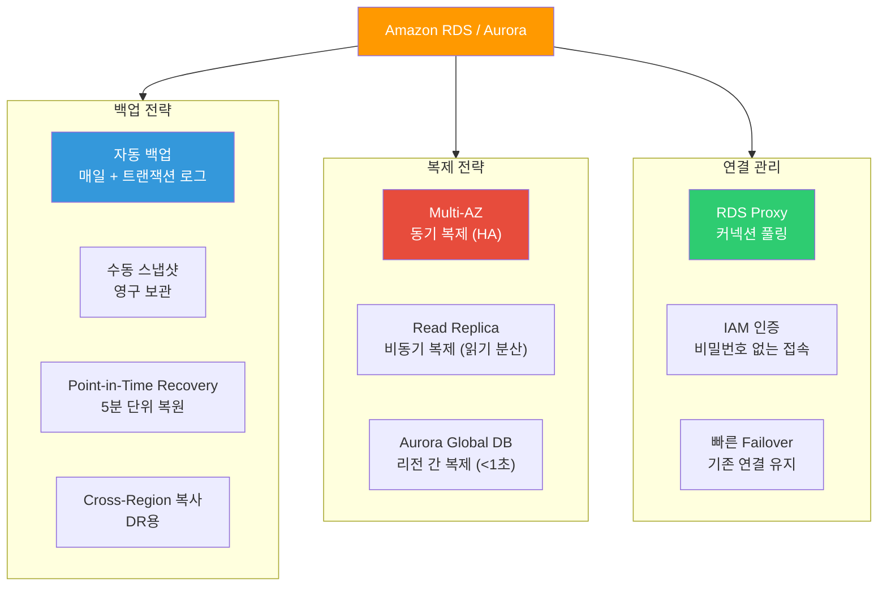
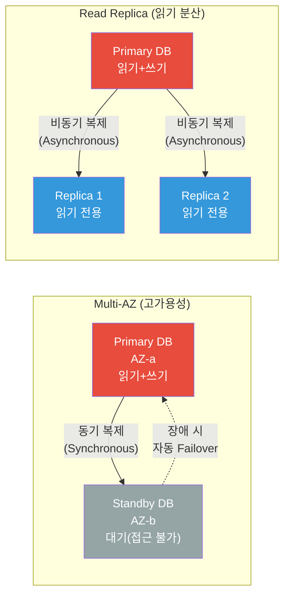
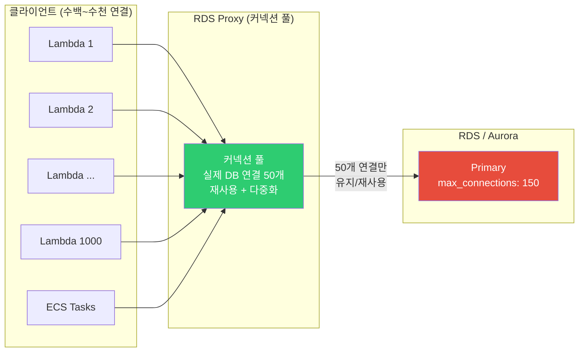
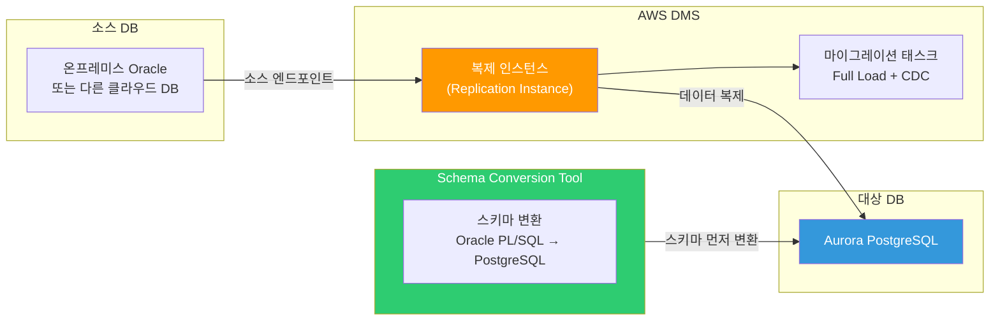
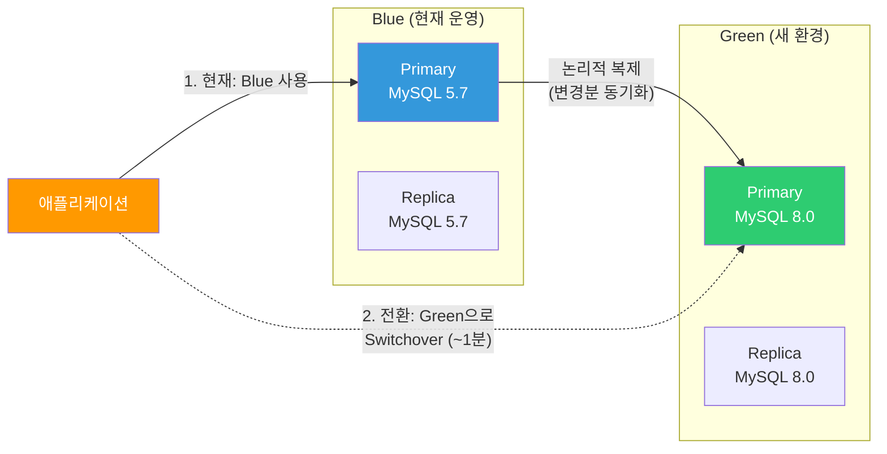

# DB 운영 (backup / replication / pooling)

> [이전 강의](./05-database)에서 RDS, Aurora, DynamoDB 같은 AWS DB 서비스를 배웠어요. 이제 그 DB를 **안 죽게 지키고, 빠르게 복구하고, 효율적으로 연결하는** 운영 기술을 배워볼게요.

---

## 🎯 이걸 왜 알아야 하나?

```
DB 운영이 필요한 순간:
• "새벽에 DB가 날아갔는데 백업이 없어요"              → 백업 전략
• "읽기 트래픽이 너무 많아서 DB가 느려요"             → Read Replica
• "Primary DB가 죽었는데 서비스가 5분이나 끊겼어요"    → Multi-AZ Failover
• "Lambda가 DB 연결을 1000개씩 열어서 터져요"        → RDS Proxy (커넥션 풀링)
• "온프레미스 Oracle을 Aurora로 옮겨야 해요"          → DMS 마이그레이션
• "슬로우 쿼리가 어디서 발생하는지 모르겠어요"         → Performance Insights
• 면접: "RDS Multi-AZ와 Read Replica 차이?"          → 동기 복제 vs 비동기 복제
```

---

## 🧠 핵심 개념 (비유 + 다이어그램)

### 비유: 은행 금고 백업 시스템

DB 운영을 **은행**에 비유해볼게요.

* **자동 백업(Automated Backup)** = 은행이 매일 밤 금고 내용물을 **자동으로 사진 찍어** 보관하는 것. 최대 35일치 보관
* **수동 스냅샷(Manual Snapshot)** = 중요한 거래 전에 **직접 사진을 찍어** 별도 보관. 삭제할 때까지 영구 보관
* **Point-in-Time Recovery** = 사진뿐 아니라 **거래 내역(트랜잭션 로그)**도 보관해서, "어제 오후 3시 14분 상태"로 정확히 되돌리는 것

### 비유: 비상 발전기와 분점

* **Multi-AZ(동기 복제)** = 본점 금고와 **바로 옆 건물 금고**에 동시에 보관. 본점이 불타면 옆 건물에서 즉시 영업 재개
* **Read Replica(비동기 복제)** = 본점의 잔고 조회를 **분점에서도** 할 수 있게 하는 것. 약간의 지연(lag) 가능
* **RDS Proxy(커넥션 풀링)** = 은행 창구에 **번호표 시스템** 도입. 1000명이 와도 10개 창구를 효율적으로 돌려쓰는 것
* **DMS(마이그레이션)** = 다른 은행에서 우리 은행으로 **계좌 이전**. 이전 중에도 기존 은행에서 거래 가능 (CDC)

### DB 운영 전체 아키텍처



### Multi-AZ vs Read Replica 비교



### RDS Proxy 커넥션 풀링



---

## 🔍 상세 설명

### 1. 백업 전략

DB 백업은 **3단계 방어**라고 생각하면 돼요. [스토리지 강의](./04-storage)에서 EBS 스냅샷을 배웠는데, RDS 백업도 내부적으로 EBS 스냅샷 + 트랜잭션 로그를 사용해요.

#### 자동 백업 (Automated Backup)

RDS가 **매일 자동으로** DB 전체 스냅샷을 찍고, 5분 간격으로 트랜잭션 로그를 S3에 저장해요.

```bash
# === 자동 백업 설정 확인 ===
aws rds describe-db-instances \
  --db-instance-identifier my-production-db \
  --query "DBInstances[0].{
    BackupRetentionPeriod: BackupRetentionPeriod,
    PreferredBackupWindow: PreferredBackupWindow,
    LatestRestorableTime: LatestRestorableTime
  }" --output table

# 예상 출력:
# +-----------------------+-------------------------------------+
# |  BackupRetentionPeriod|  7                                  |
# |  PreferredBackupWindow|  03:00-04:00                        |
# |  LatestRestorableTime |  2026-03-13T09:10:00+00:00          |
# +-----------------------+-------------------------------------+
```

```bash
# === 자동 백업 보존 기간 변경 (최대 35일) ===
aws rds modify-db-instance \
  --db-instance-identifier my-production-db \
  --backup-retention-period 35 \
  --preferred-backup-window "02:00-03:00" \
  --apply-immediately
# → BackupRetentionPeriod: 35, DBInstanceStatus: "modifying"
```

> **주의**: `BackupRetentionPeriod`를 0으로 설정하면 자동 백업이 **완전히 비활성화**돼요. 절대 프로덕션에서 0으로 하면 안 돼요!

#### 수동 스냅샷 (Manual Snapshot)

자동 백업과 달리 **삭제하기 전까지 영구 보관**돼요. 배포 전, 엔진 업그레이드 전 등 중요한 시점에 찍어두세요.

```bash
# === 수동 스냅샷 생성 ===
aws rds create-db-snapshot \
  --db-instance-identifier my-production-db \
  --db-snapshot-identifier my-prod-before-upgrade-20260313

# 예상 출력:
# {
#     "DBSnapshot": {
#         "DBSnapshotIdentifier": "my-prod-before-upgrade-20260313",
#         "Status": "creating",
#         "SnapshotType": "manual"
#     }
# }
```

#### Point-in-Time Recovery (PITR)

자동 백업 + 트랜잭션 로그를 조합해서 **보존 기간 내 아무 시점**으로 복원할 수 있어요.

```bash
# === "2026-03-13 오전 9시 상태"로 새 인스턴스를 만들어서 복원 ===
aws rds restore-db-instance-to-point-in-time \
  --source-db-instance-identifier my-production-db \
  --target-db-instance-identifier my-prod-restored-0313 \
  --restore-time "2026-03-13T09:00:00Z" \
  --db-instance-class db.r6g.large \
  --vpc-security-group-ids sg-0abc1234def56789
# → DBInstanceStatus: "creating" (새 인스턴스가 만들어져요!)
```

> **중요**: PITR은 **새 인스턴스**를 만들어요. 기존 인스턴스를 덮어쓰는 게 아니에요!

#### Aurora 연속 백업 vs 일반 RDS

| 항목 | RDS (일반) | Aurora |
|------|-----------|--------|
| 백업 방식 | EBS 스냅샷 + binlog | 스토리지 레이어 연속 백업 |
| 백업 성능 영향 | I/O 일시 중단 가능 (Single-AZ) | 영향 없음 |
| PITR 복원 속도 | 느림 (스냅샷 + 로그 적용) | 빠름 (병렬 적용) |
| Backtrack | 미지원 | 지원 (되감기, 새 인스턴스 불필요) |

```bash
# === Aurora Backtrack (되감기) — 새 인스턴스 없이 기존 클러스터를 되감기 ===
aws rds backtrack-db-cluster \
  --db-cluster-identifier my-aurora-cluster \
  --backtrack-to "2026-03-13T09:00:00Z"
# → Status: "backtracking" (수 분 내 복구!)
```

#### Cross-Region 백업

DR(재해 복구)을 위해 스냅샷을 다른 리전으로 복사할 수 있어요. [K8s 백업/DR](../04-kubernetes/16-backup-dr)에서 배운 RTO/RPO 개념을 기억하세요.

```bash
# === 스냅샷을 다른 리전으로 복사 ===
aws rds copy-db-snapshot \
  --source-db-snapshot-identifier arn:aws:rds:ap-northeast-2:123456789012:snapshot:my-prod-before-upgrade-20260313 \
  --target-db-snapshot-identifier my-prod-dr-copy-20260313 \
  --region us-west-2 \
  --kms-key-id arn:aws:kms:us-west-2:123456789012:key/abcd1234 \
  --copy-tags
# → 다른 리전에서 이 스냅샷으로 DB를 복원할 수 있어요
```

---

### 2. Replication (복제)

#### RDS Multi-AZ (동기 복제 — 고가용성)

Multi-AZ는 **같은 리전의 다른 AZ**에 Standby 복제본을 동기적으로 유지해요. Primary가 죽으면 **60~120초 내에 자동 Failover**가 일어나요.

```bash
# === Multi-AZ 활성화 ===
aws rds modify-db-instance \
  --db-instance-identifier my-production-db \
  --multi-az \
  --apply-immediately
# → MultiAZ: true, SecondaryAvailabilityZone: "ap-northeast-2b"

# === Failover 테스트 (수동으로 Failover 트리거) ===
aws rds reboot-db-instance \
  --db-instance-identifier my-production-db \
  --force-failover
# → Standby가 새 Primary로 승격 (DNS 엔드포인트는 동일하게 유지!)
```

> **Multi-AZ의 핵심**: Standby에는 직접 접근할 수 없어요. 오직 Failover 용도예요. 읽기 분산이 목적이라면 Read Replica를 써야 해요.

#### Read Replica (비동기 복제 — 읽기 분산)

```bash
# === Read Replica 생성 ===
aws rds create-db-instance-read-replica \
  --db-instance-identifier my-prod-read-replica-1 \
  --source-db-instance-identifier my-production-db \
  --db-instance-class db.r6g.large \
  --availability-zone ap-northeast-2c
# → StatusInfos: [{"StatusType": "read replication", "Status": "replicating"}]

# === Replica Lag 확인 (CloudWatch) ===
aws cloudwatch get-metric-statistics \
  --namespace AWS/RDS \
  --metric-name ReplicaLag \
  --dimensions Name=DBInstanceIdentifier,Value=my-prod-read-replica-1 \
  --start-time "2026-03-13T08:00:00Z" \
  --end-time "2026-03-13T10:00:00Z" \
  --period 300 --statistics Average
# → Average: 0.15 (초). 0.2초 이하면 양호해요.
```

#### Aurora Global Database (리전 간 복제)

Aurora Global Database는 **1초 이내의 지연**으로 최대 5개 리전에 복제할 수 있어요.

```bash
# === 1단계: 기존 Aurora 클러스터를 Global로 확장 ===
aws rds create-global-cluster \
  --global-cluster-identifier my-global-db \
  --source-db-cluster-identifier arn:aws:rds:ap-northeast-2:123456789012:cluster:my-aurora-cluster

# === 2단계: 보조 리전에 클러스터 추가 ===
aws rds create-db-cluster \
  --db-cluster-identifier my-aurora-cluster-us \
  --global-cluster-identifier my-global-db \
  --engine aurora-mysql \
  --region us-west-2
# → 보조 리전에서 읽기 전용 클러스터가 생성돼요
```

#### DynamoDB Global Tables

[DB 서비스 강의](./05-database)에서 배운 DynamoDB의 **다중 리전 Active-Active** 복제예요.

```bash
# === DynamoDB Global Table에 리전 추가 ===
aws dynamodb update-table \
  --table-name UserSessions \
  --replica-updates '[{"Create": {"RegionName": "us-west-2"}}]'
# → Replicas: [{"RegionName":"ap-northeast-2","ReplicaStatus":"ACTIVE"},
#              {"RegionName":"us-west-2","ReplicaStatus":"CREATING"}]
```

---

### 3. 연결 관리 (Connection Pooling)

#### 왜 커넥션 풀링이 필요한가?

DB 연결은 **비싼 자원**이에요. 각 연결은 메모리(약 5~10MB)를 소비해요.

| DB 인스턴스 | max_connections (기본값) |
|------------|------------------------|
| db.t3.micro | ~85 |
| db.t3.medium | ~170 |
| db.r6g.large | ~1,000 |
| db.r6g.2xlarge | ~2,000 |

> `max_connections` 계산 공식: `{DBInstanceClassMemory/12582880}` (MySQL 기준)

#### RDS Proxy 생성

```bash
# === RDS Proxy 생성 ===
# 먼저 Secrets Manager에 DB 인증 정보 저장 필요 (./01-iam 참고)
aws rds create-db-proxy \
  --db-proxy-name my-app-proxy \
  --engine-family MYSQL \
  --auth '[{
    "AuthScheme": "SECRETS",
    "SecretArn": "arn:aws:secretsmanager:ap-northeast-2:123456789012:secret:my-db-credentials",
    "IAMAuth": "REQUIRED"
  }]' \
  --role-arn arn:aws:iam::123456789012:role/rds-proxy-role \
  --vpc-subnet-ids subnet-0abc1234 subnet-0def5678 \
  --vpc-security-group-ids sg-0abc1234def56789 \
  --require-tls

# 예상 출력:
# {
#     "DBProxy": {
#         "DBProxyName": "my-app-proxy",
#         "Status": "creating",
#         "Endpoint": "my-app-proxy.proxy-abc123.ap-northeast-2.rds.amazonaws.com"
#     }
# }
```

```bash
# === Proxy에 대상 DB 등록 + 엔드포인트 확인 ===
aws rds register-db-proxy-targets \
  --db-proxy-name my-app-proxy \
  --db-cluster-identifiers my-aurora-cluster

aws rds describe-db-proxy-endpoints \
  --db-proxy-name my-app-proxy --output table
# → Endpoint: my-app-proxy.proxy-abc123..., TargetRole: READ_WRITE
```

#### RDS Proxy의 이점

| 기능 | 설명 |
|------|------|
| **커넥션 풀링** | 수천 개 앱 연결 → 수십 개 DB 연결로 다중화 |
| **Failover 가속** | Multi-AZ Failover 시 66% 빠른 전환 (기존 연결 유지) |
| **IAM 인증** | 비밀번호 대신 [IAM](./01-iam) 토큰으로 DB 접속 |
| **TLS 강제** | 전송 중 암호화 필수 적용 |

#### PgBouncer vs RDS Proxy

| 항목 | PgBouncer | RDS Proxy |
|------|-----------|-----------|
| 설치 | 직접 EC2/컨테이너에 설치 | 관리형 서비스 |
| 엔진 지원 | PostgreSQL만 | MySQL + PostgreSQL |
| 관리 부담 | 직접 모니터링/패치 | AWS가 관리 |
| 비용 | EC2 비용만 | vCPU당 시간당 과금 |
| Failover 통합 | 직접 구현 | RDS/Aurora와 자동 통합 |
| IAM 인증 | 미지원 | 지원 |
| K8s 배포 | [StatefulSet](../04-kubernetes/03-statefulset-daemonset)으로 가능 | 불필요 (관리형) |

---

### 4. 마이그레이션 (DMS)

온프레미스 DB나 다른 클라우드의 DB를 AWS로 옮길 때 사용해요. **동종 마이그레이션**(MySQL → MySQL)은 물론 **이종 마이그레이션**(Oracle → Aurora PostgreSQL)도 가능해요.



| 마이그레이션 유형 | 예시 | SCT 필요? |
|------------------|------|----------|
| **동종 (Homogeneous)** | MySQL → Aurora MySQL | 불필요 |
| **이종 (Heterogeneous)** | Oracle → Aurora PostgreSQL | 필요 |

#### CDC (Change Data Capture)

**Full Load**로 기존 데이터를 옮긴 후, **CDC**로 마이그레이션 중 변경분을 실시간 반영해요. 소스 DB를 멈추지 않고 마이그레이션 가능!

```bash
# === DMS 마이그레이션 태스크 생성 (Full Load + CDC) ===
aws dms create-replication-task \
  --replication-task-identifier my-migration-task \
  --source-endpoint-arn arn:aws:dms:ap-northeast-2:123456789012:endpoint:source-oracle \
  --target-endpoint-arn arn:aws:dms:ap-northeast-2:123456789012:endpoint:target-aurora \
  --replication-instance-arn arn:aws:dms:ap-northeast-2:123456789012:rep:my-dms-instance \
  --migration-type full-load-and-cdc \
  --table-mappings '{
    "rules": [{
      "rule-type": "selection",
      "rule-id": "1",
      "rule-name": "select-all-tables",
      "object-locator": {"schema-name": "MYAPP", "table-name": "%"},
      "rule-action": "include"
    }]
  }'
# → MigrationType: "full-load-and-cdc", Status: "creating"
```

---

### 5. 모니터링

#### Performance Insights

슬로우 쿼리와 DB 부하를 **시각적으로** 분석할 수 있어요.

```bash
# === Performance Insights 활성화 ===
aws rds modify-db-instance \
  --db-instance-identifier my-production-db \
  --enable-performance-insights \
  --performance-insights-retention-period 731 \
  --apply-immediately

# === 슬로우 쿼리 Top 5 조회 ===
aws pi get-resource-metrics \
  --service-type RDS \
  --identifier db-ABCDEFGHIJKLMNOP1234567890 \
  --metric-queries '[{"Metric":"db.load.avg","GroupBy":{"Group":"db.sql","Limit":5}}]' \
  --start-time "2026-03-13T00:00:00Z" \
  --end-time "2026-03-13T10:00:00Z" \
  --period-in-seconds 3600
# → "orders 테이블의 created_at에 인덱스가 없구나!" 같은 인사이트를 얻을 수 있어요
```

#### Enhanced Monitoring + CloudWatch 핵심 메트릭

```bash
# === Enhanced Monitoring 활성화 (1초 간격) ===
aws rds modify-db-instance \
  --db-instance-identifier my-production-db \
  --monitoring-interval 1 \
  --monitoring-role-arn arn:aws:iam::123456789012:role/rds-monitoring-role \
  --apply-immediately

# 주요 CloudWatch 메트릭:
# • CPUUtilization        — CPU 사용률 (%)
# • FreeableMemory        — 사용 가능한 메모리 (bytes)
# • DatabaseConnections   — 현재 DB 연결 수
# • ReadIOPS / WriteIOPS  — 초당 읽기/쓰기 I/O 횟수
# • ReadLatency / WriteLatency — I/O 지연 시간 (초)
# • FreeStorageSpace      — 남은 디스크 공간 (bytes)
# • ReplicaLag            — Read Replica 지연 (초)
```

---

### 6. 유지보수

#### 엔진 업그레이드 (Major / Minor)

| 구분 | Minor 업그레이드 | Major 업그레이드 |
|------|-----------------|-----------------|
| 예시 | MySQL 8.0.32 → 8.0.35 | MySQL 5.7 → 8.0 |
| 자동 적용 | 가능 (옵션) | 수동만 가능 |
| 다운타임 | 짧음 (Multi-AZ: ~30초) | 김 (수분~수십분) |
| 호환성 | 대부분 호환 | 비호환 변경 가능 |

```bash
# === 사용 가능한 업그레이드 버전 확인 ===
aws rds describe-db-engine-versions \
  --engine aurora-mysql \
  --engine-version 8.0.mysql_aurora.3.04.1 \
  --query "DBEngineVersions[0].ValidUpgradeTarget[].EngineVersion"
# → ["8.0.mysql_aurora.3.04.2", "8.0.mysql_aurora.3.05.0", "8.0.mysql_aurora.3.05.1"]
```

#### Blue/Green Deployment로 무중단 업그레이드

Major 업그레이드는 **Blue/Green Deployment**를 사용해요. Green 환경에서 업그레이드 적용 + 테스트 후 전환하는 방식이에요.



```bash
# === Blue/Green Deployment 생성 ===
aws rds create-blue-green-deployment \
  --blue-green-deployment-name my-bg-upgrade \
  --source arn:aws:rds:ap-northeast-2:123456789012:db:my-production-db \
  --target-engine-version "8.0.35" \
  --target-db-parameter-group-name my-mysql80-params
# → Status: "PROVISIONING"

# === Green 환경 테스트 완료 후 전환 ===
aws rds switchover-blue-green-deployment \
  --blue-green-deployment-identifier bgd-abc123def456 \
  --switchover-timeout 300
# → ~1분 내 Green이 새 Primary로 전환. DNS 엔드포인트 자동 변경!
```

#### 파라미터 변경

```bash
# === 슬로우 쿼리 로그 활성화 + 임계값 변경 ===
aws rds modify-db-parameter-group \
  --db-parameter-group-name my-mysql80-params \
  --parameters \
    "ParameterName=slow_query_log,ParameterValue=1,ApplyMethod=immediate" \
    "ParameterName=long_query_time,ParameterValue=1,ApplyMethod=immediate"
# → dynamic 파라미터는 즉시 적용. static 파라미터는 재부팅 필요!
```

---

## 💻 실습 예제

### 실습 1: Aurora 클러스터 백업 + Cross-Region 복원

```bash
# === 1단계: 클러스터 상태 확인 ===
aws rds describe-db-clusters \
  --db-cluster-identifier my-aurora-cluster \
  --query "DBClusters[0].{Status:Status,Engine:Engine,BackupRetentionPeriod:BackupRetentionPeriod,LatestRestorableTime:LatestRestorableTime}" \
  --output table

# === 2단계: 수동 스냅샷 생성 ===
aws rds create-db-cluster-snapshot \
  --db-cluster-identifier my-aurora-cluster \
  --db-cluster-snapshot-identifier aurora-backup-20260313

# === 3단계: 완료 대기 ===
aws rds wait db-cluster-snapshot-available \
  --db-cluster-snapshot-identifier aurora-backup-20260313

# === 4단계: Cross-Region 복사 (DR용) ===
aws rds copy-db-cluster-snapshot \
  --source-db-cluster-snapshot-identifier arn:aws:rds:ap-northeast-2:123456789012:cluster-snapshot:aurora-backup-20260313 \
  --target-db-cluster-snapshot-identifier aurora-backup-20260313-dr \
  --region us-west-2 --copy-tags

# === 5단계: 스냅샷에서 새 클러스터 복원 ===
aws rds restore-db-cluster-from-snapshot \
  --db-cluster-identifier my-aurora-restored \
  --snapshot-identifier aurora-backup-20260313 \
  --engine aurora-mysql

# 복원된 클러스터에 인스턴스 추가
aws rds create-db-instance \
  --db-instance-identifier my-aurora-restored-instance-1 \
  --db-cluster-identifier my-aurora-restored \
  --db-instance-class db.r6g.large \
  --engine aurora-mysql
```

### 실습 2: RDS Proxy + Lambda 연결

```bash
# === 1단계: Secrets Manager에 DB 인증 정보 저장 ===
aws secretsmanager create-secret \
  --name my-db-credentials \
  --secret-string '{"username":"admin","password":"MySecureP@ssw0rd!","engine":"mysql","host":"my-aurora-cluster.cluster-abc123.ap-northeast-2.rds.amazonaws.com","port":3306,"dbname":"myapp"}'

# === 2단계: RDS Proxy 생성 ===
aws rds create-db-proxy \
  --db-proxy-name my-lambda-proxy \
  --engine-family MYSQL \
  --auth '[{"AuthScheme":"SECRETS","SecretArn":"arn:aws:secretsmanager:ap-northeast-2:123456789012:secret:my-db-credentials-AbCdEf","IAMAuth":"REQUIRED"}]' \
  --role-arn arn:aws:iam::123456789012:role/rds-proxy-role \
  --vpc-subnet-ids subnet-0abc1234 subnet-0def5678 \
  --require-tls

# === 3단계: Lambda 환경 변수에 Proxy 엔드포인트 설정 ===
aws lambda update-function-configuration \
  --function-name my-api-handler \
  --environment '{"Variables":{"DB_HOST":"my-lambda-proxy.proxy-abc123.ap-northeast-2.rds.amazonaws.com","DB_PORT":"3306","DB_NAME":"myapp"}}'
```

Lambda 코드에서 IAM 인증 토큰으로 접속하는 패턴:

```python
# Lambda 핸들러 — RDS Proxy + IAM 인증
import pymysql, boto3, os

rds_client = boto3.client('rds')

def get_connection():
    token = rds_client.generate_db_auth_token(
        DBHostname=os.environ['DB_HOST'],  # RDS Proxy 엔드포인트
        Port=3306, DBUsername='lambda_user', Region='ap-northeast-2'
    )
    return pymysql.connect(
        host=os.environ['DB_HOST'], user='lambda_user',
        password=token, database='myapp', ssl={'ssl': True}, connect_timeout=3
    )

# 핸들러 밖에서 연결 (Lambda 컨테이너 재사용 시 연결도 재사용)
conn = get_connection()

def handler(event, context):
    global conn
    try:
        with conn.cursor() as cursor:
            cursor.execute("SELECT * FROM users WHERE id = %s", (event['id'],))
            return cursor.fetchone()
    except pymysql.err.OperationalError:
        conn = get_connection()  # 연결 끊겼으면 재연결
        with conn.cursor() as cursor:
            cursor.execute("SELECT * FROM users WHERE id = %s", (event['id'],))
            return cursor.fetchone()
```

### 실습 3: DMS로 MySQL → Aurora 마이그레이션

```bash
# === 1단계: 소스/대상 엔드포인트 생성 ===
aws dms create-endpoint --endpoint-identifier source-mysql \
  --endpoint-type source --engine-name mysql \
  --server-name 10.0.1.50 --port 3306 \
  --username dms_user --password 'DmsP@ssw0rd!'

aws dms create-endpoint --endpoint-identifier target-aurora \
  --endpoint-type target --engine-name aurora \
  --server-name my-aurora-cluster.cluster-abc123.ap-northeast-2.rds.amazonaws.com \
  --port 3306 --username admin --password 'AuroraP@ssw0rd!'

# === 2단계: 연결 테스트 ===
aws dms test-connection \
  --replication-instance-arn arn:aws:dms:ap-northeast-2:123456789012:rep:my-dms-instance \
  --endpoint-arn arn:aws:dms:ap-northeast-2:123456789012:endpoint:source-mysql
# → Status: "successful"

# === 3단계: Full Load + CDC 마이그레이션 시작 ===
aws dms create-replication-task \
  --replication-task-identifier mysql-to-aurora \
  --source-endpoint-arn arn:aws:dms:...:endpoint:source-mysql \
  --target-endpoint-arn arn:aws:dms:...:endpoint:target-aurora \
  --replication-instance-arn arn:aws:dms:...:rep:my-dms-instance \
  --migration-type full-load-and-cdc \
  --table-mappings '{"rules":[{"rule-type":"selection","rule-id":"1","rule-name":"migrate-all","object-locator":{"schema-name":"myapp","table-name":"%"},"rule-action":"include"}]}'

aws dms start-replication-task \
  --replication-task-arn arn:aws:dms:...:task:mysql-to-aurora \
  --start-replication-task-type start-replication

# === 4단계: 진행 상황 모니터링 ===
aws dms describe-table-statistics \
  --replication-task-arn arn:aws:dms:...:task:mysql-to-aurora \
  --query "TableStatistics[].{Table:TableName,FullLoadRows:FullLoadRows,Inserts:Inserts,Updates:Updates,Status:TableState}" \
  --output table
# → FullLoadRows: 초기 로드 완료, Inserts/Updates: CDC로 실시간 반영 중
```

---

## 🏢 실무에서는?

### 시나리오 1: "새벽 3시에 개발자가 WHERE 없이 DELETE 실행"

```
상황: DELETE FROM orders; (WHERE 절 실수)
     → 주문 테이블 2000만 건 전부 삭제

대응:
├─ Aurora → Backtrack으로 DELETE 직전으로 되감기 (수 분 내 복구)
├─ 일반 RDS → PITR로 직전 시점의 새 인스턴스 생성 → 데이터 확인 → 복원
└─ 예방 조치:
    • IAM으로 프로덕션 DB 접근 권한 제한 (./01-iam)
    • sql_safe_updates=1 파라미터 설정 (WHERE 없는 DELETE/UPDATE 차단)
    • 변경 전 수동 스냅샷 생성 자동화
```

### 시나리오 2: "트래픽 급증으로 max_connections 한계 도달"

```
상황: 블랙프라이데이 세일 시작
     → Lambda 동시 실행 500 → 3000, "Too many connections" 에러

대응:
├─ 즉시: RDS Proxy 도입 (3000개 앱 연결 → 100개 DB 연결로 다중화)
├─ 읽기 분산: Read Replica 추가 → 읽기 쿼리를 Replica로
├─ 스케일업: db.r6g.large → db.r6g.2xlarge (max_connections: 1000 → 2000)
└─ 장기: 쿼리 최적화 + ElastiCache 캐싱 + DynamoDB로 세션 분리
```

### 시나리오 3: "온프레미스 Oracle → Aurora PostgreSQL 이종 마이그레이션"

```
마이그레이션 계획 (3개월):
├─ 1개월차: AWS SCT로 스키마 분석 → PL/SQL → PL/pgSQL 변환 (~80% 자동)
├─ 2개월차: DMS Full Load + CDC 활성화 → 앱 코드 수정 → 스테이징 테스트
└─ 3개월차: 리허설 컷오버 → CDC lag 0 확인 → 엔드포인트 전환 → 안정화
```

---

## ⚠️ 자주 하는 실수

### ❌ 실수 1: 자동 백업 보존 기간을 0으로 설정

```bash
# ❌ 비용 절약한다고 백업 비활성화
aws rds modify-db-instance --db-instance-identifier my-prod --backup-retention-period 0
# → PITR 불가능! 자동 백업 완전 비활성화!

# ✅ 최소 7일, 프로덕션은 35일 권장
aws rds modify-db-instance --db-instance-identifier my-prod --backup-retention-period 35
```

### ❌ 실수 2: Read Replica를 Multi-AZ 대용으로 사용

```
❌ "Read Replica가 있으니까 Multi-AZ는 안 켜도 되지?"

✅ 올바른 이해:
• Read Replica = 비동기 복제 → 데이터 유실 가능 (lag)
• Multi-AZ = 동기 복제 → 데이터 유실 0, 자동 Failover
• 프로덕션에서는 Multi-AZ + Read Replica 둘 다 사용!
```

### ❌ 실수 3: Lambda에서 커넥션 풀링 없이 DB 직접 연결

```python
# ❌ 매 호출마다 새 연결 생성 + 정리 안 함 → 연결 폭주!
def handler(event, context):
    connection = pymysql.connect(host="my-rds-endpoint", ...)
    cursor = connection.cursor()
    cursor.execute("SELECT * FROM users")
    return cursor.fetchall()

# ✅ RDS Proxy + IAM 인증 + 핸들러 밖에서 연결 관리 (실습 2 참고)
```

### ❌ 실수 4: PITR 복원 후 기존 DB를 바로 삭제

```
❌ 잘못된 순서: PITR 복원 → 기존 DB 즉시 삭제 → 새 DB에서 데이터 확인 (너무 늦음!)

✅ 올바른 순서:
1. PITR로 새 인스턴스 생성
2. 새 인스턴스에서 데이터 무결성 확인
3. 애플리케이션 엔드포인트 전환
4. 최소 1시간 모니터링
5. 기존 인스턴스를 "최종 스냅샷 생성" 옵션과 함께 삭제
```

### ❌ 실수 5: Major 업그레이드를 프로덕션에 바로 적용

```bash
# ❌ 프로덕션에 바로 Major 업그레이드 → 호환성 문제 + 긴 다운타임
aws rds modify-db-instance --engine-version "8.0.35" --apply-immediately

# ✅ Blue/Green Deployment로 안전하게 (유지보수 섹션 참고)
aws rds create-blue-green-deployment \
  --source arn:aws:rds:...:db:my-prod --target-engine-version "8.0.35"
# → Green에서 테스트 후 Switchover (~1분, 롤백 가능)
```

---

## 📝 정리

| 영역 | 핵심 서비스/기능 | 기억할 포인트 |
|------|-----------------|--------------|
| **백업** | 자동 백업 + 수동 스냅샷 + PITR | 자동 백업 최소 7일, 프로덕션 35일. PITR은 새 인스턴스 생성 |
| **Aurora 백업** | 연속 백업 + Backtrack | 성능 영향 없음. Backtrack은 새 인스턴스 없이 되감기 |
| **Multi-AZ** | 동기 복제, 자동 Failover | HA 용도. Standby 직접 접근 불가. Failover 60~120초 |
| **Read Replica** | 비동기 복제, 읽기 분산 | 최대 15개(Aurora). ReplicaLag 모니터링 필수 |
| **RDS Proxy** | 커넥션 풀링, IAM 인증 | Lambda 필수. Failover 66% 빠름. Secrets Manager 연동 |
| **DMS** | Full Load + CDC | 무중단 마이그레이션. SCT로 이종 스키마 변환 |
| **모니터링** | Performance Insights + Enhanced Monitoring | 슬로우 쿼리 Top N 분석. OS 메트릭 1초 단위 |
| **유지보수** | Blue/Green Deployment | Major 업그레이드는 반드시 B/G로. ~1분 전환 |

### 백업 전략 결정 가이드

```
어떤 백업 전략을 써야 할까?
├─ "일단 기본은?" → 자동 백업 35일 + 수동 스냅샷 (배포/변경 전)
├─ "5분 이내 복구?" → Aurora Backtrack
├─ "특정 시점 복원?" → PITR (보존 기간 내)
├─ "리전 장애 대비?" → Cross-Region 스냅샷 복사 또는 Aurora Global DB
└─ "K8s + DB 동시 백업?" → Velero(../04-kubernetes/16-backup-dr) + RDS 스냅샷 조합
```

### 연결 전략 결정 가이드

```
어떤 연결 방식을 써야 할까?
├─ Lambda → DB?         → RDS Proxy (필수!)
├─ ECS/EKS → DB?        → RDS Proxy 또는 앱 레벨 커넥션 풀
├─ EC2 → DB?            → 앱 레벨 커넥션 풀 (HikariCP 등)
├─ PostgreSQL 전용?     → PgBouncer (StatefulSet, ../04-kubernetes/03-statefulset-daemonset)
└─ Multi-AZ Failover 빠르게? → RDS Proxy (연결 유지로 Failover 가속)
```

---

## 🔗 다음 강의 → [07-load-balancing](./07-load-balancing)

> 다음 강의에서는 DB 앞단의 **로드 밸런싱** -- ALB, NLB, GLB의 차이와 트래픽 분산 전략을 배워요. DB Read Replica로 읽기를 분산했다면, 앱 서버 자체도 분산해야겠죠?
