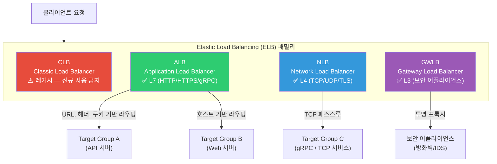
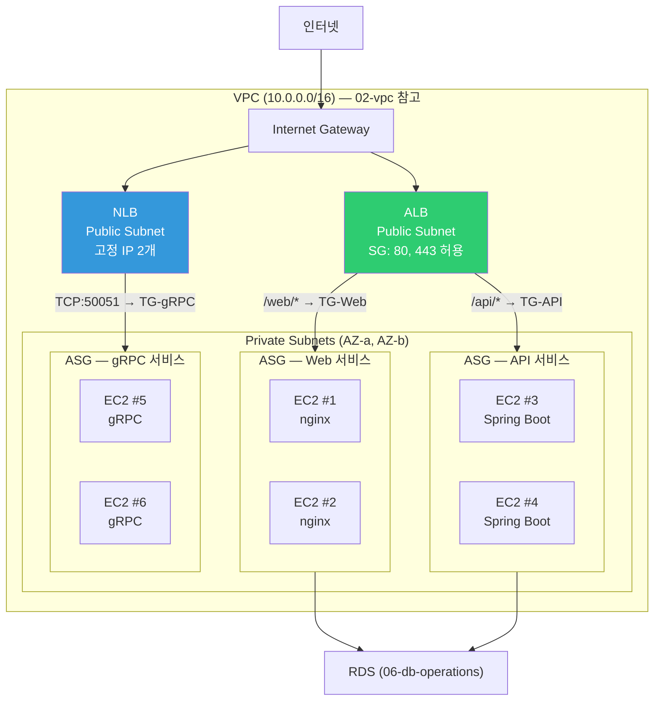
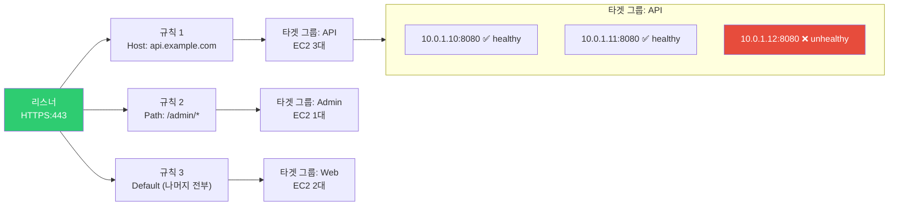
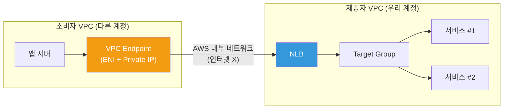
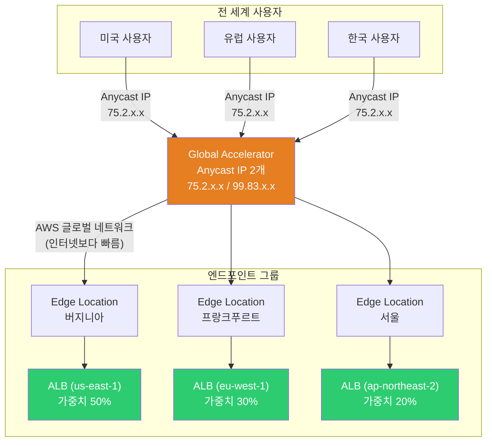

# ELB / ALB / NLB / Global Accelerator

> [이전 강의](./06-db-operations)에서 DB 운영(백업, 복제, 커넥션 풀링)을 배웠어요. DB 앞단에 앱 서버가 여러 대 있을 때, 트래픽을 **똑똑하게 나눠주는** 것이 로드 밸런서의 역할이에요. [네트워크 기초의 로드 밸런싱](../02-networking/06-load-balancing)에서 L4/L7 개념을 배웠으니, 이제 AWS에서 **실제로 어떻게 구성하는지** 배워볼게요.

---

## 🎯 이걸 왜 알아야 하나?

```
DevOps가 AWS 로드 밸런싱으로 하는 일들:
• "ALB vs NLB 뭘 써야 하나요?"                  → ELB 종류별 선택 기준
• "URL 경로별로 다른 서비스로 보내고 싶어요"       → ALB path-based 라우팅
• "gRPC 서비스인데 고정 IP가 필요해요"            → NLB TCP 패스스루
• "Auto Scaling Group에 트래픽을 연결해야 해요"   → Target Group + ASG 연동
• "Health Check가 자꾸 실패해요"                 → ALB vs NLB Health Check 차이
• "글로벌 사용자한테 빠르게 응답하고 싶어요"        → Global Accelerator
• "배포할 때 502 에러가 나요"                    → Deregistration Delay + Slow Start
• 면접: "ALB와 NLB 차이를 설명하세요"            → L7 vs L4, 10가지 비교 기준
```

[EC2 + Auto Scaling](./03-ec2-autoscaling)에서 ASG를 배웠죠? ALB/NLB는 ASG와 짝꿍으로 거의 항상 함께 써요. [Nginx/HAProxy](../02-networking/07-nginx-haproxy)가 소프트웨어 로드 밸런서라면, ELB는 AWS가 관리해주는 **매니지드 로드 밸런서**예요.

---

## 🧠 핵심 개념 (비유 + 다이어그램)

### 비유: 교통 시스템

AWS 로드 밸런싱을 **교통 시스템**에 비유해볼게요.

| 현실 세계 | AWS |
|-----------|-----|
| 교통 경찰 (차량을 목적지별 차선으로 안내) | **ALB** -- HTTP 요청의 URL, 헤더, 쿠키를 보고 분배 |
| 톨게이트 (번호판만 보고 빠르게 통과시킴) | **NLB** -- TCP/UDP 패킷을 빠르게 전달 |
| 옛날 수동 신호등 (기본 기능만) | **CLB** -- 레거시, 더 이상 권장 안 함 |
| 세관 검문소 (보안 장비 거쳐서 통과) | **GWLB** -- 방화벽/IDS 같은 어플라이언스로 트래픽 전달 |
| 고속도로 나들목 (차선 = 서비스) | **타겟 그룹** -- 실제 트래픽을 받는 서버 그룹 |
| 차량 검사소 (고장난 차는 통행 금지) | **Health Check** -- 비정상 서버 제외 |
| 국제 공항 허브 (가장 가까운 공항으로 안내) | **Global Accelerator** -- Anycast IP로 최적 리전 라우팅 |

### ELB 종류 한눈에 보기



### ELB 선택 가이드

```
어떤 로드 밸런서를 써야 할까?
├─ HTTP/HTTPS 웹 서비스?
│   ├─ URL별 라우팅 필요?         → ALB (path-based routing)
│   ├─ 도메인별 라우팅 필요?       → ALB (host-based routing)
│   ├─ WAF 연동 필요?            → ALB (WAF 직접 연동)
│   └─ Cognito 인증 필요?        → ALB (빌트인 인증)
├─ TCP/UDP / 비-HTTP?
│   ├─ 고정 IP 필요?             → NLB (Elastic IP 할당 가능)
│   ├─ 초저지연 필요?             → NLB (~100us vs ALB ~400ms)
│   ├─ gRPC + TLS passthrough?  → NLB
│   └─ PrivateLink 노출?         → NLB (VPC Endpoint Service)
├─ 보안 어플라이언스 체이닝?       → GWLB
└─ 기존 CLB 사용 중?             → ALB 또는 NLB로 마이그레이션 권장
```

### ALB + NLB + ASG 아키텍처 전체 구조



---

## 🔍 상세 설명

### 1. ALB (Application Load Balancer) 상세

ALB는 **L7(HTTP/HTTPS/gRPC)** 수준에서 동작해요. [L4/L7 개념](../02-networking/06-load-balancing)을 이미 배웠으니, ALB가 HTTP 요청을 **열어보고** 판단한다는 뜻이에요.

#### 리스너 → 규칙 → 타겟 그룹 구조



**리스너(Listener)**: 어떤 포트/프로토콜로 들어오는 트래픽을 받을지 정의해요.

**규칙(Rule)**: 들어온 요청을 어디로 보낼지 조건을 정의해요. 조건은 아래와 같아요.

| 조건 유형 | 예시 | 설명 |
|-----------|------|------|
| **Host header** | `api.example.com` | 도메인별 라우팅 |
| **Path** | `/api/v1/*` | URL 경로별 라우팅 |
| **HTTP method** | `GET`, `POST` | 메서드별 라우팅 |
| **Query string** | `?version=v2` | 쿼리 파라미터별 라우팅 |
| **Source IP** | `10.0.0.0/8` | 출발지 IP별 라우팅 |
| **HTTP header** | `X-Custom: blue` | 커스텀 헤더별 라우팅 |

**타겟 그룹(Target Group)**: 실제 트래픽을 받는 대상의 그룹이에요.

#### ALB 타겟 유형

| 타겟 유형 | 설명 | 사용 사례 |
|-----------|------|-----------|
| **instance** | EC2 인스턴스 ID로 등록 | 일반 EC2 + ASG |
| **ip** | IP 주소로 등록 | ECS Fargate, 온프레미스(DX/VPN), 다른 VPC |
| **Lambda** | Lambda 함수 직접 호출 | 서버리스 API |
| **ALB** | 다른 ALB를 타겟으로 | NLB → ALB 체이닝 (고정 IP + L7 라우팅) |

#### ALB 고급 기능들

**Weighted Target Group (가중치 기반 라우팅)**

카나리 배포에 유용해요. 새 버전에 10%, 기존 버전에 90% 트래픽을 보낼 수 있어요.

```bash
# 가중치 기반 포워딩 규칙 생성
# TG-v1에 90%, TG-v2에 10% 트래픽 분배 (카나리 배포)
aws elbv2 modify-rule \
    --rule-arn arn:aws:elasticloadbalancing:ap-northeast-2:123456789012:listener-rule/app/my-alb/abcd1234/listener/5678/rule/9999 \
    --actions '[{
        "Type": "forward",
        "ForwardConfig": {
            "TargetGroups": [
                {"TargetGroupArn": "arn:aws:...tg-v1", "Weight": 90},
                {"TargetGroupArn": "arn:aws:...tg-v2", "Weight": 10}
            ],
            "TargetGroupStickinessConfig": {
                "Enabled": true,
                "DurationSeconds": 3600
            }
        }
    }]'
```

**고정 응답(Fixed Response)**

유지보수 페이지 등에 유용해요. 타겟 그룹 없이 ALB가 직접 응답해요.

```bash
# /maintenance 경로에 503 고정 응답 반환
aws elbv2 create-rule \
    --listener-arn arn:aws:elasticloadbalancing:ap-northeast-2:123456789012:listener/app/my-alb/abcd1234/5678efgh \
    --priority 5 \
    --conditions '[{"Field": "path-pattern", "Values": ["/maintenance"]}]' \
    --actions '[{
        "Type": "fixed-response",
        "FixedResponseConfig": {
            "StatusCode": "503",
            "ContentType": "text/html",
            "MessageBody": "<h1>점검 중입니다</h1><p>잠시 후 다시 시도해주세요.</p>"
        }
    }]'
```

**리다이렉트(Redirect)**

```bash
# HTTP → HTTPS 리다이렉트 (가장 흔한 패턴)
aws elbv2 create-rule \
    --listener-arn arn:aws:elasticloadbalancing:ap-northeast-2:123456789012:listener/app/my-alb/abcd1234/http-listener \
    --priority 1 \
    --conditions '[{"Field": "path-pattern", "Values": ["/*"]}]' \
    --actions '[{
        "Type": "redirect",
        "RedirectConfig": {
            "Protocol": "HTTPS",
            "Port": "443",
            "StatusCode": "HTTP_301"
        }
    }]'
```

**WAF 연동**

ALB에 [AWS WAF](./12-security)를 직접 연결할 수 있어요. NLB는 WAF 직접 연동이 안 돼요.

```bash
# WAF Web ACL을 ALB에 연결
aws wafv2 associate-web-acl \
    --web-acl-arn arn:aws:wafv2:ap-northeast-2:123456789012:regional/webacl/my-web-acl/abcd1234 \
    --resource-arn arn:aws:elasticloadbalancing:ap-northeast-2:123456789012:loadbalancer/app/my-alb/abcd1234
```

**인증 (Cognito / OIDC)**

ALB 자체에서 인증을 처리할 수 있어요. 앱 코드에서 인증 로직을 빼도 돼요.

```bash
# ALB 리스너 규칙에 Cognito 인증 추가
aws elbv2 create-rule \
    --listener-arn arn:aws:elasticloadbalancing:ap-northeast-2:123456789012:listener/app/my-alb/abcd1234/5678efgh \
    --priority 10 \
    --conditions '[{"Field": "path-pattern", "Values": ["/admin/*"]}]' \
    --actions '[
        {
            "Type": "authenticate-cognito",
            "Order": 1,
            "AuthenticateCognitoConfig": {
                "UserPoolArn": "arn:aws:cognito-idp:ap-northeast-2:123456789012:userpool/ap-northeast-2_abcdef",
                "UserPoolClientId": "my-client-id",
                "UserPoolDomain": "my-auth-domain",
                "OnUnauthenticatedRequest": "authenticate"
            }
        },
        {
            "Type": "forward",
            "Order": 2,
            "TargetGroupArn": "arn:aws:...tg-admin"
        }
    ]'
```

**Access Log**

ALB의 모든 요청을 S3에 로그로 저장할 수 있어요. 디버깅과 감사에 필수적이에요.

```bash
# ALB Access Log 활성화
aws elbv2 modify-load-balancer-attributes \
    --load-balancer-arn arn:aws:elasticloadbalancing:ap-northeast-2:123456789012:loadbalancer/app/my-alb/abcd1234 \
    --attributes \
        Key=access_logs.s3.enabled,Value=true \
        Key=access_logs.s3.bucket,Value=my-alb-logs-bucket \
        Key=access_logs.s3.prefix,Value=alb-logs
```

Access Log 형식 예시:

```
# Access Log 한 줄 예시 (실제로는 한 줄에 출력됨)
https 2026-03-13T09:15:23.456789Z app/my-alb/abcd1234
  203.0.113.50:12345 10.0.1.10:8080
  0.001 0.032 0.000 200 200
  356 1247
  "GET https://api.example.com:443/api/v1/users HTTP/2.0"
  "Mozilla/5.0" ECDHE-RSA-AES128-GCM-SHA256 TLSv1.2
  arn:aws:...tg-api/abcd1234 "Root=1-abc-def"
  "api.example.com" "arn:aws:acm:..."
  0 2026-03-13T09:15:23.456000Z "forward" "-" "-"
  "10.0.1.10:8080" "200" "-" "-"
```

**Slow Start**

새로 등록된 타겟에 트래픽을 점진적으로 늘려요. JVM 워밍업이 필요한 Java 서비스에 유용해요.

```bash
# 타겟 그룹에 Slow Start 300초 설정
# 새 타겟이 등록되면 0% → 100%까지 300초에 걸쳐 트래픽 증가
aws elbv2 modify-target-group-attributes \
    --target-group-arn arn:aws:elasticloadbalancing:ap-northeast-2:123456789012:targetgroup/my-tg/abcd1234 \
    --attributes Key=slow_start.duration_seconds,Value=300
```

**Deregistration Delay (Connection Draining)**

타겟이 제거될 때 기존 연결을 안전하게 마무리할 시간을 줘요. 배포 중 502 에러를 방지해요.

```bash
# Deregistration Delay를 30초로 설정 (기본값 300초)
aws elbv2 modify-target-group-attributes \
    --target-group-arn arn:aws:elasticloadbalancing:ap-northeast-2:123456789012:targetgroup/my-tg/abcd1234 \
    --attributes Key=deregistration_delay.timeout_seconds,Value=30
```

---

### 2. NLB (Network Load Balancer) 상세

NLB는 **L4(TCP/UDP/TLS)** 수준에서 동작해요. 패킷의 IP와 포트만 보고 분배하므로, HTTP 내용은 전혀 모르지만 **매우 빠르고 고정 IP를 제공**해요.

#### NLB 핵심 특징

| 특징 | 설명 |
|------|------|
| **고정 IP** | AZ당 1개의 Elastic IP 할당 가능. 방화벽 화이트리스트에 유용 |
| **초저지연** | ~100 마이크로초. ALB보다 수백 배 빠름 |
| **TCP 패스스루** | TLS를 종단하지 않고 백엔드로 그대로 전달 가능 |
| **연결 유지** | 소스 IP 보존 (클라이언트 IP를 백엔드가 직접 볼 수 있음) |
| **PrivateLink** | VPC Endpoint Service로 다른 계정/VPC에 서비스 노출 |
| **초대규모 처리** | 초당 수백만 요청, 갑작스러운 트래픽 스파이크 처리 |

```bash
# NLB 생성 (고정 IP 할당)
# 서브넷별로 Elastic IP를 지정할 수 있어요
aws elbv2 create-load-balancer \
    --name my-nlb \
    --type network \
    --subnet-mappings \
        SubnetId=subnet-aaaa1111,AllocationId=eipalloc-1111aaaa \
        SubnetId=subnet-bbbb2222,AllocationId=eipalloc-2222bbbb

# 출력 결과:
# {
#     "LoadBalancers": [{
#         "LoadBalancerArn": "arn:aws:elasticloadbalancing:ap-northeast-2:123456789012:loadbalancer/net/my-nlb/abcd1234",
#         "DNSName": "my-nlb-abcd1234.elb.ap-northeast-2.amazonaws.com",
#         "Type": "network",
#         "Scheme": "internet-facing",
#         "AvailabilityZones": [
#             {
#                 "ZoneName": "ap-northeast-2a",
#                 "SubnetId": "subnet-aaaa1111",
#                 "LoadBalancerAddresses": [{"IpAddress": "13.125.100.1", "AllocationId": "eipalloc-1111aaaa"}]
#             },
#             {
#                 "ZoneName": "ap-northeast-2b",
#                 "SubnetId": "subnet-bbbb2222",
#                 "LoadBalancerAddresses": [{"IpAddress": "13.125.200.2", "AllocationId": "eipalloc-2222bbbb"}]
#             }
#         ],
#         "State": {"Code": "provisioning"}
#     }]
# }
```

#### NLB + PrivateLink (VPC Endpoint Service)

다른 AWS 계정의 VPC에서 우리 서비스에 접근하게 하고 싶을 때 사용해요. 인터넷을 거치지 않고 AWS 내부 네트워크로 통신해요.



```bash
# VPC Endpoint Service 생성 (NLB 기반)
aws ec2 create-vpc-endpoint-service-configuration \
    --network-load-balancer-arns arn:aws:elasticloadbalancing:ap-northeast-2:123456789012:loadbalancer/net/my-nlb/abcd1234 \
    --acceptance-required

# 출력 결과:
# {
#     "ServiceConfiguration": {
#         "ServiceId": "vpce-svc-abcd1234",
#         "ServiceName": "com.amazonaws.vpce.ap-northeast-2.vpce-svc-abcd1234",
#         "ServiceState": "Available",
#         "AcceptanceRequired": true,
#         "NetworkLoadBalancerArns": ["arn:aws:...my-nlb/abcd1234"]
#     }
# }
```

---

### 3. ALB vs NLB 비교표

| 비교 기준 | ALB | NLB |
|-----------|-----|-----|
| **OSI 계층** | L7 (HTTP/HTTPS/gRPC) | L4 (TCP/UDP/TLS) |
| **지연 시간** | ~수백 ms | ~100 마이크로초 |
| **고정 IP** | 불가 (DNS 이름만 제공) | 가능 (AZ당 Elastic IP) |
| **소스 IP 보존** | X-Forwarded-For 헤더로 전달 | 기본 보존 (Proxy Protocol도 지원) |
| **SSL 종단** | ALB에서 종단 (필수) | 패스스루 가능 OR NLB에서 종단 |
| **라우팅** | URL, 호스트, 헤더, 쿼리 등 | 포트 기반만 |
| **WAF 연동** | 직접 가능 | 불가 (NLB → ALB 체이닝으로 우회) |
| **인증** | Cognito / OIDC 빌트인 | 불가 |
| **PrivateLink** | 불가 (NLB → ALB 체이닝으로 우회) | 직접 가능 |
| **Health Check** | HTTP/HTTPS (경로, 상태코드) | TCP / HTTP / HTTPS |
| **Sticky Session** | 쿠키 기반 | 소스 IP 기반 (5-tuple hash) |
| **Security Group** | 있음 | 2023년부터 지원 (이전에는 없었음) |
| **가격** | 시간당 + LCU (처리량 기반) | 시간당 + NLCU (연결/대역폭 기반) |
| **주요 사용처** | 웹 서비스, REST API, 마이크로서비스 | gRPC, IoT, 게임, 금융, TCP 서비스 |

---

### 4. Health Check: ALB vs NLB 차이

Health Check는 타겟이 정상인지 주기적으로 확인하는 거예요. ALB와 NLB의 동작이 달라요.

#### ALB Health Check

```bash
# ALB 타겟 그룹 + HTTP Health Check 생성
aws elbv2 create-target-group \
    --name tg-web-alb \
    --protocol HTTP \
    --port 8080 \
    --vpc-id vpc-abcd1234 \
    --target-type instance \
    --health-check-protocol HTTP \
    --health-check-path /health \
    --health-check-interval-seconds 15 \
    --health-check-timeout-seconds 5 \
    --healthy-threshold-count 3 \
    --unhealthy-threshold-count 2 \
    --matcher '{"HttpCode": "200-299"}'

# 출력 결과:
# {
#     "TargetGroups": [{
#         "TargetGroupArn": "arn:aws:...targetgroup/tg-web-alb/abcd1234",
#         "TargetGroupName": "tg-web-alb",
#         "Protocol": "HTTP",
#         "Port": 8080,
#         "HealthCheckProtocol": "HTTP",
#         "HealthCheckPath": "/health",
#         "HealthCheckIntervalSeconds": 15,
#         "HealthCheckTimeoutSeconds": 5,
#         "HealthyThresholdCount": 3,
#         "UnhealthyThresholdCount": 2,
#         "Matcher": {"HttpCode": "200-299"}
#     }]
# }
```

#### NLB Health Check

```bash
# NLB 타겟 그룹 + TCP Health Check 생성
# NLB는 TCP 레벨 체크가 기본이지만 HTTP도 가능해요
aws elbv2 create-target-group \
    --name tg-grpc-nlb \
    --protocol TCP \
    --port 50051 \
    --vpc-id vpc-abcd1234 \
    --target-type instance \
    --health-check-protocol TCP \
    --health-check-interval-seconds 10 \
    --healthy-threshold-count 3 \
    --unhealthy-threshold-count 3

# 출력 결과:
# {
#     "TargetGroups": [{
#         "TargetGroupArn": "arn:aws:...targetgroup/tg-grpc-nlb/efgh5678",
#         "TargetGroupName": "tg-grpc-nlb",
#         "Protocol": "TCP",
#         "Port": 50051,
#         "HealthCheckProtocol": "TCP",
#         "HealthCheckIntervalSeconds": 10,
#         "HealthyThresholdCount": 3,
#         "UnhealthyThresholdCount": 3
#     }]
# }
```

#### Health Check 비교

| 항목 | ALB | NLB |
|------|-----|-----|
| **기본 프로토콜** | HTTP | TCP |
| **경로 지정** | 가능 (`/health`) | TCP는 불가, HTTP로 설정 시 가능 |
| **응답 코드 매칭** | `200-299` 등 범위 지정 | HTTP 설정 시만 가능 |
| **Interval 최소값** | 5초 | 10초 |
| **Timeout** | 별도 설정 가능 | 10초 고정 (변경 불가) |
| **Unhealthy 기준** | 연속 2~10회 실패 | 연속 2~10회 실패 |
| **Healthy 기준** | 연속 2~10회 성공 | **연속 3회 성공 (고정, 변경 불가)** |

```bash
# 타겟 Health 상태 확인 (ALB/NLB 공통)
aws elbv2 describe-target-health \
    --target-group-arn arn:aws:elasticloadbalancing:ap-northeast-2:123456789012:targetgroup/tg-web-alb/abcd1234

# 출력 결과:
# {
#     "TargetHealthDescriptions": [
#         {
#             "Target": {"Id": "i-0abc111", "Port": 8080},
#             "HealthCheckPort": "8080",
#             "TargetHealth": {"State": "healthy"}
#         },
#         {
#             "Target": {"Id": "i-0abc222", "Port": 8080},
#             "HealthCheckPort": "8080",
#             "TargetHealth": {
#                 "State": "unhealthy",
#                 "Reason": "Target.ResponseCodeMismatch",
#                 "Description": "Health checks failed with these codes: [503]"
#             }
#         },
#         {
#             "Target": {"Id": "i-0abc333", "Port": 8080},
#             "HealthCheckPort": "8080",
#             "TargetHealth": {
#                 "State": "unused",
#                 "Reason": "Target.NotInUse",
#                 "Description": "Target group is not configured to receive traffic from the load balancer"
#             }
#         }
#     ]
# }
```

---

### 5. Cross-Zone Load Balancing

Cross-Zone을 켜면 AZ 경계를 넘어서 모든 타겟에 균등하게 분배해요.

```
Cross-Zone OFF (기본: ALB=ON, NLB=OFF)
─────────────────────────────────────
AZ-a (타겟 2개)          AZ-b (타겟 8개)
  트래픽 50%               트래픽 50%
  각 타겟 25%씩            각 타겟 6.25%씩  ← 불균형!

Cross-Zone ON
─────────────────────────────────────
AZ-a (타겟 2개)          AZ-b (타겟 8개)
         전체 타겟 10개에 균등 분배
         각 타겟 10%씩  ← 균등!
```

| 항목 | ALB | NLB |
|------|-----|-----|
| **기본값** | ON (항상) | OFF |
| **비용** | 무료 | Cross-AZ 데이터 전송 비용 발생 |
| **설정 단위** | 로드 밸런서 단위 | 타겟 그룹 단위 |

```bash
# NLB에서 Cross-Zone 활성화 (타겟 그룹 단위)
aws elbv2 modify-target-group-attributes \
    --target-group-arn arn:aws:elasticloadbalancing:ap-northeast-2:123456789012:targetgroup/tg-grpc-nlb/efgh5678 \
    --attributes Key=load_balancing.cross_zone.enabled,Value=true
```

---

### 6. Sticky Session (세션 어피니티)

같은 클라이언트의 요청을 같은 타겟으로 보내는 기능이에요. 세션 상태를 서버에 저장하는 레거시 앱에 필요해요.

| 항목 | ALB | NLB |
|------|-----|-----|
| **방식** | 쿠키 기반 (AWSALB / 앱 쿠키) | 소스 IP 기반 (5-tuple hash) |
| **기간** | 1초 ~ 7일 | 설정 불가 (연결 유지 동안) |
| **주의** | 불균형 분배 가능성 | NAT 뒤의 클라이언트는 같은 타겟으로 몰림 |

```bash
# ALB 타겟 그룹에 쿠키 기반 Sticky Session 설정
aws elbv2 modify-target-group-attributes \
    --target-group-arn arn:aws:elasticloadbalancing:ap-northeast-2:123456789012:targetgroup/tg-web-alb/abcd1234 \
    --attributes \
        Key=stickiness.enabled,Value=true \
        Key=stickiness.type,Value=lb_cookie \
        Key=stickiness.lb_cookie.duration_seconds,Value=86400
```

---

### 7. Global Accelerator

Global Accelerator는 **Anycast IP**를 사용해서 전 세계 사용자를 가장 가까운 AWS 리전으로 라우팅해요.

#### CloudFront vs Global Accelerator

| 비교 기준 | CloudFront | Global Accelerator |
|-----------|------------|-------------------|
| **동작 계층** | L7 (HTTP/HTTPS) | L4 (TCP/UDP) |
| **캐싱** | 있음 (정적 콘텐츠 캐시) | 없음 (캐시 X) |
| **IP** | DNS 기반 (IP 변동) | **고정 Anycast IP 2개** |
| **용도** | 정적 콘텐츠, 웹 가속 | TCP/UDP 앱, 게임, IoT, API |
| **장애 조치** | Origin failover | 엔드포인트 그룹 간 자동 failover |
| **라우팅** | 지리적 DNS | Anycast + AWS 글로벌 네트워크 |



```bash
# Global Accelerator 생성
aws globalaccelerator create-accelerator \
    --name my-global-accelerator \
    --ip-address-type IPV4 \
    --enabled \
    --region us-west-2  # Global Accelerator는 us-west-2에서만 관리

# 출력 결과:
# {
#     "Accelerator": {
#         "AcceleratorArn": "arn:aws:globalaccelerator::123456789012:accelerator/abcd-1234",
#         "Name": "my-global-accelerator",
#         "IpAddressType": "IPV4",
#         "Enabled": true,
#         "IpSets": [
#             {
#                 "IpFamily": "IPv4",
#                 "IpAddresses": ["75.2.100.50", "99.83.200.60"]
#             }
#         ],
#         "DnsName": "abcd1234.awsglobalaccelerator.com",
#         "Status": "DEPLOYED"
#     }
# }
```

---

## 💻 실습 예제

### 실습 1: ALB 생성 + Path-Based 라우팅 + ASG 연동

**목표**: `/api/*`는 API 서버로, 나머지는 Web 서버로 라우팅하는 ALB 구성

```bash
# -------------------------------------------------------
# Step 1: ALB 생성
# -------------------------------------------------------
aws elbv2 create-load-balancer \
    --name my-web-alb \
    --type application \
    --scheme internet-facing \
    --subnets subnet-pub-a subnet-pub-b \
    --security-groups sg-alb-web

# 출력 결과:
# {
#     "LoadBalancers": [{
#         "LoadBalancerArn": "arn:aws:...loadbalancer/app/my-web-alb/aabb1122",
#         "DNSName": "my-web-alb-aabb1122.ap-northeast-2.elb.amazonaws.com",
#         "Type": "application",
#         "Scheme": "internet-facing",
#         "State": {"Code": "provisioning"}
#     }]
# }

# -------------------------------------------------------
# Step 2: 타겟 그룹 2개 생성 (Web + API)
# -------------------------------------------------------

# Web 타겟 그룹
aws elbv2 create-target-group \
    --name tg-web \
    --protocol HTTP \
    --port 80 \
    --vpc-id vpc-abcd1234 \
    --target-type instance \
    --health-check-path /index.html \
    --health-check-interval-seconds 15

# API 타겟 그룹
aws elbv2 create-target-group \
    --name tg-api \
    --protocol HTTP \
    --port 8080 \
    --vpc-id vpc-abcd1234 \
    --target-type instance \
    --health-check-path /api/health \
    --health-check-interval-seconds 15

# -------------------------------------------------------
# Step 3: HTTPS 리스너 생성 (기본 → Web)
# -------------------------------------------------------
aws elbv2 create-listener \
    --load-balancer-arn arn:aws:...loadbalancer/app/my-web-alb/aabb1122 \
    --protocol HTTPS \
    --port 443 \
    --ssl-policy ELBSecurityPolicy-TLS13-1-2-2021-06 \
    --certificates CertificateArn=arn:aws:acm:ap-northeast-2:123456789012:certificate/abcd-1234 \
    --default-actions Type=forward,TargetGroupArn=arn:aws:...targetgroup/tg-web/1111aaaa

# -------------------------------------------------------
# Step 4: /api/* 경로 규칙 추가 → API 타겟 그룹
# -------------------------------------------------------
aws elbv2 create-rule \
    --listener-arn arn:aws:...listener/app/my-web-alb/aabb1122/listener-5678 \
    --priority 10 \
    --conditions '[{"Field": "path-pattern", "Values": ["/api/*"]}]' \
    --actions '[{"Type": "forward", "TargetGroupArn": "arn:aws:...targetgroup/tg-api/2222bbbb"}]'

# -------------------------------------------------------
# Step 5: HTTP → HTTPS 리다이렉트 리스너
# -------------------------------------------------------
aws elbv2 create-listener \
    --load-balancer-arn arn:aws:...loadbalancer/app/my-web-alb/aabb1122 \
    --protocol HTTP \
    --port 80 \
    --default-actions '[{
        "Type": "redirect",
        "RedirectConfig": {
            "Protocol": "HTTPS",
            "Port": "443",
            "StatusCode": "HTTP_301"
        }
    }]'

# -------------------------------------------------------
# Step 6: ASG에 타겟 그룹 연결 (03-ec2-autoscaling 참고)
# -------------------------------------------------------
aws autoscaling attach-load-balancer-target-groups \
    --auto-scaling-group-name asg-web \
    --target-group-arns arn:aws:...targetgroup/tg-web/1111aaaa

aws autoscaling attach-load-balancer-target-groups \
    --auto-scaling-group-name asg-api \
    --target-group-arns arn:aws:...targetgroup/tg-api/2222bbbb

# -------------------------------------------------------
# Step 7: 확인 — 타겟 Health 상태 체크
# -------------------------------------------------------
aws elbv2 describe-target-health \
    --target-group-arn arn:aws:...targetgroup/tg-web/1111aaaa

# 출력 결과:
# {
#     "TargetHealthDescriptions": [
#         {"Target": {"Id": "i-0web111", "Port": 80}, "TargetHealth": {"State": "healthy"}},
#         {"Target": {"Id": "i-0web222", "Port": 80}, "TargetHealth": {"State": "healthy"}}
#     ]
# }
```

---

### 실습 2: NLB + 고정 IP + gRPC 서비스

**목표**: gRPC 서비스에 고정 IP를 가진 NLB 연결

```bash
# -------------------------------------------------------
# Step 1: Elastic IP 2개 할당 (AZ당 1개)
# -------------------------------------------------------
aws ec2 allocate-address --domain vpc
# 출력: {"AllocationId": "eipalloc-aaaa1111", "PublicIp": "13.125.10.1"}

aws ec2 allocate-address --domain vpc
# 출력: {"AllocationId": "eipalloc-bbbb2222", "PublicIp": "13.125.20.2"}

# -------------------------------------------------------
# Step 2: NLB 생성 (고정 IP 지정)
# -------------------------------------------------------
aws elbv2 create-load-balancer \
    --name my-grpc-nlb \
    --type network \
    --subnet-mappings \
        SubnetId=subnet-priv-a,AllocationId=eipalloc-aaaa1111 \
        SubnetId=subnet-priv-b,AllocationId=eipalloc-bbbb2222

# -------------------------------------------------------
# Step 3: TCP 타겟 그룹 생성 (gRPC는 HTTP/2 over TCP)
# -------------------------------------------------------
aws elbv2 create-target-group \
    --name tg-grpc \
    --protocol TCP \
    --port 50051 \
    --vpc-id vpc-abcd1234 \
    --target-type instance \
    --health-check-protocol TCP \
    --health-check-interval-seconds 10

# -------------------------------------------------------
# Step 4: TLS 리스너 생성 (TLS 종단 at NLB)
# -------------------------------------------------------
aws elbv2 create-listener \
    --load-balancer-arn arn:aws:...loadbalancer/net/my-grpc-nlb/ccdd3344 \
    --protocol TLS \
    --port 443 \
    --ssl-policy ELBSecurityPolicy-TLS13-1-2-2021-06 \
    --certificates CertificateArn=arn:aws:acm:ap-northeast-2:123456789012:certificate/grpc-cert \
    --default-actions Type=forward,TargetGroupArn=arn:aws:...targetgroup/tg-grpc/3333cccc

# -------------------------------------------------------
# Step 5: 타겟 등록
# -------------------------------------------------------
aws elbv2 register-targets \
    --target-group-arn arn:aws:...targetgroup/tg-grpc/3333cccc \
    --targets Id=i-0grpc111 Id=i-0grpc222

# -------------------------------------------------------
# Step 6: Health 확인
# -------------------------------------------------------
aws elbv2 describe-target-health \
    --target-group-arn arn:aws:...targetgroup/tg-grpc/3333cccc

# 출력 결과:
# {
#     "TargetHealthDescriptions": [
#         {"Target": {"Id": "i-0grpc111", "Port": 50051}, "TargetHealth": {"State": "healthy"}},
#         {"Target": {"Id": "i-0grpc222", "Port": 50051}, "TargetHealth": {"State": "healthy"}}
#     ]
# }
```

---

### 실습 3: NLB → ALB 체이닝 (고정 IP + L7 라우팅)

**목표**: 고정 IP가 필요하면서도 L7 라우팅(URL 기반)이 필요한 경우. 파트너사가 방화벽에 IP를 등록해야 할 때 자주 쓰여요.

```bash
# -------------------------------------------------------
# Step 1: 내부 ALB 생성 (internal)
# -------------------------------------------------------
aws elbv2 create-load-balancer \
    --name internal-alb \
    --type application \
    --scheme internal \
    --subnets subnet-priv-a subnet-priv-b \
    --security-groups sg-internal-alb

# -------------------------------------------------------
# Step 2: ALB 타겟 그룹 (ALB 유형)을 가진 NLB 타겟 그룹 생성
# -------------------------------------------------------
aws elbv2 create-target-group \
    --name tg-nlb-to-alb \
    --protocol TCP \
    --port 80 \
    --vpc-id vpc-abcd1234 \
    --target-type alb

# -------------------------------------------------------
# Step 3: ALB를 NLB의 타겟으로 등록
# -------------------------------------------------------
aws elbv2 register-targets \
    --target-group-arn arn:aws:...targetgroup/tg-nlb-to-alb/4444dddd \
    --targets Id=arn:aws:...loadbalancer/app/internal-alb/eeff5566

# -------------------------------------------------------
# Step 4: NLB 생성 (고정 IP) + 리스너 → ALB 타겟 그룹
# -------------------------------------------------------
aws elbv2 create-load-balancer \
    --name front-nlb \
    --type network \
    --subnet-mappings \
        SubnetId=subnet-pub-a,AllocationId=eipalloc-aaaa1111 \
        SubnetId=subnet-pub-b,AllocationId=eipalloc-bbbb2222

aws elbv2 create-listener \
    --load-balancer-arn arn:aws:...loadbalancer/net/front-nlb/gghh7788 \
    --protocol TCP \
    --port 80 \
    --default-actions Type=forward,TargetGroupArn=arn:aws:...targetgroup/tg-nlb-to-alb/4444dddd
```

이 구조를 그림으로 보면:

```
클라이언트 → NLB (고정 IP: 13.125.10.1) → ALB (internal) → /api/* → API 서버
                                                           → /web/* → Web 서버
```

파트너사는 `13.125.10.1` 하나만 방화벽에 등록하면 되고, 우리는 내부적으로 ALB의 L7 라우팅을 자유롭게 쓸 수 있어요.

---

## 🏢 실무에서는?

### 시나리오 1: 마이크로서비스 아키텍처 + ALB

```
상황: 모놀리스를 마이크로서비스로 전환 중.
     URL 기반으로 서비스별 트래픽 분리 필요.
```

```
구성:
• ALB 1개 + 리스너 규칙으로 path-based 라우팅
  - /api/users/*     → TG-user-service    (ECS Fargate, IP 타입)
  - /api/orders/*    → TG-order-service   (ECS Fargate, IP 타입)
  - /api/payments/*  → TG-payment-service (ECS Fargate, IP 타입)
  - Default          → TG-legacy-monolith (EC2, instance 타입)
• 카나리 배포: Weighted Target Group으로 새 버전 5% → 점진적 증가
• Cognito 인증: /admin/* 경로에 ALB 빌트인 Cognito 인증 적용
• WAF: SQL Injection, XSS 등 OWASP Top 10 규칙 적용
```

[Kubernetes 환경](../04-kubernetes/05-service-ingress)에서는 AWS Load Balancer Controller가 ALB를 K8s Ingress로 자동 생성해줘요.

### 시나리오 2: 게임 서버 + NLB + Global Accelerator

```
상황: 글로벌 실시간 게임. TCP 기반, 초저지연 필수,
     클라이언트가 고정 IP로 접속해야 함.
```

```
구성:
• Global Accelerator (Anycast IP 2개) → 전 세계 엣지에서 가장 가까운 리전으로
  - 엔드포인트 그룹: us-east-1 (40%), eu-west-1 (30%), ap-northeast-2 (30%)
• 각 리전에 NLB (고정 IP) + ASG (게임 서버)
  - NLB TCP:7777 → 게임 서버 타겟 그룹
  - Cross-Zone OFF (같은 AZ 내 통신으로 지연 최소화)
  - Sticky: 소스 IP 기반 (같은 게임 세션은 같은 서버)
• 장애 시: Global Accelerator가 자동으로 다른 리전으로 failover
```

### 시나리오 3: SaaS B2B API + NLB → ALB 체이닝 + PrivateLink

```
상황: 고객사(다른 AWS 계정)에 API를 제공.
     고객사는 방화벽에 고정 IP를 등록해야 하고,
     일부 고객은 PrivateLink로 연결하고 싶어함.
```

```
구성:
• NLB (고정 IP) → 내부 ALB → 마이크로서비스 타겟 그룹들
  - 방화벽 화이트리스트: NLB의 고정 IP 2개만 제공
  - 내부 ALB에서 path-based 라우팅 + WAF + Access Log
• NLB 기반 VPC Endpoint Service 생성
  - 고객사 VPC에서 VPC Endpoint로 프라이빗 연결
  - 인터넷을 거치지 않음 → 보안 강화
• 고객사별 요청 구분: ALB 리스너 규칙에서 X-Customer-Id 헤더로 라우팅
```

---

## ⚠️ 자주 하는 실수

### 1. ALB Security Group을 안 열어놓음

```
❌ 잘못된 경우:
   ALB SG에 인바운드 443만 열고,
   EC2 SG에서 ALB SG를 소스로 허용하지 않음
   → Health Check 실패, 모든 타겟 unhealthy

✅ 올바른 구성:
   ALB SG: 인바운드 443 (0.0.0.0/0)
   EC2 SG: 인바운드 8080 (소스: ALB SG)  ← 이걸 빠뜨리면 안 돼요!
```

[VPC Security Group](./02-vpc) 참고: SG는 소스로 다른 SG를 지정할 수 있어요.

### 2. NLB Health Check를 ALB처럼 설정

```
❌ 잘못된 경우:
   NLB 타겟 그룹에 Health Check Interval을 5초로 설정
   → NLB 최소 Interval은 10초! API 오류 발생

   NLB에서 Healthy Threshold를 2로 변경하려 함
   → NLB Healthy Threshold는 3 고정! 변경 불가

✅ 올바른 설정:
   NLB: Interval 10초 이상, Healthy Threshold 3 (고정)
   HTTP Health Check가 필요하면 protocol을 HTTP로 명시
```

### 3. Deregistration Delay를 무시하고 배포

```
❌ 잘못된 경우:
   Deregistration Delay 기본값 300초인데,
   배포 스크립트에서 즉시 인스턴스를 종료
   → 진행 중인 요청이 끊김 → 502 Bad Gateway

✅ 올바른 방법:
   1) 타겟 그룹에서 deregister (또는 ASG가 자동으로)
   2) Deregistration Delay 동안 기존 연결 완료 대기
   3) Delay 후 인스턴스 종료
   → 무중단 배포 완성. 배포 속도가 중요하면 Delay를 30초로 줄이세요.
```

### 4. Cross-Zone을 무조건 켬

```
❌ 잘못된 경우:
   NLB에서 Cross-Zone을 켜놓고 "비용이 왜 이렇게 높지?"
   → NLB Cross-Zone은 AZ 간 데이터 전송 비용이 발생해요!

✅ 올바른 판단:
   ALB: Cross-Zone 항상 ON (무료), 걱정할 필요 없음
   NLB: AZ별 타겟 수가 균등하면 OFF가 비용 효율적
        타겟 수가 불균등하면 ON + 비용 감수
```

### 5. Global Accelerator와 CloudFront를 혼동

```
❌ 잘못된 경우:
   "정적 파일 CDN이 필요한데" → Global Accelerator 선택
   → GA는 캐싱이 없어요! 모든 요청이 오리진까지 감

   "TCP 게임 서버에 글로벌 가속이 필요한데" → CloudFront 선택
   → CloudFront는 HTTP/HTTPS만 지원해요!

✅ 선택 기준:
   HTTP + 캐싱 필요 → CloudFront (./08-route53-cloudfront)
   TCP/UDP + 고정 IP + 글로벌 → Global Accelerator
   HTTP + 고정 IP → Global Accelerator (캐싱 없이도 괜찮다면)
```

---

## 📝 정리

| 영역 | 핵심 서비스/기능 | 기억할 포인트 |
|------|-----------------|--------------|
| **ALB** | L7 (HTTP/HTTPS/gRPC) | path/host 라우팅, WAF, Cognito, 카나리 배포. 웹 서비스 기본 |
| **NLB** | L4 (TCP/UDP/TLS) | 고정 IP, 초저지연, PrivateLink, TCP 패스스루. 비-HTTP 서비스 |
| **GWLB** | L3 (보안 어플라이언스) | 방화벽/IDS 체이닝. 보안 팀 관리 영역 |
| **CLB** | 레거시 | 신규 사용 금지. ALB 또는 NLB로 마이그레이션 |
| **타겟 유형** | instance/ip/Lambda/ALB | ECS Fargate는 ip, 서버리스는 Lambda, 체이닝은 ALB |
| **Health Check** | ALB: HTTP, NLB: TCP 기본 | NLB Healthy Threshold 3 고정. Interval 최소 10초 |
| **Global Accelerator** | Anycast IP, 글로벌 네트워크 | CloudFront와 다름! 캐싱 없음. TCP/UDP 지원 |
| **Cross-Zone** | ALB=ON(무료), NLB=OFF(유료) | NLB에서 켜면 AZ 간 전송 비용 발생 |
| **Sticky Session** | ALB=쿠키, NLB=소스IP | 가능하면 세션을 외부 저장소(Redis)로 분리하는 게 좋아요 |
| **Deregistration Delay** | 기본 300초 | 배포 중 502 방지. 속도 필요 시 30초로 줄이기 |

### ELB 선택 결정 가이드

```
어떤 로드 밸런서를 써야 할까?
├─ HTTP/HTTPS 웹 서비스?                         → ALB
├─ TCP/UDP + 고정 IP?                           → NLB
├─ 고정 IP + L7 라우팅 둘 다 필요?                → NLB → ALB 체이닝
├─ 글로벌 사용자 + 초저지연?                       → Global Accelerator + NLB
├─ 글로벌 사용자 + 캐싱?                          → CloudFront + ALB
├─ K8s Ingress?                                 → AWS LB Controller + ALB
│                                                 (../04-kubernetes/05-service-ingress)
├─ 보안 어플라이언스?                              → GWLB
└─ 기존 CLB?                                     → 마이그레이션 (ALB 또는 NLB)
```

### 관련 강의 연결

```
이 강의와 연결되는 다른 강의들:

• L4/L7 로드 밸런싱 기초          → ../02-networking/06-load-balancing
• Nginx/HAProxy (소프트웨어 LB)  → ../02-networking/07-nginx-haproxy
• VPC / SG / 서브넷              → ./02-vpc
• EC2 + ASG (ALB 연동)          → ./03-ec2-autoscaling
• K8s Service/Ingress + ALB     → ../04-kubernetes/05-service-ingress
• Route53 + CloudFront          → ./08-route53-cloudfront
```

---

## 🔗 다음 강의 → [08-route53-cloudfront](./08-route53-cloudfront)

> 다음 강의에서는 **Route53(DNS)**과 **CloudFront(CDN)**를 배워요. ALB/NLB 앞에 도메인을 붙이고(Route53), 정적 콘텐츠를 전 세계에 캐싱(CloudFront)하는 방법이에요. Global Accelerator와 CloudFront의 차이도 더 깊이 비교해볼게요.
