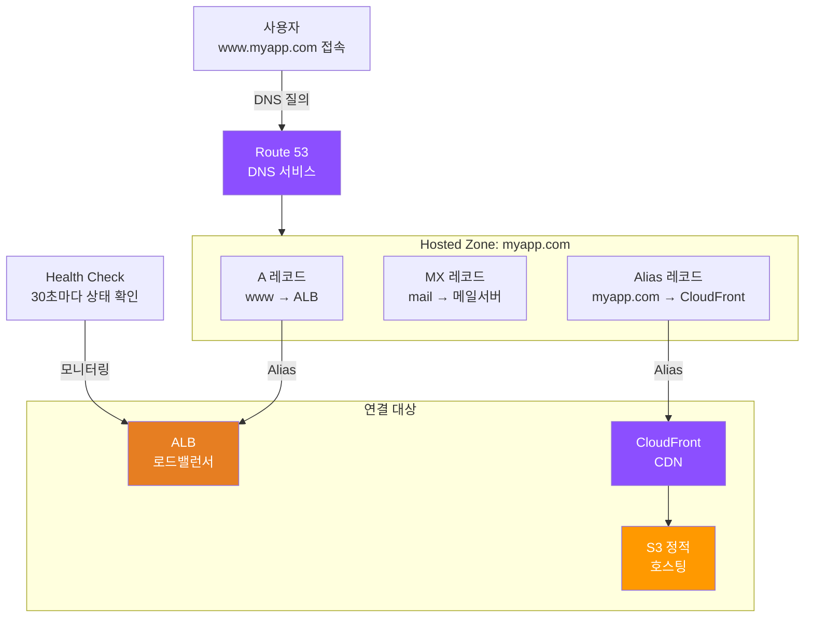
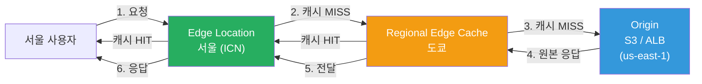
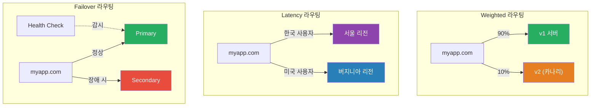

# Route 53 / CloudFront

> 서버를 만들고([EC2](./03-ec2-autoscaling)), 앞에 로드밸런서를 세웠으니([ALB](./07-load-balancing)) — 이제 사용자가 `www.myapp.com`으로 접속하면 가장 가까운 서버에서 빠르게 응답하도록 DNS와 CDN을 연결할 차례예요.

---

## 🎯 이걸 왜 알아야 하나?

```
DevOps가 Route 53 + CloudFront로 하는 일들:
• 도메인 연결                            → Route 53 Hosted Zone + A/Alias 레코드
• HTTPS 인증서 적용                      → ACM 인증서 + CloudFront/ALB 연결
• 글로벌 사용자 응답 속도 최적화          → CloudFront CDN 배포
• 장애 시 자동 전환 (Failover)           → Route 53 Health Check + Failover 라우팅
• 블루/그린 배포, 카나리 배포             → Weighted 라우팅 정책
• 정적 사이트 전 세계 배포               → S3 + CloudFront + OAC
• DDoS 방어 + 지역 차단                 → CloudFront + WAF + Geo Restriction
```

[DNS 기초](../02-networking/03-dns)에서 A 레코드, CNAME, 네임서버를 배웠죠? Route 53은 그 DNS를 AWS 관리형으로 제공하는 거예요. [CDN 기초](../02-networking/11-cdn)에서 엣지 서버와 캐싱을 배웠고요? CloudFront는 AWS의 CDN이에요.

---

## 🧠 핵심 개념

### 비유: 전화번호부와 편의점 체인

| 현실 세계 | AWS |
|-----------|-----|
| 전화번호부 (이름 → 전화번호) | Route 53 (도메인 → IP/리소스) |
| 전화번호부에 번호 등록 | Hosted Zone에 레코드 추가 |
| 대표번호 + 지역별 연결 | 라우팅 정책 (Latency, Geo 등) |
| "이 번호 아직 살아있나?" 확인 전화 | Health Check |
| 편의점 본사 물류 창고 | Origin (S3, ALB, EC2) |
| 전국 편의점 지점 | Edge Location (400+ 곳) |
| 지역 물류 허브 | Regional Edge Cache |
| 인기 상품은 지점에 미리 갖다 놓기 | CDN 캐싱 (TTL) |
| "유통기한 지난 상품 회수" | 캐시 무효화 (Invalidation) |

### Route 53 전체 구조



### CloudFront 요청 흐름



> **핵심 포인트**: 첫 번째 요청은 Origin까지 가지만(Cache MISS), 이후 같은 콘텐츠는 Edge에서 바로 응답해요(Cache HIT). 서울 사용자가 미국 서버에 직접 가면 200ms, Edge에서 응답하면 10ms예요.

### Route 53 라우팅 정책 비교



---

## 🔍 상세 설명

### 1. Route 53 Hosted Zone

Hosted Zone은 도메인의 DNS 레코드를 담는 컨테이너예요. 전화번호부에서 "회사 이름" 아래에 여러 번호가 적혀 있는 것과 같아요.

| 구분 | Public Hosted Zone | Private Hosted Zone |
|------|-------------------|-------------------|
| 접근 범위 | 인터넷 전체 | VPC 내부만 |
| 사용 사례 | 외부 웹사이트, API | 내부 서비스 디스커버리 |
| 비용 | $0.50/월 | $0.50/월 |

```bash
# Public Hosted Zone 생성
aws route53 create-hosted-zone \
  --name myapp.com \
  --caller-reference "2026-03-13-initial"
# {
#     "HostedZone": {
#         "Id": "/hostedzone/Z0123456789ABCDEFGHIJ",
#         "Name": "myapp.com.",
#         "Config": { "PrivateZone": false },
#         "ResourceRecordSetCount": 2
#     },
#     "DelegationSet": {
#         "NameServers": [
#             "ns-1234.awsdns-01.org",
#             "ns-567.awsdns-02.co.uk",
#             "ns-890.awsdns-03.net",
#             "ns-12.awsdns-04.com"
#         ]
#     }
# }
# → 도메인 등록기관(가비아, Namecheap 등)에서 네임서버를 위 4개로 변경해야 해요!

# Private Hosted Zone 생성 (VPC 내부용)
aws route53 create-hosted-zone \
  --name internal.myapp.local \
  --caller-reference "2026-03-13-private" \
  --vpc VPCRegion=ap-northeast-2,VPCId=vpc-0abc123def456
```

### 2. 레코드 타입과 Alias vs CNAME

| 레코드 타입 | 역할 | 예시 |
|------------|------|------|
| **A** | 도메인 → IPv4 | `www.myapp.com → 54.230.1.100` |
| **AAAA** | 도메인 → IPv6 | `www.myapp.com → 2600:1f18::1` |
| **CNAME** | 도메인 → 다른 도메인 | `app.myapp.com → myalb.elb.amazonaws.com` |
| **Alias** | 도메인 → AWS 리소스 (무료!) | `myapp.com → d1234567.cloudfront.net` |
| **MX** | 메일 서버 | `myapp.com → 10 mail.myapp.com` |
| **TXT** | 텍스트 (인증 등) | `"v=spf1 include:_spf.google.com ~all"` |

```
Alias vs CNAME -- 핵심 차이:

CNAME:
├── 표준 DNS (모든 DNS 제공자에서 사용 가능)
├── Zone Apex(루트 도메인)에 사용 불가! (myapp.com ✘)
├── Route 53 쿼리 비용 발생 ($0.40/100만 쿼리)
└── AWS 외부 리소스도 가리킬 수 있음

Alias (AWS 전용):
├── Zone Apex에 사용 가능! (myapp.com ✔)
├── AWS 리소스 쿼리 무료! ($0)
├── 대상: CloudFront, ALB/NLB, S3 Website, API Gateway 등
└── 헬스체크 연동 가능
```

```bash
# Alias 레코드 추가 (ALB 연결 -- Zone Apex에도 OK!)
aws route53 change-resource-record-sets \
  --hosted-zone-id Z0123456789ABCDEFGHIJ \
  --change-batch '{
    "Changes": [{
      "Action": "CREATE",
      "ResourceRecordSet": {
        "Name": "myapp.com",
        "Type": "A",
        "AliasTarget": {
          "HostedZoneId": "ZWKZPGTI48KDX",
          "DNSName": "myalb-123456.ap-northeast-2.elb.amazonaws.com",
          "EvaluateTargetHealth": true
        }
      }
    }]
  }'
# { "ChangeInfo": { "Id": "/change/C2JLKOP9HBTY4Z", "Status": "PENDING" } }

# MX 레코드 추가 (Google Workspace 메일)
aws route53 change-resource-record-sets \
  --hosted-zone-id Z0123456789ABCDEFGHIJ \
  --change-batch '{
    "Changes": [{
      "Action": "CREATE",
      "ResourceRecordSet": {
        "Name": "myapp.com",
        "Type": "MX",
        "TTL": 3600,
        "ResourceRecords": [
          { "Value": "1 aspmx.l.google.com" },
          { "Value": "5 alt1.aspmx.l.google.com" }
        ]
      }
    }]
  }'
```

### 3. 라우팅 정책

| 라우팅 정책 | 사용 사례 | 비유 |
|------------|----------|------|
| **Simple** | 단일 리소스 | 전화번호 하나만 등록 |
| **Weighted** | 카나리 배포, A/B 테스트 | 10통 중 9통은 본점, 1통은 신규 지점 |
| **Latency** | 글로벌 서비스, 가장 빠른 리전 | 가장 가까운 지점으로 안내 |
| **Failover** | 재해 복구 (DR) | 본점 문 닫으면 자동으로 분점 안내 |
| **Geolocation** | 국가별 다른 응답 (규정 준수) | 한국 손님은 한국 지점만 |
| **Geoproximity** | 지리적 거리 + 바이어스 조절 | 특정 지점 관할 영역 넓히기 |
| **Multi-Value** | 간단한 로드밸런싱 + 헬스체크 | 여러 번호 알려주되 고장 난 번호는 빼기 |

```bash
# Weighted 라우팅 -- 카나리 배포 (90:10)
aws route53 change-resource-record-sets \
  --hosted-zone-id Z0123456789ABCDEFGHIJ \
  --change-batch '{
    "Changes": [
      {
        "Action": "CREATE",
        "ResourceRecordSet": {
          "Name": "app.myapp.com", "Type": "A",
          "SetIdentifier": "v1-production", "Weight": 90,
          "AliasTarget": {
            "HostedZoneId": "ZWKZPGTI48KDX",
            "DNSName": "alb-v1.ap-northeast-2.elb.amazonaws.com",
            "EvaluateTargetHealth": true
          }
        }
      },
      {
        "Action": "CREATE",
        "ResourceRecordSet": {
          "Name": "app.myapp.com", "Type": "A",
          "SetIdentifier": "v2-canary", "Weight": 10,
          "AliasTarget": {
            "HostedZoneId": "ZWKZPGTI48KDX",
            "DNSName": "alb-v2.ap-northeast-2.elb.amazonaws.com",
            "EvaluateTargetHealth": true
          }
        }
      }
    ]
  }'
# → DNS 레벨에서 90:10 카나리 배포! 문제 없으면 점진 전환해요
```

### 4. Health Check

| Health Check 유형 | 대상 | 확인 방법 |
|------------------|------|----------|
| **Endpoint** | HTTP/HTTPS/TCP 엔드포인트 | 직접 요청, 상태 코드 확인 |
| **Calculated** | 다른 Health Check 조합 | AND/OR 조건 결합 |
| **CloudWatch Alarm** | CloudWatch 메트릭 | 알람 상태로 판단 |

```bash
# Health Check 생성
HC_ID=$(aws route53 create-health-check \
  --caller-reference "hc-$(date +%s)" \
  --health-check-config '{
    "Type": "HTTPS",
    "FullyQualifiedDomainName": "api.myapp.com",
    "Port": 443,
    "ResourcePath": "/health",
    "RequestInterval": 30,
    "FailureThreshold": 3
  }' \
  --query 'HealthCheck.Id' --output text)
# → 전 세계 체커가 30초마다 /health를 확인, 3회 연속 실패 시 Unhealthy

# 상태 확인
aws route53 get-health-check-status --health-check-id $HC_ID
# {
#     "HealthCheckObservations": [
#         { "Region": "us-east-1", "StatusReport": { "Status": "Success" } },
#         { "Region": "eu-west-1", "StatusReport": { "Status": "Success" } },
#         { "Region": "ap-southeast-1", "StatusReport": { "Status": "Success" } }
#     ]
# }
```

### 5. 도메인 등록과 DNSSEC

```bash
# 도메인 등록 가능 여부 확인
aws route53domains check-domain-availability \
  --domain-name my-new-startup-2026.com --region us-east-1
# { "Availability": "AVAILABLE" }

# 도메인 이전 (다른 등록기관 → Route 53)
aws route53domains transfer-domain \
  --domain-name myapp.com --duration-in-years 1 \
  --admin-contact file://contact.json \
  --registrant-contact file://contact.json \
  --tech-contact file://contact.json \
  --auth-code "EPP_TRANSFER_CODE" --region us-east-1
# → 이전 완료까지 보통 5~7일 소요

# DNSSEC 활성화 (DNS 응답 위변조 방지)
aws route53 enable-hosted-zone-dnssec \
  --hosted-zone-id Z0123456789ABCDEFGHIJ
# → KMS 키로 DNS 응답에 서명, 상위 도메인에 DS 레코드 등록 필요
```

### 6. CloudFront Distribution

| Origin 유형 | 사용 사례 | 연결 방식 |
|------------|----------|----------|
| **S3 버킷** | 정적 파일 (HTML, CSS, JS) | OAC (Origin Access Control) |
| **ALB** | 동적 API, SSR | HTTPS + 커스텀 헤더 |
| **Custom Origin** | 온프레미스, 다른 클라우드 | HTTPS/HTTP |

```bash
# CloudFront Distribution 생성 (S3 Origin + 커스텀 도메인)
aws cloudfront create-distribution \
  --distribution-config '{
    "CallerReference": "2026-03-13-myapp",
    "Comment": "myapp.com 정적 사이트",
    "Enabled": true,
    "DefaultRootObject": "index.html",
    "Origins": {
      "Quantity": 1,
      "Items": [{
        "Id": "S3-myapp",
        "DomainName": "myapp-static.s3.ap-northeast-2.amazonaws.com",
        "S3OriginConfig": { "OriginAccessIdentity": "" },
        "OriginAccessControlId": "E2QWRUHAPOMQZL"
      }]
    },
    "DefaultCacheBehavior": {
      "TargetOriginId": "S3-myapp",
      "ViewerProtocolPolicy": "redirect-to-https",
      "CachePolicyId": "658327ea-f89d-4fab-a63d-7e88639e58f6",
      "AllowedMethods": { "Quantity": 2, "Items": ["GET", "HEAD"] },
      "Compress": true
    },
    "ViewerCertificate": {
      "ACMCertificateArn": "arn:aws:acm:us-east-1:123456789012:certificate/abc-123",
      "SSLSupportMethod": "sni-only",
      "MinimumProtocolVersion": "TLSv1.2_2021"
    },
    "Aliases": { "Quantity": 1, "Items": ["www.myapp.com"] }
  }'
# {
#     "Distribution": {
#         "Id": "E1A2B3C4D5E6F7",
#         "DomainName": "d1234567.cloudfront.net",
#         "Status": "InProgress"
#     }
# }
# → 배포 완료까지 5~15분, Status가 "Deployed"로 바뀌면 완료
```

> **중요**: CloudFront 커스텀 도메인에 쓸 [ACM 인증서](../02-networking/05-tls-certificate)는 반드시 **us-east-1**에서 발급하세요! CloudFront는 글로벌 서비스라서 인증서도 us-east-1에 있어야 해요.

### 7. Cache Policy, Cache Behavior, 캐시 무효화

```
Cache Behavior 설정 예시 (경로별 Origin + 캐시 분리):

경로 패턴          →  Origin         →  캐시 정책
──────────────────────────────────────────────────
/api/*             →  ALB (동적)     →  CachingDisabled (매번 Origin)
/static/*          →  S3 (정적)      →  CachingOptimized (24h)
/images/*          →  S3 (이미지)    →  커스텀 (7일)
/* (기본)          →  S3 (HTML)      →  커스텀 (1h)
```

```bash
# 캐시 무효화 (배포 후 즉시 갱신)
aws cloudfront create-invalidation \
  --distribution-id E1A2B3C4D5E6F7 \
  --paths '/index.html' '/css/main.css'
# {
#     "Invalidation": {
#         "Id": "I1A2B3C4D5",
#         "Status": "InProgress"
#     }
# }
# → 1~2분 내 전 세계 Edge 캐시 삭제 (처음 1,000건/월 무료)

# 전체 무효화 (비용 주의!)
aws cloudfront create-invalidation \
  --distribution-id E1A2B3C4D5E6F7 --paths '/*'
```

> **팁**: 정적 파일에 버전 해시를 붙이면(`main.abc123.js`) 무효화 없이 자동 갱신돼요. 실무에서는 이 방법이 제일 좋아요.

### 8. CloudFront + S3 (OAC)

S3를 직접 공개하지 않고 CloudFront를 통해서만 접근하게 하는 게 OAC예요. [S3 정적 호스팅](./04-storage)에서 버킷 정책을 배웠죠?

```bash
# OAC 생성
aws cloudfront create-origin-access-control \
  --origin-access-control-config '{
    "Name": "myapp-s3-oac",
    "SigningProtocol": "sigv4",
    "SigningBehavior": "always",
    "OriginAccessControlOriginType": "s3"
  }'
# { "OriginAccessControl": { "Id": "E2QWRUHAPOMQZL" } }
```

```json
// S3 버킷 정책 -- CloudFront만 접근 허용
{
  "Version": "2012-10-17",
  "Statement": [{
    "Effect": "Allow",
    "Principal": { "Service": "cloudfront.amazonaws.com" },
    "Action": "s3:GetObject",
    "Resource": "arn:aws:s3:::myapp-static-2026/*",
    "Condition": {
      "StringEquals": {
        "AWS:SourceArn": "arn:aws:cloudfront::123456789012:distribution/E1A2B3C4D5E6F7"
      }
    }
  }]
}
```

```bash
# 확인 -- CloudFront 경유만 가능
curl -s https://d1234567.cloudfront.net/index.html   # → 200 OK
curl -s https://myapp-static-2026.s3.amazonaws.com/index.html  # → 403 Forbidden!
```

### 9. CloudFront + ALB

동적 API를 CloudFront 뒤에 놓으면 DDoS 방어 + HTTPS 종료 + 글로벌 가속 효과를 얻어요. ALB 직접 접근을 차단하려면 커스텀 헤더를 사용해요.

```bash
# ALB 리스너 규칙 -- 커스텀 헤더 없으면 차단
aws elbv2 create-rule \
  --listener-arn arn:aws:elasticloadbalancing:ap-northeast-2:123456789012:listener/app/myalb/abc/def \
  --priority 1 \
  --conditions '[{
    "Field": "http-header",
    "HttpHeaderConfig": {
      "HttpHeaderName": "X-CF-Secret",
      "Values": ["MyS3cretH3ader!"]
    }
  }]' \
  --actions '[{"Type": "forward", "TargetGroupArn": "arn:aws:elasticloadbalancing:..."}]'
# → CloudFront Distribution의 Origin에 같은 헤더를 CustomHeaders로 설정
# → CloudFront 우회해서 ALB 직접 접근하면 차단됨!
```

### 10. CloudFront Functions vs Lambda@Edge

| 항목 | CloudFront Functions | Lambda@Edge |
|------|---------------------|-------------|
| 실행 위치 | Edge Location (400+) | Regional Edge Cache (13) |
| 런타임 | JavaScript (ES 5.1) | Node.js, Python |
| 실행 시간 | < 1ms | < 5초 (Viewer) / 30초 (Origin) |
| 네트워크 접근 | 불가 | 가능 |
| 비용 | $0.10/100만 건 | $0.60/100만 건 + 실행시간 |
| 사용 사례 | URL 리라이트, 헤더 조작 | 인증, 이미지 리사이즈, SSR |

```javascript
// CloudFront Function 예시: SPA URL 리라이트
function handler(event) {
    var request = event.request;
    var uri = request.uri;
    // 파일 확장자가 없으면 index.html로 (SPA 라우팅)
    if (!uri.includes('.')) {
        request.uri = '/index.html';
    }
    return request;
}
```

```bash
# CloudFront Function 생성 + 게시
aws cloudfront create-function \
  --name spa-url-rewrite \
  --function-config '{"Comment":"SPA rewrite","Runtime":"cloudfront-js-2.0"}' \
  --function-code fileb://spa-rewrite.js
# → 게시 후 Cache Behavior의 "Viewer Request"에 연결
```

### 11. 보안: WAF, Geo Restriction, Signed URL/Cookie

```bash
# WAF 연동 -- SQL 인젝션, XSS를 Edge에서 차단
aws wafv2 associate-web-acl \
  --web-acl-arn arn:aws:wafv2:us-east-1:123456789012:global/webacl/myapp-waf/abc123 \
  --resource-arn arn:aws:cloudfront::123456789012:distribution/E1A2B3C4D5E6F7

# Geo Restriction -- 한국, 일본, 미국만 허용
# Distribution 설정의 Restrictions 부분:
#   "GeoRestriction": {
#     "RestrictionType": "whitelist",
#     "Quantity": 3,
#     "Items": ["KR", "JP", "US"]
#   }

# Signed URL 생성 (유료 콘텐츠 접근 제어)
aws cloudfront sign \
  --url "https://d1234567.cloudfront.net/premium/video.mp4" \
  --key-pair-id K1A2B3C4D5E6F7 \
  --private-key file://private_key.pem \
  --date-less-than "2026-03-14T00:00:00Z"
# → 만료 시간이 있는 서명된 URL 생성 (이 URL만 접근 가능)
```

```
Signed URL vs Signed Cookie:

Signed URL  → URL 하나에 대한 접근 제어 (개별 파일 다운로드)
Signed Cookie → 여러 URL에 대한 접근 제어 (구독 서비스 전체 콘텐츠)

Field-Level Encryption:
  사용자 → Edge에서 공개키로 민감 필드 암호화 → Origin에서만 개인키로 복호화
  (신용카드 번호 같은 민감 데이터를 ALB/프록시 레벨에서도 볼 수 없게)
```

---

## 💻 실습 예제

### 실습 1: Route 53 + ALB Failover 구성

> 도메인을 ALB에 연결하고, Health Check 기반 Failover를 구성해 봐요.

```bash
# 1. Hosted Zone 생성
ZONE_ID=$(aws route53 create-hosted-zone \
  --name myapp.com --caller-reference "lab1-$(date +%s)" \
  --query 'HostedZone.Id' --output text)

# 2. Health Check 생성 (Primary ALB 모니터링)
HC_ID=$(aws route53 create-health-check \
  --caller-reference "hc-$(date +%s)" \
  --health-check-config '{
    "Type": "HTTPS",
    "FullyQualifiedDomainName": "alb-seoul.ap-northeast-2.elb.amazonaws.com",
    "Port": 443, "ResourcePath": "/health",
    "RequestInterval": 10, "FailureThreshold": 2
  }' --query 'HealthCheck.Id' --output text)

# 3. Primary 레코드 (서울 + Health Check)
aws route53 change-resource-record-sets --hosted-zone-id $ZONE_ID \
  --change-batch "{
    \"Changes\": [{
      \"Action\": \"CREATE\",
      \"ResourceRecordSet\": {
        \"Name\": \"myapp.com\", \"Type\": \"A\",
        \"SetIdentifier\": \"primary\", \"Failover\": \"PRIMARY\",
        \"HealthCheckId\": \"$HC_ID\",
        \"AliasTarget\": {
          \"HostedZoneId\": \"ZWKZPGTI48KDX\",
          \"DNSName\": \"alb-seoul.ap-northeast-2.elb.amazonaws.com\",
          \"EvaluateTargetHealth\": true
        }
      }
    }]
  }"

# 4. Secondary 레코드 (도쿄 -- DR)
aws route53 change-resource-record-sets --hosted-zone-id $ZONE_ID \
  --change-batch '{
    "Changes": [{
      "Action": "CREATE",
      "ResourceRecordSet": {
        "Name": "myapp.com", "Type": "A",
        "SetIdentifier": "secondary", "Failover": "SECONDARY",
        "AliasTarget": {
          "HostedZoneId": "Z14GRHDCWA56QT",
          "DNSName": "alb-tokyo.ap-northeast-1.elb.amazonaws.com",
          "EvaluateTargetHealth": true
        }
      }
    }]
  }'

# 5. 확인
dig myapp.com +short
# 54.230.1.100  ← 서울 ALB (정상)
# 서울 장애 시 → 30~60초 후 자동 Failover
# 13.115.2.200  ← 도쿄 ALB (Failover!)
```

### 실습 2: CloudFront + S3 정적 사이트 (OAC + 커스텀 도메인)

> S3에 정적 사이트를 올리고, CloudFront + OAC + 커스텀 도메인으로 배포해 봐요.

```bash
# 1. S3 버킷 + 퍼블릭 접근 차단
aws s3 mb s3://myapp-static-lab-2026
aws s3api put-public-access-block --bucket myapp-static-lab-2026 \
  --public-access-block-configuration \
    BlockPublicAcls=true,IgnorePublicAcls=true,BlockPublicPolicy=true,RestrictPublicBuckets=true

# 2. 파일 업로드
aws s3 sync ./dist/ s3://myapp-static-lab-2026/

# 3. OAC 생성
OAC_ID=$(aws cloudfront create-origin-access-control \
  --origin-access-control-config '{
    "Name": "lab-oac", "SigningProtocol": "sigv4",
    "SigningBehavior": "always", "OriginAccessControlOriginType": "s3"
  }' --query 'OriginAccessControl.Id' --output text)

# 4. ACM 인증서 (반드시 us-east-1!)
CERT_ARN=$(aws acm request-certificate --region us-east-1 \
  --domain-name "www.myapp.com" --subject-alternative-names "myapp.com" \
  --validation-method DNS --query 'CertificateArn' --output text)
# → Route 53에 DNS 검증 레코드 추가 후 발급 완료 대기

# 5. CloudFront Distribution 생성
DIST_ID=$(aws cloudfront create-distribution \
  --distribution-config "{
    \"CallerReference\": \"lab-$(date +%s)\",
    \"Enabled\": true, \"DefaultRootObject\": \"index.html\",
    \"Origins\": { \"Quantity\": 1, \"Items\": [{
      \"Id\": \"S3\", \"DomainName\": \"myapp-static-lab-2026.s3.ap-northeast-2.amazonaws.com\",
      \"S3OriginConfig\": { \"OriginAccessIdentity\": \"\" },
      \"OriginAccessControlId\": \"$OAC_ID\"
    }]},
    \"DefaultCacheBehavior\": {
      \"TargetOriginId\": \"S3\", \"ViewerProtocolPolicy\": \"redirect-to-https\",
      \"CachePolicyId\": \"658327ea-f89d-4fab-a63d-7e88639e58f6\",
      \"AllowedMethods\": { \"Quantity\": 2, \"Items\": [\"GET\",\"HEAD\"] },
      \"Compress\": true
    },
    \"ViewerCertificate\": {
      \"ACMCertificateArn\": \"$CERT_ARN\",
      \"SSLSupportMethod\": \"sni-only\", \"MinimumProtocolVersion\": \"TLSv1.2_2021\"
    },
    \"Aliases\": { \"Quantity\": 1, \"Items\": [\"www.myapp.com\"] }
  }" --query 'Distribution.Id' --output text)

# 6. S3 버킷 정책 (CloudFront만 허용) + Route 53 Alias 레코드
# → 실습 8절 OAC 버킷 정책 JSON 참고
# → Route 53에 www.myapp.com → CloudFront Alias (HostedZoneId: Z2FDTNDATAQYW2)

# 7. 확인
curl -sI https://www.myapp.com/ | grep x-cache
# x-cache: Hit from cloudfront
```

### 실습 3: 다중 Origin (S3 정적 + ALB API) 경로별 라우팅

> 하나의 도메인에서 정적 파일은 S3, API는 ALB로 보내는 구성을 만들어 봐요.

```bash
# dist-config.json -- 핵심 구조
cat > /tmp/dist-config.json << 'EOF'
{
  "CallerReference": "multi-origin-lab",
  "Enabled": true, "DefaultRootObject": "index.html",
  "Origins": { "Quantity": 2, "Items": [
    {
      "Id": "S3-Static",
      "DomainName": "myapp-static.s3.ap-northeast-2.amazonaws.com",
      "S3OriginConfig": { "OriginAccessIdentity": "" },
      "OriginAccessControlId": "E2QWRUHAPOMQZL"
    },
    {
      "Id": "ALB-API",
      "DomainName": "myalb.ap-northeast-2.elb.amazonaws.com",
      "CustomOriginConfig": {
        "HTTPSPort": 443, "OriginProtocolPolicy": "https-only",
        "OriginSslProtocols": { "Quantity": 1, "Items": ["TLSv1.2"] }
      },
      "CustomHeaders": { "Quantity": 1,
        "Items": [{ "HeaderName": "X-CF-Secret", "HeaderValue": "s3cret!" }]
      }
    }
  ]},
  "DefaultCacheBehavior": {
    "TargetOriginId": "S3-Static",
    "ViewerProtocolPolicy": "redirect-to-https",
    "CachePolicyId": "658327ea-f89d-4fab-a63d-7e88639e58f6",
    "AllowedMethods": { "Quantity": 2, "Items": ["GET","HEAD"] },
    "Compress": true
  },
  "CacheBehaviors": { "Quantity": 1, "Items": [{
    "PathPattern": "/api/*",
    "TargetOriginId": "ALB-API",
    "ViewerProtocolPolicy": "https-only",
    "CachePolicyId": "4135ea2d-6df8-44a3-9df3-4b5a84be39ad",
    "AllowedMethods": { "Quantity": 7,
      "Items": ["GET","HEAD","OPTIONS","PUT","PATCH","POST","DELETE"] },
    "Compress": true
  }]}
}
EOF

aws cloudfront create-distribution --distribution-config file:///tmp/dist-config.json
# { "Distribution": { "Id": "E7X8Y9Z0A1B2C3", "DomainName": "d9876543.cloudfront.net" } }

# 확인
curl -s https://myapp.com/index.html     # → S3 정적 HTML
curl -s https://myapp.com/api/users       # → ALB → EC2/ECS 동적 JSON
curl -sI https://myapp.com/images/logo.png | grep x-cache
# x-cache: Hit from cloudfront  ← Edge 캐시 HIT
```

---

## 🏢 실무에서는?

### 시나리오 1: 글로벌 SaaS 서비스

```
Route 53 (Latency 라우팅):
  한국 사용자 → ap-northeast-2 ALB
  미국 사용자 → us-east-1 ALB
  유럽 사용자 → eu-west-1 ALB

CloudFront:
  정적 자산 → S3 Origin, 전 세계 Edge 캐시
  API → 각 리전 ALB, 캐시 비활성화

Health Check → 장애 리전 자동 제외 (30~60초)
효과: 서울 10ms, 뉴욕 15ms (Origin 직접 접근 시 200ms)
```

### 시나리오 2: 카나리 배포 + 즉시 롤백

```
Route 53 Weighted 라우팅으로 점진 전환:

1단계: v1(95%) / v2(5%)  → 에러율/지연시간 모니터링
2단계: v1(50%) / v2(50%) → 문제 없으면 확대
3단계: v1(0%)  / v2(100%) → 전환 완료
롤백:  Weight만 변경 → DNS TTL(60초) 후 즉시 롤백
```

### 시나리오 3: React SPA + API 보안 강화

```
CloudFront Distribution:
├── Origin 1: S3 (React 빌드)
│   ├── OAC → S3 직접 접근 차단
│   ├── CF Function → SPA URL 리라이트
│   └── 캐시 24h (파일명 해시)
├── Origin 2: ALB (API)
│   ├── 커스텀 헤더 → 직접 접근 차단
│   └── 캐시 비활성화
└── 보안: WAF + Geo Restriction + ACM(TLS 1.2+) + Signed Cookie
```

---

## ⚠️ 자주 하는 실수

### 1. CloudFront용 ACM 인증서를 서울 리전에서 발급

```
❌ ap-northeast-2에서 인증서 발급 → CloudFront 연결 시 "인증서 없음" 에러
✅ CloudFront용 인증서는 반드시 us-east-1에서 발급!
   ALB용 인증서는 ALB가 있는 리전에서 발급
```

### 2. Alias 대신 CNAME을 Zone Apex에 사용

```
❌ myapp.com CNAME d1234567.cloudfront.net
   → DNS 표준 위반! Zone Apex에 CNAME 불가, MX/NS 레코드 깨짐
✅ myapp.com A (Alias) d1234567.cloudfront.net
   → Alias는 Zone Apex 가능 + 쿼리 비용 무료!
```

### 3. CloudFront 캐시 때문에 배포 후 업데이트 안 됨

```
❌ S3에 index.html 업데이트 → 사이트 안 바뀜 (Edge 캐시 TTL 잔여)
✅ 해결 3가지:
   1. 캐시 무효화: aws cloudfront create-invalidation --paths '/index.html'
   2. 파일명 해시: main.abc123.js (빌드 도구 자동 생성) ← 실무 권장!
   3. Cache-Control: HTML은 짧은 TTL, 해시 파일은 긴 TTL
```

### 4. S3를 CloudFront 없이 퍼블릭으로 직접 노출

```
❌ S3 퍼블릭 액세스 허용 + 버킷 웹사이트 엔드포인트 직접 사용
   → HTTPS 불가, WAF 연동 불가, 보안 헤더 설정 불가
✅ S3 퍼블릭 완전 차단 + CloudFront + OAC
   → HTTPS 자동, WAF 가능, S3는 CloudFront만 접근
```

### 5. Health Check 없이 Failover 라우팅 구성

```
❌ Failover 설정했는데 Health Check 안 만듦
   → Primary 장애여도 감지 못 함 → 사용자가 죽은 서버로 계속 연결
✅ Health Check 생성 (RequestInterval: 10초, FailureThreshold: 2)
   + Primary에 연결 + EvaluateTargetHealth: true
   → 20초 만에 장애 감지 → 자동 Failover!
```

---

## 📝 정리

```
Route 53 (DNS 서비스):
├── Hosted Zone: 도메인의 레코드 컨테이너 (Public / Private)
├── 레코드: A, AAAA, CNAME, Alias(Zone Apex 가능, 무료!), MX, TXT
├── 라우팅: Simple / Weighted / Latency / Failover / Geolocation / Multi-Value
├── Health Check: Endpoint / Calculated / CloudWatch → Failover 자동화
├── DNSSEC: DNS 위변조 방지, 도메인 등록/이전 가능
└── 핵심: Alias는 CNAME보다 좋다 (Zone Apex + 무료 + 빠름)

CloudFront (CDN):
├── Distribution: Origin + Cache Behavior + 보안 설정
├── Origin: S3(OAC) / ALB(커스텀 헤더) / Custom
├── Edge Location(400+) + Regional Edge Cache → 사용자 가까이 응답
├── Cache: Policy로 TTL·캐시키 정의, Behavior로 경로별 분리
├── 무효화: 즉시 갱신 가능 (파일명 해시가 더 좋음)
├── Edge 코드: CF Functions(경량) vs Lambda@Edge(중량)
└── 보안: WAF, Geo Restriction, Signed URL/Cookie, Field-Level Encryption

핵심 조합:
• 정적 사이트: S3 + CloudFront(OAC) + Route 53(Alias) + ACM(us-east-1)
• 동적 API: ALB + CloudFront(캐시 OFF) + Route 53 + WAF
• 글로벌: Route 53(Latency) + 멀티 리전 ALB + Health Check
• DR: Route 53(Failover) + Health Check + 다중 리전
```

---

## 🔗 다음 강의 → [09-container-services](./09-container-services)

> 도메인(Route 53)과 CDN(CloudFront)으로 트래픽을 받는 방법을 배웠으니, 다음은 그 뒤에서 실제로 애플리케이션을 돌리는 AWS 컨테이너 서비스(ECS, Fargate, ECR)를 배울 거예요.

**관련 강의 링크:**
- [DNS 기초](../02-networking/03-dns) -- A, CNAME, 네임서버 등 DNS 원리
- [CDN 기초](../02-networking/11-cdn) -- Edge 캐싱, CDN 동작 원리
- [TLS/인증서](../02-networking/05-tls-certificate) -- ACM 인증서 발급과 HTTPS
- [S3 정적 호스팅](./04-storage) -- S3 버킷 정책, 정적 웹 호스팅
- [ALB + Route 53](./07-load-balancing) -- ALB 리스너, 대상 그룹, 도메인 연결
