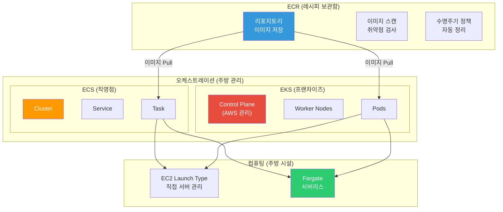
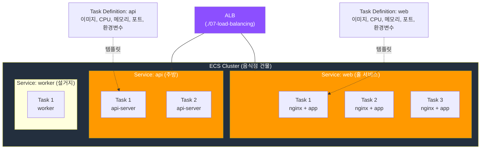
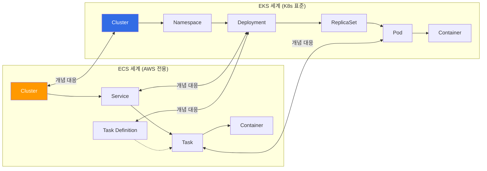
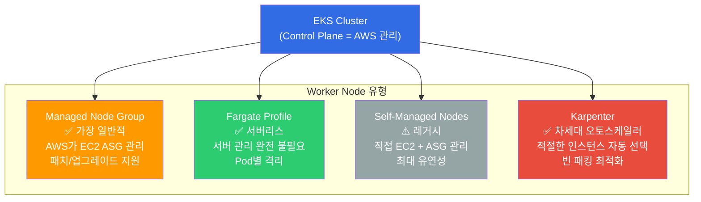

# ECR / ECS / EKS / Fargate

> [이전 강의](./07-load-balancing)에서 ALB/NLB로 트래픽을 분산하는 법을 배웠어요. 이제 그 트래픽을 받아줄 **컨테이너 서비스** -- ECR, ECS, EKS, Fargate를 배워볼게요. [컨테이너 기초](../03-containers/01-concept)와 [Docker 기본](../03-containers/02-docker-basics)에서 배운 컨테이너를 AWS 위에서 **대규모로 운영**하는 방법이에요.

---

## 🎯 이걸 왜 알아야 하나?

```
컨테이너 서비스가 필요한 순간:
• "Docker 이미지 빌드했는데 어디에 올리죠?"                → ECR (프라이빗 레지스트리)
• "컨테이너 10개를 자동으로 띄우고 관리하고 싶어요"         → ECS / EKS (오케스트레이션)
• "서버 관리 없이 컨테이너만 올리고 싶어요"                → Fargate (서버리스 컨테이너)
• "K8s 쓰고 싶은데 컨트롤 플레인 관리가 너무 힘들어요"     → EKS (관리형 K8s)
• "마이크로서비스 100개를 운영해야 해요"                   → ECS/EKS + ALB + Service Discovery
• "이미지 빌드할 때마다 취약점 검사하고 싶어요"             → ECR 이미지 스캔
• 면접: "ECS vs EKS 어떤 걸 써야 하나요?"                 → 팀 규모, 복잡도, 기존 투자에 따라 다름
```

---

## 🧠 핵심 개념 (비유 + 다이어그램)

### 비유: 음식점 운영 방식

컨테이너 서비스를 **음식점 운영**에 비유해볼게요.

* **ECR (레지스트리)** = **레시피 보관함**. 모든 요리의 레시피(이미지)를 중앙에 보관. 어떤 지점에서든 이 레시피를 가져다 쓸 수 있어요
* **ECS (오케스트레이션)** = **직영 음식점 운영**. AWS가 만든 주방 관리 시스템으로, 주문(요청)이 들어오면 셰프(컨테이너)를 배치하고 관리해요
* **EKS (관리형 K8s)** = **프랜차이즈 본사 시스템**. 업계 표준(Kubernetes) 관리 시스템을 AWS가 설치해주는 것. 더 복잡하지만 멀티 클라우드로 이식 가능해요
* **Fargate (서버리스)** = **배달앱 주방(클라우드 키친)**. 주방 시설(서버) 없이 요리(컨테이너)만 만들면 되는 것. 주방 관리는 플랫폼(AWS)이 알아서 해요
* **App Runner** = **밀키트 배달**. 재료(코드/이미지)만 보내면 요리부터 배달까지 다 해주는 최간편 서비스

### AWS 컨테이너 서비스 전체 지도



### ECS 핵심 구조: Cluster - Service - Task



### ECS vs EKS 비교 구조



---

## 🔍 상세 설명

### 1. ECR (Elastic Container Registry)

[레지스트리 기초](../03-containers/07-registry)에서 ECR의 기본 push/pull을 배웠어요. 여기서는 **운영 관점**의 고급 기능을 다뤄요.

#### 리포지토리 생성과 이미지 Push

```bash
# === ECR 프라이빗 리포지토리 생성 ===
aws ecr create-repository \
  --repository-name my-team/api-server \
  --image-scanning-configuration scanOnPush=true \
  --image-tag-mutability IMMUTABLE \
  --encryption-configuration encryptionType=KMS \
  --region ap-northeast-2

# 예상 출력:
# {
#     "repository": {
#         "repositoryArn": "arn:aws:ecr:ap-northeast-2:123456789012:repository/my-team/api-server",
#         "repositoryUri": "123456789012.dkr.ecr.ap-northeast-2.amazonaws.com/my-team/api-server",
#         "imageTagMutability": "IMMUTABLE",
#         "imageScanningConfiguration": { "scanOnPush": true },
#         "encryptionConfiguration": { "encryptionType": "KMS" }
#     }
# }
```

```bash
# === ECR 로그인 (12시간 유효한 토큰) ===
aws ecr get-login-password --region ap-northeast-2 | \
  docker login --username AWS --password-stdin \
  123456789012.dkr.ecr.ap-northeast-2.amazonaws.com

# Login Succeeded
```

```bash
# === 이미지 태그 + Push ===
docker tag my-api:v1.2.0 \
  123456789012.dkr.ecr.ap-northeast-2.amazonaws.com/my-team/api-server:v1.2.0

docker push \
  123456789012.dkr.ecr.ap-northeast-2.amazonaws.com/my-team/api-server:v1.2.0

# 예상 출력:
# The push refers to repository [123456789012.dkr.ecr.ap-northeast-2.amazonaws.com/my-team/api-server]
# v1.2.0: digest: sha256:abc123... size: 2200
```

> **IMMUTABLE 태그**: `imageTagMutability`를 `IMMUTABLE`로 설정하면 같은 태그로 덮어쓰기가 불가능해요. 프로덕션에서 `:latest`가 갑자기 바뀌는 사고를 방지할 수 있어요.

#### 수명주기 정책 (Lifecycle Policy)

오래된 이미지가 쌓이면 스토리지 비용이 계속 올라가요. 수명주기 정책으로 자동 정리해요.

```bash
# === 수명주기 정책 설정: 최근 10개만 유지 ===
aws ecr put-lifecycle-policy \
  --repository-name my-team/api-server \
  --lifecycle-policy-text '{
    "rules": [
      {
        "rulePriority": 1,
        "description": "untagged 이미지 7일 후 삭제",
        "selection": {
          "tagStatus": "untagged",
          "countType": "sinceImagePushed",
          "countUnit": "days",
          "countNumber": 7
        },
        "action": { "type": "expire" }
      },
      {
        "rulePriority": 2,
        "description": "태그된 이미지 최근 20개만 유지",
        "selection": {
          "tagStatus": "tagged",
          "tagPrefixList": ["v"],
          "countType": "imageCountMoreThan",
          "countNumber": 20
        },
        "action": { "type": "expire" }
      }
    ]
  }'

# 예상 출력:
# {
#     "registryId": "123456789012",
#     "repositoryName": "my-team/api-server",
#     "lifecyclePolicyText": "..."
# }
```

#### 이미지 스캔 결과 확인

```bash
# === 마지막 스캔 결과 조회 ===
aws ecr describe-image-scan-findings \
  --repository-name my-team/api-server \
  --image-id imageTag=v1.2.0 \
  --query "imageScanFindings.findingSeverityCounts"

# 예상 출력:
# {
#     "CRITICAL": 0,
#     "HIGH": 2,
#     "MEDIUM": 5,
#     "LOW": 12,
#     "INFORMATIONAL": 8
# }
```

> **Enhanced Scanning**: 기본 스캔은 OS 패키지 취약점만 검사해요. Enhanced Scanning(Inspector 연동)을 켜면 **애플리케이션 라이브러리**(npm, pip 등)도 검사하고, **지속적 스캔**이 가능해요.

#### 크로스 리전 복제와 Pull Through Cache

```bash
# === 크로스 리전 복제 설정 (DR 대비) ===
aws ecr put-replication-configuration \
  --replication-configuration '{
    "rules": [
      {
        "destinations": [
          {
            "region": "us-west-2",
            "registryId": "123456789012"
          }
        ],
        "repositoryFilters": [
          {
            "filter": "my-team/",
            "filterType": "PREFIX_MATCH"
          }
        ]
      }
    ]
  }'
# → my-team/ 접두사의 모든 이미지가 us-west-2에 자동 복제돼요
```

```bash
# === Pull Through Cache (공개 이미지 캐싱) ===
# Docker Hub, ECR Public, GitHub GHCR 등의 이미지를 ECR에 캐싱
aws ecr create-pull-through-cache-rule \
  --ecr-repository-prefix docker-hub \
  --upstream-registry-url registry-1.docker.io \
  --region ap-northeast-2

# 이제 아래처럼 pull하면 자동으로 ECR에 캐싱돼요:
# docker pull 123456789012.dkr.ecr.ap-northeast-2.amazonaws.com/docker-hub/library/nginx:latest
```

> **Pull Through Cache를 쓰는 이유**: Docker Hub는 익명 사용자에게 [Rate Limit](https://docs.docker.com/docker-hub/download-rate-limit/)을 적용해요. CI/CD에서 빌드할 때마다 Docker Hub에서 pull하면 한도에 걸릴 수 있어요. ECR에 캐싱하면 이 문제를 해결할 수 있고, pull 속도도 빨라져요.

---

### 2. ECS (Elastic Container Service)

ECS는 AWS가 만든 **자체 컨테이너 오케스트레이션 서비스**예요. K8s보다 단순하지만 AWS 서비스와의 통합이 매우 깊어요.

#### ECS 핵심 개념 4가지

| ECS 개념 | K8s 대응 개념 | 비유 (음식점) | 설명 |
|----------|-------------|-------------|------|
| **Cluster** | Cluster | 음식점 건물 | 논리적 그룹. 리소스의 경계 |
| **Task Definition** | Pod Spec (in Deployment) | 레시피 + 조리법 | 컨테이너 설정의 **템플릿** (이미지, CPU, 메모리, 포트, 볼륨) |
| **Task** | Pod | 한 접시의 요리 | Task Definition에서 **실행된 인스턴스** |
| **Service** | Deployment + Service | 주방 라인 | 원하는 수의 Task를 유지. 롤링 업데이트, ALB 연결 |

#### Task Definition 작성

```bash
# === Task Definition 등록 (JSON 파일) ===
cat << 'EOF' > task-definition.json
{
  "family": "api-server",
  "networkMode": "awsvpc",
  "requiresCompatibilities": ["FARGATE"],
  "cpu": "512",
  "memory": "1024",
  "executionRoleArn": "arn:aws:iam::123456789012:role/ecsTaskExecutionRole",
  "taskRoleArn": "arn:aws:iam::123456789012:role/ecsTaskRole",
  "containerDefinitions": [
    {
      "name": "api",
      "image": "123456789012.dkr.ecr.ap-northeast-2.amazonaws.com/my-team/api-server:v1.2.0",
      "portMappings": [
        {
          "containerPort": 8080,
          "protocol": "tcp"
        }
      ],
      "environment": [
        { "name": "NODE_ENV", "value": "production" }
      ],
      "secrets": [
        {
          "name": "DB_PASSWORD",
          "valueFrom": "arn:aws:secretsmanager:ap-northeast-2:123456789012:secret:prod/db-password"
        }
      ],
      "logConfiguration": {
        "logDriver": "awslogs",
        "options": {
          "awslogs-group": "/ecs/api-server",
          "awslogs-region": "ap-northeast-2",
          "awslogs-stream-prefix": "ecs"
        }
      },
      "healthCheck": {
        "command": ["CMD-SHELL", "curl -f http://localhost:8080/health || exit 1"],
        "interval": 30,
        "timeout": 5,
        "retries": 3,
        "startPeriod": 60
      }
    }
  ]
}
EOF

aws ecs register-task-definition \
  --cli-input-json file://task-definition.json

# 예상 출력:
# {
#     "taskDefinition": {
#         "taskDefinitionArn": "arn:aws:ecs:ap-northeast-2:123456789012:task-definition/api-server:1",
#         "family": "api-server",
#         "revision": 1,
#         "status": "ACTIVE"
#     }
# }
```

> **executionRoleArn vs taskRoleArn**: 헷갈리기 쉬운 두 IAM Role이에요.
> * `executionRoleArn` = ECS **에이전트**가 쓰는 Role (ECR에서 이미지 pull, CloudWatch에 로그 전송)
> * `taskRoleArn` = **애플리케이션 코드**가 쓰는 Role (S3 접근, DynamoDB 접근 등)
> [IAM 강의](./01-iam)에서 배운 최소 권한 원칙을 적용하세요.

#### ECS Cluster 생성과 Service 배포

```bash
# === ECS Cluster 생성 ===
aws ecs create-cluster \
  --cluster-name production \
  --capacity-providers FARGATE FARGATE_SPOT \
  --default-capacity-provider-strategy \
    capacityProvider=FARGATE,weight=1,base=2 \
    capacityProvider=FARGATE_SPOT,weight=3

# 예상 출력:
# {
#     "cluster": {
#         "clusterArn": "arn:aws:ecs:ap-northeast-2:123456789012:cluster/production",
#         "clusterName": "production",
#         "status": "ACTIVE",
#         "capacityProviders": ["FARGATE", "FARGATE_SPOT"]
#     }
# }
```

```bash
# === ECS Service 생성 (Fargate + ALB 연동) ===
aws ecs create-service \
  --cluster production \
  --service-name api-service \
  --task-definition api-server:1 \
  --desired-count 3 \
  --launch-type FARGATE \
  --network-configuration '{
    "awsvpcConfiguration": {
      "subnets": ["subnet-private-a", "subnet-private-b"],
      "securityGroups": ["sg-ecs-tasks"],
      "assignPublicIp": "DISABLED"
    }
  }' \
  --load-balancers '[
    {
      "targetGroupArn": "arn:aws:elasticloadbalancing:ap-northeast-2:123456789012:targetgroup/api-tg/abc123",
      "containerName": "api",
      "containerPort": 8080
    }
  ]' \
  --deployment-configuration '{
    "maximumPercent": 200,
    "minimumHealthyPercent": 100
  }'

# 예상 출력:
# {
#     "service": {
#         "serviceName": "api-service",
#         "desiredCount": 3,
#         "runningCount": 0,
#         "status": "ACTIVE",
#         "launchType": "FARGATE",
#         "deployments": [
#             {
#                 "status": "PRIMARY",
#                 "desiredCount": 3,
#                 "runningCount": 0,
#                 "rolloutState": "IN_PROGRESS"
#             }
#         ]
#     }
# }
```

> **awsvpc 네트워크 모드**: ECS의 Fargate는 반드시 `awsvpc` 모드를 사용해요. 각 Task가 **자신만의 ENI(네트워크 인터페이스)**를 받아요. [VPC 강의](./02-vpc)에서 배운 Private Subnet에 배치하고, ALB를 통해서만 외부 트래픽을 받는 게 보안상 좋아요.

#### Launch Type 비교: EC2 vs Fargate

| 항목 | EC2 Launch Type | Fargate Launch Type |
|------|----------------|---------------------|
| **서버 관리** | 직접 EC2 인스턴스 관리 | AWS가 관리 (서버리스) |
| **패치/AMI** | 직접 OS 패치, AMI 업데이트 | AWS가 알아서 |
| **비용 모델** | EC2 인스턴스 비용 (항상 켜져 있음) | Task 실행 시간만큼만 (초 단위) |
| **GPU 지원** | 지원 | 미지원 |
| **Docker 접근** | docker exec 가능 | 불가 (ECS Exec 사용) |
| **대규모 운영** | Bin Packing으로 효율적 | Task별 독립 격리 |
| **적합한 경우** | 비용 최적화, GPU, 특수 요구사항 | 빠른 시작, 관리 부담 최소화 |

#### ECS Exec (컨테이너 접속)

Fargate에서는 `docker exec`를 쓸 수 없어요. 대신 **ECS Exec**으로 실행 중인 Task에 접속할 수 있어요.

```bash
# === ECS Exec 활성화 (Service 업데이트) ===
aws ecs update-service \
  --cluster production \
  --service api-service \
  --enable-execute-command

# === 실행 중인 Task에 쉘 접속 ===
aws ecs execute-command \
  --cluster production \
  --task arn:aws:ecs:ap-northeast-2:123456789012:task/production/abc123def456 \
  --container api \
  --interactive \
  --command "/bin/sh"

# The Session Manager plugin was installed successfully. Use the AWS CLI to start a session.
# Starting session with SessionId: ecs-execute-command-abc123
# / # whoami
# root
# / # curl localhost:8080/health
# {"status":"healthy","uptime":"2h30m"}
```

> **주의**: ECS Exec을 쓰려면 Task Role에 SSM 관련 권한이 필요하고, Task Definition에서 `initProcessEnabled`를 true로 설정해야 해요.

#### Service Connect (서비스 간 통신)

마이크로서비스 간 통신을 위한 기능이에요. 별도의 Service Mesh 없이 ECS 내에서 서비스 디스커버리와 로드 밸런싱을 해요.

```bash
# === Service Connect 네임스페이스 생성 ===
aws servicediscovery create-http-namespace \
  --name production.local

# === Service Connect 설정이 포함된 Service 생성 ===
aws ecs create-service \
  --cluster production \
  --service-name payment-service \
  --task-definition payment:1 \
  --desired-count 2 \
  --launch-type FARGATE \
  --service-connect-configuration '{
    "enabled": true,
    "namespace": "production.local",
    "services": [
      {
        "portName": "http",
        "discoveryName": "payment",
        "clientAliases": [
          {
            "port": 8080,
            "dnsName": "payment.production.local"
          }
        ]
      }
    ]
  }' \
  --network-configuration '{
    "awsvpcConfiguration": {
      "subnets": ["subnet-private-a", "subnet-private-b"],
      "securityGroups": ["sg-ecs-tasks"]
    }
  }'

# → 다른 ECS 서비스에서 http://payment.production.local:8080 으로 접근 가능!
```

---

### 3. Fargate (서버리스 컨테이너)

Fargate는 EC2 인스턴스를 **전혀 관리하지 않고** 컨테이너를 실행하는 서버리스 컴퓨팅 엔진이에요. ECS와 EKS **모두에서** 사용할 수 있어요.

#### Fargate 비용 계산

```
Fargate 비용 = vCPU 시간당 비용 + 메모리 GB 시간당 비용

예시 (서울 리전 기준, 2026년 3월):
• 0.25 vCPU + 0.5GB 메모리 Task를 24시간 실행
  = (0.25 × $0.04048/h × 24h) + (0.5 × $0.004445/GB/h × 24h)
  = $0.243 + $0.053
  = 약 $0.30/일 (≈ 약 400원/일)

• 같은 스펙을 EC2 t3.micro로 24시간 실행
  = $0.0104/h × 24h = $0.25/일

→ EC2가 약간 싸지만, 서버 패치/관리 인건비를 고려하면 Fargate가 유리할 수 있어요
```

#### Fargate vs Fargate Spot

| 항목 | Fargate | Fargate Spot |
|------|---------|-------------|
| **가용성** | 항상 사용 가능 | AWS 여유 용량에 따라 (중단 가능) |
| **할인율** | 기본 가격 | 최대 70% 할인 |
| **중단 시** | 해당 없음 | 2분 전 알림 후 종료 |
| **적합한 용도** | 프로덕션 웹 서비스 | 배치 작업, 개발/테스트, CI/CD |

```bash
# === Fargate Spot 전략 설정 (base 2개는 Fargate, 나머지는 Spot) ===
aws ecs create-service \
  --cluster production \
  --service-name batch-worker \
  --task-definition batch-worker:1 \
  --desired-count 10 \
  --capacity-provider-strategy '[
    {
      "capacityProvider": "FARGATE",
      "weight": 1,
      "base": 2
    },
    {
      "capacityProvider": "FARGATE_SPOT",
      "weight": 4
    }
  ]' \
  --network-configuration '{
    "awsvpcConfiguration": {
      "subnets": ["subnet-private-a", "subnet-private-b"],
      "securityGroups": ["sg-batch"]
    }
  }'

# → base=2: 최소 2개는 항상 Fargate (안정)
# → weight 1:4 비율: 나머지 8개 중 약 6~7개는 Fargate Spot (비용 절감)
```

---

### 4. EKS (Elastic Kubernetes Service)

EKS는 AWS에서 제공하는 **관리형 Kubernetes**예요. [K8s 아키텍처](../04-kubernetes/01-architecture)에서 배운 Control Plane(API Server, etcd, Scheduler, Controller Manager)을 **AWS가 관리**해주고, 여러분은 Worker Node와 워크로드에만 집중하면 돼요.

#### EKS 클러스터 생성 (eksctl)

```bash
# === eksctl로 EKS 클러스터 생성 ===
eksctl create cluster \
  --name production \
  --version 1.29 \
  --region ap-northeast-2 \
  --nodegroup-name workers \
  --node-type m5.large \
  --nodes 3 \
  --nodes-min 2 \
  --nodes-max 10 \
  --managed \
  --with-oidc

# 예상 출력 (10~15분 소요):
# [i]  eksctl version 0.170.0
# [i]  using region ap-northeast-2
# [i]  setting availability zones to [ap-northeast-2a ap-northeast-2c]
# [i]  subnets for ap-northeast-2a - public:10.0.0.0/19 private:10.0.64.0/19
# [i]  subnets for ap-northeast-2c - public:10.0.32.0/19 private:10.0.96.0/19
# [i]  nodegroup "workers" will use "" [AmazonLinux2/1.29]
# [i]  using Kubernetes version 1.29
# [✓]  EKS cluster "production" in "ap-northeast-2" region is ready
# [i]  kubectl command should work, try 'kubectl get nodes'
```

```bash
# === 클러스터 접속 확인 ===
kubectl get nodes

# 예상 출력:
# NAME                                                STATUS   ROLES    AGE   VERSION
# ip-10-0-65-123.ap-northeast-2.compute.internal      Ready    <none>   5m    v1.29.0-eks-abc123
# ip-10-0-97-45.ap-northeast-2.compute.internal       Ready    <none>   5m    v1.29.0-eks-abc123
# ip-10-0-65-200.ap-northeast-2.compute.internal      Ready    <none>   5m    v1.29.0-eks-abc123
```

#### EKS 노드 유형 비교



| 노드 유형 | 서버 관리 | 확장 방식 | 비용 효율 | 적합한 경우 |
|-----------|----------|----------|----------|-----------|
| **Managed Node Group** | 반자동 (AMI/패치 지원) | Cluster Autoscaler / Karpenter | 중간 | 대부분의 워크로드 |
| **Fargate Profile** | 완전 자동 | Pod 수 기반 자동 | 소규모 유리 | 가변 트래픽, 배치 |
| **Self-Managed** | 수동 | 직접 ASG 설정 | 최적화 가능 | GPU, 특수 AMI |
| **Karpenter** | 반자동 | 지능형 자동 프로비저닝 | 높음 | 다양한 인스턴스 타입 혼합 |

#### EKS Pod Identity (IAM 연동)

[IAM 강의](./01-iam)에서 배운 Role을 K8s Pod에 부여하는 방법이에요. 기존 IRSA(IAM Roles for Service Accounts)보다 간단해요.

```bash
# === EKS Pod Identity Agent 설치 (Add-on) ===
aws eks create-addon \
  --cluster-name production \
  --addon-name eks-pod-identity-agent

# === Pod Identity 연결 생성 ===
aws eks create-pod-identity-association \
  --cluster-name production \
  --namespace default \
  --service-account my-app-sa \
  --role-arn arn:aws:iam::123456789012:role/MyAppS3AccessRole

# 예상 출력:
# {
#     "association": {
#         "clusterName": "production",
#         "namespace": "default",
#         "serviceAccount": "my-app-sa",
#         "roleArn": "arn:aws:iam::123456789012:role/MyAppS3AccessRole",
#         "associationId": "a-abc123def456"
#     }
# }
```

```yaml
# K8s에서는 ServiceAccount만 지정하면 됨 (Pod에 IAM Role 자동 주입)
apiVersion: v1
kind: ServiceAccount
metadata:
  name: my-app-sa
  namespace: default
---
apiVersion: apps/v1
kind: Deployment
metadata:
  name: my-app
spec:
  template:
    spec:
      serviceAccountName: my-app-sa  # ← 이것만으로 S3 접근 가능!
      containers:
        - name: app
          image: 123456789012.dkr.ecr.ap-northeast-2.amazonaws.com/my-app:v1.0.0
```

#### EKS Add-ons

EKS에서 자주 쓰는 핵심 컴포넌트를 **관리형 Add-on**으로 제공해요.

```bash
# === 사용 가능한 Add-on 목록 ===
aws eks describe-addon-versions \
  --kubernetes-version 1.29 \
  --query "addons[].addonName" --output table

# 예상 출력:
# -----------------------------------------
# |        DescribeAddonVersions           |
# +----------------------------------------+
# |  vpc-cni                               |  ← Pod 네트워킹 (ENI)
# |  coredns                               |  ← DNS
# |  kube-proxy                            |  ← 서비스 프록시
# |  aws-ebs-csi-driver                    |  ← EBS 볼륨
# |  aws-efs-csi-driver                    |  ← EFS 파일시스템
# |  eks-pod-identity-agent                |  ← Pod Identity
# |  amazon-cloudwatch-observability       |  ← 모니터링
# |  aws-guardduty-agent                   |  ← 보안 위협 탐지
# +----------------------------------------+
```

```bash
# === VPC CNI Add-on 설치 ===
aws eks create-addon \
  --cluster-name production \
  --addon-name vpc-cni \
  --addon-version v1.16.0-eksbuild.1

# === 설치된 Add-on 확인 ===
aws eks list-addons --cluster-name production

# {
#     "addons": ["vpc-cni", "coredns", "kube-proxy", "eks-pod-identity-agent"]
# }
```

---

### 5. ECS vs EKS 선택 기준

이 질문은 면접에서도 실무에서도 자주 나와요. 정답은 없고, **상황에 따라 다르다**가 맞는 답이에요.

| 기준 | ECS | EKS |
|------|-----|-----|
| **학습 곡선** | 낮음 (AWS 전용 개념) | 높음 (K8s 생태계 전체) |
| **팀 규모** | 소규모 (1~5명) | 중대규모 (5명+) |
| **서비스 수** | 소~중규모 (~20개) | 대규모 (20개+) |
| **멀티 클라우드** | 불가 (AWS 종속) | 가능 (K8s 표준) |
| **생태계** | AWS 서비스만 | Helm, Istio, ArgoCD 등 풍부 |
| **비용 (Control Plane)** | 무료 | $0.10/시간 (~$73/월) |
| **운영 복잡도** | 낮음 | 중~높음 |
| **AWS 통합** | 매우 깊음 (네이티브) | 깊음 (Add-on 필요) |
| **CI/CD** | CodeDeploy 연동 | ArgoCD, Flux, CodeDeploy |
| **Service Mesh** | Service Connect (간단) | Istio, Linkerd (강력) |

```
어떤 걸 선택할까?
├─ "K8s 경험 없고, AWS만 쓸 거예요"        → ECS
├─ "마이크로서비스 5개 미만이에요"           → ECS
├─ "팀에 K8s 경험자가 있어요"              → EKS
├─ "나중에 GCP/Azure로 옮길 수도 있어요"    → EKS
├─ "Helm, ArgoCD 같은 도구를 쓰고 싶어요"   → EKS
├─ "관리 비용을 최소화하고 싶어요"           → ECS + Fargate
├─ "서비스가 50개 넘어요"                  → EKS
└─ "최대한 빨리 배포하고 싶어요"            → App Runner
```

---

### 6. App Runner (가장 간단한 컨테이너 서비스)

App Runner는 **소스 코드나 이미지만 주면** 빌드, 배포, 오토스케일링, HTTPS, 로드 밸런싱까지 다 해주는 서비스예요.

```bash
# === App Runner 서비스 생성 (ECR 이미지 기반) ===
aws apprunner create-service \
  --service-name my-web-app \
  --source-configuration '{
    "ImageRepository": {
      "ImageIdentifier": "123456789012.dkr.ecr.ap-northeast-2.amazonaws.com/my-web:latest",
      "ImageRepositoryType": "ECR",
      "ImageConfiguration": {
        "Port": "8080",
        "RuntimeEnvironmentVariables": {
          "NODE_ENV": "production"
        }
      }
    },
    "AutoDeploymentsEnabled": true,
    "AuthenticationConfiguration": {
      "AccessRoleArn": "arn:aws:iam::123456789012:role/apprunner-ecr-access"
    }
  }' \
  --instance-configuration '{
    "Cpu": "1024",
    "Memory": "2048"
  }' \
  --auto-scaling-configuration-arn "arn:aws:apprunner:ap-northeast-2:123456789012:autoscalingconfiguration/default/1/abc123"

# 예상 출력:
# {
#     "Service": {
#         "ServiceName": "my-web-app",
#         "ServiceUrl": "abc123.ap-northeast-2.awsapprunner.com",
#         "Status": "OPERATION_IN_PROGRESS"
#     }
# }
# → 몇 분 후 ServiceUrl로 접속 가능! (HTTPS 자동 설정)
```

| 구분 | App Runner | ECS + Fargate | EKS |
|------|-----------|---------------|-----|
| **설정 복잡도** | 매우 낮음 | 중간 | 높음 |
| **제어 수준** | 낮음 | 중간 | 높음 |
| **네트워킹** | 단순 (VPC 연결 옵션) | 완전 VPC 통합 | 완전 VPC 통합 |
| **적합한 경우** | 웹 앱, API, 프로토타입 | 마이크로서비스, 복잡한 아키텍처 | 대규모, 멀티 클라우드 |

---

## 💻 실습 예제

### 실습 1: ECR + ECS Fargate로 웹 앱 배포

전체 흐름을 따라해 볼게요: ECR에 이미지 Push -> ECS Cluster 생성 -> Fargate Service 배포.

```bash
# === Step 1: ECR 리포지토리 생성 ===
aws ecr create-repository \
  --repository-name hands-on/webapp \
  --image-scanning-configuration scanOnPush=true \
  --region ap-northeast-2

# === Step 2: 간단한 앱 빌드 및 Push ===
# Dockerfile (Node.js 예시)
cat << 'EOF' > Dockerfile
FROM node:20-alpine
WORKDIR /app
COPY package*.json ./
RUN npm ci --only=production
COPY . .
EXPOSE 3000
# 헬스체크 엔드포인트
HEALTHCHECK --interval=30s CMD wget -qO- http://localhost:3000/health || exit 1
CMD ["node", "server.js"]
EOF

# 빌드
docker build -t hands-on/webapp:v1 .

# ECR 로그인
aws ecr get-login-password --region ap-northeast-2 | \
  docker login --username AWS --password-stdin \
  123456789012.dkr.ecr.ap-northeast-2.amazonaws.com

# 태그 + Push
docker tag hands-on/webapp:v1 \
  123456789012.dkr.ecr.ap-northeast-2.amazonaws.com/hands-on/webapp:v1

docker push \
  123456789012.dkr.ecr.ap-northeast-2.amazonaws.com/hands-on/webapp:v1
```

```bash
# === Step 3: ECS Cluster 생성 ===
aws ecs create-cluster --cluster-name hands-on-cluster

# === Step 4: Task Definition 등록 ===
aws ecs register-task-definition --cli-input-json '{
  "family": "webapp",
  "networkMode": "awsvpc",
  "requiresCompatibilities": ["FARGATE"],
  "cpu": "256",
  "memory": "512",
  "executionRoleArn": "arn:aws:iam::123456789012:role/ecsTaskExecutionRole",
  "containerDefinitions": [
    {
      "name": "webapp",
      "image": "123456789012.dkr.ecr.ap-northeast-2.amazonaws.com/hands-on/webapp:v1",
      "portMappings": [{ "containerPort": 3000 }],
      "logConfiguration": {
        "logDriver": "awslogs",
        "options": {
          "awslogs-group": "/ecs/hands-on-webapp",
          "awslogs-region": "ap-northeast-2",
          "awslogs-stream-prefix": "ecs",
          "awslogs-create-group": "true"
        }
      }
    }
  ]
}'
```

```bash
# === Step 5: Service 생성 (Fargate) ===
aws ecs create-service \
  --cluster hands-on-cluster \
  --service-name webapp-service \
  --task-definition webapp:1 \
  --desired-count 2 \
  --launch-type FARGATE \
  --network-configuration '{
    "awsvpcConfiguration": {
      "subnets": ["subnet-0abc", "subnet-0def"],
      "securityGroups": ["sg-0xyz"],
      "assignPublicIp": "ENABLED"
    }
  }'

# === Step 6: 배포 상태 확인 ===
aws ecs describe-services \
  --cluster hands-on-cluster \
  --services webapp-service \
  --query "services[0].{
    Status: status,
    Running: runningCount,
    Desired: desiredCount,
    Deployments: deployments[*].{Status: status, Running: runningCount}
  }"

# 예상 출력:
# {
#     "Status": "ACTIVE",
#     "Running": 2,
#     "Desired": 2,
#     "Deployments": [
#         { "Status": "PRIMARY", "Running": 2 }
#     ]
# }
```

### 실습 2: ECS 롤링 업데이트 (무중단 배포)

```bash
# === 새 버전 이미지 Push ===
docker build -t hands-on/webapp:v2 .
docker tag hands-on/webapp:v2 \
  123456789012.dkr.ecr.ap-northeast-2.amazonaws.com/hands-on/webapp:v2
docker push \
  123456789012.dkr.ecr.ap-northeast-2.amazonaws.com/hands-on/webapp:v2

# === 새 Task Definition 등록 (v2 이미지로 변경) ===
# 기존 Task Definition을 기반으로 이미지만 변경
aws ecs register-task-definition --cli-input-json '{
  "family": "webapp",
  "networkMode": "awsvpc",
  "requiresCompatibilities": ["FARGATE"],
  "cpu": "256",
  "memory": "512",
  "executionRoleArn": "arn:aws:iam::123456789012:role/ecsTaskExecutionRole",
  "containerDefinitions": [
    {
      "name": "webapp",
      "image": "123456789012.dkr.ecr.ap-northeast-2.amazonaws.com/hands-on/webapp:v2",
      "portMappings": [{ "containerPort": 3000 }],
      "logConfiguration": {
        "logDriver": "awslogs",
        "options": {
          "awslogs-group": "/ecs/hands-on-webapp",
          "awslogs-region": "ap-northeast-2",
          "awslogs-stream-prefix": "ecs",
          "awslogs-create-group": "true"
        }
      }
    }
  ]
}'

# → revision 2가 생성됨

# === Service 업데이트 (롤링 업데이트 시작) ===
aws ecs update-service \
  --cluster hands-on-cluster \
  --service webapp-service \
  --task-definition webapp:2

# 예상 출력:
# {
#     "service": {
#         "deployments": [
#             { "status": "PRIMARY", "taskDefinition": "webapp:2", "runningCount": 0 },
#             { "status": "ACTIVE", "taskDefinition": "webapp:1", "runningCount": 2 }
#         ]
#     }
# }
# → v2 Task가 뜨고, 헬스체크 통과하면 v1이 순차적으로 종료돼요

# === 배포 진행 상황 모니터링 ===
aws ecs wait services-stable \
  --cluster hands-on-cluster \
  --services webapp-service

# (성공적으로 완료되면 아무 출력 없이 프롬프트 복귀)
```

### 실습 3: eksctl로 EKS 클러스터 생성 + Fargate Profile

```bash
# === EKS 클러스터 + Fargate Profile 생성 ===
cat << 'EOF' > cluster-config.yaml
apiVersion: eksctl.io/v1alpha5
kind: ClusterConfig
metadata:
  name: hands-on-eks
  region: ap-northeast-2
  version: "1.29"

# Managed Node Group (일반 워크로드용)
managedNodeGroups:
  - name: workers
    instanceType: m5.large
    desiredCapacity: 2
    minSize: 1
    maxSize: 5
    volumeSize: 50
    labels:
      role: worker

# Fargate Profile (배치 작업용)
fargateProfiles:
  - name: batch-profile
    selectors:
      - namespace: batch
        labels:
          compute: fargate

# Add-ons
addons:
  - name: vpc-cni
  - name: coredns
  - name: kube-proxy
  - name: eks-pod-identity-agent
EOF

eksctl create cluster -f cluster-config.yaml

# 예상 출력 (15~20분 소요):
# [i]  eksctl version 0.170.0
# [i]  using region ap-northeast-2
# [i]  will create 2 separate CloudFormation stacks for cluster and nodegroup
# [✓]  all EKS cluster resources for "hands-on-eks" have been created
# [✓]  created 1 managed nodegroup(s) in cluster "hands-on-eks"
# [✓]  created 1 Fargate profile(s) in cluster "hands-on-eks"
```

```bash
# === 동작 확인 ===
kubectl get nodes
# NAME                                                STATUS   ROLES    AGE   VERSION
# ip-10-0-65-123.ap-northeast-2.compute.internal      Ready    <none>   3m    v1.29.0

# === Fargate에서 실행할 Pod 배포 ===
kubectl create namespace batch

kubectl run batch-job \
  --namespace batch \
  --image=123456789012.dkr.ecr.ap-northeast-2.amazonaws.com/batch-processor:v1 \
  --labels="compute=fargate" \
  --restart=Never

# → batch 네임스페이스 + compute=fargate 라벨 → 자동으로 Fargate에서 실행!

kubectl get pods -n batch -o wide
# NAME        READY   STATUS    RESTARTS   AGE   IP           NODE
# batch-job   1/1     Running   0          30s   10.0.65.50   fargate-ip-10-0-65-50...
# → NODE 이름에 "fargate"가 포함되어 있으면 Fargate에서 실행 중!
```

```bash
# === 실습 후 정리 (비용 절감!) ===
eksctl delete cluster --name hands-on-eks --region ap-northeast-2
aws ecs delete-service --cluster hands-on-cluster --service webapp-service --force
aws ecs delete-cluster --cluster hands-on-cluster
aws ecr delete-repository --repository-name hands-on/webapp --force
```

---

## 🏢 실무에서는?

### 시나리오 1: 스타트업 MVP (ECS + Fargate)

```
상황: 개발자 3명, 마이크로서비스 4개, 빠르게 런칭해야 함

선택: ECS + Fargate
이유:
├─ K8s 경험자 없음 → ECS가 학습 곡선 낮음
├─ 서버 관리할 여력 없음 → Fargate로 서버리스
├─ Control Plane 비용 없음 → ECS는 무료 (Fargate 실행 비용만)
└─ AWS 서비스와 통합 쉬움 → ALB, RDS, Secrets Manager 직접 연결

아키텍처:
  ECR → ECS Cluster → 4개 Fargate Service
  ALB(./07-load-balancing) → web-service, api-service
  Internal ALB → auth-service, payment-service
  RDS(./05-database) → db

월 비용 예상:
  Fargate (4 서비스 × 0.5vCPU × 1GB): ~$120/월
  ALB: ~$25/월
  ECR: ~$5/월
  → 총 ~$150/월 (서버 관리 인건비 0)
```

### 시나리오 2: 중견기업 마이크로서비스 (EKS + Managed Node Group + Karpenter)

```
상황: 개발자 20명, 마이크로서비스 40개, K8s 경험 있는 DevOps 팀 존재

선택: EKS + Managed Node Group + Karpenter
이유:
├─ K8s 생태계 활용 (Helm, ArgoCD, Istio)
├─ 멀티 클라우드 전략 고려 중
├─ Karpenter로 노드 비용 최적화 (적절한 인스턴스 자동 선택)
└─ EKS Blueprints로 표준화된 클러스터 빠르게 구축

아키텍처:
  ECR → EKS Cluster
    ├─ Managed Node Group: 일반 서비스 (m5.large, m5.xlarge 혼합)
    ├─ Karpenter: 트래픽에 따라 Spot 인스턴스 자동 프로비저닝
    ├─ Fargate Profile: CronJob/배치 작업
    └─ Add-ons: VPC CNI, CoreDNS, EBS CSI, Pod Identity

  Istio Service Mesh(../04-kubernetes/18-service-mesh) → 서비스 간 mTLS, 트래픽 관리
  ArgoCD(../cicd/) → GitOps 배포
  Prometheus + Grafana(../observability/) → 모니터링

월 비용 예상:
  EKS Control Plane: $73/월
  EC2 (Managed + Karpenter): ~$800/월 (Spot 포함)
  Fargate (배치): ~$50/월
  → 총 ~$923/월 (관리 인력 필요하지만 유연성 극대화)
```

### 시나리오 3: 대기업 규제 환경 (EKS + 멀티 클러스터)

```
상황: 금융/헬스케어, 강한 규제, 환경별 완전 분리 필요, 200+ 서비스

선택: EKS 멀티 클러스터 + EKS Blueprints
이유:
├─ 환경 분리: dev / staging / production 클러스터 분리
├─ 규제 준수: RBAC(../04-kubernetes/11-rbac) + Pod Security + OPA
├─ 감사 로그: CloudTrail + K8s Audit Log
└─ DR: 멀티 리전 클러스터

아키텍처:
  EKS Blueprints (표준 클러스터 템플릿)
    ├─ Cluster: dev-ap-northeast-2
    ├─ Cluster: staging-ap-northeast-2
    ├─ Cluster: production-ap-northeast-2
    └─ Cluster: production-us-west-2 (DR)

  각 클러스터 공통 구성:
    ├─ Managed Node Group (On-Demand)
    ├─ Karpenter (비프로덕션에서 Spot)
    ├─ Istio (mTLS 의무화)
    ├─ OPA Gatekeeper (정책 강제)
    └─ Velero (../04-kubernetes/16-backup-dr) (백업)

  ECR 크로스 리전 복제 → DR 리전에서도 이미지 Pull 가능
```

---

## ⚠️ 자주 하는 실수

### 실수 1: ECR 로그인 토큰 만료

```
❌ "어제까지 잘 됐는데 오늘 docker push가 안 돼요"
   → ECR 로그인 토큰은 12시간만 유효해요!

✅ CI/CD에서는 매번 로그인 단계를 넣으세요:
   aws ecr get-login-password | docker login --username AWS --password-stdin ...
   그 다음에 docker push

   또는 credential helper 사용:
   # ~/.docker/config.json
   { "credHelpers": { "123456789012.dkr.ecr.ap-northeast-2.amazonaws.com": "ecr-login" } }
```

### 실수 2: Task Definition의 executionRole과 taskRole 혼동

```
❌ "Task가 S3에 접근해야 해서 executionRole에 S3 권한을 줬는데 안 돼요"
   → executionRole은 ECS 에이전트가 쓰는 거예요 (이미지 pull, 로그 전송)
   → 앱 코드에서 쓰는 건 taskRole이에요!

✅ 역할 구분:
   executionRole → ECR pull + CloudWatch Logs + Secrets Manager 읽기
   taskRole      → 앱이 필요한 권한 (S3, DynamoDB, SQS 등)
```

### 실수 3: Fargate Task의 메모리/CPU 조합 오류

```
❌ "cpu=1024, memory=512으로 설정했는데 Task Definition 등록이 안 돼요"
   → Fargate는 CPU-메모리 조합에 제한이 있어요!

✅ 허용되는 조합:
   CPU (단위)  | 메모리 (MiB)
   256        | 512, 1024, 2048
   512        | 1024 ~ 4096
   1024       | 2048 ~ 8192
   2048       | 4096 ~ 16384
   4096       | 8192 ~ 30720

   → CPU 256에 메모리 512가 최소 조합이에요
```

### 실수 4: EKS 클러스터 삭제 시 리소스 잔존

```
❌ "eksctl delete cluster 했는데 ELB, EBS, ENI가 남아서 VPC 삭제가 안 돼요"
   → K8s Service(type=LoadBalancer)로 만든 ELB,
     PVC로 만든 EBS 볼륨은 클러스터 삭제 시 자동 정리 안 될 수 있어요!

✅ 클러스터 삭제 전 순서:
   1. kubectl delete svc --all -A        # LoadBalancer 먼저 삭제
   2. kubectl delete pvc --all -A        # PVC 삭제 → EBS 정리
   3. kubectl delete ingress --all -A    # Ingress → ALB 정리
   4. 잠시 대기 (ALB/ELB 삭제 시간)
   5. eksctl delete cluster ...          # 그 다음 클러스터 삭제
```

### 실수 5: ECS Service 원하는 수(desiredCount) vs 실행 중인 수(runningCount) 불일치 방치

```
❌ "desiredCount=3인데 runningCount=1이에요. 근데 에러 로그를 안 봤어요"
   → Task가 계속 죽고 다시 뜨는 무한 루프일 수 있어요
   → OOM(메모리 부족), 헬스체크 실패, 이미지 pull 실패 등

✅ 디버깅 순서:
   1. aws ecs describe-services → events 확인 (Task 실패 이유)
   2. aws ecs describe-tasks → stoppedReason 확인
   3. CloudWatch Logs 확인 → 앱 에러 로그
   4. 주요 원인:
      ├─ "CannotPullContainerError" → ECR 권한 또는 이미지 태그 오류
      ├─ "OutOfMemoryError" → Task Definition 메모리 늘리기
      ├─ "Essential container exited" → 앱 크래시 (로그 확인)
      └─ "HealthCheck failed" → 헬스체크 경로/포트 확인
```

---

## 📝 정리

| 서비스 | 핵심 역할 | 기억할 포인트 |
|--------|----------|--------------|
| **ECR** | 이미지 저장소 | 수명주기 정책으로 비용 관리. 이미지 스캔 필수. Pull Through Cache로 Rate Limit 회피 |
| **ECS** | AWS 전용 오케스트레이션 | Cluster-Service-Task-TaskDefinition 4계층. executionRole vs taskRole 구분 |
| **Fargate** | 서버리스 컴퓨팅 엔진 | ECS/EKS 모두에서 사용. CPU-메모리 조합 제한. Spot으로 비용 절감 |
| **EKS** | 관리형 K8s | Control Plane 유료($73/월). Managed Node Group + Karpenter 조합 추천 |
| **App Runner** | 최간편 배포 | 빌드~배포~스케일링 전자동. 프로토타입/소규모 웹앱에 적합 |

### 선택 가이드

```
어떤 컨테이너 서비스를 써야 할까?
├─ "코드만 주면 알아서 배포해줘"          → App Runner
├─ "서버 관리 싫고, K8s 모르겠어"         → ECS + Fargate
├─ "AWS에서만 쓸 거고, 간단하게"          → ECS
├─ "K8s 생태계 필요하고, 팀이 준비돼있어"  → EKS
├─ "비용 최적화가 중요해"                → ECS/EKS + EC2 Launch Type + Spot
├─ "규제 환경 + 대규모"                  → EKS + 멀티 클러스터
└─ "온프레미스 K8s도 같이 관리"          → EKS Anywhere
```

### 비용 비교 요약

```
같은 워크로드 (vCPU 2개, 메모리 4GB, 24시간 상시 실행):

App Runner:    ~$110/월  (간편하지만 비쌈)
Fargate:       ~$95/월   (서버리스, 관리 부담 없음)
EC2 On-Demand: ~$70/월   (직접 관리 필요)
EC2 Spot:      ~$25/월   (중단 가능성 있음)
Fargate Spot:  ~$30/월   (서버리스 + 비용 절감)

→ 관리 인건비까지 포함하면 Fargate가 총비용(TCO) 측면에서 유리한 경우가 많아요
```

---

## 🔗 다음 강의 → [10-serverless](./10-serverless)

> 다음 강의에서는 컨테이너를 넘어 **완전한 서버리스** -- Lambda, API Gateway, Step Functions를 배워요. Fargate가 "서버리스 컨테이너"였다면, Lambda는 "서버리스 함수"예요. 코드 한 줄도 서버 없이 실행할 수 있어요.
