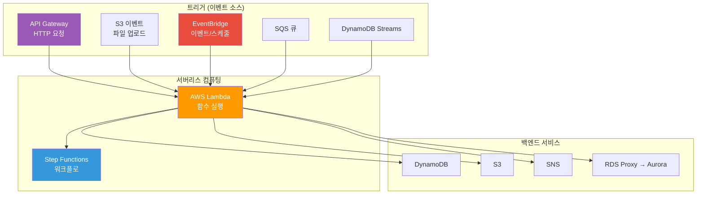
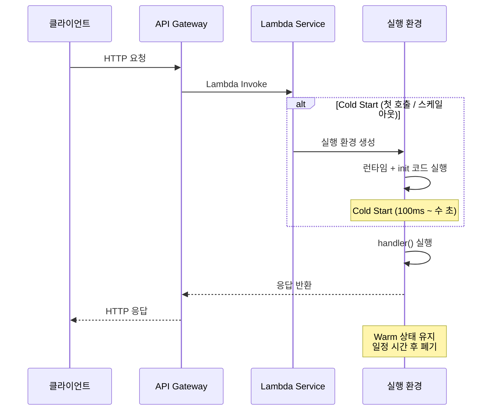
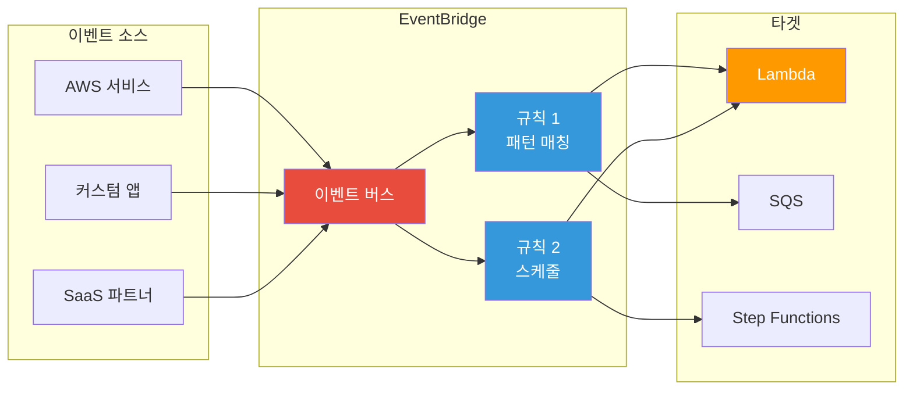
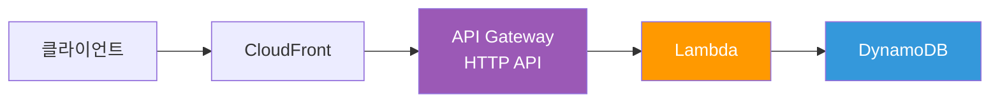
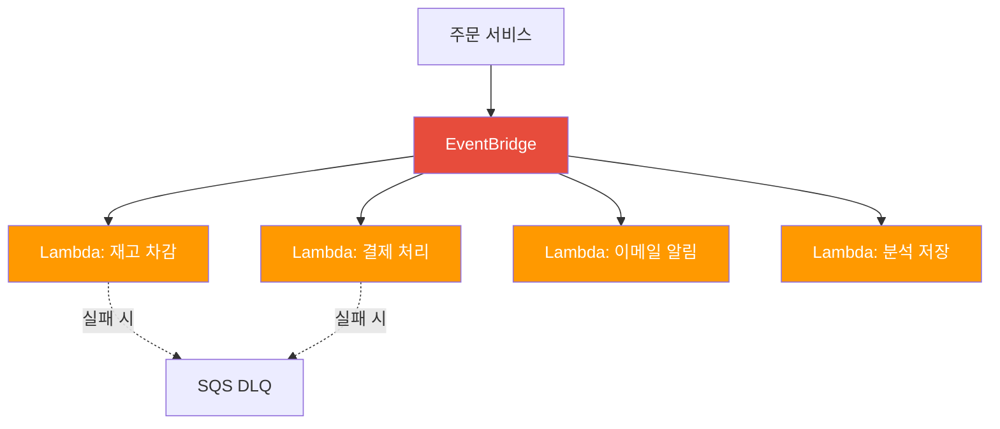

# Lambda / API Gateway / EventBridge

> [이전 강의](./09-container-services)에서 ECS, EKS, Fargate로 컨테이너를 운영하는 방법을 배웠어요. 이제 **서버 자체를 신경 쓰지 않는** 서버리스(Serverless) 세계로 넘어가 볼게요. "서버가 없다"가 아니라 "서버를 내가 관리하지 않는다"는 뜻이에요.

---

## 🎯 이걸 왜 알아야 하나?

```
서버리스가 필요한 순간:
• "API 하나 만드는데 EC2부터 띄워야 하나요?"          → Lambda + API Gateway
• "S3에 이미지 올리면 자동으로 썸네일 만들고 싶어요"   → S3 이벤트 → Lambda
• "매일 새벽 3시에 DB 정리 스크립트 돌려야 해요"       → EventBridge 스케줄러 → Lambda
• "트래픽이 0일 때도 서버 비용이 나와요"               → Lambda는 호출한 만큼만 과금
• "주문 이벤트가 들어오면 여러 시스템에 알려야 해요"    → EventBridge 이벤트 버스
• "마이크로서비스 워크플로를 순서대로 실행해야 해요"    → Step Functions
• 면접: "Lambda cold start 해결법은?"                → SnapStart / Provisioned Concurrency
```

[컨테이너 서비스](./09-container-services)는 "내가 컨테이너를 띄우고 AWS가 서버를 관리"했다면, 서버리스는 "내가 코드만 올리고 AWS가 전부 관리"해요. 둘 다 장단점이 있으니, 상황에 맞게 선택하는 눈이 중요해요.

---

## 🧠 핵심 개념 (비유 + 다이어그램)

### 비유: 자가용 vs 택시 vs 우버

서버 운영 방식을 교통수단에 비유해볼게요.

| 교통수단 | AWS 서비스 | 특징 |
|----------|-----------|------|
| 자가용 (EC2) | EC2 직접 운영 | 차를 사고, 보험 들고, 정비도 직접. 항상 주차비 나감 |
| 택시 (ECS/EKS) | 컨테이너 서비스 | 운전은 안 해도 되지만 택시비(서버)는 계속 나감 |
| 우버 (Lambda) | 서버리스 | 탈 때만 비용 발생. 기다릴 때 비용 0원 |

우버가 항상 최선은 아니에요. **하루 종일 돌아다니면** 자가용이 싸고, **잠깐만 이동하면** 우버가 싸죠. Lambda도 마찬가지예요.

### 비유: 자판기 = Lambda

* **자판기(Lambda 함수)** = 동전(이벤트)을 넣으면, 정해진 음료(결과)가 나와요
* **동전 투입구(트리거)** = S3, API Gateway, EventBridge 등 다양한 입력
* **음료 종류(런타임)** = Python, Node.js, Go, Java, Container Image
* **자판기 사이즈(메모리)** = 128MB ~ 10GB, 메모리가 클수록 CPU도 비례
* **최대 대기 시간(타임아웃)** = 최대 15분. 그 안에 안 끝나면 강제 종료
* **cold start** = 자판기 전원이 꺼져 있다가 첫 손님이 오면 부팅하느라 살짝 느림

### 서버리스 전체 아키텍처



### Lambda 실행 모델



### EventBridge 이벤트 흐름



---

## 🔍 상세 설명

### 1. Lambda 기초

Lambda는 **이벤트가 발생할 때만** 코드를 실행하는 서비스예요. 서버 프로비저닝, 패치, 스케일링 전부 AWS가 해요.

#### 핸들러 구조 (Python 예시)

```python
import json, boto3, os

# === init 코드: cold start 때 한 번만 실행 (핸들러 밖) ===
dynamodb = boto3.resource('dynamodb')
table = dynamodb.Table(os.environ['TABLE_NAME'])

def lambda_handler(event, context):
    """
    event: 트리거가 보내는 데이터 (JSON)
    context: 런타임 정보 (함수명, 메모리, 남은 시간 등)
    """
    body = json.loads(event.get('body', '{}'))
    table.put_item(Item={'user_id': body['user_id'], 'name': body['name']})

    return {
        'statusCode': 200,
        'headers': {'Content-Type': 'application/json'},
        'body': json.dumps({'message': '저장 완료'})
    }
```

> **핵심**: `lambda_handler` 밖의 init 코드는 cold start 때 한 번만 실행돼요. DB 연결, SDK 초기화는 반드시 핸들러 밖에 두세요.

#### Lambda 함수 생성 (CLI)

```bash
# === Lambda 실행 역할 생성 (IAM 역할 — 01-iam 참고) ===
aws iam create-role \
  --role-name my-lambda-role \
  --assume-role-policy-document '{
    "Version": "2012-10-17",
    "Statement": [{
      "Effect": "Allow",
      "Principal": {"Service": "lambda.amazonaws.com"},
      "Action": "sts:AssumeRole"
    }]
  }'
# → "Arn": "arn:aws:iam::123456789012:role/my-lambda-role"

# === 기본 로그 권한 연결 ===
aws iam attach-role-policy \
  --role-name my-lambda-role \
  --policy-arn arn:aws:iam::aws:policy/service-role/AWSLambdaBasicExecutionRole
```

```bash
# === Lambda 함수 생성 ===
zip function.zip lambda_function.py

aws lambda create-function \
  --function-name my-order-processor \
  --runtime python3.12 \
  --role arn:aws:iam::123456789012:role/my-lambda-role \
  --handler lambda_function.lambda_handler \
  --zip-file fileb://function.zip \
  --timeout 30 \
  --memory-size 256 \
  --environment "Variables={TABLE_NAME=orders-table,ENV=production}"

# 예상 출력:
# {
#     "FunctionName": "my-order-processor",
#     "Runtime": "python3.12",
#     "Timeout": 30,
#     "MemorySize": 256,
#     "State": "Active"
# }
```

#### 런타임과 메모리

| 런타임 | Cold Start | 적합한 상황 |
|--------|-----------|------------|
| Python 3.12 | ~200ms | 스크립트, 데이터 처리 |
| Node.js 20.x | ~200ms | API, 웹 백엔드 |
| Go | ~100ms | 고성능, 대량 처리 |
| Java 21 | ~2-5초 | 엔터프라이즈 (SnapStart 필수) |
| Container Image | 가변적 | ML 모델, 기존 컨테이너 |

Lambda는 **메모리를 늘리면 CPU도 비례해서 커져요**. 1,769MB에서 1 vCPU, 10,240MB에서 6 vCPU. 메모리를 2배로 올리면 실행 시간이 절반이 되는 경우가 많아서, 비용이 같거나 오히려 줄어들 수 있어요.

#### Lambda Layer

```bash
# === 공통 라이브러리를 Layer로 패키징 ===
mkdir -p python && pip install requests -t python/
zip -r my-layer.zip python/

aws lambda publish-layer-version \
  --layer-name my-common-libs \
  --zip-file fileb://my-layer.zip \
  --compatible-runtimes python3.12
# → "LayerVersionArn": "arn:aws:lambda:...:layer:my-common-libs:1"

# === 함수에 Layer 연결 ===
aws lambda update-function-configuration \
  --function-name my-order-processor \
  --layers arn:aws:lambda:ap-northeast-2:123456789012:layer:my-common-libs:1
```

#### Cold Start 최적화

| 방법 | Cold Start 감소 | 비용 | 적합한 상황 |
|------|----------------|------|------------|
| init 코드 최적화 | 약간 | 무료 | 모든 함수 (기본) |
| 메모리 증가 | 약간 | 약간 증가 | CPU 바운드 초기화 |
| Provisioned Concurrency | 완전 제거 | 상시 비용 | API, 지연 민감 서비스 |
| SnapStart (Java) | 90%+ 감소 | 무료 | Java/Spring 함수 |

```bash
# === Provisioned Concurrency (Warm 환경 N개 상시 유지) ===
aws lambda put-provisioned-concurrency-config \
  --function-name my-order-processor \
  --qualifier prod \
  --provisioned-concurrent-executions 10
# → "Status": "IN_PROGRESS"

# === SnapStart (Java 전용) ===
aws lambda update-function-configuration \
  --function-name my-java-function \
  --snap-start ApplyOn=PublishedVersions

aws lambda publish-version --function-name my-java-function
# → SnapStart: { "OptimizationStatus": "On" }
```

#### /tmp 스토리지

Lambda에는 `/tmp`에 최대 **10GB** 임시 스토리지가 있어요. 기본 512MB.

```bash
aws lambda update-function-configuration \
  --function-name my-image-processor \
  --ephemeral-storage Size=2048
```

> **주의**: `/tmp` 데이터는 Warm 상태에서 남아 있을 수 있어요. 민감 데이터는 처리 후 삭제하세요!

### 2. Lambda 트리거

Lambda의 강력함은 **다양한 이벤트 소스**와 연결할 수 있다는 데 있어요. [S3 이벤트](./04-storage), [DynamoDB Streams](./05-database) 등 앞에서 배운 서비스들이 트리거가 돼요.

| 트리거 | 호출 방식 | 주요 사용 사례 |
|--------|----------|--------------|
| API Gateway | 동기 (Invoke) | REST/HTTP API |
| S3 | 비동기 (Event) | 파일 업로드 처리 |
| SQS | Poll 기반 (Event Source Mapping) | 메시지 큐 처리 |
| EventBridge | 비동기 | 이벤트 기반 처리, 스케줄 |
| DynamoDB Streams | Poll 기반 | 데이터 변경 감지 |
| ALB | 동기 | HTTP 요청 |
| Kinesis | Poll 기반 | 실시간 스트리밍 |

```bash
# === S3 트리거 추가 (이미지 업로드 시 Lambda 실행) ===
aws lambda add-permission \
  --function-name my-image-processor \
  --statement-id s3-trigger \
  --action lambda:InvokeFunction \
  --principal s3.amazonaws.com \
  --source-arn arn:aws:s3:::my-upload-bucket

aws s3api put-bucket-notification-configuration \
  --bucket my-upload-bucket \
  --notification-configuration '{
    "LambdaFunctionConfigurations": [{
      "LambdaFunctionArn": "arn:aws:lambda:ap-northeast-2:123456789012:function:my-image-processor",
      "Events": ["s3:ObjectCreated:*"],
      "Filter": {"Key": {"FilterRules": [
        {"Name": "prefix", "Value": "uploads/"},
        {"Name": "suffix", "Value": ".jpg"}
      ]}}
    }]
  }'
# → uploads/ 폴더에 .jpg 파일 업로드 시 Lambda 자동 실행!
```

```bash
# === SQS → Lambda 이벤트 소스 매핑 ===
aws lambda create-event-source-mapping \
  --function-name my-order-processor \
  --event-source-arn arn:aws:sqs:ap-northeast-2:123456789012:order-queue \
  --batch-size 10 \
  --maximum-batching-window-in-seconds 5
# → "State": "Creating"
```

### 3. API Gateway

API Gateway는 Lambda 앞에 놓는 **HTTP 관문**이에요. 인증, 스로틀링, CORS, 스테이지 관리를 해줘요. [네트워킹 API 관리](../02-networking/13-api-gateway)에서 개념을 배웠는데, 여기서는 AWS 구현을 다룰게요.

#### REST API vs HTTP API

| 비교 항목 | REST API | HTTP API |
|-----------|----------|----------|
| 가격 | $3.50/100만 요청 | $1.00/100만 요청 (70% 저렴) |
| 지연시간 | ~30ms | ~10ms |
| 인증 | Cognito, Lambda Authorizer, IAM | + JWT 네이티브 지원 |
| 캐싱/사용량 계획 | 지원 | 미지원 |
| 추천 | 기능이 많이 필요할 때 | **대부분의 경우 이걸 쓰세요** |

#### HTTP API 생성 (CLI)

```bash
# === HTTP API + Lambda 통합 한 번에 생성 ===
aws apigatewayv2 create-api \
  --name my-order-api \
  --protocol-type HTTP \
  --target arn:aws:lambda:ap-northeast-2:123456789012:function:my-order-processor

# 예상 출력:
# {
#     "ApiId": "abc123def4",
#     "ApiEndpoint": "https://abc123def4.execute-api.ap-northeast-2.amazonaws.com",
#     "ProtocolType": "HTTP"
# }
```

```bash
# === Lambda에 API Gateway 호출 권한 부여 ===
aws lambda add-permission \
  --function-name my-order-processor \
  --statement-id apigateway-invoke \
  --action lambda:InvokeFunction \
  --principal apigateway.amazonaws.com \
  --source-arn "arn:aws:execute-api:ap-northeast-2:123456789012:abc123def4/*"
```

```bash
# === 라우트 + 통합 수동 설정 (세밀한 제어) ===
aws apigatewayv2 create-integration \
  --api-id abc123def4 \
  --integration-type AWS_PROXY \
  --integration-uri arn:aws:lambda:ap-northeast-2:123456789012:function:my-order-processor \
  --payload-format-version "2.0"
# → "IntegrationId": "intg123"

aws apigatewayv2 create-route \
  --api-id abc123def4 \
  --route-key "POST /orders" \
  --target "integrations/intg123"

aws apigatewayv2 create-stage \
  --api-id abc123def4 \
  --stage-name prod \
  --auto-deploy
# → https://abc123def4.execute-api.ap-northeast-2.amazonaws.com/prod
```

#### CORS + 인증

```bash
# === CORS 설정 ===
aws apigatewayv2 update-api \
  --api-id abc123def4 \
  --cors-configuration '{
    "AllowOrigins": ["https://myapp.example.com"],
    "AllowMethods": ["GET", "POST", "PUT", "DELETE"],
    "AllowHeaders": ["Content-Type", "Authorization"],
    "MaxAge": 86400
  }'
```

```bash
# === JWT Authorizer (Cognito) — HTTP API ===
aws apigatewayv2 create-authorizer \
  --api-id abc123def4 \
  --authorizer-type JWT \
  --identity-source '$request.header.Authorization' \
  --name cognito-auth \
  --jwt-configuration '{
    "Audience": ["my-app-client-id"],
    "Issuer": "https://cognito-idp.ap-northeast-2.amazonaws.com/ap-northeast-2_AbCdEfG"
  }'
# → "AuthorizerId": "auth789"

aws apigatewayv2 update-route \
  --api-id abc123def4 \
  --route-id route456 \
  --authorization-type JWT \
  --authorizer-id auth789
```

### 4. EventBridge

EventBridge는 AWS의 **이벤트 라우터**예요. 택배 분류 센터처럼, 이벤트를 받아서 규칙에 따라 목적지별로 보내는 거예요.

#### 이벤트 버스 + 규칙 + 패턴 매칭

```bash
# === 커스텀 이벤트 버스 생성 ===
aws events create-event-bus --name my-app-events
# → "EventBusArn": "arn:aws:events:ap-northeast-2:123456789012:event-bus/my-app-events"

# === 이벤트 규칙 (패턴 매칭 — 10만원 이상 주문 완료) ===
aws events put-rule \
  --name order-completed-rule \
  --event-bus-name my-app-events \
  --event-pattern '{
    "source": ["my-app.orders"],
    "detail-type": ["OrderCompleted"],
    "detail": { "amount": [{"numeric": [">=", 100000]}] }
  }' \
  --state ENABLED
# → "RuleArn": "arn:aws:events:...:rule/my-app-events/order-completed-rule"
```

> **패턴 매칭**: `numeric`, `prefix`, `suffix`, `anything-but`, `exists` 등 다양한 필터를 지원해요.

```bash
# === 규칙에 타겟(Lambda) 연결 ===
aws events put-targets \
  --rule order-completed-rule \
  --event-bus-name my-app-events \
  --targets '[{
    "Id": "notify-lambda",
    "Arn": "arn:aws:lambda:ap-northeast-2:123456789012:function:order-notification",
    "RetryPolicy": { "MaximumRetryAttempts": 3, "MaximumEventAgeInSeconds": 3600 }
  }]'
# → "FailedEntryCount": 0
```

#### 스케줄러 (cron)

```bash
# === 스케줄 규칙 (매일 새벽 3시 KST = 18:00 UTC) ===
aws events put-rule \
  --name daily-cleanup \
  --schedule-expression "cron(0 18 * * ? *)" \
  --state ENABLED

# === EventBridge Scheduler (타임존 지원 — 권장) ===
aws scheduler create-schedule \
  --name monthly-report \
  --schedule-expression "cron(0 9 1 * ? *)" \
  --schedule-expression-timezone "Asia/Seoul" \
  --flexible-time-window '{"Mode": "OFF"}' \
  --target '{
    "Arn": "arn:aws:lambda:ap-northeast-2:123456789012:function:generate-report",
    "RoleArn": "arn:aws:iam::123456789012:role/scheduler-role"
  }'
```

> **Scheduler vs cron 규칙**: Scheduler는 **타임존 지원**, 1회성 스케줄, FlexibleTimeWindow를 지원해요. 새로 만든다면 Scheduler를 쓰세요.

#### Archive & Replay

이벤트를 보관했다가 나중에 재생할 수 있어요. 장애 복구, 테스트에 유용해요.

```bash
# === 이벤트 아카이브 생성 (90일 보관) ===
aws events create-archive \
  --archive-name order-events-archive \
  --event-source-arn arn:aws:events:ap-northeast-2:123456789012:event-bus/my-app-events \
  --event-pattern '{"source": ["my-app.orders"]}' \
  --retention-days 90

# === 특정 시간대 이벤트 재생 ===
aws events start-replay \
  --replay-name replay-20260313 \
  --event-source-arn arn:aws:events:ap-northeast-2:123456789012:event-bus/my-app-events \
  --event-start-time "2026-03-12T00:00:00Z" \
  --event-end-time "2026-03-12T23:59:59Z" \
  --destination '{"Arn": "arn:aws:events:ap-northeast-2:123456789012:event-bus/my-app-events"}'
# → "State": "STARTING"
```

#### Schema Registry

EventBridge가 지나가는 이벤트 구조를 자동 감지해서 스키마를 만들어줘요.

```bash
aws schemas list-schemas --registry-name discovered-schemas
# → "SchemaName": "my-app.orders@OrderCompleted"
```

### 5. Step Functions

여러 Lambda를 **순서대로, 병렬로, 조건 분기로** 실행해야 할 때 Step Functions를 써요.

#### Standard vs Express

| 비교 항목 | Standard | Express |
|-----------|----------|---------|
| 최대 실행 시간 | 1년 | 5분 |
| 가격 모델 | 상태 전환 당 과금 | 실행 횟수 + 시간 |
| 실행 보장 | Exactly-once | At-least-once |
| 적합한 상황 | 장시간 워크플로, 결제 | 대량 처리, 실시간 |

#### ASL (Amazon States Language) 예시

```bash
aws stepfunctions create-state-machine \
  --name order-processing-workflow \
  --role-arn arn:aws:iam::123456789012:role/sf-role \
  --definition '{
    "Comment": "주문 처리 워크플로",
    "StartAt": "ValidateOrder",
    "States": {
      "ValidateOrder": {
        "Type": "Task",
        "Resource": "arn:aws:lambda:...:function:validate-order",
        "Next": "CheckInventory",
        "Retry": [{"ErrorEquals": ["ServiceException"], "IntervalSeconds": 2, "MaxAttempts": 3, "BackoffRate": 2.0}],
        "Catch": [{"ErrorEquals": ["States.ALL"], "Next": "HandleError"}]
      },
      "CheckInventory": {
        "Type": "Task",
        "Resource": "arn:aws:lambda:...:function:check-inventory",
        "Next": "ProcessPayment"
      },
      "ProcessPayment": {
        "Type": "Task",
        "Resource": "arn:aws:lambda:...:function:process-payment",
        "Next": "ParallelNotify"
      },
      "ParallelNotify": {
        "Type": "Parallel",
        "End": true,
        "Branches": [
          {"StartAt": "SendEmail", "States": {"SendEmail": {"Type": "Task", "Resource": "arn:aws:lambda:...:send-email", "End": true}}},
          {"StartAt": "SendSlack", "States": {"SendSlack": {"Type": "Task", "Resource": "arn:aws:lambda:...:send-slack", "End": true}}}
        ]
      },
      "HandleError": {
        "Type": "Task",
        "Resource": "arn:aws:lambda:...:function:handle-error",
        "End": true
      }
    }
  }'
# → "stateMachineArn": "arn:aws:states:...:stateMachine:order-processing-workflow"
```

> **에러 처리**: `Retry`는 일시적 에러를 자동 재시도, `Catch`는 실패 시 대체 경로로 보내요.

### 6. 서버리스 아키텍처 패턴

#### 패턴 1: API + Lambda + DynamoDB



#### 패턴 2: 이벤트 드리븐 Fan-out



#### 비용 계산 예시

```
시나리오: 월 100만 건 API, 평균 200ms, 메모리 256MB

[Lambda]  요청: $0.20 + 컴퓨팅: $0.83 = $1.03/월
[API GW]  HTTP API: $1.00/월
[합계]    $2.03/월

[비교: EC2 t3.small 24/7]
→ $0.026 × 730시간 = $18.98/월

트래픽 적으면 서버리스가 압도적 저렴!
월 1000만 건 이상이면 EC2가 더 저렴해질 수 있어요.
```

#### Lambda VPC 접근

[VPC](./02-vpc)의 프라이빗 서브넷 RDS에 접근하려면 Lambda를 VPC에 넣어야 해요.

```bash
aws lambda update-function-configuration \
  --function-name my-order-processor \
  --vpc-config '{"SubnetIds": ["subnet-0abc1111", "subnet-0abc2222"], "SecurityGroupIds": ["sg-0lambda1234"]}'
```

> **주의**: VPC 안의 Lambda가 인터넷 접근하려면 **NAT Gateway** 필요. AWS 서비스만 쓸 거면 **VPC Endpoint** 사용하세요.

---

## 💻 실습 예제

### 실습 1: API Gateway + Lambda + DynamoDB CRUD API

**목표**: 주문 생성/조회 API를 서버리스로 만들어봐요.

```bash
# === 1단계: DynamoDB 테이블 생성 ===
aws dynamodb create-table \
  --table-name orders \
  --attribute-definitions AttributeName=order_id,AttributeType=S \
  --key-schema AttributeName=order_id,KeyType=HASH \
  --billing-mode PAY_PER_REQUEST
```

```python
# === 2단계: Lambda 코드 (order_handler.py) ===
import json, boto3, uuid
from datetime import datetime

dynamodb = boto3.resource('dynamodb')
table = dynamodb.Table('orders')

def lambda_handler(event, context):
    method = event.get('requestContext', {}).get('http', {}).get('method')
    path = event.get('rawPath', '')

    if method == 'POST' and path == '/orders':
        body = json.loads(event.get('body', '{}'))
        order = {
            'order_id': str(uuid.uuid4()),
            'customer_name': body.get('customer_name'),
            'items': body.get('items', []),
            'total_amount': body.get('total_amount', 0),
            'status': 'PENDING',
            'created_at': datetime.utcnow().isoformat()
        }
        table.put_item(Item=order)
        return {'statusCode': 201, 'body': json.dumps(order, default=str)}

    elif method == 'GET' and '/orders/' in path:
        order_id = path.split('/')[-1]
        item = table.get_item(Key={'order_id': order_id}).get('Item')
        if not item:
            return {'statusCode': 404, 'body': json.dumps({'error': '주문 없음'})}
        return {'statusCode': 200, 'body': json.dumps(item, default=str)}

    return {'statusCode': 404, 'body': json.dumps({'error': '경로 없음'})}
```

```bash
# === 3단계: 배포 + HTTP API 생성 ===
zip order_handler.zip order_handler.py
aws lambda create-function \
  --function-name order-api --runtime python3.12 \
  --role arn:aws:iam::123456789012:role/my-lambda-role \
  --handler order_handler.lambda_handler \
  --zip-file fileb://order_handler.zip --timeout 10 --memory-size 256

aws apigatewayv2 create-api --name order-api --protocol-type HTTP \
  --target arn:aws:lambda:ap-northeast-2:123456789012:function:order-api
# → "ApiEndpoint": "https://xyz789.execute-api.ap-northeast-2.amazonaws.com"

# === 4단계: 테스트 ===
curl -X POST https://xyz789.execute-api.ap-northeast-2.amazonaws.com/orders \
  -H "Content-Type: application/json" \
  -d '{"customer_name": "홍길동", "items": ["노트북"], "total_amount": 1500000}'
# → {"order_id": "a1b2c3d4-...", "status": "PENDING", ...}
```

### 실습 2: S3 업로드 → Lambda 자동 처리

**목표**: S3에 이미지를 올리면 메타데이터를 자동으로 DynamoDB에 저장해봐요.

```python
# === image_processor.py ===
import json, boto3, urllib.parse
from datetime import datetime

s3 = boto3.client('s3')
table = boto3.resource('dynamodb').Table('image-metadata')

def lambda_handler(event, context):
    for record in event['Records']:
        bucket = record['s3']['bucket']['name']
        key = urllib.parse.unquote_plus(record['s3']['object']['key'])
        size = record['s3']['object']['size']

        head = s3.head_object(Bucket=bucket, Key=key)
        table.put_item(Item={
            'image_key': key, 'bucket': bucket,
            'size_bytes': size, 'content_type': head.get('ContentType'),
            'uploaded_at': datetime.utcnow().isoformat()
        })
        print(f"처리 완료: s3://{bucket}/{key} ({size} bytes)")

    return {'processed': len(event['Records'])}
```

```bash
# === 배포 + S3 트리거 연결 ===
zip image_processor.zip image_processor.py
aws lambda create-function --function-name image-processor --runtime python3.12 \
  --role arn:aws:iam::123456789012:role/my-lambda-role \
  --handler image_processor.lambda_handler --timeout 30 --memory-size 512

aws lambda add-permission --function-name image-processor --statement-id s3-invoke \
  --action lambda:InvokeFunction --principal s3.amazonaws.com \
  --source-arn arn:aws:s3:::my-image-bucket

aws s3api put-bucket-notification-configuration --bucket my-image-bucket \
  --notification-configuration '{
    "LambdaFunctionConfigurations": [{
      "LambdaFunctionArn": "arn:aws:lambda:ap-northeast-2:123456789012:function:image-processor",
      "Events": ["s3:ObjectCreated:*"],
      "Filter": {"Key": {"FilterRules": [{"Name": "prefix", "Value": "uploads/"}]}}
    }]}'

# === 테스트 ===
aws s3 cp sample.jpg s3://my-image-bucket/uploads/sample.jpg
aws logs tail /aws/lambda/image-processor --since 1m
# → "처리 완료: s3://my-image-bucket/uploads/sample.jpg (234567 bytes)"
```

### 실습 3: EventBridge → Step Functions 주문 워크플로

**목표**: 주문 이벤트 → EventBridge → Step Functions → Lambda 체인으로 처리해봐요.

```bash
# === 1단계: 커스텀 이벤트 전송 ===
aws events put-events --entries '[{
  "Source": "my-app.orders", "DetailType": "OrderCreated",
  "Detail": "{\"order_id\": \"ORD-001\", \"customer\": \"홍길동\", \"amount\": 250000}",
  "EventBusName": "my-app-events"
}]'
# → "FailedEntryCount": 0

# === 2단계: EventBridge → Step Functions 연결 ===
aws events put-rule --name order-workflow-trigger --event-bus-name my-app-events \
  --event-pattern '{"source": ["my-app.orders"], "detail-type": ["OrderCreated"]}' \
  --state ENABLED

aws events put-targets --rule order-workflow-trigger --event-bus-name my-app-events \
  --targets '[{
    "Id": "sf-target",
    "Arn": "arn:aws:states:ap-northeast-2:123456789012:stateMachine:order-processing-workflow",
    "RoleArn": "arn:aws:iam::123456789012:role/eventbridge-sf-role"
  }]'

# === 3단계: 실행 확인 ===
aws stepfunctions list-executions \
  --state-machine-arn arn:aws:states:ap-northeast-2:123456789012:stateMachine:order-processing-workflow \
  --status-filter RUNNING
# → "status": "RUNNING", "name": "evt-12345678"
```

---

## 🏢 실무에서는?

### 시나리오 1: 이커머스 주문 처리 시스템

```
문제: 주문 → 재고 확인 → 결제 → 배송 → 알림을 순서대로 처리.
      실패 시 보상 트랜잭션(취소) 필요.

해결:
1. API Gateway → Lambda: 주문 접수
2. Lambda → EventBridge: "OrderCreated" 이벤트
3. EventBridge → Step Functions 워크플로 시작
4. Step Functions: Validate → Inventory → Payment → Ship (Retry/Catch)
5. 완료 시 EventBridge "OrderCompleted" → SNS 알림

효과: 서버 관리 0, 자동 스케일, 단계별 에러 처리, Archive로 장애 재현
```

### 시나리오 2: 이미지 처리 파이프라인 (Fan-out)

```
문제: 업로드된 이미지에 썸네일 + 텍스트 추출 + 유해 콘텐츠 감지를 동시에.

해결:
1. S3 이벤트 → Lambda → EventBridge "ImageUploaded"
2. EventBridge → 3개 Lambda 동시 실행:
   - 썸네일 생성 (Pillow + /tmp 2GB)
   - Rekognition 텍스트 추출
   - Rekognition 유해 콘텐츠 감지
3. 각 Lambda → DynamoDB 결과 저장
4. DynamoDB Streams → Lambda: 최종 상태 업데이트

주의: 메모리 3GB+, /tmp 2GB 확장, Provisioned Concurrency 고려
```

### 시나리오 3: 멀티 계정 보안 이벤트 통합

```
문제: dev/staging/prod 계정의 보안 이벤트를 중앙 모니터링.

해결:
1. 각 계정 EventBridge → Cross-Account → 보안 계정 이벤트 버스
2. 심각도별 분류:
   - HIGH → Lambda → PagerDuty
   - MEDIUM → SQS → 보안팀 대시보드
   - 전체 → S3 Archive (감사 로그)
```

---

## ⚠️ 자주 하는 실수

### 1. Lambda 핸들러 안에서 SDK 클라이언트를 매번 초기화

```python
# ❌ 매 호출마다 새로 만들어서 느려요
def lambda_handler(event, context):
    dynamodb = boto3.resource('dynamodb')   # 매번 초기화!
    table = dynamodb.Table('orders')
    ...

# ✅ 핸들러 밖에서 한 번만 (Warm 상태에서 재사용)
dynamodb = boto3.resource('dynamodb')
table = dynamodb.Table('orders')
def lambda_handler(event, context):
    table.put_item(Item={...})
```

### 2. Lambda 타임아웃 > API Gateway 타임아웃

```
❌ Lambda: 60초, API Gateway HTTP API: 30초 (최대)
   → 30초 후 504 반환, Lambda는 계속 실행 (비용 낭비!)

✅ Lambda 타임아웃은 API Gateway보다 짧게 (25초 이하)
   긴 작업은 비동기 패턴 (SQS → Lambda)
```

### 3. EventBridge 이벤트에 민감 정보 포함

```json
// ❌ 이벤트 로그 + Archive에 비밀번호가 남아요!
{"detail": {"user": "홍길동", "password": "myp@ss123"}}

// ✅ ID만 넣고, Lambda에서 DB 조회
{"detail": {"user_id": "USR-001", "order_id": "ORD-001"}}
```

### 4. VPC에 넣고 NAT Gateway를 안 만듦

```
❌ Lambda → VPC 프라이빗 서브넷 → 외부 API 호출 실패!

✅ 해결 (비용 순):
   1. VPC 불필요하면 빼기 (대부분 VPC 없이도 됨)
   2. AWS 서비스만 → VPC Endpoint
   3. 외부 필요 → NAT Gateway (월 ~$35+)
```

### 5. Step Functions에서 Lambda 응답 누락

```python
# ❌ return 없으면 다음 단계의 input이 null!
def lambda_handler(event, context):
    validate(event)
    print("완료")  # return이 없음

# ✅ 반드시 결과를 return
def lambda_handler(event, context):
    return {"order_id": event["order_id"], "is_valid": True}
```

---

## 📝 정리

### 서버리스 핵심 서비스 요약

| 서비스 | 역할 | 핵심 특징 | 비용 모델 |
|--------|------|----------|----------|
| **Lambda** | 함수 실행 | 이벤트 기반, 자동 스케일, 최대 15분 | 요청 수 + 실행 시간 |
| **API Gateway** | HTTP 관문 | 인증, 스로틀링, CORS | 요청 수 (HTTP API 70% 저렴) |
| **EventBridge** | 이벤트 라우터 | 패턴 매칭, 스케줄, Archive/Replay | 이벤트 수 |
| **Step Functions** | 워크플로 | 시각화, Retry/Catch, Parallel | 상태 전환 수 |

### 서버리스 vs 컨테이너 선택 기준

| 상황 | Lambda | ECS/EKS |
|------|--------|---------|
| 트래픽 | 간헐적, 불규칙 | 안정적, 지속적 |
| 실행 시간 | < 15분 | 제한 없음 |
| Cold start | 허용 가능 | 허용 불가 |
| 비용 (저트래픽) | 매우 저렴 | 최소 비용 있음 |
| 비용 (고트래픽) | 비쌀 수 있음 | 상대적 저렴 |

### 체크리스트

```
Lambda 배포 전:
□ IAM Role에 최소 권한만? (01-iam)
□ init 코드에서 SDK 초기화?
□ 메모리 최적화 (Power Tuning)?
□ 타임아웃 < 트리거 타임아웃?
□ 환경 변수에 Secrets Manager ARN?
□ VPC 정말 필요한가?
□ DLQ 설정했나?

API Gateway:
□ HTTP API vs REST API 선택 근거?
□ CORS 설정?
□ 스로틀링 한도?
□ Authorizer 연결?

EventBridge:
□ 이벤트 패턴 detail까지 필터?
□ 타겟에 DLQ?
□ 민감 정보 없는가?
□ Archive 설정?
```

---

## 🔗 다음 강의 → [11-messaging](./11-messaging)

Lambda가 "코드를 실행"하는 서비스라면, 다음에 배울 **SQS, SNS, Kinesis, MSK**는 서비스 사이에서 "메시지를 전달"하는 서비스예요. 서버리스 아키텍처에서 서비스 간 결합도를 낮추고, 비동기 처리를 가능하게 하는 핵심 구성 요소를 알아볼게요.
