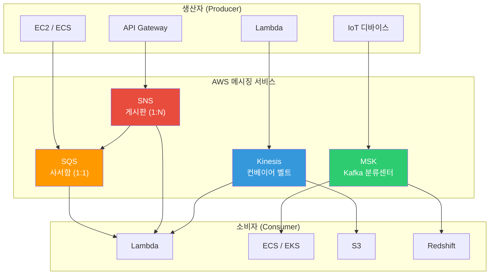
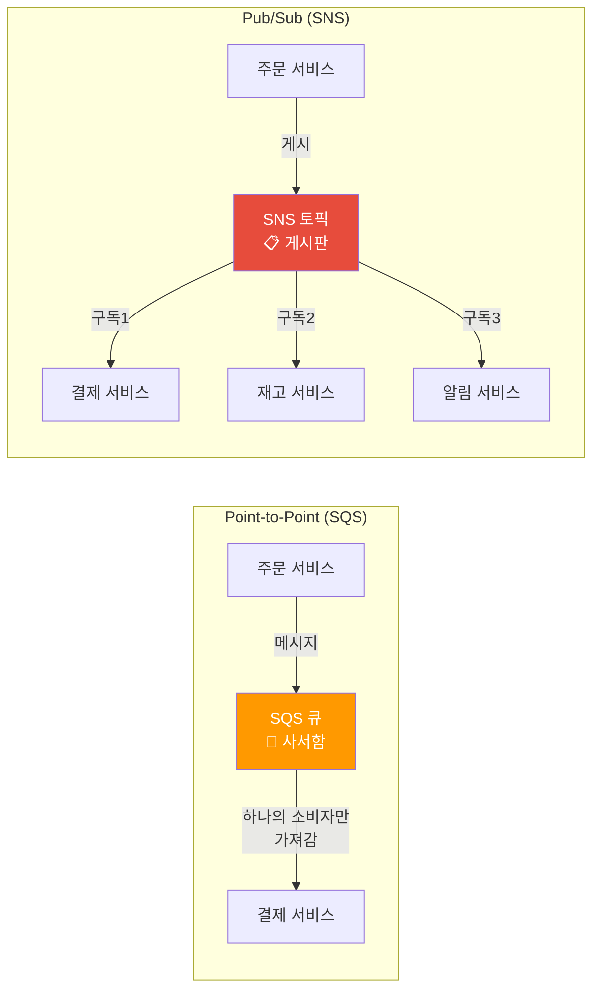
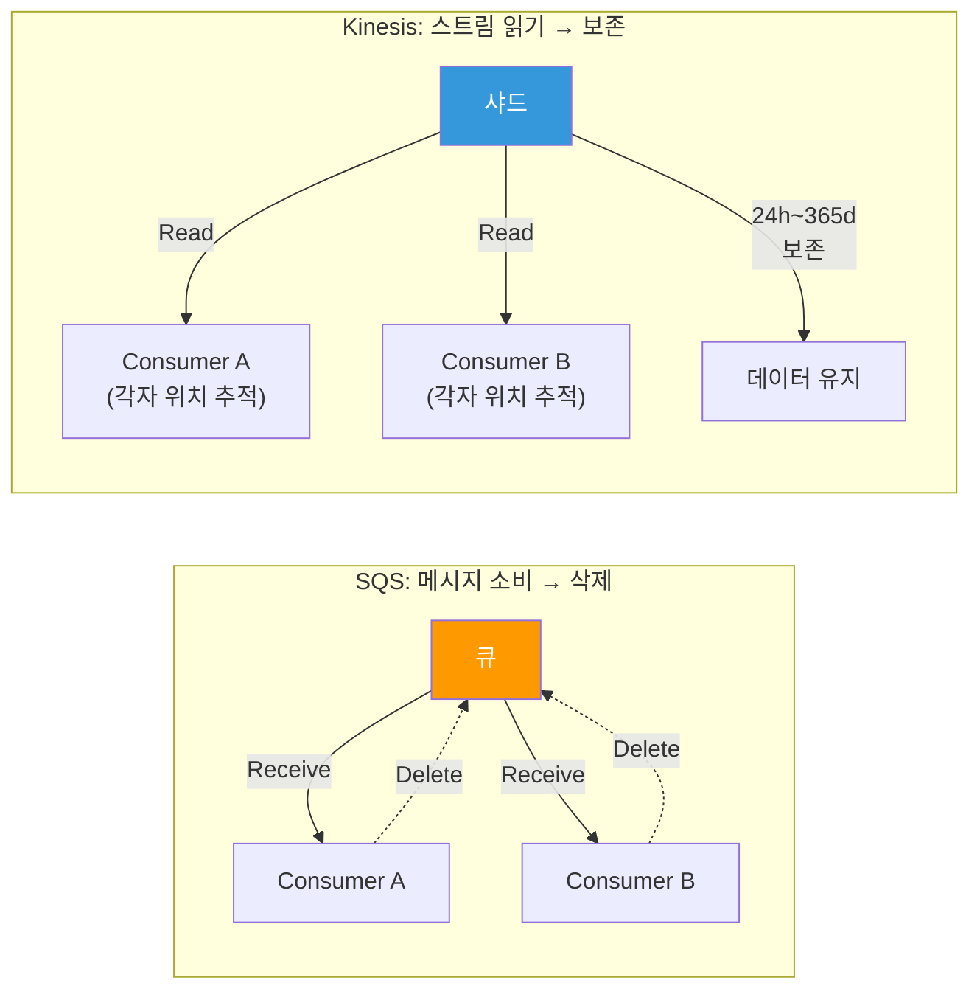
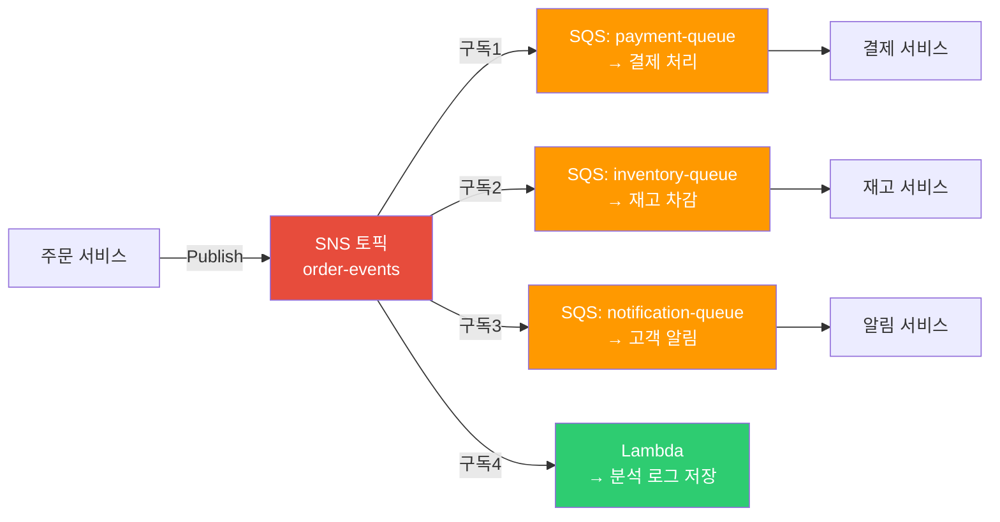
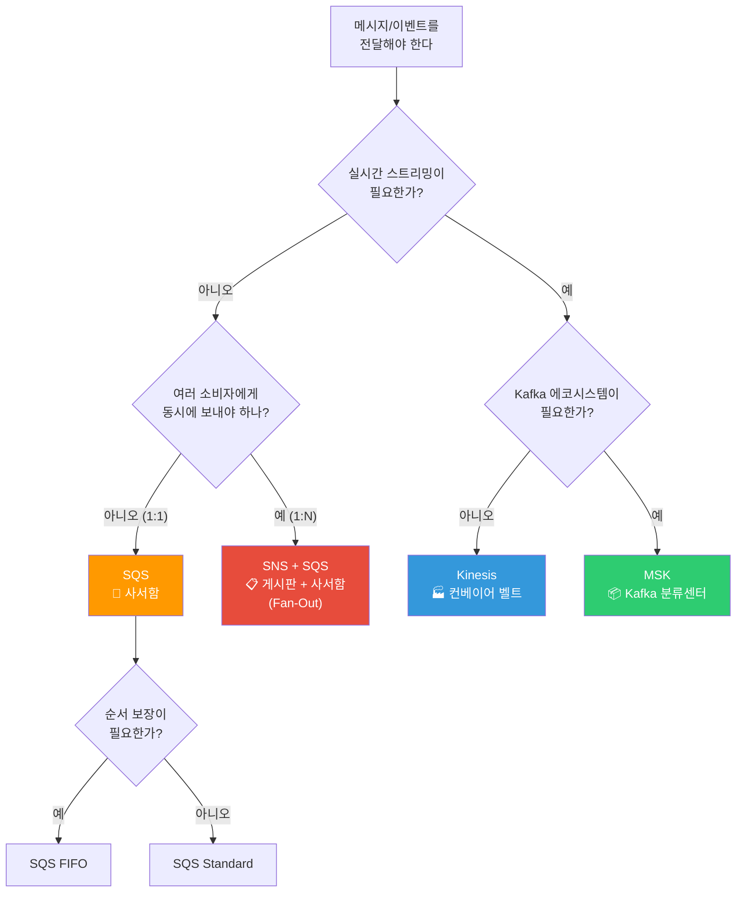

# SQS / SNS / Kinesis / MSK

> [이전 강의](./10-serverless)에서 Lambda, API Gateway 같은 서버리스 서비스를 배웠어요. 이제 서비스와 서비스 사이를 **느슨하게 연결**해주는 메시징 서비스를 배워볼게요. Lambda 트리거로 자주 쓰이는 SQS, SNS, Kinesis, 그리고 관리형 Kafka인 MSK까지 다뤄요.

---

## 🎯 이걸 왜 알아야 하나?

```
메시징이 필요한 순간:
• "주문 서비스가 죽으면 결제 서비스도 같이 죽어요"                → 디커플링 (SQS)
• "하나의 이벤트를 여러 서비스에 동시에 보내야 해요"              → Fan-Out (SNS → SQS)
• "초당 10만 건 로그를 실시간으로 수집해야 해요"                  → 스트리밍 (Kinesis)
• "처리 실패한 메시지가 계속 재시도돼서 장애가 번져요"            → DLQ (Dead Letter Queue)
• "Kafka를 쓰고 싶은데 운영이 너무 힘들어요"                     → MSK (관리형 Kafka)
• "주문 순서가 뒤바뀌면 안 되는데 메시지 순서가 보장이 안 돼요"   → FIFO 큐 / 파티션 키
• 면접: "SQS vs Kinesis 차이점은?"                               → 소비 모델 차이
```

---

## 🧠 핵심 개념 (비유 + 다이어그램)

### 비유: 동기 vs 비동기 통신

서비스 간 통신을 **전화**와 **우편함**에 비유해볼게요.

* **동기(Synchronous)** = 전화. 상대방이 전화를 받을 때까지 기다려야 해요. 상대가 바쁘면 나도 멈춰요.
* **비동기(Asynchronous)** = 우편함. 편지를 넣어두면 상대방이 **자기 속도에 맞춰** 꺼내 가요. 내가 기다릴 필요 없어요.

### 비유: 메시징 패턴 4가지

| 서비스 | 비유 | 핵심 특징 |
|--------|------|-----------|
| **SQS** | 우체국 **사서함** | 1:1 전달, 꺼내 가면 사라짐 (Point-to-Point) |
| **SNS** | 학교 **게시판** | 1:N 공지, 구독자 전원에게 전달 (Pub/Sub) |
| **Kinesis** | 공장 **컨베이어 벨트** | 실시간 스트리밍, 여러 소비자가 같은 데이터를 볼 수 있음 |
| **MSK** | 대형 물류 **분류 센터** | Kafka 기반, 대용량/장기보관, 파티션 병렬 처리 |

### 메시징 전체 아키텍처



### Point-to-Point vs Pub/Sub



### SQS vs Kinesis 소비 모델



---

## 🔍 상세 설명

### 1. SQS (Simple Queue Service)

SQS는 AWS에서 가장 오래된 서비스 중 하나예요 (2006년 출시). 서비스 사이에 **우편함(큐)**을 놓아서 디커플링하는 게 핵심이에요. [Lambda](./10-serverless)의 이벤트 소스로도 많이 쓰여요.

#### Standard vs FIFO

| 항목 | Standard Queue | FIFO Queue |
|------|---------------|------------|
| **처리량** | 무제한 (초당 수만~수십만) | 초당 300 TPS (배치 시 3,000) |
| **순서 보장** | 최선 노력 (best-effort) | 엄격한 순서 보장 |
| **중복 가능성** | 가끔 중복 전달 가능 | 정확히 한 번 전달 (exactly-once) |
| **큐 이름** | 아무 이름 | `.fifo` 접미사 필수 |
| **사용 사례** | 로그 처리, 이메일 발송 | 주문 처리, 금융 거래 |

#### Visibility Timeout (가시성 타임아웃)

소비자가 메시지를 가져가면 다른 소비자에게 **일시적으로 안 보이게** 숨겨요. 처리가 끝나면 삭제하고, 시간 내에 처리 못 하면 다시 보여요.

```bash
# === SQS 큐 생성 (Standard) ===
aws sqs create-queue \
  --queue-name order-processing-queue \
  --attributes '{
    "VisibilityTimeout": "60",
    "MessageRetentionPeriod": "345600",
    "ReceiveMessageWaitTimeSeconds": "20"
  }'

# 예상 출력:
# {
#     "QueueUrl": "https://sqs.ap-northeast-2.amazonaws.com/123456789012/order-processing-queue"
# }
```

```bash
# === SQS FIFO 큐 생성 ===
# FIFO 큐는 이름 끝에 반드시 .fifo를 붙여야 해요
aws sqs create-queue \
  --queue-name order-processing-queue.fifo \
  --attributes '{
    "FifoQueue": "true",
    "ContentBasedDeduplication": "true",
    "VisibilityTimeout": "60"
  }'

# 예상 출력:
# {
#     "QueueUrl": "https://sqs.ap-northeast-2.amazonaws.com/123456789012/order-processing-queue.fifo"
# }
```

#### 메시지 보내기 / 받기 / 삭제

```bash
# === 메시지 보내기 (Standard Queue) ===
aws sqs send-message \
  --queue-url https://sqs.ap-northeast-2.amazonaws.com/123456789012/order-processing-queue \
  --message-body '{"orderId":"ORD-001","item":"laptop","qty":1}' \
  --message-attributes '{
    "OrderType": {"DataType":"String","StringValue":"electronics"}
  }'

# 예상 출력:
# {
#     "MD5OfMessageBody": "a1b2c3d4e5f6...",
#     "MD5OfMessageAttributes": "f6e5d4c3b2a1...",
#     "MessageId": "12345678-1234-1234-1234-123456789012"
# }
```

```bash
# === FIFO 큐에 메시지 보내기 (MessageGroupId 필수) ===
aws sqs send-message \
  --queue-url https://sqs.ap-northeast-2.amazonaws.com/123456789012/order-processing-queue.fifo \
  --message-body '{"orderId":"ORD-002","item":"phone","qty":2}' \
  --message-group-id "user-1001" \
  --message-deduplication-id "dedup-ORD-002"

# 예상 출력:
# {
#     "MD5OfMessageBody": "b2c3d4e5f6a1...",
#     "MessageId": "abcdefgh-abcd-abcd-abcd-abcdefghijkl",
#     "SequenceNumber": "18870000000000000001"
# }
```

```bash
# === 메시지 받기 (Long Polling - 20초 대기) ===
aws sqs receive-message \
  --queue-url https://sqs.ap-northeast-2.amazonaws.com/123456789012/order-processing-queue \
  --max-number-of-messages 5 \
  --wait-time-seconds 20 \
  --attribute-names All \
  --message-attribute-names All

# 예상 출력:
# {
#     "Messages": [
#         {
#             "MessageId": "12345678-1234-1234-1234-123456789012",
#             "ReceiptHandle": "AQEBwJnK...long-string...",
#             "Body": "{\"orderId\":\"ORD-001\",\"item\":\"laptop\",\"qty\":1}",
#             "Attributes": {
#                 "SentTimestamp": "1710316800000",
#                 "ApproximateReceiveCount": "1",
#                 "ApproximateFirstReceiveTimestamp": "1710316805000"
#             }
#         }
#     ]
# }
```

```bash
# === 메시지 삭제 (처리 완료 후 반드시 삭제!) ===
aws sqs delete-message \
  --queue-url https://sqs.ap-northeast-2.amazonaws.com/123456789012/order-processing-queue \
  --receipt-handle "AQEBwJnK...long-string..."

# 출력 없음 (성공 시 HTTP 200)
```

#### Dead Letter Queue (DLQ)

메시지 처리가 반복 실패하면 **DLQ(오류 사서함)**로 격리해요. 원래 큐가 계속 막히는 걸 방지하고, 나중에 원인을 분석할 수 있어요.

```bash
# === 1단계: DLQ 먼저 생성 ===
aws sqs create-queue --queue-name order-processing-dlq

# === 2단계: 원본 큐에 DLQ 연결 (3번 실패 시 DLQ로 이동) ===
aws sqs set-queue-attributes \
  --queue-url https://sqs.ap-northeast-2.amazonaws.com/123456789012/order-processing-queue \
  --attributes '{
    "RedrivePolicy": "{\"deadLetterTargetArn\":\"arn:aws:sqs:ap-northeast-2:123456789012:order-processing-dlq\",\"maxReceiveCount\":\"3\"}"
  }'

# 출력 없음 (성공 시 HTTP 200)
```

```bash
# === DLQ에 쌓인 메시지 확인 ===
aws sqs get-queue-attributes \
  --queue-url https://sqs.ap-northeast-2.amazonaws.com/123456789012/order-processing-dlq \
  --attribute-names ApproximateNumberOfMessages

# 예상 출력:
# {
#     "Attributes": {
#         "ApproximateNumberOfMessages": "7"
#     }
# }
```

#### Long Polling vs Short Polling

```
Short Polling (기본값):
• ReceiveMessage 호출 시 즉시 응답 (비어있으면 빈 응답)
• 빈 응답에도 API 호출 비용 발생
• 불필요한 비용 + CPU 낭비

Long Polling (권장):
• WaitTimeSeconds=1~20 설정
• 메시지가 올 때까지 최대 20초 대기
• 빈 응답 감소 → 비용 절약
• 큐 생성 시 ReceiveMessageWaitTimeSeconds로 기본값 설정 가능
```

#### SQS 주요 제한

```
• 메시지 최대 크기: 256KB (더 크면 S3에 저장 + 포인터 전달)
• 메시지 보존 기간: 1분 ~ 14일 (기본 4일)
• 지연 큐(Delay Queue): 0초 ~ 15분 (메시지 도착 후 지연 전달)
• In-flight 메시지: Standard 120,000개, FIFO 20,000개
• Long Polling 최대 대기: 20초
```

---

### 2. SNS (Simple Notification Service)

SNS는 **게시판(Pub/Sub)** 모델이에요. 토픽에 메시지를 **발행(Publish)**하면, 해당 토픽을 **구독(Subscribe)**한 모든 대상에게 전달돼요.

#### SNS 구독 대상

```
SNS 토픽을 구독할 수 있는 대상:
• SQS 큐         → 가장 많이 쓰는 패턴 (Fan-Out)
• Lambda 함수     → 서버리스 이벤트 처리
• HTTP/HTTPS 엔드포인트 → 외부 웹훅
• Email / Email-JSON    → 이메일 알림
• SMS            → 문자 알림
• Kinesis Firehose → 스트리밍 전달
• 모바일 Push     → iOS/Android 푸시 알림
```

#### SNS 토픽 생성 및 구독

```bash
# === SNS 토픽 생성 ===
aws sns create-topic --name order-events

# 예상 출력:
# {
#     "TopicArn": "arn:aws:sns:ap-northeast-2:123456789012:order-events"
# }
```

```bash
# === SQS 큐를 SNS 토픽에 구독 (Fan-Out 패턴) ===
aws sns subscribe \
  --topic-arn arn:aws:sns:ap-northeast-2:123456789012:order-events \
  --protocol sqs \
  --notification-endpoint arn:aws:sqs:ap-northeast-2:123456789012:payment-queue

# 예상 출력:
# {
#     "SubscriptionArn": "arn:aws:sns:ap-northeast-2:123456789012:order-events:a1b2c3d4-..."
# }
```

```bash
# === Email 구독 추가 (관리자 알림용) ===
aws sns subscribe \
  --topic-arn arn:aws:sns:ap-northeast-2:123456789012:order-events \
  --protocol email \
  --notification-endpoint admin@mycompany.com

# 예상 출력:
# {
#     "SubscriptionArn": "pending confirmation"
# }
# → 이메일로 확인 링크가 발송돼요. 클릭해야 구독 완료!
```

```bash
# === SNS 메시지 발행 ===
aws sns publish \
  --topic-arn arn:aws:sns:ap-northeast-2:123456789012:order-events \
  --message '{"orderId":"ORD-003","status":"created","amount":150000}' \
  --subject "New Order Created" \
  --message-attributes '{
    "orderType": {"DataType":"String","StringValue":"electronics"},
    "amount": {"DataType":"Number","StringValue":"150000"}
  }'

# 예상 출력:
# {
#     "MessageId": "abcdef01-2345-6789-abcd-ef0123456789"
# }
```

#### SNS 필터 정책

구독자마다 **필터**를 걸어서 관심 있는 메시지만 받을 수 있어요. 모든 메시지를 받고 애플리케이션에서 걸러내는 것보다 훨씬 효율적이에요.

```bash
# === 결제 큐: electronics 주문만 받기 ===
aws sns set-subscription-attributes \
  --subscription-arn arn:aws:sns:ap-northeast-2:123456789012:order-events:a1b2c3d4-... \
  --attribute-name FilterPolicy \
  --attribute-value '{"orderType": ["electronics"]}'

# 출력 없음 (성공 시 HTTP 200)
# → 이제 orderType이 "electronics"인 메시지만 이 SQS 큐에 전달돼요
```

```bash
# === 고액 주문 알림: 10만원 이상만 받기 (숫자 필터) ===
aws sns set-subscription-attributes \
  --subscription-arn arn:aws:sns:ap-northeast-2:123456789012:order-events:e5f6g7h8-... \
  --attribute-name FilterPolicy \
  --attribute-value '{"amount": [{"numeric": [">=", 100000]}]}'

# 출력 없음 (성공 시 HTTP 200)
```

#### Fan-Out 패턴 (SNS + SQS)

**하나의 이벤트를 여러 서비스가 독립적으로 처리**해야 할 때 가장 많이 쓰는 패턴이에요.



> **왜 SNS에서 직접 Lambda로 안 보내고 SQS를 사이에 넣나요?**
> SQS를 넣으면 **재시도, 배치 처리, DLQ** 같은 안전장치를 쓸 수 있어요. Lambda가 일시적으로 실패해도 메시지가 큐에 남아있어서 유실되지 않아요.

#### SNS FIFO 토픽

SNS도 FIFO를 지원해요. SQS FIFO와 함께 쓰면 **순서 보장 + Fan-Out**이 동시에 가능해요.

```bash
# === SNS FIFO 토픽 생성 ===
aws sns create-topic \
  --name order-events.fifo \
  --attributes '{
    "FifoTopic": "true",
    "ContentBasedDeduplication": "true"
  }'

# 예상 출력:
# {
#     "TopicArn": "arn:aws:sns:ap-northeast-2:123456789012:order-events.fifo"
# }
# → FIFO 토픽은 SQS FIFO 큐만 구독할 수 있어요 (Email, HTTP 등은 불가)
```

---

### 3. Kinesis

Kinesis는 **실시간 데이터 스트리밍** 서비스예요. SQS가 우편함이라면, Kinesis는 **공장 컨베이어 벨트**예요. 데이터가 흘러가고, 여러 소비자가 **같은 데이터를 각자 읽을 수** 있어요.

#### Kinesis 제품군

```
Kinesis Data Streams  → 실시간 스트리밍 (직접 소비자 구현)
Kinesis Data Firehose → 자동 전달 (S3, Redshift, OpenSearch로)
Kinesis Data Analytics → 실시간 SQL/Flink 분석
Kinesis Video Streams → 비디오 스트리밍
```

#### Data Streams 핵심 개념

```
• 샤드(Shard): 스트림의 처리 단위. 1샤드 = 쓰기 1MB/s, 읽기 2MB/s
• 파티션 키(Partition Key): 어떤 샤드로 갈지 결정. 같은 키 → 같은 샤드 → 순서 보장
• 보존 기간(Retention): 기본 24시간, 최대 365일
• 시퀀스 번호: 샤드 내에서 순서가 보장되는 고유 번호
• 소비자(Consumer): KCL, Lambda, Firehose 등으로 데이터 읽기
```

```bash
# === Kinesis 스트림 생성 (On-Demand 모드) ===
aws kinesis create-stream \
  --stream-name clickstream-events \
  --stream-mode-details StreamMode=ON_DEMAND

# 출력 없음 (HTTP 200). 상태 확인:
aws kinesis describe-stream-summary \
  --stream-name clickstream-events

# 예상 출력:
# {
#     "StreamDescriptionSummary": {
#         "StreamName": "clickstream-events",
#         "StreamARN": "arn:aws:kinesis:ap-northeast-2:123456789012:stream/clickstream-events",
#         "StreamStatus": "ACTIVE",
#         "StreamModeDetails": { "StreamMode": "ON_DEMAND" },
#         "OpenShardCount": 4,
#         "RetentionPeriodHours": 24
#     }
# }
```

```bash
# === Provisioned 모드 (샤드 수 직접 지정) ===
aws kinesis create-stream \
  --stream-name order-stream \
  --shard-count 2

# → 2샤드 = 쓰기 2MB/s, 읽기 4MB/s
# → 비용 절약이 필요하면 Provisioned, 트래픽 예측 어려우면 ON_DEMAND
```

#### 데이터 넣기 / 읽기

```bash
# === 레코드 넣기 (PutRecord) ===
aws kinesis put-record \
  --stream-name clickstream-events \
  --partition-key "user-1001" \
  --data $(echo '{"userId":"user-1001","page":"/product/123","ts":"2026-03-13T10:30:00Z"}' | base64)

# 예상 출력:
# {
#     "ShardId": "shardId-000000000001",
#     "SequenceNumber": "49640000000000000000000000000000000000001",
#     "EncryptionType": "NONE"
# }
# → 같은 partition-key("user-1001")는 항상 같은 샤드로 가요
```

```bash
# === 샤드 이터레이터 가져오기 (읽기 시작점 설정) ===
aws kinesis get-shard-iterator \
  --stream-name clickstream-events \
  --shard-id shardId-000000000001 \
  --shard-iterator-type TRIM_HORIZON

# 예상 출력:
# {
#     "ShardIterator": "AAAAAAAAAAGQb3K..."
# }

# === 레코드 읽기 ===
aws kinesis get-records \
  --shard-iterator "AAAAAAAAAAGQb3K..." \
  --limit 10

# 예상 출력:
# {
#     "Records": [
#         {
#             "SequenceNumber": "49640000000000000000000000000000000000001",
#             "Data": "eyJ1c2VySWQiOiJ1c2VyLTEwMDEiLCJwYWdlIjoiL3Byb2R1Y3QvMTIzIn0=",
#             "PartitionKey": "user-1001",
#             "ApproximateArrivalTimestamp": "2026-03-13T10:30:01.000Z"
#         }
#     ],
#     "NextShardIterator": "AAAAAAAAAAHRk5...",
#     "MillisBehindLatest": 0
# }
# → Data는 Base64 인코딩. 디코딩하면 원본 JSON이 나와요
```

#### Shard Iterator 타입

```
TRIM_HORIZON     → 스트림의 가장 오래된 데이터부터 읽기
LATEST           → 지금부터 새로 들어오는 데이터만 읽기
AT_TIMESTAMP     → 특정 시간 이후 데이터 읽기
AT_SEQUENCE_NUMBER     → 특정 시퀀스 번호부터 읽기
AFTER_SEQUENCE_NUMBER  → 특정 시퀀스 번호 다음부터 읽기
```

#### Enhanced Fan-Out

기본적으로 모든 소비자가 샤드당 **2MB/s를 공유**해요. Enhanced Fan-Out을 쓰면 소비자마다 **전용 2MB/s**를 받아요.

```bash
# === Enhanced Fan-Out 소비자 등록 ===
aws kinesis register-stream-consumer \
  --stream-arn arn:aws:kinesis:ap-northeast-2:123456789012:stream/clickstream-events \
  --consumer-name analytics-consumer

# 예상 출력:
# {
#     "Consumer": {
#         "ConsumerName": "analytics-consumer",
#         "ConsumerARN": "arn:aws:kinesis:ap-northeast-2:123456789012:stream/clickstream-events/consumer/analytics-consumer:1710316800",
#         "ConsumerStatus": "CREATING"
#     }
# }
# → 소비자마다 전용 2MB/s. HTTP/2 푸시 방식이라 지연도 줄어요
```

#### Data Firehose (전달 서비스)

Firehose는 **코드 없이** 스트리밍 데이터를 S3, Redshift, OpenSearch 등으로 자동 전달해요. 버퍼링 + 변환 + 압축까지 해줘요.

```bash
# === Firehose 전송 스트림 생성 (S3로 전달) ===
aws firehose create-delivery-stream \
  --delivery-stream-name clickstream-to-s3 \
  --delivery-stream-type DirectPut \
  --s3-destination-configuration '{
    "RoleARN": "arn:aws:iam::123456789012:role/firehose-s3-role",
    "BucketARN": "arn:aws:s3:::my-clickstream-bucket",
    "Prefix": "raw/year=!{timestamp:yyyy}/month=!{timestamp:MM}/day=!{timestamp:dd}/",
    "BufferingHints": {
      "SizeInMBs": 128,
      "IntervalInSeconds": 300
    },
    "CompressionFormat": "GZIP"
  }'

# 예상 출력:
# {
#     "DeliveryStreamARN": "arn:aws:firehose:ap-northeast-2:123456789012:deliverystream/clickstream-to-s3"
# }
# → 5분마다 또는 128MB 쌓일 때 S3에 GZIP 압축 파일로 저장
```

---

### 4. MSK (Managed Streaming for Apache Kafka)

MSK는 AWS가 관리해주는 **Apache Kafka**예요. Kafka를 직접 운영하면 ZooKeeper 관리, 브로커 패치, 스토리지 확장 등이 매우 힘든데, MSK가 이걸 대신 해줘요.

[쿠버네티스 강의](../04-kubernetes/03-statefulset-daemonset)에서 Kafka를 StatefulSet으로 직접 운영하는 방법을 배웠는데, MSK를 쓰면 그런 운영 부담이 거의 없어져요.

#### MSK 종류

```
MSK Provisioned  → 브로커 수, 인스턴스 타입 직접 지정. 예측 가능한 워크로드
MSK Serverless   → 인프라 관리 없이 자동 스케일링. 간헐적/예측 불가 워크로드
MSK Connect      → Kafka Connect 관리형. 소스/싱크 커넥터로 데이터 파이프라인
```

#### MSK 클러스터 정보 확인

```bash
# === MSK 클러스터 목록 조회 ===
aws kafka list-clusters-v2

# 예상 출력:
# {
#     "ClusterInfoList": [
#         {
#             "ClusterName": "my-kafka-cluster",
#             "ClusterArn": "arn:aws:kafka:ap-northeast-2:123456789012:cluster/my-kafka-cluster/abc-123",
#             "ClusterType": "PROVISIONED",
#             "State": "ACTIVE"
#         }
#     ]
# }
```

```bash
# === 브로커 엔드포인트(부트스트랩 서버) 확인 ===
aws kafka get-bootstrap-brokers \
  --cluster-arn arn:aws:kafka:ap-northeast-2:123456789012:cluster/my-kafka-cluster/abc-123

# 예상 출력:
# {
#     "BootstrapBrokerStringTls": "b-1.mykafka.abc123.c2.kafka.ap-northeast-2.amazonaws.com:9094,b-2.mykafka.abc123.c2.kafka.ap-northeast-2.amazonaws.com:9094",
#     "BootstrapBrokerStringSaslIam": "b-1.mykafka.abc123.c2.kafka.ap-northeast-2.amazonaws.com:9098,b-2.mykafka.abc123.c2.kafka.ap-northeast-2.amazonaws.com:9098"
# }
```

#### Kafka vs Kinesis 비교

| 항목 | Kinesis Data Streams | MSK (Kafka) |
|------|---------------------|-------------|
| **관리 수준** | 완전 관리형 (AWS 네이티브) | 반관리형 (Kafka API 호환) |
| **프로토콜** | AWS SDK / API | Kafka 프로토콜 (오픈소스) |
| **보존 기간** | 최대 365일 | 무제한 (디스크 용량만큼) |
| **파티셔닝** | 샤드 (1MB/s 쓰기) | 파티션 (더 유연) |
| **소비자 그룹** | KCL / Lambda | Consumer Group (네이티브) |
| **스케일링** | 샤드 분할/병합 | 브로커/파티션 추가 |
| **에코시스템** | AWS 전용 | Kafka Connect, ksqlDB, Schema Registry |
| **비용** | 샤드 시간 + 데이터 | 브로커 인스턴스 + 스토리지 |
| **적합한 경우** | AWS 네이티브 + 간단한 스트리밍 | 기존 Kafka 워크로드 + 풍부한 에코시스템 |

---

### 5. 선택 가이드: SQS vs SNS vs Kinesis vs MSK



#### 한눈에 비교표

| 기준 | SQS | SNS | Kinesis | MSK |
|------|-----|-----|---------|-----|
| **패턴** | Point-to-Point | Pub/Sub | Streaming | Streaming |
| **소비자** | 1개 큐 → 1개 소비자 그룹 | N개 구독자 | N개 소비자 (각자 위치) | N개 Consumer Group |
| **순서** | FIFO만 보장 | FIFO 토픽만 보장 | 샤드 내 보장 | 파티션 내 보장 |
| **보존** | 최대 14일 | 보존 없음 (즉시 전달) | 최대 365일 | 무제한 |
| **처리량** | 무제한 (Standard) | 무제한 | 샤드당 1MB/s | 브로커 성능에 따라 |
| **메시지 크기** | 256KB | 256KB | 1MB | 기본 1MB (설정 가능) |
| **Replay** | 불가 (삭제됨) | 불가 | 가능 (보존 기간 내) | 가능 (오프셋 리셋) |
| **비용** | 요청당 | 발행당 + 전달당 | 샤드 시간 | 브로커 인스턴스 |

---

## 💻 실습 예제

### 실습 1: SQS + Lambda 비동기 주문 처리

주문이 들어오면 SQS에 넣고, [Lambda](./10-serverless)가 자동으로 처리하는 구조를 만들어봐요.

```bash
# === 1단계: DLQ 생성 ===
aws sqs create-queue --queue-name order-dlq

# === 2단계: 주문 큐 생성 (DLQ 연결) ===
# DLQ ARN 가져오기
DLQ_ARN=$(aws sqs get-queue-attributes \
  --queue-url https://sqs.ap-northeast-2.amazonaws.com/123456789012/order-dlq \
  --attribute-names QueueArn \
  --query "Attributes.QueueArn" --output text)

aws sqs create-queue \
  --queue-name order-queue \
  --attributes '{
    "VisibilityTimeout": "300",
    "ReceiveMessageWaitTimeSeconds": "20",
    "RedrivePolicy": "{\"deadLetterTargetArn\":\"'$DLQ_ARN'\",\"maxReceiveCount\":\"3\"}"
  }'

# === 3단계: Lambda 함수가 SQS를 이벤트 소스로 사용 ===
aws lambda create-event-source-mapping \
  --function-name process-order \
  --event-source-arn arn:aws:sqs:ap-northeast-2:123456789012:order-queue \
  --batch-size 10 \
  --maximum-batching-window-in-seconds 5

# 예상 출력:
# {
#     "UUID": "a1b2c3d4-...",
#     "EventSourceArn": "arn:aws:sqs:ap-northeast-2:123456789012:order-queue",
#     "FunctionArn": "arn:aws:lambda:ap-northeast-2:123456789012:function:process-order",
#     "BatchSize": 10,
#     "State": "Creating"
# }

# === 4단계: 주문 메시지 보내기 ===
aws sqs send-message \
  --queue-url https://sqs.ap-northeast-2.amazonaws.com/123456789012/order-queue \
  --message-body '{"orderId":"ORD-100","userId":"user-1001","items":[{"name":"laptop","price":1500000}]}'

# → Lambda가 자동으로 큐에서 메시지를 가져가서 처리해요
# → 처리 실패 시 3번 재시도 후 DLQ로 이동
```

```python
# Lambda 핸들러 예시 (process-order 함수)
import json

def lambda_handler(event, context):
    """SQS 메시지를 받아서 주문을 처리하는 Lambda"""
    for record in event['Records']:
        body = json.loads(record['body'])
        order_id = body['orderId']
        user_id = body['userId']
        total = sum(item['price'] for item in body['items'])

        print(f"주문 처리: {order_id}, 사용자: {user_id}, 총액: {total}원")

        # 여기서 DB 저장, 결제 API 호출 등 실제 로직 수행
        # 예외가 발생하면 메시지가 다시 큐에 돌아가요 (재시도)

    return {"statusCode": 200}
```

---

### 실습 2: SNS Fan-Out으로 주문 이벤트 분산

하나의 주문 이벤트를 결제, 재고, 알림 서비스에 **동시에** 전달해요.

```bash
# === 1단계: SNS 토픽 생성 ===
aws sns create-topic --name order-created
# → TopicArn: arn:aws:sns:ap-northeast-2:123456789012:order-created

# === 2단계: 각 서비스용 SQS 큐 생성 ===
aws sqs create-queue --queue-name payment-queue
aws sqs create-queue --queue-name inventory-queue
aws sqs create-queue --queue-name notification-queue

# === 3단계: 각 큐를 SNS 토픽에 구독 ===
# 결제 큐 구독
aws sns subscribe \
  --topic-arn arn:aws:sns:ap-northeast-2:123456789012:order-created \
  --protocol sqs \
  --notification-endpoint arn:aws:sqs:ap-northeast-2:123456789012:payment-queue \
  --attributes '{"RawMessageDelivery": "true"}'

# 재고 큐 구독
aws sns subscribe \
  --topic-arn arn:aws:sns:ap-northeast-2:123456789012:order-created \
  --protocol sqs \
  --notification-endpoint arn:aws:sqs:ap-northeast-2:123456789012:inventory-queue \
  --attributes '{"RawMessageDelivery": "true"}'

# 알림 큐 구독 (필터: 10만원 이상 주문만)
aws sns subscribe \
  --topic-arn arn:aws:sns:ap-northeast-2:123456789012:order-created \
  --protocol sqs \
  --notification-endpoint arn:aws:sqs:ap-northeast-2:123456789012:notification-queue \
  --attributes '{"RawMessageDelivery": "true", "FilterPolicy": "{\"amount\": [{\"numeric\": [\">\", 100000]}]}"}'

# === 4단계: SQS 큐의 접근 정책 설정 (SNS가 메시지를 보낼 수 있도록) ===
# 각 큐에 SNS 접근 정책을 설정해야 해요 (생략 시 "Access Denied" 발생!)
# IAM 정책 설정은 01-iam 강의 참고: ./01-iam

# === 5단계: 주문 이벤트 발행 ===
aws sns publish \
  --topic-arn arn:aws:sns:ap-northeast-2:123456789012:order-created \
  --message '{"orderId":"ORD-200","userId":"user-2002","amount":250000,"items":["laptop"]}' \
  --message-attributes '{"amount":{"DataType":"Number","StringValue":"250000"}}'

# → 3개 큐 모두에 메시지가 전달돼요
# → notification-queue는 필터 조건(10만원 이상)을 만족하므로 전달
```

```bash
# === 각 큐에서 메시지 확인 ===
# 결제 큐 확인
aws sqs receive-message \
  --queue-url https://sqs.ap-northeast-2.amazonaws.com/123456789012/payment-queue \
  --max-number-of-messages 1

# 재고 큐 확인
aws sqs receive-message \
  --queue-url https://sqs.ap-northeast-2.amazonaws.com/123456789012/inventory-queue \
  --max-number-of-messages 1

# → 두 큐 모두 동일한 주문 메시지를 독립적으로 갖고 있어요
```

---

### 실습 3: Kinesis + Firehose 실시간 로그 수집

웹사이트 클릭스트림을 Kinesis로 수집하고, Firehose로 S3에 자동 저장해요.

```bash
# === 1단계: Kinesis 스트림 생성 ===
aws kinesis create-stream \
  --stream-name web-clickstream \
  --stream-mode-details StreamMode=ON_DEMAND

# 상태 확인 (ACTIVE가 될 때까지 대기)
aws kinesis describe-stream-summary --stream-name web-clickstream \
  --query "StreamDescriptionSummary.StreamStatus"
# → "ACTIVE"

# === 2단계: 클릭 이벤트 전송 (실제로는 웹 서버에서 SDK로 전송) ===
# 여러 사용자의 클릭 이벤트를 배치로 전송
aws kinesis put-records \
  --stream-name web-clickstream \
  --records \
    '{"Data":"eyJ1c2VyIjoiMTAwMSIsInBhZ2UiOiIvaG9tZSJ9","PartitionKey":"user-1001"}' \
    '{"Data":"eyJ1c2VyIjoiMTAwMiIsInBhZ2UiOiIvcHJvZHVjdC81NiJ9","PartitionKey":"user-1002"}' \
    '{"Data":"eyJ1c2VyIjoiMTAwMSIsInBhZ2UiOiIvY2FydCJ9","PartitionKey":"user-1001"}'

# 예상 출력:
# {
#     "FailedRecordCount": 0,
#     "Records": [
#         {"SequenceNumber": "4964000...", "ShardId": "shardId-000000000001"},
#         {"SequenceNumber": "4964000...", "ShardId": "shardId-000000000002"},
#         {"SequenceNumber": "4964000...", "ShardId": "shardId-000000000001"}
#     ]
# }
# → user-1001의 이벤트는 같은 샤드(0001)로 → 순서 보장!
# → user-1002는 다른 샤드(0002)로 → 병렬 처리 가능

# === 3단계: Firehose 전송 스트림 생성 (Kinesis → S3) ===
aws firehose create-delivery-stream \
  --delivery-stream-name clickstream-to-s3 \
  --delivery-stream-type KinesisStreamAsSource \
  --kinesis-stream-source-configuration '{
    "KinesisStreamARN": "arn:aws:kinesis:ap-northeast-2:123456789012:stream/web-clickstream",
    "RoleARN": "arn:aws:iam::123456789012:role/firehose-kinesis-role"
  }' \
  --s3-destination-configuration '{
    "RoleARN": "arn:aws:iam::123456789012:role/firehose-s3-role",
    "BucketARN": "arn:aws:s3:::my-clickstream-data",
    "Prefix": "clickstream/year=!{timestamp:yyyy}/month=!{timestamp:MM}/day=!{timestamp:dd}/hour=!{timestamp:HH}/",
    "ErrorOutputPrefix": "errors/",
    "BufferingHints": {"SizeInMBs": 64, "IntervalInSeconds": 60},
    "CompressionFormat": "GZIP"
  }'

# → Kinesis 스트림의 데이터를 자동으로 S3에 저장
# → 1분마다 또는 64MB마다 파일 생성
# → S3 경로 예시: s3://my-clickstream-data/clickstream/year=2026/month=03/day=13/hour=10/
```

```bash
# === 4단계: 모니터링 - Firehose 전송 상태 확인 ===
aws firehose describe-delivery-stream \
  --delivery-stream-name clickstream-to-s3 \
  --query "DeliveryStreamDescription.{
    Status: DeliveryStreamStatus,
    Source: Source.KinesisStreamSourceDescription.KinesisStreamARN
  }"

# 예상 출력:
# {
#     "Status": "ACTIVE",
#     "Source": "arn:aws:kinesis:ap-northeast-2:123456789012:stream/web-clickstream"
# }
```

---

## 🏢 실무에서는?

### 시나리오 1: 마이크로서비스 디커플링 (SNS + SQS Fan-Out)

```
[상황]
- 모놀리식 → 마이크로서비스 전환 중
- 주문 생성 시 결제/재고/배송/이메일/분석 5개 서비스가 처리해야 함
- 하나의 서비스가 느려지면 주문 API 전체가 느려지는 문제

[해결]
- SNS 토픽에 주문 이벤트 발행
- 각 서비스별 SQS 큐 구독 (Fan-Out)
- 각 큐에 DLQ 설정 → 실패 메시지 격리
- 필터 정책으로 불필요한 메시지 차단

[효과]
- 주문 API 응답 시간: 2초 → 200ms (큐에 넣기만 하면 됨)
- 하나의 서비스 장애가 다른 서비스에 영향 없음
- DLQ로 실패 원인 분석 + 재처리 가능
```

### 시나리오 2: KEDA + SQS 자동 스케일링

[쿠버네티스 오토스케일링](../04-kubernetes/10-autoscaling)에서 배운 KEDA를 SQS와 결합하는 패턴이에요.

```
[상황]
- EKS에서 주문 처리 워커가 동작 중
- 평소 초당 100건 → 블랙프라이데이에 초당 10,000건
- HPA만으로는 CPU 기반 스케일링이 너무 느림

[해결]
- SQS 큐 깊이(ApproximateNumberOfMessages)를 KEDA 트리거로 사용
- 큐에 1000개 이상 쌓이면 워커 Pod 자동 증가
- 큐가 비면 0으로 스케일 다운 (비용 절약)

[KEDA ScaledObject 예시]
apiVersion: keda.sh/v1alpha1
kind: ScaledObject
metadata:
  name: order-worker-scaler
spec:
  scaleTargetRef:
    name: order-worker
  minReplicaCount: 0          # 큐가 비면 0으로
  maxReplicaCount: 50         # 최대 50개 Pod
  triggers:
  - type: aws-sqs-queue
    metadata:
      queueURL: https://sqs.ap-northeast-2.amazonaws.com/123456789012/order-queue
      queueLength: "100"      # 메시지 100개당 Pod 1개
      awsRegion: ap-northeast-2
```

### 시나리오 3: Kinesis 실시간 이상 탐지

```
[상황]
- 온라인 결제 서비스에서 사기 거래를 실시간으로 탐지해야 함
- 초당 5,000건 이상의 결제 트랜잭션 발생
- 5초 이내에 의심 거래를 식별해야 함

[해결]
- 결제 이벤트를 Kinesis Data Streams로 수집
- Lambda(Enhanced Fan-Out)로 실시간 분석
- 의심 거래 발견 시 SNS로 알림 + SQS로 차단 요청
- Firehose로 모든 트랜잭션을 S3에 저장 (감사 로그)

[아키텍처]
결제 API → Kinesis Data Streams → Lambda (이상 탐지)
                                      ├→ SNS → 보안팀 알림
                                      └→ SQS → 차단 서비스
                                 → Firehose → S3 (감사 로그)
                                 → Firehose → OpenSearch (대시보드)
```

---

## ⚠️ 자주 하는 실수

### 1. SQS 메시지를 받고 삭제를 안 하는 실수

```
❌ 잘못된 방법:
   메시지를 ReceiveMessage로 가져온 뒤 처리만 하고
   DeleteMessage를 호출하지 않음
   → Visibility Timeout 후 메시지가 다시 나타나서 중복 처리됨
   → 무한 재처리 → DLQ로 계속 쌓임

✅ 올바른 방법:
   처리 완료 후 반드시 DeleteMessage 호출
   Lambda + SQS 이벤트 소스: Lambda가 성공적으로 리턴하면 자동 삭제
   하지만 Lambda 안에서 예외가 발생하면 삭제 안 됨 → 재시도
```

### 2. Visibility Timeout이 처리 시간보다 짧은 실수

```
❌ 잘못된 방법:
   Visibility Timeout: 30초
   실제 처리 시간: 2분
   → 30초 후 같은 메시지가 다른 소비자에게 전달
   → 동일 주문이 2번 처리되는 사고

✅ 올바른 방법:
   Visibility Timeout을 최대 처리 시간의 6배로 설정
   예: 처리 시간 30초 → Visibility Timeout 180초 (3분)
   Lambda 트리거 사용 시: Lambda Timeout × 6 이상으로 설정
```

### 3. SNS → SQS Fan-Out에서 SQS 접근 정책 누락

```
❌ 잘못된 방법:
   SNS 토픽에 SQS 큐를 구독시키고 끝냄
   → SNS가 SQS에 메시지를 보낼 권한이 없어서 전달 실패
   → 에러 로그 없이 메시지만 조용히 유실됨 (!)

✅ 올바른 방법:
   SQS 큐에 리소스 기반 정책을 추가해야 해요:
   {
     "Effect": "Allow",
     "Principal": {"Service": "sns.amazonaws.com"},
     "Action": "sqs:SendMessage",
     "Resource": "arn:aws:sqs:...:payment-queue",
     "Condition": {
       "ArnEquals": {"aws:SourceArn": "arn:aws:sns:...:order-events"}
     }
   }
   IAM 정책 작성법은 ./01-iam 참고
```

### 4. Kinesis 파티션 키를 고정값으로 쓰는 실수

```
❌ 잘못된 방법:
   partition-key를 "default" 같은 고정값으로 설정
   → 모든 레코드가 하나의 샤드에 몰림
   → 핫 샤드(Hot Shard) 발생 → 처리량 병목

✅ 올바른 방법:
   의미 있는 키를 사용해요:
   - userId → 같은 사용자의 이벤트는 순서 보장
   - orderId → 같은 주문의 이벤트는 순서 보장
   - UUID (랜덤) → 순서 불필요 시 균등 분산
   키의 카디널리티(고유값 수)가 높을수록 샤드 간 균등 분산
```

### 5. SQS FIFO에서 MessageGroupId를 하나만 쓰는 실수

```
❌ 잘못된 방법:
   모든 메시지의 MessageGroupId를 "orders"로 동일하게 설정
   → 전체 큐가 하나의 순서로 처리 (초당 300 TPS 상한)
   → 병렬성 완전 상실

✅ 올바른 방법:
   MessageGroupId를 논리적 단위로 분리:
   - "user-1001" → 이 사용자의 주문은 순서 보장
   - "user-1002" → 다른 사용자와는 독립적으로 병렬 처리
   그룹이 많을수록 병렬성 증가 (각 그룹 내에서만 순서 보장)
   → 사용자 1000명이면 1000개 그룹이 병렬로 처리
```

---

## 📝 정리

```
SQS (Simple Queue Service):
├─ Point-to-Point (1:1) 메시징
├─ Standard (무제한 처리량) vs FIFO (순서 보장, 300 TPS)
├─ Visibility Timeout + DLQ + Long Polling
├─ Lambda 이벤트 소스로 서버리스 워커 구현
└─ 메시지 최대 256KB, 보존 최대 14일

SNS (Simple Notification Service):
├─ Pub/Sub (1:N) 알림
├─ 구독 대상: SQS, Lambda, Email, HTTP, SMS 등
├─ 필터 정책으로 구독자별 메시지 필터링
├─ Fan-Out 패턴 = SNS + SQS (가장 많이 쓰는 조합)
└─ FIFO 토픽 지원 (SQS FIFO만 구독 가능)

Kinesis:
├─ 실시간 데이터 스트리밍 (컨베이어 벨트)
├─ Data Streams = 직접 소비, Firehose = S3/Redshift 자동 전달
├─ 샤드 기반 (1샤드 = 1MB/s 쓰기, 2MB/s 읽기)
├─ 보존 24시간~365일, 데이터 Replay 가능
└─ Enhanced Fan-Out = 소비자별 전용 2MB/s

MSK (Managed Streaming for Apache Kafka):
├─ 관리형 Kafka (ZooKeeper/KRaft 관리 포함)
├─ Provisioned vs Serverless
├─ Kafka Connect (MSK Connect)로 데이터 파이프라인
├─ Kafka 에코시스템 그대로 사용 가능
└─ K8s 직접 운영 대비 운영 부담 감소

선택 기준:
├─ 1:1 비동기 처리 → SQS
├─ 1:N 이벤트 분산 → SNS + SQS (Fan-Out)
├─ 실시간 스트리밍 (AWS 네이티브) → Kinesis
└─ 실시간 스트리밍 (Kafka 에코시스템) → MSK
```

---

## 🔗 다음 강의 → [12-security](./12-security)

> 메시징으로 서비스를 느슨하게 연결하는 방법을 배웠어요. 다음 강의에서는 이 모든 AWS 리소스를 **안전하게 보호**하는 보안 서비스(KMS, WAF, Shield, GuardDuty 등)를 배워볼게요.
