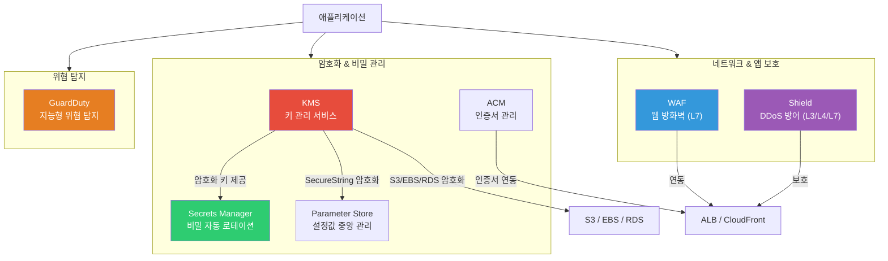
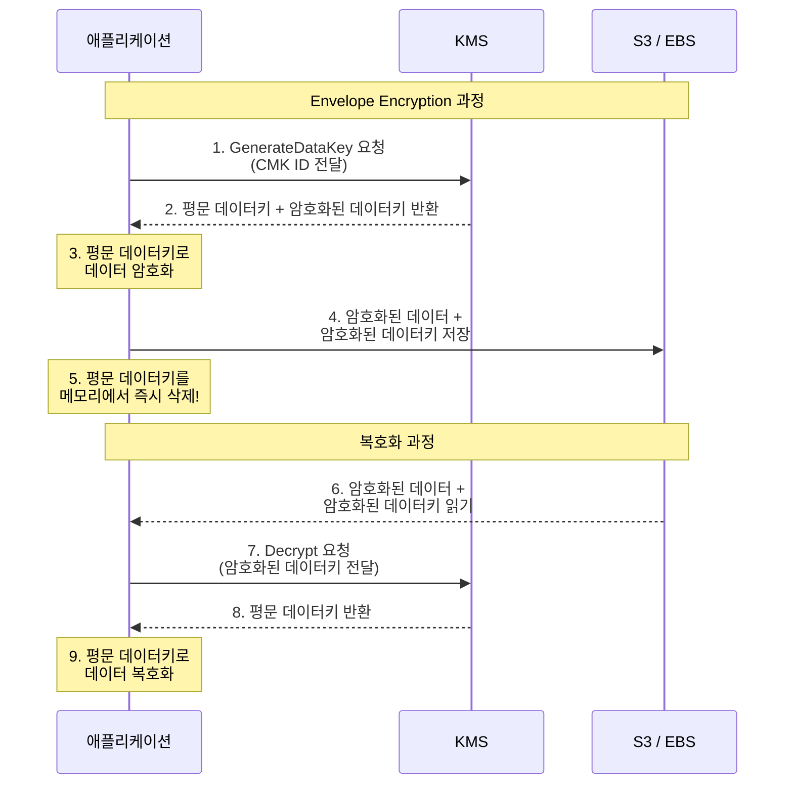
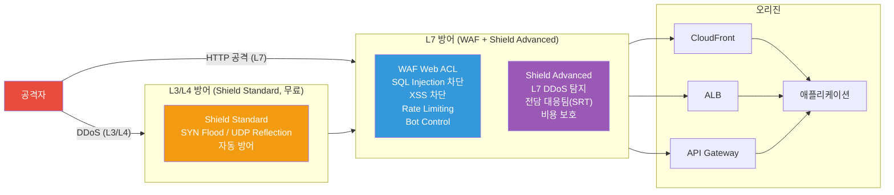
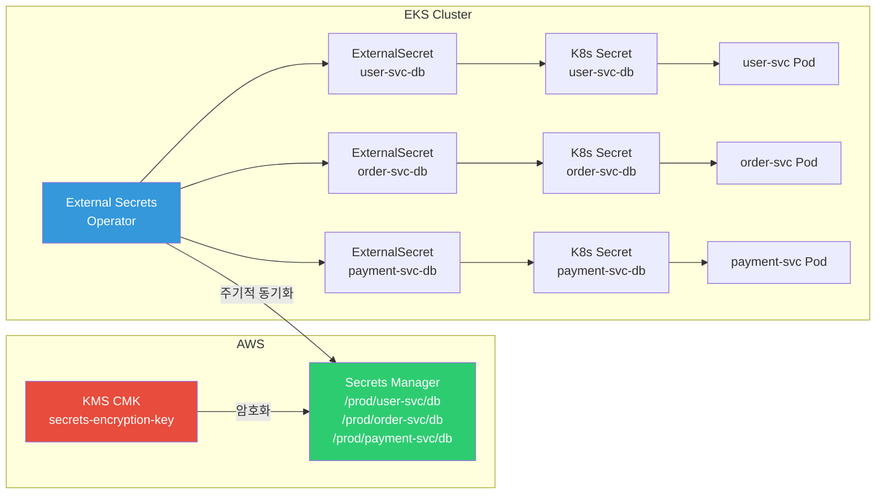

# KMS / Secrets Manager / WAF / Shield

> [이전 강의](./06-db-operations)에서 DB 운영을 배웠다면, 이제 AWS 리소스 전체를 **암호화하고, 비밀을 관리하고, 외부 공격으로부터 보호하는** 보안 서비스를 배워볼게요. [IAM](./01-iam)이 "누가 접근할 수 있는지"를 제어했다면, 이번 강의는 "데이터를 어떻게 지키고, 공격을 어떻게 막는지"에 대한 이야기예요.

---

## 🎯 이걸 왜 알아야 하나?

```
실무에서 보안 서비스가 필요한 순간:
• S3/EBS/RDS에 저장된 데이터를 암호화해야 해요              → KMS (CMK)
• DB 비밀번호를 코드에 하드코딩하면 안 돼요                  → Secrets Manager
• 설정값(엔드포인트, 플래그)을 중앙에서 관리하고 싶어요      → Parameter Store
• HTTPS 인증서를 매번 수동 갱신하기 귀찮아요                 → ACM (Certificate Manager)
• SQL Injection, XSS 공격을 막아야 해요                     → WAF
• DDoS 공격으로 서비스가 다운될 뻔했어요                     → Shield
• 누군가 우리 계정에서 비트코인 채굴하고 있어요              → GuardDuty
• K8s Pod에서 AWS 시크릿을 안전하게 가져오고 싶어요          → External Secrets + Secrets Manager
• 면접: "Envelope Encryption이 뭔가요?"                     → KMS 핵심 개념
```

---

## 🧠 핵심 개념

### 비유: 은행 보안 시스템

AWS 보안 서비스를 **은행**에 비유해볼게요.

* **KMS (Key Management Service)** = 은행 **금고 열쇠 관리실**. 금고를 여는 마스터키를 만들고, 보관하고, 교체하는 곳이에요. 열쇠 자체를 직접 만지지 않고 "이 서류를 암호화해줘"라고 요청하면 관리실이 대신 처리해요.
* **Secrets Manager** = **비밀 서류 보관함**. DB 비밀번호, API 키 같은 기밀 정보를 안전하게 보관하고, 주기적으로 비밀번호를 자동 교체해주는 서비스예요.
* **Parameter Store** = **업무 게시판**. 설정값, 엔드포인트 URL 같은 일반 정보부터 암호화된 비밀까지 계층적으로 관리하는 게시판이에요. 기본은 무료!
* **ACM** = **인증서 발급 창구**. HTTPS에 필요한 SSL/TLS 인증서를 무료로 발급하고 자동 갱신해줘요.
* **WAF (Web Application Firewall)** = 은행 입구 **보안 검색대**. 들어오는 사람(HTTP 요청)을 검사해서 흉기(SQL Injection), 위조 신분증(XSS)을 가진 사람을 차단해요.
* **Shield** = **경비 보안 업체**. 수백 명이 동시에 은행에 몰려와서 업무를 마비시키는 공격(DDoS)을 막아줘요. 기본(Standard)은 무료이고, 프리미엄(Advanced)은 전담 보안팀이 붙어요.
* **GuardDuty** = **CCTV 모니터링실**. 은행 내부의 수상한 행동(비정상 API 호출, 암호화폐 채굴 등)을 24시간 감시하고 알려줘요.

### AWS 보안 서비스 전체 구조



### KMS Envelope Encryption 흐름

KMS의 핵심 개념인 **Envelope Encryption(봉투 암호화)**을 이해하는 게 중요해요. 데이터를 직접 마스터키로 암호화하지 않고, **데이터키**를 만들어서 데이터를 암호화한 뒤, 데이터키 자체를 마스터키로 암호화하는 방식이에요.



### WAF / Shield 방어 계층



---

## 🔍 상세 설명

### 1. KMS (Key Management Service)

KMS는 [암호화 기초](../02-networking/05-tls-certificate)에서 배운 대칭/비대칭 암호화를 AWS에서 관리형으로 제공하는 서비스예요.

#### CMK (Customer Master Key) 유형

| 유형 | 관리 주체 | 키 구분 | 용도 | 비용 |
|------|----------|---------|------|------|
| AWS 관리형 키 | AWS | `aws/s3`, `aws/ebs` 등 | 서비스 기본 암호화 | 무료 |
| 고객 관리형 키 (대칭) | 고객 | AES-256 | 범용 암호화/복호화 | $1/월 + API 호출 |
| 고객 관리형 키 (비대칭) | 고객 | RSA, ECC | 서명/검증, 외부 암호화 | $1/월 + API 호출 |
| 외부 키 (BYOK) | 고객 | 직접 가져옴 | 규정 준수 요건 | $1/월 + API 호출 |

#### CMK 생성

```bash
# 대칭 CMK 생성 (기본: AES-256)
aws kms create-key \
    --description "my-app-encryption-key" \
    --key-usage ENCRYPT_DECRYPT \
    --origin AWS_KMS \
    --tags TagKey=Environment,TagValue=Production
```

```json
{
    "KeyMetadata": {
        "KeyId": "1234abcd-12ab-34cd-56ef-1234567890ab",
        "Arn": "arn:aws:kms:ap-northeast-2:123456789012:key/1234abcd-12ab-34cd-56ef-1234567890ab",
        "CreationDate": "2026-03-13T10:00:00+09:00",
        "Enabled": true,
        "Description": "my-app-encryption-key",
        "KeyUsage": "ENCRYPT_DECRYPT",
        "KeyState": "Enabled",
        "Origin": "AWS_KMS",
        "KeyManager": "CUSTOMER",
        "KeySpec": "SYMMETRIC_DEFAULT",
        "MultiRegion": false
    }
}
```

#### 별칭(Alias) 설정

키 ID 대신 사람이 읽기 쉬운 별칭을 만들 수 있어요.

```bash
# 별칭 생성 (alias/ 접두사 필수)
aws kms create-alias \
    --alias-name alias/my-app-key \
    --target-key-id 1234abcd-12ab-34cd-56ef-1234567890ab
```

#### 데이터 암호화 / 복호화

```bash
# 텍스트 암호화
aws kms encrypt \
    --key-id alias/my-app-key \
    --plaintext "SuperSecretPassword123" \
    --output text \
    --query CiphertextBlob
```

```
AQICAHjK3... (Base64 인코딩된 암호문)
```

```bash
# 복호화
aws kms decrypt \
    --ciphertext-blob fileb://encrypted-data.bin \
    --output text \
    --query Plaintext | base64 --decode
```

```
SuperSecretPassword123
```

#### 키 자동 로테이션

```bash
# 자동 로테이션 활성화 (매년 자동 교체)
aws kms enable-key-rotation \
    --key-id alias/my-app-key

# 로테이션 상태 확인
aws kms get-key-rotation-status \
    --key-id alias/my-app-key
```

```json
{
    "KeyRotationEnabled": true
}
```

> 자동 로테이션은 **고객 관리형 대칭 키**에서만 가능해요. 비대칭 키나 BYOK 키는 수동으로 로테이션해야 해요.

#### 키 정책 (Key Policy)

키 정책은 [IAM 정책](./01-iam)과 비슷하지만, **KMS 키 자체에 붙는 리소스 기반 정책**이에요.

```json
{
    "Version": "2012-10-17",
    "Statement": [
        {
            "Sid": "키 관리자 권한",
            "Effect": "Allow",
            "Principal": {
                "AWS": "arn:aws:iam::123456789012:role/KeyAdmin"
            },
            "Action": [
                "kms:Create*",
                "kms:Describe*",
                "kms:Enable*",
                "kms:List*",
                "kms:Put*",
                "kms:Update*",
                "kms:Revoke*",
                "kms:Disable*",
                "kms:Get*",
                "kms:Delete*",
                "kms:ScheduleKeyDeletion",
                "kms:CancelKeyDeletion"
            ],
            "Resource": "*"
        },
        {
            "Sid": "키 사용자 권한",
            "Effect": "Allow",
            "Principal": {
                "AWS": "arn:aws:iam::123456789012:role/AppRole"
            },
            "Action": [
                "kms:Encrypt",
                "kms:Decrypt",
                "kms:GenerateDataKey"
            ],
            "Resource": "*"
        }
    ]
}
```

#### Grant (임시 권한 위임)

Grant는 다른 AWS 서비스나 사용자에게 **임시로** KMS 키 사용 권한을 위임하는 방식이에요.

```bash
# Grant 생성 - EBS 서비스가 키를 사용할 수 있도록 허용
aws kms create-grant \
    --key-id alias/my-app-key \
    --grantee-principal arn:aws:iam::123456789012:role/EBSRole \
    --operations Encrypt Decrypt GenerateDataKey
```

```json
{
    "GrantToken": "AQpAM2...",
    "GrantId": "abcde1234..."
}
```

#### KMS + 다른 서비스 연동

```bash
# S3 버킷 기본 암호화를 KMS로 설정
aws s3api put-bucket-encryption \
    --bucket my-secure-bucket \
    --server-side-encryption-configuration '{
        "Rules": [{
            "ApplyServerSideEncryptionByDefault": {
                "SSEAlgorithm": "aws:kms",
                "KMSMasterKeyID": "alias/my-app-key"
            },
            "BucketKeyEnabled": true
        }]
    }'

# EBS 볼륨 생성 시 KMS 암호화
aws ec2 create-volume \
    --availability-zone ap-northeast-2a \
    --size 100 \
    --volume-type gp3 \
    --encrypted \
    --kms-key-id alias/my-app-key
```

#### aws:kms 조건키 (IAM 정책에서 활용)

```json
{
    "Version": "2012-10-17",
    "Statement": [{
        "Effect": "Deny",
        "Action": "s3:PutObject",
        "Resource": "arn:aws:s3:::my-secure-bucket/*",
        "Condition": {
            "StringNotEquals": {
                "s3:x-amz-server-side-encryption": "aws:kms"
            }
        }
    }]
}
```

> 이 정책은 KMS 암호화 없이 S3에 객체를 업로드하는 것을 **거부**해요. 실무에서 데이터 보호 규정을 강제할 때 자주 써요.

---

### 2. Secrets Manager

Secrets Manager는 DB 비밀번호, API 키 같은 민감 정보를 안전하게 보관하고, **자동으로 로테이션**까지 해주는 서비스예요.

#### 비밀 생성

```bash
# RDS 비밀번호 시크릿 생성
aws secretsmanager create-secret \
    --name prod/myapp/rds-password \
    --description "Production RDS master password" \
    --secret-string '{"username":"admin","password":"MyStr0ngP@ss!","engine":"mysql","host":"mydb.cluster-xxx.ap-northeast-2.rds.amazonaws.com","port":3306,"dbname":"myapp"}'
```

```json
{
    "ARN": "arn:aws:secretsmanager:ap-northeast-2:123456789012:secret:prod/myapp/rds-password-a1b2c3",
    "Name": "prod/myapp/rds-password",
    "VersionId": "a1b2c3d4-5678-90ab-cdef-EXAMPLE11111"
}
```

#### 비밀 조회

```bash
# 시크릿 값 조회
aws secretsmanager get-secret-value \
    --secret-id prod/myapp/rds-password
```

```json
{
    "ARN": "arn:aws:secretsmanager:ap-northeast-2:123456789012:secret:prod/myapp/rds-password-a1b2c3",
    "Name": "prod/myapp/rds-password",
    "VersionId": "a1b2c3d4-5678-90ab-cdef-EXAMPLE11111",
    "SecretString": "{\"username\":\"admin\",\"password\":\"MyStr0ngP@ss!\",\"engine\":\"mysql\",\"host\":\"mydb.cluster-xxx.ap-northeast-2.rds.amazonaws.com\",\"port\":3306,\"dbname\":\"myapp\"}",
    "VersionStages": ["AWSCURRENT"],
    "CreatedDate": "2026-03-13T10:00:00+09:00"
}
```

#### RDS 자동 로테이션 설정

Secrets Manager는 Lambda 함수를 이용해서 RDS 비밀번호를 **자동으로 교체**할 수 있어요.

```bash
# RDS 비밀번호 자동 로테이션 활성화 (30일마다)
aws secretsmanager rotate-secret \
    --secret-id prod/myapp/rds-password \
    --rotation-lambda-arn arn:aws:lambda:ap-northeast-2:123456789012:function:SecretsManagerRDSRotation \
    --rotation-rules '{"AutomaticallyAfterDays": 30}'
```

```json
{
    "ARN": "arn:aws:secretsmanager:ap-northeast-2:123456789012:secret:prod/myapp/rds-password-a1b2c3",
    "Name": "prod/myapp/rds-password",
    "VersionId": "b2c3d4e5-6789-01ab-cdef-EXAMPLE22222"
}
```

#### Secrets Manager vs Parameter Store 비교

| 기능 | Secrets Manager | Parameter Store (Standard) | Parameter Store (Advanced) |
|------|----------------|--------------------------|---------------------------|
| 자동 로테이션 | O (Lambda 연동) | X | X |
| RDS 네이티브 로테이션 | O | X | X |
| 비용 | $0.40/시크릿/월 + API 호출 | **무료** | $0.05/파라미터/월 |
| 최대 크기 | 64KB | 4KB | 8KB |
| 암호화 | 기본 KMS 암호화 | SecureString (KMS) | SecureString (KMS) |
| 버전 관리 | 자동 (AWSCURRENT/AWSPREVIOUS) | 라벨 기반 | 라벨 기반 |
| 크로스 계정 접근 | O (리소스 정책) | X | O (고급 정책) |
| 주요 용도 | DB 비밀번호, API 키 | 설정값, 엔드포인트, 플래그 | 대량 파라미터, 정책 필요 시 |

> 비밀번호 자동 로테이션이 필요하면 **Secrets Manager**, 단순 설정값이면 **Parameter Store(무료)**를 쓰세요.

---

### 3. Parameter Store (SSM)

Parameter Store는 Systems Manager(SSM)의 하위 기능으로, 설정값을 **계층적으로** 관리해요.

#### 계층적 파라미터 생성

```bash
# 일반 문자열 파라미터
aws ssm put-parameter \
    --name "/myapp/prod/db-endpoint" \
    --value "mydb.cluster-xxx.ap-northeast-2.rds.amazonaws.com" \
    --type String \
    --tags Key=Environment,Value=Production

# SecureString 파라미터 (KMS로 암호화)
aws ssm put-parameter \
    --name "/myapp/prod/db-password" \
    --value "MyStr0ngP@ss!" \
    --type SecureString \
    --key-id alias/my-app-key

# 파라미터 조회
aws ssm get-parameter \
    --name "/myapp/prod/db-password" \
    --with-decryption
```

```json
{
    "Parameter": {
        "Name": "/myapp/prod/db-password",
        "Type": "SecureString",
        "Value": "MyStr0ngP@ss!",
        "Version": 1,
        "LastModifiedDate": "2026-03-13T10:00:00+09:00",
        "ARN": "arn:aws:ssm:ap-northeast-2:123456789012:parameter/myapp/prod/db-password",
        "DataType": "text"
    }
}
```

#### 계층 전체 조회

```bash
# /myapp/prod/ 아래 모든 파라미터 조회
aws ssm get-parameters-by-path \
    --path "/myapp/prod" \
    --recursive \
    --with-decryption
```

```json
{
    "Parameters": [
        {
            "Name": "/myapp/prod/db-endpoint",
            "Type": "String",
            "Value": "mydb.cluster-xxx.ap-northeast-2.rds.amazonaws.com",
            "Version": 1
        },
        {
            "Name": "/myapp/prod/db-password",
            "Type": "SecureString",
            "Value": "MyStr0ngP@ss!",
            "Version": 1
        }
    ]
}
```

> [K8s External Secrets](../04-kubernetes/04-config-secret)와 연동하면, Parameter Store의 값을 Kubernetes Secret으로 자동 동기화할 수 있어요.

---

### 4. ACM (AWS Certificate Manager)

ACM은 [TLS 인증서](../02-networking/05-tls-certificate) 발급과 갱신을 자동화해주는 서비스예요. 퍼블릭 인증서는 **무료**예요.

#### 퍼블릭 인증서 발급 (DNS 검증)

```bash
# 인증서 요청
aws acm request-certificate \
    --domain-name "example.com" \
    --subject-alternative-names "*.example.com" \
    --validation-method DNS \
    --tags Key=Environment,Value=Production
```

```json
{
    "CertificateArn": "arn:aws:acm:ap-northeast-2:123456789012:certificate/abcd-1234-efgh-5678"
}
```

```bash
# DNS 검증용 CNAME 레코드 확인
aws acm describe-certificate \
    --certificate-arn arn:aws:acm:ap-northeast-2:123456789012:certificate/abcd-1234-efgh-5678 \
    --query 'Certificate.DomainValidationOptions[0].ResourceRecord'
```

```json
{
    "Name": "_abc123.example.com.",
    "Type": "CNAME",
    "Value": "_def456.acm-validations.aws."
}
```

> Route 53 사용 시 DNS 검증 레코드를 자동으로 추가할 수 있어요. 이메일 검증보다 DNS 검증이 자동 갱신에 유리해요.

#### ALB / CloudFront 연동

```bash
# ALB HTTPS 리스너에 인증서 연결
aws elbv2 create-listener \
    --load-balancer-arn arn:aws:elasticloadbalancing:ap-northeast-2:123456789012:loadbalancer/app/my-alb/1234567890 \
    --protocol HTTPS \
    --port 443 \
    --certificates CertificateArn=arn:aws:acm:ap-northeast-2:123456789012:certificate/abcd-1234-efgh-5678 \
    --default-actions Type=forward,TargetGroupArn=arn:aws:elasticloadbalancing:ap-northeast-2:123456789012:targetgroup/my-tg/1234567890
```

> CloudFront에 연결할 인증서는 반드시 **us-east-1 (버지니아)** 리전에서 발급해야 해요!

---

### 5. WAF (Web Application Firewall)

WAF는 [네트워크 보안](../02-networking/09-network-security)에서 배운 방화벽 개념을 **HTTP 계층(L7)**에 적용하는 서비스예요.

#### Web ACL 생성 (AWS 관리형 규칙 사용)

```bash
# Web ACL 생성 - SQL Injection + XSS 방어
aws wafv2 create-web-acl \
    --name my-app-waf \
    --scope REGIONAL \
    --default-action Allow={} \
    --rules '[
        {
            "Name": "AWSManagedRulesCommonRuleSet",
            "Priority": 1,
            "Statement": {
                "ManagedRuleGroupStatement": {
                    "VendorName": "AWS",
                    "Name": "AWSManagedRulesCommonRuleSet"
                }
            },
            "OverrideAction": { "None": {} },
            "VisibilityConfig": {
                "SampledRequestsEnabled": true,
                "CloudWatchMetricsEnabled": true,
                "MetricName": "AWSCommonRules"
            }
        },
        {
            "Name": "AWSManagedRulesSQLiRuleSet",
            "Priority": 2,
            "Statement": {
                "ManagedRuleGroupStatement": {
                    "VendorName": "AWS",
                    "Name": "AWSManagedRulesSQLiRuleSet"
                }
            },
            "OverrideAction": { "None": {} },
            "VisibilityConfig": {
                "SampledRequestsEnabled": true,
                "CloudWatchMetricsEnabled": true,
                "MetricName": "AWSSQLiRules"
            }
        }
    ]' \
    --visibility-config SampledRequestsEnabled=true,CloudWatchMetricsEnabled=true,MetricName=my-app-waf-metric
```

```json
{
    "Summary": {
        "Name": "my-app-waf",
        "Id": "a1b2c3d4-5678-90ab-cdef-EXAMPLE11111",
        "ARN": "arn:aws:wafv2:ap-northeast-2:123456789012:regional/webacl/my-app-waf/a1b2c3d4...",
        "LockToken": "abc123..."
    }
}
```

#### 커스텀 Rate Limiting 규칙

```bash
# IP당 5분에 1000회 이상 요청 시 차단
aws wafv2 create-rule-group \
    --name rate-limit-rule \
    --scope REGIONAL \
    --capacity 10 \
    --rules '[
        {
            "Name": "RateLimit1000",
            "Priority": 1,
            "Action": { "Block": {} },
            "Statement": {
                "RateBasedStatement": {
                    "Limit": 1000,
                    "AggregateKeyType": "IP"
                }
            },
            "VisibilityConfig": {
                "SampledRequestsEnabled": true,
                "CloudWatchMetricsEnabled": true,
                "MetricName": "RateLimit1000"
            }
        }
    ]' \
    --visibility-config SampledRequestsEnabled=true,CloudWatchMetricsEnabled=true,MetricName=rate-limit-group
```

#### 주요 AWS 관리형 규칙 목록

| 규칙 그룹 | 방어 대상 | WCU |
|-----------|----------|-----|
| AWSManagedRulesCommonRuleSet | OWASP Top 10 기본 방어 | 700 |
| AWSManagedRulesSQLiRuleSet | SQL Injection | 200 |
| AWSManagedRulesKnownBadInputsRuleSet | 알려진 취약점 입력 | 200 |
| AWSManagedRulesAmazonIpReputationList | 악성 IP 차단 | 25 |
| AWSManagedRulesBotControlRuleSet | 봇 트래픽 제어 | 50 |
| AWSManagedRulesAnonymousIpList | VPN/프록시/Tor 차단 | 50 |

> WCU(Web ACL Capacity Unit): Web ACL 하나에 최대 **5,000 WCU**까지 사용할 수 있어요.

#### WAF를 ALB / CloudFront / API Gateway에 연결

```bash
# ALB에 Web ACL 연결
aws wafv2 associate-web-acl \
    --web-acl-arn arn:aws:wafv2:ap-northeast-2:123456789012:regional/webacl/my-app-waf/a1b2c3d4... \
    --resource-arn arn:aws:elasticloadbalancing:ap-northeast-2:123456789012:loadbalancer/app/my-alb/1234567890
```

---

### 6. Shield

#### Shield Standard vs Advanced

| 기능 | Shield Standard | Shield Advanced |
|------|----------------|-----------------|
| 비용 | **무료** (자동 적용) | $3,000/월 + 데이터 전송비 |
| 방어 범위 | L3/L4 DDoS | L3/L4 + **L7 DDoS** |
| 탐지 | 자동 | 자동 + **실시간 알림** |
| 대응 | 자동 | 자동 + **SRT(Shield Response Team)** 전담 지원 |
| 비용 보호 | X | O (DDoS로 인한 스케일링 비용 환불) |
| 가시성 | 기본 | **AWS Shield 콘솔 대시보드** |
| WAF 비용 | 별도 | **WAF 비용 포함** |
| 적용 대상 | 모든 AWS 리소스 | CloudFront, ALB, Route 53, Global Accelerator, EC2 EIP |

```bash
# Shield Advanced 보호 리소스 확인
aws shield list-protections
```

```json
{
    "Protections": [
        {
            "Id": "abc123",
            "Name": "my-alb-protection",
            "ResourceArn": "arn:aws:elasticloadbalancing:ap-northeast-2:123456789012:loadbalancer/app/my-alb/1234567890"
        }
    ]
}
```

> Shield Standard는 모든 AWS 계정에 **자동 적용**되어 있어요. 별도 설정이 필요 없어요.

---

### 7. GuardDuty

GuardDuty는 VPC Flow Logs, DNS 로그, CloudTrail 이벤트를 **ML로 분석**해서 위협을 탐지하는 서비스예요.

#### GuardDuty 활성화

```bash
# GuardDuty 탐지기(Detector) 활성화
aws guardduty create-detector \
    --enable \
    --finding-publishing-frequency FIFTEEN_MINUTES
```

```json
{
    "DetectorId": "abc123def456"
}
```

#### 탐지 결과 조회

```bash
# 탐지 결과(Findings) 조회
aws guardduty list-findings \
    --detector-id abc123def456 \
    --finding-criteria '{
        "Criterion": {
            "severity": {
                "Gte": 7
            }
        }
    }'
```

#### 주요 탐지 유형

| 위협 유형 | 설명 | 심각도 |
|-----------|------|--------|
| CryptoCurrency:EC2/BitcoinTool | EC2에서 암호화폐 채굴 감지 | 높음 |
| UnauthorizedAccess:IAMUser/ConsoleLoginSuccess.B | 비정상 콘솔 로그인 | 중간 |
| Recon:EC2/PortProbeUnprotectedPort | 포트 스캔 감지 | 낮음 |
| Trojan:EC2/DriveBySourceTraffic | 악성 트래픽 발생 | 높음 |
| UnauthorizedAccess:EC2/RDPBruteForce | RDP 무차별 대입 공격 | 중간 |

#### EventBridge + SNS 알림 연동

```bash
# GuardDuty 높은 심각도 탐지 시 SNS 알림 전송 (EventBridge 규칙)
aws events put-rule \
    --name guardduty-high-severity \
    --event-pattern '{
        "source": ["aws.guardduty"],
        "detail-type": ["GuardDuty Finding"],
        "detail": {
            "severity": [{ "numeric": [">=", 7] }]
        }
    }'

aws events put-targets \
    --rule guardduty-high-severity \
    --targets '[{
        "Id": "sns-target",
        "Arn": "arn:aws:sns:ap-northeast-2:123456789012:security-alerts"
    }]'
```

---

## 💻 실습 예제

### 실습 1: KMS로 S3 버킷 암호화 + Secrets Manager 연동

시나리오: 애플리케이션 데이터를 저장하는 S3 버킷을 KMS로 암호화하고, DB 비밀번호를 Secrets Manager에 안전하게 보관해요.

```bash
# 1단계: KMS CMK 생성
aws kms create-key \
    --description "s3-encryption-key" \
    --tags TagKey=Project,TagValue=MyApp

# 출력에서 KeyId 확인 후 별칭 생성
aws kms create-alias \
    --alias-name alias/myapp-s3-key \
    --target-key-id <KeyId>

# 2단계: S3 버킷 생성 + KMS 암호화 설정
aws s3api create-bucket \
    --bucket myapp-secure-data-2026 \
    --region ap-northeast-2 \
    --create-bucket-configuration LocationConstraint=ap-northeast-2

aws s3api put-bucket-encryption \
    --bucket myapp-secure-data-2026 \
    --server-side-encryption-configuration '{
        "Rules": [{
            "ApplyServerSideEncryptionByDefault": {
                "SSEAlgorithm": "aws:kms",
                "KMSMasterKeyID": "alias/myapp-s3-key"
            },
            "BucketKeyEnabled": true
        }]
    }'

# 3단계: 암호화 확인 - 파일 업로드 후 헤더 확인
echo "sensitive data" > /tmp/test.txt
aws s3 cp /tmp/test.txt s3://myapp-secure-data-2026/test.txt

aws s3api head-object \
    --bucket myapp-secure-data-2026 \
    --key test.txt
```

```json
{
    "ServerSideEncryption": "aws:kms",
    "SSEKMSKeyId": "arn:aws:kms:ap-northeast-2:123456789012:key/1234abcd-...",
    "BucketKeyEnabled": true,
    "ContentLength": 15,
    "ContentType": "text/plain"
}
```

```bash
# 4단계: DB 비밀번호를 Secrets Manager에 저장
aws secretsmanager create-secret \
    --name myapp/prod/db-credentials \
    --description "MyApp Production DB credentials" \
    --secret-string '{
        "username": "admin",
        "password": "Pr0d!SecureP@ss2026",
        "engine": "mysql",
        "host": "mydb.cluster-xxx.ap-northeast-2.rds.amazonaws.com",
        "port": 3306,
        "dbname": "myapp"
    }' \
    --kms-key-id alias/myapp-s3-key

# 5단계: 애플리케이션에서 시크릿 조회 (Python 예시 참고)
aws secretsmanager get-secret-value \
    --secret-id myapp/prod/db-credentials \
    --query SecretString \
    --output text
```

```json
{"username":"admin","password":"Pr0d!SecureP@ss2026","engine":"mysql","host":"mydb.cluster-xxx.ap-northeast-2.rds.amazonaws.com","port":3306,"dbname":"myapp"}
```

---

### 실습 2: WAF로 ALB 보호하기

시나리오: 웹 애플리케이션 ALB에 WAF를 연결해서 SQL Injection, XSS, 과도한 요청을 차단해요.

```bash
# 1단계: Web ACL 생성 (관리형 규칙 + Rate Limiting)
aws wafv2 create-web-acl \
    --name myapp-waf \
    --scope REGIONAL \
    --default-action Allow={} \
    --rules '[
        {
            "Name": "AWS-CommonRules",
            "Priority": 1,
            "Statement": {
                "ManagedRuleGroupStatement": {
                    "VendorName": "AWS",
                    "Name": "AWSManagedRulesCommonRuleSet"
                }
            },
            "OverrideAction": { "None": {} },
            "VisibilityConfig": {
                "SampledRequestsEnabled": true,
                "CloudWatchMetricsEnabled": true,
                "MetricName": "CommonRules"
            }
        },
        {
            "Name": "AWS-SQLiRules",
            "Priority": 2,
            "Statement": {
                "ManagedRuleGroupStatement": {
                    "VendorName": "AWS",
                    "Name": "AWSManagedRulesSQLiRuleSet"
                }
            },
            "OverrideAction": { "None": {} },
            "VisibilityConfig": {
                "SampledRequestsEnabled": true,
                "CloudWatchMetricsEnabled": true,
                "MetricName": "SQLiRules"
            }
        },
        {
            "Name": "RateLimit",
            "Priority": 3,
            "Action": { "Block": {} },
            "Statement": {
                "RateBasedStatement": {
                    "Limit": 2000,
                    "AggregateKeyType": "IP"
                }
            },
            "VisibilityConfig": {
                "SampledRequestsEnabled": true,
                "CloudWatchMetricsEnabled": true,
                "MetricName": "RateLimit"
            }
        }
    ]' \
    --visibility-config SampledRequestsEnabled=true,CloudWatchMetricsEnabled=true,MetricName=myapp-waf-metric
```

```bash
# 2단계: ALB에 Web ACL 연결
aws wafv2 associate-web-acl \
    --web-acl-arn <위에서_생성된_ARN> \
    --resource-arn arn:aws:elasticloadbalancing:ap-northeast-2:123456789012:loadbalancer/app/my-alb/1234567890

# 3단계: 차단된 요청 확인
aws wafv2 get-sampled-requests \
    --web-acl-arn <위에서_생성된_ARN> \
    --rule-metric-name SQLiRules \
    --scope REGIONAL \
    --time-window StartTime=2026-03-13T00:00:00Z,EndTime=2026-03-13T23:59:59Z \
    --max-items 10
```

```json
{
    "SampledRequests": [
        {
            "Request": {
                "ClientIP": "203.0.113.50",
                "Country": "KR",
                "URI": "/api/users?id=1 OR 1=1",
                "Method": "GET",
                "HTTPVersion": "HTTP/2.0"
            },
            "Action": "BLOCK",
            "RuleNameWithinRuleGroup": "SQLi_QUERYARGUMENTS",
            "Timestamp": "2026-03-13T14:30:00+09:00"
        }
    ],
    "PopulationSize": 1500,
    "TimeWindow": {
        "StartTime": "2026-03-13T00:00:00Z",
        "EndTime": "2026-03-13T23:59:59Z"
    }
}
```

> `/api/users?id=1 OR 1=1` 같은 SQL Injection 시도가 차단된 것을 확인할 수 있어요.

---

### 실습 3: GuardDuty + EventBridge 보안 알림 파이프라인

시나리오: GuardDuty가 위협을 탐지하면 Slack으로 알림을 보내는 파이프라인을 구성해요.

```bash
# 1단계: GuardDuty 활성화
aws guardduty create-detector --enable

# 2단계: SNS 토픽 생성 (Slack 웹훅으로 포워딩 가능)
aws sns create-topic --name security-alerts
aws sns subscribe \
    --topic-arn arn:aws:sns:ap-northeast-2:123456789012:security-alerts \
    --protocol email \
    --notification-endpoint security-team@example.com

# 3단계: EventBridge 규칙 생성 (높은 심각도 탐지 시)
aws events put-rule \
    --name guardduty-high-findings \
    --event-pattern '{
        "source": ["aws.guardduty"],
        "detail-type": ["GuardDuty Finding"],
        "detail": {
            "severity": [{ "numeric": [">=", 7] }]
        }
    }' \
    --description "GuardDuty high severity findings"

# 4단계: EventBridge 타겟을 SNS로 설정
aws events put-targets \
    --rule guardduty-high-findings \
    --targets '[{
        "Id": "security-sns",
        "Arn": "arn:aws:sns:ap-northeast-2:123456789012:security-alerts",
        "InputTransformer": {
            "InputPathsMap": {
                "severity": "$.detail.severity",
                "type": "$.detail.type",
                "description": "$.detail.description",
                "region": "$.detail.region"
            },
            "InputTemplate": "\"[GuardDuty Alert] Severity: <severity>\\nType: <type>\\nRegion: <region>\\nDescription: <description>\""
        }
    }]'

# 5단계: 샘플 탐지 생성 (테스트용)
DETECTOR_ID=$(aws guardduty list-detectors --query 'DetectorIds[0]' --output text)
aws guardduty create-sample-findings \
    --detector-id $DETECTOR_ID \
    --finding-types "CryptoCurrency:EC2/BitcoinTool.B!DNS"
```

```
# 이메일로 수신되는 알림 예시:
[GuardDuty Alert] Severity: 8
Type: CryptoCurrency:EC2/BitcoinTool.B!DNS
Region: ap-northeast-2
Description: EC2 instance i-0abc123 is querying a domain name associated with Bitcoin mining.
```

---

## 🏢 실무에서는?

### 시나리오 1: 마이크로서비스의 시크릿 관리 (EKS + External Secrets)

```
문제: 10개 마이크로서비스가 각각 다른 DB 비밀번호를 사용하는데,
      비밀번호를 K8s ConfigMap에 평문으로 넣으면 보안 감사에서 지적 받아요.

해결: Secrets Manager + External Secrets Operator
```



> [K8s 보안 강의](../04-kubernetes/15-security)에서 External Secrets Operator 설정을 자세히 다뤄요. [K8s ConfigMap/Secret](../04-kubernetes/04-config-secret)과 함께 보세요.

### 시나리오 2: 멀티 레이어 웹 보안 아키텍처

```
문제: 글로벌 서비스에 DDoS 공격, 봇 트래픽, SQL Injection이 동시에 들어와요.

해결: CloudFront + WAF + Shield Advanced 조합
```

```
[사용자 요청]
    ↓
[Route 53] ─── Shield Standard (L3/L4 DDoS 자동 방어)
    ↓
[CloudFront] ─── WAF Web ACL 연결
    │              ├── AWSManagedRulesCommonRuleSet (OWASP Top 10)
    │              ├── AWSManagedRulesSQLiRuleSet (SQL Injection)
    │              ├── AWSManagedRulesBotControlRuleSet (봇 차단)
    │              ├── Rate Limiting (IP당 2000회/5분)
    │              └── 지역 차단 (특정 국가 Block)
    │
    │         ─── Shield Advanced (L7 DDoS + SRT 지원)
    ↓
[ALB] → [EKS / EC2]
```

실무 팁:
- CloudFront에 WAF를 붙이면 **글로벌 엣지**에서 차단하므로 오리진 부하가 줄어요.
- Shield Advanced의 **비용 보호** 기능으로, DDoS 공격으로 인한 CloudFront/ALB 스케일링 비용을 환불받을 수 있어요.
- Bot Control은 WCU를 많이 쓰므로 (50 WCU), 필요한 경로에만 적용하세요.

### 시나리오 3: 컴플라이언스 준수 (금융/의료 데이터 암호화)

```
문제: 금융 규정(전자금융감독규정)에 따라 고객 데이터를 저장 시 암호화하고,
      암호화 키를 주기적으로 교체하고, 키 사용 이력을 감사해야 해요.

해결: KMS CMK + 자동 로테이션 + CloudTrail 감사 로그
```

```
실무 설정:

1. KMS CMK 생성 (고객 관리형 키)
   - 키 정책: 관리자/사용자 역할 분리
   - 자동 로테이션: 매년 (enable-key-rotation)
   - 별칭: alias/compliance-data-key

2. 암호화 적용 대상
   - S3: SSE-KMS (aws:kms 조건키로 강제)
   - EBS: KMS 암호화 필수 (SCP로 강제)
   - RDS: KMS 암호화 활성화
   - Secrets Manager: KMS CMK로 시크릿 암호화

3. 감사 설정
   - CloudTrail: KMS API 호출 로그 기록
   - AWS Config: kms-key-rotation-enabled 규칙
   - GuardDuty: 비정상 키 사용 탐지

4. SCP(서비스 제어 정책)로 암호화 강제
   - 비암호화 EBS 볼륨 생성 차단
   - 비암호화 S3 버킷 생성 차단
```

---

## ⚠️ 자주 하는 실수

### 1. KMS 키 삭제 후 데이터 복구 불가

```
❌ 잘못: KMS 키를 바로 삭제 → 해당 키로 암호화된 모든 데이터 복구 불가!
```

```bash
# 이렇게 하면 7~30일 대기 후 키가 영구 삭제되고, 데이터도 함께 사라져요
aws kms schedule-key-deletion \
    --key-id alias/my-key \
    --pending-window-in-days 7    # 최소 7일, 최대 30일
```

```
✅ 올바른: 키 비활성화로 먼저 테스트 → 문제 없으면 삭제 스케줄링 (30일)
```

```bash
# 먼저 비활성화로 영향도 확인
aws kms disable-key --key-id alias/my-key

# 문제 없으면 30일 대기 후 삭제 (충분한 여유 기간)
aws kms schedule-key-deletion \
    --key-id alias/my-key \
    --pending-window-in-days 30

# 만약 삭제 취소해야 하면 (대기 기간 내)
aws kms cancel-key-deletion --key-id alias/my-key
aws kms enable-key --key-id alias/my-key
```

### 2. Secrets Manager 시크릿을 코드에 캐싱 안 함

```
❌ 잘못: API 호출할 때마다 Secrets Manager에서 시크릿을 가져옴
         → API 호출 비용 증가 + 지연 시간 증가 + 스로틀링 위험
```

```python
# 잘못된 예시 - 매 요청마다 API 호출
def get_db_connection():
    # 매번 네트워크 호출 발생!
    secret = boto3.client('secretsmanager').get_secret_value(
        SecretId='prod/myapp/db-password'
    )
    password = json.loads(secret['SecretString'])['password']
    return connect(password=password)
```

```
✅ 올바른: AWS SDK 캐싱 라이브러리 사용 또는 직접 캐싱 구현
```

```python
# 올바른 예시 - 캐싱 적용
# pip install aws-secretsmanager-caching
from aws_secretsmanager_caching import SecretCache

cache = SecretCache()  # 기본 1시간 캐싱

def get_db_connection():
    # 캐시에서 가져옴 (TTL 만료 시에만 API 호출)
    secret_string = cache.get_secret_string('prod/myapp/db-password')
    password = json.loads(secret_string)['password']
    return connect(password=password)
```

### 3. WAF를 Count 모드 없이 바로 Block으로 설정

```
❌ 잘못: 새 WAF 규칙을 바로 Block 모드로 적용
         → 정상 트래픽도 차단될 수 있음 (오탐, false positive)
```

```
✅ 올바른: Count 모드로 먼저 배포 → 로그 분석 → 오탐 확인 후 Block으로 전환
```

```bash
# 1. Count 모드로 배포 (차단하지 않고 집계만)
# OverrideAction을 Count로 설정
"OverrideAction": { "Count": {} }

# 2. 1~2주 운영 후 CloudWatch에서 차단될 뻔한 요청 분석
aws wafv2 get-sampled-requests \
    --web-acl-arn <ACL_ARN> \
    --rule-metric-name CommonRules \
    --scope REGIONAL \
    --time-window StartTime=...,EndTime=... \
    --max-items 100

# 3. 오탐이 없으면 Block으로 전환
"OverrideAction": { "None": {} }
```

### 4. ACM 인증서를 CloudFront에 연결할 때 리전 실수

```
❌ 잘못: ap-northeast-2(서울)에서 발급한 인증서를 CloudFront에 연결 시도
         → 에러 발생! CloudFront는 us-east-1 인증서만 사용 가능
```

```
✅ 올바른: CloudFront용 인증서는 반드시 us-east-1(버지니아)에서 발급
          ALB용 인증서는 ALB가 있는 리전에서 발급
```

```bash
# CloudFront용 인증서 (us-east-1에서 발급)
aws acm request-certificate \
    --region us-east-1 \
    --domain-name "example.com" \
    --subject-alternative-names "*.example.com" \
    --validation-method DNS

# ALB용 인증서 (ALB가 있는 리전에서 발급)
aws acm request-certificate \
    --region ap-northeast-2 \
    --domain-name "example.com" \
    --validation-method DNS
```

### 5. Parameter Store에 대용량 시크릿 저장

```
❌ 잘못: Parameter Store Standard에 4KB 넘는 데이터 저장 시도
         → 에러 발생! Standard는 4KB 제한
```

```
✅ 올바른: 용도에 맞는 서비스 선택
```

```
크기별 선택 가이드:
• 4KB 이하 설정값 → Parameter Store Standard (무료)
• 4~8KB 설정값    → Parameter Store Advanced ($0.05/파라미터/월)
• 8~64KB 시크릿   → Secrets Manager ($0.40/시크릿/월)
• 64KB 초과       → S3 + KMS 암호화
```

---

## 📝 정리

```
서비스 한눈에 보기:

┌─────────────────┬──────────────────────────────────────────┐
│ 서비스           │ 핵심 역할                                 │
├─────────────────┼──────────────────────────────────────────┤
│ KMS             │ 암호화 키 생성/관리, Envelope Encryption  │
│ Secrets Manager │ 비밀 보관 + 자동 로테이션 (유료)           │
│ Parameter Store │ 설정값 중앙 관리 (무료 티어)               │
│ ACM             │ SSL/TLS 인증서 발급 + 자동 갱신 (무료)     │
│ WAF             │ L7 웹 방화벽 (SQLi, XSS, Bot)            │
│ Shield Standard │ L3/L4 DDoS 방어 (무료, 자동)             │
│ Shield Advanced │ L7 DDoS + 전담팀 + 비용 보호 ($3,000/월) │
│ GuardDuty       │ ML 기반 위협 탐지 (VPC/DNS/CloudTrail)    │
└─────────────────┴──────────────────────────────────────────┘
```

**핵심 포인트:**

1. **KMS**: Envelope Encryption 개념을 이해하세요. 마스터키로 데이터키를 암호화하고, 데이터키로 데이터를 암호화하는 2단계 구조예요.
2. **Secrets Manager vs Parameter Store**: 자동 로테이션이 필요하면 Secrets Manager, 단순 설정값이면 Parameter Store(무료)를 쓰세요.
3. **ACM**: CloudFront용 인증서는 반드시 us-east-1에서 발급하세요.
4. **WAF**: 새 규칙은 반드시 Count 모드로 먼저 배포한 뒤 Block으로 전환하세요.
5. **Shield Standard**: 무료이고 자동 적용되어 있어요. L7 DDoS 방어가 필요하면 Advanced를 고려하세요.
6. **GuardDuty**: 활성화만 하면 되고, EventBridge로 알림을 연동하세요.

**면접 대비 키워드:**

```
Q: Envelope Encryption이 뭔가요?
A: 데이터를 데이터키로 암호화하고, 데이터키를 마스터키(CMK)로 암호화하는 방식.
   대용량 데이터를 효율적으로 암호화할 수 있고, 키 로테이션 시 데이터 재암호화 불필요.

Q: Secrets Manager와 Parameter Store 차이?
A: Secrets Manager는 자동 로테이션(Lambda) 지원, RDS 네이티브 연동, 유료($0.40/시크릿/월).
   Parameter Store Standard는 무료, 계층적 구조, SecureString으로 암호화 가능하지만 자동 로테이션 없음.

Q: WAF와 Shield의 차이?
A: WAF는 L7(HTTP) 방화벽 - SQLi, XSS, Bot 차단.
   Shield는 DDoS 방어 - Standard(무료, L3/L4), Advanced(유료, L7+전담팀+비용 보호).

Q: KMS 키를 실수로 삭제하면?
A: 키 삭제는 7~30일 대기 기간이 있어 취소 가능. 대기 기간 지나면 영구 삭제되고,
   해당 키로 암호화된 모든 데이터는 복구 불가능!
```

---

## 🔗 다음 강의 → [13-management](./13-management)

다음 강의에서는 AWS 관리 서비스(CloudWatch, CloudTrail, AWS Config, Systems Manager)를 배워요. 이번에 배운 보안 서비스들의 로그와 모니터링을 어떻게 중앙에서 관리하는지 알아볼게요.
