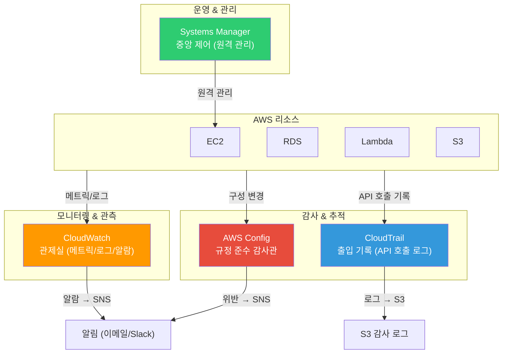
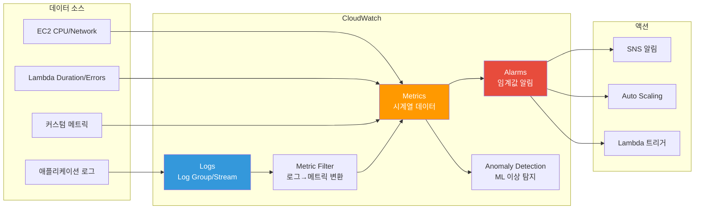
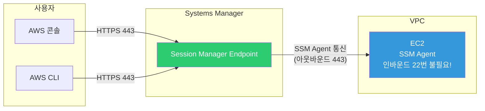
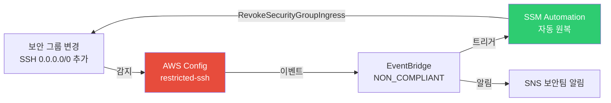

# CloudWatch / CloudTrail / SSM / Config

> [이전 강의](./12-security)에서 KMS, WAF, Shield 같은 AWS 보안 서비스를 배웠어요. 이제 이 모든 리소스를 **모니터링하고, 감사하고, 관리하고, 규정 준수를 검증하는** 관리 서비스를 배워볼게요. [IAM](./01-iam)이 "누가 접근하는지"를 제어하고 보안 서비스가 "데이터를 어떻게 지키는지"를 담당했다면, 이번 강의는 **"지금 무슨 일이 일어나고 있고, 과거에 무슨 일이 있었는지"**를 파악하는 이야기예요.

---

## 🎯 이걸 왜 알아야 하나?

```
실무에서 관리 서비스가 필요한 순간:
• EC2 CPU가 90%를 넘었는데 아무도 몰랐어요                    → CloudWatch Alarm
• 어제 누가 보안 그룹을 변경했는지 추적해야 해요                → CloudTrail
• 서버 100대에 SSH 없이 명령을 실행해야 해요                   → SSM Run Command
• EC2에 접속해야 하는데 22번 포트를 열기 싫어요                 → SSM Session Manager
• "S3 버킷이 퍼블릭으로 열린 적 있나요?" 감사 요청이 왔어요     → AWS Config
• Lambda 에러 로그에서 특정 패턴을 찾아 알림을 보내고 싶어요    → CloudWatch Logs + Metric Filter
• "모든 EC2에 최신 패치가 적용되어 있나요?"                    → SSM Patch Manager
• 면접: "CloudWatch와 CloudTrail 차이점은?"                   → 성능 모니터링 vs API 감사
```

---

## 🧠 핵심 개념

### 비유: 건물 관리 시스템

AWS 관리 서비스를 **대형 건물 관리**에 비유해볼게요.

* **CloudWatch** = 건물 **관제실(모니터링 센터)**. 온도, 전력 사용량, 엘리베이터 상태를 실시간 대시보드로 보여주고, 이상 수치가 감지되면 알람을 울려요.
* **CloudTrail** = 건물 **출입 기록 시스템(CCTV + 출입 로그)**. 누가, 언제, 어디에 출입했는지 전부 기록해요. "3층 서버실 문을 누가 열었지?"를 추적할 때 여기를 봐요.
* **Systems Manager (SSM)** = 건물 **중앙 제어 시스템**. 관리실에서 원격으로 모든 방의 에어컨 온도를 바꾸거나, 소프트웨어 업데이트를 한 번에 할 수 있어요. 각 방에 직접 갈 필요 없이요.
* **AWS Config** = 건물 **규정 준수 감사관**. "비상구가 열리는지", "소화기가 유효기간 내인지" 같은 규정을 자동으로 점검하고 위반 사항을 보고해요.

### AWS 관리 서비스 전체 구조



### CloudWatch 내부 구조



### CloudTrail vs CloudWatch 비교

| 구분 | CloudWatch | CloudTrail |
|------|-----------|------------|
| **비유** | 관제실 대시보드 | CCTV 출입 기록 |
| **대상** | **성능 메트릭** + 로그 | **API 호출** 기록 |
| **질문** | "CPU가 몇 %인가?" | "누가 인스턴스를 종료했나?" |
| **용도** | 모니터링 + 알람 | 감사(Audit) + 추적 |

---

## 🔍 상세 설명

### 1. CloudWatch

CloudWatch는 AWS의 **핵심 모니터링 서비스**예요. [Linux 로깅 기초](../01-linux/08-log)에서 배운 syslog가 단일 서버의 로그를 관리했다면, CloudWatch는 **AWS 전체 리소스의 메트릭과 로그를 중앙에서 관리**해요.

#### Metrics (메트릭)

| 서비스 | 주요 메트릭 | 기본 수집 간격 |
|--------|------------|--------------|
| EC2 | CPUUtilization, NetworkIn/Out, DiskReadOps | 5분 (상세: 1분) |
| RDS | DatabaseConnections, FreeableMemory, ReadIOPS | 1분 |
| Lambda | Duration, Errors, Invocations, Throttles | 1분 |
| ALB | RequestCount, TargetResponseTime, HTTPCode_5XX | 1분 |

> EC2 기본 메트릭에는 **메모리 사용률**과 **디스크 사용량**이 없어요. CloudWatch Agent를 설치해서 커스텀 메트릭으로 수집해야 해요. 면접에서 자주 나오는 포인트예요.

**커스텀 메트릭 & 고해상도 메트릭**

```bash
# 커스텀 메트릭 전송
aws cloudwatch put-metric-data \
    --namespace "MyApp" \
    --metric-name "ActiveUsers" \
    --value 150 \
    --unit "Count" \
    --dimensions Name=Environment,Value=Production

# 1초 간격 고해상도 메트릭 (실시간 트래픽 급증 감지)
aws cloudwatch put-metric-data \
    --namespace "MyApp" \
    --metric-name "TransactionsPerSecond" \
    --value 3500 \
    --unit "Count/Second" \
    --storage-resolution 1    # 1초 해상도 (기본: 60초)
```

| 해상도 | 보존 기간 | 용도 |
|--------|----------|------|
| 1초 (고해상도) | 3시간 | 실시간 급증 감지 |
| 60초 | 15일 | 일반 모니터링 |
| 5분 | 63일 | 추세 분석 |
| 1시간 | 455일 (15개월) | 장기 추세 |

#### Alarms (알람)

3가지 상태: **OK**(정상) / **ALARM**(임계값 초과) / **INSUFFICIENT_DATA**(데이터 부족)

```bash
# EC2 CPU 80% 초과 시 SNS 알림
aws cloudwatch put-metric-alarm \
    --alarm-name "high-cpu-alarm" \
    --alarm-description "EC2 CPU 사용률 80% 초과 알림" \
    --metric-name CPUUtilization \
    --namespace AWS/EC2 \
    --statistic Average \
    --period 300 \
    --threshold 80 \
    --comparison-operator GreaterThanThreshold \
    --evaluation-periods 2 \
    --alarm-actions arn:aws:sns:ap-northeast-2:123456789012:ops-alerts \
    --ok-actions arn:aws:sns:ap-northeast-2:123456789012:ops-alerts \
    --dimensions Name=InstanceId,Value=i-0abc123def456
```

```json
// aws cloudwatch describe-alarms --alarm-names "high-cpu-alarm"
{
    "MetricAlarms": [{
        "AlarmName": "high-cpu-alarm",
        "StateValue": "OK",
        "MetricName": "CPUUtilization",
        "Threshold": 80.0,
        "EvaluationPeriods": 2,
        "ComparisonOperator": "GreaterThanThreshold"
    }]
}
```

> `--evaluation-periods 2`는 "연속 2번(= 10분) 임계값을 초과해야 알람"이라는 뜻이에요. 일시적 스파이크를 무시해요.

**Composite Alarm (복합 알람)**: 여러 알람을 AND/OR로 조합

```bash
aws cloudwatch put-composite-alarm \
    --alarm-name "critical-resource-alarm" \
    --alarm-rule 'ALARM("high-cpu-alarm") AND ALARM("high-memory-alarm")' \
    --alarm-actions arn:aws:sns:ap-northeast-2:123456789012:critical-alerts
```

#### Logs (로그)

**Log Group → Log Stream** 계층 구조로 관리해요.

```
Log Group: /aws/lambda/my-function       ← 함수/서비스 단위
  ├── Log Stream: 2026/03/13/[$LATEST]abc123   ← 인스턴스 단위
  └── Log Stream: 2026/03/13/[$LATEST]def456
```

**보존 기간** (기본값은 무기한 -- 비용 주의!)

```bash
# 보존 기간 30일로 설정
aws logs put-retention-policy \
    --log-group-name /aws/lambda/my-function \
    --retention-in-days 30
```

**로그 검색 (filter-log-events)**

```bash
aws logs filter-log-events \
    --log-group-name /aws/lambda/my-function \
    --filter-pattern "ERROR" \
    --start-time 1710288000000 \
    --end-time 1710374400000 \
    --limit 5
```

```json
{
    "events": [
        {
            "logStreamName": "2026/03/13/[$LATEST]abc123",
            "timestamp": 1710320400000,
            "message": "[ERROR] ConnectionError: Database connection timeout after 30s"
        },
        {
            "logStreamName": "2026/03/13/[$LATEST]abc123",
            "timestamp": 1710324000000,
            "message": "[ERROR] ValueError: Invalid input parameter 'user_id'"
        }
    ]
}
```

**Logs Insights (SQL 유사 쿼리)**

```bash
aws logs start-query \
    --log-group-name /aws/lambda/my-function \
    --start-time $(date -d '1 hour ago' +%s) \
    --end-time $(date +%s) \
    --query-string '
        fields @timestamp, @message
        | filter @message like /ERROR/
        | stats count(*) as error_count by @message
        | sort error_count desc
        | limit 5
    '
```

**구독 필터 & Metric Filter**

```bash
# 구독 필터: ERROR 로그를 Lambda로 실시간 스트리밍
aws logs put-subscription-filter \
    --log-group-name /aws/lambda/my-function \
    --filter-name "error-to-lambda" \
    --filter-pattern "ERROR" \
    --destination-arn arn:aws:lambda:ap-northeast-2:123456789012:function:log-processor

# Metric Filter: 로그 패턴 → 메트릭 변환 → 알람 가능
aws logs put-metric-filter \
    --log-group-name /aws/lambda/my-function \
    --filter-name "ErrorCount" \
    --filter-pattern "ERROR" \
    --metric-transformations \
        metricName=LambdaErrorCount,metricNamespace=MyApp,metricValue=1
```

> 구독 필터 대상: Lambda, Kinesis Data Streams, Kinesis Data Firehose, OpenSearch. Log Group당 **최대 2개**까지예요.

#### Anomaly Detection & Insights

**Anomaly Detection**: ML로 정상 범위(Band)를 학습해서 "평소 대비 비정상"을 감지해요. 고정 임계값이 적절하지 않을 때 유용해요.

**Container Insights** / **Lambda Insights**: ECS/EKS 컨테이너와 Lambda의 상세 성능 메트릭을 수집해요. [K8s 트러블슈팅](../04-kubernetes/14-troubleshooting)에서 Container Insights 활용법도 다뤄요.

---

### 2. CloudTrail

CloudTrail은 AWS 계정의 **모든 API 호출을 기록**하는 감사 서비스예요.

#### Management Events vs Data Events

| 구분 | Management Events | Data Events |
|------|-------------------|-------------|
| **예시** | CreateInstance, DeleteBucket | GetObject(S3), Invoke(Lambda) |
| **기본 기록** | 자동 (무료) | 별도 활성화 (유료) |
| **빈도** | 낮음 | 높음 |
| **비유** | "문을 설치/제거한 기록" | "문을 열고 닫은 기록" |

```bash
# 멀티 리전 Trail 생성
aws cloudtrail create-trail \
    --name my-org-trail \
    --s3-bucket-name my-cloudtrail-logs-bucket \
    --is-multi-region-trail \
    --enable-log-file-validation \
    --include-global-service-events

aws cloudtrail start-logging --name my-org-trail
```

```json
{
    "Name": "my-org-trail",
    "S3BucketName": "my-cloudtrail-logs-bucket",
    "IsMultiRegionTrail": true,
    "LogFileValidationEnabled": true,
    "TrailARN": "arn:aws:cloudtrail:ap-northeast-2:123456789012:trail/my-org-trail"
}
```

#### 이벤트 조회

```bash
# 누가 EC2를 종료했는지 추적
aws cloudtrail lookup-events \
    --lookup-attributes AttributeKey=EventName,AttributeValue=TerminateInstances \
    --max-results 3
```

```json
{
    "Events": [{
        "EventName": "TerminateInstances",
        "EventTime": "2026-03-13T14:30:00+09:00",
        "EventSource": "ec2.amazonaws.com",
        "Username": "developer@example.com",
        "Resources": [{"ResourceType": "AWS::EC2::Instance", "ResourceName": "i-0abc123def456"}]
    }]
}
```

#### Athena로 CloudTrail 로그 쿼리

S3에 저장된 로그를 SQL로 분석할 수 있어요.

```sql
-- 지난 7일간 보안 그룹 변경 이력
SELECT eventTime, userIdentity.userName AS who, eventName AS action, sourceIPAddress
FROM cloudtrail_logs
WHERE eventName IN ('AuthorizeSecurityGroupIngress','RevokeSecurityGroupIngress',
                    'CreateSecurityGroup','DeleteSecurityGroup')
AND eventTime > date_format(date_add('day', -7, now()), '%Y-%m-%dT%H:%i:%sZ')
ORDER BY eventTime DESC;
```

#### Organization Trail & CloudTrail Lake

```bash
# Organization Trail: 모든 계정의 API를 하나의 Trail로 기록
aws cloudtrail create-trail \
    --name org-trail \
    --s3-bucket-name org-cloudtrail-bucket \
    --is-multi-region-trail \
    --is-organization-trail \
    --enable-log-file-validation

# CloudTrail Lake: 관리형 데이터 레이크에 저장 + SQL 쿼리 (S3+Athena보다 간편, 비용 높음)
aws cloudtrail create-event-data-store \
    --name my-event-store \
    --retention-period 90
```

---

### 3. Systems Manager (SSM)

SSM은 EC2를 **중앙에서 관리**하는 서비스예요. SSM Agent + **AmazonSSMManagedInstanceCore** IAM 역할이 필요해요.

#### Session Manager (SSH 없이 접속!)



```bash
aws ssm start-session --target i-0abc123def456
```

```
Starting session with SessionId: developer-0abc123def456
sh-4.2$ whoami
ssm-user
sh-4.2$ hostname
ip-10-0-1-50.ap-northeast-2.compute.internal
sh-4.2$ exit
Exiting session with sessionId: developer-0abc123def456
```

> Session Manager 장점: SSH 키 관리 불필요, 22번 포트 불필요, **모든 세션이 CloudTrail에 기록**, S3/CloudWatch Logs로 세션 로그 저장 가능.

#### Run Command

```bash
# 태그 기반으로 모든 프로덕션 서버에 동시 명령 실행
aws ssm send-command \
    --document-name "AWS-RunShellScript" \
    --targets "Key=tag:Environment,Values=Production" \
    --parameters '{"commands":["df -h","free -m","uptime"]}' \
    --comment "프로덕션 서버 상태 확인"
```

```json
{
    "Command": {
        "CommandId": "cmd-0abc123def456",
        "Status": "Pending",
        "TargetCount": 15,
        "CompletedCount": 0
    }
}
```

```bash
# 결과 확인
aws ssm get-command-invocation \
    --command-id cmd-0abc123def456 \
    --instance-id i-0abc123def456
```

```json
{
    "Status": "Success",
    "StandardOutputContent": "Filesystem  Size  Used Avail Use%\n/dev/xvda1   30G   12G   18G  40%\n\n         total  used  free\nMem:      7982  3214  4768\n\n 14:30:00 up 45 days"
}
```

#### Parameter Store (간략)

> 상세 내용은 [12-security](./12-security) 참고. Standard(무료, 4KB, 10,000개) vs Advanced(유료, 8KB, 100,000개)

```bash
aws ssm get-parameter --name "/prod/myapp/db-endpoint" --with-decryption
```

#### Patch Manager & Automation & Inventory

```bash
# 패치 준수 상태 확인
aws ssm describe-instance-patch-states --instance-ids i-0abc123def456
```

```json
{
    "InstancePatchStates": [{
        "InstanceId": "i-0abc123def456",
        "InstalledCount": 45,
        "MissingCount": 3,
        "FailedCount": 0
    }]
}
```

```bash
# Automation: 골든 AMI 생성 자동화
aws ssm start-automation-execution \
    --document-name "AWS-CreateImage" \
    --parameters '{"InstanceId":["i-0abc123def456"],"NoReboot":["true"],"ImageName":["golden-ami-2026-03-13"]}'

# Inventory: EC2에 설치된 소프트웨어 목록 자동 수집
aws ssm list-inventory-entries \
    --instance-id i-0abc123def456 \
    --type-name "AWS:Application"
```

---

### 4. AWS Config

AWS Config는 리소스의 **구성 변경을 추적**하고 **규정 준수 여부를 자동 평가**하는 서비스예요.

#### Config 활성화 & 규칙

```bash
# Config 레코더 생성 + 시작
aws configservice put-configuration-recorder \
    --configuration-recorder name=default,roleARN=arn:aws:iam::123456789012:role/ConfigRole \
    --recording-group allSupported=true,includeGlobalResourceTypes=true

aws configservice put-delivery-channel \
    --delivery-channel name=default,s3BucketName=my-config-bucket

aws configservice start-configuration-recorder --configuration-recorder-name default

# 관리형 규칙 추가 (S3 퍼블릭 읽기 차단)
aws configservice put-config-rule \
    --config-rule '{
        "ConfigRuleName": "s3-bucket-public-read-prohibited",
        "Source": {"Owner":"AWS","SourceIdentifier":"S3_BUCKET_PUBLIC_READ_PROHIBITED"},
        "Scope": {"ComplianceResourceTypes":["AWS::S3::Bucket"]}
    }'
```

자주 쓰는 관리형 규칙:

| 규칙 이름 | 검사 내용 |
|-----------|----------|
| `s3-bucket-public-read-prohibited` | S3 퍼블릭 읽기 차단 |
| `encrypted-volumes` | EBS 볼륨 암호화 여부 |
| `restricted-ssh` | 보안 그룹 SSH 0.0.0.0/0 차단 |
| `cloudtrail-enabled` | CloudTrail 활성화 여부 |
| `ec2-instance-managed-by-ssm` | EC2가 SSM으로 관리되는지 |

#### 규정 준수 상태 확인

```bash
aws configservice describe-compliance-by-config-rule
```

```json
{
    "ComplianceByConfigRules": [
        {"ConfigRuleName": "s3-bucket-public-read-prohibited", "Compliance": {"ComplianceType": "COMPLIANT"}},
        {"ConfigRuleName": "restricted-ssh", "Compliance": {"ComplianceType": "NON_COMPLIANT"}},
        {"ConfigRuleName": "encrypted-volumes", "Compliance": {"ComplianceType": "COMPLIANT"}}
    ]
}
```

#### 리소스 변경 기록

```bash
aws configservice get-resource-config-history \
    --resource-type AWS::EC2::SecurityGroup \
    --resource-id sg-0abc123def456 \
    --limit 2
```

```json
{
    "configurationItems": [
        {
            "configurationItemCaptureTime": "2026-03-13T14:00:00Z",
            "configuration": "{\"ipPermissions\":[{\"fromPort\":22,\"ipRanges\":[{\"cidrIp\":\"10.0.0.0/8\"}]}]}"
        },
        {
            "configurationItemCaptureTime": "2026-03-12T10:00:00Z",
            "configuration": "{\"ipPermissions\":[{\"fromPort\":22,\"ipRanges\":[{\"cidrIp\":\"0.0.0.0/0\"}]}]}"
        }
    ]
}
```

> 3월 12일에 SSH가 0.0.0.0/0으로 열려 있다가 3월 13일에 10.0.0.0/8으로 수정된 걸 확인할 수 있어요.

#### Conformance Pack & Config + SNS 알림

```bash
# Conformance Pack: 여러 규칙을 묶어서 한 번에 배포 (CIS, PCI DSS 등)
aws configservice put-conformance-pack \
    --conformance-pack-name "CISBenchmark" \
    --template-s3-uri "s3://my-config-bucket/conformance-packs/cis-benchmark.yaml" \
    --delivery-s3-bucket "my-config-bucket"

# NON_COMPLIANT 감지 시 SNS 알림 (EventBridge 연동)
aws events put-rule \
    --name config-noncompliant-alert \
    --event-pattern '{
        "source": ["aws.config"],
        "detail-type": ["Config Rules Compliance Change"],
        "detail": {
            "newEvaluationResult": {"complianceType": ["NON_COMPLIANT"]}
        }
    }'

aws events put-targets \
    --rule config-noncompliant-alert \
    --targets '[{"Id":"sns","Arn":"arn:aws:sns:ap-northeast-2:123456789012:config-alerts"}]'
```

---

## 💻 실습 예제

### 실습 1: CloudWatch 통합 모니터링 파이프라인

시나리오: EC2 웹 서버의 CPU, 메모리, 애플리케이션 에러를 모니터링하고 알림을 보내요.

```bash
# 1단계: CloudWatch Agent로 메모리/디스크 + 애플리케이션 로그 수집
sudo /opt/aws/amazon-cloudwatch-agent/bin/amazon-cloudwatch-agent-ctl \
    -a fetch-config -m ec2 \
    -c file:/opt/aws/amazon-cloudwatch-agent/etc/config.json -s

# 2단계: CPU 알람
aws cloudwatch put-metric-alarm \
    --alarm-name "web-high-cpu" \
    --metric-name CPUUtilization --namespace AWS/EC2 \
    --statistic Average --period 300 --threshold 80 \
    --comparison-operator GreaterThanThreshold --evaluation-periods 2 \
    --alarm-actions arn:aws:sns:ap-northeast-2:123456789012:ops-alerts \
    --ok-actions arn:aws:sns:ap-northeast-2:123456789012:ops-alerts \
    --dimensions Name=InstanceId,Value=i-0abc123def456

# 3단계: 메모리 알람 (커스텀 메트릭)
aws cloudwatch put-metric-alarm \
    --alarm-name "web-high-memory" \
    --metric-name mem_used_percent --namespace MyApp/EC2 \
    --statistic Average --period 300 --threshold 90 \
    --comparison-operator GreaterThanThreshold --evaluation-periods 2 \
    --alarm-actions arn:aws:sns:ap-northeast-2:123456789012:ops-alerts \
    --dimensions Name=InstanceId,Value=i-0abc123def456

# 4단계: 에러 로그 → 메트릭 → 알람
aws logs put-metric-filter \
    --log-group-name /myapp/application \
    --filter-name "AppErrors" \
    --filter-pattern "[timestamp, level = ERROR, ...]" \
    --metric-transformations metricName=AppErrors,metricNamespace=MyApp,metricValue=1

aws cloudwatch put-metric-alarm \
    --alarm-name "app-error-spike" \
    --metric-name AppErrors --namespace MyApp \
    --statistic Sum --period 300 --threshold 5 \
    --comparison-operator GreaterThanThreshold --evaluation-periods 1 \
    --alarm-actions arn:aws:sns:ap-northeast-2:123456789012:ops-alerts

# 5단계: 복합 알람 (CPU + 메모리 동시 → 긴급)
aws cloudwatch put-composite-alarm \
    --alarm-name "critical-server" \
    --alarm-rule 'ALARM("web-high-cpu") AND ALARM("web-high-memory")' \
    --alarm-actions arn:aws:sns:ap-northeast-2:123456789012:critical-alerts
```

---

### 실습 2: CloudTrail 보안 감사 + 로그인 실패 알림

시나리오: 보안 그룹 변경 이력을 추적하고, 콘솔 로그인 실패 시 자동 알림을 보내요.

```bash
# 1단계: CloudTrail → CloudWatch Logs 전송 (실시간 감지용)
aws cloudtrail update-trail \
    --name security-audit-trail \
    --cloud-watch-logs-log-group-arn arn:aws:logs:ap-northeast-2:123456789012:log-group:/aws/cloudtrail:* \
    --cloud-watch-logs-role-arn arn:aws:iam::123456789012:role/CloudTrailToCloudWatchRole

# 2단계: 콘솔 로그인 실패 → Metric Filter → Alarm
aws logs put-metric-filter \
    --log-group-name /aws/cloudtrail \
    --filter-name "ConsoleLoginFailures" \
    --filter-pattern '{ $.eventName = "ConsoleLogin" && $.errorMessage = "Failed authentication" }' \
    --metric-transformations metricName=LoginFailures,metricNamespace=Security,metricValue=1

aws cloudwatch put-metric-alarm \
    --alarm-name "console-login-failures" \
    --metric-name LoginFailures --namespace Security \
    --statistic Sum --period 300 --threshold 5 \
    --comparison-operator GreaterThanThreshold --evaluation-periods 1 \
    --alarm-actions arn:aws:sns:ap-northeast-2:123456789012:security-alerts \
    --alarm-description "5분 내 콘솔 로그인 실패 5회 이상"

# 3단계: Athena에서 보안 그룹 변경 이력 쿼리
# SELECT eventTime, userIdentity.userName, eventName, sourceIPAddress
# FROM cloudtrail_logs WHERE eventName LIKE '%SecurityGroup%'
# ORDER BY eventTime DESC;
```

---

### 실습 3: SSM 패치 관리 + Config 규정 준수 자동화

시나리오: 프로덕션 EC2에 보안 패치를 자동 적용하고, Config로 준수 상태를 모니터링해요.

```bash
# 1단계: 관리 대상 확인
aws ssm describe-instance-information \
    --filters "Key=tag:Environment,Values=Production"

# 2단계: 유지 관리 기간 (매주 일요일 새벽 3시)
aws ssm create-maintenance-window \
    --name "prod-patch-window" \
    --schedule "cron(0 3 ? * SUN *)" \
    --duration 3 --cutoff 1 --allow-unassociated-targets
```

```json
{"WindowId": "mw-0abc123def456"}
```

```bash
# 3단계: 패치 대상 + 태스크 등록
aws ssm register-target-with-maintenance-window \
    --window-id mw-0abc123def456 --resource-type INSTANCE \
    --targets "Key=tag:PatchGroup,Values=Production-Linux"

aws ssm register-task-with-maintenance-window \
    --window-id mw-0abc123def456 --task-type RUN_COMMAND \
    --task-arn "AWS-RunPatchBaseline" \
    --targets "Key=WindowTargetIds,Values=<target-id>" \
    --task-invocation-parameters '{"RunCommand":{"Parameters":{"Operation":["Install"]}}}' \
    --max-concurrency "50%" --max-errors "25%"

# 4단계: Config 규칙으로 패치 준수 모니터링
aws configservice put-config-rule \
    --config-rule '{
        "ConfigRuleName": "ec2-patch-compliance",
        "Source": {"Owner":"AWS","SourceIdentifier":"EC2_MANAGEDINSTANCE_PATCH_COMPLIANCE_STATUS_CHECK"}
    }'

# 5단계: 미준수 시 알림
aws events put-rule \
    --name patch-noncompliant \
    --event-pattern '{
        "source":["aws.config"],
        "detail-type":["Config Rules Compliance Change"],
        "detail":{"configRuleName":["ec2-patch-compliance"],"newEvaluationResult":{"complianceType":["NON_COMPLIANT"]}}
    }'

aws events put-targets --rule patch-noncompliant \
    --targets '[{"Id":"ops","Arn":"arn:aws:sns:ap-northeast-2:123456789012:ops-alerts"}]'
```

---

## 🏢 실무에서는?

### 시나리오 1: 마이크로서비스 중앙 모니터링 (CloudWatch + Container Insights)

```
문제: EKS에서 30개 마이크로서비스를 운영하는데,
      어떤 Pod가 메모리 누수인지, 어떤 서비스에서 에러가 많은지 파악이 안 돼요.

해결: Container Insights + CloudWatch Dashboards + Composite Alarms

구성:
1. Container Insights → 클러스터/서비스/Pod 레벨 메트릭 수집
2. 서비스별 대시보드 → 팀별 P99 지연시간, 에러율, TPS 확인
3. 알람 계층 → L1(팀: 에러율>1%), L2(SRE: 복합 장애), L3(관리자: 클러스터 리소스 부족)
4. 로그 보존 → 개발 7일, 스테이징 14일, 프로덕션 90일
```

> [K8s 트러블슈팅](../04-kubernetes/14-troubleshooting)에서 Container Insights와 kubectl 로그를 함께 활용하는 방법을 배워요.

### 시나리오 2: 보안 사고 자동 대응 (Config + SSM Automation)

```
문제: 누군가 보안 그룹에 SSH 0.0.0.0/0을 열었는데, 발견하기까지 3시간 걸렸어요.

해결: Config Rule → EventBridge → SSM Automation → 자동 원복
```



```
흐름: 보안 그룹 변경 → Config NON_COMPLIANT → EventBridge →
      SSM Automation으로 규칙 자동 제거 + 보안팀 SNS 알림 →
      CloudTrail에서 원본 변경자 확인 → 해당 개발자 교육
```

### 시나리오 3: 멀티 계정 규정 준수 (Config Aggregator + Organization)

```
문제: Organization 하위 50개 계정의 S3 퍼블릭 차단, EBS 암호화,
      CloudTrail 활성화를 일괄 관리하고 싶어요.

해결:
1. Organization Trail → 모든 계정 API를 중앙 S3에 기록
2. Config Aggregator → 전 계정 규정 준수 상태를 한 곳에서 조회
3. Conformance Pack → CIS Benchmark를 Organization 레벨로 배포
4. 비준수 대응 → NON_COMPLIANT → EventBridge → SNS → 해당 팀 슬랙
                심각 위반 (퍼블릭 S3) → SSM Automation → 자동 차단
```

---

## ⚠️ 자주 하는 실수

### 1. CloudWatch Logs 보존 기간을 설정하지 않음

```
❌ 잘못: 보존 기간 기본값(Never Expire) 방치 → 수개월 후 비용 폭탄
✅ 올바른: 환경별 적절한 보존 기간 설정
```

```bash
# 보존 기간 미설정 로그 그룹 찾기
aws logs describe-log-groups \
    --query 'logGroups[?!retentionInDays].logGroupName'

# 일괄 설정
for lg in $(aws logs describe-log-groups \
    --query 'logGroups[?!retentionInDays].logGroupName' --output text); do
    aws logs put-retention-policy --log-group-name "$lg" --retention-in-days 30
done
```

### 2. CloudTrail을 단일 리전에서만 활성화

```
❌ 잘못: ap-northeast-2에서만 Trail → IAM, CloudFront, Route 53 이벤트 누락!
✅ 올바른: --is-multi-region-trail --include-global-service-events 필수
```

> IAM, CloudFront, Route 53, STS는 **글로벌 서비스**라 us-east-1에서 이벤트가 발생해요.

### 3. SSM Agent 권한 없이 Session Manager 접속 시도

```
❌ 잘못: SSM Agent만 설치하고 IAM 역할 안 붙임 → "TargetNotConnected"
✅ 올바른: AmazonSSMManagedInstanceCore 정책 연결 + SSM 엔드포인트 접근 확인
```

```bash
# SSM 관리 인스턴스 확인
aws ssm describe-instance-information \
    --filters "Key=InstanceIds,Values=i-0abc123def456"
# 목록에 안 나타나면: IAM 역할 + 네트워크(인터넷 or VPC 엔드포인트) + Agent 상태 확인
```

### 4. Config 규칙만 만들고 알림/자동 대응을 안 함

```
❌ 잘못: 규칙 20개 만들었지만 NON_COMPLIANT가 떠도 아무도 안 봄
✅ 올바른: Config 규칙 + EventBridge + SNS 알림 (+ SSM Automation 자동 대응)
```

### 5. CloudWatch 알람에 OK 액션을 설정하지 않음

```
❌ 잘못: ALARM 때만 알림 → 복구되었는지 알 수 없어서 계속 걱정
✅ 올바른: --alarm-actions + --ok-actions 모두 설정 → 장애 발생/복구 양쪽 통보
```

---

## AWS GenAI 서비스 (2023~)

최근 AWS는 관리/운영 서비스에 **생성형 AI 기능**을 빠르게 통합하고 있어요. 운영 관점에서 알아야 할 핵심 서비스 두 가지를 짚어볼게요.

### Amazon Bedrock

Bedrock은 **여러 AI 모델을 API로 통합 제공**하는 완전 관리형 서비스예요. 직접 모델을 호스팅하거나 학습시킬 필요 없이, API 호출만으로 AI 기능을 사용할 수 있어요.

```
Bedrock의 핵심 개념:

┌──────────────────────────────────────────┐
│             Amazon Bedrock               │
├──────────────────────────────────────────┤
│  Foundation Models (FM)                  │
│  ├ Anthropic Claude (텍스트/코드)         │
│  ├ Amazon Titan (텍스트/이미지/임베딩)     │
│  ├ Meta Llama (오픈소스 LLM)             │
│  ├ Stability AI (이미지 생성)             │
│  └ Cohere (텍스트/임베딩)                 │
├──────────────────────────────────────────┤
│  주요 기능                                │
│  ├ Model Access — API로 FM 호출          │
│  ├ Knowledge Bases — RAG 구성             │
│  ├ Agents — 외부 도구 연동 AI 에이전트     │
│  ├ Guardrails — 콘텐츠 필터링/안전장치    │
│  └ Fine-tuning — 커스텀 모델 미세 조정     │
└──────────────────────────────────────────┘
```

**운영에서 Bedrock을 만나는 상황:**

- CloudWatch에서 Bedrock 호출량/지연시간/에러율 모니터링
- CloudTrail에서 어떤 모델이 언제 호출되었는지 감사
- IAM 정책으로 특정 모델 접근을 팀별로 제한
- 비용 관리: 모델별 토큰 단위 과금 (입력/출력 토큰 각각 과금)

### Amazon Q

Amazon Q는 AWS가 만든 **AI 어시스턴트** 시리즈예요. 용도별로 여러 제품이 있어요.

```
Amazon Q 제품군:

┌─────────────────────┬────────────────────────────────────────┐
│ 제품                 │ 역할                                   │
├─────────────────────┼────────────────────────────────────────┤
│ Amazon Q Developer  │ IDE에서 코드 생성/리뷰/변환 (VS Code)   │
│ Amazon Q Business   │ 기업 데이터 기반 Q&A (RAG)              │
│ Amazon Q in Console │ AWS 콘솔에서 서비스 질문/트러블슈팅       │
│ Amazon Q in Connect │ 고객센터 AI 응대                        │
└─────────────────────┴────────────────────────────────────────┘
```

**운영 관점에서 유용한 Amazon Q 기능:**

- **Q in Console**: "이 EC2가 왜 연결이 안 돼요?" 같은 질문에 답변
- **Q Developer**: 코드 리뷰, 보안 취약점 스캔, Java 8→17 변환 자동화
- **CloudWatch 통합**: 이상 탐지 결과를 자연어로 요약

### GenAI 보안 고려사항

```
GenAI 서비스 운영 시 보안 체크리스트:

✅ IAM 정책으로 모델 접근 범위 제한
   - bedrock:InvokeModel 권한을 특정 모델 ARN으로 한정
   - 민감한 모델(고비용/고성능)은 승인된 팀만 사용

✅ 데이터 프라이버시
   - Bedrock은 고객 데이터로 모델을 재학습하지 않음
   - VPC Endpoint 사용으로 트래픽을 AWS 네트워크 내부로 유지
   - Guardrails로 민감 정보(PII) 필터링 설정

✅ 비용 관리
   - 토큰 기반 과금 → CloudWatch 메트릭으로 사용량 추적
   - Bedrock 모델별 처리량 프로비저닝으로 비용 예측
   - Budgets 알람으로 AI 비용 급증 감지

✅ 감사 (Audit)
   - CloudTrail로 모든 Bedrock API 호출 기록
   - 누가, 어떤 모델을, 언제 호출했는지 추적 가능
```

---

## 📝 정리

```
서비스 한눈에 보기:

┌──────────────────┬──────────────────────────────────────────────┐
│ 서비스            │ 핵심 역할                                     │
├──────────────────┼──────────────────────────────────────────────┤
│ CloudWatch       │ 메트릭 수집 + 로그 관리 + 알람 + 대시보드       │
│  ├ Metrics       │ 기본/커스텀/고해상도 (1초~5분)                  │
│  ├ Logs          │ Log Group/Stream, Insights, 구독 필터          │
│  ├ Alarms        │ OK/ALARM/INSUFFICIENT_DATA, 복합 알람          │
│  └ Anomaly Det.  │ ML 정상 범위 학습, 이상 탐지                    │
├──────────────────┼──────────────────────────────────────────────┤
│ CloudTrail       │ 모든 API 호출 기록 (관리 + 데이터 이벤트)       │
│  └ Athena/Lake   │ S3 로그 SQL 분석                              │
├──────────────────┼──────────────────────────────────────────────┤
│ SSM              │ EC2 중앙 관리 (SSH 없이!)                      │
│  ├ Session Mgr   │ 포트 22 불필요, 세션 감사 로깅                  │
│  ├ Run Command   │ 다수 서버 동시 명령 실행                        │
│  └ Patch Manager │ OS 패치 자동 스케줄링                          │
├──────────────────┼──────────────────────────────────────────────┤
│ AWS Config       │ 리소스 구성 변경 추적 + 규정 준수 자동 평가      │
│  ├ Rules         │ 관리형 200+ / 커스텀 Lambda                    │
│  └ Conformance   │ 규칙 묶음 (CIS, PCI DSS)                      │
└──────────────────┴──────────────────────────────────────────────┘
```

**면접 대비 키워드:**

```
Q: CloudWatch와 CloudTrail 차이?
A: CloudWatch = 성능 모니터링 (메트릭, 로그, 알람).
   CloudTrail = API 감사 (누가 무엇을 했는지). 완전히 다른 역할.

Q: EC2 메모리를 CloudWatch에서 못 보는 이유?
A: 메모리는 OS 내부 메트릭이라 하이퍼바이저에서 수집 불가.
   CloudWatch Agent 설치 후 커스텀 메트릭으로 전송해야 함.

Q: SSM Session Manager의 장점?
A: SSH 키/22번 포트 불필요, 모든 세션이 CloudTrail 기록,
   세션 로그 S3/CloudWatch 저장 가능, IAM 기반 접근 제어.

Q: Config vs CloudTrail?
A: CloudTrail = "누가 API를 호출했는지" (행위 기록).
   Config = "리소스 구성이 규정에 맞는지" (상태 평가).
```

---

## 🔗 다음 강의 → [14-cost](./14-cost)

다음 강의에서는 AWS 비용 관리 서비스(Cost Explorer, Budgets, Savings Plans, Reserved Instances)를 배워요. 이번에 배운 CloudWatch로 비용 알람을 설정하는 방법도 함께 다룰게요.
