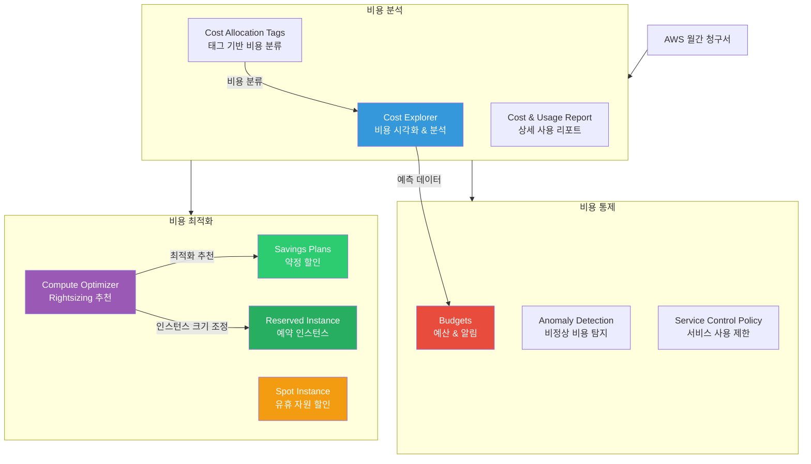
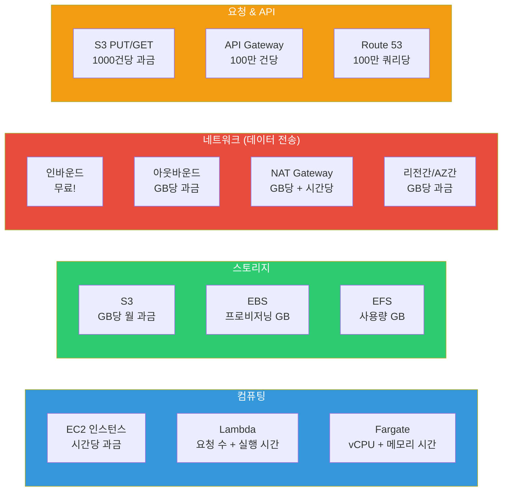
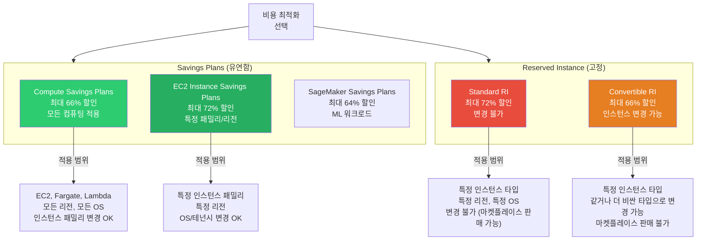

# Cost Explorer / Budgets / Savings Plans

> [이전 강의](./13-management)에서 CloudWatch, CloudTrail 등 AWS 관리 서비스를 배웠다면, 이제 **돈 이야기**를 해볼 차례예요. 아무리 좋은 아키텍처를 만들어도 비용을 관리하지 않으면 다음 달 청구서를 보고 놀라게 돼요. 이번 강의에서는 AWS 비용 구조를 이해하고, 분석(Cost Explorer), 예산 관리(Budgets), 절약(Savings Plans/Reserved Instance)하는 방법을 배워요.

---

## 🎯 이걸 왜 알아야 하나?

```
실무에서 비용 관리가 필요한 순간:
• "이번 달 AWS 비용이 왜 갑자기 200만원 올랐지?"         → Cost Explorer 분석
• "팀별로 얼마나 쓰고 있는지 알고 싶어요"                → 태그 기반 비용 분석
• "월 예산 500만원 초과하면 알림 보내줘"                  → Budgets 알림
• "개발 환경 비용이 너무 나와요"                          → 예산 자동 조치 (EC2 중지)
• "EC2를 항상 5대 이상 쓰는데 할인 방법 없나요?"         → Savings Plans / RI
• "Spot으로 바꿨더니 70% 절감됐어요"                     → Spot 비용 전략
• "S3 비용이 매달 늘어나요"                              → 스토리지 최적화
• "NAT Gateway 비용이 EC2보다 더 나와요"                 → VPC Endpoint 전환
• 면접: "AWS 비용 최적화 경험 말씀해주세요"               → 이 강의 전체
```

클라우드는 "쓴 만큼 내는" 모델이에요. 하지만 뭘 얼마나 쓰고 있는지 모르면, 가계부 없이 신용카드를 쓰는 것과 같아요. **Cost Explorer는 가계부**, **Budgets은 예산 한도**, **Savings Plans은 통신비 약정 할인**이에요.

---

## 🧠 핵심 개념

### 비유: 가계부와 통신비 요금제

AWS 비용 관리를 **가정 경제**에 비유하면 이해하기 쉬워요.

| 현실 세계 | AWS |
|-----------|-----|
| 매달 오는 신용카드 명세서 | AWS 청구서 (Billing) |
| 가계부 앱 (소비 분석) | Cost Explorer |
| "이번 달 외식비 30만원까지만!" | Budgets (예산 한도) |
| 통신비 약정 (2년 약정 = 할인) | Savings Plans |
| 정기 구독 (넷플릭스 연간 결제) | Reserved Instance |
| 할인 마트 (싸지만 재고 한정) | Spot Instance |
| 전기 요금 (기본료 + 사용량) | AWS 과금 구조 (고정 + 종량) |
| "냉장고가 전기 많이 먹네?" | 리소스별 비용 분석 |
| 정기 구독 정리 (안 쓰는 OTT 해지) | 유휴 리소스 정리 |

### AWS 비용 관리 서비스 전체 구조



### AWS 과금 구조 (4가지 축)

AWS 비용은 크게 **4가지 축**으로 나뉘어요. 이걸 이해해야 비용 분석과 최적화를 제대로 할 수 있어요.



**핵심**: 데이터를 AWS로 **넣는 것(인바운드)은 무료**이지만, **꺼내는 것(아웃바운드)은 유료**예요. 이것 때문에 NAT Gateway 비용이 생각보다 많이 나와요. ([VPC 강의](./02-vpc) 참고)

### 프리 티어 (Free Tier) 정리

```
AWS 프리 티어는 3가지 유형이 있어요:

1. 12개월 무료 (계정 생성 후 12개월간)
   • EC2 t2.micro/t3.micro: 750시간/월 (리눅스)
   • S3: 5GB 표준 스토리지
   • RDS: db.t2.micro/db.t3.micro 750시간/월
   • EBS: 30GB (gp2/gp3)
   • CloudFront: 1TB 아웃바운드/월

2. 항상 무료
   • Lambda: 100만 건 요청 + 40만 GB-초/월
   • DynamoDB: 25GB 스토리지 + 25 WCU/RCU
   • SNS: 100만 건 발행/월
   • CloudWatch: 기본 모니터링, 10 Alarms
   • Parameter Store Standard: 무료

3. 단기 체험 (Trial)
   • GuardDuty: 30일 무료
   • Inspector: 15일 무료
   • Macie: 30일 무료
```

### 리전별 가격 차이

같은 EC2 인스턴스라도 리전에 따라 가격이 다르고, 서울(ap-northeast-2)은 미국(us-east-1)보다 약 10~20% 비싸요.

```
m6i.large On-Demand 가격 비교 (Linux, 시간당):

us-east-1 (버지니아)    : $0.096
us-west-2 (오레곤)      : $0.096
eu-west-1 (아일랜드)    : $0.107
ap-northeast-2 (서울)   : $0.118    ← 약 23% 더 비쌈
ap-northeast-1 (도쿄)   : $0.124

→ 연간 24/7 운영 시: 서울 $1,034 vs 버지니아 $841 (차이 $193/년/대)
→ 100대 운영하면 연간 $19,300 차이!
```

### Savings Plans vs Reserved Instance 비교



---

## 🔍 상세 설명

### 1. AWS 비용 구조 상세

#### 과금 단위 정리

```
서비스별 과금 단위:

┌─────────────────┬──────────────────────┬─────────────────────────┐
│ 서비스           │ 과금 단위             │ 예시 (서울 리전)          │
├─────────────────┼──────────────────────┼─────────────────────────┤
│ EC2             │ 초 단위 (최소 60초)    │ m6i.large: $0.118/시간   │
│ EBS (gp3)       │ GB-월               │ $0.096/GB-월             │
│ S3 Standard     │ GB-월 + 요청 수       │ $0.025/GB-월             │
│ S3 GET 요청     │ 1,000건             │ $0.00035/1,000건         │
│ S3 PUT 요청     │ 1,000건             │ $0.0045/1,000건          │
│ NAT Gateway     │ 시간 + GB            │ $0.059/시간 + $0.059/GB  │
│ ALB             │ 시간 + LCU           │ $0.0252/시간 + LCU 비용  │
│ Lambda          │ 요청 수 + GB-초       │ $0.20/100만건            │
│ Fargate         │ vCPU-시간 + GB-시간   │ $0.04656/vCPU-시간       │
│ RDS             │ 시간 + 스토리지 GB     │ db.r6g.large: $0.29/시간 │
│ 데이터 전송 OUT  │ GB (첫 1GB 무료)     │ $0.126/GB (서울 → 인터넷) │
│ AZ 간 전송       │ GB (양방향)          │ $0.01/GB                 │
└─────────────────┴──────────────────────┴─────────────────────────┘
```

> **함정 주의**: NAT Gateway는 **시간당 비용 + 데이터 전송 비용** 이중으로 나와요. 24/7 운영하면 시간당 비용만 월 $43, 여기에 전송 비용이 추가돼요. [VPC 강의](./02-vpc)에서 NAT Gateway 구성을 참고하세요.

#### 데이터 전송 비용 흐름

```
데이터 전송 비용 규칙:

인터넷 → AWS         : 무료 (인바운드)
AWS → 인터넷          : 유료 ($0.09~$0.126/GB, 리전마다 다름)
같은 AZ 내 (Private IP) : 무료
AZ 간 전송            : $0.01/GB (양방향, 편도 각각 과금)
리전 간 전송           : $0.02/GB (양방향)
같은 리전 S3 → EC2    : 무료 (같은 리전이면)
CloudFront → S3       : 무료 (오리진 전송)
VPC Endpoint → S3     : 무료 (Gateway Endpoint)
```

### 2. Cost Explorer 상세

Cost Explorer는 AWS 비용을 **시각화하고 분석**하는 도구예요. 가계부 앱처럼 "어디에 돈을 많이 쓰고 있는지", "앞으로 얼마나 쓸 것 같은지" 알려줘요.

#### 주요 기능

```
Cost Explorer 핵심 기능:

1. 비용 시각화
   • 일별/월별/연별 비용 그래프
   • 서비스별, 계정별, 리전별 분류
   • 태그별 비용 (팀별, 프로젝트별)

2. 필터 & 그룹화
   • 서비스, 리전, 계정, 인스턴스 타입, 태그 등
   • 최대 2개 그룹 동시 적용

3. 비용 예측 (Forecast)
   • 과거 데이터 기반 향후 12개월 예측
   • 80% / 95% 신뢰 구간 제공

4. Savings Plans 추천
   • 과거 사용 패턴 분석 → 최적 커밋 금액 추천
   • 예상 절감 금액 계산

5. Reserved Instance 추천
   • 사용률 분석 → RI 구매 추천
   • 가동률/커버리지 리포트
```

#### CLI: 비용 조회

```bash
# 이번 달 서비스별 비용 조회
aws ce get-cost-and-usage \
    --time-period Start=2026-03-01,End=2026-03-13 \
    --granularity MONTHLY \
    --metrics "BlendedCost" "UnblendedCost" "UsageQuantity" \
    --group-by Type=DIMENSION,Key=SERVICE
```

```json
{
    "ResultsByTime": [
        {
            "TimePeriod": {
                "Start": "2026-03-01",
                "End": "2026-03-13"
            },
            "Groups": [
                {
                    "Keys": ["Amazon Elastic Compute Cloud - Compute"],
                    "Metrics": {
                        "BlendedCost": { "Amount": "1234.56", "Unit": "USD" },
                        "UnblendedCost": { "Amount": "1234.56", "Unit": "USD" },
                        "UsageQuantity": { "Amount": "8640.0", "Unit": "Hrs" }
                    }
                },
                {
                    "Keys": ["Amazon Simple Storage Service"],
                    "Metrics": {
                        "BlendedCost": { "Amount": "456.78", "Unit": "USD" },
                        "UnblendedCost": { "Amount": "456.78", "Unit": "USD" },
                        "UsageQuantity": { "Amount": "10240.0", "Unit": "GB-Mo" }
                    }
                },
                {
                    "Keys": ["Amazon Relational Database Service"],
                    "Metrics": {
                        "BlendedCost": { "Amount": "890.12", "Unit": "USD" },
                        "UnblendedCost": { "Amount": "890.12", "Unit": "USD" },
                        "UsageQuantity": { "Amount": "2160.0", "Unit": "Hrs" }
                    }
                },
                {
                    "Keys": ["Amazon EC2 Other"],
                    "Metrics": {
                        "BlendedCost": { "Amount": "320.45", "Unit": "USD" },
                        "UnblendedCost": { "Amount": "320.45", "Unit": "USD" },
                        "UsageQuantity": { "Amount": "5120.0", "Unit": "GB" }
                    }
                }
            ],
            "Total": {
                "BlendedCost": { "Amount": "2901.91", "Unit": "USD" },
                "UnblendedCost": { "Amount": "2901.91", "Unit": "USD" }
            }
        }
    ]
}
```

> **팁**: `Amazon EC2 Other`에 NAT Gateway, EBS, Elastic IP 비용이 포함돼요. EC2 인스턴스 비용과 별도로 분류되므로 놓치기 쉬워요.

```bash
# 태그 기반 비용 분석 (팀별 비용)
# 사전 조건: Cost Allocation Tags가 활성화되어 있어야 해요
aws ce get-cost-and-usage \
    --time-period Start=2026-02-01,End=2026-03-01 \
    --granularity MONTHLY \
    --metrics "UnblendedCost" \
    --group-by Type=TAG,Key=Team
```

```json
{
    "ResultsByTime": [
        {
            "TimePeriod": {
                "Start": "2026-02-01",
                "End": "2026-03-01"
            },
            "Groups": [
                {
                    "Keys": ["Team$backend"],
                    "Metrics": {
                        "UnblendedCost": { "Amount": "2450.00", "Unit": "USD" }
                    }
                },
                {
                    "Keys": ["Team$frontend"],
                    "Metrics": {
                        "UnblendedCost": { "Amount": "380.00", "Unit": "USD" }
                    }
                },
                {
                    "Keys": ["Team$data"],
                    "Metrics": {
                        "UnblendedCost": { "Amount": "1890.00", "Unit": "USD" }
                    }
                },
                {
                    "Keys": ["Team$"],
                    "Metrics": {
                        "UnblendedCost": { "Amount": "520.00", "Unit": "USD" }
                    }
                }
            ]
        }
    ]
}
```

> **주의**: `Team$` (빈 값)은 태그가 없는 리소스예요. 태깅 정책이 잘 안 지켜지면 이 금액이 커져요.

```bash
# 일별 비용 추이 확인 (최근 7일)
aws ce get-cost-and-usage \
    --time-period Start=2026-03-06,End=2026-03-13 \
    --granularity DAILY \
    --metrics "UnblendedCost" \
    --group-by Type=DIMENSION,Key=SERVICE
```

```bash
# 비용 예측 (이번 달 말까지)
aws ce get-cost-forecast \
    --time-period Start=2026-03-13,End=2026-04-01 \
    --metric UNBLENDED_COST \
    --granularity MONTHLY
```

```json
{
    "Total": {
        "Amount": "4250.00",
        "Unit": "USD"
    },
    "ForecastResultsByTime": [
        {
            "TimePeriod": {
                "Start": "2026-03-13",
                "End": "2026-04-01"
            },
            "MeanValue": "4250.00",
            "PredictionIntervalLowerBound": "3800.00",
            "PredictionIntervalUpperBound": "4700.00"
        }
    ]
}
```

> 이번 달 예상 비용은 $4,250이고, 95% 확률로 $3,800~$4,700 사이일 것으로 예측돼요.

### 3. Budgets 상세

Budgets은 **예산을 설정하고, 초과 시 알림을 보내고, 자동 조치**까지 할 수 있는 서비스예요. 가정에서 "이번 달 외식비 30만원 넘으면 카드사 알림 보내줘"와 같은 개념이에요.

#### 예산 유형

```
Budgets 4가지 유형:

1. 비용 예산 (Cost Budget)
   • "월 $5,000 넘으면 알림"
   • 서비스별, 태그별, 계정별 설정 가능

2. 사용량 예산 (Usage Budget)
   • "EC2 2,000시간 넘으면 알림"
   • "S3 GET 요청 1억 건 넘으면 알림"

3. RI 활용률 예산 (RI Utilization Budget)
   • "Reserved Instance 활용률 80% 미만이면 알림"
   • 돈 내고 산 RI를 안 쓰면 낭비!

4. Savings Plans 활용률 예산 (SP Utilization Budget)
   • "Savings Plans 활용률 80% 미만이면 알림"
   • 커밋 금액 대비 실제 사용량 모니터링
```

#### 알림 임계값 설정 패턴

```
실무에서 권장하는 알림 설정:

월 예산 $5,000 기준:
├─ 50% ($2,500)  → 정보 알림 (이메일)         ← "절반 썼어요"
├─ 80% ($4,000)  → 경고 알림 (이메일 + SNS)   ← "주의하세요"
├─ 100% ($5,000) → 긴급 알림 (이메일 + SNS)   ← "예산 초과!"
└─ 예측 100%     → 사전 알림 (예산 초과 예측)   ← "이대로면 초과할 것 같아요"
```

#### CLI: 예산 생성

```bash
# 월별 비용 예산 생성 ($5,000 한도)
aws budgets create-budget \
    --account-id 123456789012 \
    --budget '{
        "BudgetName": "monthly-total-cost",
        "BudgetLimit": {
            "Amount": "5000",
            "Unit": "USD"
        },
        "BudgetType": "COST",
        "TimeUnit": "MONTHLY",
        "CostFilters": {},
        "CostTypes": {
            "IncludeTax": true,
            "IncludeSubscription": true,
            "UseBlended": false,
            "IncludeRefund": false,
            "IncludeCredit": false,
            "IncludeSupport": true
        }
    }' \
    --notifications-with-subscribers '[
        {
            "Notification": {
                "NotificationType": "ACTUAL",
                "ComparisonOperator": "GREATER_THAN",
                "Threshold": 80,
                "ThresholdType": "PERCENTAGE"
            },
            "Subscribers": [
                {
                    "SubscriptionType": "EMAIL",
                    "Address": "devops-team@example.com"
                },
                {
                    "SubscriptionType": "SNS",
                    "Address": "arn:aws:sns:ap-northeast-2:123456789012:budget-alerts"
                }
            ]
        },
        {
            "Notification": {
                "NotificationType": "ACTUAL",
                "ComparisonOperator": "GREATER_THAN",
                "Threshold": 100,
                "ThresholdType": "PERCENTAGE"
            },
            "Subscribers": [
                {
                    "SubscriptionType": "EMAIL",
                    "Address": "devops-team@example.com"
                }
            ]
        },
        {
            "Notification": {
                "NotificationType": "FORECASTED",
                "ComparisonOperator": "GREATER_THAN",
                "Threshold": 100,
                "ThresholdType": "PERCENTAGE"
            },
            "Subscribers": [
                {
                    "SubscriptionType": "EMAIL",
                    "Address": "devops-team@example.com"
                }
            ]
        }
    ]'
```

```
# 출력 결과 (성공 시)
(빈 출력 = 성공)

# 생성 확인
aws budgets describe-budgets --account-id 123456789012
```

```json
{
    "Budgets": [
        {
            "BudgetName": "monthly-total-cost",
            "BudgetLimit": {
                "Amount": "5000.0",
                "Unit": "USD"
            },
            "CostFilters": {},
            "BudgetType": "COST",
            "TimeUnit": "MONTHLY",
            "CalculatedSpend": {
                "ActualSpend": {
                    "Amount": "2901.91",
                    "Unit": "USD"
                },
                "ForecastedSpend": {
                    "Amount": "4250.00",
                    "Unit": "USD"
                }
            }
        }
    ]
}
```

#### Budget Actions: 자동 조치

예산 초과 시 **자동으로 리소스를 제어**할 수 있어요. 개발 환경에서 유용해요.

```bash
# 예산 초과 시 IAM 정책으로 EC2 생성 차단하는 자동 조치
aws budgets create-budget-action \
    --account-id 123456789012 \
    --budget-name "dev-env-budget" \
    --notification-type ACTUAL \
    --action-type APPLY_IAM_POLICY \
    --action-threshold ActionThresholdValue=100,ActionThresholdType=PERCENTAGE \
    --definition '{
        "IamActionDefinition": {
            "PolicyArn": "arn:aws:iam::123456789012:policy/DenyEC2Launch",
            "Roles": ["dev-team-role"]
        }
    }' \
    --execution-role-arn arn:aws:iam::123456789012:role/BudgetActionRole \
    --approval-model AUTOMATIC \
    --subscribers '[{
        "SubscriptionType": "EMAIL",
        "Address": "devops-team@example.com"
    }]'
```

```
자동 조치 유형:

1. APPLY_IAM_POLICY    → IAM 정책 적용 (서비스 사용 제한)
2. APPLY_SCP_POLICY    → SCP 적용 (조직 단위 제한)
3. RUN_SSM_DOCUMENTS   → SSM 실행 (EC2 중지 등)
```

### 4. Savings Plans 상세

Savings Plans은 **"매 시간 최소 $X를 쓸게요"라고 약정하면 할인**해주는 제도예요. 통신비 약정과 비슷해요: "2년 약정하면 요금제 30% 할인"과 같은 구조예요.

#### 3가지 유형 비교

```
Savings Plans 유형별 비교:

┌───────────────────────┬───────────────────────┬───────────────────────┐
│ Compute Savings Plans │ EC2 Instance SP       │ SageMaker SP          │
├───────────────────────┼───────────────────────┼───────────────────────┤
│ 할인율: 최대 66%       │ 할인율: 최대 72%       │ 할인율: 최대 64%       │
├───────────────────────┼───────────────────────┼───────────────────────┤
│ 적용 대상:             │ 적용 대상:             │ 적용 대상:             │
│ • EC2                 │ • EC2 Only            │ • SageMaker Only      │
│ • Fargate             │                       │                       │
│ • Lambda              │                       │                       │
├───────────────────────┼───────────────────────┼───────────────────────┤
│ 유연성:                │ 유연성:                │ 유연성:                │
│ • 리전 변경 OK         │ • 리전 고정             │ • 리전 고정             │
│ • 인스턴스 패밀리 변경  │ • 인스턴스 패밀리 고정   │ • 인스턴스 패밀리 고정   │
│ • OS 변경 OK          │ • OS 변경 OK           │ • 컴포넌트 변경 가능    │
│ • 테넌시 변경 OK       │ • 테넌시 변경 OK        │                       │
├───────────────────────┼───────────────────────┼───────────────────────┤
│ 약정: 1년 / 3년        │ 약정: 1년 / 3년        │ 약정: 1년 / 3년        │
├───────────────────────┼───────────────────────┼───────────────────────┤
│ 결제: All/Partial/No   │ 결제: All/Partial/No   │ 결제: All/Partial/No   │
│ Upfront              │ Upfront              │ Upfront              │
└───────────────────────┴───────────────────────┴───────────────────────┘

결제 옵션별 할인율 (Compute SP, 3년 기준):
• All Upfront (전액 선납)      → 최대 66% 할인
• Partial Upfront (일부 선납)  → 최대 63% 할인
• No Upfront (선납 없음)       → 최대 60% 할인
```

#### Savings Plans 동작 방식

```
커밋 금액: $10/시간

시간당 사용량에 따른 적용:
├─ 사용량 $8/시간  → $8 할인 적용, $2 낭비 (커밋만큼 못 쓴 경우)
├─ 사용량 $10/시간 → $10 전부 할인 적용 (딱 맞는 경우)
└─ 사용량 $15/시간 → $10 할인 적용, $5는 On-Demand 가격 (초과분)
```

> **핵심**: 커밋 금액보다 적게 쓰면 차액은 환불 안 돼요. 과거 사용 패턴을 Cost Explorer에서 분석하고 **보수적으로 커밋 금액을 설정**하는 게 중요해요.

### 5. Reserved Instance 상세

#### Standard vs Convertible

```
Reserved Instance 비교:

┌─────────────────┬──────────────────────┬──────────────────────┐
│                 │ Standard RI          │ Convertible RI       │
├─────────────────┼──────────────────────┼──────────────────────┤
│ 할인율           │ 최대 72%             │ 최대 66%              │
│ 인스턴스 변경     │ 불가                 │ 같거나 더 비싼 타입 OK │
│ 마켓플레이스 판매 │ 가능                 │ 불가                  │
│ 약정 기간        │ 1년 / 3년            │ 1년 / 3년             │
│ 적합한 경우      │ 워크로드가 확실할 때   │ 변경 가능성이 있을 때   │
└─────────────────┴──────────────────────┴──────────────────────┘

결제 옵션:
• All Upfront: 전액 선납 → 최대 할인
• Partial Upfront: 50% 선납 + 월 청구 → 중간 할인
• No Upfront: 선납 없이 월 청구 → 최소 할인
```

#### Savings Plans vs Reserved Instance 선택 가이드

```
선택 기준:

워크로드가 EC2, Fargate, Lambda에 걸쳐 있다?
├─ YES → Compute Savings Plans (가장 유연)
└─ NO → EC2만 쓴다?
         ├─ 인스턴스 타입이 확정적이다?
         │    ├─ YES + 중간에 안 쓸 수도 있다 → Standard RI (마켓플레이스 판매 가능)
         │    └─ YES + 확실히 계속 쓴다 → EC2 Instance SP (RI와 비슷한 할인, 더 유연)
         └─ 인스턴스 타입이 바뀔 수 있다?
              └─ Convertible RI 또는 Compute SP

실무 추천:
1순위: Compute Savings Plans (유연성 최고, 할인도 충분)
2순위: EC2 Instance Savings Plans (EC2 Only라면)
3순위: Convertible RI (변경 가능성 있을 때)
4순위: Standard RI (확실한 워크로드에만)
```

### 6. Spot Instance 비용 전략

[EC2/Auto Scaling 강의](./03-ec2-autoscaling)에서 Spot Instance의 동작 원리를 배웠어요. 여기서는 **비용 관점**에서 추가로 살펴볼게요.

```
Spot Instance 비용 절감 효과:

m6i.large (서울 리전) 비교:
• On-Demand: $0.118/시간 × 730시간 = $86.14/월
• Spot:      $0.035/시간 × 730시간 = $25.55/월  (약 70% 절감)

100대 운영 시 월간 절감: ($86.14 - $25.55) × 100 = $6,059/월

단, Spot은 언제든 회수될 수 있으므로:
✅ 적합: 배치 작업, CI/CD, 데이터 분석, 테스트 환경
❌ 부적합: 프로덕션 API 서버, 데이터베이스, 상태 저장 서비스
```

### 7. 비용 최적화 전략

#### 전략 1: 태깅 정책

```
필수 태그 표준 (예시):

┌──────────┬───────────────────┬────────────────────────┐
│ 태그 키   │ 예시 값            │ 용도                    │
├──────────┼───────────────────┼────────────────────────┤
│ Team     │ backend, frontend │ 팀별 비용 추적           │
│ Env      │ prod, dev, staging│ 환경별 비용 추적         │
│ Project  │ user-service      │ 프로젝트별 비용 추적      │
│ Owner    │ kim@example.com   │ 리소스 책임자             │
│ CostCenter│ CC-1234          │ 부서 비용 센터            │
└──────────┴───────────────────┴────────────────────────┘
```

```bash
# 태깅 강제를 위한 SCP (태그 없으면 EC2 생성 차단)
# 이 정책은 AWS Organizations에서 적용해요
cat <<'EOF'
{
    "Version": "2012-10-17",
    "Statement": [
        {
            "Sid": "RequireTagOnEC2",
            "Effect": "Deny",
            "Action": "ec2:RunInstances",
            "Resource": "arn:aws:ec2:*:*:instance/*",
            "Condition": {
                "Null": {
                    "aws:RequestTag/Team": "true",
                    "aws:RequestTag/Env": "true"
                }
            }
        }
    ]
}
EOF
```

#### 전략 2: Rightsizing (Compute Optimizer)

```bash
# Compute Optimizer 활성화
aws compute-optimizer update-enrollment-status --status Active
```

```bash
# EC2 Rightsizing 추천 확인
aws compute-optimizer get-ec2-instance-recommendations \
    --instance-arns arn:aws:ec2:ap-northeast-2:123456789012:instance/i-0abc123def456
```

```json
{
    "instanceRecommendations": [
        {
            "instanceArn": "arn:aws:ec2:ap-northeast-2:123456789012:instance/i-0abc123def456",
            "instanceName": "api-server-1",
            "currentInstanceType": "m6i.xlarge",
            "finding": "OVER_PROVISIONED",
            "findingReasonCodes": ["CPUOverprovisioned", "MemoryOverprovisioned"],
            "utilizationMetrics": [
                { "name": "CPU", "statistic": "MAXIMUM", "value": 22.5 },
                { "name": "MEMORY", "statistic": "MAXIMUM", "value": 35.0 }
            ],
            "recommendationOptions": [
                {
                    "instanceType": "m6i.large",
                    "projectedUtilizationMetrics": [
                        { "name": "CPU", "statistic": "MAXIMUM", "value": 45.0 }
                    ],
                    "estimatedMonthlySavings": {
                        "currency": "USD",
                        "value": 86.14
                    },
                    "rank": 1
                },
                {
                    "instanceType": "t3.xlarge",
                    "projectedUtilizationMetrics": [
                        { "name": "CPU", "statistic": "MAXIMUM", "value": 40.0 }
                    ],
                    "estimatedMonthlySavings": {
                        "currency": "USD",
                        "value": 62.05
                    },
                    "rank": 2
                }
            ]
        }
    ]
}
```

> `m6i.xlarge`를 `m6i.large`로 줄이면 월 $86 절약이 가능해요. CPU 최대 사용률이 22.5%밖에 안 되니, 인스턴스가 과잉 프로비저닝된 거예요.

#### 전략 3: S3 스토리지 최적화

[S3 강의](./04-storage)에서 스토리지 클래스를 배웠어요. 비용 관점에서 **Intelligent-Tiering**이 핵심이에요.

```
S3 스토리지 클래스별 비용 (서울 리전, GB-월):

Standard              : $0.025    (자주 접근)
Intelligent-Tiering   : $0.025    (자동 분류, 모니터링 비용 $0.0025/1000객체)
Standard-IA           : $0.0138   (가끔 접근, 최소 30일)
One Zone-IA           : $0.011    (가끔 접근, 단일 AZ)
Glacier Instant       : $0.005    (아카이브, 즉시 접근)
Glacier Flexible      : $0.0045   (아카이브, 3~5시간)
Glacier Deep Archive  : $0.002    (장기 보관, 12시간)

→ 10TB를 Standard에서 Glacier Deep Archive로 변경하면:
  ($0.025 - $0.002) × 10,240 = $235.52/월 절약!
```

#### 전략 4: NAT Gateway 비용 절감

```
NAT Gateway 비용이 비싼 이유:
1. 시간당 비용: $0.059/시간 × 730시간 = $43.07/월 (AZ당)
2. 데이터 전송: $0.059/GB
3. 고가용성(2 AZ) 구성 시: $43.07 × 2 = $86.14/월 (데이터 전송 제외)

절감 방법:
├─ S3 접근 → VPC Gateway Endpoint (무료!) ← 가장 효과적
├─ DynamoDB 접근 → VPC Gateway Endpoint (무료!)
├─ ECR/CloudWatch/STS → VPC Interface Endpoint ($0.014/시간, 하지만 NAT보다 쌀 수 있음)
└─ 개발 환경 → NAT Instance (t3.micro) 사용 (월 $10 이하)
```

> [VPC 강의](./02-vpc)에서 VPC Endpoint 구성 방법을 자세히 다뤘어요.

#### 전략 5: 유휴 리소스 정리

```bash
# 사용하지 않는 EBS 볼륨 찾기 (available 상태 = 연결 안 됨)
aws ec2 describe-volumes \
    --filters Name=status,Values=available \
    --query 'Volumes[].{ID:VolumeId,Size:Size,Type:VolumeType,Created:CreateTime}' \
    --output table
```

```
----------------------------------------------------------
|                    DescribeVolumes                       |
+-------------+-----+----------+-------------------------+
|   Created   | ID  |  Size    |   Type                  |
+-------------+-----+----------+-------------------------+
| 2025-11-15  | vol-0abc1 | 100 | gp3                   |
| 2025-09-22  | vol-0def2 | 500 | gp3                   |
| 2026-01-03  | vol-0ghi3 |  50 | gp3                   |
+-------------+-----+----------+-------------------------+

→ 650GB의 미사용 EBS 볼륨: 650 × $0.096 = $62.40/월 낭비
```

```bash
# 연결되지 않은 Elastic IP 찾기 (연결 안 하면 과금!)
aws ec2 describe-addresses \
    --query 'Addresses[?AssociationId==null].{IP:PublicIp,AllocId:AllocationId}' \
    --output table
```

```
-----------------------------------------------
|             DescribeAddresses                |
+------------------+--------------------------+
|     AllocId      |           IP             |
+------------------+--------------------------+
| eipalloc-0abc123 |  13.125.xxx.xxx          |
| eipalloc-0def456 |  52.79.xxx.xxx           |
+------------------+--------------------------+

→ 미사용 EIP 2개: 2 × $0.005/시간 × 730시간 = $7.30/월
```

---

## 💻 실습 예제

### 실습 1: Cost Explorer로 비용 분석 대시보드 만들기

시나리오: 이번 달 비용을 서비스별, 일별로 분석하고 향후 비용을 예측해요.

```bash
# 1단계: 이번 달 서비스별 비용 TOP 5 확인
aws ce get-cost-and-usage \
    --time-period Start=2026-03-01,End=2026-03-13 \
    --granularity MONTHLY \
    --metrics "UnblendedCost" \
    --group-by Type=DIMENSION,Key=SERVICE \
    --query 'ResultsByTime[0].Groups | sort_by(@, &to_number(Metrics.UnblendedCost.Amount)) | reverse(@) | [:5]'
```

```json
[
    {
        "Keys": ["Amazon Elastic Compute Cloud - Compute"],
        "Metrics": { "UnblendedCost": { "Amount": "1234.56", "Unit": "USD" } }
    },
    {
        "Keys": ["Amazon Relational Database Service"],
        "Metrics": { "UnblendedCost": { "Amount": "890.12", "Unit": "USD" } }
    },
    {
        "Keys": ["Amazon Simple Storage Service"],
        "Metrics": { "UnblendedCost": { "Amount": "456.78", "Unit": "USD" } }
    },
    {
        "Keys": ["Amazon EC2 Other"],
        "Metrics": { "UnblendedCost": { "Amount": "320.45", "Unit": "USD" } }
    },
    {
        "Keys": ["Amazon Elastic Container Service for Kubernetes"],
        "Metrics": { "UnblendedCost": { "Amount": "180.00", "Unit": "USD" } }
    }
]
```

```bash
# 2단계: 일별 비용 추이 (비용 급증 포인트 확인)
aws ce get-cost-and-usage \
    --time-period Start=2026-03-01,End=2026-03-13 \
    --granularity DAILY \
    --metrics "UnblendedCost" \
    --query 'ResultsByTime[].{Date:TimePeriod.Start,Cost:Total.UnblendedCost.Amount}' \
    --output table
```

```
---------------------------------
|      GetCostAndUsage          |
+------------+------------------+
|    Date    |       Cost       |
+------------+------------------+
| 2026-03-01 |  210.50          |
| 2026-03-02 |  215.30          |
| 2026-03-03 |  212.80          |
| 2026-03-04 |  218.90          |
| 2026-03-05 |  380.20          |  ← 비용 급증!
| 2026-03-06 |  375.10          |
| 2026-03-07 |  370.80          |
| 2026-03-08 |  220.50          |
| 2026-03-09 |  215.60          |
| 2026-03-10 |  218.40          |
| 2026-03-11 |  221.30          |
| 2026-03-12 |  222.51          |
+------------+------------------+

→ 3/5~3/7에 비용이 급증! 원인을 찾아보자
```

```bash
# 3단계: 비용 급증 구간 상세 분석 (어떤 서비스가 올랐나?)
aws ce get-cost-and-usage \
    --time-period Start=2026-03-04,End=2026-03-06 \
    --granularity DAILY \
    --metrics "UnblendedCost" \
    --group-by Type=DIMENSION,Key=SERVICE
```

```json
{
    "ResultsByTime": [
        {
            "TimePeriod": { "Start": "2026-03-04", "End": "2026-03-05" },
            "Groups": [
                { "Keys": ["Amazon Elastic Compute Cloud - Compute"], "Metrics": { "UnblendedCost": { "Amount": "120.00" } } },
                { "Keys": ["Amazon EC2 Other"], "Metrics": { "UnblendedCost": { "Amount": "30.00" } } }
            ]
        },
        {
            "TimePeriod": { "Start": "2026-03-05", "End": "2026-03-06" },
            "Groups": [
                { "Keys": ["Amazon Elastic Compute Cloud - Compute"], "Metrics": { "UnblendedCost": { "Amount": "280.00" } } },
                { "Keys": ["Amazon EC2 Other"], "Metrics": { "UnblendedCost": { "Amount": "30.00" } } }
            ]
        }
    ]
}
```

> EC2 Compute 비용이 $120 -> $280으로 급증! Auto Scaling이 동작했거나 누군가 대형 인스턴스를 띄운 거예요. [EC2/Auto Scaling 강의](./03-ec2-autoscaling) 참고.

```bash
# 4단계: 이번 달 비용 예측
aws ce get-cost-forecast \
    --time-period Start=2026-03-13,End=2026-04-01 \
    --metric UNBLENDED_COST \
    --granularity MONTHLY
```

```json
{
    "Total": { "Amount": "6800.00", "Unit": "USD" },
    "ForecastResultsByTime": [
        {
            "TimePeriod": { "Start": "2026-03-13", "End": "2026-04-01" },
            "MeanValue": "6800.00",
            "PredictionIntervalLowerBound": "6200.00",
            "PredictionIntervalUpperBound": "7400.00"
        }
    ]
}
```

> 이번 달 예상 비용 $6,800! 예산 $5,000을 초과할 것으로 예측되네요. 즉시 원인 분석과 조치가 필요해요.

---

### 실습 2: Budgets으로 팀별 예산 관리 + 자동 조치

시나리오: 개발팀 환경에 월 $1,000 예산을 설정하고, 초과 시 EC2 생성을 자동으로 차단해요.

```bash
# 1단계: 개발 환경 전용 예산 생성 (태그 필터: Env=dev)
aws budgets create-budget \
    --account-id 123456789012 \
    --budget '{
        "BudgetName": "dev-env-monthly",
        "BudgetLimit": {
            "Amount": "1000",
            "Unit": "USD"
        },
        "BudgetType": "COST",
        "TimeUnit": "MONTHLY",
        "CostFilters": {
            "TagKeyValue": ["user:Env$dev"]
        },
        "CostTypes": {
            "IncludeTax": true,
            "IncludeSubscription": true,
            "UseBlended": false
        }
    }' \
    --notifications-with-subscribers '[
        {
            "Notification": {
                "NotificationType": "ACTUAL",
                "ComparisonOperator": "GREATER_THAN",
                "Threshold": 50,
                "ThresholdType": "PERCENTAGE"
            },
            "Subscribers": [{
                "SubscriptionType": "EMAIL",
                "Address": "dev-lead@example.com"
            }]
        },
        {
            "Notification": {
                "NotificationType": "ACTUAL",
                "ComparisonOperator": "GREATER_THAN",
                "Threshold": 80,
                "ThresholdType": "PERCENTAGE"
            },
            "Subscribers": [{
                "SubscriptionType": "EMAIL",
                "Address": "dev-lead@example.com"
            },
            {
                "SubscriptionType": "SNS",
                "Address": "arn:aws:sns:ap-northeast-2:123456789012:budget-alerts"
            }]
        },
        {
            "Notification": {
                "NotificationType": "ACTUAL",
                "ComparisonOperator": "GREATER_THAN",
                "Threshold": 100,
                "ThresholdType": "PERCENTAGE"
            },
            "Subscribers": [{
                "SubscriptionType": "EMAIL",
                "Address": "devops-team@example.com"
            }]
        }
    ]'
```

```bash
# 2단계: EC2 생성 차단 IAM 정책 생성
aws iam create-policy \
    --policy-name DenyEC2Launch \
    --policy-document '{
        "Version": "2012-10-17",
        "Statement": [
            {
                "Sid": "DenyEC2RunInstances",
                "Effect": "Deny",
                "Action": [
                    "ec2:RunInstances",
                    "ec2:StartInstances"
                ],
                "Resource": "*"
            }
        ]
    }'
```

```json
{
    "Policy": {
        "PolicyName": "DenyEC2Launch",
        "PolicyId": "ANPA1234567890EXAMPLE",
        "Arn": "arn:aws:iam::123456789012:policy/DenyEC2Launch",
        "Path": "/",
        "DefaultVersionId": "v1"
    }
}
```

```bash
# 3단계: Budget Action 생성 (100% 초과 시 IAM 정책 자동 적용)
aws budgets create-budget-action \
    --account-id 123456789012 \
    --budget-name "dev-env-monthly" \
    --notification-type ACTUAL \
    --action-type APPLY_IAM_POLICY \
    --action-threshold ActionThresholdValue=100,ActionThresholdType=PERCENTAGE \
    --definition '{
        "IamActionDefinition": {
            "PolicyArn": "arn:aws:iam::123456789012:policy/DenyEC2Launch",
            "Roles": ["dev-team-role"]
        }
    }' \
    --execution-role-arn arn:aws:iam::123456789012:role/BudgetActionRole \
    --approval-model AUTOMATIC \
    --subscribers '[{
        "SubscriptionType": "EMAIL",
        "Address": "devops-team@example.com"
    }]'
```

```json
{
    "AccountId": "123456789012",
    "BudgetName": "dev-env-monthly",
    "ActionId": "a1b2c3d4-5678-90ab-cdef-EXAMPLE11111"
}
```

```bash
# 4단계: 예산 현황 확인
aws budgets describe-budget \
    --account-id 123456789012 \
    --budget-name "dev-env-monthly"
```

```json
{
    "Budget": {
        "BudgetName": "dev-env-monthly",
        "BudgetLimit": { "Amount": "1000.0", "Unit": "USD" },
        "BudgetType": "COST",
        "TimeUnit": "MONTHLY",
        "CalculatedSpend": {
            "ActualSpend": { "Amount": "420.00", "Unit": "USD" },
            "ForecastedSpend": { "Amount": "980.00", "Unit": "USD" }
        }
    }
}
```

> 현재 $420 사용 (42%), 예측 $980 (98%). 아슬아슬하네요! 예측 기반 알림이 작동해서 사전에 대응할 수 있어요.

---

### 실습 3: Savings Plans 분석 및 구매 시뮬레이션

시나리오: 현재 EC2 On-Demand 비용을 분석하고, Savings Plans 구매 시 얼마나 절약할 수 있는지 확인해요.

```bash
# 1단계: 현재 RI/SP 커버리지 확인 (얼마나 할인 적용되고 있는지)
aws ce get-savings-plans-coverage \
    --time-period Start=2026-02-01,End=2026-03-01 \
    --granularity MONTHLY
```

```json
{
    "SavingsPlansCoverages": [
        {
            "TimePeriod": { "Start": "2026-02-01", "End": "2026-03-01" },
            "Attributes": {},
            "Coverage": {
                "SpendCoveredBySavingsPlans": "0.00",
                "OnDemandCost": "3500.00",
                "TotalCost": "3500.00",
                "CoveragePercentage": "0.0"
            }
        }
    ]
}
```

> 커버리지 0%! 전혀 Savings Plans을 사용하고 있지 않아요. $3,500 전액 On-Demand 가격으로 내고 있어요.

```bash
# 2단계: Savings Plans 구매 추천 확인
aws ce get-savings-plans-purchase-recommendation \
    --savings-plans-type COMPUTE_SP \
    --term-in-years ONE_YEAR \
    --payment-option NO_UPFRONT \
    --lookback-period-in-days SIXTY_DAYS
```

```json
{
    "SavingsPlansPurchaseRecommendation": {
        "SavingsPlansType": "COMPUTE_SP",
        "TermInYears": "ONE_YEAR",
        "PaymentOption": "NO_UPFRONT",
        "LookbackPeriodInDays": "SIXTY_DAYS",
        "SavingsPlansPurchaseRecommendationDetails": [
            {
                "HourlyCommitmentToPurchase": "3.20",
                "EstimatedSavingsAmount": "840.00",
                "EstimatedSavingsPercentage": "24.0",
                "EstimatedOnDemandCost": "3500.00",
                "EstimatedSPCost": "2660.00",
                "CurrentAverageHourlyOnDemandSpend": "4.79",
                "EstimatedAverageUtilization": "95.0",
                "UpfrontCost": "0.00",
                "EstimatedMonthlySavingsAmount": "840.00"
            }
        ],
        "SavingsPlansPurchaseRecommendationSummary": {
            "EstimatedTotalCost": "2660.00",
            "EstimatedMonthlySavingsAmount": "840.00",
            "EstimatedSavingsPercentage": "24.0",
            "HourlyCommitmentToPurchase": "3.20"
        }
    }
}
```

> AWS가 추천하는 내용:
> - **시간당 $3.20 커밋** (Compute Savings Plans, 1년, No Upfront)
> - **월 $840 절약** (연간 $10,080!)
> - 예상 활용률 95% (거의 낭비 없음)

```bash
# 3단계: 3년 약정 + All Upfront일 때와 비교
aws ce get-savings-plans-purchase-recommendation \
    --savings-plans-type COMPUTE_SP \
    --term-in-years THREE_YEARS \
    --payment-option ALL_UPFRONT \
    --lookback-period-in-days SIXTY_DAYS \
    --query 'SavingsPlansPurchaseRecommendation.SavingsPlansPurchaseRecommendationSummary'
```

```json
{
    "EstimatedTotalCost": "1890.00",
    "EstimatedMonthlySavingsAmount": "1610.00",
    "EstimatedSavingsPercentage": "46.0",
    "HourlyCommitmentToPurchase": "2.59"
}
```

```
Savings Plans 옵션 비교 요약:

┌──────────────┬───────────────┬───────────┬──────────────┐
│ 옵션          │ 월 비용        │ 월 절약    │ 절감률        │
├──────────────┼───────────────┼───────────┼──────────────┤
│ On-Demand    │ $3,500        │ -         │ -            │
│ 1년 No Upfront│ $2,660        │ $840      │ 24%          │
│ 3년 All Upfront│ $1,890       │ $1,610    │ 46%          │
└──────────────┴───────────────┴───────────┴──────────────┘

→ 3년 All Upfront는 46% 절감이지만, 선납금이 크고 3년 동안 묶여요.
→ 처음에는 1년 No Upfront로 시작해서, 패턴이 안정되면 3년으로 전환하는 게 안전해요.
```

---

## 🏢 실무에서는?

### 시나리오 1: 스타트업의 월별 비용 관리 체계 구축

```
문제: AWS 비용이 매달 예측 불가능하게 변동하고,
      어느 팀/서비스가 얼마나 쓰는지 파악이 안 돼요.

해결: 태그 기반 비용 추적 + Budgets 알림 + 월별 비용 리뷰
```

```
구축 순서:

1. 태깅 정책 수립
   ├─ 필수 태그: Team, Env, Project, Owner
   ├─ Cost Allocation Tags 활성화 (Billing 콘솔)
   └─ SCP로 태그 없는 리소스 생성 차단

2. Budgets 설정
   ├─ 전체 예산: 월 $10,000
   ├─ 팀별 예산: backend $5,000, frontend $2,000, data $3,000
   ├─ 환경별 예산: prod $7,000, dev $2,000, staging $1,000
   └─ 알림: 50% / 80% / 100% / 예측 100%

3. 월별 비용 리뷰 프로세스
   ├─ 매월 첫째 주: 전월 비용 분석 미팅
   ├─ Cost Explorer에서 TOP 5 비용 서비스 확인
   ├─ 비정상 증가 항목 원인 분석
   └─ Rightsizing / 유휴 리소스 정리 액션 아이템

4. 자동화
   ├─ AWS Cost Anomaly Detection 활성화
   ├─ Lambda로 미사용 리소스 자동 알림
   └─ 개발 환경 야간/주말 EC2 자동 중지 (EventBridge 스케줄)
```

### 시나리오 2: 대규모 서비스의 Savings Plans 도입

```
문제: EC2 + Fargate 혼합 환경에서 월 $50,000을 On-Demand로 내고 있어요.
      비용 최적화를 해야 하는데, RI와 SP 중 뭘 사야 할지 모르겠어요.

해결: Compute Savings Plans + Spot 혼합 전략
```

```
비용 최적화 전략:

현재 상황:
• EC2 On-Demand: $30,000/월
• Fargate On-Demand: $15,000/월
• 기타 (EBS, 전송 등): $5,000/월
• 합계: $50,000/월

최적화 후:
├─ 안정적 워크로드 (70%): Compute Savings Plans (3년 Partial Upfront)
│   → $45,000 × 70% × 40% 할인 = $12,600/월 절약
├─ 배치/CI/CD (20%): Spot Instance
│   → $45,000 × 20% × 70% 할인 = $6,300/월 절약
├─ 피크 대응 (10%): On-Demand (유지)
│   → $45,000 × 10% = $4,500/월
└─ 기타 최적화: Rightsizing + 유휴 리소스 정리
    → 예상 $2,000/월 추가 절약

최적화 후 예상 비용: $50,000 - $20,900 = $29,100/월 (42% 절감)
연간 절감: $250,800
```

> [Container Services 강의](./09-container-services)에서 Fargate 비용 구조를 자세히 다뤘어요. Fargate도 Compute Savings Plans으로 할인받을 수 있다는 점이 RI 대비 큰 장점이에요.

### 시나리오 3: 개발 환경 비용 절감 자동화

```
문제: 개발/스테이징 환경 EC2가 야간/주말에도 24/7 돌아가서
      불필요한 비용이 월 $3,000 이상 나와요.

해결: EventBridge + Lambda로 야간/주말 자동 중지
```

```
자동화 스케줄:

평일 (월~금):
├─ 09:00 KST: EC2 시작 (dev/staging 태그)
└─ 20:00 KST: EC2 중지

주말 (토~일):
└─ 종일 중지

예상 절감:
• 평일 야간 (13시간 × 22일 = 286시간): 약 39% 절감
• 주말 (48시간 × 4주 = 192시간): 약 26% 절감
• 합계: 약 65% 절감!

$3,000 × 65% = $1,950/월 절약
```

```bash
# EventBridge 스케줄 규칙 생성 (평일 저녁 8시 EC2 중지)
# cron 형식: cron(분 시 일 월 요일 년)
# UTC 기준이므로 KST 20:00 = UTC 11:00
aws events put-rule \
    --name "stop-dev-ec2-weeknight" \
    --schedule-expression "cron(0 11 ? * MON-FRI *)" \
    --description "평일 저녁 8시(KST) 개발 EC2 중지"

# Lambda 함수를 타겟으로 설정 (EC2 중지 Lambda는 별도 생성)
aws events put-targets \
    --rule "stop-dev-ec2-weeknight" \
    --targets '[{
        "Id": "stop-dev-instances",
        "Arn": "arn:aws:lambda:ap-northeast-2:123456789012:function:stop-dev-ec2",
        "Input": "{\"action\": \"stop\", \"tag_key\": \"Env\", \"tag_value\": \"dev\"}"
    }]'
```

---

## ⚠️ 자주 하는 실수

### 1. Savings Plans 커밋 금액을 과다하게 설정

```
❌ 잘못: Cost Explorer 추천 금액을 그대로 100% 커밋
         → 워크로드가 줄어도 커밋 금액만큼 계속 청구돼요!
```

```
✅ 올바른: 추천 금액의 70~80%로 보수적으로 시작
          → 안정되면 점진적으로 올리기

예시:
• 추천 커밋: $10/시간
• 1차 구매: $7/시간 (70%)
• 3개월 후 활용률 확인 → 95% 이상이면
• 2차 구매: $2/시간 추가 → 총 $9/시간
```

### 2. 태그 없이 리소스를 만들어서 비용 추적 불가

```
❌ 잘못: EC2, RDS, S3를 태그 없이 생성
         → Cost Explorer에서 "Team$" (태그 없음)으로 분류
         → "이 비용이 어느 팀 건지 모르겠어요..."
```

```
✅ 올바른: 태깅 정책 수립 + SCP/IAM으로 강제 + 정기 감사
```

```bash
# 태그 없는 EC2 인스턴스 찾기
aws ec2 describe-instances \
    --query 'Reservations[].Instances[?!Tags || !contains(Tags[].Key, `Team`)].{ID:InstanceId,Type:InstanceType,State:State.Name}' \
    --output table
```

```
---------------------------------------------
|            DescribeInstances               |
+--------------------+----------+-----------+
|         ID         |  Type    |  State    |
+--------------------+----------+-----------+
| i-0abc123def456789 | m6i.large| running   |
| i-0def456ghi789012 | t3.small | running   |
+--------------------+----------+-----------+

→ Team 태그 없는 EC2 2대 발견! 즉시 태그 추가 필요
```

### 3. NAT Gateway 비용을 간과

```
❌ 잘못: Private Subnet의 모든 아웃바운드 트래픽을 NAT Gateway로 보냄
         → S3, DynamoDB, ECR 트래픽까지 전부 NAT Gateway 경유
         → NAT Gateway 데이터 전송 비용 폭탄
```

```
✅ 올바른: AWS 서비스 접근은 VPC Endpoint를 사용
```

```
비용 비교 (월 1TB S3 데이터 전송 기준):

NAT Gateway 경유:
• 시간당 비용: $0.059 × 730시간 = $43.07
• 데이터 전송: $0.059 × 1,024GB = $60.42
• 합계: $103.49/월

S3 Gateway Endpoint 사용:
• 시간당 비용: $0 (무료!)
• 데이터 전송: $0 (무료!)
• 합계: $0/월

→ VPC Endpoint 하나로 월 $103 절약! 10TB면 월 $647 절약!
```

> [VPC 강의](./02-vpc)에서 Gateway Endpoint와 Interface Endpoint 설정 방법을 확인하세요.

### 4. Reserved Instance를 마켓플레이스에서 못 파는 경우

```
❌ 잘못: Convertible RI를 구매한 뒤, 워크로드가 줄어서 팔려고 했더니
         → Convertible RI는 마켓플레이스 판매가 안 돼요!
         → 남은 기간 동안 낭비
```

```
✅ 올바른: 판매 가능성을 고려한 선택
```

```
RI 구매 전 체크리스트:
1. 워크로드가 1년/3년간 유지될 확신이 있는가?
   ├─ 확신 있음 → Standard RI (최대 할인 + 판매 가능)
   ├─ 변경 가능성 → Convertible RI (변경 가능, 판매 불가)
   └─ 불확실 → Savings Plans (가장 유연)

2. 인스턴스 타입이 바뀔 수 있는가?
   ├─ 고정 → Standard RI or EC2 Instance SP
   └─ 변동 → Compute Savings Plans

3. 선불 납부 가능한 예산이 있는가?
   ├─ 충분 → All Upfront (최대 할인)
   └─ 부족 → No Upfront (할인 적지만 초기 비용 없음)
```

### 5. 비용 알림만 설정하고 대응하지 않음

```
❌ 잘못: Budgets 알림을 설정했지만, 이메일이 오면 "나중에 봐야지" 하고 무시
         → 월말에 예산 200% 초과된 청구서를 받게 됨
```

```
✅ 올바른: 알림 수신 → 즉시 분석 → 조치까지 프로세스화
```

```
비용 알림 대응 프로세스:

1. 50% 도달 알림 수신
   └─ 확인만: "반 왔구나, 정상 범위"

2. 80% 도달 알림 수신
   └─ 분석: Cost Explorer에서 비용 급증 원인 확인
   └─ 조치: 불필요한 리소스 정리, Rightsizing 검토

3. 100% 초과 알림 수신
   └─ 긴급 분석: 어떤 서비스/팀에서 초과했는지 확인
   └─ 즉시 조치: 개발 환경 EC2 중지, 유휴 리소스 삭제
   └─ 보고: 경영진/팀 리더에게 원인 + 대책 공유

4. 예측 초과 알림 수신
   └─ 사전 대응: 아직 초과 전이므로 예방 조치
   └─ 추세 분석: 어떤 서비스가 증가 추세인지 확인
```

---

## 📝 정리

```
AWS 비용 관리 서비스 한눈에 보기:

┌─────────────────────────┬──────────────────────────────────────┐
│ 서비스/기능              │ 핵심 역할                             │
├─────────────────────────┼──────────────────────────────────────┤
│ Cost Explorer           │ 비용 시각화, 필터/그룹, 예측, 추천     │
│ Budgets                 │ 예산 설정, 알림, 자동 조치              │
│ Cost Allocation Tags    │ 태그 기반 비용 분류 (팀/프로젝트별)      │
│ Compute Savings Plans   │ 가장 유연한 약정 할인 (EC2+Fargate+Lambda) │
│ EC2 Instance SP         │ EC2 특화 약정 할인 (높은 할인율)         │
│ Standard RI             │ 최대 할인 + 마켓플레이스 판매 가능       │
│ Convertible RI          │ 인스턴스 변경 가능, 판매 불가            │
│ Spot Instance           │ 최대 90% 할인, 중단 가능               │
│ Compute Optimizer       │ Rightsizing 추천 (과잉 프로비저닝 탐지)  │
│ Cost Anomaly Detection  │ ML 기반 비정상 비용 탐지                │
└─────────────────────────┴──────────────────────────────────────┘
```

**핵심 포인트:**

1. **비용 구조 이해**: 컴퓨팅, 스토리지, 네트워크(특히 데이터 전송), 요청 - 4가지 축으로 나뉘어요. 인바운드는 무료, 아웃바운드는 유료!
2. **Cost Explorer 활용**: 서비스별/태그별 비용 분석, 비용 예측, Savings Plans 추천을 적극 활용하세요.
3. **Budgets 필수 설정**: 최소 50% / 80% / 100% / 예측 100% 4단계 알림은 꼭 설정하세요.
4. **Savings Plans 우선**: RI보다 Savings Plans이 유연하고 관리가 쉬워요. Compute SP부터 시작하세요.
5. **태깅은 비용 관리의 기본**: 태그 없으면 비용 추적이 불가능해요. SCP로 태깅을 강제하세요.
6. **NAT Gateway 비용 주의**: VPC Endpoint(S3, DynamoDB)를 활용하면 큰 비용을 절약할 수 있어요.
7. **Rightsizing 정기 점검**: Compute Optimizer로 과잉 프로비저닝된 인스턴스를 분기마다 점검하세요.

**면접 대비 키워드:**

```
Q: Savings Plans과 Reserved Instance의 차이는?
A: Savings Plans은 "시간당 커밋 금액"을 약정하고 유연하게 적용 (리전/인스턴스 변경 가능).
   RI는 "특정 인스턴스 타입"을 예약하고 고정 할인. SP가 더 유연하고 Fargate/Lambda도 적용 가능.

Q: 비용 최적화를 어떻게 하셨나요?
A: 1) 태그 기반 비용 가시성 확보 → 2) Budgets 알림으로 예산 통제
   → 3) Rightsizing으로 과잉 프로비저닝 제거 → 4) Savings Plans으로 안정 워크로드 할인
   → 5) Spot으로 비상태 워크로드 할인 → 6) VPC Endpoint로 NAT 비용 절감

Q: NAT Gateway 비용이 많이 나오는데 어떻게 줄이나요?
A: S3, DynamoDB는 Gateway Endpoint(무료)를 사용하고,
   ECR, CloudWatch 등은 Interface Endpoint를 검토.
   개발 환경은 NAT Instance(t3.micro)로 대체 가능.

Q: 개발 환경 비용 절감 방법은?
A: 야간/주말 자동 중지(EventBridge + Lambda)로 65% 절감,
   Spot Instance 활용, 태그별 Budgets으로 팀별 예산 제한,
   Budget Actions로 예산 초과 시 리소스 생성 자동 차단.
```

---

## 🔗 다음 강의 → [15-multi-account](./15-multi-account)

다음 강의에서는 AWS Organizations, Control Tower, 멀티 계정 전략을 배워요. 이번에 배운 비용 관리를 **조직 전체**에 적용하려면 멀티 계정 구조가 필요해요. SCP로 태깅을 강제하고, 통합 결제(Consolidated Billing)로 볼륨 할인을 받는 방법을 알아볼게요.
