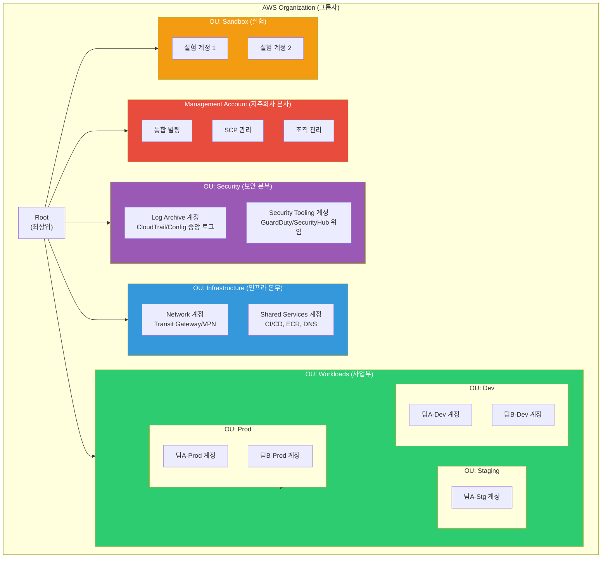
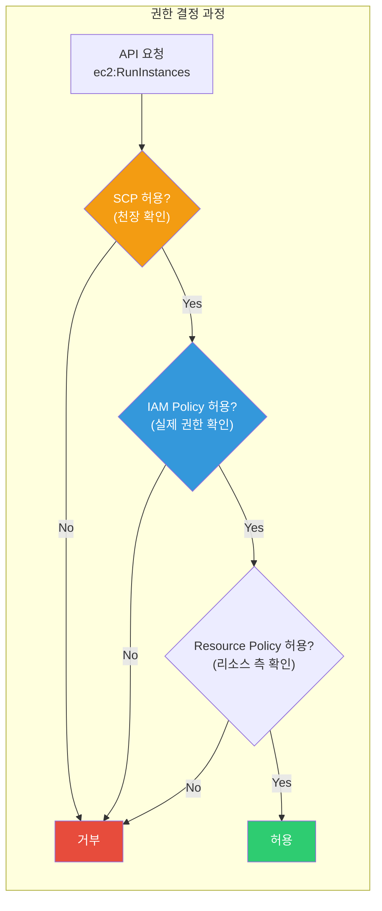
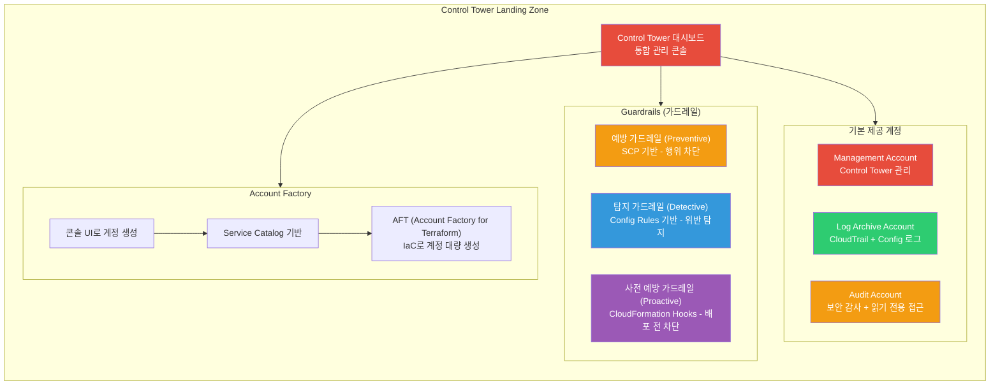
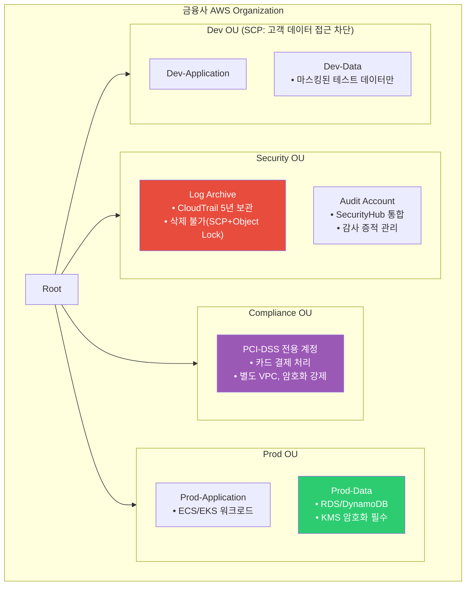

# Organizations / Control Tower

> [이전 강의](./14-cost)에서 AWS 비용 최적화를 배웠다면, 이제 **여러 AWS 계정을 체계적으로 관리하고 거버넌스를 적용하는** 멀티 계정 전략을 배워볼게요. [IAM](./01-iam)이 "한 계정 안에서 누가 뭘 할 수 있는지"를 통제했다면, 이번 강의는 "수십~수백 개 계정을 어떻게 구조화하고 통합 관리하는지"에 대한 이야기예요.

---

## 🎯 이걸 왜 알아야 하나?

```
실무에서 멀티 계정이 필요한 순간:
• 개발/스테이징/운영 환경을 완벽히 격리하고 싶어요            → Organizations + OU
• 팀별로 AWS 비용을 분리해서 청구하고 싶어요                  → 통합 빌링 (Consolidated Billing)
• 특정 계정에서 특정 서비스 사용을 금지하고 싶어요            → SCP (Service Control Policy)
• 새 계정을 만들 때마다 보안 설정을 수작업하기 귀찮아요       → Control Tower + Account Factory
• 다른 계정의 S3 버킷이나 RDS에 접근해야 해요                → Cross-Account AssumeRole
• 모든 계정의 CloudTrail 로그를 한 곳에 모으고 싶어요         → 중앙 로그 계정
• 면접: "멀티 계정 전략은 왜 필요한가요?"                     → 보안/비용/한도 격리
```

---

## 🧠 핵심 개념

### 비유: 대기업 지주회사 구조

AWS 멀티 계정을 **대기업 지주회사**에 비유해볼게요.

* **Management Account (관리 계정)** = **지주회사 본사**. 자회사(계정)를 만들고, 전체 정책을 수립하고, 통합 재무(빌링)를 관리하는 본사예요. 직접 사업(워크로드)을 하지 않고 관리에만 집중해요.
* **Organization** = **그룹사 전체**. 지주회사 아래 모든 자회사를 하나로 묶는 기업 집단이에요.
* **OU (Organizational Unit)** = **사업부문/본부**. "IT 사업부", "금융 사업부"처럼 자회사를 목적별로 묶는 단위예요. OU 안에 OU를 넣을 수도 있어요 (5단계까지).
* **Member Account (멤버 계정)** = **자회사**. 각각 독립된 법인(계정)이지만, 지주회사의 정책을 따라야 해요. 자체 예산(리소스)과 인력(IAM)이 있어요.
* **SCP (Service Control Policy)** = **그룹사 규정집**. "모든 자회사는 해외 투자 금지(특정 리전 차단)", "연 매출 1억 이상 사업만 가능(특정 서비스만 허용)" 같은 전사적 규칙이에요.
* **Control Tower** = **그룹사 컨설팅팀 + 표준 매뉴얼**. 새 자회사를 설립할 때 "회계 시스템 이렇게, 보안 이렇게, 감사 이렇게" 하는 표준 셋업을 자동으로 적용해줘요.
* **Account Factory** = **자회사 설립 자동화 시스템**. 신규 자회사를 만들면 자동으로 법인 등기, 사무실 임대, IT 인프라 세팅이 되는 것처럼, 계정 생성 시 VPC/IAM/보안 설정이 자동으로 적용돼요.

### Organizations 전체 구조



### SCP vs IAM Policy 비교

SCP와 IAM Policy가 어떻게 다른지 헷갈리는 분이 많아요. 핵심은 **SCP는 천장(상한선), IAM Policy는 바닥(실제 권한)**이에요.



```
비유로 이해하기:

SCP  = "이 건물에서는 흡연 금지" (건물 규칙 - 누구에게나 적용)
IAM  = "김대리에게 3층 회의실 출입 허용" (개인별 출입 권한)

→ SCP가 "3층 출입 금지"면, IAM에서 아무리 3층 허용해도 못 들어가요.
→ SCP가 "3층 출입 허용"이어도, IAM에서 허용 안 하면 못 들어가요.
→ 둘 다 허용해야 접근 가능!
```

### Control Tower Landing Zone 구성



---

## 🔍 상세 설명

### 1. 왜 멀티 계정이 필요한가?

단일 계정으로 운영하면 "편하긴 한데 위험하다"는 문제가 있어요.

```
단일 계정의 한계:

┌──────────────────┬──────────────────────────────────────────────────┐
│ 문제              │ 설명                                              │
├──────────────────┼──────────────────────────────────────────────────┤
│ 보안 격리 불가    │ Dev 환경의 실수가 Prod 데이터에 영향              │
│ 비용 추적 어려움  │ 태그만으로는 팀별/프로젝트별 비용 분리 한계       │
│ 서비스 한도 공유  │ Dev에서 Lambda 동시 실행 1000개 쓰면 Prod도 영향  │
│ 규제 미준수       │ PCI-DSS, ISMS 등 환경 분리 요구사항 충족 불가     │
│ 권한 관리 복잡    │ IAM Policy만으로 환경별 접근 제어 매우 복잡       │
│ 폭발 반경 확대    │ 보안 사고 시 모든 환경이 동시에 영향받음          │
└──────────────────┴──────────────────────────────────────────────────┘

→ 계정 자체가 가장 강력한 격리(blast radius) 경계!
```

### 2. Organizations 핵심 기능

#### 조직 생성 및 계정 관리

```bash
# 조직 생성 (Management Account에서 실행)
aws organizations create-organization --feature-set ALL
# → { "Organization": { "Id": "o-abc123def4", "FeatureSet": "ALL", ... } }

# 현재 조직의 모든 계정 목록 확인
aws organizations list-accounts
```

```json
{
    "Accounts": [
        { "Id": "111111111111", "Name": "Management Account", "Status": "ACTIVE", "JoinedMethod": "INVITED" },
        { "Id": "222222222222", "Name": "Dev Account", "Status": "ACTIVE", "JoinedMethod": "CREATED" },
        { "Id": "333333333333", "Name": "Prod Account", "Status": "ACTIVE", "JoinedMethod": "CREATED" }
    ]
}
```

```bash
# 새 멤버 계정 생성 (이메일은 고유해야 해요)
aws organizations create-account \
    --email "team-a-dev@example.com" \
    --account-name "TeamA-Dev"
# → { "CreateAccountStatus": { "Id": "car-abc123def456", "State": "IN_PROGRESS" } }

# 계정 생성 상태 확인 (보통 몇 분 소요)
aws organizations describe-create-account-status \
    --create-account-request-id car-abc123def456
# → { "CreateAccountStatus": { "State": "SUCCEEDED", "AccountId": "444444444444" } }
```

#### OU (Organizational Unit) 관리

```bash
# Root ID 확인
aws organizations list-roots
# → { "Roots": [{ "Id": "r-abcd", "Name": "Root", "PolicyTypes": [{"Type": "SERVICE_CONTROL_POLICY", "Status": "ENABLED"}] }] }

# OU 생성
aws organizations create-organizational-unit \
    --parent-id r-abcd --name "Workloads"
# → { "OrganizationalUnit": { "Id": "ou-abcd-workload1", "Name": "Workloads" } }

# 하위 OU 생성 (Workloads 아래 Dev/Stg/Prod)
aws organizations create-organizational-unit --parent-id ou-abcd-workload1 --name "Dev"
aws organizations create-organizational-unit --parent-id ou-abcd-workload1 --name "Staging"
aws organizations create-organizational-unit --parent-id ou-abcd-workload1 --name "Prod"

# 계정을 OU로 이동
aws organizations move-account \
    --account-id 444444444444 \
    --source-parent-id r-abcd \
    --destination-parent-id ou-abcd-dev123
```

#### SCP (Service Control Policy)

SCP는 OU 또는 계정에 붙이는 "상한선" 정책이에요. 허용하는 게 아니라 **최대 범위를 제한**해요.

```bash
# SCP 예시: 서울/버지니아 리전만 허용 (다른 리전 사용 차단)
cat <<'EOF' > scp-region-restrict.json
{
    "Version": "2012-10-17",
    "Statement": [
        {
            "Sid": "DenyNonSeoulRegion",
            "Effect": "Deny",
            "Action": "*",
            "Resource": "*",
            "Condition": {
                "StringNotEquals": {
                    "aws:RequestedRegion": [
                        "ap-northeast-2",
                        "us-east-1"
                    ]
                },
                "ArnNotLike": {
                    "aws:PrincipalARN": [
                        "arn:aws:iam::*:role/OrganizationAccountAccessRole"
                    ]
                }
            }
        }
    ]
}
EOF

# SCP 생성
aws organizations create-policy \
    --name "RegionRestriction" \
    --description "서울/버지니아 리전만 허용" \
    --type SERVICE_CONTROL_POLICY \
    --content file://scp-region-restrict.json
```

```
# → { "Policy": { "PolicySummary": { "Id": "p-abc123policy", "Name": "RegionRestriction" } } }
```

```bash
# SCP를 OU에 연결
aws organizations attach-policy \
    --policy-id p-abc123policy \
    --target-id ou-abcd-workload1

# 연결된 SCP 확인
aws organizations list-policies-for-target \
    --target-id ou-abcd-workload1 \
    --filter SERVICE_CONTROL_POLICY
# → FullAWSAccess (기본) + RegionRestriction (방금 연결) 두 개가 보여요
```

> **중요**: SCP는 Management Account에는 적용되지 않아요! 그래서 Management Account에서는 워크로드를 실행하지 않는 것이 모범 사례예요.

#### 통합 빌링 (Consolidated Billing)

Organizations를 구성하면 자동으로 통합 빌링이 활성화돼요. [비용 관리 강의](./14-cost)에서 배운 내용과 연결되는 부분이에요.

```
통합 빌링의 장점:

1. 볼륨 할인 (Volume Discount)
   - 개별 계정: 각각 S3 100TB → 각각 일반 요금
   - 통합 빌링: 합산 300TB → 볼륨 할인 적용!

2. Reserved Instance 공유
   - Prod 계정에서 구매한 RI를 Dev 계정에서도 사용 가능
   - RI 사용률 극대화

3. 계정별 비용 추적
   - 태그 없이도 계정 단위로 비용이 자동 분리
   - Cost Explorer에서 계정별 필터링 가능
```

### 3. OU 설계 패턴

실무에서 가장 많이 쓰이는 OU 구조를 소개할게요.

```
AWS 권장 OU 구조 (Well-Architected 기반):

Root
├── Security OU           ← 보안 전담
│   ├── Log Archive       (중앙 로그: CloudTrail, Config, VPC Flow)
│   └── Security Tooling  (GuardDuty 위임, SecurityHub, Detective)
│
├── Infrastructure OU     ← 공유 인프라
│   ├── Network           (Transit Gateway, VPN, Direct Connect)
│   └── Shared Services   (CI/CD, ECR, DNS, Active Directory)
│
├── Workloads OU          ← 실제 서비스
│   ├── Dev OU
│   │   ├── TeamA-Dev
│   │   └── TeamB-Dev
│   ├── Staging OU
│   │   ├── TeamA-Stg
│   │   └── TeamB-Stg
│   └── Prod OU
│       ├── TeamA-Prod
│       └── TeamB-Prod
│
├── Sandbox OU            ← 실험/학습
│   ├── Sandbox-1
│   └── Sandbox-2
│
├── Policy Staging OU     ← SCP 테스트 전용
│   └── Policy-Test
│
└── Suspended OU          ← 비활성/퇴사 계정
    └── (이동된 계정들)
```

```
OU별 SCP 적용 예시:

┌────────────────────┬───────────────────────────────────────────────────┐
│ OU                  │ SCP 정책                                          │
├────────────────────┼───────────────────────────────────────────────────┤
│ Root               │ 리전 제한 (서울 + 버지니아)                        │
│ Security           │ 로그 삭제 금지, 보안 서비스 비활성화 금지          │
│ Sandbox            │ 고비용 서비스 차단 (Redshift, EMR 등)             │
│ Prod               │ IAM User 생성 금지, Root 로그인 금지              │
│ Suspended          │ 모든 서비스 Deny (FullAWSAccess 분리)             │
└────────────────────┴───────────────────────────────────────────────────┘
```

### 4. Control Tower 상세

Control Tower는 Organizations 위에 **모범 사례가 미리 적용된 랜딩 존(Landing Zone)**을 만들어주는 서비스예요.

#### Guardrails (가드레일)

```
가드레일 유형:

┌──────────────┬────────────────────┬──────────────────────────────────────┐
│ 유형          │ 구현 방식           │ 동작                                  │
├──────────────┼────────────────────┼──────────────────────────────────────┤
│ Preventive   │ SCP                │ 행위 자체를 차단 (사전 방지)           │
│ Detective    │ AWS Config Rules   │ 위반 사항을 탐지 후 알림 (사후 탐지)   │
│ Proactive    │ CloudFormation     │ 배포 전 리소스 검증 (사전 검증)        │
│              │ Hooks              │                                      │
└──────────────┴────────────────────┴──────────────────────────────────────┘

가드레일 수준:

• Mandatory  : 필수 - 끌 수 없음 (예: Log Archive 계정 CloudTrail 보호)
• Strongly    : 강력 권장 (예: MFA 없는 Root 로그인 차단)
  Recommended
• Elective   : 선택적 (예: S3 버킷 버저닝 강제)
```

```bash
# Control Tower에서 활성화된 가드레일 목록 확인
aws controltower list-enabled-controls \
    --target-identifier "arn:aws:organizations::111111111111:ou/o-abc123def4/ou-abcd-workload1"
# → AWS-GR_RESTRICT_ROOT_USER_ACCESS_KEYS (ENABLED)
# → AWS-GR_ENCRYPTED_VOLUMES (ENABLED)
# → ...
```

#### Account Factory

Account Factory는 **규격화된 계정을 생성**하는 팩토리 패턴이에요. 새 계정을 만들 때 VPC, IAM, 보안 설정이 자동으로 적용돼요.

```
Account Factory로 생성되는 계정에 기본 포함되는 것:

1. 사전 구성된 VPC (CIDR, 서브넷, NAT Gateway)
2. CloudTrail 로그 → Log Archive 계정으로 전송
3. AWS Config → Log Archive 계정으로 전송
4. GuardDuty → Security Tooling 계정으로 위임
5. IAM Identity Center SSO 설정
6. 필수 가드레일 자동 적용
```

#### AFT (Account Factory for Terraform)

대규모 조직에서 계정을 코드로 관리할 때 AFT를 사용해요. Git 리포에 Terraform 코드를 커밋하면 CodePipeline이 자동으로 계정을 생성하고 커스텀 설정까지 적용해요.

```hcl
# AFT 계정 요청 예시 (account-request.tf)
module "team_c_dev" {
  source = "./modules/aft-account-request"

  control_tower_parameters = {
    AccountEmail              = "team-c-dev@example.com"
    AccountName               = "TeamC-Dev"
    ManagedOrganizationalUnit = "Workloads/Dev"  # OU 경로
    SSOUserEmail              = "devops@example.com"
    SSOUserFirstName          = "DevOps"
    SSOUserLastName           = "Team"
  }

  # 계정별 커스텀 태그
  account_tags = {
    Team        = "TeamC"
    Environment = "dev"
    CostCenter  = "CC-300"
  }

  # 계정 생성 후 추가 커스터마이징
  account_customizations_name = "dev-baseline"
}
```

### 5. 크로스 계정 접근 (Cross-Account Access)

멀티 계정 환경에서 계정 간 리소스 접근이 필요할 때 세 가지 방법이 있어요.

#### 방법 1: AssumeRole (가장 일반적)

[IAM 강의](./01-iam)에서 배운 AssumeRole을 계정 간에 사용하는 거예요.

```bash
# [Prod 계정: 333333333333] Dev 계정이 읽기 전용으로 접근할 수 있는 역할 생성
cat <<'EOF' > trust-policy.json
{
    "Version": "2012-10-17",
    "Statement": [{
        "Effect": "Allow",
        "Principal": {"AWS": "arn:aws:iam::444444444444:root"},
        "Action": "sts:AssumeRole",
        "Condition": {"StringEquals": {"sts:ExternalId": "cross-account-2026"}}
    }]
}
EOF

aws iam create-role --role-name CrossAccountReadOnly \
    --assume-role-policy-document file://trust-policy.json
aws iam attach-role-policy --role-name CrossAccountReadOnly \
    --policy-arn arn:aws:iam::aws:policy/ReadOnlyAccess

# [Dev 계정: 444444444444] Prod 계정의 역할을 AssumeRole
CREDS=$(aws sts assume-role \
    --role-arn "arn:aws:iam::333333333333:role/CrossAccountReadOnly" \
    --role-session-name "dev-to-prod-session" \
    --external-id "cross-account-2026" \
    --query 'Credentials' --output json)
# → 임시 AccessKeyId, SecretAccessKey, SessionToken 반환 (1시간 유효)

export AWS_ACCESS_KEY_ID=$(echo $CREDS | jq -r '.AccessKeyId')
export AWS_SECRET_ACCESS_KEY=$(echo $CREDS | jq -r '.SecretAccessKey')
export AWS_SESSION_TOKEN=$(echo $CREDS | jq -r '.SessionToken')
aws s3 ls  # Prod 계정의 S3 버킷이 보여요
```

#### 방법 2: Resource-based Policy

S3, SQS, SNS, KMS 등 리소스 기반 정책을 지원하는 서비스에서 사용해요. AssumeRole 없이 리소스 정책에 직접 다른 계정의 Principal을 지정하는 방식이에요.

```bash
# [Prod 계정] S3 버킷 정책에 Dev 계정의 특정 역할만 접근 허용
aws s3api put-bucket-policy --bucket prod-artifacts-bucket --policy '{
    "Version": "2012-10-17",
    "Statement": [{
        "Effect": "Allow",
        "Principal": {"AWS": "arn:aws:iam::444444444444:role/CICDPipeline"},
        "Action": ["s3:GetObject", "s3:ListBucket"],
        "Resource": ["arn:aws:s3:::prod-artifacts-bucket", "arn:aws:s3:::prod-artifacts-bucket/*"]
    }]
}'
```

#### 방법 3: RAM (Resource Access Manager)

VPC 서브넷, Transit Gateway, Route 53 Resolver 등을 계정 간에 공유할 때 사용해요.

```bash
# Network 계정에서 Transit Gateway를 다른 계정과 공유
aws ram create-resource-share \
    --name "SharedTransitGateway" \
    --resource-arns "arn:aws:ec2:ap-northeast-2:555555555555:transit-gateway/tgw-0abc123" \
    --principals "arn:aws:organizations::111111111111:ou/o-abc123def4/ou-abcd-workload1" \
    --allow-external-principals false
```

```
# → { "ResourceShare": { "Name": "SharedTransitGateway", "Status": "ACTIVE" } }
```

> `--principals`에 OU ARN을 지정하면 해당 OU의 모든 계정에 자동 공유돼요. Organizations와 RAM을 연동하면 초대/수락 과정 없이 바로 공유 가능해요.

### 6. 멀티 계정 보안 아키텍처

실무에서는 보안, 로그, 네트워크를 전담하는 중앙 계정을 두는 것이 모범 사례예요. [보안 강의](./12-security)에서 배운 GuardDuty, CloudTrail이 여기서 통합돼요.

```
중앙 보안 아키텍처:

Management Account (Organizations, SSO, 빌링)
    ├── Log Archive Account: CloudTrail + Config + VPC Flow Logs (모든 계정 집중)
    ├── Security Tooling Account: GuardDuty(위임) + SecurityHub + Detective + Inspector
    └── Network Account: Transit Gateway + VPN/Direct Connect + Route 53 + Firewall Manager
```

```bash
# GuardDuty 위임 관리자 설정 (Management Account에서 실행)
aws guardduty enable-organization-admin-account \
    --admin-account-id 666666666666  # Security Tooling 계정

# Security Tooling 계정에서: 모든 멤버 계정의 GuardDuty 자동 활성화
aws guardduty update-organization-configuration \
    --detector-id d-abc123 \
    --auto-enable \
    --data-sources '{
        "S3Logs": {"AutoEnable": true},
        "Kubernetes": {"AuditLogs": {"AutoEnable": true}},
        "MalwareProtection": {"ScanEc2InstanceWithFindings": {"EbsVolumes": {"AutoEnable": true}}}
    }'
```

```bash
# CloudTrail 조직 트레일 생성 (Management Account에서)
# 모든 멤버 계정의 API 호출이 Log Archive 계정의 S3로 전송돼요
aws cloudtrail create-trail \
    --name org-trail \
    --s3-bucket-name org-cloudtrail-logs-222222222222 \
    --is-organization-trail \
    --is-multi-region-trail \
    --enable-log-file-validation \
    --kms-key-id "arn:aws:kms:ap-northeast-2:222222222222:key/mrk-abc123"

aws cloudtrail start-logging --name org-trail
# → IsOrganizationTrail: true → 모든 멤버 계정에 자동 적용!
```

---

## 💻 실습 예제

### 실습 1: Organizations 구축 + SCP 적용

시나리오: 조직을 생성하고, Sandbox OU에 고비용 서비스 사용을 차단하는 SCP를 적용해요.

```bash
# 1단계: 조직 생성
aws organizations create-organization --feature-set ALL

# 2단계: OU 구조 생성
ROOT_ID=$(aws organizations list-roots --query 'Roots[0].Id' --output text)

# Security OU
aws organizations create-organizational-unit \
    --parent-id $ROOT_ID --name "Security"

# Workloads OU + 하위 OU
WORKLOADS_OU=$(aws organizations create-organizational-unit \
    --parent-id $ROOT_ID --name "Workloads" \
    --query 'OrganizationalUnit.Id' --output text)

aws organizations create-organizational-unit \
    --parent-id $WORKLOADS_OU --name "Dev"

aws organizations create-organizational-unit \
    --parent-id $WORKLOADS_OU --name "Staging"

aws organizations create-organizational-unit \
    --parent-id $WORKLOADS_OU --name "Prod"

# Sandbox OU
SANDBOX_OU=$(aws organizations create-organizational-unit \
    --parent-id $ROOT_ID --name "Sandbox" \
    --query 'OrganizationalUnit.Id' --output text)

# 3단계: OU 구조 확인
aws organizations list-organizational-units-for-parent \
    --parent-id $ROOT_ID
```

```json
{
    "OrganizationalUnits": [
        {"Id": "ou-abcd-security", "Name": "Security"},
        {"Id": "ou-abcd-workload1", "Name": "Workloads"},
        {"Id": "ou-abcd-sandbox1", "Name": "Sandbox"}
    ]
}
```

```bash
# 4단계: Sandbox OU에 고비용 서비스 차단 SCP 생성
cat <<'EOF' > scp-sandbox-deny-expensive.json
{
    "Version": "2012-10-17",
    "Statement": [
        {
            "Sid": "DenyExpensiveServices",
            "Effect": "Deny",
            "Action": ["redshift:*", "emr:*", "sagemaker:CreateNotebookInstance"],
            "Resource": "*"
        },
        {
            "Sid": "DenyLargeEC2",
            "Effect": "Deny",
            "Action": "ec2:RunInstances",
            "Resource": "arn:aws:ec2:*:*:instance/*",
            "Condition": {
                "ForAnyValue:StringNotLike": {
                    "ec2:InstanceType": ["t3.*", "t4g.*"]
                }
            }
        }
    ]
}
EOF

SCP_ID=$(aws organizations create-policy \
    --name "SandboxCostGuard" \
    --description "Sandbox OU: 고비용 서비스 및 대형 인스턴스 차단" \
    --type SERVICE_CONTROL_POLICY \
    --content file://scp-sandbox-deny-expensive.json \
    --query 'Policy.PolicySummary.Id' --output text)

# 5단계: SCP를 Sandbox OU에 연결
aws organizations attach-policy --policy-id $SCP_ID --target-id $SANDBOX_OU
```

```bash
# 6단계: 검증 - Sandbox 계정에서 고비용 인스턴스 실행 시도
# (Sandbox 계정의 자격 증명으로 실행)
aws ec2 run-instances \
    --instance-type r5.4xlarge \
    --image-id ami-0c55b159cbfafe1f0 \
    --subnet-id subnet-abc123
```

```
An error occurred (AccessDeniedException) when calling the RunInstances operation:
User: arn:aws:iam::777777777777:user/developer is not authorized to perform:
ec2:RunInstances on resource: arn:aws:ec2:ap-northeast-2:777777777777:instance/*
with an explicit deny in a service control policy
```

> SCP에 의해 `r5.4xlarge` 인스턴스 생성이 차단된 것을 확인할 수 있어요. `t3.*` 계열만 허용되므로, `t3.micro`로 다시 시도하면 성공해요.

---

### 실습 2: 크로스 계정 CI/CD 파이프라인

시나리오: Shared Services 계정의 CodePipeline이 Prod 계정에 배포할 수 있도록 크로스 계정 역할을 설정해요.

```bash
# [Prod 계정: 333333333333] 에서 배포용 역할 생성

# 1단계: 신뢰 정책 - Shared Services 계정의 CodePipelineRole만 AssumeRole 가능
# + aws:PrincipalOrgID 조건으로 같은 Organization만 허용
cat <<'EOF' > cicd-trust-policy.json
{
    "Version": "2012-10-17",
    "Statement": [{
        "Effect": "Allow",
        "Principal": {"AWS": "arn:aws:iam::555555555555:role/CodePipelineRole"},
        "Action": "sts:AssumeRole",
        "Condition": {"StringEquals": {"aws:PrincipalOrgID": "o-abc123def4"}}
    }]
}
EOF

# 2단계: 배포 역할 생성 + ECS 배포에 필요한 최소 권한만 부여
aws iam create-role \
    --role-name CrossAccountDeployRole \
    --assume-role-policy-document file://cicd-trust-policy.json

cat <<'EOF' > deploy-permissions.json
{
    "Version": "2012-10-17",
    "Statement": [
        {
            "Effect": "Allow",
            "Action": ["ecs:UpdateService", "ecs:DescribeServices", "ecs:RegisterTaskDefinition",
                       "ecr:GetAuthorizationToken", "ecr:BatchGetImage", "ecr:GetDownloadUrlForLayer"],
            "Resource": "*"
        },
        {
            "Effect": "Allow",
            "Action": "iam:PassRole",
            "Resource": "arn:aws:iam::333333333333:role/ecsTaskExecutionRole"
        }
    ]
}
EOF

aws iam put-role-policy \
    --role-name CrossAccountDeployRole \
    --policy-name DeployPermissions \
    --policy-document file://deploy-permissions.json
```

```bash
# [Shared Services 계정: 555555555555] 배포 스크립트에서:

# 3단계: Prod 계정 역할로 전환
CREDS=$(aws sts assume-role \
    --role-arn "arn:aws:iam::333333333333:role/CrossAccountDeployRole" \
    --role-session-name "cicd-deploy-$(date +%s)" \
    --query 'Credentials' --output json)

export AWS_ACCESS_KEY_ID=$(echo $CREDS | jq -r '.AccessKeyId')
export AWS_SECRET_ACCESS_KEY=$(echo $CREDS | jq -r '.SecretAccessKey')
export AWS_SESSION_TOKEN=$(echo $CREDS | jq -r '.SessionToken')

# 4단계: Prod 계정의 ECS 서비스 업데이트
aws ecs update-service \
    --cluster prod-cluster \
    --service api-service \
    --task-definition api-task:42 \
    --force-new-deployment
# → deployments[0].rolloutState: "IN_PROGRESS" → 배포 시작!
```

> `aws:PrincipalOrgID` 조건을 사용하면 같은 Organization에 속한 계정만 접근할 수 있어요. Organizations 밖의 계정은 차단되므로 보안이 강화돼요.

---

### 실습 3: Control Tower Account Factory로 계정 생성

시나리오: Control Tower의 Account Factory를 사용하여 새 팀의 Dev 계정을 생성하고, 자동으로 보안 베이스라인이 적용되는지 확인해요.

```bash
# 1단계: Account Factory를 통해 계정 생성 (Service Catalog API 사용)
# Control Tower의 Account Factory는 내부적으로 Service Catalog Product를 사용해요

# 먼저 Account Factory Product ID 확인
PRODUCT_ID=$(aws servicecatalog search-products \
    --filters '{"FullTextSearch": ["AWS Control Tower Account Factory"]}' \
    --query 'ProductViewSummaries[0].ProductId' --output text)

# Provisioning Artifact (버전) 확인
PA_ID=$(aws servicecatalog describe-product \
    --id $PRODUCT_ID \
    --query 'ProvisioningArtifacts[-1].Id' --output text)

# 2단계: 계정 프로비저닝
aws servicecatalog provision-product \
    --product-id $PRODUCT_ID \
    --provisioning-artifact-id $PA_ID \
    --provisioned-product-name "TeamD-Dev-Account" \
    --provisioning-parameters \
        Key=AccountName,Value="TeamD-Dev" \
        Key=AccountEmail,Value="team-d-dev@example.com" \
        Key=ManagedOrganizationalUnit,Value="Workloads/Dev" \
        Key=SSOUserEmail,Value="team-d-lead@example.com" \
        Key=SSOUserFirstName,Value="TeamD" \
        Key=SSOUserLastName,Value="Lead"
```

```
# → { "RecordDetail": { "RecordId": "rec-abc123", "Status": "IN_PROGRESS" } }
```

```bash
# 3단계: 프로비저닝 상태 확인 (보통 20~30분 소요)
aws servicecatalog describe-record --id rec-abc123
# → Status: "SUCCEEDED", AccountId: "888888888888"
```

```bash
# 4단계: 생성된 계정 검증 - 자동 적용된 보안 설정 확인

# GuardDuty 자동 활성화 확인 (Security Tooling 계정에서)
aws guardduty list-members --detector-id d-abc123 \
    --query "Members[?AccountId=='888888888888']"
# → 새 계정이 GuardDuty 멤버로 자동 등록된 것을 확인

# CloudTrail 조직 트레일 적용 확인
aws cloudtrail describe-trails --query "trailList[?IsOrganizationTrail==\`true\`]"
# → org-trail이 새 계정에도 자동 적용

# AWS Config 활성화 확인 (새 계정에서)
aws configservice describe-configuration-recorders
# → aws-controltower-BaselineConfigRecorder 자동 생성됨
```

> Control Tower Account Factory로 생성된 계정에는 CloudTrail, Config, GuardDuty, IAM Identity Center(SSO)가 자동으로 설정돼요. 수작업으로 계정마다 설정할 필요가 없어요!

---

## 🏢 실무에서는?

### 시나리오 1: 스타트업에서 성장하며 멀티 계정으로 전환

```
문제: 처음엔 단일 계정으로 시작했는데, 직원이 50명으로 늘고
      dev/staging/prod 환경이 IAM 정책으로만 분리되어 있어요.
      개발자가 실수로 prod 데이터를 삭제할 뻔했어요.

해결: 단계적 멀티 계정 마이그레이션
```

```
단계적 전환 전략 (총 ~9주):

Phase 1 (1주): Organizations 생성 + OU 구조 + SSO 활성화
Phase 2 (2주): Log Archive/Security Tooling 계정 분리 + 조직 CloudTrail + 기본 SCP
Phase 3 (4주): Prod/Staging 계정 분리 + 리소스 마이그레이션 + 크로스 계정 CI/CD
Phase 4 (2주): SCP 강화 + SSO 정리 + 계정별 비용 알림
              (Dev는 기존 계정 유지 → 이동 비용 최소화)
```

### 시나리오 2: 금융사 규제 준수를 위한 멀티 계정 아키텍처

```
문제: ISMS-P 인증 심사에서 "운영 환경과 개발 환경이 논리적으로만
      분리되어 있다"는 지적을 받았어요. 물리적 분리가 필요해요.

해결: 규제 준수 특화 멀티 계정 설계
```



핵심 SCP: Prod(IAM User 금지), Dev(Prod 접근 차단), 전체(CloudTrail/Config 비활성화 금지), Log Archive(S3 삭제/변경 금지)

### 시나리오 3: MSP(관리형 서비스 제공업체)의 고객별 계정 관리

```
문제: MSP 업체가 20개 고객사의 AWS 인프라를 관리하는데,
      고객마다 별도 계정이 필요하고, 고객 간 격리가 완벽해야 해요.
      새 고객이 들어올 때마다 수작업으로 계정 세팅하면 2일씩 걸려요.

해결: Control Tower + AFT로 고객 온보딩 자동화
```

```
자동화된 고객 온보딩 프로세스:

CRM 신규 고객 등록 → AFT Git PR 자동 생성 → DevOps 리뷰/머지
→ AFT Pipeline 실행 (계정 생성 + VPC + GuardDuty + SSO + 비용 알림)
→ 고객에게 SSO 로그인 URL 전달

전체 소요 시간: 2일(수작업) → 30분(AFT 자동화)
```

---

## ⚠️ 자주 하는 실수

### 1. Management Account에서 워크로드 실행

```
❌ 잘못: Management Account에서 EC2, ECS, Lambda 등 워크로드를 직접 실행
         → SCP가 적용되지 않아서 보안 정책 우회 가능
         → 관리 계정이 침해되면 전체 조직이 위험

✅ 올바른: Management Account는 Organizations/빌링/Control Tower/SSO 관리만 수행
          워크로드(EC2, DB, 앱 배포)는 반드시 멤버 계정에서 실행
```

### 2. SCP Deny-list와 Allow-list 혼동

```
❌ 잘못: 기본 FullAWSAccess SCP를 제거하고 Allow-list만 적용
         → "허용하지 않은 모든 것이 차단"되어 예상치 못한 서비스 중단!

✅ 올바른: FullAWSAccess를 유지하고, Deny-list 방식으로 차단할 것만 추가
          • Deny-list (권장): 간단하고 안전. 대부분의 조직에 적합
          • Allow-list (고급): 매우 엄격. 금융/국방 등 고규제 환경에서만 사용
```

### 3. 계정 이메일 관리 소홀

```
❌ 잘못: 개인 이메일(kim@gmail.com)로 AWS 계정 생성
         → 퇴사 후 계정 접근 불가! Root 비밀번호 복구 불가능

❌ 잘못: 모든 계정에 같은 이메일 사용 시도
         → AWS는 계정당 고유 이메일 필수!
```

```
✅ 올바른: 팀 이메일 + 서브어드레싱 활용

# Gmail 서브어드레싱 (+ 기호 활용)
aws-root+management@example.com    → Management Account
aws-root+log-archive@example.com   → Log Archive
aws-root+security@example.com      → Security Tooling
aws-root+dev-team-a@example.com    → TeamA Dev
aws-root+prod-team-a@example.com   → TeamA Prod

→ 모두 aws-root@example.com 으로 수신되면서 고유 이메일 조건 충족!
```

### 4. SCP 테스트 없이 바로 Prod OU에 적용

```
❌ 잘못: 새 SCP를 검증 없이 Prod OU에 바로 연결 → 필수 서비스까지 차단되어 장애!

✅ 올바른: 단계적 적용
   Policy Staging OU → Sandbox → Dev → Staging → Prod (업무 시간 외)
   각 단계에서 CloudTrail의 "AccessDenied" 이벤트를 모니터링!
```

```bash
# SCP 적용 후 AccessDenied 이벤트 모니터링
aws cloudtrail lookup-events \
    --lookup-attributes AttributeKey=EventName,AttributeValue=RunInstances \
    --start-time "2026-03-13T00:00:00Z" \
    --end-time "2026-03-13T23:59:59Z" \
    --query 'Events[?contains(CloudTrailEvent, `AccessDenied`)]'
```

### 5. 크로스 계정 역할에 ExternalId 누락

```
❌ 잘못: 크로스 계정 AssumeRole 신뢰 정책에 ExternalId 조건 없이 설정
         → "Confused Deputy" 공격에 취약 (제3자가 역할 탈취 가능)

✅ 올바른: ExternalId + PrincipalOrgID 조건을 반드시 포함
```

```json
// 올바른 신뢰 정책 (ExternalId + Org 조건)
{
    "Statement": [{
        "Effect": "Allow",
        "Principal": {"AWS": "arn:aws:iam::444444444444:root"},
        "Action": "sts:AssumeRole",
        "Condition": {"StringEquals": {
            "sts:ExternalId": "unique-secret-id-2026",
            "aws:PrincipalOrgID": "o-abc123def4"
        }}
    }]
}
```

```
• ExternalId: "Confused Deputy" 공격 방지
• PrincipalOrgID: 같은 Organization의 계정만 접근 허용
• 최소 권한: root 대신 특정 역할을 Principal에 지정
```

---

## 📝 정리

```
서비스 한눈에 보기:

┌────────────────────────┬───────────────────────────────────────────────────────┐
│ 개념/서비스              │ 핵심 역할                                              │
├────────────────────────┼───────────────────────────────────────────────────────┤
│ Organizations          │ 멀티 계정 조직 구성, OU 구조, 통합 빌링                  │
│ SCP                    │ 계정/OU 단위 권한 상한선 (천장), IAM보다 우선              │
│ OU                     │ 계정을 목적별로 그룹핑 (환경/팀/보안/워크로드)             │
│ Control Tower          │ 모범 사례 기반 Landing Zone 자동 구성                    │
│ Guardrails             │ 예방(SCP)/탐지(Config)/사전예방(CFN Hooks)             │
│ Account Factory        │ 표준화된 계정 자동 생성 (Service Catalog)                │
│ AFT                    │ Terraform 기반 계정 대량 생성/관리 (IaC)                 │
│ AssumeRole             │ 크로스 계정 임시 자격 증명 (가장 일반적)                  │
│ RAM                    │ VPC 서브넷, TGW 등 리소스 조직 내 공유                   │
│ 통합 빌링               │ 볼륨 할인, RI 공유, 계정별 비용 추적                     │
└────────────────────────┴───────────────────────────────────────────────────────┘
```

**핵심 포인트:**

1. **계정 = 가장 강력한 격리 경계**: VPC, IAM보다 계정 분리가 blast radius를 가장 효과적으로 줄여요.
2. **SCP는 천장, IAM은 바닥**: SCP에서 Deny하면 IAM에서 아무리 Allow해도 불가능해요. Management Account에는 SCP가 적용되지 않으므로 워크로드를 넣지 마세요.
3. **OU 설계가 핵심**: 환경별(Dev/Stg/Prod) + 기능별(Security/Infra) 조합이 가장 일반적이에요.
4. **Control Tower**: 멀티 계정을 처음 시작한다면 Control Tower로 시작하세요. Organizations만 쓰는 것보다 훨씬 빠르게 모범 사례를 적용할 수 있어요.
5. **크로스 계정 접근**: AssumeRole + ExternalId + PrincipalOrgID 조건을 반드시 사용하세요.
6. **중앙 보안 계정**: GuardDuty, SecurityHub, CloudTrail은 반드시 중앙 계정에서 위임 관리하세요.

**면접 대비 키워드:**

```
Q: 왜 멀티 계정이 필요한가요?
A: 보안 격리(blast radius 축소), 비용 분리(계정 단위 추적), 서비스 한도 격리,
   규제 준수(환경 분리 요구사항), 권한 관리 단순화. 계정이 가장 강력한 격리 경계.

Q: SCP와 IAM Policy의 차이?
A: SCP는 조직/OU/계정 단위의 권한 "상한선". IAM Policy는 개별 사용자/역할의 "실제 권한".
   SCP Deny가 IAM Allow보다 우선. SCP는 Management Account에 적용되지 않음.

Q: Control Tower Landing Zone이란?
A: AWS 모범 사례가 미리 적용된 멀티 계정 환경. Log Archive/Audit 계정 자동 생성,
   Guardrails(예방+탐지) 적용, Account Factory로 표준화된 계정 생성.
   직접 Organizations로 구성하는 것보다 빠르고 안전.

Q: Confused Deputy 문제와 해결 방법?
A: 제3자가 크로스 계정 역할을 가로채는 공격. AssumeRole 시 ExternalId 조건과
   aws:PrincipalOrgID 조건으로 방지. 신뢰 정책에 반드시 조건 추가 필요.
```

---

## 🔗 다음 강의 → [16-well-architected](./16-well-architected)

다음 강의에서는 AWS Well-Architected Framework를 배워요. 지금까지 배운 모든 AWS 서비스를 **운영 우수성, 보안, 안정성, 성능 효율성, 비용 최적화, 지속 가능성** 6가지 관점에서 종합적으로 점검하는 프레임워크예요. 이번 멀티 계정 전략이 "보안"과 "운영 우수성" 기둥의 핵심 요소라는 것을 확인할 수 있을 거예요.
