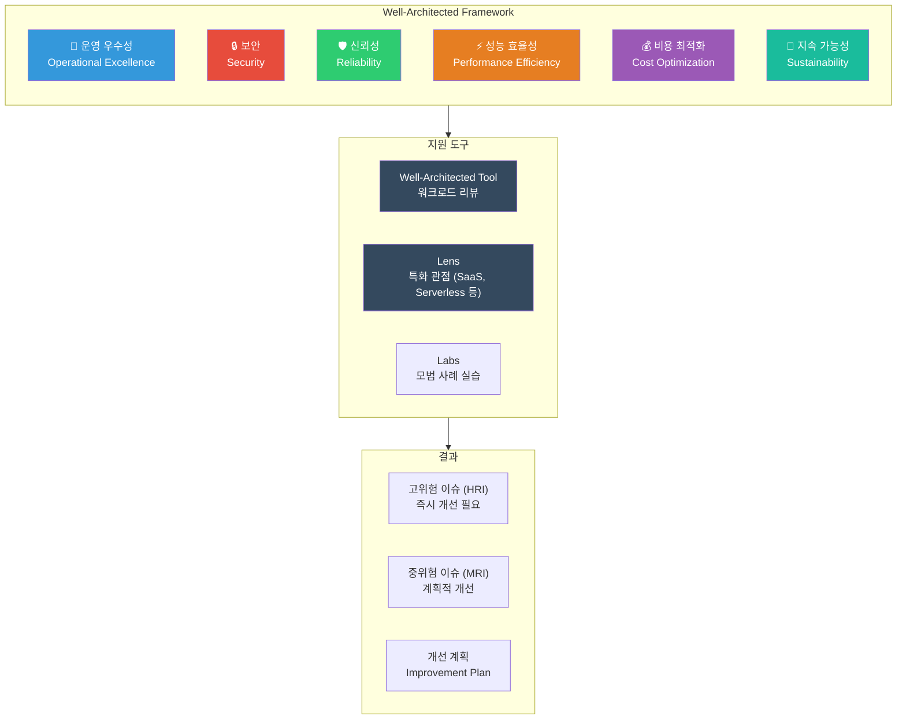
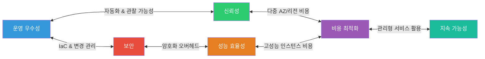
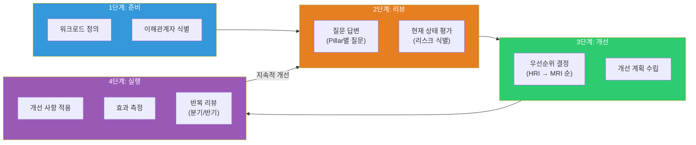

# Well-Architected Framework 6대 축

> [이전 강의](./14-cost)에서 비용 최적화를 배웠다면, 이제 AWS 아키텍처를 **6가지 관점에서 종합 점검하는** Well-Architected Framework를 배워볼게요. 비용은 6개 축 중 하나일 뿐이고, 보안 · 신뢰성 · 성능 · 운영 · 지속 가능성까지 고려해야 진짜 "잘 설계된" 아키텍처가 돼요.

---

## 🎯 이걸 왜 알아야 하나?

```
실무에서 Well-Architected가 필요한 순간:
• 신규 서비스 런칭 전 아키텍처 리뷰                      → Well-Architected Review
• 장애가 반복되는데 근본 원인을 모르겠어요                → Reliability Pillar 점검
• 보안 감사에서 "체계적 검토 프로세스가 있나요?" 질문     → Well-Architected Tool
• 월 비용이 계속 올라가는데 뭘 잘못하고 있는지 모르겠어요 → Cost Optimization Pillar
• 서비스가 느려졌는데 어디를 개선해야 할지 막막해요       → Performance Efficiency Pillar
• 회사에서 ESG 보고서에 클라우드 탄소 배출량을 넣어야 해요 → Sustainability Pillar
• 면접: "Well-Architected Framework에 대해 설명해주세요"  → 6 Pillars 전체 이해
• SA(Solutions Architect) 자격증 시험 필수 출제 범위       → 설계 원칙 + 모범 사례
```

---

## 🧠 핵심 개념

### 비유: 건물 건축 설계와 안전 점검

AWS Well-Architected Framework를 **건물 건축**에 비유해볼게요.

여러분이 고층 빌딩을 짓는다고 생각해보세요. 멋있게만 짓는다고 좋은 건물이 아니에요. 건축법, 소방법, 에너지 효율 기준 등 **여러 관점에서 점검**해야 안전하고 효율적인 건물이 되죠.

| 건물 건축 | AWS Well-Architected |
|-----------|----------------------|
| 건축 설계 도면 | 아키텍처 설계 문서 |
| 건축법 · 안전 기준 | Well-Architected Framework (6 Pillars) |
| 건물 운영 매뉴얼 (소방 훈련, 설비 점검) | **운영 우수성 (Operational Excellence)** |
| 출입 통제 · 보안 시스템 · CCTV | **보안 (Security)** |
| 내진 설계 · 비상 발전기 · 스프링클러 | **신뢰성 (Reliability)** |
| 엘리베이터 속도 · 에어컨 용량 · 동선 설계 | **성능 효율성 (Performance Efficiency)** |
| 에너지 비용 최적화 · LED 조명 · 태양광 | **비용 최적화 (Cost Optimization)** |
| 탄소 중립 인증 · 친환경 자재 · 재활용 | **지속 가능성 (Sustainability)** |
| 정기 안전 점검 (연 1회 종합 검사) | **Well-Architected Review** |
| 특수 용도 점검 (식품 위생, 의료 시설) | **Well-Architected Lens** |

### Well-Architected Framework 전체 구조



### 6대 축 상호 관계

6개 축은 서로 독립적이지 않아요. 한 축의 결정이 다른 축에 영향을 줘요. 예를 들어 보안을 강화하면 성능이 떨어질 수 있고, 신뢰성을 높이면 비용이 올라갈 수 있어요. **트레이드오프를 이해하고 균형을 잡는 것**이 핵심이에요.



### Well-Architected Review 프로세스



---

## 🔍 상세 설명

### Pillar 1: 운영 우수성 (Operational Excellence)

> "어떻게 하면 시스템을 잘 운영하고, 프로세스를 지속적으로 개선할 수 있을까?"

운영 우수성은 건물의 **운영 매뉴얼**이에요. 소방 훈련은 언제 하는지, 설비 점검 주기는 어떤지, 비상시 누가 무엇을 하는지 — 이런 것들이 잘 정리되어 있어야 해요.

**설계 원칙:**

| 원칙 | 설명 | AWS 서비스/방법 |
|------|------|-----------------|
| 코드로 운영 (IaC) | 인프라를 수작업이 아닌 코드로 관리해요 | CloudFormation, Terraform, CDK |
| 빈번하고 작은 변경 | 한 번에 크게 바꾸지 말고, 작게 자주 바꿔요 | CodePipeline, CodeDeploy, 카나리 배포 |
| 운영 절차 개선 | 런북(Runbook)과 플레이북을 만들고 자동화해요 | Systems Manager Automation |
| 실패를 예상 | "장애가 나면 어쩌지?"가 아니라 "장애는 반드시 난다"라고 가정해요 | GameDay, 장애 시뮬레이션 |
| 모든 장애에서 학습 | Post-mortem을 통해 같은 장애를 반복하지 않아요 | 장애 보고서, 개선 조치 추적 |
| 관찰 가능성 확보 | 시스템 내부 상태를 언제든 파악할 수 있어야 해요 | CloudWatch, X-Ray, OpenTelemetry |

> [관리 서비스 강의](./13-management)에서 CloudWatch, CloudTrail, Systems Manager를 자세히 다뤘어요.

**핵심 서비스:**

```
운영 우수성을 위한 AWS 서비스:
• CloudWatch       → 메트릭, 로그, 알람, 대시보드
• CloudTrail       → API 호출 이력 추적 (누가 무엇을 언제 했나)
• X-Ray            → 분산 추적 (마이크로서비스 호출 흐름)
• Systems Manager  → 런북 자동화, 패치 관리, 파라미터 스토어
• Config           → 리소스 구성 변경 이력, 규정 준수 확인
• EventBridge      → 이벤트 기반 자동화 (장애 감지 → 자동 복구)
```

---

### Pillar 2: 보안 (Security)

> "어떻게 하면 데이터, 시스템, 자산을 보호할 수 있을까?"

보안은 건물의 **출입 통제 · 보안 시스템 · CCTV**에요. 누가 들어올 수 있는지, 중요한 문서는 금고에 넣었는지, 수상한 사람은 없는지 — 모든 계층에서 보안을 적용해야 해요.

**설계 원칙:**

| 원칙 | 설명 | AWS 서비스/방법 |
|------|------|-----------------|
| 최소 권한 원칙 | 필요한 권한만, 필요한 기간만 부여해요 | IAM Policy, SCP, Permission Boundary |
| 추적 가능성 | 모든 행위를 기록하고 추적할 수 있어야 해요 | CloudTrail, VPC Flow Logs, GuardDuty |
| 모든 계층에 보안 적용 | 네트워크, 서버, 앱, 데이터 — 한 곳도 빠뜨리면 안 돼요 | SG, NACL, WAF, KMS, Shield |
| 자동화된 보안 | 보안 검사를 사람이 아닌 시스템이 해요 | Config Rules, Security Hub, Inspector |
| 전송 중/저장 시 데이터 보호 | 데이터는 이동할 때도, 저장할 때도 암호화해요 | KMS, ACM, S3 SSE, EBS 암호화 |
| 보안 이벤트 대비 | 침해 사고 발생 시 대응 절차가 준비되어 있어야 해요 | 인시던트 대응 런북, 포렌식 환경 |

> [IAM 강의](./01-iam)에서 접근 제어의 기본을 배웠고, [보안 강의](./12-security)에서 KMS, WAF, Shield, GuardDuty를 다뤘어요.

**보안 계층 모델 (Defense in Depth):**

```
┌─────────────────────────────────────────────────────┐
│ Edge Layer      │ CloudFront + WAF + Shield (DDoS)  │
├─────────────────┼───────────────────────────────────┤
│ Network Layer   │ VPC, Subnet, NACL, Security Group │
├─────────────────┼───────────────────────────────────┤
│ Compute Layer   │ EC2 보안 패치, Inspector, SSM     │
├─────────────────┼───────────────────────────────────┤
│ Application     │ WAF 규칙, 인증/인가, 입력 검증    │
├─────────────────┼───────────────────────────────────┤
│ Data Layer      │ KMS 암호화, S3 버킷 정책, RDS TDE │
├─────────────────┼───────────────────────────────────┤
│ Identity        │ IAM, MFA, SSO, SCP                │
├─────────────────┼───────────────────────────────────┤
│ Detection       │ GuardDuty, Security Hub, Config   │
└─────────────────┴───────────────────────────────────┘
```

---

### Pillar 3: 신뢰성 (Reliability)

> "어떻게 하면 장애가 나도 서비스가 정상 동작하게 할 수 있을까?"

신뢰성은 건물의 **내진 설계 · 비상 발전기 · 스프링클러**에요. 지진이 나도 건물이 무너지지 않고, 정전이 되어도 비상 전원이 켜지고, 화재가 나도 스프링클러가 자동으로 작동해야 해요.

**설계 원칙:**

| 원칙 | 설명 | AWS 서비스/방법 |
|------|------|-----------------|
| 장애 자동 복구 | 장애를 감지하면 자동으로 복구해요 | Auto Scaling, Route 53 Health Check |
| 복구 절차 테스트 | 실제로 장애를 일으켜서 복구가 되는지 확인해요 | Chaos Engineering (FIS) |
| 수평 확장 | 하나의 큰 서버 대신 여러 작은 서버로 분산해요 | ELB + ASG, DynamoDB |
| 용량 추측 중단 | 미리 용량을 정하지 말고 자동으로 조절해요 | Auto Scaling, Lambda |
| 변경 관리 자동화 | 인프라 변경을 코드로 관리하고 자동 배포해요 | CloudFormation, CodePipeline |

> [VPC 강의](./02-vpc)에서 Multi-AZ 네트워크 설계를, [EC2/Auto Scaling 강의](./03-ec2-autoscaling)에서 자동 확장을 다뤘어요.

**핵심 개념: RTO와 RPO**

```
RPO (Recovery Point Objective) = 데이터 손실 허용 범위
  "최대 몇 분/시간 전의 데이터까지 잃어도 되는가?"

RTO (Recovery Time Objective) = 서비스 복구 목표 시간
  "장애 발생 후 최대 몇 분/시간 안에 복구해야 하는가?"

                    RPO                    RTO
    ◄────────────────┤────────────────────►
                     │
    마지막 백업    장애 발생             서비스 복구
    ──────●──────────●──────────────────────●──────
         ▲                                  ▲
    이 구간의 데이터는                  여기까지 복구 완료
    손실될 수 있음                      해야 함

전략별 RTO/RPO 비교:
┌──────────────────┬──────────┬──────────┬──────────┐
│ 전략              │ RTO      │ RPO      │ 비용     │
├──────────────────┼──────────┼──────────┼──────────┤
│ Backup & Restore │ 시간~일  │ 시간~일  │ $        │
│ Pilot Light      │ 10분~1시간│ 분~초   │ $$       │
│ Warm Standby     │ 분       │ 초       │ $$$      │
│ Multi-Site Active│ 초~0     │ 0        │ $$$$     │
└──────────────────┴──────────┴──────────┴──────────┘
```

---

### Pillar 4: 성능 효율성 (Performance Efficiency)

> "어떻게 하면 리소스를 효율적으로 사용해서 최적의 성능을 낼 수 있을까?"

성능 효율성은 건물의 **엘리베이터 속도 · 에어컨 용량 · 동선 설계**에요. 사람이 아무리 많아도 엘리베이터가 빠르면 불편함이 없고, 에어컨이 적절하면 쾌적하고, 동선이 잘 설계되면 이동이 편해요.

**설계 원칙:**

| 원칙 | 설명 | AWS 서비스/방법 |
|------|------|-----------------|
| 적절한 리소스 선택 | 워크로드 특성에 맞는 서비스와 타입을 골라요 | EC2 타입, RDS 엔진, 서버리스 |
| 글로벌 서비스 활용 | 사용자와 가까운 곳에 리소스를 배치해요 | CloudFront, Global Accelerator, Edge |
| 관리형 서비스 우선 | 직접 운영보다 AWS 관리형 서비스를 써요 | Aurora, DynamoDB, Lambda, ECS Fargate |
| 지속적 모니터링 | 성능 지표를 측정하고 병목을 찾아요 | CloudWatch, X-Ray, Compute Optimizer |
| 최신 기술 도입 | 새로운 서비스나 기능이 더 효율적일 수 있어요 | Graviton, Lambda SnapStart 등 |
| 트레이드오프 이해 | 일관성 vs 지연 시간, 비용 vs 성능 등을 이해해요 | 캐싱 전략, 읽기 복제본 |

> [EC2/Auto Scaling 강의](./03-ec2-autoscaling)에서 인스턴스 타입 선택과 스케일링을 다뤘어요.

**리소스 선택 가이드:**

```
워크로드 유형별 최적 리소스:

┌───────────────────┬───────────────────────────────────────┐
│ 워크로드           │ 권장 리소스                            │
├───────────────────┼───────────────────────────────────────┤
│ 웹 API (일반)      │ ALB + ECS Fargate (or Lambda)        │
│ 웹 API (고성능)    │ ALB + EC2 (c7g Graviton) + ASG       │
│ 배치 처리          │ Step Functions + Lambda (or Batch)    │
│ 실시간 스트리밍    │ Kinesis Data Streams + Lambda         │
│ ML 추론           │ SageMaker Endpoint (or Inf2 EC2)      │
│ 정적 콘텐츠       │ S3 + CloudFront                       │
│ 관계형 DB (OLTP)  │ Aurora (MySQL/PostgreSQL)              │
│ NoSQL (고처리량)  │ DynamoDB (On-Demand or Provisioned)   │
│ 캐싱              │ ElastiCache (Redis/Memcached)         │
│ 검색              │ OpenSearch Service                    │
└───────────────────┴───────────────────────────────────────┘
```

---

### Pillar 5: 비용 최적화 (Cost Optimization)

> "어떻게 하면 불필요한 비용 없이 비즈니스 가치를 최대화할 수 있을까?"

비용 최적화는 건물의 **에너지 비용 최적화**에요. LED 조명으로 바꾸고, 사람 없는 층은 전기를 끄고, 태양광으로 자체 발전하는 것처럼 — 쓸데없는 비용을 줄이고 효율을 높여요.

**설계 원칙:**

| 원칙 | 설명 | AWS 서비스/방법 |
|------|------|-----------------|
| 소비 모델 채택 | 쓴 만큼만 지불해요 (미리 과도하게 구매 X) | On-Demand, Lambda, Fargate |
| 전체 효율 측정 | 비즈니스 성과 대비 비용을 측정해요 | Cost Explorer, CUR, 유닛 이코노믹스 |
| 차등 지출 중단 | 데이터 센터 운영 비용 대신 고객 가치에 투자해요 | 관리형 서비스 활용 |
| 비용 분석과 귀속 | 팀/서비스별로 비용을 정확히 추적해요 | 태깅 전략, Cost Allocation Tags |
| 관리형 서비스 활용 | 직접 운영보다 관리형 서비스가 TCO가 낮아요 | RDS vs 직접 DB 운영, ECS Fargate |

> [비용 최적화 강의](./14-cost)에서 Cost Explorer, Reserved Instances, Savings Plans, Spot 전략을 자세히 다뤘어요.

**비용 최적화 매트릭스:**

```
비용 절감 전략별 효과:

┌──────────────────────┬──────────┬──────────┬──────────────┐
│ 전략                  │ 절감률   │ 난이도   │ 리스크        │
├──────────────────────┼──────────┼──────────┼──────────────┤
│ 유휴 리소스 제거      │ 10~30%  │ 낮음     │ 낮음          │
│ Right-sizing          │ 10~40%  │ 중간     │ 낮음          │
│ Reserved Instances    │ 30~60%  │ 중간     │ 중간 (약정)   │
│ Savings Plans         │ 20~40%  │ 낮음     │ 낮음 (유연)   │
│ Spot Instances        │ 60~90%  │ 높음     │ 높음 (중단)   │
│ Graviton 마이그레이션 │ 20~40%  │ 중간     │ 낮음          │
│ 서버리스 전환         │ 30~70%  │ 높음     │ 중간 (리팩토링)│
│ 스토리지 계층화       │ 30~80%  │ 낮음     │ 낮음          │
└──────────────────────┴──────────┴──────────┴──────────────┘
```

---

### Pillar 6: 지속 가능성 (Sustainability)

> "어떻게 하면 환경에 미치는 영향을 최소화할 수 있을까?"

지속 가능성은 건물의 **탄소 중립 인증 · 친환경 자재 · 에너지 재활용**이에요. 2021년 re:Invent에서 6번째 축으로 추가된 가장 최신 Pillar예요.

**설계 원칙:**

| 원칙 | 설명 | AWS 서비스/방법 |
|------|------|-----------------|
| 영향 파악 | 클라우드 워크로드의 환경 영향을 측정해요 | Customer Carbon Footprint Tool |
| 지속 가능성 목표 설정 | 구체적인 목표를 세우고 추적해요 | KPI 설정, 정기 리뷰 |
| 리소스 활용 극대화 | 유휴 리소스를 최소화하고 활용률을 높여요 | Auto Scaling, Right-sizing |
| 관리형/효율적 서비스 | AWS가 최적화한 서비스를 활용해요 | Lambda, Fargate, Aurora Serverless |
| 다운스트림 영향 감소 | 데이터 전송, 저장 최소화로 에너지 절약해요 | 데이터 압축, 캐싱, 불필요한 데이터 삭제 |

**지속 가능성 실천 방법:**

```
탄소 발자국을 줄이는 실무 방법:

• 컴퓨팅  → Graviton(ARM) 사용 (60% 적은 에너지), Auto Scaling, Lambda/Fargate
• 스토리지 → S3 Intelligent-Tiering, 생명 주기 정책, 데이터 압축 (gzip/zstd)
• 네트워크 → CloudFront 엣지 캐싱, VPC Endpoint, 재생 에너지 비율 높은 리전 선택
• 개발    → CI/CD 최적화, 개발/테스트 환경 야간/주말 자동 종료, 코드 최적화
```

---

### Well-Architected Tool과 Lens

AWS는 Well-Architected Review를 도와주는 **관리형 도구**를 제공해요.

**Well-Architected Tool:**

```
AWS Well-Architected Tool은 콘솔에서 워크로드별로
6개 Pillar의 질문에 답하면서 자동으로 리스크를 식별해주는 도구예요.

사용 흐름:
1. 워크로드 정의 (이름, 설명, 환경, 리전)
2. Pillar별 질문 답변 (객관식 + 메모)
3. 리스크 레벨 확인 (High Risk / Medium Risk / No Risk)
4. 개선 계획 생성 (Improvement Plan)
5. 마일스톤 저장 (Milestone) → 진행 상황 추적
```

**Well-Architected Lens:**

```
Lens는 특정 산업/기술에 특화된 추가 관점이에요.
기본 Framework에 더해서 추가 질문과 모범 사례를 제공해요.

주요 Lens 목록:
• Serverless Lens        → Lambda, API Gateway, Step Functions 최적화
• SaaS Lens              → 멀티테넌트 아키텍처, 테넌트 격리
• Data Analytics Lens    → 데이터 레이크, ETL, 분석 파이프라인
• Machine Learning Lens  → ML 모델 학습, 추론, MLOps
• IoT Lens               → 디바이스 관리, 엣지 컴퓨팅
• Financial Services Lens → 금융 규제, 컴플라이언스
• Games Industry Lens    → 게임 서버, 매치메이킹
• Container Build Lens   → ECS, EKS, Fargate 최적화
• Custom Lens            → 조직 자체 기준 정의 가능
```

---

## 💻 실습 예제

### 실습 1: Well-Architected Tool로 워크로드 리뷰

시나리오: 운영 중인 웹 서비스의 Well-Architected 리뷰를 수행해요.

```bash
# 1단계: 워크로드 생성
aws wellarchitected create-workload \
    --workload-name "my-web-service" \
    --description "Production web application with ECS + Aurora" \
    --environment PRODUCTION \
    --review-owner "devops-team@example.com" \
    --aws-regions ap-northeast-2 \
    --lenses "wellarchitected" \
    --pillar-priorities \
        "security" \
        "reliability" \
        "operationalExcellence" \
        "performanceEfficiency" \
        "costOptimization" \
        "sustainability"
```

```json
{
    "WorkloadId": "a1b2c3d4e5f6",
    "WorkloadArn": "arn:aws:wellarchitected:ap-northeast-2:123456789012:workload/a1b2c3d4e5f6"
}
```

```bash
# 2단계: 특정 Pillar의 질문 목록 확인 (보안 Pillar)
# ※ LensAlias는 "wellarchitected", PillarId는 "security"
aws wellarchitected list-answers \
    --workload-id a1b2c3d4e5f6 \
    --lens-alias wellarchitected \
    --pillar-id security \
    --max-results 5
```

```json
{
    "AnswerSummaries": [
        {
            "QuestionId": "securely-operate",
            "QuestionTitle": "SEC 1. 워크로드를 안전하게 운영하려면 어떻게 해야 하나요?",
            "Choices": [
                {
                    "ChoiceId": "sec_securely_operate_multi_accounts",
                    "Title": "AWS 계정을 사용하여 워크로드를 분리합니다",
                    "Description": "AWS Organizations을 사용하여 워크로드별 계정 분리..."
                },
                {
                    "ChoiceId": "sec_securely_operate_aws_account",
                    "Title": "AWS 계정을 안전하게 운영합니다",
                    "Description": "루트 사용자에 MFA 활성화, IAM 정책으로 최소 권한..."
                }
            ],
            "Risk": "HIGH"
        }
    ]
}
```

```bash
# 3단계: 질문에 대한 답변 업데이트
aws wellarchitected update-answer \
    --workload-id a1b2c3d4e5f6 \
    --lens-alias wellarchitected \
    --question-id securely-operate \
    --selected-choices \
        "sec_securely_operate_multi_accounts" \
        "sec_securely_operate_aws_account" \
    --notes "현재 Organizations으로 dev/staging/prod 계정을 분리하고 있음. MFA는 루트와 IAM 사용자 모두 적용 완료."
```

```bash
# 4단계: 전체 리포트 확인
aws wellarchitected get-workload \
    --workload-id a1b2c3d4e5f6 \
    --query '{
        WorkloadName: Workload.WorkloadName,
        RiskCounts: Workload.RiskCounts,
        ImprovementStatus: Workload.ImprovementStatus
    }'
```

```json
{
    "WorkloadName": "my-web-service",
    "RiskCounts": {
        "HIGH": 3,
        "MEDIUM": 7,
        "NONE": 15,
        "NOT_APPLICABLE": 2,
        "UNANSWERED": 18
    },
    "ImprovementStatus": "IN_PROGRESS"
}
```

> HIGH가 3개 있으면 즉시 개선이 필요한 항목이에요. `list-answers`에서 `--pillar-id`별로 HIGH 리스크 항목을 확인하세요.

---

### 실습 2: 운영 우수성 점검 -- CloudWatch 대시보드 + 알람 자동화

시나리오: 운영 우수성 Pillar의 "관찰 가능성 확보" 원칙을 적용해요. 핵심 지표를 한눈에 보는 대시보드와 이상 감지 알람을 설정해요.

```bash
# 1단계: 핵심 지표 대시보드 생성
# 운영 우수성의 핵심: 시스템 상태를 언제든 파악할 수 있어야 해요
# 위젯 구성: ECS 상태 / ALB 응답코드 / Aurora DB / 비용 추적
aws cloudwatch put-dashboard \
    --dashboard-name "WellArchitected-Ops-Dashboard" \
    --dashboard-body '{
        "widgets": [
            {
                "type": "metric", "x": 0, "y": 0, "width": 12, "height": 6,
                "properties": {
                    "title": "ECS 서비스 상태",
                    "metrics": [
                        ["AWS/ECS", "CPUUtilization", "ServiceName", "my-web-svc", "ClusterName", "prod-cluster"],
                        ["AWS/ECS", "MemoryUtilization", "ServiceName", "my-web-svc", "ClusterName", "prod-cluster"]
                    ],
                    "period": 300, "stat": "Average", "region": "ap-northeast-2"
                }
            },
            {
                "type": "metric", "x": 12, "y": 0, "width": 12, "height": 6,
                "properties": {
                    "title": "ALB 응답 코드 (2xx/4xx/5xx)",
                    "metrics": [
                        ["AWS/ApplicationELB", "HTTPCode_Target_2XX_Count", "LoadBalancer", "app/my-alb/1234567890"],
                        ["AWS/ApplicationELB", "HTTPCode_Target_5XX_Count", "LoadBalancer", "app/my-alb/1234567890"]
                    ],
                    "period": 60, "stat": "Sum", "region": "ap-northeast-2"
                }
            },
            {
                "type": "metric", "x": 0, "y": 6, "width": 12, "height": 6,
                "properties": {
                    "title": "Aurora DB 상태",
                    "metrics": [
                        ["AWS/RDS", "CPUUtilization", "DBClusterIdentifier", "prod-aurora-cluster"],
                        ["AWS/RDS", "DatabaseConnections", "DBClusterIdentifier", "prod-aurora-cluster"]
                    ],
                    "period": 300, "stat": "Average", "region": "ap-northeast-2"
                }
            }
        ]
    }'
```

```bash
# 2단계: Composite Alarm 설정 (여러 조건을 조합한 복합 알람)
# 신뢰성 Pillar: 장애를 빠르게 감지하고 대응해야 해요

# 개별 알람 생성 -- 5xx 에러 급증
aws cloudwatch put-metric-alarm \
    --alarm-name "wa-alb-5xx-high" \
    --alarm-description "ALB 5xx 에러가 5분 동안 100회 초과" \
    --namespace "AWS/ApplicationELB" \
    --metric-name "HTTPCode_Target_5XX_Count" \
    --dimensions Name=LoadBalancer,Value=app/my-alb/1234567890 \
    --statistic Sum \
    --period 300 \
    --evaluation-periods 1 \
    --threshold 100 \
    --comparison-operator GreaterThanThreshold \
    --alarm-actions arn:aws:sns:ap-northeast-2:123456789012:ops-alerts

# 개별 알람 생성 -- 응답 지연 급증
aws cloudwatch put-metric-alarm \
    --alarm-name "wa-alb-latency-high" \
    --alarm-description "ALB p99 응답 시간이 5분 동안 3초 초과" \
    --namespace "AWS/ApplicationELB" \
    --metric-name "TargetResponseTime" \
    --dimensions Name=LoadBalancer,Value=app/my-alb/1234567890 \
    --extended-statistic p99 \
    --period 300 \
    --evaluation-periods 1 \
    --threshold 3 \
    --comparison-operator GreaterThanThreshold \
    --alarm-actions arn:aws:sns:ap-northeast-2:123456789012:ops-alerts

# Composite Alarm: 5xx 급증 AND 지연 급증이면 심각한 장애
aws cloudwatch put-composite-alarm \
    --alarm-name "wa-critical-service-degradation" \
    --alarm-description "5xx 에러 + 응답 지연 동시 발생 = 서비스 심각한 장애" \
    --alarm-rule 'ALARM("wa-alb-5xx-high") AND ALARM("wa-alb-latency-high")' \
    --alarm-actions arn:aws:sns:ap-northeast-2:123456789012:critical-alerts
```

```bash
# 3단계: Systems Manager 런북으로 자동 대응
# 운영 우수성: 장애 대응을 자동화해야 해요
aws ssm create-document \
    --name "WA-AutoRestart-ECS-Service" \
    --document-type "Automation" \
    --document-format "YAML" \
    --content '{
        "schemaVersion": "0.3",
        "description": "ECS 서비스 자동 재시작 런북",
        "parameters": {
            "ClusterName": {
                "type": "String",
                "default": "prod-cluster"
            },
            "ServiceName": {
                "type": "String",
                "default": "my-web-svc"
            }
        },
        "mainSteps": [
            {
                "name": "ForceNewDeployment",
                "action": "aws:executeAwsApi",
                "inputs": {
                    "Service": "ecs",
                    "Api": "UpdateService",
                    "cluster": "{{ ClusterName }}",
                    "service": "{{ ServiceName }}",
                    "forceNewDeployment": true
                }
            }
        ]
    }'
```

> 런북을 CloudWatch Alarm의 액션으로 연결하면, 장애 감지 → 자동 복구까지 사람의 개입 없이 처리할 수 있어요.

---

### 실습 3: 신뢰성 점검 -- AWS Fault Injection Service (FIS)로 Chaos Engineering

시나리오: 신뢰성 Pillar의 "복구 절차 테스트" 원칙을 적용해요. 실제로 장애를 주입해서 시스템이 자동으로 복구되는지 확인해요.

```bash
# 1단계: FIS 실험 템플릿 생성
# "ECS 태스크를 일부 강제 종료해도 서비스가 정상 동작하는가?"
aws fis create-experiment-template \
    --description "ECS 태스크 50% 강제 종료 - 신뢰성 검증" \
    --role-arn arn:aws:iam::123456789012:role/FISExperimentRole \
    --stop-conditions '[{
        "source": "aws:cloudwatch:alarm",
        "value": "arn:aws:cloudwatch:ap-northeast-2:123456789012:alarm:wa-critical-service-degradation"
    }]' \
    --targets '{
        "myEcsTasks": {
            "resourceType": "aws:ecs:task",
            "resourceTags": {
                "Environment": "staging"
            },
            "selectionMode": "PERCENT(50)",
            "filters": [{
                "path": "State.Name",
                "values": ["RUNNING"]
            }]
        }
    }' \
    --actions '{
        "stopEcsTasks": {
            "actionId": "aws:ecs:stop-task",
            "description": "실행 중인 ECS 태스크 50% 강제 종료",
            "parameters": {},
            "targets": {
                "Tasks": "myEcsTasks"
            },
            "startAfter": []
        }
    }' \
    --tags Environment=staging,Team=devops
```

```json
{
    "experimentTemplate": {
        "id": "EXT1234567890",
        "description": "ECS 태스크 50% 강제 종료 - 신뢰성 검증"
    }
}
```

```bash
# 2단계: 실험 실행 (staging 환경에서!)
# ※ 절대 production에서 바로 실행하지 마세요!
aws fis start-experiment \
    --experiment-template-id EXT1234567890 \
    --tags RunBy=devops-team,Purpose=reliability-test
```

```bash
# 3단계: 검증 -- 서비스가 자동 복구되었는지 확인
aws ecs describe-services \
    --cluster staging-cluster \
    --services my-web-svc \
    --query 'services[0].{DesiredCount: desiredCount, RunningCount: runningCount}'
```

```json
{ "DesiredCount": 4, "RunningCount": 4 }
```

> DesiredCount와 RunningCount가 일치하면 ECS가 자동으로 태스크를 재시작해서 신뢰성 테스트를 통과한 거예요. 만약 복구되지 않으면 아키텍처 개선이 필요해요.

```bash
# 4단계: 실험 결과 기록 (마일스톤으로 저장)
aws wellarchitected create-milestone \
    --workload-id a1b2c3d4e5f6 \
    --milestone-name "2026-Q1-Reliability-ChaosTest-Complete"
```

---

## 🏢 실무에서는?

### 시나리오 1: 신규 서비스 런칭 전 Well-Architected Review

```
문제: 3개월간 개발한 신규 서비스를 다음 주에 런칭해야 하는데,
      CTO가 "Well-Architected Review 했어?" 라고 물어봐요.

해결: Well-Architected Tool로 체계적인 사전 리뷰를 수행해요.
```

```
실무 리뷰 프로세스 (1~2일 소요):

1일차 오전: 운영 우수성 + 보안
  ├─ 운영 우수성
  │   ✅ IaC 사용 여부 (Terraform/CDK 확인)
  │   ✅ CI/CD 파이프라인 존재 여부
  │   ✅ 모니터링/알람 설정 여부 (CloudWatch)
  │   ✅ 런북 존재 여부 (장애 대응 절차서)
  │   ✅ 롤백 전략 확인
  │
  └─ 보안
      ✅ IAM 최소 권한 적용 여부
      ✅ 데이터 암호화 (전송 중 + 저장 시)
      ✅ 네트워크 보안 (SG, NACL, Private Subnet)
      ✅ 시크릿 관리 방법 (Secrets Manager)
      ✅ WAF 적용 여부

1일차 오후: 신뢰성 + 성능 효율성
  ├─ 신뢰성
  │   ✅ Multi-AZ 배포 여부
  │   ✅ Auto Scaling 설정 여부
  │   ✅ DB 백업 / 복구 테스트 여부
  │   ✅ Health Check 설정 여부
  │   ✅ RTO/RPO 정의 여부
  │
  └─ 성능 효율성
      ✅ 인스턴스 타입 적절성 (Right-sizing)
      ✅ 캐싱 전략 (CloudFront, ElastiCache)
      ✅ DB 인덱스 / 쿼리 최적화
      ✅ 부하 테스트 수행 여부
      ✅ CDN 설정 여부

2일차 오전: 비용 최적화 + 지속 가능성 + 정리
  ├─ 비용 최적화
  │   ✅ 태깅 전략 적용 여부
  │   ✅ 예산 알람 설정 여부
  │   ✅ 비용 추정 vs 실제 비교
  │   ✅ Savings Plans / RI 검토
  │
  ├─ 지속 가능성
  │   ✅ Graviton 인스턴스 검토
  │   ✅ 유휴 리소스 자동 종료
  │   ✅ 데이터 생명 주기 정책
  │
  └─ 정리
      📝 HIGH Risk 항목 → 런칭 전 반드시 해결
      📝 MEDIUM Risk 항목 → 런칭 후 1개월 내 해결
      📝 마일스톤 저장 → 분기별 재리뷰 일정 수립
```

### 시나리오 2: 장애 후 아키텍처 개선 (Post-mortem → Well-Architected)

```
문제: DB 장애로 서비스가 2시간 동안 다운됐어요.
      Post-mortem 후 "이런 일이 다시 발생하지 않도록 아키텍처를 개선하라"는 지시가 내려왔어요.

해결: Well-Architected Framework의 신뢰성 Pillar를 기준으로
      체계적으로 개선 포인트를 도출해요.
```

```
Post-mortem 분석 → Well-Architected 매핑:

장애 원인: Aurora Primary 인스턴스 장애 → Failover 지연 (15분)
근본 원인: Single-AZ 배포, Read Replica 없음, 장애 테스트 미수행

Well-Architected 관점별 개선 사항:

┌──────────────────┬────────────────────────────────────────────────┐
│ Pillar           │ 개선 조치                                       │
├──────────────────┼────────────────────────────────────────────────┤
│ 신뢰성           │ • Aurora Multi-AZ 활성화 (자동 Failover <30초)  │
│                  │ • Read Replica 추가 (읽기 분산)                  │
│                  │ • FIS로 분기별 Failover 테스트                   │
│                  │ • RTO: 2시간 → 1분으로 목표 재설정               │
├──────────────────┼────────────────────────────────────────────────┤
│ 운영 우수성      │ • DB Failover 런북 작성 및 자동화                │
│                  │ • Aurora 이벤트 알람 추가 (Failover 시작/완료)    │
│                  │ • 장애 대응 훈련(GameDay) 분기 1회 실시           │
├──────────────────┼────────────────────────────────────────────────┤
│ 비용 최적화      │ • Multi-AZ 추가 비용 vs 장애 비용 비교 분석      │
│                  │ • Read Replica에 Reserved Instance 적용          │
├──────────────────┼────────────────────────────────────────────────┤
│ 성능 효율성      │ • Connection Pooling 도입 (RDS Proxy)            │
│                  │ • Slow Query 모니터링 강화                       │
└──────────────────┴────────────────────────────────────────────────┘
```

### 시나리오 3: Custom Lens로 조직 표준 수립

```
문제: 100개 이상의 마이크로서비스를 운영하는 대기업에서
      팀마다 아키텍처 기준이 달라요.
      "우리 회사만의 Well-Architected 기준을 만들 수 있나요?"

해결: Custom Lens를 만들어서 조직 표준으로 배포해요.
```

```json
// Custom Lens JSON 구조 (핵심 부분만 발췌)
// 회사 내부 표준: "모든 서비스는 다음을 충족해야 한다"
{
    "schemaVersion": "2021-11-01",
    "name": "MyCompany Platform Standards",
    "description": "우리 회사 플랫폼 팀의 아키텍처 표준",
    "pillars": [
        {
            "id": "platform_reliability",
            "name": "플랫폼 신뢰성",
            "questions": [
                {
                    "id": "rel_multi_az",
                    "title": "서비스가 Multi-AZ로 배포되어 있나요?",
                    "choices": [
                        { "id": "rel_multi_az_yes", "title": "2개 이상 AZ에 배포됨" },
                        { "id": "rel_multi_az_no", "title": "Single-AZ에만 배포됨" }
                    ],
                    "riskRules": [
                        { "condition": "rel_multi_az_no", "risk": "HIGH_RISK" },
                        { "condition": "rel_multi_az_yes", "risk": "NO_RISK" }
                    ]
                }
            ]
        }
    ]
}
```

```bash
# Custom Lens 생성 및 조직 내 공유
aws wellarchitected create-lens-version \
    --lens-alias "mycompany-platform-standards" \
    --lens-version "1.0.0" \
    --is-major-version

aws wellarchitected create-lens-share \
    --lens-alias "mycompany-platform-standards" \
    --shared-with "arn:aws:organizations::123456789012:organization/o-abc123" \
    --type ORGANIZATION
```

> Custom Lens를 사용하면 AWS 기본 Framework에 조직의 자체 기준을 추가할 수 있어요. 플랫폼 팀에서 만들고, 모든 서비스 팀에 공유하면 일관된 아키텍처 기준을 유지할 수 있어요.

---

## ⚠️ 자주 하는 실수

### 1. 한 Pillar만 집중하고 나머지를 무시

```
❌ 잘못: "보안이 최우선이니까 보안만 완벽하게 하자"
         → 보안은 좋지만 성능이 느려지고, 비용이 폭증하고, 운영이 복잡해짐

✅ 올바른: 6개 Pillar를 균형 있게 검토하고, 트레이드오프를 명시적으로 기록
         → "암호화로 인해 지연 시간이 5ms 증가하지만, 규제 준수를 위해 수용"
```

### 2. Well-Architected Review를 한 번만 하고 끝냄

```
❌ 잘못: 런칭 전에 한 번 리뷰하고 "통과했으니 끝!"이라고 생각
         → 아키텍처는 계속 변하기 때문에 리뷰도 주기적으로 해야 함

✅ 올바른: 분기/반기마다 정기 리뷰를 수행하고 마일스톤으로 기록
         → 변경 사항이 많은 Pillar를 중점적으로 재리뷰
         → 주요 아키텍처 변경 시에도 리뷰를 추가 수행
```

### 3. 이론만 체크하고 실제 테스트를 안 함

```
❌ 잘못: 신뢰성 Pillar에서 "Multi-AZ 배포 ✅"로 체크했지만,
         실제로 AZ 장애 시 Failover가 되는지 테스트 안 함
         → 막상 장애가 나면 Failover가 안 되거나 데이터 유실 발생

✅ 올바른: FIS(Fault Injection Service)로 실제 장애를 주입해서 검증
         → Failover 시간 측정, 데이터 정합성 확인, 알람 동작 여부 확인
         → "테스트하지 않은 복구 절차는 없는 것과 같다"
```

### 4. Lens를 적용하지 않고 기본 Framework만 사용

```
❌ 잘못: 서버리스 아키텍처(Lambda + API Gateway + DynamoDB)인데
         기본 Well-Architected Framework만으로 리뷰
         → 서버리스 특화 질문(Cold Start, 동시성 제한 등)을 놓침

✅ 올바른: 워크로드 유형에 맞는 Lens를 추가로 적용
         → 서버리스 → Serverless Lens
         → SaaS → SaaS Lens
         → 컨테이너 → Container Build Lens
         → 여러 Lens를 하나의 워크로드에 동시에 적용 가능
```

### 5. 개선 계획을 세우고 실행하지 않음

```
❌ 잘못: Well-Architected Review에서 HIGH Risk 항목을 식별했지만,
         "나중에 하자"고 하고 방치
         → HIGH Risk 항목은 시간이 지날수록 영향 범위가 커짐

✅ 올바른: HIGH Risk → 2주 내 해결, MEDIUM Risk → 1개월 내 해결
         → Improvement Plan을 Jira/Linear 티켓으로 변환
         → 각 항목에 담당자와 마감일을 지정
         → 다음 리뷰 때 진행 상황 추적 (마일스톤 비교)
```

---

## 📝 정리

```
Well-Architected Framework 6대 축 한눈에 보기:

┌──────────────────┬──────────────────────────────────────────────────┐
│ Pillar           │ 핵심 질문                                         │
├──────────────────┼──────────────────────────────────────────────────┤
│ 운영 우수성      │ "시스템을 잘 운영하고 지속 개선하고 있는가?"       │
│ 보안             │ "데이터와 시스템을 보호하고 있는가?"               │
│ 신뢰성           │ "장애에도 정상 동작하고 자동 복구되는가?"          │
│ 성능 효율성      │ "리소스를 효율적으로 사용하고 있는가?"             │
│ 비용 최적화      │ "불필요한 비용 없이 가치를 전달하고 있는가?"       │
│ 지속 가능성      │ "환경 영향을 최소화하고 있는가?"                   │
└──────────────────┴──────────────────────────────────────────────────┘
```

**핵심 포인트:**

1. **6개 축은 균형이 중요해요.** 한 가지만 완벽하게 하는 것보다 6개를 골고루 챙기는 게 더 중요해요. 트레이드오프를 이해하고 명시적으로 결정하세요.
2. **정기적으로 리뷰하세요.** Well-Architected Review는 한 번이 아니라 분기/반기마다 반복해야 해요. 마일스톤으로 진행 상황을 추적하세요.
3. **이론 체크가 아닌 실제 테스트가 핵심이에요.** "Multi-AZ 설정했다"보다 "Failover 테스트를 통과했다"가 중요해요. FIS로 카오스 엔지니어링을 실천하세요.
4. **Lens를 활용하세요.** 서버리스, SaaS, 컨테이너 등 워크로드 유형에 맞는 Lens를 추가 적용하면 더 깊은 리뷰가 가능해요.
5. **개선 계획은 반드시 실행하세요.** HIGH Risk 항목을 식별하고 방치하면 의미가 없어요. 티켓으로 변환하고 담당자와 마감일을 정하세요.
6. **도구를 활용하세요.** AWS Well-Architected Tool, Custom Lens를 사용하면 체계적이고 반복 가능한 리뷰 프로세스를 만들 수 있어요.

**면접 대비 키워드:**

```
Q: Well-Architected Framework 6개 Pillar를 말해보세요.
A: 운영 우수성, 보안, 신뢰성, 성능 효율성, 비용 최적화, 지속 가능성.
   2021년 re:Invent에서 지속 가능성이 추가되어 5개 → 6개로 확장.

Q: 6개 Pillar 중 가장 중요한 것은?
A: 상황에 따라 다름. 트레이드오프를 이해하는 것이 핵심.
   금융/의료 → 보안+신뢰성, 스타트업 → 비용+운영, 글로벌 → 성능+신뢰성.

Q: Well-Architected Tool vs Lens 차이?
A: Tool = 리뷰를 수행하고 결과를 관리하는 AWS 서비스.
   Lens = 특정 산업/기술에 특화된 추가 관점(질문+모범 사례).

Q: RTO vs RPO?
A: RTO = 장애 후 서비스 복구까지 최대 시간, RPO = 데이터 손실 허용 최대 범위.
   Backup(시간) → Pilot Light(분) → Warm Standby(분) → Active-Active(초).
```

---

## 🔗 다음 강의 → [17-disaster-recovery](./17-disaster-recovery)

다음 강의에서는 AWS 재해 복구(Disaster Recovery) 전략을 배워요. 이번에 배운 신뢰성 Pillar의 RTO/RPO 개념을 바탕으로, Backup & Restore, Pilot Light, Warm Standby, Multi-Site Active-Active 전략을 실습과 함께 자세히 다룰게요.
