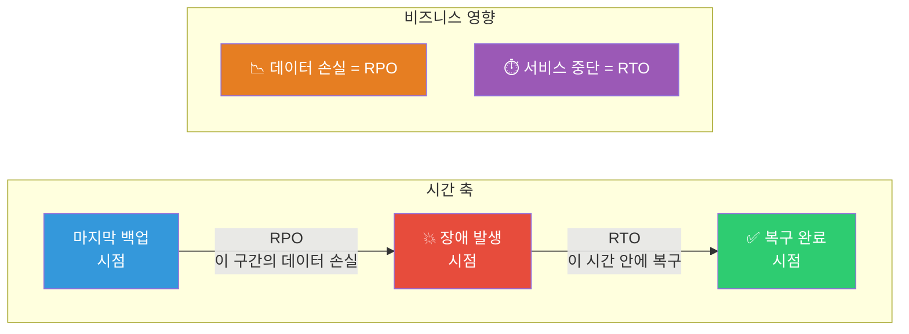
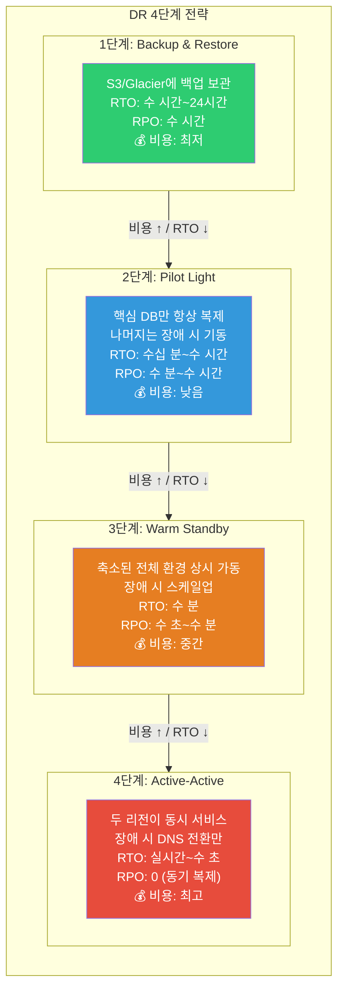
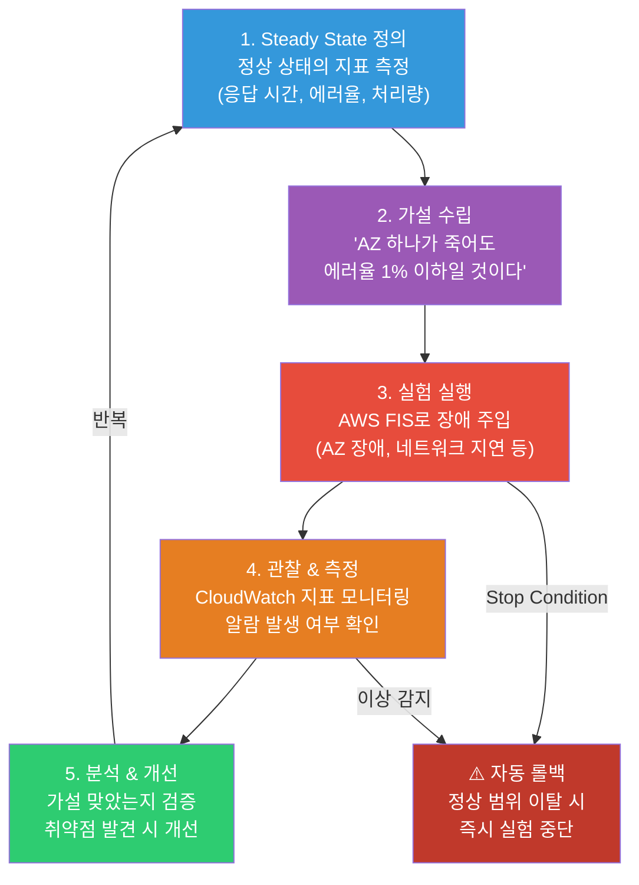

# RTO / RPO / DR 전략 / Chaos Engineering

> [이전 강의](./12-security)에서 AWS 리소스를 **보호하는** 보안 서비스를 배웠어요. 보안이 "공격을 막는 것"이라면, 이번 강의는 **"장애가 터졌을 때 얼마나 빨리 복구하는가"** — 재해 복구(Disaster Recovery) 전략과, **"일부러 장애를 일으켜서 취약점을 찾는"** Chaos Engineering을 배워볼게요. [K8s DR](../04-kubernetes/16-backup-dr)에서 etcd 백업과 Velero를 배웠다면, 이번에는 AWS 인프라 전체 수준의 DR이에요.

---

## 🎯 이걸 왜 알아야 하나?

```
실무에서 DR/Chaos Engineering이 필요한 순간:
• "서울 리전이 통째로 장애가 나면 어떡하죠?"         → DR 전략 (Multi-Region)
• "장애 시 복구까지 최대 몇 분 걸리나요?"            → RTO 정의
• "장애 나면 데이터는 얼마나 날아가나요?"             → RPO 정의
• "DR 비용은 얼마나 들어요?"                        → 4단계 전략별 비용 비교
• "진짜 장애 상황에서 복구가 되긴 하는 거예요?"       → DR 훈련 (Game Day)
• "시스템이 예상대로 동작하는지 어떻게 검증하죠?"     → Chaos Engineering + FIS
• "AZ 하나가 죽어도 서비스가 괜찮을까요?"            → 장애 주입 실험
• 면접: "Pilot Light와 Warm Standby 차이?"          → DR 4단계 전략
```

---

## 🧠 핵심 개념

### 비유: 화재 대피 훈련과 비상 발전기

DR을 **건물 방재 시스템**에 비유해볼게요.

* **RTO (Recovery Time Objective)** = 건물에 불이 났을 때, **다시 업무를 시작할 수 있을 때까지 걸리는 시간**. "30분 안에 대체 사무실에서 업무 재개" 같은 목표예요
* **RPO (Recovery Point Objective)** = 마지막으로 **금고에 서류를 백업한 시점**과 화재 시점 사이의 간격. RPO 1시간이면 최대 1시간치 서류가 타서 사라질 수 있어요
* **Backup & Restore** = 서류를 복사해서 **외부 창고**에 보관. 화재 시 창고에서 꺼내오는 데 시간이 좀 걸려요 (수 시간~하루)
* **Pilot Light** = 비상구에 **작은 불씨**만 켜두는 것. 평소에는 최소 인프라만 켜두다가, 장애 시 나머지를 빠르게 띄워요 (수십 분~수 시간)
* **Warm Standby** = **비상 발전기**가 항상 대기 상태. 정전되면 수 분 안에 발전기가 돌아가요 (수 분)
* **Active-Active** = **두 건물에서 동시에 업무**. 한 건물이 무너져도 다른 건물에서 바로 처리해요 (실시간)
* **Chaos Engineering** = **일부러 화재 대피 훈련**을 하는 것. 진짜 불났을 때 사람들이 제대로 대피하는지 미리 검증하는 거예요

### 비유: 병원 응급실 시스템

| 병원 시스템 | AWS DR |
|-------------|--------|
| 응급 환자 수용까지 목표 시간 | RTO (복구 시간 목표) |
| 환자 기록 손실 허용 범위 | RPO (복구 시점 목표) |
| 환자 기록을 외부 창고에 보관 | Backup & Restore |
| 비상 전화 한 통이면 의료진 소집 | Pilot Light |
| 응급실이 24시간 대기 상태 | Warm Standby |
| 두 병원이 동시에 환자 분담 | Active-Active |
| 정기적 재난 대응 훈련 | Chaos Engineering / Game Day |
| 재난 시 행동 매뉴얼 | Runbook (런북) |

### RTO와 RPO 관계도



### DR 4단계 전략 비교



### Chaos Engineering 실험 흐름



---

## 🔍 상세 설명

### 1. RTO/RPO 와 비즈니스 영향 분석

RTO와 RPO는 기술적인 수치가 아니라 **비즈니스 요구사항**이에요.

```
📌 핵심 질문:
• "서비스가 몇 분 중단되면 어떤 피해가 발생하나요?"  → RTO 결정
• "몇 분치 데이터를 잃으면 허용 가능한가요?"         → RPO 결정
• "복구 비용 vs 장애 비용, 어느 쪽이 더 큰가요?"    → DR 전략 선택
```

**비즈니스 영향 분석(BIA) 예시:**

| 서비스 유형 | 허용 중단 시간 | 데이터 손실 허용 | 추천 전략 |
|------------|---------------|-----------------|----------|
| 결제 시스템 | 0분 | 0 | Active-Active |
| 주문 시스템 | 5분 이내 | 1분 이내 | Warm Standby |
| 관리자 대시보드 | 1시간 이내 | 1시간 이내 | Pilot Light |
| 배치 분석 시스템 | 24시간 이내 | 24시간 이내 | Backup & Restore |

**SLA와의 관계:**

```
SLA 99.99% (Four Nines)
= 연간 허용 다운타임: 약 52분
= 월간 허용 다운타임: 약 4.3분
→ RTO를 수 분 이내로 설정해야 해요
→ Active-Active 또는 Warm Standby 필요

SLA 99.9% (Three Nines)
= 연간 허용 다운타임: 약 8.7시간
= 월간 허용 다운타임: 약 43분
→ Pilot Light 또는 Warm Standby로 충분할 수 있어요
```

### 2. DR 4단계 전략 상세

#### 2-1. Backup & Restore (RTO: 수 시간~24시간)

가장 저렴하지만 복구가 가장 느린 전략이에요. [S3 CRR](./04-storage)과 [RDS 스냅샷](./06-db-operations)을 활용해요.

```bash
# S3 Cross-Region Replication 설정 확인
aws s3api get-bucket-replication \
  --bucket my-backup-bucket \
  --region ap-northeast-2
```

```json
{
    "ReplicationConfiguration": {
        "Role": "arn:aws:iam::123456789012:role/S3ReplicationRole",
        "Rules": [{"ID": "dr-replication", "Status": "Enabled",
            "Destination": {"Bucket": "arn:aws:s3:::my-backup-bucket-us-west-2", "StorageClass": "STANDARD_IA"}}]
    }
}
```

```bash
# RDS 스냅샷을 DR 리전으로 복사
aws rds copy-db-snapshot \
  --source-db-snapshot-identifier arn:aws:rds:ap-northeast-2:123456789012:snapshot:my-db-snap \
  --target-db-snapshot-identifier my-db-snap-dr \
  --region us-west-2
# 출력: { "DBSnapshot": { "DBSnapshotIdentifier": "my-db-snap-dr", "Status": "creating" } }
```

#### 2-2. Pilot Light (RTO: 수십 분~수 시간)

**핵심 데이터 계층만** 항상 복제하고, 컴퓨팅 리소스는 장애 시에만 기동해요.

```bash
# Aurora Global Database 상태 확인 — 핵심 DB는 항상 복제 중
aws rds describe-global-clusters \
  --global-cluster-identifier my-global-db
```

```json
{
    "GlobalClusters": [{
        "GlobalClusterIdentifier": "my-global-db",
        "Status": "available",
        "Engine": "aurora-mysql",
        "GlobalClusterMembers": [
            {"DBClusterArn": "arn:aws:rds:ap-northeast-2:...:cluster:primary-cluster", "IsWriter": true},
            {"DBClusterArn": "arn:aws:rds:us-west-2:...:cluster:secondary-cluster", "IsWriter": false}
        ]
    }]
}
```

```bash
# Pilot Light: 장애 발생 시 DR 리전에서 EC2/ECS 기동
# CloudFormation StackSet으로 DR 리전에 인프라 배포
aws cloudformation create-stack-instances \
  --stack-set-name my-app-dr \
  --regions us-west-2 \
  --accounts 123456789012 \
  --operation-preferences MaxConcurrentPercentage=100
```

#### 2-3. Warm Standby (RTO: 수 분)

DR 리전에 **축소된 전체 환경**이 항상 가동 중이에요. 장애 시 스케일업만 하면 돼요.

```bash
# DR 리전의 ASG 스케일업 (Warm Standby → Full Capacity)
aws autoscaling update-auto-scaling-group \
  --auto-scaling-group-name my-app-dr-asg \
  --min-size 4 \
  --desired-capacity 8 \
  --max-size 16 \
  --region us-west-2
```

```
# 출력 없음 (성공 시). describe-auto-scaling-groups로 확인:
# MinSize: 4, DesiredCapacity: 8, MaxSize: 16
```

#### 2-4. Active-Active (RTO: 실시간~수 초)

두 리전이 **동시에 트래픽을 처리**해요. [Route 53](./08-route53-cloudfront)의 Latency 기반 라우팅 또는 Failover 라우팅을 사용해요.

```bash
# Route 53 Health Check 생성
aws route53 create-health-check \
  --caller-reference "my-app-hc-$(date +%s)" \
  --health-check-config '{
    "IPAddress": "52.78.100.100",
    "Port": 443,
    "Type": "HTTPS",
    "ResourcePath": "/health",
    "RequestInterval": 10,
    "FailureThreshold": 2
  }'
```

```json
{
    "HealthCheck": {
        "Id": "abcd1234-5678-efgh-ijkl-mnop9012qrst",
        "HealthCheckConfig": {
            "Type": "HTTPS", "ResourcePath": "/health",
            "RequestInterval": 10, "FailureThreshold": 2
        }
    }
}
```

```bash
# DynamoDB Global Tables 상태 확인 — Active-Active 데이터 계층
aws dynamodb describe-table \
  --table-name my-global-table \
  --region ap-northeast-2 \
  --query 'Table.Replicas'
```

```json
[
    {
        "RegionName": "ap-northeast-2",
        "ReplicaStatus": "ACTIVE"
    },
    {
        "RegionName": "us-west-2",
        "ReplicaStatus": "ACTIVE"
    }
]
```

### 3. AWS Elastic Disaster Recovery (DRS)

AWS DRS는 온프레미스 또는 다른 클라우드의 서버를 AWS로 **연속 복제**하는 서비스예요. 에이전트 기반으로 블록 레벨 복제를 수행해요.

```bash
# DRS 복제 작업 상태 확인
aws drs describe-jobs \
  --filters '[{"name":"jobType","values":["LAUNCH"]}]' \
  --region us-west-2
```

```json
{
    "items": [{
        "jobID": "drs-job-1a2b3c4d5e6f",
        "type": "LAUNCH",
        "status": "COMPLETED",
        "initiatedBy": "DIAGNOSTIC",
        "endDateTime": "2026-03-12T09:45:00Z",
        "participatingServers": [{"sourceServerID": "s-1234567890abcdef0", "launchStatus": "LAUNCHED"}]
    }]
}
```

```bash
# 소스 서버 복제 상태 확인
aws drs describe-source-servers \
  --filters '[{"name":"stagingAccountID","values":["123456789012"]}]' \
  --region us-west-2
```

```json
{
    "items": [
        {
            "sourceServerID": "s-1234567890abcdef0",
            "lifeCycle": {
                "dataReplicationInfo": {
                    "dataReplicationState": "CONTINUOUS_REPLICATION",
                    "lagDuration": "PT2S"
                }
            },
            "sourceProperties": {
                "os": {"fullString": "Ubuntu 22.04 LTS"},
                "identificationHints": {"hostname": "web-server-01"}
            }
        }
    ]
}
```

**DRS 핵심 개념:**

```
📌 DRS 복구 흐름:
1. 소스 서버에 에이전트 설치 → 연속 블록 복제 시작
2. 스테이징 영역(경량 EC2 + EBS)에 데이터 복제
3. DR 드릴(테스트) 시 → 스테이징에서 실제 EC2로 기동
4. 실제 장애 시 → Recovery 인스턴스 기동 + Route 53 전환
5. 장애 복구 후 → Failback (원래 환경으로 되돌리기)
```

### 4. Chaos Engineering과 AWS FIS

#### Chaos Engineering이 필요한 이유

```
"모든 게 잘 돌아가고 있어요" ← 이건 자신감이 아니라 무지일 수 있어요.

실제 장애 사례:
• 2017년 S3 장애 → 미국 인터넷의 상당 부분 영향
• 2020년 Kinesis 장애 → CloudWatch, Lambda 등 연쇄 장애
• 2021년 us-east-1 장애 → 글로벌 서비스 다수 영향

교훈: "장애는 반드시 발생한다. 문제는 준비가 되어 있느냐이다."
```

#### AWS Fault Injection Service (FIS)

FIS는 AWS에서 공식 제공하는 Chaos Engineering 서비스예요.

```bash
# FIS 실험 템플릿 생성 — EC2 인스턴스 종료 실험
aws fis create-experiment-template \
  --description "EC2 인스턴스 종료 시 Auto Scaling 복구 검증" \
  --targets '{
    "ec2-instances": {
      "resourceType": "aws:ec2:instance",
      "resourceTags": {"Environment": "staging"},
      "selectionMode": "COUNT(1)",
      "filters": [
        {"path": "State.Name", "values": ["running"]}
      ]
    }
  }' \
  --actions '{
    "stop-instances": {
      "actionId": "aws:ec2:stop-instances",
      "parameters": {},
      "targets": {"Instances": "ec2-instances"},
      "startAfter": []
    }
  }' \
  --stop-conditions '[
    {
      "source": "aws:cloudwatch:alarm",
      "value": "arn:aws:cloudwatch:ap-northeast-2:123456789012:alarm:HighErrorRate"
    }
  ]' \
  --role-arn "arn:aws:iam::123456789012:role/FISExperimentRole" \
  --tags '{"Project": "chaos-engineering"}' \
  --region ap-northeast-2
```

```json
{
    "experimentTemplate": {
        "id": "EXT1a2b3c4d5e6f7",
        "description": "EC2 인스턴스 종료 시 Auto Scaling 복구 검증",
        "targets": {
            "ec2-instances": {
                "resourceType": "aws:ec2:instance",
                "selectionMode": "COUNT(1)"
            }
        },
        "actions": {
            "stop-instances": {
                "actionId": "aws:ec2:stop-instances"
            }
        },
        "stopConditions": [
            {"source": "aws:cloudwatch:alarm", "value": "arn:aws:cloudwatch:...:alarm:HighErrorRate"}
        ]
    }
}
```

```bash
# 실험 실행 → 결과 조회
aws fis start-experiment --experiment-template-id EXT1a2b3c4d5e6f7 --region ap-northeast-2
aws fis get-experiment --id EXP9z8y7x6w5v4u --region ap-northeast-2
```

```json
{
    "experiment": {
        "id": "EXP9z8y7x6w5v4u",
        "state": {"status": "completed", "reason": "Experiment completed successfully"},
        "startTime": "2026-03-13T10:05:01Z",
        "endTime": "2026-03-13T10:12:30Z"
    }
}
```

#### FIS에서 지원하는 주요 장애 주입 유형

```
📌 FIS 액션 유형:
├── EC2
│   ├── aws:ec2:stop-instances        — 인스턴스 중지
│   ├── aws:ec2:terminate-instances   — 인스턴스 종료
│   └── aws:ec2:send-spot-instance-interruptions  — 스팟 중단 시뮬레이션
├── ECS
│   ├── aws:ecs:drain-container-instances  — 컨테이너 드레인
│   └── aws:ecs:stop-task                  — 태스크 중지
├── EKS
│   ├── aws:eks:terminate-nodegroup-instances  — 노드 종료
│   └── aws:eks:pod-delete                     — Pod 삭제
├── RDS
│   ├── aws:rds:failover-db-cluster    — DB 클러스터 failover
│   └── aws:rds:reboot-db-instances    — DB 인스턴스 재부팅
├── Network
│   ├── aws:network:disrupt-connectivity  — 네트워크 연결 차단
│   └── aws:network:route-table-disrupt   — 라우팅 테이블 변경
└── SSM (Systems Manager)
    ├── aws:ssm:send-command/AWSFIS-Run-CPU-Stress     — CPU 부하
    ├── aws:ssm:send-command/AWSFIS-Run-Memory-Stress  — 메모리 부하
    └── aws:ssm:send-command/AWSFIS-Run-Network-Latency — 네트워크 지연
```

### 5. DR 테스트와 Game Day

실제 장애 상황에서 복구가 제대로 되는지 **정기적으로 훈련**해야 해요. 한 번도 테스트 안 한 DR 계획은 없는 것과 같아요.

#### Game Day 프로세스

```
📌 Game Day 실행 순서:
1. [사전 준비]
   - 참여 팀 공지 (또는 비공지 — Surprise Drill)
   - 롤백 계획 수립
   - 모니터링 대시보드 준비
   - 성공/실패 기준 정의

2. [장애 주입]
   - FIS 실험 또는 수동 장애 주입
   - "서울 리전 AZ-a 네트워크 단절" 같은 시나리오

3. [대응 관찰]
   - 알람 발생 → 온콜 엔지니어 대응 시간 측정
   - 런북 따라 복구 절차 실행
   - 의사결정 과정 기록

4. [복구 검증]
   - 서비스 정상 동작 확인
   - 데이터 정합성 검증
   - RTO/RPO 목표 달성 여부 확인

5. [사후 분석 — Post-mortem]
   - 타임라인 정리
   - 잘된 점 / 개선할 점 도출
   - 런북 업데이트
   - 다음 Game Day 계획 수립
```

```bash
# Game Day 전: CloudWatch 대시보드 생성 (ALB 에러율, 응답시간, Route 53 Health Check)
aws cloudwatch put-dashboard \
  --dashboard-name "DR-GameDay-Dashboard" \
  --dashboard-body '{"widgets":[
    {"type":"metric","properties":{"metrics":[
      ["AWS/ApplicationELB","HTTPCode_Target_5XX_Count","LoadBalancer","app/my-alb/1234567890"],
      ["AWS/ApplicationELB","TargetResponseTime","LoadBalancer","app/my-alb/1234567890"]
    ],"period":60,"title":"ALB 에러율 & 응답시간"}},
    {"type":"metric","properties":{"metrics":[
      ["AWS/Route53","HealthCheckStatus","HealthCheckId","abcd1234-5678"]
    ],"period":60,"title":"Route 53 Health Check"}}
  ]}'
# 출력: { "DashboardValidationMessages": [] }
```

#### 런북(Runbook) 예시 구조

```
📌 DR 런북 — 서울 리전 전체 장애 시:

[1단계] 장애 감지 (자동)
  - Route 53 Health Check 실패 → 알람 → PagerDuty 호출
  - 예상 시간: 1~2분

[2단계] 상황 판단 (수동)
  - AWS Health Dashboard 확인
  - 영향 범위 파악 (AZ 장애 vs 리전 장애)
  - 예상 시간: 2~5분

[3단계] DR 전환 결정 (수동)
  - DR 전환 기준: 15분 이상 복구 불가 판단 시
  - 승인자: SRE 팀 리드 또는 CTO

[4단계] DR 실행 (반자동)
  - Route 53 Failover 레코드 → 자동 전환
  - Aurora Global Database → Failover to secondary
    aws rds failover-global-cluster \
      --global-cluster-identifier my-global-db \
      --target-db-cluster-identifier arn:aws:rds:us-west-2:123456789012:cluster:secondary-cluster
  - ASG 스케일업 (Warm Standby 시)
  - 예상 시간: 5~15분

[5단계] 검증 (수동)
  - 서비스 정상 응답 확인
  - 데이터 정합성 검증
  - 고객 영향 모니터링
```

---

## 💻 실습 예제

### 실습 1: S3 Cross-Region Replication으로 Backup & Restore 구성

가장 기본적인 DR 전략을 구성해볼게요. [S3](./04-storage)에 데이터를 백업하고 다른 리전으로 자동 복제해요.

```bash
# 1. DR 리전에 대상 버킷 생성
aws s3api create-bucket \
  --bucket my-app-backup-us-west-2 \
  --region us-west-2 \
  --create-bucket-configuration LocationConstraint=us-west-2

# 2. 두 버킷 모두 버전 관리 활성화 (CRR 필수 조건)
aws s3api put-bucket-versioning \
  --bucket my-app-backup-ap-northeast-2 \
  --versioning-configuration Status=Enabled

aws s3api put-bucket-versioning \
  --bucket my-app-backup-us-west-2 \
  --versioning-configuration Status=Enabled

# 3. CRR 규칙 설정
aws s3api put-bucket-replication \
  --bucket my-app-backup-ap-northeast-2 \
  --replication-configuration '{
    "Role": "arn:aws:iam::123456789012:role/S3ReplicationRole",
    "Rules": [
      {
        "ID": "dr-replication-rule",
        "Status": "Enabled",
        "Priority": 1,
        "Filter": {"Prefix": ""},
        "Destination": {
          "Bucket": "arn:aws:s3:::my-app-backup-us-west-2",
          "StorageClass": "STANDARD_IA"
        },
        "DeleteMarkerReplication": {"Status": "Enabled"}
      }
    ]
  }'
```

```bash
# 4. 복제 상태 확인
aws s3api head-object \
  --bucket my-app-backup-us-west-2 \
  --key important-data/backup-2026-03-13.tar.gz
```

```json
{
    "ContentLength": 524288000,
    "ContentType": "application/gzip",
    "ETag": "\"d41d8cd98f00b204e9800998ecf8427e\"",
    "LastModified": "2026-03-13T06:00:00Z",
    "ReplicationStatus": "REPLICA",
    "StorageClass": "STANDARD_IA"
}
```

```bash
# 5. DR 시나리오: 원본 리전 장애 → DR 리전에서 데이터 복원 확인
aws s3 ls s3://my-app-backup-us-west-2/important-data/ --region us-west-2
```

```
2026-03-13 06:00:00  524288000 backup-2026-03-13.tar.gz
2026-03-12 06:00:00  512000000 backup-2026-03-12.tar.gz
2026-03-11 06:00:00  508000000 backup-2026-03-11.tar.gz
```

### 실습 2: Route 53 Failover + Aurora Global Database로 Warm Standby 구성

[Route 53 Failover](./08-route53-cloudfront)와 [Aurora Global Database](./05-database)를 조합한 Warm Standby 구성이에요.

```bash
# 1. Aurora Global Database 생성 (Primary: 서울, Secondary: 오레곤)
# — Primary 클러스터가 이미 있다고 가정
aws rds create-global-cluster \
  --global-cluster-identifier my-app-global-db \
  --source-db-cluster-identifier arn:aws:rds:ap-northeast-2:123456789012:cluster:my-app-primary \
  --region ap-northeast-2

# 2. Secondary 리전에 클러스터 추가
aws rds create-db-cluster \
  --db-cluster-identifier my-app-secondary \
  --engine aurora-mysql \
  --engine-version 8.0.mysql_aurora.3.04.0 \
  --global-cluster-identifier my-app-global-db \
  --region us-west-2
```

```bash
# 3. Route 53 Failover 라우팅 설정 — Primary(서울) + Secondary(오레곤)
# Primary 레코드: Failover=PRIMARY, HealthCheckId 연결 → 서울 ALB
aws route53 change-resource-record-sets --hosted-zone-id Z1234567890ABC \
  --change-batch '{
    "Changes": [{"Action":"CREATE","ResourceRecordSet":{
      "Name":"api.myapp.com","Type":"A","SetIdentifier":"primary-seoul",
      "Failover":"PRIMARY","HealthCheckId":"hc-primary-seoul",
      "AliasTarget":{"HostedZoneId":"ZWKZPGTI48KDX",
        "DNSName":"my-alb-seoul.ap-northeast-2.elb.amazonaws.com",
        "EvaluateTargetHealth":true}
    }}]}'

# Secondary 레코드: Failover=SECONDARY → 오레곤 ALB (Health Check 실패 시 자동 전환)
aws route53 change-resource-record-sets --hosted-zone-id Z1234567890ABC \
  --change-batch '{
    "Changes": [{"Action":"CREATE","ResourceRecordSet":{
      "Name":"api.myapp.com","Type":"A","SetIdentifier":"secondary-oregon",
      "Failover":"SECONDARY",
      "AliasTarget":{"HostedZoneId":"Z1H1FL5HABSF5",
        "DNSName":"my-alb-oregon.us-west-2.elb.amazonaws.com",
        "EvaluateTargetHealth":true}
    }}]}'
```

```bash
# 4. 장애 시뮬레이션 — Aurora Global Database failover
aws rds failover-global-cluster \
  --global-cluster-identifier my-app-global-db \
  --target-db-cluster-identifier arn:aws:rds:us-west-2:123456789012:cluster:my-app-secondary \
  --region ap-northeast-2
```

```json
{
    "GlobalCluster": {
        "GlobalClusterIdentifier": "my-app-global-db",
        "Status": "failing-over",
        "GlobalClusterMembers": [
            {"DBClusterArn": "arn:aws:rds:us-west-2:...:cluster:my-app-secondary", "IsWriter": true},
            {"DBClusterArn": "arn:aws:rds:ap-northeast-2:...:cluster:my-app-primary", "IsWriter": false}
        ]
    }
}
```

### 실습 3: AWS FIS로 AZ 장애 Chaos 실험

AZ(가용 영역) 하나가 장애가 나도 서비스가 정상 동작하는지 검증하는 실험이에요.

```bash
# 1. Stop Condition용 CloudWatch 알람 생성
# — 에러율이 5% 넘으면 실험 자동 중단
aws cloudwatch put-metric-alarm \
  --alarm-name "FIS-StopCondition-HighErrorRate" \
  --metric-name "HTTPCode_Target_5XX_Count" \
  --namespace "AWS/ApplicationELB" \
  --statistic Sum \
  --period 60 \
  --threshold 50 \
  --comparison-operator GreaterThanThreshold \
  --evaluation-periods 1 \
  --dimensions Name=LoadBalancer,Value=app/my-alb/1234567890 \
  --alarm-actions "arn:aws:sns:ap-northeast-2:123456789012:ops-alerts"
```

```bash
# 2. FIS 실험 템플릿 — 특정 AZ의 서브넷 네트워크 차단
aws fis create-experiment-template \
  --description "AZ-a 네트워크 차단 시 서비스 가용성 검증" \
  --targets '{
    "az-subnets": {
      "resourceType": "aws:ec2:subnet",
      "resourceTags": {"Environment": "staging"},
      "filters": [
        {"path": "AvailabilityZone", "values": ["ap-northeast-2a"]}
      ],
      "selectionMode": "ALL"
    }
  }' \
  --actions '{
    "disrupt-az-network": {
      "actionId": "aws:network:disrupt-connectivity",
      "parameters": {
        "scope": "all",
        "duration": "PT5M"
      },
      "targets": {"Subnets": "az-subnets"}
    }
  }' \
  --stop-conditions '[
    {
      "source": "aws:cloudwatch:alarm",
      "value": "arn:aws:cloudwatch:ap-northeast-2:123456789012:alarm:FIS-StopCondition-HighErrorRate"
    }
  ]' \
  --role-arn "arn:aws:iam::123456789012:role/FISExperimentRole" \
  --tags '{"Project": "chaos-az-test"}' \
  --region ap-northeast-2
```

```json
{
    "experimentTemplate": {
        "id": "EXTaz1b2c3d4e5f",
        "description": "AZ-a 네트워크 차단 시 서비스 가용성 검증",
        "actions": {"disrupt-az-network": {"actionId": "aws:network:disrupt-connectivity", "parameters": {"duration": "PT5M"}}},
        "stopConditions": [{"source": "aws:cloudwatch:alarm"}]
    }
}
```

```bash
# 3. 실험 실행
aws fis start-experiment --experiment-template-id EXTaz1b2c3d4e5f --region ap-northeast-2
# 출력: { "experiment": { "id": "EXPaz9y8x7w6v5", "state": { "status": "running" } } }
```

```bash
# 4. 실험 진행 중 — ALB 타겟 상태 확인
aws elbv2 describe-target-health \
  --target-group-arn arn:aws:elasticloadbalancing:ap-northeast-2:123456789012:targetgroup/my-tg/1234567890 \
  --region ap-northeast-2
```

```json
{
    "TargetHealthDescriptions": [
        {"Target": {"Id": "i-0a1b2c3d4e (AZ-a)"}, "TargetHealth": {"State": "unhealthy", "Reason": "Target.Timeout"}},
        {"Target": {"Id": "i-1b2c3d4e5f (AZ-b)"}, "TargetHealth": {"State": "healthy"}},
        {"Target": {"Id": "i-2c3d4e5f6g (AZ-c)"}, "TargetHealth": {"State": "healthy"}}
    ]
}
```

```bash
# 5. 실험 완료 후 결과 분석
aws fis get-experiment --id EXPaz9y8x7w6v5 --region ap-northeast-2
# 출력: { "experiment": { "state": { "status": "completed" }, "endTime": "2026-03-13T11:05:30Z" } }
```

```
✅ 실험 결과 분석:
• AZ-a의 인스턴스가 unhealthy로 전환 → ALB가 자동으로 AZ-b, AZ-c로 트래픽 분산
• 5XX 에러율: 실험 시작 후 15초간 2.1% → 이후 0.3%로 안정화
• Stop Condition 알람 미발동 → 서비스 가용성 유지 확인
• 개선점: AZ-a 타겟 제외까지 15초 소요 → Health Check 간격 단축 필요
```

---

## 🏢 실무에서는?

### 시나리오 1: 이커머스 — 블랙프라이데이 DR 대비

```
상황: 연매출의 30%가 블랙프라이데이에 집중.
      장애 시 분당 수억 원 매출 손실.

아키텍처:
├── 평소: Warm Standby (서울 Primary + 오레곤 축소 환경)
│   ├── Aurora Global Database (RPO ~1초)
│   ├── DynamoDB Global Tables (장바구니, 세션)
│   ├── S3 CRR (상품 이미지)
│   └── Route 53 Failover (자동 전환)
│
├── 블프 1주 전: DR 리전 스케일업 → Active-Active 전환
│   ├── 오레곤 ASG min 인스턴스 = 서울과 동일
│   ├── Route 53 → Latency 기반 라우팅
│   └── 결제 시스템: 양쪽 리전에서 동시 처리
│
└── 블프 후: 다시 Warm Standby로 축소 (비용 절감)

RTO: 30초 이내 (Active-Active 기간)
RPO: 0 (DynamoDB Global Tables 동기 복제)
월 DR 비용: 평소 ~$3,000, 블프 기간 ~$15,000
```

### 시나리오 2: 핀테크 — 규제 준수 DR

```
상황: 금융위원회 규정 — "핵심 금융 시스템은 RPO 0, RTO 2시간 이내"
      연 2회 DR 훈련 의무, 감사 보고서 제출

아키텍처:
├── Primary: 서울 (ap-northeast-2)
├── DR: 도쿄 (ap-northeast-1) — Warm Standby
│   ├── Aurora Global Database (동기 복제 → RPO 0)
│   ├── ElastiCache Global Datastore (세션 복제)
│   ├── CloudFormation StackSets (인프라 동기화)
│   └── AWS DRS (온프레미스 레거시 시스템 복제)
│
├── DR 훈련 (반기별):
│   ├── 1분기: 공지 DR 훈련 (Game Day)
│   ├── 3분기: 비공지 Surprise Drill
│   ├── 매 훈련 후: Post-mortem + 런북 업데이트
│   └── 감사 보고서 자동 생성 (CloudTrail + Athena)
│
└── Chaos Engineering (월 1회):
    ├── FIS: AZ 장애, DB failover, 네트워크 지연
    └── 결과 → Jira 티켓 → 개선 추적

RTO 실측: 23분 (목표 2시간 대비 여유 확보)
RPO 실측: 0초 (Aurora 동기 복제)
```

### 시나리오 3: SaaS — 멀티 테넌트 DR

```
상황: 100개+ 고객사에 SaaS 제공.
      Enterprise 고객: SLA 99.99% (RTO < 5분)
      Standard 고객: SLA 99.9% (RTO < 1시간)

아키텍처:
├── Enterprise 테넌트:
│   ├── Active-Active (서울 + 오레곤)
│   ├── DynamoDB Global Tables (테넌트별 파티션)
│   ├── Route 53 Latency 라우팅
│   └── 전용 FIS 실험 (주 1회)
│
├── Standard 테넌트:
│   ├── Pilot Light (DR 리전에 DB 복제만)
│   ├── Aurora Read Replica (Cross-Region)
│   ├── CloudFormation StackSets (장애 시 인프라 기동)
│   └── FIS 실험 (월 1회)
│
└── 공통:
    ├── S3 CRR (모든 정적 자산)
    ├── Secrets Manager 리전 복제 (접속 정보)
    ├── 분기별 Game Day (전 테넌트)
    └── 자동화된 DR 런북 (Step Functions + SSM)

비용 최적화: 테넌트 등급별 DR 수준 차등화로 불필요한 비용 방지
```

---

## ⚠️ 자주 하는 실수

### ❌ 실수 1: DR 계획만 세우고 테스트 안 하기

```
❌ "DR 아키텍처 다 구성했으니까 괜찮아요"
    → 실제 장애 시: 런북대로 안 됨, 권한 없음, 스크립트 에러
    → 한 번도 테스트 안 한 DR은 작동한다는 보장이 없어요

✅ 분기별 DR 훈련(Game Day) 실시
    → 최소 반기 1회, 가능하면 분기 1회
    → 비공지 Surprise Drill도 섞어서 실시
    → 매 훈련 후 Post-mortem → 런북 업데이트
```

### ❌ 실수 2: RPO/RTO를 기술팀이 단독으로 결정

```
❌ "RPO 1시간이면 충분하겠지?"
    → 비즈니스팀: "1시간치 주문 데이터가 날아가면 수억 원 손실인데요?"
    → RTO/RPO는 기술 수치가 아니라 비즈니스 요구사항이에요

✅ 비즈니스 영향 분석(BIA) → 서비스별 RTO/RPO 합의
    → 결제: RPO 0 / RTO 5분
    → 관리자 도구: RPO 1시간 / RTO 4시간
    → 서비스 중요도에 따라 DR 전략 차등 적용
```

### ❌ 실수 3: Chaos 실험을 프로덕션에서 준비 없이 실행

```
❌ "프로덕션에서 해봐야 진짜 결과가 나오잖아요" (Stop Condition 없이)
    → 실험이 통제 불능 → 실제 서비스 장애 발생
    → 사내 보안/법무팀 이슈 가능

✅ 단계적 접근:
    1. 개발 환경에서 먼저 실험
    2. 스테이징에서 검증
    3. 프로덕션: 반드시 Stop Condition + 롤백 계획 + 관계자 공지
    4. 트래픽 적은 시간대(새벽)에 실행
    5. Blast Radius(영향 범위) 최소화
```

### ❌ 실수 4: 모든 서비스에 Active-Active 적용

```
❌ "우리 서비스 전부 Active-Active로 하면 안전하잖아요"
    → 비용: 단순 계산으로 인프라 비용 2배 이상
    → 복잡성: 데이터 동기화, 충돌 해결, 배포 파이프라인 전부 이중화
    → 관리자 대시보드에 Active-Active가 정말 필요한가요?

✅ 서비스별 비용 대비 영향도 분석 후 전략 차등 적용:
    → 결제/인증: Active-Active (장애 = 매출 직결)
    → API 서버: Warm Standby (수 분 RTO 허용)
    → 배치 서버: Backup & Restore (수 시간 RTO 허용)
    → 관리자 도구: Pilot Light (비용 절감)
```

### ❌ 실수 5: DR 리전의 리소스 한도(Quota)를 미리 확인하지 않기

```
❌ "장애 시 DR 리전에서 EC2를 100대 띄울 거예요"
    → DR 리전에 EC2 한도가 20대뿐이라 생성 실패
    → 평소에 안 쓰던 리전이라 Service Quota가 기본값 그대로

✅ DR 리전의 Service Quota를 사전에 확인 + 증설 요청
    aws service-quotas get-service-quota \
      --service-code ec2 \
      --quota-code L-1216C47A \
      --region us-west-2
    → DR 리전에서도 충분한 리소스 한도 확보
    → 온디맨드 용량 예약(ODCR) 고려
    → DR 훈련 때 실제로 리소스가 생성되는지 확인
```

---

## 📝 정리

```
┌──────────────────┬──────────────────────────────────────────────┐
│ 개념              │ 핵심 정리                                     │
├──────────────────┼──────────────────────────────────────────────┤
│ RTO              │ 장애 후 서비스 복구까지 걸리는 목표 시간         │
│ RPO              │ 장애 시 허용 가능한 데이터 손실 시간             │
│ Backup & Restore │ 최저 비용, 최대 RTO (수 시간~24시간)           │
│ Pilot Light      │ 핵심 DB만 복제, 장애 시 컴퓨팅 기동 (수십 분)   │
│ Warm Standby     │ 축소 환경 상시 가동, 장애 시 스케일업 (수 분)    │
│ Active-Active    │ 두 리전 동시 서비스, 실시간 전환 (최고 비용)     │
│ AWS DRS          │ 에이전트 기반 연속 복제, 온프레미스→AWS DR       │
│ Aurora Global DB │ 1초 미만 RPO, Cross-Region 읽기, managed failover│
│ DynamoDB Global  │ Active-Active 데이터 계층, 멀티 리전 동기화      │
│ S3 CRR           │ 버킷 간 Cross-Region 자동 복제                 │
│ Route 53 Failover│ Health Check 기반 자동 DNS 전환                │
│ AWS FIS          │ 관리형 Chaos Engineering, 장애 주입 실험        │
│ Game Day         │ 정기 DR 훈련, Post-mortem, 런북 업데이트        │
│ 런북(Runbook)     │ 장애 시 단계별 복구 절차 문서                   │
└──────────────────┴──────────────────────────────────────────────┘
```

**핵심 포인트:**

1. **RTO/RPO는 비즈니스가 결정해요.** 기술팀은 해당 목표를 달성할 수 있는 DR 전략을 선택하는 거예요. BIA(비즈니스 영향 분석)가 첫 번째 단계예요.
2. **DR 전략은 비용과 RTO의 트레이드오프예요.** Backup & Restore(저렴, 느림) → Active-Active(비쌈, 빠름) 사이에서 서비스별로 적절한 수준을 선택하세요.
3. **테스트 안 한 DR은 없는 것과 같아요.** 정기적인 Game Day와 FIS 실험으로 실제 장애 상황을 시뮬레이션하세요.
4. **Chaos Engineering은 신뢰를 쌓는 과정이에요.** "우리 시스템이 장애에 견딜 수 있다"는 확신은 실험을 통해서만 얻을 수 있어요.
5. **런북은 살아있는 문서예요.** 매 훈련 후 업데이트하고, 누구나 따라할 수 있을 만큼 구체적으로 작성하세요.

**면접 대비 키워드:**

```
Q: RTO와 RPO의 차이?
A: RTO = 장애 후 서비스 복구까지 걸리는 목표 시간 (다운타임).
   RPO = 장애 시 허용 가능한 데이터 손실 시간 (마지막 백업 ~ 장애 시점).
   둘 다 비즈니스 요구사항으로부터 도출해요.

Q: Pilot Light와 Warm Standby 차이?
A: Pilot Light = 핵심 DB만 항상 복제, 나머지(EC2/ECS)는 장애 시에만 기동.
   Warm Standby = 전체 환경을 축소 버전으로 항상 가동 + 장애 시 스케일업.
   Warm Standby가 RTO가 짧지만 비용이 더 높아요.

Q: Chaos Engineering이 뭔가요?
A: 통제된 환경에서 의도적으로 장애를 주입하여 시스템의 약점을 사전에 발견하는 방법론.
   AWS FIS로 EC2 종료, AZ 네트워크 차단, DB failover 등을 실험할 수 있어요.
   핵심: 가설 수립 → 실험 → 관찰 → 개선 사이클, 반드시 Stop Condition 필요.

Q: AWS DRS와 Backup & Restore의 차이?
A: Backup & Restore = 주기적 스냅샷 기반, 복구 시 스냅샷부터 새로 만듦 (RTO 수 시간).
   DRS = 에이전트 기반 연속 블록 복제, 장애 시 수 분 내 EC2로 기동 (RTO 수 분).
   DRS는 RPO도 수 초 수준으로 훨씬 짧아요.
```

---

## 🔗 다음 강의 → [18-multi-cloud](./18-multi-cloud)

다음 강의에서는 멀티 클라우드 전략을 배워요. 이번에 배운 DR이 **같은 클라우드 내 리전 간** 복구라면, 멀티 클라우드는 **AWS + GCP + Azure를 넘나드는** 아키텍처예요. Terraform과 Kubernetes가 멀티 클라우드에서 어떤 역할을 하는지 알아볼게요.
