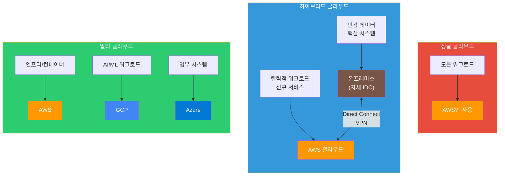
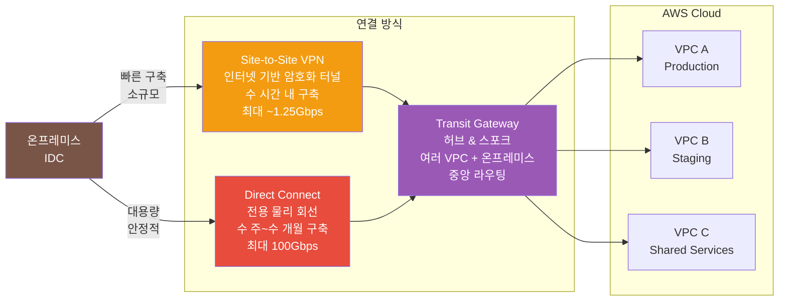
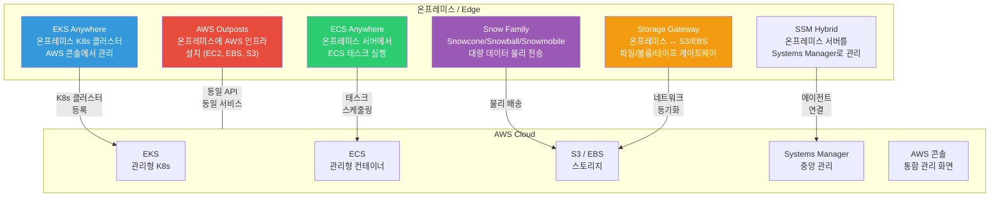

# 멀티 클라우드 / 하이브리드

> [이전 강의](./15-multi-account)에서 AWS Organizations로 여러 계정을 관리하는 법을 배웠어요. 이제 시야를 AWS 밖으로 넓혀서, **온프레미스와 AWS를 연결하는 하이브리드 클라우드**, 그리고 **여러 클라우드를 함께 쓰는 멀티 클라우드** 전략을 배워볼게요. AWS 마지막 강의로, 클라우드 아키텍처의 큰 그림을 완성해요.

---

## 🎯 이걸 왜 알아야 하나?

```
실무에서 멀티/하이브리드 클라우드가 필요한 순간:
• 회사가 IDC 서버를 보유한 채로 클라우드로 이전 중이에요         → 하이브리드 (Direct Connect)
• 규제 때문에 금융 데이터를 온프레미스에 두어야 해요             → 하이브리드 (Outposts)
• 한 벤더에 종속되면 가격 협상력이 떨어져요                     → 멀티 클라우드 (벤더 록인 방지)
• 인수합병(M&A)으로 GCP 쓰는 회사를 합병했어요                 → 멀티 클라우드 (통합 관리)
• AI/ML은 GCP가 좋고, 인프라는 AWS가 좋아요                    → 멀티 클라우드 (Best-of-Breed)
• 온프레미스 K8s와 EKS를 통합 관리하고 싶어요                  → EKS Anywhere
• Terraform으로 AWS + GCP를 한 번에 관리하고 싶어요             → IaC 멀티 클라우드
• 면접: "멀티 클라우드와 하이브리드 클라우드 차이점은?"          → 핵심 개념
```

---

## 🧠 핵심 개념

### 비유: 거래처 분산과 투자 포트폴리오

멀티 클라우드와 하이브리드 클라우드를 **사업 운영**에 비유해볼게요.

* **싱글 클라우드(Single Cloud)** = 거래처가 **하나뿐**인 회사. 그 거래처가 가격을 올리거나 문제가 생기면 속수무책이에요.
* **멀티 클라우드(Multi-Cloud)** = **여러 거래처**에 분산 발주하는 회사. A 거래처(AWS)에서 서버를, B 거래처(GCP)에서 AI 서비스를 가져와요. 거래처 하나가 문제 생겨도 대안이 있어요.
* **하이브리드 클라우드(Hybrid Cloud)** = **자체 공장(온프레미스)과 외주 공장(클라우드)**을 함께 쓰는 회사. 핵심 제조는 자체 공장에서, 수요 폭증 시 외주 공장에서 처리해요.
* **투자 포트폴리오** 비유도 딱 맞아요. 주식 한 종목에 올인하면 위험하듯이, 클라우드 한 곳에 올인하면 **벤더 록인** 위험이 커요. 분산 투자처럼 클라우드도 분산하는 거예요.

### 멀티 클라우드 vs 하이브리드 클라우드 비교



### 왜 멀티/하이브리드를 선택하나?

| 동기 | 설명 | 비유 |
|------|------|------|
| **벤더 록인 방지** | 한 클라우드에 종속되면 가격/조건 변경에 대응 불가 | 거래처 1곳에만 의존하면 을이 됨 |
| **규제 준수** | 금융/의료 데이터는 특정 위치에 저장해야 하는 법적 요구사항 | 국가별 공장 의무 설립 규정 |
| **Best-of-Breed** | 각 클라우드의 강점을 골라 쓰기 (GCP AI, AWS 인프라 등) | 부품별 최고 공급업체 선택 |
| **M&A/레거시** | 인수합병으로 다른 클라우드를 쓰는 팀이 합류 | 합병한 회사의 기존 거래처 유지 |
| **재해 복구(DR)** | 한 클라우드 전체 장애 시 다른 클라우드에서 서비스 유지 | 공장 2곳에 분산 생산 |
| **가격 최적화** | 클라우드별 가격 경쟁을 유도하여 비용 절감 | 견적서 여러 곳에 받기 |

### 하이브리드 연결 방식 비교



> [VPC 강의](./02-vpc)에서 Site-to-Site VPN과 Direct Connect 기초를 다뤘어요. [VPN 기초](../02-networking/10-vpn)도 함께 참고하세요.

### AWS 하이브리드 서비스 전체 맵



---

## 🔍 상세 설명

### 하이브리드 연결: Direct Connect vs VPN

온프레미스와 AWS를 연결하는 두 가지 핵심 방식이에요.

| 항목 | Site-to-Site VPN | Direct Connect |
|------|-------------------|----------------|
| **연결 방식** | 인터넷 위의 IPsec 터널 | 전용 물리 회선 |
| **구축 시간** | 수 분~수 시간 | 수 주~수 개월 |
| **대역폭** | ~1.25 Gbps (터널당) | 1/10/100 Gbps |
| **안정성** | 인터넷 상태에 의존 | 일관된 지연 시간 |
| **비용** | 시간당 ~$0.05 | 포트 시간당 ~$0.30 (1Gbps) |
| **암호화** | 기본 암호화 (IPsec) | 기본 비암호화 (MACsec 옵션) |
| **용도** | 백업 연결, 소규모, 빠른 구축 | 대용량 데이터 전송, 프로덕션 |
| **HA 구성** | 자동 이중화 (2개 터널) | 2개 연결 + 2개 위치 권장 |

**실무 팁**: 보통 Direct Connect를 메인 회선으로, Site-to-Site VPN을 백업 회선으로 구성해요.

### Transit Gateway: 허브 & 스포크

VPC가 많아지면 VPC Peering으로는 관리가 힘들어져요. Transit Gateway(TGW)는 **중앙 허브** 역할을 하면서 여러 VPC, VPN, Direct Connect를 한 곳에서 연결해요.

```
Transit Gateway 없이 (VPC Peering - 풀 메시):

VPC-A ←→ VPC-B
VPC-A ←→ VPC-C
VPC-A ←→ VPC-D
VPC-B ←→ VPC-C     ← VPC 4개면 연결 6개, VPC 10개면 연결 45개!
VPC-B ←→ VPC-D
VPC-C ←→ VPC-D

Transit Gateway 사용 (허브 & 스포크):

VPC-A ─┐
VPC-B ─┤
VPC-C ─┼── Transit Gateway ── Direct Connect ── 온프레미스
VPC-D ─┤                   ── VPN ── 원격 사무실
VPC-E ─┘
         ← VPC가 아무리 많아도 TGW 연결만 추가!
```

### AWS Outposts: 온프레미스에 AWS를 가져오기

Outposts는 AWS가 **물리 하드웨어 랙**을 여러분의 IDC에 설치해주는 서비스예요. 온프레미스에서도 EC2, EBS, S3, RDS, EKS를 **동일한 AWS API**로 사용할 수 있어요.

```
Outposts가 필요한 상황:
• 데이터 레지던시: 법적으로 데이터가 특정 물리 위치를 떠나면 안 되는 경우
• 초저지연: 온프레미스 시스템과 밀리초 이하 지연이 필요한 경우
• 점진적 마이그레이션: 기존 IDC 인프라와 AWS를 동일 환경으로 통합하고 싶은 경우
```

### EKS Anywhere / ECS Anywhere

```
EKS Anywhere:
• 온프레미스, VM, 베어메탈에 K8s 클러스터를 배포
• AWS 콘솔에서 온프레미스 K8s 클러스터를 통합 관리
• Flux 기반 GitOps로 클러스터 업그레이드 자동화
• 라이선스: 무료 (지원 계약은 별도)

ECS Anywhere:
• 온프레미스 서버에 SSM Agent + ECS Agent 설치
• ECS 콘솔에서 온프레미스 서버의 컨테이너 태스크를 스케줄링
• AWS 리전의 ECS와 동일한 태스크 정의 사용 가능
```

> [K8s 멀티 클러스터](../04-kubernetes/19-multi-cluster) 강의에서 EKS Anywhere를 포함한 멀티 클러스터 관리를 자세히 다뤄요.

### 멀티 클라우드 도구 생태계

여러 클라우드를 통합 관리하려면 **클라우드 중립적인 도구**가 필요해요.

| 도구 | 역할 | 설명 |
|------|------|------|
| **Terraform** | IaC (인프라 코드화) | HCL로 AWS + GCP + Azure를 하나의 코드로 관리 |
| **Kubernetes** | 컨테이너 오케스트레이션 | 어떤 클라우드에서든 동일한 Pod/Service 추상화 |
| **Consul** | 서비스 디스커버리 | 멀티 클라우드 서비스 간 자동 라우팅 |
| **Vault** | 시크릿 관리 | 클라우드 중립적인 비밀번호/인증서 관리 |
| **Prometheus + Grafana** | 모니터링 | 멀티 클라우드 메트릭 통합 수집/시각화 |
| **Backstage** | 개발자 포털 | 멀티 클라우드 서비스 카탈로그 통합 관리 |

```
Terraform으로 멀티 클라우드를 관리하는 구조:

main.tf
├── provider "aws" { region = "ap-northeast-2" }
├── provider "google" { project = "my-project" }
│
├── module "aws_infra" {
│   ├── aws_eks_cluster       # AWS에서 K8s 실행
│   ├── aws_rds_instance      # AWS에서 DB 운영
│   └── aws_s3_bucket         # AWS에서 스토리지
│
└── module "gcp_ai" {
    ├── google_vertex_ai       # GCP에서 AI/ML 학습
    └── google_bigquery        # GCP에서 대용량 분석
```

> [IaC 개념](../06-iac/01-concept) 강의에서 Terraform 기초를 배워요. 멀티 클라우드 Terraform은 IaC 강의의 연장선이에요.

### AWS vs GCP vs Azure 서비스 매핑표

세 클라우드의 주요 서비스를 매핑하면 이해하기 쉬워요. 이름만 다르지 역할은 비슷한 서비스가 많아요.

| 카테고리 | AWS | GCP | Azure |
|----------|-----|-----|-------|
| **가상 서버** | EC2 | Compute Engine | Virtual Machines |
| **관리형 K8s** | EKS | GKE | AKS |
| **서버리스 함수** | Lambda | Cloud Functions | Azure Functions |
| **오브젝트 스토리지** | S3 | Cloud Storage (GCS) | Blob Storage |
| **블록 스토리지** | EBS | Persistent Disk | Managed Disks |
| **관계형 DB** | RDS / Aurora | Cloud SQL / AlloyDB | Azure SQL |
| **NoSQL DB** | DynamoDB | Firestore / Bigtable | Cosmos DB |
| **메시지 큐** | SQS | Pub/Sub | Service Bus |
| **CDN** | CloudFront | Cloud CDN | Azure CDN |
| **DNS** | Route 53 | Cloud DNS | Azure DNS |
| **VPC/네트워크** | VPC | VPC | VNet |
| **IAM** | IAM | IAM | Entra ID (AAD) |
| **IaC** | CloudFormation | Deployment Manager | ARM / Bicep |
| **AI/ML 플랫폼** | SageMaker | Vertex AI | Azure ML |
| **데이터 웨어하우스** | Redshift | BigQuery | Synapse Analytics |
| **컨테이너 레지스트리** | ECR | Artifact Registry | ACR |
| **시크릿 관리** | Secrets Manager | Secret Manager | Key Vault |
| **모니터링** | CloudWatch | Cloud Monitoring | Azure Monitor |

**각 클라우드의 강점:**

```
AWS:    가장 넓은 서비스 범위, 가장 큰 시장 점유율, 성숙한 생태계
GCP:    데이터 분석(BigQuery), AI/ML(Vertex AI), K8s(GKE 원조)
Azure:  Microsoft 생태계 연동(AD, Office 365), 엔터프라이즈 하이브리드
```

### 고려사항: 현실적 조언

멀티/하이브리드 클라우드가 항상 정답은 아니에요. 도입 전에 반드시 따져봐야 할 것들이 있어요.

```
장점 vs 단점 현실 체크:

장점:
✓ 벤더 록인 방지 → 가격 협상력 확보
✓ 규제 준수 → 데이터 주권 요구사항 충족
✓ 장애 대비 → 한 클라우드 장애 시 대안 확보
✓ Best-of-Breed → 각 클라우드의 강점 활용

단점:
✗ 복잡성 증가 → 2~3배의 운영 부담
✗ 이중 비용 → 네트워크 전송비 + 중복 서비스 비용
✗ 팀 역량 분산 → AWS 전문가 + GCP 전문가 모두 필요
✗ 최소공통분모 함정 → 각 클라우드 고유 기능을 못 씀
✗ 네트워크 지연 → 클라우드 간 데이터 이동 시 레이턴시 증가
✗ 데이터 이그레스 비용 → 클라우드 밖으로 데이터 보낼 때 과금
```

---

## 💻 실습 예제

### 실습 1: Site-to-Site VPN 구성으로 온프레미스 연결 시뮬레이션

시나리오: AWS VPC와 온프레미스(시뮬레이션)를 Site-to-Site VPN으로 연결해요. 실제 온프레미스가 없어도 VPN 구성 흐름을 익힐 수 있어요.

```bash
# 1단계: Customer Gateway 생성 (온프레미스 VPN 장비의 공인 IP)
# 실습에서는 가상의 IP를 사용해요
aws ec2 create-customer-gateway \
    --type ipsec.1 \
    --public-ip 203.0.113.100 \
    --bgp-asn 65000 \
    --tag-specifications 'ResourceType=customer-gateway,Tags=[{Key=Name,Value=onprem-vpn-device}]'

# Customer Gateway ID 확인
CGW_ID=$(aws ec2 describe-customer-gateways \
    --filters "Name=tag:Name,Values=onprem-vpn-device" \
    --query 'CustomerGateways[0].CustomerGatewayId' \
    --output text)
echo "Customer Gateway: $CGW_ID"
```

```bash
# 2단계: Virtual Private Gateway 생성 + VPC 연결
aws ec2 create-vpn-gateway \
    --type ipsec.1 \
    --tag-specifications 'ResourceType=vpn-gateway,Tags=[{Key=Name,Value=hybrid-vpn-gw}]'

VGW_ID=$(aws ec2 describe-vpn-gateways \
    --filters "Name=tag:Name,Values=hybrid-vpn-gw" \
    --query 'VpnGateways[0].VpnGatewayId' \
    --output text)

# VPC에 VPN Gateway 연결
aws ec2 attach-vpn-gateway \
    --vpn-gateway-id $VGW_ID \
    --vpc-id vpc-0abc123456

# 라우트 전파 활성화 (VPN 경로 자동 전파)
aws ec2 enable-vgw-route-propagation \
    --route-table-id rtb-0abc123456 \
    --gateway-id $VGW_ID
```

```bash
# 3단계: VPN Connection 생성
aws ec2 create-vpn-connection \
    --type ipsec.1 \
    --customer-gateway-id $CGW_ID \
    --vpn-gateway-id $VGW_ID \
    --options '{
        "StaticRoutesOnly": false,
        "TunnelOptions": [
            {
                "PreSharedKey": "my-preshared-key-1",
                "TunnelInsideCidr": "169.254.10.0/30"
            },
            {
                "PreSharedKey": "my-preshared-key-2",
                "TunnelInsideCidr": "169.254.10.4/30"
            }
        ]
    }' \
    --tag-specifications 'ResourceType=vpn-connection,Tags=[{Key=Name,Value=onprem-to-aws}]'

# 4단계: VPN 연결 상태 확인
aws ec2 describe-vpn-connections \
    --filters "Name=tag:Name,Values=onprem-to-aws" \
    --query 'VpnConnections[0].{
        State: State,
        Tunnel1: VgwTelemetry[0].Status,
        Tunnel2: VgwTelemetry[1].Status
    }'
```

```json
{
    "State": "available",
    "Tunnel1": "UP",
    "Tunnel2": "UP"
}
```

> 터널 2개가 자동 생성되는 이유: AWS VPN은 기본적으로 **이중화(HA)**를 제공해요. 하나의 터널이 실패해도 다른 터널로 자동 전환돼요.

---

### 실습 2: ECS Anywhere로 온프레미스 서버에 컨테이너 배포

시나리오: 온프레미스 서버(또는 로컬 VM)를 ECS 클러스터에 등록하고, AWS 콘솔에서 컨테이너 태스크를 관리해요.

```bash
# 1단계: ECS Anywhere용 클러스터 생성
aws ecs create-cluster \
    --cluster-name hybrid-cluster \
    --tags key=Environment,value=hybrid

# 2단계: SSM Hybrid Activation 생성 (온프레미스 서버 등록용)
aws ssm create-activation \
    --default-instance-name "onprem-server-01" \
    --iam-role ecsAnywhereRole \
    --registration-limit 10 \
    --tags Key=Environment,Value=hybrid

# 출력 예시 - 이 값을 온프레미스 서버에서 사용해요
# ActivationId: 1a2b3c4d-1234-5678-abcd-1234567890ab
# ActivationCode: ABCDEFGHIJ1234567890
```

```bash
# 3단계: 온프레미스 서버에서 실행 (Linux 서버에서)
# SSM Agent + ECS Agent 설치 스크립트 다운로드
curl --proto "https" -o /tmp/ecs-anywhere-install.sh \
    "https://amazon-ecs-agent.s3.amazonaws.com/ecs-anywhere-install-latest.sh"

# 에이전트 설치 + 클러스터 등록
sudo bash /tmp/ecs-anywhere-install.sh \
    --region ap-northeast-2 \
    --cluster hybrid-cluster \
    --activation-id "1a2b3c4d-1234-5678-abcd-1234567890ab" \
    --activation-code "ABCDEFGHIJ1234567890"
```

```bash
# 4단계: 온프레미스 인스턴스가 등록되었는지 확인
aws ecs list-container-instances \
    --cluster hybrid-cluster \
    --filter "attribute:ecs.os-type == linux"

# 5단계: 태스크 정의 생성 (EXTERNAL 시작 타입)
cat << 'TASKDEF' > /tmp/hybrid-task.json
{
    "family": "hybrid-nginx",
    "requiresCompatibilities": ["EXTERNAL"],
    "containerDefinitions": [
        {
            "name": "nginx",
            "image": "nginx:latest",
            "memory": 256,
            "cpu": 256,
            "essential": true,
            "portMappings": [
                {
                    "containerPort": 80,
                    "hostPort": 8080,
                    "protocol": "tcp"
                }
            ]
        }
    ]
}
TASKDEF

aws ecs register-task-definition \
    --cli-input-json file:///tmp/hybrid-task.json

# 6단계: 온프레미스 서버에 태스크 실행
aws ecs run-task \
    --cluster hybrid-cluster \
    --task-definition hybrid-nginx \
    --launch-type EXTERNAL
```

```
결과: 온프레미스 서버의 :8080 포트에서 nginx가 실행되고,
      AWS ECS 콘솔에서 태스크 상태를 모니터링할 수 있어요.

      AWS 콘솔 > ECS > Clusters > hybrid-cluster > Tasks
      → EXTERNAL 인스턴스에서 실행 중인 태스크 확인
```

> [컨테이너 서비스 강의](./09-container-services)에서 ECS 기초를 배웠어요. ECS Anywhere는 시작 타입만 `EXTERNAL`로 바뀌고, 나머지는 동일해요.

---

### 실습 3: Terraform으로 AWS + GCP 멀티 클라우드 인프라 구성

시나리오: Terraform 하나의 프로젝트에서 AWS S3 버킷과 GCP Cloud Storage 버킷을 동시에 생성해요. IaC로 멀티 클라우드를 통합 관리하는 기초 패턴이에요.

```hcl
# providers.tf - 멀티 클라우드 프로바이더 설정
terraform {
  required_version = ">= 1.5.0"

  required_providers {
    aws = {
      source  = "hashicorp/aws"
      version = "~> 5.0"
    }
    google = {
      source  = "hashicorp/google"
      version = "~> 5.0"
    }
  }
}

# AWS 프로바이더
provider "aws" {
  region = "ap-northeast-2"  # 서울 리전

  default_tags {
    tags = {
      Project     = "multi-cloud-demo"
      ManagedBy   = "terraform"
    }
  }
}

# GCP 프로바이더
provider "google" {
  project = "my-gcp-project-id"
  region  = "asia-northeast3"  # 서울 리전
}
```

```hcl
# storage.tf - 양쪽 클라우드에 스토리지 생성
# ============================================
# AWS S3 버킷 (메인 데이터 저장소)
# ============================================
resource "aws_s3_bucket" "main_data" {
  bucket = "my-company-main-data-2026"

  tags = {
    Purpose = "primary-storage"
    Cloud   = "aws"
  }
}

resource "aws_s3_bucket_versioning" "main_data" {
  bucket = aws_s3_bucket.main_data.id
  versioning_configuration {
    status = "Enabled"  # 버전 관리로 데이터 보호
  }
}

# ============================================
# GCP Cloud Storage 버킷 (백업/분석용)
# ============================================
resource "google_storage_bucket" "backup_data" {
  name     = "my-company-backup-data-2026"
  location = "ASIA-NORTHEAST3"  # 서울

  # GCP에서는 uniform_bucket_level_access 권장
  uniform_bucket_level_access = true

  versioning {
    enabled = true  # AWS와 동일하게 버전 관리
  }

  labels = {
    purpose    = "backup-storage"
    cloud      = "gcp"
    managed-by = "terraform"
  }
}

# ============================================
# 출력값으로 양쪽 스토리지 정보 확인
# ============================================
output "aws_bucket" {
  description = "AWS S3 버킷 이름"
  value       = aws_s3_bucket.main_data.id
}

output "gcp_bucket" {
  description = "GCP Cloud Storage 버킷 이름"
  value       = google_storage_bucket.backup_data.name
}

output "summary" {
  description = "멀티 클라우드 스토리지 구성 요약"
  value = <<-EOT
    AWS S3 (Primary):  ${aws_s3_bucket.main_data.id}
    GCP GCS (Backup):  ${google_storage_bucket.backup_data.name}
    관리 도구:         Terraform v${terraform.required_version}
  EOT
}
```

```bash
# Terraform 실행
cd multi-cloud-infra/

# 초기화 (양쪽 프로바이더 플러그인 다운로드)
terraform init

# 계획 확인 (어떤 리소스가 생성되는지 미리 확인)
terraform plan
# Plan: 3 to add, 0 to change, 0 to destroy.
# + aws_s3_bucket.main_data
# + aws_s3_bucket_versioning.main_data
# + google_storage_bucket.backup_data

# 적용 (양쪽 클라우드에 동시에 리소스 생성)
terraform apply -auto-approve

# 상태 확인 (하나의 state 파일에서 양쪽 관리)
terraform state list
# aws_s3_bucket.main_data
# aws_s3_bucket_versioning.main_data
# google_storage_bucket.backup_data
```

```
핵심 포인트:
• 하나의 terraform state에서 AWS와 GCP 리소스를 모두 관리해요
• terraform plan으로 양쪽 변경사항을 한눈에 확인할 수 있어요
• 팀은 HCL만 알면 되고, 각 클라우드 콘솔을 왔다 갔다 하지 않아도 돼요
• 실무에서는 state를 S3 + DynamoDB 백엔드에 저장하는 것을 권장해요
```

> [IaC 개념 강의](../06-iac/01-concept)에서 Terraform 기초부터 배워요. 멀티 클라우드 Terraform은 provider 블록만 추가하면 돼요.

---

## 🏢 실무에서는?

### 시나리오 1: 금융사 하이브리드 아키텍처 (규제 준수)

```
문제: 금융감독원 규정상 고객 원장 데이터는 국내 IDC에 보관해야 하고,
      동시에 모바일 뱅킹 앱은 AWS의 탄력적 확장이 필요해요.
      두 환경을 안전하게 연결하면서 규정도 준수해야 해요.

해결: Direct Connect + Transit Gateway + Outposts 조합
```

```
아키텍처:

[온프레미스 IDC - 금융 데이터]
├── Core Banking System (계정원장, 거래내역)
├── AWS Outposts (온프레미스에 설치)
│   ├── RDS on Outposts (고객 원장 DB - 데이터 주권)
│   └── EKS on Outposts (결제 처리 Pod)
│
├── Direct Connect (10Gbps 전용선 x 2 = 이중화)
│   └── Transit Gateway
│       ├── VPC-Production (모바일 뱅킹 API)
│       │   ├── EKS Cluster (앱 서버)
│       │   ├── ElastiCache (세션/캐시)
│       │   └── ALB + WAF (보안)
│       │
│       ├── VPC-Analytics (데이터 분석)
│       │   ├── Redshift (분석 DB)
│       │   └── SageMaker (이상거래 탐지 ML)
│       │
│       └── VPC-DR (재해복구)
│           └── Aurora 읽기 복제본
│
└── Site-to-Site VPN (Direct Connect 백업 회선)

핵심 포인트:
• 고객 원장은 Outposts(온프레미스)에서 처리 → 규정 준수
• 모바일 뱅킹은 AWS에서 Auto Scaling → 탄력적 확장
• Direct Connect 이중화 + VPN 백업 → 99.99% 가용성
• Transit Gateway로 VPC 간 라우팅 중앙 관리
```

### 시나리오 2: 글로벌 기업 멀티 클라우드 전략 (Best-of-Breed)

```
문제: 글로벌 커머스 회사에서
      - 인프라/컨테이너는 AWS가 가장 성숙해요
      - 데이터 분석은 BigQuery(GCP)가 빠르고 저렴해요
      - 유럽 사무실은 이미 Azure + Microsoft 365를 쓰고 있어요
      M&A로 합류한 AI 팀은 GCP Vertex AI를 사용 중이에요.

해결: 용도별 클라우드 선택 + Terraform + Kubernetes 통합
```

```
아키텍처:

┌─────────────────────────────────────────────────────┐
│                   통합 관리 레이어                     │
│                                                       │
│  Terraform (IaC)    │  Vault (시크릿)  │  Consul      │
│  모든 클라우드 인프라  │  모든 시크릿 통합  │  서비스 디스커버리 │
│  코드로 관리          │  관리             │               │
└─────────────────────────────────────────────────────┘
         │                    │                    │
    ┌────▼────┐         ┌────▼────┐         ┌────▼────┐
    │  AWS     │         │  GCP     │         │  Azure   │
    │          │         │          │         │          │
    │ EKS      │         │ GKE      │         │ AKS      │
    │ (메인 앱) │         │ (AI/ML)  │         │ (유럽 앱) │
    │          │         │          │         │          │
    │ Aurora   │         │ BigQuery │         │ Azure AD │
    │ (메인 DB) │         │ (분석)   │         │ (SSO)    │
    │          │         │          │         │          │
    │ S3       │         │ Vertex AI│         │ M365     │
    │ (스토리지)│         │ (ML 학습)│         │ (협업)   │
    └─────────┘         └─────────┘         └─────────┘

데이터 흐름:
AWS S3 (원본 데이터) → GCP BigQuery (분석) → AWS S3 (결과 저장)
                              ↓
                      Vertex AI (ML 모델 학습)
                              ↓
                      AWS SageMaker Endpoint (추론 서빙)

비용 고려:
• AWS → GCP 데이터 전송: $0.09/GB (이그레스 비용!)
• 월 10TB 전송 시: ~$900/월 네트워크 비용 추가
• 전략: 분석용 데이터는 한 방향으로만 전송, 결과만 돌려받기
```

### 시나리오 3: 스타트업의 현실적 전략 (일단 싱글, 점진적 확장)

```
문제: 10명 규모 스타트업인데, CTO가 "벤더 록인 방지를 위해
      처음부터 멀티 클라우드로 가자"고 해요.
      팀원 대부분은 AWS만 경험이 있어요.

현실적 조언:
```

```
❌ 잘못된 접근: 처음부터 멀티 클라우드

"AWS + GCP + Azure 모두 쓰겠다"
→ 10명이 3개 클라우드 전문가가 될 수 없어요
→ 인프라 코드가 3배로 늘어나고 운영 부담 급증
→ 각 클라우드의 관리형 서비스를 못 쓰고 최소공통분모로 전락
→ 결과: 속도 저하, 비용 증가, 팀 번아웃

✅ 올바른 접근: 싱글 + 탈출 전략 준비

1단계 (현재): AWS에 집중
  • AWS 네이티브 서비스 적극 활용 (Aurora, EKS, Lambda)
  • 팀 역량을 한 클라우드에 집중
  • 제품 출시 속도가 최우선

2단계 (성장기): 이식성 확보
  • 컨테이너(K8s) 기반으로 앱 아키텍처 구성
  • Terraform으로 인프라 코드화 (나중에 provider만 교체 가능)
  • 클라우드 전용 API 대신 표준 프로토콜 사용 (예: S3 API는 GCS도 호환)

3단계 (성숙기): 필요 시 멀티 클라우드
  • 특정 워크로드만 다른 클라우드로 (Best-of-Breed)
  • 규모의 경제로 가격 협상력 확보
  • 전담 팀 구성 후에 멀티 클라우드 확대

핵심: "멀티 클라우드는 목표가 아니라 도구예요.
       비즈니스가 요구할 때 확장하는 거지,
       처음부터 복잡성을 떠안을 필요는 없어요."
```

---

## ⚠️ 자주 하는 실수

### 1. 모든 것을 추상화하려는 실수 (최소공통분모 함정)

```
❌ 잘못: "어떤 클라우드로든 옮길 수 있게 모든 서비스를 추상화하자"
         → Aurora 대신 직접 MySQL 운영, Lambda 대신 직접 함수 서버 운영
         → 각 클라우드의 관리형 서비스 장점을 전혀 못 씀
         → 운영 부담은 늘고, 성능은 떨어지고, 비용은 올라감
```

```
✅ 올바른: "이동 가능성이 높은 레이어만 추상화"

추상화할 것:
• 애플리케이션 코드 → 컨테이너(Docker/K8s)로 패키징
• 인프라 정의 → Terraform으로 코드화
• CI/CD 파이프라인 → GitHub Actions 같은 클라우드 중립 도구

추상화하지 말 것 (클라우드 네이티브 서비스 활용):
• 데이터베이스 → Aurora, DynamoDB 그대로 사용
• 서버리스 → Lambda 그대로 사용
• 메시징 → SQS/SNS 그대로 사용
• 모니터링 → CloudWatch 그대로 사용 (+ Grafana로 통합 뷰)

원칙: "앱은 이식 가능하게, 인프라는 최적의 서비스로"
```

### 2. 네트워크 비용을 무시하는 실수

```
❌ 잘못: AWS와 GCP 간에 데이터를 자유롭게 주고받는 아키텍처 설계
         → 클라우드 밖으로 나가는 데이터에 이그레스 비용 발생
         → 월 100TB 전송 시 $8,500 이상의 네트워크 비용!
```

```
✅ 올바른: 데이터 이동 최소화 + 비용 사전 계산

비용 체크리스트:
• AWS 이그레스: $0.09/GB (처음 10TB), 이후 점진 할인
• GCP 이그레스: $0.08~0.12/GB (지역별)
• 클라우드 간 전용선: AWS Direct Connect + GCP Interconnect 비용 별도

설계 원칙:
1. 데이터는 한 곳에 두고, 컴퓨팅을 데이터 쪽으로 이동
2. 클라우드 간 전송은 집계/요약 데이터만 (원본 X)
3. 이그레스 비용을 아키텍처 설계 시 명시적으로 계산
4. Committed Use Discount나 대량 할인 협상
```

### 3. 팀 역량 없이 멀티 클라우드를 도입하는 실수

```
❌ 잘못: AWS만 아는 팀이 "벤더 록인 방지"를 위해 GCP도 도입
         → GCP 장애 시 아무도 대응 못함
         → "멀티 클라우드인데 GCP 부분은 아무도 몰라요"
         → 오히려 가용성이 떨어지는 역설적 상황
```

```
✅ 올바른: 팀 역량을 먼저 확보한 뒤 확장

역량 로드맵:
1. 기존 클라우드(AWS) 심화 → 팀 전체 숙련
2. 새 클라우드(GCP) 스터디 그룹 → 일부 인원 학습
3. 비핵심 워크로드로 PoC → 소규모 실험
4. 운영 경험 축적 → 장애 대응 매뉴얼 작성
5. 프로덕션 확대 → 검증된 영역만 점진 확대

최소 인력: 새 클라우드당 최소 2~3명의 전문 인력 확보 후 도입
```

### 4. 하이브리드에서 보안 경계를 설정하지 않는 실수

```
❌ 잘못: 온프레미스-AWS 간 VPN을 열어두고 방화벽 규칙 없이 운영
         → 온프레미스 장비가 해킹되면 AWS까지 전파
         → "연결했으니 됐다"는 안일한 생각
```

```
✅ 올바른: Zero Trust 원칙으로 보안 경계 설정

보안 체크리스트:
1. 네트워크 세분화: 온프레미스 → AWS는 필요한 포트/IP만 허용
2. Security Group: 온프레미스 CIDR별로 별도 규칙 적용
3. Transit Gateway 라우트 테이블: VPC별로 접근 가능한 온프레미스 대역 제한
4. VPN/DX 트래픽 모니터링: VPC Flow Logs + GuardDuty
5. IAM 조건키: VPN 소스 IP에서만 특정 API 호출 허용
   예: "aws:SourceIp": "10.0.0.0/8" (온프레미스 대역)
```

### 5. 클라우드 간 서비스를 1:1로 대체할 수 있다고 생각하는 실수

```
❌ 잘못: "DynamoDB를 GCP로 옮기면 Firestore로 바꾸면 되지"
         → DynamoDB의 DAX, Streams, Global Tables 등 고유 기능 사라짐
         → 데이터 모델, 쿼리 패턴, SDK 전부 다시 작성
         → "이름만 비슷하지 동작 방식이 완전히 달라요"
```

```
✅ 올바른: 서비스 매핑은 참고용, 실제 마이그레이션은 재설계

마이그레이션 전 체크:
1. 기능 갭 분석: 현재 쓰는 기능 목록 → 대상 서비스에서 지원 여부 확인
2. 데이터 모델 차이: DynamoDB(Key-Value) vs Firestore(Document) 구조 차이
3. SDK/API 차이: 코드 전면 수정 필요 범위 산정
4. 성능 차이: 같은 워크로드로 벤치마크 테스트 필수
5. 비용 차이: 과금 모델이 다르므로 실제 비용 비교 (RCU vs 읽기 횟수)

원칙: "서비스 매핑표는 개념 이해용이지, 마이그레이션 설계서가 아니에요."
```

---

## 📝 정리

```
멀티/하이브리드 클라우드 한눈에 보기:

┌─────────────────┬──────────────────────────────────────────────┐
│ 개념             │ 설명                                          │
├─────────────────┼──────────────────────────────────────────────┤
│ 하이브리드       │ 온프레미스 + 클라우드 연결 (Direct Connect/VPN) │
│ 멀티 클라우드    │ 여러 퍼블릭 클라우드 동시 사용 (AWS+GCP+Azure)  │
├─────────────────┼──────────────────────────────────────────────┤
│ Direct Connect  │ 전용 물리 회선, 대용량, 안정적, 구축 수 주       │
│ Site-to-Site VPN│ 인터넷 암호화 터널, 빠른 구축, 백업용            │
│ Transit Gateway │ 허브 & 스포크, 여러 VPC+온프레미스 중앙 연결     │
│ Outposts        │ 온프레미스에 AWS 하드웨어 설치, 동일 API          │
├─────────────────┼──────────────────────────────────────────────┤
│ EKS Anywhere    │ 온프레미스에서 EKS 호환 K8s 클러스터 운영        │
│ ECS Anywhere    │ 온프레미스 서버에서 ECS 태스크 실행               │
│ Storage Gateway │ 온프레미스 ↔ S3 파일/볼륨/테이프 게이트웨이      │
│ Snow Family     │ 대용량 데이터 물리 전송 (Snowball/Snowmobile)    │
├─────────────────┼──────────────────────────────────────────────┤
│ Terraform       │ HCL로 멀티 클라우드 IaC 통합 관리               │
│ Kubernetes      │ 클라우드 중립 컨테이너 오케스트레이션 추상화      │
│ Vault           │ 멀티 클라우드 시크릿 통합 관리                    │
│ Consul          │ 멀티 클라우드 서비스 디스커버리                   │
└─────────────────┴──────────────────────────────────────────────┘
```

**핵심 포인트:**

1. **하이브리드 != 멀티 클라우드**: 하이브리드는 온프레미스+클라우드, 멀티 클라우드는 여러 퍼블릭 클라우드예요. 둘 다 쓸 수도 있어요.
2. **Direct Connect + VPN**: 메인 회선(DX) + 백업 회선(VPN)으로 이중화하세요. VPN만으로 프로덕션 트래픽을 처리하기엔 불안정해요.
3. **Transit Gateway**: VPC가 3개 이상이면 TGW를 쓰세요. VPC Peering 풀 메시는 관리 불가능해져요.
4. **Outposts vs EKS Anywhere**: 데이터 주권이 핵심이면 Outposts, K8s 워크로드 통합이 목적이면 EKS Anywhere를 선택하세요.
5. **멀티 클라우드 도구**: Terraform(IaC) + Kubernetes(런타임) + Vault(시크릿)이 실무 표준 조합이에요.
6. **현실적 조언**: 작은 팀은 싱글 클라우드에 집중하고, 이식성만 확보하세요. 멀티 클라우드는 규모와 역량이 갖춰졌을 때 도입하세요.
7. **최소공통분모 함정**: 모든 것을 추상화하면 각 클라우드의 강점을 못 써요. 앱은 이식 가능하게, 인프라는 네이티브 서비스를 활용하세요.

**면접 대비 키워드:**

```
Q: 멀티 클라우드와 하이브리드 클라우드의 차이?
A: 하이브리드 = 온프레미스 + 퍼블릭 클라우드 연결.
   멀티 클라우드 = 여러 퍼블릭 클라우드(AWS+GCP+Azure) 동시 사용.
   둘은 배타적이지 않고, 하이브리드+멀티 클라우드도 가능.

Q: 벤더 록인을 방지하려면?
A: 1) 컨테이너(K8s) 기반 앱 아키텍처
   2) Terraform으로 인프라 코드화
   3) 표준 프로토콜/API 사용 (S3 호환 API, OIDC 등)
   4) 단, 완전한 벤더 독립은 비현실적 → "적절한 수준의 이식성" 추구

Q: Direct Connect vs VPN?
A: Direct Connect = 전용 물리 회선, 대용량(최대 100Gbps), 안정적, 구축 수 주.
   VPN = 인터넷 암호화 터널, 빠른 구축, ~1.25Gbps, 백업용.
   실무에서는 DX 메인 + VPN 백업 조합이 일반적.

Q: AWS Outposts는 언제 쓰나?
A: 1) 데이터 주권: 법적으로 데이터가 특정 위치를 떠나면 안 될 때
   2) 초저지연: 온프레미스 시스템과 ms 이하 통신이 필요할 때
   3) 동일한 AWS API/도구를 온프레미스에서도 쓰고 싶을 때

Q: 멀티 클라우드의 현실적 문제점?
A: 1) 운영 복잡성 2~3배 증가
   2) 클라우드 간 이그레스 비용
   3) 팀 역량 분산 (각 클라우드 전문가 필요)
   4) 최소공통분모 함정 (네이티브 서비스 장점 상실)
   5) 장애 대응 포인트 증가
```

---

## 🔗 다음 강의

🎉 **05-Cloud AWS 카테고리 완료!**

18개 강의를 통해 IAM, VPC, EC2, 스토리지, 데이터베이스, 로드밸런싱, Route 53, 컨테이너 서비스, 서버리스, 메시징, 보안, 관리, 비용, 멀티 계정, Well-Architected, DR, 그리고 멀티 클라우드까지 — AWS 인프라의 전체 그림을 그릴 수 있게 되었어요.

다음은 **[06-iac/01-concept — IaC 개념](../06-iac/01-concept)** 으로 넘어가요.

이번 강의에서 Terraform으로 멀티 클라우드를 관리하는 맛보기를 했는데, IaC 강의에서 Terraform의 기초부터 심화까지 본격적으로 배워볼게요. 지금까지 콘솔/CLI로 하나씩 만들었던 AWS 리소스를 **코드 한 줄로 관리**하는 방법을 알아볼 거예요.
