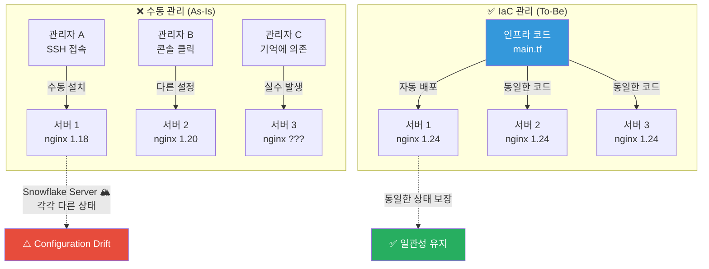
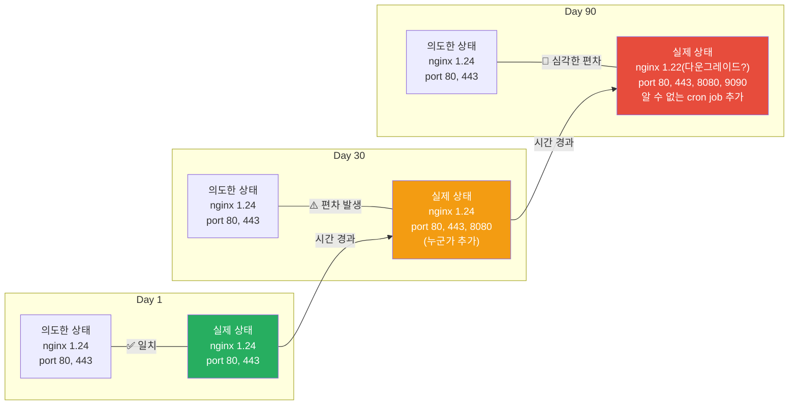
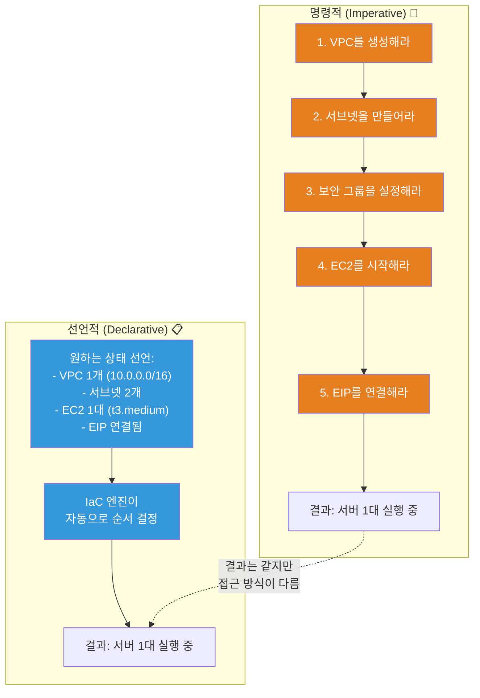
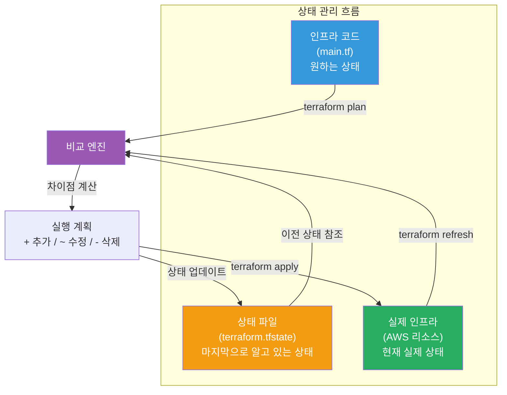
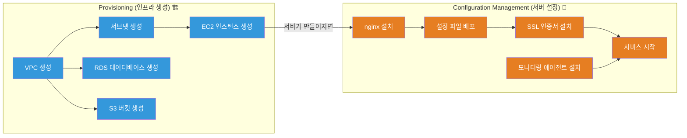
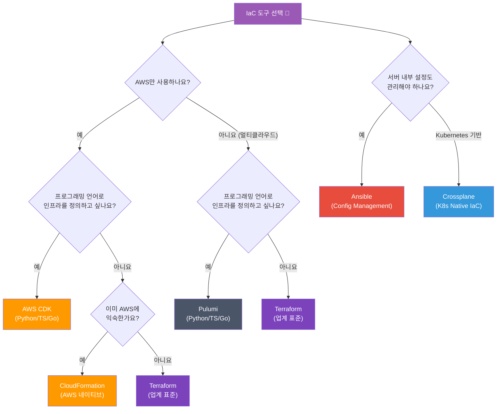
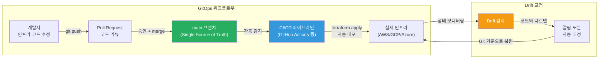

# IaC(Infrastructure as Code) 왜 필요한가

> 인프라를 코드로 관리한다는 건, 요리사가 레시피 없이 감으로 요리하던 것을 정확한 레시피북으로 바꾸는 거예요. 매번 똑같은 맛을 보장하고, 누구나 그 레시피대로 만들 수 있게 되죠. [AWS 서비스](../05-cloud-aws/01-iam)를 콘솔에서 클릭으로 만들던 시대에서, 코드 한 줄로 인프라 전체를 관리하는 시대로 넘어가봐요.

---

## 🎯 왜 IaC를 알아야 하나요?

### 일상 비유: 레시피 없는 요리사

유명 레스토랑의 요리사가 있어요. 이 요리사는 레시피를 안 적고 감으로만 요리해요.

- 월요일에 만든 파스타 맛과 화요일에 만든 파스타 맛이 달라요
- 요리사가 아프면 아무도 그 요리를 재현할 수 없어요
- "소금을 얼마나 넣었지?" 기억에만 의존해요
- 새 요리사가 오면 처음부터 다시 배워야 해요

**이게 바로 수동 인프라 관리의 현실이에요.**

```
실무에서 IaC가 필요한 순간:

• 서버 100대를 동일한 설정으로 구성해야 함        → 수동으로는 불가능
• "이 서버 설정 누가 바꿨어요?"                    → 변경 추적 불가
• 장애 발생! 서버를 빨리 복구해야 함               → 설정이 문서화되어 있지 않음
• 개발/스테이징/프로덕션 환경이 달라요              → Configuration Drift
• 신규 팀원이 인프라를 이해하기 어려움              → 암묵지(Tribal Knowledge)
• 보안 감사: "인프라 변경 이력 보여주세요"          → Git 히스토리로 해결
• AWS 비용 최적화를 위해 리소스를 정리하고 싶음     → 코드로 전체 파악 가능
```

### 수동 관리의 악몽



---

## 🧠 핵심 개념 잡기

### 1. Infrastructure as Code (IaC)

> **비유**: 건축가의 설계도면

건물을 지을 때 설계도면 없이 벽돌을 쌓는 건축업자는 없어요. IaC는 인프라의 설계도면이에요. 코드로 인프라의 원하는 상태를 정의하고, 도구가 그 상태를 자동으로 만들어줘요.

### 2. 선언적(Declarative) vs 명령적(Imperative)

> **비유**: 택시 목적지 vs 운전 지시

- **선언적**: "강남역으로 가주세요" (목적지만 말하면 택시 기사가 알아서 가요)
- **명령적**: "직진 → 좌회전 → 300m 직진 → 우회전" (모든 단계를 지시해요)

### 3. 멱등성(Idempotency)

> **비유**: 엘리베이터 버튼

엘리베이터에서 5층 버튼을 한 번 누르든 열 번 누르든 결과는 같아요 — 5층에 도착해요. IaC에서 같은 코드를 여러 번 실행해도 결과가 동일해야 해요.

### 4. 상태 관리(State Management)

> **비유**: 가계부

가계부 없이 돈을 쓰면 지금 잔고가 얼마인지 모르죠? IaC의 상태 파일은 "현재 인프라가 어떤 상태인지" 기록하는 가계부예요. 이걸 기반으로 "뭘 바꿔야 하는지" 계산해요.

### 5. Provisioning vs Configuration Management

> **비유**: 집 짓기 vs 인테리어

- **Provisioning**: 땅을 사고, 기둥을 세우고, 지붕을 올리는 것 (서버/네트워크/스토리지 생성)
- **Configuration Management**: 벽지를 바르고, 가구를 놓고, 에어컨을 설치하는 것 (OS 설정, 패키지 설치, 서비스 구성)

---

## 🔍 하나씩 자세히 알아보기

### 1. IaC가 왜 필요한가

#### Snowflake Server 문제

"Snowflake Server"란 각 서버가 눈송이처럼 고유한 상태를 가지는 것을 말해요. 수동으로 관리하면 시간이 지날수록 서버마다 설정이 달라져요.

```
# ❌ Snowflake Server의 현실

서버 A (2023년 3월 구축):
  - Ubuntu 20.04
  - nginx 1.18
  - Node.js 16
  - /etc/nginx/nginx.conf → 관리자 김씨가 수정
  - 방화벽 규칙: 포트 80, 443, 8080(디버깅용으로 열어둠)

서버 B (2023년 9월 구축):
  - Ubuntu 22.04
  - nginx 1.24
  - Node.js 18
  - /etc/nginx/nginx.conf → 관리자 이씨가 다르게 수정
  - 방화벽 규칙: 포트 80, 443

서버 C (2024년 2월 구축):
  - Ubuntu 22.04
  - nginx 1.24
  - Node.js 20
  - /etc/nginx/nginx.conf → 누가 수정했는지 모름
  - 방화벽 규칙: ???
```

#### Configuration Drift(설정 편차)

시간이 지나면서 인프라의 실제 상태가 의도한 상태에서 벗어나는 현상이에요.



#### IaC 도입 전/후 비교

| 항목 | IaC 도입 전 (수동) | IaC 도입 후 (코드) |
|------|-------------------|-------------------|
| **서버 구축 시간** | 2-3일 (문서 찾기 + 수동 설정) | 10-30분 (코드 실행) |
| **환경 일관성** | 서버마다 다름 (Snowflake) | 코드가 같으면 결과도 같음 |
| **변경 추적** | "누가 바꿨어요?" 범인 찾기 | Git 히스토리로 즉시 확인 |
| **장애 복구** | 수시간~수일 (기억에 의존) | 수분~수십분 (코드 재실행) |
| **코드 리뷰** | 불가능 | PR 기반 리뷰 가능 |
| **팀원 온보딩** | 구전 (암묵지) | 코드 읽기 (명시지) |
| **환경 복제** | 고통스러움 | `terraform workspace` |
| **비용 파악** | 콘솔에서 하나하나 확인 | 코드로 전체 리소스 파악 |

---

### 2. 선언적(Declarative) vs 명령적(Imperative) 접근법

이건 IaC를 이해하는 데 가장 중요한 개념 중 하나예요.



#### 명령적 접근법 예시 (Bash Script)

```bash
#!/bin/bash
# ❌ 명령적 접근: 모든 단계를 직접 지시

# 1. VPC 생성
VPC_ID=$(aws ec2 create-vpc --cidr-block 10.0.0.0/16 --query 'Vpc.VpcId' --output text)
aws ec2 create-tags --resources $VPC_ID --tags Key=Name,Value=my-vpc

# 2. 서브넷 생성
SUBNET_ID=$(aws ec2 create-subnet --vpc-id $VPC_ID --cidr-block 10.0.1.0/24 --query 'Subnet.SubnetId' --output text)

# 3. 인터넷 게이트웨이 생성 및 연결
IGW_ID=$(aws ec2 create-internet-gateway --query 'InternetGateway.InternetGatewayId' --output text)
aws ec2 attach-internet-gateway --internet-gateway-id $IGW_ID --vpc-id $VPC_ID

# 4. EC2 생성
INSTANCE_ID=$(aws ec2 run-instances \
  --image-id ami-0abcdef1234567890 \
  --instance-type t3.medium \
  --subnet-id $SUBNET_ID \
  --query 'Instances[0].InstanceId' --output text)

# 문제점:
# - 이미 VPC가 있으면? → 에러 또는 중복 생성
# - 중간에 실패하면? → 일부만 생성된 상태로 남음
# - 삭제하려면? → 역순으로 하나하나 삭제해야 함
# - 다시 실행하면? → 또 새로 만들어짐 (멱등성 없음)
```

#### 선언적 접근법 예시 (Terraform)

```hcl
# ✅ 선언적 접근: 원하는 상태만 선언

resource "aws_vpc" "main" {
  cidr_block = "10.0.0.0/16"

  tags = {
    Name = "my-vpc"
  }
}

resource "aws_subnet" "public" {
  vpc_id     = aws_vpc.main.id
  cidr_block = "10.0.1.0/24"
}

resource "aws_internet_gateway" "main" {
  vpc_id = aws_vpc.main.id
}

resource "aws_instance" "web" {
  ami           = "ami-0abcdef1234567890"
  instance_type = "t3.medium"
  subnet_id     = aws_subnet.public.id
}

# 장점:
# - 이미 있으면? → 변경사항만 적용 (멱등성)
# - 중간에 실패하면? → 상태 파일로 추적, 재실행 가능
# - 삭제하려면? → terraform destroy 한 번으로 전체 삭제
# - 다시 실행하면? → "변경사항 없음" (이미 원하는 상태)
```

#### 비교 정리

| 특성 | 명령적 (Imperative) | 선언적 (Declarative) |
|------|---------------------|---------------------|
| **방식** | "어떻게" 할지 지시 | "무엇"을 원하는지 선언 |
| **실행 순서** | 개발자가 결정 | 도구가 자동 결정 |
| **멱등성** | 직접 구현해야 함 | 도구가 보장 |
| **상태 관리** | 직접 추적 | 도구가 관리 |
| **학습 곡선** | 낮음 (스크립트 작성) | 보통 (DSL 학습 필요) |
| **대표 도구** | Ansible, Shell Script | Terraform, CloudFormation, Pulumi |
| **비유** | 내비 없이 운전 지시 | 목적지만 입력 |

> **참고**: Ansible은 선언적/명령적 모두 가능하지만, 주로 절차적(Procedural) 방식으로 사용돼요. Terraform은 순수 선언적이에요.

---

### 3. 멱등성(Idempotency)

멱등성은 IaC에서 가장 중요한 특성 중 하나예요. **같은 작업을 여러 번 수행해도 결과가 동일한 것**을 의미해요.

#### 멱등성이 없으면 생기는 문제

```bash
# ❌ 멱등성 없는 스크립트
#!/bin/bash
echo "nameserver 8.8.8.8" >> /etc/resolv.conf

# 1번 실행: nameserver 8.8.8.8  (1줄)
# 2번 실행: nameserver 8.8.8.8  (2줄 - 중복!)
#           nameserver 8.8.8.8
# 3번 실행: nameserver 8.8.8.8  (3줄 - 더 중복!)
#           nameserver 8.8.8.8
#           nameserver 8.8.8.8
```

#### 멱등성이 있는 코드

```bash
# ✅ 멱등성 있는 스크립트
#!/bin/bash
if ! grep -q "nameserver 8.8.8.8" /etc/resolv.conf; then
  echo "nameserver 8.8.8.8" >> /etc/resolv.conf
fi

# 1번 실행: nameserver 8.8.8.8  (1줄 추가)
# 2번 실행: (변경 없음 - 이미 있으니까)
# 3번 실행: (변경 없음)
```

#### Terraform의 멱등성

```bash
# 첫 번째 실행
$ terraform apply
aws_instance.web: Creating...
aws_instance.web: Creation complete after 45s [id=i-0abc123]

Apply complete! Resources: 1 added, 0 changed, 0 destroyed.

# 두 번째 실행 (코드 변경 없음)
$ terraform apply
aws_instance.web: Refreshing state... [id=i-0abc123]

No changes. Your infrastructure matches the configuration.

Apply complete! Resources: 0 added, 0 changed, 0 destroyed.

# 세 번째 실행 (instance_type만 변경)
$ terraform apply
aws_instance.web: Refreshing state... [id=i-0abc123]

  ~ resource "aws_instance" "web" {
      ~ instance_type = "t3.medium" -> "t3.large"  # 이것만 변경
    }

Plan: 0 to add, 1 to change, 0 to destroy.
```

---

### 4. 상태 관리(State Management)

#### Terraform State의 역할

Terraform은 `terraform.tfstate` 파일에 현재 인프라의 상태를 저장해요. 이 파일이 "실제 인프라"와 "코드"를 연결하는 다리 역할을 해요.



#### State 파일 예시

```json
{
  "version": 4,
  "terraform_version": "1.7.0",
  "resources": [
    {
      "mode": "managed",
      "type": "aws_instance",
      "name": "web",
      "provider": "provider[\"registry.terraform.io/hashicorp/aws\"]",
      "instances": [
        {
          "attributes": {
            "id": "i-0abc123def456",
            "ami": "ami-0abcdef1234567890",
            "instance_type": "t3.medium",
            "private_ip": "10.0.1.50",
            "public_ip": "54.123.45.67",
            "subnet_id": "subnet-0abc123",
            "tags": {
              "Name": "web-server"
            }
          }
        }
      ]
    }
  ]
}
```

#### Drift Detection(편차 감지)

누군가 콘솔에서 직접 인프라를 변경하면(Drift), Terraform이 다음 `plan`에서 이를 감지해요.

```bash
# 누군가 AWS 콘솔에서 instance_type을 t3.large로 변경했다면...

$ terraform plan

aws_instance.web: Refreshing state... [id=i-0abc123def456]

Note: Objects have changed outside of Terraform

Terraform detected the following changes made outside of Terraform
since the last "terraform apply":

  # aws_instance.web has been changed
  ~ resource "aws_instance" "web" {
        id            = "i-0abc123def456"
      ~ instance_type = "t3.large" -> "t3.medium"  # 코드는 t3.medium
        # (1 unchanged attribute hidden)
    }

# Terraform은 코드에 정의된 t3.medium으로 되돌리려 할 거예요
```

#### Remote State 저장소

팀으로 작업할 때는 State 파일을 로컬이 아닌 원격 저장소에 보관해야 해요.

```hcl
# backend.tf - S3에 State 저장
terraform {
  backend "s3" {
    bucket         = "my-terraform-state"
    key            = "prod/terraform.tfstate"
    region         = "ap-northeast-2"
    encrypt        = true
    dynamodb_table = "terraform-locks"  # 동시 수정 방지 (Locking)
  }
}
```

```
State 저장소 비교:

┌─────────────────┬────────────────┬────────────────┬───────────────┐
│                 │  로컬 파일     │   S3 + DynamoDB │  Terraform    │
│                 │                │                │  Cloud        │
├─────────────────┼────────────────┼────────────────┼───────────────┤
│ 팀 협업         │  ❌ 불가       │  ✅ 가능       │  ✅ 가능      │
│ State Locking   │  ❌ 없음       │  ✅ DynamoDB   │  ✅ 내장      │
│ 암호화          │  ❌ 수동       │  ✅ S3 SSE     │  ✅ 내장      │
│ 버전 관리       │  ❌ 수동       │  ✅ S3 버전닝  │  ✅ 내장      │
│ 접근 제어       │  ❌ 파일 권한  │  ✅ IAM        │  ✅ 내장      │
│ 비용            │  무료          │  매우 저렴     │  무료/유료    │
│ 설정 복잡도     │  없음          │  보통          │  낮음         │
└─────────────────┴────────────────┴────────────────┴───────────────┘
```

---

### 5. Provisioning vs Configuration Management

이 둘의 차이를 이해하는 것이 IaC 도구를 올바르게 선택하는 핵심이에요.



| 구분 | Provisioning | Configuration Management |
|------|-------------|------------------------|
| **무엇을** | 인프라 리소스 생성/삭제 | OS/앱 설정, 패키지 설치 |
| **대상** | 클라우드 리소스 (VM, 네트워크, DB) | 서버 내부 (OS, 서비스, 파일) |
| **비유** | 빈 땅에 건물 짓기 | 건물 내부 인테리어 |
| **대표 도구** | Terraform, CloudFormation, Pulumi | Ansible, Chef, Puppet, SaltStack |
| **실행 대상** | 클라우드 API | SSH/WinRM으로 서버 접속 |
| **상태** | 클라우드 리소스의 존재 여부 | 서버 내부 설정값 |

> **현실**: 요즘은 컨테이너와 불변 인프라(Immutable Infrastructure) 덕분에 Configuration Management의 필요성이 줄고 있어요. [Kubernetes](../04-kubernetes/01-architecture)를 사용하면 서버 설정 대신 컨테이너 이미지로 앱을 배포하니까요.

---

### 6. IaC 도구 비교

#### 동일 인프라를 3가지 도구로 정의하기

아래는 **AWS에서 VPC + EC2 웹 서버**를 만드는 동일한 인프라를 세 가지 도구로 작성한 예시예요.

##### Terraform HCL

```hcl
# main.tf - Terraform으로 정의
provider "aws" {
  region = "ap-northeast-2"
}

resource "aws_vpc" "main" {
  cidr_block           = "10.0.0.0/16"
  enable_dns_hostnames = true

  tags = {
    Name        = "web-vpc"
    Environment = "production"
  }
}

resource "aws_subnet" "public" {
  vpc_id                  = aws_vpc.main.id
  cidr_block              = "10.0.1.0/24"
  availability_zone       = "ap-northeast-2a"
  map_public_ip_on_launch = true

  tags = {
    Name = "web-public-subnet"
  }
}

resource "aws_security_group" "web" {
  name        = "web-sg"
  description = "Allow HTTP and SSH"
  vpc_id      = aws_vpc.main.id

  ingress {
    from_port   = 80
    to_port     = 80
    protocol    = "tcp"
    cidr_blocks = ["0.0.0.0/0"]
  }

  ingress {
    from_port   = 22
    to_port     = 22
    protocol    = "tcp"
    cidr_blocks = ["10.0.0.0/16"]  # VPC 내부에서만 SSH
  }

  egress {
    from_port   = 0
    to_port     = 0
    protocol    = "-1"
    cidr_blocks = ["0.0.0.0/0"]
  }
}

resource "aws_instance" "web" {
  ami                    = "ami-0c9c942bd7bf113a2"  # Amazon Linux 2023
  instance_type          = "t3.medium"
  subnet_id              = aws_subnet.public.id
  vpc_security_group_ids = [aws_security_group.web.id]

  user_data = <<-EOF
    #!/bin/bash
    yum install -y nginx
    systemctl start nginx
    systemctl enable nginx
  EOF

  tags = {
    Name = "web-server"
  }
}

output "web_server_ip" {
  value = aws_instance.web.public_ip
}
```

##### CloudFormation YAML

```yaml
# template.yaml - CloudFormation으로 정의
AWSTemplateFormatVersion: '2010-09-09'
Description: Web Server Infrastructure

Resources:
  MainVPC:
    Type: AWS::EC2::VPC
    Properties:
      CidrBlock: 10.0.0.0/16
      EnableDnsHostnames: true
      Tags:
        - Key: Name
          Value: web-vpc
        - Key: Environment
          Value: production

  PublicSubnet:
    Type: AWS::EC2::Subnet
    Properties:
      VpcId: !Ref MainVPC
      CidrBlock: 10.0.1.0/24
      AvailabilityZone: ap-northeast-2a
      MapPublicIpOnLaunch: true
      Tags:
        - Key: Name
          Value: web-public-subnet

  WebSecurityGroup:
    Type: AWS::EC2::SecurityGroup
    Properties:
      GroupName: web-sg
      GroupDescription: Allow HTTP and SSH
      VpcId: !Ref MainVPC
      SecurityGroupIngress:
        - IpProtocol: tcp
          FromPort: 80
          ToPort: 80
          CidrIp: 0.0.0.0/0
        - IpProtocol: tcp
          FromPort: 22
          ToPort: 22
          CidrIp: 10.0.0.0/16
      SecurityGroupEgress:
        - IpProtocol: -1
          CidrIp: 0.0.0.0/0

  WebServer:
    Type: AWS::EC2::Instance
    Properties:
      ImageId: ami-0c9c942bd7bf113a2
      InstanceType: t3.medium
      SubnetId: !Ref PublicSubnet
      SecurityGroupIds:
        - !Ref WebSecurityGroup
      UserData:
        Fn::Base64: |
          #!/bin/bash
          yum install -y nginx
          systemctl start nginx
          systemctl enable nginx
      Tags:
        - Key: Name
          Value: web-server

Outputs:
  WebServerIP:
    Description: Web Server Public IP
    Value: !GetAtt WebServer.PublicIp
```

##### Pulumi Python

```python
# __main__.py - Pulumi (Python)로 정의
import pulumi
import pulumi_aws as aws

# VPC
vpc = aws.ec2.Vpc("main",
    cidr_block="10.0.0.0/16",
    enable_dns_hostnames=True,
    tags={
        "Name": "web-vpc",
        "Environment": "production",
    }
)

# Subnet
subnet = aws.ec2.Subnet("public",
    vpc_id=vpc.id,
    cidr_block="10.0.1.0/24",
    availability_zone="ap-northeast-2a",
    map_public_ip_on_launch=True,
    tags={"Name": "web-public-subnet"}
)

# Security Group
sg = aws.ec2.SecurityGroup("web",
    name="web-sg",
    description="Allow HTTP and SSH",
    vpc_id=vpc.id,
    ingress=[
        {"protocol": "tcp", "from_port": 80, "to_port": 80,
         "cidr_blocks": ["0.0.0.0/0"]},
        {"protocol": "tcp", "from_port": 22, "to_port": 22,
         "cidr_blocks": ["10.0.0.0/16"]},
    ],
    egress=[
        {"protocol": "-1", "from_port": 0, "to_port": 0,
         "cidr_blocks": ["0.0.0.0/0"]},
    ]
)

# EC2 Instance
server = aws.ec2.Instance("web",
    ami="ami-0c9c942bd7bf113a2",
    instance_type="t3.medium",
    subnet_id=subnet.id,
    vpc_security_group_ids=[sg.id],
    user_data="""#!/bin/bash
yum install -y nginx
systemctl start nginx
systemctl enable nginx
""",
    tags={"Name": "web-server"}
)

pulumi.export("web_server_ip", server.public_ip)
```

#### 종합 도구 비교표

```
┌──────────────────┬─────────────┬──────────────┬───────────────┬─────────────┬──────────────┬────────────┐
│                  │  Terraform  │  Ansible     │ CloudFormation│  Pulumi     │  AWS CDK     │ Crossplane │
├──────────────────┼─────────────┼──────────────┼───────────────┼─────────────┼──────────────┼────────────┤
│ 유형             │ Provisioning│ Config Mgmt  │ Provisioning  │ Provisioning│ Provisioning │Provisioning│
│ 접근 방식        │ 선언적      │ 절차적/선언적│ 선언적        │ 명령적      │ 명령적       │ 선언적     │
│ 언어             │ HCL         │ YAML         │ JSON/YAML     │ Python/TS/Go│ Python/TS/Go │ YAML       │
│ 클라우드 지원    │ 멀티클라우드│ 멀티클라우드 │ AWS 전용      │ 멀티클라우드│ AWS 전용     │ 멀티클라우드│
│ 상태 관리        │ State 파일  │ 없음(에이전트)│ 스택 관리     │ State 파일  │ CFN 스택     │ K8s etcd   │
│ 학습 곡선        │ 보통        │ 낮음         │ 보통          │ 높음        │ 높음         │ 높음       │
│ 커뮤니티         │ 매우 큼     │ 매우 큼      │ AWS 내 큼     │ 성장 중     │ 성장 중      │ 성장 중    │
│ 에이전트         │ 에이전트리스│ 에이전트리스 │ 에이전트리스  │ 에이전트리스│ 에이전트리스 │ K8s 기반   │
│ 테스트 도구      │ terratest   │ molecule     │ taskcat       │ 내장        │ 내장         │ 제한적     │
│ 라이선스         │ BSL 1.1     │ GPL v3       │ 무료(AWS)     │ Apache 2.0  │ Apache 2.0  │ Apache 2.0 │
│ Drift 감지       │ ✅ plan     │ ❌           │ ✅ Drift감지  │ ✅ preview  │ ✅ diff      │ ✅ 자동교정│
└──────────────────┴─────────────┴──────────────┴───────────────┴─────────────┴──────────────┴────────────┘
```

#### 도구 선택 가이드



---

### 7. GitOps와 IaC의 관계

GitOps는 IaC를 더 강력하게 만드는 운영 모델이에요. Git 저장소를 "Single Source of Truth"로 사용하고, 모든 인프라 변경을 Git을 통해서만 수행해요.



#### GitOps 원칙

1. **선언적 (Declarative)**: 인프라의 원하는 상태를 코드로 선언해요
2. **버전 관리 (Versioned)**: 모든 변경사항이 Git에 기록돼요
3. **자동 적용 (Automated)**: merge되면 자동으로 인프라에 반영돼요
4. **자동 교정 (Self-healing)**: Drift가 발생하면 Git 상태로 자동 복원해요

```yaml
# .github/workflows/terraform.yml - GitHub Actions로 GitOps 구현
name: Terraform GitOps

on:
  push:
    branches: [main]
    paths: ['infra/**']
  pull_request:
    branches: [main]
    paths: ['infra/**']

jobs:
  plan:
    if: github.event_name == 'pull_request'
    runs-on: ubuntu-latest
    steps:
      - uses: actions/checkout@v4

      - name: Terraform Init
        run: terraform init
        working-directory: infra/

      - name: Terraform Plan
        run: terraform plan -no-color
        working-directory: infra/
        env:
          AWS_ACCESS_KEY_ID: ${{ secrets.AWS_ACCESS_KEY_ID }}
          AWS_SECRET_ACCESS_KEY: ${{ secrets.AWS_SECRET_ACCESS_KEY }}

  apply:
    if: github.ref == 'refs/heads/main' && github.event_name == 'push'
    runs-on: ubuntu-latest
    steps:
      - uses: actions/checkout@v4

      - name: Terraform Init
        run: terraform init
        working-directory: infra/

      - name: Terraform Apply
        run: terraform apply -auto-approve
        working-directory: infra/
        env:
          AWS_ACCESS_KEY_ID: ${{ secrets.AWS_ACCESS_KEY_ID }}
          AWS_SECRET_ACCESS_KEY: ${{ secrets.AWS_SECRET_ACCESS_KEY }}
```

---

### 8. IaC 모범 사례

#### 디렉토리 구조 모범 사례

```
infra/
├── environments/
│   ├── dev/
│   │   ├── main.tf          # 개발 환경 설정
│   │   ├── variables.tf
│   │   ├── terraform.tfvars # 개발 환경 변수값
│   │   └── backend.tf       # 개발 State 저장소
│   ├── staging/
│   │   ├── main.tf
│   │   ├── variables.tf
│   │   ├── terraform.tfvars
│   │   └── backend.tf
│   └── prod/
│       ├── main.tf
│       ├── variables.tf
│       ├── terraform.tfvars
│       └── backend.tf
├── modules/                  # 재사용 가능한 모듈
│   ├── vpc/
│   │   ├── main.tf
│   │   ├── variables.tf
│   │   └── outputs.tf
│   ├── ec2/
│   │   ├── main.tf
│   │   ├── variables.tf
│   │   └── outputs.tf
│   └── rds/
│       ├── main.tf
│       ├── variables.tf
│       └── outputs.tf
└── README.md
```

#### 모듈화 예시

```hcl
# modules/vpc/main.tf - 재사용 가능한 VPC 모듈
variable "vpc_cidr" {
  description = "VPC CIDR block"
  type        = string
}

variable "environment" {
  description = "Environment name"
  type        = string
}

variable "public_subnet_cidrs" {
  description = "Public subnet CIDR blocks"
  type        = list(string)
}

resource "aws_vpc" "main" {
  cidr_block           = var.vpc_cidr
  enable_dns_hostnames = true

  tags = {
    Name        = "${var.environment}-vpc"
    Environment = var.environment
  }
}

resource "aws_subnet" "public" {
  count             = length(var.public_subnet_cidrs)
  vpc_id            = aws_vpc.main.id
  cidr_block        = var.public_subnet_cidrs[count.index]
  availability_zone = data.aws_availability_zones.available.names[count.index]

  tags = {
    Name = "${var.environment}-public-${count.index + 1}"
  }
}

output "vpc_id" {
  value = aws_vpc.main.id
}

output "public_subnet_ids" {
  value = aws_subnet.public[*].id
}
```

```hcl
# environments/prod/main.tf - 모듈 사용
module "vpc" {
  source = "../../modules/vpc"

  vpc_cidr            = "10.0.0.0/16"
  environment         = "prod"
  public_subnet_cidrs = ["10.0.1.0/24", "10.0.2.0/24"]
}

module "web_server" {
  source = "../../modules/ec2"

  instance_type = "t3.large"
  subnet_id     = module.vpc.public_subnet_ids[0]
  environment   = "prod"
}
```

#### 코드 리뷰 체크리스트

```markdown
IaC Pull Request 리뷰 체크리스트:

□ terraform plan 결과가 PR에 첨부되어 있는가?
□ 의도하지 않은 리소스 삭제(destroy)가 없는가?
□ 하드코딩된 값 대신 변수(variable)를 사용했는가?
□ 민감한 값(비밀번호, API 키)이 코드에 포함되어 있지 않은가?
□ 태그(Name, Environment, Team 등)가 적절히 설정되어 있는가?
□ 보안 그룹에 0.0.0.0/0 인바운드 규칙이 불필요하게 있지 않은가?
□ 모듈이 재사용 가능하게 설계되어 있는가?
□ output이 다른 모듈/환경에서 사용할 수 있게 정의되어 있는가?
□ README가 업데이트되어 있는가?
□ 비용 영향이 검토되었는가? (infracost 등 활용)
```

---

## 💻 직접 해보기

### 실습 1: Terraform으로 S3 버킷 만들기 (가장 간단한 IaC)

> **사전 준비**: AWS CLI 설정 완료, Terraform 설치 완료

#### Step 1: 프로젝트 디렉토리 생성

```bash
mkdir -p ~/iac-lab/01-s3-bucket
cd ~/iac-lab/01-s3-bucket
```

#### Step 2: Terraform 코드 작성

```hcl
# main.tf
terraform {
  required_version = ">= 1.7.0"

  required_providers {
    aws = {
      source  = "hashicorp/aws"
      version = "~> 5.0"
    }
  }
}

provider "aws" {
  region = "ap-northeast-2"  # 서울 리전
}

# S3 버킷 생성
resource "aws_s3_bucket" "my_bucket" {
  bucket = "my-first-iac-bucket-${random_id.suffix.hex}"

  tags = {
    Name        = "My First IaC Bucket"
    Environment = "lab"
    ManagedBy   = "terraform"
  }
}

# 버킷 이름 충돌 방지를 위한 랜덤 ID
resource "random_id" "suffix" {
  byte_length = 4
}

# 버킷 버전닝 활성화
resource "aws_s3_bucket_versioning" "my_bucket" {
  bucket = aws_s3_bucket.my_bucket.id

  versioning_configuration {
    status = "Enabled"
  }
}

# 결과 출력
output "bucket_name" {
  value       = aws_s3_bucket.my_bucket.bucket
  description = "생성된 S3 버킷 이름"
}

output "bucket_arn" {
  value       = aws_s3_bucket.my_bucket.arn
  description = "생성된 S3 버킷 ARN"
}
```

#### Step 3: Terraform 초기화

```bash
$ terraform init

Initializing the backend...

Initializing provider plugins...
- Finding hashicorp/aws versions matching "~> 5.0"...
- Finding latest version of hashicorp/random...
- Installing hashicorp/aws v5.82.2...
- Installed hashicorp/aws v5.82.2 (signed by HashiCorp)
- Installing hashicorp/random v3.6.3...
- Installed hashicorp/random v3.6.3 (signed by HashiCorp)

Terraform has been successfully initialized!
```

#### Step 4: 실행 계획 확인

```bash
$ terraform plan

Terraform used the selected providers to generate the following execution plan.
Resource actions are indicated with the following symbols:
  + create

Terraform will perform the following actions:

  # aws_s3_bucket.my_bucket will be created
  + resource "aws_s3_bucket" "my_bucket" {
      + arn                     = (known after apply)
      + bucket                  = (known after apply)
      + id                      = (known after apply)
      + region                  = "ap-northeast-2"
      + tags                    = {
          + "Environment" = "lab"
          + "ManagedBy"   = "terraform"
          + "Name"        = "My First IaC Bucket"
        }
    }

  # random_id.suffix will be created
  + resource "random_id" "suffix" {
      + b64_std = (known after apply)
      + hex     = (known after apply)
      + id      = (known after apply)
    }

Plan: 3 to add, 0 to change, 0 to destroy.

Changes to Outputs:
  + bucket_arn  = (known after apply)
  + bucket_name = (known after apply)
```

#### Step 5: 적용

```bash
$ terraform apply

# (plan 출력 생략)

Do you want to perform these actions?
  Terraform will perform the actions described above.
  Only 'yes' will be accepted to approve.

  Enter a value: yes

random_id.suffix: Creating...
random_id.suffix: Creation complete after 0s [id=qL7xYQ]
aws_s3_bucket.my_bucket: Creating...
aws_s3_bucket.my_bucket: Creation complete after 2s [id=my-first-iac-bucket-a8bef161]
aws_s3_bucket_versioning.my_bucket: Creating...
aws_s3_bucket_versioning.my_bucket: Creation complete after 1s

Apply complete! Resources: 3 added, 0 changed, 0 destroyed.

Outputs:

bucket_arn  = "arn:aws:s3:::my-first-iac-bucket-a8bef161"
bucket_name = "my-first-iac-bucket-a8bef161"
```

#### Step 6: 멱등성 확인 (다시 실행)

```bash
$ terraform apply

aws_s3_bucket.my_bucket: Refreshing state...
random_id.suffix: Refreshing state...
aws_s3_bucket_versioning.my_bucket: Refreshing state...

No changes. Your infrastructure matches the configuration.

Apply complete! Resources: 0 added, 0 changed, 0 destroyed.
```

#### Step 7: 정리(삭제)

```bash
$ terraform destroy

# (삭제될 리소스 목록 표시)

Do you want to perform these actions?
  Enter a value: yes

aws_s3_bucket_versioning.my_bucket: Destroying...
aws_s3_bucket_versioning.my_bucket: Destruction complete after 1s
aws_s3_bucket.my_bucket: Destroying...
aws_s3_bucket.my_bucket: Destruction complete after 1s
random_id.suffix: Destroying...
random_id.suffix: Destruction complete after 0s

Destroy complete! Resources: 3 destroyed.
```

---

### 실습 2: 명령적 vs 선언적 체험하기

같은 작업을 두 가지 방식으로 해보면 차이를 체감할 수 있어요.

#### 명령적 (AWS CLI)

```bash
# S3 버킷 만들기 (명령적)
aws s3api create-bucket \
  --bucket my-imperative-bucket-test \
  --region ap-northeast-2 \
  --create-bucket-configuration LocationConstraint=ap-northeast-2

# 다시 실행하면? → 에러!
aws s3api create-bucket \
  --bucket my-imperative-bucket-test \
  --region ap-northeast-2 \
  --create-bucket-configuration LocationConstraint=ap-northeast-2

# An error occurred (BucketAlreadyOwnedByYou): Your previous request
# to create the named bucket succeeded and you already own it.

# 삭제하려면 직접 명령어 실행
aws s3api delete-bucket --bucket my-imperative-bucket-test
```

#### 선언적 (Terraform)

```bash
# S3 버킷 만들기 (선언적)
terraform apply    # → 생성됨

# 다시 실행하면? → "변경사항 없음" (에러 없음!)
terraform apply    # → No changes

# 삭제하려면
terraform destroy  # → 깔끔하게 삭제
```

---

### 실습 3: State 파일 이해하기

```bash
# terraform apply 후 state 파일 확인
$ terraform show

# aws_s3_bucket.my_bucket:
resource "aws_s3_bucket" "my_bucket" {
    arn                         = "arn:aws:s3:::my-first-iac-bucket-a8bef161"
    bucket                      = "my-first-iac-bucket-a8bef161"
    hosted_zone_id              = "Z3W03O7B5YMIYP"
    id                          = "my-first-iac-bucket-a8bef161"
    region                      = "ap-northeast-2"
    request_payer               = "BucketOwner"
    tags                        = {
        "Environment" = "lab"
        "ManagedBy"   = "terraform"
        "Name"        = "My First IaC Bucket"
    }
}

# state 목록 확인
$ terraform state list
aws_s3_bucket.my_bucket
aws_s3_bucket_versioning.my_bucket
random_id.suffix

# 특정 리소스 상세 정보
$ terraform state show aws_s3_bucket.my_bucket
```

---

## 🏢 실무에서는?

### 시나리오 1: 멀티 환경 관리

**상황**: 개발(dev), 스테이징(staging), 프로덕션(prod) 3개 환경을 운영해요.

```hcl
# environments/dev/terraform.tfvars
environment    = "dev"
instance_type  = "t3.small"
instance_count = 1
rds_class      = "db.t3.micro"
enable_waf     = false

# environments/staging/terraform.tfvars
environment    = "staging"
instance_type  = "t3.medium"
instance_count = 2
rds_class      = "db.t3.small"
enable_waf     = false

# environments/prod/terraform.tfvars
environment    = "prod"
instance_type  = "t3.large"
instance_count = 4
rds_class      = "db.r6g.large"
enable_waf     = true
```

```bash
# 개발 환경 배포
cd environments/dev
terraform apply -var-file="terraform.tfvars"

# 프로덕션 환경 배포 (동일한 코드, 다른 설정)
cd environments/prod
terraform apply -var-file="terraform.tfvars"
```

**핵심**: 같은 모듈, 다른 변수값. 코드 한 벌로 환경 간 일관성을 유지해요.

---

### 시나리오 2: 장애 복구 (Disaster Recovery)

**상황**: 서울 리전(ap-northeast-2)에 장애가 발생했어요. 도쿄 리전(ap-northeast-1)에 인프라를 빠르게 복구해야 해요.

```hcl
# DR 시나리오: 리전만 바꿔서 동일 인프라 복구
# variables.tf
variable "region" {
  default = "ap-northeast-2"  # 장애 시 "ap-northeast-1"로 변경
}

variable "ami_map" {
  description = "리전별 AMI 매핑"
  type        = map(string)
  default = {
    "ap-northeast-2" = "ami-0c9c942bd7bf113a2"  # 서울
    "ap-northeast-1" = "ami-0d52744d6551d851e"  # 도쿄
  }
}
```

```bash
# 장애 발생! 도쿄 리전에 복구
terraform apply -var="region=ap-northeast-1"

# IaC가 없었다면:
# 1. 서울 리전 서버 설정을 기억해야 함 (문서가 있으면 다행)
# 2. 도쿄 리전에서 수동으로 하나하나 생성 (수시간~수일)
# 3. 설정 누락 가능성 높음
#
# IaC가 있으면:
# 1. 리전 변수만 변경
# 2. terraform apply (수분~수십분)
# 3. 동일한 인프라 보장
```

---

### 시나리오 3: 보안 감사 대응

**상황**: 보안 팀에서 "지난 6개월간 인프라 변경 이력을 보여달라"고 요청했어요.

```bash
# IaC + Git으로 완벽한 감사 추적
$ git log --oneline --since="6 months ago" -- infra/

a1b2c3d feat: add WAF rules for OWASP Top 10
d4e5f6g fix: restrict SSH access to VPN CIDR only
h7i8j9k feat: enable S3 bucket encryption (AES-256)
l0m1n2o chore: upgrade RDS from db.t3 to db.r6g
p3q4r5s feat: add CloudTrail logging to all regions
t6u7v8w fix: close unused port 8080 in prod SG
x9y0z1a feat: add VPC flow logs for network monitoring

# 특정 변경의 상세 내역
$ git show d4e5f6g

  resource "aws_security_group_rule" "ssh" {
-   cidr_blocks = ["0.0.0.0/0"]        # 전체 공개였던 SSH
+   cidr_blocks = ["10.100.0.0/16"]    # VPN 대역으로 제한
  }

  Reviewed-by: security-team
  Approved-by: infra-lead
```

```
감사 대응 비교:

IaC 없을 때:
"음... CloudTrail 로그를 뒤져봐야 하는데..."
"누가 콘솔에서 바꿨는지 모르겠어요..."
"왜 이렇게 바뀌었는지 이유를 모르겠어요..."
→ 감사 대응 시간: 수일 ~ 수주

IaC + Git 있을 때:
"여기 Git 히스토리 보시면 됩니다."
"각 변경마다 PR 리뷰 기록이 있어요."
"커밋 메시지에 변경 이유가 적혀있어요."
→ 감사 대응 시간: 수분 ~ 수시간
```

---

## ⚠️ 자주 하는 실수

### 실수 1: State 파일을 Git에 커밋하기

```bash
# ❌ 절대 하지 마세요!
git add terraform.tfstate
git commit -m "add state file"

# State 파일에는 민감한 정보가 포함돼요:
# - DB 비밀번호
# - IAM 키
# - 프라이빗 IP 주소
# - 암호화 키

# ✅ .gitignore에 반드시 추가
# .gitignore
*.tfstate
*.tfstate.*
*.tfvars       # 민감한 변수값도 제외
.terraform/    # 프로바이더 플러그인 디렉토리
```

**해결법**: Remote Backend(S3 + DynamoDB)를 사용하고, `.gitignore`에 state 파일을 추가하세요.

---

### 실수 2: 하드코딩된 값 사용하기

```hcl
# ❌ 하드코딩 (환경마다 코드를 수정해야 함)
resource "aws_instance" "web" {
  ami           = "ami-0c9c942bd7bf113a2"
  instance_type = "t3.large"
  subnet_id     = "subnet-0abc123def456"
}

# ✅ 변수 사용 (환경별 설정 분리)
variable "ami_id" {
  description = "EC2 AMI ID"
  type        = string
}

variable "instance_type" {
  description = "EC2 instance type"
  type        = string
  default     = "t3.medium"
}

resource "aws_instance" "web" {
  ami           = var.ami_id
  instance_type = var.instance_type
  subnet_id     = var.subnet_id
}
```

**해결법**: 변수(variable)와 환경별 `tfvars` 파일을 사용하세요.

---

### 실수 3: 모든 것을 하나의 파일에 넣기

```bash
# ❌ 모든 리소스가 main.tf 하나에 (500줄 이상)
infra/
└── main.tf  # VPC + EC2 + RDS + S3 + IAM + ... (관리 불가)

# ✅ 목적별로 파일 분리
infra/
├── main.tf          # 프로바이더, 테라폼 설정
├── vpc.tf           # VPC, 서브넷, 라우팅
├── ec2.tf           # EC2 인스턴스
├── rds.tf           # RDS 데이터베이스
├── security.tf      # 보안 그룹, IAM
├── variables.tf     # 변수 선언
├── outputs.tf       # 출력값 정의
└── terraform.tfvars # 변수값 (Git 제외)
```

**해결법**: 리소스 유형별로 파일을 분리하고, 큰 프로젝트는 모듈화하세요.

---

### 실수 4: `terraform apply`를 plan 없이 실행하기

```bash
# ❌ plan 확인 없이 바로 적용
terraform apply -auto-approve  # 프로덕션에서 절대 금지!

# ✅ 항상 plan을 먼저 확인
terraform plan -out=tfplan     # plan 결과를 파일로 저장
# (plan 내용을 꼼꼼히 검토)
terraform apply tfplan          # 검토한 plan을 정확히 적용
```

**해결법**: `plan` → 검토 → `apply` 순서를 항상 지키세요. CI/CD에서는 PR에 plan 결과를 코멘트로 남기세요.

---

### 실수 5: 수동 변경과 IaC 혼용하기

```bash
# ❌ Terraform으로 만든 리소스를 AWS 콘솔에서 수정
# → Configuration Drift 발생!
# → 다음 terraform apply 시 예상치 못한 변경/삭제 가능

# 예시: 콘솔에서 보안 그룹에 포트 3306을 추가했어요
# → terraform plan 시:
#
# ~ aws_security_group.web
#   - ingress {  # 이 규칙이 삭제될 예정!
#       from_port   = 3306
#       to_port     = 3306
#     }
#
# 코드에 없는 규칙이니 Terraform이 삭제하려 해요!

# ✅ 모든 변경은 코드를 통해서만!
# 1. 코드에 보안 그룹 규칙 추가
# 2. PR 생성 → 코드 리뷰
# 3. terraform apply
```

**해결법**: "콘솔은 읽기 전용"이라는 팀 규칙을 만드세요. 모든 변경은 코드 → PR → apply 흐름을 따르세요.

---

## 📝 마무리

### 핵심 요약 테이블

| 개념 | 설명 | 비유 |
|------|------|------|
| **IaC** | 인프라를 코드로 정의하고 관리 | 건축가의 설계도면 |
| **선언적** | "무엇"을 원하는지 선언 | "강남역으로 가주세요" |
| **명령적** | "어떻게" 할지 단계별 지시 | "직진 → 좌회전 → 300m" |
| **멱등성** | 여러 번 실행해도 같은 결과 | 엘리베이터 5층 버튼 |
| **상태 관리** | 인프라의 현재 상태 추적 | 가계부 (잔고 기록) |
| **Configuration Drift** | 실제 상태가 코드와 달라지는 현상 | 레시피와 다른 요리 |
| **Provisioning** | 인프라 리소스 생성 | 건물 짓기 |
| **Config Management** | 서버 내부 설정 관리 | 인테리어 |
| **GitOps** | Git을 Single Source of Truth로 사용 | 공식 레시피북 |

### IaC 도입 체크리스트

```
IaC 도입 준비 체크리스트:

□ IaC 도구를 선택했는가? (Terraform 추천 for 시작)
□ Remote State 저장소를 설정했는가? (S3 + DynamoDB)
□ .gitignore에 State 파일과 민감 정보를 제외했는가?
□ 디렉토리 구조를 설계했는가? (environments/ + modules/)
□ 팀 규칙을 정했는가? (콘솔 변경 금지, PR 필수, plan 검토 필수)
□ CI/CD 파이프라인을 구성했는가? (plan → review → apply)
□ 기존 인프라를 import 할 계획이 있는가? (terraform import)
□ 팀원 교육 계획이 있는가?
```

### 한눈에 보는 도구 선택

```
"어떤 IaC 도구를 써야 하나요?"

처음 시작한다면 → Terraform (업계 표준, 풍부한 자료)
AWS만 사용한다면 → Terraform 또는 CloudFormation
프로그래밍 언어 선호 → Pulumi 또는 AWS CDK
서버 내부 설정 → Ansible
Kubernetes 중심 → Crossplane

실무 조합 (가장 흔한 패턴):
• Terraform (인프라 생성) + Ansible (서버 설정)
• Terraform (인프라 생성) + Kubernetes (앱 배포)
• AWS CDK (인프라 생성) + GitHub Actions (CI/CD)
```

---

## 🔗 다음 단계

이번 강의에서 IaC의 개념과 필요성을 이해했어요. 다음 강의에서는 가장 널리 사용되는 IaC 도구인 **Terraform**을 본격적으로 다뤄볼 거예요.

**다음 강의**: [Terraform 기초 - HCL 문법과 리소스 관리](./02-terraform-basics)

```
다음 강의에서 다룰 내용:
• Terraform 설치 및 초기 설정
• HCL(HashiCorp Configuration Language) 문법
• Provider, Resource, Data Source, Variable, Output
• terraform init / plan / apply / destroy 워크플로우
• 실습: VPC + EC2 + RDS 3-Tier 아키텍처 구축
```

**관련 강의 돌아보기**:
- [AWS IAM - 접근 제어의 기초](../05-cloud-aws/01-iam)
- [AWS VPC - 네트워크 설계](../05-cloud-aws/02-vpc)
- [AWS EC2 - 서버 관리](../05-cloud-aws/03-ec2-autoscaling)
- [Kubernetes 아키텍처](../04-kubernetes/01-architecture)
- [Helm & Kustomize - K8s 패키지 관리](../04-kubernetes/12-helm-kustomize)
