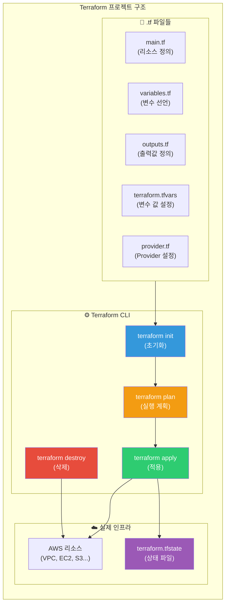
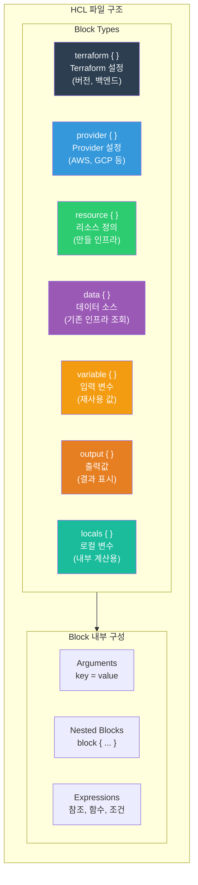
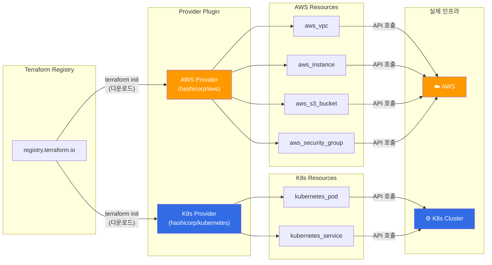
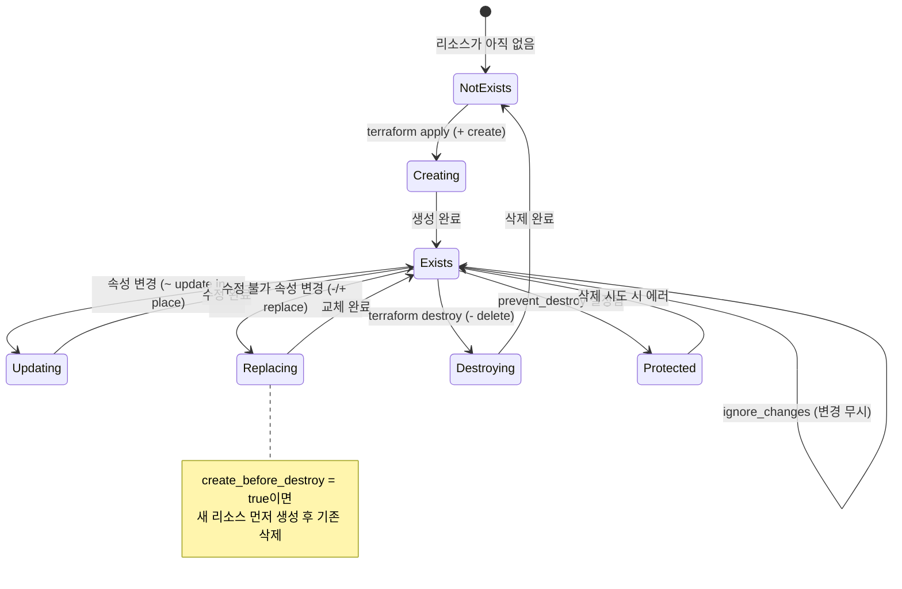
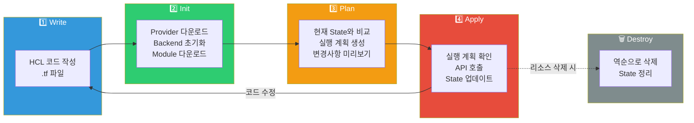
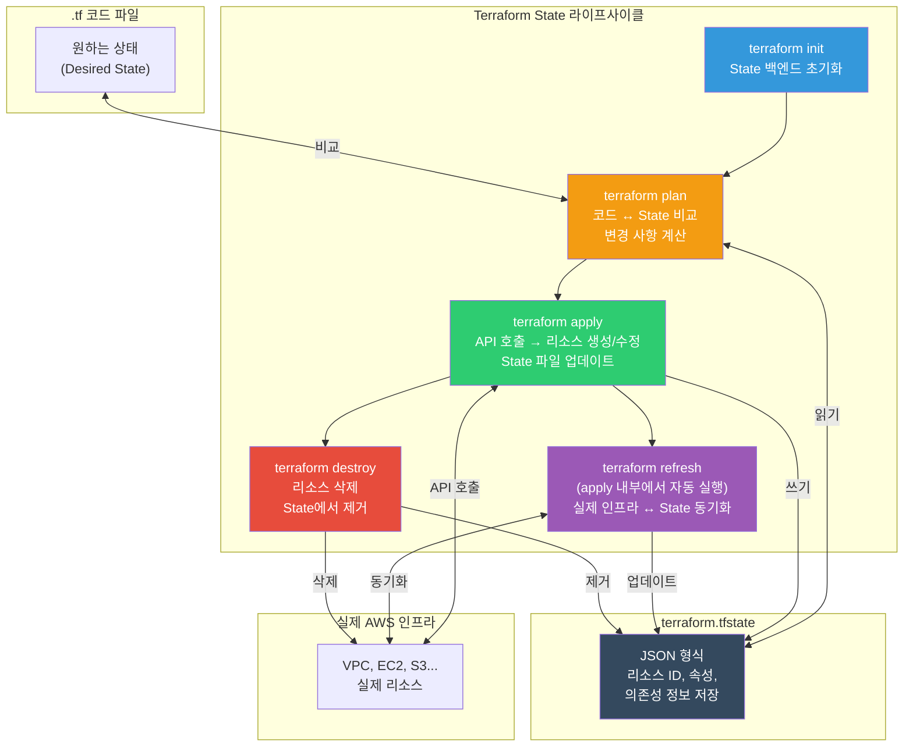

# Terraform 기초

> 인프라를 코드로 관리하는 IaC의 개념을 [이전 강의](./01-concept)에서 배웠죠? 이번에는 IaC 도구 중 가장 널리 쓰이는 **Terraform**을 직접 다뤄볼게요. HCL 문법부터 Provider, Resource, Variable, Output까지 — 그리고 `terraform init`부터 `destroy`까지 전체 워크플로우를 실습해볼 거예요.

---

## 🎯 왜 Terraform을/를 알아야 하나요?

### 일상 비유: 건축 설계 사무소

집을 지을 때를 생각해보세요. 건축가가 **설계 도면**을 그리면, 시공사가 도면대로 집을 짓죠. 도면 없이 "대충 이렇게 지어주세요"라고 하면 어떻게 될까요? 매번 다른 집이 나올 거예요.

Terraform은 바로 이 **건축 설계 도면 + 자동 시공 시스템**이에요.

- **HCL 파일** = 건축 설계 도면 (어떤 인프라를 만들지 선언)
- **terraform plan** = 설계 검토 회의 (이대로 지으면 어떻게 되는지 미리 확인)
- **terraform apply** = 실제 시공 (도면대로 인프라를 만듦)
- **terraform destroy** = 철거 (필요 없어지면 깔끔하게 제거)

### 실무에서 Terraform이 필요한 순간

```
실무에서 Terraform이 필요한 순간:
• VPC + Subnet + EC2를 코드로 만들고 싶어요           → main.tf 작성
• 개발/스테이징/운영 환경을 동일하게 만들어야 해요      → 변수만 바꿔서 재사용
• "누가 이 Security Group 규칙을 바꿨어요?"           → Git 히스토리로 추적
• 인프라 변경 전에 영향 범위를 확인하고 싶어요          → terraform plan
• 100개의 리소스를 한 번에 정리해야 해요               → terraform destroy
• AWS 콘솔에서 수동으로 만든 리소스를 코드로 관리하고 싶어요 → terraform import
• CI/CD 파이프라인에서 인프라를 자동 배포하고 싶어요     → terraform apply -auto-approve
```

[IAM](../05-cloud-aws/01-iam)과 [VPC](../05-cloud-aws/02-vpc)를 콘솔에서 만들어봤다면, 이번에는 같은 것을 **코드로** 만들어볼 거예요.

---

## 🧠 핵심 개념 잡기

Terraform을 이해하려면 5가지 핵심 개념을 먼저 잡아야 해요.

### 비유: 건축 프로젝트

| 건축 세계 | Terraform |
|-----------|-----------|
| 설계 도면 언어 (CAD) | **HCL** (HashiCorp Configuration Language) |
| 건축 자재 공급업체 (포스코, 한샘 등) | **Provider** (AWS, GCP, Azure 등) |
| 건물, 도로, 배관 등 실제 구조물 | **Resource** (EC2, VPC, S3 등) |
| 이미 있는 건물 정보 조회 (등기부등본) | **Data Source** (기존 리소스 참조) |
| 설계 변수 (층수, 면적, 마감재) | **Variable** (재사용 가능한 입력값) |
| 완공 보고서 (주소, 면적 등) | **Output** (결과값 출력) |
| 공사 진행 대장 | **State** (현재 인프라 상태 기록) |

### 전체 구조 한눈에 보기



---

## 🔍 하나씩 자세히 알아보기

### 1. HCL (HashiCorp Configuration Language) 문법 기초

HCL은 Terraform 전용 설계 도면 언어예요. JSON처럼 데이터를 표현하지만, **사람이 읽고 쓰기 훨씬 편하게** 만들어졌어요.

#### Block 구조

HCL의 기본 단위는 **Block(블록)** 이에요. 블록은 `type "label" { ... }` 형태를 가져요.

```hcl
# Block 기본 구조
# block_type "label1" "label2" {
#   argument = value
# }

# 예시: AWS EC2 인스턴스 리소스 블록
resource "aws_instance" "web_server" {
  ami           = "ami-0c6b1d09930fac512"
  instance_type = "t3.micro"

  tags = {
    Name = "web-server"
  }
}
```

각 부분의 의미를 살펴볼게요.

| 부분 | 설명 | 예시 |
|------|------|------|
| `resource` | Block Type (블록 종류) | resource, variable, output, data 등 |
| `"aws_instance"` | Label 1 (리소스 타입) | AWS EC2 인스턴스 |
| `"web_server"` | Label 2 (리소스 이름) | 내가 붙인 이름 (Terraform 내부 참조용) |
| `ami = "..."` | Argument (인수) | 키 = 값 형태 |

#### 데이터 타입

```hcl
# 문자열 (String)
name = "my-server"

# 숫자 (Number)
count = 3

# 불리언 (Boolean)
enable_monitoring = true

# 리스트 (List/Tuple)
availability_zones = ["ap-northeast-2a", "ap-northeast-2c"]

# 맵 (Map/Object)
tags = {
  Environment = "production"
  Team        = "devops"
}
```

#### String Interpolation (문자열 보간)

변수나 표현식을 문자열 안에 넣을 수 있어요.

```hcl
# 변수 참조
name = "web-${var.environment}"
# var.environment가 "prod"이면 → "web-prod"

# 리소스 속성 참조
subnet_id = aws_subnet.public.id
# aws_subnet 리소스 중 "public"이라는 이름의 id 속성

# 조건식 (삼항 연산자)
instance_type = var.environment == "prod" ? "t3.large" : "t3.micro"
```

#### 주요 내장 함수 (Built-in Functions)

Terraform은 100개 이상의 내장 함수를 제공해요. 자주 쓰는 것들을 볼게요.

```hcl
# 문자열 함수
upper("hello")                    # → "HELLO"
lower("HELLO")                    # → "hello"
format("Hello, %s!", "World")     # → "Hello, World!"
join(", ", ["a", "b", "c"])       # → "a, b, c"
split(",", "a,b,c")              # → ["a", "b", "c"]

# 숫자 함수
min(5, 12, 3)                     # → 3
max(5, 12, 3)                     # → 12
ceil(4.3)                         # → 5

# 컬렉션 함수
length(["a", "b", "c"])           # → 3
contains(["a", "b"], "a")         # → true
merge({a=1}, {b=2})               # → {a=1, b=2}
lookup({a=1, b=2}, "a", 0)       # → 1

# 파일시스템 함수
file("${path.module}/userdata.sh")          # 파일 내용을 문자열로 읽기
filebase64("${path.module}/script.sh")      # Base64 인코딩하여 읽기
templatefile("${path.module}/config.tpl", { # 템플릿 파일 렌더링
  port = 8080
  host = "0.0.0.0"
})

# CIDR 함수 (네트워크)
cidrsubnet("10.0.0.0/16", 8, 1)   # → "10.0.1.0/24"
cidrsubnet("10.0.0.0/16", 8, 2)   # → "10.0.2.0/24"
```

> `terraform console` 명령어로 함수를 직접 테스트해볼 수 있어요. 나중에 실습에서 해볼 거예요.

#### HCL 구조 다이어그램



---

### 2. Provider 설정과 동작 방식

#### Provider가 뭐예요?

Provider는 **건축 자재 공급업체**와 같아요. 집을 지으려면 철근은 포스코에서, 가구는 한샘에서, 전기는 한전에서 가져오죠? Terraform도 마찬가지예요.

- **AWS Provider** → EC2, VPC, S3 등 AWS 리소스를 관리
- **Google Provider** → GCE, GKE, Cloud Storage 등 GCP 리소스를 관리
- **Azure Provider** → VM, VNet, Blob Storage 등 Azure 리소스를 관리
- **Kubernetes Provider** → Pod, Service, Deployment 등 K8s 리소스를 관리

#### Provider 설정하기

```hcl
# terraform 블록에서 required_providers 선언
terraform {
  required_version = ">= 1.0"

  required_providers {
    aws = {
      source  = "hashicorp/aws"
      version = "~> 5.0"    # 5.x 버전 사용 (5.0 이상 6.0 미만)
    }
  }
}

# provider 블록에서 상세 설정
provider "aws" {
  region = "ap-northeast-2"   # 서울 리전

  default_tags {
    tags = {
      ManagedBy   = "Terraform"
      Environment = "dev"
    }
  }
}
```

#### 버전 제약 조건 (Version Constraints)

| 표현식 | 의미 | 예시 |
|--------|------|------|
| `= 5.0.0` | 정확히 이 버전만 | 5.0.0만 사용 |
| `>= 5.0` | 이 버전 이상 | 5.0, 5.1, 6.0 모두 OK |
| `~> 5.0` | 5.x 범위 (마이너 버전만 업) | 5.0 ~ 5.99 (6.0 미만) |
| `~> 5.31.0` | 5.31.x 범위 (패치만 업) | 5.31.0 ~ 5.31.99 |
| `>= 5.0, < 6.0` | 범위 지정 | ~> 5.0과 동일 |

> 실무에서는 `~> 5.0` 형태를 가장 많이 써요. 메이저 버전 업그레이드는 Breaking Change가 있을 수 있기 때문이에요.

#### Provider Alias (다중 Provider)

같은 Provider를 여러 개 쓸 수도 있어요. 예를 들어 서울 리전과 버지니아 리전에 동시에 리소스를 만들 때요.

```hcl
# 기본 Provider (서울)
provider "aws" {
  region = "ap-northeast-2"
}

# 별칭(alias) Provider (버지니아 - CloudFront용)
provider "aws" {
  alias  = "virginia"
  region = "us-east-1"
}

# 버지니아에 ACM 인증서 생성 (CloudFront용)
resource "aws_acm_certificate" "cert" {
  provider          = aws.virginia     # alias로 지정
  domain_name       = "example.com"
  validation_method = "DNS"
}
```

#### Provider와 Resource 관계



`terraform init`을 실행하면 Terraform Registry에서 Provider 플러그인을 `.terraform/` 디렉토리에 다운로드해요. 이 플러그인이 실제 AWS API를 호출하는 역할을 하죠.

---

### 3. Resource 정의와 라이프사이클

#### Resource가 뭐예요?

Resource는 **실제로 만들어질 인프라 구성 요소**예요. 건축으로 치면 건물, 도로, 배관 같은 실제 구조물이에요.

```hcl
# resource "리소스_타입" "리소스_이름" { ... }
resource "aws_vpc" "main" {
  cidr_block           = "10.0.0.0/16"
  enable_dns_hostnames = true
  enable_dns_support   = true

  tags = {
    Name = "main-vpc"
  }
}

resource "aws_subnet" "public_a" {
  vpc_id                  = aws_vpc.main.id    # 위의 VPC를 참조
  cidr_block              = "10.0.1.0/24"
  availability_zone       = "ap-northeast-2a"
  map_public_ip_on_launch = true

  tags = {
    Name = "public-subnet-a"
  }
}
```

위 코드에서 `aws_vpc.main.id`처럼 다른 리소스의 속성을 **참조(reference)** 할 수 있어요. Terraform이 자동으로 의존성을 파악해서 VPC를 먼저 만들고, 그 다음에 Subnet을 만들어요.

#### Resource 라이프사이클

리소스에는 4가지 동작이 있어요.

| 동작 | 언제 | Plan 출력 기호 |
|------|------|----------------|
| **Create** (생성) | 새 리소스를 처음 만들 때 | `+` (초록색) |
| **Update** (수정) | 기존 리소스의 속성을 바꿀 때 | `~` (노란색) |
| **Destroy** (삭제) | 리소스를 제거할 때 | `-` (빨간색) |
| **Replace** (교체) | 수정 불가한 속성이 바뀔 때 (삭제 후 재생성) | `-/+` (빨간/초록) |

> **Replace는 왜 필요할까요?** 어떤 속성은 리소스를 삭제하고 다시 만들어야만 바꿀 수 있어요. 예를 들어 EC2의 `ami`를 바꾸면 기존 인스턴스를 종료하고 새로 만들어야 해요. 이걸 **"force replacement"** 라고 해요.

#### lifecycle 메타 인수

리소스의 라이프사이클 동작을 세밀하게 제어할 수 있어요.

```hcl
resource "aws_instance" "web" {
  ami           = "ami-0c6b1d09930fac512"
  instance_type = "t3.micro"

  lifecycle {
    # 1. create_before_destroy: 새 리소스를 먼저 만들고 기존 것을 삭제
    #    → 다운타임 최소화! (기본값은 삭제 후 생성)
    create_before_destroy = true

    # 2. prevent_destroy: 실수로 삭제 방지
    #    → terraform destroy 시 에러 발생 (중요 리소스 보호)
    prevent_destroy = true

    # 3. ignore_changes: 특정 속성 변경 무시
    #    → 외부에서 바꾼 값을 Terraform이 덮어쓰지 않음
    ignore_changes = [
      tags,           # 태그 변경 무시
      ami,            # AMI 변경 무시 (ASG에서 유용)
    ]
  }
}
```

각 옵션을 언제 쓰는지 볼게요.

| 옵션 | 사용 시나리오 | 비유 |
|------|-------------|------|
| `create_before_destroy` | 서비스 무중단이 필요할 때 | 새 아파트 완공 후 이사, 그 다음 구 건물 철거 |
| `prevent_destroy` | 실수로 삭제하면 안 되는 DB, VPC 등 | 문화재 보호 구역 — 함부로 철거 불가 |
| `ignore_changes` | 외부 시스템이 관리하는 속성 | "이 방의 인테리어는 세입자가 알아서 해요" |

#### Resource 라이프사이클 다이어그램



---

### 4. Data Source — 기존 인프라 참조

#### Data Source가 뭐예요?

Data Source는 **등기부등본 조회**와 같아요. 이미 존재하는 건물의 정보(주소, 면적, 소유자)를 조회하는 것처럼, 이미 만들어진 AWS 리소스의 정보를 가져와서 사용하는 거예요.

Resource가 "**만드는 것**"이라면, Data Source는 "**조회하는 것**"이에요.

```hcl
# data "데이터소스_타입" "이름" { ... }

# 1. 최신 Amazon Linux 2023 AMI 조회
data "aws_ami" "amazon_linux" {
  most_recent = true
  owners      = ["amazon"]

  filter {
    name   = "name"
    values = ["al2023-ami-*-x86_64"]
  }

  filter {
    name   = "state"
    values = ["available"]
  }
}

# 2. 현재 AWS 계정 정보 조회
data "aws_caller_identity" "current" {}

# 3. 현재 리전 정보 조회
data "aws_region" "current" {}

# 4. 기존 VPC 조회
data "aws_vpc" "existing" {
  filter {
    name   = "tag:Name"
    values = ["existing-vpc"]
  }
}
```

Data Source로 가져온 값은 `data.` 접두사로 참조해요.

```hcl
resource "aws_instance" "web" {
  ami           = data.aws_ami.amazon_linux.id    # 조회한 AMI ID 사용
  instance_type = "t3.micro"
  subnet_id     = data.aws_vpc.existing.id        # 기존 VPC 사용

  tags = {
    Name      = "web-server"
    AccountId = data.aws_caller_identity.current.account_id
    Region    = data.aws_region.current.name
  }
}
```

#### Resource vs Data Source 비교

| | Resource | Data Source |
|---|---------|------------|
| 키워드 | `resource` | `data` |
| 역할 | 리소스를 **생성/수정/삭제** | 기존 리소스를 **조회** |
| 참조 방식 | `aws_vpc.main.id` | `data.aws_vpc.existing.id` |
| state에 기록 | O (전체 속성) | O (조회 결과만) |
| 비유 | 새 건물을 짓는다 | 등기부등본을 조회한다 |

---

### 5. Variable과 Output

#### Variable (입력 변수)

Variable은 **설계 도면의 변수**예요. "이 건물의 층수는 몇 층으로 할까요?"처럼, 같은 설계도에 다른 값을 넣어서 재사용할 수 있게 해줘요.

##### 변수 선언 (variables.tf)

```hcl
# 기본 문자열 변수
variable "environment" {
  description = "배포 환경 (dev, staging, prod)"
  type        = string
  default     = "dev"
}

# 숫자 변수
variable "instance_count" {
  description = "EC2 인스턴스 개수"
  type        = number
  default     = 1
}

# 불리언 변수
variable "enable_monitoring" {
  description = "CloudWatch 모니터링 활성화 여부"
  type        = bool
  default     = false
}

# 리스트 변수
variable "availability_zones" {
  description = "사용할 가용 영역 목록"
  type        = list(string)
  default     = ["ap-northeast-2a", "ap-northeast-2c"]
}

# 맵 변수
variable "instance_types" {
  description = "환경별 인스턴스 타입"
  type        = map(string)
  default = {
    dev     = "t3.micro"
    staging = "t3.small"
    prod    = "t3.large"
  }
}

# Object 변수 (복합 타입)
variable "vpc_config" {
  description = "VPC 설정"
  type = object({
    cidr_block         = string
    enable_dns_support = bool
    public_subnets     = list(string)
  })
  default = {
    cidr_block         = "10.0.0.0/16"
    enable_dns_support = true
    public_subnets     = ["10.0.1.0/24", "10.0.2.0/24"]
  }
}

# 민감 변수 (출력에서 마스킹됨)
variable "db_password" {
  description = "RDS 데이터베이스 비밀번호"
  type        = string
  sensitive   = true   # plan/apply 출력에서 (sensitive value)로 표시
}

# 유효성 검사 (Validation)
variable "environment" {
  description = "배포 환경"
  type        = string

  validation {
    condition     = contains(["dev", "staging", "prod"], var.environment)
    error_message = "environment는 dev, staging, prod 중 하나여야 해요."
  }
}
```

##### 변수 값 전달 방법 (우선순위 순)

```bash
# 1. 명령줄 -var 플래그 (최우선순위)
terraform apply -var="environment=prod" -var="instance_count=3"

# 2. 명령줄 -var-file 플래그
terraform apply -var-file="prod.tfvars"

# 3. *.auto.tfvars 파일 (자동 로드)
# 파일명이 .auto.tfvars로 끝나면 자동 로드

# 4. terraform.tfvars 파일 (자동 로드)
# 프로젝트 루트에 있으면 자동 로드

# 5. 환경 변수 (TF_VAR_ 접두사)
export TF_VAR_environment="prod"
export TF_VAR_instance_count=3
export TF_VAR_db_password="super-secret-123"

# 6. default 값 (최저 우선순위)
# variable 블록의 default 값
```

##### terraform.tfvars 파일 예시

```hcl
# terraform.tfvars
environment    = "dev"
instance_count = 1

availability_zones = [
  "ap-northeast-2a",
  "ap-northeast-2c",
]

instance_types = {
  dev     = "t3.micro"
  staging = "t3.small"
  prod    = "t3.large"
}

vpc_config = {
  cidr_block         = "10.0.0.0/16"
  enable_dns_support = true
  public_subnets     = ["10.0.1.0/24", "10.0.2.0/24"]
}
```

##### 변수 사용하기

```hcl
# var.변수이름 으로 참조
resource "aws_instance" "web" {
  count = var.instance_count

  ami           = data.aws_ami.amazon_linux.id
  instance_type = var.instance_types[var.environment]
  # var.environment가 "dev"이면 → "t3.micro"

  tags = {
    Name        = "web-${var.environment}-${count.index + 1}"
    Environment = var.environment
  }
}
```

#### Output (출력값)

Output은 **완공 보고서**와 같아요. 건물이 완공되면 "주소는 여기, 전화번호는 여기"라고 알려주듯, Terraform이 만든 리소스의 주요 정보를 출력해줘요.

```hcl
# outputs.tf
output "vpc_id" {
  description = "생성된 VPC의 ID"
  value       = aws_vpc.main.id
}

output "public_subnet_ids" {
  description = "퍼블릭 서브넷 ID 목록"
  value       = [aws_subnet.public_a.id, aws_subnet.public_c.id]
}

output "instance_public_ip" {
  description = "EC2 인스턴스의 퍼블릭 IP"
  value       = aws_instance.web.public_ip
}

# 민감 정보는 sensitive = true
output "db_endpoint" {
  description = "RDS 엔드포인트"
  value       = aws_db_instance.main.endpoint
  sensitive   = true
}
```

`terraform apply` 후에 Output이 출력되고, `terraform output` 명령어로 언제든 다시 확인할 수 있어요.

```bash
$ terraform output
vpc_id             = "vpc-0abc123def456"
public_subnet_ids  = ["subnet-0aaa", "subnet-0bbb"]
instance_public_ip = "52.78.100.200"
db_endpoint        = <sensitive>

# 특정 output만 보기
$ terraform output vpc_id
"vpc-0abc123def456"

# 민감 정보 보기
$ terraform output -raw db_endpoint
mydb.cdef123.ap-northeast-2.rds.amazonaws.com:3306
```

---

### 6. Terraform CLI 워크플로우

Terraform의 핵심 워크플로우는 **Write → Init → Plan → Apply** 4단계예요.

#### Terraform 워크플로우 다이어그램



#### 6-1. terraform init (초기화)

프로젝트를 시작하면 **가장 먼저** 실행하는 명령어예요. Provider 플러그인을 다운로드하고, Backend(상태 저장소)를 초기화해요.

```bash
$ terraform init

Initializing the backend...

Initializing provider plugins...
- Finding hashicorp/aws versions matching "~> 5.0"...
- Installing hashicorp/aws v5.82.2...
- Installed hashicorp/aws v5.82.2 (signed by HashiCorp)

Terraform has created a lock file .terraform.lock.hcl to record the provider
selections it made above. Include this file in your version control repository
so that Terraform can guarantee to make the same selections by default when
you run "terraform init" in the future.

Terraform has been successfully initialized!

You may now begin working with Terraform. Try running "terraform plan" to see
any changes that are required for your infrastructure.

If you ever set or change modules or backend configuration for Terraform,
rerun this command to reinitialize your working directory. If you forget, other
commands will detect it and remind you to do so if necessary.
```

`init`이 하는 일을 정리하면 이래요.

| 동작 | 설명 |
|------|------|
| Provider 다운로드 | `.terraform/providers/`에 플러그인 저장 |
| Lock 파일 생성 | `.terraform.lock.hcl` — 정확한 버전 고정 |
| Backend 초기화 | 상태 파일 저장소 설정 (local 또는 S3 등) |
| Module 다운로드 | 사용하는 모듈이 있으면 `.terraform/modules/`에 저장 |

```bash
# init 후 디렉토리 구조
my-terraform-project/
├── .terraform/                   # init이 만든 디렉토리 (Git 제외!)
│   ├── providers/
│   │   └── registry.terraform.io/
│   │       └── hashicorp/
│   │           └── aws/
│   │               └── 5.82.2/
│   │                   └── ... (플러그인 바이너리)
│   └── modules/
├── .terraform.lock.hcl           # 버전 잠금 파일 (Git에 포함!)
├── main.tf
├── variables.tf
├── outputs.tf
└── terraform.tfvars
```

> `.terraform/` 디렉토리는 `.gitignore`에 반드시 추가하세요. Provider 바이너리가 수백 MB일 수 있어요.

#### 6-2. terraform plan (실행 계획)

코드와 현재 State를 비교해서 **무엇이 바뀔지 미리 보여주는** 명령어예요. 실제로 아무것도 바꾸지 않아요 — 시뮬레이션이에요.

```bash
$ terraform plan

Terraform used the selected providers to generate the following execution plan.
Resource actions are indicated with the following symbols:
  + create

Terraform will perform the following actions:

  # aws_vpc.main will be created
  + resource "aws_vpc" "main" {
      + arn                                  = (known after apply)
      + cidr_block                           = "10.0.0.0/16"
      + default_network_acl_id               = (known after apply)
      + default_route_table_id               = (known after apply)
      + default_security_group_id            = (known after apply)
      + dhcp_options_id                       = (known after apply)
      + enable_dns_hostnames                 = true
      + enable_dns_support                   = true
      + id                                   = (known after apply)
      + instance_tenancy                     = "default"
      + ipv6_association_id                  = (known after apply)
      + ipv6_cidr_block                      = (known after apply)
      + main_route_table_id                  = (known after apply)
      + owner_id                             = (known after apply)
      + tags                                 = {
          + "Name" = "main-vpc"
        }
      + tags_all                             = {
          + "Environment" = "dev"
          + "ManagedBy"   = "Terraform"
          + "Name"        = "main-vpc"
        }
    }

  # aws_subnet.public_a will be created
  + resource "aws_subnet" "public_a" {
      + arn                                            = (known after apply)
      + assign_ipv6_address_on_creation                = false
      + availability_zone                              = "ap-northeast-2a"
      + cidr_block                                     = "10.0.1.0/24"
      + id                                             = (known after apply)
      + map_public_ip_on_launch                        = true
      + owner_id                                       = (known after apply)
      + tags                                           = {
          + "Name" = "public-subnet-a"
        }
      + vpc_id                                         = (known after apply)
    }

  # aws_instance.web will be created
  + resource "aws_instance" "web" {
      + ami                                  = "ami-0c6b1d09930fac512"
      + arn                                  = (known after apply)
      + associate_public_ip_address          = (known after apply)
      + availability_zone                    = (known after apply)
      + cpu_core_count                       = (known after apply)
      + get_password_data                    = false
      + host_id                              = (known after apply)
      + id                                   = (known after apply)
      + instance_lifecycle                   = (known after apply)
      + instance_state                       = (known after apply)
      + instance_type                        = "t3.micro"
      + monitoring                           = false
      + primary_network_interface_id         = (known after apply)
      + private_dns                          = (known after apply)
      + private_ip                           = (known after apply)
      + public_dns                           = (known after apply)
      + public_ip                            = (known after apply)
      + secondary_private_ips                = (known after apply)
      + subnet_id                            = (known after apply)
      + tags                                 = {
          + "Name" = "web-dev-1"
        }
      + vpc_security_group_ids               = (known after apply)
    }

Plan: 3 to add, 0 to change, 0 to destroy.

Changes to Outputs:
  + instance_public_ip = (known after apply)
  + public_subnet_ids  = [
      + (known after apply),
    ]
  + vpc_id             = (known after apply)
```

Plan 출력의 기호를 다시 정리하면 이래요.

| 기호 | 색상 | 의미 |
|------|------|------|
| `+` | 초록 | 새로 생성 (create) |
| `~` | 노랑 | 수정 (update in-place) |
| `-` | 빨강 | 삭제 (destroy) |
| `-/+` | 빨강/초록 | 삭제 후 재생성 (replace) |
| `<=` | 파랑 | Data Source 읽기 (read) |

```bash
# 실행 계획을 파일로 저장 (CI/CD에서 유용)
$ terraform plan -out=tfplan

# 저장된 계획으로 apply (추가 확인 없이 실행)
$ terraform apply tfplan
```

#### 6-3. terraform apply (적용)

Plan의 내용을 **실제로 실행**하는 명령어예요. 기본적으로 실행 전에 확인을 요청해요.

```bash
$ terraform apply

# ... (plan 출력과 동일) ...

Plan: 3 to add, 0 to change, 0 to destroy.

Do you want to perform these actions?
  Terraform will perform the actions described above.
  Only 'yes' will be accepted to approve.

  Enter a value: yes

aws_vpc.main: Creating...
aws_vpc.main: Creation complete after 3s [id=vpc-0abc123def456]
aws_subnet.public_a: Creating...
aws_subnet.public_a: Creation complete after 1s [id=subnet-0aaa111bbb222]
aws_instance.web: Creating...
aws_instance.web: Still creating... [10s elapsed]
aws_instance.web: Still creating... [20s elapsed]
aws_instance.web: Creation complete after 25s [id=i-0123456789abcdef0]

Apply complete! Resources: 3 added, 0 changed, 0 destroyed.

Outputs:

instance_public_ip = "52.78.100.200"
public_subnet_ids  = [
  "subnet-0aaa111bbb222",
]
vpc_id             = "vpc-0abc123def456"
```

```bash
# CI/CD에서 사용: 확인 프롬프트 건너뛰기
$ terraform apply -auto-approve

# 특정 리소스만 적용
$ terraform apply -target=aws_instance.web

# 변수 전달하면서 적용
$ terraform apply -var="environment=prod"
```

> `-auto-approve`는 CI/CD 파이프라인에서만 쓰세요. 수동 실행 시에는 반드시 plan 내용을 확인하고 `yes`를 입력하는 게 안전해요.

#### 6-4. terraform destroy (삭제)

모든 리소스를 **역순으로 삭제**하는 명령어예요. 의존성 순서를 자동으로 파악해서 안전하게 삭제해요 (EC2 → Subnet → VPC 순).

```bash
$ terraform destroy

# ... (삭제될 리소스 목록 표시) ...

Plan: 0 to add, 0 to change, 3 to destroy.

Do you really want to destroy all resources?
  Terraform will destroy all your managed infrastructure, as shown above.
  There is no undo. Only 'yes' will be accepted to confirm.

  Enter a value: yes

aws_instance.web: Destroying... [id=i-0123456789abcdef0]
aws_instance.web: Still destroying... [10s elapsed]
aws_instance.web: Destruction complete after 32s
aws_subnet.public_a: Destroying... [id=subnet-0aaa111bbb222]
aws_subnet.public_a: Destruction complete after 1s
aws_vpc.main: Destroying... [id=vpc-0abc123def456]
aws_vpc.main: Destruction complete after 1s

Destroy complete! Resources: 3 destroyed.
```

#### 6-5. 기타 유용한 명령어

```bash
# 코드 포맷팅 (자동 들여쓰기/정렬)
$ terraform fmt
main.tf
variables.tf

# 코드 문법 검증
$ terraform validate
Success! The configuration is valid.

# 대화형 콘솔 (함수/표현식 테스트)
$ terraform console
> upper("hello")
"HELLO"
> cidrsubnet("10.0.0.0/16", 8, 1)
"10.0.1.0/24"
> var.environment
"dev"
> exit

# 현재 state 확인
$ terraform show

# state에 있는 리소스 목록
$ terraform state list
aws_vpc.main
aws_subnet.public_a
aws_instance.web

# 특정 리소스의 state 상세 정보
$ terraform state show aws_instance.web

# 리소스 강제 교체 (재생성)
$ terraform apply -replace=aws_instance.web
```

#### State 라이프사이클 다이어그램



> **State 파일은 매우 중요해요!** 이 파일이 없으면 Terraform은 자신이 만든 리소스를 추적할 수 없어요. 실무에서는 S3 + DynamoDB를 사용해서 원격(Remote)으로 State를 관리해요. 이건 [다음 강의](./03-terraform-advanced)에서 다룰게요.

---

## 💻 직접 해보기

VPC + Subnet + Security Group + EC2 인스턴스를 Terraform으로 만들어볼게요.

### 사전 준비

```bash
# 1. Terraform 설치 확인
$ terraform version
Terraform v1.9.8
on linux_amd64

# 2. AWS CLI 설정 확인 (Access Key가 설정되어 있어야 해요)
$ aws sts get-caller-identity
{
    "UserId": "AIDAEXAMPLE123456",
    "Account": "123456789012",
    "Arn": "arn:aws:iam::123456789012:user/devops-user"
}

# 3. 프로젝트 디렉토리 생성
$ mkdir -p ~/terraform-lab && cd ~/terraform-lab
```

### Step 1: 파일 구조 만들기

```bash
~/terraform-lab/
├── main.tf              # 메인 리소스 정의
├── variables.tf         # 변수 선언
├── outputs.tf           # 출력값 정의
├── terraform.tfvars     # 변수 값 설정
└── .gitignore           # Git 제외 파일
```

### Step 2: .gitignore 작성

```bash
# .gitignore
.terraform/
*.tfstate
*.tfstate.backup
*.tfvars      # 민감 정보가 있을 수 있으므로 (선택)
.terraform.lock.hcl
```

### Step 3: variables.tf 작성

```hcl
# variables.tf

variable "aws_region" {
  description = "AWS 리전"
  type        = string
  default     = "ap-northeast-2"
}

variable "project_name" {
  description = "프로젝트 이름 (리소스 네이밍에 사용)"
  type        = string
  default     = "terraform-lab"
}

variable "environment" {
  description = "배포 환경"
  type        = string
  default     = "dev"

  validation {
    condition     = contains(["dev", "staging", "prod"], var.environment)
    error_message = "environment는 dev, staging, prod 중 하나여야 해요."
  }
}

variable "vpc_cidr" {
  description = "VPC CIDR 블록"
  type        = string
  default     = "10.0.0.0/16"
}

variable "public_subnet_cidrs" {
  description = "퍼블릭 서브넷 CIDR 목록"
  type        = list(string)
  default     = ["10.0.1.0/24", "10.0.2.0/24"]
}

variable "instance_type" {
  description = "EC2 인스턴스 타입"
  type        = string
  default     = "t3.micro"
}

variable "allowed_ssh_cidr" {
  description = "SSH 접근을 허용할 CIDR (본인 IP/32 권장)"
  type        = string
  default     = "0.0.0.0/0"  # 실습용, 실무에서는 본인 IP만!
}
```

### Step 4: main.tf 작성

```hcl
# main.tf

# ============================================================
# Terraform & Provider 설정
# ============================================================
terraform {
  required_version = ">= 1.0"

  required_providers {
    aws = {
      source  = "hashicorp/aws"
      version = "~> 5.0"
    }
  }
}

provider "aws" {
  region = var.aws_region

  default_tags {
    tags = {
      Project     = var.project_name
      Environment = var.environment
      ManagedBy   = "Terraform"
    }
  }
}

# ============================================================
# Data Sources — 기존 정보 조회
# ============================================================

# 최신 Amazon Linux 2023 AMI
data "aws_ami" "amazon_linux" {
  most_recent = true
  owners      = ["amazon"]

  filter {
    name   = "name"
    values = ["al2023-ami-*-x86_64"]
  }

  filter {
    name   = "state"
    values = ["available"]
  }
}

# 사용 가능한 AZ 목록
data "aws_availability_zones" "available" {
  state = "available"
}

# ============================================================
# VPC
# ============================================================
resource "aws_vpc" "main" {
  cidr_block           = var.vpc_cidr
  enable_dns_hostnames = true
  enable_dns_support   = true

  tags = {
    Name = "${var.project_name}-vpc"
  }
}

# ============================================================
# Internet Gateway
# ============================================================
resource "aws_internet_gateway" "main" {
  vpc_id = aws_vpc.main.id

  tags = {
    Name = "${var.project_name}-igw"
  }
}

# ============================================================
# Public Subnets
# ============================================================
resource "aws_subnet" "public" {
  count = length(var.public_subnet_cidrs)

  vpc_id                  = aws_vpc.main.id
  cidr_block              = var.public_subnet_cidrs[count.index]
  availability_zone       = data.aws_availability_zones.available.names[count.index]
  map_public_ip_on_launch = true

  tags = {
    Name = "${var.project_name}-public-${count.index + 1}"
  }
}

# ============================================================
# Route Table (Public)
# ============================================================
resource "aws_route_table" "public" {
  vpc_id = aws_vpc.main.id

  route {
    cidr_block = "0.0.0.0/0"
    gateway_id = aws_internet_gateway.main.id
  }

  tags = {
    Name = "${var.project_name}-public-rt"
  }
}

# Route Table을 Subnet에 연결
resource "aws_route_table_association" "public" {
  count = length(var.public_subnet_cidrs)

  subnet_id      = aws_subnet.public[count.index].id
  route_table_id = aws_route_table.public.id
}

# ============================================================
# Security Group
# ============================================================
resource "aws_security_group" "web" {
  name        = "${var.project_name}-web-sg"
  description = "Security group for web server"
  vpc_id      = aws_vpc.main.id

  # SSH 허용
  ingress {
    description = "SSH"
    from_port   = 22
    to_port     = 22
    protocol    = "tcp"
    cidr_blocks = [var.allowed_ssh_cidr]
  }

  # HTTP 허용
  ingress {
    description = "HTTP"
    from_port   = 80
    to_port     = 80
    protocol    = "tcp"
    cidr_blocks = ["0.0.0.0/0"]
  }

  # 아웃바운드 전체 허용
  egress {
    from_port   = 0
    to_port     = 0
    protocol    = "-1"
    cidr_blocks = ["0.0.0.0/0"]
  }

  tags = {
    Name = "${var.project_name}-web-sg"
  }
}

# ============================================================
# EC2 Instance
# ============================================================
resource "aws_instance" "web" {
  ami                    = data.aws_ami.amazon_linux.id
  instance_type          = var.instance_type
  subnet_id              = aws_subnet.public[0].id
  vpc_security_group_ids = [aws_security_group.web.id]

  user_data = <<-EOF
    #!/bin/bash
    dnf update -y
    dnf install -y httpd
    systemctl start httpd
    systemctl enable httpd
    echo "<h1>Hello from Terraform! 🎉</h1>" > /var/www/html/index.html
    echo "<p>Instance ID: $(curl -s http://169.254.169.254/latest/meta-data/instance-id)</p>" >> /var/www/html/index.html
    echo "<p>AZ: $(curl -s http://169.254.169.254/latest/meta-data/placement/availability-zone)</p>" >> /var/www/html/index.html
  EOF

  tags = {
    Name = "${var.project_name}-web"
  }
}
```

### Step 5: outputs.tf 작성

```hcl
# outputs.tf

output "vpc_id" {
  description = "생성된 VPC ID"
  value       = aws_vpc.main.id
}

output "vpc_cidr" {
  description = "VPC CIDR 블록"
  value       = aws_vpc.main.cidr_block
}

output "public_subnet_ids" {
  description = "퍼블릭 서브넷 ID 목록"
  value       = aws_subnet.public[*].id
}

output "security_group_id" {
  description = "웹 서버 Security Group ID"
  value       = aws_security_group.web.id
}

output "instance_id" {
  description = "EC2 인스턴스 ID"
  value       = aws_instance.web.id
}

output "instance_public_ip" {
  description = "EC2 퍼블릭 IP (이 IP로 웹 접속 가능)"
  value       = aws_instance.web.public_ip
}

output "instance_public_dns" {
  description = "EC2 퍼블릭 DNS"
  value       = aws_instance.web.public_dns
}

output "ami_id" {
  description = "사용된 AMI ID"
  value       = data.aws_ami.amazon_linux.id
}

output "web_url" {
  description = "웹 서버 접속 URL"
  value       = "http://${aws_instance.web.public_ip}"
}
```

### Step 6: terraform.tfvars 작성

```hcl
# terraform.tfvars

aws_region   = "ap-northeast-2"
project_name = "terraform-lab"
environment  = "dev"

vpc_cidr = "10.0.0.0/16"
public_subnet_cidrs = [
  "10.0.1.0/24",
  "10.0.2.0/24",
]

instance_type    = "t3.micro"
allowed_ssh_cidr = "0.0.0.0/0"   # 실습용! 실무에서는 본인 IP/32로 변경
```

### Step 7: 실행하기

```bash
# 1단계: 초기화
$ terraform init

Initializing the backend...
Initializing provider plugins...
- Finding hashicorp/aws versions matching "~> 5.0"...
- Installing hashicorp/aws v5.82.2...
- Installed hashicorp/aws v5.82.2 (signed by HashiCorp)

Terraform has been successfully initialized!
```

```bash
# 2단계: 코드 포맷팅 & 검증
$ terraform fmt
$ terraform validate
Success! The configuration is valid.
```

```bash
# 3단계: 실행 계획 확인
$ terraform plan

data.aws_availability_zones.available: Reading...
data.aws_ami.amazon_linux: Reading...
data.aws_availability_zones.available: Read complete after 0s [id=ap-northeast-2]
data.aws_ami.amazon_linux: Read complete after 1s [id=ami-0c6b1d09930fac512]

Terraform used the selected providers to generate the following execution plan.
Resource actions are indicated with the following symbols:
  + create

Terraform will perform the following actions:

  # aws_instance.web will be created
  + resource "aws_instance" "web" {
      + ami                          = "ami-0c6b1d09930fac512"
      + instance_type                = "t3.micro"
      + public_ip                    = (known after apply)
      + subnet_id                    = (known after apply)
      + tags                         = {
          + "Name" = "terraform-lab-web"
        }
      + vpc_security_group_ids       = (known after apply)
      ...
    }

  # aws_internet_gateway.main will be created
  + resource "aws_internet_gateway" "main" {
      + id     = (known after apply)
      + vpc_id = (known after apply)
      + tags   = {
          + "Name" = "terraform-lab-igw"
        }
    }

  # aws_route_table.public will be created
  + resource "aws_route_table" "public" { ... }

  # aws_route_table_association.public[0] will be created
  + resource "aws_route_table_association" "public" { ... }

  # aws_route_table_association.public[1] will be created
  + resource "aws_route_table_association" "public" { ... }

  # aws_security_group.web will be created
  + resource "aws_security_group" "web" {
      + name   = "terraform-lab-web-sg"
      + vpc_id = (known after apply)
      ...
    }

  # aws_subnet.public[0] will be created
  + resource "aws_subnet" "public" {
      + availability_zone       = "ap-northeast-2a"
      + cidr_block              = "10.0.1.0/24"
      + map_public_ip_on_launch = true
      + vpc_id                  = (known after apply)
      ...
    }

  # aws_subnet.public[1] will be created
  + resource "aws_subnet" "public" {
      + availability_zone       = "ap-northeast-2c"
      + cidr_block              = "10.0.2.0/24"
      + map_public_ip_on_launch = true
      + vpc_id                  = (known after apply)
      ...
    }

  # aws_vpc.main will be created
  + resource "aws_vpc" "main" {
      + cidr_block           = "10.0.0.0/16"
      + enable_dns_hostnames = true
      + enable_dns_support   = true
      + tags                 = {
          + "Name" = "terraform-lab-vpc"
        }
      ...
    }

Plan: 9 to add, 0 to change, 0 to destroy.

Changes to Outputs:
  + ami_id              = "ami-0c6b1d09930fac512"
  + instance_id         = (known after apply)
  + instance_public_dns = (known after apply)
  + instance_public_ip  = (known after apply)
  + public_subnet_ids   = [
      + (known after apply),
      + (known after apply),
    ]
  + security_group_id   = (known after apply)
  + vpc_cidr            = "10.0.0.0/16"
  + vpc_id              = (known after apply)
  + web_url             = (known after apply)
```

```bash
# 4단계: 적용
$ terraform apply

# ... (위의 plan 출력) ...

Do you want to perform these actions?
  Only 'yes' will be accepted to approve.

  Enter a value: yes

aws_vpc.main: Creating...
aws_vpc.main: Creation complete after 3s [id=vpc-0abc123def456789]
aws_internet_gateway.main: Creating...
aws_subnet.public[0]: Creating...
aws_subnet.public[1]: Creating...
aws_internet_gateway.main: Creation complete after 1s [id=igw-0def456789abc123]
aws_route_table.public: Creating...
aws_subnet.public[0]: Creation complete after 1s [id=subnet-0aaa111bbb222ccc]
aws_subnet.public[1]: Creation complete after 1s [id=subnet-0ddd444eee555fff]
aws_route_table.public: Creation complete after 1s [id=rtb-0ggg777hhh888iii]
aws_route_table_association.public[0]: Creating...
aws_route_table_association.public[1]: Creating...
aws_security_group.web: Creating...
aws_route_table_association.public[0]: Creation complete after 0s
aws_route_table_association.public[1]: Creation complete after 0s
aws_security_group.web: Creation complete after 2s [id=sg-0jjj999kkk000lll]
aws_instance.web: Creating...
aws_instance.web: Still creating... [10s elapsed]
aws_instance.web: Still creating... [20s elapsed]
aws_instance.web: Creation complete after 25s [id=i-0123456789abcdef0]

Apply complete! Resources: 9 added, 0 changed, 0 destroyed.

Outputs:

ami_id              = "ami-0c6b1d09930fac512"
instance_id         = "i-0123456789abcdef0"
instance_public_dns = "ec2-52-78-100-200.ap-northeast-2.compute.amazonaws.com"
instance_public_ip  = "52.78.100.200"
public_subnet_ids   = [
  "subnet-0aaa111bbb222ccc",
  "subnet-0ddd444eee555fff",
]
security_group_id   = "sg-0jjj999kkk000lll"
vpc_cidr            = "10.0.0.0/16"
vpc_id              = "vpc-0abc123def456789"
web_url             = "http://52.78.100.200"
```

```bash
# 5단계: 결과 확인
$ curl http://52.78.100.200
<h1>Hello from Terraform! 🎉</h1>
<p>Instance ID: i-0123456789abcdef0</p>
<p>AZ: ap-northeast-2a</p>

# Output 확인
$ terraform output web_url
"http://52.78.100.200"

# State 확인
$ terraform state list
data.aws_ami.amazon_linux
data.aws_availability_zones.available
aws_instance.web
aws_internet_gateway.main
aws_route_table.public
aws_route_table_association.public[0]
aws_route_table_association.public[1]
aws_security_group.web
aws_subnet.public[0]
aws_subnet.public[1]
aws_vpc.main
```

```bash
# 6단계: 수정 실습 — instance_type 변경
# terraform.tfvars에서 instance_type = "t3.small" 로 변경 후:
$ terraform plan

  # aws_instance.web will be updated in-place
  ~ resource "aws_instance" "web" {
        id            = "i-0123456789abcdef0"
      ~ instance_type = "t3.micro" -> "t3.small"
        tags          = {
            "Name" = "terraform-lab-web"
        }
        # (12 unchanged attributes hidden)
    }

Plan: 0 to add, 1 to change, 0 to destroy.
```

```bash
# 7단계: 정리 (실습 비용 절약!)
$ terraform destroy

Plan: 0 to add, 0 to change, 9 to destroy.

Do you really want to destroy all resources?
  Only 'yes' will be accepted to confirm.

  Enter a value: yes

aws_route_table_association.public[1]: Destroying...
aws_route_table_association.public[0]: Destroying...
aws_instance.web: Destroying...
aws_route_table_association.public[1]: Destruction complete after 0s
aws_route_table_association.public[0]: Destruction complete after 0s
aws_route_table.public: Destroying...
aws_route_table.public: Destruction complete after 1s
aws_instance.web: Still destroying... [10s elapsed]
aws_instance.web: Still destroying... [20s elapsed]
aws_instance.web: Still destroying... [30s elapsed]
aws_instance.web: Destruction complete after 32s
aws_security_group.web: Destroying...
aws_subnet.public[0]: Destroying...
aws_subnet.public[1]: Destroying...
aws_security_group.web: Destruction complete after 1s
aws_subnet.public[0]: Destruction complete after 1s
aws_subnet.public[1]: Destruction complete after 1s
aws_internet_gateway.main: Destroying...
aws_internet_gateway.main: Destruction complete after 1s
aws_vpc.main: Destroying...
aws_vpc.main: Destruction complete after 1s

Destroy complete! Resources: 9 destroyed.
```

> 실습이 끝나면 반드시 `terraform destroy`를 실행하세요. EC2 인스턴스가 계속 돌면 과금돼요!

---

## 🏢 실무에서는?

### 시나리오 1: 멀티 환경 관리 (dev/staging/prod)

같은 인프라를 환경별로 다르게 배포해야 할 때가 많아요. tfvars 파일을 환경별로 만들면 돼요.

```bash
# 디렉토리 구조
infrastructure/
├── main.tf
├── variables.tf
├── outputs.tf
├── envs/
│   ├── dev.tfvars
│   ├── staging.tfvars
│   └── prod.tfvars
```

```hcl
# envs/dev.tfvars
environment    = "dev"
instance_type  = "t3.micro"
instance_count = 1
enable_monitoring = false

# envs/prod.tfvars
environment    = "prod"
instance_type  = "t3.large"
instance_count = 3
enable_monitoring = true
```

```bash
# 환경별 배포
$ terraform plan -var-file=envs/dev.tfvars
$ terraform apply -var-file=envs/prod.tfvars
```

### 시나리오 2: 기존 수동 리소스를 Terraform 관리로 전환

이미 콘솔에서 만든 리소스를 Terraform으로 가져올 수 있어요.

```bash
# 1. 코드에 resource 블록을 먼저 작성
# main.tf에 aws_vpc.existing 블록 추가

# 2. terraform import로 기존 리소스를 state에 등록
$ terraform import aws_vpc.existing vpc-0abc123existing

# 3. plan으로 차이점 확인 (코드와 실제 설정이 다를 수 있음)
$ terraform plan
# 차이가 있으면 코드를 실제 설정에 맞게 수정

# 4. plan에서 "No changes" 확인
$ terraform plan
No changes. Your infrastructure matches the configuration.
```

### 시나리오 3: CI/CD 파이프라인에서 Terraform 자동 배포

GitHub Actions에서 PR 시 plan, merge 시 apply를 자동 실행하는 패턴이에요.

```yaml
# .github/workflows/terraform.yml
name: Terraform
on:
  pull_request:
    branches: [main]
  push:
    branches: [main]

jobs:
  terraform:
    runs-on: ubuntu-latest
    steps:
      - uses: actions/checkout@v4

      - uses: hashicorp/setup-terraform@v3
        with:
          terraform_version: 1.9.8

      - name: Terraform Init
        run: terraform init

      - name: Terraform Format Check
        run: terraform fmt -check

      - name: Terraform Validate
        run: terraform validate

      - name: Terraform Plan
        if: github.event_name == 'pull_request'
        run: terraform plan -no-color
        # PR 코멘트로 plan 결과를 달 수도 있어요

      - name: Terraform Apply
        if: github.ref == 'refs/heads/main' && github.event_name == 'push'
        run: terraform apply -auto-approve
```

---

## ⚠️ 자주 하는 실수

### 실수 1: State 파일을 Git에 커밋하기

```bash
# ❌ 잘못된 예: terraform.tfstate를 Git에 푸시
$ git add .
$ git commit -m "add terraform"
# terraform.tfstate에 비밀번호, 키 등 민감 정보가 포함될 수 있어요!
```

```bash
# ✅ 해결: .gitignore에 반드시 추가
# .gitignore
*.tfstate
*.tfstate.backup
.terraform/
```

> State 파일에는 리소스의 모든 속성이 JSON으로 저장돼요. DB 비밀번호, API 키 등 민감 정보가 평문으로 들어있을 수 있어요. 절대 Git에 커밋하면 안 돼요!

### 실수 2: terraform init 없이 plan/apply 실행

```bash
# ❌ init을 안 하고 바로 plan
$ terraform plan
╷
│ Error: Inconsistent dependency lock file
│
│ The following dependency selections recorded in the lock file are
│ inconsistent with the current configuration:
│   - provider registry.terraform.io/hashicorp/aws: required by this
│     configuration but no version is selected
╵
```

```bash
# ✅ 해결: 항상 init을 먼저 실행
$ terraform init
$ terraform plan
```

### 실수 3: 리소스 간 의존성을 무시하고 수동 삭제

```bash
# ❌ AWS 콘솔에서 VPC를 수동으로 삭제했는데, State에는 남아있음
$ terraform plan
# Error: VPC not found → State와 실제 인프라 불일치!
```

```bash
# ✅ 해결: 항상 terraform destroy로 삭제하거나, state에서 수동 제거
$ terraform state rm aws_vpc.main
# 또는
$ terraform refresh
```

### 실수 4: Provider 버전을 고정하지 않기

```hcl
# ❌ 버전 미지정 → 새 메이저 버전이 나오면 깨질 수 있음
terraform {
  required_providers {
    aws = {
      source = "hashicorp/aws"
    }
  }
}
```

```hcl
# ✅ 해결: 반드시 버전 범위 지정
terraform {
  required_providers {
    aws = {
      source  = "hashicorp/aws"
      version = "~> 5.0"    # 5.x 범위로 고정
    }
  }
}
```

### 실수 5: 하드코딩된 값 사용

```hcl
# ❌ AMI ID, 리전 등을 직접 하드코딩
resource "aws_instance" "web" {
  ami           = "ami-0c6b1d09930fac512"   # 이 AMI는 서울 리전에서만 유효
  instance_type = "t3.micro"
  subnet_id     = "subnet-0abc123"           # 이 ID는 내 계정에서만 유효
}
```

```hcl
# ✅ 해결: 변수와 Data Source 활용
data "aws_ami" "amazon_linux" {
  most_recent = true
  owners      = ["amazon"]
  filter {
    name   = "name"
    values = ["al2023-ami-*-x86_64"]
  }
}

resource "aws_instance" "web" {
  ami           = data.aws_ami.amazon_linux.id   # 항상 최신 AMI
  instance_type = var.instance_type               # 환경별 변경 가능
  subnet_id     = aws_subnet.public[0].id         # 리소스 참조
}
```

---

## 📝 마무리

### 핵심 요약 테이블

| 개념 | 설명 | 비유 |
|------|------|------|
| **HCL** | Terraform 설정 언어 | 건축 설계 도면 언어 |
| **Provider** | 클라우드 API 플러그인 | 건축 자재 공급업체 |
| **Resource** | 생성/관리할 인프라 | 실제 구조물 (건물, 도로) |
| **Data Source** | 기존 리소스 조회 | 등기부등본 |
| **Variable** | 재사용 가능한 입력값 | 설계 변수 (층수, 면적) |
| **Output** | 결과 출력 | 완공 보고서 |
| **State** | 인프라 상태 기록 | 공사 진행 대장 |

### Terraform CLI 명령어 요약

| 명령어 | 역할 | 언제 쓰나요? |
|--------|------|-------------|
| `terraform init` | Provider 다운로드, 초기화 | 프로젝트 시작 시 / Provider 변경 시 |
| `terraform fmt` | 코드 포맷팅 | 코드 작성 후 |
| `terraform validate` | 문법 검증 | plan 전에 |
| `terraform plan` | 변경 사항 미리보기 | apply 전에 반드시 |
| `terraform apply` | 실행 (리소스 생성/수정) | plan 확인 후 |
| `terraform destroy` | 모든 리소스 삭제 | 정리할 때 |
| `terraform output` | 출력값 확인 | apply 후 |
| `terraform state list` | State 리소스 목록 | 관리 중인 리소스 확인 |
| `terraform console` | 대화형 콘솔 | 함수/표현식 테스트 |

### 체크리스트

이번 강의를 마치고 아래 항목을 확인해보세요.

```
✅ HCL 기본 문법 (블록, 인수, 표현식)을 이해했나요?
✅ Provider가 무엇이고, 어떻게 설정하는지 알겠나요?
✅ Resource와 Data Source의 차이를 설명할 수 있나요?
✅ Variable의 타입 (string, number, bool, list, map, object)을 알겠나요?
✅ terraform.tfvars, 환경변수, -var 플래그로 변수를 전달할 수 있나요?
✅ terraform init → plan → apply → destroy 워크플로우를 이해했나요?
✅ terraform plan 출력의 +, ~, -, -/+ 기호의 의미를 알겠나요?
✅ lifecycle 메타 인수 (create_before_destroy, prevent_destroy, ignore_changes)를 이해했나요?
✅ Output으로 결과값을 출력할 수 있나요?
✅ State 파일의 중요성과 Git 제외 필요성을 이해했나요?
```

---

## 🔗 다음 단계

이번 강의에서 Terraform의 기초를 배웠어요. 다음 강의에서는 더 실무적인 내용을 다뤄요.

| 다음 강의 | 내용 |
|-----------|------|
| [Terraform 고급](./03-terraform-advanced) | Module, Remote State (S3 Backend), Workspace, 팀 협업, terraform import, moved 블록 |

### 관련 참고 강의

| 강의 | 관련성 |
|------|--------|
| [IaC 개념](./01-concept) | IaC의 필요성과 Terraform이 선택되는 이유 |
| [IAM](../05-cloud-aws/01-iam) | Terraform이 AWS에 접근하려면 IAM 권한이 필요해요 |
| [VPC](../05-cloud-aws/02-vpc) | 이번 실습에서 Terraform으로 만든 VPC의 개념 복습 |
