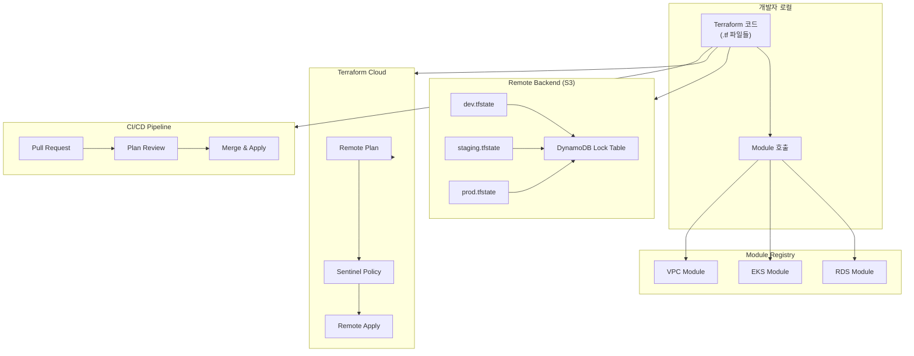
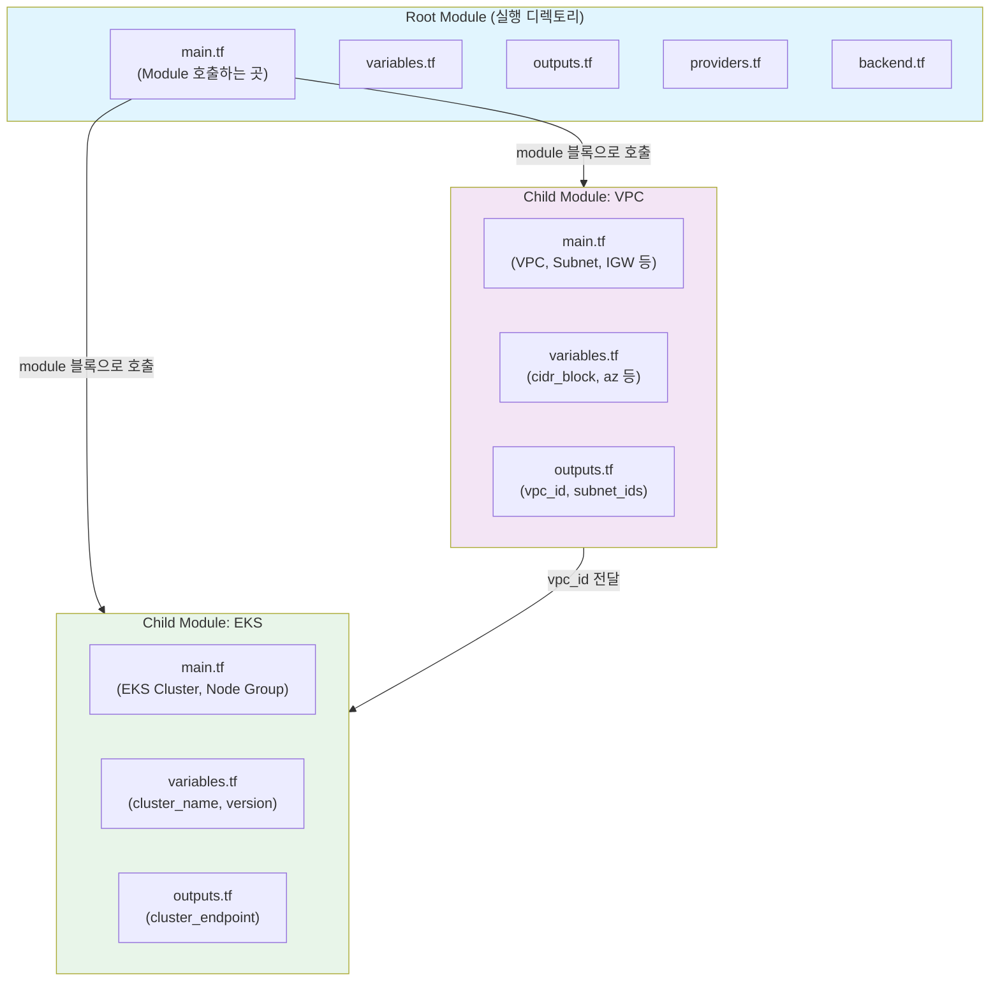
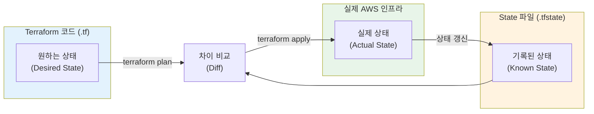
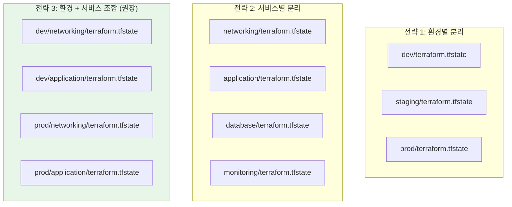
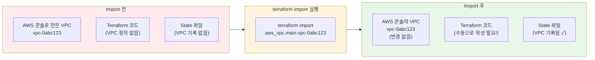
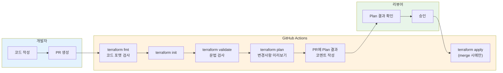

# Terraform 심화 — Module, State, Workspace, Import, Backend, Terraform Cloud

> [이전 강의](./02-terraform-basics)에서 Terraform의 기본 문법과 리소스 생성을 배웠죠? 이번에는 **실무에서 Terraform을 "잘" 쓰기 위한 심화 주제**를 다뤄볼게요. 혼자 리소스 몇 개 만드는 건 쉽지만, 팀과 함께 수백 개의 리소스를 관리하려면 Module, State 관리, Workspace 같은 개념이 반드시 필요해요.

---

## 🎯 왜 Terraform 심화를 알아야 하나요?

집을 한 채 짓는 건 설계도 한 장이면 충분해요. 하지만 **아파트 단지 전체**를 짓는다면? 같은 설계를 반복하고, 공사 현황을 체계적으로 관리하고, 여러 팀이 동시에 작업할 수 있어야 해요.

Terraform 심화는 바로 이런 **대규모 인프라 관리 능력**을 키워주는 거예요.

```
실무에서 Terraform 심화가 필요한 순간:

- VPC + EKS + RDS를 매번 똑같이 만들어야 해요        → Module로 재사용
- "누가 내 state 파일 덮어썼어요!"                    → Remote State + Locking
- dev/staging/prod 환경을 분리해야 해요               → Workspace 또는 디렉토리 분리
- 이미 콘솔에서 만든 리소스를 Terraform으로 가져와야 해요 → terraform import
- 팀원이 동시에 terraform apply 하면 충돌이 나요       → S3 Backend + DynamoDB Lock
- Plan 결과를 코드 리뷰처럼 확인하고 싶어요            → CI/CD + Terraform Cloud
- 100개 넘는 Terraform 프로젝트를 관리해야 해요        → Terragrunt + 모노레포 전략
```

[VPC 강의](../05-cloud-aws/02-vpc)에서 만든 네트워크를 Module로 재사용하고, [Kubernetes 강의](../04-kubernetes/)에서 다룬 EKS 클러스터를 코드로 관리하는 방법을 배워볼게요.

---

## 🧠 핵심 개념 잡기

### 비유: 대규모 건설 프로젝트

Terraform 심화를 **대규모 건설 프로젝트**에 비유해볼게요.

| 현실 세계 | Terraform 심화 |
|-----------|---------------|
| 레고 블록 세트 (미리 만든 조립 키트) | **Module** (재사용 가능한 인프라 패키지) |
| 건축 현황 대장 (뭘 지었고 어디에 있는지) | **State** (인프라 상태 기록 파일) |
| 건설 본부 금고 (대장을 안전하게 보관) | **Backend** (State 원격 저장소) |
| 시뮬레이션 모형 (실물 짓기 전 미니어처) | **Workspace** (환경별 격리된 작업 공간) |
| 기존 건물 등기부 등본 발급 | **Import** (기존 리소스를 코드로 편입) |
| 중앙 관제 센터 | **Terraform Cloud** (원격 실행 + 정책 관리) |

---

### 전체 구조 한눈에 보기



---

## 🔍 하나씩 자세히 알아보기

---

### 1. Module 시스템

#### Module이 뭔가요?

Module은 **레고 블록 세트**예요. 레고로 집을 지을 때 벽돌 하나하나를 쌓는 대신, "지붕 세트", "벽 세트", "문 세트"처럼 미리 만들어둔 키트를 조합하잖아요? Terraform Module도 마찬가지로, VPC, EKS, RDS 같은 인프라 구성을 미리 패키징해서 **한 줄로 호출**할 수 있게 만드는 거예요.

#### Root Module vs Child Module



- **Root Module**: `terraform plan/apply`를 실행하는 최상위 디렉토리예요. 진입점이라고 보면 돼요.
- **Child Module**: Root에서 `module` 블록으로 호출되는 하위 모듈이에요. 재사용 가능한 인프라 단위예요.

#### Module 작성법 (inputs / outputs / main)

Module은 기본적으로 3개 파일로 구성돼요.

**디렉토리 구조:**

```
modules/
└── vpc/
    ├── main.tf          # 리소스 정의
    ├── variables.tf     # 입력 변수 (인터페이스)
    ├── outputs.tf       # 출력값 (다른 모듈에 전달)
    └── versions.tf      # Provider 버전 제약
```

**modules/vpc/variables.tf** — 입력 변수 정의:

```hcl
variable "project_name" {
  description = "프로젝트 이름 (리소스 태깅에 사용)"
  type        = string
}

variable "environment" {
  description = "환경 (dev, staging, prod)"
  type        = string
  validation {
    condition     = contains(["dev", "staging", "prod"], var.environment)
    error_message = "environment는 dev, staging, prod 중 하나여야 해요."
  }
}

variable "vpc_cidr" {
  description = "VPC CIDR 블록"
  type        = string
  default     = "10.0.0.0/16"
}

variable "availability_zones" {
  description = "사용할 가용영역 목록"
  type        = list(string)
  default     = ["ap-northeast-2a", "ap-northeast-2c"]
}

variable "public_subnet_cidrs" {
  description = "퍼블릭 서브넷 CIDR 목록"
  type        = list(string)
  default     = ["10.0.1.0/24", "10.0.2.0/24"]
}

variable "private_subnet_cidrs" {
  description = "프라이빗 서브넷 CIDR 목록"
  type        = list(string)
  default     = ["10.0.11.0/24", "10.0.12.0/24"]
}

variable "enable_nat_gateway" {
  description = "NAT Gateway 생성 여부"
  type        = bool
  default     = true
}

variable "tags" {
  description = "공통 태그"
  type        = map(string)
  default     = {}
}
```

**modules/vpc/main.tf** — 리소스 정의:

```hcl
resource "aws_vpc" "this" {
  cidr_block           = var.vpc_cidr
  enable_dns_hostnames = true
  enable_dns_support   = true

  tags = merge(var.tags, {
    Name = "${var.project_name}-${var.environment}-vpc"
  })
}

resource "aws_internet_gateway" "this" {
  vpc_id = aws_vpc.this.id

  tags = merge(var.tags, {
    Name = "${var.project_name}-${var.environment}-igw"
  })
}

resource "aws_subnet" "public" {
  count = length(var.public_subnet_cidrs)

  vpc_id                  = aws_vpc.this.id
  cidr_block              = var.public_subnet_cidrs[count.index]
  availability_zone       = var.availability_zones[count.index]
  map_public_ip_on_launch = true

  tags = merge(var.tags, {
    Name = "${var.project_name}-${var.environment}-public-${count.index + 1}"
    Tier = "public"
  })
}

resource "aws_subnet" "private" {
  count = length(var.private_subnet_cidrs)

  vpc_id            = aws_vpc.this.id
  cidr_block        = var.private_subnet_cidrs[count.index]
  availability_zone = var.availability_zones[count.index]

  tags = merge(var.tags, {
    Name = "${var.project_name}-${var.environment}-private-${count.index + 1}"
    Tier = "private"
  })
}

# NAT Gateway (조건부 생성)
resource "aws_eip" "nat" {
  count  = var.enable_nat_gateway ? 1 : 0
  domain = "vpc"

  tags = merge(var.tags, {
    Name = "${var.project_name}-${var.environment}-nat-eip"
  })
}

resource "aws_nat_gateway" "this" {
  count = var.enable_nat_gateway ? 1 : 0

  allocation_id = aws_eip.nat[0].id
  subnet_id     = aws_subnet.public[0].id

  tags = merge(var.tags, {
    Name = "${var.project_name}-${var.environment}-nat"
  })
}

# Route Tables
resource "aws_route_table" "public" {
  vpc_id = aws_vpc.this.id

  route {
    cidr_block = "0.0.0.0/0"
    gateway_id = aws_internet_gateway.this.id
  }

  tags = merge(var.tags, {
    Name = "${var.project_name}-${var.environment}-public-rt"
  })
}

resource "aws_route_table" "private" {
  vpc_id = aws_vpc.this.id

  dynamic "route" {
    for_each = var.enable_nat_gateway ? [1] : []
    content {
      cidr_block     = "0.0.0.0/0"
      nat_gateway_id = aws_nat_gateway.this[0].id
    }
  }

  tags = merge(var.tags, {
    Name = "${var.project_name}-${var.environment}-private-rt"
  })
}

resource "aws_route_table_association" "public" {
  count          = length(var.public_subnet_cidrs)
  subnet_id      = aws_subnet.public[count.index].id
  route_table_id = aws_route_table.public.id
}

resource "aws_route_table_association" "private" {
  count          = length(var.private_subnet_cidrs)
  subnet_id      = aws_subnet.private[count.index].id
  route_table_id = aws_route_table.private.id
}
```

**modules/vpc/outputs.tf** — 출력값 정의:

```hcl
output "vpc_id" {
  description = "생성된 VPC ID"
  value       = aws_vpc.this.id
}

output "vpc_cidr" {
  description = "VPC CIDR 블록"
  value       = aws_vpc.this.cidr_block
}

output "public_subnet_ids" {
  description = "퍼블릭 서브넷 ID 목록"
  value       = aws_subnet.public[*].id
}

output "private_subnet_ids" {
  description = "프라이빗 서브넷 ID 목록"
  value       = aws_subnet.private[*].id
}

output "nat_gateway_ip" {
  description = "NAT Gateway의 퍼블릭 IP"
  value       = var.enable_nat_gateway ? aws_eip.nat[0].public_ip : null
}
```

#### Module 호출하기 (Root Module에서)

```hcl
# main.tf (Root Module)
module "vpc" {
  source = "./modules/vpc"

  project_name        = "myapp"
  environment         = "dev"
  vpc_cidr            = "10.0.0.0/16"
  availability_zones  = ["ap-northeast-2a", "ap-northeast-2c"]
  public_subnet_cidrs = ["10.0.1.0/24", "10.0.2.0/24"]
  private_subnet_cidrs = ["10.0.11.0/24", "10.0.12.0/24"]
  enable_nat_gateway  = true

  tags = {
    Team        = "platform"
    ManagedBy   = "terraform"
  }
}

# 다른 모듈에서 VPC 출력값 참조
module "eks" {
  source = "./modules/eks"

  cluster_name  = "myapp-dev-eks"
  vpc_id        = module.vpc.vpc_id          # VPC 모듈의 출력 참조
  subnet_ids    = module.vpc.private_subnet_ids
}
```

#### Module Source 종류

Module은 다양한 곳에서 가져올 수 있어요.

```hcl
# 1. 로컬 경로
module "vpc" {
  source = "./modules/vpc"
}

# 2. Terraform Registry (공식 레지스트리)
module "vpc" {
  source  = "terraform-aws-modules/vpc/aws"
  version = "~> 5.0"
}

# 3. GitHub
module "vpc" {
  source = "github.com/my-org/terraform-modules//vpc?ref=v1.2.0"
}

# 4. S3 Bucket
module "vpc" {
  source = "s3::https://my-terraform-modules.s3.amazonaws.com/vpc.zip"
}

# 5. Git (SSH)
module "vpc" {
  source = "git::ssh://git@github.com/my-org/terraform-modules.git//vpc?ref=v1.2.0"
}
```

#### Module 버전 관리

```hcl
module "vpc" {
  source  = "terraform-aws-modules/vpc/aws"
  version = "5.1.2"         # 정확한 버전 고정
}

module "eks" {
  source  = "terraform-aws-modules/eks/aws"
  version = "~> 19.0"       # 19.x 범위 내 최신
}

module "rds" {
  source  = "terraform-aws-modules/rds/aws"
  version = ">= 6.0, < 7.0" # 6.x 범위
}
```

> **실무 팁**: 프로덕션에서는 반드시 정확한 버전을 고정하세요. `~>`도 편하지만 예기치 않은 업데이트가 발생할 수 있어요.

#### 실무 모듈 구조 예시

대규모 프로젝트의 디렉토리 구조를 볼게요.

```
terraform-infra/
├── environments/
│   ├── dev/
│   │   ├── main.tf              # dev 환경 Module 호출
│   │   ├── variables.tf
│   │   ├── terraform.tfvars     # dev 환경 값
│   │   └── backend.tf           # dev state 설정
│   ├── staging/
│   │   ├── main.tf
│   │   ├── variables.tf
│   │   ├── terraform.tfvars
│   │   └── backend.tf
│   └── prod/
│       ├── main.tf
│       ├── variables.tf
│       ├── terraform.tfvars
│       └── backend.tf
├── modules/
│   ├── vpc/
│   │   ├── main.tf
│   │   ├── variables.tf
│   │   └── outputs.tf
│   ├── eks/
│   │   ├── main.tf
│   │   ├── variables.tf
│   │   ├── outputs.tf
│   │   └── iam.tf
│   ├── rds/
│   │   ├── main.tf
│   │   ├── variables.tf
│   │   └── outputs.tf
│   └── monitoring/
│       ├── main.tf
│       ├── variables.tf
│       └── outputs.tf
└── global/
    ├── iam/                     # 전역 IAM 설정
    └── route53/                 # DNS 설정
```

---

### 2. State 관리 심화

#### State가 뭔가요?

State는 **건축 현황 대장**이에요. 건설 현장에서 "1층 골조 완료, 2층 배관 진행 중, 전기 배선 50% 완료" 같은 현황을 기록하잖아요? Terraform의 State 파일(`terraform.tfstate`)도 마찬가지로 **"지금 인프라가 어떤 상태인지"**를 정확하게 기록하는 파일이에요.



#### terraform.tfstate 파일 구조

State 파일은 JSON 형식이에요. 실제로 어떻게 생겼는지 볼까요?

```json
{
  "version": 4,
  "terraform_version": "1.7.0",
  "serial": 15,
  "lineage": "a1b2c3d4-e5f6-7890-abcd-ef1234567890",
  "outputs": {
    "vpc_id": {
      "value": "vpc-0abc123def456",
      "type": "string"
    }
  },
  "resources": [
    {
      "mode": "managed",
      "type": "aws_vpc",
      "name": "main",
      "provider": "provider[\"registry.terraform.io/hashicorp/aws\"]",
      "instances": [
        {
          "schema_version": 1,
          "attributes": {
            "id": "vpc-0abc123def456",
            "cidr_block": "10.0.0.0/16",
            "enable_dns_hostnames": true,
            "tags": {
              "Name": "myapp-dev-vpc"
            }
          }
        }
      ]
    }
  ]
}
```

| 필드 | 설명 |
|------|------|
| `version` | State 파일 포맷 버전 (현재 4) |
| `serial` | State가 변경될 때마다 1씩 증가 (충돌 감지용) |
| `lineage` | State의 고유 식별자 (같은 인프라인지 확인) |
| `outputs` | `output` 블록에 정의된 출력값 |
| `resources` | 관리 중인 모든 리소스의 상세 속성 |

> **주의**: State 파일에는 비밀번호, 키 같은 민감한 정보가 **평문으로 저장**될 수 있어요. 절대 Git에 커밋하면 안 돼요!

#### Local State vs Remote State

```
Local State (기본값)
├── 장점: 설정이 간단해요
├── 단점: 팀 협업이 불가능해요
├── 단점: 동시 작업 시 충돌이 나요
└── 단점: 노트북이 고장나면 State를 잃어요

Remote State (S3 + DynamoDB)
├── 장점: 팀 전체가 같은 State를 공유해요
├── 장점: DynamoDB로 동시 접근을 막아요 (Locking)
├── 장점: S3 버전 관리로 State 복구가 가능해요
├── 장점: 암호화로 민감 정보를 보호해요
└── 단점: 초기 설정이 필요해요
```

#### S3 Backend 설정 (Remote State)

**1단계: S3 버킷과 DynamoDB 테이블 먼저 만들기**

```hcl
# backend-bootstrap/main.tf
# 이 파일은 한 번만 로컬에서 실행해요
provider "aws" {
  region = "ap-northeast-2"
}

resource "aws_s3_bucket" "terraform_state" {
  bucket = "mycompany-terraform-state"

  lifecycle {
    prevent_destroy = true  # 실수로 삭제 방지
  }

  tags = {
    Name      = "Terraform State"
    ManagedBy = "terraform"
  }
}

resource "aws_s3_bucket_versioning" "terraform_state" {
  bucket = aws_s3_bucket.terraform_state.id
  versioning_configuration {
    status = "Enabled"  # State 이력 관리
  }
}

resource "aws_s3_bucket_server_side_encryption_configuration" "terraform_state" {
  bucket = aws_s3_bucket.terraform_state.id
  rule {
    apply_server_side_encryption_by_default {
      sse_algorithm = "aws:kms"  # 암호화 활성화
    }
  }
}

resource "aws_s3_bucket_public_access_block" "terraform_state" {
  bucket = aws_s3_bucket.terraform_state.id

  block_public_acls       = true
  block_public_policy     = true
  ignore_public_acls      = true
  restrict_public_buckets = true
}

resource "aws_dynamodb_table" "terraform_locks" {
  name         = "terraform-state-locks"
  billing_mode = "PAY_PER_REQUEST"
  hash_key     = "LockID"

  attribute {
    name = "LockID"
    type = "S"
  }

  tags = {
    Name      = "Terraform Lock Table"
    ManagedBy = "terraform"
  }
}
```

**2단계: Backend 설정**

```hcl
# backend.tf
terraform {
  backend "s3" {
    bucket         = "mycompany-terraform-state"
    key            = "environments/dev/terraform.tfstate"
    region         = "ap-northeast-2"
    dynamodb_table = "terraform-state-locks"
    encrypt        = true
  }
}
```

**3단계: Backend 초기화**

```bash
$ terraform init

Initializing the backend...

Successfully configured the backend "s3"! Terraform will automatically
use this backend unless the backend configuration changes.

Initializing provider plugins...

Terraform has been successfully initialized!
```

#### State 조작 명령어

State 파일을 직접 수정하면 안 되고, 반드시 CLI 명령어를 사용해야 해요.

**terraform state list — 관리 중인 리소스 목록 확인**

```bash
$ terraform state list

aws_vpc.main
aws_subnet.public[0]
aws_subnet.public[1]
aws_subnet.private[0]
aws_subnet.private[1]
aws_internet_gateway.main
aws_nat_gateway.main
aws_route_table.public
aws_route_table.private
module.eks.aws_eks_cluster.this
module.eks.aws_eks_node_group.workers
```

**terraform state show — 특정 리소스 상세 보기**

```bash
$ terraform state show aws_vpc.main

# aws_vpc.main:
resource "aws_vpc" "main" {
    arn                  = "arn:aws:ec2:ap-northeast-2:123456789012:vpc/vpc-0abc123def456"
    cidr_block           = "10.0.0.0/16"
    enable_dns_hostnames = true
    enable_dns_support   = true
    id                   = "vpc-0abc123def456"
    instance_tenancy     = "default"
    main_route_table_id  = "rtb-0123456789abcdef"
    owner_id             = "123456789012"

    tags = {
        "Environment" = "dev"
        "Name"        = "myapp-dev-vpc"
        "ManagedBy"   = "terraform"
    }
}
```

**terraform state mv — 리소스 이름 변경 (리팩토링)**

```bash
# 리소스 이름을 변경할 때 (destroy + create 방지)
$ terraform state mv aws_vpc.main aws_vpc.this

Move "aws_vpc.main" to "aws_vpc.this"
Successfully moved 1 object(s).
```

```bash
# 모듈 안으로 리소스 이동
$ terraform state mv aws_vpc.main module.vpc.aws_vpc.this

Move "aws_vpc.main" to "module.vpc.aws_vpc.this"
Successfully moved 1 object(s).
```

**terraform state rm — State에서 리소스 제거 (인프라는 유지)**

```bash
# Terraform 관리에서 제외 (실제 리소스는 삭제하지 않음)
$ terraform state rm aws_s3_bucket.legacy

Removed aws_s3_bucket.legacy
Successfully removed 1 resource instance(s).
```

> **주의**: `state rm` 후 `terraform plan`을 실행하면 해당 리소스를 새로 만들려고 해요. 코드도 함께 삭제해야 해요.

**terraform state pull / push — State 파일 직접 다운로드/업로드**

```bash
# Remote state를 로컬로 다운로드
$ terraform state pull > backup.tfstate

# 로컬 state를 Remote로 업로드 (위험! 비상 시에만)
$ terraform state push backup.tfstate
```

#### State 분리 전략



**서비스별 분리의 장점:**

```hcl
# networking/backend.tf — 네트워크 팀이 관리
terraform {
  backend "s3" {
    bucket = "mycompany-terraform-state"
    key    = "prod/networking/terraform.tfstate"
    region = "ap-northeast-2"
  }
}

# application/backend.tf — 개발팀이 관리
terraform {
  backend "s3" {
    bucket = "mycompany-terraform-state"
    key    = "prod/application/terraform.tfstate"
    region = "ap-northeast-2"
  }
}

# application/main.tf — 네트워크 State 참조
data "terraform_remote_state" "networking" {
  backend = "s3"
  config = {
    bucket = "mycompany-terraform-state"
    key    = "prod/networking/terraform.tfstate"
    region = "ap-northeast-2"
  }
}

resource "aws_instance" "app" {
  ami           = "ami-0c55b159cbfafe1f0"
  instance_type = "t3.medium"
  subnet_id     = data.terraform_remote_state.networking.outputs.private_subnet_ids[0]
}
```

---

### 3. Workspace

#### Workspace가 뭔가요?

Workspace는 **시뮬레이션 모형 테이블**이에요. 같은 건물 설계도로 "1:100 모형(dev)", "1:50 모형(staging)", "실물 건축(prod)"을 각각 따로 만들 수 있잖아요? Workspace도 **같은 코드로 서로 격리된 환경**을 만드는 기능이에요.

```bash
# 현재 workspace 확인
$ terraform workspace list

* default

# 새 workspace 생성
$ terraform workspace new dev

Created and switched to workspace "dev"!

$ terraform workspace new staging

Created and switched to workspace "staging"!

$ terraform workspace new prod

Created and switched to workspace "prod"!

# workspace 목록 확인 (* = 현재 선택된 workspace)
$ terraform workspace list

  default
  dev
  staging
* prod

# workspace 전환
$ terraform workspace select dev

Switched to workspace "dev".
```

#### Workspace 활용 — 환경별 변수 분기

```hcl
# variables.tf
variable "instance_type" {
  description = "EC2 인스턴스 타입"
  type        = map(string)
  default = {
    dev     = "t3.micro"
    staging = "t3.small"
    prod    = "t3.large"
  }
}

variable "min_size" {
  description = "ASG 최소 인스턴스 수"
  type        = map(number)
  default = {
    dev     = 1
    staging = 2
    prod    = 3
  }
}

# main.tf
locals {
  env = terraform.workspace  # 현재 workspace 이름 참조
}

resource "aws_instance" "app" {
  ami           = data.aws_ami.amazon_linux.id
  instance_type = var.instance_type[local.env]

  tags = {
    Name        = "myapp-${local.env}-app"
    Environment = local.env
  }
}

resource "aws_autoscaling_group" "app" {
  name             = "myapp-${local.env}-asg"
  min_size         = var.min_size[local.env]
  max_size         = var.min_size[local.env] * 3
  desired_capacity = var.min_size[local.env]

  # ...
}
```

#### Workspace별 State 파일 위치

```bash
# S3 Backend 사용 시 State 파일 경로
s3://mycompany-terraform-state/
├── env:/dev/terraform.tfstate       # dev workspace
├── env:/staging/terraform.tfstate   # staging workspace
├── env:/prod/terraform.tfstate      # prod workspace
└── terraform.tfstate                # default workspace
```

#### Workspace vs Directory 기반 환경 분리 비교

| 기준 | Workspace 방식 | Directory 방식 |
|------|---------------|---------------|
| 구조 | 1개 디렉토리, N개 workspace | N개 디렉토리, 각각 독립 |
| 코드 중복 | 없음 (같은 코드 공유) | 있음 (환경마다 복사 또는 module 호출) |
| 환경 차이 표현 | `terraform.workspace` + map 변수 | 환경별 `terraform.tfvars` |
| 실수 위험 | workspace 잘못 선택하면 prod에 적용 | 디렉토리가 다르므로 실수 가능성 낮음 |
| 환경별 Provider 설정 | 어려움 (같은 코드 공유) | 쉬움 (환경별 다른 Provider 가능) |
| 환경별 구조 차이 | 표현 어려움 (같은 코드 강제) | 자유로움 (환경별 리소스 다르게 가능) |
| 적합한 경우 | 환경 간 구조가 동일할 때 | 환경 간 차이가 클 때 |
| **실무 선호도** | **중소 규모** | **대규모 (더 보편적)** |

> **실무 권장**: 대부분의 팀은 **Directory 방식 + Module 조합**을 선호해요. 환경마다 리소스 구성이 조금씩 다르고, workspace 잘못 선택하는 실수를 원천적으로 방지할 수 있거든요.

---

### 4. terraform import

#### Import가 뭔가요?

Import는 **기존 건물의 등기부 등본을 발급받는 것**과 같아요. 이미 AWS 콘솔이나 CLI로 만들어진 리소스를 Terraform의 관리 대상으로 편입시키는 기능이에요.



#### CLI import (기존 방식)

```bash
# 1단계: 빈 리소스 블록을 코드에 작성
# main.tf에 추가:
```

```hcl
resource "aws_vpc" "imported" {
  # 일단 비워둬요 — import 후에 채울 거예요
}
```

```bash
# 2단계: import 실행
$ terraform import aws_vpc.imported vpc-0abc123def456

aws_vpc.imported: Importing from ID "vpc-0abc123def456"...
aws_vpc.imported: Import prepared!
  Prepared aws_vpc for import
aws_vpc.imported: Refreshing state... [id=vpc-0abc123def456]

Import successful!

The resources that were imported are shown above. These resources are now in
your Terraform state and will henceforth be managed by Terraform.

# 3단계: state show로 속성 확인 후 코드에 채워넣기
$ terraform state show aws_vpc.imported

# aws_vpc.imported:
resource "aws_vpc" "imported" {
    arn                  = "arn:aws:ec2:ap-northeast-2:123456789012:vpc/vpc-0abc123def456"
    cidr_block           = "10.0.0.0/16"
    enable_dns_hostnames = true
    enable_dns_support   = true
    id                   = "vpc-0abc123def456"
    tags = {
        "Name" = "legacy-vpc"
    }
}

# 4단계: 확인한 속성으로 코드 완성
```

```hcl
resource "aws_vpc" "imported" {
  cidr_block           = "10.0.0.0/16"
  enable_dns_hostnames = true
  enable_dns_support   = true

  tags = {
    Name = "legacy-vpc"
  }
}
```

```bash
# 5단계: plan으로 차이 없는지 확인
$ terraform plan

aws_vpc.imported: Refreshing state... [id=vpc-0abc123def456]

No changes. Your infrastructure matches the configuration.
```

#### import block (Terraform 1.5+ 선언적 방식)

Terraform 1.5부터는 코드 안에서 선언적으로 import할 수 있어요. 훨씬 편하고 안전해요.

```hcl
# imports.tf
import {
  to = aws_vpc.imported
  id = "vpc-0abc123def456"
}

import {
  to = aws_subnet.public
  id = "subnet-0123456789abcdef0"
}

import {
  to = aws_security_group.web
  id = "sg-0abc123def456"
}
```

```bash
# plan에서 import 미리보기 가능
$ terraform plan

aws_vpc.imported: Preparing import... [id=vpc-0abc123def456]
aws_vpc.imported: Refreshing state... [id=vpc-0abc123def456]
aws_subnet.public: Preparing import... [id=subnet-0123456789abcdef0]
aws_subnet.public: Refreshing state... [id=subnet-0123456789abcdef0]

Plan: 3 to import, 0 to add, 0 to change, 0 to destroy.

# 코드 자동 생성 (Terraform 1.5+)
$ terraform plan -generate-config-out=generated_imports.tf
```

> **실무 팁**: `terraform plan -generate-config-out` 옵션을 사용하면 import 대상 리소스의 코드를 자동 생성해줘요. 수동으로 속성을 하나하나 채울 필요가 없어서 매우 편리해요.

#### moved block으로 리팩토링

리소스 이름을 바꾸거나 Module 안으로 이동할 때, `state mv` 대신 코드에 `moved` 블록을 선언할 수 있어요.

```hcl
# 리소스 이름 변경
moved {
  from = aws_vpc.main
  to   = aws_vpc.this
}

# Module 안으로 이동
moved {
  from = aws_vpc.this
  to   = module.vpc.aws_vpc.this
}

# count에서 for_each로 변환
moved {
  from = aws_subnet.public[0]
  to   = aws_subnet.public["az-a"]
}
```

```bash
$ terraform plan

Terraform will perform the following actions:

  # aws_vpc.main has moved to aws_vpc.this
    resource "aws_vpc" "this" {
        id         = "vpc-0abc123def456"
        # (7 unchanged attributes hidden)
    }

Plan: 0 to add, 0 to change, 0 to destroy.
(1 moved)
```

> **장점**: `moved` 블록은 코드 리뷰에서 확인할 수 있고, 팀원 모두에게 적용되며, plan에서 미리 확인할 수 있어요. `state mv`는 로컬에서만 적용되고 팀원에게 공유되지 않아요.

---

### 5. Backend 설정

#### Backend가 뭔가요?

Backend는 **건설 현장의 중앙 금고**예요. 건축 현황 대장(State)을 자기 책상 서랍(Local)에 넣어두면 다른 사람이 볼 수 없잖아요? 중앙 금고(S3)에 넣어두고 열쇠(DynamoDB Lock)로 관리하면 팀 전체가 안전하게 공유할 수 있어요.

#### S3 Backend + DynamoDB Lock 상세 설정

```hcl
# backend.tf
terraform {
  backend "s3" {
    # State 파일 저장 위치
    bucket = "mycompany-terraform-state"
    key    = "prod/networking/terraform.tfstate"
    region = "ap-northeast-2"

    # State Locking (동시 수정 방지)
    dynamodb_table = "terraform-state-locks"

    # 보안 설정
    encrypt = true                        # State 파일 암호화

    # 추가 옵션
    skip_metadata_api_check = false
  }
}
```

**Locking이 작동하는 원리:**

```bash
# 사용자 A가 terraform apply 실행
$ terraform apply

Acquiring state lock. This may take a few moments...
# → DynamoDB에 Lock 레코드 생성

# (동시에) 사용자 B가 terraform apply 실행
$ terraform apply

Error: Error acquiring the state lock

  Lock Info:
    ID:        a1b2c3d4-e5f6-7890
    Path:      mycompany-terraform-state/prod/networking/terraform.tfstate
    Operation: OperationTypeApply
    Who:       user-a@mycompany.com
    Version:   1.7.0
    Created:   2024-01-15 09:30:00.000000 UTC

  Terraform acquires a state lock to protect the state from being written
  by multiple users at the same time. Please resolve the issue above and
  try again.

# Lock이 걸려있을 때 강제 해제 (비상 시에만!)
$ terraform force-unlock a1b2c3d4-e5f6-7890

Do you really want to force-unlock?
  Terraform will remove the lock on the remote state.
  This will allow local Terraform commands to modify this state, even though it
  may still be in use. Only 'yes' will be accepted to confirm.

  Enter a value: yes

Terraform state has been successfully unlocked!
```

#### Backend Migration (Local에서 S3로)

이미 Local State를 사용 중인 프로젝트를 Remote로 마이그레이션하는 방법이에요.

```bash
# 1단계: backend.tf 파일 추가 (위의 S3 설정)

# 2단계: terraform init으로 마이그레이션
$ terraform init

Initializing the backend...
Do you want to copy existing state to the new backend?
  Pre-existing state was found while migrating the previous "local" backend
  to the newly configured "s3" backend. No existing state was found in the
  newly configured "s3" backend. Do you want to copy this state to the new
  "s3" backend? Enter "yes" to copy and "no" to start with an empty state.

  Enter a value: yes

Successfully configured the backend "s3"! Terraform will automatically
use this backend unless the backend configuration changes.

# 3단계: 로컬 terraform.tfstate 파일 삭제 (백업 후)
$ cp terraform.tfstate terraform.tfstate.local-backup
$ rm terraform.tfstate
```

---

### 6. Terraform Cloud / HCP Terraform

#### Terraform Cloud가 뭔가요?

Terraform Cloud는 **건설 프로젝트의 중앙 관제 센터**예요. 개별 현장 감독(개발자)이 각자 도면을 들고 일하는 대신, 관제 센터에서 모든 건설 작업을 승인하고, 정책을 검사하고, 이력을 관리하는 거예요.

#### 주요 기능

| 기능 | 설명 |
|------|------|
| **Remote Execution** | plan/apply를 Terraform Cloud 서버에서 실행 |
| **State Management** | State 자동 저장, 버전 관리, 암호화 |
| **Policy as Code (Sentinel)** | 정책을 코드로 정의하고 자동 검사 |
| **VCS Integration** | GitHub/GitLab 연동, PR 시 자동 plan |
| **Private Registry** | 사내 Module을 등록하고 공유 |
| **Team Management** | 팀별 권한, Workspace 접근 제어 |
| **Cost Estimation** | plan 시 예상 비용 자동 산출 |

#### Terraform Cloud 설정

```hcl
# backend.tf — Terraform Cloud를 Backend로 사용
terraform {
  cloud {
    organization = "my-company"

    workspaces {
      name = "myapp-prod"
    }
  }
}
```

```bash
# Terraform Cloud 로그인
$ terraform login

Terraform will request an API token for app.terraform.io using your browser.

If login is successful, Terraform will store the token in plain text in
the following file for use by subsequent commands:
    /home/user/.terraform.d/credentials.tfrc.json

Do you want to proceed?
  Only 'yes' will be accepted to confirm.

  Enter a value: yes

# 브라우저에서 토큰 생성 후 입력
Token for app.terraform.io:

Retrieved token for user user@company.com

Success! Terraform has obtained and saved an API token.
```

#### Sentinel Policy (Policy as Code)

Sentinel은 Terraform Cloud에서 **정책을 코드로 정의**하는 기능이에요.

```python
# policy.sentinel — 모든 EC2에 태그 필수
import "tfplan/v2" as tfplan

# EC2 인스턴스에 Environment 태그가 있는지 검사
main = rule {
    all tfplan.resource_changes as _, rc {
        rc.type is "aws_instance" and
        rc.change.after.tags contains "Environment"
    }
}
```

```python
# cost-policy.sentinel — 비용 제한 정책
import "tfrun"

# 월 예상 비용이 $1000를 넘으면 거부
main = rule {
    float(tfrun.cost_estimate.delta_monthly_cost) < 1000
}
```

---

### 7. CI/CD 파이프라인에서의 Terraform

#### 왜 CI/CD가 필요한가요?

개발자가 로컬에서 `terraform apply`를 직접 실행하면 위험해요. **코드 리뷰 없이 인프라가 변경**될 수 있거든요. CI/CD 파이프라인을 사용하면 Plan 결과를 리뷰하고, 승인 후에만 Apply되는 안전한 워크플로우를 만들 수 있어요.



#### GitHub Actions + Terraform 워크플로우

```yaml
# .github/workflows/terraform.yml
name: Terraform CI/CD

on:
  pull_request:
    branches: [main]
    paths:
      - 'terraform/**'
  push:
    branches: [main]
    paths:
      - 'terraform/**'

permissions:
  contents: read
  pull-requests: write        # PR에 코멘트 작성 권한

env:
  TF_VERSION: '1.7.0'
  AWS_REGION: 'ap-northeast-2'
  WORKING_DIR: 'terraform/environments/prod'

jobs:
  # ---- PR 시: Plan만 실행하고 결과를 코멘트로 남겨요 ----
  plan:
    name: Terraform Plan
    runs-on: ubuntu-latest
    if: github.event_name == 'pull_request'
    defaults:
      run:
        working-directory: ${{ env.WORKING_DIR }}

    steps:
      - name: Checkout
        uses: actions/checkout@v4

      - name: Setup Terraform
        uses: hashicorp/setup-terraform@v3
        with:
          terraform_version: ${{ env.TF_VERSION }}

      - name: Configure AWS Credentials
        uses: aws-actions/configure-aws-credentials@v4
        with:
          role-to-assume: ${{ secrets.AWS_ROLE_ARN }}
          aws-region: ${{ env.AWS_REGION }}

      - name: Terraform Format Check
        id: fmt
        run: terraform fmt -check -recursive
        continue-on-error: true

      - name: Terraform Init
        id: init
        run: terraform init -no-color

      - name: Terraform Validate
        id: validate
        run: terraform validate -no-color

      - name: Terraform Plan
        id: plan
        run: terraform plan -no-color -out=tfplan
        continue-on-error: true

      - name: Comment Plan on PR
        uses: actions/github-script@v7
        with:
          script: |
            const output = `
            ### Terraform Plan Results

            | Step | Status |
            |------|--------|
            | Format | ${{ steps.fmt.outcome == 'success' && '✅' || '❌' }} |
            | Init | ${{ steps.init.outcome == 'success' && '✅' || '❌' }} |
            | Validate | ${{ steps.validate.outcome == 'success' && '✅' || '❌' }} |
            | Plan | ${{ steps.plan.outcome == 'success' && '✅' || '❌' }} |

            <details><summary>Plan Output</summary>

            \`\`\`
            ${{ steps.plan.outputs.stdout }}
            \`\`\`

            </details>

            *Pushed by: @${{ github.actor }}, Action: \`${{ github.event_name }}\`*
            `;

            github.rest.issues.createComment({
              issue_number: context.issue.number,
              owner: context.repo.owner,
              repo: context.repo.repo,
              body: output
            })

      - name: Plan Status
        if: steps.plan.outcome == 'failure'
        run: exit 1

  # ---- main에 merge 시: Apply 실행 ----
  apply:
    name: Terraform Apply
    runs-on: ubuntu-latest
    if: github.ref == 'refs/heads/main' && github.event_name == 'push'
    defaults:
      run:
        working-directory: ${{ env.WORKING_DIR }}

    steps:
      - name: Checkout
        uses: actions/checkout@v4

      - name: Setup Terraform
        uses: hashicorp/setup-terraform@v3
        with:
          terraform_version: ${{ env.TF_VERSION }}

      - name: Configure AWS Credentials
        uses: aws-actions/configure-aws-credentials@v4
        with:
          role-to-assume: ${{ secrets.AWS_ROLE_ARN }}
          aws-region: ${{ env.AWS_REGION }}

      - name: Terraform Init
        run: terraform init -no-color

      - name: Terraform Apply
        run: terraform apply -auto-approve -no-color
```

---

### 8. 대규모 Terraform 관리

#### Terragrunt 소개

프로젝트가 커지면 환경마다 반복되는 backend 설정, provider 설정, 공통 변수가 많아져요. **Terragrunt**는 이런 반복(boilerplate)을 줄여주는 Terraform의 래퍼(wrapper) 도구예요.

```
# Terragrunt 없이 (반복이 많아요)
environments/
├── dev/
│   ├── backend.tf       # 환경마다 거의 같은 설정 반복
│   ├── provider.tf      # 환경마다 거의 같은 설정 반복
│   ├── main.tf
│   └── variables.tf
├── staging/
│   ├── backend.tf       # 복사 + 붙여넣기...
│   ├── provider.tf
│   ├── main.tf
│   └── variables.tf
└── prod/
    ├── backend.tf       # 또 복사 + 붙여넣기...
    ├── provider.tf
    ├── main.tf
    └── variables.tf

# Terragrunt 사용 시 (DRY하게)
environments/
├── terragrunt.hcl       # 공통 설정 1곳에서 관리
├── dev/
│   └── terragrunt.hcl   # 환경별 차이만 정의
├── staging/
│   └── terragrunt.hcl
└── prod/
    └── terragrunt.hcl
```

**루트 terragrunt.hcl:**

```hcl
# environments/terragrunt.hcl
remote_state {
  backend = "s3"
  generate = {
    path      = "backend.tf"
    if_exists = "overwrite_terragrunt"
  }
  config = {
    bucket         = "mycompany-terraform-state"
    key            = "${path_relative_to_include()}/terraform.tfstate"
    region         = "ap-northeast-2"
    dynamodb_table = "terraform-state-locks"
    encrypt        = true
  }
}

generate "provider" {
  path      = "provider.tf"
  if_exists = "overwrite_terragrunt"
  contents  = <<EOF
provider "aws" {
  region = "ap-northeast-2"

  default_tags {
    tags = {
      ManagedBy = "terraform"
      Project   = "myapp"
    }
  }
}
EOF
}
```

**환경별 terragrunt.hcl:**

```hcl
# environments/prod/terragrunt.hcl
include "root" {
  path = find_in_parent_folders()
}

terraform {
  source = "../../modules/app-stack"
}

inputs = {
  environment    = "prod"
  instance_type  = "t3.large"
  min_size       = 3
  max_size       = 10
  enable_waf     = true
}
```

```bash
# Terragrunt 명령어
$ cd environments/prod
$ terragrunt plan        # terraform plan과 동일
$ terragrunt apply       # terraform apply와 동일

# 모든 환경 한 번에 적용
$ cd environments
$ terragrunt run-all plan
$ terragrunt run-all apply
```

#### 모노레포 vs 멀티레포 구조

| 기준 | 모노레포 | 멀티레포 |
|------|---------|---------|
| 구조 | 1개 저장소에 모든 인프라 코드 | 서비스/팀별 별도 저장소 |
| Module 공유 | 상대 경로로 쉽게 참조 | Git URL + 태그로 참조 |
| 코드 리뷰 | 전체 변경을 한 PR에서 확인 | 서비스별 독립적 리뷰 |
| CI/CD | 변경된 부분만 감지 필요 | 저장소별 독립 파이프라인 |
| 권한 관리 | CODEOWNERS로 디렉토리별 제어 | 저장소별 접근 권한 |
| 팀 규모 | 소규모~중규모 (10명 이하) | 대규모 (여러 팀) |
| 의존성 관리 | 쉬움 (같은 저장소) | 버전 관리 필요 |
| **실무 권장** | **시작은 모노레포** | **팀이 커지면 전환** |

**모노레포 구조 예시:**

```
terraform-infra/                     # 1개의 Git 저장소
├── modules/                         # 공유 모듈
│   ├── vpc/
│   ├── eks/
│   ├── rds/
│   └── monitoring/
├── environments/
│   ├── dev/
│   ├── staging/
│   └── prod/
├── global/                          # 전역 리소스
│   ├── iam/
│   ├── route53/
│   └── ecr/
├── .github/
│   └── workflows/
│       └── terraform.yml
├── CODEOWNERS                       # 디렉토리별 리뷰어 지정
└── terragrunt.hcl
```

**CODEOWNERS 파일 예시:**

```
# 네트워크 관련 변경은 인프라팀 리뷰 필수
modules/vpc/          @infra-team
environments/*/networking/  @infra-team

# 데이터베이스 변경은 DBA팀 리뷰 필수
modules/rds/          @dba-team

# 프로덕션 변경은 시니어 엔지니어 리뷰 필수
environments/prod/    @senior-engineers
```

---

## 💻 직접 해보기

### 실습 1: Module 만들고 사용하기

**목표**: VPC Module을 직접 만들어서 dev 환경에 배포해볼게요.

```bash
# 1단계: 프로젝트 디렉토리 구조 생성
mkdir -p terraform-lab/{modules/vpc,environments/dev}
cd terraform-lab
```

```bash
# 2단계: VPC Module 작성
# modules/vpc/variables.tf
cat > modules/vpc/variables.tf << 'EOF'
variable "project_name" {
  type = string
}

variable "environment" {
  type = string
}

variable "vpc_cidr" {
  type    = string
  default = "10.0.0.0/16"
}
EOF
```

```bash
# modules/vpc/main.tf
cat > modules/vpc/main.tf << 'EOF'
resource "aws_vpc" "this" {
  cidr_block           = var.vpc_cidr
  enable_dns_hostnames = true
  enable_dns_support   = true

  tags = {
    Name        = "${var.project_name}-${var.environment}-vpc"
    Environment = var.environment
    ManagedBy   = "terraform"
  }
}

resource "aws_subnet" "public" {
  vpc_id                  = aws_vpc.this.id
  cidr_block              = cidrsubnet(var.vpc_cidr, 8, 1)
  availability_zone       = "ap-northeast-2a"
  map_public_ip_on_launch = true

  tags = {
    Name = "${var.project_name}-${var.environment}-public-1"
  }
}

resource "aws_internet_gateway" "this" {
  vpc_id = aws_vpc.this.id

  tags = {
    Name = "${var.project_name}-${var.environment}-igw"
  }
}
EOF
```

```bash
# modules/vpc/outputs.tf
cat > modules/vpc/outputs.tf << 'EOF'
output "vpc_id" {
  value = aws_vpc.this.id
}

output "public_subnet_id" {
  value = aws_subnet.public.id
}
EOF
```

```bash
# 3단계: Root Module 작성 (dev 환경)
# environments/dev/main.tf
cat > environments/dev/main.tf << 'EOF'
terraform {
  required_version = ">= 1.5.0"

  required_providers {
    aws = {
      source  = "hashicorp/aws"
      version = "~> 5.0"
    }
  }
}

provider "aws" {
  region = "ap-northeast-2"
}

module "vpc" {
  source = "../../modules/vpc"

  project_name = "myapp"
  environment  = "dev"
  vpc_cidr     = "10.0.0.0/16"
}

output "vpc_id" {
  value = module.vpc.vpc_id
}

output "public_subnet_id" {
  value = module.vpc.public_subnet_id
}
EOF
```

```bash
# 4단계: 실행
cd environments/dev

$ terraform init

Initializing the backend...
Initializing modules...
- vpc in ../../modules/vpc
Initializing provider plugins...
- Finding hashicorp/aws versions matching "~> 5.0"...
- Installing hashicorp/aws v5.82.0...

Terraform has been successfully initialized!

$ terraform plan

Terraform used the selected providers to generate the following execution plan.

  # module.vpc.aws_vpc.this will be created
  + resource "aws_vpc" "this" {
      + arn                  = (known after apply)
      + cidr_block           = "10.0.0.0/16"
      + enable_dns_hostnames = true
      + enable_dns_support   = true
      + id                   = (known after apply)
      + tags                 = {
          + "Environment" = "dev"
          + "ManagedBy"   = "terraform"
          + "Name"        = "myapp-dev-vpc"
        }
    }

  # module.vpc.aws_subnet.public will be created
  + resource "aws_subnet" "public" {
      + arn                 = (known after apply)
      + cidr_block          = "10.0.1.0/24"
      + id                  = (known after apply)
      + tags                = {
          + "Name" = "myapp-dev-public-1"
        }
    }

  # module.vpc.aws_internet_gateway.this will be created
  + resource "aws_internet_gateway" "this" {
      + arn    = (known after apply)
      + id     = (known after apply)
      + tags   = {
          + "Name" = "myapp-dev-igw"
        }
    }

Plan: 3 to add, 0 to change, 0 to destroy.

Changes to Outputs:
  + vpc_id           = (known after apply)
  + public_subnet_id = (known after apply)

$ terraform apply -auto-approve
# ... (리소스 생성)

Apply complete! Resources: 3 added, 0 changed, 0 destroyed.
```

### 실습 2: Remote Backend 설정하기

```bash
# 1단계: S3 + DynamoDB 생성 (한 번만)
cd terraform-lab
mkdir backend-setup && cd backend-setup

cat > main.tf << 'EOF'
provider "aws" {
  region = "ap-northeast-2"
}

resource "aws_s3_bucket" "state" {
  bucket = "my-terraform-state-${random_id.suffix.hex}"

  tags = {
    Purpose = "Terraform State"
  }
}

resource "random_id" "suffix" {
  byte_length = 4
}

resource "aws_s3_bucket_versioning" "state" {
  bucket = aws_s3_bucket.state.id
  versioning_configuration {
    status = "Enabled"
  }
}

resource "aws_dynamodb_table" "locks" {
  name         = "terraform-state-locks"
  billing_mode = "PAY_PER_REQUEST"
  hash_key     = "LockID"

  attribute {
    name = "LockID"
    type = "S"
  }
}

output "bucket_name" {
  value = aws_s3_bucket.state.id
}
EOF

$ terraform init && terraform apply -auto-approve
# 출력된 bucket_name을 기록해두세요
```

```bash
# 2단계: 기존 프로젝트에 Backend 설정 추가
cd ../environments/dev

cat > backend.tf << 'EOF'
terraform {
  backend "s3" {
    bucket         = "my-terraform-state-a1b2c3d4"  # 위에서 생성한 버킷명
    key            = "dev/terraform.tfstate"
    region         = "ap-northeast-2"
    dynamodb_table = "terraform-state-locks"
    encrypt        = true
  }
}
EOF

# 3단계: Backend 마이그레이션
$ terraform init

Initializing the backend...
Do you want to copy existing state to the new backend?

  Enter a value: yes

Successfully configured the backend "s3"!
```

### 실습 3: Workspace로 환경 분리

```bash
# 1단계: Workspace 생성
$ terraform workspace new dev
Created and switched to workspace "dev"!

$ terraform workspace new prod
Created and switched to workspace "prod"!

# 2단계: Workspace별 변수 사용
cat > main.tf << 'EOF'
locals {
  env = terraform.workspace

  config = {
    dev = {
      instance_type = "t3.micro"
      instance_count = 1
    }
    prod = {
      instance_type = "t3.large"
      instance_count = 3
    }
  }
}

resource "aws_instance" "app" {
  count         = local.config[local.env].instance_count
  ami           = data.aws_ami.amazon_linux.id
  instance_type = local.config[local.env].instance_type

  tags = {
    Name        = "app-${local.env}-${count.index + 1}"
    Environment = local.env
  }
}

data "aws_ami" "amazon_linux" {
  most_recent = true
  owners      = ["amazon"]

  filter {
    name   = "name"
    values = ["al2023-ami-*-x86_64"]
  }
}
EOF

# 3단계: 환경별 배포
$ terraform workspace select dev
$ terraform plan     # t3.micro 1대

$ terraform workspace select prod
$ terraform plan     # t3.large 3대
```

### 실습 4: terraform import

```bash
# 1단계: AWS 콘솔에서 만든 S3 버킷이 있다고 가정
# 버킷 이름: my-legacy-bucket-2024

# 2단계: import block 방식 (Terraform 1.5+)
cat > imports.tf << 'EOF'
import {
  to = aws_s3_bucket.legacy
  id = "my-legacy-bucket-2024"
}
EOF

# 3단계: 코드 자동 생성
$ terraform plan -generate-config-out=generated.tf

# generated.tf 파일이 자동 생성됨
$ cat generated.tf
resource "aws_s3_bucket" "legacy" {
  bucket = "my-legacy-bucket-2024"
  tags = {
    "Name" = "Legacy Bucket"
  }
}

# 4단계: 정리
# generated.tf의 내용을 main.tf에 적절히 통합
# imports.tf는 apply 후 삭제해도 됨

$ terraform plan
No changes. Your infrastructure matches the configuration.
```

---

## 🏢 실무에서는?

### 시나리오 1: 신규 프로젝트 인프라 셋업

**상황**: 새 프로젝트에서 VPC + EKS + RDS를 3개 환경(dev/staging/prod)에 배포해야 해요.

```
해결 방법:

1. 디렉토리 기반 환경 분리 + Module 조합
   - modules/ 에 VPC, EKS, RDS 모듈 작성
   - environments/dev/, staging/, prod/ 각각에서 모듈 호출
   - 환경별 terraform.tfvars로 차이 표현

2. S3 Backend + DynamoDB Lock 설정
   - 환경별 State 파일 분리
   - key = "{env}/terraform.tfstate"

3. GitHub Actions로 CI/CD 파이프라인
   - PR → Plan 자동 실행 + 코멘트
   - main merge → Apply 자동 실행
   - prod는 수동 승인 단계 추가

4. CODEOWNERS로 리뷰 프로세스
   - prod 디렉토리 변경은 시니어 엔지니어 필수 리뷰
```

### 시나리오 2: 콘솔로 만든 레거시 인프라를 Terraform으로 전환

**상황**: 이미 AWS 콘솔에서 만든 VPC, EC2, RDS가 수십 개 있어요. 이걸 Terraform으로 관리하고 싶어요.

```
해결 방법:

1. 현재 인프라 파악
   - AWS Config 또는 aws cli로 리소스 목록 추출
   - terraform import 대상 리스트업

2. import block으로 단계적 전환
   - 네트워크 (VPC, Subnet) → 컴퓨팅 (EC2, ASG) → 데이터 (RDS) 순서로
   - terraform plan -generate-config-out으로 코드 자동 생성
   - 생성된 코드를 Module 구조로 리팩토링

3. 검증
   - terraform plan에서 "No changes" 확인
   - 각 단계마다 State 백업

4. 주의사항
   - 한꺼번에 전부 import하지 마세요 — 서비스 단위로 나눠서 진행
   - import 중에 실제 인프라는 절대 변경되지 않아요 (안전)
```

### 시나리오 3: 멀티 팀 대규모 Terraform 운영

**상황**: 5개 팀이 하나의 AWS 계정에서 각자의 서비스를 Terraform으로 관리해요. State 충돌, 권한 관리, 코드 품질 유지가 과제예요.

```
해결 방법:

1. Terragrunt + 모노레포 구조
   - 공통 설정은 루트 terragrunt.hcl에서 관리
   - 팀별 디렉토리 분리, State 자동 분리
   - CODEOWNERS로 팀별 코드 리뷰 범위 제한

2. Terraform Cloud (또는 Atlantis)
   - Remote Plan/Apply로 로컬 실행 금지
   - Sentinel로 정책 강제 (태그 필수, 인스턴스 타입 제한 등)
   - 팀별 Workspace + 권한 관리

3. Module Registry
   - 공용 모듈은 Private Registry에 등록
   - 버전 태그로 관리 (v1.0.0, v1.1.0)
   - Breaking change 시 major 버전 업

4. 정기적인 State 관리
   - 사용하지 않는 리소스 정리 (state rm)
   - State 파일 크기 모니터링
   - drift 감지 (plan 스케줄링)
```

---

## terraform test — 네이티브 테스트 프레임워크 (1.6+)

Terraform 1.6부터 **`terraform test`** 명령어가 정식 도입됐어요. 기존에는 Terratest(Go), Kitchen-Terraform(Ruby) 같은 외부 도구를 써야 했는데, 이제 **HCL만으로 인프라 코드를 테스트**할 수 있어요.

### 왜 필요한가요?

```
기존 방식의 문제:

1. 외부 도구 의존 — Go나 Ruby 런타임 필요
2. 학습 부담 — HCL 외에 다른 언어를 배워야 함
3. 느린 피드백 — 실제 리소스를 생성해야만 테스트 가능

terraform test의 장점:

1. HCL 네이티브 — 추가 언어 불필요
2. Plan 모드 지원 — 리소스 생성 없이 검증 가능 (빠르고 무료)
3. CI/CD 통합 쉬움 — terraform test 한 줄이면 충분
```

### 테스트 파일 구조

테스트 파일은 `*.tftest.hcl` 확장자를 사용하고, 프로젝트 루트나 `tests/` 디렉토리에 배치해요.

```hcl
# tests/vpc.tftest.hcl

# === Plan 모드 테스트 (리소스 생성 없이 검증) ===
run "vpc_cidr_is_valid" {
  command = plan    # plan만 실행, 실제 생성 안 함

  assert {
    condition     = aws_vpc.main.cidr_block == "10.0.0.0/16"
    error_message = "VPC CIDR block must be 10.0.0.0/16"
  }
}

run "subnet_count_is_correct" {
  command = plan

  assert {
    condition     = length(aws_subnet.private) == 3
    error_message = "Expected 3 private subnets"
  }
}

# === Apply 모드 테스트 (실제 리소스 생성 후 검증) ===
run "ec2_instance_has_correct_tags" {
  command = apply   # 실제 리소스 생성 후 검증, 테스트 후 자동 삭제

  variables {
    environment = "test"
    instance_type = "t3.micro"
  }

  assert {
    condition     = aws_instance.web.tags["Environment"] == "test"
    error_message = "Instance must have Environment=test tag"
  }
}
```

### 핵심 문법

```
terraform test 구성 요소:

┌─────────────────────────────────────────────────┐
│  *.tftest.hcl 파일                               │
│                                                  │
│  run "테스트_이름" {                              │
│    command = plan | apply   # 실행 모드          │
│                                                  │
│    variables {              # 테스트용 변수 오버라이드 │
│      key = "value"                               │
│    }                                             │
│                                                  │
│    assert {                 # 검증 조건 (여러 개 가능) │
│      condition     = <bool 표현식>               │
│      error_message = "실패 시 메시지"             │
│    }                                             │
│  }                                               │
└─────────────────────────────────────────────────┘

command 종류:
  plan  — 빠르고 비용 없음, 대부분의 검증에 충분
  apply — 실제 생성 후 검증, 테스트 후 자동 destroy
```

### 실행 방법

```bash
# 모든 테스트 실행
terraform test

# 특정 테스트 파일만 실행
terraform test -filter=tests/vpc.tftest.hcl

# 상세 출력
terraform test -verbose
```

### CI/CD에서 terraform test 활용

```yaml
# GitHub Actions 예시
- name: Terraform Test
  run: |
    terraform init
    terraform test    # plan 모드 테스트는 비용/시간 부담 없음
```

```
CI/CD 파이프라인에서의 위치:

PR 생성 시:
  terraform fmt -check → terraform validate → terraform test → terraform plan
                                                  ↑
                                          plan 모드 테스트는 여기서!
                                          (빠르고 비용 없음)

main merge 후:
  terraform apply
```

**실무 팁**: Plan 모드 테스트만으로도 변수 검증, CIDR 범위, 태그 규칙, 리소스 개수 등 대부분의 정적 검증이 가능해요. Apply 모드는 통합 테스트가 정말 필요할 때만 사용하세요.

---

## OpenTofu — Terraform의 오픈소스 포크

### 배경

2023년 8월, HashiCorp가 Terraform의 라이선스를 **MPL 2.0에서 BSL (Business Source License)로 변경**했어요. BSL은 경쟁 서비스에서 Terraform을 사용하는 것을 제한하는 라이선스예요.

이에 대응해서 Linux Foundation 산하에 **OpenTofu**라는 오픈소스 포크가 만들어졌어요.

```
라이선스 변경 타임라인:

2023.08  HashiCorp, Terraform 라이선스를 BSL로 변경 발표
2023.09  OpenTF (현 OpenTofu) 포크 프로젝트 시작
2023.09  Linux Foundation에 합류
2024.01  OpenTofu 1.6.0 GA 릴리스 (Terraform 1.6 호환)
2024~    OpenTofu 독자 기능 추가 시작 (state encryption 등)
```

### Terraform vs OpenTofu

| 비교 항목 | Terraform | OpenTofu |
|-----------|-----------|----------|
| **라이선스** | BSL 1.1 (제한적) | MPL 2.0 (오픈소스) |
| **관리 주체** | HashiCorp (IBM 인수) | Linux Foundation |
| **CLI 호환성** | 기준 | Terraform 1.6 기반, 높은 호환성 |
| **Provider 호환** | 기준 | 동일 Provider 사용 가능 |
| **State 형식** | 기준 | 호환 (+ State 암호화 자체 지원) |
| **Registry** | registry.terraform.io | registry.opentofu.org |
| **상용 지원** | Terraform Cloud/Enterprise | 커뮤니티 + 서드파티 |

### 어떤 걸 선택해야 할까?

```
선택 가이드:

Terraform을 유지해야 하는 경우:
  ├ Terraform Cloud/Enterprise를 이미 사용 중
  ├ HashiCorp 공식 지원이 필요한 엔터프라이즈
  └ 기존 CI/CD 파이프라인이 Terraform에 강하게 결합

OpenTofu를 고려해야 하는 경우:
  ├ 오픈소스 라이선스가 조직 정책상 필수
  ├ 벤더 종속을 줄이고 싶은 경우
  ├ State 암호화 같은 OpenTofu 전용 기능이 필요
  └ 신규 프로젝트에서 자유롭게 선택 가능한 경우
```

**실무 팁**: 이 강의에서 배우는 Module, State, Backend, Workspace 개념은 **Terraform과 OpenTofu 모두에 동일하게 적용**돼요. HCL 문법, Provider, 핵심 명령어도 같기 때문에 어떤 도구를 선택하든 이 강의의 내용은 유효해요.

---

## ⚠️ 자주 하는 실수

### 실수 1: State 파일을 Git에 커밋

```
문제:
  terraform.tfstate에는 DB 비밀번호, API 키 등 민감 정보가
  평문으로 저장돼요. Git에 커밋하면 전체 이력에 남아요.

해결:
  1. .gitignore에 반드시 추가
     *.tfstate
     *.tfstate.*
     .terraform/

  2. Remote Backend (S3) 사용
     State를 S3에 저장하고 KMS로 암호화

  3. 이미 커밋했다면
     git filter-branch나 BFG Repo-Cleaner로 이력 삭제
     + 노출된 비밀번호 즉시 변경
```

### 실수 2: Workspace를 잘못 선택하고 apply

```
문제:
  prod workspace인 줄 모르고 terraform apply를 실행해서
  프로덕션 인프라가 변경됨

해결:
  1. 실행 전 반드시 workspace 확인
     terraform workspace show

  2. CI/CD에서만 apply 실행 (로컬 apply 금지)

  3. Prompt에 workspace 표시
     export PS1="[\$(terraform workspace show)] $PS1"

  4. 가장 근본적 해결: Directory 기반 환경 분리 사용
     디렉토리가 다르면 실수 자체가 불가능
```

### 실수 3: State Lock을 무시하고 force-unlock

```
문제:
  Lock이 걸려있어서 apply가 안 되니까 force-unlock 후 실행
  → 다른 사람의 apply와 동시에 실행되어 State 충돌

해결:
  1. Lock을 건 사람에게 먼저 확인
     Lock Info의 Who 필드를 확인하세요

  2. force-unlock은 정말 비상 시에만
     - Lock을 건 프로세스가 비정상 종료된 경우
     - Lock을 건 사람이 자리에 없고 긴급한 경우

  3. force-unlock 후 반드시 plan부터 실행
     절대 바로 apply 하지 마세요
```

### 실수 4: Module 버전을 고정하지 않음

```
문제:
  version을 명시하지 않거나 "~>" 범위를 너무 넓게 지정
  → 어느 날 갑자기 terraform init에서 새 버전이 설치되며 Breaking change 발생

해결:
  # 나쁜 예
  module "vpc" {
    source  = "terraform-aws-modules/vpc/aws"
    # version 생략 → 항상 최신 버전
  }

  # 좋은 예
  module "vpc" {
    source  = "terraform-aws-modules/vpc/aws"
    version = "5.1.2"    # 정확한 버전 고정
  }

  # .terraform.lock.hcl도 Git에 커밋하세요
  # Provider 버전을 정확히 고정해줘요
```

### 실수 5: State를 수동으로 편집

```
문제:
  terraform.tfstate 파일을 텍스트 에디터로 직접 수정
  → JSON 형식 깨짐, serial 불일치, State 손상

해결:
  1. State 조작은 반드시 CLI로
     terraform state mv    # 이름 변경
     terraform state rm    # 제거
     terraform state pull  # 다운로드
     terraform state push  # 업로드

  2. 실수로 State를 손상시켰다면
     S3 버전 관리에서 이전 버전 복원
     aws s3api list-object-versions \
       --bucket mycompany-terraform-state \
       --prefix prod/terraform.tfstate

  3. 예방
     S3 버킷 Versioning 반드시 활성화
     State 변경 전 terraform state pull로 백업
```

---

## 📝 마무리

### 핵심 요약

| 개념 | 한줄 요약 | 실무 핵심 |
|------|----------|----------|
| **Module** | 재사용 가능한 인프라 패키지 | 버전 고정, inputs/outputs 명확히 정의 |
| **State** | 인프라 상태 기록 파일 | Remote Backend 필수, Git에 절대 커밋 금지 |
| **Backend** | State 원격 저장소 | S3 + DynamoDB Lock이 표준 |
| **Workspace** | 같은 코드로 환경 격리 | 소규모에 적합, 대규모는 Directory 방식 |
| **Import** | 기존 리소스를 코드로 편입 | import block + generate-config 활용 |
| **moved** | 코드 리팩토링 시 State 이동 | state mv 대신 moved block 권장 |
| **Terraform Cloud** | 원격 실행 + 정책 관리 | 팀 규모가 커지면 도입 검토 |
| **Terragrunt** | Terraform의 DRY 래퍼 | 반복 설정이 많을 때 도입 |
| **CI/CD** | Plan → Review → Apply | PR에 Plan 결과 자동 코멘트 |
| **terraform test** | HCL 네이티브 테스트 (1.6+) | Plan 모드로 빠른 정적 검증 |
| **OpenTofu** | Terraform 오픈소스 포크 | 동일 HCL/Provider, 라이선스가 다름 |

### 명령어 치트시트

| 명령어 | 용도 |
|--------|------|
| `terraform state list` | 관리 중인 리소스 목록 |
| `terraform state show <resource>` | 리소스 상세 속성 확인 |
| `terraform state mv <from> <to>` | 리소스 이름 변경 (State 내) |
| `terraform state rm <resource>` | State에서 리소스 제거 |
| `terraform state pull` | Remote State를 로컬로 다운로드 |
| `terraform import <resource> <id>` | 기존 리소스 import (CLI) |
| `terraform plan -generate-config-out=f.tf` | import 대상 코드 자동 생성 |
| `terraform workspace list` | Workspace 목록 |
| `terraform workspace new <name>` | Workspace 생성 |
| `terraform workspace select <name>` | Workspace 전환 |
| `terraform workspace show` | 현재 Workspace 확인 |
| `terraform force-unlock <id>` | Lock 강제 해제 (비상용) |
| `terraform test` | 테스트 실행 (.tftest.hcl) |
| `terraform test -filter=<file>` | 특정 테스트 파일만 실행 |

### 학습 체크리스트

```
Module:
  [ ] Module의 variables.tf / main.tf / outputs.tf 구조를 이해했나요?
  [ ] Root Module에서 Child Module을 호출할 수 있나요?
  [ ] Module source (local, registry, git)의 차이를 아나요?
  [ ] Module 버전 고정의 중요성을 이해했나요?

State:
  [ ] terraform.tfstate 파일의 구조를 이해했나요?
  [ ] Local State와 Remote State의 차이를 아나요?
  [ ] state mv, rm, pull, push 명령어를 사용할 수 있나요?
  [ ] State 분리 전략 (환경별, 서비스별)을 이해했나요?

Backend:
  [ ] S3 + DynamoDB Lock Backend를 설정할 수 있나요?
  [ ] Backend migration (Local → S3)을 수행할 수 있나요?
  [ ] Locking의 동작 원리를 이해했나요?

Workspace & Import:
  [ ] Workspace를 생성하고 전환할 수 있나요?
  [ ] Workspace와 Directory 방식의 장단점을 아나요?
  [ ] terraform import로 기존 리소스를 가져올 수 있나요?
  [ ] import block과 moved block의 사용법을 아나요?

운영:
  [ ] CI/CD 파이프라인에서 Plan → Review → Apply 패턴을 이해했나요?
  [ ] Terragrunt의 역할을 이해했나요?
  [ ] 모노레포 vs 멀티레포의 장단점을 아나요?
```

---

## 🔗 다음 단계

이번 강의에서 Terraform의 심화 주제를 배웠어요. 다음 강의에서는 또 다른 IaC 도구인 **Ansible**을 배워볼게요.

| 다음 강의 | 내용 |
|-----------|------|
| [Ansible](./04-ansible) | 서버 설정 자동화 — Playbook, Role, Inventory, 실무 패턴 |

**함께 보면 좋은 강의:**

- [Terraform 기초](./02-terraform-basics) — HCL 문법, 리소스, Provider, 기본 명령어
- [AWS VPC](../05-cloud-aws/02-vpc) — Module로 자동화할 네트워크 구조 이해
- [Kubernetes](../04-kubernetes/) — EKS Module과 함께 사용하는 K8s 운영
- [CI/CD](../07-cicd/) — GitHub Actions 파이프라인 심화
