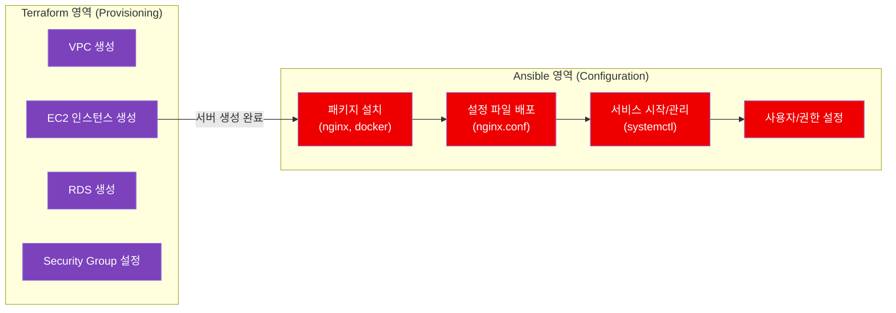
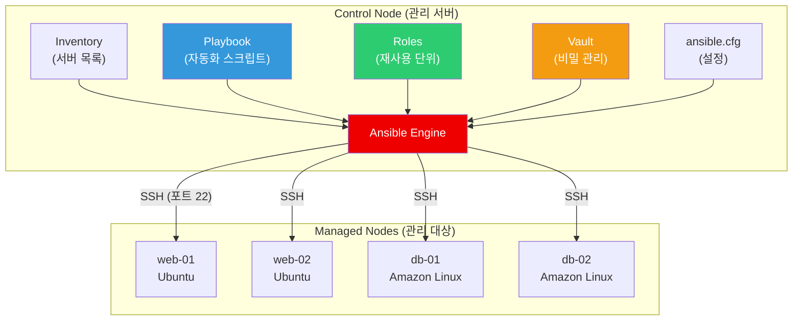
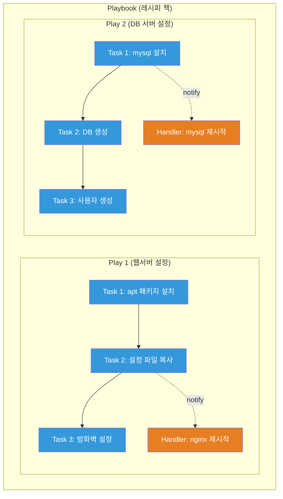
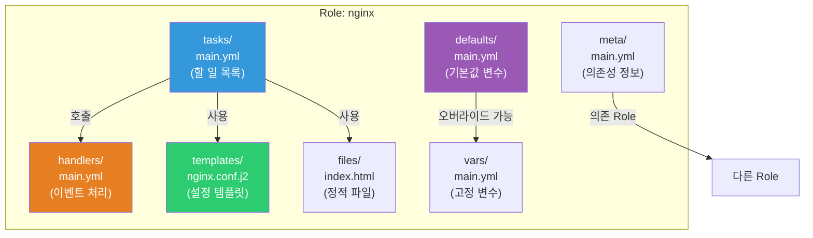
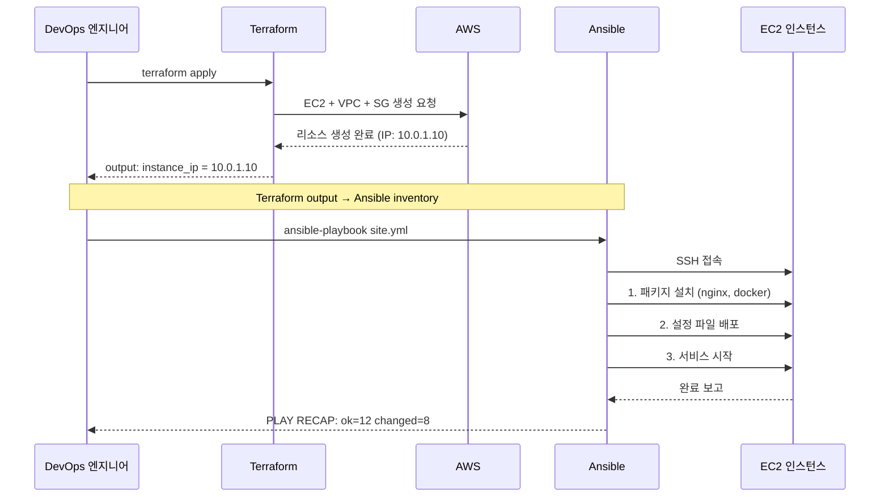

# Ansible 전체

> 서버 100대에 Nginx를 설치해야 한다고 상상해보세요. SSH로 하나씩 접속해서 `apt install nginx`를 100번 반복하시겠어요? Ansible은 **리모컨 하나로 집 안의 모든 가전제품을 제어**하듯, 한 곳에서 수백 대의 서버를 동시에 관리하는 자동화 도구예요. [IaC 개념](./01-concept)에서 배운 "인프라를 코드로 관리한다"의 실전편이에요.

---

## 🎯 왜 Ansible을/를 알아야 하나요?

```
실무에서 Ansible이 필요한 순간:
• 서버 50대에 동일한 패키지 설치/업데이트       → ansible all -m apt
• 새 서버에 표준 환경 자동 구성                 → Playbook
• Nginx 설정 변경 후 전체 서버 반영             → handler + template
• 개발/스테이징/프로덕션 환경별 설정 관리        → Inventory + group_vars
• DB 비밀번호 같은 민감 정보 안전하게 관리       → Ansible Vault
• Terraform으로 만든 EC2에 소프트웨어 설치       → Terraform + Ansible 조합
• 팀 전체가 웹 UI로 자동화 작업 관리            → AWX / Ansible Tower
```

### Ansible vs Terraform — 역할이 달라요

[Terraform](./02-terraform-basics)과 Ansible은 자주 비교되지만, 사실 **하는 일이 달라요**.

```
Terraform = 건축가    → "건물(인프라)을 짓는다" (Provisioning)
                       EC2 생성, VPC 구성, RDS 생성
                       → 인프라의 "존재" 자체를 관리

Ansible   = 인테리어  → "건물 안을 꾸민다" (Configuration Management)
                       패키지 설치, 설정 파일 배포, 서비스 시작
                       → 서버의 "상태"를 관리
```



> 실무에서는 둘을 **함께** 써요. Terraform으로 인프라를 만들고, Ansible로 그 위에 소프트웨어를 설치하고 설정하는 거예요.

---

## 🧠 핵심 개념 잡기

### 비유: Ansible = 만능 리모컨 시스템

집에 TV, 에어컨, 조명, 스피커가 있다고 해볼게요.

| Ansible 개념 | 일상 비유 | 설명 |
|---|---|---|
| **Control Node** | 리모컨을 들고 있는 나 | Ansible이 설치된 관리 서버. 여기서 명령을 내려요 |
| **Managed Node** | TV, 에어컨, 조명 | 관리 대상 서버들. Ansible이 SSH로 접속해요 |
| **Inventory** | 가전제품 목록표 | "어떤 서버들을 관리할 건지" 적어놓은 목록이에요 |
| **Playbook** | 요리 레시피 | "이 순서대로 이 작업을 해라"는 자동화 스크립트예요 |
| **Role** | 요리 코스 (전채/메인/디저트) | Playbook을 재사용 가능한 단위로 묶은 거예요 |
| **Module** | 리모컨의 버튼 하나하나 | `copy`, `apt`, `service` 같은 개별 작업 단위예요 |

### 핵심 1: Agentless (에이전트 없음)

```
Chef / Puppet  → 관리 대상 서버에 agent 설치 필요 (부담)
Ansible        → SSH만 되면 OK! 추가 설치 없음 (간편)
```

[Linux SSH](../01-linux/10-ssh)만 설정되어 있으면 바로 쓸 수 있어요. 이게 Ansible의 가장 큰 장점이에요.

### 핵심 2: 멱등성 (Idempotency)

"같은 Playbook을 10번 실행해도 결과는 같아요." 이미 Nginx가 설치되어 있으면 다시 설치하지 않아요. [IaC 개념](./01-concept)에서 배운 선언적 접근이에요.

### 핵심 3: YAML 기반 (사람이 읽기 쉬움)

Ansible은 YAML로 작성해요. 프로그래밍 언어를 몰라도 읽을 수 있어요.

### 핵심 4: Push 방식

```
Pull 방식 (Chef/Puppet) → 서버가 주기적으로 "변경사항 있어?" 확인
Push 방식 (Ansible)      → 관리자가 "지금 이거 해!" 명령을 밀어넣음
```

---

## 🔍 하나씩 자세히 알아보기

### 1. Ansible 아키텍처



**동작 방식:**
1. Control Node에서 Playbook 실행
2. Ansible이 Inventory에서 대상 서버 목록 확인
3. SSH로 Managed Node에 접속
4. Python 모듈을 임시로 전송하고 실행
5. 결과를 수집해서 보고
6. 임시 파일 정리 (깔끔!)

```bash
# Ansible 설치 (Control Node에만!)
# Ubuntu/Debian
sudo apt update && sudo apt install -y ansible

# Amazon Linux 2 / RHEL
sudo yum install -y ansible

# pip로 설치 (추천 — 최신 버전)
pip install ansible

# 설치 확인
ansible --version
# ansible [core 2.16.x]
#   config file = /etc/ansible/ansible.cfg
#   configured module search path = ['/home/user/.ansible/plugins/modules']
#   python version = 3.11.x
```

> Managed Node에는 **Python만 설치**되어 있으면 돼요. 대부분의 Linux 배포판에는 기본 설치되어 있어요.

---

### 2. Inventory 관리

Inventory는 **"어떤 서버를 관리할 건지"** 적어놓은 목록이에요. 식당의 좌석 배치도처럼, 서버들을 그룹별로 정리해요.

#### Static Inventory — INI 형식

```ini
# inventory.ini
# 가장 간단한 형태

[webservers]
web-01 ansible_host=10.0.1.10
web-02 ansible_host=10.0.1.11
web-03 ansible_host=10.0.1.12

[dbservers]
db-01 ansible_host=10.0.2.10
db-02 ansible_host=10.0.2.11

[monitoring]
grafana ansible_host=10.0.3.10

# 그룹의 그룹 (중첩)
[production:children]
webservers
dbservers
monitoring

# 그룹 변수
[webservers:vars]
ansible_user=ubuntu
ansible_ssh_private_key_file=~/.ssh/web-key.pem
http_port=80

[dbservers:vars]
ansible_user=ec2-user
ansible_ssh_private_key_file=~/.ssh/db-key.pem
db_port=3306
```

#### Static Inventory — YAML 형식

```yaml
# inventory.yml
# YAML이 더 읽기 편해요 (추천)

all:
  children:
    webservers:
      hosts:
        web-01:
          ansible_host: 10.0.1.10
        web-02:
          ansible_host: 10.0.1.11
        web-03:
          ansible_host: 10.0.1.12
      vars:
        ansible_user: ubuntu
        ansible_ssh_private_key_file: ~/.ssh/web-key.pem
        http_port: 80

    dbservers:
      hosts:
        db-01:
          ansible_host: 10.0.2.10
        db-02:
          ansible_host: 10.0.2.11
      vars:
        ansible_user: ec2-user
        ansible_ssh_private_key_file: ~/.ssh/db-key.pem
        db_port: 3306

    monitoring:
      hosts:
        grafana:
          ansible_host: 10.0.3.10

    production:
      children:
        webservers:
        dbservers:
        monitoring:
```

#### Dynamic Inventory — AWS EC2 플러그인

실무에서는 서버가 Auto Scaling으로 자동 생성/삭제되니까, 정적 목록으로는 한계가 있어요. **Dynamic Inventory**는 AWS API를 호출해서 실시간 서버 목록을 가져와요.

```yaml
# aws_ec2.yml (파일 이름이 반드시 aws_ec2.yml 또는 aws_ec2.yaml 이어야 해요)
plugin: amazon.aws.aws_ec2
regions:
  - ap-northeast-2   # 서울 리전

# 태그 기반 필터
filters:
  tag:Environment:
    - production
  instance-state-name:
    - running

# 태그로 그룹 자동 생성
keyed_groups:
  - key: tags.Role        # Role 태그 기반 그룹
    prefix: role
  - key: tags.Environment # Environment 태그 기반 그룹
    prefix: env

# 호스트 이름 규칙
hostnames:
  - tag:Name              # Name 태그를 호스트 이름으로 사용
  - private-ip-address    # 없으면 private IP 사용

compose:
  ansible_host: private_ip_address
  ansible_user: "'ubuntu'"
```

```bash
# Dynamic Inventory 확인
ansible-inventory -i aws_ec2.yml --list
# {
#     "role_webserver": {
#         "hosts": ["web-01", "web-02", "web-03"]
#     },
#     "role_database": {
#         "hosts": ["db-01", "db-02"]
#     },
#     "env_production": {
#         "hosts": ["web-01", "web-02", "web-03", "db-01", "db-02"]
#     }
# }

# 그래프 형태로 보기
ansible-inventory -i aws_ec2.yml --graph
# @all:
#   |--@role_webserver:
#   |  |--web-01
#   |  |--web-02
#   |  |--web-03
#   |--@role_database:
#   |  |--db-01
#   |  |--db-02
#   |--@ungrouped:
```

> AWS Dynamic Inventory를 쓰려면 `amazon.aws` 컬렉션이 필요해요:
> `ansible-galaxy collection install amazon.aws`

---

### 3. Ad-hoc 명령어

Playbook을 작성하기 전에, **한 줄짜리 명령**으로 빠르게 작업할 수 있어요. 리모컨 버튼 하나 누르는 거예요.

```bash
# 기본 구조
# ansible <대상> -i <인벤토리> -m <모듈> -a <인자>

# 모든 서버에 ping (연결 확인)
ansible all -i inventory.ini -m ping
# web-01 | SUCCESS => {
#     "changed": false,
#     "ping": "pong"
# }
# web-02 | SUCCESS => {
#     "changed": false,
#     "ping": "pong"
# }
# db-01 | SUCCESS => {
#     "changed": false,
#     "ping": "pong"
# }

# 웹서버 그룹에 uptime 확인
ansible webservers -i inventory.ini -m shell -a "uptime"
# web-01 | CHANGED | rc=0 >>
#  09:15:23 up 45 days,  3:22,  1 user,  load average: 0.15, 0.10, 0.08
# web-02 | CHANGED | rc=0 >>
#  09:15:23 up 45 days,  3:22,  1 user,  load average: 0.22, 0.18, 0.12

# 파일 복사
ansible webservers -i inventory.ini -m copy \
  -a "src=./index.html dest=/var/www/html/index.html owner=www-data mode=0644"

# 디렉토리 생성
ansible all -i inventory.ini -m file \
  -a "path=/opt/myapp state=directory owner=deploy mode=0755"

# 패키지 설치 (Ubuntu)
ansible webservers -i inventory.ini -m apt \
  -a "name=nginx state=present" --become
# --become = sudo 권한으로 실행

# 패키지 설치 (Amazon Linux / RHEL)
ansible dbservers -i inventory.ini -m yum \
  -a "name=mysql-server state=present" --become

# 서비스 시작 및 부팅 시 자동 시작
ansible webservers -i inventory.ini -m service \
  -a "name=nginx state=started enabled=yes" --become

# 사용자 생성
ansible all -i inventory.ini -m user \
  -a "name=deploy shell=/bin/bash groups=sudo" --become

# 디스크 사용량 확인
ansible all -i inventory.ini -m shell -a "df -h /" --become
# web-01 | CHANGED | rc=0 >>
# Filesystem      Size  Used Avail Use% Mounted on
# /dev/xvda1       20G   8.2G  11G  43% /
```

**자주 쓰는 모듈 정리:**

| 모듈 | 용도 | 예시 |
|---|---|---|
| `ping` | 연결 확인 | `-m ping` |
| `shell` | 쉘 명령 실행 | `-m shell -a "uptime"` |
| `command` | 명령 실행 (파이프 미지원) | `-m command -a "ls /tmp"` |
| `copy` | 파일 복사 | `-m copy -a "src=a dest=b"` |
| `file` | 파일/디렉토리 관리 | `-m file -a "path=x state=directory"` |
| `apt` / `yum` | 패키지 관리 | `-m apt -a "name=nginx state=present"` |
| `service` | 서비스 관리 | `-m service -a "name=nginx state=started"` |
| `user` | 사용자 관리 | `-m user -a "name=deploy"` |
| `template` | Jinja2 템플릿 배포 | Playbook에서 사용 |
| `lineinfile` | 파일 내 특정 줄 편집 | `-m lineinfile -a "path=x line=y"` |
| `setup` | 시스템 정보 수집 | `-m setup` |

---

### 4. Playbook 작성

Ad-hoc 명령은 간단한 작업에 좋지만, 복잡한 작업은 **Playbook**으로 작성해요. 요리 레시피처럼 "이 순서대로, 이 재료로, 이렇게 만들어라"를 적어놓은 YAML 파일이에요.

#### YAML 구조: Play / Task / Handler



#### 기본 Playbook 예제

```yaml
# site.yml — 웹서버 + DB 서버 전체 설정
---
# Play 1: 웹서버 설정
- name: 웹서버 Nginx 설치 및 설정
  hosts: webservers            # Inventory의 어떤 그룹에 적용할지
  become: yes                  # sudo 권한으로 실행
  vars:                        # 변수 정의
    http_port: 80
    server_name: myapp.example.com
    doc_root: /var/www/html

  tasks:
    - name: 시스템 패키지 업데이트
      apt:
        update_cache: yes
        cache_valid_time: 3600    # 1시간 이내면 캐시 사용

    - name: Nginx 설치
      apt:
        name: nginx
        state: present            # present=설치, absent=삭제, latest=최신

    - name: Nginx 설정 파일 배포
      template:
        src: templates/nginx.conf.j2    # Jinja2 템플릿
        dest: /etc/nginx/sites-available/default
        owner: root
        group: root
        mode: '0644'
      notify: Nginx 재시작       # 변경 시 handler 호출

    - name: 웹 디렉토리 생성
      file:
        path: "{{ doc_root }}"
        state: directory
        owner: www-data
        group: www-data
        mode: '0755'

    - name: index.html 배포
      copy:
        src: files/index.html
        dest: "{{ doc_root }}/index.html"
        owner: www-data
        mode: '0644'

    - name: Nginx 서비스 시작 및 부팅 시 활성화
      service:
        name: nginx
        state: started
        enabled: yes

  handlers:
    - name: Nginx 재시작
      service:
        name: nginx
        state: restarted

# Play 2: DB 서버 설정
- name: DB 서버 MySQL 설치 및 설정
  hosts: dbservers
  become: yes
  vars:
    mysql_root_password: "{{ vault_mysql_root_password }}"  # Vault에서 가져옴

  tasks:
    - name: MySQL 설치
      apt:
        name:
          - mysql-server
          - python3-mysqldb        # Ansible mysql 모듈 의존성
        state: present

    - name: MySQL 서비스 시작
      service:
        name: mysql
        state: started
        enabled: yes
```

#### Playbook 실행

```bash
# 기본 실행
ansible-playbook -i inventory.ini site.yml
# PLAY [웹서버 Nginx 설치 및 설정] ****************************************
#
# TASK [Gathering Facts] ***************************************************
# ok: [web-01]
# ok: [web-02]
#
# TASK [시스템 패키지 업데이트] *********************************************
# changed: [web-01]
# changed: [web-02]
#
# TASK [Nginx 설치] ********************************************************
# changed: [web-01]
# changed: [web-02]
#
# TASK [Nginx 설정 파일 배포] **********************************************
# changed: [web-01]
# changed: [web-02]
#
# RUNNING HANDLER [Nginx 재시작] *******************************************
# changed: [web-01]
# changed: [web-02]
#
# PLAY RECAP ***************************************************************
# web-01    : ok=6    changed=4    unreachable=0    failed=0    skipped=0
# web-02    : ok=6    changed=4    unreachable=0    failed=0    skipped=0

# 드라이런 (실제 실행 없이 변경 사항 확인)
ansible-playbook -i inventory.ini site.yml --check

# 특정 태그만 실행
ansible-playbook -i inventory.ini site.yml --tags "nginx"

# 특정 호스트만 대상
ansible-playbook -i inventory.ini site.yml --limit web-01

# 변수 전달
ansible-playbook -i inventory.ini site.yml -e "http_port=8080"

# 디버그 모드 (상세 출력)
ansible-playbook -i inventory.ini site.yml -vvv
```

#### Variables (변수)

변수 우선순위가 있어요 (아래로 갈수록 높은 우선순위):

```yaml
# 1. 기본값 (role의 defaults/main.yml)
http_port: 80

# 2. Inventory 변수 (group_vars/webservers.yml)
http_port: 80
nginx_worker: 4

# 3. Playbook vars
vars:
  http_port: 8080

# 4. 명령줄 -e (가장 높은 우선순위)
# ansible-playbook site.yml -e "http_port=9090"
```

**변수 파일 구조 (추천):**

```
project/
├── inventory.ini
├── group_vars/
│   ├── all.yml              # 모든 호스트 공통 변수
│   ├── webservers.yml       # webservers 그룹 변수
│   └── dbservers.yml        # dbservers 그룹 변수
├── host_vars/
│   ├── web-01.yml           # web-01 전용 변수
│   └── db-01.yml            # db-01 전용 변수
└── site.yml
```

```yaml
# group_vars/webservers.yml
---
ansible_user: ubuntu
http_port: 80
nginx_worker_processes: auto
nginx_worker_connections: 1024
ssl_enabled: true
```

#### Facts (시스템 정보 자동 수집)

Ansible은 실행 시 각 서버의 정보를 자동 수집해요. [Linux 시스템 정보](../01-linux/12-performance)를 코드에서 바로 쓸 수 있어요.

```yaml
# Facts 사용 예제
- name: OS별 패키지 매니저 사용
  tasks:
    - name: Ubuntu에서 Nginx 설치
      apt:
        name: nginx
        state: present
      when: ansible_os_family == "Debian"

    - name: Amazon Linux에서 Nginx 설치
      yum:
        name: nginx
        state: present
      when: ansible_os_family == "RedHat"

    - name: 시스템 정보 출력
      debug:
        msg: |
          호스트명: {{ ansible_hostname }}
          OS: {{ ansible_distribution }} {{ ansible_distribution_version }}
          CPU: {{ ansible_processor_vcpus }}개
          메모리: {{ ansible_memtotal_mb }}MB
          IP: {{ ansible_default_ipv4.address }}
```

```bash
# 특정 호스트의 Facts 확인
ansible web-01 -i inventory.ini -m setup
# web-01 | SUCCESS => {
#     "ansible_facts": {
#         "ansible_hostname": "web-01",
#         "ansible_distribution": "Ubuntu",
#         "ansible_distribution_version": "22.04",
#         "ansible_processor_vcpus": 2,
#         "ansible_memtotal_mb": 3936,
#         "ansible_default_ipv4": {
#             "address": "10.0.1.10"
#         }
#     }
# }

# 특정 Fact만 필터링
ansible web-01 -i inventory.ini -m setup -a "filter=ansible_distribution*"
```

#### Conditionals (조건문) — when

```yaml
tasks:
  - name: Ubuntu 22.04에서만 실행
    apt:
      name: nginx
      state: present
    when:
      - ansible_distribution == "Ubuntu"
      - ansible_distribution_version == "22.04"

  - name: 메모리가 4GB 이상인 서버만
    debug:
      msg: "이 서버는 메모리가 충분해요"
    when: ansible_memtotal_mb >= 4096

  - name: 변수가 정의되어 있을 때만
    template:
      src: ssl.conf.j2
      dest: /etc/nginx/ssl.conf
    when: ssl_enabled | default(false)
```

#### Loops (반복문)

```yaml
tasks:
  - name: 여러 패키지 한번에 설치
    apt:
      name: "{{ item }}"
      state: present
    loop:
      - nginx
      - git
      - curl
      - htop
      - vim

  - name: 여러 사용자 생성
    user:
      name: "{{ item.name }}"
      shell: "{{ item.shell }}"
      groups: "{{ item.groups }}"
    loop:
      - { name: 'deploy', shell: '/bin/bash', groups: 'sudo' }
      - { name: 'monitor', shell: '/bin/bash', groups: 'adm' }
      - { name: 'backup', shell: '/bin/sh', groups: 'backup' }

  - name: 여러 서비스 시작
    service:
      name: "{{ item }}"
      state: started
      enabled: yes
    loop:
      - nginx
      - docker
      - node_exporter
```

#### Templates (Jinja2)

설정 파일을 변수로 동적 생성할 수 있어요. 같은 템플릿으로 개발/스테이징/프로덕션 설정을 만들어요.

```jinja2
{# templates/nginx.conf.j2 #}
# Ansible managed — 수동 수정 금지!
# Generated on {{ ansible_date_time.iso8601 }}

worker_processes {{ nginx_worker_processes | default('auto') }};

events {
    worker_connections {{ nginx_worker_connections | default(1024) }};
}

http {
    server {
        listen {{ http_port }};
        server_name {{ server_name }};

        root {{ doc_root }};
        index index.html;


        listen 443 ssl;
        ssl_certificate /etc/ssl/certs/{{ server_name }}.crt;
        ssl_certificate_key /etc/ssl/private/{{ server_name }}.key;


        location / {
            try_files $uri $uri/ =404;
        }


        location /{{ upstream.path }} {
            proxy_pass http://{{ upstream.host }}:{{ upstream.port }};
            proxy_set_header Host $host;
            proxy_set_header X-Real-IP $remote_addr;
        }

    }
}
```

#### Tags (태그)

큰 Playbook에서 특정 작업만 실행하고 싶을 때 사용해요.

```yaml
tasks:
  - name: Nginx 설치
    apt:
      name: nginx
      state: present
    tags:
      - nginx
      - install

  - name: Nginx 설정 배포
    template:
      src: nginx.conf.j2
      dest: /etc/nginx/nginx.conf
    tags:
      - nginx
      - config

  - name: SSL 인증서 배포
    copy:
      src: "{{ item }}"
      dest: /etc/ssl/
    loop:
      - certs/server.crt
      - private/server.key
    tags:
      - ssl
      - security
```

```bash
# nginx 태그가 있는 작업만 실행
ansible-playbook site.yml --tags "nginx"

# config 태그 제외하고 실행
ansible-playbook site.yml --skip-tags "config"

# 태그 목록 확인
ansible-playbook site.yml --list-tags
```

---

### 5. Role과 Galaxy

Playbook이 길어지면 관리가 어려워요. **Role**은 관련 작업을 재사용 가능한 단위로 묶은 거예요. 요리에 비유하면, Playbook이 "오늘의 풀코스 메뉴"라면 Role은 "전채 레시피", "메인 레시피", "디저트 레시피"예요. 각각 독립적으로 재사용할 수 있어요.

#### Role 디렉토리 구조



```
roles/
└── nginx/
    ├── tasks/
    │   └── main.yml          # 핵심! 이 Role이 하는 일
    ├── handlers/
    │   └── main.yml          # notify로 호출되는 핸들러
    ├── templates/
    │   └── nginx.conf.j2     # Jinja2 템플릿 파일
    ├── files/
    │   └── index.html        # 그대로 복사할 정적 파일
    ├── vars/
    │   └── main.yml          # 고정 변수 (오버라이드 어려움)
    ├── defaults/
    │   └── main.yml          # 기본값 변수 (오버라이드 쉬움)
    ├── meta/
    │   └── main.yml          # 의존성, 지원 플랫폼 정보
    └── README.md             # Role 사용법
```

#### Role 만들기

```bash
# Role 골격 자동 생성
ansible-galaxy init roles/nginx
# - Role roles/nginx was created successfully
#   roles/nginx/
#   ├── README.md
#   ├── defaults/
#   │   └── main.yml
#   ├── files/
#   ├── handlers/
#   │   └── main.yml
#   ├── meta/
#   │   └── main.yml
#   ├── tasks/
#   │   └── main.yml
#   ├── templates/
#   ├── tests/
#   │   ├── inventory
#   │   └── test.yml
#   └── vars/
#       └── main.yml
```

```yaml
# roles/nginx/defaults/main.yml — 기본값 (사용자가 쉽게 오버라이드)
---
nginx_port: 80
nginx_worker_processes: auto
nginx_worker_connections: 1024
nginx_server_name: localhost
nginx_doc_root: /var/www/html
nginx_ssl_enabled: false
```

```yaml
# roles/nginx/tasks/main.yml — 핵심 작업
---
- name: Nginx 패키지 설치
  apt:
    name: nginx
    state: present
    update_cache: yes
    cache_valid_time: 3600

- name: Nginx 설정 배포
  template:
    src: nginx.conf.j2
    dest: /etc/nginx/sites-available/default
    mode: '0644'
  notify: Reload nginx

- name: 웹 루트 디렉토리 생성
  file:
    path: "{{ nginx_doc_root }}"
    state: directory
    owner: www-data
    group: www-data
    mode: '0755'

- name: 기본 index.html 배포
  copy:
    src: index.html
    dest: "{{ nginx_doc_root }}/index.html"
    owner: www-data
    mode: '0644'

- name: Nginx 서비스 활성화
  service:
    name: nginx
    state: started
    enabled: yes
```

```yaml
# roles/nginx/handlers/main.yml
---
- name: Reload nginx
  service:
    name: nginx
    state: reloaded

- name: Restart nginx
  service:
    name: nginx
    state: restarted
```

```yaml
# roles/nginx/meta/main.yml
---
dependencies:
  - role: common      # common Role이 먼저 실행됨
    vars:
      common_packages:
        - curl
        - vim

galaxy_info:
  author: devops-team
  description: Nginx 웹서버 설치 및 설정
  min_ansible_version: "2.14"
  platforms:
    - name: Ubuntu
      versions:
        - jammy     # 22.04
        - noble     # 24.04
```

#### Role 사용하기

```yaml
# site.yml — Role 기반 Playbook
---
- name: 웹서버 설정
  hosts: webservers
  become: yes
  roles:
    - common                         # roles/common
    - role: nginx                    # roles/nginx
      vars:
        nginx_port: 80
        nginx_ssl_enabled: true
    - role: certbot                  # roles/certbot
      when: nginx_ssl_enabled

- name: DB 서버 설정
  hosts: dbservers
  become: yes
  roles:
    - common
    - mysql
    - role: backup
      vars:
        backup_schedule: "0 2 * * *"   # 매일 새벽 2시
```

#### Ansible Galaxy — 커뮤니티 Role 활용

바퀴를 다시 발명할 필요 없어요. Galaxy에는 수천 개의 검증된 Role이 있어요.

```bash
# Galaxy에서 Role 검색
ansible-galaxy search nginx --platforms Ubuntu

# Role 설치
ansible-galaxy install geerlingguy.nginx
# - downloading role 'nginx', owned by geerlingguy
# - downloading role from https://github.com/geerlingguy/ansible-role-nginx/
# - extracting geerlingguy.nginx to /home/user/.ansible/roles/geerlingguy.nginx
# - geerlingguy.nginx was installed successfully

# requirements.yml로 여러 Role 한번에 설치 (추천)
# requirements.yml
# ---
# roles:
#   - name: geerlingguy.nginx
#     version: "3.2.0"
#   - name: geerlingguy.docker
#     version: "7.1.0"
#   - name: geerlingguy.certbot
#     version: "5.1.0"
#
# collections:
#   - name: amazon.aws
#     version: "7.0.0"
#   - name: community.general
#     version: "8.0.0"

ansible-galaxy install -r requirements.yml
# Starting galaxy role install process
# - downloading role 'nginx', owned by geerlingguy
# - geerlingguy.nginx (3.2.0) was installed successfully
# - downloading role 'docker', owned by geerlingguy
# - geerlingguy.docker (7.1.0) was installed successfully

# 설치된 Role 목록 확인
ansible-galaxy list
# - geerlingguy.nginx, 3.2.0
# - geerlingguy.docker, 7.1.0
# - geerlingguy.certbot, 5.1.0
```

---

### 6. Ansible Vault — 비밀 관리

DB 비밀번호, API 키 같은 민감 정보를 Git에 평문으로 올리면 안 되겠죠? **Ansible Vault**는 파일을 AES256으로 암호화해요.

```bash
# 암호화된 변수 파일 생성
ansible-vault create group_vars/dbservers/vault.yml
# New Vault password: ********
# Confirm New Vault password: ********
# (에디터가 열리면 내용 입력)

# vault.yml 내용
# ---
# vault_mysql_root_password: "S3cur3P@ss!"
# vault_mysql_repl_password: "R3plP@ss!"
# vault_api_secret_key: "abc123def456"

# 기존 파일 암호화
ansible-vault encrypt group_vars/production/secrets.yml
# Encryption successful

# 암호화된 파일 내용 확인 (복호화해서 보기)
ansible-vault view group_vars/dbservers/vault.yml
# Vault password: ********
# ---
# vault_mysql_root_password: "S3cur3P@ss!"

# 암호화된 파일 편집
ansible-vault edit group_vars/dbservers/vault.yml

# 파일 복호화
ansible-vault decrypt group_vars/dbservers/vault.yml

# 비밀번호 변경
ansible-vault rekey group_vars/dbservers/vault.yml

# Playbook 실행 시 Vault 비밀번호 전달
ansible-playbook site.yml --ask-vault-pass
# Vault password: ********

# 비밀번호 파일 사용 (CI/CD에서 유용)
echo "MyVaultPassword" > .vault_pass
chmod 600 .vault_pass
ansible-playbook site.yml --vault-password-file .vault_pass

# ⚠️ .vault_pass는 반드시 .gitignore에 추가!
echo ".vault_pass" >> .gitignore
```

```yaml
# Playbook에서 Vault 변수 사용
- name: DB 설정
  hosts: dbservers
  become: yes
  vars_files:
    - group_vars/dbservers/vault.yml    # 암호화된 파일

  tasks:
    - name: MySQL root 비밀번호 설정
      mysql_user:
        name: root
        password: "{{ vault_mysql_root_password }}"
        host: localhost
```

> 실무 팁: 변수 파일 이름에 `vault_` 접두사를 붙이면 "이건 암호화된 변수구나" 바로 알 수 있어요.

---

### 7. AWX / Ansible Tower

Ansible을 터미널에서만 쓰면 "누가 언제 뭘 실행했는지" 추적이 어렵고, 팀원들이 모두 CLI에 익숙해야 해요. **AWX**(오픈소스) / **Ansible Tower**(유료)는 웹 UI로 Ansible을 관리해요.

```
CLI Ansible  = 개인 노트북에서 요리
AWX / Tower  = 대형 주방 + 주방장 관리 시스템
```

**주요 기능:**

| 기능 | 설명 |
|---|---|
| **웹 UI** | 브라우저에서 Playbook 실행, 결과 확인 |
| **RBAC** | 역할 기반 접근 제어 — 누가 어떤 Playbook을 실행할 수 있는지 |
| **Inventory 동기화** | AWS, GCP 등에서 자동으로 서버 목록 업데이트 |
| **스케줄링** | "매일 새벽 2시에 패치 적용" 같은 예약 실행 |
| **Credential 관리** | SSH 키, 클라우드 인증을 안전하게 중앙 관리 |
| **감사 로그** | 누가, 언제, 어떤 Playbook을, 어떤 결과로 실행했는지 기록 |
| **알림 연동** | Slack, Email, Webhook으로 실행 결과 알림 |
| **API** | REST API로 외부 시스템(CI/CD)에서 Playbook 트리거 |

```bash
# AWX 설치 (Kubernetes 위에 Operator로 설치하는 게 표준)
# 1. AWX Operator 설치
kubectl apply -f https://raw.githubusercontent.com/ansible/awx-operator/main/deploy/awx-operator.yaml

# 2. AWX 인스턴스 생성
cat <<EOF | kubectl apply -f -
apiVersion: awx.ansible.com/v1beta1
kind: AWX
metadata:
  name: awx
spec:
  service_type: LoadBalancer
  admin_user: admin
  admin_email: admin@example.com
EOF

# 3. 초기 비밀번호 확인
kubectl get secret awx-admin-password -o jsonpath="{.data.password}" | base64 --decode
```

---

### 8. ansible.cfg 설정

프로젝트 루트에 `ansible.cfg`를 두면 매번 `-i inventory.ini` 같은 옵션을 안 써도 돼요.

```ini
# ansible.cfg
[defaults]
inventory = inventory.ini
remote_user = ubuntu
private_key_file = ~/.ssh/mykey.pem
host_key_checking = False           # 첫 접속 시 yes/no 프롬프트 방지 (개발용)
retry_files_enabled = False         # .retry 파일 생성 안 함
timeout = 30
forks = 20                          # 동시 접속 수 (기본 5 → 20으로 올리면 빨라짐)
stdout_callback = yaml              # 출력 형식을 YAML로 (보기 편함)

[privilege_escalation]
become = True
become_method = sudo
become_user = root
become_ask_pass = False

[ssh_connection]
pipelining = True                   # SSH 성능 개선 (추천)
ssh_args = -o ControlMaster=auto -o ControlPersist=60s
```

---

## 💻 직접 해보기

### 실습 1: 로컬 환경에서 Ansible 맛보기

Managed Node 없이도 `localhost`로 연습할 수 있어요.

```bash
# 1. Ansible 설치
pip install ansible

# 2. 프로젝트 구조 생성
mkdir -p ~/ansible-lab/{roles,templates,files,group_vars}
cd ~/ansible-lab

# 3. 로컬 Inventory 생성
cat > inventory.ini << 'EOF'
[local]
localhost ansible_connection=local
EOF

# 4. 로컬 테스트 Playbook 작성
cat > test-local.yml << 'EOF'
---
- name: 로컬 테스트
  hosts: local
  gather_facts: yes

  tasks:
    - name: 시스템 정보 출력
      debug:
        msg: |
          호스트: {{ ansible_hostname }}
          OS: {{ ansible_distribution }} {{ ansible_distribution_version }}
          아키텍처: {{ ansible_architecture }}
          Python: {{ ansible_python_version }}

    - name: /tmp에 테스트 디렉토리 생성
      file:
        path: /tmp/ansible-test
        state: directory
        mode: '0755'

    - name: 테스트 파일 생성
      copy:
        content: |
          Ansible 테스트 성공!
          생성 시간: {{ ansible_date_time.iso8601 }}
          호스트: {{ ansible_hostname }}
        dest: /tmp/ansible-test/hello.txt
        mode: '0644'

    - name: 파일 내용 확인
      command: cat /tmp/ansible-test/hello.txt
      register: file_content

    - name: 파일 내용 출력
      debug:
        var: file_content.stdout_lines
EOF

# 5. 실행!
ansible-playbook -i inventory.ini test-local.yml
```

### 실습 2: Nginx Role 만들어 보기

```bash
# 1. Role 골격 생성
cd ~/ansible-lab
ansible-galaxy init roles/webserver

# 2. defaults 설정
cat > roles/webserver/defaults/main.yml << 'EOF'
---
webserver_port: 80
webserver_name: "My Ansible Lab"
webserver_doc_root: /tmp/ansible-web
EOF

# 3. tasks 작성
cat > roles/webserver/tasks/main.yml << 'EOF'
---
- name: 웹 루트 디렉토리 생성
  file:
    path: "{{ webserver_doc_root }}"
    state: directory
    mode: '0755'

- name: index.html 템플릿 배포
  template:
    src: index.html.j2
    dest: "{{ webserver_doc_root }}/index.html"
    mode: '0644'

- name: 생성된 파일 확인
  command: cat {{ webserver_doc_root }}/index.html
  register: web_content
  changed_when: false

- name: 결과 출력
  debug:
    var: web_content.stdout_lines
EOF

# 4. 템플릿 작성
cat > roles/webserver/templates/index.html.j2 << 'EOF'
<!DOCTYPE html>
<html>
<head><title>{{ webserver_name }}</title></head>
<body>
  <h1>{{ webserver_name }}</h1>
  <p>Port: {{ webserver_port }}</p>
  <p>Host: {{ ansible_hostname }}</p>
  <p>Generated by Ansible at {{ ansible_date_time.iso8601 }}</p>
</body>
</html>
EOF

# 5. Role 사용 Playbook
cat > deploy-web.yml << 'EOF'
---
- name: 웹서버 배포
  hosts: local
  roles:
    - role: webserver
      vars:
        webserver_name: "My First Ansible Role!"
        webserver_port: 8080
EOF

# 6. 실행
ansible-playbook -i inventory.ini deploy-web.yml
```

### 실습 3: Ansible Vault 실습

```bash
# 1. 비밀 변수 파일 생성 (비밀번호: testpass)
ansible-vault create group_vars/secrets.yml --vault-password-file <(echo "testpass")

# 수동으로 하려면:
# ansible-vault create group_vars/secrets.yml
# (비밀번호 입력 후 에디터에서 아래 내용 입력)

# 2. 또는 직접 파일 만들고 암호화
cat > /tmp/secrets_plain.yml << 'EOF'
---
db_password: "MyS3cretP@ss!"
api_key: "sk-abc123def456"
EOF

# 파일 암호화
ansible-vault encrypt /tmp/secrets_plain.yml --vault-password-file <(echo "testpass")

# 3. 암호화된 내용 확인
cat /tmp/secrets_plain.yml
# $ANSIBLE_VAULT;1.1;AES256
# 31353661373731373062393838...

# 4. 복호화해서 보기
ansible-vault view /tmp/secrets_plain.yml --vault-password-file <(echo "testpass")
# ---
# db_password: "MyS3cretP@ss!"
# api_key: "sk-abc123def456"
```

---

## 🏢 실무에서는?

### 시나리오 1: Terraform + Ansible — 인프라 프로비저닝 후 설정 관리

가장 흔한 실무 패턴이에요. [Terraform](./02-terraform-basics)으로 EC2를 만들고, Ansible로 소프트웨어를 설치해요.



**Terraform에서 Ansible 실행하는 패턴:**

```hcl
# Terraform — main.tf
resource "aws_instance" "web" {
  count         = 3
  ami           = "ami-0c55b159cbfafe1f0"
  instance_type = "t3.medium"
  key_name      = "my-key"

  vpc_security_group_ids = [aws_security_group.web.id]
  subnet_id              = aws_subnet.public[count.index].id

  tags = {
    Name        = "web-${count.index + 1}"
    Role        = "webserver"
    Environment = "production"
    ManagedBy   = "terraform"
  }
}

# Terraform output → Ansible Dynamic Inventory로 연결
output "web_ips" {
  value = aws_instance.web[*].private_ip
}

# 또는 local-exec provisioner로 Ansible 직접 실행
resource "null_resource" "ansible" {
  depends_on = [aws_instance.web]

  provisioner "local-exec" {
    command = <<-EOT
      sleep 30  # SSH 준비 대기
      ANSIBLE_HOST_KEY_CHECKING=False \
      ansible-playbook -i '${join(",", aws_instance.web[*].private_ip)},' \
        --private-key ~/.ssh/my-key.pem \
        -u ubuntu \
        site.yml
    EOT
  }
}
```

> 실무에서는 `local-exec` 대신 **Dynamic Inventory**를 쓰는 게 더 깔끔해요. Terraform이 EC2에 태그를 붙이면, Ansible Dynamic Inventory가 태그 기반으로 자동 탐지해요.

### 시나리오 2: K8s 노드 Bootstrap

[Kubernetes](../04-kubernetes/01-architecture) 클러스터 노드를 프로비저닝한 후, kubeadm으로 클러스터를 구성하는 패턴이에요.

```yaml
# k8s-bootstrap.yml
---
# 모든 노드 공통 설정
- name: K8s 노드 공통 설정
  hosts: k8s_nodes
  become: yes
  tasks:
    - name: swap 비활성화
      command: swapoff -a
      changed_when: false

    - name: swap 영구 비활성화
      lineinfile:
        path: /etc/fstab
        regexp: '.*swap.*'
        state: absent

    - name: 커널 모듈 로드
      modprobe:
        name: "{{ item }}"
      loop:
        - overlay
        - br_netfilter

    - name: sysctl 설정
      sysctl:
        name: "{{ item.key }}"
        value: "{{ item.value }}"
        sysctl_file: /etc/sysctl.d/k8s.conf
      loop:
        - { key: 'net.bridge.bridge-nf-call-iptables', value: '1' }
        - { key: 'net.bridge.bridge-nf-call-ip6tables', value: '1' }
        - { key: 'net.ipv4.ip_forward', value: '1' }

    - name: containerd 설치
      apt:
        name:
          - containerd
          - apt-transport-https
          - curl
        state: present

    - name: kubeadm, kubelet, kubectl 설치
      apt:
        name:
          - kubeadm=1.29.*
          - kubelet=1.29.*
          - kubectl=1.29.*
        state: present

# 마스터 노드 초기화
- name: K8s 마스터 초기화
  hosts: k8s_master
  become: yes
  tasks:
    - name: kubeadm init
      command: >
        kubeadm init
        --pod-network-cidr=10.244.0.0/16
        --apiserver-advertise-address={{ ansible_default_ipv4.address }}
      register: kubeadm_output
      creates: /etc/kubernetes/admin.conf

    - name: join 명령어 저장
      set_fact:
        join_command: "{{ kubeadm_output.stdout_lines | select('match', '.*kubeadm join.*') | first }}"
      when: kubeadm_output.changed

# 워커 노드 조인
- name: K8s 워커 조인
  hosts: k8s_workers
  become: yes
  tasks:
    - name: 클러스터 조인
      command: "{{ hostvars[groups['k8s_master'][0]].join_command }}"
      creates: /etc/kubernetes/kubelet.conf
```

### 시나리오 3: 패치 관리 자동화 (보안 업데이트)

```yaml
# patch-management.yml — 수백 대 서버 보안 패치
---
- name: 보안 패치 적용 (Rolling Update)
  hosts: production
  become: yes
  serial: "25%"                   # 한 번에 25%씩만 (서비스 중단 방지!)
  max_fail_percentage: 10         # 10% 이상 실패하면 전체 중단

  pre_tasks:
    - name: 헬스체크 — 패치 전 상태 확인
      uri:
        url: "http://{{ ansible_host }}:{{ http_port }}/health"
        status_code: 200
      register: health_before
      ignore_errors: yes

    - name: 로드밸런서에서 제거
      uri:
        url: "https://lb-api.example.com/deregister"
        method: POST
        body_format: json
        body:
          instance_id: "{{ ansible_host }}"
      delegate_to: localhost

  tasks:
    - name: 보안 업데이트만 설치 (Ubuntu)
      apt:
        upgrade: safe
        update_cache: yes
        cache_valid_time: 3600
      when: ansible_os_family == "Debian"

    - name: 보안 업데이트만 설치 (RHEL)
      yum:
        name: '*'
        security: yes
        state: latest
      when: ansible_os_family == "RedHat"

    - name: 재부팅 필요 여부 확인
      stat:
        path: /var/run/reboot-required
      register: reboot_required

    - name: 필요 시 재부팅
      reboot:
        msg: "Ansible 보안 패치 후 재부팅"
        reboot_timeout: 300
      when: reboot_required.stat.exists | default(false)

  post_tasks:
    - name: 서비스 상태 확인
      service_facts:

    - name: 핵심 서비스 동작 확인
      assert:
        that:
          - "'nginx.service' in ansible_facts.services"
          - "ansible_facts.services['nginx.service'].state == 'running'"
        fail_msg: "Nginx가 실행되지 않고 있어요!"

    - name: 로드밸런서에 재등록
      uri:
        url: "https://lb-api.example.com/register"
        method: POST
        body_format: json
        body:
          instance_id: "{{ ansible_host }}"
      delegate_to: localhost

    - name: 헬스체크 — 패치 후 상태 확인
      uri:
        url: "http://{{ ansible_host }}:{{ http_port }}/health"
        status_code: 200
      retries: 5
      delay: 10
```

---

## ⚠️ 자주 하는 실수

### 실수 1: SSH 키 / 사용자 설정 누락

```bash
# 증상
ansible all -m ping
# web-01 | UNREACHABLE! => {
#     "msg": "Failed to connect to the host via ssh: Permission denied (publickey)"
# }

# 원인: SSH 키 또는 사용자가 잘못됨
# 해결: inventory에 명확하게 지정
# [webservers]
# web-01 ansible_host=10.0.1.10 ansible_user=ubuntu ansible_ssh_private_key_file=~/.ssh/key.pem

# 또는 ansible.cfg에 기본값 설정
# [defaults]
# remote_user = ubuntu
# private_key_file = ~/.ssh/key.pem
```

### 실수 2: become(sudo) 빠뜨리기

```yaml
# 잘못된 예 — 권한 부족
- name: Nginx 설치
  apt:
    name: nginx
    state: present
# FAILED! => {"msg": "Missing sudo password"}

# 올바른 예
- name: Nginx 설치
  apt:
    name: nginx
    state: present
  become: yes              # sudo로 실행!

# 또는 Play 레벨에서 한번에
- hosts: webservers
  become: yes              # 이 Play의 모든 task에 적용
  tasks:
    - name: Nginx 설치
      apt:
        name: nginx
        state: present
```

### 실수 3: 멱등성을 깨뜨리는 shell/command 모듈

```yaml
# 잘못된 예 — 매번 실행됨 (멱등성 없음)
- name: 앱 디렉토리 생성
  shell: mkdir -p /opt/myapp

# 올바른 예 — 이미 있으면 스킵 (멱등성 보장)
- name: 앱 디렉토리 생성
  file:
    path: /opt/myapp
    state: directory
    mode: '0755'

# shell을 써야 한다면 creates/removes로 멱등성 확보
- name: 초기 설정 스크립트 실행
  shell: /opt/myapp/init.sh
  args:
    creates: /opt/myapp/.initialized    # 이 파일이 있으면 스킵
```

### 실수 4: Vault 비밀번호를 Git에 커밋

```bash
# 절대 하면 안 되는 것
git add .vault_pass     # Vault 비밀번호 파일을 Git에?!

# 반드시 .gitignore에 추가
echo ".vault_pass" >> .gitignore
echo "*.retry" >> .gitignore

# 실수로 커밋했다면 → 비밀번호 즉시 변경!
ansible-vault rekey --new-vault-password-file new_pass group_vars/*/vault.yml
```

### 실수 5: 변수 우선순위 혼동

```yaml
# defaults/main.yml에 정의한 변수가 적용 안 돼요!
# → vars/main.yml이나 group_vars에 같은 이름이 있으면 그쪽이 이겨요

# 변수 우선순위 (낮은 → 높은):
# 1. role defaults         (가장 낮음)
# 2. inventory group_vars
# 3. inventory host_vars
# 4. playbook vars
# 5. role vars
# 6. task vars
# 7. extra vars (-e)       (가장 높음)

# 디버깅: 변수 값 확인
ansible-playbook site.yml -e "target_host=web-01" --tags debug

# Playbook에 디버깅 task 추가
- name: 변수 확인
  debug:
    msg: "http_port = {{ http_port }}, 출처를 확인하세요"
```

---

## 📝 마무리

### 핵심 요약 테이블

| 개념 | 설명 | 비유 |
|---|---|---|
| **Ansible** | Agentless 구성 관리 도구 | 만능 리모컨 |
| **Control Node** | Ansible이 설치된 관리 서버 | 리모컨을 든 사람 |
| **Managed Node** | 관리 대상 서버 (SSH 접근) | TV, 에어컨, 조명 |
| **Inventory** | 관리 대상 목록 (정적/동적) | 가전제품 목록 |
| **Module** | 개별 작업 단위 (apt, copy, service) | 리모컨 버튼 |
| **Ad-hoc** | 한 줄짜리 즉석 명령 | 버튼 한 번 누르기 |
| **Playbook** | YAML 자동화 스크립트 | 요리 레시피 |
| **Role** | 재사용 가능한 Playbook 묶음 | 요리 코스 |
| **Galaxy** | 커뮤니티 Role 저장소 | 레시피 공유 사이트 |
| **Vault** | 비밀 정보 암호화 | 금고 |
| **AWX/Tower** | 웹 UI 관리 플랫폼 | 주방 관리 시스템 |

### Ansible vs Terraform 비교

| 구분 | Terraform | Ansible |
|---|---|---|
| **목적** | 인프라 프로비저닝 | 설정 관리 |
| **언어** | HCL | YAML |
| **상태 관리** | State 파일 있음 | State 없음 |
| **방식** | 선언적 (Declarative) | 선언적 + 절차적 |
| **에이전트** | 없음 | 없음 |
| **강점** | 클라우드 리소스 생성/삭제 | 서버 내부 설정, 패키지 관리 |
| **실무 역할** | "건물을 짓는다" | "인테리어를 한다" |

### 체크리스트

```
Ansible 학습 체크리스트:
□ Ansible 설치 및 버전 확인 (ansible --version)
□ Inventory 파일 작성 (INI 또는 YAML)
□ Ad-hoc 명령으로 ping, shell, copy 실행
□ 첫 Playbook 작성 및 실행
□ 변수, 조건문(when), 반복문(loop) 사용
□ Jinja2 템플릿으로 설정 파일 생성
□ Handler로 서비스 재시작 자동화
□ Role 구조 이해 및 직접 만들기
□ ansible-galaxy로 커뮤니티 Role 설치
□ Ansible Vault로 비밀 정보 암호화
□ ansible.cfg로 프로젝트 기본 설정
□ Dynamic Inventory (AWS EC2 플러그인) 설정
□ Terraform + Ansible 조합 워크플로우 이해
```

---

## 🔗 다음 단계

| 다음 강의 | 내용 |
|---|---|
| [CloudFormation / Pulumi / CDK](./05-cloudformation-pulumi) | AWS 네이티브 IaC 도구와 프로그래밍 언어 기반 CDK를 배워요 |

**관련 강의:**
- [IaC 개념](./01-concept) — IaC가 왜 필요한지, 선언적 vs 절차적 접근
- [Terraform 기초](./02-terraform-basics) — Terraform과 함께 쓰는 방법
- [Linux 관리](../01-linux/) — Ansible이 SSH로 제어하는 그 Linux 서버들
- [Linux SSH](../01-linux/10-ssh) — Ansible의 통신 기반인 SSH 심화
- [Kubernetes 아키텍처](../04-kubernetes/01-architecture) — Ansible로 K8s 노드를 Bootstrap하는 시나리오
