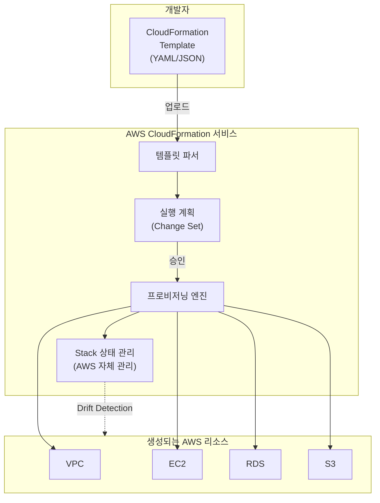
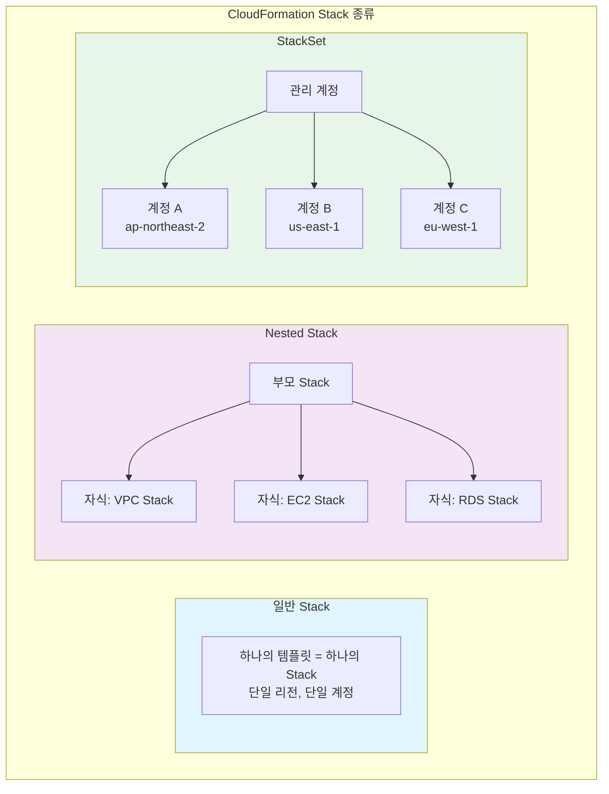
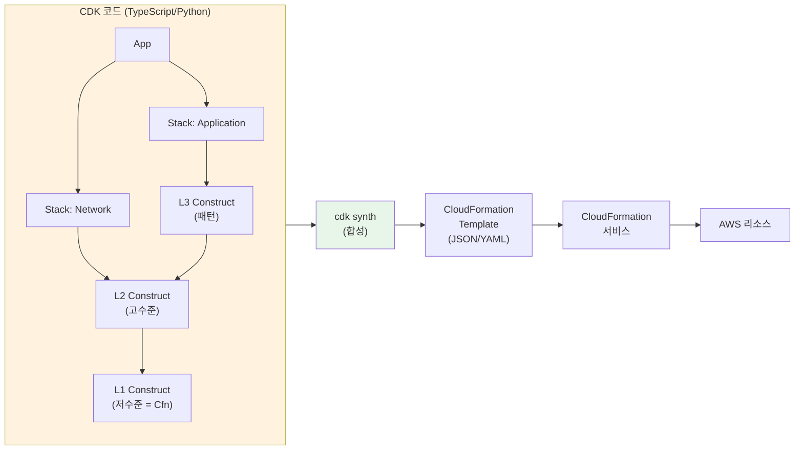
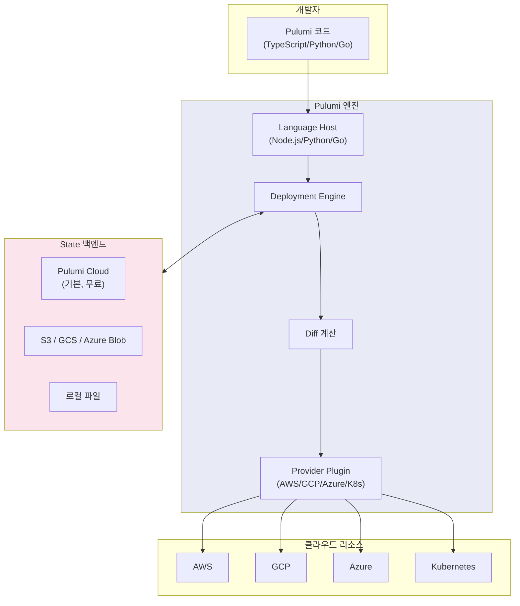
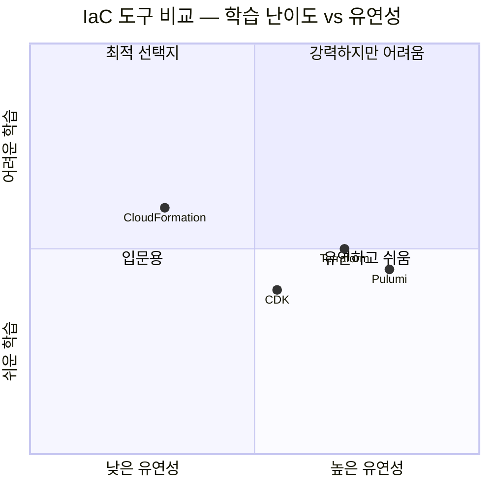
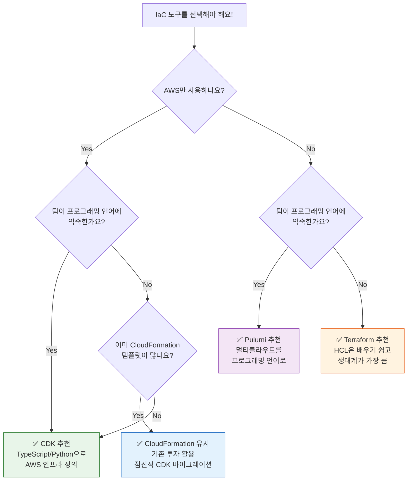

# CloudFormation / CDK / Pulumi

> [이전 강의](./04-ansible)에서 Ansible로 서버 구성 관리를 배웠어요. 이번에는 AWS 네이티브 IaC 도구인 **CloudFormation**, 프로그래밍 언어로 인프라를 정의하는 **CDK**, 그리고 멀티클라우드를 지원하는 **Pulumi**를 알아볼게요. [IaC 개념](./01-concept)과 [Terraform](./02-terraform-basics)을 이미 배웠으니, 이 도구들이 어떻게 다르고 언제 어떤 걸 선택해야 하는지 비교해볼게요.

---

## 🎯 왜 CloudFormation / CDK / Pulumi를 알아야 하나요?

```
이 도구들이 필요한 순간:
• "우리 회사는 AWS만 쓰는데, Terraform 말고 다른 선택지는 없나요?"    → CloudFormation / CDK
• "YAML 500줄 쓰기 싫어요. 코드로 인프라 짜고 싶어요"               → CDK / Pulumi
• "if문이나 for문으로 인프라를 조건부 생성하고 싶어요"                → CDK / Pulumi
• "GCP랑 AWS를 동시에 관리해야 해요"                                → Pulumi / Terraform
• "새 서비스 출시 당일에 CloudFormation 지원이 나와요"               → CloudFormation (AWS 네이티브)
• "인프라 코드에도 유닛 테스트를 달고 싶어요"                        → CDK / Pulumi
• 면접: "CloudFormation vs Terraform 차이는?"                       → 이번 강의
```

### 일상 비유: 집 짓기 도구

집을 짓는다고 생각해볼게요.

| 도구 | 비유 | 설명 |
|------|------|------|
| **CloudFormation** | AWS 전용 설계도 (종이 도면) | AWS가 직접 만든 청사진 양식. JSON/YAML로 빈칸을 채우면 AWS가 알아서 지어줘요 |
| **CDK** | 프로그래밍으로 설계도 자동 생성 | TypeScript/Python 코드를 짜면 CloudFormation 설계도가 자동으로 나와요 |
| **Pulumi** | 멀티 건설사 통합 설계 프로그램 | AWS뿐 아니라 GCP, Azure 건물도 같은 코드로 설계할 수 있어요 |
| **Terraform** | 범용 설계 전문 언어 (HCL) | 모든 건설사에 통하는 전용 설계 언어. 가장 널리 쓰여요 |

---

## 🧠 핵심 개념 잡기

### 1. CloudFormation — "AWS 전용 설계도"

AWS가 직접 만든 IaC 서비스예요. JSON 또는 YAML로 **템플릿(Template)** 을 작성하면, AWS가 그걸 읽어서 리소스를 생성/수정/삭제해줘요. AWS 콘솔에서 수동으로 클릭하는 모든 작업을 코드로 표현할 수 있어요.

> **비유**: 이케아 조립 설명서. 정해진 양식(YAML)에 따라 부품(리소스)을 나열하면, AWS라는 조립 로봇이 순서대로 만들어줘요.

### 2. CDK (Cloud Development Kit) — "프로그래밍 언어로 설계"

CloudFormation YAML을 직접 쓰는 대신, TypeScript/Python/Java/Go 같은 **프로그래밍 언어**로 인프라를 정의해요. CDK가 이 코드를 CloudFormation 템플릿으로 **변환(Synth)** 해줘요.

> **비유**: 3D 모델링 프로그램. 코드로 설계하면 2D 도면(CloudFormation)이 자동으로 출력돼요. 반복문, 조건문, 함수 등 프로그래밍의 모든 장점을 활용할 수 있어요.

### 3. Pulumi — "멀티클라우드 프로그래밍"

CDK처럼 프로그래밍 언어로 인프라를 정의하지만, AWS 뿐만 아니라 **GCP, Azure, Kubernetes** 등 모든 클라우드를 지원해요. CloudFormation에 의존하지 않고, Pulumi 자체 엔진으로 배포해요.

> **비유**: 유니버설 리모컨. 삼성 TV(AWS), LG TV(GCP), 소니 TV(Azure) 모두 하나의 리모컨(Pulumi)으로 조작할 수 있어요.

### 4. Stack — "배포 단위"

세 도구 모두 **Stack**이라는 개념으로 리소스를 묶어서 관리해요. Stack 하나가 "이 리소스들은 한 세트야"라는 의미예요. 생성/수정/삭제가 Stack 단위로 이루어져요.

> **비유**: 이사할 때 박스. "주방 박스", "거실 박스"처럼 관련 물건을 한 박스에 담으면 관리가 편해요.

### 5. State — "현재 인프라 상태 기록"

도구가 "지금 인프라가 어떤 상태인지" 기억하는 파일이에요. Terraform은 `.tfstate` 파일, Pulumi는 Pulumi Service 또는 파일, CloudFormation은 AWS가 자체적으로 관리해줘요.

> **비유**: 가계부. 지금 통장에 얼마 있는지 기록해둬야 다음에 입출금할 때 계산이 맞아요.

---

## 🔍 하나씩 자세히 알아보기

### 1. AWS CloudFormation

#### 전체 아키텍처



#### 템플릿 구조

CloudFormation 템플릿은 정해진 섹션으로 구성돼요.

```yaml
# CloudFormation 템플릿의 전체 구조
AWSTemplateFormatVersion: "2010-09-09"   # 템플릿 버전 (항상 이 값)
Description: "우리 서비스의 인프라 설계도"   # 설명

# 1) Parameters: 배포 시 입력받는 값
Parameters:
  Environment:
    Type: String
    Default: dev
    AllowedValues: [dev, staging, prod]
    Description: "배포 환경"

  InstanceType:
    Type: String
    Default: t3.micro
    Description: "EC2 인스턴스 타입"

# 2) Mappings: 조건별 값 매핑 (lookup table)
Mappings:
  RegionAMI:
    ap-northeast-2:
      HVM64: ami-0c9c942bd7bf113a2
    us-east-1:
      HVM64: ami-0b72fcfdb4020e8b4

# 3) Conditions: 조건부 리소스 생성
Conditions:
  IsProd: !Equals [!Ref Environment, prod]

# 4) Resources: 실제 생성할 AWS 리소스 (필수!)
Resources:
  MyVPC:
    Type: AWS::EC2::VPC
    Properties:
      CidrBlock: 10.0.0.0/16
      Tags:
        - Key: Name
          Value: !Sub "${Environment}-vpc"

  MyInstance:
    Type: AWS::EC2::Instance
    Properties:
      InstanceType: !Ref InstanceType
      ImageId: !FindInMap [RegionAMI, !Ref "AWS::Region", HVM64]

  # prod일 때만 생성
  ProdAlarm:
    Type: AWS::CloudWatch::Alarm
    Condition: IsProd
    Properties:
      AlarmName: !Sub "${Environment}-cpu-alarm"
      MetricName: CPUUtilization
      Namespace: AWS/EC2
      Statistic: Average
      Period: 300
      EvaluationPeriods: 2
      Threshold: 80
      ComparisonOperator: GreaterThanThreshold

# 5) Outputs: 생성 후 출력할 값
Outputs:
  VPCId:
    Description: "생성된 VPC ID"
    Value: !Ref MyVPC
    Export:
      Name: !Sub "${Environment}-vpc-id"   # 다른 Stack에서 참조 가능

  InstancePublicIP:
    Description: "EC2 퍼블릭 IP"
    Value: !GetAtt MyInstance.PublicIp
```

#### 주요 내장 함수

```yaml
# !Ref — 파라미터나 리소스의 ID 참조
Value: !Ref MyVPC                    # vpc-0abc1234 같은 ID 반환

# !Sub — 문자열 치환 (변수 삽입)
Value: !Sub "${Environment}-web-server"   # "prod-web-server"

# !GetAtt — 리소스의 속성 참조
Value: !GetAtt MyInstance.PublicIp        # "54.180.x.x"
Value: !GetAtt MyInstance.AvailabilityZone  # "ap-northeast-2a"

# !Join — 문자열 합치기
Value: !Join ["-", [!Ref Environment, "web", "sg"]]  # "prod-web-sg"

# !Select — 리스트에서 선택
Value: !Select [0, !GetAZs ""]            # 첫 번째 가용영역

# Fn::If — 조건부 값
Value: !If [IsProd, t3.large, t3.micro]   # prod면 large, 아니면 micro

# !ImportValue — 다른 Stack의 Output 참조
Value: !ImportValue "prod-vpc-id"
```

#### Stack, StackSet, Nested Stack



| 종류 | 비유 | 용도 |
|------|------|------|
| **Stack** | 하나의 이사 박스 | 기본 단위. 하나의 템플릿으로 리소스 묶음 관리 |
| **Nested Stack** | 박스 안의 작은 박스들 | 큰 인프라를 모듈화. VPC Stack + App Stack + DB Stack |
| **StackSet** | 여러 집에 같은 박스 배달 | 멀티 계정/멀티 리전에 동일 인프라 배포 |

#### Change Set 워크플로우

기존 Stack을 수정할 때, **Change Set**을 먼저 만들어서 "뭐가 바뀔지" 미리 확인할 수 있어요. 실수로 DB를 삭제하는 사고를 막아줘요.

```bash
# 1단계: Change Set 생성 (아직 적용 안 됨)
aws cloudformation create-change-set \
  --stack-name my-stack \
  --change-set-name update-instance-type \
  --template-body file://template.yaml \
  --parameters ParameterKey=InstanceType,ParameterValue=t3.large

# 출력:
# {
#     "StackId": "arn:aws:cloudformation:ap-northeast-2:123456789012:stack/my-stack/...",
#     "Id": "arn:aws:cloudformation:ap-northeast-2:123456789012:changeSet/update-instance-type/..."
# }

# 2단계: Change Set 내용 확인
aws cloudformation describe-change-set \
  --stack-name my-stack \
  --change-set-name update-instance-type

# 출력 (어떤 리소스가 어떻게 바뀌는지 보여줌):
# {
#     "Changes": [
#         {
#             "Type": "Resource",
#             "ResourceChange": {
#                 "Action": "Modify",           ← 수정됨
#                 "LogicalResourceId": "MyInstance",
#                 "ResourceType": "AWS::EC2::Instance",
#                 "Replacement": "True"          ← 교체 필요! (인스턴스 재생성)
#             }
#         }
#     ]
# }

# 3단계: 확인 후 적용
aws cloudformation execute-change-set \
  --stack-name my-stack \
  --change-set-name update-instance-type

# 4단계: 배포 상태 확인
aws cloudformation describe-stacks --stack-name my-stack
# Status: UPDATE_COMPLETE
```

#### Drift Detection (드리프트 감지)

CloudFormation으로 만든 리소스를 누군가 콘솔에서 **수동으로 변경**하면, 템플릿과 실제 상태가 달라져요. 이걸 **Drift(드리프트)** 라고 해요.

```bash
# 드리프트 감지 시작
aws cloudformation detect-stack-drift --stack-name my-stack
# 출력: { "StackDriftDetectionId": "abc123" }

# 감지 결과 확인
aws cloudformation describe-stack-drift-detection-status \
  --stack-drift-detection-id abc123
# 출력:
# {
#     "StackDriftStatus": "DRIFTED",         ← 드리프트 발생!
#     "DriftedStackResourceCount": 1
# }

# 어떤 리소스가 드리프트했는지 확인
aws cloudformation describe-stack-resource-drifts \
  --stack-name my-stack \
  --stack-resource-drift-status-filters MODIFIED
# 출력:
# {
#     "PropertyDifferences": [
#         {
#             "PropertyPath": "/InstanceType",
#             "ExpectedValue": "t3.micro",    ← 템플릿 값
#             "ActualValue": "t3.large",       ← 실제 값 (누가 바꿈!)
#             "DifferenceType": "NOT_EQUAL"
#         }
#     ]
# }
```

---

### 2. AWS CDK (Cloud Development Kit)

#### CDK 아키텍처

CDK는 프로그래밍 언어로 인프라를 정의하면, 내부적으로 CloudFormation 템플릿을 생성해서 배포해요.



#### L1 / L2 / L3 Construct 레벨

CDK의 핵심은 **Construct**예요. 레벨이 높을수록 추상화가 강해져요.

| 레벨 | 이름 | 비유 | 설명 |
|------|------|------|------|
| **L1** | CfnXxx | 레고 블럭 낱개 | CloudFormation 리소스와 1:1 대응. 모든 속성을 직접 지정 |
| **L2** | 일반 Construct | 레고 조립 세트 | 합리적 기본값 + 편의 메서드. 가장 많이 사용 |
| **L3** | Pattern | 완성된 레고 작품 | 여러 리소스를 묶은 고수준 패턴 (예: ApplicationLoadBalancedFargateService) |

```typescript
import * as s3 from 'aws-cdk-lib/aws-s3';
import * as ec2 from 'aws-cdk-lib/aws-ec2';

// L1: CloudFormation 리소스와 1:1 (접두사 Cfn)
// 모든 속성을 일일이 지정해야 해요
const cfnBucket = new s3.CfnBucket(this, 'L1Bucket', {
  bucketName: 'my-l1-bucket',
  versioningConfiguration: {
    status: 'Enabled',
  },
  publicAccessBlockConfiguration: {
    blockPublicAcls: true,
    blockPublicPolicy: true,
    ignorePublicAcls: true,
    restrictPublicBuckets: true,
  },
});

// L2: 합리적 기본값 + 편의 메서드
// 퍼블릭 접근 차단, 암호화 등이 기본 설정돼요
const bucket = new s3.Bucket(this, 'L2Bucket', {
  versioned: true,                    // 간단한 옵션
  removalPolicy: cdk.RemovalPolicy.DESTROY,
  autoDeleteObjects: true,            // L1에는 없는 편의 기능
});

// L3: 여러 리소스를 한 번에 (Pattern)
// ALB + Fargate + VPC + Security Group을 한 줄로
import * as ecsPatterns from 'aws-cdk-lib/aws-ecs-patterns';

const service = new ecsPatterns.ApplicationLoadBalancedFargateService(
  this, 'L3Service', {
    taskImageOptions: {
      image: ecs.ContainerImage.fromRegistry('nginx'),
    },
    publicLoadBalancer: true,
  }
);
// → 내부적으로 VPC, ALB, Target Group, Fargate Task, Security Group 등 자동 생성
```

#### CDK CLI 명령어

```bash
# CDK 설치
npm install -g aws-cdk

# 프로젝트 초기화
mkdir my-cdk-app && cd my-cdk-app
cdk init app --language typescript    # 또는 python, java, go

# 프로젝트 구조:
# my-cdk-app/
# ├── bin/
# │   └── my-cdk-app.ts       ← App 진입점
# ├── lib/
# │   └── my-cdk-app-stack.ts ← Stack 정의
# ├── test/
# │   └── my-cdk-app.test.ts  ← 테스트
# ├── cdk.json                 ← CDK 설정
# ├── package.json
# └── tsconfig.json

# CDK Bootstrap (리전당 최초 1회)
# CDK가 사용할 S3 버킷, ECR 등을 생성해요
cdk bootstrap aws://123456789012/ap-northeast-2
# 출력:
# ⏳  Bootstrapping environment aws://123456789012/ap-northeast-2...
# ✅  Environment aws://123456789012/ap-northeast-2 bootstrapped

# CloudFormation 템플릿 생성 (합성)
cdk synth
# 출력: cdk.out/ 디렉토리에 CloudFormation JSON 생성

# 변경사항 미리보기 (diff)
cdk diff
# 출력:
# Stack MyCdkAppStack
# Resources
# [+] AWS::S3::Bucket MyBucket MyBucket560B80BC
# [+] AWS::Lambda::Function MyFunction MyFunction3BAA72D1

# 배포
cdk deploy
# 출력:
# MyCdkAppStack: deploying...
# MyCdkAppStack: creating CloudFormation changeset...
# ✅  MyCdkAppStack
# Outputs:
# MyCdkAppStack.BucketName = my-cdk-app-mybucket560b80bc-abc123

# 모든 스택 배포
cdk deploy --all

# 삭제
cdk destroy
# 출력:
# Are you sure you want to delete: MyCdkAppStack (y/n)? y
# MyCdkAppStack: destroying...
# ✅  MyCdkAppStack: destroyed
```

#### CDK in Python

```python
# app.py
import aws_cdk as cdk
from my_stack import MyStack

app = cdk.App()
MyStack(app, "MyStack", env=cdk.Environment(
    account="123456789012",
    region="ap-northeast-2"
))
app.synth()
```

```python
# my_stack.py
from aws_cdk import (
    Stack, Duration, RemovalPolicy,
    aws_s3 as s3,
    aws_lambda as _lambda,  # lambda는 Python 예약어라 _lambda
    aws_ec2 as ec2,
)
from constructs import Construct

class MyStack(Stack):
    def __init__(self, scope: Construct, id: str, **kwargs):
        super().__init__(scope, id, **kwargs)

        # S3 버킷 생성
        bucket = s3.Bucket(
            self, "DataBucket",
            versioned=True,
            removal_policy=RemovalPolicy.DESTROY,
            auto_delete_objects=True,
        )

        # Lambda 함수 생성
        handler = _lambda.Function(
            self, "Handler",
            runtime=_lambda.Runtime.PYTHON_3_12,
            code=_lambda.Code.from_asset("lambda"),
            handler="index.handler",
            timeout=Duration.seconds(30),
            memory_size=256,
            environment={
                "BUCKET_NAME": bucket.bucket_name,
            },
        )

        # S3 버킷 읽기 권한을 Lambda에 부여
        # CDK가 IAM 정책을 자동으로 생성해줘요!
        bucket.grant_read(handler)
```

---

### 3. Pulumi

#### Pulumi 아키텍처

Pulumi는 CloudFormation에 의존하지 않고, **Pulumi 엔진**이 직접 클라우드 API를 호출해요.



#### Pulumi CLI 명령어

```bash
# Pulumi 설치
curl -fsSL https://get.pulumi.com | sh
# 또는
brew install pulumi

# 새 프로젝트 생성
mkdir my-pulumi-app && cd my-pulumi-app
pulumi new aws-typescript    # aws-python, aws-go 등
# 출력:
# project name: (my-pulumi-app)
# project description: My first Pulumi project
# stack name: (dev)
# aws:region: ap-northeast-2
# Created project 'my-pulumi-app'
# Installing dependencies...
# Finished installing dependencies

# 프로젝트 구조:
# my-pulumi-app/
# ├── index.ts          ← 인프라 코드
# ├── Pulumi.yaml       ← 프로젝트 설정
# ├── Pulumi.dev.yaml   ← dev 스택 설정
# ├── package.json
# └── tsconfig.json

# 변경사항 미리보기
pulumi preview
# 출력:
# Previewing update (dev):
#   Type                 Name              Plan
# + pulumi:pulumi:Stack  my-pulumi-app-dev create
# + └─ aws:s3:Bucket     my-bucket         create
#
# Resources:
#     + 2 to create

# 배포
pulumi up
# 출력:
# Updating (dev):
#   Type                 Name              Status
# + pulumi:pulumi:Stack  my-pulumi-app-dev created
# + └─ aws:s3:Bucket     my-bucket         created
#
# Outputs:
#     bucketName: "my-bucket-abc1234"
#
# Resources:
#     + 2 created
# Duration: 12s

# 출력값 확인
pulumi stack output bucketName
# 출력: my-bucket-abc1234

# 삭제
pulumi destroy
# 출력:
# Destroying (dev):
#   Type                 Name              Status
# - pulumi:pulumi:Stack  my-pulumi-app-dev deleted
# - └─ aws:s3:Bucket     my-bucket         deleted
#
# Resources:
#     - 2 deleted

# 스택 관리
pulumi stack ls          # 스택 목록
pulumi stack select prod # 스택 전환
pulumi config set aws:region us-east-1  # 설정 변경
```

#### Pulumi in Python

```python
# __main__.py
import pulumi
import pulumi_aws as aws

# S3 버킷 생성
bucket = aws.s3.Bucket("my-bucket",
    versioning=aws.s3.BucketVersioningArgs(
        enabled=True,
    ),
    tags={
        "Environment": "dev",
        "ManagedBy": "pulumi",
    },
)

# Lambda 함수 생성
lambda_role = aws.iam.Role("lambda-role",
    assume_role_policy="""{
        "Version": "2012-10-17",
        "Statement": [{
            "Action": "sts:AssumeRole",
            "Effect": "Allow",
            "Principal": { "Service": "lambda.amazonaws.com" }
        }]
    }""",
)

# IAM 정책 연결
aws.iam.RolePolicyAttachment("lambda-basic",
    role=lambda_role.name,
    policy_arn="arn:aws:iam::aws:policy/service-role/AWSLambdaBasicExecutionRole",
)

handler = aws.lambda_.Function("my-handler",
    runtime="python3.12",
    handler="index.handler",
    role=lambda_role.arn,
    code=pulumi.AssetArchive({
        ".": pulumi.FileArchive("./lambda"),
    }),
    environment=aws.lambda_.FunctionEnvironmentArgs(
        variables={
            "BUCKET_NAME": bucket.id,  # 자동으로 의존성 추적!
        },
    ),
)

# 출력값 내보내기
pulumi.export("bucket_name", bucket.id)
pulumi.export("lambda_arn", handler.arn)
```

#### Pulumi in TypeScript

```typescript
// index.ts
import * as pulumi from "@pulumi/pulumi";
import * as aws from "@pulumi/aws";

// VPC 생성
const vpc = new aws.ec2.Vpc("my-vpc", {
    cidrBlock: "10.0.0.0/16",
    enableDnsHostnames: true,
    tags: { Name: "pulumi-vpc" },
});

// 서브넷 생성 (반복문 활용)
const azs = ["ap-northeast-2a", "ap-northeast-2c"];
const publicSubnets = azs.map((az, index) =>
    new aws.ec2.Subnet(`public-${index}`, {
        vpcId: vpc.id,
        cidrBlock: `10.0.${index + 1}.0/24`,
        availabilityZone: az,
        mapPublicIpOnLaunch: true,
        tags: { Name: `public-${az}` },
    })
);

// 보안 그룹
const sg = new aws.ec2.SecurityGroup("web-sg", {
    vpcId: vpc.id,
    ingress: [{
        protocol: "tcp",
        fromPort: 80,
        toPort: 80,
        cidrBlocks: ["0.0.0.0/0"],
    }],
    egress: [{
        protocol: "-1",
        fromPort: 0,
        toPort: 0,
        cidrBlocks: ["0.0.0.0/0"],
    }],
});

// 출력
export const vpcId = vpc.id;
export const subnetIds = publicSubnets.map(s => s.id);
```

#### CrossGuard (Policy as Code)

Pulumi CrossGuard는 인프라에 정책을 적용해서, 규칙에 어긋나는 배포를 막아줘요.

```typescript
// policy-pack/index.ts
import * as policy from "@pulumi/policy";

new policy.PolicyPack("security-policies", {
    policies: [
        // S3 버킷은 반드시 퍼블릭 접근 차단
        {
            name: "s3-no-public-read",
            description: "S3 버킷은 퍼블릭 읽기가 금지되어 있어요",
            enforcementLevel: "mandatory",  // mandatory = 위반 시 배포 차단
            validateResource: policy.validateResourceOfType(
                "aws:s3/bucket:Bucket",
                (bucket, args, reportViolation) => {
                    if (bucket.acl === "public-read" ||
                        bucket.acl === "public-read-write") {
                        reportViolation("S3 버킷에 퍼블릭 ACL을 사용할 수 없어요");
                    }
                }
            ),
        },
        // EC2 인스턴스는 t3.micro 이상만 허용
        {
            name: "ec2-instance-type-check",
            description: "허용된 인스턴스 타입만 사용할 수 있어요",
            enforcementLevel: "advisory",  // advisory = 경고만
            validateResource: policy.validateResourceOfType(
                "aws:ec2/instance:Instance",
                (instance, args, reportViolation) => {
                    const allowed = ["t3.micro", "t3.small", "t3.medium"];
                    if (!allowed.includes(instance.instanceType)) {
                        reportViolation(
                            `인스턴스 타입 ${instance.instanceType}은 허용되지 않아요`
                        );
                    }
                }
            ),
        },
    ],
});
```

```bash
# Policy Pack 적용하여 배포
pulumi up --policy-pack ./policy-pack
# 출력:
# Policy Violations:
#     [mandatory]  security-policies  s3-no-public-read
#     S3 버킷에 퍼블릭 ACL을 사용할 수 없어요
# error: update failed: 1 policy violation(s)
```

---

### 4. 도구 비교 총정리

#### 비교 매트릭스



| 항목 | CloudFormation | CDK | Terraform | Pulumi |
|------|----------------|-----|-----------|--------|
| **제공사** | AWS | AWS | HashiCorp | Pulumi Inc. |
| **언어** | JSON / YAML | TypeScript, Python, Java, Go, C# | HCL (자체 언어) | TypeScript, Python, Go, C#, Java |
| **멀티클라우드** | AWS 전용 | AWS 전용 | 모든 클라우드 | 모든 클라우드 |
| **State 관리** | AWS 자체 관리 | AWS 자체 관리 (CloudFormation) | 파일 / S3 / Terraform Cloud | Pulumi Cloud / S3 / 로컬 |
| **새 서비스 지원** | 출시 당일 | 출시 후 ~1주 | 출시 후 ~1-4주 | 출시 후 ~1-2주 |
| **프로그래밍 기능** | 제한적 (Fn::If 등) | 완전한 프로그래밍 | 제한적 (for_each, dynamic) | 완전한 프로그래밍 |
| **테스트** | TaskCat | 유닛 테스트 가능 | Terratest | 유닛 테스트 가능 |
| **학습 곡선** | 중간 (YAML 길어짐) | 낮음 (언어 알면 쉬움) | 중간 (HCL 배워야 함) | 낮음 (언어 알면 쉬움) |
| **커뮤니티** | 보통 | 성장 중 | 매우 큼 | 성장 중 |
| **비용** | 무료 | 무료 | 오픈소스 무료 / Enterprise 유료 | 개인 무료 / Team 유료 |
| **기업 채택률** | 높음 (AWS 고객) | 성장 중 | 매우 높음 | 성장 중 |
| **Policy as Code** | AWS Config Rules | CDK Aspects | Sentinel / OPA | CrossGuard |

#### 의사결정 트리



---

## 💻 직접 해보기

### 실습 1: CloudFormation으로 VPC + EC2 생성

#### Step 1: 템플릿 파일 작성

```yaml
# cfn-vpc-ec2.yaml
AWSTemplateFormatVersion: "2010-09-09"
Description: "VPC + Public Subnet + EC2 실습"

Parameters:
  Environment:
    Type: String
    Default: dev
    AllowedValues: [dev, staging, prod]

  KeyPairName:
    Type: AWS::EC2::KeyPair::KeyName
    Description: "SSH 접속용 키페어 이름"

Resources:
  # ========== VPC ==========
  VPC:
    Type: AWS::EC2::VPC
    Properties:
      CidrBlock: 10.0.0.0/16
      EnableDnsSupport: true
      EnableDnsHostnames: true
      Tags:
        - Key: Name
          Value: !Sub "${Environment}-vpc"

  # ========== Internet Gateway ==========
  IGW:
    Type: AWS::EC2::InternetGateway
    Properties:
      Tags:
        - Key: Name
          Value: !Sub "${Environment}-igw"

  IGWAttachment:
    Type: AWS::EC2::VPCGatewayAttachment
    Properties:
      VpcId: !Ref VPC
      InternetGatewayId: !Ref IGW

  # ========== Public Subnet ==========
  PublicSubnet:
    Type: AWS::EC2::Subnet
    Properties:
      VpcId: !Ref VPC
      CidrBlock: 10.0.1.0/24
      AvailabilityZone: !Select [0, !GetAZs ""]
      MapPublicIpOnLaunch: true
      Tags:
        - Key: Name
          Value: !Sub "${Environment}-public-subnet"

  # ========== Route Table ==========
  PublicRouteTable:
    Type: AWS::EC2::RouteTable
    Properties:
      VpcId: !Ref VPC
      Tags:
        - Key: Name
          Value: !Sub "${Environment}-public-rt"

  PublicRoute:
    Type: AWS::EC2::Route
    DependsOn: IGWAttachment
    Properties:
      RouteTableId: !Ref PublicRouteTable
      DestinationCidrBlock: 0.0.0.0/0
      GatewayId: !Ref IGW

  PublicSubnetRTAssociation:
    Type: AWS::EC2::SubnetRouteTableAssociation
    Properties:
      SubnetId: !Ref PublicSubnet
      RouteTableId: !Ref PublicRouteTable

  # ========== Security Group ==========
  WebSG:
    Type: AWS::EC2::SecurityGroup
    Properties:
      GroupDescription: "Allow HTTP and SSH"
      VpcId: !Ref VPC
      SecurityGroupIngress:
        - IpProtocol: tcp
          FromPort: 80
          ToPort: 80
          CidrIp: 0.0.0.0/0
        - IpProtocol: tcp
          FromPort: 22
          ToPort: 22
          CidrIp: 0.0.0.0/0    # 실무에서는 특정 IP로 제한하세요!
      Tags:
        - Key: Name
          Value: !Sub "${Environment}-web-sg"

  # ========== EC2 Instance ==========
  WebServer:
    Type: AWS::EC2::Instance
    Properties:
      InstanceType: t3.micro
      ImageId: ami-0c9c942bd7bf113a2    # Amazon Linux 2023 (서울)
      KeyName: !Ref KeyPairName
      SubnetId: !Ref PublicSubnet
      SecurityGroupIds:
        - !Ref WebSG
      UserData:
        Fn::Base64: !Sub |
          #!/bin/bash
          yum update -y
          yum install -y httpd
          systemctl start httpd
          systemctl enable httpd
          echo "<h1>Hello from ${Environment} - CloudFormation!</h1>" > /var/www/html/index.html
      Tags:
        - Key: Name
          Value: !Sub "${Environment}-web-server"

Outputs:
  VPCId:
    Description: "생성된 VPC ID"
    Value: !Ref VPC

  PublicIP:
    Description: "EC2 퍼블릭 IP"
    Value: !GetAtt WebServer.PublicIp

  WebURL:
    Description: "웹 서버 접속 URL"
    Value: !Sub "http://${WebServer.PublicIp}"
```

#### Step 2: 배포 실행

```bash
# Stack 생성
aws cloudformation create-stack \
  --stack-name dev-web-stack \
  --template-body file://cfn-vpc-ec2.yaml \
  --parameters \
    ParameterKey=Environment,ParameterValue=dev \
    ParameterKey=KeyPairName,ParameterValue=my-key

# 출력:
# {
#     "StackId": "arn:aws:cloudformation:ap-northeast-2:123456789012:stack/dev-web-stack/..."
# }

# 생성 진행 상태 확인 (이벤트 스트리밍)
aws cloudformation describe-stack-events \
  --stack-name dev-web-stack \
  --query "StackEvents[?ResourceStatus=='CREATE_COMPLETE'].[LogicalResourceId,ResourceType]" \
  --output table

# 출력:
# ---------------------------------------------------------
# |                  DescribeStackEvents                   |
# +-----------------------+-------------------------------+
# |  VPC                  |  AWS::EC2::VPC                |
# |  IGW                  |  AWS::EC2::InternetGateway    |
# |  PublicSubnet         |  AWS::EC2::Subnet             |
# |  WebSG                |  AWS::EC2::SecurityGroup      |
# |  WebServer            |  AWS::EC2::Instance           |
# |  dev-web-stack        |  AWS::CloudFormation::Stack   |
# +-----------------------+-------------------------------+

# 생성 완료 대기
aws cloudformation wait stack-create-complete --stack-name dev-web-stack

# Output 값 확인
aws cloudformation describe-stacks \
  --stack-name dev-web-stack \
  --query "Stacks[0].Outputs" \
  --output table

# 출력:
# -------------------------------------------------------
# |                    DescribeStacks                    |
# +------------+----------------------------------------+
# |  OutputKey |  OutputValue                           |
# +------------+----------------------------------------+
# |  VPCId     |  vpc-0abc1234def56789                  |
# |  PublicIP  |  54.180.123.45                         |
# |  WebURL    |  http://54.180.123.45                  |
# +------------+----------------------------------------+

# 정리 (리소스 삭제)
aws cloudformation delete-stack --stack-name dev-web-stack
aws cloudformation wait stack-delete-complete --stack-name dev-web-stack
```

---

### 실습 2: CDK로 S3 + Lambda 생성

#### Step 1: CDK 프로젝트 초기화

```bash
# 프로젝트 생성
mkdir cdk-s3-lambda && cd cdk-s3-lambda
cdk init app --language typescript

# 필요한 패키지 설치
npm install aws-cdk-lib constructs
```

#### Step 2: Stack 코드 작성

```typescript
// lib/cdk-s3-lambda-stack.ts
import * as cdk from 'aws-cdk-lib';
import * as s3 from 'aws-cdk-lib/aws-s3';
import * as lambda from 'aws-cdk-lib/aws-lambda';
import * as s3n from 'aws-cdk-lib/aws-s3-notifications';
import { Construct } from 'constructs';

export class CdkS3LambdaStack extends cdk.Stack {
  constructor(scope: Construct, id: string, props?: cdk.StackProps) {
    super(scope, id, props);

    // S3 버킷 생성
    const bucket = new s3.Bucket(this, 'UploadBucket', {
      bucketName: `upload-bucket-${this.account}-${this.region}`,
      versioned: true,
      removalPolicy: cdk.RemovalPolicy.DESTROY,   // 실습용 (프로덕션은 RETAIN)
      autoDeleteObjects: true,                      // Stack 삭제 시 객체도 삭제
      lifecycleRules: [{
        expiration: cdk.Duration.days(30),          // 30일 후 자동 삭제
      }],
    });

    // Lambda 함수 생성
    const processor = new lambda.Function(this, 'FileProcessor', {
      runtime: lambda.Runtime.PYTHON_3_12,
      handler: 'index.handler',
      code: lambda.Code.fromInline(`
import json
import urllib.parse

def handler(event, context):
    for record in event['Records']:
        bucket_name = record['s3']['bucket']['name']
        key = urllib.parse.unquote_plus(record['s3']['object']['key'])
        size = record['s3']['object']['size']
        print(f"New file uploaded: s3://{bucket_name}/{key} ({size} bytes)")
    return {
        'statusCode': 200,
        'body': json.dumps('File processed successfully')
    }
      `),
      timeout: cdk.Duration.seconds(30),
      memorySize: 128,
      environment: {
        BUCKET_NAME: bucket.bucketName,
      },
    });

    // S3 → Lambda 이벤트 연결
    // CDK가 자동으로 Lambda 권한(InvokeFunction)을 설정해줘요!
    bucket.addEventNotification(
      s3.EventType.OBJECT_CREATED,
      new s3n.LambdaDestination(processor),
    );

    // S3 읽기 권한 부여
    bucket.grantRead(processor);

    // 출력
    new cdk.CfnOutput(this, 'BucketName', {
      value: bucket.bucketName,
      description: '생성된 S3 버킷 이름',
    });

    new cdk.CfnOutput(this, 'FunctionName', {
      value: processor.functionName,
      description: 'Lambda 함수 이름',
    });
  }
}
```

#### Step 3: 배포 및 테스트

```bash
# CloudFormation 템플릿 미리보기
cdk synth

# 변경사항 확인
cdk diff
# 출력:
# Stack CdkS3LambdaStack
# Resources
# [+] AWS::S3::Bucket UploadBucket UploadBucketXXXXXX
# [+] AWS::Lambda::Function FileProcessor FileProcessorXXXXXX
# [+] AWS::Lambda::Permission UploadBucket/Notifications/...
# [+] AWS::IAM::Role FileProcessor/ServiceRole ...
# [+] AWS::IAM::Policy FileProcessor/ServiceRole/DefaultPolicy ...

# 배포
cdk deploy
# 출력:
# CdkS3LambdaStack: deploying...
# CdkS3LambdaStack: creating CloudFormation changeset...
# ✅  CdkS3LambdaStack
#
# Outputs:
# CdkS3LambdaStack.BucketName = upload-bucket-123456789012-ap-northeast-2
# CdkS3LambdaStack.FunctionName = CdkS3LambdaStack-FileProcessor-abc123

# 테스트: 파일 업로드
aws s3 cp test.txt s3://upload-bucket-123456789012-ap-northeast-2/

# Lambda 로그 확인
aws logs tail /aws/lambda/CdkS3LambdaStack-FileProcessor-abc123 --follow
# 출력:
# New file uploaded: s3://upload-bucket-.../test.txt (1234 bytes)

# 정리
cdk destroy
```

---

### 실습 3: Pulumi로 S3 + Lambda 생성

#### Step 1: Pulumi 프로젝트 초기화

```bash
mkdir pulumi-s3-lambda && cd pulumi-s3-lambda
pulumi new aws-python
# 프로젝트 이름: pulumi-s3-lambda
# 스택 이름: dev
# 리전: ap-northeast-2
```

#### Step 2: 인프라 코드 작성

```python
# __main__.py
import json
import pulumi
import pulumi_aws as aws

# S3 버킷 생성
bucket = aws.s3.BucketV2("upload-bucket",
    tags={
        "Environment": "dev",
        "ManagedBy": "pulumi",
    },
)

# 버킷 버저닝 설정
aws.s3.BucketVersioningV2("bucket-versioning",
    bucket=bucket.id,
    versioning_configuration=aws.s3.BucketVersioningV2VersioningConfigurationArgs(
        status="Enabled",
    ),
)

# Lambda IAM 역할
lambda_role = aws.iam.Role("lambda-role",
    assume_role_policy=json.dumps({
        "Version": "2012-10-17",
        "Statement": [{
            "Action": "sts:AssumeRole",
            "Effect": "Allow",
            "Principal": {"Service": "lambda.amazonaws.com"},
        }],
    }),
)

# 기본 실행 정책 연결
aws.iam.RolePolicyAttachment("lambda-basic-policy",
    role=lambda_role.name,
    policy_arn="arn:aws:iam::aws:policy/service-role/AWSLambdaBasicExecutionRole",
)

# S3 읽기 정책
aws.iam.RolePolicyAttachment("lambda-s3-read",
    role=lambda_role.name,
    policy_arn="arn:aws:iam::aws:policy/AmazonS3ReadOnlyAccess",
)

# Lambda 함수
handler = aws.lambda_.Function("file-processor",
    runtime="python3.12",
    handler="index.handler",
    role=lambda_role.arn,
    code=pulumi.AssetArchive({
        "index.py": pulumi.StringAsset("""
import json
import urllib.parse

def handler(event, context):
    for record in event['Records']:
        bucket_name = record['s3']['bucket']['name']
        key = urllib.parse.unquote_plus(record['s3']['object']['key'])
        size = record['s3']['object']['size']
        print(f"New file: s3://{bucket_name}/{key} ({size} bytes)")
    return {'statusCode': 200, 'body': 'OK'}
"""),
    }),
    environment=aws.lambda_.FunctionEnvironmentArgs(
        variables={"BUCKET_NAME": bucket.id},
    ),
)

# S3 → Lambda 이벤트 알림 권한
allow_bucket = aws.lambda_.Permission("allow-s3-invoke",
    action="lambda:InvokeFunction",
    function=handler.name,
    principal="s3.amazonaws.com",
    source_arn=bucket.arn,
)

# S3 이벤트 알림 설정
aws.s3.BucketNotification("bucket-notification",
    bucket=bucket.id,
    lambda_functions=[aws.s3.BucketNotificationLambdaFunctionArgs(
        lambda_function_arn=handler.arn,
        events=["s3:ObjectCreated:*"],
    )],
    opts=pulumi.ResourceOptions(depends_on=[allow_bucket]),
)

# 출력
pulumi.export("bucket_name", bucket.id)
pulumi.export("lambda_function_name", handler.name)
```

#### Step 3: 배포 및 테스트

```bash
# 미리보기
pulumi preview
# 출력:
# Previewing update (dev):
#   Type                             Name                    Plan
# + pulumi:pulumi:Stack              pulumi-s3-lambda-dev    create
# + ├─ aws:s3:BucketV2               upload-bucket           create
# + ├─ aws:s3:BucketVersioningV2     bucket-versioning       create
# + ├─ aws:iam:Role                  lambda-role             create
# + ├─ aws:iam:RolePolicyAttachment  lambda-basic-policy     create
# + ├─ aws:iam:RolePolicyAttachment  lambda-s3-read          create
# + ├─ aws:lambda:Function           file-processor          create
# + ├─ aws:lambda:Permission         allow-s3-invoke         create
# + └─ aws:s3:BucketNotification     bucket-notification     create
# Resources:
#     + 9 to create

# 배포
pulumi up --yes

# 정리
pulumi destroy --yes
```

---

## 🏢 실무에서는?

### 시나리오 1: 스타트업 — CDK로 빠르게 AWS 인프라 구축

**상황**: 5명 규모 스타트업. AWS만 사용하고, 팀 전원이 TypeScript 개발자.

```typescript
// 실무 예시: CDK로 일반적인 웹 서비스 인프라를 한 번에
import * as cdk from 'aws-cdk-lib';
import * as ec2 from 'aws-cdk-lib/aws-ec2';
import * as ecs from 'aws-cdk-lib/aws-ecs';
import * as ecsPatterns from 'aws-cdk-lib/aws-ecs-patterns';

export class WebServiceStack extends cdk.Stack {
  constructor(scope: Construct, id: string) {
    super(scope, id);

    // L3 Construct 하나로 VPC + ALB + Fargate + Auto Scaling 전부 생성!
    const service = new ecsPatterns.ApplicationLoadBalancedFargateService(
      this, 'WebService', {
        cpu: 256,
        memoryLimitMiB: 512,
        desiredCount: 2,
        taskImageOptions: {
          image: ecs.ContainerImage.fromAsset('./app'),  // Dockerfile 자동 빌드
          containerPort: 3000,
        },
        publicLoadBalancer: true,
      }
    );

    // Auto Scaling 설정
    const scaling = service.service.autoScaleTaskCount({ maxCapacity: 10 });
    scaling.scaleOnCpuUtilization('CpuScaling', {
      targetUtilizationPercent: 70,
    });
  }
}
```

**포인트**: CDK L3 Construct 하나로 20개 이상의 리소스가 자동 생성돼요. 스타트업처럼 빠르게 움직여야 할 때 강력해요.

---

### 시나리오 2: 대기업 — CloudFormation StackSet으로 멀티 계정 거버넌스

**상황**: 100개 이상의 AWS 계정을 운영하는 대기업. 모든 계정에 보안 기준(GuardDuty, Config, CloudTrail)을 일괄 적용해야 함.

```yaml
# security-baseline.yaml — 모든 계정에 배포할 보안 기준
AWSTemplateFormatVersion: "2010-09-09"
Description: "조직 보안 기준선"

Resources:
  # 모든 계정에 GuardDuty 활성화
  GuardDuty:
    Type: AWS::GuardDuty::Detector
    Properties:
      Enable: true
      DataSources:
        S3Logs:
          Enable: true
        Kubernetes:
          AuditLogs:
            Enable: true

  # AWS Config 활성화
  ConfigRecorder:
    Type: AWS::Config::ConfigurationRecorder
    Properties:
      RecordingGroup:
        AllSupported: true
        IncludeGlobalResourceTypes: true
      RoleARN: !GetAtt ConfigRole.Arn

  # CloudTrail 활성화
  Trail:
    Type: AWS::CloudTrail::Trail
    Properties:
      IsLogging: true
      S3BucketName: !Sub "org-cloudtrail-${AWS::AccountId}"
      EnableLogFileValidation: true
      IsMultiRegionTrail: true
```

```bash
# StackSet으로 모든 계정, 모든 리전에 일괄 배포
aws cloudformation create-stack-set \
  --stack-set-name security-baseline \
  --template-body file://security-baseline.yaml \
  --permission-model SERVICE_MANAGED \
  --auto-deployment Enabled=true,RetainStacksOnAccountRemoval=false

# 조직 전체에 배포
aws cloudformation create-stack-instances \
  --stack-set-name security-baseline \
  --deployment-targets OrganizationalUnitIds=ou-abc123 \
  --regions ap-northeast-2 us-east-1 eu-west-1
```

**포인트**: CloudFormation StackSet은 AWS Organizations와 네이티브로 연동되기 때문에, 대규모 멀티 계정 환경에서는 CloudFormation이 여전히 강력해요.

---

### 시나리오 3: 멀티클라우드 기업 — Pulumi로 AWS + GCP 통합 관리

**상황**: AWS에서 메인 서비스를 운영하고, GCP BigQuery를 데이터 분석에 사용. 두 클라우드의 인프라를 하나의 코드베이스로 관리하고 싶음.

```python
# __main__.py — AWS + GCP 통합 관리
import pulumi
import pulumi_aws as aws
import pulumi_gcp as gcp

# ===== AWS: 데이터 파이프라인 =====
# S3에 원본 데이터 저장
data_bucket = aws.s3.BucketV2("raw-data",
    tags={"Team": "data-engineering"},
)

# Kinesis로 실시간 데이터 수집
stream = aws.kinesis.Stream("event-stream",
    shard_count=2,
    retention_period=48,
)

# ===== GCP: BigQuery 분석 =====
# BigQuery 데이터셋
dataset = gcp.bigquery.Dataset("analytics",
    dataset_id="analytics_prod",
    location="asia-northeast3",    # 서울
    default_table_expiration_ms=90 * 24 * 60 * 60 * 1000,  # 90일
)

# BigQuery 테이블
table = gcp.bigquery.Table("events",
    dataset_id=dataset.dataset_id,
    table_id="user_events",
    schema="""[
        {"name": "event_id", "type": "STRING", "mode": "REQUIRED"},
        {"name": "user_id", "type": "STRING", "mode": "REQUIRED"},
        {"name": "event_type", "type": "STRING"},
        {"name": "timestamp", "type": "TIMESTAMP"}
    ]""",
)

# 출력
pulumi.export("aws_bucket", data_bucket.id)
pulumi.export("aws_stream", stream.name)
pulumi.export("gcp_dataset", dataset.dataset_id)
```

**포인트**: Pulumi는 AWS, GCP, Azure, Kubernetes를 하나의 코드에서 동시에 관리할 수 있어요. 멀티클라우드 환경에서 강력한 선택지예요.

---

## ⚠️ 자주 하는 실수

### 실수 1: CloudFormation에서 리소스 교체(Replacement)를 모르고 배포

```yaml
# 문제: 이미 운영 중인 RDS의 이름을 변경
Resources:
  MyDB:
    Type: AWS::RDS::DBInstance
    Properties:
      DBInstanceIdentifier: my-db-v2     # ← 이름 변경 = DB 삭제 후 재생성!
      Engine: mysql
      MasterUsername: admin
```

**결과**: DB가 삭제되고 새로 만들어져요. 데이터가 사라져요!

**해결법**:
1. 반드시 **Change Set**으로 미리 확인하세요
2. Change Set 결과에서 `Replacement: True`인 항목을 주의 깊게 검토하세요
3. 중요 리소스에는 `DeletionPolicy: Retain`을 설정하세요

```yaml
  MyDB:
    Type: AWS::RDS::DBInstance
    DeletionPolicy: Retain          # Stack 삭제해도 DB는 남겨둠
    UpdateReplacePolicy: Retain     # 교체가 필요해도 기존 DB 유지
    Properties:
      Engine: mysql
```

---

### 실수 2: CDK에서 cdk bootstrap을 잊고 배포 시도

```bash
# 에러 메시지:
# ❌ This stack uses assets, so the toolkit stack must be deployed
#    to the environment (Run "cdk bootstrap aws://ACCOUNT/REGION")

# 해결: 리전별로 최초 1회 bootstrap 실행
cdk bootstrap aws://123456789012/ap-northeast-2
```

**해결법**: CDK를 처음 사용하는 리전에서는 반드시 `cdk bootstrap`을 먼저 실행하세요. 이 명령은 CDK가 사용할 S3 버킷과 IAM 역할을 생성해요.

---

### 실수 3: Pulumi에서 리소스 이름이 겹쳐서 에러

```python
# 문제: 같은 이름을 두 번 사용
bucket1 = aws.s3.BucketV2("my-bucket")
bucket2 = aws.s3.BucketV2("my-bucket")  # ← 에러! Pulumi 내부 이름 중복
```

**해결법**: Pulumi의 첫 번째 인자는 **논리적 이름(Logical Name)** 이에요. 고유해야 해요. 실제 AWS 리소스 이름과는 별개예요.

```python
# 올바른 방법
bucket1 = aws.s3.BucketV2("data-bucket")
bucket2 = aws.s3.BucketV2("log-bucket")
```

---

### 실수 4: CloudFormation에서 순환 참조(Circular Dependency)

```yaml
# 문제: Security Group A가 B를 참조하고, B가 A를 참조
Resources:
  SGa:
    Type: AWS::EC2::SecurityGroup
    Properties:
      SecurityGroupIngress:
        - SourceSecurityGroupId: !Ref SGb    # B를 참조

  SGb:
    Type: AWS::EC2::SecurityGroup
    Properties:
      SecurityGroupIngress:
        - SourceSecurityGroupId: !Ref SGa    # A를 참조 → 순환!
```

**해결법**: `SecurityGroupIngress` 리소스를 별도로 분리하세요.

```yaml
Resources:
  SGa:
    Type: AWS::EC2::SecurityGroup
    Properties:
      GroupDescription: "Security Group A"

  SGb:
    Type: AWS::EC2::SecurityGroup
    Properties:
      GroupDescription: "Security Group B"

  # 별도 리소스로 인그레스 룰 추가
  SGaIngressFromB:
    Type: AWS::EC2::SecurityGroupIngress
    Properties:
      GroupId: !Ref SGa
      SourceSecurityGroupId: !Ref SGb
      IpProtocol: tcp
      FromPort: 443
      ToPort: 443

  SGbIngressFromA:
    Type: AWS::EC2::SecurityGroupIngress
    Properties:
      GroupId: !Ref SGb
      SourceSecurityGroupId: !Ref SGa
      IpProtocol: tcp
      FromPort: 443
      ToPort: 443
```

---

### 실수 5: 도구를 섞어서 같은 리소스를 관리

```
문제 상황:
1. CloudFormation으로 VPC를 생성함
2. 급하게 콘솔에서 서브넷을 수동 추가함
3. 나중에 CDK로 같은 VPC를 관리하려고 함
→ 상태가 꼬여서 삭제도 수정도 안 됨!
```

**해결법**:
- **하나의 리소스는 하나의 도구로만 관리하세요**
- 기존 리소스를 다른 도구로 옮기려면, `import` 기능을 사용하세요
- CloudFormation → CDK 마이그레이션은 `cdk import` 명령어를 활용하세요
- 콘솔에서 수동 변경하면 반드시 코드에도 반영하세요 (Drift 방지)

---

## 📝 마무리

### 핵심 요약 테이블

| 항목 | CloudFormation | CDK | Pulumi | Terraform |
|------|----------------|-----|--------|-----------|
| **한 줄 요약** | AWS 전용 설계도 (YAML) | 코드로 설계도 자동 생성 | 멀티클라우드 프로그래밍 | 범용 IaC 표준 |
| **언어** | YAML / JSON | TS, Python, Java, Go, C# | TS, Python, Go, C#, Java | HCL |
| **멀티클라우드** | AWS만 | AWS만 | 모든 클라우드 | 모든 클라우드 |
| **State** | AWS 관리 | AWS 관리 | Pulumi Cloud / 파일 | 파일 / S3 |
| **장점** | AWS 네이티브, 무료 | 프로그래밍 편의, 유닛 테스트 | 멀티클라우드, 프로그래밍 | 커뮤니티, 생태계 |
| **단점** | YAML 장황, 디버깅 어려움 | CloudFormation에 의존 | 작은 커뮤니티 | HCL 별도 학습 |
| **추천 상황** | AWS 거버넌스, StackSet | AWS 전용 + 개발팀 | 멀티클라우드 + 개발팀 | 범용, 대규모 |

### 실무 선택 가이드 요약

```
✅ AWS만 사용 + 프로그래밍 팀       → CDK (1순위)
✅ AWS만 사용 + YAML 선호           → CloudFormation
✅ AWS만 사용 + 대규모 멀티 계정     → CloudFormation StackSet + CDK
✅ 멀티클라우드 + 프로그래밍 팀      → Pulumi
✅ 멀티클라우드 + HCL 학습 가능      → Terraform
✅ 기존 CloudFormation 자산이 많음   → CloudFormation 유지 + 점진적 CDK 전환
```

### 체크리스트

```
CloudFormation 기초:
  □ 템플릿 5대 섹션을 이해했다 (Parameters, Mappings, Conditions, Resources, Outputs)
  □ !Ref, !Sub, !GetAtt, Fn::If 함수를 사용할 수 있다
  □ Change Set으로 변경사항을 미리 확인할 수 있다
  □ Drift Detection으로 수동 변경을 감지할 수 있다
  □ DeletionPolicy와 UpdateReplacePolicy를 알고 있다

CDK 기초:
  □ App → Stack → Construct 구조를 이해했다
  □ L1/L2/L3 Construct 차이를 알고 있다
  □ cdk init, synth, diff, deploy, destroy를 실행할 수 있다
  □ cdk bootstrap의 필요성을 알고 있다
  □ CDK가 내부적으로 CloudFormation을 사용함을 안다

Pulumi 기초:
  □ Pulumi 아키텍처(Engine + Provider + State)를 이해했다
  □ pulumi new, preview, up, destroy를 실행할 수 있다
  □ CrossGuard로 Policy as Code를 적용할 수 있다
  □ Terraform과의 차이점을 설명할 수 있다

도구 선택:
  □ 상황에 맞는 IaC 도구를 선택할 수 있다
  □ 각 도구의 장단점을 설명할 수 있다
```

---

## 🔗 다음 단계

다음 강의에서는 IaC 코드의 **테스트와 정책 관리**를 배울 거예요.

**[다음: IaC 테스트와 Policy as Code →](./06-testing-policy)**

```
다음 강의 미리보기:
• Terratest — Terraform/CloudFormation 통합 테스트
• CDK Assertions — CDK 유닛 테스트
• Checkov — IaC 보안 스캐닝
• OPA (Open Policy Agent) — 범용 정책 엔진
• tfsec — Terraform 보안 분석
• Sentinel — HashiCorp 정책 프레임워크
```

참고할 이전 강의들:
- [IaC 개념](./01-concept) — IaC가 왜 필요한지
- [Terraform 기초](./02-terraform-basics) — HCL, Provider, Resource
- [AWS VPC](../05-cloud-aws/02-vpc) — VPC 네트워크 설계
- [AWS EC2](../05-cloud-aws/03-ec2-autoscaling) — EC2와 Auto Scaling
- [AWS Serverless](../05-cloud-aws/10-serverless) — Lambda, API Gateway
- [AWS IAM](../05-cloud-aws/01-iam) — IAM 정책과 역할
