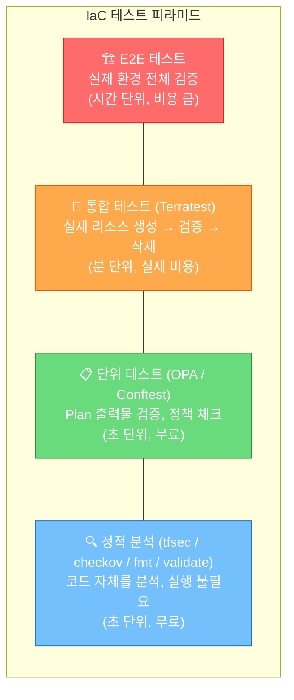
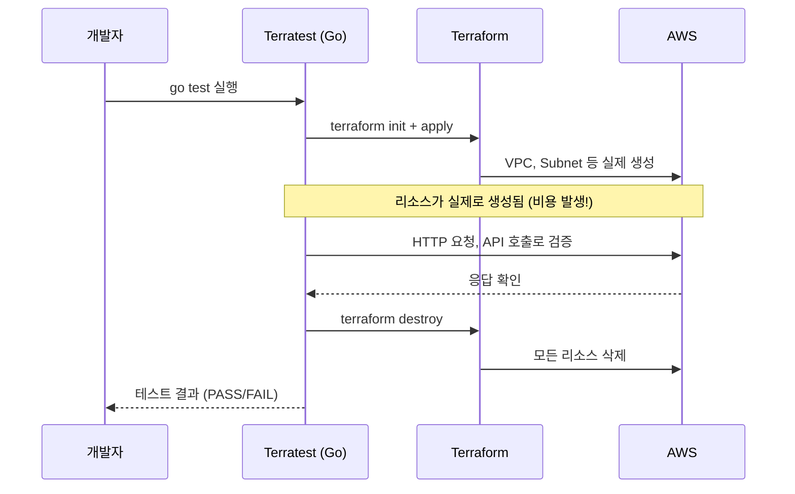
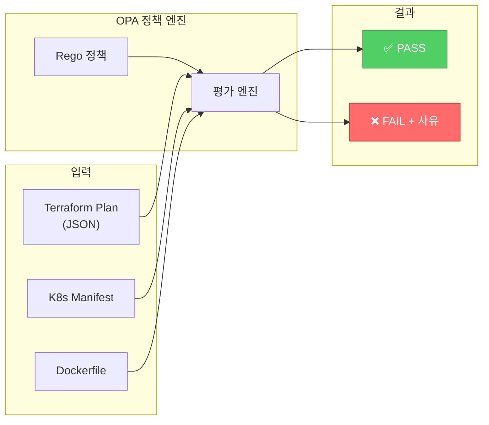
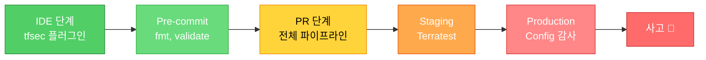

# IaC 테스트와 정책 (Terratest / Checkov / OPA / tfsec / Infracost)

> [이전 강의: CloudFormation / Pulumi / CDK](./05-cloudformation-pulumi)에서 다양한 IaC 도구를 살펴봤어요. 이제 "코드로 만든 인프라가 **안전하고, 규정을 준수하며, 비용이 통제**되는지" 자동으로 검증하는 방법을 배워볼게요. [Terraform 기초](./02-terraform-basics)와 [Terraform 심화](./03-terraform-advanced)에서 배운 내용을 기반으로, **IaC 품질 보증 파이프라인**을 구축해볼게요.

---

## 🎯 왜 IaC 테스트와 정책을 알아야 하나요?

### 일상 비유: 건축물 안전 검사

아파트를 지을 때를 생각해볼게요.

- **설계도 검토** = IaC 정적 분석 (tfsec, checkov)
- **건축 법규 검사** = 정책 검증 (OPA, Sentinel)
- **내진 설계 테스트** = 통합 테스트 (Terratest)
- **공사비 견적** = 비용 추정 (Infracost)
- **준공 검사** = E2E 테스트

설계도만 그려놓고 검사 없이 바로 공사하면 어떻게 될까요? 건물이 무너지거나, 법규 위반으로 철거 명령을 받거나, 예산을 초과하게 돼요. **IaC도 마찬가지**예요!

### 실무에서 이런 문제가 생겨요

```
실무에서 IaC 테스트/정책이 없으면 벌어지는 일:

• S3 버킷을 public으로 만들어서 고객 데이터 유출       → tfsec / checkov로 사전 차단
• 누군가 m5.4xlarge를 20대 띄워서 월 청구서 폭탄       → OPA 정책으로 인스턴스 타입 제한
• terraform apply 후에야 "이거 보안 그룹 잘못됐네"      → Terratest로 사전 검증
• PR 리뷰에서 "이거 비용 얼마나 나와?" 매번 수동 계산   → Infracost로 자동 비용 표시
• 태그 없는 리소스가 수백 개 → 누가 만들었는지 추적 불가 → 태깅 정책 자동 강제
• 면접: "IaC 파이프라인 어떻게 구성하셨나요?"           → 이 강의가 답변의 핵심!
```

---

## 🧠 핵심 개념 잡기

### 1. IaC 테스트 피라미드 = 건축물 검사 단계

| 단계 | 비유 | 도구 | 속도 | 비용 |
|------|------|------|------|------|
| **Static Analysis** | 설계도 서류 검토 | tfsec, checkov, terraform fmt/validate | 초 단위 | 무료 |
| **Unit Test** | 부품 개별 검사 | OPA/Conftest, Sentinel | 초 단위 | 무료 |
| **Integration Test** | 조립 후 동작 확인 | Terratest | 분~시간 | 실제 비용 발생 |
| **E2E Test** | 준공 검사 | Terratest + 커스텀 스크립트 | 시간 | 비용 큼 |

> 아래로 갈수록 **느리고 비싸지만 확실**해요. 위에서 최대한 많이 잡고, 아래는 핵심만 테스트하는 게 원칙이에요.

### 2. Policy as Code = 건축 법규의 코드화

건축 법규가 문서로만 있으면 사람마다 해석이 달라요. **법규를 코드로 작성**하면 자동으로 일관되게 적용할 수 있어요.

- "모든 S3 버킷은 암호화 필수" → Rego/Sentinel 코드로 작성
- "인스턴스 타입은 m5.xlarge 이하만 허용" → 자동 검증
- "모든 리소스에 Environment, Team, Owner 태그 필수" → PR에서 자동 차단

### 3. Shift-Left Security = 문제를 최대한 일찍 발견

- 기존: 코드 작성 → 배포 → **운영 중에 보안 감사** → 문제 발견 (비용 큼)
- Shift-Left: **코드 작성 시점에 보안 검사** → PR에서 차단 → 배포 전에 해결 (비용 작음)

### 4. Infracost = 공사 전 견적서

인프라 변경 전에 **"이 변경이 월 비용을 얼마나 바꾸는지"** 자동으로 계산해서 PR 코멘트에 표시해줘요.

### 5. CI 통합 = 자동화된 검사 게이트

모든 검사 도구를 **CI/CD 파이프라인에 통합**해서, PR마다 자동으로 검증이 실행되고, 통과해야만 merge할 수 있게 해요.

---

## 🔍 하나씩 자세히 알아보기

### 1. IaC 테스트 피라미드



**핵심 원칙**: 정적 분석(80%)에서 최대한 잡고, 통합 테스트(4%)는 핵심 모듈에만 적용해요.

---

### 2. Static Analysis — 정적 분석 도구

#### 2-1. terraform fmt & validate

```bash
# 코드 포맷팅 검사 (CI 첫 번째 게이트)
$ terraform fmt -check -recursive
main.tf    # 포맷이 맞지 않는 파일 출력

# 자동 수정
$ terraform fmt -recursive

# 문법/타입 오류 검사
$ terraform validate
Success! The configuration is valid.
```

#### 2-2. tfsec / Trivy — 보안 취약점 스캔

**tfsec**은 Terraform 보안 취약점을 찾아주는 도구예요. 현재는 **Trivy**에 통합되었어요.

```bash
# 설치
brew install tfsec    # 또는: brew install trivy

# tfsec 실행
$ tfsec .

Result #1 CRITICAL Security group rule allows ingress from public internet
─────────────────────────────────────────────────────────────
  main.tf:25-33
   30 │   cidr_blocks = ["0.0.0.0/0"]    # ← 여기가 문제!
─────────────────────────────────────────────────────────────
  Impact:      Your port exposed to the internet
  Resolution:  Set a more restrictive cidr range

  results
  ──────────────────────────────────
  passed     38    critical   1
  ignored    0     high       2
  low        1     medium     3
```

```bash
# Trivy로 같은 검사
$ trivy config .

CRITICAL: Security group rule allows ingress from public internet
 main.tf:30
  30 │   cidr_blocks = ["0.0.0.0/0"]
```

```hcl
# 특정 규칙 무시 (정당한 이유가 있을 때만!)
resource "aws_security_group_rule" "allow_http" {
  #tfsec:ignore:aws-vpc-no-public-ingress-sgr -- ALB용 HTTP, WAF로 보호됨
  type        = "ingress"
  from_port   = 80
  to_port     = 80
  protocol    = "tcp"
  cidr_blocks = ["0.0.0.0/0"]
}
```

#### 2-3. Checkov — 멀티프레임워크 보안/컴플라이언스 체크

Terraform, CloudFormation, Kubernetes, Dockerfile 등 다양한 IaC를 지원해요.

```bash
# 설치 및 실행
pip install checkov
$ checkov -d .

       _               _
   ___| |__   ___  ___| | _______   __
  / __| '_ \ / _ \/ __| |/ / _ \ \ / /
 | (__| | | |  __/ (__|   < (_) \ V /
  \___|_| |_|\___|\___|_|\_\___/ \_/

Passed checks: 42, Failed checks: 5, Skipped checks: 0

Check: CKV_AWS_145: "Ensure S3 Bucket has server-side encryption"
        FAILED for resource: aws_s3_bucket.data
        File: /s3.tf:12-18

Check: CKV2_AWS_6: "Ensure S3 bucket has a Public Access Block"
        FAILED for resource: aws_s3_bucket.data
```

```bash
# 유용한 옵션들
checkov -d . --framework terraform          # 특정 프레임워크만
checkov -d . --check CKV_AWS_145,CKV_AWS_18 # 특정 체크만
checkov -d . --skip-check CKV_AWS_144       # 특정 체크 제외
checkov -d . -o json > results.json         # JSON 출력
checkov -d . --check-severity HIGH          # HIGH 이상만
```

#### 2-4. terraform-docs — 문서 자동 생성

```bash
brew install terraform-docs
terraform-docs markdown table --output-file README.md --output-mode inject .
```

---

### 3. Terratest — Go 기반 IaC 통합 테스트

**실제로 인프라를 생성하고, 검증하고, 삭제**하는 통합 테스트 프레임워크예요.



```go
// test/vpc_test.go
package test

import (
    "testing"
    "github.com/gruntwork-io/terratest/modules/aws"
    "github.com/gruntwork-io/terratest/modules/terraform"
    "github.com/stretchr/testify/assert"
)

func TestVpcModule(t *testing.T) {
    t.Parallel()

    terraformOptions := terraform.WithDefaultRetryableErrors(t, &terraform.Options{
        TerraformDir: "../modules/vpc",
        Vars: map[string]interface{}{
            "vpc_cidr":     "10.99.0.0/16",
            "environment":  "test",
            "project_name": "terratest-example",
        },
        EnvVars: map[string]string{
            "AWS_DEFAULT_REGION": "us-east-2",
        },
    })

    // 테스트 끝나면 반드시 destroy (defer로 보장)
    defer terraform.Destroy(t, terraformOptions)

    terraform.InitAndApply(t, terraformOptions)

    // Output 값으로 검증
    vpcId := terraform.Output(t, terraformOptions, "vpc_id")
    publicSubnetIds := terraform.OutputList(t, terraformOptions, "public_subnet_ids")

    vpc := aws.GetVpcById(t, vpcId, "us-east-2")
    assert.Equal(t, "10.99.0.0/16", vpc.CidrBlock)
    assert.Equal(t, 3, len(publicSubnetIds))

    tags := aws.GetTagsForVpc(t, vpcId, "us-east-2")
    assert.Equal(t, "test", tags["Environment"])
}
```

```bash
$ cd test && go test -v -timeout 30m -run TestVpcModule

=== RUN   TestVpcModule
    Apply complete! Resources: 12 added, 0 changed, 0 destroyed.
    VPC ID: vpc-0abc123def456
    All assertions passed!
    terraform [destroy -auto-approve]
--- PASS: TestVpcModule (198.45s)
PASS
```

**주의사항**: 실제 AWS 비용 발생, 테스트 전용 계정 권장, `defer Destroy` 필수, `-timeout 30m` 이상 설정 필요

---

### 4. OPA (Open Policy Agent) & Conftest

OPA는 **범용 정책 엔진**이에요. Rego 언어로 정책을 작성하고, Terraform Plan JSON을 검증해요.



#### Rego 정책 예시 — 필수 태그 검사

```rego
# policy/tags.rego
package terraform.tags

required_tags := {"Environment", "Team", "Owner"}

deny[msg] {
    resource := input.planned_values.root_module.resources[_]
    tags := object.get(resource.values, "tags", {})
    required_tag := required_tags[_]
    not tags[required_tag]

    msg := sprintf(
        "리소스 '%s' (%s)에 필수 태그 '%s'가 없습니다.",
        [resource.address, resource.type, required_tag]
    )
}
```

#### Rego 정책 예시 — 인스턴스 타입 제한

```rego
# policy/instance_type.rego
package terraform.instance_type

allowed_types := {
    "t3.micro", "t3.small", "t3.medium", "t3.large",
    "m5.large", "m5.xlarge",
}

deny[msg] {
    resource := input.planned_values.root_module.resources[_]
    resource.type == "aws_instance"
    instance_type := resource.values.instance_type
    not allowed_types[instance_type]

    msg := sprintf(
        "인스턴스 '%s'의 타입 '%s'은(는) 허용되지 않습니다. 허용: %v",
        [resource.address, instance_type, allowed_types]
    )
}
```

#### Rego 정책 예시 — S3 보안

```rego
# policy/s3_security.rego
package terraform.s3

deny[msg] {
    resource := input.planned_values.root_module.resources[_]
    resource.type == "aws_s3_bucket_acl"
    resource.values.acl == "public-read"

    msg := sprintf("S3 '%s'에 public-read ACL이 금지되어 있습니다.", [resource.address])
}

deny[msg] {
    resource := input.planned_values.root_module.resources[_]
    resource.type == "aws_ebs_volume"
    not resource.values.encrypted

    msg := sprintf("EBS 볼륨 '%s'이 암호화되지 않았습니다.", [resource.address])
}
```

#### Conftest 실행

```bash
# Conftest 설치
brew install conftest

# Terraform Plan → JSON → Conftest 검증
terraform plan -out=tfplan
terraform show -json tfplan > tfplan.json

$ conftest test tfplan.json --policy policy/

FAIL - tfplan.json - terraform.tags -
  리소스 'aws_instance.web'에 필수 태그 'Owner'가 없습니다.
FAIL - tfplan.json - terraform.instance_type -
  인스턴스 'aws_instance.batch'의 타입 'm5.4xlarge'은(는) 허용되지 않습니다.
FAIL - tfplan.json - terraform.s3 -
  S3 'aws_s3_bucket.public_assets'에 public-read ACL이 금지되어 있습니다.

3 tests, 0 passed, 0 warnings, 3 failures
```

---

### 5. Sentinel (Terraform Cloud/Enterprise)

HashiCorp의 Policy as Code 프레임워크로, Terraform Cloud/Enterprise 전용이에요.

```hcl
# sentinel/restrict-instance-type.sentinel
import "tfplan/v2" as tfplan

allowed_instance_types = [
    "t3.micro", "t3.small", "t3.medium", "t3.large",
    "m5.large", "m5.xlarge",
]

ec2_instances = filter tfplan.resource_changes as _, rc {
    rc.type is "aws_instance" and
    (rc.change.actions contains "create" or rc.change.actions contains "update")
}

main = rule {
    all ec2_instances as _, instance {
        instance.change.after.instance_type in allowed_instance_types
    }
}
```

```hcl
# sentinel.hcl — 정책 적용 레벨 설정
policy "restrict-instance-type" {
    source            = "./restrict-instance-type.sentinel"
    enforcement_level = "hard-mandatory"  # 절대 우회 불가
}

policy "require-tags" {
    source            = "./require-tags.sentinel"
    enforcement_level = "soft-mandatory"  # 관리자가 override 가능
}
```

#### Sentinel vs OPA 비교

| 항목 | Sentinel | OPA (Conftest) |
|------|----------|----------------|
| **라이선스** | 상용 (Terraform Cloud) | 오픈소스 (CNCF) |
| **언어** | Sentinel (자체) | Rego |
| **적용 범위** | Terraform 전용 | 범용 (K8s, Docker 등) |
| **실행 시점** | Plan → Apply 사이 자동 | CI 파이프라인에서 수동 통합 |
| **강제 수준** | hard/soft-mandatory, advisory | pass/fail (CI에서 강제) |

> **판단 기준**: Terraform Cloud를 쓴다면 Sentinel, 오픈소스 환경이면 OPA가 적합해요.

---

### 6. Infracost — IaC 비용 추정

```bash
# 설치 및 인증
brew install infracost
infracost auth login

# 현재 코드의 비용 산출
$ infracost breakdown --path .

 Name                                      Monthly Qty  Unit         Monthly Cost

 aws_instance.web
 ├─ Instance usage (Linux/UNIX, m5.xlarge)        730  hours             $140.16
 ├─ root_block_device (gp3)                        50  GB                 $4.00
 └─ ebs_block_device[0] (gp3)                     100  GB                 $8.00

 aws_db_instance.main
 ├─ Database instance (db.r5.large)                730  hours             $172.80
 └─ Storage (gp2)                                  100  GB                $11.50

 aws_nat_gateway.main                              730  hours              $32.85

 OVERALL TOTAL                                                           $369.31
──────────────────────────────────
 14 cloud resources were detected:
 ∙ 4 were estimated   ∙ 10 were free
```

```bash
# 변경 전후 비용 비교 (diff)
$ infracost diff --path .

~ aws_instance.web
  ~ Instance usage (m5.xlarge → m5.2xlarge)  +$140.16

+ aws_instance.batch                         +$280.32

Monthly cost will increase by $466.48 (from $369.31 to $835.79)
```

```bash
# PR 코멘트 생성 (GitHub Actions에서)
infracost comment github \
  --path /tmp/infracost.json \
  --repo myorg/infra \
  --pull-request 42 \
  --github-token $GITHUB_TOKEN \
  --behavior update
```

---

### 7. CI/CD 파이프라인 통합

```mermaid
flowchart LR
    subgraph STATIC["Stage 1: 정적 분석"]
        FMT["fmt"] --> VALIDATE["validate"] --> TFSEC["tfsec"] --> CHECKOV["checkov"]
    end

    subgraph PLAN["Stage 2: Plan + 정책"]
        TF_PLAN["plan"] --> OPA["OPA"] --> COST["Infracost"]
    end

    subgraph REVIEW["Stage 3: 리뷰"]
        PR_COMMENT["PR 코멘트"] --> HUMAN["사람 리뷰"]
    end

    subgraph APPLY["Stage 4: 적용"]
        TF_APPLY["apply"]
    end

    CHECKOV --> TF_PLAN
    COST --> PR_COMMENT
    HUMAN --> TF_APPLY

    style FMT fill:#74c0fc,stroke:#1971c2,color:#fff
    style TFSEC fill:#74c0fc,stroke:#1971c2,color:#fff
    style CHECKOV fill:#74c0fc,stroke:#1971c2,color:#fff
    style TF_PLAN fill:#69db7c,stroke:#2b8a3e,color:#fff
    style OPA fill:#69db7c,stroke:#2b8a3e,color:#fff
    style COST fill:#ffd43b,stroke:#f08c00,color:#000
    style TF_APPLY fill:#ff6b6b,stroke:#c92a2a,color:#fff
```



#### GitHub Actions 예시

```yaml
# .github/workflows/terraform-ci.yml
name: Terraform CI/CD Pipeline

on:
  pull_request:
    branches: [main]
    paths: ['terraform/**']
  push:
    branches: [main]
    paths: ['terraform/**']

env:
  TF_VERSION: '1.7.0'
  TF_WORKING_DIR: 'terraform/production'

permissions:
  contents: read
  pull-requests: write

jobs:
  # Stage 1: 정적 분석 (병렬)
  fmt-check:
    runs-on: ubuntu-latest
    steps:
      - uses: actions/checkout@v4
      - uses: hashicorp/setup-terraform@v3
        with: { terraform_version: "${{ env.TF_VERSION }}" }
      - run: terraform fmt -check -recursive
        working-directory: ${{ env.TF_WORKING_DIR }}

  tfsec:
    runs-on: ubuntu-latest
    steps:
      - uses: actions/checkout@v4
      - uses: aquasecurity/tfsec-action@v1.0.3
        with:
          working_directory: ${{ env.TF_WORKING_DIR }}
          soft_fail: false

  checkov:
    runs-on: ubuntu-latest
    steps:
      - uses: actions/checkout@v4
      - uses: bridgecrewio/checkov-action@v12
        with:
          directory: ${{ env.TF_WORKING_DIR }}
          framework: terraform
          soft_fail: false

  # Stage 2: Plan + 정책 + 비용 (Stage 1 통과 후)
  plan:
    needs: [fmt-check, tfsec, checkov]
    runs-on: ubuntu-latest
    steps:
      - uses: actions/checkout@v4
      - uses: hashicorp/setup-terraform@v3
        with:
          terraform_version: ${{ env.TF_VERSION }}
          terraform_wrapper: false

      - name: Terraform Init & Plan
        run: |
          terraform init
          terraform plan -out=tfplan
          terraform show -json tfplan > tfplan.json
        working-directory: ${{ env.TF_WORKING_DIR }}
        env:
          AWS_ACCESS_KEY_ID: ${{ secrets.AWS_ACCESS_KEY_ID }}
          AWS_SECRET_ACCESS_KEY: ${{ secrets.AWS_SECRET_ACCESS_KEY }}

      - name: OPA Policy Check
        run: |
          wget -q https://github.com/open-policy-agent/conftest/releases/download/v0.50.0/conftest_0.50.0_Linux_x86_64.tar.gz
          tar xzf conftest_0.50.0_Linux_x86_64.tar.gz && sudo mv conftest /usr/local/bin/
          conftest test tfplan.json --policy policy/
        working-directory: ${{ env.TF_WORKING_DIR }}

      - uses: infracost/actions/setup@v3
        with: { api-key: "${{ secrets.INFRACOST_API_KEY }}" }

      - name: Infracost
        run: |
          infracost diff --path=${{ env.TF_WORKING_DIR }} --format=json --out-file=/tmp/infracost.json
          infracost comment github --path=/tmp/infracost.json \
            --repo=${{ github.repository }} \
            --pull-request=${{ github.event.pull_request.number }} \
            --github-token=${{ github.token }} --behavior=update
        if: github.event_name == 'pull_request'

  # Stage 3: Apply (main push + 수동 승인)
  apply:
    needs: [plan]
    if: github.ref == 'refs/heads/main' && github.event_name == 'push'
    runs-on: ubuntu-latest
    environment: production  # 수동 승인 게이트
    steps:
      - uses: actions/checkout@v4
      - uses: hashicorp/setup-terraform@v3
        with: { terraform_version: "${{ env.TF_VERSION }}" }
      - run: terraform init && terraform apply -auto-approve
        working-directory: ${{ env.TF_WORKING_DIR }}
        env:
          AWS_ACCESS_KEY_ID: ${{ secrets.AWS_ACCESS_KEY_ID }}
          AWS_SECRET_ACCESS_KEY: ${{ secrets.AWS_SECRET_ACCESS_KEY }}
```

---

### 8. 실무 정책 관리 — 태깅, 비용, 보안

#### 태깅 정책 — 모든 리소스에 필수 태그

```rego
# policy/tags.rego
package terraform.tags

required_tags := {"Environment", "Team", "Owner"}
valid_environments := {"dev", "staging", "production"}

deny[msg] {
    resource := input.planned_values.root_module.resources[_]
    tags := object.get(resource.values, "tags", {})
    tag := required_tags[_]
    not tags[tag]
    msg := sprintf("[태깅] '%s'에 필수 태그 '%s'가 없습니다.", [resource.address, tag])
}

deny[msg] {
    resource := input.planned_values.root_module.resources[_]
    env := object.get(resource.values, "tags", {})["Environment"]
    env != null
    not valid_environments[env]
    msg := sprintf("[태깅] '%s'의 Environment '%s'은 유효하지 않습니다.", [resource.address, env])
}
```

#### 비용 정책 — 큰 인스턴스 차단

```rego
# policy/cost.rego
package terraform.cost

dev_allowed := {"t3.micro", "t3.small", "t3.medium"}

deny[msg] {
    resource := input.planned_values.root_module.resources[_]
    resource.type == "aws_instance"
    tags := object.get(resource.values, "tags", {})
    tags["Environment"] == "dev"
    not dev_allowed[resource.values.instance_type]
    msg := sprintf("[비용] dev 환경에서 '%s' 타입은 불가합니다.", [resource.values.instance_type])
}
```

#### 보안 정책 — public 접근, 암호화

```rego
# policy/security.rego
package terraform.security

# 0.0.0.0/0 → SSH(22) 차단
deny[msg] {
    resource := input.planned_values.root_module.resources[_]
    resource.type == "aws_security_group_rule"
    resource.values.type == "ingress"
    resource.values.from_port <= 22
    resource.values.to_port >= 22
    resource.values.cidr_blocks[_] == "0.0.0.0/0"
    msg := sprintf("[보안] '%s'에서 SSH가 인터넷에 노출되어 있습니다.", [resource.address])
}

# RDS 암호화 필수
deny[msg] {
    resource := input.planned_values.root_module.resources[_]
    resource.type == "aws_db_instance"
    not resource.values.storage_encrypted
    msg := sprintf("[보안] RDS '%s'의 스토리지가 암호화되지 않았습니다.", [resource.address])
}

# EBS 암호화 필수
deny[msg] {
    resource := input.planned_values.root_module.resources[_]
    resource.type == "aws_ebs_volume"
    not resource.values.encrypted
    msg := sprintf("[보안] EBS '%s'이 암호화되지 않았습니다.", [resource.address])
}
```

> 보안 서비스에 대한 더 자세한 내용은 [AWS 보안 강의](../05-cloud-aws/12-security)를 참고하세요.

---

## 💻 직접 해보기

### 실습 1: 취약한 코드에 tfsec/checkov 실행

```bash
mkdir -p ~/iac-testing-lab/terraform && cd ~/iac-testing-lab/terraform
```

```hcl
# main.tf — 의도적으로 취약한 코드
terraform {
  required_providers {
    aws = { source = "hashicorp/aws", version = "~> 5.0" }
  }
}

provider "aws" { region = "ap-northeast-2" }

# ❌ Public S3 + 암호화 없음
resource "aws_s3_bucket" "data" {
  bucket = "my-company-data-bucket"
}

# ❌ 모든 포트 오픈
resource "aws_security_group" "too_open" {
  name   = "too-open-sg"
  vpc_id = "vpc-12345678"

  ingress {
    from_port   = 0
    to_port     = 65535
    protocol    = "tcp"
    cidr_blocks = ["0.0.0.0/0"]
  }
}

# ❌ 태그 없는 큰 인스턴스
resource "aws_instance" "web" {
  ami           = "ami-0c55b159cbfafe1f0"
  instance_type = "m5.4xlarge"
}

# ❌ 암호화 안 된 EBS
resource "aws_ebs_volume" "data" {
  availability_zone = "ap-northeast-2a"
  size              = 100
  encrypted         = false
}
```

```bash
# tfsec 실행 → CRITICAL/HIGH 여러 건 발견
$ tfsec .

# checkov 실행 → CKV_AWS_xxx 여러 건 FAILED
$ checkov -d .
```

### 실습 2: Conftest로 정책 검증

```bash
mkdir -p ~/iac-testing-lab/terraform/policy

# 샘플 Plan JSON 생성
cat > tfplan.json << 'EOF'
{
  "planned_values": {
    "root_module": {
      "resources": [
        {
          "address": "aws_instance.web",
          "type": "aws_instance",
          "values": {
            "instance_type": "m5.4xlarge",
            "tags": { "Name": "web-server" }
          }
        },
        {
          "address": "aws_instance.api",
          "type": "aws_instance",
          "values": {
            "instance_type": "t3.medium",
            "tags": {
              "Environment": "production",
              "Team": "backend",
              "Owner": "backend@company.com"
            }
          }
        }
      ]
    }
  }
}
EOF

# Conftest 실행
$ conftest test tfplan.json --policy policy/

# 결과: web 인스턴스는 태그 누락 + 인스턴스 타입 위반
# api 인스턴스는 통과
```

### 실습 3: Infracost 비용 확인

```bash
brew install infracost && infracost auth login

# 비용 산출
$ infracost breakdown --path .

# 변경 전후 비교
infracost breakdown --path . --format json --out-file /tmp/base.json
# (코드 수정 후)
infracost diff --path . --compare-to /tmp/base.json
```

---

## 🏢 실무에서는?

### 시나리오 1: 스타트업 — 처음 IaC 파이프라인 도입

```
1주차: terraform fmt + validate (PR 필수)
2주차: tfsec + checkov 추가 (soft-fail로 시작 → 2주 후 hard-fail)
3주차: 태깅 정책 (Conftest) + Infracost (코멘트만)
4주차: 보안/비용 정책 강제 + Infracost 임계치 경고
```

### 시나리오 2: 대기업 — 멀티 팀 거버넌스

중앙 정책 저장소를 만들고, 각 팀은 `conftest pull`로 정책을 가져와 사용해요.

```
infra-policies/              # 중앙 저장소 (인프라팀 관리)
├── policy/
│   ├── tags.rego
│   ├── security.rego
│   └── cost.rego

# 각 팀의 CI에서:
conftest pull git::https://github.com/myorg/infra-policies.git//policy
conftest test tfplan.json --policy policy/
```

### 시나리오 3: 금융권 — 규제 컴플라이언스

| 규제 요건 | IaC 정책 | 도구 |
|-----------|---------|------|
| 데이터 암호화 | S3/EBS/RDS 암호화 필수 | checkov CKV_AWS_145 |
| 접근 로그 | S3 액세스 로깅, CloudTrail | checkov CKV_AWS_18 |
| 네트워크 분리 | Public 서브넷에 DB 금지 | OPA 커스텀 정책 |
| 최소 권한 | IAM에 `*` 금지 | checkov CKV_AWS_1 |
| 비용 통제 | 월 예산 초과 차단 | Infracost + OPA |

---

## ⚠️ 자주 하는 실수

### 1. tfsec 경고를 무차별적으로 무시

```hcl
# ❌ resource "aws_s3_bucket" "data" { #tfsec:ignore:* ... }
# ✅ #tfsec:ignore:aws-s3-no-public-read -- 정적 웹사이트용, CloudFront로 보호
```

**해결**: 무시할 때 반드시 사유 기록. `#tfsec:ignore:*` 전체 무시는 절대 금지.

### 2. Terratest에서 defer destroy 빼먹음

```go
// ❌ terraform.InitAndApply(t, opts) → 실패 시 리소스 누수!
// ✅ defer terraform.Destroy(t, opts) → InitAndApply 전에 선언
```

**해결**: `defer Destroy()`를 `InitAndApply()` **전에** 선언. AWS Nuke로 주기적 청소.

### 3. 모든 테스트를 통합 테스트로만 작성

```
❌ PR마다 Terratest로 전체 인프라 생성 → 30분 소요, 비용 폭탄
✅ PR: 정적분석+정책(2분) / 야간: Terratest(핵심 모듈) / 릴리스: E2E
```

### 4. OPA 정책을 각 저장소에 복사

```
❌ team-a/policy/tags.rego, team-b/policy/tags.rego (버전 불일치)
✅ 중앙 저장소 → conftest pull로 참조 (Single Source of Truth)
```

### 5. Infracost 결과를 무시하고 merge

```
❌ "월 +$2,000" → "LGTM" (비용 미확인)
✅ "월 +$2,000" → "RI 적용하면?" → 최적화 → "월 +$800"
```

**해결**: "월 $500 이상 증가 시 인프라팀 리뷰 필수" 같은 가이드라인 수립.

---

## 📝 마무리

### Shift-Left 보안 전략



> 왼쪽에서 잡을수록 비용이 적어요!

### 핵심 요약 테이블

| 도구 | 유형 | 주요 기능 | 실행 시점 | 비용 |
|------|------|-----------|-----------|------|
| **terraform fmt** | 포맷터 | 코드 스타일 통일 | 매 커밋 | 무료 |
| **terraform validate** | 검증기 | 문법/타입 오류 | 매 커밋 | 무료 |
| **tfsec / Trivy** | 정적 분석 | 보안 취약점 스캔 | PR | 무료 |
| **Checkov** | 정적 분석 | 보안/컴플라이언스 | PR | 무료 |
| **OPA / Conftest** | 정책 엔진 | 커스텀 정책 검증 | PR (plan 후) | 무료 |
| **Sentinel** | 정책 엔진 | TF 전용 정책 | Plan → Apply | TFC 유료 |
| **Infracost** | 비용 추정 | 월 비용 변화 | PR | 무료 |
| **Terratest** | 통합 테스트 | 실제 리소스 검증 | 야간/릴리스 | AWS 비용 |

### 체크리스트

```
IaC 테스트/정책 도입 체크리스트:

기본
□ terraform fmt -check가 CI에 포함되어 있나요?
□ terraform validate가 CI에 포함되어 있나요?

보안
□ tfsec 또는 trivy config가 PR에서 실행되나요?
□ checkov가 PR에서 실행되나요?
□ CRITICAL/HIGH 발견 시 PR이 차단되나요?

정책
□ 필수 태그 정책 (Environment, Team, Owner)이 있나요?
□ 인스턴스 타입 제한 정책이 있나요?
□ Public S3/SG 차단 정책이 있나요?
□ 정책이 중앙 저장소에서 관리되나요?

비용
□ Infracost가 PR에 비용 코멘트를 달아주나요?
□ 비용 증가에 대한 리뷰 가이드라인이 있나요?

고도화
□ 핵심 모듈에 Terratest가 있나요?
□ Terratest 전용 AWS 계정이 있나요?
□ 야간 스케줄로 통합 테스트가 돌고 있나요?
```

---

## 🔗 다음 강의

🎉 **06-IaC 카테고리 완료!**

6개 강의를 통해 IaC 개념, Terraform 기초/심화, Ansible, CloudFormation/Pulumi, 테스트와 정책까지 — 인프라를 코드로 관리하는 모든 것을 배웠어요.

다음은 **[07-cicd/01-git-basics — Git 기초와 심화](../07-cicd/01-git-basics)** 로 넘어가요.

IaC의 테스트와 정책을 배웠으니, 이제 이 모든 것을 자동으로 실행해주는 CI/CD의 기초인 **Git**을 배워볼게요!

**관련 강의**:
- [Terraform 기초 — HCL / provider / resource](./02-terraform-basics)
- [Terraform 심화 — module / state / workspace](./03-terraform-advanced)
- [AWS 보안 — KMS / Secrets Manager / WAF / Shield](../05-cloud-aws/12-security)
