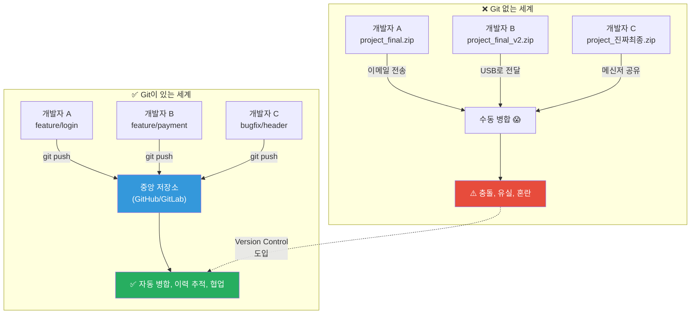
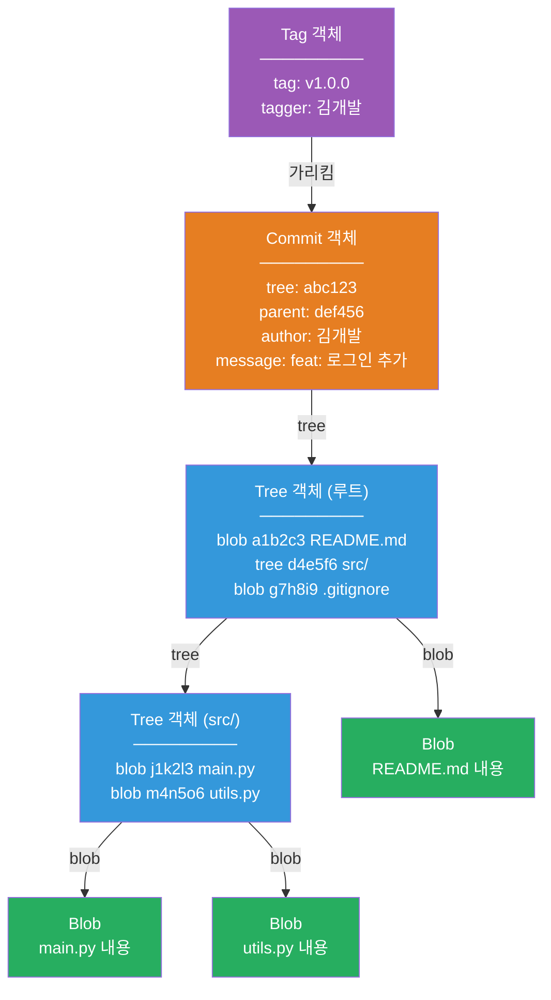
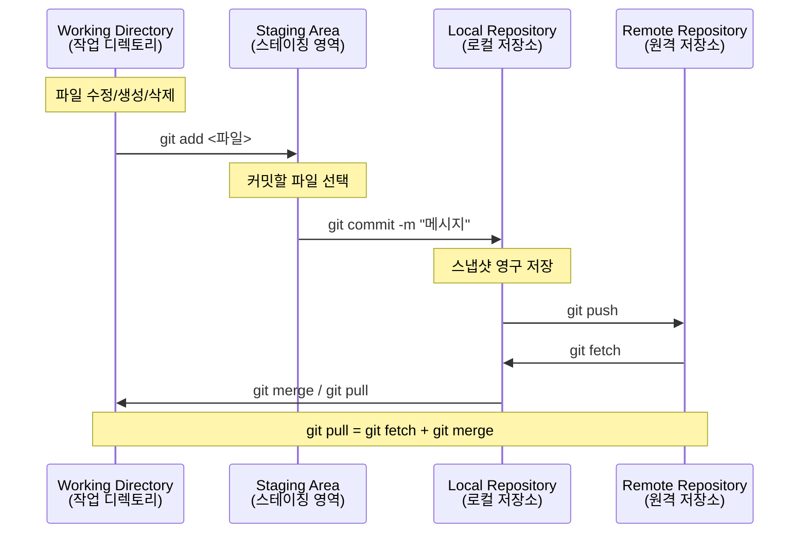
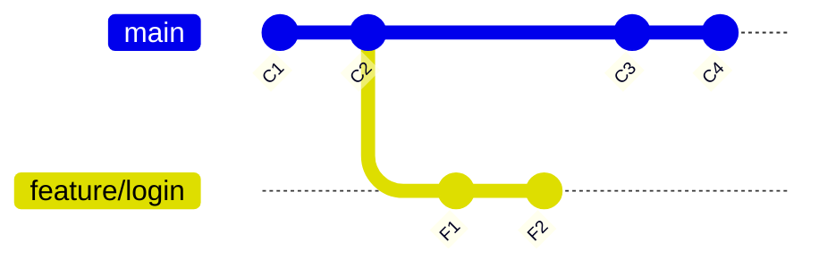
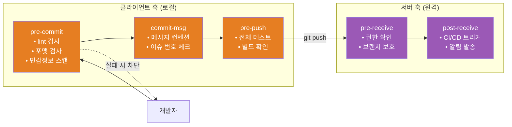
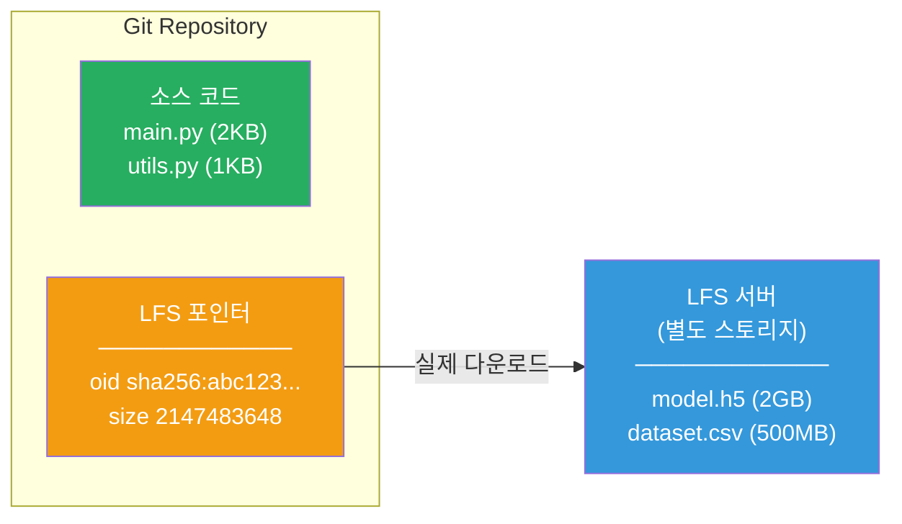
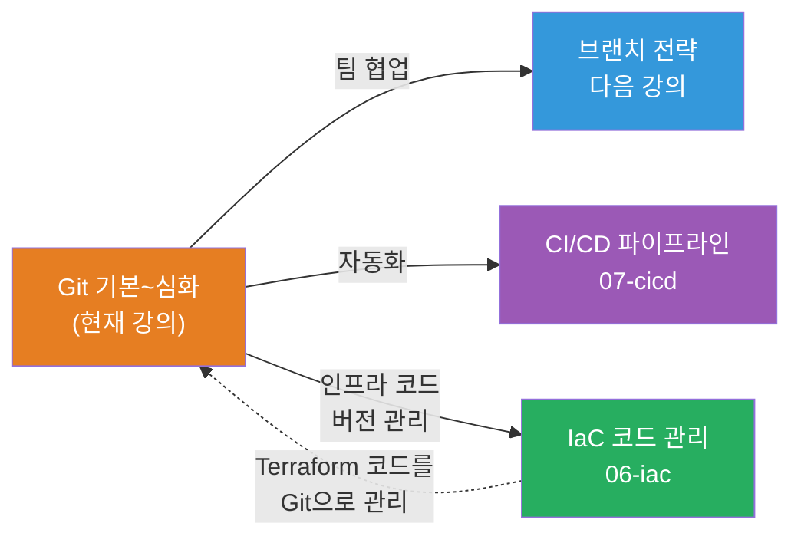

# Git 기본 ~ 심화: 버전 관리의 모든 것

> 코드를 관리한다는 건, 작가가 원고를 쓸 때 매 수정마다 "최종.docx", "진짜최종.docx", "진짜진짜최종_v3.docx"를 만들던 것을 체계적인 버전 관리 시스템으로 바꾸는 거예요. [IaC로 인프라를 코드로 관리](../06-iac/01-concept)하려면, 그 코드 자체를 안전하게 관리하는 Git이 반드시 필요해요.

---

## 🎯 왜 Git을/를 알아야 하나요?

### 일상 비유: 타임머신이 있는 작업실

여러분이 소설을 쓰고 있다고 상상해보세요. 아무 도구도 없이 작업하면:

- 어제 지운 문단이 오늘 갑자기 필요해요 → 복구 불가
- 동료와 같은 챕터를 동시에 수정했어요 → 누구 걸 쓸지 혼란
- "이 수정은 누가, 왜 했지?" → 기억에만 의존
- 실험적으로 결말을 바꿔보고 싶어요 → 원본이 망가질까 무서움

**Git은 코드 작업실에 타임머신을 설치하는 거예요.** 언제든 과거로 돌아가고, 평행 우주(branch)를 만들어 실험하고, 여러 사람이 동시에 작업할 수 있어요.

```
실무에서 Git이 필요한 순간:

• 배포한 코드에 버그 발생! 어느 커밋에서 생겼지?     → git bisect
• "어제 잘 되던 코드가 왜 안 되지?"                   → git reflog로 복구
• Terraform 코드 변경을 팀원에게 리뷰 받고 싶어요     → Pull Request (브랜치 전략)
• 대용량 모델 파일(2GB)을 Git으로 관리해야 해요       → Git LFS
• 커밋 전에 코드 품질을 자동 검사하고 싶어요          → Git Hooks
• 빌드 산출물(.exe, .jar)이 저장소에 들어가면 안 돼요  → .gitignore
```

### Git 없는 세계 vs Git이 있는 세계



---

## 🧠 핵심 개념 잡기

### 1. Git의 본질 — 스냅샷 시스템

> **비유**: 게임 세이브 파일

Git은 파일의 "차이(diff)"를 저장하는 게 아니라, 매 커밋마다 프로젝트 전체의 **스냅샷**을 저장해요. 마치 게임에서 세이브 포인트를 만드는 것처럼, 그 시점의 모든 상태를 기록해요.

### 2. Git 내부 객체 4가지

> **비유**: 도서관 시스템

- **Blob**: 파일 내용 자체 → 도서관의 **책 내용**
- **Tree**: 디렉토리 구조 → 도서관의 **서가 목록** (어떤 책이 어디에 있는지)
- **Commit**: 스냅샷 + 메타데이터 → 도서관의 **대출 기록** (누가, 언제, 왜 변경했는지)
- **Tag**: 특정 커밋의 별명 → 도서관의 **특별 전시 코너** ("올해의 책" 같은 라벨)

### 3. 세 가지 영역

> **비유**: 요리 과정

- **Working Directory**: 주방에서 재료를 손질하는 단계 → 파일을 자유롭게 수정
- **Staging Area**: 접시에 담는 단계 → 커밋할 파일을 선택
- **Repository**: 손님에게 서빙 완료 → 커밋이 영구 기록됨

### 4. 분산 버전 관리와 SHA-1 해시

Git은 모든 개발자가 전체 이력의 사본을 가지고 있어요. 네트워크가 끊겨도 커밋, 로그 확인, 브랜치 생성이 가능해요. 모든 객체는 SHA-1 해시(40자리 16진수)로 식별되어 데이터 무결성을 보장해요.

---

## 🔍 하나씩 자세히 알아보기

### 1. Git 내부 구조 (Git Internals)

```bash
$ tree .git/ -L 1
.git/
├── HEAD          # 현재 체크아웃된 브랜치를 가리키는 포인터
├── config        # 이 저장소의 설정
├── hooks/        # Git 훅 스크립트
├── index         # Staging Area 정보
├── objects/      # 모든 Git 객체 (blob, tree, commit, tag)
├── refs/         # 브랜치, 태그의 포인터
├── logs/         # reflog 기록
└── info/
```

#### Git 객체 모델 상세



#### 내부 객체 직접 확인하기

```bash
# 객체 타입 확인
$ git cat-file -t 7a8b9c
commit

# 커밋 객체 내용
$ git cat-file -p 7a8b9c
tree 4b825dc642cb6eb9a060e54bf899d15363bf9d45
parent 3f2a1b8c9d0e1f2a3b4c5d6e7f8a9b0c1d2e3f4a
author 김개발 <kim@dev.com> 1710300000 +0900
committer 김개발 <kim@dev.com> 1710300000 +0900

feat: 사용자 로그인 기능 추가

# Tree 객체 내용 (디렉토리 구조)
$ git cat-file -p 4b825d
100644 blob a1b2c3d4e5f6...  README.md
040000 tree d4e5f6a1b2c3...  src
100644 blob g7h8i9j1k2l3...  .gitignore
```

---

### 2. 세 가지 영역과 기본 워크플로우



#### 기본 명령어

```bash
# ── 초기 설정 ──
$ git config --global user.name "김개발"
$ git config --global user.email "kim@dev.com"
$ git config --global init.defaultBranch main

# ── 저장소 생성 ──
$ git init
Initialized empty Git repository in /home/user/my-project/.git/

# 또는 원격 저장소 클론
$ git clone https://github.com/team/project.git

# ── 상태 확인 ──
$ git status
On branch main
Changes not staged for commit:
        modified:   src/main.py
Untracked files:
        src/utils.py

# ── 스테이징 ──
$ git add src/main.py              # 특정 파일
$ git add src/                     # 디렉토리 전체
$ git add -p                       # hunk 단위 선택적 스테이징 (실무 추천!)

# ── 변경사항 확인 ──
$ git diff                         # Working Directory vs Staging Area
$ git diff --staged                # Staging Area vs 마지막 커밋
$ git diff main..feature/login     # 두 브랜치 비교

# ── 커밋 ──
$ git commit -m "feat: 서버 시작 로직 추가"
[main a1b2c3d] feat: 서버 시작 로직 추가
 1 file changed, 3 insertions(+), 1 deletion(-)

# ── 로그 확인 ──
$ git log --oneline --graph --all
* e4f5g6h (HEAD -> main) feat: 서버 시작 로직 추가
| * f1a2b3c (feature/payment) feat: 결제 모듈 추가
|/
* a1b2c3d fix: 로그인 오류 수정

# ── 누가 수정했는지 (blame) ──
$ git blame src/main.py
a1b2c3d4 (김개발 2026-03-01  1) def main():
e4f5g6h8 (이서버 2026-03-10  2)     print("hello, world!")
```

---

### 3. Merge vs Rebase — 합치기의 두 가지 철학



```bash
# Merge — "역사를 있는 그대로 보존"
$ git checkout main
$ git merge feature/login
# → merge commit 생성

# Rebase — "역사를 깔끔하게 재정리"
$ git checkout feature/login
$ git rebase main
# → feature 커밋들이 main 끝에 재배치
```

```
Merge 결과:   C1 --- C2 --- C3 --- C4 --- M (merge commit)
                       \                  /
                        F1 --- F2 -------

Rebase 결과:  C1 --- C2 --- C3 --- C4 --- F1' --- F2'
```

| 항목 | Merge | Rebase |
|------|-------|--------|
| **히스토리** | 분기/합류가 그대로 보임 | 일직선으로 깔끔 |
| **머지 커밋** | 생성됨 | 생성 안 됨 |
| **원본 커밋** | 보존 | 새 커밋으로 재생성 (해시 변경) |
| **충돌 해결** | 한 번에 해결 | 커밋마다 해결해야 할 수 있음 |
| **공유 브랜치** | 안전 | 위험 (push한 커밋 rebase 금지!) |

> **황금 규칙**: 이미 원격에 push한 커밋은 절대 rebase하지 마세요!

---

### 4. Interactive Rebase — 커밋 역사 편집기

```bash
# 최근 4개 커밋을 편집
$ git rebase -i HEAD~4
```

에디터에서 열리는 내용:

```
pick a1b2c3d feat: 로그인 UI 추가
pick e4f5g6h fix: 오타 수정
pick 1a2b3c4 feat: 로그인 API 연동
pick 7d8e9f0 fix: 또 오타 수정

# p, pick   = 커밋 유지     r, reword = 메시지만 변경
# s, squash = 합치기        f, fixup  = 합치기(메시지 버림)
# d, drop   = 커밋 삭제     줄 순서 변경 = 커밋 순서 변경
```

**PR 전 커밋 정리 패턴**:

```
pick a1b2c3d feat: 로그인 UI 추가
fixup e4f5g6h fix: 오타 수정          ← UI 커밋에 합침
pick 1a2b3c4 feat: 로그인 API 연동
fixup 7d8e9f0 fix: 또 오타 수정       ← API 커밋에 합침

# 결과: 2개의 깔끔한 커밋만 남음
```

---

### 5. Cherry-pick — 원하는 커밋만 쏙 뽑기

> **비유**: 뷔페에서 원하는 음식만 골라 담기

```bash
$ git cherry-pick a1b2c3d                # 특정 커밋 하나만 가져오기
$ git cherry-pick a1b2c3d e4f5g6h        # 여러 커밋
$ git cherry-pick --no-commit a1b2c3d    # 가져오되 자동 커밋 안 함

# 충돌 발생 시
$ git cherry-pick a1b2c3d
error: could not apply a1b2c3d...
$ git add .                    # 충돌 해결 후
$ git cherry-pick --continue   # 계속 진행
$ git cherry-pick --abort      # 또는 취소
```

**실무 시나리오** — release 브랜치 버그 수정을 main에도 적용:

```
main:        A --- B --- C --- D --- F'  (cherry-pick)
                    \
release/1.0:         E --- F(버그수정) --- G
```

---

### 6. Git Bisect — 이진 탐색으로 버그 찾기

> **비유**: 전화번호부에서 이름 찾기 (반씩 나누어 검색)

커밋이 1000개여도 약 10번만 확인하면 버그 도입 커밋을 찾을 수 있어요!

```bash
$ git bisect start
$ git bisect bad                  # 현재 커밋이 버그 있음
$ git bisect good v1.2.0          # 이 시점에는 버그 없었음
Bisecting: 15 revisions left to test after this (roughly 4 steps)

# Git이 중간 커밋으로 자동 체크아웃 → 테스트 → good/bad 판별 반복

$ git bisect bad
Bisecting: 7 revisions left to test after this (roughly 3 steps)

$ git bisect good
# ... 반복 ...

# 범인 발견!
a1b2c3d4e5f6 is the first bad commit
Author: 박실수 <park@dev.com>
    refactor: 캐시 TTL 변경

$ git bisect reset   # 종료

# 자동화 (스크립트로 자동 판별!)
$ git bisect start HEAD v1.2.0
$ git bisect run npm test
# → 자동으로 범인 커밋을 찾아줘요
```

---

### 7. Reflog — Git의 블랙박스 기록기

> **비유**: 비행기 블랙박스

`git log`는 커밋 히스토리만 보여주지만, `git reflog`는 HEAD가 이동한 **모든 기록**을 보여줘요.

```bash
$ git reflog
e4f5g6h (HEAD -> main) HEAD@{0}: commit: feat: 결제 기능 추가
a1b2c3d HEAD@{1}: reset: moving to HEAD~3       ← reset으로 3개 커밋 날림!
7d8e9f0 HEAD@{2}: commit: fix: 로그인 버그 수정
3f2a1b8 HEAD@{3}: commit: feat: 로그인 API 연동

# 실수 복구!
$ git reset --hard HEAD~3          # 아차! 커밋 날림
$ git reflog                       # reflog에 다 기록됨
$ git reset --hard e4f5g6h         # 되살리기!
# → 커밋들이 다시 돌아왔어요!
```

> **reflog는 로컬에서만 동작해요.** 기본 90일간 유지됩니다.

---

### 8. Stash — 작업 임시 보관함

> **비유**: 책상 서랍에 하던 일을 잠시 넣어두기

```bash
$ git stash push -m "로그인 UI 작업 중"     # 임시 보관
$ git stash list                            # 보관함 목록
stash@{0}: On main: 로그인 UI 작업 중
stash@{1}: WIP on main: a1b2c3d feat: 초기 설정

$ git stash pop                    # 가장 최근 꺼내기 (삭제됨)
$ git stash apply stash@{1}       # 꺼내되 보관함 유지
$ git stash drop stash@{1}        # 특정 stash 삭제
$ git stash push --include-untracked -m "새 파일 포함"  # Untracked 파일 포함
$ git stash push -m "config만" src/config.py            # 특정 파일만
```

---

### 9. 충돌 해결 전략

충돌은 같은 파일의 같은 부분을 다르게 수정했을 때 발생해요.

```python
def get_user():
<<<<<<< HEAD (현재 브랜치)
    return db.query("SELECT * FROM users WHERE active = 1")
=======
    return db.query("SELECT * FROM users WHERE role = 'admin'")
>>>>>>> feature/login (병합하려는 브랜치)
```

```bash
# 충돌 해결 후
$ git add src/main.py
$ git commit -m "merge: feature/login 병합"

# merge 전략 지정
$ git merge -X ours feature/login     # 충돌 시 현재 브랜치 우선
$ git merge -X theirs feature/login   # 충돌 시 상대 브랜치 우선
$ git merge --abort                   # merge 취소
```

---

### 10. Git Hooks — 자동화의 시작점

> **비유**: 공항 보안 검색대



#### pre-commit 훅

```bash
$ cat .git/hooks/pre-commit
#!/bin/bash
echo "🔍 커밋 전 코드 검사 시작..."

# 1. Python 린트 검사
pylint --fail-under=7.0 $(git diff --cached --name-only --diff-filter=ACM | grep '\.py$')
if [ $? -ne 0 ]; then
    echo "❌ pylint 검사 실패!"
    exit 1
fi

# 2. 민감 정보 검사
if git diff --cached --diff-filter=ACM | grep -iE "(password|api_key|secret)\\s*=\\s*['\"]"; then
    echo "❌ 민감 정보 감지! 커밋 불가."
    exit 1
fi

echo "✅ 모든 검사 통과!"
exit 0

$ chmod +x .git/hooks/pre-commit
```

#### commit-msg 훅 (Conventional Commits 검증)

```bash
$ cat .git/hooks/commit-msg
#!/bin/bash
FIRST_LINE=$(head -n 1 "$1")
PATTERN="^(feat|fix|docs|style|refactor|test|chore|perf|ci|build)(\(.+\))?: .{1,72}$"

if ! echo "$FIRST_LINE" | grep -qE "$PATTERN"; then
    echo "❌ 커밋 메시지 형식 오류!"
    echo "올바른 형식: type(scope): description"
    echo "예시: feat(auth): 소셜 로그인 기능 추가"
    exit 1
fi
exit 0
```

> **팁**: 팀 공유를 위해 [Husky](https://typicode.github.io/husky/)(Node.js) 또는 [pre-commit](https://pre-commit.com/)(Python) 프레임워크를 사용하세요.

---

### 11. .gitignore — 추적하지 않을 파일 관리

```bash
# ── .gitignore 기본 문법 ──
*.pyc                  # 특정 확장자
__pycache__/           # 특정 디렉토리
logs/*.log             # 디렉토리 내 특정 파일
**/*.class             # 재귀적 매칭
!important.log         # 부정 패턴 (예외)
/TODO.md               # 루트만 무시
log[0-9].txt           # 문자 범위
```

#### 실무 .gitignore 예시

```bash
# ── OS/IDE ──
.DS_Store
.idea/
.vscode/settings.json

# ── Python ──
__pycache__/
*.py[cod]
venv/

# ── Node.js ──
node_modules/

# ── 빌드 산출물 ──
build/
dist/
*.exe

# ── 환경 변수 / 민감 정보 (🔴 가장 중요!) ──
.env
.env.*
*.pem
*.key
credentials.json

# ── IaC (Terraform) ──
.terraform/
*.tfstate
*.tfstate.backup
*.tfvars
!example.tfvars
```

```bash
# 이미 추적 중인 파일을 .gitignore에 추가했을 때
$ git rm --cached .env
$ git commit -m "chore: .env를 추적 대상에서 제거"

# .gitignore 동작 확인
$ git check-ignore -v .env
.gitignore:15:.env	.env
```

---

### 12. Git LFS — 대용량 파일 관리

> **비유**: 도서관의 별도 서고 — 서가에는 카드만 놓고, 실제 자료는 별도 서고에 보관



```bash
# 설치 및 초기화
$ git lfs install
Git LFS initialized.

# 관리할 파일 유형 지정
$ git lfs track "*.h5"
$ git lfs track "*.pkl"
$ git lfs track "*.mp4"

# .gitattributes에 기록됨 (반드시 커밋!)
$ git add .gitattributes
$ git commit -m "chore: Git LFS 설정 추가"

# 이후 평소처럼 사용
$ git add model.h5
$ git commit -m "feat: 학습된 모델 추가"
$ git push    # → model.h5는 자동으로 LFS 서버에 업로드

# LFS 파일 확인
$ git lfs ls-files
a1b2c3d4e5 * model.h5

# LFS 파일 없이 빠르게 클론
$ GIT_LFS_SKIP_SMUDGE=1 git clone https://...
$ git lfs pull    # 나중에 LFS 파일만 받기
```

---

## 💻 직접 해보기

### 실습 1: Git 내부 구조 탐험

```bash
$ mkdir git-lab && cd git-lab && git init

# 파일 추가 후 blob 객체 확인
$ echo "Hello, Git!" > hello.txt
$ git add hello.txt
$ git ls-files --stage
100644 8e27be7d6154a1f68ea9160ef0e18691d20560dc 0	hello.txt

$ git cat-file -t 8e27be    # blob
$ git cat-file -p 8e27be    # Hello, Git!

# 커밋 후 commit + tree 객체 확인
$ git commit -m "feat: 첫 커밋"
$ git cat-file -p HEAD       # tree, author, message 확인
$ git count-objects           # blob + tree + commit = 3개
```

### 실습 2: 긴급 핫픽스 시나리오 (Stash + Cherry-pick)

```bash
# 1. feature 브랜치에서 작업 중
$ git checkout -b feature/dashboard
$ echo "def render(): pass" > dashboard.py
$ git add . && git commit -m "feat: 대시보드 초기 구조"
$ echo "def charts(): pass" >> dashboard.py  # 커밋 안 한 상태

# 2. 긴급 버그! → stash로 보관 후 핫픽스
$ git stash push -m "차트 기능 개발 중"
$ git checkout main
$ git checkout -b hotfix/crash
$ echo "def fix(): return True" > fix.py
$ git add . && git commit -m "fix: 크래시 수정"

# 3. main에 병합 후 feature로 돌아와 stash 복원
$ git checkout main && git merge hotfix/crash
$ git checkout feature/dashboard && git stash pop

# 4. 핫픽스를 feature에도 적용
$ git cherry-pick $(git log main --oneline -1 | cut -d' ' -f1)
```

### 실습 3: Interactive Rebase로 커밋 정리

```bash
$ git checkout -b feature/profile
$ echo "class Profile:" > profile.py
$ git add . && git commit -m "feat: Profile 클래스"
$ echo "  def __init__(): pass" >> profile.py
$ git add . && git commit -m "wip: 생성자"
$ echo "  def get_name(): pass" >> profile.py
$ git add . && git commit -m "feat: get_name"
$ echo "  # oops" >> profile.py
$ git add . && git commit -m "fix: typo"

# 커밋 정리: 에디터에서 squash/fixup 적용
$ git rebase -i HEAD~4
# pick → feat: Profile 클래스
# squash → wip: 생성자
# pick → feat: get_name
# fixup → fix: typo
```

### 실습 4: pre-commit 프레임워크 설정

```bash
$ pip install pre-commit
$ cat > .pre-commit-config.yaml << 'EOF'
repos:
  - repo: https://github.com/pre-commit/pre-commit-hooks
    rev: v4.5.0
    hooks:
      - id: trailing-whitespace
      - id: check-yaml
      - id: check-added-large-files
        args: ['--maxkb=500']
      - id: detect-private-key
  - repo: https://github.com/psf/black
    rev: 24.3.0
    hooks:
      - id: black
EOF

$ pre-commit install
$ pre-commit run --all-files
trailing whitespace...................Passed
check yaml...........................Passed
check for added large files..........Passed
detect private key...................Passed
black................................Passed
```

---

## 🏢 실무에서는?

### 시나리오 1: Terraform 코드의 Git 워크플로우

[IaC로 인프라를 관리](../06-iac/02-terraform-basics)할 때 Git은 핵심이에요.

```bash
$ git checkout -b infra/add-rds-instance
$ vim modules/database/main.tf
$ terraform plan -out=plan.out
$ git add modules/database/
$ git commit -m "feat(infra): RDS PostgreSQL 인스턴스 추가

- db.t3.medium, Multi-AZ 구성
- Plan 결과: 3 to add, 0 to change, 0 to destroy"
# → PR 생성 → 팀 리뷰 → merge → CI/CD에서 terraform apply
```

### 시나리오 2: 프로덕션 장애 시 긴급 롤백

```bash
# revert (안전한 롤백 — 이력 보존, 실무 권장)
$ git revert e4f5g6h
[main f1a2b3c] Revert "feat: 캐시 만료 로직 변경"

# reset (강력한 롤백 — 이력 삭제, 주의!)
$ git reset --hard a1b2c3d
$ git push --force-with-lease   # 안전장치 포함
```

### 시나리오 3: 커밋 컨벤션 자동화

```bash
# commitlint + husky로 팀 전체 일관된 커밋 메시지 강제
$ git commit -m "updated something"
⧗   input: updated something
✖   type may not be empty [type-empty]
✖   Found 2 problems, 0 warnings
# → 컨벤션에 맞지 않으면 자동 거부!
```

### 실무 Git 설정 권장값

```bash
$ git config --global core.autocrlf input     # Mac/Linux (Windows: true)
$ git config --global pull.rebase true        # 불필요한 merge commit 방지
$ git config --global diff.algorithm histogram # 더 읽기 좋은 diff
$ git config --global core.longpaths true     # 긴 파일명 지원
$ git config --global alias.lg "log --oneline --graph --all --decorate"
$ git config --global alias.st "status"
```

---

## ⚠️ 자주 하는 실수

### 실수 1: 민감 정보를 커밋해버림

```bash
# ❌ .env를 그대로 커밋 → Git 히스토리에 영구 기록!
# 🔴 .gitignore에 추가해도 이미 커밋된 내역은 남아있어요!

# ✅ 프로젝트 시작 시 바로 .gitignore 설정
# ✅ 환경 변수는 .env.example로 템플릿만 공유
```

### 실수 2: 공유 브랜치에서 rebase/force push

```bash
# ❌ main에서 rebase 후 force push → 팀원 히스토리 꼬임!
# ✅ rebase는 로컬 작업 브랜치에서만
# ✅ 부득이하면 git push --force-with-lease (안전장치)
```

### 실수 3: .gitignore 설정 누락

```bash
# ❌ node_modules나 .terraform을 커밋 → 저장소 용량 폭발
# ✅ github.com/github/gitignore 에서 언어별 템플릿 사용
```

### 실수 4: 거대한 단일 커밋

```bash
# ❌ git add . && git commit -m "update: 이것저것" → 추적/리뷰/롤백 불가
# ✅ 논리적 단위로 나누어 커밋
$ git add src/auth/ && git commit -m "feat(auth): JWT 검증 추가"
$ git add tests/ && git commit -m "test(auth): JWT 테스트 추가"
```

### 실수 5: reset --hard를 reflog 모르고 사용

```bash
# ❌ reset --hard 후 패닉 → reflog로 복구 가능!
$ git reflog
$ git reset --hard HEAD@{1}   # 되살리기
```

### 실수 6: 충돌 마커를 그대로 커밋

```bash
# ❌ <<<<<<< HEAD ... ======= ... >>>>>>> 마커가 코드에 남음
# ✅ 마커를 완전히 제거하고 의도에 맞게 코드 수정 후 커밋
```

### 실수 7: 대용량 파일을 Git LFS 없이 커밋

```bash
# ❌ 2GB 모델 파일을 일반 Git으로 → clone에 30분
# ✅ git lfs track "*.h5" 후 커밋
```

---

## 📝 마무리

### Git 명령어 요약

| 카테고리 | 명령어 | 설명 |
|---------|--------|------|
| **기본** | `git init / clone` | 저장소 생성/복제 |
| | `git add / commit / push / pull` | 기본 워크플로우 |
| **확인** | `git status / log / diff / blame` | 상태/이력/변경/책임 확인 |
| **브랜치** | `git branch / checkout / merge / rebase` | 분기/이동/병합/재배치 |
| **고급** | `git cherry-pick` | 특정 커밋만 가져오기 |
| | `git bisect` | 이진 탐색으로 버그 찾기 |
| | `git reflog` | HEAD 이동 전체 기록 |
| | `git stash` | 작업 임시 보관 |
| | `git rebase -i` | 커밋 히스토리 편집 |
| **정리** | `git revert / reset` | 커밋 되돌리기 / 삭제 |

### Git 내부 객체 정리

| 객체 | 역할 | 비유 |
|------|------|------|
| **Blob** | 파일 내용 저장 | 책의 원고 내용 |
| **Tree** | 디렉토리 구조 | 서가 목록 |
| **Commit** | 스냅샷 + 메타데이터 | 출판 기록 (누가, 언제, 왜) |
| **Tag** | 특정 커밋의 라벨 | "초판", "개정판" 라벨 |

### 실무 체크리스트

```
프로젝트 시작 시:
  □ .gitignore 설정         □ .gitattributes (LFS)
  □ pre-commit 훅 설정      □ commit-msg 훅 설정
  □ 브랜치 전략 합의

일상 작업 시:
  □ feature 브랜치에서 작업  □ 커밋은 논리적 단위로 작게
  □ Conventional Commits     □ PR 전 interactive rebase
  □ 민감 정보 절대 커밋 금지

위기 상황 시:
  □ reflog로 복구 가능       □ --force-with-lease 사용
  □ 롤백은 revert 우선       □ bisect로 버그 범인 찾기
```

---

## 🔗 다음 단계

이번 강의에서 Git의 기본 원리부터 고급 명령어까지 살펴봤어요. 다음 강의에서는 **팀 협업을 위한 브랜치 전략**을 다뤄요.

| 강의 | 주제 | 핵심 내용 |
|------|------|----------|
| [02. 브랜치 전략](./02-branching) | Git Flow, GitHub Flow, Trunk-based | 팀 규모에 맞는 브랜치 전략 선택 |



### 더 공부하고 싶다면

- **공식 문서**: [Pro Git Book](https://git-scm.com/book/ko/v2) (한국어 번역 무료)
- **시각적 학습**: [Learn Git Branching](https://learngitbranching.js.org/?locale=ko) (인터랙티브 튜토리얼)
- **Git 내부 구조**: Pro Git Book 10장 "Git 내부" 챕터
- **실무 브랜치 전략**: [다음 강의: 02-branching.md](./02-branching)에서 자세히 다룹니다
