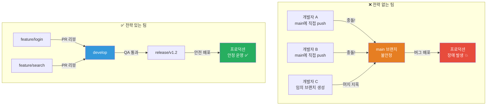
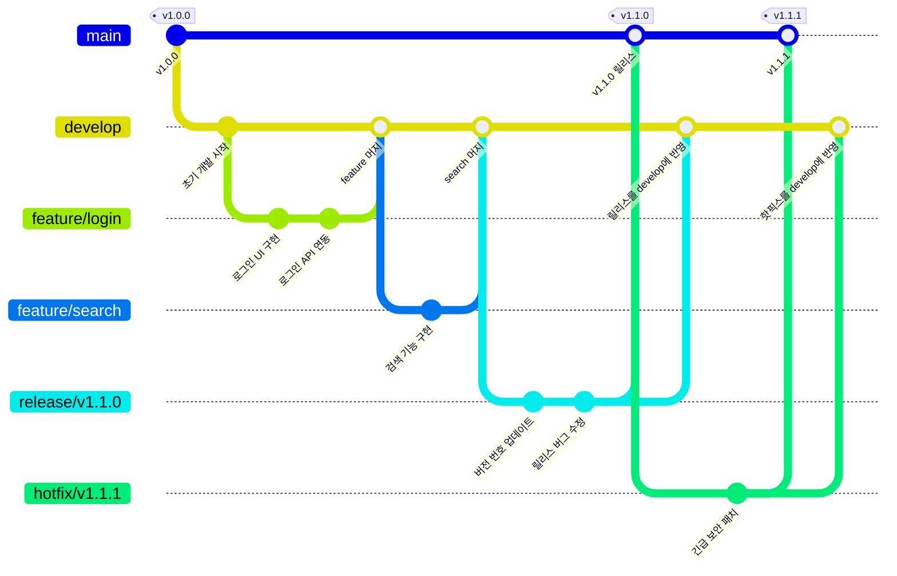
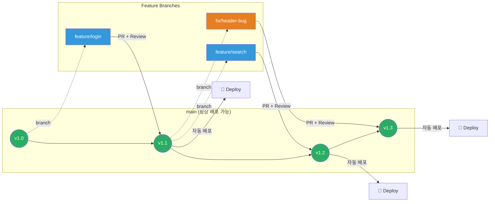
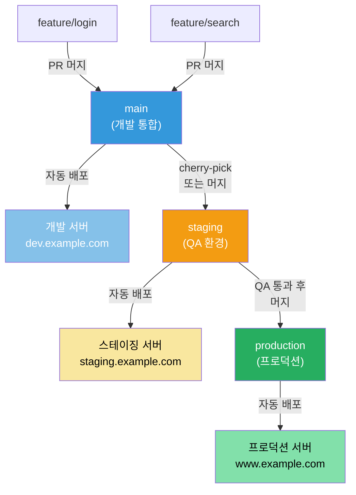
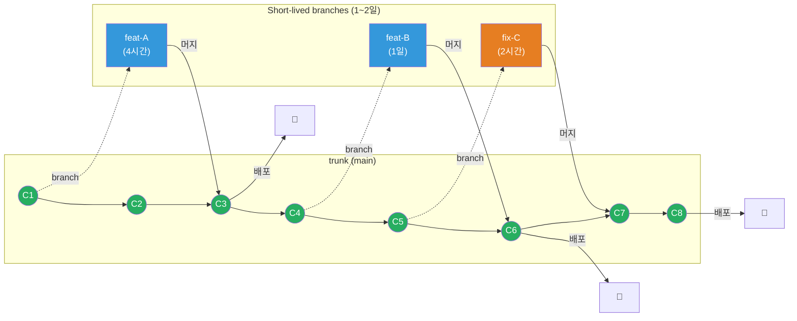
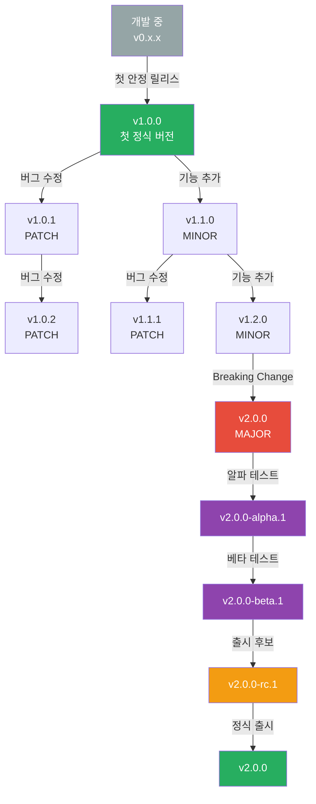
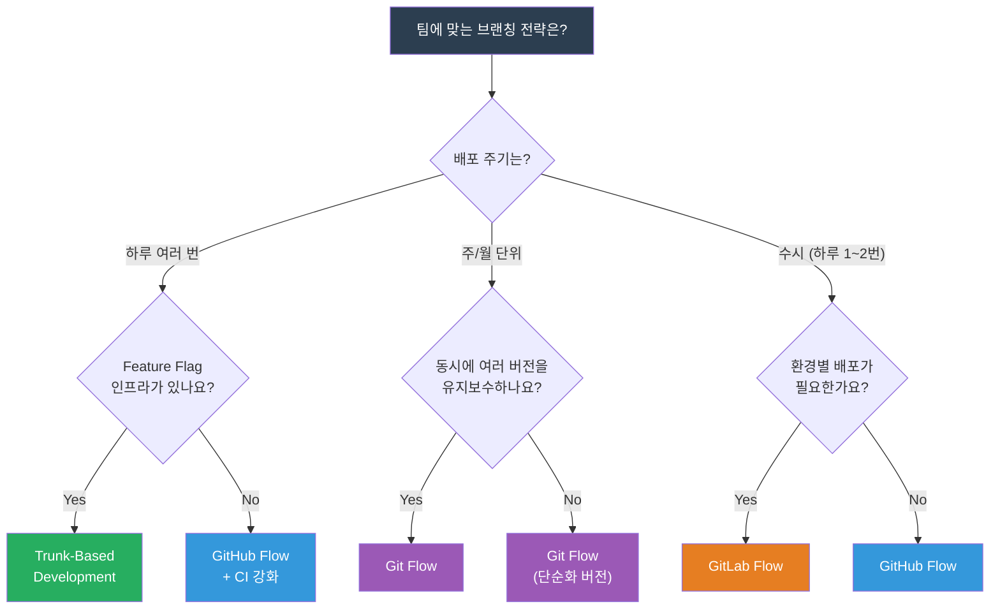

# 브랜칭 전략과 버저닝

> 브랜칭 전략은 팀이 코드를 어떻게 나누고 합치는지에 대한 "교통 규칙"이에요. 교통 규칙 없이 차들이 달리면 사고가 나듯, 브랜칭 규칙 없이 개발하면 코드 충돌과 배포 사고가 끊이지 않아요. [Git 기본기](./01-git-basics)를 배웠으니, 이제 팀 단위로 Git을 효과적으로 사용하는 전략을 알아볼게요.

---

## 🎯 왜 브랜칭 전략을 알아야 하나요?

### 일상 비유: 고속도로의 차선 규칙

고속도로를 상상해 보세요. 차선이 없고 신호도 없는 도로에서 100대의 차가 동시에 달리면 어떻게 될까요?

- 내가 가고 싶은 방향으로 아무렇게나 달려요
- 다른 차와 부딪히는 사고가 수시로 일어나요
- 긴급 차량(앰뷸런스)이 지나갈 길이 없어요
- 목적지까지 도착 시간을 예측할 수 없어요

**이게 바로 브랜칭 전략 없이 개발하는 팀의 현실이에요.**

```
실무에서 브랜칭 전략이 필요한 순간:

• 개발자 10명이 동시에 다른 기능을 개발 중              → 코드 충돌 지옥
• "이 기능 언제 배포돼요?" 에 답을 못함                  → 릴리스 예측 불가
• 프로덕션 긴급 버그! 근데 develop에 미완성 기능이...    → 핫픽스 불가
• v2.1.3인지 v2.2.0인지 헷갈림                          → 버전 관리 혼란
• "이 커밋이 어떤 릴리스에 포함됐어요?"                  → 추적 불가
• 모노레포에서 프론트/백엔드가 서로 충돌                 → 모노레포 브랜칭 전략 부재
```

### 브랜칭 전략이 없는 팀의 악몽



### 이 강의에서 다루는 것들

```
📌 브랜칭 전략 비교
├── Git Flow         — 정형화된 릴리스 중심 전략
├── GitHub Flow      — 단순하고 빠른 배포 전략
├── GitLab Flow      — 환경별 배포를 고려한 전략
└── Trunk-Based      — 초고속 통합 전략

📌 버저닝
├── Semantic Versioning (SemVer)
├── Conventional Commits
└── 릴리스 전략 (태그 기반, 브랜치 기반)

📌 실무 패턴
├── 모노레포 브랜칭
└── PR/MR 베스트 프랙티스
```

---

## 🧠 핵심 개념 잡기

### 1. 브랜칭 전략 (Branching Strategy)

> **비유**: 아파트 건설 현장의 작업 구역

아파트를 지을 때 전기 팀, 배관 팀, 인테리어 팀이 동시에 작업해요. 각 팀은 자기 작업 구역(브랜치)에서 일하고, 작업이 끝나면 합치죠. 브랜칭 전략은 "어떤 구역을 나누고, 어떤 순서로 합칠 것인지"에 대한 규칙이에요.

### 2. Semantic Versioning (유의적 버전)

> **비유**: 건물의 주소 체계

서울시 강남구 역삼동 123-4 — 이 주소만 봐도 어디쯤인지 감이 오죠? `v2.3.1` 이라는 버전 번호도 마찬가지예요. 숫자 하나하나가 변경의 규모와 성격을 알려줘요.

- **MAJOR (2)**: 건물을 새로 지음 — 호환이 안 되는 큰 변경
- **MINOR (3)**: 새 층을 추가함 — 기능 추가 (하위 호환)
- **PATCH (1)**: 벽 페인트 수리 — 버그 수정 (하위 호환)

### 3. Conventional Commits (규격 커밋)

> **비유**: 택배 분류 시스템

택배 회사에서 상자마다 "식품", "전자제품", "의류" 같은 라벨을 붙이면 자동 분류가 가능하죠. 커밋 메시지에 `feat:`, `fix:`, `chore:` 같은 접두사를 붙이면 변경 이력을 자동으로 분류할 수 있어요.

### 4. Release 전략

> **비유**: 책의 출판 과정

원고 작성(개발) → 교정(코드 리뷰) → 인쇄(빌드) → 출간(릴리스). 언제 "출간"할지, 어떤 방식으로 출간할지를 정하는 게 릴리스 전략이에요.

### 브랜칭 전략 한눈에 비교

```
┌─────────────────┬───────────────┬───────────────┬──────────────────┐
│                 │ 팀 규모       │ 배포 주기     │ 복잡도           │
├─────────────────┼───────────────┼───────────────┼──────────────────┤
│ Git Flow        │ 중~대 (10+)  │ 주/월 단위    │ ★★★★☆ 높음    │
│ GitHub Flow     │ 소~중 (2~10) │ 수시 (하루+)  │ ★★☆☆☆ 낮음    │
│ GitLab Flow     │ 중 (5~15)    │ 환경별 다름   │ ★★★☆☆ 중간    │
│ Trunk-Based     │ 소~대 (전부) │ 하루 여러번   │ ★★☆☆☆ 낮음    │
└─────────────────┴───────────────┴───────────────┴──────────────────┘
```

---

## 🔍 하나씩 자세히 알아보기

### 1. Git Flow

2010년 Vincent Driessen이 제안한 전략으로, **정형화된 릴리스 주기**가 있는 프로젝트에 적합해요.

#### 브랜치 구조

```
Git Flow의 5가지 브랜치 유형:

┌─────────────┬───────────────────────────────────────────────────────┐
│ 브랜치      │ 역할                                                 │
├─────────────┼───────────────────────────────────────────────────────┤
│ main        │ 프로덕션 코드. 항상 배포 가능한 상태                   │
│ develop     │ 다음 릴리스 준비. 개발 통합 브랜치                     │
│ feature/*   │ 새 기능 개발. develop에서 생성 → develop으로 머지       │
│ release/*   │ 릴리스 준비. develop에서 생성 → main + develop로 머지   │
│ hotfix/*    │ 프로덕션 긴급 수정. main에서 생성 → main + develop 머지 │
└─────────────┴───────────────────────────────────────────────────────┘
```

#### Git Flow 다이어그램



#### Git Flow 실전 명령어

```bash
# ─── Feature 워크플로 ───
git checkout develop && git pull origin develop
git checkout -b feature/user-profile
git add . && git commit -m "feat: 사용자 프로필 페이지 추가"
git checkout develop
git merge --no-ff feature/user-profile   # --no-ff: 머지 커밋 생성
git branch -d feature/user-profile

# ─── Release 워크플로 ───
git checkout develop && git checkout -b release/v1.2.0
git commit -m "chore: bump version to v1.2.0"
git checkout main && git merge --no-ff release/v1.2.0
git tag -a v1.2.0 -m "Release v1.2.0"
git checkout develop && git merge --no-ff release/v1.2.0
git branch -d release/v1.2.0

# ─── Hotfix 워크플로 ───
git checkout main && git checkout -b hotfix/v1.2.1
git commit -m "fix: XSS 취약점 패치"
git checkout main && git merge --no-ff hotfix/v1.2.1
git tag -a v1.2.1 -m "Hotfix v1.2.1"
git checkout develop && git merge --no-ff hotfix/v1.2.1  # 양쪽 머지 필수!
git branch -d hotfix/v1.2.1
```

#### Git Flow 장단점

```
✅ 장점:
  • 릴리스 버전 관리가 명확해요
  • 프로덕션(main)은 항상 안정적이에요
  • 핫픽스 경로가 잘 정의되어 있어요
  • 여러 버전을 동시에 유지보수할 수 있어요

❌ 단점:
  • 브랜치가 많아서 복잡해요
  • CI/CD와 잘 안 맞을 수 있어요 (머지가 자주 필요)
  • develop과 main이 벌어질 수 있어요
  • 소규모 팀에는 오버헤드가 커요
```

---

### 2. GitHub Flow

GitHub에서 제안한 **단순함이 핵심**인 전략이에요. 브랜치는 `main` 하나, 나머지는 전부 feature 브랜치예요.

#### GitHub Flow 규칙

```
GitHub Flow의 6단계:

1️⃣ main에서 브랜치 생성
2️⃣ 작업하고 커밋
3️⃣ Pull Request 생성
4️⃣ 코드 리뷰 + 토론
5️⃣ 배포 (merge 전 또는 후)
6️⃣ main에 머지
```

#### GitHub Flow 다이어그램



#### GitHub Flow 실전 명령어

```bash
# 1. main에서 브랜치 생성
git checkout main
git pull origin main
git checkout -b feature/payment-gateway

# 2. 개발 및 커밋
git add .
git commit -m "feat: Stripe 결제 연동"
git push -u origin feature/payment-gateway

# 3. PR 생성 (GitHub CLI 활용)
gh pr create \
  --title "feat: Stripe 결제 연동" \
  --body "## 변경 사항
- Stripe API 연동
- 결제 플로우 구현
- 에러 처리 추가

## 테스트
- [x] 단위 테스트 통과
- [x] Stripe 테스트 모드 검증"

# 4. 리뷰 후 머지 (Squash & Merge 권장)
gh pr merge --squash --delete-branch
```

#### GitHub Flow 장단점

```
✅ 장점:
  • 매우 단순해요 — 배울 게 적어요
  • CI/CD와 궁합이 좋아요
  • 빠른 배포 주기에 최적화되어 있어요
  • 항상 최신 코드가 main에 있어요

❌ 단점:
  • 여러 릴리스 버전 동시 관리가 어려워요
  • main이 곧 프로덕션이므로 실수가 바로 반영돼요
  • 대규모 팀에서는 머지 충돌이 잦아요
  • 릴리스 준비 기간이 필요한 프로젝트에는 부족해요
```

---

### 3. GitLab Flow

GitHub Flow의 단순함에 **환경별 배포**를 추가한 전략이에요. "main에 머지하면 바로 프로덕션"이 부담스러운 팀에 적합해요.

#### GitLab Flow 변형들

```
GitLab Flow는 두 가지 변형이 있어요:

1. 환경 브랜치 (Environment Branches)
   main → staging → production
   각 환경에 대응하는 브랜치가 존재해요.

2. 릴리스 브랜치 (Release Branches)
   main에서 release/v1.0, release/v2.0 분기
   LTS(Long Term Support) 제품에 적합해요.
```

#### 환경 브랜치 패턴



#### GitLab Flow 장단점

```
✅ 장점:
  • 환경별 배포 상태를 브랜치로 추적해요
  • GitHub Flow보다 릴리스 관리가 유연해요
  • 스테이징에서 충분히 테스트 후 프로덕션 배포 가능해요

❌ 단점:
  • GitHub Flow보다 복잡해요
  • 환경 브랜치 간 동기화를 신경 써야 해요
  • cherry-pick이 많아지면 관리가 어려워요
```

---

### 4. Trunk-Based Development (TBD)

**하나의 trunk(main) 브랜치에 모든 개발자가 자주 통합**하는 전략이에요. Google, Facebook 같은 대규모 조직에서 채택하고 있어요.

#### TBD의 핵심 원칙

```
Trunk-Based Development 규칙:

1. main(trunk)에 직접 커밋하거나, 수명이 짧은 브랜치(1~2일)를 사용해요
2. feature 브랜치 수명이 길어지면 안 돼요 (최대 2일)
3. Feature Flag로 미완성 기능을 숨겨요
4. 모든 커밋은 main에서 빌드/테스트가 통과해야 해요
5. 하루에 여러 번 main에 통합해요
```

#### Trunk-Based Development 다이어그램



#### Feature Flag 패턴

TBD에서 미완성 기능을 main에 머지하면서도 사용자에게 노출하지 않는 핵심 기법이에요.

```python
# Feature Flag 예시 (Python)
from feature_flags import is_enabled

def get_search_results(query):
    # 기존 검색 로직
    results = legacy_search(query)

    # 새 검색 엔진은 Feature Flag 뒤에 숨김
    if is_enabled("new_search_engine"):
        results = new_ai_search(query)  # 아직 개발 중이지만 main에 머지됨

    return results
```

```yaml
# feature-flags.yaml
flags:
  new_search_engine:
    enabled: false            # 프로덕션에서는 비활성화
    environments:
      development: true       # 개발 환경에서만 활성화
      staging: true           # 스테이징에서 테스트
      production: false       # 프로덕션은 아직 비활성화
    rollout_percentage: 0     # 점진적 롤아웃 지원
```

#### TBD 장단점

```
✅ 장점:
  • 통합 지옥(merge hell)을 방지해요
  • CI/CD와 완벽하게 맞아요
  • 배포 주기가 매우 빨라요
  • 코드 리뷰 범위가 작아서 효율적이에요

❌ 단점:
  • Feature Flag 인프라가 필요해요
  • 강력한 CI 파이프라인이 전제 조건이에요
  • 주니어 개발자에게는 진입 장벽이 있어요
  • 빌드가 깨지면 팀 전체가 영향을 받아요
```

---

### 5. Semantic Versioning (SemVer)

소프트웨어 버전 번호에 **의미(semantic)**를 부여하는 표준 규칙이에요. `semver.org`에서 공식 스펙을 관리하고 있어요.

#### 버전 번호 구조

```
MAJOR.MINOR.PATCH 형식

예시: v2.3.1

v2    .3      .1
│      │       └── PATCH: 버그 수정 (하위 호환)
│      └────────── MINOR: 기능 추가 (하위 호환)
└───────────────── MAJOR: 호환 깨지는 변경 (Breaking Change)

추가 레이블:
v2.3.1-beta.1      ← Pre-release (출시 전 테스트 버전)
v2.3.1-rc.1        ← Release Candidate (출시 후보)
v2.3.1+build.123   ← Build metadata (빌드 정보)
```

#### 언제 어떤 버전을 올릴까?

```
PATCH (2.3.1 → 2.3.2):
  • 버그 수정
  • 보안 패치
  • 문서 수정
  • 사용자가 느끼지 못하는 내부 수정

MINOR (2.3.1 → 2.4.0):
  • 새 기능 추가
  • 새 API 엔드포인트 추가
  • 기존 기능의 Deprecated 표시 (아직 삭제는 안 함)
  • PATCH는 0으로 리셋

MAJOR (2.3.1 → 3.0.0):
  • API 응답 형식 변경
  • 기존 함수/클래스 삭제
  • 필수 파라미터 추가
  • 데이터베이스 스키마 호환 불가 변경
  • MINOR, PATCH 모두 0으로 리셋
```

#### 버전 라이프사이클



#### 버전 0.x.x의 의미

```
v0.x.x = "아직 안정화 전이에요"

• v0.1.0 — 초기 개발 단계
• v0.x.x — 공개 API가 언제든 바뀔 수 있어요
• v1.0.0 — "이제 공개 API가 안정됐어요" 선언

중요: 0.x.x에서는 MINOR 변경도 Breaking Change일 수 있어요!
많은 오픈소스가 오랫동안 0.x 대에 머무르는 이유가 바로 이거예요.
```

---

### 6. Conventional Commits

커밋 메시지에 **구조화된 형식**을 사용하는 규칙이에요. 자동 버전 관리와 CHANGELOG 생성을 가능하게 해요.

#### 커밋 메시지 형식

```
<type>[optional scope]: <description>

[optional body]

[optional footer(s)]
```

#### Type 목록

```
┌──────────┬────────────────────────────────────┬──────────────┐
│ Type     │ 설명                               │ SemVer 영향  │
├──────────┼────────────────────────────────────┼──────────────┤
│ feat     │ 새 기능 추가                        │ MINOR 증가   │
│ fix      │ 버그 수정                           │ PATCH 증가   │
│ docs     │ 문서 변경                           │ -            │
│ style    │ 포맷팅 (세미콜론, 공백 등)           │ -            │
│ refactor │ 리팩토링 (기능 변경 없음)            │ -            │
│ perf     │ 성능 개선                           │ PATCH 증가   │
│ test     │ 테스트 추가/수정                     │ -            │
│ chore    │ 빌드, 도구 설정 변경                 │ -            │
│ ci       │ CI 설정 변경                        │ -            │
│ build    │ 빌드 시스템 변경                     │ -            │
│ revert   │ 이전 커밋 되돌리기                   │ 상황에 따라  │
└──────────┴────────────────────────────────────┴──────────────┘

BREAKING CHANGE를 알리는 방법:
  1. footer에 "BREAKING CHANGE: 설명" 추가
  2. type 뒤에 ! 붙이기 → feat!: 또는 fix!:
  → SemVer MAJOR 증가
```

#### 실전 예시

```bash
# ✅ 좋은 예시
git commit -m "feat(auth): 소셜 로그인 기능 추가"          # → MINOR
git commit -m "fix(cart): 수량 0개 주문 가능한 버그 수정"   # → PATCH
git commit -m "feat(api)!: 응답 형식을 camelCase로 변경    # → MAJOR

BREAKING CHANGE: 모든 API 응답의 키가 camelCase로 변경됩니다."
git commit -m "refactor(user): 의존성 주입 방식 개선"       # → 버전 변경 없음
git commit -m "ci: GitHub Actions에 캐시 설정 추가"         # → 버전 변경 없음

# ❌ 나쁜 예시
git commit -m "수정"          # 무엇을 수정했는지 모름
git commit -m "WIP"           # 미완성 커밋
git commit -m "여러가지 수정"  # 범위가 불명확
```

---

### 7. Release 전략

#### 태그 기반 릴리스 (Tag-based Release)

Git 태그를 트리거로 빌드/배포하는 방식이에요. GitHub Flow, TBD와 잘 어울려요.

```yaml
# GitHub Actions — 태그 기반 릴리스 파이프라인
name: Release
on:
  push:
    tags: ['v*.*.*']  # v로 시작하는 태그가 push되면 실행

jobs:
  release:
    runs-on: ubuntu-latest
    steps:
      - uses: actions/checkout@v4
      - run: npm run build && npm test
      - name: Docker Build & Push
        run: |
          VERSION=${GITHUB_REF#refs/tags/v}
          docker build -t myapp:${VERSION} .
          docker push registry.example.com/myapp:${VERSION}
```

#### 브랜치 기반 릴리스 (Branch-based Release)

특정 브랜치에 머지하면 배포되는 방식이에요. Git Flow, GitLab Flow와 잘 어울려요.

```yaml
# GitHub Actions — 브랜치 기반 릴리스
name: Deploy
on:
  push:
    branches: [main, production]
jobs:
  deploy:
    runs-on: ubuntu-latest
    steps:
      - uses: actions/checkout@v4
      - run: |
          if [ "${{ github.ref }}" = "refs/heads/production" ]; then
            ./deploy.sh production
          else
            ./deploy.sh staging
          fi
```

#### 자동 버전 관리 도구

```bash
# ─── semantic-release (Node.js) ───
# Conventional Commits를 분석해서 자동으로 버전 결정
npm install -D semantic-release
# .releaserc.json에 plugins 설정 후 CI에서 자동 실행

# ─── standard-version (더 단순한 대안) ───
npx standard-version              # 자동 버전 + CHANGELOG + 태그
npx standard-version --dry-run    # 미리보기

# ─── Python: python-semantic-release ───
pip install python-semantic-release
semantic-release publish
```

---

### 8. 모노레포 브랜칭 전략

하나의 저장소에 여러 프로젝트/서비스가 있는 **모노레포(monorepo)**에서는 브랜칭 전략을 더 신중하게 세워야 해요.

#### 모노레포 브랜칭 패턴

```
모노레포 (apps/web, apps/api, packages/ui 등)에서 주로 쓰는 전략:

1. Trunk-Based + Feature Flag (권장) — Google, Facebook 방식
2. 서비스별 태그 릴리스 — 태그: web/v1.2.0, api/v2.3.1
3. GitHub Flow + Path-based CI — 변경 경로에 따라 다른 CI 실행
```

```yaml
# 모노레포 경로 기반 CI (GitHub Actions)
name: CI
on:
  pull_request:
    paths: ['apps/web/**', 'packages/ui/**']
jobs:
  build-web:
    runs-on: ubuntu-latest
    steps:
      - uses: actions/checkout@v4
      - run: npx turbo run build test --filter=web...
```

```bash
# 서비스별 태그 릴리스
git tag -a "web/v1.2.0" -m "web: Release v1.2.0"
git tag -a "api/v2.3.1" -m "api: Release v2.3.1"
git push origin --tags
```

---

### 9. PR/MR 베스트 프랙티스

Pull Request(GitHub) 또는 Merge Request(GitLab)는 코드 품질을 지키는 **게이트키퍼** 역할을 해요.

#### PR 크기 가이드라인

```
PR 크기에 따른 리뷰 품질:

┌────────────────────────────────────────────────────────────┐
│  변경 줄 수    │ 리뷰 시간  │ 버그 발견율  │ 권장 여부    │
├────────────────┼───────────┼─────────────┼─────────────┤
│  ~100 줄      │ 15분      │ 높음        │ ✅ 최적     │
│  100~300 줄   │ 30분      │ 보통        │ ✅ 적정     │
│  300~500 줄   │ 1시간     │ 낮아짐      │ ⚠️ 주의    │
│  500줄 이상   │ 2시간+    │ 매우 낮음   │ ❌ 분할 필요 │
└────────────────┴───────────┴─────────────┴─────────────┘

※ Google 연구에 따르면 한 번에 200~400줄 이상 리뷰하면
  버그 발견율이 급격히 떨어져요.
```

#### PR 템플릿 + Branch Protection

```markdown
<!-- .github/pull_request_template.md -->
## 변경 사항
## 변경 유형
- [ ] feat / fix / refactor / docs
## 테스트
- [ ] 단위 테스트 통과  - [ ] Self-review 완료
## Breaking Change 여부: Yes / No
```

```
Branch Protection (main):
  ✅ Require PR before merging (최소 1명 승인)
  ✅ Require status checks: build, test, lint
  ✅ Require branches to be up to date
  ❌ Allow force pushes → 절대 금지!
```

#### 머지 전략 비교

```
┌─────────────────────┬─────────────────────────────────────────────┐
│ 전략                │ 특징                                        │
├─────────────────────┼─────────────────────────────────────────────┤
│ Merge Commit        │ 머지 커밋 생성. 브랜치 히스토리 보존.          │
│ (--no-ff)           │ "언제 어떤 브랜치가 머지됐는지" 추적 가능      │
├─────────────────────┼─────────────────────────────────────────────┤
│ Squash & Merge      │ 여러 커밋을 하나로 합침. 깔끔한 main 히스토리. │
│                     │ feature 브랜치의 세부 커밋은 사라짐            │
├─────────────────────┼─────────────────────────────────────────────┤
│ Rebase & Merge      │ 선형 히스토리. 머지 커밋 없음.                │
│                     │ git log가 깔끔하지만 히스토리 재작성 주의       │
└─────────────────────┴─────────────────────────────────────────────┘

권장:
  • GitHub Flow / TBD → Squash & Merge (깔끔한 main 히스토리)
  • Git Flow → Merge Commit (브랜치 히스토리 보존)
```

---

## 💻 직접 해보기

### 실습 1: Git Flow 전체 사이클

```bash
# ─── 준비: 새 저장소 생성 ───
mkdir git-flow-practice && cd git-flow-practice
git init
echo "# My App v1.0.0" > README.md
git add README.md && git commit -m "chore: 프로젝트 초기화"
git tag -a v1.0.0 -m "v1.0.0"

# ─── develop 브랜치 생성 ───
git checkout -b develop

# ─── Feature 개발 ───
git checkout -b feature/user-auth
echo 'class AuthService: pass' > auth.py
git add auth.py
git commit -m "feat(auth): 로그인/로그아웃 기능 구현"

# feature → develop 머지
git checkout develop
git merge --no-ff feature/user-auth -m "Merge feature/user-auth into develop"
git branch -d feature/user-auth

# ─── Release 준비 ───
git checkout -b release/v1.1.0
sed -i 's/v1.0.0/v1.1.0/' README.md
git add README.md && git commit -m "chore: bump version to v1.1.0"

# release → main + develop 양쪽에 머지
git checkout main
git merge --no-ff release/v1.1.0 -m "Release v1.1.0"
git tag -a v1.1.0 -m "Release v1.1.0: 사용자 인증 기능"
git checkout develop
git merge --no-ff release/v1.1.0 -m "Merge release/v1.1.0 back into develop"
git branch -d release/v1.1.0

# ─── Hotfix ───
git checkout main && git checkout -b hotfix/v1.1.1
echo '# security patch' >> auth.py
git add auth.py && git commit -m "fix(auth): 토큰 검증 누락 보안 패치"

git checkout main
git merge --no-ff hotfix/v1.1.1 -m "Hotfix v1.1.1"
git tag -a v1.1.1 -m "Hotfix v1.1.1"
git checkout develop
git merge --no-ff hotfix/v1.1.1 -m "Merge hotfix into develop"
git branch -d hotfix/v1.1.1

# ─── 결과 확인 ───
git log --oneline --graph --all
git tag -l
```

### 실습 2: Conventional Commits + 자동 CHANGELOG

```bash
mkdir conventional-practice && cd conventional-practice
git init && npm init -y

# commitlint + husky 설정
npm install -D @commitlint/cli @commitlint/config-conventional husky
echo "module.exports = { extends: ['@commitlint/config-conventional'] };" \
  > commitlint.config.js
npx husky init
echo 'npx --no -- commitlint --edit $1' > .husky/commit-msg

git add . && git commit -m "chore: commitlint와 husky 설정"

# standard-version으로 자동 릴리스
npm install -D standard-version
npm pkg set scripts.release="standard-version"

# 커밋 몇 개 추가
echo "export const add = (a, b) => a + b;" > math.js
git add math.js && git commit -m "feat: 덧셈 함수 추가"

echo "// fix: edge case" >> math.js
git add math.js && git commit -m "fix: 음수 입력 처리 버그 수정"

# 릴리스 실행 → CHANGELOG.md + 태그 자동 생성!
npm run release
cat CHANGELOG.md
```

### 실습 3: GitHub Flow + 태그 릴리스

```bash
mkdir github-flow-practice && cd github-flow-practice
git init && echo "# Todo App" > README.md
git add . && git commit -m "chore: 초기화"
gh repo create github-flow-practice --public --push --source=.

# Feature 개발 → PR → Merge
git checkout -b feature/add-todo
echo 'class TodoApp: pass' > todo.py
git add todo.py && git commit -m "feat(todo): Todo CRUD 구현"
git push -u origin feature/add-todo

gh pr create --title "feat: Todo CRUD 기능 구현" \
  --body "- Todo 추가/완료/목록 기능 구현"
gh pr merge --squash --delete-branch

# 태그 기반 릴리스
git checkout main && git pull
git tag -a v1.0.0 -m "v1.0.0: 최초 릴리스"
git push origin v1.0.0
gh release create v1.0.0 --title "v1.0.0" --notes "최초 릴리스"
```

---

## 🏢 실무에서는?

### 스타트업 (5~15명) — GitHub Flow 채택

```
🏢 시나리오: 모바일 앱 스타트업

팀 구성: FE 3명, BE 4명, iOS 2명, Android 2명, DevOps 1명

채택 전략: GitHub Flow
이유:
  • 빠른 기능 출시가 핵심 (주 2~3회 배포)
  • 팀이 작아서 Git Flow는 오버헤드
  • 모든 PR에 최소 1명 리뷰 필수
  • main 머지 → 자동 배포 (Vercel, ECS)

브랜치 규칙:
  • feature/JIRA-123-기능명     (기능)
  • fix/JIRA-456-버그명          (수정)
  • chore/작업명                 (잡다한 작업)

배포 흐름:
  feature 브랜치 → PR → 코드 리뷰 → Squash Merge → 자동 배포
```

### 중견기업 (50~100명) — Git Flow 채택

```
🏢 시나리오: 핀테크 회사 (금융 규제 대상)

팀 구성: 개발 30명, QA 10명, 보안 5명

채택 전략: Git Flow
이유:
  • 금융 규제로 릴리스 전 QA/보안 검증 필수
  • 정기 릴리스 (격주 화요일)
  • 핫픽스 경로가 명확해야 함 (금감원 보고)
  • 여러 버전 동시 유지보수 필요

릴리스 프로세스:
  1. Sprint 종료 → develop에서 release/v2.5.0 분기
  2. QA팀 2일간 릴리스 브랜치에서 테스트
  3. 보안팀 SAST/DAST 스캔
  4. 승인 → main 머지 + 태그 + 프로덕션 배포
  5. 문제 발생 시 → hotfix/* 즉시 대응
```

### 대기업 (500명+) — Trunk-Based Development 채택

```
🏢 시나리오: 대규모 플랫폼 회사

팀 구성: 개발 200명+, 마이크로서비스 30개+

채택 전략: Trunk-Based Development
이유:
  • 하루 수십 번 배포 (각 서비스 독립 배포)
  • 장기 브랜치가 만드는 머지 지옥 회피
  • Feature Flag 인프라 보유 (LaunchDarkly)
  • 강력한 CI/CD 파이프라인 (빌드 10분 이내)

핵심 규칙:
  • 브랜치 수명 최대 1일
  • PR 크기 200줄 이내 (자동 경고)
  • main은 항상 배포 가능 상태
  • Feature Flag로 미완성 기능 관리
  • 모든 커밋에 자동 테스트 + 카나리 배포
```

### 오픈소스 프로젝트 — GitHub Flow + 릴리스 브랜치

```
🌍 시나리오: 인기 오픈소스 라이브러리 (코어 5명 + 외부 기여자 수백 명)

채택 전략: GitHub Flow + Release Branches
  main        → 최신 개발 버전
  release/v1  → v1.x 유지보수 (LTS)
  release/v2  → v2.x 유지보수 (현재 stable)

외부 기여: Fork → PR → CI 통과 + 코어팀 2명 승인 → Squash Merge
          필요시 release/* 브랜치에 cherry-pick
```

---

## ⚠️ 자주 하는 실수

### 실수 1: main에 직접 push

```bash
# ❌ main에 직접 push → 리뷰 없이 프로덕션 반영
# ✅ feature 브랜치 → PR → 리뷰 → 머지
# 🔒 Branch Protection으로 아예 방지 (Settings → Branches → Require PR)
```

### 실수 2: 오래된 feature 브랜치 방치

```bash
# ❌ 2주 된 feature 브랜치 → 머지할 때 충돌 100개
# ✅ 매일 rebase하세요
git fetch origin && git rebase origin/main

# 🧹 쓸모없는 브랜치 정리
git branch --merged main | grep -v "main" | xargs -r git branch -d
```

### 실수 3: 버전 번호를 감으로 정하기

```bash
# ❌ "기능 많으니까 v3.0.0!" → Breaking Change 없으면 MAJOR 올리면 안 돼요
# ❌ "사소하니까 v1.0.1" → API 형식 바뀌었으면 MAJOR여야 해요
# ✅ SemVer 규칙 + semantic-release로 자동화
```

### 실수 4: PR을 거대하게 만들기

```bash
# ❌ PR 하나에 2000줄 → 리뷰어가 "LGTM" 찍고 넘어감
# ✅ 100~300줄 단위로 분할하세요
# PR 1: User 모델 (50줄) → PR 2: 회원가입 API (100줄) → PR 3: 로그인 API (80줄)
```

### 실수 5: hotfix를 develop에 반영하지 않기

```bash
# ❌ hotfix를 main에만 머지 → develop에 같은 버그 남아있음
# ✅ hotfix는 반드시 main + develop 양쪽에 머지!
git checkout develop
git merge --no-ff hotfix/critical-fix  # 이걸 빼먹지 마세요!
```

### 실수 6: 커밋 메시지에 의미 없는 내용

```bash
# ❌ "fix", "update", "WIP", "asdf", "수정수정"
# ✅ "feat(auth): OAuth2 소셜 로그인 구현"
# ✅ "fix(cart): 할인 쿠폰 중복 적용 방지"
# → Conventional Commits + commitlint로 강제하세요
```

### 실수 7: Trunk-Based 도입 시 Feature Flag 없이 시작

```bash
# ❌ Feature Flag 없이 TBD 도입
# → 미완성 기능이 main에 머지 → 프로덕션에 반쯤 만든 기능 노출!

# ✅ Feature Flag 인프라부터 준비하세요
# 간단: 환경 변수 기반   → if os.environ.get("FEATURE_X") == "true":
# 권장: 전용 서비스 사용  → LaunchDarkly, Unleash, Flagsmith
```

---

## 📝 마무리

### 브랜칭 전략 선택 가이드



### 한눈에 보는 비교표

```
┌─────────────────┬─────────────┬──────────────┬──────────────┬───────────────┐
│                 │ Git Flow    │ GitHub Flow  │ GitLab Flow  │ Trunk-Based   │
├─────────────────┼─────────────┼──────────────┼──────────────┼───────────────┤
│ 복잡도          │ 높음        │ 낮음         │ 중간         │ 낮음          │
│ 배포 주기       │ 주/월       │ 수시         │ 환경별       │ 하루 여러번   │
│ 팀 규모         │ 중~대       │ 소~중        │ 중           │ 모든 규모     │
│ main 안정성     │ ★★★★★   │ ★★★★☆    │ ★★★★☆    │ ★★★★☆    │
│ 학습 곡선       │ 가파름      │ 완만         │ 보통         │ 보통          │
│ CI/CD 친화도    │ 보통        │ 높음         │ 높음         │ 매우 높음     │
│ 멀티버전 지원   │ 좋음        │ 어려움       │ 가능         │ 어려움        │
│ 핫픽스 경로     │ 명확        │ 단순         │ 단순         │ 단순          │
│ Feature Flag    │ 불필요      │ 선택         │ 선택         │ 필수          │
│ 대표 사용처     │ 금융/SI     │ SaaS/스타트업│ 엔터프라이즈 │ Big Tech      │
└─────────────────┴─────────────┴──────────────┴──────────────┴───────────────┘
```

### SemVer 요약 체크리스트

```
버전을 올릴 때 확인하세요:

□ 하위 호환이 깨지는 변경이 있나요?
  → Yes: MAJOR 올리기 (v1.x.x → v2.0.0)
  → No: 다음 질문으로

□ 새로운 기능이 추가됐나요?
  → Yes: MINOR 올리기 (v1.1.x → v1.2.0)
  → No: 다음 질문으로

□ 버그 수정만 했나요?
  → Yes: PATCH 올리기 (v1.1.1 → v1.1.2)

□ Conventional Commits를 사용하고 있나요?
  → Yes: semantic-release로 자동화하세요!
  → No: 지금 도입하세요. 미래의 자신이 감사할 거예요.
```

---

## 🔗 다음 단계

### 이 강의에서 배운 것

```
✅ Git Flow — 정형화된 릴리스 관리 전략
✅ GitHub Flow — 단순하고 빠른 배포 전략
✅ GitLab Flow — 환경별 배포를 고려한 전략
✅ Trunk-Based Development — 고속 통합 전략
✅ Semantic Versioning — 버전 번호에 의미 부여
✅ Conventional Commits — 구조화된 커밋 메시지
✅ Release 전략 — 태그 기반 vs 브랜치 기반
✅ 모노레포 브랜칭 — 대규모 저장소 관리
✅ PR/MR 베스트 프랙티스 — 코드 리뷰 품질 향상
```

### 다음 강의 미리보기

[다음: CI 파이프라인](./03-ci-pipeline)에서는 이렇게 관리하는 브랜치에서 **코드가 커밋될 때마다 자동으로 빌드, 테스트, 검증**하는 CI(Continuous Integration) 파이프라인을 만들어볼 거예요.

```
다음 강의에서 다루는 내용:
• CI 파이프라인 기본 개념과 구축
• 빌드 → 테스트 → 린트 자동화
• 캐싱과 병렬 테스트로 빌드 속도 개선
• GitHub Actions / GitLab CI 실전 설정
```

### 추천 학습 자료

```
📖 공식 문서:
  • semver.org — Semantic Versioning 공식 스펙
  • conventionalcommits.org — Conventional Commits 스펙
  • trunkbaseddevelopment.com — TBD 완벽 가이드

📖 추천 읽기:
  • "A Successful Git Branching Model" — Vincent Driessen (Git Flow 원문)
  • "Patterns for Managing Source Code Branches" — Martin Fowler

🔧 도구:
  • semantic-release / standard-version — 자동 버전 관리
  • commitlint + husky — 커밋 메시지 린트 + Git Hooks
  • LaunchDarkly / Unleash — Feature Flag 서비스
```
