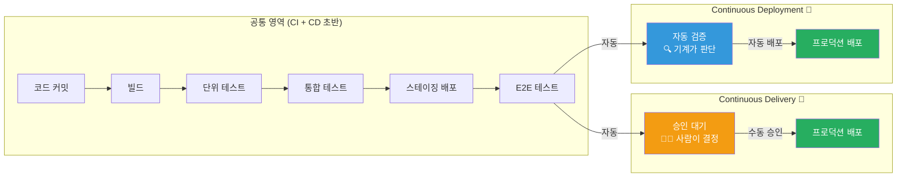
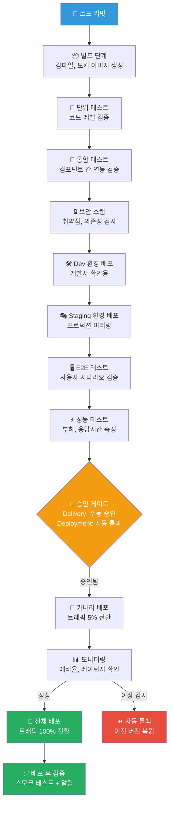
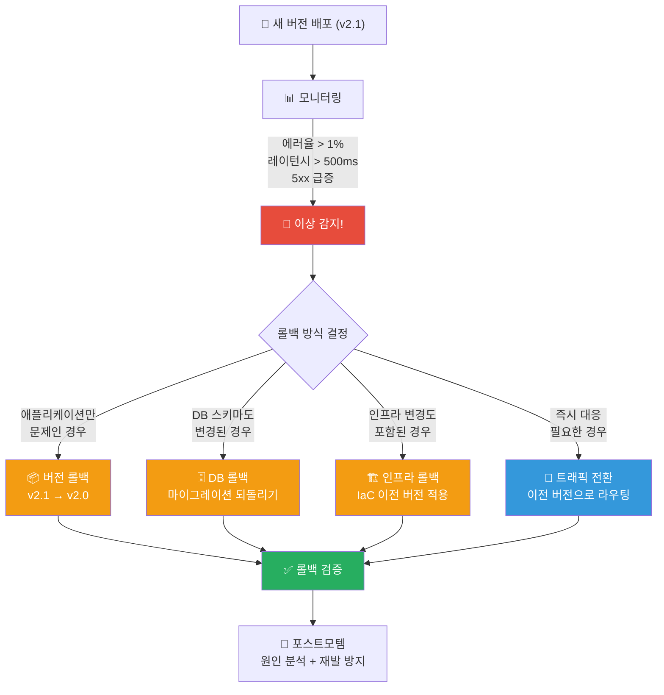
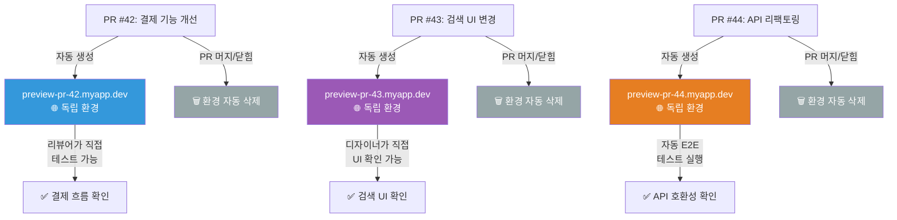
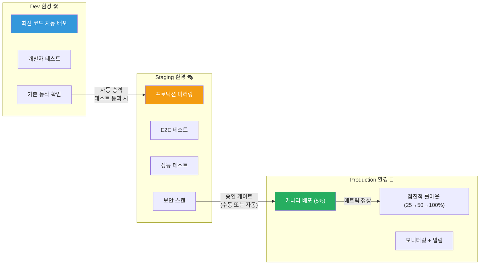

# CD(Continuous Delivery/Deployment) 파이프라인

> 코드가 완성되면 자동으로 사용자에게 전달되는 시스템, 그게 바로 CD 파이프라인이에요. 택배로 비유하면, CI가 물건을 포장하는 단계라면 CD는 포장된 물건을 고객에게 배송하는 전체 물류 시스템이에요. [CI 파이프라인](./03-ci-pipeline)에서 빌드와 테스트를 통과한 코드가 어떻게 프로덕션까지 안전하게 도착하는지 알아봐요.

---

## 🎯 왜 CD 파이프라인을 알아야 하나요?

### 일상 비유: 택배 배송 시스템

온라인 쇼핑몰에서 주문을 했다고 생각해 보세요.

- **물건 포장** (CI): 상품 검수 → 포장 → 라벨 부착
- **물류 센터** (Staging): 지역 물류 센터에서 분류 및 최종 검수
- **배송 출발** (Deployment): 배송 기사가 고객에게 전달
- **반품 처리** (Rollback): 문제가 있으면 회수하고 교환

만약 이 과정이 수동이라면 어떨까요?

- 매번 사람이 물건을 직접 들고 가야 해요
- 주소를 잘못 적으면 엉뚱한 곳으로 배달돼요
- 새벽에 긴급 배송이 필요해도 사람이 없으면 불가능해요
- 문제가 생겼을 때 어디서 잘못되었는지 추적이 안 돼요

**CD 파이프라인은 이 모든 것을 자동화하는 시스템이에요.**

```
실무에서 CD가 필요한 순간:

• "릴리스 하려면 밤새 야근해야 해요"              → 자동 배포로 해결
• "배포할 때마다 장애가 발생해요"                  → 단계적 배포 + 자동 롤백
• "개발한 기능이 2주 뒤에야 사용자에게 전달돼요"   → 배포 주기 단축
• "스테이징에서 됐는데 프로덕션에서 안 돼요"       → 환경 일관성 보장
• "이전 버전으로 돌리려면 30분 넘게 걸려요"        → 원클릭 롤백
• "PR 리뷰할 때 실제 동작을 확인할 수 없어요"      → Preview 환경 자동 생성
• "누가 언제 무엇을 배포했는지 모르겠어요"          → 배포 이력 추적
```

### CD가 없는 팀 vs 있는 팀

```mermaid
flowchart TD
    subgraph "❌ CD 없는 팀 (수동 배포)"
        MA["개발 완료"] -->|"수동"| MB["서버 SSH 접속"]
        MB -->|"수동"| MC["git pull"]
        MC -->|"수동"| MD["빌드"]
        MD -->|"수동"| ME["서비스 재시작"]
        ME -->|"기도"| MF["🤞 잘 되길..."]
        MF -->|"장애 발생!"| MG["패닉 😱"]
        MG -->|"수동 롤백 (30분+)"| MH["이전 버전 복구"]
    end

    subgraph "✅ CD 있는 팀 (자동 배포)"
        AA["코드 머지"] -->|"자동"| AB["빌드 & 테스트"]
        AB -->|"자동"| AC["스테이징 배포"]
        AC -->|"자동 테스트"| AD["승인 게이트"]
        AD -->|"원클릭/자동"| AE["프로덕션 배포"]
        AE -->|"자동 모니터링"| AF["헬스 체크"]
        AF -->|"문제 감지 시"| AG["자동 롤백 (2분)"]
    end

    style MG fill:#e74c3c,color:#fff
    style MH fill:#e74c3c,color:#fff
    style AF fill:#27ae60,color:#fff
    style AG fill:#3498db,color:#fff
```



---

## 🧠 핵심 개념 잡기

### 1. Continuous Delivery vs Continuous Deployment

> **비유**: 택배 배송 vs 드론 자동 배송

이 두 개념은 이름이 비슷하지만 결정적인 차이가 있어요.

- **Continuous Delivery(지속적 전달)**: 택배가 문 앞까지 왔지만, 고객이 "문 열어주세요"라고 해야 전달되는 것. 프로덕션 배포 전에 **사람의 승인**이 필요해요.
- **Continuous Deployment(지속적 배포)**: 드론이 자동으로 문 앞에 놓고 가는 것. 모든 테스트를 통과하면 **자동으로 프로덕션에 배포**돼요.

### 2. Deployment Pipeline

> **비유**: 공항 탑승 절차

출국할 때 여러 단계의 검사를 거치죠? 여권 확인 → 보안 검색 → 출국 심사 → 탑승. 배포 파이프라인도 코드가 여러 단계의 검증을 거쳐 프로덕션에 도착하는 과정이에요.

### 3. Rollback(롤백)

> **비유**: 자동차 리콜

신차에 결함이 발견되면 제조사가 리콜을 시행하죠? 롤백은 문제가 있는 배포 버전을 이전 안정 버전으로 되돌리는 것이에요.

### 4. Preview Environment(프리뷰 환경)

> **비유**: 시식 코너

마트의 시식 코너처럼, 실제 구매(프로덕션 배포) 전에 맛을 보는(미리 확인하는) 것이에요. PR마다 임시 환경이 자동으로 만들어져서 실제 동작을 확인할 수 있어요.

### 5. Promotion(프로모션)

> **비유**: 신입사원의 승진

신입(dev) → 대리(staging) → 과장(prod)처럼, 코드가 검증을 거치며 단계적으로 승격되는 것이에요. 각 단계를 통과해야만 다음 단계로 올라갈 수 있어요.

---

## 🔍 하나씩 자세히 알아보기

### 1. Continuous Delivery vs Continuous Deployment 차이

이건 CD를 이해하는 데 가장 중요한 구분이에요.



#### 비교 정리표

| 특성 | Continuous Delivery | Continuous Deployment |
|------|--------------------|-----------------------|
| **프로덕션 배포** | 수동 승인 후 배포 | 자동 배포 |
| **사람의 개입** | 배포 결정에 필요 | 불필요 (완전 자동) |
| **배포 빈도** | 일/주 단위 (팀 결정) | 하루 수십 회 가능 |
| **필요 조건** | 좋은 테스트 + 스테이징 | 매우 높은 테스트 신뢰도 |
| **리스크 수준** | 낮음 (사람이 최종 확인) | 매우 낮음 (자동화 신뢰) |
| **적합한 조직** | 규제 산업, 초기 도입 팀 | 성숙한 DevOps 조직 |
| **대표 기업** | 대부분의 금융/의료 기업 | Netflix, Amazon, GitHub |
| **비유** | 택배 + 수령 확인 | 드론 자동 배송 |

#### 어떤 걸 선택해야 하나요?

```
의사결정 가이드:

"우리 팀에 자동 테스트가 충분한가요?"
├── 아니요 → Continuous Delivery (수동 승인 안전장치)
└── 예 → "규제나 컴플라이언스 요구사항이 있나요?"
          ├── 예 → Continuous Delivery (감사 추적 + 승인 기록)
          └── 아니요 → "장애 발생 시 자동 롤백이 가능한가요?"
                      ├── 아니요 → Continuous Delivery
                      └── 예 → Continuous Deployment 고려 가능!
```

> **실무 팁**: 대부분의 팀은 Continuous Delivery로 시작해요. 테스트 커버리지와 모니터링이 충분히 성숙해지면 그때 Continuous Deployment로 전환하는 게 안전해요.

---

### 2. Deployment Pipeline Stages

배포 파이프라인은 코드가 개발자의 머신에서 프로덕션까지 이동하는 전체 경로예요.



#### 각 단계별 상세 설명

```
┌──────────────────┬──────────────────────────────────────────────────┬──────────┐
│ 단계             │ 목적                                             │ 소요시간 │
├──────────────────┼──────────────────────────────────────────────────┼──────────┤
│ Build            │ 소스 코드 컴파일, Docker 이미지 빌드             │ 2-5분    │
│ Unit Test        │ 개별 함수/클래스 단위 검증                       │ 1-3분    │
│ Integration Test │ 서비스 간 API 연동 검증                          │ 3-10분   │
│ Security Scan    │ CVE, SAST, 의존성 취약점 스캔                    │ 2-5분    │
│ Dev Deploy       │ 개발 환경에 배포하여 기본 동작 확인              │ 3-5분    │
│ Staging Deploy   │ 프로덕션과 동일한 환경에서 최종 검증             │ 5-10분   │
│ E2E Test         │ 실제 사용자 시나리오 기반 테스트                  │ 10-30분  │
│ Performance Test │ 부하 테스트, 응답 시간 측정                       │ 10-30분  │
│ Approval Gate    │ 배포 승인 (Delivery) 또는 자동 통과 (Deployment) │ 즉시-수일│
│ Canary Deploy    │ 소수 트래픽으로 실 환경 검증                     │ 15-60분  │
│ Full Rollout     │ 전체 트래픽 전환                                 │ 5-15분   │
│ Post-Deploy      │ 스모크 테스트, 메트릭 확인, 알림                  │ 5분      │
└──────────────────┴──────────────────────────────────────────────────┴──────────┘

전체 파이프라인 소요시간: 약 45분 ~ 2시간 (자동화 기준)
```

---

### 3. Approval Gates (승인 게이트)

승인 게이트는 배포 파이프라인에서 "다음 단계로 넘어가도 되는가?"를 판단하는 체크포인트예요.

#### 자동 승인 게이트

```yaml
# 자동 승인 게이트 예시 (GitHub Actions)
jobs:
  auto-gate:
    runs-on: ubuntu-latest
    steps:
      - name: Check test coverage
        run: |
          COVERAGE=$(cat coverage-report.json | jq '.total')
          if [ "$COVERAGE" -lt 80 ]; then
            echo "테스트 커버리지가 80% 미만입니다: ${COVERAGE}%"
            exit 1
          fi

      - name: Check error rate in staging
        run: |
          ERROR_RATE=$(curl -s "$MONITORING_API/error-rate?env=staging")
          if (( $(echo "$ERROR_RATE > 0.01" | bc -l) )); then
            echo "스테이징 에러율이 1%를 초과합니다: ${ERROR_RATE}"
            exit 1
          fi

      - name: Check performance regression
        run: |
          P99_LATENCY=$(curl -s "$MONITORING_API/p99-latency?env=staging")
          if (( $(echo "$P99_LATENCY > 500" | bc -l) )); then
            echo "P99 응답시간이 500ms를 초과합니다: ${P99_LATENCY}ms"
            exit 1
          fi
```

#### 수동 승인 게이트

```yaml
# GitHub Actions - 수동 승인 게이트
jobs:
  deploy-staging:
    runs-on: ubuntu-latest
    steps:
      - name: Deploy to staging
        run: ./deploy.sh staging

  # 수동 승인이 필요한 프로덕션 배포
  deploy-production:
    needs: deploy-staging
    runs-on: ubuntu-latest
    environment:
      name: production         # GitHub Environment 설정 필요
      url: https://myapp.com
    steps:
      - name: Deploy to production
        run: ./deploy.sh production
```

```
승인 게이트 유형:

┌─────────────────────┬──────────────────────────────────────────────┐
│ 유형                │ 설명                                         │
├─────────────────────┼──────────────────────────────────────────────┤
│ 자동 품질 게이트    │ 테스트 통과율, 커버리지, 정적 분석 점수      │
│ 자동 보안 게이트    │ CVE 스캔, 시크릿 탐지, 컴플라이언스 체크     │
│ 자동 성능 게이트    │ 응답시간, 에러율, 리소스 사용량 임계값 체크   │
│ 수동 기술 승인      │ 시니어 엔지니어의 기술적 검토                 │
│ 수동 비즈니스 승인  │ PO/PM의 기능 확인 및 릴리스 승인             │
│ 수동 규제 승인      │ 보안팀/컴플라이언스팀의 감사 승인            │
│ 시간 기반 게이트    │ 특정 시간대(영업 시간)에만 배포 허용          │
│ 메트릭 기반 게이트  │ 이전 배포의 안정성 확인 후 다음 배포 허용     │
└─────────────────────┴──────────────────────────────────────────────┘
```

---

### 4. Rollback 전략

배포 후 문제가 발생했을 때, 빠르고 안전하게 이전 상태로 돌아가는 것이 롤백이에요. 롤백 전략은 CD 파이프라인에서 가장 중요한 안전장치예요.



#### 4-1. 애플리케이션 버전 롤백

가장 흔하고 간단한 롤백 방식이에요. 이전에 배포했던 Docker 이미지나 아티팩트로 되돌리는 거예요.

```yaml
# Kubernetes에서의 버전 롤백
# 방법 1: kubectl로 직접 롤백
kubectl rollout undo deployment/my-app

# 방법 2: 특정 리비전으로 롤백
kubectl rollout undo deployment/my-app --to-revision=3

# 방법 3: 이미지 태그를 이전 버전으로 변경
kubectl set image deployment/my-app my-app=myregistry/my-app:v2.0

# 롤백 상태 확인
kubectl rollout status deployment/my-app
```

```yaml
# GitHub Actions에서의 롤백 워크플로우
name: Rollback Production

on:
  workflow_dispatch:
    inputs:
      target_version:
        description: '롤백할 버전 (예: v2.0.3)'
        required: true
      reason:
        description: '롤백 사유'
        required: true

jobs:
  rollback:
    runs-on: ubuntu-latest
    environment: production
    steps:
      - name: Validate version exists
        run: |
          # 해당 버전의 Docker 이미지가 존재하는지 확인
          aws ecr describe-images \
            --repository-name my-app \
            --image-ids imageTag=${{ inputs.target_version }}

      - name: Deploy previous version
        run: |
          kubectl set image deployment/my-app \
            my-app=123456789.dkr.ecr.ap-northeast-2.amazonaws.com/my-app:${{ inputs.target_version }}

      - name: Wait for rollout
        run: kubectl rollout status deployment/my-app --timeout=300s

      - name: Smoke test
        run: |
          for i in {1..5}; do
            STATUS=$(curl -s -o /dev/null -w "%{http_code}" https://myapp.com/health)
            if [ "$STATUS" != "200" ]; then
              echo "헬스 체크 실패! HTTP $STATUS"
              exit 1
            fi
            sleep 5
          done
          echo "롤백 완료 - 헬스 체크 통과"

      - name: Notify team
        run: |
          curl -X POST "$SLACK_WEBHOOK" \
            -d "{\"text\": \"🔄 프로덕션 롤백 완료: ${{ inputs.target_version }}\n사유: ${{ inputs.reason }}\"}"
```

#### 4-2. 데이터베이스 롤백

DB 롤백은 가장 까다로운 롤백이에요. 데이터 손실 위험이 있기 때문이죠.

```
DB 롤백의 어려움:

v2.0 (이전)                    v2.1 (새 버전)
┌──────────────┐               ┌──────────────────┐
│ users 테이블 │               │ users 테이블      │
│ - id         │  마이그레이션  │ - id              │
│ - name       │ ──────────→  │ - first_name      │  ← name을 분리
│ - email      │               │ - last_name       │  ← 새 컬럼
│              │               │ - email            │
└──────────────┘               └──────────────────┘

문제: 롤백하면 first_name/last_name에 저장된
      새 데이터를 어떻게 name으로 합칠까?
```

```python
# 안전한 DB 마이그레이션 전략: Expand-Contract 패턴

# Phase 1: Expand (확장) - v2.0에서 실행
# 새 컬럼을 추가하되, 기존 컬럼은 유지
class Migration001_AddNameColumns:
    def up(self):
        """새 컬럼 추가 (기존 컬럼 유지)"""
        db.execute("""
            ALTER TABLE users
            ADD COLUMN first_name VARCHAR(100),
            ADD COLUMN last_name VARCHAR(100);
        """)
        # 기존 데이터 복사
        db.execute("""
            UPDATE users
            SET first_name = SPLIT_PART(name, ' ', 1),
                last_name = SPLIT_PART(name, ' ', 2);
        """)

    def down(self):
        """롤백: 새 컬럼만 삭제 (기존 name 컬럼은 그대로)"""
        db.execute("""
            ALTER TABLE users
            DROP COLUMN first_name,
            DROP COLUMN last_name;
        """)

# Phase 2: Migrate (마이그레이션) - v2.1에서 실행
# 애플리케이션이 새 컬럼을 사용하도록 변경
# 이때 양쪽 컬럼 모두에 쓰기 (dual-write)

# Phase 3: Contract (축소) - v2.2에서 실행 (안정 확인 후)
# 기존 name 컬럼 삭제
class Migration002_RemoveOldNameColumn:
    def up(self):
        db.execute("ALTER TABLE users DROP COLUMN name;")

    def down(self):
        db.execute("ALTER TABLE users ADD COLUMN name VARCHAR(200);")
        db.execute("""
            UPDATE users
            SET name = CONCAT(first_name, ' ', last_name);
        """)
```

```
안전한 DB 변경 원칙:

1. 항상 backward-compatible(하위 호환) 마이그레이션을 작성해요
2. 컬럼 삭제는 최소 2번의 배포에 걸쳐 진행해요
3. 모든 마이그레이션에 down() (롤백 스크립트)을 작성해요
4. 프로덕션 마이그레이션 전에 반드시 스테이징에서 테스트해요
5. 대용량 테이블 변경은 온라인 스키마 변경 도구를 사용해요
   (gh-ost, pt-online-schema-change)
```

#### 4-3. 트래픽 기반 롤백 (Blue-Green / Canary)

가장 빠른 롤백 방법이에요. 새 버전을 제거하는 게 아니라, 트래픽만 이전 버전으로 돌리는 거예요.

```yaml
# AWS ALB + Target Group을 이용한 Blue-Green 롤백
# Blue(현재) → Green(신규) 전환 후 문제 발생 시

# 1. 현재 상태: Green(v2.1)이 트래픽을 받고 있음
# 2. 롤백: 리스너 규칙을 Blue(v2.0)로 변경

# Terraform으로 Blue-Green 전환
resource "aws_lb_listener_rule" "app" {
  listener_arn = aws_lb_listener.https.arn

  action {
    type             = "forward"
    # 롤백 시: green → blue로 변경
    target_group_arn = var.active_color == "blue" ?
      aws_lb_target_group.blue.arn :
      aws_lb_target_group.green.arn
  }

  condition {
    path_pattern {
      values = ["/*"]
    }
  }
}
```

---

### 5. Preview / Ephemeral Environments (프리뷰 환경)

PR마다 독립적인 환경이 자동으로 생성되어, 코드 변경 사항을 실제로 확인할 수 있는 환경이에요.



#### Preview 환경 구현 예시

```yaml
# .github/workflows/preview.yml
name: Preview Environment

on:
  pull_request:
    types: [opened, synchronize, reopened, closed]

jobs:
  deploy-preview:
    if: github.event.action != 'closed'
    runs-on: ubuntu-latest
    steps:
      - uses: actions/checkout@v4

      - name: Build Docker image
        run: |
          docker build -t myapp:pr-${{ github.event.number }} .

      - name: Push to registry
        run: |
          docker tag myapp:pr-${{ github.event.number }} \
            $ECR_REGISTRY/myapp:pr-${{ github.event.number }}
          docker push $ECR_REGISTRY/myapp:pr-${{ github.event.number }}

      - name: Deploy preview environment
        run: |
          # Kubernetes namespace 생성
          kubectl create namespace preview-pr-${{ github.event.number }} \
            --dry-run=client -o yaml | kubectl apply -f -

          # Helm으로 배포
          helm upgrade --install \
            preview-pr-${{ github.event.number }} \
            ./charts/myapp \
            --namespace preview-pr-${{ github.event.number }} \
            --set image.tag=pr-${{ github.event.number }} \
            --set ingress.host=pr-${{ github.event.number }}.preview.myapp.dev \
            --set resources.requests.cpu=100m \
            --set resources.requests.memory=128Mi

      - name: Comment PR with preview URL
        uses: actions/github-script@v7
        with:
          script: |
            github.rest.issues.createComment({
              issue_number: context.issue.number,
              owner: context.repo.owner,
              repo: context.repo.repo,
              body: `## 🌐 Preview 환경이 준비되었어요!

              **URL**: https://pr-${context.issue.number}.preview.myapp.dev

              이 환경은 PR이 머지되거나 닫히면 자동으로 삭제돼요.`
            })

  # PR이 닫히면 환경 자동 삭제
  cleanup-preview:
    if: github.event.action == 'closed'
    runs-on: ubuntu-latest
    steps:
      - name: Delete preview environment
        run: |
          helm uninstall preview-pr-${{ github.event.number }} \
            --namespace preview-pr-${{ github.event.number }}
          kubectl delete namespace preview-pr-${{ github.event.number }}

      - name: Delete Docker image
        run: |
          aws ecr batch-delete-image \
            --repository-name myapp \
            --image-ids imageTag=pr-${{ github.event.number }}
```

```
Preview 환경의 장점:

• 리뷰어가 코드만 보는 게 아니라 실제 동작을 확인할 수 있어요
• QA 팀이 PR 단위로 독립적인 테스트를 진행할 수 있어요
• 디자이너가 UI 변경 사항을 실시간으로 확인할 수 있어요
• PO/PM이 기능 구현 상태를 빠르게 확인할 수 있어요
• PR 간 환경 충돌 없이 여러 기능을 동시에 테스트할 수 있어요

비용 관리 팁:

• 최소 리소스로 배포 (CPU: 100m, Memory: 128Mi)
• PR 닫힘/머지 시 자동 삭제 필수
• 일정 시간(72시간) 이후 미사용 환경 자동 정리
• Spot Instance / Fargate Spot 활용
• 공유 DB/캐시를 사용하되 스키마 분리
```

---

### 6. Promotion 전략 (Dev → Staging → Prod)

코드가 단계적으로 승격되는 패턴이에요. 각 단계를 통과해야만 다음 단계로 올라갈 수 있어요.



#### 환경별 설정 차이

```yaml
# dev-values.yaml
replicas: 1
resources:
  requests:
    cpu: 100m
    memory: 128Mi
image:
  tag: latest            # 항상 최신 코드
database:
  host: dev-db.internal
  name: myapp_dev
logging:
  level: DEBUG           # 상세 로그
features:
  debug_toolbar: true    # 디버깅 도구 활성화
  rate_limiting: false   # 개발 편의를 위해 비활성화

---
# staging-values.yaml
replicas: 2
resources:
  requests:
    cpu: 250m
    memory: 512Mi
image:
  tag: rc-1.2.3          # Release Candidate 태그
database:
  host: staging-db.internal
  name: myapp_staging
logging:
  level: INFO
features:
  debug_toolbar: false
  rate_limiting: true    # 프로덕션과 동일하게

---
# prod-values.yaml
replicas: 4
resources:
  requests:
    cpu: 500m
    memory: 1Gi
image:
  tag: v1.2.3            # 검증된 릴리스 태그
database:
  host: prod-db.internal
  name: myapp_prod
logging:
  level: WARN            # 필요한 로그만
features:
  debug_toolbar: false
  rate_limiting: true
```

#### Promotion 자동화 워크플로우

```yaml
# .github/workflows/promotion.yml
name: Environment Promotion

on:
  push:
    branches: [main]

jobs:
  # 1단계: Dev 환경에 자동 배포
  deploy-dev:
    runs-on: ubuntu-latest
    outputs:
      image_tag: ${{ steps.build.outputs.tag }}
    steps:
      - uses: actions/checkout@v4

      - name: Build and push
        id: build
        run: |
          TAG="sha-$(git rev-parse --short HEAD)"
          docker build -t $ECR_REGISTRY/myapp:$TAG .
          docker push $ECR_REGISTRY/myapp:$TAG
          echo "tag=$TAG" >> $GITHUB_OUTPUT

      - name: Deploy to dev
        run: |
          helm upgrade --install myapp ./charts/myapp \
            --namespace dev \
            --values ./charts/myapp/dev-values.yaml \
            --set image.tag=${{ steps.build.outputs.tag }}

      - name: Run dev smoke tests
        run: ./scripts/smoke-test.sh https://dev.myapp.internal

  # 2단계: Staging 환경에 승격
  promote-staging:
    needs: deploy-dev
    runs-on: ubuntu-latest
    steps:
      - uses: actions/checkout@v4

      - name: Deploy to staging
        run: |
          helm upgrade --install myapp ./charts/myapp \
            --namespace staging \
            --values ./charts/myapp/staging-values.yaml \
            --set image.tag=${{ needs.deploy-dev.outputs.image_tag }}

      - name: Run E2E tests
        run: ./scripts/e2e-test.sh https://staging.myapp.internal

      - name: Run performance tests
        run: ./scripts/perf-test.sh https://staging.myapp.internal

      - name: Run security scan
        run: ./scripts/security-scan.sh

  # 3단계: Production 환경에 승격 (승인 필요)
  promote-production:
    needs: [deploy-dev, promote-staging]
    runs-on: ubuntu-latest
    environment:
      name: production         # 수동 승인 필요
      url: https://myapp.com
    steps:
      - uses: actions/checkout@v4

      - name: Canary deploy (5%)
        run: |
          helm upgrade --install myapp ./charts/myapp \
            --namespace production \
            --values ./charts/myapp/prod-values.yaml \
            --set image.tag=${{ needs.deploy-dev.outputs.image_tag }} \
            --set canary.enabled=true \
            --set canary.weight=5

      - name: Monitor canary (15 minutes)
        run: |
          for i in $(seq 1 15); do
            ERROR_RATE=$(curl -s "$MONITORING_API/error-rate?env=prod&version=canary")
            echo "Minute $i - Canary error rate: ${ERROR_RATE}%"
            if (( $(echo "$ERROR_RATE > 1.0" | bc -l) )); then
              echo "카나리 에러율 초과! 롤백 실행..."
              helm rollback myapp --namespace production
              exit 1
            fi
            sleep 60
          done

      - name: Full rollout
        run: |
          helm upgrade --install myapp ./charts/myapp \
            --namespace production \
            --values ./charts/myapp/prod-values.yaml \
            --set image.tag=${{ needs.deploy-dev.outputs.image_tag }} \
            --set canary.enabled=false
```

---

### 7. Deployment Frequency Metrics (배포 빈도 메트릭)

DORA(DevOps Research and Assessment) 메트릭은 팀의 소프트웨어 딜리버리 성능을 측정하는 4가지 핵심 지표예요.

```
DORA 4대 메트릭:

┌────────────────────────────┬────────────┬──────────────┬──────────────┬───────────────┐
│ 메트릭                     │ Elite      │ High         │ Medium       │ Low           │
├────────────────────────────┼────────────┼──────────────┼──────────────┼───────────────┤
│ 배포 빈도                  │ 하루 여러번│ 주 1회~월 1회│ 월 1회~6개월 │ 6개월 이상    │
│ (Deployment Frequency)     │            │              │              │               │
├────────────────────────────┼────────────┼──────────────┼──────────────┼───────────────┤
│ 변경 리드 타임             │ < 1시간    │ 1일~1주      │ 1주~1개월    │ 1개월~6개월   │
│ (Lead Time for Changes)    │            │              │              │               │
├────────────────────────────┼────────────┼──────────────┼──────────────┼───────────────┤
│ 변경 실패율                │ < 5%       │ 5~10%        │ 10~15%       │ > 15%         │
│ (Change Failure Rate)      │            │              │              │               │
├────────────────────────────┼────────────┼──────────────┼──────────────┼───────────────┤
│ 서비스 복원 시간           │ < 1시간    │ < 1일        │ < 1주        │ > 1주         │
│ (Time to Restore Service)  │            │              │              │               │
└────────────────────────────┴────────────┴──────────────┴──────────────┴───────────────┘

핵심 인사이트: 배포 빈도가 높은 팀이 오히려 장애가 적어요!
→ 작은 변경을 자주 배포하면, 문제 원인을 파악하기 쉽고 롤백도 간단하기 때문이에요.
```

```yaml
# DORA 메트릭 측정 예시 (GitHub Actions)
name: Track DORA Metrics

on:
  deployment:
    types: [completed]

jobs:
  track-metrics:
    runs-on: ubuntu-latest
    steps:
      - name: Record deployment
        run: |
          # 배포 빈도 기록
          curl -X POST "$METRICS_API/deployments" \
            -d '{
              "timestamp": "'$(date -u +%Y-%m-%dT%H:%M:%SZ)'",
              "environment": "${{ github.event.deployment.environment }}",
              "sha": "${{ github.sha }}",
              "status": "${{ github.event.deployment_status.state }}"
            }'

      - name: Calculate lead time
        run: |
          # 커밋 시점부터 배포까지 걸린 시간 계산
          COMMIT_TIME=$(git log -1 --format=%ct ${{ github.sha }})
          DEPLOY_TIME=$(date +%s)
          LEAD_TIME=$((DEPLOY_TIME - COMMIT_TIME))
          echo "Lead time: ${LEAD_TIME} seconds ($(($LEAD_TIME / 3600)) hours)"

          curl -X POST "$METRICS_API/lead-time" \
            -d '{"sha": "${{ github.sha }}", "lead_time_seconds": '$LEAD_TIME'}'
```

---

### 8. Feature Flags와 CD의 관계

Feature Flag는 코드 배포와 기능 릴리스를 분리하는 기술이에요. CD 파이프라인과 함께 사용하면 매우 강력해요.

```
Feature Flag가 없을 때:
코드 배포 = 기능 릴리스 (동시에 일어남)
→ 기능이 완성되기 전에는 배포할 수 없어요
→ 장기 개발 브랜치가 생기고, 머지 충돌이 발생해요

Feature Flag가 있을 때:
코드 배포 ≠ 기능 릴리스 (분리됨)
→ 미완성 기능도 flag OFF 상태로 안전하게 배포할 수 있어요
→ 기능 릴리스 시점을 비즈니스팀이 결정할 수 있어요
→ 문제 발생 시 flag만 OFF하면 즉시 비활성화 (재배포 불필요!)
```

```python
# Feature Flag 기본 구현 예시
import os
from datetime import datetime

class FeatureFlags:
    """간단한 Feature Flag 매니저"""

    def __init__(self):
        self.flags = {
            "new_checkout_flow": {
                "enabled": True,
                "rollout_percentage": 10,  # 전체 사용자의 10%만
                "allowed_users": ["beta-testers"],
            },
            "dark_mode": {
                "enabled": True,
                "rollout_percentage": 100,  # 전체 공개
            },
            "ai_recommendations": {
                "enabled": False,  # 아직 개발 중
                "rollout_percentage": 0,
            },
        }

    def is_enabled(self, flag_name: str, user_id: str = None) -> bool:
        flag = self.flags.get(flag_name)
        if not flag or not flag["enabled"]:
            return False

        # 특정 사용자 그룹 체크
        if user_id and "allowed_users" in flag:
            if user_id in flag["allowed_users"]:
                return True

        # 점진적 롤아웃 (사용자 ID 기반)
        if user_id and flag["rollout_percentage"] < 100:
            user_hash = hash(f"{flag_name}:{user_id}") % 100
            return user_hash < flag["rollout_percentage"]

        return flag["rollout_percentage"] == 100


# 사용 예시
flags = FeatureFlags()

def checkout(user_id, cart):
    if flags.is_enabled("new_checkout_flow", user_id):
        return new_checkout_process(cart)   # 새로운 결제 흐름
    else:
        return legacy_checkout_process(cart) # 기존 결제 흐름
```

```yaml
# Feature Flag + CD 파이프라인 조합 전략
#
# 1. 개발자가 Feature Flag로 감싼 코드를 커밋
# 2. CD 파이프라인이 자동으로 배포 (flag = OFF)
# 3. QA가 staging에서 flag = ON으로 테스트
# 4. PO가 확인 후 production에서 flag = ON (10% → 50% → 100%)
# 5. 안정 확인 후 flag와 레거시 코드 제거 (기술 부채 정리)

# LaunchDarkly, Unleash, Flagsmith 같은 전문 서비스도 있어요
```

```
Feature Flag 활용 패턴:

┌─────────────────────┬─────────────────────────────────────────────┐
│ 패턴                │ 설명                                        │
├─────────────────────┼─────────────────────────────────────────────┤
│ Release Flag        │ 미완성 기능을 숨기고 배포 (trunk-based dev)  │
│ Experiment Flag     │ A/B 테스트 (50%에게 A, 50%에게 B)           │
│ Ops Flag            │ 부하 시 특정 기능 비활성화 (graceful degrade)│
│ Permission Flag     │ 특정 사용자/그룹에게만 기능 공개 (beta)      │
│ Kill Switch         │ 장애 시 즉시 기능 비활성화 (재배포 없이)     │
└─────────────────────┴─────────────────────────────────────────────┘

주의사항:
• Flag가 너무 많으면 관리가 복잡해져요 (기술 부채!)
• 릴리스된 flag는 반드시 정리해야 해요 (코드에서 제거)
• Flag 상태를 모니터링하고, 오래된 flag에 알림을 설정하세요
```

---

## 💻 직접 해보기

### 실습 1: GitHub Actions로 기본 CD 파이프라인 구축하기

> **사전 준비**: GitHub 저장소, Docker Hub 또는 ECR 계정

#### Step 1: 프로젝트 구조 생성

```bash
mkdir -p ~/cd-lab
cd ~/cd-lab

# 간단한 Node.js 앱 생성
mkdir -p src
```

```javascript
// src/server.js
const http = require('http');

const VERSION = process.env.APP_VERSION || '1.0.0';
const PORT = process.env.PORT || 3000;

const server = http.createServer((req, res) => {
  if (req.url === '/health') {
    res.writeHead(200, { 'Content-Type': 'application/json' });
    res.end(JSON.stringify({ status: 'ok', version: VERSION }));
    return;
  }

  res.writeHead(200, { 'Content-Type': 'text/html' });
  res.end(`<h1>Hello from CD Pipeline! (v${VERSION})</h1>`);
});

server.listen(PORT, () => {
  console.log(`Server running on port ${PORT} (version ${VERSION})`);
});
```

```dockerfile
# Dockerfile
FROM node:20-alpine
WORKDIR /app
COPY src/ ./src/
ENV PORT=3000
EXPOSE 3000
CMD ["node", "src/server.js"]
```

#### Step 2: CD 파이프라인 작성

```yaml
# .github/workflows/cd-pipeline.yml
name: CD Pipeline

on:
  push:
    branches: [main]
  pull_request:
    branches: [main]

env:
  IMAGE_NAME: myapp
  REGISTRY: ghcr.io/${{ github.repository_owner }}

jobs:
  # ========== CI 단계 ==========
  build-and-test:
    runs-on: ubuntu-latest
    outputs:
      image_tag: ${{ steps.meta.outputs.tags }}
    steps:
      - uses: actions/checkout@v4

      - name: Run tests
        run: |
          echo "Running unit tests..."
          # npm test (실제 프로젝트에서는 테스트 실행)

      - name: Build Docker image
        id: meta
        run: |
          TAG="sha-$(git rev-parse --short HEAD)"
          docker build -t $REGISTRY/$IMAGE_NAME:$TAG .
          echo "tags=$TAG" >> $GITHUB_OUTPUT

      - name: Push Docker image
        if: github.ref == 'refs/heads/main'
        run: |
          echo "${{ secrets.GITHUB_TOKEN }}" | docker login ghcr.io -u ${{ github.actor }} --password-stdin
          TAG="sha-$(git rev-parse --short HEAD)"
          docker push $REGISTRY/$IMAGE_NAME:$TAG

  # ========== Dev 배포 ==========
  deploy-dev:
    needs: build-and-test
    if: github.ref == 'refs/heads/main'
    runs-on: ubuntu-latest
    environment:
      name: development
      url: https://dev.myapp.example.com
    steps:
      - name: Deploy to Dev
        run: |
          echo "Deploying ${{ needs.build-and-test.outputs.image_tag }} to dev..."
          # kubectl / helm 배포 명령어

      - name: Smoke test
        run: |
          echo "Running smoke tests on dev..."
          # curl https://dev.myapp.example.com/health

  # ========== Staging 배포 ==========
  deploy-staging:
    needs: [build-and-test, deploy-dev]
    if: github.ref == 'refs/heads/main'
    runs-on: ubuntu-latest
    environment:
      name: staging
      url: https://staging.myapp.example.com
    steps:
      - name: Deploy to Staging
        run: |
          echo "Deploying ${{ needs.build-and-test.outputs.image_tag }} to staging..."

      - name: Run E2E tests
        run: |
          echo "Running E2E tests on staging..."

      - name: Run performance tests
        run: |
          echo "Running performance tests on staging..."

  # ========== Production 배포 (수동 승인) ==========
  deploy-production:
    needs: [build-and-test, deploy-staging]
    if: github.ref == 'refs/heads/main'
    runs-on: ubuntu-latest
    environment:
      name: production           # GitHub에서 수동 승인 설정
      url: https://myapp.example.com
    steps:
      - name: Deploy canary (5%)
        run: |
          echo "Deploying canary (5% traffic)..."

      - name: Monitor canary (5 minutes)
        run: |
          echo "Monitoring canary for 5 minutes..."
          sleep 300

      - name: Full rollout
        run: |
          echo "Canary healthy! Proceeding with full rollout..."

      - name: Post-deployment verification
        run: |
          echo "Running post-deployment smoke tests..."

      - name: Notify team
        if: always()
        run: |
          if [ "${{ job.status }}" == "success" ]; then
            echo "✅ Production deployment successful!"
          else
            echo "❌ Production deployment failed! Initiating rollback..."
          fi
```

#### Step 3: GitHub Environment 설정

```
GitHub Repository Settings에서 Environment를 설정해요:

1. Settings → Environments → New environment

2. "development" 환경 생성
   - Protection rules: 없음 (자동 배포)

3. "staging" 환경 생성
   - Protection rules: 없음 (자동 배포)

4. "production" 환경 생성
   - Required reviewers: 팀 리더 추가
   - Wait timer: 5 minutes (선택)
   - Deployment branches: main만 허용
```

#### Step 4: 파이프라인 테스트

```bash
# 코드를 변경하고 main에 push
git add .
git commit -m "feat: add health check endpoint"
git push origin main

# GitHub Actions 탭에서 파이프라인 실행 확인:
# 1. build-and-test  → 자동 실행
# 2. deploy-dev      → build 성공 후 자동 실행
# 3. deploy-staging  → dev 성공 후 자동 실행
# 4. deploy-production → staging 성공 후 승인 대기 (⏸️)
#    → Reviewer가 "Approve and deploy" 클릭
#    → 프로덕션 배포 시작
```

---

### 실습 2: 롤백 워크플로우 구축하기

```yaml
# .github/workflows/rollback.yml
name: Production Rollback

on:
  workflow_dispatch:
    inputs:
      target_version:
        description: '롤백할 이미지 태그 (예: sha-abc1234)'
        required: true
        type: string
      reason:
        description: '롤백 사유'
        required: true
        type: string

jobs:
  rollback:
    runs-on: ubuntu-latest
    environment: production
    steps:
      - uses: actions/checkout@v4

      - name: Validate target version
        run: |
          echo "=== 롤백 정보 ==="
          echo "대상 버전: ${{ inputs.target_version }}"
          echo "사유: ${{ inputs.reason }}"
          echo "실행자: ${{ github.actor }}"
          echo "시간: $(date -u)"
          echo "=================="

      - name: Execute rollback
        run: |
          echo "Rolling back to ${{ inputs.target_version }}..."
          # kubectl set image deployment/myapp \
          #   myapp=$REGISTRY/myapp:${{ inputs.target_version }}
          # kubectl rollout status deployment/myapp --timeout=300s

      - name: Verify rollback
        run: |
          echo "Verifying rollback..."
          # 헬스 체크 5회 반복
          # for i in {1..5}; do
          #   curl -f https://myapp.example.com/health
          #   sleep 10
          # done

      - name: Create incident record
        run: |
          echo "Creating incident record..."
          # 인시던트 기록 생성 (PagerDuty, Jira 등)

      - name: Notify team
        if: always()
        run: |
          echo "Sending notification..."
          # Slack/Teams 알림 발송
```

---

### 실습 3: Preview 환경 간단 구현

```yaml
# .github/workflows/preview-simple.yml
name: PR Preview

on:
  pull_request:
    types: [opened, synchronize, closed]

jobs:
  preview:
    if: github.event.action != 'closed'
    runs-on: ubuntu-latest
    steps:
      - uses: actions/checkout@v4

      - name: Build
        run: docker build -t myapp:pr-${{ github.event.number }} .

      - name: Deploy preview
        run: |
          echo "Deploying PR #${{ github.event.number }} preview..."
          echo "URL: https://pr-${{ github.event.number }}.preview.myapp.dev"
          # 실제 배포 명령어 (docker-compose, k8s, Vercel 등)

      - name: Comment on PR
        uses: actions/github-script@v7
        with:
          script: |
            const body = [
              '## Preview Environment',
              '',
              `**URL**: https://pr-${context.issue.number}.preview.myapp.dev`,
              '',
              'PR이 닫히면 자동으로 삭제됩니다.',
            ].join('\n');

            // 기존 봇 코멘트 검색
            const comments = await github.rest.issues.listComments({
              owner: context.repo.owner,
              repo: context.repo.repo,
              issue_number: context.issue.number,
            });

            const botComment = comments.data.find(
              c => c.user.type === 'Bot' && c.body.includes('Preview Environment')
            );

            if (botComment) {
              await github.rest.issues.updateComment({
                owner: context.repo.owner,
                repo: context.repo.repo,
                comment_id: botComment.id,
                body: body,
              });
            } else {
              await github.rest.issues.createComment({
                owner: context.repo.owner,
                repo: context.repo.repo,
                issue_number: context.issue.number,
                body: body,
              });
            }

  cleanup:
    if: github.event.action == 'closed'
    runs-on: ubuntu-latest
    steps:
      - name: Destroy preview
        run: |
          echo "Cleaning up PR #${{ github.event.number }} preview..."
          # docker-compose down, helm uninstall, vercel rm 등
```

---

## 🏢 실무에서는?

### 시나리오 1: 금요일 오후 긴급 핫픽스

**상황**: 금요일 오후 4시, 프로덕션에서 결제 오류가 발생했어요.

```
CD 파이프라인이 없는 팀:

16:00  장애 발견 → "누가 마지막에 배포했어요?!"
16:30  원인 파악 → "이 코드가 문제인 것 같아요"
17:00  핫픽스 코드 작성 완료
17:30  서버에 SSH 접속 → 수동 배포 시작
18:00  "스테이징에서 테스트 안 했는데... 그냥 올리자"
18:30  배포 완료, 하지만 다른 기능이 깨짐 → 롤백
19:00  이전 버전으로 수동 롤백 (어느 버전이 안정적이었지?)
19:30  겨우 복구... 야근 확정 😢

CD 파이프라인이 있는 팀:

16:00  장애 발견 → 자동 알림 수신
16:05  원클릭 롤백 실행 → 2분 내 이전 버전 복원 ✅
16:07  서비스 정상화 확인 (자동 헬스 체크)
16:10  여유롭게 원인 분석 시작
16:30  핫픽스 PR 생성 → Preview 환경에서 테스트
16:45  PR 머지 → 자동으로 dev → staging → 승인 → prod 배포
17:00  핫픽스 완료, 퇴근 🏠
```

---

### 시나리오 2: 대규모 기능 릴리스

**상황**: 새로운 검색 엔진을 3개월간 개발했어요. 안전하게 릴리스해야 해요.

```yaml
# Feature Flag + Canary 배포 전략

# 1주차: 내부 사용자만 (직원 테스트)
feature_flags:
  new_search_engine:
    enabled: true
    rollout: 0
    allowed_groups: ["employees"]

# 2주차: 베타 사용자 5%
feature_flags:
  new_search_engine:
    enabled: true
    rollout: 5
    allowed_groups: ["employees", "beta-testers"]

# 3주차: 전체 사용자 25% (모니터링 강화)
feature_flags:
  new_search_engine:
    enabled: true
    rollout: 25

# 4주차: 전체 사용자 100%
feature_flags:
  new_search_engine:
    enabled: true
    rollout: 100

# 5주차: Feature Flag 제거 + 레거시 코드 삭제
# (기술 부채 정리)
```

```
모니터링 항목 (각 단계에서 확인):

• 에러율: 기존 대비 증가하지 않는지
• 응답 시간: P50, P95, P99 레이턴시 비교
• 사용자 피드백: CS 문의 증가 여부
• 비즈니스 메트릭: 검색 전환율, 이탈률 비교
• 인프라 메트릭: CPU, 메모리, DB 쿼리 수
```

---

### 시나리오 3: 멀티 서비스 배포 오케스트레이션

**상황**: API 서버, 프론트엔드, 백그라운드 워커가 동시에 변경되어야 해요.

```yaml
# .github/workflows/orchestrated-deploy.yml
name: Orchestrated Multi-Service Deploy

on:
  push:
    branches: [main]

jobs:
  detect-changes:
    runs-on: ubuntu-latest
    outputs:
      api_changed: ${{ steps.changes.outputs.api }}
      frontend_changed: ${{ steps.changes.outputs.frontend }}
      worker_changed: ${{ steps.changes.outputs.worker }}
    steps:
      - uses: actions/checkout@v4
      - uses: dorny/paths-filter@v3
        id: changes
        with:
          filters: |
            api:
              - 'services/api/**'
            frontend:
              - 'services/frontend/**'
            worker:
              - 'services/worker/**'

  deploy-api:
    needs: detect-changes
    if: needs.detect-changes.outputs.api_changed == 'true'
    runs-on: ubuntu-latest
    steps:
      - name: Deploy API (backward-compatible first)
        run: echo "Deploying API with backward compatibility..."

  deploy-worker:
    needs: detect-changes
    if: needs.detect-changes.outputs.worker_changed == 'true'
    runs-on: ubuntu-latest
    steps:
      - name: Deploy Worker
        run: echo "Deploying Worker..."

  deploy-frontend:
    needs: [detect-changes, deploy-api]   # API 먼저 배포 후 프론트엔드
    if: needs.detect-changes.outputs.frontend_changed == 'true'
    runs-on: ubuntu-latest
    steps:
      - name: Deploy Frontend
        run: echo "Deploying Frontend..."

  verify-all:
    needs: [deploy-api, deploy-frontend, deploy-worker]
    if: always()
    runs-on: ubuntu-latest
    steps:
      - name: Integration smoke test
        run: echo "Running cross-service integration tests..."
```

```
멀티 서비스 배포 원칙:

1. 하위 호환성(Backward Compatibility)을 항상 유지해요
   - API v2를 배포할 때 v1 엔드포인트도 유지
   - 프론트엔드가 아직 v1을 사용할 수 있으니까

2. 배포 순서를 신중하게 결정해요
   - 보통: DB 마이그레이션 → Backend → Frontend
   - 이유: 프론트엔드는 항상 가장 마지막에 (새 API를 사용하니까)

3. 롤백도 순서가 있어요
   - 보통: Frontend → Backend → DB (배포의 역순)
   - DB 롤백은 가장 위험하므로 expand-contract 패턴 사용

4. 각 서비스가 독립적으로 배포 가능하게 설계해요
   - 느슨한 결합(Loose Coupling)이 핵심
   - API 버저닝, 이벤트 기반 통신 활용
```

---

### 시나리오 4: 규제 산업에서의 CD

**상황**: 금융 서비스를 운영하고 있어요. 모든 배포에 감사 추적이 필요해요.

```yaml
# 규제 환경 CD 파이프라인 (감사 추적 포함)
name: Regulated CD Pipeline

jobs:
  compliance-check:
    runs-on: ubuntu-latest
    steps:
      - name: Verify PR approval
        run: |
          # PR에 최소 2명의 리뷰어 승인이 있는지 확인
          APPROVALS=$(gh pr view $PR_NUMBER --json reviews \
            --jq '[.reviews[] | select(.state=="APPROVED")] | length')
          if [ "$APPROVALS" -lt 2 ]; then
            echo "최소 2명의 승인이 필요합니다 (현재: $APPROVALS)"
            exit 1
          fi

      - name: Check Jira ticket link
        run: |
          # 커밋 메시지에 Jira 티켓 번호가 있는지 확인
          if ! git log -1 --format=%B | grep -qE '[A-Z]+-[0-9]+'; then
            echo "커밋 메시지에 Jira 티켓 번호가 필요합니다"
            exit 1
          fi

      - name: Generate deployment record
        run: |
          # 감사용 배포 기록 생성
          cat > deployment-record.json << EOF
          {
            "timestamp": "$(date -u +%Y-%m-%dT%H:%M:%SZ)",
            "deployer": "${{ github.actor }}",
            "version": "${{ github.sha }}",
            "pr_number": "${{ github.event.pull_request.number }}",
            "approvers": $(gh pr view $PR_NUMBER --json reviews \
              --jq '[.reviews[] | select(.state=="APPROVED") | .author.login]'),
            "change_description": "$(git log -1 --format=%B)",
            "environment": "production"
          }
          EOF

      - name: Store audit trail
        run: |
          # S3에 감사 기록 저장 (불변 저장소)
          aws s3 cp deployment-record.json \
            s3://audit-logs/deployments/$(date +%Y/%m/%d)/$(date +%H%M%S)-${{ github.sha }}.json
```

---

## ⚠️ 자주 하는 실수

### 실수 1: 테스트 없이 Continuous Deployment 도입하기

```
❌ 잘못된 접근:
"우리도 Netflix처럼 Continuous Deployment 하자!"
→ 테스트 커버리지 20%, 수동 테스트만 있는 상태에서 자동 배포
→ 매일 장애 발생 😱

✅ 올바른 접근:
1단계: CI 파이프라인 구축 (자동 빌드 + 자동 테스트)
2단계: 테스트 커버리지 80% 이상 달성
3단계: Continuous Delivery 도입 (수동 승인 + 자동 배포)
4단계: 모니터링 + 자동 롤백 구축
5단계: 충분한 신뢰가 쌓이면 Continuous Deployment 전환

Netflix도 처음부터 Continuous Deployment를 한 게 아니에요.
수년간의 투자와 문화 변화가 있었어요.
```

---

### 실수 2: 롤백 계획 없이 배포하기

```
❌ 잘못된 접근:
"배포 성공하면 되지, 롤백은 나중에 생각하자"
→ 장애 발생 시 패닉 → 수동 롤백 실패 → 장시간 서비스 중단

✅ 올바른 접근:
모든 배포에는 반드시 롤백 계획이 포함되어야 해요:

배포 체크리스트:
□ 이전 버전 이미지/아티팩트가 보존되어 있는가?
□ 롤백 스크립트가 테스트되었는가?
□ DB 마이그레이션에 down() 스크립트가 있는가?
□ 롤백 절차가 문서화되어 있는가?
□ 롤백 담당자가 지정되어 있는가?
□ 롤백 후 확인할 메트릭이 정의되어 있는가?
```

---

### 실수 3: 환경 간 차이를 무시하기

```
❌ 잘못된 접근:
"스테이징에서 됐으니까 프로덕션에서도 되겠지!"

실제 차이가 장애를 일으키는 경우:
• 스테이징: 데이터 100건 / 프로덕션: 데이터 1억건 → 쿼리 타임아웃
• 스테이징: 단일 서버 / 프로덕션: 로드밸런서 + 3대 → 세션 문제
• 스테이징: HTTP / 프로덕션: HTTPS → 인증서 관련 오류
• 스테이징: 한국만 / 프로덕션: 글로벌 → 시간대/언어 문제

✅ 올바른 접근:
스테이징 환경을 프로덕션과 최대한 동일하게 유지하세요:
• 동일한 인프라 구성 (IaC로 관리)
• 프로덕션 데이터의 익명화된 사본 사용
• 동일한 네트워크 구성 (HTTPS, 로드밸런서)
• 동일한 환경 변수 (값은 다를 수 있음)
```

---

### 실수 4: Feature Flag를 정리하지 않기

```
❌ 잘못된 접근:
"Feature Flag는 한번 만들면 그냥 두면 되지"
→ 6개월 후: 활성화된 flag 47개, 비활성화된 flag 123개
→ 코드에 if/else 분기가 수백 개
→ 어떤 flag가 어떤 기능인지 아무도 모름

✅ 올바른 접근:
Feature Flag 수명주기 관리:

1. 생성: Jira 티켓에 Flag 이름과 목적 기록
2. 활성화: 점진적 롤아웃 진행
3. 완전 릴리스: 100% 롤아웃 달성
4. 정리 기한: 릴리스 후 2주 이내에 Flag + 레거시 코드 제거
5. 알림: 기한 초과 시 자동 알림 발송

# 오래된 Feature Flag 감지 스크립트
find . -name "*.py" -exec grep -l "feature_flag\|is_enabled" {} \; | \
  while read file; do
    echo "Feature flags found in: $file"
    grep -n "feature_flag\|is_enabled" "$file"
  done
```

---

### 실수 5: 배포 시간대를 고려하지 않기

```
❌ 잘못된 접근:
"금요일 오후 5시에 대규모 배포 시작!"
→ 문제 발생 시 야근/주말 근무 확정
→ 핵심 담당자가 이미 퇴근...

✅ 올바른 접근:
배포 시간대 가이드라인:

✅ 좋은 배포 시간:
• 화~목, 오전 10시~오후 2시 (팀원 모두 근무 중)
• 트래픽이 상대적으로 낮은 시간대

❌ 피해야 할 배포 시간:
• 금요일 오후 (주말 야근 위험)
• 월요일 오전 (주말 동안 쌓인 이슈 처리 중)
• 공휴일 전날
• 대규모 이벤트/프로모션 기간

# 배포 시간 제한 설정 (GitHub Actions)
jobs:
  deploy:
    if: |
      github.ref == 'refs/heads/main' &&
      (
        contains('["Tuesday","Wednesday","Thursday"]',
          steps.date.outputs.day_of_week) &&
        steps.date.outputs.hour >= 10 &&
        steps.date.outputs.hour <= 14
      )
```

---

## 📝 마무리

### 핵심 요약 테이블

| 개념 | 설명 | 비유 |
|------|------|------|
| **Continuous Delivery** | 프로덕션 배포 전 수동 승인 필요 | 택배 + 수령 확인 |
| **Continuous Deployment** | 테스트 통과 시 자동 프로덕션 배포 | 드론 자동 배송 |
| **Deployment Pipeline** | 코드가 프로덕션까지 이동하는 경로 | 공항 탑승 절차 |
| **Approval Gate** | 다음 단계 진행 여부 판단 체크포인트 | 보안 검색대 |
| **Rollback** | 문제 발생 시 이전 버전으로 복원 | 자동차 리콜 |
| **Preview Environment** | PR별 임시 테스트 환경 | 시식 코너 |
| **Promotion** | 환경 단계별 코드 승격 | 신입 → 대리 → 과장 |
| **Feature Flag** | 배포와 릴리스를 분리하는 기술 | 전등 스위치 |
| **DORA Metrics** | 배포 성능 측정 4대 지표 | 건강 검진 지표 |
| **Canary Deploy** | 소수 트래픽으로 먼저 검증 | 광산의 카나리아 |

### CD 파이프라인 도입 체크리스트

```
CD 파이프라인 구축 체크리스트:

기반 준비:
□ CI 파이프라인이 구축되어 있는가? (빌드 + 테스트 자동화)
□ 테스트 커버리지가 충분한가? (최소 70% 이상)
□ Docker/컨테이너 기반 배포인가?
□ 인프라가 코드로 관리되고 있는가? (IaC)

파이프라인 구성:
□ Dev → Staging → Production 환경이 분리되어 있는가?
□ 각 단계별 테스트가 정의되어 있는가?
□ 승인 게이트가 설정되어 있는가?
□ 배포 알림이 설정되어 있는가? (Slack, Teams 등)

안전장치:
□ 롤백 절차가 문서화되고 테스트되었는가?
□ DB 마이그레이션에 롤백 스크립트가 있는가?
□ 헬스 체크 엔드포인트가 구현되어 있는가?
□ 모니터링 + 알림이 설정되어 있는가?
□ 배포 시간대 가이드라인이 있는가?

고급 기능:
□ Preview 환경이 구축되어 있는가?
□ Feature Flag 시스템이 있는가?
□ DORA 메트릭을 측정하고 있는가?
□ 카나리/Blue-Green 배포 전략이 있는가?
```

### 한눈에 보는 CD 성숙도

```
CD 성숙도 단계:

Level 0: 수동 배포
  → SSH 접속 → git pull → 서비스 재시작
  → 배포 빈도: 월 1회 이하

Level 1: 스크립트 기반 배포
  → 배포 스크립트 실행 (deploy.sh)
  → 배포 빈도: 주 1회

Level 2: CI/CD 파이프라인 (Continuous Delivery)
  → 자동 빌드 → 테스트 → 스테이징 → 수동 승인 → 프로덕션
  → 배포 빈도: 주 여러 회

Level 3: Continuous Deployment + 고급 전략
  → 자동 테스트 → 카나리 배포 → 자동 롤백 → Feature Flag
  → 배포 빈도: 하루 여러 회

Level 4: 완전 자동화 + 자가 치유
  → GitOps + 자동 스케일링 + 자동 복구 + DORA Elite 등급
  → 배포 빈도: 온디맨드 (필요할 때 즉시)

대부분의 팀은 Level 2를 목표로 시작하는 것이 현실적이에요.
```

---

## 🔗 다음 단계

이번 강의에서 CD 파이프라인의 개념, 전략, 그리고 안전장치를 이해했어요. 다음 강의에서는 가장 많이 사용되는 CI/CD 도구인 **GitHub Actions**를 실습 중심으로 다뤄볼 거예요.

**다음 강의**: [GitHub Actions 실전 - 워크플로우 작성과 활용](./05-github-actions)

```
다음 강의에서 다룰 내용:
• GitHub Actions 기본 개념 (Workflow, Job, Step, Action)
• YAML 문법과 워크플로우 작성법
• 트리거 이벤트 (push, pull_request, schedule, workflow_dispatch)
• 시크릿 관리와 환경 변수
• Matrix 전략으로 다중 환경 테스트
• 커스텀 Action 만들기
• 실습: 전체 CI/CD 파이프라인 구축
```

**관련 강의 돌아보기**:
- [CI 파이프라인 - 지속적 통합의 기초](./03-ci-pipeline)
- [IaC 개념 - 인프라를 코드로 관리하기](../06-iac/01-concept)
- [Kubernetes 배포 전략](../04-kubernetes/01-architecture)
- [컨테이너 기초 - Docker](../03-containers/02-docker-basics)
