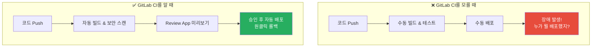
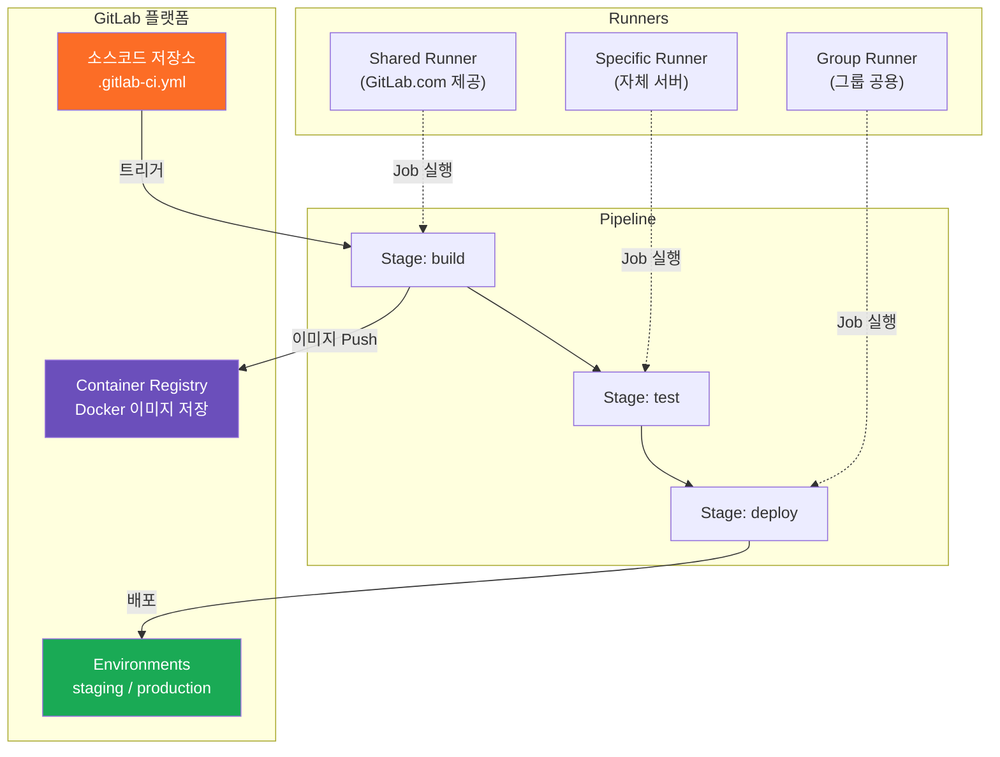
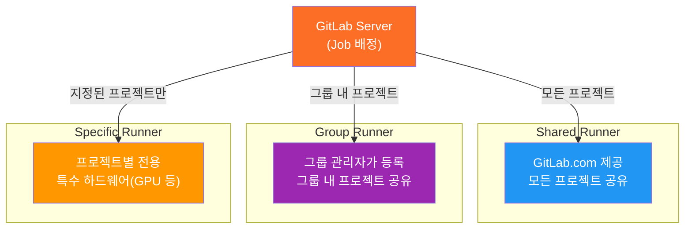
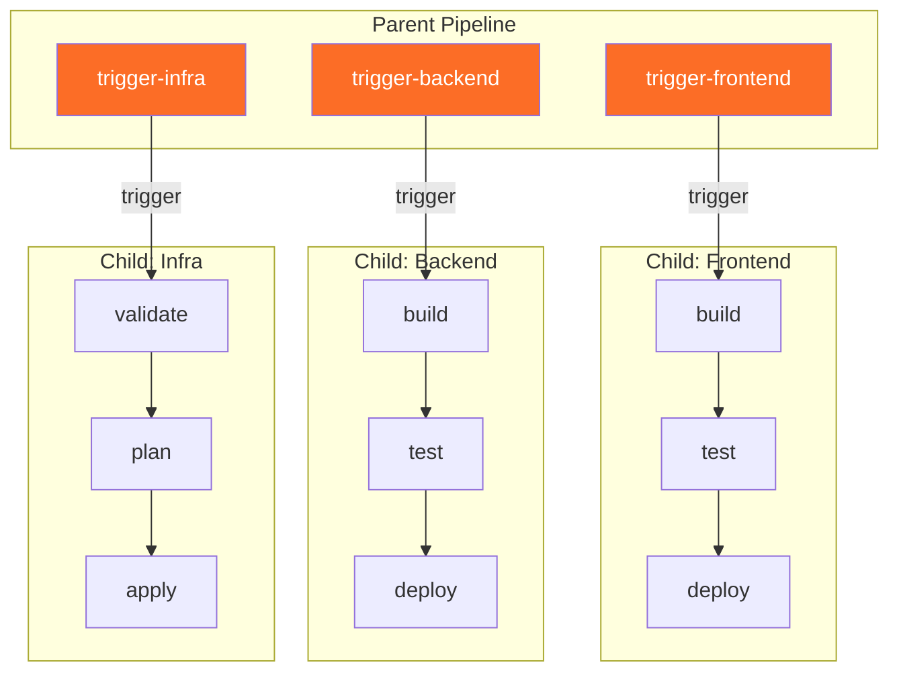
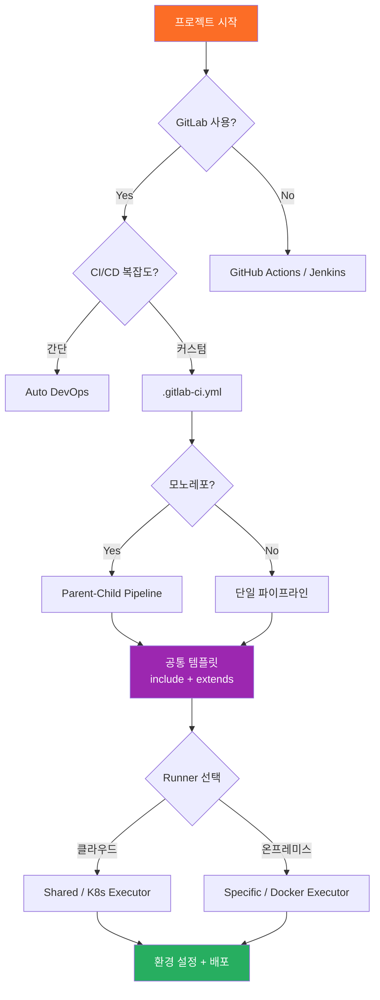

# GitLab CI 실무

> GitLab CI/CD는 코드 저장소와 CI/CD 파이프라인이 하나의 플랫폼에 통합되어 있는 올인원 DevOps 도구예요. GitHub Actions가 "앱스토어에서 필요한 앱을 골라 쓰는 스마트폰"이라면, GitLab CI는 "필요한 기능이 전부 내장된 올인원 가전제품"에 비유할 수 있어요. [GitHub Actions 실무](./05-github-actions)에서 배운 CI/CD 개념을 기반으로, GitLab만의 강력한 기능들을 함께 알아볼게요.

---

## 🎯 왜 GitLab CI를 알아야 하나요?

### 일상 비유: 올인원 주방 시스템

레스토랑을 운영한다고 상상해보세요.

- **GitHub Actions 방식**: 오븐은 A사, 냉장고는 B사, 식기세척기는 C사 제품을 따로 사서 연결해요. 자유도는 높지만 통합이 번거로워요.
- **GitLab CI 방식**: 오븐, 냉장고, 식기세척기가 하나의 빌트인 시스템으로 연결되어 있어요. 한 곳에서 전부 관리하고, 기기 간 연동도 자동이에요.

```
실무에서 GitLab CI가 필요한 순간:

• 회사에서 GitLab을 소스코드 관리에 사용하고 있음     → 별도 CI 도구 없이 바로 파이프라인 구축
• Self-hosted(온프레미스) 환경이 필요함                → GitLab CE/EE + 자체 Runner
• 코드 → 빌드 → 테스트 → 배포를 한 곳에서 관리하고 싶음 → 올인원 플랫폼
• 컨테이너 레지스트리까지 통합 관리가 필요함            → GitLab Container Registry 내장
• 보안 스캔(SAST/DAST)을 파이프라인에 녹이고 싶음      → Auto DevOps
• 복잡한 멀티 프로젝트 파이프라인이 필요함              → Parent-Child / Multi-project Pipeline
```

### GitLab CI를 모르면 생기는 문제



---

## 🧠 핵심 개념 잡기

### 1. .gitlab-ci.yml

> **비유**: 레스토랑의 주방 운영 매뉴얼

`.gitlab-ci.yml`은 프로젝트 루트에 놓이는 파이프라인 설정 파일이에요. "어떤 순서로, 어떤 작업을, 어떤 조건에서 실행할지"를 정의해요.

### 2. Pipeline, Stage, Job의 관계

> **비유**: 공장의 생산 라인

- **Pipeline**: 하나의 제품을 완성하는 전체 공정 라인
- **Stage**: 각 공정 단계 (원재료 검수 → 조립 → 검사 → 포장)
- **Job**: 각 단계에서 수행하는 구체적인 작업 (나사 조이기, 외관 검사 등)

### 3. Runner

> **비유**: 배달 라이더

Job을 실제로 실행하는 에이전트예요. 배달 앱의 라이더처럼, 주문(Job)이 들어오면 배정받아서 처리해요.

### 4. GitLab Container Registry

> **비유**: 공장 옆에 붙은 전용 창고

빌드한 Docker 이미지를 별도의 외부 저장소 없이 GitLab 프로젝트 안에서 바로 저장하고 관리할 수 있어요.

### 5. Environment & Review App

> **비유**: 신메뉴 시식 부스

배포 전에 실제와 동일한 환경에서 미리 확인할 수 있는 시스템이에요. Merge Request마다 임시 환경을 자동으로 만들어주는 것이 Review App이에요.

### 전체 구조 한눈에 보기



---

## 🔍 하나씩 자세히 알아보기

### 1. .gitlab-ci.yml 기본 구조

GitLab이 이 파일을 감지하면 자동으로 파이프라인을 실행해요.

```yaml
# .gitlab-ci.yml 기본 구조

# 1) 전역 설정
image: node:20-alpine          # 모든 Job의 기본 Docker 이미지
variables:                      # 전역 환경 변수
  APP_NAME: "my-app"
  NODE_ENV: "test"

# 2) 스테이지 정의 (실행 순서)
stages:
  - build
  - test
  - deploy

# 3) 전역 캐시 설정
cache:
  key: ${CI_COMMIT_REF_SLUG}
  paths:
    - node_modules/

# 4) Job 정의
build-job:
  stage: build                  # 어떤 스테이지에 속하는지
  script:                       # 실행할 명령어
    - npm ci
    - npm run build
  artifacts:                    # 다음 스테이지에 전달할 파일
    paths:
      - dist/
    expire_in: 1 hour

test-job:
  stage: test
  script:
    - npm test
  coverage: '/Lines\s*:\s*(\d+\.?\d*)%/'  # 커버리지 추출 정규식

deploy-job:
  stage: deploy
  script:
    - echo "Deploying $APP_NAME..."
  environment:
    name: production
    url: https://my-app.example.com
  when: manual                  # 수동 승인 후 실행
  rules:
    - if: $CI_COMMIT_BRANCH == "main"
```

### 2. Stages와 Jobs

#### Stage 실행 규칙

```
Stage 1 (build)     Stage 2 (test)      Stage 3 (deploy)
┌─────────────┐     ┌─────────────┐     ┌─────────────┐
│ build-app   │     │ unit-test   │     │ deploy-stg  │
│ build-docs  │ ──→ │ lint        │ ──→ │ deploy-prod │
└─────────────┘     │ e2e-test    │     └─────────────┘
  병렬 실행          └─────────────┘       병렬 실행
                      병렬 실행

  ⚠️ Stage 1이 모두 성공해야 Stage 2로 넘어가요!
```

#### Job 주요 설정 옵션

```yaml
comprehensive-job:
  stage: test
  image: python:3.12            # Job별 Docker 이미지 오버라이드
  rules:                        # 실행 조건
    - if: $CI_PIPELINE_SOURCE == "merge_request_event"
    - if: $CI_COMMIT_BRANCH == "main"
    - when: never
  variables:
    PYTHON_ENV: "testing"
  before_script:
    - pip install -r requirements.txt
  script:
    - pytest tests/ --cov=app
  after_script:                 # 성공/실패 무관하게 실행
    - echo "테스트 완료!"
  artifacts:
    paths:
      - coverage/
    reports:
      junit: report.xml         # MR에 테스트 결과 표시
    expire_in: 7 days
  cache:
    key: pip-$CI_COMMIT_REF_SLUG
    paths:
      - .pip-cache/
  needs: ["build-job"]          # Stage 순서 무시, 특정 Job 완료 후 즉시 실행
  timeout: 30 minutes
  retry:
    max: 2
    when: [runner_system_failure, stuck_or_timeout_failure]
  tags: [docker, linux]         # 특정 Runner에서 실행
  parallel: 3                   # 병렬로 3개 분할 실행
```

### 3. Variables와 Secrets

> **비유**: 레시피 카드(변수)와 금고(시크릿)

```yaml
# 전역 변수
variables:
  DATABASE_HOST: "db.example.com"

test-job:
  variables:
    DATABASE_HOST: "test-db.example.com"  # Job 레벨이 전역보다 우선
  script:
    - echo $DATABASE_HOST
```

```
변수 우선순위 (높은 것이 이김):

1. Trigger variables          ← API/트리거로 전달된 변수
2. Project CI/CD variables    ← GitLab UI에서 설정 (Settings > CI/CD)
3. Group CI/CD variables      ← 그룹 레벨 설정
4. Instance CI/CD variables   ← GitLab 인스턴스 레벨
5. .gitlab-ci.yml job 변수    ← Job 레벨
6. .gitlab-ci.yml 전역 변수   ← 파일 최상위
7. GitLab 내장 변수           ← CI_COMMIT_SHA, CI_PROJECT_NAME 등
```

#### 자주 쓰는 내장 변수

```yaml
script:
  - echo "커밋: $CI_COMMIT_SHORT_SHA"       # 짧은 커밋 해시
  - echo "브랜치: $CI_COMMIT_REF_NAME"      # 현재 브랜치명
  - echo "파이프라인: $CI_PIPELINE_ID"       # 파이프라인 ID
  - echo "소스: $CI_PIPELINE_SOURCE"         # push, merge_request_event 등
  - echo "레지스트리: $CI_REGISTRY_IMAGE"    # Container Registry 주소
  - echo "MR: $CI_MERGE_REQUEST_IID"         # MR 번호 (MR 파이프라인에서만)
```

#### 시크릿 관리

```
Settings > CI/CD > Variables > Add Variable

┌─────────────────────────────────────────────────────┐
│  Key:   DOCKER_PASSWORD                             │
│  Value: ********** (마스킹됨)                        │
│                                                     │
│  [✅] Protect variable  → protected 브랜치에서만     │
│  [✅] Mask variable     → 로그에서 *** 마스킹        │
│  Environment scope: production → 특정 환경에서만     │
└─────────────────────────────────────────────────────┘
```

### 4. GitLab Runner

#### Runner 유형 비교



#### Runner 설치 및 등록

```bash
# 1) Runner 설치 (Ubuntu)
curl -L "https://packages.gitlab.com/install/repositories/runner/gitlab-runner/script.deb.sh" | sudo bash
sudo apt-get install gitlab-runner

# 2) Runner 등록
sudo gitlab-runner register
# → GitLab URL, 등록 토큰, 설명, 태그, executor, 기본 이미지 입력

# 3) 상태 확인
sudo gitlab-runner status
sudo gitlab-runner list
```

#### Executor 유형과 설정

```toml
# /etc/gitlab-runner/config.toml

# Docker executor (가장 많이 사용)
[[runners]]
  name = "docker-runner"
  executor = "docker"
  [runners.docker]
    image = "alpine:latest"
    privileged = false
    volumes = ["/cache"]

# Kubernetes executor (K8s 클러스터에서 Pod으로 실행)
[[runners]]
  name = "k8s-runner"
  executor = "kubernetes"
  [runners.kubernetes]
    namespace = "gitlab-ci"
    cpu_request = "500m"
    memory_request = "256Mi"
```

```
Executor 선택 가이드:

┌─────────────────┬──────────────────────────────────────────┐
│ Executor        │ 적합한 상황                                │
├─────────────────┼──────────────────────────────────────────┤
│ Docker          │ 가장 범용적, 격리된 환경, 대부분의 CI/CD    │
│ Shell           │ 단순한 스크립트, Runner 서버 직접 사용      │
│ Kubernetes      │ K8s 클러스터 보유 시, 자동 스케일링          │
│ Docker+Machine  │ 대규모 프로젝트, 비용 최적화 필요 시         │
└─────────────────┴──────────────────────────────────────────┘
```

### 5. Cache와 Artifacts

> **비유**: 캐시는 "내 자리 서랍", Artifacts는 "팀 공유 캐비닛"

```yaml
build-job:
  script:
    - npm ci && npm run build
  cache:                          # 다음 파이프라인에서 재사용
    key:
      files: [package-lock.json]  # 이 파일이 바뀌면 캐시 갱신
    paths: [node_modules/]
    policy: pull-push             # 읽기 + 쓰기
  artifacts:                      # 다음 Stage의 Job에 전달
    paths: [dist/]
    expire_in: 1 day

test-job:
  script: npm test
  cache:
    key:
      files: [package-lock.json]
    paths: [node_modules/]
    policy: pull                  # 읽기만 (속도 향상)
  dependencies: [build-job]       # build-job의 artifacts를 가져옴
```

```
┌──────────────┬────────────────────────┬──────────────────────────┐
│              │ Cache                  │ Artifacts                │
├──────────────┼────────────────────────┼──────────────────────────┤
│ 목적         │ 빌드 속도 향상           │ Job 간 데이터 전달        │
│ 지속 범위     │ 파이프라인 간 유지        │ 파이프라인 내 전달        │
│ 보장 여부     │ best-effort (없을 수도)  │ 항상 보장됨              │
│ 사용 사례     │ node_modules, .m2, pip  │ dist/, report.xml       │
│ 다운로드      │ 자동                    │ GitLab UI에서도 가능      │
└──────────────┴────────────────────────┴──────────────────────────┘
```

### 6. Environments와 Review App

```yaml
deploy-staging:
  stage: deploy
  script: ./deploy.sh staging
  environment:
    name: staging
    url: https://staging.example.com
    on_stop: stop-staging          # 환경 중지 Job 연결
  rules:
    - if: $CI_COMMIT_BRANCH == "develop"

stop-staging:
  script: ./teardown.sh staging
  environment:
    name: staging
    action: stop
  when: manual

# Review App — MR마다 임시 환경을 자동 생성
review-app:
  script:
    - kubectl apply -f k8s/ --namespace=review-${CI_MERGE_REQUEST_IID}
  environment:
    name: review/${CI_MERGE_REQUEST_SOURCE_BRANCH_NAME}
    url: https://${CI_MERGE_REQUEST_IID}.review.example.com
    on_stop: stop-review
    auto_stop_in: 1 week           # 1주 후 자동 삭제
  rules:
    - if: $CI_PIPELINE_SOURCE == "merge_request_event"
```

### 7. include와 extends (코드 재사용)

> **비유**: 레고 블록 — 공통 설정을 분리하고 조립해서 사용

```yaml
# .gitlab-ci.yml
include:
  - local: '/ci/build.yml'                          # 같은 프로젝트
  - project: 'devops/ci-templates'                  # 다른 프로젝트
    ref: main
    file: '/templates/docker-build.yml'
  - template: Security/SAST.gitlab-ci.yml           # GitLab 제공 템플릿
```

```yaml
# extends로 공통 설정 상속
.default-job:
  image: node:20-alpine
  before_script: [npm ci]
  cache:
    key: ${CI_COMMIT_REF_SLUG}
    paths: [node_modules/]
  tags: [docker]

unit-test:
  extends: .default-job
  stage: test
  script: [npm run test:unit]

integration-test:
  extends: .default-job
  stage: test
  script: [npm run test:integration]
  services: [postgres:16-alpine]
```

### 8. GitLab Container Registry

```yaml
variables:
  IMAGE_TAG: $CI_REGISTRY_IMAGE:$CI_COMMIT_SHORT_SHA

# Docker-in-Docker 방식
build-dind:
  image: docker:24
  services: [docker:24-dind]
  variables:
    DOCKER_TLS_CERTDIR: "/certs"
  before_script:
    - docker login -u $CI_REGISTRY_USER -p $CI_REGISTRY_PASSWORD $CI_REGISTRY
  script:
    - docker build -t $IMAGE_TAG .
    - docker push $IMAGE_TAG

# Kaniko 방식 (privileged 불필요 — 보안적으로 더 안전)
build-kaniko:
  image:
    name: gcr.io/kaniko-project/executor:debug
    entrypoint: [""]
  script:
    - mkdir -p /kaniko/.docker
    - >
      echo "{\"auths\":{\"$CI_REGISTRY\":{\"auth\":\"$(echo -n ${CI_REGISTRY_USER}:${CI_REGISTRY_PASSWORD} | base64)\"}}}"
      > /kaniko/.docker/config.json
    - >
      /kaniko/executor
      --context $CI_PROJECT_DIR
      --dockerfile $CI_PROJECT_DIR/Dockerfile
      --destination $IMAGE_TAG
      --cache=true
```

```
GitLab Container Registry 주소 형식:
  registry.gitlab.com/<네임스페이스>/<프로젝트명>:<태그>
  registry.gitlab.com/myteam/backend-api:v1.2.3
```

### 9. Merge Request Pipeline

```yaml
# 파이프라인 중복 실행 방지 (Push + MR 동시 실행 문제 해결)
workflow:
  rules:
    - if: $CI_PIPELINE_SOURCE == "merge_request_event"
    - if: $CI_COMMIT_BRANCH && $CI_OPEN_MERGE_REQUESTS
      when: never        # MR이 열려있으면 Push 파이프라인은 실행하지 않음
    - if: $CI_COMMIT_BRANCH
    - if: $CI_COMMIT_TAG

# 변경된 파일만 검사
changed-files-test:
  script:
    - git diff --name-only $CI_MERGE_REQUEST_DIFF_BASE_SHA
    - npm run test -- --changedSince=$CI_MERGE_REQUEST_DIFF_BASE_SHA
  rules:
    - if: $CI_PIPELINE_SOURCE == "merge_request_event"
      changes: ["src/**/*", "tests/**/*"]
```

### 10. Parent-Child Pipeline

> **비유**: 본사와 지사 — 마이크로서비스별 독립 파이프라인

```yaml
# .gitlab-ci.yml (부모)
trigger-frontend:
  trigger:
    include: frontend/.gitlab-ci.yml
    strategy: depend               # 자식 결과가 부모에 반영
  rules:
    - changes: ["frontend/**/*"]

trigger-backend:
  trigger:
    include: backend/.gitlab-ci.yml
    strategy: depend
  rules:
    - changes: ["backend/**/*"]
```



### 11. Auto DevOps

> **비유**: 자동 운전 모드 — `.gitlab-ci.yml` 없이도 자동으로 빌드, 테스트, 배포, 보안 스캔

```
Auto DevOps가 자동으로 해주는 것들:

 1. Auto Build              → Dockerfile 또는 Buildpack으로 이미지 빌드
 2. Auto Test               → Herokuish 기반 자동 테스트
 3. Auto Code Quality       → 코드 품질 분석
 4. Auto SAST / DAST        → 정적/동적 보안 분석
 5. Auto Container Scanning → Docker 이미지 취약점 스캔
 6. Auto License            → 라이선스 컴플라이언스 검사
 7. Auto Review App         → MR마다 임시 환경 생성
 8. Auto Deploy             → Kubernetes에 자동 배포
 9. Auto Monitoring         → Prometheus 모니터링 자동 설정
```

```yaml
# 활성화 방법
# 방법 1: Settings > CI/CD > Auto DevOps > Enable
# 방법 2: 필요한 것만 선택적으로 포함
include:
  - template: Jobs/Build.gitlab-ci.yml
  - template: Security/SAST.gitlab-ci.yml
  - template: Security/Container-Scanning.gitlab-ci.yml

# 커스터마이징 변수
variables:
  POSTGRES_ENABLED: "false"           # 자동 PostgreSQL 비활성화
  STAGING_ENABLED: "1"                # 스테이징 환경 활성화
  CANARY_ENABLED: "1"                 # 카나리 배포 활성화
```

---

## 💻 직접 해보기

### 실습 1: Node.js 프로젝트 기본 파이프라인

```yaml
# .gitlab-ci.yml
image: node:20-alpine

stages:
  - install
  - quality
  - build
  - deploy

install-deps:
  stage: install
  script: npm ci --prefer-offline
  cache:
    key:
      files: [package-lock.json]
    paths: [node_modules/]
    policy: pull-push
  artifacts:
    paths: [node_modules/]
    expire_in: 1 hour

lint:
  stage: quality
  needs: [{job: install-deps, artifacts: true}]
  script: npm run lint

unit-test:
  stage: quality
  needs: [{job: install-deps, artifacts: true}]
  script: npm run test -- --coverage
  coverage: '/All files[^|]*\|[^|]*\s+([\d\.]+)/'
  artifacts:
    reports:
      junit: junit.xml
      coverage_report:
        coverage_format: cobertura
        path: coverage/cobertura-coverage.xml

build-app:
  stage: build
  needs: [lint, unit-test]
  script: npm run build
  artifacts:
    paths: [dist/]
    expire_in: 1 day
  dependencies: [install-deps]

deploy-staging:
  stage: deploy
  needs: [build-app]
  script: npx netlify deploy --dir=dist --site=$NETLIFY_SITE_ID --auth=$NETLIFY_AUTH_TOKEN
  environment:
    name: staging
    url: https://staging.example.com
  rules:
    - if: $CI_COMMIT_BRANCH == "develop"

deploy-production:
  stage: deploy
  needs: [build-app]
  script: npx netlify deploy --dir=dist --site=$NETLIFY_SITE_ID --auth=$NETLIFY_AUTH_TOKEN --prod
  environment:
    name: production
    url: https://www.example.com
  when: manual
  rules:
    - if: $CI_COMMIT_BRANCH == "main"
```

### 실습 2: Docker 빌드 + K8s 배포

```yaml
# .gitlab-ci.yml
variables:
  IMAGE_TAG: $CI_REGISTRY_IMAGE:$CI_COMMIT_SHORT_SHA

stages:
  - test
  - build
  - deploy

test:
  image: python:3.12-slim
  before_script: pip install -r requirements.txt
  script: pytest tests/ -v --junitxml=report.xml
  artifacts:
    reports:
      junit: report.xml

build-image:
  image:
    name: gcr.io/kaniko-project/executor:debug
    entrypoint: [""]
  script:
    - mkdir -p /kaniko/.docker
    - >
      echo "{\"auths\":{\"$CI_REGISTRY\":{\"auth\":\"$(echo -n ${CI_REGISTRY_USER}:${CI_REGISTRY_PASSWORD} | base64)\"}}}"
      > /kaniko/.docker/config.json
    - >
      /kaniko/executor
      --context $CI_PROJECT_DIR
      --dockerfile $CI_PROJECT_DIR/Dockerfile
      --destination $IMAGE_TAG
      --destination $CI_REGISTRY_IMAGE:latest
      --cache=true
  rules:
    - if: $CI_COMMIT_BRANCH == "main"

deploy-staging:
  image: bitnami/kubectl:latest
  script:
    - kubectl set image deployment/my-app my-app=$IMAGE_TAG -n staging
    - kubectl rollout status deployment/my-app -n staging --timeout=300s
  environment:
    name: staging
    url: https://staging.example.com
  rules:
    - if: $CI_COMMIT_BRANCH == "main"

deploy-production:
  image: bitnami/kubectl:latest
  script:
    - kubectl set image deployment/my-app my-app=$IMAGE_TAG -n production
    - kubectl rollout status deployment/my-app -n production --timeout=300s
  environment:
    name: production
    url: https://www.example.com
  when: manual
  rules:
    - if: $CI_COMMIT_BRANCH == "main"
```

### 실습 3: 재사용 가능한 CI 템플릿

```yaml
# ci/templates/docker-build.yml — 팀 공용 템플릿
.docker-build-template:
  image:
    name: gcr.io/kaniko-project/executor:debug
    entrypoint: [""]
  script:
    - mkdir -p /kaniko/.docker
    - >
      echo "{\"auths\":{\"$CI_REGISTRY\":{\"auth\":\"$(echo -n ${CI_REGISTRY_USER}:${CI_REGISTRY_PASSWORD} | base64)\"}}}"
      > /kaniko/.docker/config.json
    - >
      /kaniko/executor
      --context $CI_PROJECT_DIR/$BUILD_CONTEXT
      --dockerfile $CI_PROJECT_DIR/$BUILD_CONTEXT/$DOCKERFILE_PATH
      --destination $CI_REGISTRY_IMAGE/$SERVICE_NAME:$CI_COMMIT_SHORT_SHA
      --cache=true

.deploy-k8s-template:
  image: bitnami/kubectl:latest
  script:
    - kubectl set image deployment/$SERVICE_NAME $SERVICE_NAME=$CI_REGISTRY_IMAGE/$SERVICE_NAME:$CI_COMMIT_SHORT_SHA -n $DEPLOY_ENV
    - kubectl rollout status deployment/$SERVICE_NAME -n $DEPLOY_ENV --timeout=300s
```

```yaml
# .gitlab-ci.yml — 템플릿 사용하는 프로젝트
include:
  - project: 'devops/ci-templates'
    ref: main
    file: '/ci/templates/docker-build.yml'

variables:
  SERVICE_NAME: "my-service"
  BUILD_CONTEXT: "."
  DOCKERFILE_PATH: "Dockerfile"

build:
  extends: .docker-build-template
  stage: build

deploy-staging:
  extends: .deploy-k8s-template
  stage: deploy
  variables:
    DEPLOY_ENV: staging
  environment: {name: staging}

deploy-production:
  extends: .deploy-k8s-template
  stage: deploy
  variables:
    DEPLOY_ENV: production
  environment: {name: production}
  when: manual
```

---

## 🏢 실무에서는?

### 시나리오 1: 마이크로서비스 조직의 중앙 템플릿 운영

```yaml
# 20개+ 서비스를 가진 조직 패턴
# devops/ci-templates 프로젝트에 공통 템플릿을 관리하고, 서비스별 .gitlab-ci.yml은 최소화

include:
  - project: 'platform/ci-templates'
    ref: v2.5.0                          # 버전 고정으로 안정성 확보
    file:
      - '/templates/build.yml'
      - '/templates/test.yml'
      - '/templates/deploy.yml'
      - '/templates/security.yml'

variables:
  SERVICE_NAME: "order-service"
  JAVA_VERSION: "21"

test:
  extends: .java-test
  services: [postgres:16-alpine, redis:7-alpine]
```

### 시나리오 2: 금융 서비스 보안 파이프라인

```yaml
stages: [build, test, security, compliance, deploy-staging, deploy-production]

include:
  - template: Security/SAST.gitlab-ci.yml
  - template: Security/Dependency-Scanning.gitlab-ci.yml
  - template: Security/Container-Scanning.gitlab-ci.yml
  - template: Security/Secret-Detection.gitlab-ci.yml

license-check:
  stage: compliance
  script: echo "라이선스 정책 검사..."
  allow_failure: false                   # 실패 시 배포 차단

deploy-production:
  stage: deploy-production
  script: ./deploy.sh production
  environment:
    name: production
    deployment_tier: production
  when: manual                           # 수동 승인 + Protected Environment
  rules:
    - if: $CI_COMMIT_BRANCH == "main"
```

### 시나리오 3: Runner 관리 전략

```
┌──────────────────────────────────────────────────────────────┐
│ GitLab.com Shared Runner                                     │
│  → 소규모 팀, 간단한 CI 작업, 무료 할당량 내 사용              │
├──────────────────────────────────────────────────────────────┤
│ AWS EC2 Spot Instance + Docker+Machine Executor              │
│  → 대규모 CI, Spot으로 70~80% 비용 절감, 자동 스케일링         │
├──────────────────────────────────────────────────────────────┤
│ Kubernetes Executor                                          │
│  → K8s 클러스터 운영 팀, Pod 기반 자동 스케일링, 리소스 격리    │
├──────────────────────────────────────────────────────────────┤
│ Self-hosted Docker Executor                                  │
│  → GPU/특수 하드웨어, 온프레미스 네트워크 제한 환경             │
└──────────────────────────────────────────────────────────────┘
```

### GitHub Actions vs GitLab CI 비교표

```
┌──────────────────────┬──────────────────────────┬──────────────────────────┐
│ 항목                  │ GitHub Actions            │ GitLab CI                │
├──────────────────────┼──────────────────────────┼──────────────────────────┤
│ 설정 파일             │ .github/workflows/*.yml   │ .gitlab-ci.yml (단일)     │
│ 실행 단위             │ Workflow > Job > Step     │ Pipeline > Stage > Job   │
│ 트리거               │ on: push, pull_request    │ rules, workflow:rules    │
│ 재사용               │ Marketplace Actions       │ include + extends        │
│ 실행 환경             │ GitHub-hosted/Self-hosted │ Shared/Group/Specific    │
│ 컨테이너 레지스트리    │ ghcr.io (별도)            │ 내장 Container Registry   │
│ 환경 관리             │ Environments              │ Environments + Review App│
│ 캐시/아티팩트         │ actions/cache (별도)       │ cache/artifacts (내장)    │
│ 보안 스캔             │ CodeQL + Marketplace      │ 내장 SAST/DAST/Secret    │
│ Auto DevOps          │ 없음                      │ 내장                     │
│ Parent-Child Pipeline│ Reusable Workflows        │ trigger: include          │
│ Self-hosted          │ 가능 (제한적)              │ GitLab CE/EE (완전 지원)  │
│ 무료 할당량           │ 2,000분/월                │ 400분/월                  │
│ 강점                 │ 오픈소스, Marketplace 생태계│ 올인원 플랫폼, Self-hosted│
└──────────────────────┴──────────────────────────┴──────────────────────────┘

• GitHub Actions → 오픈소스, 스타트업, GitHub 중심 워크플로우에 적합
• GitLab CI → 엔터프라이즈, 온프레미스, 올인원 DevOps 플랫폼이 필요한 조직에 적합
```

---

## ⚠️ 자주 하는 실수

### 실수 1: only/except 대신 rules를 써야 해요

```yaml
# ❌ 레거시 방식 — 더 이상 권장하지 않아요
deploy-job:
  script: ./deploy.sh
  only: [main]
  except: [tags]

# ✅ 현대적 방식 — rules 사용
deploy-job:
  script: ./deploy.sh
  rules:
    - if: $CI_COMMIT_BRANCH == "main" && $CI_COMMIT_TAG == null

# ⚠️ only/except와 rules를 같은 Job에 혼용하면 에러!
```

### 실수 2: Cache를 Artifacts처럼 쓰면 안 돼요

```yaml
# ❌ Cache로 빌드 결과를 전달하려는 실수 — 캐시는 보장이 안 돼요!
build:
  script: npm run build
  cache:
    paths: [dist/]

deploy:
  script: ls dist/         # dist/가 없을 수 있음!

# ✅ 빌드 결과물은 반드시 Artifacts로 전달
build:
  script: npm run build
  artifacts:
    paths: [dist/]
    expire_in: 1 hour
```

### 실수 3: Docker-in-Docker 보안 문제

```yaml
# ❌ privileged: true는 보안 위험
build-image:
  image: docker:24
  services: [docker:24-dind]
  variables:
    DOCKER_TLS_CERTDIR: ""     # TLS 없이? 더 위험!

# ✅ Kaniko를 쓰면 privileged 불필요
build-image:
  image:
    name: gcr.io/kaniko-project/executor:debug
    entrypoint: [""]
  script:
    - /kaniko/executor --context $CI_PROJECT_DIR --dockerfile Dockerfile --destination $IMAGE_TAG
```

### 실수 4: needs 사용 시 artifacts 누락

```yaml
# ❌ needs를 쓰면 artifacts가 자동으로 안 넘어올 수 있어요
test:
  needs: ["build"]
  script: ls dist/          # dist/가 없을 수 있음!

# ✅ artifacts를 명시적으로 요청
test:
  needs:
    - job: build
      artifacts: true
  script: ls dist/           # 이제 OK
```

### 실수 5: 시크릿을 파일에 직접 작성

```yaml
# ❌ 절대 금지 — Git 히스토리에 영구 저장!
variables:
  AWS_SECRET_ACCESS_KEY: "wJalrXUtnFEMI/K7MDENG/bPxRfiCYEXAMPLEKEY"

# ✅ GitLab UI(Settings > CI/CD > Variables)에서 Protect + Mask 옵션으로 설정
variables:
  AWS_REGION: "ap-northeast-2"     # 민감하지 않은 값만 파일에
```

### 실수 6: 파이프라인 중복 실행

```yaml
# ❌ Push와 MR에서 파이프라인이 2번 실행됨
test:
  script: npm test

# ✅ workflow:rules로 중복 방지
workflow:
  rules:
    - if: $CI_PIPELINE_SOURCE == "merge_request_event"
    - if: $CI_COMMIT_BRANCH && $CI_OPEN_MERGE_REQUESTS
      when: never
    - if: $CI_COMMIT_BRANCH
```

### 실수 7: Runner 태그 불일치

```yaml
# ❌ 존재하지 않는 태그 → Job이 영원히 pending 상태!
build:
  tags: [gpu-runner, cuda]

# ✅ 등록된 Runner의 태그와 정확히 일치하는 값 사용
build:
  tags: [docker, linux]
```

---

## 📝 마무리

### GitLab CI 핵심 체크리스트

```
✅ 기본 구조
  □ .gitlab-ci.yml 파일 구조 (image, stages, jobs)
  □ Pipeline → Stage → Job 계층과 병렬/순차 실행 규칙
  □ rules로 실행 조건 제어 (only/except 대신)

✅ 실행 환경
  □ Runner 유형 (Shared / Group / Specific)
  □ Executor 선택 (Docker / Kubernetes / Shell)
  □ tags로 특정 Runner 지정

✅ 데이터 관리
  □ Cache(속도 최적화) vs Artifacts(Job 간 전달) 구분
  □ Variables 우선순위와 시크릿 관리 (UI에서 Protect + Mask)
  □ needs/dependencies로 Job 간 의존성 설정

✅ 고급 기능
  □ include/extends로 설정 재사용
  □ environments + Review App
  □ Parent-Child Pipeline (모노레포)
  □ GitLab Container Registry + Kaniko
  □ Auto DevOps 활용
```

### 파이프라인 설계 의사결정 흐름



### .gitlab-ci.yml 키워드 요약

```
전역:  image | variables | stages | cache | workflow | before_script | after_script
Job:   stage | script | image | rules | tags | needs | dependencies
       artifacts | cache | services | environment | when | retry | timeout
       parallel | allow_failure | extends
재사용: include (local/project/remote/template) | extends | trigger
```

---

## 🔗 다음 단계

### 이전 강의

- [GitHub Actions 실무](./05-github-actions): GitHub Actions의 핵심 개념과 실무 활용법

### 다음 강의

- [Jenkins 실무](./07-jenkins): 가장 오래되고 유연한 CI/CD 도구, Jenkins Pipeline과 Groovy DSL

### 더 깊이 공부하기

```
1. GitLab CI 공식 문서         → https://docs.gitlab.com/ee/ci/
2. .gitlab-ci.yml 키워드 레퍼런스 → https://docs.gitlab.com/ee/ci/yaml/
3. GitLab Runner 문서          → https://docs.gitlab.com/runner/
4. Auto DevOps 문서            → https://docs.gitlab.com/ee/topics/autodevops/
5. GitLab CI/CD 예제 모음      → https://docs.gitlab.com/ee/ci/examples/
```

### 학습 로드맵

```
[Git 기본] → [브랜칭 전략] → [CI 개념] → [CD 개념]
    ↓
[GitHub Actions] → [GitLab CI ✅ 지금 여기!] → [Jenkins]
    ↓
[아티팩트 관리] → [테스트 자동화] → [배포 전략]
    ↓
[GitOps (ArgoCD)] → [파이프라인 보안] → [변경 관리]
```
