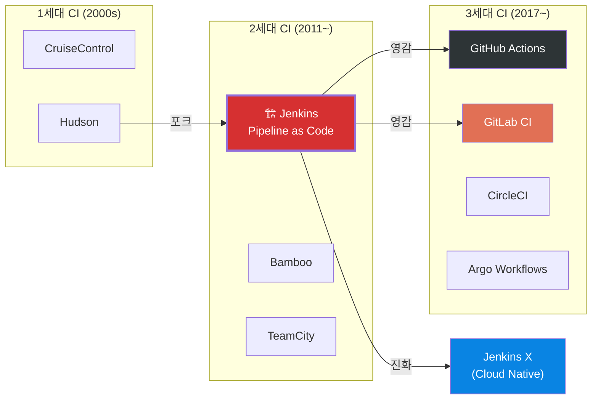
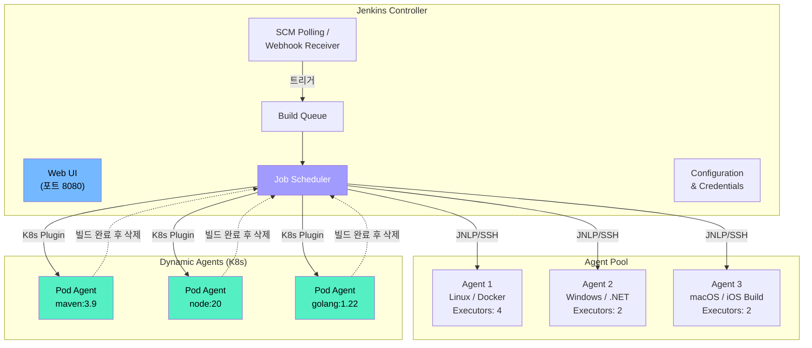
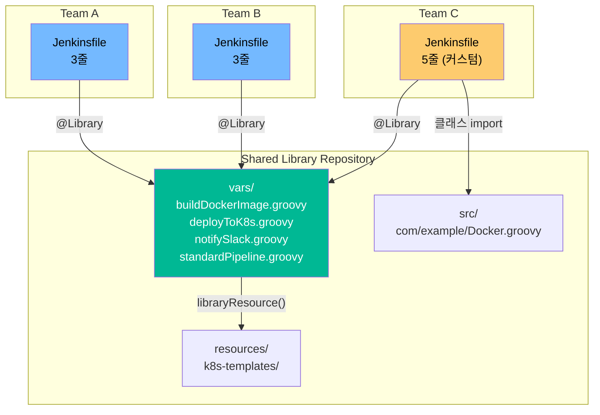
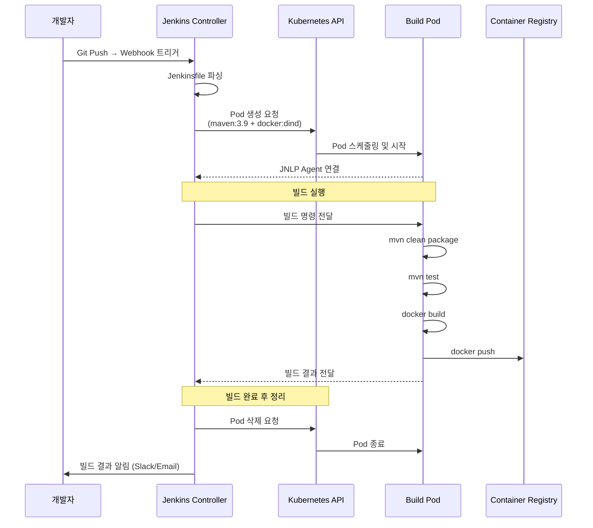
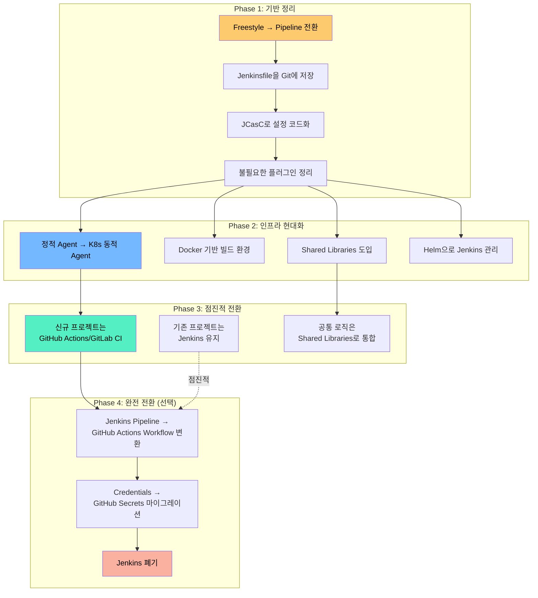

# Jenkins 실무 완전 정복

> Jenkins는 CI/CD 세계의 "원조 맛집"이에요. 2011년부터 수많은 기업의 빌드/배포를 책임져 왔고, 1,800개 이상의 플러그인으로 거의 모든 시나리오를 커버해요. 최신 CI/CD 도구([GitHub Actions](./05-github-actions), [GitLab CI](./06-gitlab-ci))가 등장했지만, 여전히 전 세계 기업의 44%가 Jenkins를 사용하고 있어요. 레거시를 이해하고 현대화하는 능력은 DevOps 엔지니어의 핵심 역량이에요.

---

## 🎯 왜 Jenkins를 알아야 하나요?

### 일상 비유: 동네 만능 수리점

동네에 뭐든 고쳐주는 만능 수리점이 있어요. 에어컨도 고치고, 배관도 고치고, 전기도 봐줘요.

- 30년 경력이라 웬만한 건 다 해결해요
- 다만, 가게가 오래되어서 인테리어는 좀 낡았어요
- 최신 스마트홈 기기도 도구만 추가하면 다룰 수 있어요
- 새로 생긴 전문점(GitHub Actions, GitLab CI)보다 범용성이 넓어요

**이게 바로 Jenkins예요.**

```
실무에서 Jenkins가 등장하는 순간:

• 기존 회사에 입사했는데 CI/CD가 전부 Jenkins      → 유지보수 필수
• 복잡한 빌드 파이프라인이 필요해요                  → 유연한 Pipeline DSL
• 온프레미스 환경에서 CI/CD를 구축해야 해요          → 클라우드 종속 없음
• 200개 팀이 공통 빌드 로직을 공유해야 해요          → Shared Libraries
• Kubernetes 위에서 동적 빌드 에이전트가 필요해요    → Jenkins on K8s
• 레거시 Jenkins → 현대 CI 마이그레이션 계획         → 전환 전략 수립
```

### CI/CD 도구 생태계에서의 Jenkins 위치



---

## 🧠 핵심 개념 잡기

### 1. Jenkins Architecture: Controller와 Agent

> **비유**: 건설 현장 감독과 작업자

건설 현장에서 감독(Controller)은 전체 공정을 계획하고 지시해요. 실제 벽돌을 쌓고 페인트를 칠하는 건 작업자(Agent)예요. 감독 혼자 모든 걸 하면 병목이 생기니까, 여러 작업자에게 일을 분배하는 거예요.

- **Controller (Master)**: Jenkins의 두뇌. 스케줄링, UI, 설정 관리
- **Agent (Worker/Slave)**: 실제 빌드를 실행하는 노드
- **Executor**: Agent 안에서 빌드를 수행하는 스레드 (작업자의 "손")

### 2. Pipeline as Code

> **비유**: 요리 레시피를 코드로 버전 관리하기

예전에는 Jenkins UI에서 클릭으로 빌드를 설정했어요 (Freestyle Job). 이제는 `Jenkinsfile`이라는 코드 파일에 파이프라인을 정의해요. Git에 함께 저장되니까 변경 이력이 남고, 코드 리뷰도 가능해요.

### 3. Declarative vs Scripted Pipeline

> **비유**: 정해진 양식 vs 자유 형식

- **Declarative Pipeline**: 정해진 양식(구조)에 맞춰 작성해요. 초보자도 읽기 쉬워요
- **Scripted Pipeline**: Groovy 스크립트로 자유롭게 작성해요. 복잡한 로직에 유리해요

### 4. 플러그인 생태계

> **비유**: 스마트폰 앱스토어

Jenkins 자체는 기본 기능만 있어요. 필요한 기능은 플러그인으로 설치해요. Git 연동, Docker 빌드, Kubernetes 에이전트, Slack 알림 — 전부 플러그인이에요. 1,800개 이상의 플러그인이 "앱스토어"에 있어요.

### 5. Shared Libraries

> **비유**: 회사 공용 템플릿

모든 팀이 비슷한 빌드 로직을 반복 작성하는 건 낭비예요. Shared Libraries는 공통 빌드 로직을 하나의 Git 저장소에 모아두고, 모든 Jenkinsfile에서 import해서 쓰는 "회사 공용 템플릿"이에요.

---

## 🔍 하나씩 자세히 알아보기

### 1. Jenkins Architecture 깊이 보기



#### Controller의 역할

| 역할 | 설명 |
|------|------|
| **스케줄링** | 어떤 빌드를 어떤 Agent에서 실행할지 결정 |
| **UI 제공** | 웹 대시보드로 빌드 상태 확인, 설정 관리 |
| **인증/인가** | 사용자 권한 관리 (RBAC) |
| **플러그인 관리** | 플러그인 설치, 업데이트, 설정 |
| **빌드 이력** | 빌드 로그, 아티팩트, 테스트 결과 저장 |

#### Agent 연결 방식

```bash
# 1. SSH로 Agent 연결 (가장 일반적)
# Controller가 SSH로 Agent에 접속하여 빌드 실행

# 2. JNLP (Java Web Start) 연결
# Agent가 Controller에 능동적으로 연결 (방화벽 안에 있을 때 유용)
java -jar agent.jar \
  -url http://jenkins-controller:8080 \
  -secret <secret> \
  -name "agent-01" \
  -workDir "/var/jenkins"

# 3. Docker Agent
# 빌드마다 Docker 컨테이너를 생성하고 파괴
# Jenkinsfile에서 agent { docker { image 'maven:3.9' } } 로 사용

# 4. Kubernetes Agent
# K8s 클러스터에 Pod를 동적으로 생성
# 빌드 완료 후 자동 삭제 → 리소스 효율적
```

#### Controller 보안 원칙

```
⚠️ 중요 원칙: Controller에서는 절대 빌드를 실행하지 마세요!

이유:
1. 빌드 스크립트가 Controller 파일시스템에 접근 가능 → 보안 위협
2. 빌드가 CPU/메모리를 점유하면 UI가 멈춰요
3. 빌드 환경이 Controller 환경과 다를 수 있어요

설정: Manage Jenkins → Nodes → Built-In Node → Executors: 0
```

---

### 2. Jenkinsfile: Declarative Pipeline

Declarative Pipeline은 정해진 구조를 따르기 때문에 가독성이 좋고 유지보수가 쉬워요.

```groovy
// Jenkinsfile (Declarative Pipeline)
pipeline {
    // 어떤 Agent에서 실행할지
    agent {
        kubernetes {
            yaml '''
            apiVersion: v1
            kind: Pod
            spec:
              containers:
              - name: maven
                image: maven:3.9-eclipse-temurin-17
                command: ['sleep']
                args: ['infinity']
              - name: docker
                image: docker:24-dind
                securityContext:
                  privileged: true
            '''
        }
    }

    // 환경 변수
    environment {
        APP_NAME    = 'my-service'
        REGISTRY    = 'registry.example.com'
        IMAGE_TAG   = "${env.GIT_COMMIT?.take(7) ?: 'latest'}"
        SONAR_TOKEN = credentials('sonarqube-token')  // 자격증명 참조
    }

    // 파이프라인 옵션
    options {
        timeout(time: 30, unit: 'MINUTES')        // 전체 타임아웃
        disableConcurrentBuilds()                   // 동시 빌드 금지
        buildDiscarder(logRotator(numToKeepStr: '10'))  // 빌드 이력 10개만 유지
        timestamps()                                // 로그에 타임스탬프
    }

    // 파이프라인 트리거
    triggers {
        pollSCM('H/5 * * * *')  // 5분마다 SCM 폴링 (H는 부하 분산)
    }

    // 파이프라인 파라미터
    parameters {
        choice(name: 'ENVIRONMENT', choices: ['dev', 'staging', 'prod'],
               description: '배포 환경 선택')
        booleanParam(name: 'SKIP_TESTS', defaultValue: false,
                     description: '테스트 건너뛰기')
        string(name: 'DEPLOY_VERSION', defaultValue: '',
               description: '특정 버전 배포 (비어있으면 최신)')
    }

    stages {
        // ===== Stage 1: 체크아웃 =====
        stage('Checkout') {
            steps {
                checkout scm
                script {
                    env.GIT_COMMIT_MSG = sh(
                        script: 'git log -1 --pretty=%B',
                        returnStdout: true
                    ).trim()
                }
            }
        }

        // ===== Stage 2: 빌드 =====
        stage('Build') {
            steps {
                container('maven') {
                    sh '''
                        echo "Building ${APP_NAME}..."
                        mvn clean package -DskipTests
                    '''
                }
            }
        }

        // ===== Stage 3: 테스트 (병렬) =====
        stage('Test') {
            when {
                not { expression { params.SKIP_TESTS } }
            }
            parallel {
                stage('Unit Tests') {
                    steps {
                        container('maven') {
                            sh 'mvn test'
                        }
                    }
                    post {
                        always {
                            junit '**/target/surefire-reports/*.xml'
                        }
                    }
                }
                stage('Integration Tests') {
                    steps {
                        container('maven') {
                            sh 'mvn verify -Pintegration-test'
                        }
                    }
                }
                stage('SonarQube Analysis') {
                    steps {
                        container('maven') {
                            sh '''
                                mvn sonar:sonar \
                                  -Dsonar.token=${SONAR_TOKEN}
                            '''
                        }
                    }
                }
            }
        }

        // ===== Stage 4: Docker 이미지 빌드 =====
        stage('Docker Build & Push') {
            steps {
                container('docker') {
                    sh '''
                        docker build -t ${REGISTRY}/${APP_NAME}:${IMAGE_TAG} .
                        docker push ${REGISTRY}/${APP_NAME}:${IMAGE_TAG}
                    '''
                }
            }
        }

        // ===== Stage 5: 배포 (조건부) =====
        stage('Deploy to Dev') {
            when {
                branch 'develop'
            }
            steps {
                sh "kubectl set image deployment/${APP_NAME} app=${REGISTRY}/${APP_NAME}:${IMAGE_TAG} -n dev"
            }
        }

        stage('Deploy to Production') {
            when {
                allOf {
                    branch 'main'
                    expression { params.ENVIRONMENT == 'prod' }
                }
            }
            input {
                message '프로덕션에 배포하시겠습니까?'
                ok '배포 승인'
                submitter 'admin,deployer'  // 승인 권한자
                parameters {
                    string(name: 'CONFIRM', defaultValue: '',
                           description: "배포를 확인하려면 'yes'를 입력하세요")
                }
            }
            steps {
                sh """
                    kubectl set image deployment/${APP_NAME} \
                      app=${REGISTRY}/${APP_NAME}:${IMAGE_TAG} \
                      -n production
                """
            }
        }
    }

    // ===== Post 액션 (항상 실행) =====
    post {
        success {
            slackSend(
                color: 'good',
                message: "✅ ${APP_NAME} 빌드 성공: ${env.BUILD_URL}"
            )
        }
        failure {
            slackSend(
                color: 'danger',
                message: "❌ ${APP_NAME} 빌드 실패: ${env.BUILD_URL}"
            )
        }
        always {
            cleanWs()  // 워크스페이스 정리
        }
    }
}
```

#### Declarative Pipeline 구조 해부

```
pipeline {                    ← 최상위 블록 (필수)
├── agent { ... }             ← 어디서 실행? (필수)
├── environment { ... }       ← 환경 변수 (선택)
├── options { ... }           ← 파이프라인 옵션 (선택)
├── triggers { ... }          ← 자동 트리거 (선택)
├── parameters { ... }        ← 입력 파라미터 (선택)
├── stages {                  ← 스테이지 묶음 (필수)
│   ├── stage('Name') {       ← 개별 스테이지
│   │   ├── when { ... }      ← 조건부 실행 (선택)
│   │   ├── steps { ... }     ← 실행 단계 (필수)
│   │   └── post { ... }      ← 스테이지 후처리 (선택)
│   │
│   └── stage('Parallel') {   ← 병렬 스테이지
│       └── parallel { ... }
│   }
└── post {                    ← 전체 후처리 (선택)
    ├── always { ... }
    ├── success { ... }
    ├── failure { ... }
    ├── unstable { ... }
    └── changed { ... }       ← 이전 빌드 대비 상태 변경 시
}
```

---

### 3. Scripted Pipeline

Scripted Pipeline은 Groovy 언어의 전체 기능을 사용할 수 있어서, 복잡한 조건 로직이나 동적 스테이지 생성이 가능해요.

```groovy
// Jenkinsfile (Scripted Pipeline)
node('linux') {
    def services = ['user-service', 'order-service', 'payment-service']
    def buildResults = [:]

    try {
        stage('Checkout') {
            checkout scm
        }

        stage('Build All Services') {
            // 동적으로 서비스 목록을 순회하며 빌드
            def parallelBuilds = [:]

            services.each { svc ->
                parallelBuilds[svc] = {
                    node('docker') {
                        checkout scm
                        dir(svc) {
                            try {
                                sh "docker build -t registry.example.com/${svc}:${env.BUILD_NUMBER} ."
                                buildResults[svc] = 'SUCCESS'
                            } catch (e) {
                                buildResults[svc] = 'FAILURE'
                                throw e
                            }
                        }
                    }
                }
            }

            // 병렬 실행
            parallel parallelBuilds
        }

        stage('Deploy') {
            // 조건 로직을 자유롭게 작성
            if (env.BRANCH_NAME == 'main') {
                timeout(time: 10, unit: 'MINUTES') {
                    input message: '프로덕션 배포를 승인하시겠습니까?'
                }

                services.each { svc ->
                    if (buildResults[svc] == 'SUCCESS') {
                        sh "kubectl apply -f ${svc}/k8s/"
                    } else {
                        echo "Skipping ${svc} - build failed"
                    }
                }
            }
        }

        currentBuild.result = 'SUCCESS'

    } catch (e) {
        currentBuild.result = 'FAILURE'
        throw e

    } finally {
        // 정리 작업
        stage('Cleanup & Notify') {
            echo "Build Results: ${buildResults}"

            // Slack 알림
            def color = currentBuild.result == 'SUCCESS' ? 'good' : 'danger'
            slackSend(color: color,
                      message: "${currentBuild.result}: ${env.JOB_NAME} #${env.BUILD_NUMBER}")
        }
    }
}
```

#### Declarative vs Scripted 비교

| 비교 항목 | Declarative | Scripted |
|-----------|-------------|----------|
| **문법** | 정해진 구조 (`pipeline { }`) | 자유 형식 Groovy (`node { }`) |
| **학습 곡선** | 낮음 (템플릿 형태) | 높음 (Groovy 지식 필요) |
| **유연성** | 제한적 (`script { }` 블록으로 확장) | 완전 자유 |
| **에러 처리** | `post { }` 블록 | `try/catch/finally` |
| **병렬 실행** | `parallel { }` 블록 | `parallel` 함수 |
| **코드 리뷰** | 쉬움 (구조가 명확) | 어려움 (로직이 복잡) |
| **추천 상황** | 일반적인 CI/CD 파이프라인 | 복잡한 동적 로직, 모노레포 |
| **Jenkins 공식 권장** | **권장** | 레거시 호환용 |

> **실무 팁**: 90%의 경우 Declarative Pipeline으로 충분해요. 정말 복잡한 동적 로직이 필요할 때만 `script { }` 블록을 사용하거나 Scripted Pipeline을 고려하세요.

---

### 4. 플러그인 생태계

Jenkins의 강력함은 플러그인에서 나와요. 하지만 플러그인이 많을수록 관리가 어려워지고, 보안 취약점이 늘어나는 양날의 검이에요.

#### 필수 플러그인 TOP 15

| 카테고리 | 플러그인 | 용도 |
|----------|---------|------|
| **Pipeline** | Pipeline (workflow-aggregator) | Pipeline as Code 핵심 |
| **Pipeline** | Pipeline Stage View | 시각적 파이프라인 뷰 |
| **SCM** | Git | Git 연동 |
| **SCM** | GitHub Branch Source | GitHub 멀티브랜치 |
| **빌드** | Docker Pipeline | Docker 빌드/Agent |
| **빌드** | Kubernetes | K8s 동적 Agent |
| **품질** | JUnit | 테스트 결과 리포트 |
| **품질** | Cobertura / JaCoCo | 코드 커버리지 |
| **품질** | SonarQube Scanner | 정적 분석 |
| **보안** | Credentials Binding | 시크릿 관리 |
| **보안** | Role-based Authorization | RBAC |
| **알림** | Slack Notification | Slack 알림 |
| **관리** | Configuration as Code (JCasC) | Jenkins 설정 코드화 |
| **관리** | Job DSL | Job 자동 생성 |
| **UI** | Blue Ocean | 모던 UI (현재 유지보수 모드) |

#### 플러그인 관리 원칙

```groovy
// plugins.txt — Docker 이미지에 미리 설치할 플러그인 목록
// 버전을 반드시 고정하세요!

workflow-aggregator:596.v8c21c963d92d
git:5.2.0
kubernetes:4029.v5712230ccb_f8
docker-workflow:572.v950f58993843
credentials-binding:677.vdc9c71757788
configuration-as-code:1775.v810dc950b_514
pipeline-stage-view:2.34
junit:1265.v65b_14fa_f12f0
slack:684.v833089650554
blueocean:1.27.9
```

```bash
# Docker 이미지에서 플러그인 설치 (권장)
# 이렇게 하면 Jenkins 시작 시 플러그인이 이미 설치되어 있어요
FROM jenkins/jenkins:2.440-lts

COPY plugins.txt /usr/share/jenkins/ref/plugins.txt
RUN jenkins-plugin-cli --plugin-file /usr/share/jenkins/ref/plugins.txt
```

```
⚠️ 플러그인 관리 핵심 원칙:

1. 버전 고정: 버전 없이 설치하면 자동 업데이트로 장애 발생 가능
2. 최소 설치: 필요한 것만 설치 (많을수록 보안 취약점 증가)
3. 정기 업데이트: 보안 취약점 패치를 위해 월 1회 업데이트 검토
4. 호환성 확인: Jenkins 버전과 플러그인 버전 호환성 반드시 확인
5. 테스트: 업데이트 전 스테이징 환경에서 먼저 검증
```

---

### 5. Credentials (자격증명) 관리

Jenkins에서 비밀번호, API 키, SSH 키 등 민감 정보를 안전하게 관리하는 방법이에요.

#### Credential 종류

| 타입 | 용도 | 예시 |
|------|------|------|
| **Username with password** | ID/PW 인증 | Docker Registry, DB |
| **Secret text** | 단일 비밀 값 | API 키, 토큰 |
| **Secret file** | 파일 형태의 비밀 | kubeconfig, service account JSON |
| **SSH Username with private key** | SSH 인증 | Git 접근, 서버 접속 |
| **Certificate** | 인증서 기반 인증 | TLS 클라이언트 인증 |

#### Jenkinsfile에서 Credential 사용

```groovy
pipeline {
    agent any

    environment {
        // credentials() 함수로 참조
        // 'docker-hub-creds'는 Jenkins UI에서 등록한 Credential ID
        DOCKER_CREDS = credentials('docker-hub-creds')
        // Username with password → DOCKER_CREDS_USR, DOCKER_CREDS_PSW 자동 생성

        AWS_CREDS = credentials('aws-access-key')
        KUBECONFIG_FILE = credentials('k8s-config')  // Secret file
    }

    stages {
        stage('Docker Login') {
            steps {
                sh '''
                    echo "${DOCKER_CREDS_PSW}" | docker login \
                      -u "${DOCKER_CREDS_USR}" --password-stdin
                '''
            }
        }

        stage('Deploy to K8s') {
            steps {
                // withCredentials로 스코프 제한 (더 안전)
                withCredentials([
                    file(credentialsId: 'k8s-config', variable: 'KUBECONFIG'),
                    string(credentialsId: 'sonar-token', variable: 'SONAR_TOKEN')
                ]) {
                    sh '''
                        kubectl --kubeconfig=${KUBECONFIG} apply -f k8s/
                        echo "SonarQube token length: ${#SONAR_TOKEN}"
                    '''
                    // ⚠️ Jenkins가 로그에서 자동으로 credential 값을 마스킹해요
                }
            }
        }
    }
}
```

```
보안 팁:

• Credential은 반드시 Jenkins UI 또는 JCasC로 등록하세요
• Jenkinsfile에 하드코딩하면 Git에 평문으로 노출돼요!
• withCredentials() 블록으로 사용 범위를 최소화하세요
• Folder 단위로 Credential Scope를 제한할 수 있어요
• HashiCorp Vault 플러그인으로 외부 시크릿 관리도 가능해요
```

---

### 6. Shared Libraries (공유 라이브러리)

모든 팀이 비슷한 파이프라인 로직을 반복 작성하는 건 DRY 원칙에 어긋나요. Shared Libraries로 공통 로직을 중앙에서 관리하세요.

#### Shared Library 구조

```
jenkins-shared-library/          ← Git 저장소
├── vars/                        ← Global Variables (가장 많이 사용)
│   ├── buildDockerImage.groovy  ← buildDockerImage() 함수로 호출
│   ├── deployToK8s.groovy       ← deployToK8s() 함수로 호출
│   ├── notifySlack.groovy       ← notifySlack() 함수로 호출
│   └── standardPipeline.groovy  ← 전체 파이프라인 템플릿
├── src/                         ← 클래스 라이브러리 (고급)
│   └── com/
│       └── example/
│           └── Docker.groovy    ← 유틸리티 클래스
├── resources/                   ← 리소스 파일
│   └── k8s-templates/
│       └── deployment.yaml
└── README.md
```

#### 예시: vars/buildDockerImage.groovy

```groovy
// vars/buildDockerImage.groovy
// Jenkinsfile에서 buildDockerImage(app: 'my-svc', tag: '1.0') 으로 호출

def call(Map config = [:]) {
    def app      = config.app ?: error("app 파라미터가 필요해요")
    def tag      = config.tag ?: env.GIT_COMMIT?.take(7) ?: 'latest'
    def registry = config.registry ?: 'registry.example.com'
    def dockerfile = config.dockerfile ?: 'Dockerfile'

    echo "🐳 Building Docker image: ${registry}/${app}:${tag}"

    sh """
        docker build \
          -t ${registry}/${app}:${tag} \
          -t ${registry}/${app}:latest \
          -f ${dockerfile} \
          --label git-commit=${env.GIT_COMMIT} \
          --label build-number=${env.BUILD_NUMBER} \
          .
    """

    // Credential을 사용한 Push
    withCredentials([
        usernamePassword(
            credentialsId: 'docker-registry-creds',
            usernameVariable: 'DOCKER_USER',
            passwordVariable: 'DOCKER_PASS'
        )
    ]) {
        sh """
            echo "\${DOCKER_PASS}" | docker login ${registry} \
              -u "\${DOCKER_USER}" --password-stdin
            docker push ${registry}/${app}:${tag}
            docker push ${registry}/${app}:latest
        """
    }

    return "${registry}/${app}:${tag}"
}
```

#### 예시: vars/standardPipeline.groovy (전체 파이프라인 템플릿)

```groovy
// vars/standardPipeline.groovy
// 팀별 Jenkinsfile이 한 줄로 줄어들어요!

def call(Map config) {
    pipeline {
        agent {
            kubernetes {
                yaml libraryResource('k8s-templates/build-pod.yaml')
            }
        }

        environment {
            APP_NAME  = config.appName
            IMAGE_TAG = "${env.GIT_COMMIT?.take(7)}"
        }

        stages {
            stage('Build') {
                steps {
                    container('maven') {
                        sh "mvn clean package -DskipTests"
                    }
                }
            }

            stage('Test') {
                steps {
                    container('maven') {
                        sh "mvn test"
                    }
                }
                post {
                    always { junit '**/surefire-reports/*.xml' }
                }
            }

            stage('Docker Build') {
                steps {
                    buildDockerImage(app: config.appName)
                }
            }

            stage('Deploy') {
                when { branch 'main' }
                steps {
                    deployToK8s(
                        app: config.appName,
                        namespace: config.namespace ?: 'default'
                    )
                }
            }
        }

        post {
            always {
                notifySlack(channel: config.slackChannel ?: '#builds')
            }
        }
    }
}
```

#### 팀에서 사용하는 Jenkinsfile (단 3줄!)

```groovy
// 각 팀의 Jenkinsfile — Shared Library 덕분에 아주 간결해요
@Library('jenkins-shared-library') _

standardPipeline(
    appName: 'user-service',
    namespace: 'user-team',
    slackChannel: '#user-team-builds'
)
```

#### Shared Library 등록 방법

```
Jenkins 관리 → System → Global Pipeline Libraries:

Name:              jenkins-shared-library
Default version:   main
Load implicitly:   ☐ (체크하면 모든 Jenkinsfile에서 자동 로드)
Allow default version to be overridden: ☑

Source Code Management:
  Git → https://github.com/org/jenkins-shared-library.git
  Credentials: github-token
```



---

### 7. Multibranch Pipeline

Multibranch Pipeline은 Git 저장소의 모든 브랜치에서 `Jenkinsfile`을 자동으로 감지하고, 브랜치별로 독립적인 파이프라인을 생성해요.

```groovy
// Organization Folder 또는 Multibranch Pipeline 설정 후
// 각 브랜치의 Jenkinsfile이 자동으로 실행돼요

pipeline {
    agent any

    stages {
        stage('Build') {
            steps {
                sh 'mvn clean package'
            }
        }

        stage('Deploy to Dev') {
            when {
                branch 'develop'  // develop 브랜치에서만
            }
            steps {
                sh 'kubectl apply -f k8s/ -n dev'
            }
        }

        stage('Deploy to Staging') {
            when {
                branch 'release/*'  // release 브랜치에서만
            }
            steps {
                sh 'kubectl apply -f k8s/ -n staging'
            }
        }

        stage('Deploy to Production') {
            when {
                branch 'main'  // main 브랜치에서만
            }
            steps {
                input '프로덕션 배포를 승인하시겠습니까?'
                sh 'kubectl apply -f k8s/ -n production'
            }
        }
    }
}
```

```
Multibranch Pipeline의 장점:

• 브랜치별 자동 파이프라인 생성/삭제
• PR(Pull Request) 빌드 자동 실행
• 브랜치 이름 기반 조건부 배포
• Organization Folder로 여러 저장소 자동 스캔
• GitHub/GitLab Webhook과 자연스럽게 연동
```

---

### 8. Jenkins on Kubernetes (동적 에이전트)

[Kubernetes](../04-kubernetes/01-architecture) 위에서 Jenkins를 운영하면, 빌드마다 Pod을 동적으로 생성하고 완료 후 삭제할 수 있어요. 리소스를 효율적으로 사용하면서도 빌드 환경을 깨끗하게 유지해요.

#### Helm으로 Jenkins on K8s 설치

```bash
# Jenkins Helm Chart 설치
helm repo add jenkins https://charts.jenkins.io
helm repo update

# values.yaml 커스터마이징
cat > jenkins-values.yaml <<'EOF'
controller:
  image: jenkins/jenkins
  tag: "2.440-lts"
  resources:
    requests:
      cpu: "1"
      memory: "2Gi"
    limits:
      cpu: "2"
      memory: "4Gi"

  # JCasC (Jenkins Configuration as Code)
  JCasC:
    configScripts:
      welcome-message: |
        jenkins:
          systemMessage: "Jenkins on Kubernetes - Managed by Helm"

      shared-libraries: |
        unclassified:
          globalLibraries:
            libraries:
            - name: "jenkins-shared-library"
              defaultVersion: "main"
              retriever:
                modernSCM:
                  scm:
                    git:
                      remote: "https://github.com/org/jenkins-shared-library.git"
                      credentialsId: "github-token"

  # 설치할 플러그인
  installPlugins:
    - kubernetes:4029.v5712230ccb_f8
    - workflow-aggregator:596.v8c21c963d92d
    - git:5.2.0
    - configuration-as-code:1775.v810dc950b_514
    - credentials-binding:677.vdc9c71757788

agent:
  enabled: true
  # 기본 Pod 템플릿
  podTemplates:
    maven: |
      - name: maven
        label: maven
        containers:
          - name: maven
            image: maven:3.9-eclipse-temurin-17
            command: "sleep"
            args: "infinity"
            resourceRequestCpu: "500m"
            resourceRequestMemory: "1Gi"
    node: |
      - name: node
        label: node
        containers:
          - name: node
            image: node:20-alpine
            command: "sleep"
            args: "infinity"

persistence:
  enabled: true
  size: 50Gi
  storageClass: "gp3"
EOF

# 설치
helm install jenkins jenkins/jenkins \
  -f jenkins-values.yaml \
  -n jenkins --create-namespace
```

#### K8s 동적 Agent가 동작하는 흐름



#### Jenkinsfile에서 K8s Pod 정의

```groovy
pipeline {
    agent {
        kubernetes {
            // Pod 스펙을 직접 정의
            yaml '''
apiVersion: v1
kind: Pod
metadata:
  labels:
    app: jenkins-build
spec:
  serviceAccountName: jenkins-builder
  containers:
  # 1. 메인 빌드 컨테이너
  - name: maven
    image: maven:3.9-eclipse-temurin-17
    command: ["sleep"]
    args: ["infinity"]
    resources:
      requests:
        cpu: "1"
        memory: "2Gi"
      limits:
        cpu: "2"
        memory: "4Gi"
    volumeMounts:
    - name: maven-cache
      mountPath: /root/.m2

  # 2. Docker 빌드용 사이드카
  - name: docker
    image: docker:24-dind
    securityContext:
      privileged: true
    volumeMounts:
    - name: docker-storage
      mountPath: /var/lib/docker

  # 3. kubectl 실행용
  - name: kubectl
    image: bitnami/kubectl:1.28
    command: ["sleep"]
    args: ["infinity"]

  volumes:
  - name: maven-cache
    persistentVolumeClaim:
      claimName: maven-cache-pvc
  - name: docker-storage
    emptyDir: {}
'''
        }
    }

    stages {
        stage('Build') {
            steps {
                container('maven') {
                    sh 'mvn clean package -DskipTests'
                }
            }
        }

        stage('Test') {
            steps {
                container('maven') {
                    sh 'mvn test'
                }
            }
        }

        stage('Docker Build') {
            steps {
                container('docker') {
                    sh '''
                        docker build -t my-app:${BUILD_NUMBER} .
                        docker push registry.example.com/my-app:${BUILD_NUMBER}
                    '''
                }
            }
        }

        stage('Deploy') {
            steps {
                container('kubectl') {
                    sh 'kubectl apply -f k8s/ -n production'
                }
            }
        }
    }
}
```

---

### 9. Jenkins Configuration as Code (JCasC)

Jenkins 설정 자체도 코드로 관리하는 방법이에요. UI에서 클릭으로 설정하는 대신, YAML 파일로 정의해요.

```yaml
# jenkins-casc.yaml
jenkins:
  systemMessage: "Jenkins Production - Managed by JCasC"

  # 보안 설정
  securityRealm:
    ldap:
      configurations:
        - server: "ldap://ldap.example.com"
          rootDN: "dc=example,dc=com"
          userSearchBase: "ou=people"

  authorizationStrategy:
    roleBased:
      roles:
        global:
          - name: "admin"
            permissions:
              - "Overall/Administer"
            entries:
              - group: "jenkins-admins"
          - name: "developer"
            permissions:
              - "Overall/Read"
              - "Job/Build"
              - "Job/Read"
            entries:
              - group: "developers"

  # 노드(Agent) 설정
  nodes:
    - permanent:
        name: "build-agent-01"
        remoteFS: "/var/jenkins"
        launcher:
          ssh:
            host: "agent-01.example.com"
            credentialsId: "agent-ssh-key"
            sshHostKeyVerificationStrategy: "knownHostsFileKeyVerificationStrategy"

  # 동시 빌드 수 제한
  numExecutors: 0  # Controller에서는 빌드 실행 안 함

# Credential 등록
credentials:
  system:
    domainCredentials:
      - credentials:
          - usernamePassword:
              scope: GLOBAL
              id: "docker-registry-creds"
              username: "${DOCKER_USER}"    # 환경변수에서 읽기
              password: "${DOCKER_PASS}"
          - string:
              scope: GLOBAL
              id: "sonarqube-token"
              secret: "${SONAR_TOKEN}"

# 공유 라이브러리 설정
unclassified:
  globalLibraries:
    libraries:
      - name: "jenkins-shared-library"
        defaultVersion: "main"
        implicit: false
        retriever:
          modernSCM:
            scm:
              git:
                remote: "https://github.com/org/jenkins-shared-library.git"
                credentialsId: "github-token"

  # Slack 설정
  slackNotifier:
    teamDomain: "mycompany"
    tokenCredentialId: "slack-token"
```

```
JCasC의 장점:

• Jenkins 설정이 Git에 버전 관리돼요
• 장애 시 Jenkins를 처음부터 빠르게 복구할 수 있어요 (Disaster Recovery)
• 개발/스테이징/프로덕션 Jenkins를 동일하게 설정할 수 있어요
• 설정 변경을 코드 리뷰할 수 있어요
• Helm Chart + JCasC = 완전 자동화된 Jenkins 프로비저닝
```

---

### 10. Jenkins vs 현대 CI 도구 비교

[GitHub Actions](./05-github-actions)와 [GitLab CI](./06-gitlab-ci)는 "Git 플랫폼 내장 CI"라는 강점이 있고, Jenkins는 "유연성과 확장성"이 강점이에요.

#### 상세 비교

| 비교 항목 | Jenkins | GitHub Actions | GitLab CI |
|-----------|---------|----------------|-----------|
| **호스팅** | Self-hosted (직접 관리) | Cloud (GitHub 관리) | Cloud + Self-hosted |
| **설정 파일** | Jenkinsfile (Groovy) | .github/workflows/*.yml | .gitlab-ci.yml |
| **설정 언어** | Groovy DSL | YAML | YAML |
| **플러그인** | 1,800+ 플러그인 | Marketplace Actions | 내장 기능 중심 |
| **에이전트** | 자체 Agent/K8s Pod | GitHub-hosted/Self-hosted | Shared/Group/Specific Runner |
| **학습 곡선** | 높음 (Groovy + 플러그인) | 낮음 (YAML) | 낮음 (YAML) |
| **Git 통합** | 플러그인으로 연동 | 네이티브 통합 | 네이티브 통합 |
| **UI** | 올드스쿨 (Blue Ocean 폐지 중) | 모던 | 모던 |
| **비용** | 인프라 비용만 (무료 OSS) | 러너 시간 과금 | 러너 시간 과금 |
| **온프레미스** | 최적 | 제한적 (GHES) | 가능 |
| **유연성** | 최고 (Groovy 자유도) | 중간 | 중간 |
| **유지보수** | 높음 (직접 관리) | 거의 없음 | 중간 |
| **보안 관리** | 직접 (플러그인 취약점) | GitHub 관리 | GitLab 관리 |
| **Secrets** | Credentials + Vault | Secrets (내장) | Variables (내장) |
| **캐싱** | 직접 구현 | actions/cache | 내장 cache |

#### 언제 무엇을 선택해야 하나요?

```
Jenkins를 선택하는 경우:
├── 온프레미스 환경이 필수인 경우 (보안 정책, 규제)
├── 극도로 복잡한 빌드 로직이 필요한 경우
├── 기존 Jenkins 인프라가 이미 있는 경우
├── 멀티 클라우드/하이브리드 환경
└── 특수한 빌드 환경 (메인프레임, 임베디드 등)

GitHub Actions를 선택하는 경우:
├── GitHub을 이미 사용 중인 경우
├── 빠르게 CI/CD를 시작하고 싶은 경우
├── 관리 부담을 최소화하고 싶은 경우
└── 오픈소스 프로젝트

GitLab CI를 선택하는 경우:
├── GitLab을 이미 사용 중인 경우
├── Self-hosted + SaaS 유연성이 필요한 경우
├── DevSecOps 통합이 중요한 경우
└── 소스코드부터 배포까지 단일 플랫폼 선호
```

---

### 11. Jenkins 현대화 전략

레거시 Jenkins를 현대적으로 개선하는 단계별 전략이에요.



#### Phase 1: Freestyle → Pipeline 전환

```groovy
// Before: Freestyle Job (UI에서 클릭으로 설정)
// - Build Step: Execute shell → mvn clean package
// - Post-build: Archive artifacts → JUnit
// - 설정이 XML로 저장되어 버전 관리 어려움

// After: Declarative Pipeline (코드로 관리)
pipeline {
    agent { label 'maven' }
    stages {
        stage('Build') {
            steps { sh 'mvn clean package' }
        }
    }
    post {
        always {
            archiveArtifacts artifacts: 'target/*.jar'
            junit 'target/surefire-reports/*.xml'
        }
    }
}
// Jenkinsfile로 Git에 저장 → 변경 이력, 코드 리뷰 가능
```

#### Phase 2: Docker 기반 빌드 환경

```groovy
// Before: Agent에 직접 Maven, Node, Go 설치
// - Agent마다 버전이 달라지는 문제 (Configuration Drift)

// After: Docker 이미지로 빌드 환경 격리
pipeline {
    agent none  // 글로벌 Agent 없음
    stages {
        stage('Java Build') {
            agent {
                docker { image 'maven:3.9-eclipse-temurin-17' }
            }
            steps { sh 'mvn clean package' }
        }
        stage('Frontend Build') {
            agent {
                docker { image 'node:20-alpine' }
            }
            steps {
                sh 'npm ci && npm run build'
            }
        }
    }
}
```

---

### 12. Jenkins X와 Cloud Native Jenkins

Jenkins X는 Kubernetes 네이티브 CI/CD를 위해 만들어진 별도 프로젝트예요. 기존 Jenkins와는 아키텍처가 완전히 달라요.

| 비교 | Jenkins (Classic) | Jenkins X |
|------|-------------------|-----------|
| **대상 환경** | 범용 | Kubernetes 전용 |
| **설정** | Jenkinsfile (Groovy) | YAML (Tekton 기반) |
| **Agent** | VM / Docker / K8s Pod | K8s Pod 전용 |
| **GitOps** | 수동 설정 | 네이티브 GitOps |
| **Preview 환경** | 직접 구현 | 자동 생성 |
| **상태** | 활발 (LTS 지원) | 유지보수 모드 (2023~) |

```
현실적 조언:

Jenkins X는 좋은 아이디어였지만, 채택률이 높지 않았어요.
Kubernetes 네이티브 CI/CD를 원한다면:
• Tekton: Kubernetes 네이티브 파이프라인
• Argo Workflows: DAG 기반 워크플로우
• GitHub Actions + Self-hosted Runners on K8s
이 조합이 현재 더 활발하게 사용되고 있어요.
```

---

## 💻 직접 해보기

### 실습 1: Docker Compose로 Jenkins 띄우기

```yaml
# docker-compose.yml
version: '3.8'

services:
  jenkins:
    image: jenkins/jenkins:2.440-lts
    container_name: jenkins
    ports:
      - "8080:8080"
      - "50000:50000"  # Agent 연결용
    volumes:
      - jenkins_data:/var/jenkins_home
      - /var/run/docker.sock:/var/run/docker.sock  # Docker-in-Docker
    environment:
      - JAVA_OPTS=-Djenkins.install.runSetupWizard=false
      - CASC_JENKINS_CONFIG=/var/jenkins_home/casc.yaml
    restart: unless-stopped

volumes:
  jenkins_data:
```

```bash
# 1. Jenkins 시작
docker compose up -d

# 2. 초기 관리자 비밀번호 확인
docker exec jenkins cat /var/jenkins_home/secrets/initialAdminPassword

# 3. 브라우저에서 http://localhost:8080 접속
# 4. 추천 플러그인 설치 → 관리자 계정 생성
```

### 실습 2: 첫 번째 Declarative Pipeline

```groovy
// Jenkins UI → New Item → Pipeline → Pipeline script

pipeline {
    agent any

    environment {
        GREETING = 'Hello from Jenkins Pipeline!'
    }

    stages {
        stage('Print Info') {
            steps {
                echo "${GREETING}"
                echo "Build Number: ${env.BUILD_NUMBER}"
                echo "Workspace: ${env.WORKSPACE}"
                sh 'java -version || true'
                sh 'whoami'
            }
        }

        stage('Parallel Example') {
            parallel {
                stage('Task A') {
                    steps {
                        sh 'echo "Task A running..." && sleep 3'
                    }
                }
                stage('Task B') {
                    steps {
                        sh 'echo "Task B running..." && sleep 3'
                    }
                }
                stage('Task C') {
                    steps {
                        sh 'echo "Task C running..." && sleep 3'
                    }
                }
            }
        }

        stage('Conditional') {
            when {
                expression { env.BUILD_NUMBER.toInteger() > 1 }
            }
            steps {
                echo '이 메시지는 두 번째 빌드부터 보여요!'
            }
        }
    }

    post {
        success { echo '빌드 성공!' }
        failure { echo '빌드 실패!' }
        always  { echo '항상 실행되는 블록' }
    }
}
```

### 실습 3: Multibranch Pipeline 설정

```
1. Jenkins UI → New Item → "Multibranch Pipeline"

2. Branch Sources:
   - GitHub → Repository URL 입력
   - Credentials 선택 (GitHub Personal Access Token)
   - Behaviors:
     ☑ Discover branches
     ☑ Discover pull requests from origin

3. Build Configuration:
   - Mode: by Jenkinsfile
   - Script Path: Jenkinsfile (기본값)

4. Scan Repository Triggers:
   - Interval: 1 minute (테스트용, 실무에서는 Webhook 사용)

5. 저장 → 자동으로 모든 브랜치의 Jenkinsfile을 스캔하고 빌드!
```

### 실습 4: Shared Library 만들기

```bash
# 1. Shared Library Git 저장소 생성
mkdir jenkins-shared-library && cd jenkins-shared-library
git init

# 2. 디렉토리 구조 생성
mkdir -p vars src/com/example resources

# 3. 간단한 공유 함수 작성
```

```groovy
// vars/sayHello.groovy
def call(String name = 'World') {
    echo "Hello, ${name}! (from Shared Library)"
}
```

```groovy
// vars/buildInfo.groovy
def call() {
    echo """
    ============================
    Build Info
    ============================
    Job:    ${env.JOB_NAME}
    Build:  #${env.BUILD_NUMBER}
    Branch: ${env.BRANCH_NAME ?: 'N/A'}
    Commit: ${env.GIT_COMMIT?.take(7) ?: 'N/A'}
    Node:   ${env.NODE_NAME}
    ============================
    """
}
```

```groovy
// 팀의 Jenkinsfile에서 사용
@Library('jenkins-shared-library') _

pipeline {
    agent any
    stages {
        stage('Hello') {
            steps {
                sayHello('DevOps Team')
                buildInfo()
            }
        }
    }
}
```

### 실습 5: JCasC로 Jenkins 자동 설정

```yaml
# casc.yaml — Docker 볼륨에 마운트
jenkins:
  systemMessage: "Jenkins Lab - Configured by JCasC"
  numExecutors: 0

  securityRealm:
    local:
      allowsSignup: false
      users:
        - id: "admin"
          password: "${JENKINS_ADMIN_PASSWORD}"  # 환경변수

  authorizationStrategy:
    loggedInUsersCanDoAnything:
      allowAnonymousRead: false

unclassified:
  location:
    url: "http://localhost:8080/"
```

```yaml
# docker-compose.yml (JCasC 포함)
version: '3.8'
services:
  jenkins:
    image: jenkins/jenkins:2.440-lts
    environment:
      - JAVA_OPTS=-Djenkins.install.runSetupWizard=false
      - CASC_JENKINS_CONFIG=/var/jenkins_home/casc.yaml
      - JENKINS_ADMIN_PASSWORD=admin123  # 실무에서는 Vault 사용
    volumes:
      - ./casc.yaml:/var/jenkins_home/casc.yaml:ro
      - jenkins_data:/var/jenkins_home
    ports:
      - "8080:8080"

volumes:
  jenkins_data:
```

---

## 🏢 실무에서는?

### 대규모 Jenkins 운영 아키텍처

```
실무에서 100+ 팀이 사용하는 Jenkins 아키텍처:

[Git Push] → [Webhook] → [Jenkins Controller (HA)]
                              │
                              ├── K8s Namespace: team-a
                              │     └── Dynamic Pod Agents
                              │
                              ├── K8s Namespace: team-b
                              │     └── Dynamic Pod Agents
                              │
                              ├── Static Agent Pool (특수 빌드)
                              │     ├── macOS Agent (iOS 빌드)
                              │     ├── Windows Agent (.NET 빌드)
                              │     └── GPU Agent (ML 빌드)
                              │
                              └── Shared Libraries (공통 로직)
                                    ├── buildDockerImage()
                                    ├── deployToK8s()
                                    ├── runSonarQube()
                                    └── notifySlack()
```

### 실무 운영 체크리스트

```
[ ] Controller에서 빌드 실행 금지 (Executors: 0)
[ ] 모든 Freestyle Job을 Pipeline으로 전환
[ ] Jenkinsfile은 반드시 Git에 저장 (Pipeline as Code)
[ ] JCasC로 Jenkins 설정 코드화
[ ] Shared Libraries로 공통 로직 중앙 관리
[ ] 플러그인 버전 고정 + 정기 업데이트
[ ] Credential은 Jenkins Credentials 또는 Vault 사용
[ ] RBAC으로 팀별 권한 분리
[ ] 빌드 로그 보존 기간 설정 (logRotator)
[ ] 모니터링: Prometheus + Grafana로 Jenkins 메트릭 수집
[ ] 백업: jenkins_home 정기 백업 (PVC snapshot 또는 rsync)
[ ] HA: Active/Passive 또는 K8s PDB(Pod Disruption Budget) 설정
```

### 실무 사례: 마이크로서비스 빌드 파이프라인

```groovy
// 실무에서 자주 보는 패턴: 마이크로서비스 Jenkinsfile
@Library('company-shared-lib@v2.3.0') _

pipeline {
    agent {
        kubernetes {
            yaml libraryResource('pod-templates/java-build.yaml')
        }
    }

    environment {
        SERVICE_NAME = 'order-service'
        DOCKER_REGISTRY = 'ecr.aws/company'
        // Git 커밋 해시 앞 7자리를 이미지 태그로
        IMAGE_TAG = "${GIT_COMMIT.take(7)}"
    }

    stages {
        stage('Build & Test') {
            steps {
                container('gradle') {
                    sh 'gradle clean build'
                }
            }
            post {
                always {
                    junit '**/build/test-results/**/*.xml'
                    jacoco(execPattern: '**/build/jacoco/*.exec')
                }
            }
        }

        stage('Quality Gate') {
            steps {
                container('sonar-scanner') {
                    withSonarQubeEnv('company-sonarqube') {
                        sh 'sonar-scanner'
                    }
                }
                // SonarQube Quality Gate 통과 확인
                timeout(time: 5, unit: 'MINUTES') {
                    waitForQualityGate abortPipeline: true
                }
            }
        }

        stage('Security Scan') {
            parallel {
                stage('SAST') {
                    steps {
                        sh 'semgrep --config auto .'
                    }
                }
                stage('Container Scan') {
                    steps {
                        container('trivy') {
                            sh "trivy image ${DOCKER_REGISTRY}/${SERVICE_NAME}:${IMAGE_TAG}"
                        }
                    }
                }
                stage('Dependency Check') {
                    steps {
                        sh 'gradle dependencyCheckAnalyze'
                    }
                }
            }
        }

        stage('Docker Build & Push') {
            steps {
                buildDockerImage(
                    app: SERVICE_NAME,
                    registry: DOCKER_REGISTRY,
                    tag: IMAGE_TAG
                )
            }
        }

        stage('Deploy to Dev') {
            when { branch 'develop' }
            steps {
                deployToK8s(
                    app: SERVICE_NAME,
                    namespace: 'dev',
                    image: "${DOCKER_REGISTRY}/${SERVICE_NAME}:${IMAGE_TAG}"
                )
            }
        }

        stage('Deploy to Production') {
            when { branch 'main' }
            stages {
                stage('Canary Deploy') {
                    steps {
                        deployToK8s(
                            app: SERVICE_NAME,
                            namespace: 'production',
                            strategy: 'canary',
                            weight: 10
                        )
                    }
                }
                stage('Smoke Test') {
                    steps {
                        sh "curl -f http://${SERVICE_NAME}.production/health || exit 1"
                    }
                }
                stage('Full Rollout') {
                    input {
                        message 'Canary 결과를 확인했습니까? 전체 배포를 진행할까요?'
                        ok '전체 배포'
                    }
                    steps {
                        deployToK8s(
                            app: SERVICE_NAME,
                            namespace: 'production',
                            strategy: 'canary',
                            weight: 100
                        )
                    }
                }
            }
        }
    }

    post {
        success {
            notifySlack(status: 'SUCCESS', channel: '#order-team')
        }
        failure {
            notifySlack(status: 'FAILURE', channel: '#order-team')
            // PagerDuty 알림 (프로덕션 브랜치일 때)
            script {
                if (env.BRANCH_NAME == 'main') {
                    pagerduty(resolve: false,
                              serviceKey: credentials('pagerduty-key'),
                              description: "${SERVICE_NAME} 프로덕션 빌드 실패")
                }
            }
        }
        always {
            cleanWs()
        }
    }
}
```

### 모니터링과 백업

```bash
# Jenkins 메트릭 수집 (Prometheus 플러그인 필요)
# http://jenkins:8080/prometheus/ 에서 메트릭 노출

# 주요 모니터링 메트릭:
# - jenkins_builds_total (빌드 수)
# - jenkins_builds_duration_milliseconds (빌드 시간)
# - jenkins_queue_size (대기 큐 길이)
# - jenkins_executors_available (가용 Executor)
# - jenkins_plugins_active (활성 플러그인 수)

# 백업 스크립트 (K8s 환경)
# CronJob으로 jenkins_home PVC를 정기 스냅샷
kubectl get pvc -n jenkins
# → jenkins-data 50Gi RWO gp3

# 스냅샷 생성
kubectl apply -f - <<EOF
apiVersion: snapshot.storage.k8s.io/v1
kind: VolumeSnapshot
metadata:
  name: jenkins-backup-$(date +%Y%m%d)
  namespace: jenkins
spec:
  volumeSnapshotClassName: csi-aws-vsc
  source:
    persistentVolumeClaimName: jenkins-data
EOF
```

---

## ⚠️ 자주 하는 실수

### 실수 1: Controller에서 빌드 실행

```groovy
// ❌ 나쁜 예: Controller에서 빌드
pipeline {
    agent any  // Controller에 Executor가 있으면 Controller에서 실행될 수 있음!
    stages {
        stage('Build') {
            steps { sh 'mvn clean package' }
        }
    }
}

// ✅ 좋은 예: Agent를 명시적으로 지정
pipeline {
    agent { label 'linux' }  // 특정 레이블의 Agent에서 실행
    // 또는
    agent {
        kubernetes {
            yaml '...'  // K8s Pod에서 실행
        }
    }
    stages {
        stage('Build') {
            steps { sh 'mvn clean package' }
        }
    }
}

// Controller 설정에서 Executors를 0으로 설정하는 것도 필수!
```

### 실수 2: Credential을 Jenkinsfile에 하드코딩

```groovy
// ❌ 절대 하지 마세요 — Git에 평문으로 노출!
pipeline {
    agent any
    environment {
        AWS_ACCESS_KEY = 'AKIA1234567890EXAMPLE'
        AWS_SECRET_KEY = 'wJalrXUtnFEMI/K7MDENG/bPxRfiCYEXAMPLEKEY'
        DB_PASSWORD    = 'super-secret-password'
    }
    stages {
        stage('Deploy') {
            steps {
                sh 'aws s3 cp build/ s3://my-bucket/'
            }
        }
    }
}

// ✅ 올바른 방법: Jenkins Credentials 사용
pipeline {
    agent any
    environment {
        AWS_CREDS = credentials('aws-deploy-creds')
    }
    stages {
        stage('Deploy') {
            steps {
                withCredentials([[$class: 'AmazonWebServicesCredentialsBinding',
                                  credentialsId: 'aws-deploy-creds']]) {
                    sh 'aws s3 cp build/ s3://my-bucket/'
                }
            }
        }
    }
}
```

### 실수 3: 플러그인 무분별 설치

```
❌ 나쁜 습관:
- "일단 설치해보고 나중에 정리하자" → 영원히 정리 안 됨
- 비슷한 기능의 플러그인을 여러 개 설치 (Slack + Email + Teams + ...)
- 버전 고정 없이 자동 업데이트 → 갑자기 호환성 깨짐
- 더 이상 유지보수되지 않는 플러그인 사용 → 보안 취약점

✅ 올바른 습관:
- plugins.txt에 버전 고정하여 관리
- 분기별 플러그인 감사 (사용하지 않는 것 제거)
- Jenkins Security Advisory 구독 (보안 패치 모니터링)
- 스테이징 Jenkins에서 먼저 테스트 후 프로덕션 적용
```

### 실수 4: 타임아웃 미설정

```groovy
// ❌ 타임아웃 없음 — 빌드가 영원히 걸릴 수 있음
pipeline {
    agent any
    stages {
        stage('Integration Test') {
            steps {
                sh './run-integration-tests.sh'  // 네트워크 문제로 멈춤...
            }
        }
    }
}

// ✅ 타임아웃 설정
pipeline {
    agent any
    options {
        timeout(time: 30, unit: 'MINUTES')  // 전체 파이프라인 타임아웃
    }
    stages {
        stage('Integration Test') {
            options {
                timeout(time: 10, unit: 'MINUTES')  // 스테이지별 타임아웃
            }
            steps {
                sh './run-integration-tests.sh'
            }
        }
    }
}
```

### 실수 5: Workspace 정리 안 함

```groovy
// ❌ Workspace를 정리하지 않으면:
// - 디스크 공간 부족으로 빌드 실패
// - 이전 빌드의 아티팩트가 남아서 잘못된 결과
// - Agent의 디스크가 계속 증가

// ✅ 항상 Workspace 정리
pipeline {
    agent any
    options {
        // 빌드 이력도 관리
        buildDiscarder(logRotator(
            numToKeepStr: '10',      // 최근 10개 빌드만 유지
            artifactNumToKeepStr: '3' // 아티팩트는 3개만
        ))
    }
    stages {
        stage('Build') {
            steps { sh 'mvn clean package' }
        }
    }
    post {
        always {
            cleanWs()  // Workspace 정리 (필수!)
        }
    }
}
```

### 실수 6: Scripted Pipeline 남용

```groovy
// ❌ 간단한 파이프라인인데 Scripted로 작성
node {
    def commitHash = ''
    try {
        stage('Checkout') {
            checkout scm
            commitHash = sh(script: 'git rev-parse --short HEAD', returnStdout: true).trim()
        }
        stage('Build') {
            sh 'mvn clean package'
        }
        stage('Deploy') {
            if (env.BRANCH_NAME == 'main') {
                sh "kubectl apply -f k8s/"
            }
        }
    } catch (e) {
        currentBuild.result = 'FAILURE'
        throw e
    } finally {
        cleanWs()
    }
}

// ✅ Declarative로 깔끔하게
pipeline {
    agent { label 'maven' }
    stages {
        stage('Build')  { steps { sh 'mvn clean package' } }
        stage('Deploy') {
            when { branch 'main' }
            steps { sh 'kubectl apply -f k8s/' }
        }
    }
    post { always { cleanWs() } }
}
// → 훨씬 읽기 쉽고, 구조가 명확하고, 유지보수도 쉬워요
```

---

## 📝 마무리

### 핵심 요약

```
Jenkins 실무 핵심 포인트:

1. Architecture
   └── Controller는 스케줄링만, Agent에서 빌드 실행

2. Pipeline as Code
   └── Jenkinsfile을 Git에 저장 → 버전 관리 + 코드 리뷰

3. Declarative > Scripted
   └── 90%는 Declarative로 충분, 복잡할 때만 script {} 블록

4. 플러그인 관리
   └── 버전 고정, 최소 설치, 정기 감사

5. Shared Libraries
   └── 공통 로직 중앙 관리 → 팀 Jenkinsfile 3줄로 축소

6. Credentials
   └── 절대 하드코딩 금지, Jenkins Credentials 또는 Vault 사용

7. Jenkins on K8s
   └── 동적 Pod Agent → 리소스 효율 + 깨끗한 빌드 환경

8. JCasC
   └── Jenkins 설정도 코드로 → Git에서 관리

9. 현대화 전략
   └── Freestyle → Pipeline → Docker → K8s → 점진적 전환

10. 모니터링
    └── Prometheus + Grafana로 빌드 메트릭 수집
```

### Jenkins 결정 트리

```
새 프로젝트의 CI/CD를 설정해야 해요. 어떤 도구를 쓸까요?

Q1. 온프레미스 환경인가요?
├── Yes → Jenkins 또는 GitLab CI (Self-hosted)
└── No → Q2

Q2. 어떤 Git 플랫폼을 쓰나요?
├── GitHub → GitHub Actions (가장 자연스러운 선택)
├── GitLab → GitLab CI (네이티브 통합)
└── 기타 → Q3

Q3. 빌드 로직이 매우 복잡한가요? (동적 스테이지, 특수 환경)
├── Yes → Jenkins (Groovy의 유연성)
└── No → GitHub Actions 또는 GitLab CI

Q4. 기존 Jenkins 인프라가 있나요?
├── Yes → 현대화 전략 적용 (Pipeline, K8s Agent, JCasC)
└── No → 새로운 도구(GHA/GitLab CI) 추천
```

### 학습 로드맵

```
Jenkins 입문 → 실무 레벨 학습 순서:

Week 1: 기초
├── Jenkins 설치 (Docker Compose)
├── Freestyle Job 만들어보기 (이해용)
└── 첫 번째 Declarative Pipeline 작성

Week 2: Pipeline 심화
├── Declarative Pipeline 전체 문법
├── parallel, when, input 활용
└── Scripted Pipeline 이해

Week 3: 실무 적용
├── Multibranch Pipeline 설정
├── Credentials 관리
└── Docker Agent 활용

Week 4: 고급
├── Shared Libraries 만들기
├── Jenkins on Kubernetes
├── JCasC 설정
└── 모니터링 + 백업

Week 5: 현대화
├── Jenkins vs GitHub Actions/GitLab CI 비교 실습
├── 마이그레이션 전략 수립
└── 하이브리드 CI/CD 환경 구축
```

---

## 🔗 다음 단계

### 바로 이어서 학습하기

| 순서 | 주제 | 링크 | 연관성 |
|------|------|------|--------|
| **다음** | Artifact 관리 | [08-artifact.md](./08-artifact) | Jenkins 빌드 결과물을 어디에 저장할까요? (Nexus, Artifactory, ECR) |
| **복습** | GitHub Actions | [05-github-actions.md](./05-github-actions) | Jenkins와 비교하며 현대 CI의 패러다임 이해 |
| **복습** | GitLab CI | [06-gitlab-ci.md](./06-gitlab-ci) | Jenkins와 GitLab CI의 차이점 비교 |
| **관련** | Kubernetes 기초 | [Kubernetes Architecture](../04-kubernetes/01-architecture) | Jenkins on K8s를 이해하려면 K8s 기본기가 필요 |
| **관련** | Helm & Kustomize | [Helm & Kustomize](../04-kubernetes/12-helm-kustomize) | Helm으로 Jenkins를 K8s에 설치하고 관리 |

### 심화 학습 자료

```
공식 문서:
• Jenkins 공식: https://www.jenkins.io/doc/
• Pipeline 문법: https://www.jenkins.io/doc/book/pipeline/syntax/
• Shared Libraries: https://www.jenkins.io/doc/book/pipeline/shared-libraries/
• JCasC: https://github.com/jenkinsci/configuration-as-code-plugin
• Jenkins Helm Chart: https://github.com/jenkinsci/helm-charts

실습 환경:
• Jenkins Docker 이미지: jenkins/jenkins:lts
• Play with Jenkins: https://www.jenkins.io/doc/tutorials/
```

---

> **핵심 한 줄 요약**: Jenkins는 CI/CD의 "원조"로서 극강의 유연성을 제공하지만, 현대 CI 도구 대비 관리 부담이 크기 때문에 **Pipeline as Code + Shared Libraries + K8s Agent + JCasC**로 현대화하고, 신규 프로젝트는 [GitHub Actions](./05-github-actions)/[GitLab CI](./06-gitlab-ci)를 고려하세요.
