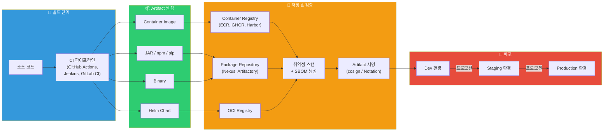
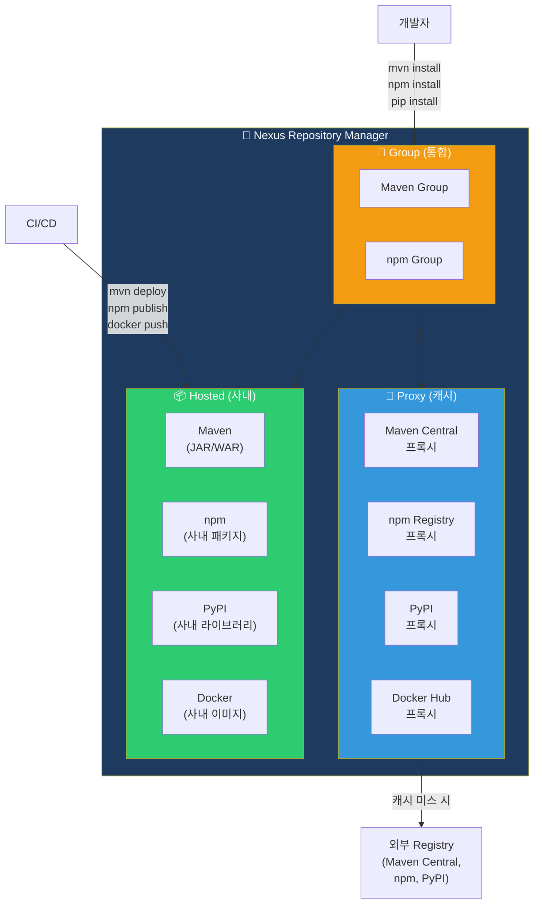
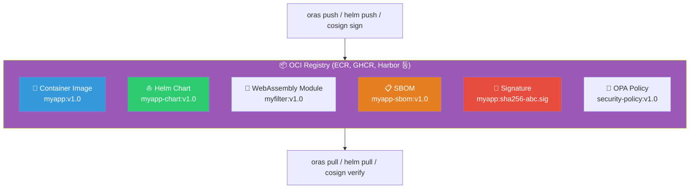
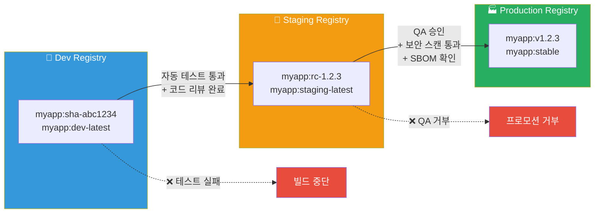

# Artifact 관리 — Container Registry, Nexus, Artifactory, OCI Artifacts, SBOM

> CI/CD 파이프라인에서 코드를 빌드하면 **결과물(Artifact)**이 나와요. 이 결과물을 어디에 저장하고, 어떻게 버전을 매기고, 안전하게 서명하고, 필요 없어지면 어떻게 정리할까요? [GitHub Actions](./05-github-actions)나 [Jenkins](./07-jenkins)에서 빌드한 결과물이 실제로 프로덕션까지 가려면, 체계적인 **Artifact 관리** 전략이 반드시 필요해요. 이번 강의에서는 Container Registry부터 Nexus, Artifactory, OCI Artifacts, SBOM, 서명, 버전 전략, 프로모션 워크플로우까지 실무에서 꼭 알아야 할 내용을 빠짐없이 다뤄볼게요.

---

## 🎯 왜 Artifact 관리를/를 알아야 하나요?

### 일상 비유: 택배 물류 센터

온라인 쇼핑몰을 떠올려보세요. 공장(빌드)에서 제품(Artifact)이 만들어지면 바로 고객에게 보내지 않아요. **물류 센터(Repository)**에 저장한 뒤, 품질 검사를 거치고, 라벨(태그)을 붙이고, 유통기한(라이프사이클)을 관리하고, 진품 인증서(서명)를 발급한 다음에야 배송(배포)이 시작돼요.

- **물류 센터** = Artifact Repository (ECR, Nexus, Artifactory)
- **제품 라벨** = 버전 태그 (v1.2.3, git SHA, 타임스탬프)
- **품질 검사** = 취약점 스캔, SBOM 생성
- **진품 인증서** = Artifact 서명 (cosign, Sigstore)
- **유통기한 관리** = 라이프사이클 정책, 클린업
- **지역별 물류 허브** = Dev/Staging/Prod Registry 분리
- **원산지 표시** = SBOM (Software Bill of Materials)

### 실무에서 Artifact 관리가 필요한 순간

```
실무에서 Artifact 관리가 등장하는 순간:
• CI에서 빌드한 Docker 이미지를 어디에 저장하지?         → Container Registry
• JAR/WAR 파일을 팀 전체가 공유해야 해요                → Nexus / Artifactory
• npm/pip 패키지를 사내 프라이빗 저장소에 올리고 싶어요   → Private Registry
• Helm Chart를 버전별로 관리해야 해요                    → OCI Registry / ChartMuseum
• 배포된 소프트웨어에 어떤 라이브러리가 들어있나요?        → SBOM (Syft, Trivy)
• 이미지가 변조되지 않았음을 증명해야 해요                → cosign / Sigstore 서명
• 오래된 이미지가 쌓여서 저장 비용이 폭발해요             → 라이프사이클 정책
• dev에서 검증된 이미지를 staging → prod로 올리고 싶어요  → Promotion 워크플로우
• 보안 감사에서 "어떤 버전이 프로덕션에 있나요?" 물어봐요  → 버전 전략 + 추적성
```

[컨테이너 레지스트리 기초](../03-containers/07-registry)에서 배운 개념을 이제 **CI/CD 파이프라인 관점에서 확장**해볼 거예요.

---

## 🧠 핵심 개념 잡기

Artifact 관리를 이해하려면 핵심 구성 요소 6가지를 먼저 잡아야 해요.

### 비유: 제품 물류 관리 시스템

| 물류 세계 | Artifact 관리 |
|-----------|--------------|
| 제품 (완성품, 부품, 원자재) | **Artifact** (이미지, JAR, npm 패키지, Helm Chart) |
| 물류 센터 / 창고 | **Repository** (ECR, Nexus, Artifactory) |
| 제품 바코드 / 일련번호 | **버전 태그** (SemVer, Git SHA, 타임스탬프) |
| 원산지 표시 / 성분표 | **SBOM** (Software Bill of Materials) |
| 진품 인증서 / 봉인 스티커 | **서명** (cosign, Notation, Sigstore) |
| 유통기한 / 재고 정리 | **라이프사이클 정책** (Cleanup, Retention) |

### 1. Artifact란?

> **비유**: 공장에서 나오는 모든 "제품"

빌드 과정에서 생성되는 **모든 결과물**이 Artifact예요. 코드 자체가 아니라, 코드를 빌드/패키징한 "완성품"이에요.

| Artifact 종류 | 예시 | 저장소 |
|--------------|------|--------|
| **Container Image** | `myapp:v1.2.3` | ECR, Docker Hub, GHCR, Harbor |
| **Java 패키지** | `myapp-1.2.3.jar`, `.war` | Nexus, Artifactory (Maven) |
| **Node.js 패키지** | `@myorg/utils-1.2.3.tgz` | npm Registry, Nexus, Artifactory |
| **Python 패키지** | `mylib-1.2.3.whl` | PyPI, Nexus, Artifactory |
| **Helm Chart** | `myapp-chart-1.2.3.tgz` | OCI Registry, ChartMuseum |
| **바이너리** | `myapp-linux-amd64` | Nexus, Artifactory, S3 |
| **Terraform Module** | `vpc-module-1.0.0.zip` | Terraform Registry |
| **OS 패키지** | `myapp-1.2.3.rpm/.deb` | Nexus, Artifactory |

### 2. Repository 유형

> **비유**: 전용 창고 vs 종합 물류센터

- **Single-Format Registry**: 한 종류만 저장 (Docker Hub = 컨테이너 이미지 전용)
- **Universal Repository**: 모든 종류를 저장 (Nexus, Artifactory = 종합 물류센터)

### 3. Artifact 흐름 전체 구조



### 4. 왜 체계적 관리가 필요한가?

관리하지 않으면 벌어지는 일:

```
❌ 관리 없이 방치하면:
• "프로덕션에 어떤 버전이 올라가 있지?" → 아무도 모름
• "이 이미지 안에 log4j 취약점 있나요?" → 확인 불가
• "어제 배포한 거 롤백해주세요" → 어떤 이미지였는지 찾을 수 없음
• ECR 저장 비용이 매월 $500씩 나와요 → 오래된 이미지 미정리
• "이 이미지가 정말 우리 CI에서 빌드한 건가요?" → 변조 확인 불가
• npm install 했더니 이상한 패키지가 설치됐어요 → 공급망 공격

✅ 체계적으로 관리하면:
• 모든 Artifact에 추적 가능한 버전 태그
• 자동 취약점 스캔 + SBOM으로 구성 요소 파악
• 서명으로 무결성 보장
• 라이프사이클 정책으로 비용 최적화
• 프로모션 워크플로우로 안전한 환경 이동
```

---

## 🔍 하나씩 자세히 알아보기

### 1. Container Registry 비교

[컨테이너 레지스트리 기초](../03-containers/07-registry)에서 기본 사용법을 배웠죠? 여기서는 CI/CD 파이프라인 관점에서 주요 레지스트리를 비교해볼게요.

#### 주요 Container Registry 비교

| 항목 | Docker Hub | AWS ECR | GCP Artifact Registry | GHCR | Harbor |
|------|-----------|---------|----------------------|------|--------|
| **유형** | SaaS | 관리형 (AWS) | 관리형 (GCP) | SaaS (GitHub) | 자체 호스팅 |
| **무료 티어** | 1 Private Repo | 500MB/월 (Free Tier) | 500MB/월 | 무제한 (Public) | OSS (무료) |
| **OCI 지원** | O | O | O | O | O |
| **취약점 스캔** | 유료 (Scout) | 기본 + Enhanced | 자동 | Dependabot | Trivy 내장 |
| **서명 지원** | DCT (Notary v1) | 제한적 | cosign 연동 | cosign 연동 | cosign + Notation |
| **RBAC** | 팀/조직 | IAM 기반 | IAM 기반 | GitHub Permissions | 프로젝트별 세밀한 제어 |
| **Geo-Replication** | X | Cross-Region | Multi-Region | X | O (Harbor 2.0+) |
| **CI/CD 연동** | 모든 CI | AWS CodePipeline, GHA | Cloud Build, GHA | GitHub Actions 네이티브 | Webhook, API |
| **추천 상황** | 오픈소스, 개인 | AWS 환경 | GCP 환경 | GitHub 중심 | 온프레미스, 규제 환경 |

#### Docker Hub

```bash
# Docker Hub: 가장 널리 쓰이는 퍼블릭 레지스트리
# 오픈소스 이미지의 "npm" 같은 존재

# 로그인
docker login -u myuser

# 이미지 Push
docker tag myapp:v1.0 myuser/myapp:v1.0
docker push myuser/myapp:v1.0

# 이미지 Pull (가장 기본적인 형태)
docker pull nginx:latest
# → registry 생략 = Docker Hub에서 Pull

# ⚠️ Rate Limit 주의!
# Anonymous: 100 pulls / 6시간
# Authenticated (무료): 200 pulls / 6시간
# Pro/Team: 무제한
# → CI/CD에서 반드시 로그인 필요!
```

#### AWS ECR (Elastic Container Registry)

```bash
# ECR: AWS 환경의 사실상 표준 레지스트리
# IAM 기반 인증 + 자동 취약점 스캔

# 1. 레포지토리 생성
aws ecr create-repository \
    --repository-name myapp \
    --image-scanning-configuration scanOnPush=true \
    --image-tag-mutability IMMUTABLE \
    --region ap-northeast-2

# ⚠️ IMMUTABLE 태그 = 같은 태그로 덮어쓸 수 없음
#    → 프로덕션 레포지토리에서 필수!

# 2. 로그인 (12시간 유효)
aws ecr get-login-password --region ap-northeast-2 | \
    docker login --username AWS --password-stdin \
    123456789.dkr.ecr.ap-northeast-2.amazonaws.com

# 3. Push
docker tag myapp:v1.0 \
    123456789.dkr.ecr.ap-northeast-2.amazonaws.com/myapp:v1.0
docker push \
    123456789.dkr.ecr.ap-northeast-2.amazonaws.com/myapp:v1.0

# 4. ECR Public Gallery (퍼블릭 이미지 배포)
aws ecr-public get-login-password --region us-east-1 | \
    docker login --username AWS --password-stdin public.ecr.aws
```

#### GitHub Container Registry (GHCR)

```bash
# GHCR: GitHub과 가장 자연스럽게 통합되는 레지스트리
# GitHub Actions와 원클릭 연동

# 로그인 (Personal Access Token 사용)
echo $GITHUB_TOKEN | docker login ghcr.io -u USERNAME --password-stdin

# Push
docker tag myapp:v1.0 ghcr.io/myorg/myapp:v1.0
docker push ghcr.io/myorg/myapp:v1.0

# GitHub Actions에서 사용 (가장 간단!)
# → GITHUB_TOKEN만으로 인증 가능
```

```yaml
# .github/workflows/build-push.yml
name: Build and Push to GHCR

on:
  push:
    branches: [main]

permissions:
  contents: read
  packages: write          # GHCR Push 권한

jobs:
  build:
    runs-on: ubuntu-latest
    steps:
      - uses: actions/checkout@v4

      - uses: docker/login-action@v3
        with:
          registry: ghcr.io
          username: ${{ github.actor }}
          password: ${{ secrets.GITHUB_TOKEN }}  # 별도 Secret 불필요!

      - uses: docker/build-push-action@v6
        with:
          push: true
          tags: |
            ghcr.io/${{ github.repository }}:${{ github.sha }}
            ghcr.io/${{ github.repository }}:latest
```

#### Harbor (오픈소스 엔터프라이즈 레지스트리)

```bash
# Harbor: CNCF Graduated 프로젝트
# 온프레미스 + 엔터프라이즈 환경의 최고 선택지

# Docker Compose로 설치 (개발/테스트용)
wget https://github.com/goharbor/harbor/releases/download/v2.11.0/harbor-offline-installer-v2.11.0.tgz
tar xvf harbor-offline-installer-v2.11.0.tgz
cd harbor

# harbor.yml 설정
# hostname: harbor.mycompany.com
# https:
#   certificate: /path/to/cert.pem
#   private_key: /path/to/key.pem

./install.sh --with-trivy   # Trivy 스캐너 포함 설치

# 사용법 (Docker Hub와 동일한 UX)
docker login harbor.mycompany.com
docker tag myapp:v1.0 harbor.mycompany.com/myproject/myapp:v1.0
docker push harbor.mycompany.com/myproject/myapp:v1.0
```

Harbor의 핵심 기능:

```
Harbor만의 강점:
• 프로젝트별 RBAC (개발팀 A는 프로젝트 A만 접근)
• Trivy 내장 취약점 스캐닝
• 이미지 Replication (Harbor ↔ Harbor, Harbor ↔ ECR/DockerHub)
• 서명 검증 (cosign + Notation)
• Webhook (CI/CD 연동)
• Garbage Collection (미사용 레이어 정리)
• Robot Account (CI/CD 전용 서비스 계정)
• Proxy Cache (Docker Hub Rate Limit 우회)
```

---

### 2. Nexus Repository Manager

> **비유**: 모든 종류의 택배를 처리하는 대형 물류 허브

Nexus는 Sonatype에서 만든 **범용 Artifact 저장소**예요. 컨테이너 이미지, Java, npm, Python, raw 파일 등 거의 모든 종류의 패키지를 한 곳에서 관리해요.



#### Nexus의 3가지 Repository 유형

| 유형 | 역할 | 비유 |
|------|------|------|
| **Proxy** | 외부 저장소를 캐시 (Maven Central, npm 등) | 해외 물류 창고의 국내 캐시 |
| **Hosted** | 사내에서 만든 Artifact 저장 | 자사 제품 전용 창고 |
| **Group** | Proxy + Hosted를 하나로 묶어서 노출 | 통합 주문 접수 창구 |

#### Docker Compose로 Nexus 설치

```yaml
# docker-compose.yml
services:
  nexus:
    image: sonatype/nexus3:3.68.0
    container_name: nexus
    ports:
      - "8081:8081"     # Nexus Web UI
      - "8082:8082"     # Docker Registry (hosted)
      - "8083:8083"     # Docker Registry (group)
    volumes:
      - nexus-data:/nexus-data
    environment:
      - INSTALL4J_ADD_VM_PARAMS=-Xms1024m -Xmx2048m -XX:MaxDirectMemorySize=2048m
    restart: unless-stopped

volumes:
  nexus-data:
```

```bash
# 실행
docker compose up -d

# 초기 admin 비밀번호 확인
docker exec nexus cat /nexus-data/admin.password
# → 브라우저에서 http://localhost:8081 접속 후 비밀번호 변경
```

#### Nexus에서 Maven Repository 설정

```xml
<!-- settings.xml (개발자 PC 또는 CI) -->
<settings>
  <mirrors>
    <mirror>
      <id>nexus</id>
      <mirrorOf>*</mirrorOf>
      <!-- Group Repository: Hosted + Maven Central Proxy를 합친 것 -->
      <url>http://nexus.mycompany.com:8081/repository/maven-group/</url>
    </mirror>
  </mirrors>

  <servers>
    <server>
      <id>nexus-releases</id>
      <username>deployer</username>
      <password>${env.NEXUS_PASSWORD}</password>
    </server>
    <server>
      <id>nexus-snapshots</id>
      <username>deployer</username>
      <password>${env.NEXUS_PASSWORD}</password>
    </server>
  </servers>
</settings>
```

```xml
<!-- pom.xml: 빌드 결과를 Nexus에 배포 -->
<distributionManagement>
  <repository>
    <id>nexus-releases</id>
    <url>http://nexus.mycompany.com:8081/repository/maven-releases/</url>
  </repository>
  <snapshotRepository>
    <id>nexus-snapshots</id>
    <url>http://nexus.mycompany.com:8081/repository/maven-snapshots/</url>
  </snapshotRepository>
</distributionManagement>
```

```bash
# CI에서 Nexus로 Artifact 배포
mvn deploy -DskipTests

# 결과:
# [INFO] Uploading to nexus-releases:
#   http://nexus.mycompany.com:8081/repository/maven-releases/
#   com/mycompany/myapp/1.2.3/myapp-1.2.3.jar
# [INFO] Uploaded: myapp-1.2.3.jar (15 MB)
```

#### Nexus npm Private Registry

```bash
# .npmrc 설정 (사내 npm 저장소)
registry=http://nexus.mycompany.com:8081/repository/npm-group/
//nexus.mycompany.com:8081/repository/npm-hosted/:_authToken=${NPM_TOKEN}

# 사내 패키지 발행
npm publish --registry=http://nexus.mycompany.com:8081/repository/npm-hosted/

# 설치 (Group에서 사내 + 공개 패키지 모두 가져옴)
npm install @mycompany/shared-utils
npm install lodash  # npm 공개 패키지도 Nexus Proxy 경유
```

---

### 3. JFrog Artifactory

> **비유**: 최고급 스마트 물류 시스템 (AI 자동 분류 + 실시간 추적 + 자동 보안 검사)

JFrog Artifactory는 **엔터프라이즈급 Universal Repository Manager**예요. Nexus와 비슷하지만, 더 풍부한 메타데이터, 강력한 보안, 고급 프로모션 기능을 제공해요.

#### Nexus vs Artifactory 비교

| 항목 | Nexus OSS | Nexus Pro | Artifactory OSS | Artifactory Pro/Enterprise |
|------|-----------|-----------|-----------------|---------------------------|
| **가격** | 무료 | 유료 | 무료 | 유료 (비쌈) |
| **지원 포맷** | 15+ | 15+ | Maven, Gradle, Ivy | 30+ (Helm, Docker, Go, Conan 등) |
| **HA** | X | O | X | O |
| **Replication** | X | O | X | O (Push/Pull/Event) |
| **Build Info** | 기본 | 기본 | X | O (빌드 의존성 전체 추적) |
| **Xray (보안)** | X | X | X | O (취약점 + 라이선스 분석) |
| **REST API** | O | O | O | O (더 풍부) |
| **추천** | 소규모 팀 | 중견 기업 | 학습용 | 대기업, 금융, 규제 환경 |

#### Artifactory 기본 사용

```bash
# JFrog CLI 설치
curl -fL https://install-cli.jfrog.io | sh

# 서버 설정
jf config add myserver \
    --url=https://mycompany.jfrog.io \
    --user=admin \
    --password=$ARTIFACTORY_PASSWORD

# Docker 이미지 Push
docker tag myapp:v1.0 mycompany.jfrog.io/docker-local/myapp:v1.0
docker push mycompany.jfrog.io/docker-local/myapp:v1.0

# Build Info 수집 (빌드 추적성의 핵심!)
jf rt build-collect-env myapp-build 42
jf rt build-add-git myapp-build 42
jf rt build-publish myapp-build 42

# → "빌드 #42에서 어떤 Artifact가 생성됐고,
#    어떤 의존성을 사용했는지" 전체 이력 추적 가능
```

#### Artifactory의 Build Info 개념

```
Build Info = 빌드의 "족보"

Build #42 정보:
├── 생성된 Artifacts
│   ├── myapp-1.2.3.jar
│   ├── myapp-1.2.3-sources.jar
│   └── docker: myapp:v1.2.3
├── 사용된 Dependencies
│   ├── spring-boot-3.2.1.jar
│   ├── jackson-databind-2.16.0.jar
│   └── ... (전체 의존성 트리)
├── 환경 정보
│   ├── OS: Ubuntu 22.04
│   ├── Java: 17.0.9
│   └── Maven: 3.9.6
├── Git 정보
│   ├── Commit: abc1234
│   ├── Branch: main
│   └── URL: https://github.com/myorg/myapp
└── 빌드 시간: 2024-01-15T10:30:00Z

→ 이 정보로 "프로덕션에 올라간 JAR가 어떤 커밋에서,
   어떤 의존성으로 빌드됐는지" 100% 추적 가능!
```

---

### 4. OCI Artifacts Spec

> **비유**: 택배 상자의 국제 표준 규격

예전에는 Container Registry에 "컨테이너 이미지"만 저장할 수 있었어요. 하지만 OCI (Open Container Initiative) Artifacts Spec 덕분에, 이제 **어떤 종류의 파일이든** OCI Registry에 저장할 수 있어요.



#### OCI Artifacts로 저장 가능한 것들

| Artifact 종류 | 미디어 타입 | 도구 |
|--------------|-----------|------|
| Container Image | `application/vnd.oci.image.manifest.v1+json` | docker, buildah |
| Helm Chart | `application/vnd.cncf.helm.chart.content.v1.tar+gzip` | helm |
| SBOM | `application/spdx+json`, `application/vnd.cyclonedx+json` | syft, trivy |
| Signature | `application/vnd.dev.cosign.simplesigning.v1+json` | cosign |
| WASM Module | `application/vnd.wasm.content.layer.v1+wasm` | oras |
| 범용 파일 | `application/octet-stream` | oras |

#### ORAS (OCI Registry As Storage) 사용법

```bash
# ORAS CLI 설치
brew install oras    # macOS
# 또는
curl -LO https://github.com/oras-project/oras/releases/download/v1.2.0/oras_1.2.0_linux_amd64.tar.gz

# 임의의 파일을 OCI Registry에 Push
oras push ghcr.io/myorg/my-config:v1.0 \
    config.yaml:application/vnd.mycompany.config.v1+yaml

# Pull
oras pull ghcr.io/myorg/my-config:v1.0

# Helm Chart를 OCI Registry에 Push (Helm 3.8+)
helm package ./my-chart
helm push my-chart-1.0.0.tgz oci://ghcr.io/myorg/charts

# Pull
helm pull oci://ghcr.io/myorg/charts/my-chart --version 1.0.0

# Helm Chart 설치 (OCI에서 직접)
helm install myrelease oci://ghcr.io/myorg/charts/my-chart --version 1.0.0
```

**OCI Artifacts의 핵심 장점**: 기존 Container Registry 인프라를 그대로 재활용하면서, 이미지 외의 다양한 Artifact를 저장할 수 있어요. 별도 저장소를 구축할 필요가 없어요!

---

### 5. Artifact 버전 전략

> **비유**: 제품에 붙이는 라벨 규칙

"이 빌드가 어떤 코드에서 나온 건지" 추적하려면, 일관된 **버전 전략**이 필수예요.

#### 3가지 주요 버전 전략

| 전략 | 형식 | 예시 | 장점 | 단점 |
|------|------|------|------|------|
| **Semantic Versioning** | `MAJOR.MINOR.PATCH` | `v1.2.3` | 의미 명확, 호환성 표현 | 수동 관리 필요 |
| **Git SHA** | `sha-<commit>` | `sha-abc1234` | 코드 추적 100% | 사람이 읽기 어려움 |
| **Timestamp** | `YYYYMMDD-HHMMSS` | `20240115-103045` | 시간 순서 명확 | 코드 추적 불가 |

#### 실무 권장: 복합 전략

```bash
# 실무에서는 여러 전략을 조합해요!

# 방법 1: SemVer + Git SHA (가장 추천!)
IMAGE_TAG="v1.2.3-sha-$(git rev-parse --short HEAD)"
# → myapp:v1.2.3-sha-abc1234

# 방법 2: SemVer + Build Number
IMAGE_TAG="v1.2.3-build-${BUILD_NUMBER}"
# → myapp:v1.2.3-build-42

# 방법 3: Branch + Git SHA + Timestamp (개발 환경)
BRANCH=$(git rev-parse --abbrev-ref HEAD | tr '/' '-')
SHORT_SHA=$(git rev-parse --short HEAD)
TIMESTAMP=$(date +%Y%m%d-%H%M%S)
IMAGE_TAG="${BRANCH}-${SHORT_SHA}-${TIMESTAMP}"
# → myapp:feature-login-abc1234-20240115-103045
```

#### 환경별 태그 전략

```yaml
# GitHub Actions에서의 태그 전략 예시
name: Build & Tag

on:
  push:
    branches: [main, develop]
    tags: ['v*']
  pull_request:
    branches: [main]

jobs:
  build:
    runs-on: ubuntu-latest
    steps:
      - uses: actions/checkout@v4

      - name: Docker meta (자동 태그 생성)
        id: meta
        uses: docker/metadata-action@v5
        with:
          images: ghcr.io/${{ github.repository }}
          tags: |
            # PR: pr-42
            type=ref,event=pr
            # Branch: main, develop
            type=ref,event=branch
            # SemVer 태그: v1.2.3 → 1.2.3, 1.2, 1
            type=semver,pattern={{version}}
            type=semver,pattern={{major}}.{{minor}}
            type=semver,pattern={{major}}
            # Git SHA: sha-abc1234
            type=sha,prefix=sha-
            # latest (main 브랜치 push 시만)
            type=raw,value=latest,enable={{is_default_branch}}

      - uses: docker/build-push-action@v6
        with:
          push: true
          tags: ${{ steps.meta.outputs.tags }}
          labels: ${{ steps.meta.outputs.labels }}
```

위 설정의 결과:

```
이벤트별로 생성되는 태그:

[main 브랜치 push]
  ghcr.io/myorg/myapp:main
  ghcr.io/myorg/myapp:sha-abc1234
  ghcr.io/myorg/myapp:latest

[develop 브랜치 push]
  ghcr.io/myorg/myapp:develop
  ghcr.io/myorg/myapp:sha-def5678

[PR #42 생성/업데이트]
  ghcr.io/myorg/myapp:pr-42

[v1.2.3 태그 push]
  ghcr.io/myorg/myapp:1.2.3
  ghcr.io/myorg/myapp:1.2
  ghcr.io/myorg/myapp:1
  ghcr.io/myorg/myapp:sha-ghi9012
  ghcr.io/myorg/myapp:latest
```

---

### 6. SBOM (Software Bill of Materials)

> **비유**: 식품의 "영양성분표" 또는 자동차의 "부품 목록"

마트에서 가공식품을 사면 뒷면에 "원재료: 밀가루, 설탕, 소금..."이 적혀 있죠? SBOM은 소프트웨어의 이 "성분표"예요. "이 이미지/패키지 안에 어떤 라이브러리가, 어떤 버전으로, 어떤 라이선스로 들어있는지" 목록화한 거예요.

#### SBOM이 필요한 이유

```
왜 SBOM이 점점 중요해지나요?

2021년: Log4Shell (CVE-2021-44228) 사태
→ "우리 시스템에 Log4j가 들어있나요?" → 모르겠어요...
→ SBOM이 있었다면 5분 만에 확인 가능!

2022년: 미국 행정명령 (EO 14028)
→ 미국 정부 납품 소프트웨어는 SBOM 필수
→ 전 세계 규제 트렌드로 확산 중

2023년~: 공급망 공격 급증
→ 오픈소스 패키지에 악성코드 삽입 (event-stream, ua-parser-js 등)
→ SBOM으로 의존성 추적 + 취약점 자동 알림
```

#### SBOM 형식: SPDX vs CycloneDX

| 항목 | SPDX | CycloneDX |
|------|------|-----------|
| **관리 기관** | Linux Foundation | OWASP |
| **ISO 표준** | ISO/IEC 5962:2021 | 진행 중 |
| **초점** | 라이선스 컴플라이언스 | 보안 취약점 분석 |
| **출력 형식** | JSON, XML, RDF, YAML | JSON, XML |
| **도구 지원** | Syft, Trivy, Microsoft SBOM Tool | Syft, Trivy, CycloneDX CLI |
| **DevSecOps 적합** | 좋음 | 매우 좋음 |

#### Syft로 SBOM 생성

```bash
# Syft 설치 (Anchore 프로젝트)
curl -sSfL https://raw.githubusercontent.com/anchore/syft/main/install.sh | sh -s -- -b /usr/local/bin

# 컨테이너 이미지에서 SBOM 생성
syft myapp:v1.0 -o spdx-json > sbom-spdx.json
syft myapp:v1.0 -o cyclonedx-json > sbom-cyclonedx.json

# 출력 예시 (요약)
syft myapp:v1.0
# NAME                    VERSION      TYPE
# alpine-baselayout       3.4.3        apk
# alpine-keys             2.4          apk
# busybox                 1.36.1       apk
# ca-certificates         20240226     apk
# express                 4.18.2       npm
# lodash                  4.17.21      npm
# ...
# → 이미지 안의 모든 OS 패키지 + 언어 패키지가 나열됨!

# Dockerfile에서 SBOM 생성
syft dir:./src -o cyclonedx-json > sbom-source.json

# SBOM을 OCI Registry에 함께 저장
syft myapp:v1.0 -o spdx-json | \
    oras push ghcr.io/myorg/myapp:v1.0-sbom \
    --artifact-type application/spdx+json \
    sbom-spdx.json:application/spdx+json
```

#### Trivy로 SBOM 생성 + 취약점 스캔

```bash
# Trivy: SBOM 생성과 취약점 스캔을 동시에!
# (Aqua Security 프로젝트)

# SBOM 생성
trivy image --format spdx-json -o sbom.json myapp:v1.0

# SBOM 기반 취약점 스캔
trivy sbom sbom.json

# 이미지 직접 스캔 (SBOM + 취약점 한번에)
trivy image --severity HIGH,CRITICAL myapp:v1.0
# myapp:v1.0 (alpine 3.19.0)
# ════════════════════════════════════════
# Library        Vulnerability  Severity  Version    Fixed
# ─────────────  ─────────────  ────────  ─────────  ─────────
# libcrypto3     CVE-2024-0727  HIGH      3.1.4-r2   3.1.4-r3
# openssl        CVE-2024-0727  HIGH      3.1.4-r2   3.1.4-r3

# CI에서 사용 (취약점 있으면 빌드 실패)
trivy image --exit-code 1 --severity CRITICAL myapp:v1.0
# → CRITICAL 취약점이 하나라도 있으면 exit code 1 → CI 빌드 실패
```

#### GitHub Actions에서 SBOM 자동화

```yaml
name: Build with SBOM

on:
  push:
    branches: [main]

jobs:
  build:
    runs-on: ubuntu-latest
    permissions:
      contents: read
      packages: write
      security-events: write  # SBOM/스캔 결과 업로드

    steps:
      - uses: actions/checkout@v4

      - name: Build image
        uses: docker/build-push-action@v6
        with:
          push: true
          tags: ghcr.io/${{ github.repository }}:${{ github.sha }}

      # SBOM 생성 (Syft)
      - name: Generate SBOM
        uses: anchore/sbom-action@v0
        with:
          image: ghcr.io/${{ github.repository }}:${{ github.sha }}
          format: spdx-json
          output-file: sbom.spdx.json

      # 취약점 스캔 (Trivy)
      - name: Vulnerability scan
        uses: aquasecurity/trivy-action@master
        with:
          image-ref: ghcr.io/${{ github.repository }}:${{ github.sha }}
          format: 'sarif'
          output: 'trivy-results.sarif'
          severity: 'CRITICAL,HIGH'

      # 스캔 결과를 GitHub Security 탭에 업로드
      - name: Upload scan results
        uses: github/codeql-action/upload-sarif@v3
        with:
          sarif_file: 'trivy-results.sarif'

      # SBOM을 릴리즈 Artifact로 첨부
      - name: Upload SBOM
        uses: actions/upload-artifact@v4
        with:
          name: sbom
          path: sbom.spdx.json
```

---

### 7. Artifact 서명 (cosign / Sigstore / Notation)

> **비유**: 택배의 "봉인 스티커" — 누가 보냈는지, 중간에 열어보지 않았는지 확인

Artifact 서명은 두 가지를 보장해요:
1. **출처 인증(Provenance)**: "이 이미지는 정말 우리 CI에서 빌드한 거예요"
2. **무결성(Integrity)**: "빌드 후에 누군가 변조하지 않았어요"

#### cosign (Sigstore 프로젝트)

```bash
# cosign 설치
brew install cosign    # macOS
# 또는
go install github.com/sigstore/cosign/v2/cmd/cosign@latest

# ─────────────────────────────────────
# 방법 1: Keyless 서명 (Sigstore/Fulcio — 추천!)
# → 로컬 키 관리 불필요! OIDC 토큰으로 서명
# ─────────────────────────────────────
cosign sign ghcr.io/myorg/myapp@sha256:abc123...
# → 브라우저가 열리며 OIDC 인증 (GitHub, Google 등)
# → Fulcio에서 임시 인증서 발급
# → Rekor (투명성 로그)에 서명 기록

# 서명 검증
cosign verify ghcr.io/myorg/myapp@sha256:abc123... \
    --certificate-identity=user@example.com \
    --certificate-oidc-issuer=https://github.com/login/oauth

# ─────────────────────────────────────
# 방법 2: Key-based 서명 (오프라인/에어갭 환경)
# ─────────────────────────────────────
# 키 쌍 생성
cosign generate-key-pair
# → cosign.key (비밀키 — 안전하게 보관!)
# → cosign.pub (공개키 — 검증용 배포)

# 서명
cosign sign --key cosign.key ghcr.io/myorg/myapp:v1.0

# 검증
cosign verify --key cosign.pub ghcr.io/myorg/myapp:v1.0

# ─────────────────────────────────────
# SBOM을 이미지에 첨부 (attestation)
# ─────────────────────────────────────
cosign attest --predicate sbom.spdx.json \
    --type spdxjson \
    ghcr.io/myorg/myapp@sha256:abc123...

# 첨부된 SBOM 검증 및 추출
cosign verify-attestation \
    --type spdxjson \
    ghcr.io/myorg/myapp@sha256:abc123... | \
    jq -r '.payload' | base64 -d | jq '.predicate'
```

#### GitHub Actions에서 cosign Keyless 서명

```yaml
name: Build, Sign, and Verify

on:
  push:
    tags: ['v*']

permissions:
  contents: read
  packages: write
  id-token: write    # ← cosign keyless 서명에 필수!

jobs:
  build-sign:
    runs-on: ubuntu-latest
    steps:
      - uses: actions/checkout@v4

      - uses: sigstore/cosign-installer@v3

      - uses: docker/login-action@v3
        with:
          registry: ghcr.io
          username: ${{ github.actor }}
          password: ${{ secrets.GITHUB_TOKEN }}

      - name: Build and push
        id: build
        uses: docker/build-push-action@v6
        with:
          push: true
          tags: ghcr.io/${{ github.repository }}:${{ github.ref_name }}

      # Keyless 서명 (Sigstore Fulcio + Rekor)
      - name: Sign image
        run: |
          cosign sign --yes \
            ghcr.io/${{ github.repository }}@${{ steps.build.outputs.digest }}
        # --yes: 자동 확인 (CI 환경)
        # OIDC 토큰은 GitHub Actions가 자동 제공 (id-token: write)

      # SBOM 생성 + 첨부
      - name: Generate and attach SBOM
        run: |
          syft ghcr.io/${{ github.repository }}@${{ steps.build.outputs.digest }} \
            -o spdx-json > sbom.spdx.json

          cosign attest --yes \
            --predicate sbom.spdx.json \
            --type spdxjson \
            ghcr.io/${{ github.repository }}@${{ steps.build.outputs.digest }}
```

#### Kubernetes에서 서명 검증 강제하기

```yaml
# Kyverno 정책: 서명된 이미지만 배포 허용
apiVersion: kyverno.io/v1
kind: ClusterPolicy
metadata:
  name: verify-image-signature
spec:
  validationFailureAction: Enforce
  rules:
    - name: verify-cosign-signature
      match:
        any:
          - resources:
              kinds: ["Pod"]
      verifyImages:
        - imageReferences:
            - "ghcr.io/myorg/*"
          attestors:
            - entries:
                - keyless:
                    subject: "https://github.com/myorg/*"
                    issuer: "https://token.actions.githubusercontent.com"
                    rekor:
                      url: https://rekor.sigstore.dev
          # 서명 검증 실패 → Pod 생성 거부!
```

---

### 8. Artifact 라이프사이클과 클린업 정책

> **비유**: 유통기한이 지난 제품은 폐기하고, 진열대에는 최신 상품만

Artifact를 무한정 보관하면 저장 비용이 계속 증가해요. 환경별로 적절한 보관 정책이 필요해요.

#### 환경별 보관 정책 가이드

```
환경별 보관 정책 가이드:

[Dev 환경]
• PR 이미지: 머지 후 7일 보관
• 브랜치 이미지: 30일 보관
• SNAPSHOT 패키지: 14일 보관
• 태그 없는 이미지: 3일 보관

[Staging 환경]
• 최근 50개 버전 유지
• 90일 이상 된 이미지 삭제
• QA 통과 이미지는 별도 태그 (qa-passed)

[Production 환경]
• 최근 20개 릴리즈 버전 유지 (롤백 대비)
• 현재 배포 중인 버전은 절대 삭제 안 함
• 규제 요건에 따라 1~7년 보관
```

#### AWS ECR 라이프사이클 정책

```bash
# ECR 라이프사이클 정책 설정
aws ecr put-lifecycle-policy \
    --repository-name myapp \
    --lifecycle-policy-text '{
  "rules": [
    {
      "rulePriority": 1,
      "description": "태그 없는(dangling) 이미지 3일 후 삭제",
      "selection": {
        "tagStatus": "untagged",
        "countType": "sinceImagePushed",
        "countUnit": "days",
        "countNumber": 3
      },
      "action": {"type": "expire"}
    },
    {
      "rulePriority": 2,
      "description": "dev- 태그 이미지 14일 후 삭제",
      "selection": {
        "tagStatus": "tagged",
        "tagPrefixList": ["dev-", "pr-", "feature-"],
        "countType": "sinceImagePushed",
        "countUnit": "days",
        "countNumber": 14
      },
      "action": {"type": "expire"}
    },
    {
      "rulePriority": 3,
      "description": "릴리즈(v*) 이미지는 최근 30개만 유지",
      "selection": {
        "tagStatus": "tagged",
        "tagPrefixList": ["v"],
        "countType": "imageCountMoreThan",
        "countNumber": 30
      },
      "action": {"type": "expire"}
    }
  ]
}'
```

#### GHCR 클린업 (GitHub Actions)

```yaml
# 오래된 GHCR 이미지 자동 정리
name: Cleanup old images

on:
  schedule:
    - cron: '0 3 * * 0'  # 매주 일요일 새벽 3시

jobs:
  cleanup:
    runs-on: ubuntu-latest
    permissions:
      packages: write

    steps:
      - name: Delete old untagged images
        uses: actions/delete-package-versions@v5
        with:
          package-name: myapp
          package-type: container
          min-versions-to-keep: 20
          delete-only-untagged-versions: true

      - name: Delete old PR images
        uses: snok/container-retention-policy@v3
        with:
          account: myorg
          token: ${{ secrets.GITHUB_TOKEN }}
          image-names: myapp
          cut-off: 2 weeks ago UTC
          tag-selection: both
          filter-tags: "pr-*"
```

#### Nexus 클린업 태스크

```groovy
// Nexus에서 클린업 정책 설정 (Groovy Script)
// Admin → System → Tasks → Create task

// 1. 클린업 정책 생성 (Admin → Repository → Cleanup Policies)
//    - 이름: cleanup-dev-snapshots
//    - 형식: Maven2
//    - 조건: Last downloaded before 30 days
//    - 조건: Release type is SNAPSHOT

// 2. Repository에 정책 연결
//    - Repository → maven-snapshots → Cleanup → cleanup-dev-snapshots

// 3. Compact Blob Store 태스크 실행 (실제 디스크 공간 회수)
//    - Tasks → Create → Admin - Compact blob store
//    - Schedule: Weekly on Sunday at 02:00
```

---

### 9. Promotion 워크플로우 (Dev → Staging → Prod)

> **비유**: 제품이 "시범 판매 → 지역 판매 → 전국 판매"로 단계적으로 승격되는 것

Artifact를 처음부터 Production에 바로 배포하지 않아요. Dev에서 검증하고, Staging에서 다시 검증하고, 최종 승인을 받은 후 Production으로 **승격(Promote)**시켜요.



#### 프로모션 전략: 이미지 복사 vs 태그 추가

```bash
# 방법 1: 이미지 복사 (레지스트리 분리 시)
# Dev ECR → Staging ECR → Prod ECR
# Digest(SHA)가 동일하므로 "같은 이미지"임을 보장

# Dev에서 Staging으로 프로모션
DIGEST=$(aws ecr describe-images \
    --repository-name myapp \
    --image-ids imageTag=sha-abc1234 \
    --query 'imageDetails[0].imageDigest' \
    --output text \
    --region ap-northeast-2)

# Staging ECR에 복사 (skopeo 사용)
skopeo copy \
    docker://111111111.dkr.ecr.ap-northeast-2.amazonaws.com/myapp@${DIGEST} \
    docker://222222222.dkr.ecr.ap-northeast-2.amazonaws.com/myapp:rc-1.2.3

# 방법 2: 같은 레지스트리에서 태그 추가 (ECR)
MANIFEST=$(aws ecr batch-get-image \
    --repository-name myapp \
    --image-ids imageTag=sha-abc1234 \
    --query 'images[0].imageManifest' \
    --output text)

aws ecr put-image \
    --repository-name myapp \
    --image-tag v1.2.3 \
    --image-manifest "$MANIFEST"
# → 같은 이미지에 v1.2.3 태그가 추가됨 (복사 X, 태그만 추가)
```

#### GitHub Actions 프로모션 워크플로우 (전체)

```yaml
name: Promote Artifact

on:
  workflow_dispatch:
    inputs:
      source-tag:
        description: '프로모션할 이미지 태그'
        required: true
        type: string
      target-environment:
        description: '대상 환경'
        required: true
        type: choice
        options:
          - staging
          - production

jobs:
  # 1단계: 프로모션 전 검증
  validate:
    runs-on: ubuntu-latest
    steps:
      - name: Check image exists
        run: |
          docker manifest inspect ghcr.io/${{ github.repository }}:${{ inputs.source-tag }}

      - name: Vulnerability scan
        uses: aquasecurity/trivy-action@master
        with:
          image-ref: ghcr.io/${{ github.repository }}:${{ inputs.source-tag }}
          exit-code: '1'
          severity: 'CRITICAL'

      - name: Verify signature
        run: |
          cosign verify \
            --certificate-identity-regexp="https://github.com/${{ github.repository_owner }}/.*" \
            --certificate-oidc-issuer=https://token.actions.githubusercontent.com \
            ghcr.io/${{ github.repository }}:${{ inputs.source-tag }}

  # 2단계: 프로모션 (환경별 보호 규칙 적용)
  promote:
    needs: validate
    runs-on: ubuntu-latest
    environment: ${{ inputs.target-environment }}  # 승인 게이트!
    permissions:
      packages: write
      id-token: write

    steps:
      - uses: sigstore/cosign-installer@v3

      - uses: docker/login-action@v3
        with:
          registry: ghcr.io
          username: ${{ github.actor }}
          password: ${{ secrets.GITHUB_TOKEN }}

      - name: Promote image
        run: |
          SOURCE="ghcr.io/${{ github.repository }}:${{ inputs.source-tag }}"

          if [ "${{ inputs.target-environment }}" = "staging" ]; then
            TARGET_TAG="rc-${{ inputs.source-tag }}"
          else
            TARGET_TAG="v${{ inputs.source-tag }}"
          fi

          # skopeo로 이미지 복사 (태그 변경)
          skopeo copy \
            docker://${SOURCE} \
            docker://ghcr.io/${{ github.repository }}:${TARGET_TAG}

          echo "Promoted ${SOURCE} → ${TARGET_TAG}"

      - name: Re-sign promoted image
        run: |
          cosign sign --yes \
            ghcr.io/${{ github.repository }}:${TARGET_TAG}
```

---

## 💻 직접 해보기

### 실습 1: GHCR에 이미지 빌드/푸시 + SBOM 생성

```bash
# 1. 간단한 앱 준비
mkdir artifact-lab && cd artifact-lab

cat > Dockerfile <<'EOF'
FROM node:20-alpine
WORKDIR /app
COPY package*.json ./
RUN npm ci --production
COPY . .
EXPOSE 3000
CMD ["node", "server.js"]
EOF

cat > package.json <<'EOF'
{
  "name": "artifact-lab",
  "version": "1.0.0",
  "dependencies": {
    "express": "^4.18.2"
  }
}
EOF

cat > server.js <<'EOF'
const express = require('express');
const app = express();
app.get('/', (req, res) => res.json({ status: 'ok', version: '1.0.0' }));
app.listen(3000);
EOF

npm install

# 2. 이미지 빌드
docker build -t artifact-lab:v1.0.0 .

# 3. SBOM 생성
syft artifact-lab:v1.0.0 -o spdx-json > sbom.spdx.json
syft artifact-lab:v1.0.0 -o table
# → 이미지 안의 모든 패키지가 나열됨

# 4. 취약점 스캔
trivy image --severity HIGH,CRITICAL artifact-lab:v1.0.0

# 5. GHCR에 Push
echo $GITHUB_TOKEN | docker login ghcr.io -u $GITHUB_USER --password-stdin
docker tag artifact-lab:v1.0.0 ghcr.io/$GITHUB_USER/artifact-lab:v1.0.0
docker push ghcr.io/$GITHUB_USER/artifact-lab:v1.0.0

# 6. cosign 서명
cosign sign --yes ghcr.io/$GITHUB_USER/artifact-lab:v1.0.0

# 7. 서명 검증
cosign verify \
    --certificate-identity=$GITHUB_EMAIL \
    --certificate-oidc-issuer=https://github.com/login/oauth \
    ghcr.io/$GITHUB_USER/artifact-lab:v1.0.0
```

### 실습 2: Nexus로 npm Private Registry 구축

```bash
# 1. Nexus 실행
docker run -d -p 8081:8081 --name nexus sonatype/nexus3:3.68.0

# 2. 초기 비밀번호 확인 (1~2분 후)
docker exec nexus cat /nexus-data/admin.password

# 3. http://localhost:8081 접속 → admin 로그인 → 비밀번호 변경

# 4. npm Hosted Repository 생성
# Admin → Repositories → Create → npm (hosted)
# Name: npm-private
# Deployment policy: Allow redeploy (dev) 또는 Disable redeploy (prod)

# 5. npm Proxy Repository 생성 (npm 공식 캐시)
# Admin → Repositories → Create → npm (proxy)
# Name: npm-proxy
# Remote storage: https://registry.npmjs.org

# 6. npm Group Repository 생성 (hosted + proxy 합치기)
# Admin → Repositories → Create → npm (group)
# Name: npm-group
# Members: npm-private, npm-proxy

# 7. .npmrc 설정
cat > .npmrc <<'EOF'
registry=http://localhost:8081/repository/npm-group/
//localhost:8081/repository/npm-private/:_authToken=NpmToken.xxxxxxxx
EOF

# 8. 사내 패키지 발행
npm publish --registry=http://localhost:8081/repository/npm-private/

# 9. 설치 (Group에서 사내 + 공개 패키지 모두)
npm install @mycompany/shared-utils  # 사내 패키지 (npm-private)
npm install lodash                   # 공개 패키지 (npm-proxy → npmjs.org)
```

### 실습 3: 전체 CI/CD 파이프라인 (빌드 → SBOM → 서명 → 프로모션)

```yaml
# .github/workflows/full-artifact-pipeline.yml
name: Full Artifact Pipeline

on:
  push:
    branches: [main]
    tags: ['v*']

permissions:
  contents: read
  packages: write
  id-token: write
  security-events: write

env:
  REGISTRY: ghcr.io
  IMAGE_NAME: ${{ github.repository }}

jobs:
  # ────────────────────────────────────
  # Stage 1: Build + Push
  # ────────────────────────────────────
  build:
    runs-on: ubuntu-latest
    outputs:
      digest: ${{ steps.build.outputs.digest }}
      tags: ${{ steps.meta.outputs.tags }}

    steps:
      - uses: actions/checkout@v4

      - name: Docker meta
        id: meta
        uses: docker/metadata-action@v5
        with:
          images: ${{ env.REGISTRY }}/${{ env.IMAGE_NAME }}
          tags: |
            type=sha,prefix=sha-
            type=ref,event=branch
            type=semver,pattern={{version}}

      - uses: docker/login-action@v3
        with:
          registry: ${{ env.REGISTRY }}
          username: ${{ github.actor }}
          password: ${{ secrets.GITHUB_TOKEN }}

      - name: Build and push
        id: build
        uses: docker/build-push-action@v6
        with:
          push: true
          tags: ${{ steps.meta.outputs.tags }}
          labels: ${{ steps.meta.outputs.labels }}

  # ────────────────────────────────────
  # Stage 2: SBOM + Vulnerability Scan
  # ────────────────────────────────────
  scan:
    needs: build
    runs-on: ubuntu-latest

    steps:
      - name: Generate SBOM
        uses: anchore/sbom-action@v0
        with:
          image: ${{ env.REGISTRY }}/${{ env.IMAGE_NAME }}@${{ needs.build.outputs.digest }}
          format: spdx-json
          output-file: sbom.spdx.json

      - name: Scan for vulnerabilities
        uses: aquasecurity/trivy-action@master
        with:
          image-ref: ${{ env.REGISTRY }}/${{ env.IMAGE_NAME }}@${{ needs.build.outputs.digest }}
          format: 'sarif'
          output: 'trivy.sarif'
          severity: 'CRITICAL,HIGH'
          exit-code: '1'

      - name: Upload scan results
        if: always()
        uses: github/codeql-action/upload-sarif@v3
        with:
          sarif_file: trivy.sarif

      - uses: actions/upload-artifact@v4
        with:
          name: sbom
          path: sbom.spdx.json

  # ────────────────────────────────────
  # Stage 3: Sign + Attest SBOM
  # ────────────────────────────────────
  sign:
    needs: [build, scan]
    runs-on: ubuntu-latest

    steps:
      - uses: sigstore/cosign-installer@v3

      - uses: docker/login-action@v3
        with:
          registry: ${{ env.REGISTRY }}
          username: ${{ github.actor }}
          password: ${{ secrets.GITHUB_TOKEN }}

      - uses: actions/download-artifact@v4
        with:
          name: sbom

      - name: Sign image
        run: |
          cosign sign --yes \
            ${{ env.REGISTRY }}/${{ env.IMAGE_NAME }}@${{ needs.build.outputs.digest }}

      - name: Attest SBOM
        run: |
          cosign attest --yes \
            --predicate sbom.spdx.json \
            --type spdxjson \
            ${{ env.REGISTRY }}/${{ env.IMAGE_NAME }}@${{ needs.build.outputs.digest }}

  # ────────────────────────────────────
  # Stage 4: Deploy to Staging (자동)
  # ────────────────────────────────────
  deploy-staging:
    needs: [build, sign]
    runs-on: ubuntu-latest
    environment: staging

    steps:
      - name: Deploy to staging
        run: |
          echo "Deploying ${{ env.REGISTRY }}/${{ env.IMAGE_NAME }}@${{ needs.build.outputs.digest }} to staging"
          # kubectl set image deployment/myapp \
          #   myapp=${{ env.REGISTRY }}/${{ env.IMAGE_NAME }}@${{ needs.build.outputs.digest }}

  # ────────────────────────────────────
  # Stage 5: Deploy to Production (승인 필요)
  # ────────────────────────────────────
  deploy-production:
    needs: [build, sign, deploy-staging]
    if: startsWith(github.ref, 'refs/tags/v')
    runs-on: ubuntu-latest
    environment: production   # ← 승인 게이트!

    steps:
      - name: Deploy to production
        run: |
          echo "Deploying ${{ env.REGISTRY }}/${{ env.IMAGE_NAME }}@${{ needs.build.outputs.digest }} to production"
          # kubectl set image deployment/myapp \
          #   myapp=${{ env.REGISTRY }}/${{ env.IMAGE_NAME }}@${{ needs.build.outputs.digest }}
```

---

## 🏢 실무에서는?

### 스타트업 (팀 5~15명)

```
Artifact 관리 스택:
├── Container Registry: GHCR (GitHub 연동, 무료)
├── Package Registry: npm/PyPI 공개 레지스트리 (사내 패키지 적으면 충분)
├── 버전 전략: SemVer + Git SHA
├── SBOM: Trivy (스캔 겸용)
├── 서명: cosign keyless (간편)
├── 클린업: GHCR 자동 정리 (delete-package-versions)
└── 프로모션: 단순 태그 추가 (dev → latest → v1.x.x)

이유:
• 인프라 관리 최소화
• GitHub 생태계 안에서 해결
• 무료 또는 저비용
```

### 중견 기업 (팀 50~200명)

```
Artifact 관리 스택:
├── Container Registry: AWS ECR (AWS 환경) 또는 Harbor (멀티클라우드)
├── Package Registry: Nexus (Maven + npm + PyPI 통합)
├── 버전 전략: SemVer + Git SHA + Build Number
├── SBOM: Syft (생성) + Trivy (스캔)
├── 서명: cosign keyless + KMS 키 백업
├── 클린업: ECR Lifecycle + Nexus Cleanup Tasks
├── 프로모션: 환경별 레지스트리 분리 + skopeo 복사
└── 정책: 이미지 태그 Immutable, CRITICAL 취약점 배포 차단

이유:
• 다양한 언어/프레임워크 → 범용 Repository 필요
• 보안 감사 대응 → SBOM + 서명 필수
• 비용 관리 → 체계적 클린업
```

### 대기업 / 금융 / 규제 산업 (팀 500명+)

```
Artifact 관리 스택:
├── Container Registry: Harbor (온프레미스) + ECR (클라우드)
├── Package Registry: JFrog Artifactory Enterprise
├── 버전 전략: SemVer + Build Info + 규제 추적 메타데이터
├── SBOM: Syft + CycloneDX + SPDX (복수 형식)
├── 서명: cosign + Notation + HSM 연동
├── 취약점: Artifactory Xray (지속적 스캔 + 라이선스 분석)
├── 클린업: 규제별 보관 기간 준수 (금융: 5~7년)
├── 프로모션: 다단계 승인 (Dev → QA → Security → Staging → Prod)
├── 정책: OPA/Kyverno로 서명 필수 강제
├── 감사: 모든 프로모션/배포 이력 로깅
└── 복제: 멀티리전 Replication (DR 대비)

이유:
• 규제 준수 (SOC2, ISO 27001, 금융감독원)
• 완전한 추적성 (누가, 언제, 무엇을 배포했는지)
• 공급망 보안 (서명 + SBOM 필수)
```

### 실무 의사결정 가이드

```
Q1. Container Registry만 필요한가요?
├── Yes + AWS 환경 → ECR
├── Yes + GitHub 중심 → GHCR
├── Yes + 온프레미스 → Harbor
└── No (Java, npm 등도 필요) → Q2

Q2. 범용 Repository가 필요한가요?
├── 예산 제한 → Nexus OSS (무료)
├── 중간 예산 → Nexus Pro
├── 엔터프라이즈 → Artifactory Pro/Enterprise
└── 클라우드 네이티브 → AWS CodeArtifact

Q3. 보안/규제 수준은?
├── 낮음 (스타트업) → Trivy 스캔 + cosign keyless
├── 중간 (일반 기업) → SBOM + cosign + 정책 검증
└── 높음 (금융/의료) → Xray + Notation + HSM + 감사 로그
```

---

## ⚠️ 자주 하는 실수

### 1. `latest` 태그만 사용하기

```bash
# ❌ 잘못된 예: latest만 사용
docker push myapp:latest
# → "어제 프로덕션에 올린 버전이 뭐였지?" → 모릅니다...
# → "롤백해주세요" → 어떤 이미지로?

# ✅ 올바른 예: 고유한 태그 필수
docker push myapp:v1.2.3-sha-abc1234
docker push myapp:latest  # latest는 "추가"로 붙여요
```

### 2. Mutable 태그로 프로덕션 배포

```bash
# ❌ 잘못된 예: 같은 태그를 덮어쓸 수 있음
docker push myapp:v1.0  # 월요일에 Push
docker push myapp:v1.0  # 화요일에 다른 내용으로 덮어씀
# → 프로덕션에서 어떤 버전이 실행 중인지 불확실!

# ✅ 올바른 예: Immutable 태그 설정
aws ecr create-repository \
    --repository-name myapp \
    --image-tag-mutability IMMUTABLE
# → 같은 태그로 다시 Push하면 에러!

# Kubernetes에서 digest로 배포 (가장 안전)
# image: myapp@sha256:abc123...
```

### 3. 이미지 클린업 안 하기

```bash
# ❌ 잘못된 예: 라이프사이클 정책 없음
# 6개월 후...
aws ecr describe-repositories --query 'repositories[].{Name:repositoryName}'
# → 500개 이미지, 매월 $200 저장 비용
# → "대체 어떤 게 쓰는 거고 어떤 게 안 쓰는 거야?"

# ✅ 올바른 예: 처음부터 라이프사이클 정책 설정
# → dev 이미지: 14일 보관
# → 릴리즈 이미지: 최근 30개만
# → 태그 없는 이미지: 3일 삭제
```

### 4. SBOM 없이 배포하기

```bash
# ❌ 잘못된 예: "그냥 배포해요"
# → 6개월 후 보안팀: "Log4j 취약점 있는 서비스 목록 주세요"
# → "음... 확인해볼게요..." (수작업 점검 일주일)

# ✅ 올바른 예: 빌드 시 SBOM 자동 생성
# → "sbom.json 검색하면 5분 안에 목록 나와요"
```

### 5. 서명 검증 없이 배포하기

```bash
# ❌ 잘못된 예: 누가 Push했는지 확인 안 함
kubectl set image deployment/myapp myapp=some-image:latest
# → 공격자가 악성 이미지를 Push했을 수도 있음!

# ✅ 올바른 예: Kyverno/OPA로 서명 검증 강제
# → 서명 없는 이미지 → Pod 생성 거부
```

### 6. 환경 분리 없이 단일 레지스트리 사용

```bash
# ❌ 잘못된 예: Dev와 Prod가 같은 레지스트리
# → Dev 이미지 정리하다가 Prod 이미지 삭제 가능
# → Dev 팀이 Prod 이미지를 직접 수정 가능

# ✅ 올바른 예: 환경별 분리 또는 최소한 프로젝트/태그 분리
# Dev:  111111111.dkr.ecr.../myapp (dev-*, pr-* 태그)
# Prod: 222222222.dkr.ecr.../myapp (v* 태그, IMMUTABLE)
```

### 7. Docker Hub Rate Limit 무시하기

```bash
# ❌ 잘못된 예: CI에서 Docker Hub 미인증 Pull
# → Anonymous rate limit: 100 pulls / 6시간
# → 빌드 10개 동시에 돌리면 금방 초과 → Pull 실패 → 빌드 실패

# ✅ 올바른 예:
# 방법 1: CI에서 Docker Hub 로그인 (200 pulls / 6시간)
# 방법 2: Nexus/Harbor Proxy Cache 경유 (캐시된 이미지는 무제한)
# 방법 3: ECR Public Gallery 미러 사용
```

---

## 📝 마무리

### 핵심 요약 테이블

| 개념 | 설명 | 비유 |
|------|------|------|
| **Artifact** | 빌드 결과물 (이미지, JAR, npm 등) | 공장의 완성품 |
| **Container Registry** | 컨테이너 이미지 저장소 (ECR, GHCR, Harbor) | 이미지 전용 창고 |
| **Nexus / Artifactory** | 범용 Artifact 저장소 | 종합 물류 센터 |
| **OCI Artifacts** | OCI Registry에 모든 종류의 파일 저장 | 택배 상자 국제 표준 규격 |
| **버전 전략** | SemVer + Git SHA + Build Number | 제품 라벨/바코드 |
| **SBOM** | 소프트웨어 구성 요소 목록 | 식품 성분표 |
| **Artifact 서명** | cosign/Sigstore로 무결성 보장 | 진품 인증서 / 봉인 스티커 |
| **라이프사이클** | 환경별 보관/삭제 정책 | 유통기한 관리 |
| **프로모션** | Dev → Staging → Prod 승격 | 시범 판매 → 전국 판매 |

### 체크리스트

이번 강의를 마치고 아래 항목을 확인해보세요.

```
✅ Artifact의 종류(이미지, JAR, npm, Helm Chart, 바이너리)를 구분할 수 있나요?
✅ 주요 Container Registry(Docker Hub, ECR, GHCR, Harbor)의 차이를 설명할 수 있나요?
✅ Nexus의 Proxy/Hosted/Group Repository 유형을 이해했나요?
✅ Nexus와 Artifactory의 차이점과 선택 기준을 알겠나요?
✅ OCI Artifacts가 무엇이고, ORAS/Helm OCI Push를 사용할 수 있나요?
✅ SemVer, Git SHA, Timestamp 버전 전략의 장단점을 비교할 수 있나요?
✅ docker/metadata-action으로 자동 태그를 생성할 수 있나요?
✅ SBOM이 무엇인지, Syft/Trivy로 생성하는 방법을 알겠나요?
✅ cosign으로 이미지에 서명하고 검증하는 방법을 이해했나요?
✅ ECR 라이프사이클 정책을 설정할 수 있나요?
✅ Dev → Staging → Prod 프로모션 워크플로우를 구성할 수 있나요?
✅ Kyverno로 서명된 이미지만 배포를 허용하는 정책을 이해했나요?
```

---

## 🔗 다음 단계

이번 강의에서 Artifact의 생성, 저장, 버전 관리, 보안, 라이프사이클, 프로모션까지 전체 흐름을 배웠어요. 다음 강의에서는 이렇게 관리되는 Artifact가 배포되기 전에 거치는 **테스트** 전략을 다뤄볼게요.

| 다음 강의 | 내용 |
|-----------|------|
| [테스트 전략](./09-testing) | CI/CD 파이프라인에서의 테스트 자동화 — 유닛, 통합, E2E, 성능 테스트 |

### 관련 참고 강의

| 강의 | 관련성 |
|------|--------|
| [GitHub Actions 실무](./05-github-actions) | Artifact 빌드/Push/서명을 GitHub Actions로 자동화하는 방법 |
| [Dockerfile 작성법](../03-containers/03-dockerfile) | 최적화된 이미지를 만드는 Dockerfile 베스트 프랙티스 |
| [컨테이너 레지스트리](../03-containers/07-registry) | ECR, Docker Hub, Harbor의 기본 사용법 |
| [AWS 컨테이너 서비스](../05-cloud-aws/09-container-services) | ECR + ECS/EKS 환경에서 이미지 배포 전략 |
| [파이프라인 보안](./12-pipeline-security) | Secrets 관리, SAST, 공급망 보안 심화 |

### 심화 학습 자료

```
공식 문서:
• OCI Distribution Spec: https://github.com/opencontainers/distribution-spec
• Sigstore/cosign: https://docs.sigstore.dev/
• SPDX Specification: https://spdx.github.io/spdx-spec/
• CycloneDX: https://cyclonedx.org/
• Syft: https://github.com/anchore/syft
• Trivy: https://aquasecurity.github.io/trivy/
• Harbor: https://goharbor.io/docs/
• Nexus: https://help.sonatype.com/repomanager3
• JFrog Artifactory: https://jfrog.com/help/r/jfrog-artifactory-documentation
• ORAS: https://oras.land/

도구:
• skopeo (이미지 복사/검사): https://github.com/containers/skopeo
• crane (이미지 조작): https://github.com/google/go-containerregistry/tree/main/cmd/crane
• docker/metadata-action: https://github.com/docker/metadata-action
```

---

> **핵심 한 줄 요약**: Artifact 관리는 "빌드 결과물을 안전하게 저장하고, 추적 가능한 버전을 붙이고, SBOM과 서명으로 신뢰성을 보장하며, 라이프사이클 정책과 프로모션 워크플로우로 체계적으로 운영하는 것"이에요. [Dockerfile](../03-containers/03-dockerfile)로 이미지를 만들고, [GitHub Actions](./05-github-actions)로 빌드/Push를 자동화하고, 이번 강의의 관리 전략으로 프로덕션까지 안전하게 배포하세요.
