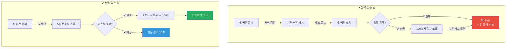
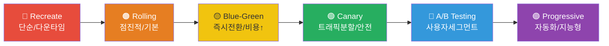
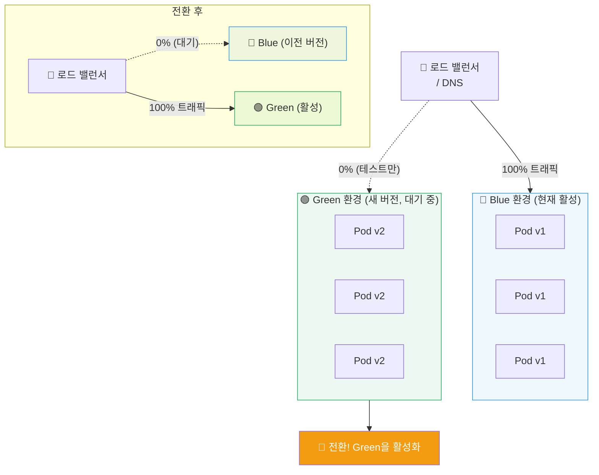
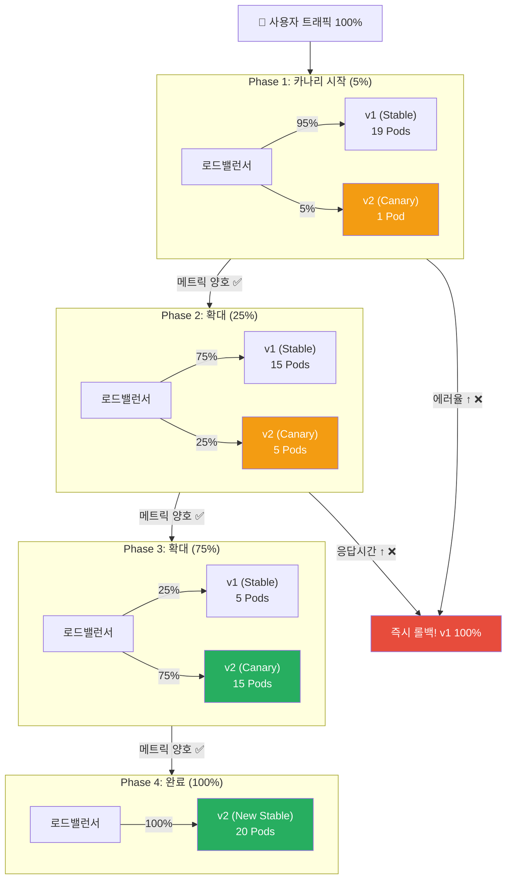
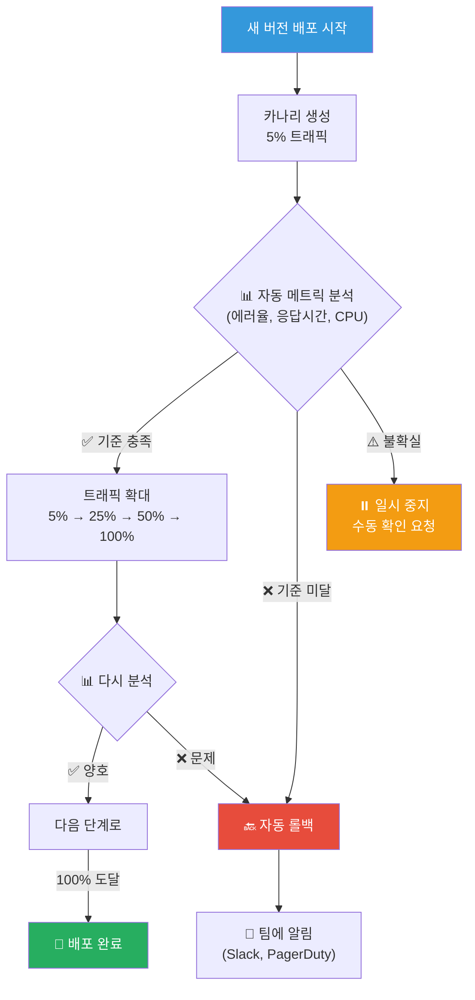

# 배포 전략 (Deployment Strategy)

> 새 버전의 코드를 사용자에게 전달하는 방법은 하나가 아니에요. 마치 이사할 때 "한 번에 다 옮기기", "조금씩 나눠 옮기기", "새 집에 먼저 짐 옮겨놓고 하루에 스위치하기" 등 다양한 방법이 있는 것처럼, 배포에도 상황에 맞는 전략이 있어요. [CD 파이프라인](./04-cd-pipeline)에서 자동 배포의 기본을 배웠다면, 이제 "어떻게" 배포할지를 결정하는 전략들을 깊이 알아봐요.

---

## 🎯 왜 배포 전략을 알아야 하나요?

### 일상 비유: 식당 리모델링

동네에서 인기 있는 식당이 리모델링을 해야 한다고 상상해 보세요.

- **Recreate (재생성)**: 식당을 완전히 닫고, 리모델링 끝난 후 다시 오픈해요. 그동안 손님은 아무도 못 와요.
- **Rolling Update (롤링 업데이트)**: 홀을 절반씩 나눠서 한쪽을 리모델링하는 동안 다른 쪽에서 영업해요.
- **Blue-Green (블루-그린)**: 옆에 새 식당을 미리 완성해놓고, 어느 날 간판만 바꿔서 손님을 새 식당으로 안내해요.
- **Canary (카나리)**: 리모델링한 쪽에 단골 10명만 먼저 초대해서 반응을 보고, 괜찮으면 전체 오픈해요.
- **A/B Testing**: 20대 손님은 새 인테리어 쪽으로, 40대 손님은 기존 쪽으로 안내해서 어느 쪽이 만족도가 높은지 비교해요.

```
실무에서 배포 전략이 필요한 순간:

• "배포할 때마다 서비스가 1~2분 중단돼요"          → 무중단 배포 전략 필요
• "배포했는데 문제가 생기면 전체 사용자가 영향받아요" → 점진적 배포 필요
• "롤백하는 데 30분이 걸려요"                       → 즉시 롤백 가능한 전략 필요
• "새 기능이 잘 동작할지 확신이 없어요"             → Canary/A/B 테스트 필요
• "특정 사용자에게만 먼저 기능을 공개하고 싶어요"   → Feature Flag 필요
• "배포와 릴리스를 분리하고 싶어요"                 → Progressive Delivery 필요
• "AWS 비용을 최소화하면서 안전하게 배포하고 싶어요" → 리소스 효율적 전략 필요
```

### 배포 전략이 없는 팀 vs 있는 팀



---

## 🧠 핵심 개념 잡기

### 배포 전략의 전체 스펙트럼

배포 전략은 **안전성**과 **속도** 사이의 트레이드오프예요. 아래 그림은 단순한 것부터 복잡한 것까지 전체 스펙트럼을 보여줘요.



| 특성 | Recreate | Rolling | Blue-Green | Canary | A/B Testing | Progressive |
|------|----------|---------|------------|--------|-------------|-------------|
| **다운타임** | 있음 | 없음 | 없음 | 없음 | 없음 | 없음 |
| **추가 리소스** | 없음 | 최소 | 2배 | 최소~중간 | 중간 | 중간 |
| **복잡도** | 매우 낮음 | 낮음 | 중간 | 높음 | 매우 높음 | 매우 높음 |
| **롤백 속도** | 느림 | 중간 | 즉시 | 빠름 | 빠름 | 즉시 |
| **트래픽 제어** | 없음 | 없음 | 전부/없음 | % 기반 | 사용자 기반 | 자동 % |
| **위험도** | 높음 | 중간 | 낮음 | 매우 낮음 | 매우 낮음 | 매우 낮음 |
| **적합한 상황** | 개발/테스트 | 일반 서비스 | 핵심 서비스 | 대규모 서비스 | 비즈니스 실험 | 엔터프라이즈 |

### 핵심 용어 정리

```
📌 배포(Deployment) vs 릴리스(Release)
   - 배포: 코드를 서버에 올리는 기술적 행위
   - 릴리스: 사용자가 새 기능을 사용할 수 있게 되는 비즈니스 행위
   → Progressive Delivery는 이 둘을 분리해요!

📌 다운타임(Downtime)
   - 서비스가 사용자 요청을 처리할 수 없는 시간

📌 롤백(Rollback)
   - 문제 발생 시 이전 버전으로 되돌리는 것

📌 트래픽 분할(Traffic Splitting)
   - 사용자 요청을 여러 버전에 비율로 나눠 보내는 것

📌 헬스 체크(Health Check)
   - 애플리케이션이 정상 동작하는지 주기적으로 확인하는 것

📌 메트릭 기반 승격(Metrics-based Promotion)
   - 에러율, 응답 시간 등 수치를 기준으로 새 버전을 확대할지 결정하는 것
```

---

## 🔍 하나씩 자세히 알아보기

### 1. Recreate (재생성 전략)

> **비유**: 식당을 완전히 닫고 리모델링한 후 다시 오픈

가장 단순한 배포 전략이에요. 기존 버전을 모두 내리고, 새 버전을 올려요.

```
배포 과정:

시간 →→→→→→→→→→→→→→→→→→→→→→→→

v1 [████████████]
                  [다운타임]
v2                            [████████████]

장점: 구성이 단순, 동시에 두 버전이 공존하지 않음
단점: 다운타임 발생, 롤백 시에도 다운타임
```

#### Kubernetes에서 Recreate

```yaml
# recreate-deployment.yaml
apiVersion: apps/v1
kind: Deployment
metadata:
  name: my-app
spec:
  replicas: 3
  strategy:
    type: Recreate      # 기존 Pod 전부 종료 후 새 Pod 생성
  selector:
    matchLabels:
      app: my-app
  template:
    metadata:
      labels:
        app: my-app
    spec:
      containers:
      - name: my-app
        image: my-app:v2
        ports:
        - containerPort: 8080
        readinessProbe:
          httpGet:
            path: /health
            port: 8080
          initialDelaySeconds: 5
          periodSeconds: 10
```

#### 언제 사용하나요?

```
✅ 적합한 경우:
  • 개발/테스트 환경 (다운타임이 허용됨)
  • DB 스키마가 크게 변경되어 두 버전 공존이 불가능할 때
  • 단일 인스턴스 애플리케이션 (이미 HA가 아님)
  • 비용을 최소화해야 하는 소규모 프로젝트

❌ 부적합한 경우:
  • 프로덕션 환경에서 SLA가 중요한 서비스
  • 24/7 가용성이 필요한 서비스
```

---

### 2. Rolling Update (롤링 업데이트)

> **비유**: 식당 테이블을 한 줄씩 교체하면서 나머지 테이블에서는 계속 영업

Kubernetes의 **기본 배포 전략**이에요. Pod를 하나씩(또는 일정 비율씩) 새 버전으로 교체해요.

```mermaid
flowchart LR
    subgraph "Step 1: 시작 상태"
        direction TB
        P1a["Pod v1"] ~~~ P2a["Pod v1"] ~~~ P3a["Pod v1"] ~~~ P4a["Pod v1"]
    end

    subgraph "Step 2: 교체 시작"
        direction TB
        P1b["Pod v2 🆕"] ~~~ P2b["Pod v1"] ~~~ P3b["Pod v1"] ~~~ P4b["Pod v1"]
    end

    subgraph "Step 3: 진행 중"
        direction TB
        P1c["Pod v2 🆕"] ~~~ P2c["Pod v2 🆕"] ~~~ P3c["Pod v1"] ~~~ P4c["Pod v1"]
    end

    subgraph "Step 4: 완료"
        direction TB
        P1d["Pod v2 🆕"] ~~~ P2d["Pod v2 🆕"] ~~~ P3d["Pod v2 🆕"] ~~~ P4d["Pod v2 🆕"]
    end

    style P1a fill:#e74c3c,color:#fff
    style P2a fill:#e74c3c,color:#fff
    style P3a fill:#e74c3c,color:#fff
    style P4a fill:#e74c3c,color:#fff
    style P1b fill:#27ae60,color:#fff
    style P2b fill:#e74c3c,color:#fff
    style P3b fill:#e74c3c,color:#fff
    style P4b fill:#e74c3c,color:#fff
    style P1c fill:#27ae60,color:#fff
    style P2c fill:#27ae60,color:#fff
    style P3c fill:#e74c3c,color:#fff
    style P4c fill:#e74c3c,color:#fff
    style P1d fill:#27ae60,color:#fff
    style P2d fill:#27ae60,color:#fff
    style P3d fill:#27ae60,color:#fff
    style P4d fill:#27ae60,color:#fff
```



#### maxSurge와 maxUnavailable

Rolling Update의 동작을 제어하는 두 가지 핵심 파라미터가 있어요.

```
📌 maxSurge: 원래 replicas 수 대비 "추가로" 만들 수 있는 Pod 수
   → 배포 중 최대 Pod 수 = replicas + maxSurge

📌 maxUnavailable: 배포 중 "동시에 내릴 수 있는" Pod 수
   → 배포 중 최소 가용 Pod 수 = replicas - maxUnavailable

예시 (replicas: 4):
┌─────────────────────┬────────────────────┬──────────────────────┐
│ 설정                 │ maxSurge=1,        │ maxSurge=0,          │
│                     │ maxUnavailable=0   │ maxUnavailable=1     │
├─────────────────────┼────────────────────┼──────────────────────┤
│ 배포 중 최대 Pod    │ 5 (4+1)            │ 4 (4+0)              │
│ 배포 중 최소 Pod    │ 4 (4-0)            │ 3 (4-1)              │
│ 속도                │ 느림 (하나씩 추가)  │ 빠름 (바로 교체)      │
│ 리소스              │ 추가 필요           │ 추가 불필요           │
│ 안전성              │ 높음               │ 일시적 용량 감소      │
└─────────────────────┴────────────────────┴──────────────────────┘
```

#### Kubernetes 설정

```yaml
# rolling-update-deployment.yaml
apiVersion: apps/v1
kind: Deployment
metadata:
  name: my-app
  labels:
    app: my-app
spec:
  replicas: 4
  strategy:
    type: RollingUpdate
    rollingUpdate:
      maxSurge: 1            # 추가 Pod 1개까지 허용
      maxUnavailable: 0      # 항상 4개 이상 가용 (무중단 보장)
  selector:
    matchLabels:
      app: my-app
  template:
    metadata:
      labels:
        app: my-app
        version: v2
    spec:
      containers:
      - name: my-app
        image: my-app:v2
        ports:
        - containerPort: 8080
        # readinessProbe가 핵심! 준비된 Pod만 트래픽 받음
        readinessProbe:
          httpGet:
            path: /health
            port: 8080
          initialDelaySeconds: 10
          periodSeconds: 5
          failureThreshold: 3
        # livenessProbe로 비정상 Pod 자동 재시작
        livenessProbe:
          httpGet:
            path: /health
            port: 8080
          initialDelaySeconds: 30
          periodSeconds: 10
      # Graceful Shutdown을 위한 설정
      terminationGracePeriodSeconds: 60
```

#### 롤백

```bash
# 배포 상태 확인
kubectl rollout status deployment/my-app

# 배포 이력 확인
kubectl rollout history deployment/my-app

# 이전 버전으로 롤백
kubectl rollout undo deployment/my-app

# 특정 리비전으로 롤백
kubectl rollout undo deployment/my-app --to-revision=3

# 배포 일시 중지 (문제 발견 시)
kubectl rollout pause deployment/my-app

# 배포 재개
kubectl rollout resume deployment/my-app
```

#### 장단점

```
✅ 장점:
  • Kubernetes 기본 전략이라 별도 도구 불필요
  • 무중단 배포 가능 (maxUnavailable=0 설정 시)
  • 리소스 추가가 최소 (maxSurge=1이면 Pod 1개만 추가)
  • 자동 롤백 지원 (kubectl rollout undo)

❌ 단점:
  • 배포 중 v1과 v2가 동시에 서비스됨 (호환성 필요)
  • 전체 교체에 시간이 걸림 (Pod 수 x 준비 시간)
  • 트래픽 비율 제어 불가 (Pod 수 비율로만 결정)
  • 롤백 시에도 Rolling 방식으로 진행되어 시간 소요
```

---

### 3. Blue-Green Deployment (블루-그린 배포)

> **비유**: 옆에 새 식당을 완성해놓고 간판만 바꿔 손님을 안내

두 개의 완전히 동일한 환경(Blue, Green)을 준비해놓고, 트래픽을 한 번에 전환하는 전략이에요.



#### Kubernetes에서 Blue-Green 구현

```yaml
# blue-deployment.yaml (현재 활성 버전)
apiVersion: apps/v1
kind: Deployment
metadata:
  name: my-app-blue
spec:
  replicas: 3
  selector:
    matchLabels:
      app: my-app
      version: blue
  template:
    metadata:
      labels:
        app: my-app
        version: blue
    spec:
      containers:
      - name: my-app
        image: my-app:v1
        ports:
        - containerPort: 8080
---
# green-deployment.yaml (새 버전, 배포 대기)
apiVersion: apps/v1
kind: Deployment
metadata:
  name: my-app-green
spec:
  replicas: 3
  selector:
    matchLabels:
      app: my-app
      version: green
  template:
    metadata:
      labels:
        app: my-app
        version: green
    spec:
      containers:
      - name: my-app
        image: my-app:v2
        ports:
        - containerPort: 8080
---
# service.yaml (트래픽 전환의 핵심!)
apiVersion: v1
kind: Service
metadata:
  name: my-app
spec:
  selector:
    app: my-app
    version: blue    # ← 이 값을 'green'으로 바꾸면 전환 완료!
  ports:
  - port: 80
    targetPort: 8080
```

#### 전환 스크립트

```bash
#!/bin/bash
# blue-green-switch.sh

CURRENT=$(kubectl get svc my-app -o jsonpath='{.spec.selector.version}')
echo "현재 활성 환경: $CURRENT"

if [ "$CURRENT" = "blue" ]; then
    NEW="green"
else
    NEW="blue"
fi

# 새 환경이 준비되었는지 확인
echo "새 환경($NEW) 상태 확인..."
kubectl rollout status deployment/my-app-$NEW --timeout=120s

if [ $? -ne 0 ]; then
    echo "❌ 새 환경이 준비되지 않았어요!"
    exit 1
fi

# 트래픽 전환
echo "🔄 트래픽을 $NEW 환경으로 전환합니다..."
kubectl patch svc my-app -p "{\"spec\":{\"selector\":{\"version\":\"$NEW\"}}}"

echo "✅ 전환 완료! 활성 환경: $NEW"
echo "⚠️  이전 환경($CURRENT)은 롤백을 위해 유지됩니다."
echo "   정상 확인 후: kubectl delete deployment my-app-$CURRENT"
```

#### DNS 기반 Blue-Green (AWS Route 53)

```yaml
# AWS Route 53 가중치 기반 라우팅
# Blue 환경 (현재 활성)
resource "aws_route53_record" "blue" {
  zone_id = aws_route53_zone.main.zone_id
  name    = "api.example.com"
  type    = "A"

  alias {
    name                   = aws_lb.blue.dns_name
    zone_id                = aws_lb.blue.zone_id
    evaluate_target_health = true
  }

  weighted_routing_policy {
    weight = 100    # ← 전환 시 0으로 변경
  }

  set_identifier = "blue"
}

# Green 환경 (대기)
resource "aws_route53_record" "green" {
  zone_id = aws_route53_zone.main.zone_id
  name    = "api.example.com"
  type    = "A"

  alias {
    name                   = aws_lb.green.dns_name
    zone_id                = aws_lb.green.zone_id
    evaluate_target_health = true
  }

  weighted_routing_policy {
    weight = 0      # ← 전환 시 100으로 변경
  }

  set_identifier = "green"
}
```

#### 장단점

```
✅ 장점:
  • 즉시 전환 / 즉시 롤백 (selector 변경만으로)
  • 전환 전에 Green 환경을 충분히 테스트 가능
  • 다운타임 없음
  • 두 버전이 동시에 사용자 트래픽을 받지 않음

❌ 단점:
  • 리소스가 2배 필요 (Blue + Green 동시 운영)
  • DB 마이그레이션 처리가 복잡함 (양쪽 모두 같은 DB 사용 시)
  • 장시간 연결(WebSocket 등)은 전환 시 끊길 수 있음
  • 상태를 가진 애플리케이션에서 구현이 복잡함
```

---

### 4. Canary Deployment (카나리 배포)

> **비유**: 탄광에 카나리아 새를 먼저 보내서 안전한지 확인

새 버전을 **소수의 트래픽**에만 먼저 노출하고, 문제가 없으면 점진적으로 확대하는 전략이에요. 이름의 유래는 탄광에서 유독가스를 감지하기 위해 카나리아 새를 먼저 보냈던 것에서 왔어요.



#### Nginx Ingress로 Canary 구현

```yaml
# stable-deployment.yaml
apiVersion: apps/v1
kind: Deployment
metadata:
  name: my-app-stable
spec:
  replicas: 19
  selector:
    matchLabels:
      app: my-app
      track: stable
  template:
    metadata:
      labels:
        app: my-app
        track: stable
    spec:
      containers:
      - name: my-app
        image: my-app:v1
---
# canary-deployment.yaml
apiVersion: apps/v1
kind: Deployment
metadata:
  name: my-app-canary
spec:
  replicas: 1
  selector:
    matchLabels:
      app: my-app
      track: canary
  template:
    metadata:
      labels:
        app: my-app
        track: canary
    spec:
      containers:
      - name: my-app
        image: my-app:v2
---
# stable-ingress.yaml
apiVersion: networking.k8s.io/v1
kind: Ingress
metadata:
  name: my-app-stable
spec:
  ingressClassName: nginx
  rules:
  - host: api.example.com
    http:
      paths:
      - path: /
        pathType: Prefix
        backend:
          service:
            name: my-app-stable
            port:
              number: 80
---
# canary-ingress.yaml
apiVersion: networking.k8s.io/v1
kind: Ingress
metadata:
  name: my-app-canary
  annotations:
    nginx.ingress.kubernetes.io/canary: "true"
    nginx.ingress.kubernetes.io/canary-weight: "5"    # 5% 트래픽
spec:
  ingressClassName: nginx
  rules:
  - host: api.example.com
    http:
      paths:
      - path: /
        pathType: Prefix
        backend:
          service:
            name: my-app-canary
            port:
              number: 80
```

#### 메트릭 기반 자동 승격 (Prometheus + 스크립트)

```bash
#!/bin/bash
# canary-promote.sh - 메트릭 기반 카나리 승격 스크립트

CANARY_WEIGHT=5
MAX_WEIGHT=100
STEP=15
CHECK_INTERVAL=300  # 5분

while [ $CANARY_WEIGHT -lt $MAX_WEIGHT ]; do
    echo "📊 카나리 트래픽: ${CANARY_WEIGHT}% - 메트릭 확인 중..."

    # Prometheus에서 에러율 조회
    ERROR_RATE=$(curl -s "http://prometheus:9090/api/v1/query" \
        --data-urlencode "query=rate(http_requests_total{track=\"canary\",code=~\"5..\"}[5m]) / rate(http_requests_total{track=\"canary\"}[5m]) * 100" \
        | jq -r '.data.result[0].value[1]')

    # Prometheus에서 P99 응답 시간 조회
    LATENCY_P99=$(curl -s "http://prometheus:9090/api/v1/query" \
        --data-urlencode "query=histogram_quantile(0.99, rate(http_request_duration_seconds_bucket{track=\"canary\"}[5m]))" \
        | jq -r '.data.result[0].value[1]')

    echo "  에러율: ${ERROR_RATE}%, P99 응답시간: ${LATENCY_P99}s"

    # 승격 조건 확인
    if (( $(echo "$ERROR_RATE > 1.0" | bc -l) )); then
        echo "❌ 에러율이 1%를 초과했어요! 롤백합니다."
        kubectl annotate ingress my-app-canary \
            nginx.ingress.kubernetes.io/canary-weight="0" --overwrite
        kubectl scale deployment my-app-canary --replicas=0
        echo "🔙 롤백 완료"
        exit 1
    fi

    if (( $(echo "$LATENCY_P99 > 2.0" | bc -l) )); then
        echo "❌ P99 응답시간이 2초를 초과했어요! 롤백합니다."
        kubectl annotate ingress my-app-canary \
            nginx.ingress.kubernetes.io/canary-weight="0" --overwrite
        kubectl scale deployment my-app-canary --replicas=0
        echo "🔙 롤백 완료"
        exit 1
    fi

    # 다음 단계로 승격
    CANARY_WEIGHT=$((CANARY_WEIGHT + STEP))
    if [ $CANARY_WEIGHT -gt $MAX_WEIGHT ]; then
        CANARY_WEIGHT=$MAX_WEIGHT
    fi

    echo "✅ 메트릭 양호! 카나리 트래픽을 ${CANARY_WEIGHT}%로 증가시켜요."
    kubectl annotate ingress my-app-canary \
        nginx.ingress.kubernetes.io/canary-weight="$CANARY_WEIGHT" --overwrite

    # 다음 확인까지 대기
    sleep $CHECK_INTERVAL
done

echo "🎉 카나리 배포 완료! v2가 100% 트래픽을 받고 있어요."
# Stable을 v2로 업데이트하고 카나리 정리
kubectl set image deployment/my-app-stable my-app=my-app:v2
kubectl delete deployment my-app-canary
kubectl delete ingress my-app-canary
```

#### 장단점

```
✅ 장점:
  • 위험 최소화 (소수 사용자만 영향)
  • 실제 프로덕션 트래픽으로 검증
  • 메트릭 기반 자동화 가능
  • 문제 시 빠른 롤백 (카나리 트래픽만 제거)

❌ 단점:
  • 구현 복잡도 높음 (트래픽 분할 인프라 필요)
  • 모니터링/관측 시스템 필수
  • 소수 사용자는 문제를 경험할 수 있음
  • 트래픽이 적은 서비스에서는 통계적 유의미성 확보 어려움
```

---

### 5. A/B Testing (A/B 테스트)

> **비유**: 20대 손님은 새 메뉴판으로, 40대 손님은 기존 메뉴판으로 안내

Canary와 비슷하지만, **랜덤 트래픽 분할**이 아니라 **특정 사용자 세그먼트** 기반으로 라우팅해요. 기술적 배포보다는 **비즈니스 실험**에 가까워요.

```
Canary vs A/B Testing 차이:

Canary: 랜덤으로 5%의 트래픽이 새 버전으로 감
        → 목적: 기술적 안정성 검증

A/B:    "한국 사용자" 또는 "Premium 유저"만 새 버전으로 감
        → 목적: 비즈니스 지표 비교 (전환율, 매출, 체류시간)
```

#### Nginx에서 A/B 라우팅

```yaml
# 헤더 기반 A/B 라우팅 (Nginx Ingress)
apiVersion: networking.k8s.io/v1
kind: Ingress
metadata:
  name: my-app-ab-test
  annotations:
    nginx.ingress.kubernetes.io/canary: "true"
    # 특정 헤더 값으로 라우팅
    nginx.ingress.kubernetes.io/canary-by-header: "X-User-Group"
    nginx.ingress.kubernetes.io/canary-by-header-value: "beta-tester"
spec:
  ingressClassName: nginx
  rules:
  - host: api.example.com
    http:
      paths:
      - path: /
        pathType: Prefix
        backend:
          service:
            name: my-app-v2   # beta-tester 그룹은 v2로
            port:
              number: 80
```

#### Istio에서 정교한 A/B 라우팅

```yaml
# istio-virtual-service.yaml
apiVersion: networking.istio.io/v1beta1
kind: VirtualService
metadata:
  name: my-app
spec:
  hosts:
  - api.example.com
  http:
  # 규칙 1: Premium 유저 → v2
  - match:
    - headers:
        x-user-tier:
          exact: "premium"
    route:
    - destination:
        host: my-app
        subset: v2
  # 규칙 2: 한국 사용자 → v2
  - match:
    - headers:
        x-user-country:
          exact: "KR"
    route:
    - destination:
        host: my-app
        subset: v2
  # 규칙 3: 나머지 → v1
  - route:
    - destination:
        host: my-app
        subset: v1
---
apiVersion: networking.istio.io/v1beta1
kind: DestinationRule
metadata:
  name: my-app
spec:
  host: my-app
  subsets:
  - name: v1
    labels:
      version: v1
  - name: v2
    labels:
      version: v2
```

#### 장단점

```
✅ 장점:
  • 비즈니스 가설을 실제 데이터로 검증
  • 특정 세그먼트에만 노출하므로 리스크 제어 가능
  • 전환율, 매출 등 비즈니스 지표 직접 비교

❌ 단점:
  • 구현이 가장 복잡 (사용자 분류 로직 필요)
  • 통계적 유의미성 확보에 충분한 트래픽 필요
  • 세션 일관성(sticky session) 보장 필요
  • 배포 전략이라기보다 실험 프레임워크에 가까움
```

---

### 6. Shadow/Dark Launch (섀도우/다크 런치)

> **비유**: 새 요리사가 주방에서 같은 주문을 동시에 만들어보되, 손님에게는 기존 요리사 것만 제공

실제 프로덕션 트래픽을 새 버전으로 **복제**해서 보내지만, 새 버전의 응답은 사용자에게 전달하지 않아요. "사용자 모르게" 새 버전을 프로덕션 환경에서 테스트하는 전략이에요.

```
트래픽 흐름:

사용자 요청 ──→ [로드밸런서] ──→ v1 (Stable) ──→ 사용자에게 응답
                    │
                    └──복제──→ v2 (Shadow) ──→ 응답 폐기 (로그만 수집)

사용자는 v2의 존재를 전혀 모름!
```

#### Istio로 Shadow 트래픽 구현

```yaml
# istio-mirror.yaml
apiVersion: networking.istio.io/v1beta1
kind: VirtualService
metadata:
  name: my-app
spec:
  hosts:
  - api.example.com
  http:
  - route:
    - destination:
        host: my-app
        subset: v1
      weight: 100
    mirror:                    # 트래픽 미러링
      host: my-app
      subset: v2
    mirrorPercentage:
      value: 50.0              # 50%의 트래픽만 미러링
```

#### 사용 사례

```
✅ Shadow/Dark Launch가 적합한 경우:
  • 대규모 아키텍처 변경 (모놀리스 → 마이크로서비스)
  • DB 마이그레이션 전 검증 (새 DB에 쿼리 결과 비교)
  • ML 모델 교체 시 예측 결과 비교
  • 성능 벤치마크 (v2의 응답 시간, CPU/메모리 사용량 측정)

⚠️ 주의사항:
  • 쓰기 작업은 미러링하면 안 돼요! (이메일 발송, 결제 등)
  • 리소스가 추가로 필요해요 (트래픽 2배)
  • 외부 API 호출이 중복될 수 있어요
```

---

### 7. Feature Flags (피처 플래그)

> **비유**: 식당 메뉴판에 새 메뉴를 추가했지만, 특정 손님에게만 보이게 하는 "숨겨진 메뉴"

코드는 이미 배포했지만, 기능의 활성화/비활성화를 **런타임에 제어**하는 기법이에요. 배포와 릴리스를 **완전히 분리**할 수 있어요.

```
배포와 릴리스의 분리:

전통적 방식:
  코드 배포 = 기능 릴리스 (동시에 일어남)
  → 문제 시 전체 롤백 필요

Feature Flag 방식:
  코드 배포 → (Flag OFF) → 테스트 → (Flag ON for 10%) → 점진 확대 → (Flag ON 100%)
  → 문제 시 Flag만 OFF (롤백 없이!)
```

#### 직접 구현 (간단한 버전)

```python
# feature_flags.py - 간단한 Feature Flag 구현

import json
import hashlib
from typing import Optional

class FeatureFlags:
    def __init__(self, config_path: str = "features.json"):
        with open(config_path) as f:
            self.config = json.load(f)

    def is_enabled(self, feature: str, user_id: Optional[str] = None) -> bool:
        """피처 플래그가 활성화되어 있는지 확인"""
        flag = self.config.get(feature)
        if flag is None:
            return False

        # 전체 ON/OFF
        if isinstance(flag, bool):
            return flag

        # 비율 기반 (percentage rollout)
        if "percentage" in flag and user_id:
            hash_val = int(hashlib.md5(
                f"{feature}:{user_id}".encode()
            ).hexdigest(), 16)
            return (hash_val % 100) < flag["percentage"]

        # 사용자 화이트리스트
        if "users" in flag and user_id:
            return user_id in flag["users"]

        # 기본값
        return flag.get("enabled", False)


# features.json 예시
"""
{
    "new-checkout-flow": {
        "enabled": true,
        "percentage": 10,
        "users": ["user-001", "user-002"]
    },
    "dark-mode": true,
    "experimental-search": {
        "enabled": false,
        "percentage": 0
    }
}
"""

# 사용 예시
flags = FeatureFlags()

# 라우팅에서 사용
def checkout(request):
    user_id = request.user.id
    if flags.is_enabled("new-checkout-flow", user_id):
        return new_checkout_flow(request)     # 새 기능
    else:
        return legacy_checkout_flow(request)  # 기존 기능
```

#### 주요 Feature Flag 서비스들

```
┌─────────────────┬───────────────┬─────────────┬──────────────┐
│ 서비스           │ LaunchDarkly  │ Unleash     │ Flagsmith    │
├─────────────────┼───────────────┼─────────────┼──────────────┤
│ 유형            │ SaaS          │ 오픈소스/SaaS│ 오픈소스/SaaS│
│ 가격            │ 비쌈          │ 무료~       │ 무료~        │
│ SDK 지원        │ 25+ 언어      │ 15+ 언어   │ 12+ 언어     │
│ 타겟팅 기능     │ 매우 강력     │ 기본~중간   │ 중간         │
│ 분석 기능       │ 내장          │ 제한적      │ 기본         │
│ 셀프호스팅      │ 불가          │ 가능        │ 가능         │
│ 장점            │ 기능 풍부,    │ 무료,       │ 무료,        │
│                 │ 기업 지원     │ 셀프호스팅  │ UI 직관적    │
│ 추천 대상       │ 대기업        │ 중소기업    │ 스타트업     │
└─────────────────┴───────────────┴─────────────┴──────────────┘
```

#### Unleash 실제 사용 예시

```javascript
// Node.js + Unleash 클라이언트
const { initialize } = require('unleash-client');

const unleash = initialize({
    url: 'http://unleash.example.com/api/',
    appName: 'my-app',
    customHeaders: {
        Authorization: process.env.UNLEASH_API_TOKEN
    },
});

// Express 미들웨어에서 사용
app.get('/api/search', (req, res) => {
    const context = {
        userId: req.user.id,
        properties: {
            country: req.user.country,
            plan: req.user.plan,
        }
    };

    if (unleash.isEnabled('new-search-algorithm', context)) {
        // 새 검색 알고리즘
        return newSearchHandler(req, res);
    }

    // 기존 검색
    return legacySearchHandler(req, res);
});
```

#### Feature Flag 생명주기

```
플래그 생명주기 관리 (Technical Debt 방지):

1. 생성    → 새 기능 개발 시 플래그 생성
2. 테스트  → 내부 팀에게만 활성화
3. 점진 롤아웃 → 10% → 25% → 50% → 100%
4. 안정화  → 모든 사용자에게 활성화
5. 정리    → 플래그 제거, 코드에서 분기 제거  ← 이걸 잊으면 기술 부채!

⚠️ 실무 팁:
  • 플래그에 만료일을 설정하세요 (예: 생성 후 90일)
  • 100% 활성화 후 30일이 지나면 플래그 코드를 정리하세요
  • 플래그 개수가 100개를 넘으면 위험 신호예요
  • 정기적으로 "플래그 정리 스프린트"를 가지세요
```

---

### 8. Progressive Delivery (점진적 배포)

> **비유**: AI가 관리하는 자동 배송 시스템 - 배송 품질을 실시간 모니터링하고, 문제가 감지되면 자동으로 배송을 중단

Progressive Delivery는 Canary + 자동화 + 메트릭 분석을 결합한 **지능형 배포 전략**이에요. 사람이 매번 판단하지 않아도, 시스템이 자동으로 배포를 진행하거나 롤백해요.



#### Argo Rollouts

Kubernetes에서 Progressive Delivery를 구현하는 가장 인기 있는 도구예요. 기존 Deployment를 대체하는 `Rollout` 리소스를 제공해요.

```yaml
# argo-rollout.yaml
apiVersion: argoproj.io/v1alpha1
kind: Rollout
metadata:
  name: my-app
spec:
  replicas: 10
  revisionHistoryLimit: 3
  selector:
    matchLabels:
      app: my-app
  template:
    metadata:
      labels:
        app: my-app
    spec:
      containers:
      - name: my-app
        image: my-app:v2
        ports:
        - containerPort: 8080
        resources:
          requests:
            cpu: 100m
            memory: 128Mi
          limits:
            cpu: 500m
            memory: 512Mi
  strategy:
    canary:
      # 카나리 단계별 설정
      steps:
      - setWeight: 5           # 5% 트래픽
      - pause:
          duration: 5m         # 5분 대기
      - analysis:              # 자동 메트릭 분석
          templates:
          - templateName: success-rate
          - templateName: latency
      - setWeight: 25          # 25% 트래픽
      - pause:
          duration: 5m
      - analysis:
          templates:
          - templateName: success-rate
          - templateName: latency
      - setWeight: 50          # 50%
      - pause:
          duration: 10m
      - analysis:
          templates:
          - templateName: success-rate
      - setWeight: 100         # 100% - 배포 완료

      # 롤백 설정
      maxSurge: "20%"
      maxUnavailable: 0

      # 트래픽 라우팅 (Istio/Nginx/ALB 등)
      trafficRouting:
        nginx:
          stableIngress: my-app-stable
          annotationPrefix: nginx.ingress.kubernetes.io

      # 안티-어피니티 (카나리와 stable을 다른 노드에 배치)
      antiAffinity:
        preferredDuringSchedulingIgnoredDuringExecution:
          weight: 100
---
# analysis-template-success-rate.yaml
apiVersion: argoproj.io/v1alpha1
kind: AnalysisTemplate
metadata:
  name: success-rate
spec:
  metrics:
  - name: success-rate
    # 5xx 에러율이 2% 미만이어야 통과
    successCondition: result[0] >= 0.98
    interval: 60s             # 1분마다 확인
    count: 5                  # 5번 확인
    failureLimit: 2           # 2번까지 실패 허용
    provider:
      prometheus:
        address: http://prometheus:9090
        query: |
          sum(rate(http_requests_total{app="my-app",track="canary",code!~"5.."}[5m]))
          /
          sum(rate(http_requests_total{app="my-app",track="canary"}[5m]))
---
# analysis-template-latency.yaml
apiVersion: argoproj.io/v1alpha1
kind: AnalysisTemplate
metadata:
  name: latency
spec:
  metrics:
  - name: p99-latency
    # P99 응답시간이 500ms 미만이어야 통과
    successCondition: result[0] < 500
    interval: 60s
    count: 5
    failureLimit: 2
    provider:
      prometheus:
        address: http://prometheus:9090
        query: |
          histogram_quantile(0.99,
            sum(rate(http_request_duration_milliseconds_bucket{app="my-app",track="canary"}[5m]))
            by (le)
          )
```

#### Flagger (Istio/Linkerd/App Mesh 기반)

```yaml
# flagger-canary.yaml
apiVersion: flagger.app/v1beta1
kind: Canary
metadata:
  name: my-app
spec:
  targetRef:
    apiVersion: apps/v1
    kind: Deployment
    name: my-app
  service:
    port: 80
    targetPort: 8080
    gateways:
    - public-gateway.istio-system.svc.cluster.local
    hosts:
    - api.example.com
  analysis:
    # 분석 주기와 횟수
    interval: 1m              # 1분마다 확인
    threshold: 5              # 5번 연속 실패 시 롤백
    maxWeight: 50             # 최대 50%까지 카나리
    stepWeight: 10            # 10%씩 증가

    # 승격 조건 (모두 충족해야 다음 단계로)
    metrics:
    - name: request-success-rate
      thresholdRange:
        min: 99               # 성공률 99% 이상
      interval: 1m
    - name: request-duration
      thresholdRange:
        max: 500              # P99 500ms 이하
      interval: 1m

    # Webhook으로 추가 검증
    webhooks:
    - name: smoke-test
      type: pre-rollout       # 카나리 시작 전 실행
      url: http://flagger-loadtester/
      timeout: 60s
      metadata:
        type: bash
        cmd: "curl -s http://my-app-canary/health | grep ok"
    - name: load-test
      type: rollout           # 카나리 진행 중 실행
      url: http://flagger-loadtester/
      timeout: 60s
      metadata:
        type: cmd
        cmd: "hey -z 1m -q 10 -c 2 http://my-app-canary/"

    # 알림 설정
    alerts:
    - name: slack
      severity: info
      providerRef:
        name: slack-notification
```

#### Argo Rollouts vs Flagger 비교

```
┌─────────────────┬──────────────────┬──────────────────┐
│ 특성            │ Argo Rollouts     │ Flagger          │
├─────────────────┼──────────────────┼──────────────────┤
│ 리소스 타입     │ Rollout (커스텀)  │ Canary (래핑)    │
│ 기존 Deployment │ 대체 필요         │ 그대로 사용      │
│ 트래픽 라우팅   │ Nginx/Istio/ALB  │ Istio/Linkerd    │
│                 │                  │ /App Mesh/Nginx  │
│ 분석 엔진      │ 내장 (강력)       │ 내장 (기본)      │
│ Blue-Green      │ 지원             │ 지원             │
│ UI 대시보드     │ 있음             │ Grafana 연동     │
│ GitOps 연동    │ Argo CD와 긴밀   │ Flux 친화적      │
│ 커뮤니티       │ 크고 활발         │ 중간             │
│ 학습 곡선      │ 중간             │ 중간             │
│ 추천           │ Argo CD 사용 시  │ Istio/Linkerd    │
│                │                  │ 사용 시          │
└─────────────────┴──────────────────┴──────────────────┘
```

---

## 💻 직접 해보기

### 실습 1: Kubernetes Rolling Update 체험

```bash
# 1. 샘플 앱 배포 (v1)
cat <<'EOF' | kubectl apply -f -
apiVersion: apps/v1
kind: Deployment
metadata:
  name: webapp
spec:
  replicas: 4
  strategy:
    type: RollingUpdate
    rollingUpdate:
      maxSurge: 1
      maxUnavailable: 0
  selector:
    matchLabels:
      app: webapp
  template:
    metadata:
      labels:
        app: webapp
        version: v1
    spec:
      containers:
      - name: webapp
        image: nginx:1.24
        ports:
        - containerPort: 80
        readinessProbe:
          httpGet:
            path: /
            port: 80
          initialDelaySeconds: 5
          periodSeconds: 3
---
apiVersion: v1
kind: Service
metadata:
  name: webapp
spec:
  selector:
    app: webapp
  ports:
  - port: 80
    targetPort: 80
  type: ClusterIP
EOF

# 2. 배포 상태 실시간 모니터링 (별도 터미널)
kubectl rollout status deployment/webapp --watch

# 3. Pod 상태 실시간 확인 (별도 터미널)
kubectl get pods -l app=webapp --watch

# 4. v2로 Rolling Update 시작
kubectl set image deployment/webapp webapp=nginx:1.25

# 5. 롤링 업데이트 진행 상황 확인
kubectl rollout status deployment/webapp

# 6. 배포 이력 확인
kubectl rollout history deployment/webapp

# 7. 문제가 있다면 롤백
kubectl rollout undo deployment/webapp

# 8. 정리
kubectl delete deployment webapp
kubectl delete service webapp
```

### 실습 2: Blue-Green 배포 직접 해보기

```bash
# 1. Blue 환경 배포
cat <<'EOF' | kubectl apply -f -
apiVersion: apps/v1
kind: Deployment
metadata:
  name: webapp-blue
spec:
  replicas: 3
  selector:
    matchLabels:
      app: webapp
      version: blue
  template:
    metadata:
      labels:
        app: webapp
        version: blue
    spec:
      containers:
      - name: webapp
        image: nginx:1.24
        ports:
        - containerPort: 80
---
apiVersion: apps/v1
kind: Deployment
metadata:
  name: webapp-green
spec:
  replicas: 3
  selector:
    matchLabels:
      app: webapp
      version: green
  template:
    metadata:
      labels:
        app: webapp
        version: green
    spec:
      containers:
      - name: webapp
        image: nginx:1.25
        ports:
        - containerPort: 80
---
apiVersion: v1
kind: Service
metadata:
  name: webapp
spec:
  selector:
    app: webapp
    version: blue
  ports:
  - port: 80
    targetPort: 80
EOF

# 2. 현재 활성 환경 확인
kubectl get svc webapp -o jsonpath='{.spec.selector.version}'
echo ""  # blue 출력

# 3. Green 환경 준비 상태 확인
kubectl rollout status deployment/webapp-green

# 4. Green으로 전환!
kubectl patch svc webapp -p '{"spec":{"selector":{"version":"green"}}}'

# 5. 전환 확인
kubectl get svc webapp -o jsonpath='{.spec.selector.version}'
echo ""  # green 출력

# 6. 문제 발생 시 Blue로 즉시 롤백
kubectl patch svc webapp -p '{"spec":{"selector":{"version":"blue"}}}'

# 7. 정리
kubectl delete deployment webapp-blue webapp-green
kubectl delete service webapp
```

### 실습 3: Argo Rollouts으로 Progressive Delivery

```bash
# 1. Argo Rollouts 설치
kubectl create namespace argo-rollouts
kubectl apply -n argo-rollouts -f https://github.com/argoproj/argo-rollouts/releases/latest/download/install.yaml

# 2. kubectl 플러그인 설치 (롤아웃 상태 시각화)
# macOS
brew install argoproj/tap/kubectl-argo-rollouts
# Linux
curl -LO https://github.com/argoproj/argo-rollouts/releases/latest/download/kubectl-argo-rollouts-linux-amd64
chmod +x kubectl-argo-rollouts-linux-amd64
sudo mv kubectl-argo-rollouts-linux-amd64 /usr/local/bin/kubectl-argo-rollouts

# 3. Canary Rollout 배포
cat <<'EOF' | kubectl apply -f -
apiVersion: argoproj.io/v1alpha1
kind: Rollout
metadata:
  name: webapp-rollout
spec:
  replicas: 5
  selector:
    matchLabels:
      app: webapp
  template:
    metadata:
      labels:
        app: webapp
    spec:
      containers:
      - name: webapp
        image: nginx:1.24
        ports:
        - containerPort: 80
  strategy:
    canary:
      steps:
      - setWeight: 20
      - pause: {duration: 30s}
      - setWeight: 40
      - pause: {duration: 30s}
      - setWeight: 60
      - pause: {duration: 30s}
      - setWeight: 80
      - pause: {duration: 30s}
---
apiVersion: v1
kind: Service
metadata:
  name: webapp-rollout
spec:
  selector:
    app: webapp
  ports:
  - port: 80
    targetPort: 80
EOF

# 4. 롤아웃 상태 시각화 (대시보드)
kubectl argo rollouts dashboard &

# 5. 새 버전으로 배포 시작
kubectl argo rollouts set image webapp-rollout webapp=nginx:1.25

# 6. 실시간 진행 상황 확인
kubectl argo rollouts get rollout webapp-rollout --watch

# 출력 예시:
# Name:            webapp-rollout
# Namespace:       default
# Status:          ◑ Progressing
# Strategy:        Canary
#   Step:          1/8
#   SetWeight:     20
#   ActualWeight:  20
# Images:
#   nginx:1.24 (stable)
#   nginx:1.25 (canary)
# Replicas:
#   Desired:   5
#   Current:   5
#   Updated:   1
#   Ready:     5
#   Available: 5

# 7. 문제 발생 시 수동 롤백
kubectl argo rollouts abort webapp-rollout

# 8. 수동으로 다음 단계 진행 (pause가 duration 없이 설정된 경우)
kubectl argo rollouts promote webapp-rollout

# 9. 정리
kubectl delete rollout webapp-rollout
kubectl delete service webapp-rollout
```

### 실습 4: 간단한 Feature Flag 서버 만들기

```python
# feature_flag_server.py
from flask import Flask, jsonify, request
import json
import os

app = Flask(__name__)

# 간단한 인메모리 Feature Flag 저장소
FLAGS = {
    "new-ui": {
        "enabled": True,
        "percentage": 25,        # 25%의 사용자에게 활성화
        "whitelist": ["admin", "beta-tester-01"]
    },
    "dark-mode": {
        "enabled": True,
        "percentage": 100        # 모든 사용자에게 활성화
    },
    "experimental-api": {
        "enabled": False,        # 비활성화
        "percentage": 0
    }
}

def is_enabled(flag_name: str, user_id: str = None) -> bool:
    flag = FLAGS.get(flag_name)
    if not flag or not flag.get("enabled"):
        return False

    # 화이트리스트 확인
    if user_id and user_id in flag.get("whitelist", []):
        return True

    # 비율 기반 판단
    if user_id and "percentage" in flag:
        hash_val = hash(f"{flag_name}:{user_id}") % 100
        return hash_val < flag["percentage"]

    return flag.get("enabled", False)


@app.route("/flags/<flag_name>")
def check_flag(flag_name):
    user_id = request.args.get("user_id", "anonymous")
    enabled = is_enabled(flag_name, user_id)
    return jsonify({
        "flag": flag_name,
        "user_id": user_id,
        "enabled": enabled
    })


@app.route("/flags")
def list_flags():
    return jsonify(FLAGS)


@app.route("/flags/<flag_name>/toggle", methods=["POST"])
def toggle_flag(flag_name):
    if flag_name in FLAGS:
        FLAGS[flag_name]["enabled"] = not FLAGS[flag_name]["enabled"]
        return jsonify({"flag": flag_name, "enabled": FLAGS[flag_name]["enabled"]})
    return jsonify({"error": "Flag not found"}), 404


if __name__ == "__main__":
    app.run(port=5050, debug=True)


# 테스트:
# curl http://localhost:5050/flags
# curl http://localhost:5050/flags/new-ui?user_id=user-123
# curl -X POST http://localhost:5050/flags/new-ui/toggle
```

---

## 🏢 실무에서는?

### 실무 선택 가이드 (의사결정 트리)

```
배포 전략을 어떻게 선택할까요?

Q1. 다운타임이 허용되나요?
├─ Yes → Recreate (가장 단순)
└─ No → Q2로

Q2. 추가 인프라 비용을 감당할 수 있나요?
├─ 최소한으로 → Rolling Update
└─ 여유 있음 → Q3으로

Q3. 즉시 롤백이 필요한가요?
├─ Yes → Blue-Green
└─ 점진적 OK → Q4로

Q4. 프로덕션 트래픽으로 사전 검증이 필요한가요?
├─ Yes → Q5로
└─ No → Blue-Green

Q5. 비즈니스 지표를 A/B 비교해야 하나요?
├─ Yes → A/B Testing
└─ 기술적 안정성만 → Q6으로

Q6. 자동화된 분석과 롤백이 필요한가요?
├─ Yes → Progressive Delivery (Argo Rollouts / Flagger)
└─ 수동 OK → Canary Deployment
```

### 회사 규모별 추천

```
🏠 스타트업 (1-10명):
  • 1순위: Rolling Update (K8s 기본, 추가 비용 없음)
  • 2순위: Blue-Green (핵심 서비스만)
  • Feature Flag: 간단한 환경변수 또는 DB 기반

🏢 중견 기업 (10-100명):
  • 1순위: Canary + 기본 모니터링
  • 2순위: Blue-Green (결제 등 핵심)
  • Feature Flag: Unleash 또는 Flagsmith (셀프호스팅)

🏭 대기업 (100명+):
  • 1순위: Progressive Delivery (Argo Rollouts)
  • 2순위: Shadow Launch (대규모 변경 시)
  • Feature Flag: LaunchDarkly
  • 모든 전략을 서비스 중요도에 따라 혼합 사용
```

### 서비스 유형별 추천

```
┌─────────────────────┬───────────────────────┬──────────────────┐
│ 서비스 유형          │ 추천 전략              │ 이유             │
├─────────────────────┼───────────────────────┼──────────────────┤
│ 내부 관리 도구       │ Recreate / Rolling    │ 다운타임 허용    │
│ 일반 웹 서비스       │ Rolling Update        │ 비용 효율적      │
│ 결제 / 금융         │ Blue-Green            │ 즉시 롤백 필수   │
│ 대규모 트래픽 API   │ Canary                │ 점진적 검증 필요 │
│ 이커머스 (전환율)   │ A/B Testing           │ 비즈니스 실험    │
│ 마이크로서비스 전환 │ Shadow Launch         │ 무위험 검증      │
│ SaaS 플랫폼        │ Progressive Delivery  │ 자동화 필수      │
│ 모바일 백엔드       │ Canary + Feature Flag │ 앱 버전 다양     │
└─────────────────────┴───────────────────────┴──────────────────┘
```

### AWS에서의 배포 전략 구현

> [로드 밸런싱](../05-cloud-aws/07-load-balancing)을 이미 배웠다면, 이 내용이 더 쉽게 이해될 거예요.

```
AWS 서비스별 지원 전략:

┌──────────────────┬────────┬─────────┬────────────┬────────┐
│ AWS 서비스        │ Rolling│Blue-Green│ Canary     │ Linear │
├──────────────────┼────────┼─────────┼────────────┼────────┤
│ ECS              │ ✅     │ ✅      │ ✅ (w/ALB) │ ❌     │
│ EKS (K8s)        │ ✅     │ ✅      │ ✅         │ ✅     │
│ CodeDeploy (EC2) │ ✅     │ ✅      │ ✅         │ ✅     │
│ CodeDeploy (Lambda)│ ❌   │ ❌      │ ✅         │ ✅     │
│ Elastic Beanstalk│ ✅     │ ✅      │ ❌         │ ❌     │
│ App Runner       │ ✅     │ ❌      │ ❌         │ ❌     │
│ Lambda (직접)     │ ❌     │ ❌      │ ✅ (별칭)  │ ❌     │
└──────────────────┴────────┴─────────┴────────────┴────────┘
```

#### AWS CodeDeploy를 이용한 Blue-Green (ECS)

```yaml
# appspec.yaml (CodeDeploy용)
version: 0.0
Resources:
  - TargetService:
      Type: AWS::ECS::Service
      Properties:
        TaskDefinition: "arn:aws:ecs:ap-northeast-2:123456789:task-definition/my-app:2"
        LoadBalancerInfo:
          ContainerName: "my-app"
          ContainerPort: 8080
        PlatformVersion: "LATEST"

Hooks:
  - BeforeInstall: "LambdaFunctionToValidateBeforeInstall"
  - AfterInstall: "LambdaFunctionToValidateAfterInstall"
  - AfterAllowTestTraffic: "LambdaFunctionToRunIntegrationTests"
  - BeforeAllowTraffic: "LambdaFunctionToValidateBeforeTraffic"
  - AfterAllowTraffic: "LambdaFunctionToValidateAfterTraffic"
```

#### AWS Lambda Canary 배포

```yaml
# serverless.yml (Serverless Framework)
service: my-api

provider:
  name: aws
  runtime: nodejs18.x

functions:
  hello:
    handler: handler.hello
    events:
      - httpApi:
          path: /hello
          method: get
    deploymentSettings:
      type: Canary10Percent5Minutes    # 10%로 시작, 5분 후 100%
      # 다른 옵션:
      # - Canary10Percent30Minutes
      # - Linear10PercentEvery1Minute
      # - AllAtOnce
      alias: Live
      alarms:
        - MyApiErrorAlarm              # 이 알람 발동 시 자동 롤백
```

### 실무 모니터링 체크리스트

```
배포 시 반드시 모니터링해야 하는 지표:

🔴 즉시 롤백 기준 (자동화 필수):
  □ 5xx 에러율 > 1%
  □ P99 응답시간 > SLA 기준 (예: 3초)
  □ Pod CrashLoopBackOff 발생
  □ OOM (Out of Memory) Kill 발생
  □ 헬스체크 연속 실패 3회

🟡 주의 관찰 기준 (수동 판단):
  □ P95 응답시간 증가 > 20%
  □ CPU/메모리 사용량 급증 > 30%
  □ 로그에 새로운 ERROR 패턴 출현
  □ DB 커넥션 풀 사용률 > 80%
  □ 외부 API 호출 실패율 증가

🟢 비즈니스 지표 (A/B 테스트 시):
  □ 전환율 (Conversion Rate) 변화
  □ 평균 세션 시간 변화
  □ 이탈률 (Bounce Rate) 변화
  □ 매출 / ARPU 변화
```

### GitHub Actions + Argo Rollouts 통합 예시

```yaml
# .github/workflows/progressive-deploy.yml
name: Progressive Deployment

on:
  push:
    branches: [main]

jobs:
  build-and-push:
    runs-on: ubuntu-latest
    outputs:
      image_tag: ${{ steps.meta.outputs.version }}
    steps:
      - uses: actions/checkout@v4

      - name: Docker meta
        id: meta
        uses: docker/metadata-action@v5
        with:
          images: ghcr.io/${{ github.repository }}
          tags: type=sha,prefix=

      - name: Build and push
        uses: docker/build-push-action@v5
        with:
          push: true
          tags: ${{ steps.meta.outputs.tags }}

  deploy:
    needs: build-and-push
    runs-on: ubuntu-latest
    steps:
      - uses: actions/checkout@v4

      - name: Configure kubectl
        uses: azure/k8s-set-context@v3
        with:
          kubeconfig: ${{ secrets.KUBECONFIG }}

      - name: Update Rollout image
        run: |
          kubectl argo rollouts set image my-app \
            my-app=ghcr.io/${{ github.repository }}:${{ needs.build-and-push.outputs.image_tag }}

      - name: Monitor rollout
        run: |
          kubectl argo rollouts status my-app \
            --timeout 600s \
            --watch

      - name: Notify on failure
        if: failure()
        uses: slackapi/slack-github-action@v1
        with:
          payload: |
            {
              "text": "배포 실패! 자동 롤백이 진행됩니다.",
              "channel": "#deploy-alerts"
            }
        env:
          SLACK_WEBHOOK_URL: ${{ secrets.SLACK_WEBHOOK }}
```

---

## ⚠️ 자주 하는 실수

### 실수 1: readinessProbe 없이 Rolling Update

```yaml
# ❌ 잘못된 예: readinessProbe 없음
apiVersion: apps/v1
kind: Deployment
metadata:
  name: my-app
spec:
  replicas: 4
  strategy:
    type: RollingUpdate
  template:
    spec:
      containers:
      - name: my-app
        image: my-app:v2
        ports:
        - containerPort: 8080
        # readinessProbe가 없으면 Pod가 생성되자마자 트래픽을 받음
        # → 아직 초기화 중인 Pod로 요청이 가서 500 에러 발생!
```

```yaml
# ✅ 올바른 예: readinessProbe 설정
apiVersion: apps/v1
kind: Deployment
metadata:
  name: my-app
spec:
  replicas: 4
  strategy:
    type: RollingUpdate
    rollingUpdate:
      maxSurge: 1
      maxUnavailable: 0
  template:
    spec:
      containers:
      - name: my-app
        image: my-app:v2
        ports:
        - containerPort: 8080
        readinessProbe:
          httpGet:
            path: /health
            port: 8080
          initialDelaySeconds: 10
          periodSeconds: 5
          failureThreshold: 3
```

### 실수 2: Blue-Green에서 DB 마이그레이션 문제

```
❌ 위험한 시나리오:

1. Blue (v1)가 DB schema v1을 사용 중
2. Green (v2)을 위해 DB schema를 v2로 마이그레이션
3. Green (v2)으로 전환
4. 문제 발생! Blue (v1)로 롤백하고 싶은데...
5. DB schema가 이미 v2라서 v1이 동작하지 않음!

✅ 해결 방법: "Expand and Contract" 패턴

Step 1 (Expand): 새 컬럼/테이블 추가 (기존 것은 유지)
  → v1도 v2도 동작 가능한 상태

Step 2 (Deploy): v2로 전환

Step 3 (Contract): 안정화 확인 후 사용하지 않는 컬럼 제거
  → 이 시점 이후에는 v1으로 롤백 불가
```

### 실수 3: Canary 트래픽이 너무 적어서 의미 없는 경우

```
❌ 잘못된 예:

전체 트래픽: 100 req/min
카나리 비율: 1%
카나리 트래픽: 1 req/min

→ 1분에 1개 요청으로는 에러율을 통계적으로 판단할 수 없음!
→ 30분 동안 30개 요청 중 1개 에러 = 3.3%? 통계적 의미 없음

✅ 올바른 접근:

경험적 기준: 카나리가 최소 분당 100건 이상의 요청을 받아야
통계적으로 유의미한 에러율 판단이 가능해요.

트래픽이 적은 서비스에서는:
  • 카나리 비율을 높이거나 (5~20%)
  • 관측 시간을 늘리거나 (30분 이상)
  • Shadow Launch로 대체하거나
  • 부하 테스트를 병행해요
```

### 실수 4: Feature Flag를 정리하지 않아서 기술 부채

```
❌ 실제 사례:

// 2년 된 코드... Flag가 100개 넘음
if (featureFlags.isEnabled("new-checkout-v2")) {
    if (featureFlags.isEnabled("new-checkout-v3")) {
        if (featureFlags.isEnabled("checkout-redesign-2025")) {
            // 현재 사용되는 코드
            return newCheckout();
        }
    }
}
// 아무도 이 코드가 실행되는 조건을 이해하지 못함

✅ 예방 방법:

1. 플래그 생성 시 만료일 설정 (최대 90일)
2. 100% 활성화 후 30일 내 코드 정리 자동 알림
3. 분기별 "플래그 정리 스프린트" 진행
4. 플래그 대시보드에서 "오래된 플래그" 하이라이트
```

### 실수 5: Graceful Shutdown을 고려하지 않음

```yaml
# ❌ 잘못된 예: 갑자기 종료
spec:
  terminationGracePeriodSeconds: 0  # 즉시 종료
  containers:
  - name: my-app
    image: my-app:v2
    # preStop 없음 → 처리 중인 요청이 끊김!
```

```yaml
# ✅ 올바른 예: 정상 종료 보장
spec:
  terminationGracePeriodSeconds: 60  # 최대 60초 대기
  containers:
  - name: my-app
    image: my-app:v2
    lifecycle:
      preStop:
        exec:
          # LB에서 빠진 후 진행 중인 요청 완료를 위해 대기
          command: ["/bin/sh", "-c", "sleep 15"]
    # 종료 시 처리 중인 요청을 마무리할 시간 확보
```

### 실수 6: 모니터링 없이 Canary/Progressive 배포

```
❌ "눈으로 확인" 방식:

"배포했는데 Slack에 불만 글이 없으니 괜찮겠지?"
→ 사용자 5%가 에러를 경험 중이지만 아무도 모름
→ 결국 CS 팀에서 고객 불만 접수 후에야 인지

✅ 메트릭 기반 자동화:

필수 모니터링 스택:
  • Prometheus + Grafana (메트릭 수집/시각화)
  • 또는 Datadog / New Relic (SaaS)
  • 알림: PagerDuty / Slack / OpsGenie

필수 대시보드:
  • 에러율 (stable vs canary 비교)
  • 응답시간 (P50, P95, P99)
  • 리소스 사용량 (CPU, Memory)
  • 비즈니스 메트릭 (전환율 등)
```

---

## 📝 마무리

### 배포 전략 한눈에 정리

```
🔴 Recreate: "전부 내리고 새로 올려!"
   → 단순하지만 다운타임 발생. 개발/테스트 환경용.

🟠 Rolling Update: "하나씩 교체하면서 서비스 유지"
   → K8s 기본값. 대부분의 서비스에 적합. 추가 비용 최소.

🟡 Blue-Green: "새 환경 준비 후 한 번에 전환"
   → 즉시 롤백이 핵심 장점. 리소스 2배 필요.

🟢 Canary: "소수에게 먼저 보여주고 점진적 확대"
   → 대규모 서비스의 안전한 배포. 모니터링 필수.

🔵 A/B Testing: "특정 사용자 그룹에게 다른 버전"
   → 비즈니스 실험 목적. 기술적 배포보다 제품 실험.

🟣 Progressive: "AI처럼 자동으로 판단하고 배포"
   → Canary의 자동화 버전. Argo Rollouts / Flagger.

⚫ Shadow: "몰래 새 버전 테스트 (사용자 모르게)"
   → 대규모 변경의 무위험 검증. 리소스 2배 필요.

🏳️ Feature Flag: "배포와 릴리스를 완전히 분리"
   → 코드는 배포, 기능은 Flag로 제어. 기술 부채 관리 필수.
```

### 핵심 원칙 3가지

```
1️⃣ 다운타임 제로를 기본으로 해요
   → readinessProbe + Rolling Update만으로도 무중단 달성 가능

2️⃣ 항상 롤백 계획을 먼저 세워요
   → "새 버전이 실패하면 어떻게 되돌릴까?"를 배포 전에 확인

3️⃣ 복잡도는 필요할 때만 높여요
   → Rolling → Blue-Green → Canary → Progressive
   → 처음부터 Progressive가 필요한 건 아니에요
```

### 실무 체크리스트

```
배포 전:
  □ 헬스체크 엔드포인트 구현 완료
  □ readinessProbe / livenessProbe 설정
  □ Graceful Shutdown 구현 (terminationGracePeriodSeconds)
  □ DB 마이그레이션이 backward compatible한지 확인
  □ 롤백 절차 문서화 및 테스트
  □ 모니터링 대시보드 준비

배포 중:
  □ 에러율 실시간 모니터링
  □ 응답시간 실시간 모니터링
  □ 로그에서 새로운 에러 패턴 확인
  □ 카나리/progressive인 경우 단계별 승격 조건 확인

배포 후:
  □ 이전 버전 리소스 정리 (Blue-Green의 경우)
  □ 배포 결과 팀에 공유
  □ Feature Flag 정리 일정 등록
  □ 배포에서 배운 점 회고에 기록
```

---

## 🔗 다음 단계

### 이 문서에서 배운 것

```
✅ 8가지 배포 전략의 원리와 차이점
✅ Kubernetes에서의 구체적인 구현 방법
✅ Argo Rollouts / Flagger를 이용한 Progressive Delivery
✅ Feature Flag의 개념과 실무 활용
✅ AWS 환경에서의 배포 전략 적용
✅ 실무 선택 가이드와 모니터링 체크리스트
```

### 다음으로 공부하면 좋은 것

| 순서 | 주제 | 링크 | 이유 |
|------|------|------|------|
| 1 | **GitOps** | [다음: GitOps](./11-gitops) | 배포 전략을 Git 기반으로 자동화하는 방법 |
| 2 | **Kubernetes Deployment** | [K8s 배포](../04-kubernetes/02-pod-deployment) | Rolling Update의 기반이 되는 K8s 개념 |
| 3 | **로드 밸런싱** | [AWS 로드 밸런싱](../05-cloud-aws/07-load-balancing) | Blue-Green/Canary의 트래픽 라우팅 기반 |
| 4 | **CD 파이프라인** | [CD 파이프라인](./04-cd-pipeline) | 배포 전략이 실행되는 파이프라인 |

### 추천 학습 자료

```
📚 공식 문서:
  • Argo Rollouts: https://argoproj.github.io/argo-rollouts/
  • Flagger: https://flagger.app/
  • Kubernetes Deployments: https://kubernetes.io/docs/concepts/workloads/controllers/deployment/

🛠️ 실습 도구:
  • Argo Rollouts Demo: https://github.com/argoproj/rollouts-demo
  • Flagger + Istio Tutorial: https://docs.flagger.app/tutorials/istio-progressive-delivery

📖 심화 읽기:
  • "Progressive Delivery" (James Governor, RedMonk)
  • "Feature Flags Best Practices" (LaunchDarkly)
  • Google SRE Book - Chapter 8: Release Engineering
```

---

> **한 줄 요약**: 배포 전략은 "한 번에 전부" vs "조금씩 안전하게"의 스펙트럼이에요. 서비스의 중요도, 팀의 역량, 인프라 비용을 고려해서 적절한 전략을 선택하고, 모니터링과 롤백 계획을 반드시 함께 준비하세요.
