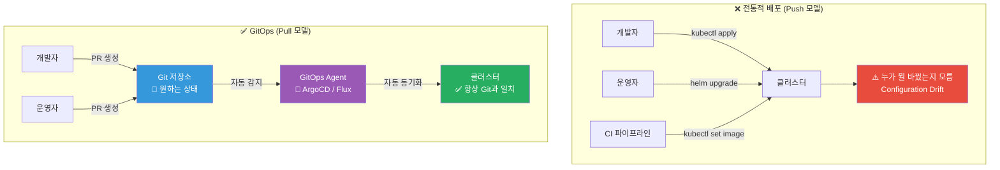
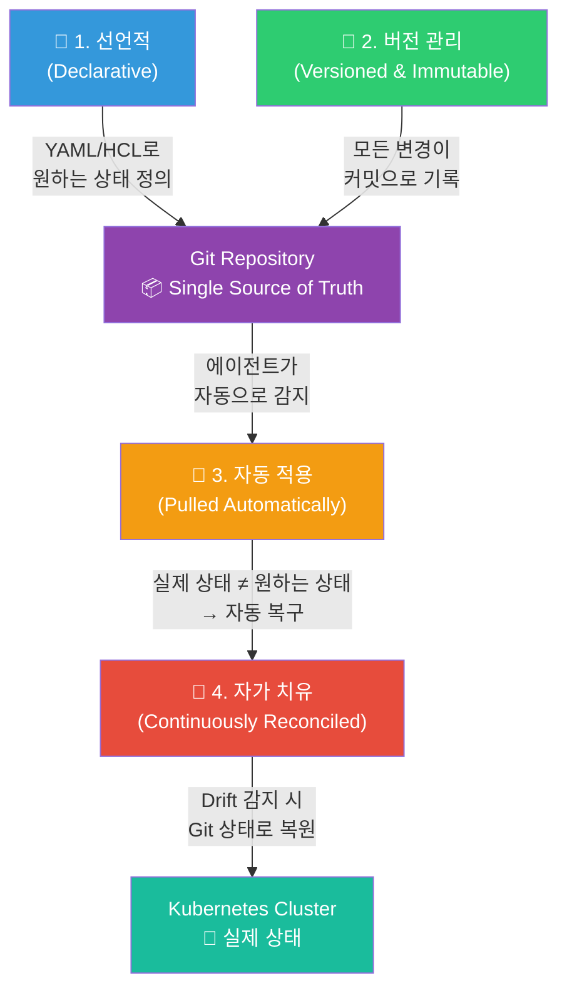
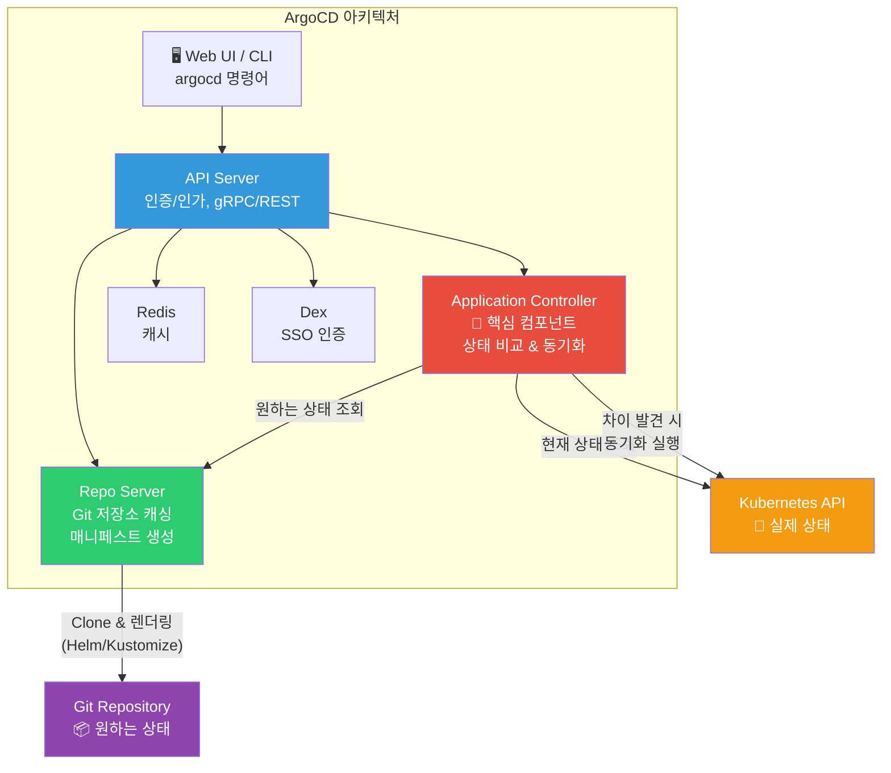
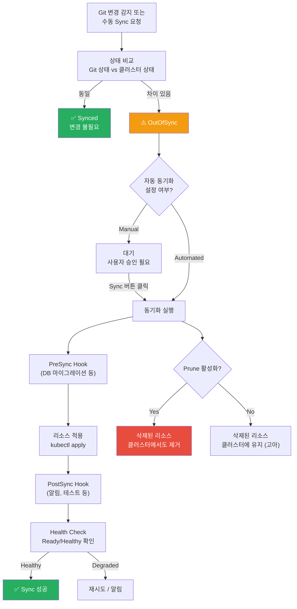
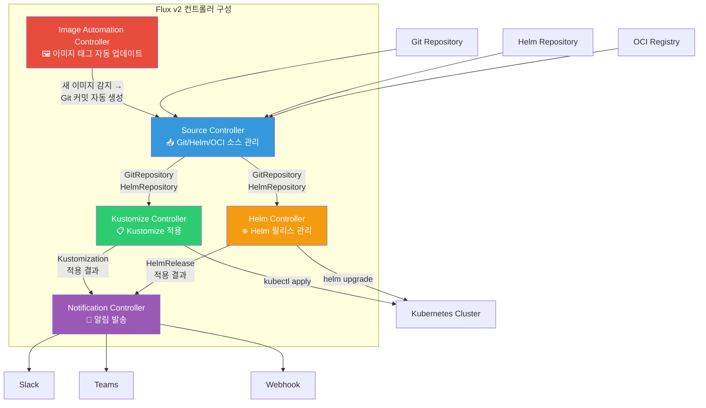

# GitOps — Git을 중심으로 인프라와 애플리케이션을 관리하기

> 배포를 하려고 서버에 SSH 접속하고, kubectl 명령어를 직접 치고, "지금 클러스터 상태가 뭐였더라?" 기억에 의존하던 시절은 끝났어요. **GitOps는 Git 저장소를 유일한 진실의 원천(Single Source of Truth)으로 삼아, 인프라와 애플리케이션의 원하는 상태를 선언적으로 관리하는 운영 모델**이에요. [CD 파이프라인](./04-cd-pipeline)에서 배운 자동 배포의 진화형이고, [IaC 개념](../06-iac/01-concept)의 철학을 Kubernetes 운영까지 확장한 거예요.

---

## 🎯 왜 GitOps를 알아야 하나요?

### 일상 비유: 레스토랑의 주문 시스템

레스토랑을 운영한다고 생각해 보세요.

**전통적인 방식 (Push 기반 배포):**
- 서빙 직원이 주방에 가서 직접 "이거 만들어주세요!"라고 외쳐요
- 주방에 누가 뭘 시켰는지 기록이 없어요
- 동시에 여러 직원이 다른 주문을 외치면 혼란이 생겨요
- 잘못된 요리가 나가도 원래 주문이 뭐였는지 확인할 방법이 없어요

**GitOps 방식 (Pull 기반 배포):**
- 모든 주문은 **주문서(Git)**에 기록돼요
- 주방장(ArgoCD/Flux)이 주기적으로 주문서를 확인해요
- 주문서와 현재 조리 상태가 다르면 자동으로 맞춰요
- 잘못된 요리가 나가면 주문서를 보고 바로 고칠 수 있어요
- 모든 변경 이력이 남아서 "어제 뭘 주문했지?" 추적이 가능해요

```
실무에서 GitOps가 필요한 순간:

• "kubectl apply를 누가 실행해서 설정이 바뀌었어요"    → Git이 유일한 변경 경로
• "클러스터 상태가 코드와 달라요"                      → 자동 동기화(Self-healing)
• "배포를 롤백하고 싶은데 어떤 버전이었는지 모르겠어요" → Git 히스토리가 곧 배포 이력
• "dev/staging/prod 환경 설정이 제각각이에요"          → Git 브랜치/디렉토리로 환경 관리
• "배포 승인 프로세스가 없어요"                        → PR 리뷰 = 배포 승인
• "보안 감사에서 변경 이력을 요구해요"                 → Git log가 감사 추적(Audit Trail)
• "수십 개 클러스터에 일관되게 배포해야 해요"          → ApplicationSet으로 멀티 클러스터 관리
```

### 전통적 배포 vs GitOps 비교



---

## 🧠 핵심 개념 잡기

### 1. GitOps의 4가지 원칙

GitOps는 Weaveworks(현재 CNCF)가 정의한 4가지 원칙을 기반으로 해요.

> **비유**: 네비게이션 시스템

네비게이션은 (1) 목적지를 선언하면 (2) 경로가 기록되고 (3) 자동으로 안내하며 (4) 경로를 벗어나면 재탐색해요. GitOps도 정확히 같은 원리예요.



| 원칙 | 설명 | 비유 |
|------|------|------|
| **Declarative** | 시스템의 원하는 상태를 선언적으로 기술 | "강남역으로 가주세요" (how가 아니라 what) |
| **Versioned & Immutable** | 원하는 상태가 Git에 버전 관리됨 | 계약서의 수정 이력이 모두 기록됨 |
| **Pulled Automatically** | 승인된 변경이 자동으로 적용됨 | 네비게이션이 새 경로를 자동 반영 |
| **Continuously Reconciled** | 에이전트가 실제 상태와 원하는 상태를 지속적으로 비교/복구 | 경로를 벗어나면 자동으로 재탐색 |

### 2. Push 모델 vs Pull 모델

> **비유**: 택배 배송 vs 편의점 픽업

- **Push 모델**: CI 파이프라인이 직접 클러스터에 배포 (택배 기사가 집에 배달)
- **Pull 모델**: 클러스터 안의 에이전트가 Git을 보고 스스로 배포 (편의점에서 알아서 픽업)

| 특성 | Push 모델 | Pull 모델 (GitOps) |
|------|-----------|---------------------|
| **배포 주체** | CI/CD 파이프라인 (외부) | GitOps 에이전트 (클러스터 내부) |
| **클러스터 접근** | CI가 kubeconfig 필요 | 에이전트가 클러스터 안에 있음 |
| **보안** | CI에 클러스터 자격증명 노출 | 자격증명이 클러스터 밖으로 안 나감 |
| **Drift 감지** | 불가 (배포 시점만 관리) | 지속적 모니터링 |
| **Self-healing** | 불가 | 자동 복구 |
| **대표 도구** | Jenkins, GitHub Actions | ArgoCD, Flux |

### 3. Git as Single Source of Truth

> **비유**: 법률의 관보(Official Gazette)

국가의 법률은 관보에 공시되어야 효력이 있어요. 아무리 구두로 약속해도 관보에 없으면 법이 아니에요. GitOps에서 **Git 저장소에 없는 변경은 존재하지 않는 변경**이에요.

```
Git이 Single Source of Truth라는 것의 의미:

1. 클러스터의 모든 리소스는 Git에 정의되어 있어야 해요
2. kubectl edit/apply 같은 직접 변경은 금지예요 (에이전트가 되돌려요)
3. 배포 = Git에 커밋 (PR 머지)
4. 롤백 = Git revert
5. 감사 = Git log
6. 환경 차이 = Git diff
```

### 4. GitOps 리포지토리 전략

> **비유**: 설계도와 시공은 분리

건축에서 설계사무소(App Repo)와 시공회사(Config Repo)가 분리되듯, GitOps에서도 애플리케이션 코드와 배포 설정을 분리하는 것이 모범 사례예요.

```
# 🔴 안티패턴: 모노레포 (App + Config 혼합)
my-app/
├── src/                    # 애플리케이션 소스
├── Dockerfile
├── k8s/                    # K8s 매니페스트 (같은 레포에!)
│   ├── deployment.yaml
│   └── service.yaml
└── .github/workflows/      # CI 파이프라인

# ✅ 권장: App Repo + Config Repo 분리
# [App Repo] my-app
my-app/
├── src/
├── Dockerfile
├── .github/workflows/ci.yaml   # CI만 (빌드 + 테스트 + 이미지 푸시)
└── README.md

# [Config Repo] my-app-config
my-app-config/
├── base/                   # 공통 설정
│   ├── deployment.yaml
│   ├── service.yaml
│   └── kustomization.yaml
├── overlays/               # 환경별 설정
│   ├── dev/
│   ├── staging/
│   └── production/
└── README.md
```

**분리하는 이유:**

| 이유 | 설명 |
|------|------|
| **권한 분리** | 개발자는 App Repo, 운영자는 Config Repo 접근 제어 |
| **배포 빈도 분리** | 코드 변경과 설정 변경의 주기가 다름 |
| **감사 추적** | 인프라 변경만 별도로 추적 가능 |
| **CI/CD 분리** | App Repo CI가 Config Repo 변경을 트리거 |
| **보안** | 민감한 설정이 개발 레포에 섞이지 않음 |

---

## 🔍 하나씩 자세히 알아보기

### 1. ArgoCD 아키텍처

ArgoCD는 CNCF 졸업 프로젝트로, Kubernetes를 위한 가장 인기 있는 GitOps 도구예요.

> **비유**: 아파트 경비 시스템

ArgoCD는 아파트 경비 시스템과 같아요. CCTV(Repo Server)가 외부(Git)를 감시하고, 경비원(Application Controller)이 출입자(리소스)를 관리하며, 관리실 모니터(API Server + UI)에서 전체 상황을 볼 수 있어요.



**주요 컴포넌트 설명:**

| 컴포넌트 | 역할 |
|-----------|------|
| **API Server** | UI/CLI/CI와의 통신, 인증/인가, 앱 관리 API |
| **Repo Server** | Git 레포 클론, Helm/Kustomize 렌더링, 매니페스트 캐싱 |
| **Application Controller** | 핵심! 주기적으로 Git과 클러스터 상태를 비교하고 동기화 |
| **Redis** | 캐싱 레이어로 성능 최적화 |
| **Dex** | SSO/OIDC 인증 (GitHub, LDAP, SAML 등) |

#### ArgoCD 설치 (Helm)

[Helm/Kustomize 장](../04-kubernetes/12-helm-kustomize)에서 배운 Helm을 활용해서 설치해요.

```bash
# 1. ArgoCD Helm 차트 레포지토리 추가
helm repo add argo https://argoproj.github.io/argo-helm
helm repo update

# 2. argocd 네임스페이스 생성
kubectl create namespace argocd

# 3. values 파일 작성 (커스터마이징)
cat > argocd-values.yaml << 'EOF'
# ArgoCD Helm values
server:
  # 외부 접근을 위한 서비스 타입
  service:
    type: LoadBalancer
  # Ingress 사용 시
  ingress:
    enabled: true
    ingressClassName: nginx
    hosts:
      - argocd.example.com
    tls:
      - secretName: argocd-tls
        hosts:
          - argocd.example.com

  # HA 모드 (프로덕션 권장)
  replicas: 2

configs:
  # 관리할 Git 리포지토리 등록
  repositories:
    my-app-config:
      url: https://github.com/my-org/my-app-config.git
      type: git

  # RBAC 설정
  rbac:
    policy.csv: |
      p, role:dev, applications, get, */*, allow
      p, role:dev, applications, sync, */dev-*, allow
      p, role:ops, applications, *, */*, allow
      g, dev-team, role:dev
      g, ops-team, role:ops

controller:
  # 동기화 주기 (기본 3분)
  args:
    appResyncPeriod: "180"

redis:
  enabled: true
EOF

# 4. Helm으로 ArgoCD 설치
helm install argocd argo/argo-cd \
  --namespace argocd \
  --values argocd-values.yaml \
  --version 5.51.0

# 5. 설치 확인
kubectl get pods -n argocd

# 6. 초기 관리자 비밀번호 확인
kubectl -n argocd get secret argocd-initial-admin-secret \
  -o jsonpath="{.data.password}" | base64 -d; echo

# 7. ArgoCD CLI 로그인
argocd login argocd.example.com --username admin --password <위에서-확인한-비밀번호>

# 8. 비밀번호 변경 (필수!)
argocd account update-password
```

### 2. ArgoCD 핵심 리소스

ArgoCD는 3가지 핵심 CRD(Custom Resource Definition)를 사용해요.

#### Application

Application은 ArgoCD의 가장 기본적인 리소스로, "어떤 Git 소스를 어떤 클러스터에 배포할지"를 정의해요.

```yaml
# application.yaml
apiVersion: argoproj.io/v1alpha1
kind: Application
metadata:
  name: my-app
  namespace: argocd
  # 자동 정리를 위한 finalizer
  finalizers:
    - resources-finalizer.argocd.argoproj.io
spec:
  # 이 앱이 속하는 프로젝트
  project: default

  # 소스: Git 저장소 정보
  source:
    repoURL: https://github.com/my-org/my-app-config.git
    targetRevision: main         # 브랜치, 태그, 또는 커밋 해시
    path: overlays/production    # 레포 내 경로

    # Kustomize 사용 시
    kustomize:
      images:
        - my-app=my-registry.com/my-app:v1.2.3

  # 목적지: 배포 대상 클러스터
  destination:
    server: https://kubernetes.default.svc  # 현재 클러스터
    namespace: my-app

  # 동기화 정책
  syncPolicy:
    automated:              # 자동 동기화 활성화
      prune: true           # Git에서 삭제된 리소스를 클러스터에서도 삭제
      selfHeal: true        # 수동 변경 감지 시 Git 상태로 복원
      allowEmpty: false     # 빈 리소스 목록 배포 방지 (안전장치)
    syncOptions:
      - CreateNamespace=true          # 네임스페이스 자동 생성
      - PrunePropagationPolicy=foreground  # 삭제 순서 보장
      - PruneLast=true                # 삭제를 마지막에 실행
    retry:
      limit: 5              # 실패 시 재시도 횟수
      backoff:
        duration: 5s
        factor: 2
        maxDuration: 3m

  # 무시할 차이점 (운영 중 변경되는 필드)
  ignoreDifferences:
    - group: apps
      kind: Deployment
      jsonPointers:
        - /spec/replicas   # HPA가 관리하는 replicas는 무시
```

#### Helm 소스를 사용하는 Application

```yaml
# helm-application.yaml
apiVersion: argoproj.io/v1alpha1
kind: Application
metadata:
  name: prometheus
  namespace: argocd
spec:
  project: monitoring

  source:
    # Helm 차트 레포지토리에서 직접 설치
    repoURL: https://prometheus-community.github.io/helm-charts
    chart: kube-prometheus-stack
    targetRevision: 51.2.0
    helm:
      releaseName: prometheus
      # values 파일 직접 지정
      values: |
        prometheus:
          prometheusSpec:
            retention: 30d
            resources:
              requests:
                memory: 2Gi
                cpu: 500m
        grafana:
          enabled: true
          adminPassword: changeme
          ingress:
            enabled: true
            hosts:
              - grafana.example.com

  destination:
    server: https://kubernetes.default.svc
    namespace: monitoring

  syncPolicy:
    automated:
      prune: true
      selfHeal: true
    syncOptions:
      - CreateNamespace=true
      - ServerSideApply=true  # CRD가 많은 차트에 권장
```

#### AppProject

AppProject는 Application들을 논리적으로 그룹화하고, 접근 제어를 설정하는 리소스예요.

```yaml
# appproject.yaml
apiVersion: argoproj.io/v1alpha1
kind: AppProject
metadata:
  name: team-backend
  namespace: argocd
spec:
  description: "백엔드 팀 프로젝트"

  # 허용된 Git 소스
  sourceRepos:
    - "https://github.com/my-org/backend-*"
    - "https://github.com/my-org/shared-charts"

  # 허용된 배포 대상
  destinations:
    - server: https://kubernetes.default.svc
      namespace: "backend-*"           # backend-으로 시작하는 네임스페이스만
    - server: https://kubernetes.default.svc
      namespace: "shared"

  # 허용된 클러스터 리소스 (네임스페이스 밖의 리소스)
  clusterResourceWhitelist:
    - group: ""
      kind: Namespace

  # 허용된 네임스페이스 리소스
  namespaceResourceWhitelist:
    - group: "apps"
      kind: Deployment
    - group: ""
      kind: Service
    - group: ""
      kind: ConfigMap
    - group: ""
      kind: Secret
    - group: networking.k8s.io
      kind: Ingress

  # 거부된 리소스 (더 세밀한 제어)
  namespaceResourceBlacklist:
    - group: ""
      kind: ResourceQuota    # ResourceQuota 변경 금지

  # 역할 정의
  roles:
    - name: developer
      description: "백엔드 개발자"
      policies:
        - p, proj:team-backend:developer, applications, get, team-backend/*, allow
        - p, proj:team-backend:developer, applications, sync, team-backend/*, allow
      groups:
        - backend-developers  # SSO 그룹 매핑
    - name: lead
      description: "백엔드 테크리드"
      policies:
        - p, proj:team-backend:lead, applications, *, team-backend/*, allow
      groups:
        - backend-leads
```

#### ApplicationSet

ApplicationSet은 하나의 템플릿으로 여러 Application을 자동 생성하는 리소스예요. 멀티 클러스터, 멀티 환경 배포에 필수적이에요.

```yaml
# applicationset-environments.yaml
# 환경별 Application 자동 생성
apiVersion: argoproj.io/v1alpha1
kind: ApplicationSet
metadata:
  name: my-app-environments
  namespace: argocd
spec:
  generators:
    # 리스트 기반 생성
    - list:
        elements:
          - env: dev
            cluster: https://kubernetes.default.svc
            namespace: my-app-dev
            revision: develop
            autoSync: true
          - env: staging
            cluster: https://kubernetes.default.svc
            namespace: my-app-staging
            revision: main
            autoSync: true
          - env: production
            cluster: https://prod-cluster.example.com
            namespace: my-app-prod
            revision: main
            autoSync: false    # 프로덕션은 수동 동기화

  template:
    metadata:
      name: "my-app-{{env}}"
      namespace: argocd
    spec:
      project: default
      source:
        repoURL: https://github.com/my-org/my-app-config.git
        targetRevision: "{{revision}}"
        path: "overlays/{{env}}"
      destination:
        server: "{{cluster}}"
        namespace: "{{namespace}}"
      syncPolicy:
        automated:
          prune: "{{autoSync}}"
          selfHeal: "{{autoSync}}"
        syncOptions:
          - CreateNamespace=true

---
# Git 디렉토리 기반 자동 생성
# services/ 아래 각 디렉토리가 하나의 Application이 됨
apiVersion: argoproj.io/v1alpha1
kind: ApplicationSet
metadata:
  name: microservices
  namespace: argocd
spec:
  generators:
    - git:
        repoURL: https://github.com/my-org/platform-config.git
        revision: main
        directories:
          - path: "services/*"      # services/user-api, services/order-api 등
          - path: "services/legacy-*"
            exclude: true            # legacy-로 시작하는 건 제외

  template:
    metadata:
      name: "{{path.basename}}"     # 디렉토리 이름이 앱 이름
    spec:
      project: microservices
      source:
        repoURL: https://github.com/my-org/platform-config.git
        targetRevision: main
        path: "{{path}}"
      destination:
        server: https://kubernetes.default.svc
        namespace: "{{path.basename}}"
      syncPolicy:
        automated:
          prune: true
          selfHeal: true
```

### 3. ArgoCD Sync 전략

ArgoCD의 동기화(Sync)는 Git의 원하는 상태를 클러스터에 적용하는 과정이에요.



#### Sync 옵션 정리

```yaml
# 동기화 정책 상세
syncPolicy:
  # --- 자동 동기화 ---
  automated:
    # Git에서 삭제된 리소스를 클러스터에서도 삭제할지
    # true: Git에 없으면 클러스터에서도 삭제 (깔끔하지만 위험할 수 있음)
    # false: Git에서 삭제해도 클러스터에 남김 (안전하지만 고아 리소스 발생)
    prune: true

    # 누군가 kubectl로 직접 변경했을 때 Git 상태로 되돌릴지
    # true: 수동 변경을 자동으로 원복 (GitOps 원칙에 충실)
    # false: 수동 변경을 허용 (OutOfSync 상태만 표시)
    selfHeal: true

  syncOptions:
    # 네임스페이스가 없으면 자동 생성
    - CreateNamespace=true

    # Server-Side Apply 사용 (대규모 CRD에 권장)
    - ServerSideApply=true

    # Prune을 Sync의 마지막 단계에서 실행
    - PruneLast=true

    # 특정 리소스에 Prune 전파 정책 적용
    - PrunePropagationPolicy=foreground

    # Apply 시 --validate=false (CRD 스키마 문제 회피)
    - Validate=false

    # Dry run 후 실행 여부 결정
    - ApplyOutOfSyncOnly=true

  # Sync 실패 시 재시도 설정
  retry:
    limit: 5
    backoff:
      duration: 5s      # 첫 재시도 대기
      factor: 2          # 대기 시간 배수
      maxDuration: 3m    # 최대 대기 시간
```

#### Sync Hooks (동기화 훅)

```yaml
# PreSync Hook: DB 마이그레이션
apiVersion: batch/v1
kind: Job
metadata:
  name: db-migration
  annotations:
    argocd.argoproj.io/hook: PreSync           # Sync 전에 실행
    argocd.argoproj.io/hook-delete-policy: HookSucceeded  # 성공 후 삭제
spec:
  template:
    spec:
      containers:
        - name: migrate
          image: my-app:v1.2.3
          command: ["python", "manage.py", "migrate"]
      restartPolicy: Never
  backoffLimit: 3

---
# PostSync Hook: Slack 알림
apiVersion: batch/v1
kind: Job
metadata:
  name: notify-slack
  annotations:
    argocd.argoproj.io/hook: PostSync          # Sync 후에 실행
    argocd.argoproj.io/hook-delete-policy: HookSucceeded
spec:
  template:
    spec:
      containers:
        - name: notify
          image: curlimages/curl
          command:
            - curl
            - -X
            - POST
            - -H
            - "Content-Type: application/json"
            - -d
            - '{"text":"my-app v1.2.3 배포 완료!"}'
            - https://hooks.slack.com/services/xxx/yyy/zzz
      restartPolicy: Never
```

#### Sync Wave (동기화 순서 제어)

```yaml
# Wave 0: 네임스페이스와 RBAC 먼저
apiVersion: v1
kind: Namespace
metadata:
  name: my-app
  annotations:
    argocd.argoproj.io/sync-wave: "0"

---
# Wave 1: ConfigMap과 Secret
apiVersion: v1
kind: ConfigMap
metadata:
  name: my-app-config
  annotations:
    argocd.argoproj.io/sync-wave: "1"

---
# Wave 2: Deployment
apiVersion: apps/v1
kind: Deployment
metadata:
  name: my-app
  annotations:
    argocd.argoproj.io/sync-wave: "2"

---
# Wave 3: Service와 Ingress
apiVersion: v1
kind: Service
metadata:
  name: my-app
  annotations:
    argocd.argoproj.io/sync-wave: "3"
```

### 4. Flux v2 아키텍처

Flux v2는 CNCF 졸업 프로젝트로, GitOps Toolkit이라는 컨트롤러 세트로 구성되어 있어요. ArgoCD가 "올인원 솔루션"이라면, Flux는 "필요한 것만 조합하는 모듈러 방식"이에요.

> **비유**: ArgoCD = 완제품 가전, Flux = 조립식 가구

ArgoCD는 냉장고를 사면 모든 기능이 들어있는 완제품이에요. Flux는 IKEA 가구처럼 필요한 부품(컨트롤러)만 골라서 조합해요.



**Flux v2 컨트롤러 역할:**

| 컨트롤러 | 역할 | CRD |
|-----------|------|-----|
| **Source Controller** | Git/Helm/OCI 저장소에서 소스를 가져옴 | GitRepository, HelmRepository, OCIRepository, Bucket |
| **Kustomize Controller** | Kustomize 매니페스트를 클러스터에 적용 | Kustomization |
| **Helm Controller** | Helm 차트를 릴리스로 관리 | HelmRelease |
| **Notification Controller** | 이벤트 수신/발송 (Slack, Teams 등) | Provider, Alert, Receiver |
| **Image Automation** | 새 이미지 태그 감지 → Git 자동 커밋 | ImageRepository, ImagePolicy, ImageUpdateAutomation |

#### Flux 설치 및 기본 설정

```bash
# 1. Flux CLI 설치
curl -s https://fluxcd.io/install.sh | sudo bash

# 2. 클러스터 사전 검사
flux check --pre

# 3. Flux 부트스트랩 (GitHub)
# GitHub Personal Access Token 필요
export GITHUB_TOKEN=<your-github-token>

flux bootstrap github \
  --owner=my-org \
  --repository=fleet-config \
  --branch=main \
  --path=./clusters/production \
  --personal

# 4. 설치 확인
flux check
kubectl get pods -n flux-system
```

#### Flux 리소스 예시

```yaml
# 1. Git 소스 정의
apiVersion: source.toolkit.fluxcd.io/v1
kind: GitRepository
metadata:
  name: my-app
  namespace: flux-system
spec:
  interval: 1m              # 1분마다 Git 폴링
  url: https://github.com/my-org/my-app-config.git
  ref:
    branch: main
  secretRef:
    name: git-credentials    # Private 레포 인증 정보

---
# 2. Kustomization으로 배포
apiVersion: kustomize.toolkit.fluxcd.io/v1
kind: Kustomization
metadata:
  name: my-app
  namespace: flux-system
spec:
  interval: 5m               # 5분마다 동기화
  targetNamespace: my-app
  sourceRef:
    kind: GitRepository
    name: my-app
  path: ./overlays/production
  prune: true                 # Git에서 삭제된 리소스 정리
  healthChecks:               # 배포 후 헬스체크
    - apiVersion: apps/v1
      kind: Deployment
      name: my-app
      namespace: my-app
  timeout: 5m

---
# 3. Helm으로 배포
apiVersion: source.toolkit.fluxcd.io/v1
kind: HelmRepository
metadata:
  name: prometheus-community
  namespace: flux-system
spec:
  interval: 30m
  url: https://prometheus-community.github.io/helm-charts

---
apiVersion: helm.toolkit.fluxcd.io/v2
kind: HelmRelease
metadata:
  name: prometheus
  namespace: monitoring
spec:
  interval: 10m
  chart:
    spec:
      chart: kube-prometheus-stack
      version: "51.x"         # SemVer 범위 지원
      sourceRef:
        kind: HelmRepository
        name: prometheus-community
        namespace: flux-system
  values:
    prometheus:
      prometheusSpec:
        retention: 30d
    grafana:
      enabled: true
  # 업그레이드 실패 시 롤백
  upgrade:
    remediation:
      retries: 3
      remediateLastFailure: true
  # 설치 실패 시 정리
  install:
    remediation:
      retries: 3
```

### 5. ArgoCD vs Flux 비교

| 항목 | ArgoCD | Flux v2 |
|------|--------|---------|
| **아키텍처** | 올인원 (UI + API + Controller) | 모듈러 (개별 컨트롤러 조합) |
| **UI** | 풍부한 웹 UI 내장 | UI 없음 (Weave GitOps UI 별도) |
| **멀티 테넌시** | AppProject로 강력한 RBAC | 네임스페이스 기반 분리 |
| **멀티 클러스터** | ApplicationSet으로 우수 | Kustomization 구조로 관리 |
| **Helm 지원** | Application 소스로 지원 | HelmRelease CRD로 네이티브 지원 |
| **Kustomize 지원** | Application 소스로 지원 | Kustomization CRD로 네이티브 지원 |
| **이미지 자동화** | ArgoCD Image Updater (별도) | Image Automation Controller (내장) |
| **알림** | Notification Engine | Notification Controller |
| **설치 복잡도** | 간단 (Helm 한 줄) | 보통 (flux bootstrap) |
| **학습 곡선** | 낮음 (UI가 직관적) | 중간 (CRD 이해 필요) |
| **리소스 사용** | 상대적으로 많음 | 가벼움 |
| **CNCF 상태** | Graduated | Graduated |
| **추천 상황** | 팀이 크고 UI가 중요할 때 | 가볍고 코드 중심 관리를 원할 때 |

```
선택 가이드:

"팀에 Kubernetes 초보가 많나요?"
├── 예 → ArgoCD (직관적인 UI)
└── 아니요 → "멀티 클러스터 규모가 큰가요?"
    ├── 예 → ArgoCD (ApplicationSet)
    └── 아니요 → "리소스를 아끼고 싶나요?"
        ├── 예 → Flux (가벼움)
        └── 아니요 → "이미지 자동화가 중요한가요?"
            ├── 예 → Flux (네이티브 지원)
            └── 아니요 → 둘 다 좋아요. 팀 선호도에 따라 선택!
```

### 6. GitOps with Helm / Kustomize

[Helm/Kustomize 장](../04-kubernetes/12-helm-kustomize)에서 배운 도구들을 GitOps와 함께 사용하는 패턴이에요.

#### Config Repo 구조 (Kustomize 기반)

```
my-app-config/
├── base/                           # 공통 기본 설정
│   ├── kustomization.yaml
│   ├── deployment.yaml
│   ├── service.yaml
│   ├── ingress.yaml
│   └── hpa.yaml
├── overlays/
│   ├── dev/                        # 개발 환경
│   │   ├── kustomization.yaml      # replicas: 1, resources 작게
│   │   └── patch-deployment.yaml
│   ├── staging/                    # 스테이징 환경
│   │   ├── kustomization.yaml      # replicas: 2, 중간 리소스
│   │   └── patch-deployment.yaml
│   └── production/                 # 프로덕션 환경
│       ├── kustomization.yaml      # replicas: 3, 큰 리소스
│       ├── patch-deployment.yaml
│       └── patch-hpa.yaml
└── argocd/                         # ArgoCD Application 정의
    ├── dev.yaml
    ├── staging.yaml
    └── production.yaml
```

```yaml
# base/kustomization.yaml
apiVersion: kustomize.config.k8s.io/v1beta1
kind: Kustomization
resources:
  - deployment.yaml
  - service.yaml
  - ingress.yaml
  - hpa.yaml

# base/deployment.yaml
apiVersion: apps/v1
kind: Deployment
metadata:
  name: my-app
spec:
  replicas: 1
  selector:
    matchLabels:
      app: my-app
  template:
    metadata:
      labels:
        app: my-app
    spec:
      containers:
        - name: my-app
          image: my-registry.com/my-app:latest
          ports:
            - containerPort: 8080
          resources:
            requests:
              cpu: 100m
              memory: 128Mi
            limits:
              cpu: 500m
              memory: 512Mi
          readinessProbe:
            httpGet:
              path: /health
              port: 8080
            initialDelaySeconds: 5
            periodSeconds: 10
```

```yaml
# overlays/production/kustomization.yaml
apiVersion: kustomize.config.k8s.io/v1beta1
kind: Kustomization
namespace: my-app-prod

resources:
  - ../../base

# 이미지 태그 오버라이드
images:
  - name: my-registry.com/my-app
    newTag: v1.2.3

# 패치 적용
patches:
  - path: patch-deployment.yaml

# 라벨 추가
commonLabels:
  env: production

# overlays/production/patch-deployment.yaml
apiVersion: apps/v1
kind: Deployment
metadata:
  name: my-app
spec:
  replicas: 3
  template:
    spec:
      containers:
        - name: my-app
          resources:
            requests:
              cpu: 500m
              memory: 512Mi
            limits:
              cpu: "2"
              memory: 2Gi
```

#### Config Repo 구조 (Helm 기반)

```
platform-config/
├── charts/                         # 자체 Helm 차트
│   └── my-app/
│       ├── Chart.yaml
│       ├── templates/
│       │   ├── deployment.yaml
│       │   ├── service.yaml
│       │   └── ingress.yaml
│       └── values.yaml             # 기본 values
├── environments/
│   ├── dev/
│   │   └── values.yaml             # dev 환경 values
│   ├── staging/
│   │   └── values.yaml
│   └── production/
│       └── values.yaml             # prod 환경 values
└── argocd/
    └── applicationset.yaml         # 환경별 자동 생성
```

```yaml
# environments/production/values.yaml
replicaCount: 3

image:
  repository: my-registry.com/my-app
  tag: v1.2.3

resources:
  requests:
    cpu: 500m
    memory: 512Mi
  limits:
    cpu: "2"
    memory: 2Gi

ingress:
  enabled: true
  host: app.example.com
  tls: true

autoscaling:
  enabled: true
  minReplicas: 3
  maxReplicas: 10
  targetCPUUtilization: 70
```

### 7. Secret 관리

GitOps의 가장 큰 도전 과제 중 하나가 Secret 관리예요. Git에 평문 Secret을 커밋하면 안 되니까요.

> **비유**: 비밀 편지 보내기

평문 편지(Secret)를 우체통(Git)에 넣으면 누구나 읽을 수 있어요. 그래서 암호화해서 보내거나(Sealed Secrets, SOPS), 편지 내용 대신 사서함 번호(External Secrets)만 적어두는 방법을 써요.

#### 방법 1: Sealed Secrets

Bitnami의 Sealed Secrets는 클러스터의 공개키로 Secret을 암호화해서 Git에 저장하는 방식이에요.

```bash
# Sealed Secrets 컨트롤러 설치
helm repo add sealed-secrets https://bitnami-labs.github.io/sealed-secrets
helm install sealed-secrets sealed-secrets/sealed-secrets \
  --namespace kube-system

# kubeseal CLI 설치
# (brew, apt 등으로 설치)

# 일반 Secret을 Sealed Secret으로 암호화
kubectl create secret generic db-creds \
  --from-literal=username=admin \
  --from-literal=password=s3cur3p@ss \
  --dry-run=client -o yaml | \
  kubeseal --format yaml > sealed-db-creds.yaml
```

```yaml
# sealed-db-creds.yaml (Git에 커밋해도 안전!)
apiVersion: bitnami.com/v1alpha1
kind: SealedSecret
metadata:
  name: db-creds
  namespace: my-app
spec:
  encryptedData:
    username: AgBjY2x... # 암호화된 값 (클러스터의 개인키로만 복호화 가능)
    password: AgA8kT0...
  template:
    metadata:
      name: db-creds
      namespace: my-app
    type: Opaque
```

#### 방법 2: SOPS (Secrets OPerationS)

Mozilla SOPS는 파일의 값(value)만 암호화하고 키(key)는 평문으로 유지해서, Git diff가 가능한 방식이에요. AWS KMS, GCP KMS, Azure Key Vault, age, PGP를 지원해요.

```yaml
# .sops.yaml (레포 루트에 SOPS 설정)
creation_rules:
  # production 경로는 AWS KMS로 암호화
  - path_regex: overlays/production/.*\.yaml$
    kms: "arn:aws:kms:ap-northeast-2:123456789:key/abc-def-123"
  # 나머지는 age 키로 암호화
  - path_regex: .*\.yaml$
    age: "age1ql3z7hjy54pw3hyww5ayyfg7zqgvc7w3j2elw8zmrj2kg5sfn9aqmcac8p"
```

```bash
# SOPS로 Secret 파일 암호화
sops -e secrets.yaml > secrets.enc.yaml

# SOPS로 Secret 파일 편집 (자동으로 복호화/암호화)
sops secrets.enc.yaml

# Flux에서 SOPS 사용 (Kustomize Controller가 자동 복호화)
# decryption provider 설정만 하면 됨
```

```yaml
# Flux에서 SOPS 복호화 설정
apiVersion: kustomize.toolkit.fluxcd.io/v1
kind: Kustomization
metadata:
  name: my-app
  namespace: flux-system
spec:
  interval: 5m
  sourceRef:
    kind: GitRepository
    name: my-app
  path: ./overlays/production
  prune: true
  decryption:
    provider: sops          # SOPS 자동 복호화 활성화
    secretRef:
      name: sops-age        # age 키가 담긴 Secret
```

#### 방법 3: External Secrets Operator (ESO)

ESO는 외부 Secret 관리자(AWS Secrets Manager, HashiCorp Vault 등)에서 Secret을 가져와서 Kubernetes Secret을 자동 생성해요. Git에는 "어디서 가져올지"만 저장하므로 가장 안전한 방법이에요.

```yaml
# 1. SecretStore 정의 (Secret 제공자 연결)
apiVersion: external-secrets.io/v1beta1
kind: SecretStore
metadata:
  name: aws-secrets-manager
  namespace: my-app
spec:
  provider:
    aws:
      service: SecretsManager
      region: ap-northeast-2
      auth:
        jwt:
          serviceAccountRef:
            name: external-secrets-sa   # IRSA 사용

---
# 2. ExternalSecret 정의 (Git에 커밋하는 파일)
apiVersion: external-secrets.io/v1beta1
kind: ExternalSecret
metadata:
  name: db-creds
  namespace: my-app
spec:
  refreshInterval: 1h          # 1시간마다 동기화
  secretStoreRef:
    name: aws-secrets-manager
    kind: SecretStore
  target:
    name: db-creds             # 생성될 K8s Secret 이름
    creationPolicy: Owner
  data:
    - secretKey: username       # K8s Secret의 key
      remoteRef:
        key: production/my-app/db   # AWS Secrets Manager의 key
        property: username          # JSON 내 속성
    - secretKey: password
      remoteRef:
        key: production/my-app/db
        property: password
```

```
Secret 관리 방법 비교:

| 방법              | 암호화 위치   | Git에 저장되는 것     | 복호화 주체        | 난이도 |
|-------------------|---------------|----------------------|--------------------|--------|
| Sealed Secrets    | 클러스터 키   | 암호화된 Secret      | Sealed Secrets Ctrl| 쉬움   |
| SOPS              | KMS/age/PGP   | 암호화된 값(키는 평문)| Flux/ArgoCD 플러그인| 보통   |
| External Secrets  | 외부 서비스   | 참조 정보만           | ESO Controller     | 보통   |

추천:
• 단순한 환경, 소규모 팀       → Sealed Secrets
• Flux 사용, Git diff 중요     → SOPS
• AWS/GCP/Vault 이미 사용 중   → External Secrets Operator (가장 권장)
```

### 8. Image Automation

새로운 컨테이너 이미지가 빌드되면, Config Repo의 이미지 태그를 자동으로 업데이트하는 기능이에요.

> **비유**: 뉴스 속보 자동 업데이트

뉴스 사이트에서 속보가 나오면 메인 페이지가 자동으로 업데이트되잖아요? 이미지 자동화도 마찬가지예요. 새 이미지가 레지스트리에 올라오면 Config Repo가 자동으로 업데이트돼요.

#### ArgoCD Image Updater

```bash
# ArgoCD Image Updater 설치
helm repo add argo https://argoproj.github.io/argo-helm
helm install argocd-image-updater argo/argocd-image-updater \
  --namespace argocd
```

```yaml
# Application에 이미지 업데이트 어노테이션 추가
apiVersion: argoproj.io/v1alpha1
kind: Application
metadata:
  name: my-app
  namespace: argocd
  annotations:
    # 감시할 이미지 목록
    argocd-image-updater.argoproj.io/image-list: >
      myapp=my-registry.com/my-app

    # 업데이트 전략: semver, latest, digest 등
    argocd-image-updater.argoproj.io/myapp.update-strategy: semver

    # SemVer 제약 조건 (v1.x.x만 허용)
    argocd-image-updater.argoproj.io/myapp.allow-tags: "regexp:^v1\\."

    # 변경 사항을 Git에 커밋 (write-back)
    argocd-image-updater.argoproj.io/write-back-method: git
    argocd-image-updater.argoproj.io/write-back-target: kustomization

    # Git 커밋 메시지 템플릿
    argocd-image-updater.argoproj.io/git-branch: main
spec:
  project: default
  source:
    repoURL: https://github.com/my-org/my-app-config.git
    targetRevision: main
    path: overlays/production
  destination:
    server: https://kubernetes.default.svc
    namespace: my-app
```

#### Flux Image Automation

```yaml
# 1. 이미지 레포지토리 스캔
apiVersion: image.toolkit.fluxcd.io/v1beta2
kind: ImageRepository
metadata:
  name: my-app
  namespace: flux-system
spec:
  image: my-registry.com/my-app
  interval: 5m                    # 5분마다 새 태그 스캔
  secretRef:
    name: registry-credentials    # Private 레지스트리 인증

---
# 2. 이미지 정책 (어떤 태그를 선택할지)
apiVersion: image.toolkit.fluxcd.io/v1beta2
kind: ImagePolicy
metadata:
  name: my-app
  namespace: flux-system
spec:
  imageRepositoryRef:
    name: my-app
  policy:
    semver:
      range: ">=1.0.0"           # SemVer 1.0.0 이상 중 최신
    # 또는 숫자 기반
    # numerical:
    #   order: asc
    # 또는 알파벳 기반
    # alphabetical:
    #   order: asc

---
# 3. 자동 업데이트 (Git에 커밋)
apiVersion: image.toolkit.fluxcd.io/v1beta2
kind: ImageUpdateAutomation
metadata:
  name: my-app
  namespace: flux-system
spec:
  interval: 30m
  sourceRef:
    kind: GitRepository
    name: my-app
  git:
    checkout:
      ref:
        branch: main
    commit:
      author:
        name: flux-image-automation
        email: flux@example.com
      messageTemplate: |
        chore: update image {{range .Changed.Changes}}
        - {{.OldValue}} -> {{.NewValue}}
        {{end}}
    push:
      branch: main
  update:
    path: ./overlays/production
    strategy: Setters             # 마커 기반 업데이트
```

```yaml
# deployment.yaml에 마커 추가 (Flux가 이 부분을 자동 업데이트)
apiVersion: apps/v1
kind: Deployment
metadata:
  name: my-app
spec:
  template:
    spec:
      containers:
        - name: my-app
          image: my-registry.com/my-app:v1.2.3  # {"$imagepolicy": "flux-system:my-app"}
```

---

## 💻 직접 해보기

### 실습 1: ArgoCD로 첫 GitOps 배포

```bash
# ──────────────────────────────────────
# 사전 준비: minikube 또는 kind 클러스터
# ──────────────────────────────────────

# 1. kind 클러스터 생성
kind create cluster --name gitops-lab

# 2. ArgoCD 설치
kubectl create namespace argocd
kubectl apply -n argocd \
  -f https://raw.githubusercontent.com/argoproj/argo-cd/stable/manifests/install.yaml

# 3. ArgoCD 서버 포트포워딩 (새 터미널에서)
kubectl port-forward svc/argocd-server -n argocd 8080:443 &

# 4. 초기 비밀번호 확인
ARGO_PWD=$(kubectl -n argocd get secret argocd-initial-admin-secret \
  -o jsonpath="{.data.password}" | base64 -d)
echo "ArgoCD Password: $ARGO_PWD"

# 5. ArgoCD CLI 로그인
argocd login localhost:8080 --username admin --password $ARGO_PWD --insecure

# 6. 샘플 Application 생성 (ArgoCD 공식 예제)
argocd app create guestbook \
  --repo https://github.com/argoproj/argocd-example-apps.git \
  --path guestbook \
  --dest-server https://kubernetes.default.svc \
  --dest-namespace default

# 7. 앱 상태 확인
argocd app get guestbook
# Status: OutOfSync (아직 동기화 안 함)

# 8. 동기화 실행
argocd app sync guestbook

# 9. 결과 확인
argocd app get guestbook
kubectl get pods -l app=guestbook-ui

# 10. 웹 UI 확인
echo "브라우저에서 https://localhost:8080 접속"
echo "Username: admin / Password: $ARGO_PWD"
```

### 실습 2: Config Repo로 GitOps 워크플로 체험

```bash
# ──────────────────────────────────────
# 자체 Config Repo 기반 GitOps 실습
# ──────────────────────────────────────

# 1. Config Repo 디렉토리 구조 생성
mkdir -p my-gitops-demo/{base,overlays/{dev,prod},argocd}
cd my-gitops-demo

# 2. base 매니페스트 작성
cat > base/deployment.yaml << 'EOF'
apiVersion: apps/v1
kind: Deployment
metadata:
  name: nginx-demo
spec:
  replicas: 1
  selector:
    matchLabels:
      app: nginx-demo
  template:
    metadata:
      labels:
        app: nginx-demo
    spec:
      containers:
        - name: nginx
          image: nginx:1.25
          ports:
            - containerPort: 80
          resources:
            requests:
              cpu: 50m
              memory: 64Mi
            limits:
              cpu: 100m
              memory: 128Mi
EOF

cat > base/service.yaml << 'EOF'
apiVersion: v1
kind: Service
metadata:
  name: nginx-demo
spec:
  selector:
    app: nginx-demo
  ports:
    - port: 80
      targetPort: 80
EOF

cat > base/kustomization.yaml << 'EOF'
apiVersion: kustomize.config.k8s.io/v1beta1
kind: Kustomization
resources:
  - deployment.yaml
  - service.yaml
EOF

# 3. dev 오버레이 작성
cat > overlays/dev/kustomization.yaml << 'EOF'
apiVersion: kustomize.config.k8s.io/v1beta1
kind: Kustomization
namespace: demo-dev
resources:
  - ../../base
commonLabels:
  env: dev
EOF

# 4. prod 오버레이 작성
cat > overlays/prod/kustomization.yaml << 'EOF'
apiVersion: kustomize.config.k8s.io/v1beta1
kind: Kustomization
namespace: demo-prod
resources:
  - ../../base
commonLabels:
  env: production
patches:
  - target:
      kind: Deployment
      name: nginx-demo
    patch: |
      - op: replace
        path: /spec/replicas
        value: 3
images:
  - name: nginx
    newTag: "1.25-alpine"
EOF

# 5. Git 초기화 및 푸시
git init
git add .
git commit -m "feat: initial GitOps config"
# git remote add origin <your-repo-url>
# git push -u origin main

# 6. ArgoCD Application 생성 (CLI)
argocd app create nginx-dev \
  --repo <your-repo-url> \
  --path overlays/dev \
  --dest-server https://kubernetes.default.svc \
  --dest-namespace demo-dev \
  --sync-policy automated \
  --auto-prune \
  --self-heal

# 7. 이제 Git에 커밋하면 자동 배포!
# 예: nginx 버전 변경
cd overlays/prod
# kustomization.yaml에서 newTag를 1.26-alpine으로 변경
git add . && git commit -m "chore: upgrade nginx to 1.26"
git push
# → ArgoCD가 자동으로 감지하고 배포!
```

### 실습 3: Flux로 GitOps 구성

```bash
# ──────────────────────────────────────
# Flux v2 기본 실습
# ──────────────────────────────────────

# 1. Flux CLI 설치 확인
flux --version

# 2. 클러스터 호환성 확인
flux check --pre

# 3. Flux 부트스트랩 (GitHub 예시)
export GITHUB_TOKEN=<your-token>
export GITHUB_USER=<your-username>

flux bootstrap github \
  --owner=$GITHUB_USER \
  --repository=flux-demo \
  --branch=main \
  --path=./clusters/my-cluster \
  --personal

# 4. Git 소스 추가
flux create source git my-app \
  --url=https://github.com/$GITHUB_USER/my-app-config \
  --branch=main \
  --interval=1m

# 5. Kustomization 생성 (배포)
flux create kustomization my-app \
  --target-namespace=default \
  --source=my-app \
  --path="./overlays/dev" \
  --prune=true \
  --interval=5m

# 6. 상태 확인
flux get kustomizations
flux get sources git

# 7. 이벤트 확인
flux events

# 8. 문제 해결
flux logs --level=error
flux reconcile kustomization my-app  # 수동 동기화
```

---

## 🏢 실무에서는?

### 실무 GitOps 리포지토리 구조 (대규모)

```
# 플랫폼 팀이 관리하는 Config Repo 구조
platform-config/
├── clusters/                       # 클러스터별 설정
│   ├── dev-cluster/
│   │   ├── kustomization.yaml      # 이 클러스터에 배포할 앱 목록
│   │   └── cluster-config.yaml
│   ├── staging-cluster/
│   │   ├── kustomization.yaml
│   │   └── cluster-config.yaml
│   └── prod-cluster/
│       ├── kustomization.yaml
│       └── cluster-config.yaml
│
├── infrastructure/                 # 인프라 공통 컴포넌트
│   ├── sources/                    # Helm 레포, Git 소스 정의
│   │   ├── helm-repositories.yaml
│   │   └── git-repositories.yaml
│   ├── controllers/                # 클러스터 공통 컨트롤러
│   │   ├── ingress-nginx/
│   │   ├── cert-manager/
│   │   ├── external-secrets/
│   │   └── prometheus-stack/
│   └── crds/                       # CRD 관리
│       └── kustomization.yaml
│
├── apps/                           # 애플리케이션별 설정
│   ├── user-service/
│   │   ├── base/
│   │   └── overlays/
│   │       ├── dev/
│   │       ├── staging/
│   │       └── production/
│   ├── order-service/
│   │   ├── base/
│   │   └── overlays/
│   └── payment-service/
│       ├── base/
│       └── overlays/
│
└── tenants/                        # 팀별 접근 권한
    ├── backend-team/
    │   ├── rbac.yaml
    │   └── appproject.yaml
    └── frontend-team/
        ├── rbac.yaml
        └── appproject.yaml
```

### 실무 CI/CD + GitOps 전체 파이프라인

```mermaid
flowchart LR
    subgraph "App Repo (개발자 영역)"
        CODE["코드 변경<br/>PR 생성"] --> CI["CI 파이프라인<br/>(GitHub Actions)"]
        CI --> BUILD["빌드 & 테스트"]
        BUILD --> IMAGE["이미지 빌드<br/>& Push"]
    end

    subgraph "Config Repo (GitOps 영역)"
        IMAGE -->|"이미지 태그 업데이트<br/>(자동/수동)"| CONFIG["Config Repo<br/>PR 생성"]
        CONFIG --> REVIEW["PR 리뷰<br/>= 배포 승인"]
        REVIEW --> MERGE["PR 머지"]
    end

    subgraph "클러스터 (ArgoCD/Flux)"
        MERGE -->|"자동 감지"| AGENT["GitOps Agent<br/>상태 비교"]
        AGENT -->|"동기화"| DEPLOY["배포 실행"]
        DEPLOY --> HEALTH["헬스체크<br/>& 모니터링"]
        HEALTH -->|"문제 발생"| ROLLBACK["Git Revert<br/>= 롤백"]
    end

    style CI fill:#f39c12,color:#fff
    style AGENT fill:#9b59b6,color:#fff
    style HEALTH fill:#27ae60,color:#fff
    style ROLLBACK fill:#e74c3c,color:#fff
```



### 실무 ArgoCD RBAC 설정 예시

```yaml
# ArgoCD ConfigMap에서 RBAC 정책 설정
apiVersion: v1
kind: ConfigMap
metadata:
  name: argocd-rbac-cm
  namespace: argocd
data:
  policy.csv: |
    # 플랫폼 팀: 모든 권한
    p, role:platform-admin, applications, *, */*, allow
    p, role:platform-admin, clusters, *, *, allow
    p, role:platform-admin, repositories, *, *, allow
    p, role:platform-admin, projects, *, *, allow

    # 백엔드 팀: 자기 프로젝트만 조회/동기화
    p, role:backend-dev, applications, get, backend/*, allow
    p, role:backend-dev, applications, sync, backend/*, allow
    p, role:backend-dev, applications, action/*, backend/*, allow
    p, role:backend-dev, logs, get, backend/*, allow

    # 프론트엔드 팀: 자기 프로젝트만
    p, role:frontend-dev, applications, get, frontend/*, allow
    p, role:frontend-dev, applications, sync, frontend/*, allow

    # QA 팀: 조회만
    p, role:qa, applications, get, */*, allow
    p, role:qa, logs, get, */*, allow

    # SSO 그룹 → 역할 매핑
    g, platform-team, role:platform-admin
    g, backend-team, role:backend-dev
    g, frontend-team, role:frontend-dev
    g, qa-team, role:qa

  # 기본 정책 (매칭되지 않는 사용자)
  policy.default: role:readonly
```

### 실무 Progressive Delivery (점진적 배포)

```yaml
# ArgoCD + Argo Rollouts 연동
# 카나리 배포 전략
apiVersion: argoproj.io/v1alpha1
kind: Rollout
metadata:
  name: my-app
spec:
  replicas: 10
  selector:
    matchLabels:
      app: my-app
  template:
    metadata:
      labels:
        app: my-app
    spec:
      containers:
        - name: my-app
          image: my-registry.com/my-app:v1.2.3
  strategy:
    canary:
      steps:
        - setWeight: 10        # 트래픽 10%를 새 버전으로
        - pause:
            duration: 5m       # 5분 대기 (메트릭 관찰)
        - setWeight: 30
        - pause:
            duration: 5m
        - setWeight: 60
        - pause:
            duration: 5m
        - setWeight: 100       # 전체 전환
      analysis:
        templates:
          - templateName: success-rate
        startingStep: 1
        args:
          - name: service-name
            value: my-app

---
# 자동 분석 템플릿 (에러율 기반)
apiVersion: argoproj.io/v1alpha1
kind: AnalysisTemplate
metadata:
  name: success-rate
spec:
  metrics:
    - name: success-rate
      interval: 1m
      successCondition: result[0] >= 0.99    # 성공률 99% 이상
      failureLimit: 3
      provider:
        prometheus:
          address: http://prometheus.monitoring:9090
          query: |
            sum(rate(http_requests_total{
              service="{{args.service-name}}",
              status=~"2.."
            }[5m])) /
            sum(rate(http_requests_total{
              service="{{args.service-name}}"
            }[5m]))
```

### 실무 알림 설정

```yaml
# ArgoCD Notification 설정
apiVersion: v1
kind: ConfigMap
metadata:
  name: argocd-notifications-cm
  namespace: argocd
data:
  # Slack 서비스 등록
  service.slack: |
    token: $slack-token
    signingSecret: $slack-signing-secret

  # 알림 템플릿
  template.app-sync-succeeded: |
    slack:
      attachments: |
        [{
          "color": "#18be52",
          "title": "{{.app.metadata.name}} 배포 성공",
          "text": "환경: {{.app.spec.destination.namespace}}\n버전: {{.app.status.sync.revision | substr 0 7}}"
        }]

  template.app-sync-failed: |
    slack:
      attachments: |
        [{
          "color": "#E96D76",
          "title": "{{.app.metadata.name}} 배포 실패!",
          "text": "원인: {{.app.status.operationState.message}}"
        }]

  # 트리거 (언제 알림을 보낼지)
  trigger.on-sync-succeeded: |
    - when: app.status.operationState.phase in ['Succeeded']
      send: [app-sync-succeeded]
  trigger.on-sync-failed: |
    - when: app.status.operationState.phase in ['Error', 'Failed']
      send: [app-sync-failed]

  # 기본 구독 설정 (모든 앱에 적용)
  defaultTriggers: |
    - on-sync-succeeded
    - on-sync-failed
```

---

## ⚠️ 자주 하는 실수

### 실수 1: Git에 평문 Secret 커밋

```yaml
# ❌ 절대 이렇게 하지 마세요!
apiVersion: v1
kind: Secret
metadata:
  name: db-creds
type: Opaque
stringData:
  password: "my-super-secret-password"   # 😱 Git 히스토리에 영원히 남아요!

# ✅ External Secrets Operator 사용
apiVersion: external-secrets.io/v1beta1
kind: ExternalSecret
metadata:
  name: db-creds
spec:
  secretStoreRef:
    name: aws-secrets-manager
  data:
    - secretKey: password
      remoteRef:
        key: production/db-password      # 참조만 저장
```

```
이미 커밋한 경우 대응:
1. 즉시 Secret 값을 변경 (AWS/GCP 콘솔에서)
2. git filter-branch 또는 BFG Repo-Cleaner로 히스토리 정리
3. git push --force (팀 공유 후)
4. Sealed Secrets 또는 ESO로 전환
```

### 실수 2: selfHeal + HPA 충돌

```yaml
# ❌ selfHeal이 HPA의 replicas 변경을 되돌림
syncPolicy:
  automated:
    selfHeal: true        # Git에 replicas: 3인데
                          # HPA가 replicas: 7로 스케일하면
                          # selfHeal이 다시 3으로 되돌림!

# ✅ ignoreDifferences로 HPA가 관리하는 필드 제외
spec:
  ignoreDifferences:
    - group: apps
      kind: Deployment
      jsonPointers:
        - /spec/replicas   # replicas는 HPA가 관리하므로 무시
```

### 실수 3: App Repo와 Config Repo를 분리하지 않음

```
❌ 안티패턴:
- 앱 코드와 K8s 매니페스트가 같은 레포
- CI가 트리거되면 K8s 매니페스트도 같이 빌드
- 개발자가 매니페스트를 의도치 않게 수정
- 배포 이력과 코드 변경 이력이 섞임

✅ 권장:
- App Repo: 소스 코드 + Dockerfile + CI 파이프라인
- Config Repo: K8s 매니페스트 + GitOps 설정
- CI가 이미지를 빌드하면, Config Repo에 태그 업데이트 PR 생성
```

### 실수 4: 프로덕션에 auto-sync + prune 즉시 적용

```yaml
# ❌ 위험: 실수로 파일을 삭제하면 프로덕션 리소스도 삭제됨
syncPolicy:
  automated:
    prune: true           # Git에서 파일 삭제 = 프로덕션 리소스 삭제
    selfHeal: true

# ✅ 프로덕션은 단계적으로 적용
# Phase 1: 수동 동기화로 시작
syncPolicy: {}            # 수동 Sync만

# Phase 2: 자동 동기화 (prune 없이)
syncPolicy:
  automated:
    prune: false          # 삭제는 수동으로
    selfHeal: true

# Phase 3: 충분한 신뢰가 쌓이면 prune 활성화
syncPolicy:
  automated:
    prune: true
    selfHeal: true
    allowEmpty: false     # 안전장치: 빈 리소스 목록 방지
```

### 실수 5: Sync Wave 미설정으로 배포 순서 꼬임

```yaml
# ❌ 순서 없이 동시 배포 → CRD가 아직 없는데 CR을 생성하려고 함
# ConfigMap, CRD, CR, Deployment가 동시에 apply되면 에러!

# ✅ Sync Wave로 순서 보장
# Wave -1: CRD 먼저
metadata:
  annotations:
    argocd.argoproj.io/sync-wave: "-1"

# Wave 0: Namespace, ConfigMap, Secret
metadata:
  annotations:
    argocd.argoproj.io/sync-wave: "0"

# Wave 1: CR (Custom Resource)
metadata:
  annotations:
    argocd.argoproj.io/sync-wave: "1"

# Wave 2: Deployment, Service
metadata:
  annotations:
    argocd.argoproj.io/sync-wave: "2"
```

### 실수 6: Git 브랜치 전략 없이 GitOps 운영

```
❌ 모든 환경이 main 브랜치 하나에 의존
- 개발자가 실수로 production 폴더를 수정하면 바로 프로덕션에 반영

✅ 환경별 보호 전략:
방법 1) 브랜치 전략
  - develop 브랜치 → dev 환경
  - main 브랜치 → staging/production 환경
  - production 브랜치에 PR 머지 시 최소 2명 승인 필수

방법 2) 디렉토리 전략 + CODEOWNERS
  - overlays/dev/       → 개발자 자유 수정
  - overlays/staging/   → 테크리드 승인 필요
  - overlays/production/ → SRE팀 승인 필수 (CODEOWNERS 파일로 강제)
```

```
# CODEOWNERS 파일 예시
# overlays/production/ 변경 시 SRE 팀 승인 필수
overlays/production/** @my-org/sre-team
argocd/**              @my-org/platform-team
```

---

## 📝 마무리

### 핵심 요약

```
GitOps 핵심 정리:

1. GitOps 4원칙
   • Declarative: 원하는 상태를 선언적으로 기술
   • Versioned: 모든 변경이 Git에 기록
   • Automated: 승인된 변경이 자동으로 적용
   • Self-healing: 실제 상태와 차이 발생 시 자동 복구

2. Pull 모델의 장점
   • 클러스터 자격증명이 외부로 노출되지 않음 (보안)
   • 지속적인 Drift 감지 + 자동 복구
   • Git 히스토리 = 배포 이력 = 감사 추적

3. ArgoCD vs Flux
   • ArgoCD: UI 풍부, ApplicationSet, 대규모 팀에 적합
   • Flux: 가볍고 모듈러, 코드 중심 관리, Image Automation 내장

4. Config Repo 분리가 핵심
   • App Repo (코드) + Config Repo (배포 설정)
   • CODEOWNERS로 환경별 승인자 설정

5. Secret 관리는 필수
   • Sealed Secrets, SOPS, External Secrets Operator
   • 절대 평문 Secret을 Git에 커밋하지 말 것
```

### 도입 단계별 로드맵

```
Phase 1 (1-2주): 기초 세팅
├── Config Repo 분리
├── ArgoCD 또는 Flux 설치
├── 첫 Application 수동 Sync로 배포
└── 팀에 GitOps 개념 공유

Phase 2 (2-4주): 자동화 적용
├── dev 환경 auto-sync 활성화
├── CI 파이프라인에서 Config Repo 자동 업데이트
├── Secret 관리 도구 도입 (ESO 추천)
└── Slack 알림 연동

Phase 3 (1-2개월): 안정화
├── staging 환경 auto-sync + selfHeal 활성화
├── AppProject/RBAC으로 팀별 권한 분리
├── Image Automation 도입
└── production은 수동 Sync 유지 (PR 승인 기반)

Phase 4 (2-3개월): 고도화
├── production auto-sync 검토 (충분한 신뢰 후)
├── ApplicationSet으로 멀티 클러스터 관리
├── Progressive Delivery (Argo Rollouts) 도입
└── GitOps 운영 가이드 문서화
```

### 한 줄 요약

> **"Git에 커밋하면 그게 곧 배포다."** GitOps는 Git을 유일한 진실의 원천으로 삼아, 선언적으로 정의된 상태를 클러스터에 자동으로 동기화하는 운영 모델이에요. ArgoCD와 Flux라는 강력한 도구가 이 원칙을 실현해줘요.

---

## 🔗 다음 단계

### 연관 문서

| 주제 | 링크 | 관계 |
|------|------|------|
| CD 파이프라인 | [04-cd-pipeline.md](./04-cd-pipeline) | GitOps가 확장하는 CD의 기초 |
| Helm / Kustomize | [12-helm-kustomize.md](../04-kubernetes/12-helm-kustomize) | GitOps와 함께 사용하는 매니페스트 관리 도구 |
| IaC 개념 | [01-concept.md](../06-iac/01-concept) | GitOps의 철학적 기반인 선언적 인프라 관리 |
| 파이프라인 보안 | [12-pipeline-security.md](./12-pipeline-security) | GitOps 환경에서의 보안 강화 (다음 주제) |

### 더 공부할 주제

```
GitOps 심화 학습 경로:

1. Argo Rollouts → Progressive Delivery (카나리, 블루-그린)
2. Crossplane → GitOps로 클라우드 인프라 관리 (Terraform 대안)
3. Backstage + GitOps → 개발자 포털에서 GitOps 워크플로 통합
4. OPA/Gatekeeper → GitOps 파이프라인에 정책 검증 추가
5. Multi-cluster GitOps → ArgoCD ApplicationSet 심화
6. GitOps for ML → MLOps 파이프라인에 GitOps 적용
```

### 추천 자료

```
공식 문서:
• ArgoCD: https://argo-cd.readthedocs.io
• Flux: https://fluxcd.io/docs
• OpenGitOps: https://opengitops.dev (CNCF GitOps 원칙)

실습 환경:
• ArgoCD 공식 예제: https://github.com/argoproj/argocd-example-apps
• Flux 공식 예제: https://github.com/fluxcd/flux2-kustomize-helm-example
```
