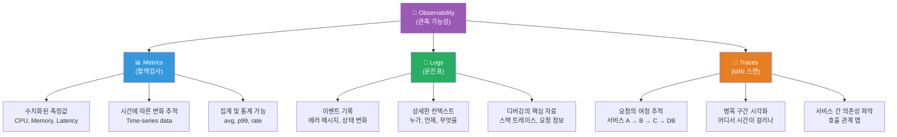
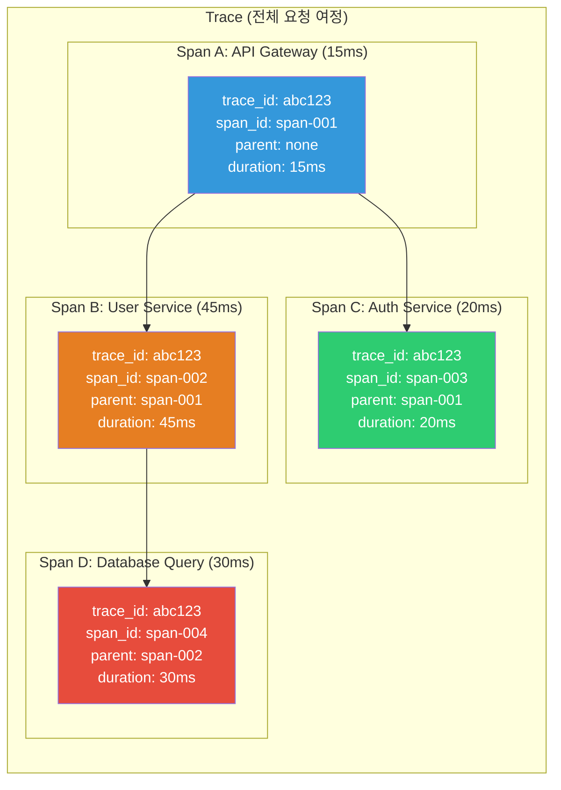
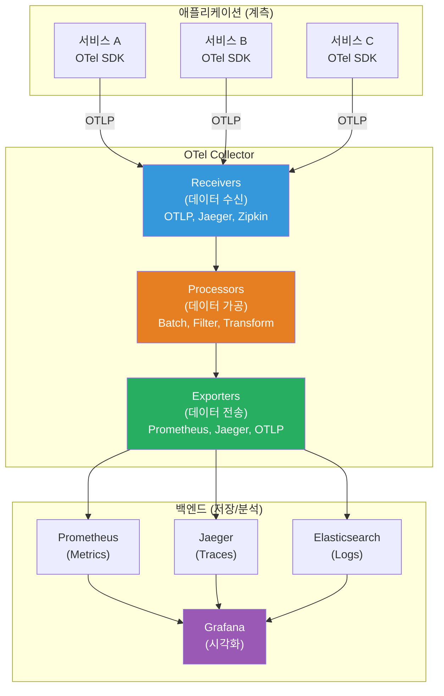
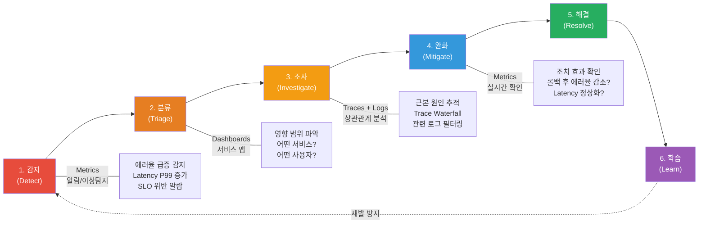
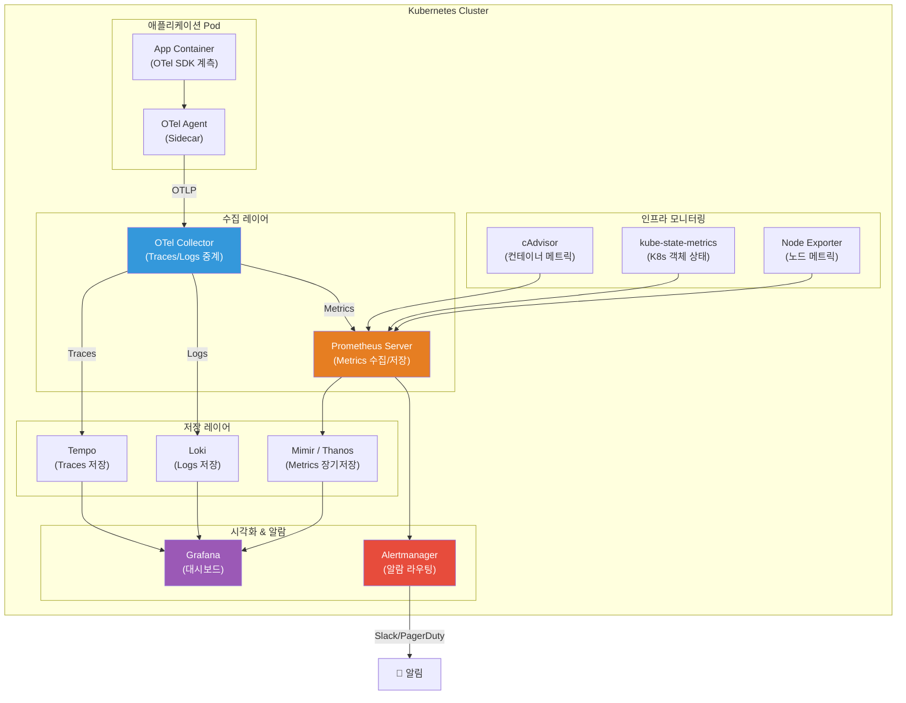

# Observability 왜 필요한가

> 시스템을 운영하는 건 몸을 관리하는 것과 비슷해요. 체온계 하나만으로는 건강 상태를 완벽히 파악할 수 없듯이, CPU 사용률 알람 하나로는 시스템의 진짜 상태를 알 수 없어요. 건강검진처럼 혈액검사(Metrics), 문진표(Logs), MRI(Traces)를 종합해야 비로소 "왜 아픈지"를 알 수 있죠. [CD 파이프라인](../07-cicd/04-cd-pipeline)으로 배포한 서비스가 정말 잘 동작하고 있는지, 지금부터 제대로 들여다보는 법을 배워봐요.

---

## 🎯 왜 Observability를 알아야 하나요?

### 일상 비유: 건강검진 이야기

여러분이 어느 날 갑자기 머리가 아프다고 상상해 보세요.

- **체온계만 있다면**: "열은 없네... 왜 아프지?" (알 수 없음)
- **혈압계도 있다면**: "혈압이 좀 높네" (단서는 있지만 원인은 모름)
- **종합 건강검진을 받으면**: "혈액검사 + CT + 문진 결과를 종합하면, 수면 부족으로 인한 긴장성 두통이에요"

**이게 바로 Monitoring과 Observability의 차이예요.**

- Monitoring = 체온계, 혈압계 (미리 정해둔 것만 측정)
- Observability = 종합 건강검진 (예상하지 못한 문제도 진단 가능)

```
실무에서 Observability가 필요한 순간:

• "서버 CPU가 정상인데 왜 느려요?"              → Metrics만으로는 원인 파악 불가
• "에러가 발생했는데 어디서 시작된 거예요?"       → 분산 시스템에서 요청 추적 필요
• "배포 후에 뭔가 이상한데, 뭐가 이상한지 모르겠어요" → 예상 못한 문제 탐지
• "장애 원인을 찾는 데 3시간이나 걸렸어요"        → 관측 가능성 부족
• "같은 장애가 또 발생했어요"                     → 패턴 분석 부재
• "마이크로서비스 어디서 병목이 생기는지 모르겠어요" → Traces 부재
• "로그는 있는데 너무 많아서 의미 있는 걸 찾을 수 없어요" → 구조화된 로깅 부재
```

### Observability가 없는 팀 vs 있는 팀

```mermaid
flowchart TD
    subgraph "❌ Observability 없는 팀"
        A1["장애 발생!<br/>사용자 불만 접수"] -->|"20분 후 인지"| A2["뭐가 문제지?"]
        A2 -->|"SSH 접속"| A3["로그 파일 뒤지기<br/>grep, tail -f"]
        A3 -->|"30분 소요"| A4["서비스 A가 느린 것 같은데..."]
        A4 -->|"추측"| A5["서비스 B도 확인해볼까?"]
        A5 -->|"또 30분"| A6["아, DB 커넥션 풀 문제였어!"]
        A6 -->|"총 MTTR: 2시간+"| A7["😰 고객 이탈"]
    end

    subgraph "✅ Observability 있는 팀"
        B1["이상 징후 자동 감지<br/>Latency P99 급증"] -->|"즉시 알람"| B2["대시보드 확인"]
        B2 -->|"1분"| B3["Trace로 병목 구간 특정<br/>서비스 A → DB 구간"]
        B3 -->|"2분"| B4["관련 로그 자동 필터링<br/>DB Connection Pool Exhausted"]
        B4 -->|"5분"| B5["원인 파악 + 조치 완료"]
        B5 -->|"총 MTTR: 10분"| B6["✅ 빠른 복구"]
    end

    style A7 fill:#e74c3c,color:#fff
    style A6 fill:#e74c3c,color:#fff
    style B6 fill:#27ae60,color:#fff
    style B5 fill:#27ae60,color:#fff
```



---

## 🧠 핵심 개념 잡기

### 1. Monitoring vs Observability

> **비유**: CCTV vs 탐정

- **Monitoring(모니터링)**: CCTV처럼 **미리 정해둔 위치**를 감시해요. "CPU가 80% 넘으면 알려줘"처럼 **알려진 문제**를 감지하는 데 좋아요.
- **Observability(관측 가능성)**: 탐정처럼 **예상하지 못한 문제**도 찾아내요. 시스템의 외부 출력(Metrics, Logs, Traces)만으로 내부 상태를 추론할 수 있는 능력이에요.

| 항목 | Monitoring | Observability |
|------|-----------|---------------|
| **접근 방식** | "무엇을 감시할지" 미리 정의 | "무엇이든" 질문하고 답을 찾음 |
| **질문 유형** | 알려진 질문 (Known-Unknowns) | 모르는 질문도 가능 (Unknown-Unknowns) |
| **예시** | "CPU 80% 넘었나?" | "왜 이 API가 갑자기 느려졌지?" |
| **데이터** | 미리 정한 메트릭 수집 | 풍부한 컨텍스트 데이터 수집 |
| **대응** | 알람 → 런북 실행 | 탐색적 분석 → 근본 원인 발견 |
| **비유** | 체온계 (체온만 측정) | 종합 건강검진 (전신 파악) |
| **한계** | 새로운 유형의 장애에 취약 | 도입 비용과 학습 곡선이 높음 |

**핵심 차이**: Monitoring은 Observability의 **부분집합**이에요. Observability가 있으면 Monitoring은 자연스럽게 포함돼요.

### 2. Observability 3 Pillars (관측 가능성의 3축)

> **비유**: 건강검진의 3가지 검사



- **Metrics (메트릭)** = 혈액검사: 수치로 된 건강 지표. "혈당 120, 혈압 130/80" → "CPU 45%, Latency P99 200ms"
- **Logs (로그)** = 문진표: 상세한 이벤트 기록. "어제 저녁에 두통이 있었어요" → "2024-01-15 14:30:22 ERROR: Connection refused"
- **Traces (트레이스)** = MRI 스캔: 내부 흐름을 추적. "혈관이 어디서 막혔는지" → "요청이 서비스 A → B → C를 거치며 B에서 3초 지연"

### 3. MELT (Metrics, Events, Logs, Traces)

3 Pillars를 확장한 개념이 MELT예요. **Events**가 추가돼요.

| 구성 요소 | 설명 | 예시 |
|----------|------|------|
| **Metrics** | 수치화된 시계열 데이터 | CPU 사용률, 요청 수, 에러율 |
| **Events** | 특정 시점에 발생한 이산 사건 | 배포, 스케일링, 설정 변경 |
| **Logs** | 타임스탬프가 있는 텍스트 기록 | 에러 로그, 접근 로그, 감사 로그 |
| **Traces** | 분산 시스템에서 요청의 경로 | 요청 ID로 연결된 서비스 호출 체인 |

> **Events**는 "변화의 순간"을 기록해요. 장애 분석할 때 "배포 직후에 에러가 급증했네?"라는 상관관계를 찾는 데 핵심적이에요.

### 4. Cardinality (카디널리티)

> **비유**: 설문조사 응답의 종류

설문조사에서 "성별" 항목은 선택지가 몇 개 안 돼요 (Low Cardinality). 하지만 "주소를 적어주세요"는 응답이 수만 가지가 될 수 있어요 (High Cardinality).

- **Low Cardinality**: HTTP 메서드 (GET, POST, PUT, DELETE) → 4가지
- **Medium Cardinality**: HTTP 상태 코드 (200, 201, 400, 404, 500...) → 수십 가지
- **High Cardinality**: User ID, Request ID, IP 주소 → 수백만 가지

```
왜 Cardinality가 중요할까요?

Metrics 시스템(Prometheus 등)은 라벨 조합별로 시계열을 생성해요.

예시: http_requests_total{method="GET", status="200", user_id="???"}

• method × status = 4 × 5 = 20개 시계열         → ✅ 문제없음
• method × status × user_id(100만명) = 2000만개  → 💥 시스템 폭발!

High Cardinality 라벨을 Metrics에 넣으면:
  → 메모리 폭증
  → 쿼리 속도 급감
  → 스토리지 비용 급증
  → Prometheus가 OOM(Out of Memory)으로 죽을 수 있음

해결책:
  → High Cardinality 데이터는 Logs나 Traces에 저장
  → Metrics에는 Low/Medium Cardinality 라벨만 사용
  → user_id 같은 건 Trace의 span attribute에 넣기
```

### 5. OpenTelemetry (OTel) 표준

> **비유**: USB-C 통일 규격

예전에는 스마트폰마다 충전기가 달랐어요 (마이크로 USB, 라이트닝, USB-C...). OpenTelemetry는 관측 가능성 데이터의 **USB-C 통일 규격**이에요.

- 벤더에 종속되지 않는 표준 텔레메트리 수집 프레임워크
- CNCF(Cloud Native Computing Foundation) 프로젝트
- Metrics, Logs, Traces를 하나의 표준으로 통일

---

## 🔍 하나씩 자세히 알아보기

### 1. Metrics (메트릭) - 혈액검사

Metrics는 **시간에 따른 수치 데이터**예요. "지금 건강한지" 빠르게 판단하는 데 최적이에요.

#### Metrics의 4가지 타입

| 타입 | 설명 | 비유 | 예시 |
|------|------|------|------|
| **Counter** | 누적 증가값 | 만보기 걸음 수 | 총 요청 수, 총 에러 수 |
| **Gauge** | 현재 값 (오르내림) | 체온계 | CPU 사용률, 메모리 사용량 |
| **Histogram** | 값의 분포 | 키 분포 그래프 | 응답 시간 분포 (p50, p95, p99) |
| **Summary** | 분위수 직접 계산 | 성적 백분위 | 클라이언트 측 지연 시간 분위수 |

#### Metrics 실전 예시

```yaml
# Prometheus 형식의 Metrics 예시

# Counter: 총 HTTP 요청 수 (누적, 단조 증가)
http_requests_total{method="GET", status="200", path="/api/users"} 158432
http_requests_total{method="POST", status="201", path="/api/orders"} 8291
http_requests_total{method="GET", status="500", path="/api/users"} 42

# Gauge: 현재 활성 커넥션 수 (증가하거나 감소할 수 있음)
active_connections{service="api-gateway"} 1247
active_connections{service="user-service"} 89

# Histogram: 요청 응답 시간 분포 (bucket별 카운트)
http_request_duration_seconds_bucket{le="0.05"} 24054    # 50ms 이하: 24,054개
http_request_duration_seconds_bucket{le="0.1"}  33421    # 100ms 이하: 33,421개
http_request_duration_seconds_bucket{le="0.25"} 39182    # 250ms 이하: 39,182개
http_request_duration_seconds_bucket{le="0.5"}  41038    # 500ms 이하: 41,038개
http_request_duration_seconds_bucket{le="1.0"}  41892    # 1s 이하: 41,892개
http_request_duration_seconds_bucket{le="+Inf"} 42000    # 전체: 42,000개
```

#### USE Method & RED Method

시스템 성능을 분석하는 체계적인 프레임워크가 있어요.

```
USE Method (인프라/리소스 관점) - Brendan Gregg 제안:
┌──────────────────────────────────────────────────┐
│  U - Utilization (사용률): 리소스가 얼마나 바쁜가?  │
│      예: CPU 사용률 75%, 디스크 I/O 90%            │
│                                                    │
│  S - Saturation (포화도): 큐에 대기 중인 작업이 있나? │
│      예: CPU run queue length, 디스크 I/O wait     │
│                                                    │
│  E - Errors (에러): 에러가 발생하고 있나?            │
│      예: 디스크 read error, 네트워크 packet drop    │
└──────────────────────────────────────────────────┘

RED Method (서비스/애플리케이션 관점) - Tom Wilkie 제안:
┌──────────────────────────────────────────────────┐
│  R - Rate (요청률): 초당 요청 수는 얼마인가?         │
│      예: 500 req/sec                              │
│                                                    │
│  E - Errors (에러율): 실패하는 요청 비율은?          │
│      예: 에러율 0.5%                               │
│                                                    │
│  D - Duration (지속시간): 요청이 얼마나 걸리나?      │
│      예: p50=20ms, p99=200ms                      │
└──────────────────────────────────────────────────┘

언제 뭘 쓸까?
• 서버/인프라 문제 → USE Method (CPU, Memory, Disk, Network)
• 서비스/API 문제  → RED Method (Rate, Errors, Duration)
• 둘 다 쓰면?     → 인프라부터 애플리케이션까지 전체 파악 가능
```

---

### 2. Logs (로그) - 문진표

Logs는 **이벤트의 상세한 기록**이에요. "정확히 무슨 일이 있었는지" 파악하는 데 필수적이에요.

#### 비정형 로그 vs 구조화된 로그

```bash
# ❌ 비정형 로그 (Unstructured) - 사람은 읽기 쉽지만, 기계가 파싱하기 어려움
[2024-01-15 14:30:22] ERROR: Failed to process order #12345 for user john@example.com - database connection timeout after 30s

# ✅ 구조화된 로그 (Structured JSON) - 기계가 파싱하기 쉽고, 검색/필터링이 용이
{
  "timestamp": "2024-01-15T14:30:22.456Z",
  "level": "ERROR",
  "service": "order-service",
  "trace_id": "abc123def456",
  "span_id": "789ghi012",
  "message": "Failed to process order",
  "order_id": "12345",
  "user_email": "john@example.com",
  "error_type": "DatabaseConnectionTimeout",
  "timeout_seconds": 30,
  "db_host": "prod-db-01.internal",
  "retry_count": 3
}
```

**왜 구조화된 로그가 중요할까요?**

```
비정형 로그로 검색할 때:
  grep "ERROR" app.log | grep "order" | grep "timeout"
  → 결과가 부정확하고, 느리고, 집계가 안 됨

구조화된 로그로 검색할 때:
  SELECT * FROM logs
  WHERE level = 'ERROR'
    AND error_type = 'DatabaseConnectionTimeout'
    AND service = 'order-service'
    AND timestamp > NOW() - INTERVAL 1 HOUR
  → 정확하고, 빠르고, 통계도 낼 수 있음
```

#### 로그 수준(Log Level) 가이드

| Level | 용도 | 예시 | 프로덕션 |
|-------|------|------|---------|
| **TRACE** | 가장 상세한 디버깅 | 함수 진입/퇴출, 변수 값 | 보통 OFF |
| **DEBUG** | 디버깅용 상세 정보 | SQL 쿼리, API 요청/응답 body | 보통 OFF |
| **INFO** | 정상 동작 확인 | 서비스 시작, 요청 처리 완료 | ON |
| **WARN** | 잠재적 문제 | 재시도 발생, 디스크 80% | ON |
| **ERROR** | 에러 발생 (복구 가능) | DB 연결 실패, API 타임아웃 | ON |
| **FATAL** | 치명적 에러 (서비스 종료) | OOM, 필수 설정 누락 | ON |

---

### 3. Traces (트레이스) - MRI 스캔

Traces는 **분산 시스템에서 하나의 요청이 여러 서비스를 거치는 전체 여정**을 추적해요.

#### Trace의 구조



```
Trace 용어 정리:

• Trace: 하나의 요청이 시스템을 관통하는 전체 경로
        모든 Span의 집합. 고유한 trace_id로 식별.

• Span:  Trace 안의 개별 작업 단위
        하나의 서비스에서 수행한 하나의 작업.
        시작/종료 시간, 속성(attributes), 이벤트 포함.

• Parent Span: 호출한 쪽의 Span
• Child Span:  호출당한 쪽의 Span

• Context Propagation: Trace ID를 서비스 간에 전달하는 메커니즘
        HTTP Header, gRPC Metadata 등을 통해 전달.

예시 Waterfall View:
├─ API Gateway ──────────────────────────── (120ms)
│  ├─ Auth Service ─────── (20ms)
│  ├─ User Service ──────────────── (80ms)
│  │  ├─ DB Query ──────── (30ms)
│  │  └─ Cache Lookup ── (5ms)
│  └─ Notification ── (10ms)
```

#### 3 Pillars의 연결

세 가지 신호(Signal)는 따로 보면 불완전하지만, **함께 보면** 강력해요.

```
시나리오: "사용자가 주문에 실패했다"

1. Metrics가 먼저 알려줘요:
   → 에러율이 평소 0.1%에서 5%로 급증! (빠른 감지)

2. Traces로 범위를 좁혀요:
   → 에러가 발생한 요청의 trace를 보니,
     Order Service → Payment Service 구간에서 타임아웃 (병목 특정)

3. Logs로 정확한 원인을 찾아요:
   → Payment Service 로그:
     "ERROR: Connection pool exhausted. Active: 50/50.
      Waiting: 127. Oldest connection age: 300s"
     → 커넥션 풀이 꽉 찼구나! (근본 원인 파악)

4. 조치:
   → 커넥션 풀 사이즈 증가 + idle timeout 설정
   → 재발 방지: 커넥션 풀 사용률 Metric 추가 + 알람 설정
```

---

### 4. OpenTelemetry (OTel) 표준 깊이 알아보기

OpenTelemetry는 **벤더 중립적인** 관측 가능성 데이터 수집 표준이에요.

#### OTel 아키텍처



#### OTel의 핵심 구성 요소

```
OpenTelemetry 구성:

1. API (인터페이스 정의)
   • 계측 코드가 사용하는 인터페이스
   • 벤더 독립적인 추상화 계층

2. SDK (구현체)
   • API의 실제 구현
   • Sampling, Batching, Export 설정
   • 각 언어별 SDK 제공 (Java, Python, Go, JS, .NET 등)

3. Collector (데이터 수집기)
   • Agent 모드: 각 호스트에서 사이드카로 실행
   • Gateway 모드: 중앙 집중식 수집 서버
   • Receiver → Processor → Exporter 파이프라인

4. OTLP (OpenTelemetry Protocol)
   • 데이터 전송을 위한 표준 프로토콜
   • gRPC와 HTTP/JSON 지원
   • Metrics, Logs, Traces 모두 하나의 프로토콜로 전송

왜 OTel이 중요한가?
  → 벤더 락인(Lock-in) 방지: Datadog에서 Grafana로 바꿔도 앱 코드 변경 불필요
  → 표준화: 팀마다 다른 라이브러리 쓰는 문제 해결
  → 상관관계(Correlation): trace_id로 Metrics/Logs/Traces 연결
```

#### OTel 계측 코드 예시 (Python)

```python
from opentelemetry import trace
from opentelemetry.sdk.trace import TracerProvider
from opentelemetry.sdk.trace.export import BatchSpanProcessor
from opentelemetry.exporter.otlp.proto.grpc.trace_exporter import OTLPSpanExporter

# Tracer 설정
provider = TracerProvider()
processor = BatchSpanProcessor(OTLPSpanExporter(endpoint="otel-collector:4317"))
provider.add_span_processor(processor)
trace.set_tracer_provider(provider)
tracer = trace.get_tracer(__name__)

# 수동 계측: 비즈니스 로직에 커스텀 Span 추가
@app.route("/api/orders", methods=["POST"])
def create_order():
    with tracer.start_as_current_span("create_order") as span:
        span.set_attribute("order.user_id", request.json["user_id"])

        with tracer.start_as_current_span("process_payment"):
            result = process_payment(request.json)

        span.add_event("order_created", {"order_id": result["order_id"]})
        return jsonify(result), 201
```

---

### 5. Observability Maturity Model (관측 가능성 성숙도 모델)

조직의 관측 가능성 수준을 단계별로 평가할 수 있어요.

```
Level 0: 🌑 없음 (No Observability)
├── 장애 감지: 사용자가 알려줘야 알 수 있음
├── 데이터: 없거나 서버 로컬 로그만 존재
├── 도구: 없음
├── 문화: "지금까지 잘 돌아갔는데 뭘..."
└── MTTR: 수시간 ~ 수일

Level 1: 🌒 반응적 (Reactive Monitoring)
├── 장애 감지: 기본 인프라 알람 (CPU, Memory, Disk)
├── 데이터: 인프라 Metrics + 서버별 로그 파일
├── 도구: Nagios, Zabbix, CloudWatch 기본
├── 문화: "알람 오면 대응하자"
└── MTTR: 1~4시간

Level 2: 🌓 사전 예방적 (Proactive Monitoring)
├── 장애 감지: 애플리케이션 수준 Metrics + 알람
├── 데이터: 중앙 집중 로그 + APM
├── 도구: Prometheus + Grafana, ELK Stack
├── 문화: "대시보드를 매일 확인하자"
└── MTTR: 30분 ~ 1시간

Level 3: 🌔 관측 가능 (Observable)
├── 장애 감지: 3 Pillars 통합 + 이상 징후 탐지
├── 데이터: Metrics + Logs + Traces 상관관계 분석
├── 도구: OpenTelemetry + Grafana Stack / Datadog
├── 문화: "예상 못한 질문에도 답할 수 있어야 해"
└── MTTR: 5~15분

Level 4: 🌕 데이터 기반 (Data-Driven)
├── 장애 감지: AIOps, 자동 이상 탐지, 예측 기반 알람
├── 데이터: 전체 텔레메트리 + 비즈니스 메트릭 통합
├── 도구: Full OTel + ML 기반 분석 + 자동 치유(Self-Healing)
├── 문화: "관측 데이터가 의사결정의 근거"
└── MTTR: 자동 복구 또는 수분 이내
```

---

### 6. 장애 대응에서의 관측 가능성 역할

장애(Incident)가 발생했을 때, Observability가 각 단계에서 어떻게 도움을 주는지 살펴봐요.

#### 장애 대응 라이프사이클



#### 실전 장애 대응 시나리오

```
🚨 시나리오: 금요일 오후 5시, "결제가 안 돼요!" 신고

━━━ Observability 없는 팀 (MTTR: 2시간+) ━━━
17:00 사용자 불만 접수 → 17:15 담당자 연락 → 17:30 SSH 접속, 로그 뒤지기
→ 18:30 "외부 결제 API가 느린 거였구나" (추측) → 18:45 임시 조치
→ 근본 원인(커넥션 풀 고갈) 미해결

━━━ Observability 있는 팀 (MTTR: 13분) ━━━
16:52 Grafana 알람: 에러율 5% 초과 (사용자 신고 전 자동 감지!)
16:53 온콜 엔지니어 PagerDuty 알림 수신
16:55 대시보드: 에러 유형 ConnectionPoolExhausted (92%)
16:57 Jaeger Trace: 외부 API Latency 급증 → 커넥션 풀 점유 → 풀 고갈
16:59 Logs (Trace ID 필터): "Connection pool exhausted. Active: 50/50"
17:02 조치: 풀 사이즈 확대 + 타임아웃 단축 + Circuit Breaker 활성화
17:05 Metrics 확인: 에러율 정상 복귀 → 근본 원인 해결 완료
```

---

### 7. 도구 생태계 개요

관측 가능성 도구는 크게 **오픈소스**와 **상용(SaaS)** 솔루션으로 나뉘어요.

#### 오픈소스 스택

```
┌─────────────────────────────────────────────────────────┐
│                    시각화 & 대시보드                       │
│            Grafana (통합 시각화 플랫폼)                    │
├──────────┬──────────────┬──────────────┬────────────────┤
│ Metrics  │    Logs      │   Traces     │    Alerting    │
│          │              │              │                │
│Prometheus│ Loki         │ Jaeger       │ Alertmanager   │
│(수집/저장)│ (경량 로그)   │ (분산추적)    │ (알람 관리)     │
│          │              │              │                │
│ Thanos   │ Elasticsearch│ Tempo        │ PagerDuty      │
│(장기저장) │ (전문 검색)   │ (대규모추적)  │ (온콜 관리)     │
│          │              │              │                │
│ Mimir    │ Fluentd      │ Zipkin       │ OpsGenie       │
│(확장성)  │ (로그 수집)   │ (가벼운추적)  │ (인시던트 관리)  │
├──────────┴──────────────┴──────────────┴────────────────┤
│              데이터 수집 (Instrumentation)                 │
│                   OpenTelemetry                          │
└─────────────────────────────────────────────────────────┘
```

#### 주요 도구 비교

| 도구 | 영역 | 특징 | 적합한 상황 |
|------|------|------|------------|
| **Prometheus** | Metrics | Pull 기반, PromQL, CNCF 졸업 | [Kubernetes](../04-kubernetes/) 환경의 Metrics 수집 |
| **Grafana** | 시각화 | 다양한 데이터소스 지원, 대시보드 | 통합 모니터링 대시보드 |
| **Loki** | Logs | 라벨 기반, 경량, Grafana 통합 | 비용 효율적인 로그 관리 |
| **Elasticsearch** | Logs | 전문 검색, 강력한 분석 | 대규모 로그 분석, 복잡한 쿼리 |
| **Jaeger** | Traces | CNCF 졸업, 대규모 분산 추적 | 마이크로서비스 디버깅 |
| **Tempo** | Traces | 오브젝트 스토리지 활용, 경량 | Grafana 에코시스템 통합 |
| **OpenTelemetry** | 수집 | 벤더 중립, CNCF, 모든 신호 | 표준 텔레메트리 수집 |

#### 상용(SaaS) 솔루션

| 도구 | 특징 | 장점 | 비용 모델 |
|------|------|------|----------|
| **Datadog** | 올인원 플랫폼 | 설치 쉬움, AI 분석, 풍부한 통합 | 호스트/이벤트당 과금 |
| **New Relic** | 올인원 APM | 무료 티어 있음, Full Stack 관측 | 데이터 수집량 기반 |
| **Dynatrace** | AI 기반 APM | 자동 발견, 자동 계측, AI 분석 | 호스트 기반 |
| **Splunk** | 로그 분석 특화 | 강력한 검색, 보안 통합 | 데이터 수집량 기반 |

#### 도구 선택 가이드

```
Q1. 예산? → 넉넉함: Datadog/New Relic | 제한적: 오픈소스 스택
Q2. 운영 인력? → SRE 팀 있음: 오픈소스 커스터마이징 | 없음: SaaS 추천
Q3. 규모? → 소규모: Grafana Cloud Free | 중규모: Prometheus+Grafana | 대규모: Thanos/Mimir
Q4. Kubernetes? → 예: Prometheus 사실상 표준 | 아니오: CloudWatch/Datadog Agent
```

---

### 8. eBPF 기반 모니터링의 등장

#### eBPF란?

eBPF(extended Berkeley Packet Filter)는 **리눅스 커널 내부에서 안전하게 코드를 실행**할 수 있는 기술이에요. 기존 모니터링과 근본적으로 다른 접근법으로, 커널 수준의 가시성을 제공해요.

> **비유**: 기존 모니터링이 CCTV(정해진 위치만 촬영)라면, eBPF는 **투시경**(벽 안을 들여다봄)과 비슷해요. 애플리케이션 코드를 수정하지 않고도, OS 커널 레벨에서 모든 시스템 호출, 네트워크 패킷, 파일 I/O를 관찰할 수 있어요.

```
eBPF vs 기존 에이전트 기반 모니터링:

┌──────────────────────────────────────────────────────────┐
│  기존 방식 (에이전트 기반)                                   │
│  [앱 코드] → [SDK/에이전트 삽입] → [수집기] → [백엔드]       │
│  • 앱에 SDK를 설치하거나 사이드카를 붙여야 함                  │
│  • 언어/프레임워크별로 다른 에이전트 필요                      │
│  • 에이전트가 앱 성능에 영향을 줄 수 있음                     │
│  • 레거시 앱에 계측 추가가 어려움                             │
└──────────────────────────────────────────────────────────┘

┌──────────────────────────────────────────────────────────┐
│  eBPF 방식 (커널 레벨)                                     │
│  [앱 코드] (변경 없음)                                      │
│  [리눅스 커널] → [eBPF 프로그램] → [수집기] → [백엔드]       │
│  • 앱 코드 수정 불필요 (zero-instrumentation)               │
│  • 모든 언어/프레임워크에 동일하게 적용                       │
│  • 오버헤드가 매우 낮음 (커널 내부에서 실행)                   │
│  • L3/L4/L7 네트워크 데이터까지 수집 가능                    │
└──────────────────────────────────────────────────────────┘
```

#### Cilium Hubble: 네트워크 관찰성

Cilium은 eBPF 기반 CNI(Container Network Interface)이고, **Hubble**은 Cilium의 네트워크 관찰성 레이어예요.

```
Hubble이 제공하는 가시성:

  L3/L4 (네트워크/전송 계층):
  • Pod 간 TCP/UDP 연결 추적
  • 패킷 드롭, 연결 실패 감지
  • 네트워크 정책(NetworkPolicy) 위반 추적

  L7 (애플리케이션 계층):
  • HTTP 요청/응답 (메서드, 경로, 상태 코드)
  • gRPC 호출 추적
  • DNS 쿼리 모니터링
  • Kafka 메시지 추적

  서비스 맵:
  • 서비스 간 의존관계 자동 생성
  • 트래픽 흐름 실시간 시각화
  • 서비스 간 지연 시간 측정
```

```bash
# Hubble CLI 예시: HTTP 요청 관찰
hubble observe --protocol http --namespace production

# 특정 서비스의 DNS 쿼리 추적
hubble observe --type l7 --protocol dns --to-pod order-service

# 네트워크 정책 위반 감지
hubble observe --verdict DROPPED
```

#### Pixie: 자동 계측 없이 애플리케이션 성능 모니터링

Pixie(현재 New Relic 소유, CNCF Sandbox)는 eBPF를 사용해서 **SDK 설치나 코드 수정 없이** 애플리케이션 성능을 모니터링해요.

```
Pixie의 핵심 기능:
  • HTTP/gRPC 요청의 자동 추적 (Golden Signals: Rate, Error, Duration)
  • 데이터베이스 쿼리 자동 캡처 (MySQL, PostgreSQL, Cassandra)
  • CPU 프로파일링 (flamegraph 자동 생성)
  • 네트워크 트래픽 분석
  • 모든 것이 앱 코드 변경 없이 동작
```

#### eBPF vs 기존 에이전트 기반 모니터링 비교

| 비교 항목 | 에이전트 기반 (OTel 등) | eBPF 기반 (Cilium, Pixie) |
|-----------|----------------------|--------------------------|
| **설치 방식** | SDK/에이전트를 앱에 통합 | 커널 모듈/DaemonSet 배포 |
| **코드 수정** | 필요 (자동 계측이라도 의존성 추가) | 불필요 (zero-instrumentation) |
| **언어 지원** | 언어별 SDK 필요 | 모든 언어 동일 |
| **네트워크 가시성** | 제한적 (L7만) | L3/L4/L7 전체 |
| **비즈니스 메트릭** | 커스텀 Span/메트릭 추가 가능 | 인프라 수준에 한정 |
| **오버헤드** | 중간 (SDK 부하) | 매우 낮음 |
| **성숙도** | 높음 (프로덕션 검증) | 빠르게 성장 중 |
| **권장 조합** | 비즈니스 로직 관측 | 인프라/네트워크 관측 |

> **핵심 포인트**: eBPF와 기존 에이전트 방식은 **경쟁이 아니라 보완 관계**예요. OTel로 비즈니스 로직을 추적하고, eBPF로 네트워크와 인프라를 모니터링하는 것이 가장 이상적인 구성이에요.

---

## 💻 직접 해보기

### 실습 1: 구조화된 로그 설계하기

실제 서비스에서 사용할 구조화된 로그 포맷을 설계해 보세요.

```json
// 좋은 구조화 로그의 필수 필드

{
  // === 필수 메타데이터 ===
  "timestamp": "2024-01-15T14:30:22.456Z",  // ISO 8601 형식
  "level": "ERROR",                          // 로그 레벨
  "service": "order-service",                // 서비스 이름
  "version": "v2.3.1",                       // 서비스 버전
  "environment": "production",               // 환경 구분

  // === 상관관계(Correlation) ===
  "trace_id": "abc123def456",                // 분산 추적 ID
  "span_id": "789ghi012",                    // 현재 Span ID
  "request_id": "req-xyz-789",               // 요청 ID

  // === 이벤트 정보 ===
  "message": "Payment processing failed",    // 사람이 읽을 수 있는 메시지
  "error_type": "PaymentGatewayTimeout",     // 에러 분류
  "error_message": "Connection timed out after 30s",

  // === 비즈니스 컨텍스트 ===
  "user_id": "user-12345",                   // 영향받은 사용자
  "order_id": "order-67890",                 // 관련 비즈니스 엔티티
  "amount": 45000,                           // 비즈니스 관련 값

  // === 기술적 컨텍스트 ===
  "host": "pod-order-service-7b9c4",         // 호스트/파드 이름
  "source_file": "payment_handler.py",       // 소스 코드 위치
  "source_line": 142
}
```

### 실습 2: Prometheus Metrics 설계하기

간단한 웹 서비스의 핵심 Metrics를 설계해 보세요.

```yaml
# 1. RED Method 기반 서비스 Metrics

# Rate: 초당 요청 수
- name: http_requests_total
  type: Counter
  labels: [method, path, status_code]
  description: "Total number of HTTP requests"

# Errors: 에러 요청 수 (status >= 500)
# → http_requests_total에서 status_code="5xx"로 필터하면 됨

# Duration: 요청 처리 시간
- name: http_request_duration_seconds
  type: Histogram
  labels: [method, path]
  buckets: [0.01, 0.05, 0.1, 0.25, 0.5, 1.0, 2.5, 5.0, 10.0]
  description: "HTTP request duration in seconds"

# 2. USE Method 기반 인프라 Metrics (보통 자동 수집)

# Utilization
- name: node_cpu_seconds_total        # CPU 사용률
- name: node_memory_MemAvailable_bytes # 가용 메모리

# Saturation
- name: node_load1                    # 1분 평균 Load
- name: node_disk_io_time_seconds_total # 디스크 I/O 대기

# Errors
- name: node_disk_read_errors_total   # 디스크 읽기 에러
- name: node_network_receive_errs_total # 네트워크 수신 에러

# 3. 비즈니스 Metrics (서비스별 커스텀)

- name: orders_created_total
  type: Counter
  labels: [payment_method, status]
  description: "Total orders created"

- name: order_processing_duration_seconds
  type: Histogram
  labels: [step]  # validate, payment, fulfill
  description: "Order processing step duration"

- name: active_users_gauge
  type: Gauge
  description: "Currently active users"
```

### 실습 3: PromQL 기본 쿼리 연습

Prometheus 쿼리 언어인 PromQL의 핵심 패턴을 익혀보세요.

```promql
# === Rate (초당 변화율) - Counter에 필수! ===
rate(http_requests_total[5m])                          # 최근 5분간 초당 요청 수

# === 에러율 계산 (가장 자주 쓰는 패턴) ===
(
  rate(http_requests_total{status_code=~"5.."}[5m])
  /
  rate(http_requests_total[5m])
) * 100                                                # 에러 비율 (%)

# === Latency 분위수 (Histogram 활용) ===
histogram_quantile(0.99, rate(http_request_duration_seconds_bucket[5m]))  # P99

# === 알람에 유용한 쿼리 ===
# 에러율 5% 초과가 지속될 때
(rate(http_requests_total{status_code=~"5.."}[5m]) / rate(http_requests_total[5m])) > 0.05

# 디스크가 24시간 내 가득 찰 것으로 예측
predict_linear(node_filesystem_avail_bytes[6h], 24*3600) < 0
```

### 실습 4: OpenTelemetry Collector 설정 맛보기

OTel Collector의 기본 설정 파일을 이해해 보세요.

```yaml
# otel-collector-config.yaml
receivers:
  otlp:
    protocols:
      grpc:
        endpoint: 0.0.0.0:4317
      http:
        endpoint: 0.0.0.0:4318

processors:
  batch:
    timeout: 5s
    send_batch_size: 1000
  memory_limiter:
    limit_mib: 512

exporters:
  prometheus:
    endpoint: 0.0.0.0:8889
  otlp/jaeger:
    endpoint: jaeger:4317
    tls:
      insecure: true
  loki:
    endpoint: http://loki:3100/loki/api/v1/push

# 파이프라인 구성: 어떤 신호를 어디로 보낼지 정의
service:
  pipelines:
    traces:
      receivers: [otlp]
      processors: [memory_limiter, batch]
      exporters: [otlp/jaeger]
    metrics:
      receivers: [otlp]
      processors: [memory_limiter, batch]
      exporters: [prometheus]
    logs:
      receivers: [otlp]
      processors: [memory_limiter, batch]
      exporters: [loki]
```

---

## 🏢 실무에서는?

### 실무 아키텍처: Kubernetes 환경의 Observability Stack

실제 프로덕션 환경에서 가장 많이 사용되는 구성이에요.



### 실무 사례: 배포와 관측 가능성의 연결

[CD 파이프라인](../07-cicd/04-cd-pipeline)에서 배포가 실행된 후, Observability가 어떻게 배포 안전성을 보장하는지 알아봐요.

```
배포 후 관측 체크리스트:

1. 🚦 배포 직후 (0~5분)
   □ 에러율 급증 여부 (rate(http_requests_total{status=~"5.."}[1m]))
   □ Latency 변화 (histogram_quantile(0.99, ...))
   □ 파드 재시작 여부 (kube_pod_container_status_restarts_total)

2. 📊 안정화 기간 (5~30분)
   □ 에러율이 배포 전 수준으로 안정화되었는지
   □ 리소스 사용량 변화 (CPU, Memory Leak 여부)
   □ 비즈니스 메트릭 정상 (주문 수, 결제 성공률 등)

3. 🔍 장기 모니터링 (30분~24시간)
   □ 메모리 사용량 추이 (Memory Leak 가능성)
   □ 점진적 성능 저하 (Slow Degradation)
   □ 외부 서비스 호출 패턴 변화

자동 롤백 조건 예시 (Argo Rollouts):
  - 에러율 > 5% 가 3분 이상 지속
  - P99 Latency > 2초 가 5분 이상 지속
  - 파드 CrashLoopBackOff 발생
```

### 실무 팁: 대시보드 설계 원칙

```
Golden Signals 대시보드 (Google SRE Book 기반):
  1행: Traffic (QPS, 서비스별 요청 비율, Top 엔드포인트)
  2행: Errors (에러율, 에러 타입 분류, 상태 코드 분포)
  3행: Latency (P50/P95/P99, 엔드포인트별, 히스토그램)
  4행: Saturation (CPU/Memory, 디스크 I/O, 커넥션 풀)

설계 규칙:
  ✅ 위→아래: 비즈니스 영향 → 서비스 → 인프라
  ✅ 왼→오른: 전체 → 상세
  ✅ 색상: 초록(정상) / 노랑(주의) / 빨강(위험)
  ❌ 한 대시보드에 30개 이상 패널 넣지 않기
```

### 실무 팁: 알람 설계 원칙

```
❌ 나쁜 알람: "CPU 80% 초과" (일시적 변동에도 알람), "에러 발생" (1개에도 발동)
✅ 좋은 알람: "에러율 5% 초과가 5분 이상 지속", "24시간 내 디스크 100% 예측"

알람 피로(Alert Fatigue) 방지 원칙:
  1. 모든 알람에 Actionable한 런북(Runbook) 연결
  2. 의미 없는 알람은 과감히 삭제 (알람 소음 ≠ 안전)
  3. 심각도 구분: P1(즉시 대응) / P2(업무 시간 내) / P3(참고)
  4. 주기적 리뷰: "지난달 이 알람이 울렸을 때 실제로 조치했나?"
```

### 관측 가능성 문화 (Observability Culture)

도구만 도입한다고 관측 가능성이 확보되는 게 아니에요. **문화**가 함께 바뀌어야 해요.

```
관측 가능성 문화의 핵심 원칙:

1. "내가 만든 서비스는 내가 관찰한다" (You Build It, You Observe It)
   → 개발자가 직접 계측 코드를 넣고, 대시보드를 만들고, 알람을 설정
   → 운영팀에게만 맡기면 비즈니스 컨텍스트가 빠진 관측만 가능

2. "관측 가능성은 테스트만큼 중요하다"
   → PR 리뷰 체크리스트에 "적절한 계측이 포함되어 있는가?" 추가
   → 새 기능 = 코드 + 테스트 + 계측, 셋 중 하나라도 빠지면 불완전

3. "장애 후 문화" (Blameless Post-Mortem)
   → 장애 원인을 사람 탓이 아니라 시스템 탓으로 분석
   → "김 과장이 실수했다" ❌ → "이 실수를 방지하는 계측이 없었다" ✅
   → 장애 리뷰에서 반드시: "어떤 관측 데이터가 있었으면 더 빨리 발견할 수 있었을까?"

4. "SLO 기반 의사결정"
   → "서버가 느린 것 같아요" ❌ → "P99 Latency가 SLO(200ms) 대비 150% 초과" ✅
   → 감이 아닌 데이터로 의사결정

5. "점진적 도입"
   → 한 번에 완벽한 관측 가능성을 구축하려 하지 않기
   → Metrics 먼저 → Logs 중앙화 → Traces 도입 순서로 점진적 도입
```

---

## ⚠️ 자주 하는 실수

### 실수 1: Metrics에 High Cardinality 라벨 넣기

```yaml
# ❌ 잘못된 예: user_id를 Metrics 라벨에 넣음
http_requests_total{method="GET", path="/api/users", user_id="user-12345"}
# → 사용자 100만명이면 시계열 100만개 생성!
# → Prometheus 메모리 폭증 → OOM 크래시

# ✅ 올바른 예: user_id는 Trace/Log에만 포함
http_requests_total{method="GET", path="/api/users", status="200"}
# → Metrics는 집계용, 개별 사용자 추적은 Traces/Logs로

# ❌ 또 다른 실수: path에 동적 값 포함
http_requests_total{path="/api/users/12345"}
http_requests_total{path="/api/users/67890"}
# → 사용자별로 다른 시계열 생성!

# ✅ 수정: 경로 패턴으로 정규화
http_requests_total{path="/api/users/:id"}
```

### 실수 2: 로그를 구조화하지 않고 문자열로만 남기기

```python
# ❌ 잘못된 예: 문자열만으로 로깅
logger.error(f"Order {order_id} failed for user {user_id}: {error}")
# → 검색? grep으로? 정규식 지옥...
# → 집계? 불가능...
# → Trace와 연결? trace_id가 없으니 불가능...

# ✅ 올바른 예: 구조화된 로깅 + trace_id 포함
logger.error(
    "Order processing failed",
    extra={
        "order_id": order_id,
        "user_id": user_id,
        "error_type": type(error).__name__,
        "error_message": str(error),
        "trace_id": get_current_trace_id(),
        "payment_method": payment_method,
    }
)
```

### 실수 3: 알람을 너무 많이 / 민감하게 설정하기

```yaml
# ❌ 잘못된 알람: 너무 민감함
alert: HighCPU
expr: node_cpu_usage > 0.70     # 70%만 넘어도 알람
for: 1m                          # 1분만 지속돼도 발동
# → 정상적인 트래픽 변동에도 알람 폭탄
# → 알람 피로(Alert Fatigue) → 진짜 중요한 알람도 무시하게 됨

# ✅ 올바른 알람: SLO 기반, 의미 있는 임계값
alert: HighErrorRate
expr: |
  (
    rate(http_requests_total{status=~"5.."}[5m])
    /
    rate(http_requests_total[5m])
  ) > 0.05
for: 5m                          # 5분 이상 지속될 때만
labels:
  severity: critical
annotations:
  summary: "에러율 5% 초과 ({{ $value | humanizePercentage }})"
  runbook: "https://wiki.internal/runbook/high-error-rate"
  dashboard: "https://grafana.internal/d/service-overview"
```

### 실수 4: 도구만 도입하고 문화를 바꾸지 않기

```
❌ 흔한 패턴:
1. "Datadog 도입했으니 이제 관측 가능성 완성!" → 아무도 대시보드 안 봄
2. "Grafana 대시보드 100개 만들었어요!" → 쓸모없는 대시보드 90개
3. "알람 500개 설정했습니다!" → 알람 피로로 모두 무시
4. "OpenTelemetry 계측했어요!" → trace_id를 로그에 안 넣어서 연결 불가

✅ 올바른 접근:
1. 도구 도입 전에 "무엇을 관측하고 싶은지" 먼저 정의
2. 핵심 서비스부터 시작해서 점진적으로 확대
3. 팀 전체가 대시보드를 보는 습관 만들기 (스탠드업에 대시보드 리뷰 포함)
4. 장애 리뷰(Post-Mortem)에서 관측 가능성 개선 항목 도출
```

### 실수 5: Traces 도입 시 샘플링 미설정

```
❌ 잘못된 설정: 모든 요청을 100% 추적
   → 초당 10,000 요청 × Span 10개 = 초당 100,000 Span
   → 엄청난 스토리지 비용 + 네트워크 부하

✅ 올바른 설정: 지능형 샘플링 전략
   • Head-based Sampling: 요청 시작 시 샘플링 결정
     - 전체 트래픽의 10%만 추적 (정상 트래픽)
     - 에러가 발생한 요청은 100% 추적

   • Tail-based Sampling: 요청 완료 후 샘플링 결정
     - Latency가 임계값 초과인 요청은 100% 보존
     - 에러가 포함된 Trace는 100% 보존
     - 나머지는 5~10%만 보존

   → OTel Collector의 tail_sampling processor 활용
```

### 실수 6: Monitoring과 Observability를 혼동하기

```
❌ 오해: "우리 Prometheus + Grafana 있으니까 Observability 완성이야"
   → 이건 Monitoring이에요!
   → "CPU가 80% 넘었나?" 같은 Known-Unknown만 답할 수 있음

✅ 진정한 Observability:
   → "어제 오후 3시에 주문 서비스가 왜 느려졌는지
      아무런 사전 정의 없이도 데이터를 탐색해서 답할 수 있는 능력"

   필요한 것:
   • High Cardinality 데이터 (Traces, 구조화된 Logs)
   • 상관관계 분석 (trace_id로 Metrics/Logs/Traces 연결)
   • Ad-hoc 쿼리 능력 ("이 조건의 요청만 골라서 Latency 분포를 보여줘")
```

---

## 📝 마무리

### 핵심 요약

```
Observability = 시스템의 외부 출력만으로 내부 상태를 추론할 수 있는 능력

1. Monitoring vs Observability
   • Monitoring: "미리 정한 질문"에만 답할 수 있음 (Known-Unknowns)
   • Observability: "예상 못한 질문"에도 답할 수 있음 (Unknown-Unknowns)
   • Monitoring ⊂ Observability (부분집합)

2. 3 Pillars + MELT
   • Metrics: 수치 데이터, 빠른 감지, 시계열 (혈액검사)
   • Logs: 이벤트 기록, 상세 디버깅, 컨텍스트 (문진표)
   • Traces: 요청 경로 추적, 병목 특정, 의존성 파악 (MRI)
   • Events: 변화의 순간 기록, 상관관계 분석

3. Cardinality
   • Low Cardinality → Metrics 라벨에 적합
   • High Cardinality → Traces/Logs에 저장
   • 잘못 설계하면 시스템 폭발 위험

4. OpenTelemetry
   • 벤더 중립적 표준 (USB-C 통일 규격)
   • SDK + Collector + OTLP 프로토콜
   • 한 번 계측하면 어떤 백엔드든 전송 가능

5. 성숙도 모델
   • Level 0~4: 없음 → 반응적 → 사전 예방 → 관측 가능 → 데이터 기반
   • 도구뿐만 아니라 문화도 함께 성장해야 함

6. 관측 가능성 문화
   • You Build It, You Observe It
   • 관측 가능성은 테스트만큼 중요
   • Blameless Post-Mortem
   • SLO 기반 의사결정
```

### 각 Pillar별 도구 매핑

| Pillar | 오픈소스 | 상용 | 표준 |
|--------|---------|------|------|
| **Metrics** | Prometheus, Thanos, Mimir | Datadog, New Relic | OpenTelemetry Metrics |
| **Logs** | Loki, ELK Stack, Fluentd | Splunk, Datadog Logs | OpenTelemetry Logs |
| **Traces** | Jaeger, Tempo, Zipkin | Datadog APM, Dynatrace | OpenTelemetry Traces |
| **시각화** | Grafana | Datadog Dashboard | - |
| **알림** | Alertmanager | PagerDuty, OpsGenie | - |

### 한 장으로 보는 전체 그림

```
사용자 요청 → API Gateway → Service A → Service B → Database
                  │              │            │          │
                  ▼              ▼            ▼          ▼
              [OTel SDK]    [OTel SDK]   [OTel SDK]  [Exporter]
                  │              │            │          │
                  └──────────────┴────────────┴──────────┘
                                    │
                              OTel Collector
                           ┌───────┼───────┐
                           ▼       ▼       ▼
                       Prometheus  Loki   Tempo
                       (Metrics) (Logs) (Traces)
                           └───────┼───────┘
                                   ▼
                               Grafana
                           (통합 대시보드)
                                   │
                          ┌────────┼────────┐
                          ▼        ▼        ▼
                       알람    대시보드   탐색적 분석
                    (Alertmanager) (시각화) (Ad-hoc Query)
```

---

## 🔗 다음 단계

### 이 강의 이후 학습 순서

```
현재 위치: ✅ Observability 개념 이해

다음 단계:
├── 📊 Prometheus & Grafana (Metrics 수집과 시각화)
│   └── → 다음 강의: ./02-prometheus.md
│
├── 📝 로그 수집과 분석 (ELK Stack / Loki)
│   └── Fluentd/Fluent Bit → Elasticsearch/Loki → Kibana/Grafana
│
├── 🔗 분산 추적 (Jaeger / Tempo)
│   └── OpenTelemetry 계측 → Trace 수집 → 분석
│
├── 🚨 알람과 인시던트 관리
│   └── Alertmanager → PagerDuty → 온콜 체계
│
└── 📈 SLO/SLI/SLA와 Error Budget
    └── SRE 관점의 관측 가능성 활용
```

### 연관 강의 참고

- [Kubernetes 아키텍처](../04-kubernetes/01-architecture) - Kubernetes 환경에서의 관측 대상 이해
- [Kubernetes Health Check](../04-kubernetes/08-healthcheck) - Readiness/Liveness Probe와 관측의 관계
- [CD 파이프라인](../07-cicd/04-cd-pipeline) - 배포 후 관측 가능성 기반 자동 롤백
- [다음: Prometheus & Grafana](./02-prometheus) - Metrics 수집과 시각화 실습

### 추천 리소스

```
공식 문서:
  • OpenTelemetry: https://opentelemetry.io/docs/
  • Prometheus: https://prometheus.io/docs/
  • Grafana: https://grafana.com/docs/

추천 도서:
  • "Observability Engineering" - Charity Majors 외
  • "Site Reliability Engineering" - Google SRE Book (무료 온라인)
  • "Distributed Systems Observability" - Cindy Sridharan (무료 eBook)

핵심 키워드:
  Observability, 3 Pillars, MELT, Counter/Gauge/Histogram,
  Structured Logging, Span/Trace/Context Propagation,
  Cardinality, OpenTelemetry(OTel/OTLP), USE/RED Method, Golden Signals
```
