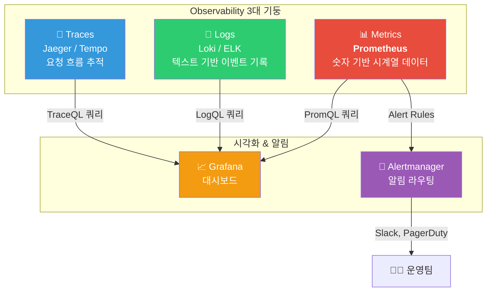
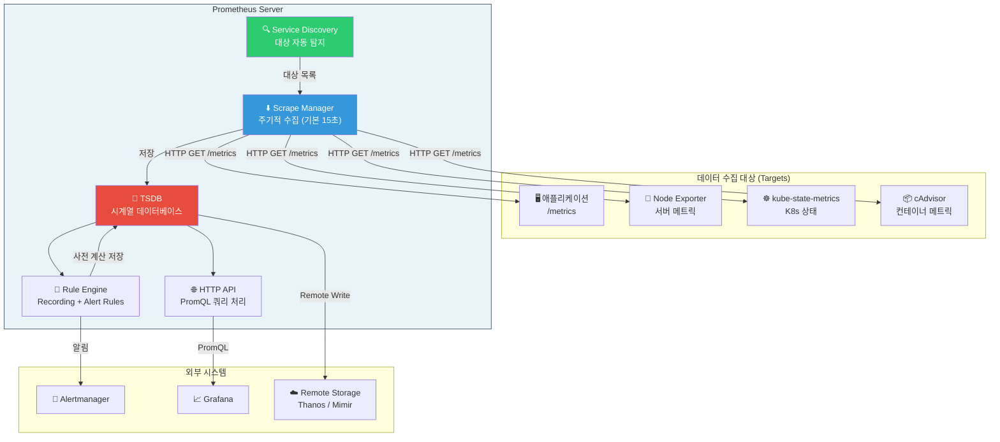
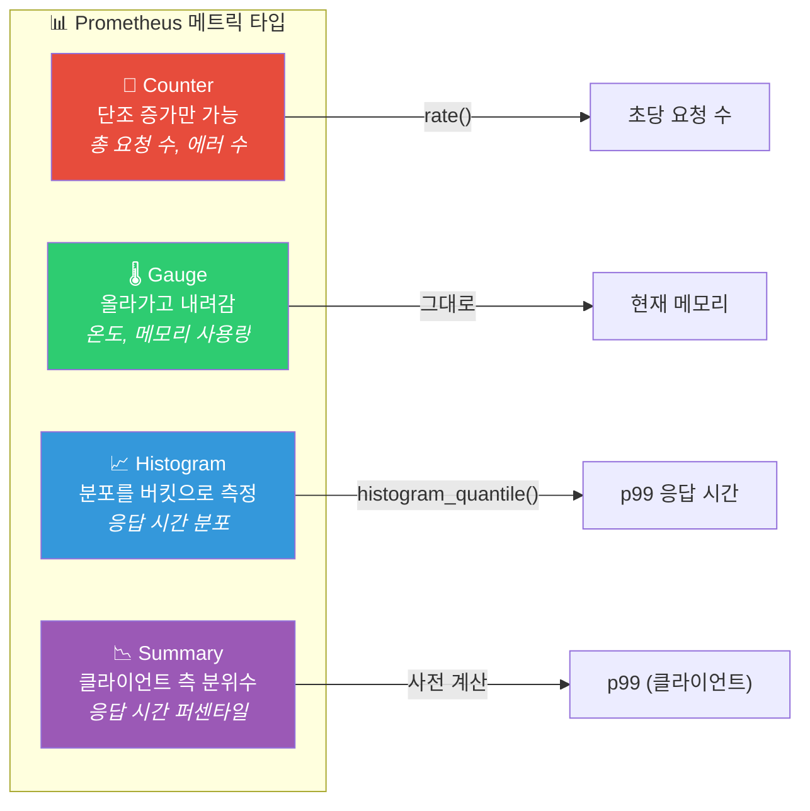
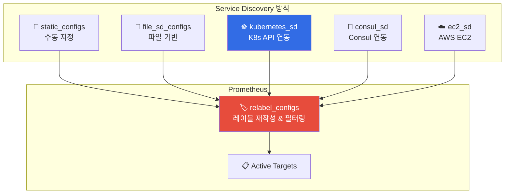
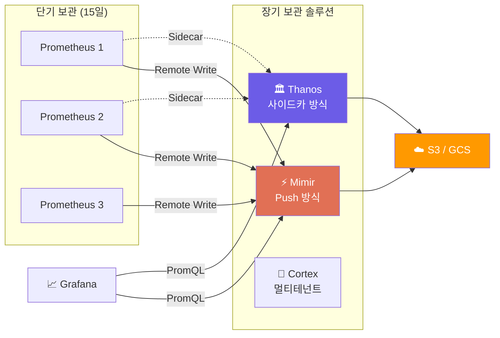

# Prometheus 완전 정복

> Prometheus는 시스템의 "건강검진 센터"예요. 서버, 컨테이너, 애플리케이션의 상태를 주기적으로 측정하고, 이상 징후가 발견되면 즉시 알려줘요. [Observability 개념](./01-concept)에서 배운 세 가지 기둥 중 **메트릭(Metrics)** 영역의 핵심 도구를 깊이 파헤쳐볼게요.

---

## 🎯 왜 Prometheus를 알아야 하나요?

### 일상 비유: 병원의 건강검진 시스템

종합병원의 건강검진 센터를 떠올려보세요.

- 간호사가 **주기적으로 병실을 돌며** 환자 상태를 체크해요 (Pull 모델)
- 체온, 혈압, 심박수 같은 **숫자 데이터**를 기록해요 (메트릭)
- 시간에 따른 변화를 **차트로** 보여줘요 (시계열 데이터)
- 체온이 38도를 넘으면 **즉시 의사에게 알려요** (알림)
- "지난 1시간 동안 평균 혈압은?" 같은 질문에 답할 수 있어요 (PromQL)

**Prometheus가 바로 이 건강검진 시스템이에요.**

```
실무에서 Prometheus가 필요한 순간:

• "서버 CPU 사용량이 점점 올라가고 있는데 언제 터질까?"   → 추세 분석
• "API 응답 시간의 99퍼센타일이 SLA를 지키고 있나?"       → histogram_quantile
• "어제 배포 후 에러율이 올라갔나?"                        → rate() 비교
• "Kubernetes Pod가 OOMKilled 되기 전에 알림을 받고 싶어"  → Alert Rules
• "전체 클러스터의 요청량을 한눈에 보고 싶어"              → Aggregation + Grafana
• "메트릭 쿼리가 너무 느려서 대시보드 로딩이 오래 걸려"    → Recording Rules
```

### Prometheus의 위상



### 왜 다른 도구가 아닌 Prometheus인가?

| 비교 항목 | Prometheus | Datadog | CloudWatch | InfluxDB |
|-----------|-----------|---------|------------|----------|
| **비용** | 무료 (오픈소스) | 호스트당 과금 | AWS 사용량 기반 | Community 무료 |
| **Pull vs Push** | Pull (능동적 수집) | Push (에이전트) | Push (에이전트) | Push |
| **쿼리 언어** | PromQL (강력) | 자체 쿼리 | CloudWatch Insights | InfluxQL/Flux |
| **K8s 통합** | 네이티브 지원 | 좋음 | EKS만 | 별도 설정 |
| **생태계** | CNCF 졸업 | 상용 | AWS 전용 | 독립적 |

---

## 🧠 핵심 개념 잡기

### 1. 시계열 데이터(Time Series Data)

> **비유**: 체중계 기록 — 매일 아침 체중을 재서 기록하면 시간에 따른 변화를 볼 수 있어요.

```
# 시계열 데이터의 구조
메트릭_이름{레이블1="값1", 레이블2="값2"}  값  타임스탬프

# 실제 예시
http_requests_total{method="GET", path="/api/users", status="200"}  1524  @1679000000
http_requests_total{method="GET", path="/api/users", status="200"}  1587  @1679000015
```

### 2. Pull vs Push 모델

> **비유**: 건강검진 vs 119 신고

- **Pull (Prometheus)**: 건강검진처럼 **주기적으로 찾아가서** 상태를 확인해요
- **Push (전통 방식)**: 119 신고처럼 **문제가 생기면 스스로 알려줘요**

### 3. 레이블(Labels)

> **비유**: 도서관의 분류 태그 — 메트릭에 다차원 태그를 붙여서 유연한 질의를 가능하게 해요.

### 4. Exporter

> **비유**: 통역사 — 서버/DB의 상태를 Prometheus가 이해하는 형식으로 변환해줘요.

### 5. PromQL

> **비유**: SQL의 시계열 버전 — "지난 5분간 초당 요청수는?" 같은 질문을 할 수 있어요.

---

## 🔍 하나씩 자세히 알아보기

### 1. Prometheus 아키텍처 완전 분석



#### TSDB 내부 구조

```
data/
├── 01BKGV7JC0RY8A6MACW02A2PJD/    ← Block (2시간 단위)
│   ├── chunks/                      ← 실제 시계열 데이터
│   ├── index                        ← 레이블 인덱스
│   └── meta.json                    ← 블록 메타데이터
├── wal/                             ← Write-Ahead Log (장애 복구용)
└── lock
```

| TSDB 특성 | 설명 |
|-----------|------|
| **압축률** | 샘플당 약 1-2바이트 |
| **블록 단위** | 2시간마다 새 블록 생성 |
| **Compaction** | 오래된 블록 병합 |
| **Retention** | 기본 15일 보관 (설정 가능) |

#### Pull vs Push: 왜 Pull을 선택했나?

| 관점 | Pull (Prometheus) | Push (StatsD, InfluxDB) |
|------|-------------------|------------------------|
| **상태 감지** | scrape 실패로 바로 감지 | 데이터 안 오면 죽은 건지 구분 어려움 |
| **부하 제어** | Prometheus가 속도 제어 | 대상이 마구 보내면 과부하 |
| **디버깅** | `/metrics` 브라우저에서 직접 확인 | 중간 데이터 확인 어려움 |
| **단점** | 방화벽/NAT 뒤는 수집 어려움 | Short-lived job에 적합 |

> 단기 작업(batch job)을 위해 **Pushgateway**를 별도로 제공하지만, 일반 서비스는 Pull이 유리해요.

---

### 2. 메트릭 타입 (Metric Types)



#### Counter (카운터) — 비유: 자동차 주행거리계

```python
from prometheus_client import Counter

http_requests_total = Counter(
    'http_requests_total', 'Total HTTP requests',
    ['method', 'path', 'status']
)

http_requests_total.labels(method='GET', path='/api/users', status='200').inc()
```

```
Counter 규칙:
  ✅ http_requests_total, errors_total   → 누적 증가하는 값
  ❌ temperature_counter, memory_counter → 감소 가능하면 Gauge!
  💡 네이밍: 반드시 _total 접미사
```

#### Gauge (게이지) — 비유: 자동차 속도계

```python
from prometheus_client import Gauge

memory_usage_bytes = Gauge('memory_usage_bytes', 'Memory usage', ['instance'])
memory_usage_bytes.labels(instance='web-01').set(1073741824)  # 올려도 내려도 OK
```

#### Histogram (히스토그램) — 비유: 시험 점수 분포표

```python
from prometheus_client import Histogram

http_duration = Histogram(
    'http_request_duration_seconds', 'Request duration',
    ['method', 'path'],
    buckets=[0.01, 0.05, 0.1, 0.25, 0.5, 1.0, 2.5, 5.0, 10.0]
)

http_duration.labels(method='GET', path='/api/users').observe(0.157)
```

Histogram은 내부적으로 **3가지 시계열**을 자동 생성해요:

```
http_request_duration_seconds_bucket{le="0.1"}   78     ← 100ms 이하: 78개
http_request_duration_seconds_bucket{le="0.5"}   99     ← 500ms 이하: 99개
http_request_duration_seconds_bucket{le="+Inf"}  100    ← 전체: 100개
http_request_duration_seconds_count              100    ← 총 관측 횟수
http_request_duration_seconds_sum                12.3   ← 관측값 합계
```

#### Summary vs Histogram

| 비교 항목 | Histogram | Summary |
|-----------|-----------|---------|
| **분위수 계산** | 서버 사이드 (PromQL) | 클라이언트 사이드 |
| **집계 가능** | 여러 인스턴스 합산 가능 | 합산 불가능 |
| **권장** | 대부분의 경우 | 특수한 경우만 |

> 실무 팁: **거의 항상 Histogram을 쓰세요.** Summary는 분산 시스템에서 합산이 안 돼요.

---

### 3. PromQL 기초부터 심화까지

#### Instant Vector vs Range Vector

```promql
http_requests_total{method="GET"}        # Instant: 최신 값 하나씩
http_requests_total{method="GET"}[5m]    # Range: 최근 5분치 샘플들
```

#### 레이블 매칭

```promql
http_requests_total{method="GET"}                        # 정확히 일치
http_requests_total{method!="GET"}                       # 불일치
http_requests_total{path=~"/api/.*"}                     # 정규식 일치
http_requests_total{method="GET", status=~"5.."}         # 복합 조건
```

#### 핵심 함수들

```promql
# rate() — Counter의 초당 변화율 (Alert에 권장)
rate(http_requests_total[5m])

# irate() — 순간 변화율 (대시보드 스파이크 감지)
irate(http_requests_total[5m])

# increase() — 기간 동안 총 증가량
increase(http_requests_total[1h])         # ≈ rate(x[1h]) * 3600

# histogram_quantile() — 퍼센타일 계산
histogram_quantile(0.99, rate(http_request_duration_seconds_bucket[5m]))

# 서비스별 p99 (le 필수!)
histogram_quantile(0.99,
  sum(rate(http_request_duration_seconds_bucket[5m])) by (le, service)
)
```

#### 집계(Aggregation) 연산자

```promql
sum(rate(http_requests_total[5m]))                          # 전체 초당 요청
sum(rate(http_requests_total[5m])) by (method)              # 메서드별 합계
avg(node_cpu_seconds_total{mode="idle"}) by (instance)      # 인스턴스별 평균
count(up == 1)                                              # 살아있는 대상 수
topk(5, rate(http_requests_total[5m]))                      # 상위 5개
```

#### 실전 PromQL 패턴 모음

```promql
# 에러율 (전체 대비 5xx 비율)
sum(rate(http_requests_total{status=~"5.."}[5m]))
  / sum(rate(http_requests_total[5m]))

# CPU 사용률 (%)
100 - (avg by (instance) (rate(node_cpu_seconds_total{mode="idle"}[5m])) * 100)

# 메모리 사용률 (%)
(1 - node_memory_MemAvailable_bytes / node_memory_MemTotal_bytes) * 100

# 디스크 만료 예측 (24시간 후)
predict_linear(node_filesystem_avail_bytes{mountpoint="/"}[6h], 3600*24)

# 평균 응답 시간
rate(http_request_duration_seconds_sum[5m])
  / rate(http_request_duration_seconds_count[5m])

# Pod Restart 감지
increase(kube_pod_container_status_restarts_total[1h]) > 3
```

---

### 4. Service Discovery (서비스 탐지)



#### kubernetes_sd_configs (가장 많이 사용)

[Kubernetes](../04-kubernetes/01-architecture)에서 가장 핵심이 되는 설정이에요.

```yaml
scrape_configs:
  - job_name: 'kubernetes-pods'
    kubernetes_sd_configs:
      - role: pod    # pod, service, node, endpoints, ingress

    relabel_configs:
      # prometheus.io/scrape: "true" 어노테이션이 있는 Pod만
      - source_labels: [__meta_kubernetes_pod_annotation_prometheus_io_scrape]
        action: keep
        regex: true

      # 커스텀 메트릭 경로
      - source_labels: [__meta_kubernetes_pod_annotation_prometheus_io_path]
        action: replace
        target_label: __metrics_path__
        regex: (.+)

      # 커스텀 포트
      - source_labels: [__address__, __meta_kubernetes_pod_annotation_prometheus_io_port]
        action: replace
        regex: ([^:]+)(?::\d+)?;(\d+)
        replacement: $1:$2
        target_label: __address__

      # 네임스페이스/Pod 이름 레이블
      - source_labels: [__meta_kubernetes_namespace]
        target_label: namespace
      - source_labels: [__meta_kubernetes_pod_name]
        target_label: pod
```

```yaml
# Pod 어노테이션 예시 — 이렇게 표시하면 자동 수집
apiVersion: v1
kind: Pod
metadata:
  annotations:
    prometheus.io/scrape: "true"
    prometheus.io/port: "8080"
    prometheus.io/path: "/metrics"
```

#### file_sd_configs & consul_sd_configs

```yaml
# 파일 기반
- job_name: 'file-targets'
  file_sd_configs:
    - files: ['/etc/prometheus/targets/*.json']
      refresh_interval: 30s
```

```json
[{
  "targets": ["web-01:9100", "web-02:9100"],
  "labels": { "env": "production", "role": "web" }
}]
```

```yaml
# Consul 기반
- job_name: 'consul-services'
  consul_sd_configs:
    - server: 'consul.example.com:8500'
      tags: ['prometheus']
  relabel_configs:
    - source_labels: [__meta_consul_service]
      target_label: service
```

#### relabel_configs 핵심 액션

```yaml
relabel_configs:
  - action: keep      # 조건 맞는 대상만 유지
  - action: drop      # 조건 맞는 대상 제거
  - action: replace   # 레이블 값 변환
  - action: labelmap  # 메타 레이블 → 일반 레이블 매핑
  - action: hashmod   # 여러 Prometheus로 샤딩
```

---

### 5. prometheus.yml 프로덕션 설정

```yaml
global:
  scrape_interval: 15s
  evaluation_interval: 15s
  external_labels:
    cluster: 'production-kr'
    region: 'ap-northeast-2'

rule_files:
  - '/etc/prometheus/rules/alerts/*.yml'
  - '/etc/prometheus/rules/recording/*.yml'

alerting:
  alertmanagers:
    - static_configs:
        - targets: ['alertmanager:9093']

remote_write:
  - url: 'http://mimir:9009/api/v1/push'
    write_relabel_configs:
      - source_labels: [__name__]
        regex: 'go_.*'
        action: drop    # 불필요 메트릭 제외 → 비용 절감

remote_read:
  - url: 'http://mimir:9009/prometheus/api/v1/read'
    read_recent: false

scrape_configs:
  - job_name: 'prometheus'
    static_configs:
      - targets: ['localhost:9090']

  - job_name: 'node-exporter'
    kubernetes_sd_configs:
      - role: pod
    relabel_configs:
      - source_labels: [__meta_kubernetes_pod_label_app]
        action: keep
        regex: node-exporter

  - job_name: 'kube-state-metrics'
    static_configs:
      - targets: ['kube-state-metrics.monitoring:8080']

  - job_name: 'kubernetes-pods'
    kubernetes_sd_configs:
      - role: pod
    relabel_configs:
      - source_labels: [__meta_kubernetes_pod_annotation_prometheus_io_scrape]
        action: keep
        regex: true
      - source_labels: [__meta_kubernetes_namespace]
        target_label: namespace
      - source_labels: [__meta_kubernetes_pod_label_app]
        target_label: app
```

---

### 6. Alert Rules (알림 규칙)

```yaml
# /etc/prometheus/rules/alerts/infrastructure.yml
groups:
  - name: infrastructure-alerts
    rules:
      - alert: InstanceDown
        expr: up == 0
        for: 3m
        labels:
          severity: critical
        annotations:
          summary: "{{ $labels.instance }} 다운 ({{ $labels.job }})"
          runbook_url: "https://wiki.example.com/runbook/instance-down"

      - alert: HighCpuUsage
        expr: 100 - (avg by (instance) (rate(node_cpu_seconds_total{mode="idle"}[5m])) * 100) > 85
        for: 10m
        labels:
          severity: warning
        annotations:
          summary: "{{ $labels.instance }} CPU {{ $value | printf \"%.1f\" }}%"

      - alert: HighMemoryUsage
        expr: (1 - node_memory_MemAvailable_bytes / node_memory_MemTotal_bytes) * 100 > 90
        for: 5m
        labels:
          severity: warning
        annotations:
          summary: "{{ $labels.instance }} 메모리 {{ $value | printf \"%.1f\" }}%"

      - alert: DiskWillFillIn24Hours
        expr: predict_linear(node_filesystem_avail_bytes{mountpoint="/"}[6h], 24*3600) < 0
        for: 30m
        labels:
          severity: critical
        annotations:
          summary: "{{ $labels.instance }} 디스크 24시간 내 포화 예측"
```

```yaml
# /etc/prometheus/rules/alerts/application.yml
groups:
  - name: application-alerts
    rules:
      - alert: HighErrorRate
        expr: >
          sum(rate(http_requests_total{status=~"5.."}[5m])) by (service)
            / sum(rate(http_requests_total[5m])) by (service) > 0.05
        for: 5m
        labels:
          severity: critical
        annotations:
          summary: "{{ $labels.service }} 에러율 {{ $value | printf \"%.2f\" }}%"

      - alert: HighLatencyP99
        expr: >
          histogram_quantile(0.99,
            sum(rate(http_request_duration_seconds_bucket[5m])) by (le, service)
          ) > 1.0
        for: 5m
        labels:
          severity: warning

      - alert: PodCrashLooping
        expr: increase(kube_pod_container_status_restarts_total[1h]) > 5
        for: 10m
        labels:
          severity: critical
        annotations:
          summary: "{{ $labels.namespace }}/{{ $labels.pod }} 1시간 내 {{ $value }}번 재시작"
```

```
Alert 평가 흐름:
  Inactive → expr 충족 → Pending (for 대기) → for 경과 → Firing → Alertmanager 전송
                         ↓ 조건 미충족
                         Inactive 복귀 (알림 안 보냄)
```

---

### 7. Recording Rules (사전 계산 규칙)

> **비유**: 매번 복잡한 엑셀 수식을 치는 대신, 자동 계산 열을 만들어 두는 것

```yaml
# /etc/prometheus/rules/recording/sli.yml
groups:
  - name: sli-recording-rules
    interval: 30s
    rules:
      - record: service:http_requests:rate5m
        expr: sum(rate(http_requests_total[5m])) by (service)

      - record: service:http_errors:ratio_rate5m
        expr: >
          sum(rate(http_requests_total{status=~"5.."}[5m])) by (service)
            / sum(rate(http_requests_total[5m])) by (service)

      - record: service:http_request_duration_seconds:p99_rate5m
        expr: >
          histogram_quantile(0.99,
            sum(rate(http_request_duration_seconds_bucket[5m])) by (le, service))

      - record: node:cpu_utilization:ratio
        expr: 1 - avg by (instance) (rate(node_cpu_seconds_total{mode="idle"}[5m]))

      - record: node:memory_utilization:ratio
        expr: 1 - node_memory_MemAvailable_bytes / node_memory_MemTotal_bytes
```

```
Recording Rules 네이밍: level:metric:operations
  service:http_requests:rate5m       → 서비스 레벨, HTTP 요청, 5분 rate
  node:cpu_utilization:ratio         → 노드 레벨, CPU 사용률, 비율

쓰면 좋은 경우:
  ✅ 대시보드에서 반복 사용하는 복잡한 쿼리
  ✅ Alert Rule의 expr (평가 속도 향상)
  ✅ histogram_quantile() 같은 고비용 연산

Alert에서 Recording Rule 활용:
  - alert: HighErrorRate
    expr: service:http_errors:ratio_rate5m > 0.05   # 훨씬 빠름!
```

---

### 8. Remote Write/Read & 장기 보관

#### Prometheus 로컬 TSDB의 한계

Prometheus의 로컬 TSDB는 단일 노드 스토리지예요. 프로덕션 환경에서는 여러 한계에 부딪혀요.

```
로컬 TSDB 한계:

1. 단일 노드 제한
   • 디스크 용량에 따라 보존 기간이 제한됨 (기본 15일)
   • 서버 장애 시 메트릭 데이터 유실 가능
   • 수직 확장만 가능 (더 큰 디스크, 더 많은 메모리)

2. 글로벌 뷰 불가
   • 여러 Prometheus 인스턴스의 데이터를 합쳐 볼 수 없음
   • 멀티 클러스터/멀티 리전 환경에서 전체 그림을 못 봄
   • "전 세계 서비스의 에러율은?" 같은 쿼리가 불가능

3. 장기 분석 불가
   • 6개월 전 데이터와 비교하고 싶지만 이미 삭제됨
   • 용량 계획(Capacity Planning)에 과거 데이터 필요
   • 규정 준수(Compliance)를 위한 장기 보관 요구사항 충족 불가

언제 원격 스토리지가 필요한가?
  ✅ 여러 Prometheus 인스턴스가 있을 때 (멀티 클러스터)
  ✅ 15일 이상 메트릭을 보관해야 할 때
  ✅ Prometheus 장애 시에도 데이터가 유실되면 안 될 때
  ✅ 글로벌 쿼리 (여러 클러스터의 데이터를 한 번에 조회)가 필요할 때
  ✅ 규정 준수를 위해 1년 이상 보관이 필요할 때
```

#### Remote Write/Read API

Prometheus는 **Remote Write API**와 **Remote Read API**를 통해 외부 스토리지와 연동해요.

```yaml
# prometheus.yml — Remote Write 설정
global:
  scrape_interval: 15s

remote_write:
  - url: "http://mimir:9009/api/v1/push"   # 원격 스토리지로 전송
    queue_config:
      capacity: 10000          # 내부 큐 크기
      max_shards: 30           # 병렬 전송 샤드 수
      max_samples_per_send: 5000  # 배치당 최대 샘플
    write_relabel_configs:
      - source_labels: [__name__]
        regex: "go_.*"          # go_ 메트릭은 전송하지 않음 (비용 절감)
        action: drop

remote_read:
  - url: "http://mimir:9009/prometheus/api/v1/read"
    read_recent: false         # 최근 데이터는 로컬에서, 오래된 것만 원격 조회
```

```
Remote Write 동작 흐름:

  Prometheus                   Remote Storage
  ┌──────────┐                ┌──────────────┐
  │ Scrape   │                │              │
  │   ↓      │                │  Mimir /     │
  │ 로컬 TSDB│──Remote Write──│  Thanos /    │──→ S3/GCS
  │   ↓      │  (HTTP POST)  │  Cortex      │   (장기 보관)
  │ PromQL   │                │              │
  └──────────┘                └──────────────┘

  • Remote Write: Prometheus가 수집한 샘플을 실시간으로 원격 전송
  • Remote Read: PromQL 쿼리 시 로컬에 없는 데이터를 원격에서 가져옴
  • WAL 기반: 네트워크 장애 시 WAL에 버퍼링 후 재전송
```

#### Grafana Mimir: 대규모 메트릭 스토리지

Grafana Mimir는 Cortex의 후속 프로젝트로, **대규모 Prometheus 호환 장기 스토리지**예요.

```
Mimir 핵심 특징:
  • Prometheus Remote Write API 호환
  • 수평 확장: 수십억 개의 활성 시계열 처리 가능
  • 네이티브 멀티테넌트: 팀/서비스별 데이터 격리
  • S3/GCS/Azure Blob에 장기 보관
  • PromQL 100% 호환
  • 간단한 구성: 단일 바이너리 모드로 시작 가능
```

```yaml
# Docker Compose로 Mimir 시작하기
services:
  mimir:
    image: grafana/mimir:latest
    command: ["-config.file=/etc/mimir/mimir.yaml"]
    ports:
      - "9009:9009"
    volumes:
      - ./mimir.yaml:/etc/mimir/mimir.yaml

# mimir.yaml 최소 설정
# multitenancy_enabled: false
# blocks_storage:
#   backend: s3
#   s3:
#     endpoint: s3.amazonaws.com
#     bucket_name: my-mimir-data
#     region: ap-northeast-2
# compactor:
#   data_dir: /tmp/mimir/compactor
# store_gateway:
#   sharding_ring:
#     replication_factor: 1
```

#### Thanos: 글로벌 쿼리 + 장기 보존

Thanos는 기존 Prometheus에 **사이드카를 붙이는 방식**으로, 기존 환경을 최소한으로 변경하면서 장기 보관과 글로벌 쿼리를 추가해요.

```
Thanos 핵심 구성 요소:

  Sidecar     — Prometheus 옆에 붙어서 데이터를 오브젝트 스토리지로 업로드
  Store GW    — 오브젝트 스토리지의 과거 데이터를 쿼리
  Querier     — 여러 Prometheus + Store GW의 데이터를 통합 쿼리
  Compactor   — 오브젝트 스토리지의 블록을 압축/다운샘플링
  Ruler       — 글로벌 Alert/Recording Rules 실행

장점: 기존 Prometheus를 그대로 유지하면서 확장
단점: 구성 요소가 많아 운영 복잡도 증가
```

#### Cortex vs Mimir vs Thanos 비교표



| 비교 항목 | Thanos | Mimir | Cortex |
|-----------|--------|-------|--------|
| **방식** | Sidecar + Store Gateway | Remote Write | Remote Write |
| **글로벌 뷰** | Querier가 통합 | 자체 글로벌 뷰 | 자체 글로벌 뷰 |
| **난이도** | 중간 | 낮음~중간 | 높음 |
| **멀티테넌트** | 제한적 | 네이티브 | 네이티브 |
| **기존 환경 변경** | 최소 (사이드카만 추가) | Prometheus에 remote_write 설정 추가 | Prometheus에 remote_write 설정 추가 |
| **백엔드 스토리지** | S3, GCS, Azure Blob | S3, GCS, Azure Blob | S3, GCS, Azure Blob, DynamoDB |
| **다운샘플링** | 자동 (5분, 1시간) | 없음 (원본 보관) | 없음 |
| **개발 주체** | Improbable → CNCF Incubating | Grafana Labs | WeaveWorks → CNCF |
| **추세** | 안정적, 대규모 채택 | 빠르게 성장, Cortex 후속 | Mimir로 이동 중 |

```
어떤 걸 선택할까?

  기존 Prometheus를 최소한으로 변경하고 싶다면  → Thanos
  새로 구축하거나 Grafana 생태계를 쓴다면       → Mimir
  이미 Cortex를 쓰고 있다면                    → Mimir로 마이그레이션 검토

  공통: 오브젝트 스토리지(S3/GCS)가 필수이고,
        PromQL 100% 호환으로 기존 대시보드/알람을 그대로 사용 가능
```

---

## 💻 직접 해보기

### 실습 1: Docker Compose로 Prometheus 스택 띄우기

```yaml
# docker-compose.yml
version: '3.8'
services:
  prometheus:
    image: prom/prometheus:v2.51.0
    ports: ["9090:9090"]
    volumes:
      - ./prometheus/prometheus.yml:/etc/prometheus/prometheus.yml
      - ./prometheus/rules/:/etc/prometheus/rules/
      - prometheus-data:/prometheus
    command:
      - '--config.file=/etc/prometheus/prometheus.yml'
      - '--storage.tsdb.retention.time=15d'
      - '--web.enable-lifecycle'

  node-exporter:
    image: prom/node-exporter:v1.8.0
    ports: ["9100:9100"]

  alertmanager:
    image: prom/alertmanager:v0.27.0
    ports: ["9093:9093"]
    volumes:
      - ./alertmanager/alertmanager.yml:/etc/alertmanager/alertmanager.yml

  grafana:
    image: grafana/grafana:11.0.0
    ports: ["3000:3000"]
    environment:
      - GF_SECURITY_ADMIN_PASSWORD=admin

volumes:
  prometheus-data:
```

```bash
docker-compose up -d

# Prometheus UI: http://localhost:9090
# Targets: http://localhost:9090/targets
# Grafana: http://localhost:3000 (admin/admin)
```

### 실습 2: PromQL 단계별 연습

```promql
# 1단계: 기본
up                                                    # 대상 상태 (1=정상)
node_memory_MemAvailable_bytes                        # 가용 메모리

# 2단계: 계산
node_memory_MemAvailable_bytes / node_memory_MemTotal_bytes * 100

# 3단계: rate
rate(prometheus_http_requests_total[5m])              # 초당 요청 수

# 4단계: 집계
sum(rate(prometheus_http_requests_total[5m])) by (handler)

# 5단계: 예측
predict_linear(node_filesystem_avail_bytes{mountpoint="/"}[1h], 3600*24)
```

### 실습 3: Flask 앱에 메트릭 추가

```python
from flask import Flask, request
from prometheus_client import Counter, Histogram, Gauge, generate_latest, CONTENT_TYPE_LATEST
import time

app = Flask(__name__)

REQUEST_COUNT = Counter('app_http_requests_total', 'Total requests', ['method', 'endpoint', 'status'])
REQUEST_DURATION = Histogram('app_http_request_duration_seconds', 'Duration',
    ['method', 'endpoint'], buckets=[0.01, 0.05, 0.1, 0.25, 0.5, 1.0, 2.5, 5.0])
ACTIVE_REQUESTS = Gauge('app_active_requests', 'Active requests')

@app.before_request
def before():
    request.start_time = time.time()
    ACTIVE_REQUESTS.inc()

@app.after_request
def after(response):
    REQUEST_COUNT.labels(request.method, request.path, response.status_code).inc()
    REQUEST_DURATION.labels(request.method, request.path).observe(time.time() - request.start_time)
    ACTIVE_REQUESTS.dec()
    return response

@app.route('/metrics')
def metrics():
    return generate_latest(), 200, {'Content-Type': CONTENT_TYPE_LATEST}

@app.route('/api/users')
def get_users():
    return {'users': ['alice', 'bob']}
```

### 실습 4: Rule 검증

```bash
# Rule 문법 검증
docker exec prometheus promtool check rules /etc/prometheus/rules/alerts.yml

# 설정 파일 검증
docker exec prometheus promtool check config /etc/prometheus/prometheus.yml

# 설정 리로드
curl -X POST http://localhost:9090/-/reload
```

---

## 🏢 실무에서는?

### Prometheus Operator & ServiceMonitor

실무 K8s 환경에서는 prometheus.yml을 직접 수정하지 않아요. [Prometheus Operator](../04-kubernetes/17-operator-crd)가 CRD로 관리해요.

```yaml
# ServiceMonitor — Service 자동 탐지
apiVersion: monitoring.coreos.com/v1
kind: ServiceMonitor
metadata:
  name: my-api-monitor
  labels:
    release: prometheus
spec:
  selector:
    matchLabels:
      app: my-api
  namespaceSelector:
    matchNames: [production]
  endpoints:
    - port: http-metrics
      interval: 15s
      metricRelabelings:
        - sourceLabels: [__name__]
          regex: 'go_.*'
          action: drop
```

```yaml
# PrometheusRule — Alert/Recording Rule CRD
apiVersion: monitoring.coreos.com/v1
kind: PrometheusRule
metadata:
  name: my-api-alerts
  labels:
    release: prometheus
spec:
  groups:
    - name: my-api.rules
      rules:
        - alert: MyAPIHighLatency
          expr: >
            histogram_quantile(0.99,
              sum(rate(app_http_request_duration_seconds_bucket{service="my-api"}[5m])) by (le)
            ) > 1.0
          for: 5m
          labels: { severity: warning, team: backend }
```

### 카디널리티(Cardinality) 관리 — 가장 중요한 실무 이슈

```
❌ 나쁜 예: 레이블에 고유 ID
   http_requests_total{user_id="abc123", request_id="req-xyz"}
   → 시계열 무한 폭발!

✅ 좋은 예: 낮은 카디널리티 레이블만
   http_requests_total{method="GET", status="200", service="api"}
   → method 4 x status 5 x service 10 = 200개 (관리 가능)

카디널리티 점검 PromQL:
   topk(10, count by (__name__)({__name__=~".+"}))
   prometheus_tsdb_head_series

규모별 권장: 소규모 10만, 중규모 50만, 대규모 200만 이하
```

### Alertmanager 고급 설정

```yaml
# 알림 억제: critical이면 같은 대상의 warning 억제
inhibit_rules:
  - source_matchers: [severity = critical]
    target_matchers: [severity = warning]
    equal: ['alertname', 'instance']

route:
  group_by: ['alertname', 'cluster', 'service']
  routes:
    - match: { severity: critical }
      receiver: 'pagerduty-critical'
      continue: true
    - match: { team: backend }
      receiver: 'slack-backend'
```

### 프로덕션 체크리스트

```
□ HA: Prometheus 2대+, Alertmanager 3대 클러스터
□ 스토리지: PV(SSD), retention 설정, Remote Write 장기 보관
□ 보안: TLS, Auth, Network Policy, RBAC
□ 성능: 카디널리티 모니터링, Recording Rules, metric_relabel drop
□ 알림: for 절 필수, severity 체계, Runbook URL, Watchdog alert
```

---

## ⚠️ 자주 하는 실수

### 실수 1: Counter를 rate() 없이 사용

```promql
# ❌ 누적값이라 의미 없음
http_requests_total
# ✅ 초당 변화율로 변환
rate(http_requests_total[5m])
```

### 실수 2: rate() 범위가 scrape_interval보다 작음

```promql
# ❌ scrape_interval 15s인데 range도 15s → 샘플 부족
rate(http_requests_total[15s])
# ✅ scrape_interval의 4배 이상
rate(http_requests_total[1m])
```

### 실수 3: 레이블에 고카디널리티 값

```python
# ❌ user_id는 수백만 고유값 → 시계열 폭발
REQUEST_COUNT.labels(user_id='abc-123')
# ✅ 낮은 카디널리티만
REQUEST_COUNT.labels(method='GET', status='200')
```

### 실수 4: 경로 레이블 정규화 안 함

```python
# ❌ /api/users/12345 → 무한 시계열
REQUEST_COUNT.labels(path=request.path)
# ✅ 패턴으로 정규화
import re
REQUEST_COUNT.labels(path=re.sub(r'/\d+', '/:id', request.path))
```

### 실수 5: Alert에 for 절 누락

```yaml
# ❌ 순간 스파이크에도 알림 → Alert Fatigue
- alert: HighCpu
  expr: cpu > 80
# ✅ 10분 지속 시에만
- alert: HighCpu
  expr: cpu > 80
  for: 10m
```

### 실수 6: histogram_quantile에서 by(le) 누락

```promql
# ❌ le 빠지면 의미 없는 결과
histogram_quantile(0.99, sum(rate(bucket[5m])) by (service))
# ✅ le 필수 포함
histogram_quantile(0.99, sum(rate(bucket[5m])) by (le, service))
```

### 실수 7: Prometheus 자체 모니터링 안 함

```yaml
# Watchdog: 항상 firing이어야 함. 안 오면 Prometheus가 죽은 것!
- alert: Watchdog
  expr: vector(1)
  labels: { severity: none }
```

### 실수 8: Remote Write 비용 폭탄

```yaml
# ❌ 모든 메트릭 전송
remote_write:
  - url: http://mimir:9009/api/v1/push
# ✅ write_relabel_configs로 필터링
    write_relabel_configs:
      - source_labels: [__name__]
        regex: 'go_.*|process_.*'
        action: drop
```

---

## 📝 마무리

### 핵심 정리

```
1. 아키텍처: Pull 기반 수집 → TSDB 저장 → Service Discovery 자동 탐지
2. 메트릭 타입: Counter(rate), Gauge(그대로), Histogram(quantile), Summary(비권장)
3. PromQL 필수: rate(), histogram_quantile(), sum() by(), predict_linear()
4. 운영 핵심: 카디널리티 관리, Recording Rules, Alert for 절, Remote Write 필터링
```

### 실력 체크리스트

```
Level 1 (입문):
  □ Pull 모델 설명, Counter vs Gauge, 기본 PromQL, Docker Compose 실행

Level 2 (중급):
  □ 4가지 메트릭 타입, histogram_quantile, k8s_sd, Alert/Recording Rules

Level 3 (고급):
  □ 카디널리티 최적화, relabel_configs, Thanos/Mimir, Operator + ServiceMonitor
```

---

## 🔗 다음 단계

| 추천 학습 경로 | 설명 |
|---------------|------|
| [Grafana 시각화](./03-grafana) | Prometheus 메트릭을 대시보드로 만들기 |
| [K8s 헬스체크](../04-kubernetes/08-healthcheck) | Liveness/Readiness 프로브와 메트릭 연계 |
| [K8s Operator](../04-kubernetes/17-operator-crd) | Prometheus Operator CRD 기반 관리 |
| [K8s Autoscaling](../04-kubernetes/10-autoscaling) | 커스텀 메트릭 기반 HPA |

### 추가 학습 자료

```
공식 문서:
  - https://prometheus.io/docs/
  - https://prometheus.io/docs/prometheus/latest/querying/
  - https://prometheus.io/docs/alerting/latest/alertmanager/

추천 Exporter:
  - node_exporter (서버), blackbox_exporter (외부 엔드포인트)
  - mysqld_exporter, redis_exporter, postgres_exporter

장기 보관: Thanos, Grafana Mimir, VictoriaMetrics
```
