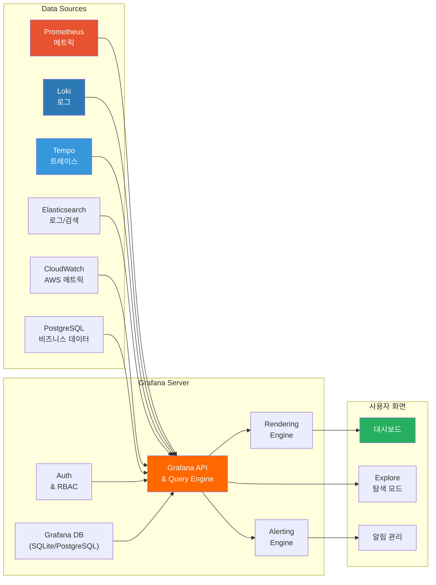
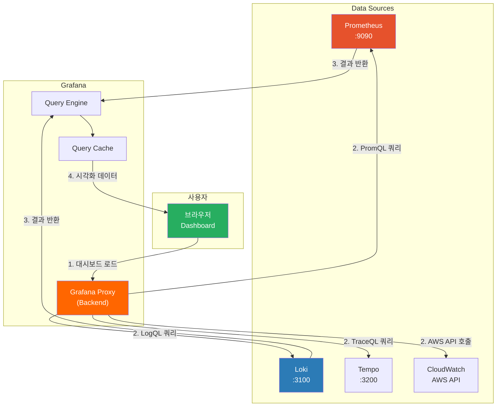
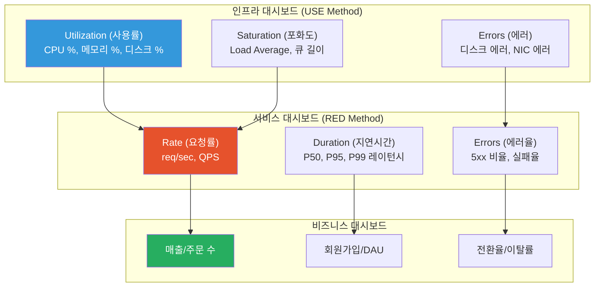
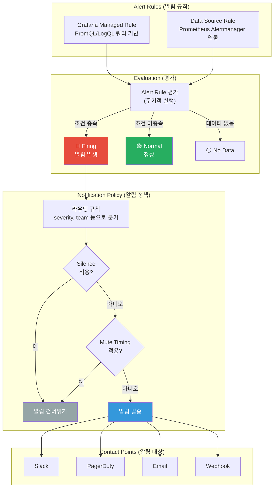
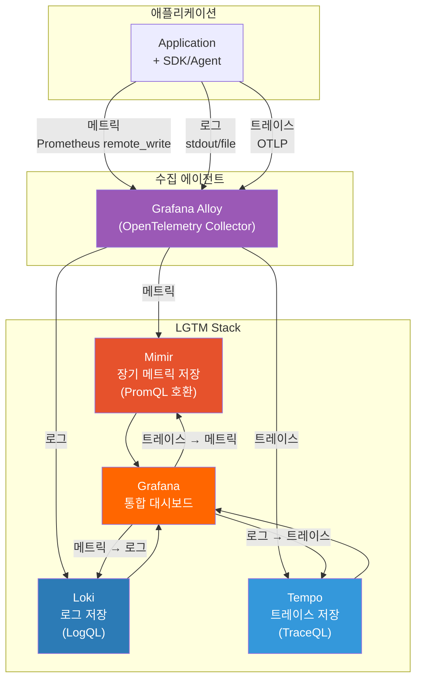

# Grafana 대시보드

> 메트릭을 수집하는 것만으로는 부족해요. **수집한 데이터를 한눈에 볼 수 있어야** 장애를 빠르게 감지하고, 시스템의 건강 상태를 실시간으로 파악할 수 있어요. Grafana는 Prometheus, Loki, Elasticsearch 등 다양한 데이터 소스를 **하나의 화면에서 시각화**해주는 오픈소스 대시보드 도구예요. [Prometheus](./02-prometheus)에서 메트릭 수집을 배웠으니, 이제 그 데이터를 예쁘고 유용하게 보여주는 방법을 알아볼 차례예요.

---

## 🎯 왜 Grafana를 알아야 하나요?

### 일상 비유: 자동차 계기판

자동차를 운전할 때를 떠올려보세요. 속도계, RPM 게이지, 연료 잔량, 엔진 온도 — 이 모든 정보가 운전석 앞 **계기판 하나**에 모여 있어요.

- 속도계를 보면 → 지금 얼마나 빨리 가는지 알 수 있어요
- 연료 게이지가 빨간색이면 → 곧 주유해야 해요
- 엔진 온도가 올라가면 → 차를 세워야 해요
- RPM이 레드존에 들어가면 → 기어를 올려야 해요

만약 이 정보들이 계기판 없이 엔진룸을 열어봐야만 알 수 있다면? 운전이 불가능하겠죠.

**Grafana는 서버 인프라의 계기판이에요.**

```
실무에서 Grafana가 필요한 순간:

• Prometheus에서 메트릭을 수집하고 있지만 PromQL로만 확인    → 시각화 필요
• 장애 발생 시 어디서 문제인지 여러 도구를 돌아다니며 확인     → 단일 대시보드 필요
• "CPU가 몇 %야?" 물어볼 때마다 터미널을 열어야 함          → 실시간 모니터링 필요
• 온콜 엔지니어가 새벽에 장애 알림을 받았는데 원인 파악이 느림  → 알림 + 대시보드 연동 필요
• 개발팀, 인프라팀, 경영진이 각각 다른 관점의 데이터를 원함    → 맞춤형 대시보드 필요
• 대시보드를 수동으로 만들어서 환경마다 재설정              → Dashboard as Code 필요
```

### 모니터링 없는 팀 vs Grafana 있는 팀

```mermaid
flowchart TD
    subgraph "❌ 모니터링 없는 팀"
        ALERT_X["장애 발생!<br/>고객 문의 접수"] -->|"30분 후"| LOGIN["서버 SSH 접속"]
        LOGIN --> CMD1["top, htop, df 명령어"]
        CMD1 --> CMD2["로그 파일 grep"]
        CMD2 --> CMD3["다른 서버도 확인..."]
        CMD3 -->|"2시간 후"| FOUND_X["원인 파악 완료"]
        FOUND_X --> FIX_X["수동 조치"]
    end

    subgraph "✅ Grafana 있는 팀"
        ALERT_OK["장애 알림!<br/>Grafana Alert 수신"] -->|"즉시"| DASH["대시보드 확인<br/>CPU/메모리/에러율"]
        DASH -->|"5분"| FOUND_OK["원인 파악 완료<br/>특정 Pod 메모리 폭증"]
        FOUND_OK --> FIX_OK["즉시 조치<br/>Pod 재시작 + 스케일링"]
    end

    style ALERT_X fill:#e74c3c,color:#fff
    style FOUND_X fill:#e67e22,color:#fff
    style ALERT_OK fill:#f39c12,color:#fff
    style FIX_OK fill:#27ae60,color:#fff
    style DASH fill:#3498db,color:#fff
```



### 장애 대응 시간 비교

```
장애 감지부터 복구까지 소요 시간 (MTTR):

모니터링 없음     ████████████████████████████████████████████████  120분+
CLI 도구만       ████████████████████████████████                  60분
Prometheus만     ████████████████████                              40분
Grafana 대시보드  ████████████                                      15분
Grafana + Alert  ████                                              5~10분

→ Grafana를 도입하면 장애 대응 시간이 80% 이상 단축돼요
```

---

## 🧠 핵심 개념 잡기

### 1. Grafana란?

> **비유**: 다양한 계기들을 한 곳에 모아놓은 계기판 프레임

Grafana 자체는 데이터를 저장하지 않아요. 대신 **다양한 데이터 소스에 연결해서 시각화**하는 역할을 해요. Prometheus, Loki, Elasticsearch, CloudWatch, MySQL 등 수십 가지 데이터 소스를 하나의 대시보드에서 볼 수 있어요.

```
Grafana의 핵심 역할:

1. 데이터 시각화   → 메트릭, 로그, 트레이스를 그래프/테이블로 표시
2. 대시보드 구성   → 여러 패널을 조합해 맞춤형 화면 구성
3. 알림 발송      → 조건 기반 알림 (Slack, PagerDuty, Email 등)
4. 데이터 탐색    → Explore 모드로 즉석 쿼리 & 디버깅
5. 접근 제어      → 팀별, 역할별 대시보드 권한 관리
```

### 2. Grafana 아키텍처



### 3. 핵심 구성 요소 한눈에 보기

```
Grafana 구성 요소:

┌─────────────────────────────────────────────────────────────┐
│                     Dashboard (대시보드)                       │
│  ┌──────────────┐  ┌──────────────┐  ┌──────────────┐       │
│  │   Panel 1    │  │   Panel 2    │  │   Panel 3    │       │
│  │  Time Series │  │    Stat      │  │    Gauge     │       │
│  │  (CPU 사용률)  │  │ (요청 수)    │  │ (메모리 %)   │       │
│  └──────┬───────┘  └──────┬───────┘  └──────┬───────┘       │
│         │                 │                 │               │
│  ┌──────▼───────────────────────────────────▼───────┐       │
│  │              Data Source (데이터 소스)              │       │
│  │  Prometheus │ Loki │ Elasticsearch │ CloudWatch   │       │
│  └──────────────────────────────────────────────────┘       │
│                                                             │
│  ┌──────────────────────────────────────────────────┐       │
│  │          Variables (템플릿 변수)                    │       │
│  │  $namespace │ $pod │ $instance │ $interval        │       │
│  └──────────────────────────────────────────────────┘       │
│                                                             │
│  ┌──────────────────────────────────────────────────┐       │
│  │          Alerting (알림)                           │       │
│  │  Alert Rule → Contact Point → Notification Policy │       │
│  └──────────────────────────────────────────────────┘       │
└─────────────────────────────────────────────────────────────┘
```

### 4. Data Source 종류

```
주요 Data Source별 용도:

데이터 소스          저장하는 데이터      대표 쿼리 언어      용도
────────────────────────────────────────────────────────────────
Prometheus          시계열 메트릭       PromQL            인프라/앱 메트릭
Loki                로그              LogQL             로그 집계/검색
Tempo               분산 트레이스       TraceQL           요청 추적
Mimir               장기 메트릭 저장    PromQL            Prometheus 장기 보관
Elasticsearch       로그/검색          Lucene/KQL        전문 검색/로그
CloudWatch          AWS 메트릭/로그    CloudWatch 쿼리    AWS 서비스 모니터링
PostgreSQL/MySQL    비즈니스 데이터     SQL               비즈니스 지표
InfluxDB            시계열 데이터       Flux/InfluxQL      IoT/시계열 특화
Jaeger              분산 트레이스       -                 트레이스 뷰어
```

### 5. Panel Types 종류

```
패널 타입별 용도:

패널 타입        적합한 데이터                사용 예시
──────────────────────────────────────────────────────────
Time Series     시간에 따라 변하는 값          CPU 사용률, 요청 수, 레이턴시
Stat            하나의 핵심 숫자              현재 활성 사용자 수, 에러율
Gauge           0~100% 범위의 값             메모리 사용률, 디스크 사용률
Bar Gauge       여러 항목의 비교              Pod별 CPU 사용률 비교
Table           다열 데이터                  Top 10 느린 쿼리, 인스턴스 목록
Heatmap         밀도/분포 데이터              요청 레이턴시 분포, 시간대별 에러
Logs            로그 텍스트                  애플리케이션 로그 실시간 뷰
Bar Chart       카테고리별 비교              서비스별 에러 수, 환경별 배포 수
Pie Chart       비율/구성                   트래픽 소스 비율, 에러 유형 분포
State Timeline  상태 변화 추적               서비스 up/down 이력
Geomap          위치 기반 데이터              리전별 트래픽, CDN 노드 상태
Node Graph      관계/토폴로지               서비스 의존성 맵
```

---

## 🔍 하나씩 자세히 알아보기

### 1. Grafana 설치와 기본 설정

#### Docker Compose로 Grafana + Prometheus 환경 구축

```yaml
# docker-compose.yml
version: '3.8'

services:
  # ── Prometheus (메트릭 수집) ──
  prometheus:
    image: prom/prometheus:v2.51.0
    container_name: prometheus
    ports:
      - "9090:9090"
    volumes:
      - ./prometheus/prometheus.yml:/etc/prometheus/prometheus.yml
      - prometheus_data:/prometheus
    command:
      - '--config.file=/etc/prometheus/prometheus.yml'
      - '--storage.tsdb.retention.time=15d'
      - '--web.enable-lifecycle'
    restart: unless-stopped

  # ── Grafana (시각화) ──
  grafana:
    image: grafana/grafana:10.4.0
    container_name: grafana
    ports:
      - "3000:3000"
    environment:
      # 관리자 계정 설정
      - GF_SECURITY_ADMIN_USER=admin
      - GF_SECURITY_ADMIN_PASSWORD=admin123
      # 익명 접근 비활성화
      - GF_AUTH_ANONYMOUS_ENABLED=false
      # 서버 설정
      - GF_SERVER_ROOT_URL=http://localhost:3000
    volumes:
      - grafana_data:/var/lib/grafana
      - ./grafana/provisioning:/etc/grafana/provisioning
    depends_on:
      - prometheus
    restart: unless-stopped

  # ── Node Exporter (호스트 메트릭) ──
  node-exporter:
    image: prom/node-exporter:v1.7.0
    container_name: node-exporter
    ports:
      - "9100:9100"
    restart: unless-stopped

volumes:
  prometheus_data:
  grafana_data:
```

```yaml
# prometheus/prometheus.yml
global:
  scrape_interval: 15s
  evaluation_interval: 15s

scrape_configs:
  - job_name: 'prometheus'
    static_configs:
      - targets: ['localhost:9090']

  - job_name: 'node-exporter'
    static_configs:
      - targets: ['node-exporter:9100']

  - job_name: 'grafana'
    static_configs:
      - targets: ['grafana:3000']
```

```bash
# 환경 시작
docker compose up -d

# Grafana 접속: http://localhost:3000
# 기본 계정: admin / admin123
```

#### Grafana 설정 파일 구조

```
grafana 설정 우선순위 (높은 순):

1. 환경 변수          GF_SECURITY_ADMIN_USER=admin
2. 명령줄 인수         --config=/etc/grafana/grafana.ini
3. grafana.ini 파일   /etc/grafana/grafana.ini
4. 기본값             Grafana 내장 기본 설정

→ Docker에서는 환경 변수로 설정하는 것이 가장 편해요
→ 프로덕션에서는 grafana.ini + 환경 변수를 조합해서 사용해요
```

```ini
# /etc/grafana/grafana.ini (주요 설정)
[server]
http_port = 3000
root_url = https://grafana.mycompany.com
serve_from_sub_path = false

[database]
# 프로덕션에서는 SQLite 대신 PostgreSQL 사용 권장
type = postgres
host = postgres:5432
name = grafana
user = grafana
password = ${GF_DATABASE_PASSWORD}

[security]
admin_user = admin
admin_password = ${GF_SECURITY_ADMIN_PASSWORD}
# 쿠키 보안 설정
cookie_secure = true
cookie_samesite = lax

[auth]
# OAuth 설정 (예: Google)
[auth.google]
enabled = true
client_id = ${GF_AUTH_GOOGLE_CLIENT_ID}
client_secret = ${GF_AUTH_GOOGLE_CLIENT_SECRET}
allowed_domains = mycompany.com

[alerting]
enabled = true

[unified_alerting]
enabled = true
```

---

### 2. Data Source 설정

#### Prometheus Data Source

```yaml
# grafana/provisioning/datasources/datasources.yml
# Provisioning으로 자동 설정 (수동 UI 설정 불필요)
apiVersion: 1

datasources:
  # ── Prometheus ──
  - name: Prometheus
    type: prometheus
    access: proxy          # Grafana 서버가 대신 요청 (보안상 proxy 권장)
    url: http://prometheus:9090
    isDefault: true        # 기본 데이터 소스로 설정
    jsonData:
      httpMethod: POST     # 긴 쿼리 지원
      timeInterval: '15s'  # scrape interval과 맞추기
      exemplarTraceIdDestinations:
        - name: traceID
          datasourceUid: tempo    # 트레이스 연동
    editable: false        # UI에서 수정 불가 (코드로만 관리)

  # ── Loki (로그) ──
  - name: Loki
    type: loki
    access: proxy
    url: http://loki:3100
    jsonData:
      maxLines: 1000
      derivedFields:
        - datasourceUid: tempo
          matcherRegex: '"traceId":"(\w+)"'
          name: TraceID
          url: '$${__value.raw}'    # 로그에서 트레이스로 연결
    editable: false

  # ── Tempo (트레이스) ──
  - name: Tempo
    type: tempo
    access: proxy
    url: http://tempo:3200
    jsonData:
      tracesToLogsV2:
        datasourceUid: loki
        filterByTraceID: true
      tracesToMetrics:
        datasourceUid: prometheus
    editable: false

  # ── CloudWatch (AWS) ──
  - name: CloudWatch
    type: cloudwatch
    access: proxy
    jsonData:
      authType: keys
      defaultRegion: ap-northeast-2
    secureJsonData:
      accessKey: ${AWS_ACCESS_KEY_ID}
      secretKey: ${AWS_SECRET_ACCESS_KEY}
    editable: false

  # ── Elasticsearch ──
  - name: Elasticsearch
    type: elasticsearch
    access: proxy
    url: http://elasticsearch:9200
    jsonData:
      index: "logs-*"
      timeField: "@timestamp"
      esVersion: "8.0.0"
      logMessageField: message
      logLevelField: level
    editable: false
```

#### Data Source 연결 흐름



> **access: proxy vs direct**
> - `proxy` (권장): Grafana 서버가 데이터 소스에 대신 요청해요. 브라우저에서 직접 접근하지 않으므로 보안에 좋아요.
> - `direct`: 브라우저가 직접 데이터 소스에 요청해요. CORS 설정이 필요하고, 인증 정보가 브라우저에 노출될 수 있어요.

---

### 3. Panel Types 상세

#### Time Series (시계열 그래프)

가장 많이 사용하는 패널이에요. 시간에 따른 메트릭 변화를 선 그래프로 보여줘요.

```json
// Time Series 패널 설정 예시 (JSON Model)
{
  "title": "CPU 사용률",
  "type": "timeseries",
  "datasource": {
    "type": "prometheus",
    "uid": "prometheus"
  },
  "targets": [
    {
      "expr": "100 - (avg by(instance) (rate(node_cpu_seconds_total{mode=\"idle\"}[5m])) * 100)",
      "legendFormat": "{{instance}}",
      "refId": "A"
    }
  ],
  "fieldConfig": {
    "defaults": {
      "color": {
        "mode": "palette-classic"
      },
      "custom": {
        "lineWidth": 2,
        "fillOpacity": 10,
        "gradientMode": "scheme",
        "axisLabel": "CPU %",
        "drawStyle": "line",
        "showPoints": "auto",
        "thresholdsStyle": {
          "mode": "area"
        }
      },
      "thresholds": {
        "steps": [
          { "color": "green", "value": null },
          { "color": "yellow", "value": 70 },
          { "color": "red", "value": 90 }
        ]
      },
      "unit": "percent",
      "min": 0,
      "max": 100
    }
  }
}
```

```
Time Series 패널 활용 팁:

1. 여러 쿼리를 한 패널에 겹쳐서 비교
   → 쿼리 A: CPU 사용률, 쿼리 B: CPU 제한(limit)
   → 실제 사용량과 한계치를 함께 볼 수 있어요

2. Override로 특정 시리즈만 스타일 변경
   → CPU limit은 점선(dashed)으로, 실제 사용량은 실선으로

3. Threshold로 경고/위험 구간 시각화
   → 70% 이상 노란색, 90% 이상 빨간색 배경

4. Stack 옵션으로 누적 그래프 가능
   → 여러 서비스의 트래픽을 쌓아서 전체 합계 확인
```

#### Stat (단일 수치)

하나의 핵심 숫자를 크게 표시하는 패널이에요.

```
Stat 패널 사용 예시:

쿼리: sum(rate(http_requests_total[5m]))
표시: "1,234 req/s"     ← 현재 초당 요청 수를 크게 표시

쿼리: count(up == 1)
표시: "47 / 50"         ← 정상 인스턴스 수 / 전체 인스턴스 수

쿼리: avg(http_request_duration_seconds{quantile="0.99"})
표시: "234 ms"          ← P99 응답 시간

→ Color mode를 "Background"로 설정하면 값에 따라 배경색이 바뀌어요
→ 정상: 초록, 주의: 노랑, 위험: 빨강
```

#### Gauge (게이지)

자동차 연료 게이지처럼 0~100% 범위의 값을 표시해요.

```
Gauge 패널 사용 예시:

쿼리: (node_filesystem_avail_bytes / node_filesystem_size_bytes) * 100
표시: 디스크 남은 공간 67% (게이지 바)

Threshold 설정:
  0~30%   → 빨강 (위험! 디스크 거의 가득 참)
  30~60%  → 노랑 (주의 필요)
  60~100% → 초록 (정상)

→ min/max를 꼭 설정해야 게이지가 의미 있어요
→ "Show threshold markers"를 켜면 경계선이 표시돼요
```

#### Table (테이블)

여러 열의 데이터를 표 형태로 보여줘요. 정렬, 필터링이 가능해요.

```
Table 패널 사용 예시:

쿼리: topk(10, sum by(handler) (rate(http_requests_total[5m])))

표시:
┌────────────────────┬──────────┬──────────┬──────────┐
│ Handler            │ Rate     │ Error %  │ P99 (ms) │
├────────────────────┼──────────┼──────────┼──────────┤
│ /api/users         │ 523/s    │ 0.1%     │ 45       │
│ /api/orders        │ 312/s    │ 0.3%     │ 120      │
│ /api/products      │ 287/s    │ 0.0%     │ 35       │
│ /api/search        │ 156/s    │ 1.2%     │ 890      │
│ /api/auth/login    │ 98/s     │ 2.1%     │ 230      │
└────────────────────┴──────────┴──────────┴──────────┘

→ Column width, Cell display mode 설정으로 가독성 향상
→ "Color background" 옵션으로 에러율 높은 행 강조 가능
→ Transform으로 여러 쿼리 결과를 하나의 테이블로 합칠 수 있어요
```

#### Heatmap (히트맵)

데이터의 밀도와 분포를 색상으로 보여줘요. 히스토그램 메트릭에 특히 유용해요.

```
Heatmap 패널 사용 예시:

쿼리: sum(increase(http_request_duration_seconds_bucket[5m])) by (le)
→ Prometheus 히스토그램 버킷 데이터

표시:
    0.01s  ░░░░░░░░░░█████████░░░░░░
    0.05s  ░░░░░░████████████████░░░░
    0.1s   ░░░░████████░░░░████████░░
    0.5s   ░░██░░░░░░░░░░░░░░░░██░░░
    1.0s   ░█░░░░░░░░░░░░░░░░░░░█░░░
           00:00    06:00    12:00    18:00

진한 색 = 해당 구간에 요청이 많음
연한 색 = 해당 구간에 요청이 적음

→ 대부분의 요청이 50~100ms에 집중되어 있고,
  오후 3시쯤 500ms~1s 구간이 진해진 것 = 느려진 구간!
```

#### Logs (로그 패널)

Loki, Elasticsearch 등의 로그를 실시간으로 표시해요.

```
Logs 패널 사용 예시:

Data Source: Loki
쿼리: {namespace="production", app="api-server"} |= "error"

표시:
2024-03-15 14:32:01  [ERROR]  Failed to connect to database: timeout
2024-03-15 14:32:05  [ERROR]  Request failed: 500 Internal Server Error
2024-03-15 14:32:12  [ERROR]  Connection pool exhausted

→ 로그 레벨별 색상 표시 (ERROR=빨강, WARN=노랑, INFO=파랑)
→ 검색 하이라이트 기능으로 키워드 강조
→ Time Series 패널과 같은 대시보드에 두면, 메트릭 스파이크 시점의 로그를 바로 확인
```

---

### 4. Dashboard 설계 베스트 프랙티스

#### USE/RED Method 기반 대시보드 구성



#### 대시보드 레이아웃 원칙

```
대시보드 설계 원칙 — "5초 규칙":

1. 핵심 지표는 맨 위에 (Stat/Gauge)
   → 대시보드를 열었을 때 5초 안에 "정상/비정상" 판단 가능해야 해요
   → Row 1: ✅ 정상 서비스 수, ❌ 에러율, ⏱️ P99 레이턴시, 📈 RPS

2. 시계열 그래프는 중간에 (Time Series)
   → "지금은 괜찮은데, 추세가 어때?" 확인하는 구간
   → Row 2-3: CPU, 메모리, 네트워크, 요청 수 추이

3. 상세 데이터는 아래에 (Table/Logs)
   → "구체적으로 어디가 문제야?" 확인하는 구간
   → Row 4-5: Top N 느린 쿼리, 에러 로그, Pod 상태 목록

4. 관련 패널은 Row로 그룹화
   → "Application", "Infrastructure", "Database" 등 접을 수 있는 Row 사용
   → 평소엔 접어두고, 필요할 때만 펼치기

5. 한 화면에 너무 많은 패널 X
   → 패널이 20개 넘으면 로딩이 느려지고 가독성도 떨어져요
   → 용도별로 대시보드를 분리하세요
```

#### 대시보드 JSON 구조

```json
{
  "dashboard": {
    "title": "Production Overview",
    "uid": "prod-overview",
    "tags": ["production", "overview"],
    "timezone": "Asia/Seoul",
    "refresh": "30s",
    "time": {
      "from": "now-1h",
      "to": "now"
    },
    "templating": {
      "list": [
        {
          "name": "namespace",
          "type": "query",
          "datasource": "Prometheus",
          "query": "label_values(kube_pod_info, namespace)",
          "refresh": 2,
          "multi": true,
          "includeAll": true
        }
      ]
    },
    "panels": [
      {
        "title": "Service Health",
        "type": "stat",
        "gridPos": { "h": 4, "w": 6, "x": 0, "y": 0 },
        "targets": [
          {
            "expr": "count(up{namespace=~\"$namespace\"} == 1)",
            "legendFormat": "Healthy"
          }
        ]
      }
    ],
    "rows": [
      { "title": "Overview", "collapsed": false },
      { "title": "Application Metrics", "collapsed": false },
      { "title": "Infrastructure", "collapsed": true },
      { "title": "Logs", "collapsed": true }
    ]
  }
}
```

---

### 5. Template Variables (템플릿 변수)

Template Variables는 대시보드를 재사용 가능하게 만들어주는 핵심 기능이에요. 하나의 대시보드로 여러 환경, 여러 서비스를 볼 수 있어요.

#### 변수 타입

```
변수 타입별 용도:

타입          설명                    사용 예시
──────────────────────────────────────────────────────────────
Query        데이터 소스에서 값 조회    label_values(up, instance)
Custom       직접 값 목록 정의         production, staging, development
Constant     고정값 (숨겨진 변수)      클러스터 이름, 리전
Interval     시간 간격                1m, 5m, 15m, 1h
Datasource   데이터 소스 선택          여러 Prometheus 인스턴스 전환
TextBox      사용자 입력 텍스트        검색 키워드 입력
Ad-hoc       자동 레이블 필터          모든 레이블을 드롭다운으로 자동 생성
```

#### 변수 설정 예시

```yaml
# Provisioning으로 변수 포함 대시보드 설정
# 실무에서 가장 많이 쓰는 변수 패턴

# 1. Namespace 변수 (Kubernetes 환경)
- name: namespace
  type: query
  datasource: Prometheus
  query: "label_values(kube_pod_info, namespace)"
  refresh: 2                    # 대시보드 로드 시 + 시간 변경 시 갱신
  multi: true                   # 여러 값 동시 선택 가능
  includeAll: true              # "All" 옵션 포함
  allValue: ".*"                # All 선택 시 정규식
  sort: 1                       # 알파벳 순 정렬

# 2. Pod 변수 (namespace에 의존)
- name: pod
  type: query
  datasource: Prometheus
  query: "label_values(kube_pod_info{namespace=~\"$namespace\"}, pod)"
  refresh: 2
  multi: true
  includeAll: true

# 3. Interval 변수 (그래프 해상도 조절)
- name: interval
  type: interval
  query: "1m,5m,15m,30m,1h"
  current: "5m"
  auto: true                    # 시간 범위에 따라 자동 조정
  auto_count: 30                # 데이터 포인트 약 30개 유지
  auto_min: "1m"                # 최소 간격

# 4. Environment 변수 (Custom)
- name: env
  type: custom
  query: "production,staging,development"
  current: "production"
```

#### 변수를 쿼리에서 사용하기

```
PromQL에서 변수 사용 패턴:

# 단일 선택 변수
rate(http_requests_total{namespace="$namespace"}[5m])

# 다중 선택 변수 (정규식 매칭)
rate(http_requests_total{namespace=~"$namespace"}[5m])
→ namespace가 여러 개 선택되면 "prod|staging" 형태로 치환돼요

# Interval 변수 (rate 함수와 함께)
rate(http_requests_total{namespace=~"$namespace"}[$__rate_interval])
→ $__rate_interval은 Grafana가 자동 계산하는 최적 interval

# 변수끼리 연결 (Chained Variables)
namespace → pod → container
→ namespace를 선택하면 그 안의 pod만 보이고,
  pod를 선택하면 그 안의 container만 보이게 설정할 수 있어요

# 내장 변수
$__interval      → 자동 계산된 시간 간격
$__rate_interval → rate() 함수에 최적화된 간격
$__range         → 선택된 시간 범위
$__from / $__to  → 시작/끝 타임스탬프
$__name          → 시리즈 이름
```

---

### 6. Grafana Unified Alerting

Grafana 9 이후부터 **Unified Alerting**이 도입되어, Grafana 하나로 모든 알림을 관리할 수 있어요.

#### 알림 아키텍처



#### Alert Rule 설정

```yaml
# grafana/provisioning/alerting/alerts.yml
apiVersion: 1

groups:
  - orgId: 1
    name: infrastructure-alerts
    folder: Infrastructure
    interval: 1m                # 1분마다 평가

    rules:
      # ── CPU 사용률 알림 ──
      - uid: cpu-high
        title: "High CPU Usage"
        condition: C             # refId C의 조건 사용
        data:
          # A: CPU 사용률 쿼리
          - refId: A
            datasourceUid: prometheus
            model:
              expr: >
                100 - (avg by(instance)
                (rate(node_cpu_seconds_total{mode="idle"}[5m])) * 100)
              instant: false
              range: true

          # B: 5분 평균으로 smoothing
          - refId: B
            datasourceUid: "-100"    # Expression
            model:
              type: reduce
              expression: A
              reducer: mean

          # C: 임계값 조건
          - refId: C
            datasourceUid: "-100"
            model:
              type: threshold
              expression: B
              conditions:
                - evaluator:
                    params: [80]     # 80% 이상이면 발동
                    type: gt

        for: 5m                  # 5분 동안 지속되어야 알림 발생
        noDataState: OK          # 데이터 없으면 정상으로 처리
        execErrState: Alerting   # 실행 에러 시 알림 발생

        labels:
          severity: warning
          team: infrastructure

        annotations:
          summary: "CPU usage is above 80% on {{ $labels.instance }}"
          description: >
            CPU usage has been above 80% for more than 5 minutes.
            Current value: {{ $values.B.Value | printf "%.1f" }}%
          runbook_url: "https://wiki.mycompany.com/runbooks/high-cpu"

      # ── 디스크 사용률 알림 ──
      - uid: disk-high
        title: "Disk Space Running Low"
        condition: C
        data:
          - refId: A
            datasourceUid: prometheus
            model:
              expr: >
                100 - ((node_filesystem_avail_bytes{mountpoint="/"}
                / node_filesystem_size_bytes{mountpoint="/"}) * 100)
          - refId: B
            datasourceUid: "-100"
            model:
              type: reduce
              expression: A
              reducer: last
          - refId: C
            datasourceUid: "-100"
            model:
              type: threshold
              expression: B
              conditions:
                - evaluator:
                    params: [85]
                    type: gt
        for: 10m
        labels:
          severity: critical
          team: infrastructure
        annotations:
          summary: "Disk usage above 85% on {{ $labels.instance }}"

      # ── 서비스 다운 알림 ──
      - uid: service-down
        title: "Service Down"
        condition: C
        data:
          - refId: A
            datasourceUid: prometheus
            model:
              expr: "up == 0"
          - refId: B
            datasourceUid: "-100"
            model:
              type: reduce
              expression: A
              reducer: last
          - refId: C
            datasourceUid: "-100"
            model:
              type: threshold
              expression: B
              conditions:
                - evaluator:
                    params: [1]
                    type: gt
        for: 1m
        labels:
          severity: critical
          team: platform
```

#### Contact Point & Notification Policy

```yaml
# grafana/provisioning/alerting/contactpoints.yml
apiVersion: 1

contactPoints:
  - orgId: 1
    name: slack-infra
    receivers:
      - uid: slack-infra-receiver
        type: slack
        settings:
          url: "${SLACK_WEBHOOK_URL}"
          recipient: "#infra-alerts"
          title: |
            {{ .Status | title }} {{ if eq .Status "firing" }}🔴{{ else }}🟢{{ end }}
          text: |
            {{ range .Alerts }}
            *Alert:* {{ .Labels.alertname }}
            *Severity:* {{ .Labels.severity }}
            *Summary:* {{ .Annotations.summary }}
            *Description:* {{ .Annotations.description }}
            {{ if .Annotations.runbook_url }}*Runbook:* {{ .Annotations.runbook_url }}{{ end }}
            {{ end }}

  - orgId: 1
    name: pagerduty-critical
    receivers:
      - uid: pagerduty-receiver
        type: pagerduty
        settings:
          integrationKey: "${PAGERDUTY_INTEGRATION_KEY}"
          severity: "{{ .Labels.severity }}"

  - orgId: 1
    name: email-team
    receivers:
      - uid: email-receiver
        type: email
        settings:
          addresses: "team@mycompany.com"
          singleEmail: true

# grafana/provisioning/alerting/policies.yml
apiVersion: 1

policies:
  - orgId: 1
    receiver: slack-infra            # 기본 수신자
    group_by: ['alertname', 'team']  # 그룹핑 기준
    group_wait: 30s                  # 첫 알림 대기 시간
    group_interval: 5m               # 그룹 알림 반복 간격
    repeat_interval: 4h              # 동일 알림 재전송 간격

    routes:
      # severity=critical → PagerDuty
      - receiver: pagerduty-critical
        matchers:
          - severity = critical
        group_wait: 10s              # 긴급 알림은 빠르게
        repeat_interval: 1h

      # team=backend → 백엔드 팀 Slack
      - receiver: slack-backend
        matchers:
          - team = backend

      # 나머지 → 기본 slack-infra로 전달
```

---

### 7. Dashboard as Code

대시보드를 수동으로 UI에서 만들면 환경마다 다시 만들어야 하고, 변경 이력 추적도 어려워요. **코드로 관리하면** Git으로 버전 관리하고, CI/CD로 자동 배포할 수 있어요.

#### 방법 1: Grafana Provisioning (YAML)

가장 기본적인 방법이에요. 대시보드 JSON 파일을 특정 디렉토리에 두면 Grafana가 자동으로 로드해요.

```yaml
# grafana/provisioning/dashboards/dashboards.yml
apiVersion: 1

providers:
  - name: 'default'
    orgId: 1
    folder: 'Provisioned'        # Grafana에서 표시될 폴더명
    type: file
    disableDeletion: true         # UI에서 삭제 불가
    updateIntervalSeconds: 30     # 30초마다 파일 변경 확인
    allowUiUpdates: false         # UI에서 수정 불가 (코드로만 관리)
    options:
      path: /etc/grafana/provisioning/dashboards/json
      foldersFromFilesStructure: true  # 파일 시스템 폴더 구조를 그대로 반영
```

```
Provisioning 디렉토리 구조:

grafana/provisioning/
├── dashboards/
│   ├── dashboards.yml              # 대시보드 프로바이더 설정
│   └── json/
│       ├── infrastructure/
│       │   ├── node-overview.json    # 노드 모니터링 대시보드
│       │   └── disk-usage.json       # 디스크 사용량 대시보드
│       ├── application/
│       │   ├── api-overview.json     # API 서비스 대시보드
│       │   └── error-tracking.json   # 에러 추적 대시보드
│       └── business/
│           └── kpi-dashboard.json    # 비즈니스 KPI 대시보드
├── datasources/
│   └── datasources.yml             # 데이터 소스 설정
└── alerting/
    ├── alerts.yml                  # 알림 규칙
    ├── contactpoints.yml           # 알림 대상
    └── policies.yml                # 알림 정책
```

#### 방법 2: Grafonnet (Jsonnet)

Jsonnet 라이브러리를 사용해 프로그래밍 방식으로 대시보드를 생성해요. 반복되는 패턴을 함수로 추상화할 수 있어서 대규모 환경에 적합해요.

```jsonnet
// dashboards/api-overview.jsonnet
local grafana = import 'grafonnet/grafana.libsonnet';
local dashboard = grafana.dashboard;
local row = grafana.row;
local prometheus = grafana.prometheus;
local graphPanel = grafana.graphPanel;
local statPanel = grafana.statPanel;
local template = grafana.template;

// ── 변수 정의 ──
local namespaceVar = template.new(
  name='namespace',
  datasource='Prometheus',
  query='label_values(kube_pod_info, namespace)',
  refresh='time',
  multi=true,
  includeAll=true,
);

local serviceVar = template.new(
  name='service',
  datasource='Prometheus',
  query='label_values(http_requests_total{namespace=~"$namespace"}, service)',
  refresh='time',
  multi=true,
  includeAll=true,
);

// ── 재사용 가능한 패널 함수 ──
local ratePanel(title, expr, legendFormat='{{instance}}') =
  graphPanel.new(
    title=title,
    datasource='Prometheus',
    format='reqps',
    fill=1,
    linewidth=2,
  ).addTarget(
    prometheus.target(
      expr=expr,
      legendFormat=legendFormat,
    )
  );

local errorRatePanel(title, totalExpr, errorExpr) =
  graphPanel.new(
    title=title,
    datasource='Prometheus',
    format='percentunit',
    fill=1,
    linewidth=2,
    thresholds=[
      { value: 0.01, colorMode: 'warning', op: 'gt', fill: true },
      { value: 0.05, colorMode: 'critical', op: 'gt', fill: true },
    ],
  ).addTarget(
    prometheus.target(
      expr='(%s) / (%s)' % [errorExpr, totalExpr],
      legendFormat='Error Rate',
    )
  );

local latencyPanel(title, expr) =
  graphPanel.new(
    title=title,
    datasource='Prometheus',
    format='s',
    fill=1,
    linewidth=2,
  ).addTargets([
    prometheus.target(
      expr='histogram_quantile(0.50, %s)' % expr,
      legendFormat='P50',
    ),
    prometheus.target(
      expr='histogram_quantile(0.95, %s)' % expr,
      legendFormat='P95',
    ),
    prometheus.target(
      expr='histogram_quantile(0.99, %s)' % expr,
      legendFormat='P99',
    ),
  ]);

// ── 대시보드 조합 ──
dashboard.new(
  title='API Service Overview',
  uid='api-overview',
  tags=['api', 'service', 'red'],
  timezone='Asia/Seoul',
  refresh='30s',
  time_from='now-1h',
)
.addTemplate(namespaceVar)
.addTemplate(serviceVar)

// Row 1: 핵심 지표 (Stat 패널)
.addRow(
  row.new(title='Key Metrics')
)
.addPanel(
  statPanel.new(
    title='Request Rate',
    datasource='Prometheus',
  ).addTarget(
    prometheus.target(
      'sum(rate(http_requests_total{namespace=~"$namespace", service=~"$service"}[5m]))',
    )
  ),
  gridPos={ h: 4, w: 6, x: 0, y: 0 }
)

// Row 2: RED Metrics
.addRow(
  row.new(title='RED Metrics')
)
.addPanel(
  ratePanel(
    'Request Rate',
    'sum(rate(http_requests_total{namespace=~"$namespace", service=~"$service"}[5m])) by (service)',
    '{{service}}'
  ),
  gridPos={ h: 8, w: 8, x: 0, y: 4 }
)
.addPanel(
  errorRatePanel(
    'Error Rate',
    'sum(rate(http_requests_total{namespace=~"$namespace", service=~"$service"}[5m]))',
    'sum(rate(http_requests_total{namespace=~"$namespace", service=~"$service", status=~"5.."}[5m]))'
  ),
  gridPos={ h: 8, w: 8, x: 8, y: 4 }
)
.addPanel(
  latencyPanel(
    'Request Latency',
    'sum(rate(http_request_duration_seconds_bucket{namespace=~"$namespace", service=~"$service"}[5m])) by (le)'
  ),
  gridPos={ h: 8, w: 8, x: 16, y: 4 }
)
```

```bash
# Grafonnet으로 대시보드 JSON 생성
# 1. Jsonnet 설치
brew install jsonnet          # macOS
apt-get install jsonnet       # Ubuntu

# 2. Grafonnet 라이브러리 설치
jb init
jb install github.com/grafana/grafonnet-lib/grafonnet

# 3. JSON 생성
jsonnet -J vendor dashboards/api-overview.jsonnet > output/api-overview.json

# 4. Grafana에 배포 (API 사용)
curl -X POST http://localhost:3000/api/dashboards/db \
  -H "Content-Type: application/json" \
  -H "Authorization: Bearer ${GRAFANA_API_KEY}" \
  -d @output/api-overview.json
```

#### 방법 3: Terraform (Grafana Provider)

인프라 전체를 Terraform으로 관리하는 환경이라면, 대시보드도 Terraform으로 관리할 수 있어요.

```hcl
# terraform/grafana.tf

terraform {
  required_providers {
    grafana = {
      source  = "grafana/grafana"
      version = "~> 2.0"
    }
  }
}

provider "grafana" {
  url  = "https://grafana.mycompany.com"
  auth = var.grafana_api_key
}

# ── Data Source ──
resource "grafana_data_source" "prometheus" {
  type = "prometheus"
  name = "Prometheus"
  url  = "http://prometheus:9090"

  json_data_encoded = jsonencode({
    httpMethod   = "POST"
    timeInterval = "15s"
  })

  is_default = true
}

resource "grafana_data_source" "loki" {
  type = "loki"
  name = "Loki"
  url  = "http://loki:3100"
}

# ── 폴더 ──
resource "grafana_folder" "infrastructure" {
  title = "Infrastructure"
}

resource "grafana_folder" "application" {
  title = "Application"
}

# ── 대시보드 (JSON 파일 참조) ──
resource "grafana_dashboard" "node_overview" {
  folder      = grafana_folder.infrastructure.id
  config_json = file("${path.module}/dashboards/node-overview.json")

  overwrite = true
}

resource "grafana_dashboard" "api_overview" {
  folder      = grafana_folder.application.id
  config_json = file("${path.module}/dashboards/api-overview.json")

  overwrite = true
}

# ── 알림 Contact Point ──
resource "grafana_contact_point" "slack" {
  name = "slack-alerts"

  slack {
    url       = var.slack_webhook_url
    recipient = "#alerts"
    title     = "{{ .Status | title }} Alert"
    text      = <<-EOT
      {{ range .Alerts }}
      *{{ .Labels.alertname }}*
      {{ .Annotations.summary }}
      {{ end }}
    EOT
  }
}

# ── 알림 정책 ──
resource "grafana_notification_policy" "default" {
  contact_point   = grafana_contact_point.slack.name
  group_by        = ["alertname", "team"]
  group_wait      = "30s"
  group_interval  = "5m"
  repeat_interval = "4h"

  policy {
    contact_point = grafana_contact_point.slack.name
    matcher {
      label = "severity"
      match = "="
      value = "critical"
    }
    group_wait      = "10s"
    repeat_interval = "1h"
  }
}

# ── Alert Rule ──
resource "grafana_rule_group" "infra_alerts" {
  name             = "infrastructure-alerts"
  folder_uid       = grafana_folder.infrastructure.uid
  interval_seconds = 60

  rule {
    name      = "High CPU Usage"
    condition = "C"
    for       = "5m"

    data {
      ref_id         = "A"
      datasource_uid = grafana_data_source.prometheus.uid

      relative_time_range {
        from = 600
        to   = 0
      }

      model = jsonencode({
        expr    = "100 - (avg by(instance) (rate(node_cpu_seconds_total{mode=\"idle\"}[5m])) * 100)"
        instant = false
        range   = true
      })
    }

    data {
      ref_id         = "B"
      datasource_uid = "-100"

      relative_time_range {
        from = 0
        to   = 0
      }

      model = jsonencode({
        type       = "reduce"
        expression = "A"
        reducer    = "mean"
      })
    }

    data {
      ref_id         = "C"
      datasource_uid = "-100"

      relative_time_range {
        from = 0
        to   = 0
      }

      model = jsonencode({
        type       = "threshold"
        expression = "B"
        conditions = [{
          evaluator = {
            params = [80]
            type   = "gt"
          }
        }]
      })
    }

    labels = {
      severity = "warning"
      team     = "infrastructure"
    }

    annotations = {
      summary = "CPU usage above 80% on {{ $labels.instance }}"
    }
  }
}
```

```bash
# Terraform으로 Grafana 리소스 관리
terraform init
terraform plan
terraform apply

# → Data Source, Dashboard, Alert Rule 모두 코드로 관리!
# → Git에 커밋하면 변경 이력 추적 가능
# → CI/CD로 자동 배포 가능
```

---

### 8. Grafana LGTM Stack

Grafana Labs가 제공하는 **완전한 Observability 스택**이에요. LGTM은 **Loki + Grafana + Tempo + Mimir**의 약자예요.

```
LGTM Stack 구성:

L — Loki      로그 수집 & 저장     (경량 로그 시스템, LogQL)
G — Grafana   시각화 & 대시보드     (통합 UI)
T — Tempo     분산 트레이스 저장    (경량 트레이스, TraceQL)
M — Mimir     장기 메트릭 저장     (Prometheus 호환, 고가용성)

이전 구성:                     LGTM 구성:
Prometheus + Thanos           → Mimir (장기 메트릭)
ELK Stack                    → Loki (로그)
Jaeger                       → Tempo (트레이스)
각자 UI                      → Grafana (통합 대시보드)
```



#### LGTM Stack Docker Compose

```yaml
# docker-compose-lgtm.yml
version: '3.8'

services:
  # ── Grafana Alloy (수집 에이전트) ──
  alloy:
    image: grafana/alloy:v1.0.0
    container_name: alloy
    ports:
      - "12345:12345"    # Alloy UI
      - "4317:4317"      # OTLP gRPC
      - "4318:4318"      # OTLP HTTP
    volumes:
      - ./alloy/config.alloy:/etc/alloy/config.alloy
    command:
      - run
      - /etc/alloy/config.alloy
      - --server.http.listen-addr=0.0.0.0:12345

  # ── Mimir (메트릭) ──
  mimir:
    image: grafana/mimir:2.12.0
    container_name: mimir
    ports:
      - "9009:9009"
    volumes:
      - ./mimir/mimir.yml:/etc/mimir/mimir.yml
      - mimir_data:/data
    command:
      - -config.file=/etc/mimir/mimir.yml

  # ── Loki (로그) ──
  loki:
    image: grafana/loki:2.9.6
    container_name: loki
    ports:
      - "3100:3100"
    volumes:
      - ./loki/loki.yml:/etc/loki/loki.yml
      - loki_data:/data
    command:
      - -config.file=/etc/loki/loki.yml

  # ── Tempo (트레이스) ──
  tempo:
    image: grafana/tempo:2.4.1
    container_name: tempo
    ports:
      - "3200:3200"      # Tempo API
      - "9095:9095"      # Tempo gRPC
    volumes:
      - ./tempo/tempo.yml:/etc/tempo/tempo.yml
      - tempo_data:/data
    command:
      - -config.file=/etc/tempo/tempo.yml

  # ── Grafana ──
  grafana:
    image: grafana/grafana:10.4.0
    container_name: grafana
    ports:
      - "3000:3000"
    environment:
      - GF_SECURITY_ADMIN_PASSWORD=admin123
      - GF_FEATURE_TOGGLES_ENABLE=traceQLStreaming,metricsSummary
    volumes:
      - ./grafana/provisioning:/etc/grafana/provisioning
      - grafana_data:/var/lib/grafana
    depends_on:
      - mimir
      - loki
      - tempo

volumes:
  mimir_data:
  loki_data:
  tempo_data:
  grafana_data:
```

#### 시그널 간 연결 (Correlations)

LGTM 스택의 가장 큰 장점은 **메트릭, 로그, 트레이스를 서로 연결**할 수 있다는 거예요.

```
시그널 간 연결 시나리오:

1. 에러율 스파이크 발견 (Mimir/Grafana 대시보드)
   ↓ "이 시간대 로그를 보자" 클릭
2. 에러 로그 확인 (Loki)
   → "Connection timeout to payment-service"
   ↓ "이 요청의 트레이스를 보자" (traceID 링크 클릭)
3. 분산 트레이스 확인 (Tempo)
   → api-gateway → user-service → payment-service (❌ timeout)
   → payment-service의 DB 쿼리가 10초 걸림
   ↓ "payment-service 메트릭을 보자" 클릭
4. DB 메트릭 확인 (Mimir)
   → DB 커넥션 풀 고갈, 슬로우 쿼리 급증

→ 하나의 Grafana UI에서 메트릭 → 로그 → 트레이스 → 메트릭으로 이동!
→ 장애 원인을 빠르게 추적할 수 있어요
```

---

## 💻 직접 해보기

### 실습 1: Grafana + Prometheus 환경 구축 및 기본 대시보드 만들기

```bash
# 1. 프로젝트 디렉토리 생성
mkdir grafana-lab && cd grafana-lab

# 2. 디렉토리 구조 생성
mkdir -p prometheus
mkdir -p grafana/provisioning/datasources
mkdir -p grafana/provisioning/dashboards/json
```

```yaml
# docker-compose.yml
version: '3.8'

services:
  prometheus:
    image: prom/prometheus:v2.51.0
    ports:
      - "9090:9090"
    volumes:
      - ./prometheus/prometheus.yml:/etc/prometheus/prometheus.yml

  node-exporter:
    image: prom/node-exporter:v1.7.0
    ports:
      - "9100:9100"

  grafana:
    image: grafana/grafana:10.4.0
    ports:
      - "3000:3000"
    environment:
      - GF_SECURITY_ADMIN_PASSWORD=admin123
    volumes:
      - ./grafana/provisioning:/etc/grafana/provisioning
    depends_on:
      - prometheus
```

```yaml
# prometheus/prometheus.yml
global:
  scrape_interval: 15s

scrape_configs:
  - job_name: 'prometheus'
    static_configs:
      - targets: ['localhost:9090']

  - job_name: 'node-exporter'
    static_configs:
      - targets: ['node-exporter:9100']
```

```yaml
# grafana/provisioning/datasources/datasources.yml
apiVersion: 1

datasources:
  - name: Prometheus
    type: prometheus
    access: proxy
    url: http://prometheus:9090
    isDefault: true
    editable: false
```

```bash
# 3. 환경 시작
docker compose up -d

# 4. Grafana 접속
# 브라우저에서 http://localhost:3000 접속
# 로그인: admin / admin123

# 5. 확인 사항
# - 좌측 메뉴 → Connections → Data sources → Prometheus가 보이면 성공!
# - Explore 메뉴에서 PromQL 쿼리 테스트:
#   up
#   node_cpu_seconds_total
```

```
실습 1에서 할 일:

1. Grafana에 로그인해요
2. 좌측 메뉴 → Dashboards → New Dashboard 클릭
3. "Add visualization" 클릭
4. Data source로 "Prometheus" 선택
5. 아래 쿼리들을 입력하면서 각 패널 타입을 테스트해보세요:

[Time Series 패널]
쿼리: rate(node_cpu_seconds_total{mode="idle"}[5m])
→ CPU idle 비율의 시계열 그래프

[Stat 패널]
쿼리: count(up == 1)
→ 정상 인스턴스 수

[Gauge 패널]
쿼리: (1 - (node_filesystem_avail_bytes{mountpoint="/"} / node_filesystem_size_bytes{mountpoint="/"})) * 100
→ 디스크 사용률 (%) 게이지

[Table 패널]
쿼리: node_uname_info
Format: Table
→ 노드 정보 테이블
```

---

### 실습 2: Template Variables로 동적 대시보드 만들기

```
실습 순서:

1. Dashboard Settings (⚙️ 아이콘) → Variables → New variable

2. 변수 1: job
   - Name: job
   - Type: Query
   - Data source: Prometheus
   - Query: label_values(up, job)
   - Multi-value: ✅
   - Include All: ✅
   → Preview of values: "prometheus", "node-exporter" 확인

3. 변수 2: instance (job에 의존)
   - Name: instance
   - Type: Query
   - Data source: Prometheus
   - Query: label_values(up{job=~"$job"}, instance)
   - Multi-value: ✅
   - Include All: ✅
   → job을 바꾸면 instance 목록도 바뀌는 것 확인!

4. 패널에서 변수 사용:
   쿼리: rate(node_cpu_seconds_total{job=~"$job", instance=~"$instance"}[5m])
   → 드롭다운에서 job, instance를 바꾸면 그래프가 동적으로 변해요!
```

---

### 실습 3: Alert Rule 설정하기

```
실습 순서:

1. 좌측 메뉴 → Alerting → Alert rules → New alert rule

2. Rule 설정:
   - Name: High CPU Usage Test
   - Type: Grafana managed alert

3. Query 설정:
   - A (Query):
     Data source: Prometheus
     PromQL: 100 - (avg(rate(node_cpu_seconds_total{mode="idle"}[5m])) * 100)

   - B (Reduce):
     Input: A
     Function: Last
     Mode: Strict

   - C (Threshold):
     Input: B
     Is above: 5    (테스트를 위해 낮은 값으로 설정)

4. Alert evaluation:
   - Folder: 새 폴더 "Test Alerts" 생성
   - Evaluation group: 새 그룹 "test-group" 생성
   - Evaluate every: 1m
   - For: 0s (테스트용, 실무에서는 5m 이상)

5. Labels:
   - severity: warning
   - team: test

6. Annotations:
   - summary: CPU usage is high: {{ $values.B }}%

7. Save → 1분 후 Alert 상태 확인
   → Alerting → Alert rules에서 "Firing" 상태 확인!

8. Contact Point 설정 (선택):
   - Alerting → Contact points → New
   - 이름: test-webhook
   - Type: Webhook
   - URL: https://webhook.site (무료 웹훅 테스트 서비스)
   → 알림이 실제로 전송되는지 확인!
```

---

### 실습 4: Dashboard를 JSON으로 내보내고 Provisioning하기

```bash
# 1. 만든 대시보드를 JSON으로 내보내기
#    Dashboard → Share (공유) → Export → Save to file
#    → dashboard.json 다운로드

# 2. Provisioning 디렉토리에 저장
cp dashboard.json grafana/provisioning/dashboards/json/my-dashboard.json

# 3. Provisioning 설정 추가
```

```yaml
# grafana/provisioning/dashboards/dashboards.yml
apiVersion: 1

providers:
  - name: 'default'
    orgId: 1
    folder: 'Provisioned Dashboards'
    type: file
    disableDeletion: true
    updateIntervalSeconds: 30
    allowUiUpdates: false
    options:
      path: /etc/grafana/provisioning/dashboards/json
```

```bash
# 4. Grafana 재시작
docker compose restart grafana

# 5. 확인
# → Grafana → Dashboards → "Provisioned Dashboards" 폴더에
#   대시보드가 자동으로 로드되었는지 확인!
# → "Provisioned" 배지가 붙어 있으면 UI에서 수정 불가 (의도한 동작)

# 6. JSON을 Git에 커밋
git add grafana/provisioning/
git commit -m "feat: add provisioned Grafana dashboard"

# → 이제 다른 환경에서도 docker compose up만 하면
#   동일한 대시보드가 자동으로 생성돼요!
```

---

## 🏢 실무에서는?

### 실무 Grafana 아키텍처

```
프로덕션 Grafana 구성:

소규모 (스타트업):
─────────────────
- Grafana 단일 인스턴스 (Docker/VM)
- SQLite DB (기본)
- Prometheus + Loki 연동
- 대시보드 10~20개
- 비용: 무료 (OSS)

중규모 (성장 기업):
──────────────────
- Grafana + PostgreSQL (HA)
- Provisioning으로 대시보드 관리
- LDAP/OAuth 인증 연동
- 팀별 폴더/권한 분리
- 대시보드 50~100개
- 비용: 무료 (OSS) 또는 Grafana Cloud Free tier

대규모 (엔터프라이즈):
────────────────────
- Grafana Enterprise 또는 Grafana Cloud
- LGTM Stack (Mimir + Loki + Tempo)
- Terraform으로 전체 설정 관리
- SSO + RBAC 세분화
- Cross-cluster 대시보드
- 대시보드 500+, 사용자 1000+
- 비용: $8/user/month (Cloud) 또는 Enterprise 라이선스
```

### 팀별 대시보드 전략

```
팀별 대시보드 구성 예시:

📁 Executive (경영진)
├── Business KPI Overview          # 매출, DAU, 전환율
└── SLA/SLO Dashboard              # 가용성, 에러 예산

📁 Platform / SRE
├── Cluster Overview               # Kubernetes 전체 상태
├── Node Health                    # 노드별 CPU/메모리/디스크
├── Network Overview               # 트래픽, 대역폭, 패킷 로스
└── Alert Overview                 # 전체 알림 현황

📁 Backend Team
├── API Service Dashboard          # RED 메트릭 (Rate/Error/Duration)
├── Database Performance           # 쿼리 성능, 커넥션 풀
├── Message Queue                  # Kafka/RabbitMQ 메트릭
└── Cache Performance              # Redis 히트율, 메모리

📁 Frontend Team
├── Web Vitals                     # LCP, FID, CLS
├── CDN Performance                # 캐시 히트율, 응답 시간
└── Error Tracking                 # JavaScript 에러

📁 DevOps
├── CI/CD Pipeline                 # 빌드 시간, 성공률
├── Deployment Tracking            # 배포 이력, 롤백
└── Cost Dashboard                 # 클라우드 비용 추적
```

### Grafana Cloud vs Self-hosted

```
Grafana Cloud vs Self-hosted 비교:

항목              Grafana Cloud           Self-hosted (OSS)
──────────────────────────────────────────────────────────
설치/운영         관리형 (무설치)           직접 설치/운영
비용              Free tier + 유료        무료 (인프라 비용만)
스케일링          자동                   직접 설정
HA (고가용성)     기본 제공              직접 구성 필요
LGTM 통합         네이티브 통합           각각 설치 필요
SSO/RBAC         기본 제공              직접 설정
Alerting         Grafana Alerting       Grafana Alerting
지원              기술 지원 포함          커뮤니티
데이터 위치       Grafana Cloud 리전      자체 인프라

추천:
- 소규모 팀, 빠른 시작 → Grafana Cloud Free tier
- 데이터 주권 중요, 인프라 역량 있음 → Self-hosted
- 대규모 + 관리 부담 줄이고 싶음 → Grafana Cloud Pro/Enterprise
```

### 실무 알림 전략

```
알림 피로도(Alert Fatigue)를 줄이는 전략:

1. 계층화 (Tiering)
   P1 (Critical)  → PagerDuty + Phone Call    (즉시 대응)
   P2 (Warning)   → Slack #urgent-alerts      (30분 이내 대응)
   P3 (Info)      → Slack #alerts             (업무 시간 내 확인)
   P4 (Low)       → Email (주간 리뷰)          (정기 확인)

2. 증상 기반 알림 (Symptom-based)
   ❌ CPU 80% 이상          → 원인 기반 (CPU가 높아도 문제 없을 수 있음)
   ✅ 에러율 1% 이상          → 증상 기반 (사용자가 실제로 영향받음)
   ✅ P99 레이턴시 > 500ms   → 증상 기반 (사용자 체감 성능 저하)

3. 적절한 for 시간
   ❌ for: 0s    → 순간적 스파이크에도 알림 (노이즈)
   ✅ for: 5m    → 5분 지속되면 알림 (진짜 문제)

4. Runbook URL 필수
   → 모든 알림에 대응 매뉴얼 링크 포함
   → 새벽에 알림 받은 온콜 엔지니어가 바로 참고할 수 있어야 해요

5. 주기적 알림 리뷰
   → 월 1회 "이 알림이 정말 필요한가?" 점검
   → 한 번도 대응하지 않은 알림은 삭제 또는 등급 하향
```

---

## ⚠️ 자주 하는 실수

### 실수 1: 대시보드를 UI에서만 관리

```
❌ 나쁜 예:
- Grafana UI에서 대시보드를 수동으로 생성
- 다른 환경(staging, production)에서 같은 대시보드를 또 수동으로 생성
- 누가 무엇을 변경했는지 추적 불가능
- Grafana 서버 장애 시 대시보드 복구 불가능

✅ 좋은 예:
- Dashboard JSON을 Git에 저장 (Provisioning)
- 또는 Grafonnet/Terraform으로 코드 생성
- CI/CD로 자동 배포
- 변경 이력이 Git 히스토리에 남음
- 서버 장애 시 docker compose up 한 방으로 복구
```

### 실수 2: 하나의 대시보드에 모든 것을 넣기

```
❌ 나쁜 예:
하나의 "Master Dashboard"에:
- CPU, 메모리, 디스크 (인프라)
- API 요청, 에러율 (서비스)
- 매출, DAU (비즈니스)
- DB 쿼리, 캐시 (데이터)
→ 패널 50개, 로딩 30초, 아무것도 안 보임

✅ 좋은 예:
용도별로 분리:
- Infrastructure Overview (인프라팀)
- API Service RED Metrics (백엔드팀)
- Business KPI (경영진)
- Database Performance (DBA)
→ 각 대시보드 패널 10~15개, 로딩 2초, 핵심만 표시
```

### 실수 3: 알림 규칙에 for 시간을 안 넣기

```yaml
# ❌ 나쁜 예: for 없이 바로 알림
rules:
  - alert: HighCPU
    expr: cpu_usage > 80
    # for: 없음 → 순간적으로 80% 넘기만 해도 알림!
    # → 배포 직후, 크론잡 실행 시 등 잠깐의 스파이크에도 알림 폭탄

# ✅ 좋은 예: 5분 이상 지속될 때만 알림
rules:
  - alert: HighCPU
    expr: cpu_usage > 80
    for: 5m       # 5분 동안 지속되어야 알림 발생
    # → 일시적 스파이크는 무시, 진짜 문제만 알림
```

### 실수 4: $__interval 대신 고정 interval 사용

```
❌ 나쁜 예:
rate(http_requests_total[5m])
→ 시간 범위를 1시간으로 보든 7일로 보든 항상 5m 간격
→ 7일 범위에서 5m 간격이면 데이터 포인트 2,016개 → 느림

✅ 좋은 예:
rate(http_requests_total[$__rate_interval])
→ Grafana가 시간 범위에 맞게 자동으로 interval 조정
→ 1시간이면 15s, 7일이면 1h 간격으로 자동 최적화
→ 항상 적당한 수의 데이터 포인트 → 빠름

참고:
- $__interval: 일반적인 자동 간격
- $__rate_interval: rate() 함수에 최적화된 간격 (scrape_interval 고려)
- $__range: 선택된 전체 시간 범위
```

### 실수 5: Data Source를 direct 모드로 설정

```yaml
# ❌ 나쁜 예: direct 접근
datasources:
  - name: Prometheus
    access: direct    # 브라우저가 직접 Prometheus에 요청
    url: http://prometheus:9090
    # 문제점:
    # 1. 브라우저에서 prometheus:9090을 접근할 수 없음 (내부 네트워크)
    # 2. CORS 설정 필요
    # 3. 인증 정보가 브라우저에 노출

# ✅ 좋은 예: proxy 접근
datasources:
  - name: Prometheus
    access: proxy     # Grafana 서버가 대신 요청
    url: http://prometheus:9090
    # 장점:
    # 1. Grafana 서버만 Prometheus에 접근하면 됨
    # 2. CORS 불필요
    # 3. 인증 정보가 서버에만 저장
```

### 실수 6: 알림에 Runbook URL을 안 넣기

```
❌ 나쁜 예:
annotations:
  summary: "CPU usage is high"
→ 새벽 3시에 알림 받은 온콜 엔지니어: "CPU가 높대... 그래서 뭐 하라고?"

✅ 좋은 예:
annotations:
  summary: "CPU usage above 80% on {{ $labels.instance }}"
  description: >
    CPU usage has been above 80% for 5+ minutes.
    Current value: {{ $values.B.Value | printf "%.1f" }}%
  runbook_url: "https://wiki.mycompany.com/runbooks/high-cpu"

Runbook 내용 예시:
1. 해당 인스턴스에 접속해서 top으로 CPU 점유 프로세스 확인
2. 특정 프로세스가 비정상적으로 높다면 → 프로세스 재시작
3. 전체적으로 높다면 → 트래픽 확인 → 필요시 스케일 아웃
4. 지속된다면 → #infra-team 채널에 에스컬레이션
```

---

## 📝 마무리

### 배운 내용 요약

```
Grafana 대시보드 핵심 정리:

1. Grafana 핵심 역할
   - 다양한 데이터 소스를 하나의 UI에서 시각화
   - 알림, 탐색, 접근 제어까지 통합 제공
   - 직접 데이터를 저장하지 않음 (시각화 레이어)

2. Data Source
   - Prometheus (메트릭), Loki (로그), Tempo (트레이스)
   - CloudWatch, Elasticsearch, SQL DB 등 다양한 소스 지원
   - access: proxy 모드 권장

3. Panel Types
   - Time Series: 시간 추이 (가장 많이 사용)
   - Stat/Gauge: 핵심 숫자, 0~100% 범위
   - Table: 목록/비교, Heatmap: 밀도/분포
   - Logs: 실시간 로그 뷰

4. Dashboard 설계
   - USE Method (인프라) + RED Method (서비스)
   - "5초 규칙": 열자마자 정상/비정상 판단 가능해야 함
   - 핵심 지표 위, 시계열 중간, 상세 아래

5. Template Variables
   - 하나의 대시보드로 여러 환경/서비스 대응
   - Chained Variables로 연쇄 필터링
   - $__rate_interval로 자동 최적화

6. Unified Alerting
   - Alert Rule → Notification Policy → Contact Point
   - for 시간 설정 필수 (알림 피로도 방지)
   - Runbook URL로 대응 가이드 연결

7. Dashboard as Code
   - Provisioning (YAML): 가장 기본적인 방법
   - Grafonnet (Jsonnet): 프로그래밍 방식, 대규모에 적합
   - Terraform: 인프라 전체를 코드로 관리하는 환경

8. LGTM Stack
   - Loki (로그) + Grafana (UI) + Tempo (트레이스) + Mimir (메트릭)
   - 시그널 간 상관관계 연결이 핵심 장점
   - Grafana Alloy로 통합 수집
```

### Grafana 도입 성숙도 체크리스트

```
레벨 1 -- 기초:
  [ ] Grafana가 설치되어 있다
  [ ] Prometheus Data Source가 연결되어 있다
  [ ] 기본 인프라 대시보드가 있다 (CPU, 메모리, 디스크)
  [ ] 팀원들이 Grafana에 접속할 수 있다

레벨 2 -- 중급:
  [ ] 서비스별 RED 메트릭 대시보드가 있다
  [ ] Template Variables로 동적 필터링이 가능하다
  [ ] Alert Rule이 설정되어 있고 Slack/Email로 알림이 온다
  [ ] 팀별로 대시보드 폴더가 분리되어 있다
  [ ] 로그 Data Source (Loki/Elasticsearch)가 연결되어 있다

레벨 3 -- 고급:
  [ ] Dashboard as Code (Provisioning/Terraform)로 관리된다
  [ ] Unified Alerting으로 계층화된 알림 체계가 있다
  [ ] 모든 알림에 Runbook URL이 포함되어 있다
  [ ] 메트릭-로그-트레이스 간 연결(Correlation)이 설정되어 있다
  [ ] 비즈니스 KPI 대시보드가 경영진에게 공유되고 있다

레벨 4 -- 엘리트:
  [ ] LGTM Stack이 완전히 구축되어 있다
  [ ] Grafonnet/Terraform으로 대시보드가 CI/CD 파이프라인에서 배포된다
  [ ] SLO 대시보드와 에러 예산 추적이 자동화되어 있다
  [ ] 월간 알림 리뷰로 알림 품질을 개선하고 있다
  [ ] On-call 로테이션과 에스컬레이션 정책이 Grafana에 통합되어 있다
```

### 핵심 한 줄 요약

> **Grafana는 "모든 데이터를 한 곳에서 보는 창"이에요.
> Prometheus로 수집하고, Grafana로 시각화하고, Alert로 알림받으세요.
> 그리고 대시보드는 반드시 코드로 관리하세요 -- 수동 설정은 반드시 유실돼요.**

---

## 🔗 다음 단계

### 이 강의와 연결되는 내용

```
이전 강의:
← Prometheus (./02-prometheus)
   - 메트릭 수집, PromQL, Alertmanager
   - Grafana의 가장 핵심적인 데이터 소스를 이해하기 위한 기초

다음 강의:
→ 로깅 (./04-logging)
   - 구조화된 로그, 로그 수집 파이프라인
   - Loki/Elasticsearch와 Grafana 로그 패널 연동
   - 메트릭(Prometheus) + 로그(Loki)를 Grafana에서 함께 보는 방법
```

### 추천 학습 자료

```
공식 문서:
- Grafana Documentation: https://grafana.com/docs/grafana/latest/
- Grafana Alerting: https://grafana.com/docs/grafana/latest/alerting/
- Grafonnet: https://github.com/grafana/grafonnet
- Grafana Terraform Provider: https://registry.terraform.io/providers/grafana/grafana/

연습 프로젝트:
1. Docker Compose로 Grafana + Prometheus 환경 구축하고 기본 대시보드 만들기
2. Template Variables로 멀티 서비스 대시보드 만들기
3. Unified Alerting으로 Slack 알림 설정하기
4. Provisioning으로 대시보드를 Git에서 코드로 관리하기
5. Grafonnet으로 대시보드 자동 생성 파이프라인 만들기

심화 주제:
- Grafana LGTM Stack 전체 구축 (Mimir + Loki + Tempo)
- Grafana SLO 기능으로 에러 예산 관리
- Grafana OnCall로 온콜 로테이션 관리
- Grafana k6로 부하 테스트 결과 시각화
```

---

> **다음 강의 예고**: [로깅](./04-logging)에서는 구조화된 로그의 중요성, EFK/PLG 스택 비교, 로그 수집 파이프라인 구축을 배워볼 거예요. Grafana에서 Loki 로그 패널을 사용하는 실습도 함께 할 예정이에요!
