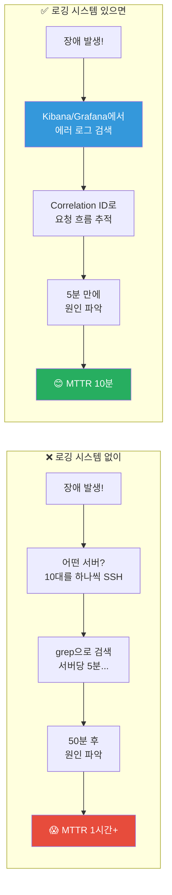
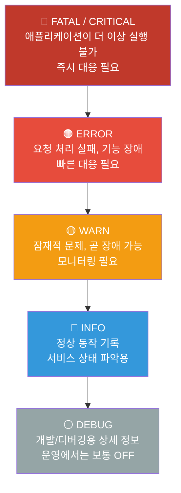
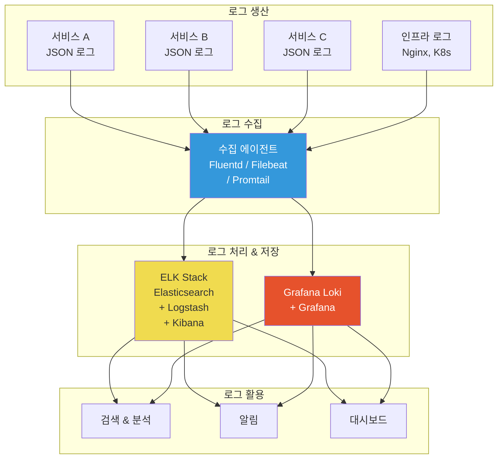
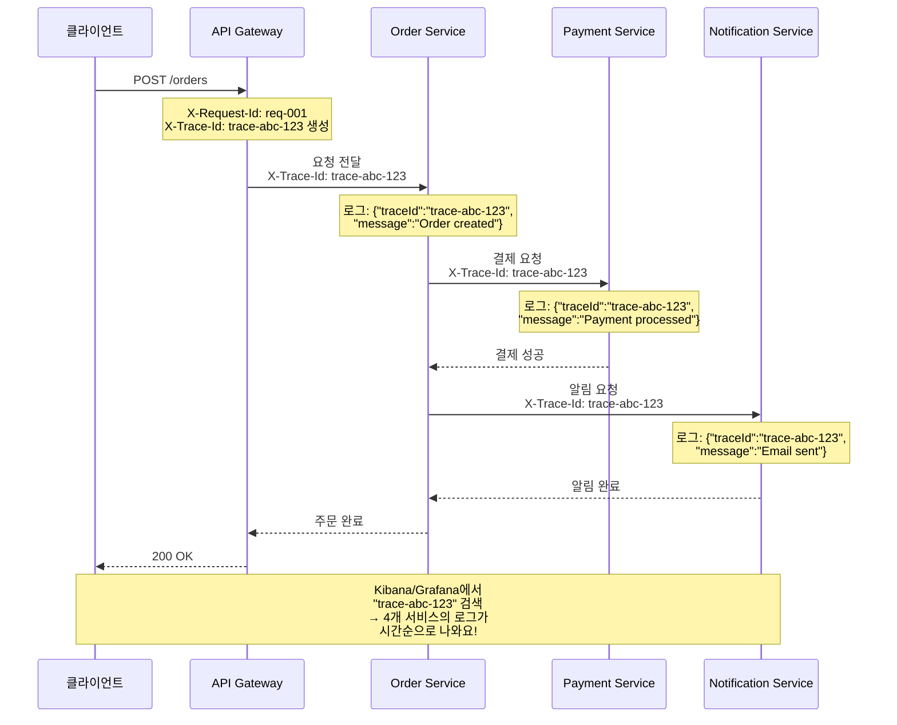
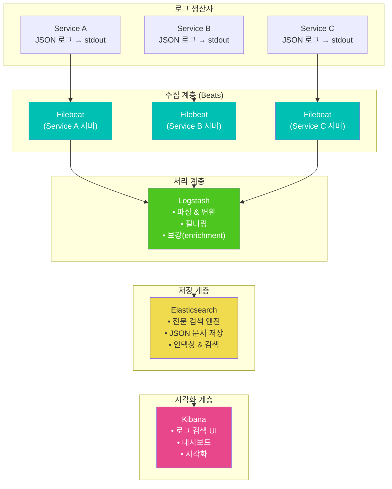
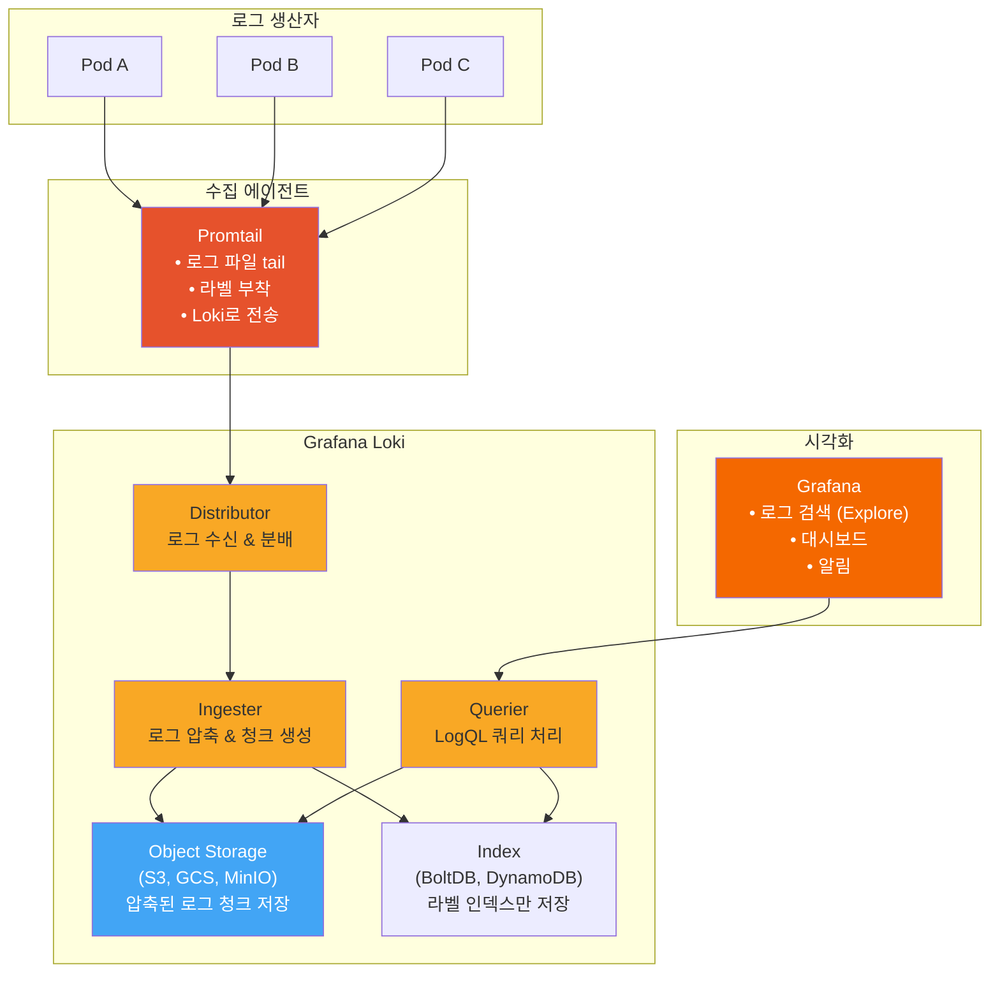
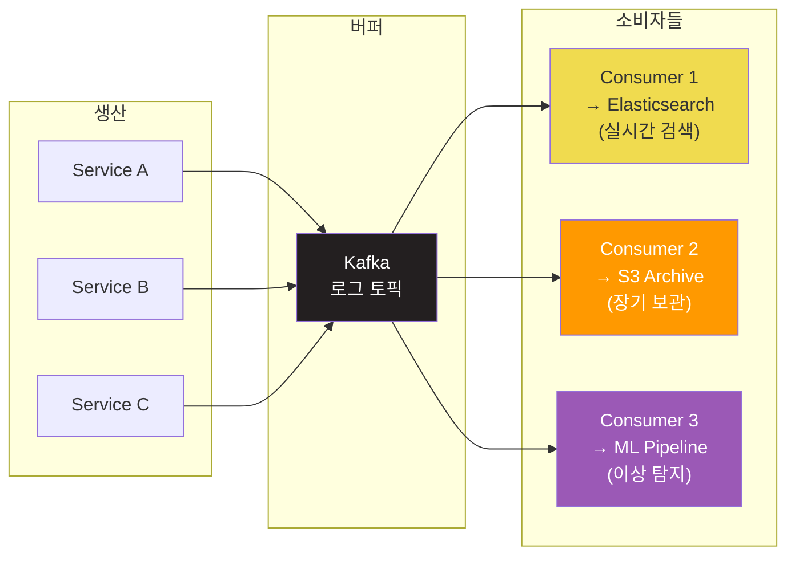

# 로깅 (Structured Logging, ELK Stack, Grafana Loki)

> 서버에서 장애가 발생하면 제일 먼저 찾는 게 로그예요. 하지만 수십 대 서버에서 쏟아지는 로그를 터미널에서 `tail -f`로 보고 있으면 금방 한계를 느끼게 돼요. "어떤 서버에서, 어떤 요청이, 왜 실패했는지"를 빠르게 찾으려면 체계적인 로깅 시스템이 필요해요. [Linux 로그 관리](../01-linux/08-log)에서 단일 서버의 로그를 다뤘다면, 이제는 **분산 시스템 전체**의 로그를 수집하고, 검색하고, 분석하는 방법을 배워볼게요.

---

## 🎯 왜 로깅을/를 알아야 하나요?

### 일상 비유: 대형 쇼핑몰의 CCTV 관제실

대형 쇼핑몰을 상상해보세요. 건물마다 수백 대의 CCTV가 있어요.

- **CCTV 1대만 볼 때** (단일 서버 로그): `tail -f /var/log/syslog`로 충분해요
- **CCTV 500대를 볼 때** (분산 시스템 로그): 관제실에서 한 화면에 모아보고, 검색하고, 이상 징후를 자동으로 감지해야 해요

로깅 시스템은 이 **중앙 관제실**이에요. 각 CCTV(서버)에서 오는 영상(로그)을 모아서, 시간순으로 정리하고, 필요한 장면을 빠르게 찾아주는 역할을 해요.

```
실무에서 로깅 시스템이 필요한 순간:

• "주문 실패했는데 어떤 서버에서 에러났는지 모르겠어요"  → 중앙 로그 검색
• "특정 사용자의 요청 흐름을 추적해야 해요"              → Correlation ID 기반 추적
• "새벽 3시에 에러가 급증했는데 원인을 찾아야 해요"      → 시간 기반 로그 분석
• "로그 파일이 서버 디스크를 다 잡아먹었어요"            → 로그 보존/순환 정책
• "감사(Audit)를 위해 6개월치 로그가 필요해요"           → 로그 아카이빙
• "로그에 고객 개인정보가 그대로 찍혀있어요"             → PII 마스킹
• "매일 500GB 로그가 생기는데 비용이 폭발해요"          → 로그 레벨/필터링 전략
```

### 로그를 제대로 관리하지 않으면?



---

## 🧠 핵심 개념 잡기

### 1. 비구조화 로그 vs 구조화 로그

로그 형식은 크게 두 가지로 나눠요.

**비구조화 로그 (Unstructured Log)** - 사람이 읽기 좋은 일반 텍스트:

```
2024-03-12 14:23:45 ERROR Failed to process order #12345 for user john@example.com - DB connection timeout after 30s
```

**구조화 로그 (Structured Log)** - 기계가 파싱하기 좋은 형식 (주로 JSON):

```json
{
  "timestamp": "2024-03-12T14:23:45.123Z",
  "level": "ERROR",
  "service": "order-service",
  "message": "Failed to process order",
  "orderId": "12345",
  "userId": "user-789",
  "error": "DB connection timeout",
  "timeoutMs": 30000,
  "traceId": "abc-123-def-456",
  "host": "order-svc-pod-3"
}
```

왜 구조화 로그가 중요할까요?

```
비구조화 로그의 문제:

"Failed to process order #12345 for user john@example.com"

Q: 주문번호만 뽑고 싶다면?
A: 정규식(regex)으로 파싱해야 해요... 😫
   /order #(\d+)/  → 로그 형식이 바뀌면 정규식도 수정해야 함

구조화 로그의 장점:

{"orderId": "12345", "userId": "user-789", ...}

Q: 주문번호만 뽑고 싶다면?
A: json.orderId  → 끝! 로그 형식이 바뀌어도 필드명만 같으면 OK
```

### 2. 로그 레벨 (Log Levels)

로그 레벨은 메시지의 중요도를 나타내요. [Linux 로그](../01-linux/08-log)의 syslog severity와 비슷하지만 애플리케이션에서는 주로 5단계를 써요.



각 레벨을 언제 사용하는지 구체적으로 볼게요:

| 레벨 | 언제 사용? | 예시 | 운영 환경 |
|------|-----------|------|----------|
| **FATAL** | 앱이 죽거나, 핵심 기능이 완전히 불가 | DB 연결 완전 실패, 메모리 부족 | 즉시 알림 (PagerDuty) |
| **ERROR** | 개별 요청/작업이 실패 | API 호출 실패, 결제 처리 실패 | 알림 + 즉시 조사 |
| **WARN** | 지금은 괜찮지만 문제가 될 수 있음 | 응답 시간 느려짐, 재시도 발생, 디스크 80% | 대시보드 모니터링 |
| **INFO** | 정상적인 비즈니스 이벤트 | 사용자 로그인, 주문 완료, 서비스 시작 | 일반 조회용 |
| **DEBUG** | 개발자가 문제를 추적할 때 필요한 세부 정보 | 변수 값, SQL 쿼리, 요청/응답 본문 | 운영에서 보통 OFF |

### 3. Correlation ID / Request ID

마이크로서비스 환경에서는 하나의 사용자 요청이 여러 서비스를 거쳐요. 이때 **하나의 ID로 요청 전체 흐름을 추적**할 수 있게 해주는 것이 Correlation ID예요.

```
사용자 → API Gateway → Order Service → Payment Service → Notification Service

모든 서비스의 로그에 같은 traceId: "abc-123"이 찍혀 있으면?
→ "abc-123"으로 검색하면 한 요청의 전체 여정을 볼 수 있어요!
```

### 4. 로그 수집/분석 시스템 개요



---

## 🔍 하나씩 자세히 알아보기

### 1. 구조화 로깅 (Structured Logging) 심화

#### 왜 JSON 로깅이 표준이 되었나?

일반 텍스트 로그의 가장 큰 문제는 **파싱**이에요. 서비스마다 로그 형식이 다르면 수집 시스템에서 각각 파서를 만들어야 해요.

```
# 서비스 A의 로그 형식
2024-03-12 14:23:45 [ERROR] OrderService - Failed to process order

# 서비스 B의 로그 형식
ERROR 2024/03/12 14:23:45 payment.go:142 Payment failed for txn_789

# 서비스 C의 로그 형식
14:23:45.123 | ERR | NotificationSvc | Email send failed

# → 3개 서비스에 3개의 파서(정규식)가 필요! 서비스가 100개면?!
```

JSON 로깅을 표준화하면:

```json
// 서비스 A
{"timestamp":"2024-03-12T14:23:45Z","level":"ERROR","service":"order-service","message":"Failed to process order"}

// 서비스 B
{"timestamp":"2024-03-12T14:23:45Z","level":"ERROR","service":"payment-service","message":"Payment failed","txnId":"txn_789"}

// 서비스 C
{"timestamp":"2024-03-12T14:23:45Z","level":"ERROR","service":"notification-service","message":"Email send failed"}

// → 파서 1개로 모든 서비스 로그를 처리할 수 있어요!
```

#### 좋은 구조화 로그의 필수 필드

```json
{
  // === 필수 필드 (모든 로그에 반드시 포함) ===
  "timestamp": "2024-03-12T14:23:45.123Z",   // ISO 8601 형식, UTC 기준
  "level": "ERROR",                            // 로그 레벨
  "message": "Order processing failed",        // 사람이 읽을 수 있는 메시지
  "service": "order-service",                  // 서비스 이름

  // === 추적 필드 (분산 시스템에서 필수) ===
  "traceId": "abc-123-def-456",               // 요청 전체 추적 ID
  "spanId": "span-789",                        // 현재 작업 단위 ID
  "requestId": "req-001",                      // 개별 요청 ID

  // === 컨텍스트 필드 (문제 진단에 중요) ===
  "userId": "user-789",                        // 관련 사용자
  "orderId": "order-12345",                    // 비즈니스 엔티티 ID
  "host": "order-svc-pod-3",                   // 호스트/파드 이름
  "environment": "production",                 // 환경 (dev/staging/prod)

  // === 에러 필드 (ERROR 레벨일 때) ===
  "error": {
    "type": "DatabaseTimeoutException",
    "message": "Connection timeout after 30000ms",
    "stackTrace": "at OrderRepository.save(OrderRepository.java:45)..."
  }
}
```

#### 언어별 구조화 로깅 설정

**Python (structlog)**:

```python
import structlog

# structlog 설정
structlog.configure(
    processors=[
        structlog.processors.TimeStamper(fmt="iso"),      # ISO 8601 타임스탬프
        structlog.processors.add_log_level,                # 로그 레벨 추가
        structlog.processors.StackInfoRenderer(),          # 스택 트레이스
        structlog.processors.JSONRenderer()                # JSON 출력
    ],
    wrapper_class=structlog.BoundLogger,
    context_class=dict,
    logger_factory=structlog.PrintLoggerFactory(),
)

logger = structlog.get_logger()

# 기본 로깅
logger.info("order_created", order_id="12345", user_id="user-789", total=49900)
# 출력: {"event":"order_created","order_id":"12345","user_id":"user-789","total":49900,"level":"info","timestamp":"2024-03-12T14:23:45.123Z"}

# 에러 로깅
try:
    process_payment(order)
except Exception as e:
    logger.error("payment_failed",
                 order_id="12345",
                 error_type=type(e).__name__,
                 error_message=str(e),
                 exc_info=True)  # 스택 트레이스 포함
```

**Node.js (pino)**:

```javascript
const pino = require('pino');

const logger = pino({
  level: process.env.LOG_LEVEL || 'info',
  formatters: {
    level: (label) => ({ level: label }),  // "level": "info" 형태로
  },
  timestamp: pino.stdTimeFunctions.isoTime,  // ISO 8601
  base: {
    service: 'order-service',
    environment: process.env.NODE_ENV,
    host: require('os').hostname(),
  },
});

// 기본 로깅
logger.info({ orderId: '12345', userId: 'user-789', total: 49900 }, 'Order created');
// 출력: {"level":"info","time":"2024-03-12T14:23:45.123Z","service":"order-service","orderId":"12345","userId":"user-789","total":49900,"msg":"Order created"}

// 에러 로깅
logger.error({ err: error, orderId: '12345' }, 'Payment processing failed');
```

**Java (Logback + SLF4J + Logstash Encoder)**:

```xml
<!-- logback-spring.xml -->
<configuration>
  <appender name="JSON" class="ch.qos.logback.core.ConsoleAppender">
    <encoder class="net.logstash.logback.encoder.LogstashEncoder">
      <customFields>
        {"service":"order-service","environment":"${SPRING_PROFILES_ACTIVE}"}
      </customFields>
      <timestampPattern>yyyy-MM-dd'T'HH:mm:ss.SSS'Z'</timestampPattern>
    </encoder>
  </appender>

  <root level="INFO">
    <appender-ref ref="JSON" />
  </root>
</configuration>
```

```java
import org.slf4j.Logger;
import org.slf4j.LoggerFactory;
import net.logstash.logback.marker.Markers;

Logger logger = LoggerFactory.getLogger(OrderService.class);

// 구조화 로깅 (MDC 또는 Markers 사용)
logger.info(Markers.append("orderId", "12345")
                   .and(Markers.append("userId", "user-789")),
            "Order created successfully");
// 출력: {"@timestamp":"2024-03-12T14:23:45.123Z","level":"INFO","service":"order-service","orderId":"12345","userId":"user-789","message":"Order created successfully"}
```

---

### 2. 로그 레벨 전략

#### 운영 환경별 로그 레벨 설정

```
환경별 권장 로그 레벨:

┌─────────────────┬──────────────┬────────────────────────────────────┐
│ 환경            │ 로그 레벨    │ 이유                               │
├─────────────────┼──────────────┼────────────────────────────────────┤
│ 개발 (Local)    │ DEBUG        │ 모든 상세 정보 필요                │
│ 테스트 (CI)     │ DEBUG/INFO   │ 테스트 실패 시 원인 분석용         │
│ 스테이징        │ INFO         │ 운영과 비슷하게, 하지만 여유있게   │
│ 운영 (Prod)     │ INFO         │ 비용과 성능 사이의 균형점          │
│ 장애 시 (Prod)  │ DEBUG (일시) │ 장애 원인 파악 후 다시 INFO로      │
└─────────────────┴──────────────┴────────────────────────────────────┘
```

#### 로그 레벨별 볼륨 추정

```
일반적인 웹 서비스에서 로그 비율 (대략적):

DEBUG  ████████████████████████████████████████  70%  (수 GB/일)
INFO   ████████████████                          25%  (수백 MB/일)
WARN   ███                                        3%  (수십 MB/일)
ERROR  █                                          1.5% (수 MB/일)
FATAL  ▏                                          0.5% (수 KB/일)

→ DEBUG를 운영에서 켜면 로그 볼륨이 ~4배 증가해요!
→ 비용도 4배, 검색도 느려져요
```

#### 동적 로그 레벨 변경

장애가 나면 재배포 없이 로그 레벨을 바꿀 수 있어야 해요:

```python
# Python - 환경 변수로 동적 레벨 변경
import os
import logging

# 환경 변수에서 레벨 읽기 (기본값: INFO)
log_level = os.environ.get('LOG_LEVEL', 'INFO').upper()
logging.basicConfig(level=getattr(logging, log_level))

# Kubernetes에서는 ConfigMap을 수정하고 Pod를 재시작하면 돼요
# 또는 Spring Boot처럼 actuator 엔드포인트를 제공할 수도 있어요
```

```yaml
# Kubernetes ConfigMap으로 로그 레벨 관리
apiVersion: v1
kind: ConfigMap
metadata:
  name: app-config
data:
  LOG_LEVEL: "INFO"  # 장애 시 "DEBUG"로 변경 후 롤링 재시작
---
apiVersion: apps/v1
kind: Deployment
metadata:
  name: order-service
spec:
  template:
    spec:
      containers:
      - name: app
        envFrom:
        - configMapRef:
            name: app-config
```

---

### 3. Correlation ID / Request ID 구현

#### 전체 흐름



#### Node.js Express 미들웨어 예시

```javascript
const { v4: uuidv4 } = require('uuid');
const pino = require('pino');
const logger = pino({ level: 'info' });

// Correlation ID 미들웨어
function correlationIdMiddleware(req, res, next) {
  // 1. 클라이언트나 게이트웨이에서 보낸 ID가 있으면 사용
  // 2. 없으면 새로 생성
  const traceId = req.headers['x-trace-id'] || uuidv4();
  const requestId = req.headers['x-request-id'] || uuidv4();

  // 요청 객체에 저장
  req.traceId = traceId;
  req.requestId = requestId;

  // 응답 헤더에도 포함 (디버깅 편의)
  res.setHeader('X-Trace-Id', traceId);
  res.setHeader('X-Request-Id', requestId);

  // 요청별 로거 생성 (모든 로그에 자동으로 ID 포함)
  req.log = logger.child({
    traceId,
    requestId,
    method: req.method,
    path: req.path,
  });

  req.log.info('Request started');

  // 응답 완료 시 로그
  res.on('finish', () => {
    req.log.info({ statusCode: res.statusCode, }, 'Request completed');
  });

  next();
}

// 사용
app.use(correlationIdMiddleware);

app.post('/orders', (req, res) => {
  req.log.info({ userId: req.body.userId }, 'Creating order');

  // 다른 서비스를 호출할 때 traceId를 전파
  const response = await axios.post('http://payment-service/pay', data, {
    headers: {
      'X-Trace-Id': req.traceId,       // 같은 traceId 전달!
      'X-Request-Id': uuidv4(),         // requestId는 새로 생성
    }
  });

  req.log.info({ orderId: order.id }, 'Order created successfully');
  res.json(order);
});
```

#### Python Flask 미들웨어 예시

```python
import uuid
import structlog
from flask import Flask, request, g

app = Flask(__name__)
logger = structlog.get_logger()

@app.before_request
def add_correlation_id():
    """모든 요청에 Correlation ID를 부여해요"""
    g.trace_id = request.headers.get('X-Trace-Id', str(uuid.uuid4()))
    g.request_id = request.headers.get('X-Request-Id', str(uuid.uuid4()))

    # 요청별 로거 (모든 로그에 자동으로 trace_id 포함)
    g.log = logger.bind(
        trace_id=g.trace_id,
        request_id=g.request_id,
        method=request.method,
        path=request.path,
    )
    g.log.info("request_started")

@app.after_request
def add_trace_header(response):
    """응답에 Trace ID를 포함해서 클라이언트가 추적할 수 있게 해요"""
    response.headers['X-Trace-Id'] = g.trace_id
    response.headers['X-Request-Id'] = g.request_id
    g.log.info("request_completed", status_code=response.status_code)
    return response

@app.route('/orders', methods=['POST'])
def create_order():
    g.log.info("creating_order", user_id=request.json.get('userId'))

    # 다른 서비스 호출 시 trace_id 전파
    response = requests.post(
        'http://payment-service/pay',
        json=payment_data,
        headers={
            'X-Trace-Id': g.trace_id,       # 같은 trace_id!
            'X-Request-Id': str(uuid.uuid4()) # request_id는 새로
        }
    )

    g.log.info("order_created", order_id=order.id)
    return jsonify(order), 201
```

---

### 4. ELK Stack (Elasticsearch + Logstash + Kibana)

ELK Stack은 로그 수집과 분석의 **사실상 표준(de facto standard)**이었어요. 2010년대 중반부터 가장 널리 사용되어 왔어요.

#### ELK Stack 아키텍처



#### 각 컴포넌트의 역할

**Elasticsearch** - 로그 저장소 + 검색 엔진:

```
역할: 로그를 저장하고 빠르게 검색하는 핵심 엔진

특징:
• 분산 검색 엔진 (Apache Lucene 기반)
• JSON 문서를 저장하고 풀텍스트 검색 제공
• 인덱스(Index)별로 데이터를 구분 (예: logs-2024.03.12)
• 샤드(Shard)로 데이터를 분산 저장
• 레플리카(Replica)로 고가용성 보장

비유: 도서관의 거대한 색인(인덱스) 카드 시스템
     → 어떤 키워드든 빠르게 찾을 수 있어요
```

**Logstash** - 로그 가공 파이프라인:

```ruby
# logstash.conf 예시
input {
  # Filebeat에서 로그를 받음
  beats {
    port => 5044
  }
}

filter {
  # JSON 파싱 (구조화 로그라면 간단!)
  json {
    source => "message"
  }

  # 타임스탬프 변환
  date {
    match => ["timestamp", "ISO8601"]
    target => "@timestamp"
  }

  # PII 마스킹 (개인정보 보호)
  mutate {
    gsub => [
      "message", "\b[A-Za-z0-9._%+-]+@[A-Za-z0-9.-]+\.[A-Za-z]{2,}\b", "***@***.***",
      "message", "\b\d{3}-\d{4}-\d{4}\b", "***-****-****"
    ]
  }

  # 불필요한 필드 제거 (비용 절감)
  mutate {
    remove_field => ["agent", "ecs", "input"]
  }

  # GeoIP 추가 (접속 위치 정보)
  if [clientIp] {
    geoip {
      source => "clientIp"
    }
  }
}

output {
  # Elasticsearch로 전송
  elasticsearch {
    hosts => ["http://elasticsearch:9200"]
    index => "logs-%{[service]}-%{+YYYY.MM.dd}"
    # → logs-order-service-2024.03.12 인덱스에 저장
  }
}
```

**Filebeat** - 경량 로그 수집기:

```yaml
# filebeat.yml
filebeat.inputs:
  # 파일 기반 수집
  - type: filestream
    id: app-logs
    paths:
      - /var/log/app/*.log
    parsers:
      - ndjson:
          keys_under_root: true     # JSON 필드를 최상위로
          overwrite_keys: true

  # Docker 컨테이너 로그 수집
  - type: container
    paths:
      - /var/lib/docker/containers/*/*.log

# Logstash로 전송
output.logstash:
  hosts: ["logstash:5044"]

# 또는 Elasticsearch로 직접 전송 (Logstash 없이)
# output.elasticsearch:
#   hosts: ["elasticsearch:9200"]
#   index: "filebeat-%{+yyyy.MM.dd}"
```

**Kibana** - 시각화 & 검색 UI:

```
Kibana에서 자주 사용하는 기능:

1. Discover (로그 검색)
   - KQL (Kibana Query Language)로 검색
   - level: "ERROR" AND service: "order-service"
   - message: "timeout" AND NOT service: "health-check"
   - 시간 범위 지정: Last 1 hour, Last 24 hours

2. Dashboard (대시보드)
   - 서비스별 에러율 차트
   - 시간대별 로그 볼륨 그래프
   - 상위 에러 메시지 Top 10

3. Alerting (알림)
   - ERROR 로그가 5분간 100건 초과 시 Slack 알림
   - FATAL 로그 발생 시 즉시 PagerDuty 호출
```

#### Docker Compose로 ELK 구성

```yaml
# docker-compose-elk.yml
version: '3.8'

services:
  elasticsearch:
    image: docker.elastic.co/elasticsearch/elasticsearch:8.12.0
    environment:
      - discovery.type=single-node
      - xpack.security.enabled=false     # 개발용 (운영에서는 true!)
      - "ES_JAVA_OPTS=-Xms1g -Xmx1g"    # JVM 힙 메모리
    ports:
      - "9200:9200"
    volumes:
      - es-data:/usr/share/elasticsearch/data
    healthcheck:
      test: ["CMD", "curl", "-f", "http://localhost:9200"]
      interval: 10s
      timeout: 5s
      retries: 5

  logstash:
    image: docker.elastic.co/logstash/logstash:8.12.0
    volumes:
      - ./logstash/pipeline:/usr/share/logstash/pipeline  # logstash.conf
    ports:
      - "5044:5044"   # Beats input
    depends_on:
      elasticsearch:
        condition: service_healthy

  kibana:
    image: docker.elastic.co/kibana/kibana:8.12.0
    environment:
      ELASTICSEARCH_HOSTS: '["http://elasticsearch:9200"]'
    ports:
      - "5601:5601"   # Kibana UI
    depends_on:
      elasticsearch:
        condition: service_healthy

volumes:
  es-data:
    driver: local
```

---

### 5. Grafana Loki

Loki는 Grafana Labs에서 만든 **경량 로그 수집 시스템**이에요. "Prometheus처럼 로그를 다루자"는 철학으로 만들어졌어요.

#### Loki의 핵심 철학: 라벨 기반 인덱싱

Elasticsearch와 가장 큰 차이점은 **인덱싱 방식**이에요:

```
┌──────────────────────────────────────────────────────────────────┐
│                    Elasticsearch                                  │
├──────────────────────────────────────────────────────────────────┤
│ 로그의 "모든 텍스트"를 인덱싱해요 (Full-Text Index)              │
│                                                                   │
│ 장점: 로그 내용으로 자유롭게 검색 (예: "timeout" 검색 가능)       │
│ 단점: 인덱스가 크고, 리소스(CPU/메모리/디스크)를 많이 사용        │
│                                                                   │
│ 비유: 도서관의 모든 책을 한 글자 한 글자 색인하는 것              │
│       → 뭐든 찾을 수 있지만, 색인 만드는 비용이 어마어마          │
└──────────────────────────────────────────────────────────────────┘

┌──────────────────────────────────────────────────────────────────┐
│                       Grafana Loki                                │
├──────────────────────────────────────────────────────────────────┤
│ "라벨(metadata)"만 인덱싱하고, 로그 원문은 압축 저장만 해요      │
│                                                                   │
│ 장점: 인덱스가 작고, 리소스를 훨씬 적게 사용 (비용 절감)         │
│ 단점: 라벨로 범위를 좁힌 후에만 텍스트 검색 가능                  │
│                                                                   │
│ 비유: 도서관 책을 "장르"와 "저자"로만 분류해두는 것               │
│       → "추리소설 중 홍길동 작가" 범위를 좁힌 후 내용 검색        │
└──────────────────────────────────────────────────────────────────┘
```

#### Loki 아키텍처



#### LogQL - Loki의 쿼리 언어

LogQL은 PromQL(Prometheus 쿼리 언어)에서 영감을 받은 로그 전용 쿼리 언어예요.

**기본 문법**:

```
# 라벨로 스트림 선택 (중괄호 사용)
{service="order-service"}                              # order-service의 모든 로그
{service="order-service", level="ERROR"}               # order-service의 ERROR 로그
{namespace="production", container=~"order-.*"}        # 정규식 매칭

# 파이프라인 (| 로 체이닝)
{service="order-service"} |= "timeout"                 # "timeout" 포함하는 로그
{service="order-service"} != "healthcheck"             # "healthcheck" 제외
{service="order-service"} |~ "error|fail|exception"    # 정규식 매칭
{service="order-service"} !~ "debug|trace"             # 정규식 제외

# JSON 파싱
{service="order-service"} | json                       # JSON 필드 추출
{service="order-service"} | json | orderId="12345"     # 특정 필드 값 필터
{service="order-service"} | json | duration > 1000     # 숫자 비교

# 메트릭 쿼리 (로그에서 메트릭 생성)
# 5분간 서비스별 에러 로그 개수
sum(count_over_time({level="ERROR"}[5m])) by (service)

# 분당 로그 발생률
rate({service="order-service"}[1m])

# P99 응답 시간 (로그의 duration 필드에서 추출)
quantile_over_time(0.99,
  {service="order-service"} | json | unwrap duration [5m]
) by (service)
```

#### Promtail 설정

```yaml
# promtail-config.yml
server:
  http_listen_port: 9080

positions:
  filename: /tmp/positions.yaml  # 어디까지 읽었는지 기록

clients:
  - url: http://loki:3100/loki/api/v1/push

scrape_configs:
  # Kubernetes Pod 로그 수집
  - job_name: kubernetes-pods
    kubernetes_sd_configs:
      - role: pod
    relabel_configs:
      # Pod의 라벨을 Loki 라벨로 매핑
      - source_labels: [__meta_kubernetes_pod_label_app]
        target_label: app
      - source_labels: [__meta_kubernetes_namespace]
        target_label: namespace
      - source_labels: [__meta_kubernetes_pod_name]
        target_label: pod
    pipeline_stages:
      # JSON 로그 파싱
      - json:
          expressions:
            level: level
            service: service
            traceId: traceId
      # 추출한 필드를 라벨로 설정
      - labels:
          level:
          service:
      # 타임스탬프 설정
      - timestamp:
          source: timestamp
          format: RFC3339Nano
```

#### Docker Compose로 Loki 구성

```yaml
# docker-compose-loki.yml
version: '3.8'

services:
  loki:
    image: grafana/loki:2.9.4
    ports:
      - "3100:3100"
    volumes:
      - ./loki-config.yml:/etc/loki/local-config.yaml
      - loki-data:/loki
    command: -config.file=/etc/loki/local-config.yaml

  promtail:
    image: grafana/promtail:2.9.4
    volumes:
      - ./promtail-config.yml:/etc/promtail/config.yml
      - /var/log:/var/log                    # 호스트 로그 수집
      - /var/lib/docker/containers:/var/lib/docker/containers:ro  # Docker 로그
    command: -config.file=/etc/promtail/config.yml
    depends_on:
      - loki

  grafana:
    image: grafana/grafana:10.3.1
    ports:
      - "3000:3000"
    environment:
      - GF_SECURITY_ADMIN_PASSWORD=admin
    volumes:
      - grafana-data:/var/lib/grafana
    depends_on:
      - loki

volumes:
  loki-data:
  grafana-data:
```

```yaml
# loki-config.yml (기본 설정)
auth_enabled: false

server:
  http_listen_port: 3100

common:
  path_prefix: /loki
  storage:
    filesystem:
      chunks_directory: /loki/chunks
      rules_directory: /loki/rules
  replication_factor: 1
  ring:
    kvstore:
      store: inmemory

schema_config:
  configs:
    - from: 2020-10-24
      store: tsdb
      object_store: filesystem
      schema: v13
      index:
        prefix: index_
        period: 24h

limits_config:
  reject_old_samples: true
  reject_old_samples_max_age: 168h     # 7일보다 오래된 로그는 거부
  max_query_length: 721h               # 최대 30일 쿼리
  max_entries_limit_per_query: 5000    # 쿼리당 최대 결과
```

---

### 6. ELK Stack vs Grafana Loki 비교

이 두 시스템은 각각 장단점이 뚜렷해요. 상황에 맞게 선택하는 것이 중요해요.

| 비교 항목 | ELK Stack | Grafana Loki |
|-----------|-----------|--------------|
| **인덱싱 방식** | 풀텍스트 인덱싱 (모든 내용) | 라벨만 인덱싱 (메타데이터) |
| **검색 속도** | 빠름 (인덱스 덕분) | 라벨 범위를 좁혀야 빠름 |
| **리소스 사용** | 높음 (메모리, CPU, 디스크) | 낮음 (10-20배 적은 인덱스) |
| **비용** | 높음 (특히 대규모) | 낮음 (S3 같은 저렴한 스토리지 활용) |
| **학습 곡선** | 중간 (KQL 쉬움) | 중간 (LogQL 익혀야 함) |
| **운영 복잡도** | 높음 (ES 클러스터 관리) | 낮음 (심플한 구조) |
| **시각화** | Kibana (강력) | Grafana (메트릭과 통합) |
| **확장성** | 수평 확장 가능하지만 복잡 | 오브젝트 스토리지로 간단히 확장 |
| **에코시스템** | 매우 풍부 (오래된 역사) | Grafana 스택과 통합 (Prometheus, Tempo) |
| **적합한 규모** | 대규모 (복잡한 검색 필요) | 소~중규모 (비용 효율 중시) |

#### 선택 가이드

```
다음과 같다면 ELK Stack을 선택하세요:
✅ 로그 텍스트 전체를 자유롭게 검색해야 하는 경우가 많을 때
✅ 보안/컴플라이언스 요구사항이 복잡할 때 (SIEM 연동 등)
✅ 이미 ELK를 운영 중이고 팀에 노하우가 있을 때
✅ Elastic APM, Security 등 Elastic 생태계를 활용할 때
✅ 예산과 인프라 리소스가 충분할 때

다음과 같다면 Grafana Loki를 선택하세요:
✅ 비용을 최소화하고 싶을 때 (스타트업, 소규모 팀)
✅ 이미 Prometheus + Grafana를 쓰고 있을 때 (통합 모니터링)
✅ Kubernetes 환경에서 라벨 기반 필터링이 자연스러울 때
✅ 운영 복잡도를 낮추고 싶을 때
✅ 로그 저장 비용을 S3 수준으로 낮추고 싶을 때
```

---

### 7. 로그 보존 (Retention) & 순환 (Rotation)

로그는 무한히 쌓을 수 없어요. 비용과 규정(컴플라이언스)을 고려해서 보존 정책을 세워야 해요.

#### 보존 기간 가이드라인

```
┌────────────────────┬─────────────────┬──────────────────────────────┐
│ 로그 유형          │ 권장 보존 기간  │ 이유                         │
├────────────────────┼─────────────────┼──────────────────────────────┤
│ DEBUG 로그         │ 1-3일           │ 용량 크고 운영에서 거의 안봄 │
│ INFO 로그          │ 7-30일          │ 일반 문제 해결용             │
│ WARN/ERROR 로그    │ 30-90일         │ 장애 패턴 분석용             │
│ 보안/감사 로그     │ 1-7년           │ 컴플라이언스 요구사항        │
│ 금융 거래 로그     │ 5-10년          │ 금융 규정 (전자금융감독규정) │
│ 의료 데이터 로그   │ 10년+           │ 의료법 요구사항              │
└────────────────────┴─────────────────┴──────────────────────────────┘
```

#### Elasticsearch Index Lifecycle Management (ILM)

```json
// Elasticsearch ILM 정책
PUT _ilm/policy/logs-lifecycle
{
  "policy": {
    "phases": {
      "hot": {
        "min_age": "0ms",
        "actions": {
          "rollover": {
            "max_size": "50gb",
            "max_age": "1d"
          },
          "set_priority": { "priority": 100 }
        }
      },
      "warm": {
        "min_age": "7d",
        "actions": {
          "shrink": { "number_of_shards": 1 },
          "forcemerge": { "max_num_segments": 1 },
          "set_priority": { "priority": 50 }
        }
      },
      "cold": {
        "min_age": "30d",
        "actions": {
          "freeze": {},
          "set_priority": { "priority": 0 }
        }
      },
      "delete": {
        "min_age": "90d",
        "actions": {
          "delete": {}
        }
      }
    }
  }
}
```

```
ILM 단계를 비유하면:

Hot  (0-7일)   → 자주 보는 최근 책을 책상 위에 놔두는 것 (SSD, 빠른 검색)
Warm (7-30일)  → 가끔 보는 책을 책장에 꽂아두는 것 (HDD, 압축)
Cold (30-90일) → 거의 안 보는 책을 창고에 넣는 것 (읽기 전용, 최대 압축)
Delete (90일+) → 오래된 책을 폐기하는 것 (삭제)
```

#### Loki 보존 설정

```yaml
# loki-config.yml 에서 보존 설정
limits_config:
  retention_period: 30d         # 전체 기본 보존 기간: 30일

compactor:
  working_directory: /loki/compactor
  compaction_interval: 10m
  retention_enabled: true        # 보존 정책 활성화
  retention_delete_delay: 2h     # 삭제 전 대기 시간
  retention_delete_worker_count: 150

# 스트림별 차등 보존 (라벨 기반)
limits_config:
  retention_stream:
    - selector: '{level="DEBUG"}'
      priority: 1
      period: 3d                 # DEBUG는 3일만 보존
    - selector: '{level="INFO"}'
      priority: 2
      period: 14d                # INFO는 14일
    - selector: '{level=~"WARN|ERROR|FATAL"}'
      priority: 3
      period: 90d                # WARN 이상은 90일
    - selector: '{type="audit"}'
      priority: 4
      period: 365d               # 감사 로그는 1년
```

#### 비용 최적화 전략: 티어별 스토리지

```
로그 저장 비용 최적화 (AWS 기준):

Hot Tier  (0-7일)   → EBS gp3 SSD      : $0.08/GB/월  빠른 검색
Warm Tier (7-30일)  → EBS st1 HDD      : $0.045/GB/월  적당한 속도
Cold Tier (30-90일) → S3 Standard      : $0.023/GB/월  느리지만 저렴
Archive   (90일+)   → S3 Glacier       : $0.004/GB/월  매우 느리지만 매우 저렴

예시) 하루 100GB 로그 생성 시:
• 전부 Hot에 90일 보관: 100GB x 90일 x $0.08 = $720/월
• 티어별 보관:
  Hot(7일)  : 100GB x 7  x $0.08  = $56
  Warm(23일): 100GB x 23 x $0.045 = $103.5
  Cold(60일): 100GB x 60 x $0.023 = $138
  합계: $297.5/월 (58% 절감!)
```

---

### 8. 로그 수집 아키텍처 패턴

#### 패턴 1: 직접 전송 (Direct Push)

```
App → Loki/Elasticsearch

장점: 단순함
단점: 앱이 로그 시스템에 직접 의존, 장애 전파 위험
적합: 소규모 시스템, 개발 환경
```

#### 패턴 2: 사이드카 패턴 (Kubernetes에서 일반적)

```
[Pod]
├── App Container      → stdout/stderr로 로그 출력
└── Sidecar Container  → 로그 수집 & 전송 (Filebeat/Promtail)

장점: 앱과 로그 수집을 분리, 앱은 stdout만 신경쓰면 됨
단점: Pod마다 사이드카가 있어 리소스 사용 증가
적합: Pod 단위로 세밀한 로그 처리가 필요할 때
```

#### 패턴 3: DaemonSet 패턴 (Kubernetes에서 가장 일반적)

```
[Node 1]                      [Node 2]
├── Pod A (app)               ├── Pod D (app)
├── Pod B (app)               ├── Pod E (app)
├── Pod C (app)               ├── Pod F (app)
└── DaemonSet (Promtail)      └── DaemonSet (Promtail)
    ↓ 노드의 모든 Pod 로그 수집    ↓ 노드의 모든 Pod 로그 수집

    → Loki / Elasticsearch

장점: 노드당 에이전트 1개로 효율적, 리소스 절약
단점: Pod별 세밀한 처리가 어려움
적합: 대부분의 Kubernetes 환경 (권장)
```

#### 패턴 4: 버퍼 계층 추가 (대규모 시스템)

```
Apps → Kafka/Kinesis (버퍼) → Logstash/Flink (처리) → Elasticsearch/Loki (저장)

장점:
  - 트래픽 폭증 시 버퍼가 흡수 (로그 유실 방지)
  - 처리 계층을 독립적으로 확장 가능
  - 여러 소비자(consumer)가 같은 로그를 다르게 처리 가능
단점: 복잡도 증가, Kafka 운영 부담
적합: 대규모 시스템 (하루 수 TB 이상의 로그)
```



---

### 9. 로그 보안 (PII 마스킹, 민감 데이터)

로그에 개인정보(PII)나 민감 데이터가 그대로 남으면 심각한 보안/법적 문제가 될 수 있어요.

#### 마스킹해야 하는 데이터

```
반드시 마스킹해야 하는 데이터:

🔴 개인정보 (PII - Personally Identifiable Information)
   • 이메일: john@example.com → j***@***.com
   • 전화번호: 010-1234-5678 → 010-****-5678
   • 주민등록번호: 900101-1234567 → 900101-*******
   • 주소: 서울시 강남구... → [MASKED_ADDRESS]

🔴 인증 정보
   • 비밀번호: password123 → [MASKED]
   • API 키: sk-abc123... → sk-***...
   • JWT 토큰: eyJhbG... → [MASKED_TOKEN]
   • 세션 ID: 전체 마스킹

🔴 금융 정보
   • 신용카드: 4111-1111-1111-1111 → 4111-****-****-1111
   • 계좌번호: 110-123-456789 → 110-***-******

🟡 주의해서 다룰 데이터
   • IP 주소: 보안 분석에는 필요하지만, 개인정보보호법 대상일 수 있음
   • 사용자 에이전트: 브라우저 핑거프린팅 가능
```

#### 구현 방법

**방법 1: 애플리케이션 레벨 마스킹 (가장 권장)**

```python
import re
import structlog

class PIIMaskingProcessor:
    """로그에 찍히기 전에 민감 데이터를 마스킹해요"""

    PATTERNS = {
        'email': (
            r'\b[A-Za-z0-9._%+-]+@[A-Za-z0-9.-]+\.[A-Za-z]{2,}\b',
            lambda m: m.group(0)[0] + '***@***.***'
        ),
        'phone_kr': (
            r'\b01[016789]-?\d{3,4}-?\d{4}\b',
            lambda m: m.group(0)[:3] + '-****-****'
        ),
        'credit_card': (
            r'\b\d{4}[-\s]?\d{4}[-\s]?\d{4}[-\s]?\d{4}\b',
            lambda m: m.group(0)[:4] + '-****-****-' + m.group(0)[-4:]
        ),
        'rrn': (  # 주민등록번호
            r'\b\d{6}[-\s]?\d{7}\b',
            lambda m: m.group(0)[:6] + '-*******'
        ),
    }

    def __call__(self, logger, method_name, event_dict):
        """structlog 프로세서로 사용"""
        for key, value in event_dict.items():
            if isinstance(value, str):
                for pattern_name, (pattern, replacer) in self.PATTERNS.items():
                    value = re.sub(pattern, replacer, value)
                event_dict[key] = value
        return event_dict

# structlog에 마스킹 프로세서 추가
structlog.configure(
    processors=[
        structlog.processors.TimeStamper(fmt="iso"),
        structlog.processors.add_log_level,
        PIIMaskingProcessor(),           # PII 마스킹!
        structlog.processors.JSONRenderer(),
    ],
)

logger = structlog.get_logger()

# 이메일이 자동으로 마스킹돼요
logger.info("user_registered", email="john@example.com", phone="010-1234-5678")
# 출력: {"event":"user_registered","email":"j***@***.***","phone":"010-****-****",...}
```

**방법 2: Logstash에서 마스킹 (수집 단계)**

```ruby
# logstash.conf - filter 섹션
filter {
  # 이메일 마스킹
  mutate {
    gsub => [
      "message", "\b[A-Za-z0-9._%+-]+@[A-Za-z0-9.-]+\.[A-Za-z]{2,}\b", "[MASKED_EMAIL]",
      "email", "\b[A-Za-z0-9._%+-]+@[A-Za-z0-9.-]+\.[A-Za-z]{2,}\b", "[MASKED_EMAIL]"
    ]
  }

  # 신용카드 번호 마스킹
  mutate {
    gsub => [
      "message", "\b\d{4}[-\s]?\d{4}[-\s]?\d{4}[-\s]?\d{4}\b", "[MASKED_CARD]"
    ]
  }

  # 특정 필드 완전 제거
  mutate {
    remove_field => ["password", "secret", "token", "authorization"]
  }
}
```

**방법 3: Promtail에서 마스킹 (Loki용)**

```yaml
# promtail-config.yml
scrape_configs:
  - job_name: app-logs
    pipeline_stages:
      # 이메일 마스킹
      - replace:
          expression: '([A-Za-z0-9._%+-]+)@([A-Za-z0-9.-]+\.[A-Za-z]{2,})'
          replace: '***@***.***'

      # 전화번호 마스킹
      - replace:
          expression: '(01[016789])-?(\d{3,4})-?(\d{4})'
          replace: '${1}-****-****'

      # API 키 마스킹
      - replace:
          expression: '(sk-|api_key[=:]\s*)[A-Za-z0-9]{20,}'
          replace: '${1}[MASKED]'
```

---

## 💻 직접 해보기

### 실습 1: Docker Compose로 Loki 스택 구성하고 로그 검색하기

**목표**: Loki + Promtail + Grafana를 띄우고, 앱 로그를 수집/검색해봐요.

```yaml
# 1. docker-compose.yml 작성
version: '3.8'

services:
  # 샘플 앱 (JSON 로그를 stdout으로 출력)
  sample-app:
    image: nginx:alpine
    ports:
      - "8080:80"
    logging:
      driver: json-file
      options:
        max-size: "10m"
        tag: "{{.Name}}"

  # Loki - 로그 저장소
  loki:
    image: grafana/loki:2.9.4
    ports:
      - "3100:3100"
    volumes:
      - ./loki-config.yml:/etc/loki/local-config.yaml
    command: -config.file=/etc/loki/local-config.yaml

  # Promtail - 로그 수집기
  promtail:
    image: grafana/promtail:2.9.4
    volumes:
      - ./promtail-config.yml:/etc/promtail/config.yml
      - /var/lib/docker/containers:/var/lib/docker/containers:ro
      - /var/run/docker.sock:/var/run/docker.sock
    command: -config.file=/etc/promtail/config.yml
    depends_on:
      - loki

  # Grafana - 시각화
  grafana:
    image: grafana/grafana:10.3.1
    ports:
      - "3000:3000"
    environment:
      - GF_SECURITY_ADMIN_PASSWORD=admin
      - GF_AUTH_ANONYMOUS_ENABLED=true
    depends_on:
      - loki
```

```bash
# 2. 실행
docker compose up -d

# 3. Nginx에 트래픽 생성
for i in $(seq 1 100); do
  curl -s http://localhost:8080 > /dev/null
  curl -s http://localhost:8080/nonexistent > /dev/null  # 404 에러
done

# 4. Grafana 접속
# http://localhost:3000 (admin/admin)
# → Connections > Data Sources > Add Loki
# → URL: http://loki:3100
# → Explore > LogQL 쿼리 입력:
#   {container="sample-app"} |= "404"
```

### 실습 2: Python 앱에서 구조화 로깅 구현하기

```python
# app.py - 구조화 로깅 + Correlation ID 예제
import structlog
import uuid
import time
import random

# === structlog 설정 ===
structlog.configure(
    processors=[
        structlog.contextvars.merge_contextvars,       # 컨텍스트 변수 지원
        structlog.processors.TimeStamper(fmt="iso"),
        structlog.processors.add_log_level,
        structlog.processors.StackInfoRenderer(),
        structlog.processors.JSONRenderer(),
    ],
    wrapper_class=structlog.BoundLogger,
    context_class=dict,
    logger_factory=structlog.PrintLoggerFactory(),
)

logger = structlog.get_logger()

# === Correlation ID 컨텍스트 관리 ===
def process_request(user_id: str):
    """하나의 요청을 처리하는 전체 흐름"""
    trace_id = str(uuid.uuid4())[:8]

    # 이 요청의 모든 로그에 trace_id가 자동 포함돼요
    log = logger.bind(trace_id=trace_id, user_id=user_id)

    log.info("request_started", path="/api/orders")

    # 1. 주문 생성
    order_id = create_order(log, user_id)

    # 2. 결제 처리
    payment_success = process_payment(log, order_id)

    # 3. 알림 발송
    if payment_success:
        send_notification(log, user_id, order_id)
        log.info("request_completed", order_id=order_id, status="success")
    else:
        log.error("request_failed", order_id=order_id, reason="payment_failed")

def create_order(log, user_id):
    order_id = f"ORD-{random.randint(1000, 9999)}"
    log.info("order_created", order_id=order_id, items=3, total=49900)
    return order_id

def process_payment(log, order_id):
    start = time.time()
    time.sleep(random.uniform(0.1, 0.5))  # 결제 처리 시뮬레이션
    duration_ms = int((time.time() - start) * 1000)

    success = random.random() > 0.2  # 80% 확률로 성공

    if success:
        log.info("payment_processed", order_id=order_id, duration_ms=duration_ms)
    else:
        log.error("payment_failed", order_id=order_id, duration_ms=duration_ms,
                  error_type="PaymentGatewayTimeout",
                  error_message="Gateway response timeout after 30000ms")

    return success

def send_notification(log, user_id, order_id):
    log.info("notification_sent", order_id=order_id, channel="email")

# === 실행 ===
if __name__ == "__main__":
    print("=== 로그 출력 시작 ===")
    for i in range(5):
        process_request(f"user-{random.randint(100, 999)}")
        print()  # 요청 사이 구분
```

실행하면 이런 로그가 나와요:

```json
{"trace_id":"a1b2c3d4","user_id":"user-456","event":"request_started","path":"/api/orders","level":"info","timestamp":"2024-03-12T14:23:45.123Z"}
{"trace_id":"a1b2c3d4","user_id":"user-456","event":"order_created","order_id":"ORD-1234","items":3,"total":49900,"level":"info","timestamp":"2024-03-12T14:23:45.124Z"}
{"trace_id":"a1b2c3d4","user_id":"user-456","event":"payment_processed","order_id":"ORD-1234","duration_ms":234,"level":"info","timestamp":"2024-03-12T14:23:45.358Z"}
{"trace_id":"a1b2c3d4","user_id":"user-456","event":"notification_sent","order_id":"ORD-1234","channel":"email","level":"info","timestamp":"2024-03-12T14:23:45.359Z"}
{"trace_id":"a1b2c3d4","user_id":"user-456","event":"request_completed","order_id":"ORD-1234","status":"success","level":"info","timestamp":"2024-03-12T14:23:45.360Z"}
```

`trace_id: a1b2c3d4`로 검색하면 이 요청의 전체 흐름을 한눈에 볼 수 있어요!

### 실습 3: LogQL 쿼리 연습

Grafana Explore에서 이 쿼리들을 직접 실행해보세요:

```
# 1. 기본 - 특정 서비스의 에러 로그
{service="order-service"} | json | level="ERROR"

# 2. 특정 시간대 + 특정 사용자
{service="order-service"} | json | user_id="user-456" | line_format "{{.timestamp}} [{{.level}}] {{.event}}"

# 3. 응답 시간이 500ms 이상인 로그
{service="order-service"} | json | duration_ms > 500

# 4. 최근 1시간 서비스별 에러 수
sum(count_over_time({level="ERROR"}[1h])) by (service)

# 5. 분당 로그 발생률 (서비스별)
sum(rate({job="app"}[5m])) by (service)

# 6. 특정 Trace ID로 요청 추적
{job="app"} |= "trace-abc-123"

# 7. 결제 실패율 계산 (최근 1시간)
sum(count_over_time({service="payment-service"} | json | level="ERROR" [1h]))
/
sum(count_over_time({service="payment-service"} | json [1h]))
```

---

## 🏢 실무에서는?

### 1. 대규모 서비스의 로깅 아키텍처 (실제 사례)

```
일 로그량: 약 2TB/일 (마이크로서비스 50개, 인스턴스 200대)

아키텍처:
Apps (JSON stdout)
  → Fluentd DaemonSet (K8s 노드별 1개)
    → Kafka (3 broker, 로그 토픽 파티션 12개)
      → Consumer 1: Elasticsearch (Hot 7일 → Warm 30일 → Delete)
      → Consumer 2: S3 (장기 보관용, Parquet 형식)
      → Consumer 3: 이상 탐지 ML 파이프라인

비용 (월간 약):
• Elasticsearch 클러스터: $3,000 (Hot 3노드 + Warm 3노드)
• Kafka: $500
• S3 아카이브: $200
• Total: ~$3,700/월

Loki로 전환 시 예상:
• Loki 클러스터: $800
• S3 스토리지: $400
• Total: ~$1,200/월 (약 68% 절감)
```

### 2. 알림(Alerting) 설정

```yaml
# Grafana Alert Rule 예시 (Loki 기반)
# 5분간 ERROR 로그가 50건 이상이면 알림

apiVersion: 1
groups:
  - name: log-alerts
    rules:
      - alert: HighErrorRate
        expr: |
          sum(count_over_time({level="ERROR"}[5m])) by (service) > 50
        for: 2m
        labels:
          severity: warning
        annotations:
          summary: "{{ $labels.service }}에서 에러 급증"
          description: "최근 5분간 ERROR 로그 {{ $value }}건 발생"

      - alert: FatalError
        expr: |
          count_over_time({level="FATAL"}[1m]) > 0
        for: 0m
        labels:
          severity: critical
        annotations:
          summary: "FATAL 에러 발생!"
          description: "즉시 확인이 필요합니다"
```

### 3. Kubernetes 환경에서의 로깅 Best Practice

```yaml
# 1. 앱은 반드시 stdout/stderr로 로그 출력
# Dockerfile
CMD ["node", "server.js"]
# (파일이 아닌 stdout으로 로그가 나가도록 설정)

# 2. JSON 형식 강제
# 환경 변수로 로그 형식 제어
env:
  - name: LOG_FORMAT
    value: "json"
  - name: LOG_LEVEL
    value: "info"

# 3. Pod에 적절한 라벨 설정 (Loki에서 라벨로 검색)
metadata:
  labels:
    app: order-service
    team: commerce
    environment: production
```

### 4. 온콜(On-Call) 엔지니어의 로그 조사 워크플로우

```
장애 발생! → 알림 수신 (Slack/PagerDuty)

Step 1: 범위 파악 (30초)
  → Grafana Dashboard에서 에러율 그래프 확인
  → "어떤 서비스? 언제부터? 얼마나 심한가?"

Step 2: 에러 로그 확인 (1분)
  → LogQL: {service="order-service", level="ERROR"} | json
  → 에러 메시지와 스택 트레이스 확인

Step 3: 영향 범위 파악 (2분)
  → sum(count_over_time({level="ERROR"}[5m])) by (service)
  → 관련된 다른 서비스도 에러가 나는지 확인

Step 4: 요청 추적 (3분)
  → 실패한 요청의 trace_id를 찾아서
  → {job="app"} |= "trace-abc-123"
  → 어떤 서비스에서 처음 문제가 시작됐는지 추적

Step 5: 원인 특정 & 대응
  → 근본 원인(root cause) 파악
  → 즉시 조치 (롤백, 설정 변경, 스케일업 등)
```

---

## ⚠️ 자주 하는 실수

### 실수 1: 로그에 민감 정보를 그대로 남기기

```python
# ❌ 잘못된 예 - 비밀번호, 카드번호가 로그에 그대로!
logger.info(f"User login attempt: email={email}, password={password}")
logger.info(f"Payment with card: {card_number}")

# ✅ 올바른 예 - 민감 정보 마스킹
logger.info("User login attempt", email=mask_email(email))
logger.info("Payment initiated", card_last4=card_number[-4:])
```

### 실수 2: 운영 환경에서 DEBUG 로그를 켜둔 채 방치

```
# ❌ 잘못된 예 - 장애 디버깅 후 DEBUG 레벨을 그대로 둠
# 결과: 로그 볼륨 4배 증가 → 비용 폭발 → 디스크 풀 → 2차 장애

# ✅ 올바른 예
# 1. 장애 시: LOG_LEVEL=DEBUG로 변경
# 2. 원인 파악 후: 반드시 LOG_LEVEL=INFO로 복원
# 3. 자동화: 일정 시간 후 자동으로 INFO로 되돌리는 스크립트
```

### 실수 3: 로그 메시지만 있고 컨텍스트가 없음

```python
# ❌ 잘못된 예 - 이게 무슨 에러인지 알 수가 없어요
logger.error("Failed to process request")
logger.error("Database error")
logger.error("Something went wrong")

# ✅ 올바른 예 - 누가, 무엇을, 왜 실패했는지 명확
logger.error("order_processing_failed",
             order_id="ORD-12345",
             user_id="user-789",
             error_type="DatabaseTimeout",
             error_message="Connection pool exhausted after 30s",
             retry_count=3)
```

### 실수 4: 로그 레벨을 잘못 사용

```python
# ❌ 잘못된 예
logger.error("User not found")           # 404는 ERROR가 아니에요! 정상적인 비즈니스 로직
logger.info(f"SQL: {sql_query}")          # 운영에서 모든 SQL을 INFO로 찍으면 볼륨 폭발
logger.debug("Server started on port 8080")  # 서버 시작은 중요한 이벤트 → INFO

# ✅ 올바른 예
logger.info("user_not_found", user_id="user-789")         # 예상된 상황 → INFO or WARN
logger.debug("sql_executed", query=sql_query)               # 쿼리 상세는 DEBUG
logger.info("server_started", port=8080, environment="prod")  # 시작/종료는 INFO
```

### 실수 5: 구조화하지 않고 문자열 포맷팅에 의존

```python
# ❌ 잘못된 예 - 파싱이 어려운 문자열 로그
logger.info(f"Order {order_id} created by {user_id} with {item_count} items totaling {total}원")

# ✅ 올바른 예 - 구조화된 필드로 분리
logger.info("order_created",
            order_id=order_id,
            user_id=user_id,
            item_count=item_count,
            total=total)
# → Kibana/Grafana에서 order_id, user_id 등으로 바로 필터링 가능
```

### 실수 6: 로그 보존 정책 없이 무한히 쌓기

```
# ❌ 잘못된 예 - 보존 정책 없음
# 6개월 후: "Elasticsearch 디스크 97%... 긴급!"
# 대응: 야간에 긴급 인덱스 삭제 → 일부 데이터 유실

# ✅ 올바른 예 - 처음부터 보존 정책 설정
# Elasticsearch: ILM 정책 적용
# Loki: retention_period 설정
# 로그 레벨별 차등 보존: DEBUG 3일, INFO 14일, ERROR 90일
```

### 실수 7: 모든 로그를 같은 인덱스에 넣기

```
# ❌ 잘못된 예
# 모든 서비스의 로그가 "logs-*" 하나의 인덱스 패턴에...
# → 검색이 느려지고, 서비스별 보존 정책 적용 불가

# ✅ 올바른 예 - 서비스별 인덱스 분리
# logs-order-service-2024.03.12
# logs-payment-service-2024.03.12
# logs-notification-service-2024.03.12
# → 서비스별 독립적인 검색, 보존 정책, 접근 권한 관리 가능
```

---

## 📝 마무리

### 핵심 요약

```
1. 구조화 로깅 (Structured Logging)
   → JSON 형식으로 통일하면 파싱, 검색, 분석이 편해져요
   → 필수 필드: timestamp, level, service, message, traceId

2. 로그 레벨
   → FATAL > ERROR > WARN > INFO > DEBUG
   → 운영 환경에서는 INFO 이상만 수집 (비용 절감)
   → 장애 시 일시적으로 DEBUG 활성화

3. Correlation ID
   → 분산 시스템에서 요청의 전체 흐름을 추적하는 핵심 도구
   → API Gateway에서 생성하고, 모든 서비스로 전파

4. ELK Stack (Elasticsearch + Logstash + Kibana)
   → 풀텍스트 검색이 강력, 복잡한 분석에 적합
   → 리소스와 비용이 많이 들지만, 생태계가 풍부

5. Grafana Loki
   → 라벨 기반 인덱싱으로 비용 효율적
   → Prometheus/Grafana 스택과 자연스러운 통합
   → Kubernetes 환경에 특히 적합

6. 로그 보존/순환
   → 레벨별, 유형별 차등 보존 정책 필수
   → 비용 최적화를 위한 티어별 스토리지 활용

7. 로그 보안
   → PII, 인증 정보, 금융 정보는 반드시 마스킹
   → 애플리케이션 레벨에서 마스킹하는 것이 가장 안전
```

### 한눈에 보는 비교표

```
┌───────────────────┬────────────────────┬────────────────────┐
│                   │ ELK Stack          │ Grafana Loki       │
├───────────────────┼────────────────────┼────────────────────┤
│ 인덱싱            │ 풀텍스트           │ 라벨만             │
│ 검색 속도         │ ⭐⭐⭐⭐⭐        │ ⭐⭐⭐ (라벨 필요) │
│ 비용              │ ⭐⭐               │ ⭐⭐⭐⭐⭐        │
│ 운영 난이도       │ ⭐⭐               │ ⭐⭐⭐⭐          │
│ 확장성            │ ⭐⭐⭐⭐          │ ⭐⭐⭐⭐⭐        │
│ 에코시스템        │ ⭐⭐⭐⭐⭐        │ ⭐⭐⭐⭐          │
│ K8s 통합          │ ⭐⭐⭐            │ ⭐⭐⭐⭐⭐        │
│ 학습 곡선         │ 보통               │ 보통               │
└───────────────────┴────────────────────┴────────────────────┘
```

### 실무 체크리스트

```
로깅 시스템 구축 시 확인사항:

□ 모든 서비스가 JSON 형식으로 로그를 출력하는가?
□ 필수 필드(timestamp, level, service, traceId)가 포함되어 있는가?
□ Correlation ID가 서비스 간에 전파되는가?
□ 운영 환경 로그 레벨이 INFO 이상으로 설정되어 있는가?
□ 로그 보존 정책이 수립되어 있는가?
□ PII 마스킹이 적용되어 있는가?
□ 로그 기반 알림이 설정되어 있는가?
□ 로그 검색/분석 대시보드가 준비되어 있는가?
□ 로그 수집 에이전트가 안정적으로 동작하는가?
□ 로그 파이프라인의 장애 대응 방안이 있는가?
```

---

## 🔗 다음 단계

### 추천 학습 순서

1. **[Observability 개념](./01-concept)** - 관측 가능성의 3대 축 (Metrics, Logs, Traces) 복습
2. **[Linux 로그 관리](../01-linux/08-log)** - 단일 서버에서의 로그 관리 기초
3. **현재 문서** - 분산 시스템의 로깅 전략과 도구
4. **[로그 수집 파이프라인](./05-log-collection)** - Fluentd, Fluent Bit를 활용한 고급 로그 수집 아키텍처

### 더 깊이 공부하고 싶다면

```
구조화 로깅:
• The Twelve-Factor App - Logs (https://12factor.net/logs)
• OpenTelemetry Logging Specification

ELK Stack:
• Elastic 공식 문서 (https://www.elastic.co/guide/)
• Elasticsearch Definitive Guide

Grafana Loki:
• Loki 공식 문서 (https://grafana.com/docs/loki/)
• LogQL 문법 가이드

분산 추적 (다음 주제와 연결):
• OpenTelemetry (로그 + 메트릭 + 트레이스 통합)
• Jaeger / Zipkin (분산 트레이싱)
```

### 연습 과제

```
1. (기초) Python/Node.js 앱에 structlog/pino를 적용하고
   JSON 형식으로 로그를 출력해보세요

2. (중급) Docker Compose로 Loki 스택을 구성하고,
   앱 로그를 수집해서 Grafana에서 검색해보세요

3. (중급) Correlation ID 미들웨어를 구현하고,
   여러 서비스를 걸쳐 요청을 추적해보세요

4. (고급) ELK Stack을 Docker Compose로 구성하고
   Loki와 비교 테스트를 해보세요 (검색 속도, 리소스 사용량)

5. (고급) PII 마스킹 프로세서를 구현하고
   다양한 패턴(이메일, 전화번호, 카드번호)에 대해 테스트해보세요
```
