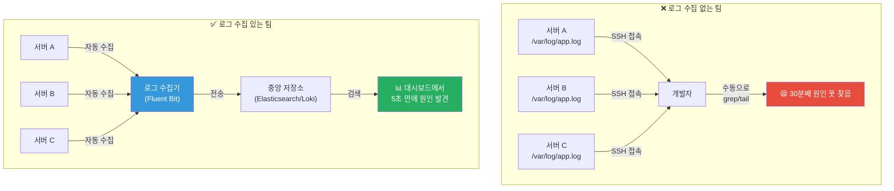
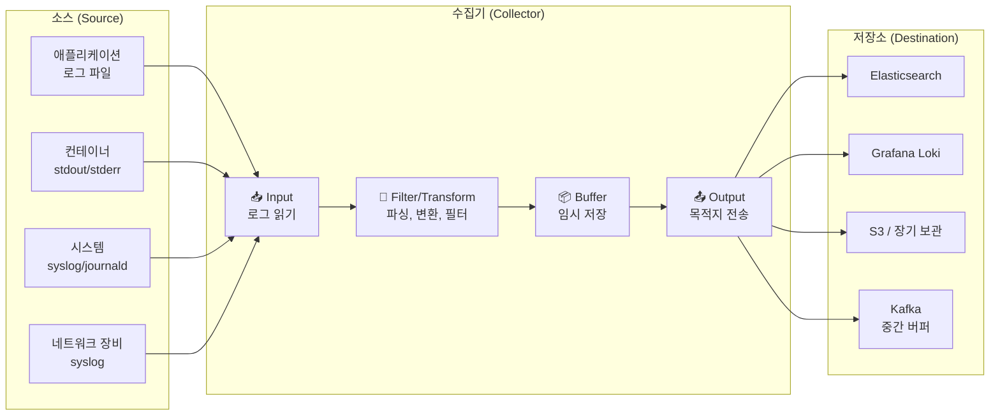
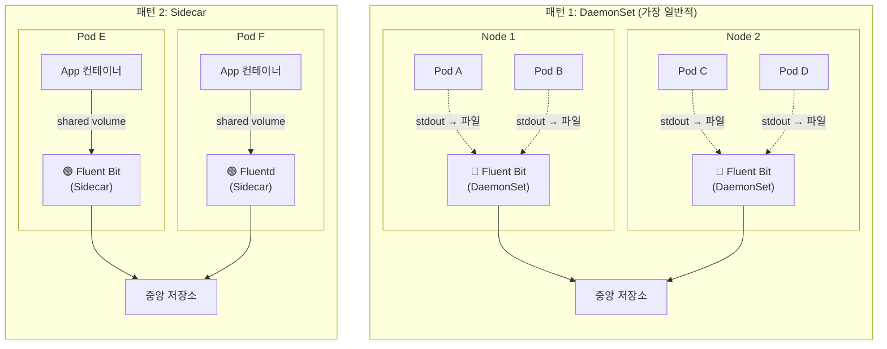
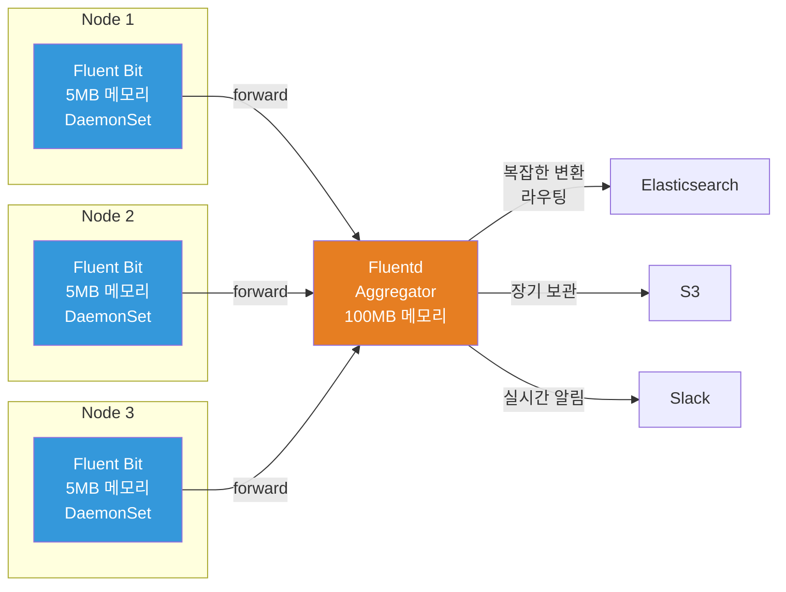
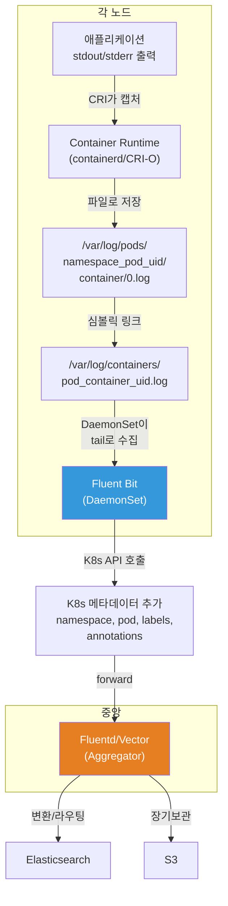

# 로그 수집 (Log Collection)

> 애플리케이션이 로그를 열심히 남겨도, 그 로그를 **한곳에 모으지 못하면** 장애 때 서버 100대를 하나씩 돌아다니며 찾아야 해요. 로그 수집기는 여러분의 시스템 곳곳에 흩어진 로그를 **자동으로 수거해서** 중앙 저장소로 보내주는 택배 기사와 같아요. [이전 강의(Structured Logging / ELK / Loki)](./04-logging)에서 로그를 어떻게 잘 남기는지 배웠다면, 이번에는 그 로그를 **어떻게 수집하고, 변환하고, 전달하는지** 알아볼게요.

---

## 🎯 왜 로그 수집을/를 알아야 하나요?

### 일상 비유: 아파트 단지의 쓰레기 수거 시스템

아파트 단지를 상상해보세요. 각 세대(서버)에서 쓰레기(로그)가 나와요.

- **수거 없는 경우**: 쓰레기가 각 세대 앞에 쌓여요. 어떤 쓰레기가 어디서 나왔는지 확인하려면 동네를 돌아다녀야 해요
- **수거 시스템이 있는 경우**: 각 동 입구에 수거함(에이전트)이 있고, 수거 트럭(수집 파이프라인)이 정해진 시간에 돌면서 모아서 재활용 센터(중앙 저장소)로 보내요

로그 수집도 똑같아요:

```
실무에서 로그 수집이 필요한 순간:

• 서버 50대에서 동시에 로그가 쌓이는데, 장애 원인을 찾으려면?   → 중앙 수집 필요
• 각 Pod이 죽으면 로그도 같이 사라지는 K8s 환경               → 실시간 수거 필요
• 로그 형식이 서비스마다 다름 (JSON, plain text, syslog)       → 파싱/변환 필요
• 하루에 100GB 로그가 쏟아지는데 저장소 비용을 줄이려면?        → 필터링/라우팅 필요
• 갑자기 로그 폭주가 발생해서 수집기가 다운될 뻔함              → backpressure 처리 필요
• 민감 정보(주민번호, 카드번호)가 로그에 포함됨                 → 마스킹/필터 필요
```

### 로그 수집 없는 팀 vs 있는 팀



### 로그 수집의 3대 역할

```
로그 수집기가 하는 일:

INPUT (수집)        →    PROCESS (처리)       →    OUTPUT (전달)
━━━━━━━━━━━━━━━      ━━━━━━━━━━━━━━━━━      ━━━━━━━━━━━━━━━
• 파일 tail           • 파싱 (JSON, regex)    • Elasticsearch
• 컨테이너 stdout      • 필드 추가/삭제        • S3 / GCS
• syslog 수신         • 민감정보 마스킹        • Kafka
• journald 읽기       • 샘플링/필터링          • Loki
• HTTP 수신           • 로그 레벨 필터         • CloudWatch
```

---

## 🧠 핵심 개념 잡기

### 1. 로그 수집 파이프라인의 구조

로그는 **생성 → 수집 → 처리 → 전달 → 저장** 의 흐름을 따라가요. 이걸 **로그 파이프라인**이라고 불러요.



### 2. 로그 수집 패턴 3가지

쿠버네티스와 같은 환경에서 로그를 수집하는 패턴은 크게 3가지예요.

| 패턴 | 비유 | 설명 | 장점 | 단점 |
|------|------|------|------|------|
| **DaemonSet** | 동마다 배치된 경비원 | 노드마다 1개 에이전트 | 리소스 효율적, 관리 단순 | Pod별 세밀한 제어 어려움 |
| **Sidecar** | 각 세대마다 전담 집사 | Pod마다 수집 컨테이너 추가 | Pod별 맞춤 설정, 격리 우수 | 리소스 오버헤드 큼 |
| **Direct (Agent)** | 택배 직접 보내기 | 앱이 직접 수집기로 전송 | 유연한 라우팅 | 앱에 의존성 추가 |



### 3. 주요 로그 수집 도구 비교

> 로그 수집 도구를 고르는 건 차를 고르는 것과 비슷해요. 경차(Fluent Bit), 중형차(Fluentd), 대형 SUV(Logstash), 전기차(Vector) - 각각 장단이 있어요.

| 항목 | Fluent Bit | Fluentd | Logstash | Vector |
|------|-----------|---------|----------|--------|
| **언어** | C | C + Ruby | Java (JRuby) | Rust |
| **메모리** | ~5-10MB | ~40-100MB | ~200-500MB | ~10-30MB |
| **CPU** | 매우 낮음 | 보통 | 높음 | 낮음 |
| **플러그인** | 80+ (내장) | 1000+ (gem) | 200+ (gem) | 300+ (내장) |
| **버퍼링** | 메모리/파일 | 메모리/파일 | 메모리/파일 | 메모리/디스크 |
| **설정 형식** | INI-like / YAML | XML-like (conf) | DSL (conf) | TOML / YAML |
| **K8s 적합성** | DaemonSet 최적 | Aggregator 최적 | 단독/VM 환경 | DaemonSet/Aggregator |
| **Backpressure** | 기본 지원 | 청크 기반 | 지원 | 고급 지원 |
| **적합한 역할** | Edge 수집기 | 중앙 집계기 | 복잡한 변환 | 올인원 |
| **커뮤니티** | CNCF Graduated | CNCF Graduated | Elastic 사 | Datadog 사 |

### 4. Backpressure (역압) 개념

> 비유: 고속도로 톨게이트가 정체되면, 진입로부터 차를 천천히 들어오게 해야 해요. 무작정 밀어넣으면 전체가 마비돼요.

**Backpressure**는 로그 목적지(Elasticsearch 등)가 처리 한계에 다다랐을 때, 수집기가 **속도를 조절하는 메커니즘**이에요.

```
Backpressure 흐름:

[App] → [수집기 Input] → [Buffer 📦] → [Output] → [목적지 💾]
                              ↓
                    버퍼가 꽉 차면?
                    ┌──────────────────────────────┐
                    │ 1. Pause: Input 일시 중지      │
                    │ 2. Drop: 오래된 로그 버림       │
                    │ 3. Overflow: 디스크 버퍼 전환    │
                    │ 4. Retry: 재전송 큐에 저장       │
                    └──────────────────────────────┘
```

---

## 🔍 하나씩 자세히 알아보기

### 1. Fluent Bit — 경량 수집기의 제왕

Fluent Bit은 CNCF Graduated 프로젝트로, **C언어로 작성된 초경량 로그 수집기**예요. 쿠버네티스 환경에서 DaemonSet으로 배포하기에 가장 적합해요.

#### Fluent Bit의 파이프라인 구조

```
[Input] → [Parser] → [Filter] → [Buffer] → [Output]
   │          │           │          │          │
   │          │           │          │          └─ 목적지로 전송
   │          │           │          └─ 임시 저장 (메모리/파일)
   │          │           └─ 로그 변환/필터링/보강
   │          └─ 비정형 → 정형 로그 변환
   └─ 로그 소스 읽기
```

#### 주요 Input 플러그인

| 플러그인 | 설명 | 사용 예 |
|---------|------|--------|
| `tail` | 파일 tail -f와 동일 | /var/log/*.log 수집 |
| `systemd` | journald 로그 읽기 | 시스템 서비스 로그 |
| `forward` | Fluentd forward 프로토콜 | Fluentd → Fluent Bit 연계 |
| `http` | HTTP 엔드포인트로 수신 | 앱이 직접 전송 |
| `kubernetes_events` | K8s 이벤트 수집 | 클러스터 이벤트 모니터링 |
| `dummy` | 테스트용 더미 데이터 | 파이프라인 테스트 |

#### Fluent Bit 설정 예시 (classic 포맷)

```ini
# fluent-bit.conf
# ─── Service 설정 ───
[SERVICE]
    Flush        5          # 5초마다 버퍼 플러시
    Daemon       Off
    Log_Level    info
    Parsers_File parsers.conf
    HTTP_Server  On         # 모니터링 엔드포인트 활성화
    HTTP_Listen  0.0.0.0
    HTTP_Port    2020

# ─── Input: 컨테이너 로그 수집 ───
[INPUT]
    Name              tail
    Tag               kube.*
    Path              /var/log/containers/*.log
    Parser            cri                # CRI 로그 포맷 파싱
    DB                /var/log/flb_kube.db  # offset 저장 (재시작 시 이어서)
    Mem_Buf_Limit     10MB               # 메모리 버퍼 제한 (backpressure)
    Skip_Long_Lines   On
    Refresh_Interval  10

# ─── Filter: K8s 메타데이터 추가 ───
[FILTER]
    Name                kubernetes
    Match               kube.*
    Kube_URL            https://kubernetes.default.svc:443
    Kube_CA_File        /var/run/secrets/kubernetes.io/serviceaccount/ca.crt
    Kube_Token_File     /var/run/secrets/kubernetes.io/serviceaccount/token
    Merge_Log           On         # JSON 로그를 필드로 풀어줌
    K8S-Logging.Parser  On         # Pod annotation으로 파서 지정 가능
    K8S-Logging.Exclude On         # Pod annotation으로 수집 제외 가능

# ─── Filter: 불필요한 로그 제거 ───
[FILTER]
    Name    grep
    Match   kube.*
    Exclude log ^(GET|HEAD) /health   # 헬스체크 로그 제거

# ─── Output: Elasticsearch로 전송 ───
[OUTPUT]
    Name            es
    Match           kube.*
    Host            elasticsearch.logging.svc
    Port            9200
    Logstash_Format On                   # 날짜별 인덱스 생성
    Logstash_Prefix k8s-logs
    Retry_Limit     5
    Buffer_Size     5MB

# ─── Output: S3로 장기 보관 ───
[OUTPUT]
    Name                         s3
    Match                        kube.*
    bucket                       my-log-archive
    region                       ap-northeast-2
    total_file_size              100M    # 100MB 단위로 업로드
    upload_timeout               10m     # 최대 10분마다
    s3_key_format                /logs/%Y/%m/%d/$TAG/%H_%M_%S.gz
    compression                  gzip
```

#### Fluent Bit YAML 포맷 (v2.x부터 권장)

```yaml
# fluent-bit.yaml
service:
  flush: 5
  log_level: info
  http_server: true
  http_listen: 0.0.0.0
  http_port: 2020

pipeline:
  inputs:
    - name: tail
      tag: kube.*
      path: /var/log/containers/*.log
      parser: cri
      db: /var/log/flb_kube.db
      mem_buf_limit: 10MB

  filters:
    - name: kubernetes
      match: kube.*
      merge_log: true
      k8s-logging.parser: true

    - name: modify
      match: kube.*
      # 민감정보 필드 제거
      remove: password
      remove: credit_card

  outputs:
    - name: es
      match: kube.*
      host: elasticsearch.logging.svc
      port: 9200
      logstash_format: true
      logstash_prefix: k8s-logs
```

#### Fluent Bit 파서 설정

```ini
# parsers.conf
# ─── CRI 컨테이너 런타임 로그 파서 ───
[PARSER]
    Name        cri
    Format      regex
    Regex       ^(?<time>[^ ]+) (?<stream>stdout|stderr) (?<logtag>[^ ]*) (?<log>.*)$
    Time_Key    time
    Time_Format %Y-%m-%dT%H:%M:%S.%L%z

# ─── Nginx 액세스 로그 파서 ───
[PARSER]
    Name        nginx
    Format      regex
    Regex       ^(?<remote>[^ ]*) (?<host>[^ ]*) (?<user>[^ ]*) \[(?<time>[^\]]*)\] "(?<method>\S+)(?: +(?<path>[^\"]*?)(?: +\S*)?)?" (?<code>[^ ]*) (?<size>[^ ]*)(?: "(?<referer>[^\"]*)" "(?<agent>[^\"]*)")?$
    Time_Key    time
    Time_Format %d/%b/%Y:%H:%M:%S %z

# ─── JSON 로그 파서 ───
[PARSER]
    Name        json
    Format      json
    Time_Key    timestamp
    Time_Format %Y-%m-%dT%H:%M:%S.%L%z
```

---

### 2. Fluentd — 플러그인 생태계의 강자

Fluentd는 CNCF Graduated 프로젝트로, Ruby와 C의 하이브리드예요. **1000개 이상의 플러그인**이 가장 큰 장점이에요. Fluent Bit이 경량 수집기라면, Fluentd는 **중앙 집계기(Aggregator)** 역할에 더 적합해요.

#### Fluentd vs Fluent Bit 역할 분리



#### Fluentd 설정 예시

```xml
# fluent.conf

# ─── Source: Fluent Bit에서 forward 수신 ───
<source>
  @type forward
  port 24224
  bind 0.0.0.0
  # TLS 설정 (프로덕션 필수)
  <transport tls>
    cert_path /etc/fluentd/certs/server.crt
    private_key_path /etc/fluentd/certs/server.key
  </transport>
</source>

# ─── Source: HTTP로 로그 수신 ───
<source>
  @type http
  port 9880
  bind 0.0.0.0
</source>

# ─── Filter: JSON 파싱 ───
<filter kube.**>
  @type parser
  key_name log
  reserve_data true
  <parse>
    @type json
    time_key timestamp
    time_format %Y-%m-%dT%H:%M:%S.%L%z
  </parse>
</filter>

# ─── Filter: 레코드 보강 ───
<filter kube.**>
  @type record_transformer
  <record>
    cluster_name "production-apne2"
    environment "production"
    collected_at ${time}
  </record>
</filter>

# ─── Filter: 민감정보 마스킹 ───
<filter kube.**>
  @type record_transformer
  enable_ruby true
  <record>
    log ${record["log"].gsub(/\d{3}-\d{2}-\d{4}/, '***-**-****')}
  </record>
</filter>

# ─── Output: 라벨 기반 라우팅 ───
<match kube.production.**>
  @type copy

  # Elasticsearch로 실시간 검색용
  <store>
    @type elasticsearch
    host elasticsearch.logging.svc
    port 9200
    logstash_format true
    logstash_prefix prod-logs
    include_tag_key true

    # ⭐ Buffer 설정 (Backpressure 핵심)
    <buffer tag, time>
      @type file                        # 파일 버퍼 (메모리보다 안전)
      path /var/log/fluentd/buffer/es
      timekey 1h                        # 1시간 단위 청크
      timekey_wait 10m                  # 청크 대기 시간
      chunk_limit_size 64MB             # 청크 최대 크기
      total_limit_size 2GB              # 전체 버퍼 한도
      flush_interval 30s                # 30초마다 플러시
      retry_max_interval 30s            # 재시도 최대 간격
      retry_forever true                # 무한 재시도
      overflow_action drop_oldest_chunk # 버퍼 꽉 차면 오래된 것부터 버림
    </buffer>
  </store>

  # S3로 장기 보관
  <store>
    @type s3
    aws_key_id "#{ENV['AWS_ACCESS_KEY_ID']}"
    aws_sec_key "#{ENV['AWS_SECRET_ACCESS_KEY']}"
    s3_bucket my-log-archive
    s3_region ap-northeast-2
    path logs/production/%Y/%m/%d/
    <buffer time>
      @type file
      path /var/log/fluentd/buffer/s3
      timekey 3600
      timekey_wait 600
      chunk_limit_size 256MB
    </buffer>
  </store>
</match>

# ─── Output: 에러 로그만 Slack 알림 ───
<match kube.production.error>
  @type slack
  webhook_url "#{ENV['SLACK_WEBHOOK_URL']}"
  channel #alerts
  username fluentd
  flush_interval 60s
</match>
```

#### Fluentd 버퍼 관리 상세

```
Fluentd 버퍼 동작 원리:

                 chunk_limit_size
                 ┌─────────────┐
Input ──→ Stage  │  Chunk #1   │ ──→ flush_interval마다 ──→ Output ──→ 목적지
                 │  (64MB)     │
                 ├─────────────┤
                 │  Chunk #2   │ ──→ 전송 대기 중
                 │  (32MB)     │
                 ├─────────────┤
                 │  Chunk #3   │ ──→ 아직 작성 중 (stage)
                 │  (10MB)     │
                 └─────────────┘
                 total_limit_size = 2GB

전송 실패 시:
  retry_wait       → 첫 재시도 대기: 1초
  retry_exponential_backoff → 1s, 2s, 4s, 8s, ...
  retry_max_interval → 최대 30초까지
  retry_forever      → 포기하지 않음

버퍼 꽉 찰 때 (overflow_action):
  throw_exception    → 에러 발생 (Input 멈춤)
  block              → Input 블로킹 (backpressure)
  drop_oldest_chunk  → 오래된 청크부터 삭제
```

---

### 3. Logstash — 복잡한 변환의 달인

Logstash는 Elastic Stack(ELK)의 "L"에 해당하는 도구예요. **Java 기반**으로 메모리를 많이 쓰지만, **강력한 필터 플러그인**과 **Grok 패턴**이 가장 큰 장점이에요.

#### Logstash 파이프라인 구조

```
[Input plugins] → [Filter plugins] → [Output plugins]
      │                  │                  │
      │                  │                  └─ elasticsearch, s3, kafka...
      │                  └─ grok, mutate, date, geoip, aggregate...
      └─ beats, file, kafka, syslog, http...
```

#### Logstash 설정 예시

```ruby
# logstash.conf

# ─── Input: Filebeat에서 수신 ───
input {
  beats {
    port => 5044
    ssl => true
    ssl_certificate => "/etc/logstash/certs/server.crt"
    ssl_key => "/etc/logstash/certs/server.key"
  }

  # Kafka에서도 수신
  kafka {
    bootstrap_servers => "kafka-1:9092,kafka-2:9092"
    topics => ["app-logs"]
    group_id => "logstash-consumers"
    codec => json
  }
}

# ─── Filter: 로그 처리의 핵심 ───
filter {
  # 1. JSON 로그 파싱
  if [message] =~ /^\{/ {
    json {
      source => "message"
      target => "parsed"
    }
  }

  # 2. Grok 패턴으로 Nginx 액세스 로그 파싱
  if [fields][type] == "nginx-access" {
    grok {
      match => {
        "message" => '%{IPORHOST:client_ip} - %{USER:ident} \[%{HTTPDATE:timestamp}\] "%{WORD:method} %{URIPATHPARAM:request} HTTP/%{NUMBER:http_version}" %{NUMBER:status} %{NUMBER:bytes} "%{DATA:referrer}" "%{DATA:user_agent}"'
      }
    }

    # 날짜 파싱
    date {
      match => ["timestamp", "dd/MMM/yyyy:HH:mm:ss Z"]
      target => "@timestamp"
    }

    # GeoIP로 위치 정보 추가
    geoip {
      source => "client_ip"
      target => "geo"
    }

    # User-Agent 파싱
    useragent {
      source => "user_agent"
      target => "ua"
    }
  }

  # 3. Grok 패턴으로 Java 스택트레이스 처리
  if [fields][type] == "java-app" {
    multiline {
      pattern => "^\s+(at|\.{3}|Caused by)"
      what => "previous"
    }

    grok {
      match => {
        "message" => '%{TIMESTAMP_ISO8601:timestamp} \[%{DATA:thread}\] %{LOGLEVEL:level}\s+%{JAVACLASS:class} - %{GREEDYDATA:log_message}'
      }
    }
  }

  # 4. 필드 변환 및 정리
  mutate {
    # 숫자 타입 변환
    convert => {
      "status" => "integer"
      "bytes" => "integer"
    }
    # 불필요한 필드 제거
    remove_field => ["beat", "input", "prospector", "offset"]
    # 필드 이름 변경
    rename => { "host" => "hostname" }
    # 소문자 변환
    lowercase => ["method"]
  }

  # 5. 민감정보 마스킹
  mutate {
    gsub => [
      # 이메일 마스킹
      "message", "[\w+\-.]+@[a-z\d\-]+(\.[a-z\d\-]+)*\.[a-z]+", "[EMAIL_MASKED]",
      # 카드번호 마스킹
      "message", "\d{4}[\s-]?\d{4}[\s-]?\d{4}[\s-]?\d{4}", "[CARD_MASKED]"
    ]
  }

  # 6. 조건부 태깅
  if [status] and [status] >= 500 {
    mutate { add_tag => ["server_error"] }
  }
  if [status] and [status] >= 400 and [status] < 500 {
    mutate { add_tag => ["client_error"] }
  }
}

# ─── Output: 라우팅 ───
output {
  # 기본: Elasticsearch
  elasticsearch {
    hosts => ["https://es-node1:9200", "https://es-node2:9200"]
    index => "logs-%{[fields][type]}-%{+YYYY.MM.dd}"
    user => "elastic"
    password => "${ES_PASSWORD}"
    ssl => true
    cacert => "/etc/logstash/certs/ca.crt"
  }

  # 에러 로그만 별도 인덱스
  if "server_error" in [tags] {
    elasticsearch {
      hosts => ["https://es-node1:9200"]
      index => "errors-%{+YYYY.MM.dd}"
      user => "elastic"
      password => "${ES_PASSWORD}"
    }
  }

  # 디버깅용 stdout (개발 환경)
  # stdout { codec => rubydebug }
}
```

#### 자주 쓰는 Grok 패턴

```ruby
# 기본 제공 Grok 패턴 예시

# IP 주소
%{IP:client_ip}                    # 192.168.1.1

# HTTP 로그
%{COMBINEDAPACHELOG}               # Apache/Nginx 통합 패턴

# Syslog
%{SYSLOGTIMESTAMP:timestamp} %{SYSLOGHOST:host} %{DATA:program}(?:\[%{POSINT:pid}\])?: %{GREEDYDATA:message}

# Java 예외
%{JAVASTACKTRACEPART}

# 커스텀 패턴 정의 (/etc/logstash/patterns/custom)
DURATION %{NUMBER:duration_ms}ms
API_LOG \[%{TIMESTAMP_ISO8601:timestamp}\] %{LOGLEVEL:level} %{WORD:service} %{WORD:method} %{URIPATH:path} %{NUMBER:status} %{DURATION}
```

---

### 4. Vector — Rust 기반의 차세대 수집기

Vector는 Datadog이 개발한 **Rust 기반** 로그/메트릭 수집기예요. 높은 성능과 **VRL(Vector Remap Language)** 이 핵심이에요.

#### Vector의 특징

```
Vector의 강점:

1. 성능
   • Rust 기반 → 메모리 안전 + 고성능
   • Fluent Bit과 비슷한 메모리 사용량
   • Logstash 대비 10배 빠른 처리량

2. VRL (Vector Remap Language)
   • 타입 안전한 변환 언어
   • 컴파일 타임에 에러 검출
   • Grok보다 직관적이고 강력함

3. 유연한 토폴로지
   • Agent (DaemonSet) 모드
   • Aggregator (중앙 수집) 모드
   • 둘 다 동일 바이너리로 가능

4. 관찰가능성
   • 내장 메트릭 / 헬스체크
   • vector top: 실시간 성능 모니터링
   • vector tap: 실시간 로그 스트림 확인
```

#### Vector 설정 예시

```toml
# vector.toml

# ─── Global 설정 ───
[api]
  enabled = true
  address = "0.0.0.0:8686"    # vector top / tap 용

# ─── Source: 쿠버네티스 로그 수집 ───
[sources.kubernetes_logs]
  type = "kubernetes_logs"
  # 자동으로 /var/log/pods/ 에서 수집
  # K8s 메타데이터 자동 추가 (namespace, pod, container)

# ─── Source: 호스트 메트릭도 수집 (로그+메트릭 통합) ───
[sources.host_metrics]
  type = "host_metrics"
  collectors = ["cpu", "memory", "disk", "network"]
  scrape_interval_secs = 15

# ─── Transform: VRL로 로그 변환 ───
[transforms.parse_logs]
  type = "remap"
  inputs = ["kubernetes_logs"]
  source = '''
    # JSON 파싱 시도
    structured, err = parse_json(.message)
    if err == null {
      . = merge(., structured)
      del(.message)
    }

    # 타임스탬프 파싱
    .timestamp = parse_timestamp!(.timestamp, format: "%Y-%m-%dT%H:%M:%S%.fZ")

    # 로그 레벨 정규화
    .level = downcase(string!(.level))
    if .level == "warn" {
      .level = "warning"
    }

    # 환경 정보 추가
    .environment = get_env_var("ENVIRONMENT") ?? "unknown"
    .cluster = get_env_var("CLUSTER_NAME") ?? "unknown"
  '''

# ─── Transform: 민감정보 마스킹 ───
[transforms.redact_sensitive]
  type = "remap"
  inputs = ["parse_logs"]
  source = '''
    # 이메일 마스킹
    if exists(.message) {
      .message = redact(.message, filters: [
        r'\b[\w.+-]+@[\w-]+\.[\w.-]+\b',
      ], redactor: {"type": "text", "replacement": "[EMAIL]"})
    }

    # 한국 주민등록번호 마스킹
    if exists(.message) {
      .message = replace(.message, r'\d{6}-[1-4]\d{6}', "[주민번호_마스킹]")
    }

    # 카드번호 마스킹
    if exists(.message) {
      .message = replace(.message, r'\d{4}[\s-]?\d{4}[\s-]?\d{4}[\s-]?\d{4}', "[CARD_MASKED]")
    }
  '''

# ─── Transform: 불필요한 로그 필터 ───
[transforms.filter_noise]
  type = "filter"
  inputs = ["redact_sensitive"]
  condition = '''
    # 헬스체크, readiness 로그 제거
    !match(string(.message) ?? "", r'(GET|HEAD) /(health|ready|live)')
    &&
    # debug 레벨 필터 (프로덕션)
    .level != "debug"
  '''

# ─── Transform: 라우팅 ───
[transforms.route_logs]
  type = "route"
  inputs = ["filter_noise"]
  [transforms.route_logs.route]
    error = '.level == "error" || .level == "fatal"'
    audit = 'starts_with(string!(.kubernetes.pod_namespace), "kube-") || .type == "audit"'
    app = '.level == "info" || .level == "warning"'

# ─── Sink: Elasticsearch ───
[sinks.elasticsearch]
  type = "elasticsearch"
  inputs = ["route_logs.app", "route_logs.error"]
  endpoints = ["https://elasticsearch.logging.svc:9200"]
  bulk.index = "logs-{{ kubernetes.pod_namespace }}-%Y.%m.%d"
  auth.strategy = "basic"
  auth.user = "elastic"
  auth.password = "${ES_PASSWORD}"
  tls.verify_certificate = true

  # Buffer & Backpressure
  [sinks.elasticsearch.buffer]
    type = "disk"                    # 디스크 버퍼 (안전)
    max_size = 5368709120            # 5GB
    when_full = "block"              # 꽉 차면 Input 블로킹

  [sinks.elasticsearch.batch]
    max_bytes = 10485760             # 10MB 단위 전송
    timeout_secs = 5

# ─── Sink: S3 장기 보관 ───
[sinks.s3_archive]
  type = "aws_s3"
  inputs = ["route_logs.app", "route_logs.error", "route_logs.audit"]
  bucket = "my-log-archive"
  region = "ap-northeast-2"
  key_prefix = "logs/%Y/%m/%d/{{ kubernetes.pod_namespace }}/"
  compression = "gzip"
  encoding.codec = "json"

  [sinks.s3_archive.batch]
    max_bytes = 104857600            # 100MB
    timeout_secs = 600               # 10분

# ─── Sink: 에러 로그만 Slack ───
[sinks.slack_errors]
  type = "http"
  inputs = ["route_logs.error"]
  uri = "${SLACK_WEBHOOK_URL}"
  method = "post"
  encoding.codec = "json"
  [sinks.slack_errors.batch]
    max_events = 1
    timeout_secs = 10
```

#### VRL (Vector Remap Language) 주요 문법

```ruby
# VRL 핵심 문법 정리

# 1. 파싱
structured = parse_json!(.message)           # JSON 파싱 (! = 실패 시 abort)
structured, err = parse_json(.message)       # 에러 핸들링
syslog = parse_syslog!(.message)             # Syslog 파싱
parsed = parse_regex!(.message, r'^(?P<ip>\S+) (?P<method>\S+) (?P<path>\S+)')

# 2. 타입 변환
.status = to_int!(.status)                   # 정수 변환
.duration = to_float!(.duration)             # 실수 변환
.is_error = to_bool!(.is_error)              # 불리언 변환

# 3. 문자열 처리
.message = downcase(.message)                # 소문자
.path = replace(.path, "/api/v1", "/api/v2") # 문자열 치환
.short_msg = truncate(.message, 200)         # 200자 잘라내기

# 4. 조건부 로직
if .status >= 500 {
    .severity = "critical"
} else if .status >= 400 {
    .severity = "warning"
} else {
    .severity = "info"
}

# 5. 필드 조작
del(.temporary_field)                        # 필드 삭제
.new_field = "value"                         # 필드 추가
. = merge(., {"env": "prod", "team": "sre"}) # 여러 필드 한번에

# 6. 에러 핸들링
result = parse_json(.message) ?? {}          # 실패 시 기본값
.ip = .client_ip ?? .remote_addr ?? "unknown" # fallback 체인
```

---

### 5. K8s 로그 수집 아키텍처

쿠버네티스 환경에서의 로그 수집은 특별한 고려사항이 있어요. 컨테이너는 언제든 사라질 수 있고, 로그도 함께 사라지니까요.

#### K8s 로그의 흐름



#### DaemonSet 패턴 전체 아키텍처

```yaml
# fluent-bit-daemonset.yaml
apiVersion: apps/v1
kind: DaemonSet
metadata:
  name: fluent-bit
  namespace: logging
  labels:
    app: fluent-bit
spec:
  selector:
    matchLabels:
      app: fluent-bit
  template:
    metadata:
      labels:
        app: fluent-bit
    spec:
      serviceAccountName: fluent-bit
      tolerations:
        # 마스터 노드에서도 실행 (모든 노드 커버)
        - key: node-role.kubernetes.io/control-plane
          operator: Exists
          effect: NoSchedule
      containers:
        - name: fluent-bit
          image: fluent/fluent-bit:3.1
          resources:
            requests:
              cpu: 50m
              memory: 64Mi
            limits:
              cpu: 200m
              memory: 256Mi
          volumeMounts:
            # 컨테이너 로그 파일 접근
            - name: varlog
              mountPath: /var/log
              readOnly: true
            # 컨테이너 런타임 로그 (containerd)
            - name: containerlog
              mountPath: /var/log/containers
              readOnly: true
            # Offset DB 저장 (재시작 시 이어서 수집)
            - name: fluent-bit-state
              mountPath: /var/log/flb-state
            # 설정 파일
            - name: config
              mountPath: /fluent-bit/etc/
          ports:
            - containerPort: 2020
              name: metrics
          livenessProbe:
            httpGet:
              path: /api/v1/health
              port: 2020
            initialDelaySeconds: 10
            periodSeconds: 30
          readinessProbe:
            httpGet:
              path: /api/v1/health
              port: 2020
            initialDelaySeconds: 5
            periodSeconds: 15
      volumes:
        - name: varlog
          hostPath:
            path: /var/log
        - name: containerlog
          hostPath:
            path: /var/log/containers
        - name: fluent-bit-state
          hostPath:
            path: /var/log/flb-state
            type: DirectoryOrCreate
        - name: config
          configMap:
            name: fluent-bit-config
---
# RBAC - K8s API 접근 권한
apiVersion: rbac.authorization.k8s.io/v1
kind: ClusterRole
metadata:
  name: fluent-bit
rules:
  - apiGroups: [""]
    resources: ["namespaces", "pods", "pods/log"]
    verbs: ["get", "list", "watch"]
---
apiVersion: rbac.authorization.k8s.io/v1
kind: ClusterRoleBinding
metadata:
  name: fluent-bit
roleRef:
  apiGroup: rbac.authorization.k8s.io
  kind: ClusterRole
  name: fluent-bit
subjects:
  - kind: ServiceAccount
    name: fluent-bit
    namespace: logging
---
apiVersion: v1
kind: ServiceAccount
metadata:
  name: fluent-bit
  namespace: logging
```

#### Sidecar 패턴 예시 (특수한 경우)

```yaml
# sidecar-pattern.yaml
# 멀티라인 로그, 특수 파싱이 필요한 경우에 사용
apiVersion: v1
kind: Pod
metadata:
  name: java-app-with-sidecar
  annotations:
    # Fluent Bit DaemonSet이 이 Pod는 건너뛰도록 설정
    fluentbit.io/exclude: "true"
spec:
  containers:
    # 메인 앱 컨테이너
    - name: java-app
      image: my-java-app:latest
      volumeMounts:
        - name: shared-logs
          mountPath: /app/logs

    # Sidecar 로그 수집기
    - name: fluent-bit-sidecar
      image: fluent/fluent-bit:3.1
      resources:
        requests:
          cpu: 20m
          memory: 32Mi
        limits:
          cpu: 100m
          memory: 128Mi
      volumeMounts:
        - name: shared-logs
          mountPath: /app/logs
          readOnly: true
        - name: sidecar-config
          mountPath: /fluent-bit/etc/
  volumes:
    - name: shared-logs
      emptyDir: {}
    - name: sidecar-config
      configMap:
        name: fluent-bit-sidecar-config
---
apiVersion: v1
kind: ConfigMap
metadata:
  name: fluent-bit-sidecar-config
data:
  fluent-bit.conf: |
    [SERVICE]
        Flush        3
        Log_Level    info

    [INPUT]
        Name         tail
        Path         /app/logs/*.log
        # Java 멀티라인 스택트레이스 처리
        Multiline    On
        Parser_Firstline java_multiline
        Tag          java.app

    [OUTPUT]
        Name         forward
        Match        *
        Host         fluentd-aggregator.logging.svc
        Port         24224

  parsers.conf: |
    [PARSER]
        Name         java_multiline
        Format       regex
        Regex        ^(?<time>\d{4}-\d{2}-\d{2} \d{2}:\d{2}:\d{2}\.\d{3}) (?<level>[A-Z]+)\s+\[(?<thread>[^\]]+)\]\s+(?<class>[^\s]+)\s*[-:]\s*(?<message>.*)
        Time_Key     time
        Time_Format  %Y-%m-%d %H:%M:%S.%L
```

---

### 6. 로그 파싱, 변환, 라우팅

#### 로그 파싱이란?

비정형(unstructured) 로그를 정형(structured) 데이터로 바꾸는 작업이에요.

```
변환 전 (비정형):
"192.168.1.1 - - [13/Mar/2026:10:15:30 +0900] \"GET /api/users HTTP/1.1\" 200 1234"

변환 후 (정형):
{
  "client_ip": "192.168.1.1",
  "timestamp": "2026-03-13T10:15:30+09:00",
  "method": "GET",
  "path": "/api/users",
  "protocol": "HTTP/1.1",
  "status": 200,
  "bytes": 1234
}
```

#### 라우팅 패턴

```
라우팅(Routing) = 로그를 조건에 따라 다른 목적지로 보내기

                              ┌─→ [error/fatal]  → Elasticsearch (Hot 노드)
                              │                    + Slack 알림
수집된 로그 → [라우팅 규칙] ─── ├─→ [info/warn]   → Elasticsearch (Warm 노드)
                              │
                              ├─→ [debug]        → S3 (장기 보관만)
                              │
                              ├─→ [audit]        → 별도 보안 저장소
                              │
                              └─→ [healthcheck]  → /dev/null (버림)

효과:
• 비용 절감: debug 로그는 저렴한 S3에만
• 성능 향상: 중요 로그만 실시간 검색 가능
• 보안 강화: 감사 로그 별도 관리
```

---

## 💻 직접 해보기

### 실습 1: Docker Compose로 Fluent Bit + Elasticsearch 구성

```yaml
# docker-compose.yaml
version: "3.8"

services:
  # 로그를 생성하는 샘플 앱
  log-generator:
    image: alpine:3.19
    command: >
      sh -c 'while true; do
        echo "{\"timestamp\":\"$(date -u +%Y-%m-%dT%H:%M:%SZ)\",\"level\":\"info\",\"service\":\"user-api\",\"message\":\"Request processed\",\"status\":200,\"duration_ms\":$((RANDOM % 500))}"
        sleep 1
        if [ $((RANDOM % 5)) -eq 0 ]; then
          echo "{\"timestamp\":\"$(date -u +%Y-%m-%dT%H:%M:%SZ)\",\"level\":\"error\",\"service\":\"user-api\",\"message\":\"Database connection timeout\",\"status\":500,\"duration_ms\":5000}"
        fi
      done'
    logging:
      driver: fluentd
      options:
        fluentd-address: "localhost:24224"
        tag: "app.log-generator"

  # Fluent Bit 수집기
  fluent-bit:
    image: fluent/fluent-bit:3.1
    ports:
      - "24224:24224"    # Forward input
      - "2020:2020"      # Metrics
    volumes:
      - ./fluent-bit.conf:/fluent-bit/etc/fluent-bit.conf
      - ./parsers.conf:/fluent-bit/etc/parsers.conf
    depends_on:
      - elasticsearch

  # Elasticsearch 저장소
  elasticsearch:
    image: docker.elastic.co/elasticsearch/elasticsearch:8.12.0
    environment:
      - discovery.type=single-node
      - xpack.security.enabled=false
      - "ES_JAVA_OPTS=-Xms512m -Xmx512m"
    ports:
      - "9200:9200"
    volumes:
      - es-data:/usr/share/elasticsearch/data

  # Kibana (시각화)
  kibana:
    image: docker.elastic.co/kibana/kibana:8.12.0
    environment:
      - ELASTICSEARCH_HOSTS=http://elasticsearch:9200
    ports:
      - "5601:5601"
    depends_on:
      - elasticsearch

volumes:
  es-data:
```

```ini
# fluent-bit.conf (실습용)
[SERVICE]
    Flush        3
    Log_Level    info
    Parsers_File parsers.conf
    HTTP_Server  On
    HTTP_Listen  0.0.0.0
    HTTP_Port    2020

# Forward 프로토콜로 Docker 로그 수신
[INPUT]
    Name         forward
    Listen       0.0.0.0
    Port         24224

# JSON 로그 파싱
[FILTER]
    Name         parser
    Match        app.*
    Key_Name     log
    Parser       json
    Reserve_Data On

# status >= 500인 로그에 태그 추가
[FILTER]
    Name         modify
    Match        app.*
    Condition    Key_Value_Matches status ^5\d{2}$
    Add          error_flag true

# Elasticsearch로 전송
[OUTPUT]
    Name            es
    Match           app.*
    Host            elasticsearch
    Port            9200
    Logstash_Format On
    Logstash_Prefix app-logs
    Suppress_Type_Name On
    Retry_Limit     5

# stdout으로도 출력 (디버깅용)
[OUTPUT]
    Name            stdout
    Match           app.*
    Format          json_lines
```

```ini
# parsers.conf (실습용)
[PARSER]
    Name        json
    Format      json
    Time_Key    timestamp
    Time_Format %Y-%m-%dT%H:%M:%SZ
```

실행 방법:

```bash
# 1. 디렉토리 생성 및 파일 저장
mkdir -p log-collection-lab && cd log-collection-lab
# 위의 3개 파일을 저장

# 2. Docker Compose 실행
docker compose up -d

# 3. 로그 수집 확인 (잠시 기다린 후)
curl -s "http://localhost:9200/app-logs-*/_search?pretty&size=3" | jq '.hits.hits[]._source'

# 4. Fluent Bit 메트릭 확인
curl -s http://localhost:2020/api/v1/metrics | jq .

# 5. Kibana 접속
# 브라우저에서 http://localhost:5601 접속
# Index Pattern: app-logs-* 생성 후 로그 확인

# 6. 정리
docker compose down -v
```

### 실습 2: Vector 설치 및 테스트

```bash
# Vector 설치 (Linux)
curl --proto '=https' --tlsv1.2 -sSfL https://sh.vector.dev | bash

# 또는 Docker로 실행
docker run -d \
  --name vector \
  -v $(pwd)/vector.toml:/etc/vector/vector.toml \
  -p 8686:8686 \
  timberio/vector:latest-alpine

# 간단한 테스트 설정
cat > vector-test.toml << 'EOF'
[sources.demo_logs]
  type = "demo_logs"
  format = "json"
  interval = 1.0

[transforms.parse]
  type = "remap"
  inputs = ["demo_logs"]
  source = '''
    .processed_at = now()
    .environment = "test"

    if .level == "error" {
      .alert = true
    }
  '''

[sinks.console]
  type = "console"
  inputs = ["parse"]
  encoding.codec = "json"
EOF

# Vector 실행 (테스트)
vector --config vector-test.toml

# vector top으로 실시간 모니터링 (다른 터미널)
vector top

# vector tap으로 실시간 로그 확인 (다른 터미널)
vector tap
```

### 실습 3: VRL Playground로 변환 로직 테스트

```bash
# VRL을 대화형으로 테스트
# vector vrl 서브커맨드 사용

vector vrl << 'EOF'
# 입력 데이터 설정
. = {
  "message": "192.168.1.100 - admin [13/Mar/2026:14:30:00 +0900] \"POST /api/login HTTP/1.1\" 401 0",
  "source": "nginx"
}

# Regex로 파싱
parsed = parse_regex!(.message, r'^(?P<ip>\S+) - (?P<user>\S+) \[(?P<time>[^\]]+)\] "(?P<method>\S+) (?P<path>\S+) (?P<proto>\S+)" (?P<status>\d+) (?P<bytes>\d+)')

# 필드 병합
. = merge(., parsed)
.status = to_int!(.status)
.bytes = to_int!(.bytes)

# 조건부 처리
if .status == 401 {
  .security_event = true
  .alert_level = "warning"
}

# 원본 메시지 삭제
del(.message)

# 결과 확인
.
EOF
```

---

## 🏢 실무에서는?

### 시나리오 1: 중규모 서비스 (노드 20대, 일 50GB 로그)

```
아키텍처:

[K8s 클러스터 - 20노드]
    └── Fluent Bit (DaemonSet, 노드당 1개)
          ├── 헬스체크 로그 필터링 (30% 감소)
          ├── JSON 파싱 + K8s 메타데이터
          └── forward 프로토콜로 전송
                  │
                  ▼
        Fluentd Aggregator (Deployment, 3 replicas)
          ├── 로그 레벨별 라우팅
          ├── 민감정보 마스킹
          └── 목적지별 전송
              ├── error/warn → Elasticsearch (Hot 7일)
              ├── info → Elasticsearch (Warm 30일)
              ├── debug → S3 (90일 보관 후 삭제)
              └── audit → 별도 보안 클러스터

비용 절감 효과:
  • 필터링으로 30% 로그 감소: 50GB → 35GB/일
  • 라우팅으로 ES 비용 40% 절감
  • S3 장기보관으로 규정 준수
```

### 시나리오 2: 대규모 서비스 (노드 200대, 일 1TB 로그)

```
아키텍처:

[K8s 클러스터 - 200노드]
    └── Fluent Bit (DaemonSet)
          └── forward
                │
                ▼
          Kafka 클러스터 (중간 버퍼)
          ├── topic: logs.app
          ├── topic: logs.system
          └── topic: logs.audit
                │
                ▼
          Vector Aggregator (Deployment, 10 replicas)
          ├── VRL로 파싱/변환
          ├── 샘플링 (debug 로그 10%만)
          └── 라우팅
              ├── Elasticsearch (실시간 검색, 7일)
              ├── ClickHouse (장기 분석, 90일)
              └── S3 Glacier (규정 준수, 7년)

Kafka를 중간에 넣는 이유:
  1. 수집기와 저장소 사이의 완충 (backpressure 흡수)
  2. 여러 Consumer가 같은 로그를 다르게 처리 가능
  3. 저장소 장애 시에도 로그 유실 방지
  4. 피크 트래픽 흡수 (블랙프라이데이 등)
```

### 시나리오 3: 장애 대응 — 로그 폭주 상황

```
상황: 배포 실패로 애플리케이션이 초당 10,000건의 에러 로그를 발생

대응 흐름:
1. Fluent Bit의 Mem_Buf_Limit 도달 → Pause 모드 진입
   → Input이 일시적으로 멈춤 (로그 유실 가능)

2. Fluent Bit → Fluentd forward가 느려짐
   → Fluentd의 buffer가 차기 시작

3. Fluentd buffer가 total_limit_size에 도달
   → overflow_action: drop_oldest_chunk 실행

4. SRE 팀 대응:
   a) kubectl rollback → 에러 로그 발생 중단
   b) Fluent Bit의 Mem_Buf_Limit 일시 증가
   c) Fluentd buffer 정리 확인
   d) Elasticsearch 인덱스 정상 확인

예방 조치:
  • 로그 레벨별 rate limiting 설정
  • 에러 로그 샘플링 (같은 에러는 10개 중 1개만)
  • Grafana에서 로그 볼륨 알림 설정
  • Kafka 도입으로 완충 레이어 추가
```

### 실무 팁: Pod Annotation으로 수집 제어

```yaml
# 특정 Pod의 로그 수집을 커스터마이즈하는 방법
apiVersion: v1
kind: Pod
metadata:
  name: my-app
  annotations:
    # Fluent Bit: 이 Pod는 수집 제외
    fluentbit.io/exclude: "true"

    # Fluent Bit: 커스텀 파서 지정
    fluentbit.io/parser: "my-custom-parser"

    # Fluentd: 커스텀 파서 지정
    fluentd.org/parser: "json"

    # Vector: 커스텀 라벨
    vector.dev/exclude: "true"
spec:
  containers:
    - name: app
      image: my-app:latest
```

---

## ⚠️ 자주 하는 실수

### 실수 1: 메모리 버퍼만 사용하기

```
❌ 잘못된 설정:
[INPUT]
    Name              tail
    Path              /var/log/containers/*.log
    # Mem_Buf_Limit 미설정 → 무한 메모리 사용 가능!

✅ 올바른 설정:
[INPUT]
    Name              tail
    Path              /var/log/containers/*.log
    Mem_Buf_Limit     10MB    # 반드시 제한 설정!
    DB                /var/log/flb.db  # offset 저장소도 필수

[SERVICE]
    storage.path       /var/log/flb-storage/   # 디스크 버퍼 경로
    storage.sync       normal
    storage.checksum   off
    storage.max_chunks_up 128

이유:
  • 목적지(ES 등) 장애 시 버퍼가 무한히 커질 수 있음
  • OOM Kill → 수집기 Pod 재시작 → 로그 유실
  • 메모리 제한 + 디스크 버퍼 조합이 가장 안전
```

### 실수 2: 오프셋(DB) 파일을 영구 볼륨에 저장하지 않기

```
❌ 잘못된 구성:
# DB 파일이 컨테이너 내부에만 저장
# Pod 재시작 → DB 파일 사라짐 → 처음부터 다시 수집 → 중복 로그!

✅ 올바른 구성:
# DaemonSet에서 hostPath로 DB 파일 저장
volumeMounts:
  - name: fluent-bit-state
    mountPath: /var/log/flb-state

volumes:
  - name: fluent-bit-state
    hostPath:
      path: /var/log/flb-state
      type: DirectoryOrCreate

# fluent-bit.conf
[INPUT]
    Name    tail
    DB      /var/log/flb-state/tail.db    # 재시작해도 이어서 수집
```

### 실수 3: 모든 로그를 Elasticsearch에 넣기

```
❌ 잘못된 접근:
  "모든 로그를 ES에 넣으면 뭐든 검색할 수 있으니까!"
  → 월 ES 비용: $5,000+ (100GB/일 기준)
  → 인덱스 너무 커서 검색 속도 저하
  → 30일 분량 유지에 스토리지 3TB 필요

✅ 올바른 접근 (계층적 저장):

  로그 레벨    │  저장소          │  보관 기간  │  비용 (월)
  ─────────────┼─────────────────┼────────────┼──────────
  error/fatal  │  ES Hot 노드    │  30일      │  $500
  warn/info    │  ES Warm 노드   │  14일      │  $300
  debug        │  S3 Standard    │  90일      │  $50
  전체 백업    │  S3 Glacier     │  365일     │  $20
  ─────────────┼─────────────────┼────────────┼──────────
  합계         │                 │            │  $870

  비용 절감: $5,000 → $870 (83% 절감!)
```

### 실수 4: 파싱을 엣지에서 너무 많이 하기

```
❌ 잘못된 접근:
  Fluent Bit (DaemonSet)에서 복잡한 Grok 파싱 + GeoIP + 변환을 모두 처리
  → 노드마다 CPU/메모리 사용량 증가
  → 200노드 × 200MB = 40GB 메모리 낭비

✅ 올바른 접근:
  Fluent Bit (엣지):
    • 기본 JSON 파싱만
    • K8s 메타데이터 추가
    • 불필요한 로그 필터링 (헬스체크 등)
    → 노드당 ~50MB

  Fluentd/Vector (중앙):
    • 복잡한 Grok 파싱
    • GeoIP 변환
    • 민감정보 마스킹
    • 라우팅 로직
    → 3 replicas × 500MB = 1.5GB

  차이: 40GB vs 1.5GB → 96% 메모리 절감
```

### 실수 5: Retry 설정 없이 운영하기

```
❌ 잘못된 설정:
[OUTPUT]
    Name  es
    Match *
    Host  elasticsearch
    # Retry 설정 없음 → 전송 실패 시 로그 유실!

✅ 올바른 설정:
[OUTPUT]
    Name            es
    Match           *
    Host            elasticsearch
    Retry_Limit     10          # 최대 10번 재시도
    # 또는
    Retry_Limit     False       # 무한 재시도 (Mem_Buf_Limit과 함께 사용)

# Fluentd의 경우
<buffer>
  retry_type exponential_backoff
  retry_wait 1s                  # 첫 재시도: 1초
  retry_max_interval 60s         # 최대 간격: 60초
  retry_forever true             # 무한 재시도
  retry_timeout 72h              # 72시간 후 포기 (대안)
</buffer>
```

### 실수 6: 로그 수집기 모니터링 안 하기

```
❌ "로그 수집기는 한번 설치하면 알아서 돌겠지?"
   → 수집기가 죽었는데 아무도 모름 → 하루치 로그 유실

✅ 반드시 모니터링해야 할 메트릭:

Fluent Bit:
  • fluentbit_input_records_total    → 입력 로그 수
  • fluentbit_output_retries_total   → 재시도 횟수 (급증 = 목적지 이상)
  • fluentbit_output_errors_total    → 전송 실패 횟수
  • fluentbit_filter_drop_records    → 필터링된 로그 수

Vector:
  • vector_component_received_events_total
  • vector_component_sent_events_total
  • vector_buffer_events                    → 버퍼 크기
  • vector_component_errors_total

Grafana 알림 규칙:
  • 5분간 input_records = 0 → "로그 수집 중단" 알림
  • output_retries > 100/분 → "목적지 장애 의심" 알림
  • buffer_events > 1M → "버퍼 위험 수준" 알림
```

---

## 📝 마무리

### 핵심 요약 체크리스트

```
로그 수집 핵심 정리:

✅ 로그 수집 = INPUT(읽기) → FILTER(변환) → BUFFER(임시저장) → OUTPUT(전달)
✅ K8s에서는 DaemonSet 패턴이 기본, 특수한 경우만 Sidecar
✅ Fluent Bit = 엣지 수집기 (경량), Fluentd = 중앙 집계기 (플러그인 풍부)
✅ Vector = Rust 기반 올인원, VRL로 타입 안전한 변환
✅ Logstash = Grok 패턴 강력, 하지만 무거움 (VM 환경에 적합)
✅ Backpressure 반드시 설정: Mem_Buf_Limit + 디스크 버퍼 + Retry
✅ 라우팅으로 비용 최적화: 중요한 로그만 ES, 나머지는 S3
✅ 수집기도 모니터링 대상: 메트릭 수집 + 알림 설정 필수
```

### 도구 선택 가이드

```
어떤 도구를 써야 할까?

질문 1: K8s 환경인가요?
  ├── Yes → 질문 2로
  └── No (VM/베어메탈) → Logstash 또는 Vector

질문 2: 기존 ELK 스택을 사용 중인가요?
  ├── Yes → Fluent Bit (DaemonSet) + 기존 ES
  └── No → 질문 3으로

질문 3: 복잡한 변환이 필요한가요?
  ├── Yes → Fluent Bit (엣지) + Fluentd (중앙)
  │         또는 Vector (올인원)
  └── No → Fluent Bit 단독으로 충분

질문 4: 새로 구축하는 시스템인가요?
  ├── Yes → Vector 추천 (성능 + 단순함)
  └── No → 기존 스택에 맞춰서 선택

실무 인기 조합:
  1위: Fluent Bit (DaemonSet) → Elasticsearch/Loki
  2위: Fluent Bit (엣지) → Fluentd (중앙) → ES + S3
  3위: Vector (올인원) → ES/Loki + S3
  4위: Fluent Bit → Kafka → Vector → ES + S3 (대규모)
```

### 한눈에 보는 비교 최종표

| 기준 | Fluent Bit | Fluentd | Logstash | Vector |
|------|-----------|---------|----------|--------|
| **한 줄 요약** | K8s 엣지 수집 최강 | 플러그인 생태계 최강 | Grok/변환 최강 | 성능+안전성 최강 |
| **추천 역할** | DaemonSet 수집기 | 중앙 Aggregator | 복잡한 ETL | 올인원 Agent |
| **메모리** | 5-10MB | 40-100MB | 200-500MB | 10-30MB |
| **설정 난이도** | 쉬움 | 보통 | 보통 | 보통 |
| **K8s 호환** | 최고 | 좋음 | 보통 | 좋음 |
| **커뮤니티** | CNCF | CNCF | Elastic | Datadog |
| **학습 우선순위** | 1순위 | 2순위 | 3순위 | 2순위 |

---

## 🔗 다음 단계

### 이전 강의와의 연결

- [로깅 (Structured Logging / ELK / Loki)](./04-logging): 로그를 **어떻게 잘 남기는지** 배웠어요. 이번 강의에서는 그 로그를 **어떻게 수집하는지** 알아봤어요
- [K8s DaemonSet](../04-kubernetes/03-statefulset-daemonset): DaemonSet이 뭔지 모른다면, K8s 강의를 먼저 보고 오세요. 로그 수집기가 왜 DaemonSet으로 배포되는지 이해할 수 있어요

### 다음 강의

- [분산 추적 (OpenTelemetry / Jaeger / Zipkin)](./06-tracing): 로그만으로는 마이크로서비스 간의 요청 흐름을 추적하기 어려워요. 다음 강의에서는 **분산 추적(Distributed Tracing)** 을 배우고, 로그 + 메트릭 + 트레이스를 **하나로 연결하는 방법**을 알아볼게요

### 더 공부하기

```
심화 학습 로드맵:

1. Fluent Bit 공식 문서
   → https://docs.fluentbit.io

2. Vector 공식 문서 + VRL Playground
   → https://vector.dev/docs
   → https://playground.vrl.dev

3. Fluentd 플러그인 목록
   → https://www.fluentd.org/plugins

4. OpenTelemetry Collector (로그 수집의 미래)
   → 다음 강의(06-tracing)에서 함께 다뤄요

5. 실무 프로젝트
   → Fluent Bit DaemonSet을 실제 K8s 클러스터에 배포해보기
   → Vector로 Fluent Bit을 대체해보고 성능 비교하기
   → Grafana Loki + Fluent Bit 조합 구축해보기
```
