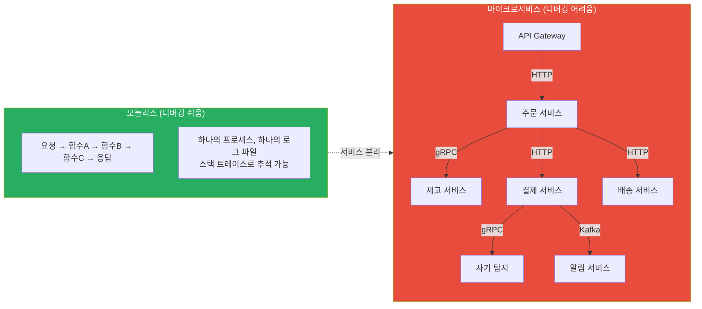
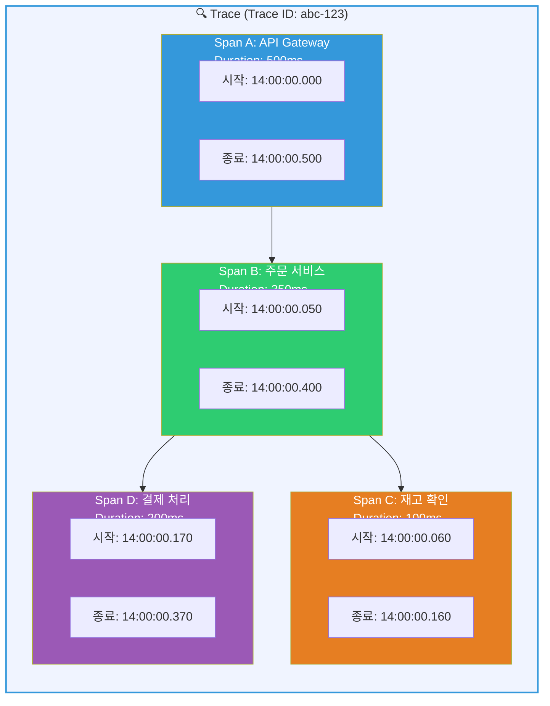
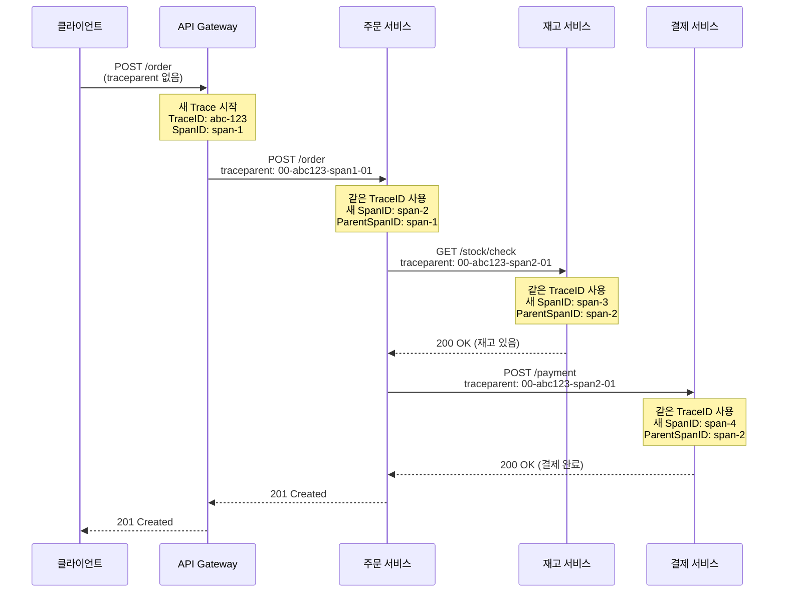
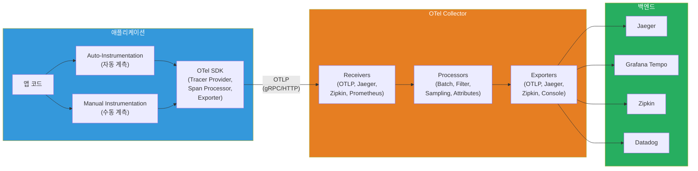
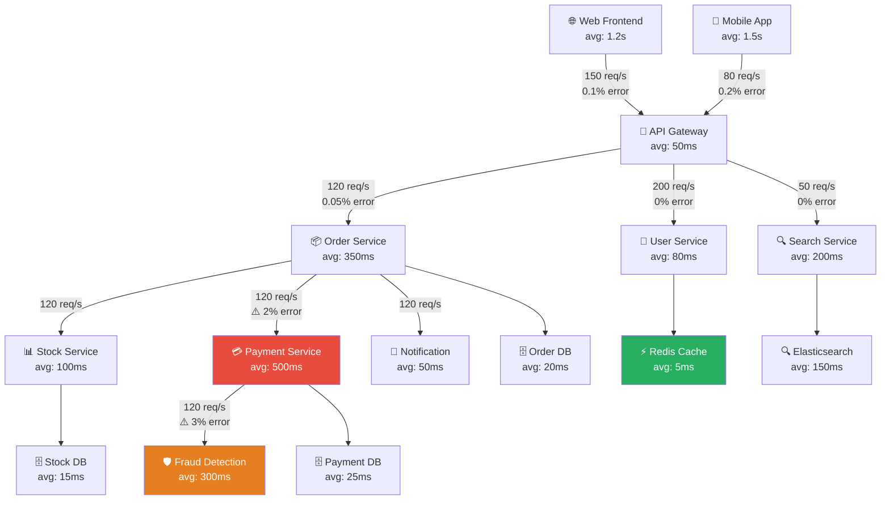
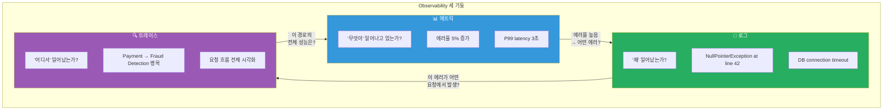

# 분산 추적(Distributed Tracing) — 요청의 여정을 따라가기

> 로그가 "무슨 일이 일어났는지"를 알려준다면, 분산 추적은 "그 일이 어디서 어떤 순서로 얼마나 걸려서 일어났는지"를 알려줘요. [로깅](./04-logging)에서 구조화된 로그를 배웠고, [Observability 개념](./01-concept)에서 메트릭-로그-트레이스 세 기둥을 살펴봤죠? 이번에는 그 세 번째 기둥, **분산 추적**을 깊이 파고들어볼 거예요. OpenTelemetry, Jaeger, Zipkin, Tempo까지 — 마이크로서비스 시대에 반드시 알아야 하는 핵심 기술이에요.

---

## 🎯 왜 분산 추적을/를 알아야 하나요?

### 일상 비유: 택배 추적 시스템

인터넷 쇼핑을 하면 "배송 추적"을 눌러보죠? 그러면 이런 화면이 나와요.

```
📦 주문번호: TRACE-ABC-12345

14:00  판매자 발송                    (주문 서비스)
14:30  서울 물류센터 도착              (재고 서비스)
15:00  서울 물류센터 출발              (배송 서비스)
16:30  부산 허브 도착                  (라우팅 서비스)
17:00  부산 허브 출발                  (배송 서비스)
18:30  배달원 배정                    (배정 서비스)
19:00  배달 완료 ✅                   (완료 서비스)
```

이 추적 시스템이 없다면? "내 택배 어디 있어요?"라는 질문에 **아무도 답할 수 없어요**. 각 물류 센터에 전화해서 "혹시 이 택배 지나갔나요?"를 하나하나 물어봐야 해요.

**분산 추적은 바로 이 택배 추적 시스템의 소프트웨어 버전이에요.**

### 분산 추적이 없으면 생기는 문제

```
실무에서 분산 추적이 필요한 순간:

• "결제가 느려요" → 20개 서비스 중 어디서 느린 건지 모름          → Trace로 병목 지점 즉시 확인
• "간헐적으로 500 에러가 나요" → 로그만으로는 흐름 파악 불가       → Trace로 실패 지점과 원인 추적
• "이 API가 왜 3초나 걸리죠?" → 서비스 간 호출 관계를 모름        → Span 타이밍으로 지연 분석
• "장애 영향 범위가 어디까지인가요?" → 서비스 의존관계 파악 불가    → Service Dependency Map
• "이 로그가 어떤 요청에서 나온 건가요?" → 로그 간 연결 불가       → Trace-Log Correlation
• "마이크로서비스 성능을 최적화하고 싶어요" → 전체 흐름 미파악     → End-to-End Latency 분석
```

### 모놀리스 vs 마이크로서비스 디버깅



모놀리스에서는 하나의 스택 트레이스로 전체 흐름을 볼 수 있었어요. 하지만 마이크로서비스에서는 요청이 **여러 서비스를 넘나들면서** 처리돼요. 각 서비스는 자기 로그만 가지고 있기 때문에, **요청 하나의 전체 여정을 보려면 분산 추적이 반드시 필요**해요.

---

## 🧠 핵심 개념 잡기

분산 추적을 이해하려면 핵심 구성 요소 5가지를 먼저 잡아야 해요.

### 비유: 택배 추적 시스템

| 택배 세계 | 분산 추적 |
|-----------|----------|
| 송장 번호 (운송장) | **Trace ID** (요청 전체를 식별) |
| 각 구간의 추적 기록 | **Span** (서비스 내 작업 단위) |
| 구간별 스캔 바코드 | **Span ID** (각 Span을 식별) |
| "서울→부산" 경로 연결 | **Parent Span ID** (Span 간 부모-자식 관계) |
| 송장에 적힌 메모 (취급주의 등) | **Span Context** (서비스 간 전파되는 메타데이터) |
| 택배 분류 센터 | **Collector** (트레이스 데이터 수집/처리) |
| 택배 추적 앱 | **Tracing Backend** (Jaeger, Zipkin, Tempo) |

### Trace, Span, SpanContext 관계



### 핵심 용어 정리

| 용어 | 설명 | 비유 |
|------|------|------|
| **Trace** | 하나의 요청이 시스템을 통과하는 전체 여정 | 택배 하나의 전체 배송 경로 |
| **Span** | Trace 안에서 하나의 작업 단위 (서비스 호출, DB 쿼리 등) | 택배가 각 물류 센터에 머무는 구간 |
| **Root Span** | Trace의 시작점이 되는 첫 번째 Span | 판매자가 택배를 처음 보내는 시점 |
| **Child Span** | 다른 Span에 의해 시작된 하위 Span | 물류 센터 내부에서의 분류 작업 |
| **Span Context** | 서비스 간 전파되는 메타데이터 (Trace ID + Span ID + flags) | 송장에 적힌 정보가 다음 센터로 전달 |
| **Baggage** | Span과 함께 전파되는 사용자 정의 키-값 쌍 | 택배 송장의 "취급주의" 메모 |
| **Span Attributes** | Span에 첨부된 키-값 메타데이터 | 각 구간의 처리 상세 기록 |
| **Span Events** | Span 실행 중 발생한 이벤트 (로그 포인트) | "포장 손상 발견" 같은 중간 기록 |
| **Span Status** | Span 결과 (OK, ERROR, UNSET) | 구간 처리 성공/실패 여부 |

---

## 🔍 하나씩 자세히 알아보기

### 1. Trace와 Span의 구조

#### Span의 내부 구조

하나의 Span은 다음 정보를 담고 있어요.

```json
{
  "traceId": "5b8aa5a2d2c872e8321cf37308d69df2",
  "spanId": "051581bf3cb55c13",
  "parentSpanId": "ab1f2c3d4e5f6789",
  "operationName": "POST /api/orders",
  "serviceName": "order-service",
  "startTime": "2026-03-13T14:00:00.050Z",
  "duration": "350ms",
  "status": "OK",
  "attributes": {
    "http.method": "POST",
    "http.url": "/api/orders",
    "http.status_code": 201,
    "user.id": "user-42",
    "order.id": "ord-9876"
  },
  "events": [
    {
      "name": "재고 확인 완료",
      "timestamp": "2026-03-13T14:00:00.160Z",
      "attributes": { "inventory.available": true }
    },
    {
      "name": "결제 요청",
      "timestamp": "2026-03-13T14:00:00.170Z",
      "attributes": { "payment.method": "card" }
    }
  ],
  "links": [],
  "spanKind": "SERVER"
}
```

#### Span Kind 종류

| Kind | 설명 | 예시 |
|------|------|------|
| `CLIENT` | 다른 서비스를 호출하는 쪽 | HTTP 클라이언트, gRPC 클라이언트 |
| `SERVER` | 호출을 받는 쪽 | HTTP 서버 핸들러 |
| `PRODUCER` | 메시지를 보내는 쪽 | Kafka producer |
| `CONSUMER` | 메시지를 받는 쪽 | Kafka consumer |
| `INTERNAL` | 서비스 내부 작업 | 비즈니스 로직, DB 쿼리 |

---

### 2. W3C Trace Context — 표준 전파 방식

마이크로서비스 사이에서 Trace 정보를 어떻게 전달할까요? **W3C Trace Context**라는 표준이 있어요. HTTP 헤더를 통해 Trace 정보를 전파해요.

#### 전파 헤더

```
# traceparent 헤더 (필수)
traceparent: 00-5b8aa5a2d2c872e8321cf37308d69df2-051581bf3cb55c13-01

# 형식: version-traceId-parentSpanId-traceFlags
# 00      = 버전
# 5b8a... = Trace ID (32자 hex, 16바이트)
# 0515... = Parent Span ID (16자 hex, 8바이트)
# 01      = Trace Flags (01 = sampled)

# tracestate 헤더 (선택)
tracestate: congo=t61rcWkgMzE,rojo=00f067aa0ba902b7
# 벤더별 추가 정보 (여러 트레이싱 시스템 호환)
```

#### 전파 흐름



핵심은 이거예요: **Trace ID는 전체 요청 동안 동일하게 유지**되고, **각 서비스는 새로운 Span ID를 생성**해요. 이렇게 하면 나중에 Trace ID 하나로 전체 요청의 여정을 재구성할 수 있어요.

#### 전파 방식 비교

| 전파 방식 | 헤더 | 특징 |
|-----------|------|------|
| **W3C Trace Context** | `traceparent`, `tracestate` | 표준, 권장 |
| **B3 (Zipkin)** | `X-B3-TraceId`, `X-B3-SpanId` 등 | Zipkin 네이티브 |
| **B3 Single** | `b3` | B3의 단일 헤더 버전 |
| **Jaeger** | `uber-trace-id` | Jaeger 네이티브 (레거시) |
| **AWS X-Ray** | `X-Amzn-Trace-Id` | AWS 전용 |

> 현재 업계 표준은 **W3C Trace Context**예요. OpenTelemetry도 기본 전파 방식으로 W3C를 사용해요. 새 프로젝트라면 W3C를 선택하세요.

---

### 3. OpenTelemetry — 관측 가능성의 통합 표준

#### OpenTelemetry란?

OpenTelemetry(줄여서 OTel)는 **Trace, Metric, Log를 수집하는 오픈 소스 표준 프레임워크**예요. CNCF(Cloud Native Computing Foundation) 프로젝트로, Kubernetes 다음으로 활발한 프로젝트예요.

예전에는 Jaeger 클라이언트, Zipkin 클라이언트, Datadog 클라이언트 등 **벤더마다 다른 SDK**를 사용했어요. OpenTelemetry는 이걸 하나로 통합했어요.

```
Before OpenTelemetry:
  앱 코드 → Jaeger SDK → Jaeger
  앱 코드 → Zipkin SDK → Zipkin
  앱 코드 → Datadog SDK → Datadog
  (벤더 종속! 바꾸려면 코드 전체 수정)

After OpenTelemetry:
  앱 코드 → OTel SDK → OTel Collector → Jaeger / Zipkin / Tempo / Datadog
  (벤더 독립! Collector 설정만 바꾸면 됨)
```

#### OpenTelemetry 구성 요소



#### OTel SDK 핵심 구성

```python
# Python OpenTelemetry SDK 초기화 예시
from opentelemetry import trace
from opentelemetry.sdk.trace import TracerProvider
from opentelemetry.sdk.trace.export import BatchSpanProcessor
from opentelemetry.exporter.otlp.proto.grpc.trace_exporter import OTLPSpanExporter
from opentelemetry.sdk.resources import Resource

# 1. Resource: 이 서비스가 뭔지 정의
resource = Resource.create({
    "service.name": "order-service",        # 서비스 이름 (필수!)
    "service.version": "1.2.0",             # 서비스 버전
    "deployment.environment": "production",  # 환경
})

# 2. Exporter: 트레이스를 어디로 보낼지 설정
exporter = OTLPSpanExporter(
    endpoint="http://otel-collector:4317",  # Collector 주소 (gRPC)
    insecure=True,
)

# 3. SpanProcessor: 어떻게 처리할지 설정
processor = BatchSpanProcessor(
    exporter,
    max_queue_size=2048,          # 큐 최대 크기
    max_export_batch_size=512,    # 배치당 최대 Span 수
    schedule_delay_millis=5000,   # 5초마다 내보내기
)

# 4. TracerProvider: 모든 것을 조합
provider = TracerProvider(resource=resource)
provider.add_span_processor(processor)
trace.set_tracer_provider(provider)

# 5. Tracer 사용
tracer = trace.get_tracer("order-service", "1.2.0")
```

#### OTLP (OpenTelemetry Protocol)

OTLP는 OTel의 네이티브 프로토콜이에요. 두 가지 전송 방식을 지원해요.

| 방식 | 포트 | 특징 |
|------|------|------|
| **gRPC** | `4317` | 고성능, 바이너리, 스트리밍 지원 |
| **HTTP/protobuf** | `4318` | 방화벽 친화적, 더 넓은 호환성 |

---

### 4. OTel Collector — 트레이스 데이터의 중앙 허브

OTel Collector는 텔레메트리 데이터를 **수신, 처리, 전달**하는 중간 에이전트예요. 직접 백엔드로 보내는 대신 Collector를 거치면 여러 이점이 있어요.

```yaml
# otel-collector-config.yaml
receivers:
  # OTLP 수신기: SDK에서 보내는 데이터 수신
  otlp:
    protocols:
      grpc:
        endpoint: "0.0.0.0:4317"    # gRPC 수신 포트
      http:
        endpoint: "0.0.0.0:4318"    # HTTP 수신 포트

  # Jaeger 포맷 데이터도 수신 가능 (마이그레이션 시 유용)
  jaeger:
    protocols:
      thrift_http:
        endpoint: "0.0.0.0:14268"

processors:
  # 배치 처리: 데이터를 모아서 한 번에 전송 (성능 최적화)
  batch:
    timeout: 5s                     # 5초마다 전송
    send_batch_size: 1024           # 1024개 모이면 전송

  # 메모리 제한: Collector가 OOM으로 죽는 것 방지
  memory_limiter:
    check_interval: 1s
    limit_mib: 512                  # 최대 512MB
    spike_limit_mib: 128

  # 불필요한 속성 필터링
  attributes:
    actions:
      - key: "http.user_agent"
        action: delete              # 불필요한 속성 제거
      - key: "environment"
        value: "production"
        action: upsert              # 속성 추가/갱신

  # Tail Sampling: 중요한 트레이스만 보관
  tail_sampling:
    decision_wait: 10s              # 10초 동안 모든 Span 대기
    policies:
      - name: error-policy
        type: status_code
        status_code: { status_codes: [ERROR] }  # 에러 트레이스는 100% 보관
      - name: slow-policy
        type: latency
        latency: { threshold_ms: 2000 }         # 2초 이상 느린 요청 100% 보관
      - name: default-policy
        type: probabilistic
        probabilistic: { sampling_percentage: 10 } # 나머지는 10%만 샘플링

exporters:
  # Jaeger로 내보내기
  otlp/jaeger:
    endpoint: "jaeger-collector:4317"
    tls:
      insecure: true

  # Grafana Tempo로 내보내기
  otlp/tempo:
    endpoint: "tempo:4317"
    tls:
      insecure: true

  # 디버깅용 콘솔 출력
  debug:
    verbosity: detailed

service:
  pipelines:
    traces:
      receivers: [otlp, jaeger]
      processors: [memory_limiter, batch, tail_sampling]
      exporters: [otlp/jaeger, otlp/tempo]
```

#### Collector 배포 패턴

| 패턴 | 설명 | 적합한 상황 |
|------|------|------------|
| **Agent** (사이드카/데몬셋) | 각 노드/Pod에 하나씩 배포 | K8s DaemonSet, 로컬 버퍼링 필요 |
| **Gateway** (중앙 집중) | 클러스터당 하나의 Collector 풀 | 중앙 처리, 테일 샘플링 |
| **Agent + Gateway** (2계층) | Agent가 수집 → Gateway가 처리 | 대규모 환경, 권장 패턴 |

```
Agent 패턴:           [App] → [Agent Collector] → [Backend]
Gateway 패턴:         [App] → [Gateway Collector] → [Backend]
Agent + Gateway:      [App] → [Agent] → [Gateway] → [Backend]
                                 ↑             ↑
                           로컬 버퍼링    샘플링/처리/라우팅
```

---

### 5. 자동 계측(Auto-Instrumentation) vs 수동 계측(Manual Instrumentation)

#### 자동 계측 — 코드 수정 없이 트레이싱

자동 계측은 **애플리케이션 코드를 건드리지 않고** 트레이싱을 추가하는 방법이에요. 라이브러리/프레임워크 수준에서 자동으로 Span을 생성해줘요.

```bash
# Python 자동 계측 설치
pip install opentelemetry-distro opentelemetry-exporter-otlp
opentelemetry-bootstrap -a install  # 감지된 라이브러리의 계측 패키지 자동 설치

# 코드 수정 없이 실행 (에이전트가 자동으로 Span 생성)
opentelemetry-instrument \
  --service_name order-service \
  --exporter_otlp_endpoint http://otel-collector:4317 \
  --exporter_otlp_protocol grpc \
  python app.py
```

```bash
# Java 자동 계측 (가장 성숙한 에이전트)
java -javaagent:opentelemetry-javaagent.jar \
  -Dotel.service.name=order-service \
  -Dotel.exporter.otlp.endpoint=http://otel-collector:4317 \
  -jar app.jar
```

```bash
# Node.js 자동 계측
npm install @opentelemetry/auto-instrumentations-node
node --require @opentelemetry/auto-instrumentations-node/register app.js

# 환경 변수로 설정
export OTEL_SERVICE_NAME=order-service
export OTEL_EXPORTER_OTLP_ENDPOINT=http://otel-collector:4317
```

자동 계측이 자동으로 잡아주는 것들:

| 영역 | 예시 |
|------|------|
| HTTP 서버/클라이언트 | Express, Flask, Spring, FastAPI 요청/응답 |
| 데이터베이스 | PostgreSQL, MySQL, MongoDB, Redis 쿼리 |
| 메시지 큐 | Kafka, RabbitMQ, SQS 메시지 |
| gRPC | gRPC 클라이언트/서버 호출 |
| 외부 HTTP 호출 | requests, axios, HttpClient 호출 |

#### 수동 계측 — 비즈니스 로직 트레이싱

자동 계측은 인프라 수준의 호출을 잡아주지만, **비즈니스 로직**은 수동으로 계측해야 해요.

```python
from opentelemetry import trace

tracer = trace.get_tracer("order-service")

# === 수동 Span 생성 ===

# 방법 1: 데코레이터처럼 with 문 사용 (권장)
def create_order(user_id: str, items: list):
    with tracer.start_as_current_span(
        "create_order",
        attributes={
            "user.id": user_id,
            "order.item_count": len(items),
        }
    ) as span:
        # 비즈니스 로직
        order = validate_order(items)

        # Span에 이벤트 추가 (로그 포인트)
        span.add_event("주문 검증 완료", {
            "validated_items": len(items),
        })

        # 재고 확인 (자식 Span 자동 생성)
        with tracer.start_as_current_span("check_inventory") as inv_span:
            available = check_stock(items)
            inv_span.set_attribute("inventory.all_available", available)

            if not available:
                span.set_status(trace.StatusCode.ERROR, "재고 부족")
                span.record_exception(InsufficientStockError("재고 부족"))
                raise InsufficientStockError("재고 부족")

        # 결제 처리
        with tracer.start_as_current_span("process_payment") as pay_span:
            payment = process_payment(user_id, calculate_total(items))
            pay_span.set_attribute("payment.id", payment.id)
            pay_span.set_attribute("payment.amount", payment.amount)

        span.set_attribute("order.id", order.id)
        return order
```

```go
// Go 수동 계측 예시
package main

import (
    "context"
    "go.opentelemetry.io/otel"
    "go.opentelemetry.io/otel/attribute"
    "go.opentelemetry.io/otel/codes"
)

var tracer = otel.Tracer("order-service")

func CreateOrder(ctx context.Context, userID string, items []Item) (*Order, error) {
    // 새 Span 시작 (부모 context에서 자동 연결)
    ctx, span := tracer.Start(ctx, "CreateOrder",
        trace.WithAttributes(
            attribute.String("user.id", userID),
            attribute.Int("order.item_count", len(items)),
        ),
    )
    defer span.End() // 함수 끝나면 Span 종료

    // 재고 확인 (자식 Span)
    available, err := CheckInventory(ctx, items) // ctx 전달이 핵심!
    if err != nil {
        span.RecordError(err)
        span.SetStatus(codes.Error, "재고 확인 실패")
        return nil, err
    }

    // 결제 처리 (자식 Span)
    payment, err := ProcessPayment(ctx, userID, total)
    if err != nil {
        span.RecordError(err)
        span.SetStatus(codes.Error, "결제 실패")
        return nil, err
    }

    span.SetAttributes(attribute.String("order.id", order.ID))
    return order, nil
}
```

#### 자동 vs 수동 비교

| 구분 | 자동 계측 | 수동 계측 |
|------|----------|----------|
| 코드 수정 | 없음 | 필요 |
| 설정 난이도 | 쉬움 | 중간~어려움 |
| 커버리지 | 인프라 계층 (HTTP, DB, MQ) | 비즈니스 로직까지 |
| 상세도 | 기본 수준 | 매우 상세 |
| 권장 조합 | **자동 + 수동 함께 사용** | 자동이 못 잡는 부분 보완 |

> 실무 팁: **자동 계측으로 시작**하고, 필요한 비즈니스 로직에만 **수동 계측을 추가**하세요. 처음부터 모든 걸 수동으로 하면 코드가 계측 코드로 도배돼요.

---

### 6. 트레이싱 백엔드 비교

#### Jaeger

Uber에서 만들고 CNCF에 기부한 분산 추적 시스템이에요. 가장 오래되고 기능이 풍부해요.

```
Jaeger 아키텍처:

[App + OTel SDK]
      │
      ▼ (OTLP / Jaeger Thrift)
[Jaeger Collector]              ← 데이터 수신 및 처리
      │
      ▼
[Storage Backend]               ← Elasticsearch, Cassandra, Kafka
      │
      ▼
[Jaeger Query]                  ← API 서버
      │
      ▼
[Jaeger UI]                     ← 웹 UI (트레이스 검색/시각화)
```

Jaeger의 핵심 기능:
- 트레이스 검색 (서비스, 작업, 태그, 시간 범위)
- 트레이스 상세 보기 (워터폴 뷰)
- 서비스 의존관계 맵 (DAG)
- 서비스 간 비교 분석
- Span 로그 및 태그 검색

#### Zipkin

Twitter에서 만든 분산 추적 시스템이에요. Jaeger보다 가볍고 간단해요.

```
Zipkin 아키텍처 (더 단순):

[App + OTel SDK]
      │
      ▼ (OTLP / Zipkin JSON)
[Zipkin Server]                 ← Collector + Query + UI 올인원
      │
      ▼
[Storage]                       ← In-memory, MySQL, Cassandra, Elasticsearch
```

#### Grafana Tempo

Grafana Labs에서 만든 **오브젝트 스토리지 기반** 트레이스 백엔드예요. **인덱스가 필요 없다**는 게 핵심이에요.

```
Tempo 아키텍처:

[App + OTel SDK]
      │
      ▼ (OTLP)
[Tempo Distributor]             ← 데이터 수신
      │
      ▼
[Tempo Ingester]                ← 임시 저장 (WAL)
      │
      ▼
[Object Storage]                ← S3, GCS, Azure Blob (저렴!)
      │
      ▼
[Tempo Querier]                 ← Trace ID로 조회
      │
      ▼
[Grafana]                       ← 시각화 (Tempo 데이터소스)
```

#### 백엔드 비교표

| 항목 | Jaeger | Zipkin | Grafana Tempo |
|------|--------|--------|---------------|
| **개발사** | Uber → CNCF | Twitter | Grafana Labs |
| **스토리지** | ES, Cassandra, Kafka | ES, Cassandra, MySQL | S3, GCS (오브젝트 스토리지) |
| **인덱싱** | 필요 (ES/Cassandra) | 필요 (ES/Cassandra) | **불필요** (Trace ID only) |
| **운영 비용** | 중간~높음 | 중간 | **낮음** (오브젝트 스토리지) |
| **검색** | 태그/서비스/시간 | 태그/서비스/시간 | Trace ID 직접 또는 TraceQL |
| **UI** | 자체 UI | 자체 UI | Grafana (통합) |
| **Grafana 연동** | 플러그인 | 플러그인 | **네이티브** |
| **적합한 환경** | 독립 운영, 대규모 | 소규모, 가벼운 시작 | Grafana 스택, 비용 중시 |

> **선택 기준**: Grafana를 이미 쓰고 있다면 **Tempo**, 독립적인 트레이싱 플랫폼이 필요하면 **Jaeger**, 빠르게 시작하고 싶으면 **Zipkin**이 좋아요.

---

### 7. 샘플링 전략 (Trace Sampling)

프로덕션 환경에서는 모든 요청을 다 추적하면 **비용과 성능 부담이 커요**. 적절한 샘플링이 필수예요.

#### Head-based Sampling (헤드 기반)

요청이 **시작될 때** 추적할지 말지 결정해요.

```
요청 시작 시점에 결정:
  요청 1 → 🎲 10% 확률 → ❌ 추적 안 함
  요청 2 → 🎲 10% 확률 → ✅ 추적함! (이후 모든 서비스에서 추적)
  요청 3 → 🎲 10% 확률 → ❌ 추적 안 함
  요청 4 → 🎲 10% 확률 → ❌ 추적 안 함

장점: 구현 간단, 오버헤드 적음
단점: 에러/느린 요청을 놓칠 수 있음 (추적 안 한 90%에 에러가 있었을 수도!)
```

```python
# OTel SDK에서 Head-based Sampling 설정
from opentelemetry.sdk.trace.sampling import TraceIdRatioBased

# 10%만 샘플링
sampler = TraceIdRatioBased(0.1)
provider = TracerProvider(resource=resource, sampler=sampler)
```

#### Tail-based Sampling (테일 기반)

요청이 **끝난 후** 전체 트레이스를 보고 보관할지 결정해요.

```
모든 요청을 일단 수집하고, 완료 후 결정:
  요청 1 (200 OK, 50ms)    → 🤔 정상이니까 → ❌ 버림
  요청 2 (500 Error)        → 🤔 에러니까   → ✅ 보관!
  요청 3 (200 OK, 5000ms)  → 🤔 느리니까   → ✅ 보관!
  요청 4 (200 OK, 80ms)    → 🤔 정상이니까 → ❌ 버림

장점: 중요한 트레이스(에러, 느린 요청)를 절대 놓치지 않음
단점: Collector에서 처리해야 함, 메모리 사용 높음, 구현 복잡
```

```yaml
# OTel Collector에서 Tail-based Sampling 설정
processors:
  tail_sampling:
    decision_wait: 10s    # Span이 모두 도착할 때까지 대기
    num_traces: 100000    # 메모리에 보관할 최대 트레이스 수
    policies:
      # 정책 1: 에러가 있으면 무조건 보관
      - name: errors
        type: status_code
        status_code:
          status_codes: [ERROR]

      # 정책 2: 2초 이상 느리면 보관
      - name: slow-requests
        type: latency
        latency:
          threshold_ms: 2000

      # 정책 3: 특정 서비스는 항상 보관
      - name: critical-services
        type: string_attribute
        string_attribute:
          key: service.name
          values: [payment-service, auth-service]

      # 정책 4: 나머지는 5%만 보관
      - name: default
        type: probabilistic
        probabilistic:
          sampling_percentage: 5
```

#### Adaptive Sampling (적응형)

트래픽 양에 따라 **동적으로 샘플링 비율을 조절**해요.

```
트래픽 적을 때 (100 req/s): 50% 샘플링 → 50 traces/s
트래픽 보통  (1000 req/s):  10% 샘플링 → 100 traces/s
트래픽 많을 때 (10000 req/s): 1% 샘플링 → 100 traces/s

→ 트래픽이 아무리 많아도 초당 ~100개의 트레이스를 유지
```

#### 샘플링 전략 비교

| 전략 | 구현 위치 | 장점 | 단점 | 적합한 상황 |
|------|----------|------|------|------------|
| **Head-based** | SDK (앱 내부) | 간단, 낮은 오버헤드 | 중요 트레이스 놓칠 수 있음 | 트래픽 적음, 시작 단계 |
| **Tail-based** | Collector | 중요 트레이스 보존 | 높은 메모리, 복잡 | 프로덕션, 에러 추적 중요 |
| **Adaptive** | SDK 또는 Collector | 비용 예측 가능 | 구현 복잡 | 트래픽 변동 큰 서비스 |
| **Always On** | SDK | 100% 추적 | 비용 높음 | 개발/스테이징 환경 |

---

### 8. Trace-Log Correlation — 트레이스와 로그 연결

분산 추적의 진정한 힘은 **로그와 연결**될 때 나와요. Trace ID를 로그에 포함시키면, 특정 요청의 모든 로그를 한 번에 볼 수 있어요.

#### 구조화된 로그에 Trace ID 포함

```python
import logging
from opentelemetry import trace

# 커스텀 로그 포매터: Trace ID를 자동으로 포함
class TraceLogFormatter(logging.Formatter):
    def format(self, record):
        span = trace.get_current_span()
        ctx = span.get_span_context()

        # Trace/Span ID를 로그 레코드에 추가
        record.trace_id = format(ctx.trace_id, '032x') if ctx.trace_id else "00000000000000000000000000000000"
        record.span_id = format(ctx.span_id, '016x') if ctx.span_id else "0000000000000000"

        return super().format(record)

# 로거 설정
formatter = TraceLogFormatter(
    '{"timestamp": "%(asctime)s", '
    '"level": "%(levelname)s", '
    '"message": "%(message)s", '
    '"trace_id": "%(trace_id)s", '
    '"span_id": "%(span_id)s", '
    '"service": "order-service"}'
)

handler = logging.StreamHandler()
handler.setFormatter(formatter)
logger = logging.getLogger("order-service")
logger.addHandler(handler)
logger.setLevel(logging.INFO)

# 사용 예시 — 자동으로 trace_id, span_id 포함
def create_order(user_id, items):
    with tracer.start_as_current_span("create_order"):
        logger.info(f"주문 생성 시작: user={user_id}, items={len(items)}")
        # 로그 출력:
        # {"timestamp": "2026-03-13 14:00:00", "level": "INFO",
        #  "message": "주문 생성 시작: user=42, items=3",
        #  "trace_id": "5b8aa5a2d2c872e8321cf37308d69df2",
        #  "span_id": "051581bf3cb55c13",
        #  "service": "order-service"}
```

#### Grafana에서의 Trace-Log 연결

Grafana를 사용하면 **Trace → Log**, **Log → Trace** 양방향으로 이동할 수 있어요.

```
사용자 흐름:
1. Tempo에서 느린 Trace 발견 (3초 소요)
2. 병목 Span 클릭 → "View Logs" 버튼 클릭
3. Loki에서 해당 Trace ID의 모든 로그 표시
4. 에러 로그 발견! → "View Trace" 클릭
5. 다시 Trace 뷰로 돌아와서 전후 관계 확인

이 양방향 연결이 분산 시스템 디버깅의 핵심이에요.
```

```yaml
# Grafana datasource 설정 — Tempo ↔ Loki 연결
apiVersion: 1
datasources:
  - name: Tempo
    type: tempo
    url: http://tempo:3200
    jsonData:
      tracesToLogs:
        datasourceUid: loki          # Loki 데이터소스 UID
        filterByTraceID: true        # Trace ID로 로그 필터
        filterBySpanID: true         # Span ID로 로그 필터
        mapTagNamesEnabled: true
        mappedTags:
          - key: service.name
            value: service
      nodeGraph:
        enabled: true                # 서비스 의존관계 그래프 활성화
      serviceMap:
        datasourceUid: prometheus    # 서비스 맵용 Prometheus

  - name: Loki
    type: loki
    url: http://loki:3100
    jsonData:
      derivedFields:
        - datasourceUid: tempo
          matcherRegex: '"trace_id":\s*"([a-f0-9]+)"'   # 로그에서 trace_id 추출
          name: TraceID
          url: '$${__value.raw}'     # 클릭하면 Tempo로 이동
```

---

### 9. 서비스 의존관계 맵 (Service Dependency Map)

트레이스 데이터를 모아서 분석하면 **서비스 간 호출 관계**를 자동으로 시각화할 수 있어요. 이걸 Service Map 또는 Dependency Map이라고 불러요.



Service Map으로 알 수 있는 것들:
- **서비스 간 호출 관계** (누가 누구를 부르는가?)
- **호출 빈도** (초당 몇 번 호출?)
- **에러율** (어느 경로에서 에러가 많은가?)
- **평균 응답 시간** (어디가 병목인가?)
- **영향 범위** (이 서비스가 죽으면 어디까지 영향?)

---

### 10. 지연 시간 분석 (Latency Analysis)

#### 워터폴 뷰

트레이스를 시각화하면 "워터폴 뷰"로 볼 수 있어요. 각 Span이 **언제 시작해서 언제 끝났는지** 시간 축 위에 표시돼요.

```
                 0ms   100ms   200ms   300ms   400ms   500ms
                  |       |       |       |       |       |
API Gateway       |██████████████████████████████████████████|  500ms
  └─ Order Svc    | |████████████████████████████████████|     350ms
      ├─ Stock    | | |████████████|                            100ms
      ├─ Payment  | |              |██████████████████████|     200ms
      │  └─ Fraud | |              | |████████████████|         150ms
      └─ Notify   | |                                |████|      50ms
                  |       |       |       |       |       |

분석 결과:
- 전체 요청: 500ms
- 가장 큰 병목: Payment (200ms) + Fraud Detection (150ms)
- Stock 확인 후 Payment 시작 (순차 실행)
- Notification은 마지막에 비동기로 실행
```

#### P50/P95/P99 지연 시간

```
주문 서비스 지연 시간 분포 (최근 1시간):

P50 (중간값):     120ms  ← 절반의 요청이 이 시간 내에 완료
P90:              350ms  ← 90%의 요청이 이 시간 내에 완료
P95:              800ms  ← 95%의 요청이 이 시간 내에 완료
P99:             2500ms  ← 99%의 요청이 이 시간 내에 완료 ⚠️
P99.9:           5000ms  ← 99.9%의 요청이 이 시간 내에 완료 🚨

→ P50은 괜찮은데 P99가 2.5초?
→ 일부 요청에서 극단적인 지연이 발생하고 있다는 뜻!
→ Tail-based Sampling으로 이 느린 요청들을 반드시 캡처해야 해요.
```

---

## 💻 직접 해보기

### 실습 1: Docker Compose로 전체 트레이싱 스택 구축

```yaml
# docker-compose.yaml — OTel + Jaeger + Tempo + Grafana
version: '3.9'

services:
  # ===== OpenTelemetry Collector =====
  otel-collector:
    image: otel/opentelemetry-collector-contrib:0.96.0
    container_name: otel-collector
    command: ["--config=/etc/otel-collector-config.yaml"]
    volumes:
      - ./otel-collector-config.yaml:/etc/otel-collector-config.yaml
    ports:
      - "4317:4317"     # OTLP gRPC
      - "4318:4318"     # OTLP HTTP
      - "8888:8888"     # Collector 자체 메트릭
      - "8889:8889"     # Prometheus exporter
    depends_on:
      - jaeger
      - tempo

  # ===== Jaeger (All-in-One) =====
  jaeger:
    image: jaegertracing/all-in-one:1.54
    container_name: jaeger
    environment:
      - COLLECTOR_OTLP_ENABLED=true
    ports:
      - "16686:16686"   # Jaeger UI
      - "14268:14268"   # Jaeger HTTP Thrift
      - "14250:14250"   # Jaeger gRPC (모델)

  # ===== Grafana Tempo =====
  tempo:
    image: grafana/tempo:2.4.0
    container_name: tempo
    command: ["-config.file=/etc/tempo.yaml"]
    volumes:
      - ./tempo-config.yaml:/etc/tempo.yaml
      - tempo-data:/var/tempo
    ports:
      - "3200:3200"     # Tempo HTTP
      - "9095:9095"     # Tempo gRPC

  # ===== Grafana =====
  grafana:
    image: grafana/grafana:10.3.3
    container_name: grafana
    environment:
      - GF_SECURITY_ADMIN_PASSWORD=admin
      - GF_AUTH_ANONYMOUS_ENABLED=true
      - GF_AUTH_ANONYMOUS_ORG_ROLE=Admin
    ports:
      - "3000:3000"
    volumes:
      - ./grafana-datasources.yaml:/etc/grafana/provisioning/datasources/datasources.yaml
    depends_on:
      - tempo
      - jaeger

volumes:
  tempo-data:
```

```yaml
# otel-collector-config.yaml
receivers:
  otlp:
    protocols:
      grpc:
        endpoint: "0.0.0.0:4317"
      http:
        endpoint: "0.0.0.0:4318"

processors:
  batch:
    timeout: 5s
    send_batch_size: 1024

  memory_limiter:
    check_interval: 1s
    limit_mib: 256

exporters:
  otlp/jaeger:
    endpoint: "jaeger:4317"
    tls:
      insecure: true

  otlp/tempo:
    endpoint: "tempo:4317"
    tls:
      insecure: true

  debug:
    verbosity: basic

service:
  pipelines:
    traces:
      receivers: [otlp]
      processors: [memory_limiter, batch]
      exporters: [otlp/jaeger, otlp/tempo, debug]
```

```yaml
# tempo-config.yaml
server:
  http_listen_port: 3200

distributor:
  receivers:
    otlp:
      protocols:
        grpc:
          endpoint: "0.0.0.0:4317"

storage:
  trace:
    backend: local
    local:
      path: /var/tempo/blocks
    wal:
      path: /var/tempo/wal

metrics_generator:
  registry:
    external_labels:
      source: tempo
  storage:
    path: /var/tempo/generator/wal
```

```yaml
# grafana-datasources.yaml
apiVersion: 1
datasources:
  - name: Jaeger
    type: jaeger
    url: http://jaeger:16686
    access: proxy
    isDefault: false

  - name: Tempo
    type: tempo
    url: http://tempo:3200
    access: proxy
    isDefault: true
    jsonData:
      nodeGraph:
        enabled: true
```

```bash
# 실행
docker-compose up -d

# 확인
# Jaeger UI:  http://localhost:16686
# Grafana:    http://localhost:3000  (admin/admin)
# Collector:  http://localhost:8888/metrics
```

### 실습 2: Python Flask 앱에 트레이싱 적용

```python
# app.py — 주문 서비스 예시
import time
import random
import logging
from flask import Flask, jsonify, request

from opentelemetry import trace
from opentelemetry.sdk.trace import TracerProvider
from opentelemetry.sdk.trace.export import BatchSpanProcessor
from opentelemetry.exporter.otlp.proto.grpc.trace_exporter import OTLPSpanExporter
from opentelemetry.sdk.resources import Resource
from opentelemetry.instrumentation.flask import FlaskInstrumentor
from opentelemetry.instrumentation.requests import RequestsInstrumentor

# ===== 1. OpenTelemetry 초기화 =====
resource = Resource.create({
    "service.name": "order-service",
    "service.version": "1.0.0",
    "deployment.environment": "development",
})

provider = TracerProvider(resource=resource)
provider.add_span_processor(
    BatchSpanProcessor(
        OTLPSpanExporter(endpoint="http://localhost:4317", insecure=True)
    )
)
trace.set_tracer_provider(provider)
tracer = trace.get_tracer("order-service")

# ===== 2. Flask 앱 생성 및 자동 계측 =====
app = Flask(__name__)
FlaskInstrumentor().instrument_app(app)       # Flask 자동 계측
RequestsInstrumentor().instrument()            # HTTP 클라이언트 자동 계측

# ===== 3. 로그에 Trace ID 포함 =====
class TraceFormatter(logging.Formatter):
    def format(self, record):
        span = trace.get_current_span()
        ctx = span.get_span_context()
        record.trace_id = format(ctx.trace_id, '032x') if ctx.trace_id else "-"
        record.span_id = format(ctx.span_id, '016x') if ctx.span_id else "-"
        return super().format(record)

handler = logging.StreamHandler()
handler.setFormatter(TraceFormatter(
    '[%(asctime)s] %(levelname)s [trace=%(trace_id)s span=%(span_id)s] %(message)s'
))
logger = logging.getLogger("order")
logger.addHandler(handler)
logger.setLevel(logging.INFO)

# ===== 4. API 엔드포인트 =====
@app.route('/api/orders', methods=['POST'])
def create_order():
    """주문 생성 API — 수동 Span으로 비즈니스 로직 추적"""
    user_id = request.json.get("user_id", "anonymous")

    logger.info(f"주문 요청 수신: user={user_id}")

    # 재고 확인 (수동 Span)
    with tracer.start_as_current_span("check_inventory",
        attributes={"user.id": user_id}
    ) as span:
        time.sleep(random.uniform(0.05, 0.15))  # DB 조회 시뮬레이션
        available = random.random() > 0.1        # 90% 확률로 재고 있음
        span.set_attribute("inventory.available", available)

        if not available:
            span.set_status(trace.StatusCode.ERROR, "재고 부족")
            logger.warning(f"재고 부족: user={user_id}")
            return jsonify({"error": "재고 부족"}), 409

    # 결제 처리 (수동 Span)
    with tracer.start_as_current_span("process_payment",
        attributes={"user.id": user_id, "payment.method": "card"}
    ) as span:
        time.sleep(random.uniform(0.1, 0.5))     # 결제 처리 시뮬레이션
        success = random.random() > 0.05          # 95% 확률로 성공
        span.set_attribute("payment.success", success)

        if not success:
            span.set_status(trace.StatusCode.ERROR, "결제 실패")
            logger.error(f"결제 실패: user={user_id}")
            return jsonify({"error": "결제 실패"}), 402

    # 주문 저장 (수동 Span)
    with tracer.start_as_current_span("save_order") as span:
        order_id = f"ORD-{random.randint(10000, 99999)}"
        time.sleep(random.uniform(0.01, 0.05))    # DB 저장 시뮬레이션
        span.set_attribute("order.id", order_id)
        logger.info(f"주문 생성 완료: order={order_id}, user={user_id}")

    return jsonify({"order_id": order_id, "status": "created"}), 201

@app.route('/api/orders/<order_id>', methods=['GET'])
def get_order(order_id):
    """주문 조회 API"""
    with tracer.start_as_current_span("fetch_order",
        attributes={"order.id": order_id}
    ):
        time.sleep(random.uniform(0.01, 0.05))
        return jsonify({"order_id": order_id, "status": "completed"})

@app.route('/health')
def health():
    return jsonify({"status": "ok"})

if __name__ == '__main__':
    app.run(host='0.0.0.0', port=8080, debug=False)
```

```bash
# 의존성 설치
pip install flask \
  opentelemetry-api \
  opentelemetry-sdk \
  opentelemetry-exporter-otlp-proto-grpc \
  opentelemetry-instrumentation-flask \
  opentelemetry-instrumentation-requests

# 앱 실행
python app.py

# 테스트 요청 보내기
curl -X POST http://localhost:8080/api/orders \
  -H "Content-Type: application/json" \
  -d '{"user_id": "user-42", "items": ["item-1", "item-2"]}'

# 여러 요청 보내기 (트레이스 데이터 생성)
for i in $(seq 1 20); do
  curl -s -X POST http://localhost:8080/api/orders \
    -H "Content-Type: application/json" \
    -d "{\"user_id\": \"user-$i\"}" &
done
wait

# Jaeger UI에서 확인: http://localhost:16686
# → Service: order-service 선택 → Find Traces
```

### 실습 3: Kubernetes에서 OTel 자동 계측 (Operator 방식)

```yaml
# otel-operator-install.yaml
# 1. cert-manager 설치 (Operator 전제 조건)
# kubectl apply -f https://github.com/cert-manager/cert-manager/releases/download/v1.14.4/cert-manager.yaml

# 2. OTel Operator 설치
# kubectl apply -f https://github.com/open-telemetry/opentelemetry-operator/releases/latest/download/opentelemetry-operator.yaml
---
# 3. Collector 배포 (DaemonSet 패턴)
apiVersion: opentelemetry.io/v1beta1
kind: OpenTelemetryCollector
metadata:
  name: otel-collector
  namespace: observability
spec:
  mode: daemonset     # 각 노드에 하나씩 배포
  config:
    receivers:
      otlp:
        protocols:
          grpc:
            endpoint: "0.0.0.0:4317"
          http:
            endpoint: "0.0.0.0:4318"
    processors:
      batch:
        timeout: 5s
      memory_limiter:
        check_interval: 1s
        limit_mib: 256
    exporters:
      otlp:
        endpoint: "tempo.observability.svc:4317"
        tls:
          insecure: true
    service:
      pipelines:
        traces:
          receivers: [otlp]
          processors: [memory_limiter, batch]
          exporters: [otlp]
---
# 4. 자동 계측 설정 (Python 앱)
apiVersion: opentelemetry.io/v1alpha1
kind: Instrumentation
metadata:
  name: python-instrumentation
  namespace: default
spec:
  exporter:
    endpoint: http://otel-collector-collector.observability.svc:4317
  propagators:
    - tracecontext        # W3C Trace Context
    - baggage             # W3C Baggage
  python:
    env:
      - name: OTEL_PYTHON_LOG_CORRELATION
        value: "true"     # 로그에 Trace ID 자동 포함
---
# 5. 앱 Deployment에 어노테이션 추가만 하면 끝!
apiVersion: apps/v1
kind: Deployment
metadata:
  name: order-service
  namespace: default
spec:
  replicas: 3
  selector:
    matchLabels:
      app: order-service
  template:
    metadata:
      labels:
        app: order-service
      annotations:
        # 이 한 줄이면 자동 계측 활성화!
        instrumentation.opentelemetry.io/inject-python: "true"
    spec:
      containers:
        - name: order-service
          image: order-service:1.0.0
          ports:
            - containerPort: 8080
          env:
            - name: OTEL_SERVICE_NAME
              value: "order-service"
```

```bash
# 자동 계측이 적용된 Pod 확인
kubectl get pods -o jsonpath='{.items[*].spec.initContainers[*].name}'
# 출력: opentelemetry-auto-instrumentation  ← init container가 자동 주입됨

# Pod의 환경 변수 확인
kubectl exec order-service-xxx -- env | grep OTEL
# OTEL_SERVICE_NAME=order-service
# OTEL_EXPORTER_OTLP_ENDPOINT=http://otel-collector-collector.observability.svc:4317
# OTEL_TRACES_EXPORTER=otlp
# OTEL_PYTHON_LOG_CORRELATION=true
```

### 실습 4: TraceQL로 트레이스 검색 (Grafana Tempo)

```
# TraceQL — Tempo 전용 트레이스 쿼리 언어

# 1. 특정 서비스의 에러 트레이스 찾기
{ resource.service.name = "order-service" && status = error }

# 2. 2초 이상 느린 Span 찾기
{ duration > 2s }

# 3. 특정 HTTP 경로에서 500 에러
{ span.http.url = "/api/orders" && span.http.status_code = 500 }

# 4. 결제 서비스에서 1초 이상 걸린 요청
{ resource.service.name = "payment-service" && duration > 1s }

# 5. 특정 사용자의 트레이스 찾기
{ span.user.id = "user-42" }

# 6. 두 서비스를 모두 거친 트레이스 (파이프라인)
{ resource.service.name = "order-service" } >> { resource.service.name = "payment-service" }

# 7. 결제 실패 후 재시도한 트레이스
{ resource.service.name = "payment-service" && status = error } >>
{ resource.service.name = "payment-service" && status = ok }
```

---

## 🏢 실무에서는?

### 시나리오 1: "결제가 간헐적으로 느려요"

```
🚨 상황:
  - 사용자 10%가 "결제 버튼 누르면 5초 이상 걸린다"고 불만
  - 서버 메트릭(CPU, 메모리)은 정상
  - 로그에는 에러 없음

🔍 분산 추적으로 디버깅:

1단계: Tempo에서 느린 트레이스 검색
  → TraceQL: { resource.service.name = "payment-service" && duration > 3s }
  → 느린 요청 10개 발견

2단계: 워터폴 뷰 분석
  → API Gateway: 5ms (정상)
  → Order Service: 10ms (정상)
  → Payment Service: 4800ms ← 여기!
    └→ Fraud Detection API: 4700ms ← 범인!

3단계: Fraud Detection Span 상세 분석
  → span.attributes:
    - fraud.model_version: "v2.3"
    - fraud.score_calculation_time: 4500ms
    - fraud.fallback_used: true
  → 최근 모델 업데이트 후 일부 요청에서 타임아웃 → 폴백 로직이 느림

4단계: 해결
  → Fraud Detection 모델 롤백 + 폴백 타임아웃 조정
  → P99 응답 시간 5000ms → 500ms로 개선
```

### 시나리오 2: 마이크로서비스 장애 영향 범위 파악

```
🚨 상황:
  - Stock Service가 DB 커넥션 풀 소진으로 장애
  - "이 장애가 어디까지 영향을 미치나요?"

🔍 Service Dependency Map 분석:
  1. Grafana의 Service Map에서 Stock Service 노드 확인
  2. Stock Service를 호출하는 상위 서비스 파악:
     - Order Service → Stock Service (직접 영향)
     - API Gateway → Order Service (간접 영향)
     - Web Frontend → API Gateway (최종 사용자 영향)
  3. Stock Service를 호출하지 않는 서비스 파악:
     - User Service ← 영향 없음
     - Search Service ← 영향 없음

📊 결론:
  - 영향: 주문 생성 기능 전체 장애
  - 비영향: 사용자 프로필, 검색 기능은 정상
  - 조치: Circuit Breaker 패턴으로 Stock Service 장애 격리
```

### 시나리오 3: 트레이싱 도입 로드맵

```
Phase 1 (1-2주): 기반 구축
  ├── OTel Collector 배포 (DaemonSet)
  ├── Tempo + Grafana 설정
  └── 핵심 서비스 1-2개에 자동 계측 적용

Phase 2 (3-4주): 확장
  ├── 모든 서비스에 자동 계측 적용 (OTel Operator)
  ├── Trace-Log Correlation 설정
  └── Head-based Sampling 적용 (10-20%)

Phase 3 (5-8주): 고도화
  ├── 핵심 비즈니스 로직에 수동 계측 추가
  ├── Tail-based Sampling으로 전환
  ├── Service Dependency Map 대시보드 구축
  └── SLO 기반 알림 설정 (P99 latency)

Phase 4 (지속): 운영 최적화
  ├── 샘플링 비율 튜닝
  ├── 트레이스 보관 기간 정책 수립
  ├── 비용 모니터링 및 최적화
  └── 팀 교육 및 온보딩 가이드 작성
```

### 실무 팁 모음

| 항목 | 권장 사항 |
|------|----------|
| **service.name** | 반드시 설정! 이게 없으면 트레이스가 "unknown"으로 표시 |
| **환경 구분** | `deployment.environment` 속성으로 dev/staging/prod 구분 |
| **샘플링** | 개발: 100%, 스테이징: 50%, 프로덕션: 5-20% (tail-based 권장) |
| **보관 기간** | 7-14일 (비용과 디버깅 필요성 균형) |
| **Collector 배포** | 반드시 Collector를 거치세요. 직접 백엔드 전송은 비권장 |
| **Context 전파** | W3C Trace Context 사용, 레거시는 B3 호환 |
| **비동기 메시징** | Kafka/RabbitMQ에도 Trace Context 전파 설정 필수 |

---

## ⚠️ 자주 하는 실수

### 실수 1: Context 전파 누락

```python
# ❌ 잘못된 예: context를 전파하지 않음
import requests

def call_payment_service(order):
    # traceparent 헤더가 없음! → 새로운 Trace가 생성됨
    response = requests.post("http://payment-service/pay", json=order)
    return response

# ✅ 올바른 예: OTel이 자동으로 헤더 주입
from opentelemetry.instrumentation.requests import RequestsInstrumentor
RequestsInstrumentor().instrument()  # 이 한 줄이면 자동 전파!

def call_payment_service(order):
    # traceparent 헤더가 자동으로 추가됨
    response = requests.post("http://payment-service/pay", json=order)
    return response
```

```
증상: Trace가 서비스 경계에서 끊어짐 (여러 개의 짧은 Trace가 생김)
원인: HTTP 클라이언트에 자동 계측이 안 되어 있거나, 커스텀 HTTP 호출
해결: 자동 계측 라이브러리 설치 또는 수동으로 W3C 헤더 주입
```

### 실수 2: service.name 미설정

```python
# ❌ 잘못된 예: service.name이 없음
resource = Resource.create({})  # 빈 리소스

# ✅ 올바른 예: service.name 필수 설정
resource = Resource.create({
    "service.name": "order-service",  # 필수!
})
```

```
증상: 모든 Span이 "unknown_service"로 표시
원인: Resource에 service.name을 설정하지 않음
해결: Resource.create()에 service.name 반드시 포함
```

### 실수 3: Span을 닫지 않음

```python
# ❌ 잘못된 예: Span 시작만 하고 안 닫음
span = tracer.start_span("my_operation")
do_work()
# span.end() 호출 안 함 → 메모리 누수, 잘못된 duration

# ✅ 올바른 예: with 문으로 자동 종료
with tracer.start_as_current_span("my_operation") as span:
    do_work()
    # with 블록을 빠져나오면 자동으로 span.end() 호출
```

### 실수 4: 너무 많은 Span 생성

```python
# ❌ 잘못된 예: 루프 안에서 Span 생성
def process_items(items):
    for item in items:  # items가 10,000개라면?
        with tracer.start_as_current_span(f"process_{item.id}"):
            process(item)
    # → 10,000개의 Span 생성 → 성능 저하, 비용 폭발

# ✅ 올바른 예: 배치 단위로 Span 생성
def process_items(items):
    with tracer.start_as_current_span("process_items_batch",
        attributes={"batch.size": len(items)}
    ):
        for item in items:
            process(item)
```

### 실수 5: 샘플링 없이 프로덕션 배포

```
❌ 잘못된 설정: 프로덕션에서 100% 샘플링
→ 초당 10,000 요청 × 평균 5 Span = 50,000 Span/초
→ 하루: 43억 개의 Span
→ 스토리지 폭발, Collector 과부하, 네트워크 대역폭 소비

✅ 올바른 접근:
→ Tail-based Sampling으로 에러/느린 요청은 100% 보관
→ 정상 요청은 5-10%만 샘플링
→ 초당 50,000 → ~7,500 Span (85% 절감)
```

### 실수 6: Trace ID를 로그에 포함하지 않음

```
❌ 로그만 있을 때:
[ERROR] 2026-03-13 14:00:05 결제 실패: timeout
→ "이 에러가 어떤 요청에서 발생했지?" → 알 수 없음

✅ Trace ID가 포함된 로그:
[ERROR] 2026-03-13 14:00:05 [trace=abc123...] 결제 실패: timeout
→ Trace ID abc123으로 검색 → 전체 요청 흐름 즉시 확인
→ 어떤 사용자의 어떤 주문에서 발생했는지 바로 파악
```

---

## 📝 마무리

### 한눈에 보는 분산 추적 요약

| 개념 | 핵심 포인트 |
|------|------------|
| **Trace** | 요청 하나의 전체 여정 (Trace ID로 식별) |
| **Span** | Trace 안의 작업 단위 (시작/종료 시간, 속성, 이벤트) |
| **SpanContext** | 서비스 간 전파되는 메타데이터 (Trace ID + Span ID) |
| **W3C Trace Context** | 표준 전파 프로토콜 (`traceparent` 헤더) |
| **OpenTelemetry** | 관측 가능성 통합 표준 (SDK + Collector + OTLP) |
| **OTel Collector** | 텔레메트리 데이터 수집/처리/전달 중앙 허브 |
| **자동 계측** | 코드 수정 없이 인프라 수준 트레이싱 |
| **수동 계측** | 비즈니스 로직 트레이싱 (자동 계측과 함께 사용) |
| **Jaeger** | 풀 피처 트레이싱 백엔드 (CNCF) |
| **Zipkin** | 가볍고 심플한 트레이싱 백엔드 |
| **Grafana Tempo** | 오브젝트 스토리지 기반, 저비용 트레이싱 |
| **Head Sampling** | 요청 시작 시 결정 (간단, 놓칠 수 있음) |
| **Tail Sampling** | 요청 완료 후 결정 (정확, 리소스 많이 사용) |
| **Trace-Log 연결** | 로그에 Trace ID 포함 → 양방향 탐색 |
| **Service Map** | 트레이스 기반 서비스 의존관계 시각화 |

### 체크리스트: 분산 추적 도입 시 확인 사항

```
분산 추적 도입 체크리스트:

[ ] OTel Collector 배포 완료
[ ] 모든 서비스에 service.name 설정
[ ] 자동 계측 적용 (HTTP, DB, 메시지 큐)
[ ] 핵심 비즈니스 로직에 수동 계측 추가
[ ] W3C Trace Context 전파 확인 (서비스 경계 테스트)
[ ] Trace-Log Correlation 설정 (로그에 Trace ID 포함)
[ ] 프로덕션 샘플링 전략 수립 (Tail-based 권장)
[ ] 트레이싱 백엔드 선택 및 배포 (Jaeger/Tempo/Zipkin)
[ ] Service Dependency Map 대시보드 구축
[ ] 보관 기간 및 스토리지 용량 계획
[ ] 비동기 메시징(Kafka 등)에도 Context 전파 확인
[ ] 팀 교육 (Trace 읽는 법, 디버깅 워크플로우)
```

### Observability 세 기둥의 관계



**메트릭**이 이상을 감지하고 → **로그**가 원인을 알려주고 → **트레이스**가 위치를 보여줘요. 세 가지를 연결해서 사용할 때 진정한 Observability가 완성돼요.

---

## 🔗 다음 단계

### 이번 강의에서 배운 것

- Trace/Span/SpanContext의 개념과 구조
- W3C Trace Context 표준 전파 방식
- OpenTelemetry SDK, Collector, OTLP의 역할
- 자동 계측과 수동 계측의 차이와 조합 방법
- Jaeger, Zipkin, Grafana Tempo의 특징과 선택 기준
- Head/Tail/Adaptive 샘플링 전략
- Trace-Log Correlation과 Service Dependency Map

### 다음에 이어지는 내용

- **[Kubernetes 모니터링](./07-k8s-monitoring)**: kube-state-metrics, node-exporter로 K8s 클러스터를 모니터링하는 방법을 알아봐요. 이번에 배운 트레이싱과 함께 사용하면 K8s 위의 마이크로서비스를 완벽하게 관측할 수 있어요.

### 더 공부하면 좋은 주제

| 주제 | 설명 |
|------|------|
| **APM (Application Performance Monitoring)** | Datadog, New Relic 같은 상용 APM 서비스 활용법 |
| **Continuous Profiling** | pprof, Pyroscope로 CPU/메모리 프로파일링 |
| **eBPF 기반 관측** | Pixie, Cilium으로 커널 수준 관측 (코드 수정 없이) |
| **OpenTelemetry Metrics** | OTel로 메트릭도 함께 수집하기 |
| **TraceQL 심화** | Grafana Tempo의 쿼리 언어 마스터하기 |
| **서비스 메시와 트레이싱** | Istio/Linkerd의 자동 트레이싱과 OTel 연동 |
