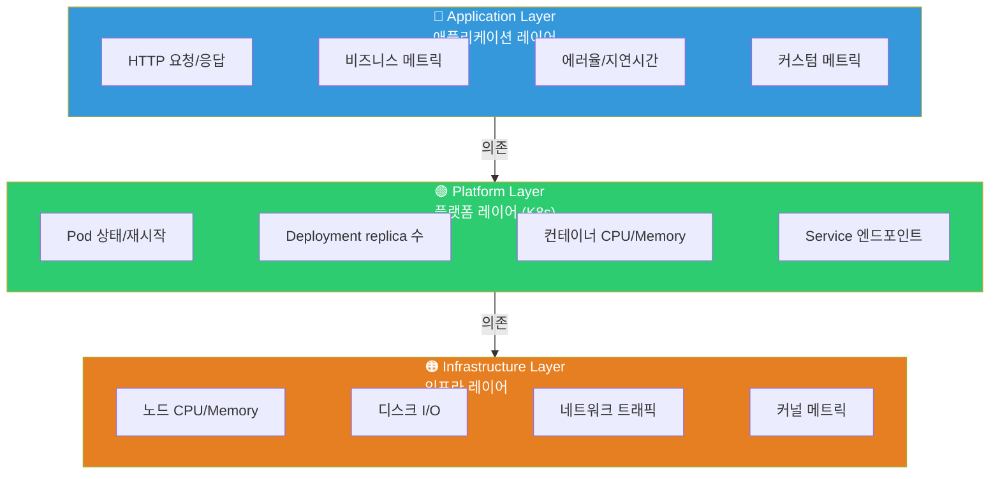
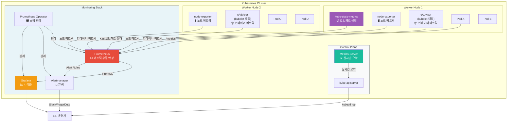
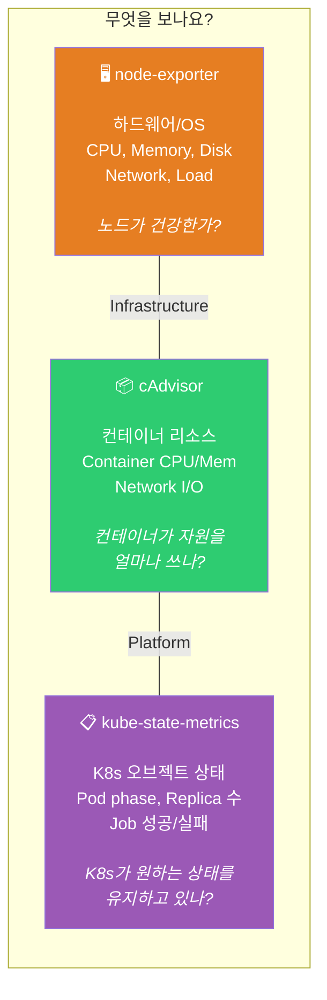
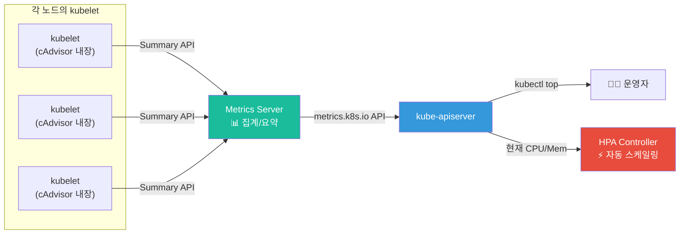
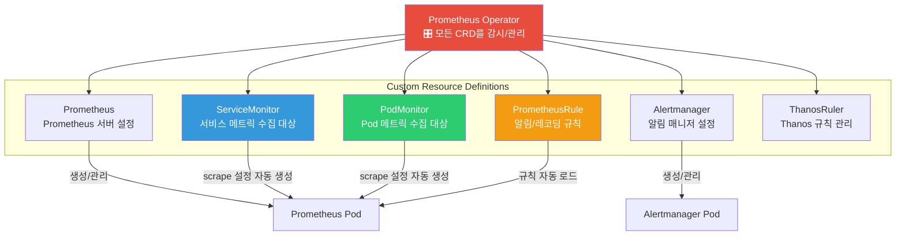
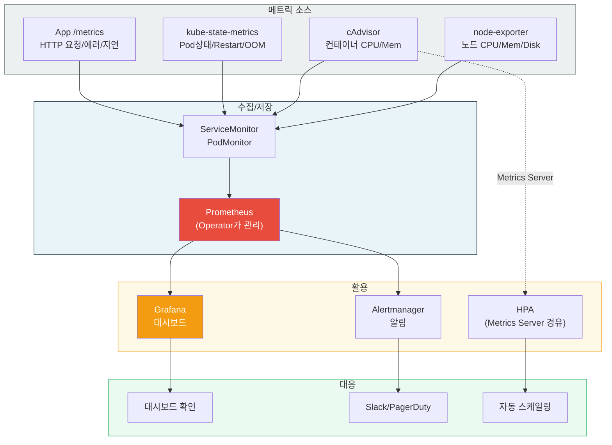

# 쿠버네티스 모니터링 완전 정복

> Kubernetes 클러스터를 운영하면서 "Pod가 왜 죽었지?", "노드 메모리는 충분한가?", "HPA가 왜 스케일 아웃을 안 하지?"라는 질문에 답하려면 **K8s 전용 모니터링 스택**이 필요해요. [Prometheus](./02-prometheus)에서 메트릭 수집의 기본을 배웠고, [Grafana](./03-grafana)에서 시각화를 배웠고, [K8s 아키텍처](../04-kubernetes/01-architecture)에서 클러스터 구조를 이해했으니 — 이제 이 모든 것을 합쳐서 **K8s 클러스터를 완벽하게 모니터링하는 방법**을 알아볼게요.

---

## 🎯 왜 쿠버네티스 모니터링을 알아야 하나요?

### 일상 비유: 대형 쇼핑몰 관리 시스템

대형 쇼핑몰을 운영한다고 상상해보세요.

- **건물 자체** (천장 누수, 전기 용량, 냉난방) — 이건 **인프라 모니터링**이에요
- **매장 운영** (점포 개폐 상태, 에스컬레이터, 엘리베이터 가동) — 이건 **플랫폼 모니터링**이에요
- **고객 경험** (대기 시간, 매출, 불만 접수) — 이건 **애플리케이션 모니터링**이에요

쇼핑몰 관리자가 이 세 가지를 **하나의 관제 센터**에서 볼 수 있어야 문제가 생겼을 때 빠르게 대응할 수 있겠죠? "에어컨이 고장 났다"(인프라), "3층 에스컬레이터가 멈췄다"(플랫폼), "푸드코트 대기 시간이 30분이 넘는다"(애플리케이션) — 각각 다른 팀이 대응하지만, 모두 **같은 대시보드**에서 확인할 수 있어야 해요.

**쿠버네티스 모니터링이 바로 이 관제 센터 시스템이에요.**

```
실무에서 K8s 모니터링이 필요한 순간:

• "Pod가 계속 CrashLoopBackOff인데 왜?"           → restart count + OOMKilled 메트릭
• "노드 메모리가 부족한 것 같은데 확인하고 싶어"      → node-exporter 메트릭
• "HPA가 동작하지 않아요"                          → Metrics Server 상태 확인
• "컨테이너가 CPU를 얼마나 쓰고 있지?"              → cAdvisor 메트릭
• "Deployment가 원하는 replica 수를 유지하고 있나?"  → kube-state-metrics
• "클러스터 전체 리소스 사용률을 한눈에 보고 싶어"    → Grafana K8s 대시보드
• "리소스 request/limit을 어떻게 설정해야 할지 모르겠어" → 실제 사용량 메트릭 기반 튜닝
```

### VM 모니터링 vs K8s 모니터링

```
기존 VM 모니터링:
┌─────────────┐    ┌─────────────┐    ┌─────────────┐
│  Server A   │    │  Server B   │    │  Server C   │
│  - CPU      │    │  - CPU      │    │  - CPU      │
│  - Memory   │    │  - Memory   │    │  - Memory   │
│  - Disk     │    │  - Disk     │    │  - Disk     │
│  - App 1개  │    │  - App 1개  │    │  - App 1개  │
└─────────────┘    └─────────────┘    └─────────────┘
→ 서버 수가 적고, 서버 = 앱 1:1 관계, 비교적 단순

K8s 모니터링:
┌──────────────────────────────────────────────────┐
│  Cluster                                          │
│  ┌──────────┐  ┌──────────┐  ┌──────────┐       │
│  │  Node 1  │  │  Node 2  │  │  Node 3  │       │
│  │ ┌──┐┌──┐ │  │ ┌──┐┌──┐ │  │ ┌──┐┌──┐ │       │
│  │ │P1││P2│ │  │ │P3││P4│ │  │ │P5││P6│ │       │
│  │ └──┘└──┘ │  │ └──┘└──┘ │  │ └──┘└──┘ │       │
│  │ ┌──┐┌──┐ │  │ ┌──┐     │  │ ┌──┐┌──┐ │       │
│  │ │P7││P8│ │  │ │P9│     │  │ │PA││PB│ │       │
│  │ └──┘└──┘ │  │ └──┘     │  │ └──┘└──┘ │       │
│  └──────────┘  └──────────┘  └──────────┘       │
│  + Service, Ingress, ConfigMap, Secret, PVC...    │
└──────────────────────────────────────────────────┘
→ Pod가 수백 개, 노드 간 이동, 동적 생성/삭제, K8s 오브젝트 상태 추적 필요
```

### 왜 기존 모니터링만으로는 부족한가?

| 항목 | 기존 VM 모니터링 | K8s 모니터링 추가 필요 |
|------|------------------|----------------------|
| **대상** | 서버(고정) | Pod(동적 생성/삭제) |
| **수명** | 수개월~수년 | 수분~수시간 |
| **네트워크** | 고정 IP | Service/ClusterIP/DNS |
| **상태** | 프로세스 up/down | Pod phase, conditions, restart count |
| **스케일링** | 수동 | HPA/VPA 자동(메트릭 기반) |
| **리소스** | 서버 전체 | 컨테이너별 request/limit |
| **디스커버리** | 수동 등록 | ServiceMonitor 자동 탐지 |

---

## 🧠 핵심 개념 잡기

### 1. K8s 모니터링의 3개 레이어

> **비유**: 자동차를 모니터링한다면 — **엔진과 차체**(Infrastructure), **변속기와 서스펜션**(Platform), **운전자 경험**(Application)을 각각 봐야 해요.



| 레이어 | 수집 도구 | 메트릭 예시 |
|--------|-----------|-------------|
| **Infrastructure** | node-exporter | `node_cpu_seconds_total`, `node_memory_MemAvailable_bytes` |
| **Platform (K8s)** | kube-state-metrics, cAdvisor, Metrics Server | `kube_pod_status_phase`, `container_cpu_usage_seconds_total` |
| **Application** | 앱 자체 `/metrics` 엔드포인트 | `http_requests_total`, `order_processing_duration_seconds` |

### 2. 5가지 핵심 모니터링 컴포넌트

> **비유**: 쇼핑몰 관제 센터의 5가지 센서 시스템

| 컴포넌트 | 비유 | 역할 | 수집 대상 |
|----------|------|------|-----------|
| **node-exporter** | 건물 센서 | 노드(서버)의 하드웨어/OS 메트릭 | CPU, Memory, Disk, Network |
| **cAdvisor** | 매장별 CCTV | 각 컨테이너의 리소스 사용량 | 컨테이너 CPU/Memory/IO |
| **kube-state-metrics** | 매장 관리 시스템 | K8s 오브젝트 상태 정보 | Pod/Deployment/Node 상태 |
| **Metrics Server** | 실시간 전광판 | 실시간 리소스 요약 (kubectl top, HPA용) | 노드/Pod 현재 CPU/Memory |
| **Prometheus Operator** | 관제 센터 통합 시스템 | 모니터링 스택 자동 관리 | 위 모든 것을 통합 운영 |

### 3. 전체 아키텍처 한눈에 보기



---

## 🔍 하나씩 자세히 알아보기

### 1. node-exporter — 노드(서버) 하드웨어/OS 메트릭

> **비유**: 건물의 전기/수도/가스 계량기 — 건물 자체의 상태를 측정해요.

node-exporter는 [Prometheus](./02-prometheus)의 공식 Exporter로, 각 노드(서버)에 **DaemonSet**으로 배포되어 하드웨어 및 OS 수준 메트릭을 수집해요.

#### 주요 메트릭

| 메트릭 | 설명 | PromQL 예시 |
|--------|------|-------------|
| `node_cpu_seconds_total` | CPU 사용 시간(모드별) | `rate(node_cpu_seconds_total{mode="idle"}[5m])` |
| `node_memory_MemTotal_bytes` | 전체 메모리 | 그대로 사용 |
| `node_memory_MemAvailable_bytes` | 사용 가능 메모리 | 그대로 사용 |
| `node_filesystem_avail_bytes` | 디스크 여유 공간 | 그대로 사용 |
| `node_disk_io_time_seconds_total` | 디스크 I/O 시간 | `rate(node_disk_io_time_seconds_total[5m])` |
| `node_network_receive_bytes_total` | 네트워크 수신량 | `rate(node_network_receive_bytes_total[5m])` |
| `node_load1` | 1분 평균 로드 | 그대로 사용 |

#### 핵심 PromQL — 노드 리소스

```promql
# 노드별 CPU 사용률 (%)
100 - (avg by(instance) (rate(node_cpu_seconds_total{mode="idle"}[5m])) * 100)

# 노드별 메모리 사용률 (%)
(1 - node_memory_MemAvailable_bytes / node_memory_MemTotal_bytes) * 100

# 디스크 사용률 (%)
(1 - node_filesystem_avail_bytes{mountpoint="/"} / node_filesystem_size_bytes{mountpoint="/"}) * 100

# 네트워크 수신 속도 (bytes/sec)
rate(node_network_receive_bytes_total{device!="lo"}[5m])
```

#### DaemonSet으로 배포되는 이유

```
Node 1          Node 2          Node 3
┌──────────┐   ┌──────────┐   ┌──────────┐
│ node-exp │   │ node-exp │   │ node-exp │  ← 모든 노드에 1개씩
│ :9100    │   │ :9100    │   │ :9100    │
│          │   │          │   │          │
│ [Pod A]  │   │ [Pod C]  │   │ [Pod E]  │
│ [Pod B]  │   │ [Pod D]  │   │ [Pod F]  │
└──────────┘   └──────────┘   └──────────┘
     ↑               ↑              ↑
     └───────── Prometheus가 각 노드에서 scrape ──────┘
```

> DaemonSet은 [DaemonSet 강의](../04-kubernetes/03-statefulset-daemonset)에서 자세히 다뤘어요. 모든 노드에 정확히 1개의 Pod를 보장하는 리소스죠.

---

### 2. cAdvisor — 컨테이너 메트릭

> **비유**: 쇼핑몰의 매장별 전력/수도 사용량 계량기 — 각 매장(컨테이너)이 자원을 얼마나 쓰는지 측정해요.

cAdvisor(Container Advisor)는 **kubelet에 내장**되어 있어서 별도 설치가 필요 없어요. 각 컨테이너의 CPU, 메모리, 네트워크, 디스크 I/O를 추적해요.

#### node-exporter vs cAdvisor

```
node-exporter가 보는 세계:
┌───────────────── Node ──────────────────┐
│  CPU 전체: 8코어                         │
│  Memory 전체: 32GB                       │
│  Disk 전체: 500GB                        │
│  Network 전체: 1Gbps                     │
│  ※ "건물 전체"의 자원 현황               │
└──────────────────────────────────────────┘

cAdvisor가 보는 세계:
┌───────────────── Node ──────────────────┐
│  ┌─ Container A ─┐  ┌─ Container B ─┐  │
│  │ CPU: 0.5코어  │  │ CPU: 1.2코어  │  │
│  │ Mem: 256MB    │  │ Mem: 512MB    │  │
│  │ Net: 10MB/s   │  │ Net: 50MB/s   │  │
│  └───────────────┘  └───────────────┘  │
│  ┌─ Container C ─┐                      │
│  │ CPU: 0.3코어  │                      │
│  │ Mem: 128MB    │                      │
│  └───────────────┘                      │
│  ※ "각 매장"의 자원 현황                 │
└──────────────────────────────────────────┘
```

#### 주요 메트릭

| 메트릭 | 설명 | 용도 |
|--------|------|------|
| `container_cpu_usage_seconds_total` | 컨테이너 CPU 사용 시간 | CPU 사용률 계산 |
| `container_memory_usage_bytes` | 컨테이너 메모리 사용량 | 메모리 모니터링 |
| `container_memory_working_set_bytes` | 실제 작업 메모리 (OOM 판단 기준) | OOMKilled 예측 |
| `container_network_receive_bytes_total` | 컨테이너 네트워크 수신 | 트래픽 모니터링 |
| `container_fs_usage_bytes` | 컨테이너 파일시스템 사용량 | 디스크 모니터링 |

#### 핵심 PromQL — 컨테이너 리소스

```promql
# Pod별 CPU 사용률 (request 대비 %)
sum(rate(container_cpu_usage_seconds_total{container!=""}[5m])) by (pod, namespace)
/
sum(kube_pod_container_resource_requests{resource="cpu"}) by (pod, namespace) * 100

# Pod별 메모리 사용량 (working set, OOM 판단 기준)
sum(container_memory_working_set_bytes{container!=""}) by (pod, namespace)

# 메모리 사용률 (limit 대비 %) — OOMKilled 위험도
container_memory_working_set_bytes{container!=""}
/
container_spec_memory_limit_bytes{container!=""} * 100
```

> **중요**: `container_memory_usage_bytes`가 아니라 `container_memory_working_set_bytes`가 OOM 판단 기준이에요. usage에는 캐시가 포함되어 있어서 실제보다 높게 나와요.

---

### 3. kube-state-metrics — K8s 오브젝트 상태 메트릭

> **비유**: 쇼핑몰의 매장 관리 시스템 — "A 매장은 영업 중", "B 매장은 리모델링 중", "C 매장은 폐업 예정" 같은 **상태 정보**를 추적해요.

kube-state-metrics(KSM)는 Kubernetes API Server에서 오브젝트 상태를 읽어서 Prometheus 메트릭으로 변환해요. node-exporter나 cAdvisor와는 **완전히 다른 관점**이에요.

#### 세 도구의 관점 차이



#### 주요 메트릭

**Pod 관련:**

| 메트릭 | 설명 | 왜 중요한가? |
|--------|------|-------------|
| `kube_pod_status_phase` | Pod의 현재 상태 (Pending/Running/Failed/Succeeded) | Pod가 정상 실행 중인지 확인 |
| `kube_pod_container_status_restarts_total` | 컨테이너 재시작 횟수 | CrashLoopBackOff 감지 |
| `kube_pod_container_status_terminated_reason` | 종료 이유 (OOMKilled, Error 등) | OOMKilled 감지 |
| `kube_pod_container_resource_requests` | 리소스 요청량 | 리소스 계획 |
| `kube_pod_container_resource_limits` | 리소스 제한량 | 리소스 계획 |

**Deployment 관련:**

| 메트릭 | 설명 | 왜 중요한가? |
|--------|------|-------------|
| `kube_deployment_spec_replicas` | 원하는 replica 수 | desired vs actual 비교 |
| `kube_deployment_status_replicas_available` | 사용 가능한 replica 수 | 서비스 가용성 |
| `kube_deployment_status_replicas_unavailable` | 사용 불가 replica 수 | 배포 문제 감지 |

**Node 관련:**

| 메트릭 | 설명 | 왜 중요한가? |
|--------|------|-------------|
| `kube_node_status_condition` | 노드 상태 (Ready/NotReady/DiskPressure 등) | 노드 건강 상태 |
| `kube_node_status_allocatable` | 할당 가능 리소스 | 스케줄링 여유 확인 |

#### 핵심 PromQL — K8s 오브젝트 상태

```promql
# Pending 상태 Pod 목록 (5분 이상 Pending)
kube_pod_status_phase{phase="Pending"} == 1

# 최근 1시간 내 재시작 횟수 > 3인 Pod (CrashLoopBackOff 의심)
increase(kube_pod_container_status_restarts_total[1h]) > 3

# OOMKilled된 컨테이너
kube_pod_container_status_terminated_reason{reason="OOMKilled"} > 0

# Deployment에서 원하는 replica와 실제 replica 불일치
kube_deployment_spec_replicas
!=
kube_deployment_status_replicas_available

# 노드가 Ready 상태가 아닌 경우
kube_node_status_condition{condition="Ready", status="true"} == 0
```

---

### 4. Metrics Server — HPA와 kubectl top의 데이터 소스

> **비유**: 쇼핑몰의 실시간 전광판 — 상세 기록은 아니지만, **지금 이 순간**의 핵심 수치를 보여줘요.

Metrics Server는 Prometheus와는 **완전히 다른 목적**의 도구예요. 장기 저장이나 쿼리가 아니라, **지금 현재**의 CPU/Memory 사용량을 제공해요.

#### Metrics Server vs Prometheus

```
┌─────────────────────────────────────────────────────┐
│                    비교 항목                          │
├─────────────────────┬───────────────────────────────┤
│    Metrics Server   │         Prometheus             │
├─────────────────────┼───────────────────────────────┤
│ 실시간 스냅샷       │ 시계열 데이터 (히스토리)        │
│ 최근 값만 보관       │ 수주~수개월 보관               │
│ kubectl top 지원    │ PromQL 쿼리                    │
│ HPA 자동 스케일링용  │ 대시보드/알림용                │
│ 경량 (메모리 적게)   │ 상대적으로 무거움              │
│ K8s API 통합        │ 독립 시스템                    │
│ 클러스터 필수 컴포넌트│ 선택적 설치                   │
└─────────────────────┴───────────────────────────────┘
```

#### Metrics Server의 동작 원리



#### kubectl top 명령어

```bash
# 노드별 리소스 사용량
kubectl top nodes
# NAME     CPU(cores)   CPU%   MEMORY(bytes)   MEMORY%
# node-1   450m         22%    3200Mi          41%
# node-2   800m         40%    5600Mi          72%
# node-3   200m         10%    2100Mi          27%

# Pod별 리소스 사용량
kubectl top pods -n my-app
# NAME                        CPU(cores)   MEMORY(bytes)
# my-app-7d6f8c9b5-abc12      50m          128Mi
# my-app-7d6f8c9b5-def34      45m          120Mi
# my-app-7d6f8c9b5-ghi56      60m          135Mi

# 컨테이너별 리소스 사용량
kubectl top pods -n my-app --containers
# NAME                        NAME          CPU(cores)   MEMORY(bytes)
# my-app-7d6f8c9b5-abc12      app           45m          120Mi
# my-app-7d6f8c9b5-abc12      sidecar       5m           8Mi
```

> **주의**: `kubectl top`이 동작하지 않는다면 Metrics Server가 설치되지 않은 거예요. EKS에서는 기본 설치되지만, 자체 클러스터에서는 별도 설치가 필요해요.

#### HPA와 Metrics Server의 관계

```yaml
# HPA가 Metrics Server를 통해 CPU 사용량을 확인하고 스케일링
apiVersion: autoscaling/v2
kind: HorizontalPodAutoscaler
metadata:
  name: my-app-hpa
spec:
  scaleTargetRef:
    apiVersion: apps/v1
    kind: Deployment
    name: my-app
  minReplicas: 2
  maxReplicas: 10
  metrics:
  - type: Resource
    resource:
      name: cpu
      target:
        type: Utilization
        averageUtilization: 70  # CPU request 대비 70% 이상이면 스케일 아웃
  - type: Resource
    resource:
      name: memory
      target:
        type: Utilization
        averageUtilization: 80
```

```
HPA 동작 흐름:
                                 ┌──────────────┐
                                 │ Metrics Server│
                                 │ "현재 CPU 85%"│
                                 └──────┬───────┘
                                        │
                                        ▼
┌──────────────┐   "70% 초과!"   ┌──────────────┐
│ HPA          │ ◄────────────── │ HPA Controller│
│ target: 70%  │                 │ (15초마다 체크)│
└──────────────┘                 └──────┬───────┘
                                        │
                                        ▼ "replica 2→3"
                                 ┌──────────────┐
                                 │ Deployment   │
                                 │ replicas: 3  │
                                 └──────────────┘
```

> HPA의 자세한 동작은 [오토스케일링 강의](../04-kubernetes/10-autoscaling)에서 다뤘어요.

---

### 5. Prometheus Operator & ServiceMonitor — 모니터링 자동화

> **비유**: 쇼핑몰 관제 센터를 **자동으로 설치하고 관리**해주는 시스템 — 새 매장이 입점하면 자동으로 센서를 설치하고, 대시보드에 추가해줘요.

Prometheus Operator는 K8s의 [Operator 패턴](../04-kubernetes/17-operator-crd)을 사용해서 Prometheus 모니터링 스택을 **Kubernetes-native 방식**으로 관리해요.

#### Prometheus Operator가 관리하는 CRD들



#### ServiceMonitor — "이 Service의 메트릭을 수집해줘"

**Operator 없이 (수동 설정):**
```yaml
# prometheus.yml에 직접 scrape 대상 추가 (번거롭고 실수하기 쉬움)
scrape_configs:
  - job_name: 'my-app'
    kubernetes_sd_configs:
      - role: endpoints
    relabel_configs:
      - source_labels: [__meta_kubernetes_service_name]
        regex: my-app
        action: keep
      # ... 수십 줄의 relabel 설정
```

**Operator 사용 (ServiceMonitor):**
```yaml
# 깔끔하고 K8s-native한 방식
apiVersion: monitoring.coreos.com/v1
kind: ServiceMonitor
metadata:
  name: my-app-monitor
  namespace: monitoring
  labels:
    release: kube-prometheus-stack  # Prometheus가 이 라벨로 ServiceMonitor를 찾음
spec:
  namespaceSelector:
    matchNames:
      - my-app            # 대상 네임스페이스
  selector:
    matchLabels:
      app: my-app          # 이 라벨을 가진 Service를 찾아서
  endpoints:
    - port: metrics        # 이 포트에서 메트릭을 수집해줘
      interval: 30s        # 30초마다
      path: /metrics       # 이 경로에서
```

#### PodMonitor — Service가 없는 Pod에서 직접 수집

```yaml
# Service 없이 Pod에서 직접 메트릭을 수집할 때
apiVersion: monitoring.coreos.com/v1
kind: PodMonitor
metadata:
  name: batch-job-monitor
  namespace: monitoring
spec:
  namespaceSelector:
    matchNames:
      - batch-jobs
  selector:
    matchLabels:
      app: data-processor
  podMetricsEndpoints:
    - port: metrics
      interval: 60s
```

#### ServiceMonitor vs PodMonitor 선택 기준

```
ServiceMonitor를 사용할 때:
✅ Service가 있는 일반적인 애플리케이션
✅ 여러 Pod를 하나의 Service로 묶은 경우
✅ Service의 port 이름으로 메트릭 포트를 지정할 수 있을 때

PodMonitor를 사용할 때:
✅ Service가 없는 배치 Job
✅ DaemonSet에서 직접 수집하고 싶을 때
✅ 특정 Pod만 선택적으로 모니터링할 때
```

#### PrometheusRule — 알림 규칙을 K8s 리소스로 관리

```yaml
apiVersion: monitoring.coreos.com/v1
kind: PrometheusRule
metadata:
  name: k8s-alerts
  namespace: monitoring
  labels:
    release: kube-prometheus-stack
spec:
  groups:
    - name: kubernetes-pod-alerts
      rules:
        # Pod CrashLoopBackOff 감지
        - alert: PodCrashLooping
          expr: |
            increase(kube_pod_container_status_restarts_total[1h]) > 5
          for: 10m
          labels:
            severity: warning
          annotations:
            summary: "Pod {{ $labels.namespace }}/{{ $labels.pod }} is crash looping"
            description: "Pod가 지난 1시간 동안 5회 이상 재시작되었습니다."

        # OOMKilled 감지
        - alert: ContainerOOMKilled
          expr: |
            kube_pod_container_status_terminated_reason{reason="OOMKilled"} > 0
          for: 0m
          labels:
            severity: critical
          annotations:
            summary: "Container {{ $labels.container }} in {{ $labels.pod }} was OOMKilled"
            description: "메모리 limit을 초과하여 OOMKilled 되었습니다. limit 증가를 검토하세요."

        # Deployment replica 불일치
        - alert: DeploymentReplicasMismatch
          expr: |
            kube_deployment_spec_replicas
            !=
            kube_deployment_status_replicas_available
          for: 15m
          labels:
            severity: warning
          annotations:
            summary: "Deployment {{ $labels.deployment }} replica mismatch"
            description: "원하는 replica 수와 실제 가용 replica 수가 15분 이상 불일치합니다."
```

---

### 6. kube-prometheus-stack — 한 방에 다 설치하기

> **비유**: 쇼핑몰 관제 시스템을 하나하나 설치하는 게 아니라, **올인원 패키지**로 한 번에 설치해요.

`kube-prometheus-stack`은 Helm chart로, 다음을 모두 포함해요:

```
kube-prometheus-stack에 포함된 것들:
┌──────────────────────────────────────────────────┐
│  kube-prometheus-stack (Helm chart)               │
│                                                   │
│  ✅ Prometheus Operator     (모니터링 스택 관리)   │
│  ✅ Prometheus              (메트릭 수집/저장)     │
│  ✅ Alertmanager            (알림 라우팅/관리)     │
│  ✅ Grafana                 (시각화 대시보드)      │
│  ✅ node-exporter           (노드 메트릭)         │
│  ✅ kube-state-metrics      (K8s 오브젝트 메트릭)  │
│  ✅ 기본 PrometheusRule     (핵심 알림 규칙)       │
│  ✅ 기본 Grafana 대시보드    (K8s 대시보드 세트)    │
│  ✅ ServiceMonitor 설정     (자동 수집 설정)       │
│                                                   │
│  ❌ Metrics Server          (별도 설치 필요)       │
│  ❌ Loki (로그)             (별도 설치 필요)       │
│  ❌ Tempo (트레이싱)        (별도 설치 필요)       │
└──────────────────────────────────────────────────┘
```

---

## 💻 직접 해보기

### 실습 1: kube-prometheus-stack 설치

```bash
# 1. Helm repo 추가
helm repo add prometheus-community https://prometheus-community.github.io/helm-charts
helm repo update

# 2. monitoring 네임스페이스 생성
kubectl create namespace monitoring

# 3. kube-prometheus-stack 설치 (기본 설정)
helm install kube-prometheus-stack prometheus-community/kube-prometheus-stack \
  --namespace monitoring \
  --set grafana.adminPassword=admin123 \
  --set prometheus.prometheusSpec.retention=7d \
  --set prometheus.prometheusSpec.storageSpec.volumeClaimTemplate.spec.resources.requests.storage=50Gi

# 4. 설치 확인
kubectl get pods -n monitoring
# NAME                                                     READY   STATUS    RESTARTS   AGE
# kube-prometheus-stack-grafana-xxx                         3/3     Running   0          2m
# kube-prometheus-stack-kube-state-metrics-xxx              1/1     Running   0          2m
# kube-prometheus-stack-operator-xxx                        1/1     Running   0          2m
# kube-prometheus-stack-prometheus-node-exporter-xxx        1/1     Running   0          2m  (DaemonSet)
# alertmanager-kube-prometheus-stack-alertmanager-0         2/2     Running   0          2m
# prometheus-kube-prometheus-stack-prometheus-0             2/2     Running   0          2m
```

### 실습 2: 운영 환경용 values.yaml

```yaml
# values-production.yaml
# 운영 환경에 맞는 kube-prometheus-stack 설정

# --- Prometheus 설정 ---
prometheus:
  prometheusSpec:
    # 메트릭 보관 기간
    retention: 15d
    retentionSize: "45GB"

    # 스토리지 설정 (반드시 PVC 사용!)
    storageSpec:
      volumeClaimTemplate:
        spec:
          storageClassName: gp3       # EKS의 경우
          accessModes: ["ReadWriteOnce"]
          resources:
            requests:
              storage: 50Gi

    # 리소스 설정
    resources:
      requests:
        cpu: 500m
        memory: 2Gi
      limits:
        cpu: 2000m
        memory: 8Gi

    # 모든 네임스페이스의 ServiceMonitor 수집
    serviceMonitorSelectorNilUsesHelmValues: false
    podMonitorSelectorNilUsesHelmValues: false
    ruleSelectorNilUsesHelmValues: false

    # External Labels (Thanos 사용 시)
    externalLabels:
      cluster: production
      region: ap-northeast-2

# --- Alertmanager 설정 ---
alertmanager:
  alertmanagerSpec:
    storage:
      volumeClaimTemplate:
        spec:
          storageClassName: gp3
          resources:
            requests:
              storage: 10Gi
    resources:
      requests:
        cpu: 100m
        memory: 256Mi

# --- Grafana 설정 ---
grafana:
  adminPassword: ""  # Secret으로 별도 관리
  persistence:
    enabled: true
    size: 10Gi
    storageClassName: gp3

  # 추가 데이터소스
  additionalDataSources:
    - name: Loki
      type: loki
      url: http://loki-gateway.logging:80
      access: proxy

  # 리소스
  resources:
    requests:
      cpu: 200m
      memory: 512Mi
    limits:
      cpu: 1000m
      memory: 1Gi

  # 사이드카로 대시보드 자동 로드
  sidecar:
    dashboards:
      enabled: true
      searchNamespace: ALL

# --- node-exporter 설정 ---
nodeExporter:
  resources:
    requests:
      cpu: 50m
      memory: 64Mi
    limits:
      cpu: 200m
      memory: 128Mi

# --- kube-state-metrics 설정 ---
kubeStateMetrics:
  resources:
    requests:
      cpu: 50m
      memory: 64Mi
    limits:
      cpu: 200m
      memory: 256Mi
```

```bash
# 운영 환경용 설치
helm upgrade --install kube-prometheus-stack \
  prometheus-community/kube-prometheus-stack \
  --namespace monitoring \
  --values values-production.yaml
```

### 실습 3: Metrics Server 설치

```bash
# Metrics Server 설치 (kube-prometheus-stack에는 미포함)
kubectl apply -f https://github.com/kubernetes-sigs/metrics-server/releases/latest/download/components.yaml

# 설치 확인
kubectl get pods -n kube-system -l k8s-app=metrics-server

# 동작 확인 (1-2분 후)
kubectl top nodes
kubectl top pods -A
```

> **EKS 사용자**: EKS에는 Metrics Server가 기본 설치되어 있어요. 별도 설치하지 않아도 돼요.

### 실습 4: 내 애플리케이션 모니터링 추가

```yaml
# 1단계: 애플리케이션 Deployment + Service
---
apiVersion: apps/v1
kind: Deployment
metadata:
  name: my-web-app
  namespace: my-app
  labels:
    app: my-web-app
spec:
  replicas: 3
  selector:
    matchLabels:
      app: my-web-app
  template:
    metadata:
      labels:
        app: my-web-app
    spec:
      containers:
        - name: app
          image: my-web-app:latest
          ports:
            - name: http
              containerPort: 8080
            - name: metrics         # 메트릭 포트 반드시 분리!
              containerPort: 9090
          resources:
            requests:
              cpu: 100m
              memory: 128Mi
            limits:
              cpu: 500m
              memory: 512Mi
---
apiVersion: v1
kind: Service
metadata:
  name: my-web-app
  namespace: my-app
  labels:
    app: my-web-app
spec:
  selector:
    app: my-web-app
  ports:
    - name: http
      port: 80
      targetPort: 8080
    - name: metrics              # Service에도 메트릭 포트 노출
      port: 9090
      targetPort: 9090
```

```yaml
# 2단계: ServiceMonitor 생성
---
apiVersion: monitoring.coreos.com/v1
kind: ServiceMonitor
metadata:
  name: my-web-app-monitor
  namespace: monitoring            # monitoring 네임스페이스에 생성
  labels:
    release: kube-prometheus-stack  # 이 라벨이 있어야 Prometheus가 인식!
spec:
  namespaceSelector:
    matchNames:
      - my-app
  selector:
    matchLabels:
      app: my-web-app
  endpoints:
    - port: metrics
      interval: 30s
      path: /metrics
```

```bash
# ServiceMonitor 적용
kubectl apply -f servicemonitor.yaml

# Prometheus가 ServiceMonitor를 인식했는지 확인
kubectl get servicemonitor -n monitoring

# Prometheus UI에서 Targets 확인
kubectl port-forward -n monitoring svc/kube-prometheus-stack-prometheus 9090:9090
# 브라우저에서 http://localhost:9090/targets 접속
```

### 실습 5: 핵심 K8s 메트릭 확인하기

```bash
# Grafana 포트포워딩
kubectl port-forward -n monitoring svc/kube-prometheus-stack-grafana 3000:80
# 브라우저에서 http://localhost:3000 접속 (admin / admin123)
```

**Prometheus UI에서 직접 쿼리해보기:**

```promql
# ===== Infrastructure Layer (node-exporter) =====

# 1. 노드별 CPU 사용률
100 - (avg by(instance) (rate(node_cpu_seconds_total{mode="idle"}[5m])) * 100)

# 2. 노드별 메모리 사용률
(1 - node_memory_MemAvailable_bytes / node_memory_MemTotal_bytes) * 100

# 3. 디스크 사용률 (80% 넘으면 위험)
(1 - node_filesystem_avail_bytes{mountpoint="/",fstype!="tmpfs"}
     / node_filesystem_size_bytes{mountpoint="/",fstype!="tmpfs"}) * 100


# ===== Platform Layer (kube-state-metrics + cAdvisor) =====

# 4. 네임스페이스별 Running Pod 수
count by(namespace) (kube_pod_status_phase{phase="Running"})

# 5. Pending 상태 Pod (스케줄링 문제)
kube_pod_status_phase{phase="Pending"} == 1

# 6. 최근 1시간 재시작 횟수 (CrashLoopBackOff 의심)
sort_desc(increase(kube_pod_container_status_restarts_total[1h]))

# 7. OOMKilled 컨테이너
kube_pod_container_status_terminated_reason{reason="OOMKilled"}

# 8. 컨테이너 CPU 사용량 (request 대비)
sum by(namespace, pod) (rate(container_cpu_usage_seconds_total{container!=""}[5m]))
/
sum by(namespace, pod) (kube_pod_container_resource_requests{resource="cpu"})

# 9. 컨테이너 메모리 사용량 (limit 대비, OOM 위험도)
sum by(namespace, pod) (container_memory_working_set_bytes{container!=""})
/
sum by(namespace, pod) (kube_pod_container_resource_limits{resource="memory"})

# 10. Deployment replica 불일치
kube_deployment_spec_replicas - kube_deployment_status_replicas_available > 0
```

### 실습 6: 리소스 요청/제한과 모니터링 연계

> 리소스 request/limit 설정은 모니터링 데이터를 기반으로 해야 해요. "감"으로 설정하면 낭비하거나 OOMKilled가 발생해요.

```promql
# === 리소스 튜닝을 위한 쿼리 ===

# 1. CPU request 대비 실제 사용률 (낮으면 request 과다 설정)
avg by(namespace, pod) (
  rate(container_cpu_usage_seconds_total{container!=""}[30m])
)
/
avg by(namespace, pod) (
  kube_pod_container_resource_requests{resource="cpu"}
) * 100

# 2. Memory request 대비 실제 사용률
avg by(namespace, pod) (
  container_memory_working_set_bytes{container!=""}
)
/
avg by(namespace, pod) (
  kube_pod_container_resource_requests{resource="memory"}
) * 100

# 3. CPU limit에 쓰로틀링 당하는 컨테이너 (limit이 너무 낮음)
rate(container_cpu_cfs_throttled_seconds_total{container!=""}[5m]) > 0

# 4. request는 있는데 limit이 없는 컨테이너 (위험!)
kube_pod_container_resource_requests{resource="memory"}
unless
kube_pod_container_resource_limits{resource="memory"}
```

**리소스 설정 가이드 (모니터링 기반):**

```
실제 사용량 기반 request/limit 설정 전략:

                 실제 사용량
                     │
    ┌────────────────┼────────────────┐
    │                │                │
    ▼                ▼                ▼
 request          평균 사용량        limit
(최소 보장)      (모니터링 확인)    (최대 허용)

권장 비율:
• request = 평균 사용량의 1.2~1.5배
• limit = 피크 사용량의 1.2~1.5배 (또는 request의 2~3배)

예시 (모니터링으로 확인한 결과):
• 평균 CPU: 100m, 피크: 300m
  → request: 150m, limit: 500m

• 평균 Memory: 256Mi, 피크: 400Mi
  → request: 300Mi, limit: 512Mi

주의:
• request 없이 limit만 설정하면 → request = limit으로 자동 설정 (QoS: Guaranteed)
• request도 limit도 없으면 → 다른 Pod에 의해 축출될 수 있음 (QoS: BestEffort)
```

---

## 🏢 실무에서는?

### 실무 시나리오 1: 신규 서비스 온보딩 체크리스트

```
새 서비스를 K8s에 배포할 때 모니터링 체크리스트:

□ 1. 애플리케이션에 /metrics 엔드포인트 구현
□ 2. Service에 metrics 포트 노출
□ 3. ServiceMonitor 또는 PodMonitor 생성
□ 4. Prometheus Targets에서 수집 확인
□ 5. Grafana 대시보드 생성 (또는 기존 템플릿 활용)
□ 6. PrometheusRule로 알림 규칙 추가
□ 7. resources.requests/limits 설정
□ 8. HPA 설정 (필요 시)
□ 9. 온콜 팀에 알림 라우팅 설정
□ 10. 배포 후 1주일 모니터링으로 리소스 튜닝
```

### 실무 시나리오 2: 장애 대응 대시보드 순서

```
🚨 장애 발생 시 대시보드 확인 순서:

1단계: 클러스터 전체 상태 (Cluster Overview)
├── 노드 상태: Ready vs NotReady
├── 전체 Pod 수: Running / Pending / Failed
└── 클러스터 CPU/Memory 사용률

2단계: 노드 상태 (Node Details)
├── CPU/Memory/Disk 사용률
├── 네트워크 에러율
└── 커널 메트릭 (OOM, 파일 디스크립터)

3단계: 워크로드 상태 (Workload Details)
├── Deployment replica 상태
├── Pod 재시작 횟수
├── OOMKilled 이벤트
└── Pending Pod 원인 (Insufficient CPU/Memory)

4단계: 컨테이너 상태 (Container Details)
├── 컨테이너별 CPU/Memory 사용량
├── CPU 쓰로틀링 비율
├── 네트워크 I/O
└── request/limit 대비 사용률

5단계: 애플리케이션 메트릭 (Application Dashboard)
├── HTTP 요청률 / 에러율
├── 응답 시간 p50/p95/p99
└── 비즈니스 메트릭
```

### 실무 시나리오 3: Grafana K8s 대시보드 추천

kube-prometheus-stack을 설치하면 기본 대시보드가 포함되어 있어요. 추가로 추천하는 대시보드:

| 대시보드 ID | 이름 | 용도 |
|-------------|------|------|
| 315 | Kubernetes Cluster Monitoring | 클러스터 전체 개요 |
| 6417 | Kubernetes Cluster (Prometheus) | 상세 클러스터 모니터링 |
| 13770 | K8s Cluster Summary | 간결한 클러스터 요약 |
| 15760 | K8s Views - Pods | Pod 상세 모니터링 |
| 1860 | Node Exporter Full | 노드 상세 메트릭 |
| 14981 | K8s Troubleshooting | 장애 분석용 |

```bash
# Grafana에서 대시보드 임포트
# 1. Grafana UI → + → Import
# 2. Dashboard ID 입력 (예: 315)
# 3. Prometheus 데이터소스 선택
# 4. Import 클릭
```

### 실무 시나리오 4: 네임스페이스별 리소스 사용량 리포트

```promql
# 팀별(네임스페이스별) CPU 비용 산정
# 네임스페이스별 CPU request 총합 (코어)
sum by(namespace) (kube_pod_container_resource_requests{resource="cpu"})

# 네임스페이스별 실제 CPU 사용량 (코어)
sum by(namespace) (rate(container_cpu_usage_seconds_total{container!=""}[1h]))

# 네임스페이스별 Memory request 총합 (GB)
sum by(namespace) (kube_pod_container_resource_requests{resource="memory"}) / 1024 / 1024 / 1024

# 리소스 효율성 (실제 사용량 / request)
# 이 비율이 너무 낮으면 → request를 줄여서 비용 절감
# 이 비율이 1에 가까우면 → request 증가 필요
sum by(namespace) (rate(container_cpu_usage_seconds_total{container!=""}[1h]))
/
sum by(namespace) (kube_pod_container_resource_requests{resource="cpu"})
```

### 실무 시나리오 5: 알림 규칙 실무 예시

```yaml
apiVersion: monitoring.coreos.com/v1
kind: PrometheusRule
metadata:
  name: production-alerts
  namespace: monitoring
  labels:
    release: kube-prometheus-stack
spec:
  groups:
    # === Infrastructure 알림 ===
    - name: node-alerts
      rules:
        - alert: NodeHighCPU
          expr: |
            100 - (avg by(instance) (rate(node_cpu_seconds_total{mode="idle"}[5m])) * 100) > 85
          for: 10m
          labels:
            severity: warning
          annotations:
            summary: "Node {{ $labels.instance }} CPU가 85%를 초과했습니다"

        - alert: NodeHighMemory
          expr: |
            (1 - node_memory_MemAvailable_bytes / node_memory_MemTotal_bytes) * 100 > 90
          for: 5m
          labels:
            severity: critical
          annotations:
            summary: "Node {{ $labels.instance }} 메모리가 90%를 초과했습니다"

        - alert: NodeDiskFull
          expr: |
            (1 - node_filesystem_avail_bytes{mountpoint="/"} / node_filesystem_size_bytes{mountpoint="/"}) * 100 > 85
          for: 5m
          labels:
            severity: warning
          annotations:
            summary: "Node {{ $labels.instance }} 디스크 사용률 85% 초과"

    # === Platform 알림 ===
    - name: k8s-alerts
      rules:
        - alert: PodCrashLooping
          expr: |
            increase(kube_pod_container_status_restarts_total[1h]) > 5
          for: 10m
          labels:
            severity: warning
          annotations:
            summary: "{{ $labels.namespace }}/{{ $labels.pod }} CrashLoopBackOff 의심"

        - alert: PodOOMKilled
          expr: |
            kube_pod_container_status_terminated_reason{reason="OOMKilled"} > 0
          labels:
            severity: critical
          annotations:
            summary: "{{ $labels.namespace }}/{{ $labels.pod }}의 {{ $labels.container }}가 OOMKilled"

        - alert: PodPendingTooLong
          expr: |
            kube_pod_status_phase{phase="Pending"} == 1
          for: 15m
          labels:
            severity: warning
          annotations:
            summary: "{{ $labels.namespace }}/{{ $labels.pod }}가 15분 이상 Pending"

        - alert: DeploymentUnavailable
          expr: |
            kube_deployment_status_replicas_unavailable > 0
          for: 15m
          labels:
            severity: warning
          annotations:
            summary: "{{ $labels.namespace }}/{{ $labels.deployment }}에 unavailable replica 존재"

        - alert: HPAMaxedOut
          expr: |
            kube_horizontalpodautoscaler_status_current_replicas
            ==
            kube_horizontalpodautoscaler_spec_max_replicas
          for: 30m
          labels:
            severity: warning
          annotations:
            summary: "HPA {{ $labels.horizontalpodautoscaler }}가 최대 replica에 도달"

    # === 리소스 효율성 알림 ===
    - name: resource-efficiency
      rules:
        - alert: CPUThrottlingHigh
          expr: |
            rate(container_cpu_cfs_throttled_seconds_total{container!=""}[5m])
            /
            rate(container_cpu_cfs_periods_total{container!=""}[5m]) > 0.5
          for: 15m
          labels:
            severity: warning
          annotations:
            summary: "{{ $labels.namespace }}/{{ $labels.pod }} CPU 쓰로틀링 50% 이상"

        - alert: MemoryCloseToLimit
          expr: |
            container_memory_working_set_bytes{container!=""}
            /
            container_spec_memory_limit_bytes{container!=""} > 0.9
          for: 10m
          labels:
            severity: warning
          annotations:
            summary: "{{ $labels.namespace }}/{{ $labels.pod }} 메모리가 limit의 90%에 도달"
```

---

## ⚠️ 자주 하는 실수

### 실수 1: ServiceMonitor 라벨 불일치

```yaml
# ❌ 잘못된 설정 — Prometheus가 이 ServiceMonitor를 무시함
apiVersion: monitoring.coreos.com/v1
kind: ServiceMonitor
metadata:
  name: my-app
  labels:
    app: my-app            # ← 잘못된 라벨! Prometheus가 찾지 못함
spec:
  selector:
    matchLabels:
      app: my-app
  endpoints:
    - port: metrics
```

```yaml
# ✅ 올바른 설정 — release: kube-prometheus-stack 라벨 필수
apiVersion: monitoring.coreos.com/v1
kind: ServiceMonitor
metadata:
  name: my-app
  labels:
    release: kube-prometheus-stack  # ← Prometheus Operator가 이 라벨로 찾음
spec:
  selector:
    matchLabels:
      app: my-app
  endpoints:
    - port: metrics
```

```bash
# 디버깅: Prometheus가 어떤 라벨의 ServiceMonitor를 찾는지 확인
kubectl get prometheus -n monitoring -o yaml | grep -A5 serviceMonitorSelector
```

### 실수 2: container_memory_usage_bytes로 OOM 판단

```promql
# ❌ 잘못된 OOM 예측 — usage에는 캐시가 포함되어 있어서 실제보다 높게 나옴
container_memory_usage_bytes / container_spec_memory_limit_bytes > 0.9

# ✅ 올바른 OOM 예측 — working_set이 실제 OOM 판단 기준
container_memory_working_set_bytes / container_spec_memory_limit_bytes > 0.9
```

```
메모리 메트릭 구분:
┌──────────────────────────────────────────────┐
│         container_memory_usage_bytes          │
│  ┌──────────────────┬─────────────────────┐  │
│  │   Working Set    │      Cache          │  │
│  │  (실제 사용 중)   │  (파일 시스템 캐시)  │  │
│  │  ← OOM 판단 기준  │  ← 필요시 회수 가능  │  │
│  └──────────────────┴─────────────────────┘  │
└──────────────────────────────────────────────┘

• container_memory_usage_bytes = working_set + cache
• container_memory_working_set_bytes = 실제 프로세스가 사용 중인 메모리
• OOM Killer는 working_set_bytes 기준으로 판단해요!
```

### 실수 3: resource request/limit 미설정

```yaml
# ❌ request/limit 미설정 — HPA 동작 불가, 모니터링 의미 없음
spec:
  containers:
    - name: app
      image: my-app:latest
      # resources 없음! → QoS: BestEffort → 가장 먼저 축출됨
```

```yaml
# ✅ 반드시 request/limit 설정
spec:
  containers:
    - name: app
      image: my-app:latest
      resources:
        requests:
          cpu: 100m        # "최소 이만큼은 보장해줘"
          memory: 128Mi
        limits:
          cpu: 500m        # "최대 이만큼까지만 써"
          memory: 512Mi
```

```
request/limit이 없으면 발생하는 문제:
1. HPA가 동작하지 않음 (기준이 없으니 비율 계산 불가)
2. kubectl top에서 % 표시 불가
3. 노드 리소스 부족 시 가장 먼저 축출(eviction)
4. 다른 Pod에 영향을 줄 수 있음 (noisy neighbor)
5. 비용 산정 불가 (request 기반 과금인 경우)
```

### 실수 4: Metrics Server와 Prometheus 혼동

```
흔한 질문: "Prometheus가 있으니 Metrics Server는 필요 없나요?"

답: 아니요, 둘 다 필요해요!

Metrics Server가 필요한 이유:
• kubectl top 명령어 (운영자의 즉석 확인)
• HPA 자동 스케일링 (metrics.k8s.io API)
• VPA 권장 리소스 계산
• K8s API 통합 (다른 컨트롤러가 사용)

Prometheus가 필요한 이유:
• 히스토리 데이터 (과거 추세 분석)
• 복잡한 쿼리 (PromQL)
• 알림 규칙 (Alertmanager 연동)
• 대시보드 (Grafana 연동)
• 장기 보관 (Thanos/Mimir)

→ 서로 보완 관계이지 대체 관계가 아니에요!
```

### 실수 5: 모든 메트릭을 다 수집하려는 것

```yaml
# ❌ 모든 메트릭 무제한 수집 — Prometheus 디스크/메모리 폭발
prometheus:
  prometheusSpec:
    retention: 90d          # 90일 보관은 너무 많음
    # 필터 없이 모든 메트릭 수집
```

```yaml
# ✅ 실무에서는 필요한 메트릭만 선별
prometheus:
  prometheusSpec:
    retention: 15d          # 15일이면 대부분 충분

# ServiceMonitor에서 필요한 메트릭만 필터링
spec:
  endpoints:
    - port: metrics
      interval: 30s
      metricRelabelings:
        # 불필요한 메트릭 제거
        - sourceLabels: [__name__]
          regex: 'go_.*'           # Go 런타임 메트릭 제거
          action: drop
        # 불필요한 라벨 제거
        - regex: 'pod_template_hash'
          action: labeldrop
```

```
메트릭 수가 많아지면 발생하는 문제:
• Prometheus 메모리 사용량 증가 (cardinality 폭발)
• 쿼리 속도 저하
• 스토리지 비용 증가
• Grafana 대시보드 로딩 느려짐

실무 기준:
• 시계열 수 < 100만: 정상
• 시계열 수 100만~500만: 주의
• 시계열 수 > 500만: 최적화 필요
```

### 실수 6: kube-prometheus-stack의 기본 설정을 그대로 운영에 사용

```
기본값으로 운영하면 발생하는 문제:

1. 스토리지: emptyDir (Pod 재시작 시 데이터 손실!)
   → 반드시 PVC로 변경

2. 리소스: 기본값이 너무 작음
   → 운영 규모에 맞게 조정

3. retention: 기본 24h
   → 최소 7~15일로 변경

4. Grafana 비밀번호: 기본 'prom-operator'
   → Secret으로 별도 관리

5. ServiceMonitor selector: Helm 라벨만 인식
   → serviceMonitorSelectorNilUsesHelmValues: false 설정
```

---

## 📝 마무리

### 핵심 요약

```
K8s 모니터링 = 3개 레이어 × 5개 컴포넌트

레이어:
┌─────────────────────────────────────────┐
│  Application   앱 자체 메트릭            │
│  Platform      K8s 오브젝트 + 컨테이너   │
│  Infrastructure 노드 하드웨어/OS          │
└─────────────────────────────────────────┘

컴포넌트:
┌─────────────────────────────────────────┐
│  node-exporter      → 노드 메트릭       │
│  cAdvisor           → 컨테이너 메트릭    │
│  kube-state-metrics → K8s 오브젝트 상태  │
│  Metrics Server     → HPA + kubectl top  │
│  Prometheus Operator→ 자동화 관리        │
└─────────────────────────────────────────┘
```

### 전체 흐름 최종 정리



### 기억해야 할 핵심 메트릭 TOP 10

| 순위 | 메트릭 | 의미 | 알림 기준 예시 |
|------|--------|------|--------------|
| 1 | `kube_pod_container_status_restarts_total` | Pod 재시작 횟수 | 1시간 내 5회 이상 |
| 2 | `container_memory_working_set_bytes` | 컨테이너 실제 메모리 | limit의 90% 이상 |
| 3 | `kube_pod_status_phase{phase="Pending"}` | Pending Pod | 15분 이상 |
| 4 | `node_cpu_seconds_total` | 노드 CPU | 85% 이상 10분 |
| 5 | `node_memory_MemAvailable_bytes` | 노드 가용 메모리 | 10% 미만 |
| 6 | `kube_pod_container_status_terminated_reason` | OOMKilled 등 종료 사유 | OOMKilled 발생 시 |
| 7 | `container_cpu_cfs_throttled_seconds_total` | CPU 쓰로틀링 | 50% 이상 |
| 8 | `kube_deployment_status_replicas_unavailable` | Deployment 불일치 | 15분 이상 |
| 9 | `node_filesystem_avail_bytes` | 디스크 여유 공간 | 85% 이상 |
| 10 | `kube_horizontalpodautoscaler_status_current_replicas` | HPA 현재 replica | max에 30분 이상 도달 |

### 설치 요약 (Quick Start)

```bash
# 1. kube-prometheus-stack 설치 (Prometheus + Grafana + node-exporter + kube-state-metrics)
helm repo add prometheus-community https://prometheus-community.github.io/helm-charts
helm install kps prometheus-community/kube-prometheus-stack -n monitoring --create-namespace

# 2. Metrics Server 설치 (kubectl top + HPA용)
kubectl apply -f https://github.com/kubernetes-sigs/metrics-server/releases/latest/download/components.yaml

# 3. 확인
kubectl get pods -n monitoring
kubectl top nodes
kubectl top pods -A

# 4. Grafana 접속
kubectl port-forward -n monitoring svc/kps-grafana 3000:80
# http://localhost:3000 (admin / prom-operator)
```

---

## 🔗 다음 단계

### 이 강의 이후의 학습 경로

```
지금 여기 ────────────────────────────────────────────►

K8s 모니터링 (이번)
    │
    ├── 선수 지식 (이미 배운 것)
    │   ├── Prometheus (./02-prometheus) — 메트릭 수집/PromQL
    │   ├── Grafana (./03-grafana) — 대시보드/시각화
    │   └── K8s 아키텍처 (../04-kubernetes/01-architecture) — 클러스터 구조
    │
    ├── 다음 단계
    │   ├── APM (./08-apm) — 애플리케이션 성능 모니터링 심화
    │   ├── 로깅 (./04-logging) — K8s 로그 수집과 분석
    │   └── 트레이싱 (./06-tracing) — 분산 추적으로 요청 흐름 파악
    │
    └── 관련 K8s 심화
        ├── 오토스케일링 (../04-kubernetes/10-autoscaling) — HPA/VPA 상세
        ├── 트러블슈팅 (../04-kubernetes/14-troubleshooting) — 장애 진단
        └── Helm (../04-kubernetes/12-helm-kustomize) — Chart 관리
```

### 추천 학습 순서

1. **[APM](./08-apm)** - 애플리케이션 레이어 모니터링을 더 깊이 배워요
2. **[로그 수집](./05-log-collection)** - K8s 환경에서 로그를 효율적으로 수집하는 방법
3. **[분산 추적](./06-tracing)** - 마이크로서비스 간 요청 흐름을 추적해요
4. **[K8s 오토스케일링](../04-kubernetes/10-autoscaling)** - 모니터링 메트릭 기반 자동 스케일링
5. **[K8s 트러블슈팅](../04-kubernetes/14-troubleshooting)** - 모니터링으로 발견한 문제를 해결하는 방법

### 실무 도전 과제

```
레벨 1 (입문):
□ kube-prometheus-stack을 로컬 클러스터(minikube/kind)에 설치하기
□ kubectl top으로 리소스 확인하기
□ Grafana에서 기본 K8s 대시보드 둘러보기

레벨 2 (중급):
□ 내 애플리케이션에 ServiceMonitor 설정하기
□ OOMKilled 알림 규칙 만들기
□ 네임스페이스별 리소스 사용량 대시보드 만들기

레벨 3 (고급):
□ 커스텀 메트릭 기반 HPA 설정하기 (Prometheus Adapter)
□ Recording Rule로 쿼리 성능 최적화하기
□ Thanos로 멀티 클러스터 메트릭 통합하기
□ 메트릭 cardinality 관리와 비용 최적화하기
```
