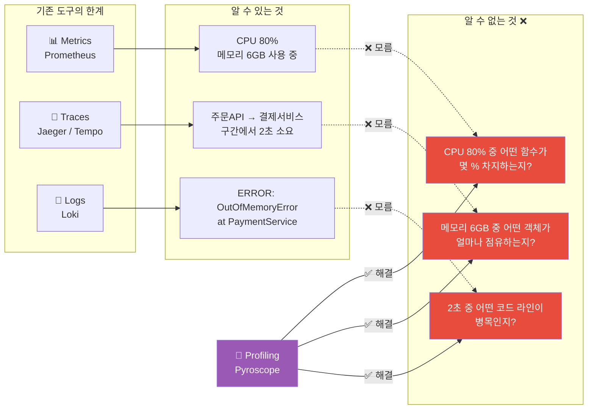
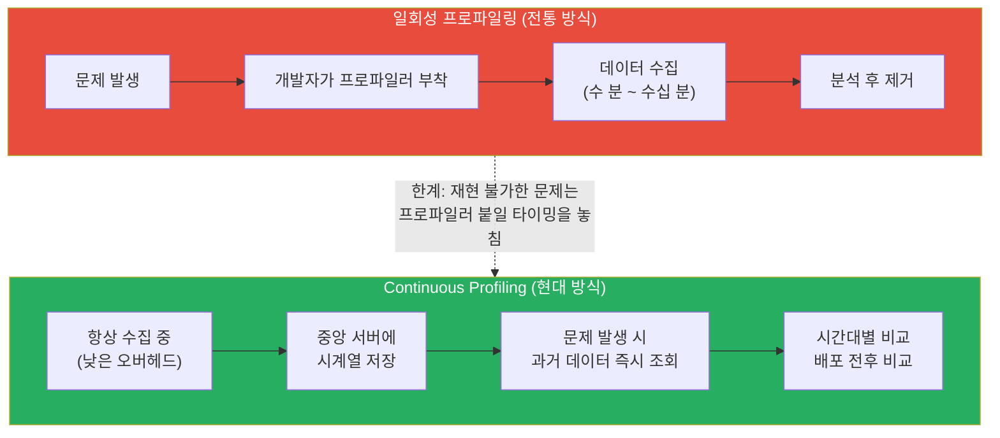
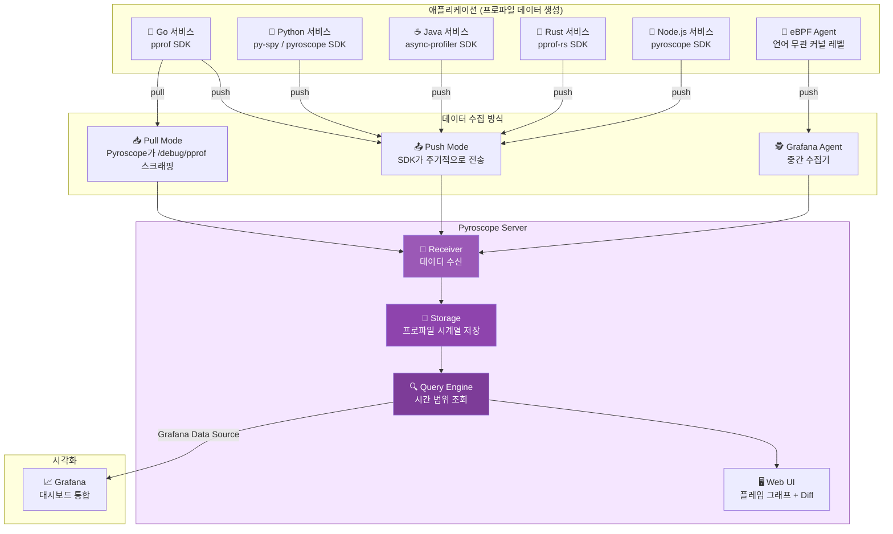
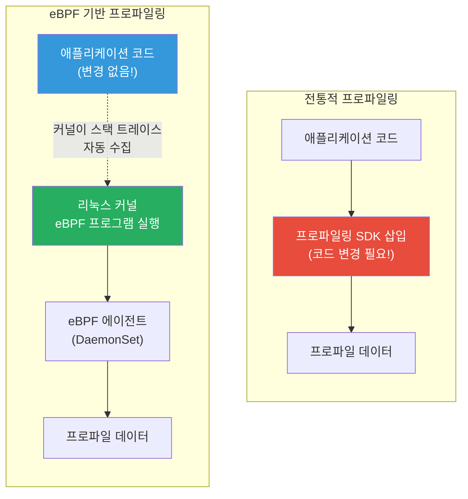
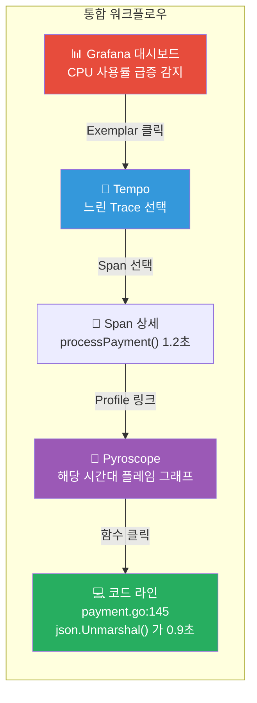
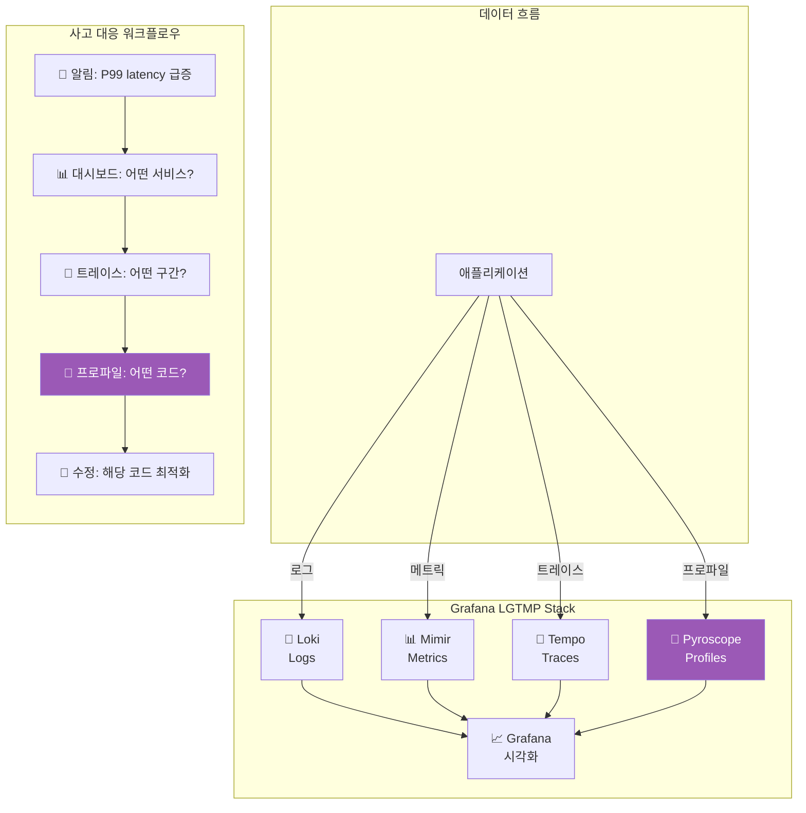

# Continuous Profiling — 코드 속 숨은 병목을 찾아내는 현미경

> 메트릭이 "CPU가 80%예요"라고 알려준다면, 프로파일링은 "그 80% 중에서 `parseJSON()` 함수가 62%를 차지해요"라고 정확히 짚어줘요. [Prometheus](./02-prometheus)로 **무엇이** 느린지 감지하고, [APM/트레이싱](./08-apm)으로 **어디서** 느린지 추적했다면, 이제 Continuous Profiling으로 **왜** 느린지, **어떤 코드 라인**이 범인인지 파헤쳐볼 차례예요.

---

## 🎯 왜 Continuous Profiling을/를 알아야 하나요?

### 일상 비유: 가정의 전기 요금 탐정

전기 요금이 갑자기 2배로 올랐다고 생각해 보세요.

- **메트릭(Prometheus)**: "이번 달 전기 사용량이 500kWh예요" (문제 감지)
- **트레이싱(Jaeger)**: "거실과 주방에서 많이 쓰고 있어요" (위치 파악)
- **프로파일링(Pyroscope)**: "거실 전기의 78%는 10년 된 구형 냉장고가 쓰고 있고, 나머지 22% 중 15%는 항상 켜져 있는 TV 대기전력이에요" (근본 원인의 코드 레벨 특정)

**프로파일링은 바로 이 "전력 사용 상세 분석기"예요.** 어떤 가전제품(함수)이, 얼마나(CPU/메모리), 언제(시간대별) 자원을 소비하는지를 정확히 알려줘요.

### Continuous Profiling이 없으면 생기는 문제

```
실무에서 Continuous Profiling이 필요한 순간:

• "CPU 사용률이 80%인데, 어떤 함수가 제일 많이 먹는 거야?"     → CPU 프로파일링
• "메모리가 계속 올라가는데 어디서 새는 거지?"                  → 메모리(Heap) 프로파일링
• "GC가 너무 자주 도는데 어떤 객체가 많이 할당되나?"           → Allocation 프로파일링
• "Go 서비스에서 goroutine이 10만 개나 쌓여있어!"              → Goroutine 프로파일링
• "락 경합이 심한 것 같은데 어디서 블로킹되지?"                → Block/Mutex 프로파일링
• "프로덕션에서만 느린데, 로컬에서는 재현이 안 돼..."           → Continuous Profiling으로 상시 수집
• "클라우드 비용이 매달 30% 올라가고 있어"                     → 프로파일링으로 비효율 코드 특정
```

### 기존 Observability 도구만으로는 부족한 이유



### Observability의 4번째 기둥

| 기둥 | 도구 | 답변하는 질문 | 수준 |
|------|------|-------------|------|
| **Metrics** | Prometheus | "무엇이 이상한가?" | 서비스/인프라 |
| **Logs** | Loki / ELK | "무슨 이벤트가 발생했나?" | 이벤트 |
| **Traces** | Jaeger / Tempo | "요청이 어떤 경로로 흘렀나?" | 요청 흐름 |
| **Profiles** | Pyroscope / Phlare | "어떤 코드가 리소스를 소비하나?" | **코드 라인** |

---

## 🧠 핵심 개념 잡기

### 1. 프로파일링이란?

> **비유**: 자동차 엔진 진단기 — 보닛을 열고 어떤 부품이 연료를 얼마나 소비하는지, 어디서 열이 나는지를 정밀하게 측정하는 거예요.

프로파일링은 **실행 중인 프로그램의 리소스 사용 패턴**을 분석하는 기술이에요. 어떤 함수가 CPU 시간을 가장 많이 쓰는지, 어떤 코드 경로가 메모리를 가장 많이 할당하는지를 알려줘요.

### 2. 프로파일링의 종류

| 종류 | 측정 대상 | 대표 질문 | 비유 |
|------|----------|----------|------|
| **CPU 프로파일링** | 함수별 CPU 소비 시간 | "어떤 함수가 가장 오래 실행되나?" | 직원별 업무 시간 측정 |
| **Memory(Heap) 프로파일링** | 메모리 할당량 및 사용량 | "어떤 객체가 메모리를 많이 먹나?" | 창고별 재고 현황 |
| **Allocation 프로파일링** | 메모리 할당 횟수 | "GC 압박을 주는 코드는?" | 택배 주문 빈도 |
| **Goroutine 프로파일링** | 고루틴 수 및 상태 | "goroutine이 어디서 막히나?" | 대기줄 병목 분석 |
| **Block 프로파일링** | 동기화 대기 시간 | "어디서 락을 기다리나?" | 화장실 줄 서기 시간 |
| **Mutex 프로파일링** | 뮤텍스 경합 | "어떤 락이 병목인가?" | 좁은 문 앞의 혼잡도 |
| **I/O 프로파일링** | 디스크/네트워크 대기 | "어떤 I/O가 느린가?" | 배달 지연 분석 |

### 3. 일회성 vs Continuous Profiling



| 항목 | 일회성 프로파일링 | Continuous Profiling |
|------|------------------|---------------------|
| **수집 시점** | 문제 발생 후 수동 | 항상 자동 |
| **오버헤드** | 높을 수 있음 (5-20%) | 매우 낮음 (2-5%) |
| **과거 데이터** | 없음 | 시계열로 저장 |
| **배포 비교** | 불가능 | 배포 전후 diff 가능 |
| **재현 불가 이슈** | 놓칠 확률 높음 | 이미 데이터가 있음 |
| **프로덕션 적용** | 위험 부담 | 안전하게 상시 운영 |

### 4. 샘플링 기반 프로파일링

프로파일러는 보통 **샘플링 방식**으로 동작해요. 프로그램을 매 순간 감시하는 게 아니라, 일정 간격(예: 초당 100회)으로 "지금 어떤 함수를 실행 중인지" 스냅샷을 찍어요.

```
시간 →  t1   t2   t3   t4   t5   t6   t7   t8   t9   t10
실행 함수: A    A    B    A    C    A    A    B    A    A

결과: A = 7/10 (70%), B = 2/10 (20%), C = 1/10 (10%)
→ 함수 A가 CPU 시간의 약 70%를 사용하고 있다고 추정
```

이 방식의 장점은 **오버헤드가 매우 낮다**는 거예요. 프로그램 실행을 거의 방해하지 않으면서도 통계적으로 충분히 정확한 결과를 얻을 수 있어요.

### 5. 플레임 그래프(Flame Graph) — 프로파일링의 핵심 시각화

> **비유**: 가계부의 지출 분석 트리맵 — 넓은 막대가 돈(시간)을 많이 쓰는 항목이에요.

플레임 그래프는 Brendan Gregg가 만든 프로파일링 데이터의 시각화 방법이에요. **함수 호출 스택**을 시각적으로 표현해요.

```
┌─────────────────────────────────────────────────────────┐
│                    main() (100%)                         │
├──────────────────────────────┬──────────────────────────┤
│      handleRequest() (65%)   │    backgroundJob() (35%) │
├──────────────┬───────────────┤                          │
│ parseJSON()  │ queryDB()     │                          │
│   (40%)      │  (25%)        │                          │
├──────┬───────┤               │                          │
│decode│ alloc │               │                          │
│(25%) │(15%)  │               │                          │
└──────┴───────┴───────────────┴──────────────────────────┘

읽는 법:
• Y축 (아래→위): 콜 스택 깊이 (아래가 루트, 위가 리프 함수)
• X축 (너비): 해당 함수가 전체에서 차지하는 비율 (넓을수록 많이 사용)
• 색상: 보통 랜덤 (warm color), 의미 없음 (단, diff 뷰에서는 빨강=증가, 파랑=감소)
```

**플레임 그래프 읽기 핵심 팁**:

1. **가장 넓은 막대**를 먼저 찾으세요 — 그게 가장 많은 리소스를 쓰는 함수예요
2. **"plateau" (고원 형태)**를 찾으세요 — 위에 자식 함수가 없이 넓게 펼쳐진 부분은 해당 함수 자체에서 시간을 소비한다는 뜻이에요
3. **Self time vs Total time**을 구분하세요 — Total은 하위 함수 포함, Self는 해당 함수만의 시간이에요

---

## 🔍 하나씩 자세히 알아보기

### 1. Pyroscope — Continuous Profiling의 대표 주자

Pyroscope는 오픈소스 Continuous Profiling 플랫폼이에요. 2023년에 Grafana Labs에 인수되어 Grafana 생태계에 통합되었어요.

#### Pyroscope 아키텍처



#### Push Mode vs Pull Mode

| 항목 | Push Mode | Pull Mode |
|------|-----------|-----------|
| **동작 방식** | SDK가 주기적으로 서버에 전송 | Pyroscope가 엔드포인트를 스크래핑 |
| **적합한 언어** | 모든 언어 | Go (pprof 엔드포인트 내장) |
| **설정 위치** | 애플리케이션 코드 | Pyroscope 서버 설정 |
| **Prometheus 비유** | Push Gateway | Scrape Target |
| **K8s 환경** | Pod에 SDK 포함 | Service Discovery로 자동 발견 |
| **장점** | 설정이 간단함 | 애플리케이션 코드 변경 없음 (Go) |

#### Pyroscope Helm Chart로 K8s 배포

```yaml
# values.yaml - Pyroscope Helm Chart 설정
pyroscope:
  # 단일 바이너리 모드 (소규모 환경)
  mode: "single-binary"  # 또는 "distributed" (대규모)

  persistence:
    enabled: true
    storageClassName: gp3
    size: 50Gi

  resources:
    requests:
      cpu: 500m
      memory: 1Gi
    limits:
      cpu: 2
      memory: 4Gi

  # Scrape 설정 (Pull Mode)
  scrapeConfigs:
    - job_name: "go-services"
      scrape_interval: 15s
      kubernetes_sd_configs:
        - role: pod
      relabel_configs:
        - source_labels: [__meta_kubernetes_pod_annotation_pyroscope_io_scrape]
          action: keep
          regex: "true"
        - source_labels: [__meta_kubernetes_pod_annotation_pyroscope_io_profile_cpu_enabled]
          action: keep
          regex: "true"
      profiling_config:
        pprof_config:
          process_cpu:
            enabled: true
            path: "/debug/pprof/profile"
            delta: true
          memory:
            enabled: true
            path: "/debug/pprof/heap"
            delta: true
          goroutine:
            enabled: true
            path: "/debug/pprof/goroutine"
          block:
            enabled: true
            path: "/debug/pprof/block"
          mutex:
            enabled: true
            path: "/debug/pprof/mutex"

  # Grafana 연동
  grafana:
    datasource:
      enabled: true
```

```bash
# Helm으로 Pyroscope 설치
helm repo add grafana https://grafana.github.io/helm-charts
helm repo update

helm install pyroscope grafana/pyroscope \
  --namespace observability \
  --create-namespace \
  -f values.yaml
```

### 2. 언어별 프로파일링 통합

#### Go — pprof (네이티브 지원)

Go는 프로파일링이 언어 차원에서 내장되어 있어요. `net/http/pprof` 패키지를 import하면 바로 사용할 수 있어요.

```go
package main

import (
    "log"
    "net/http"
    _ "net/http/pprof"  // 이 한 줄이면 프로파일링 엔드포인트 활성화!

    "github.com/grafana/pyroscope-go"
)

func main() {
    // 방법 1: pprof 엔드포인트만 열기 (Pull Mode에서 Pyroscope가 스크래핑)
    go func() {
        log.Println(http.ListenAndServe(":6060", nil))
    }()

    // 방법 2: Pyroscope SDK로 직접 Push
    pyroscope.Start(pyroscope.Config{
        ApplicationName: "order-service",
        ServerAddress:   "http://pyroscope.observability:4040",

        // 어떤 프로파일을 수집할지 선택
        ProfileTypes: []pyroscope.ProfileType{
            pyroscope.ProfileCPU,
            pyroscope.ProfileAllocObjects,
            pyroscope.ProfileAllocSpace,
            pyroscope.ProfileInuseObjects,
            pyroscope.ProfileInuseSpace,
            pyroscope.ProfileGoroutines,
            pyroscope.ProfileMutexCount,
            pyroscope.ProfileMutexDuration,
            pyroscope.ProfileBlockCount,
            pyroscope.ProfileBlockDuration,
        },

        // 레이블로 다차원 필터링 가능
        Tags: map[string]string{
            "env":     "production",
            "region":  "ap-northeast-2",
            "version": "v2.3.1",
        },
    })

    // 특정 코드 구간에 동적 레이블 추가
    pyroscope.TagWrapper(context.Background(), pyroscope.Labels(
        "controller", "orderHandler",
        "user_tier", "premium",
    ), func(ctx context.Context) {
        handleOrder(ctx)
    })
}
```

```bash
# pprof 엔드포인트 직접 사용하기
# CPU 프로파일 30초 수집
go tool pprof http://localhost:6060/debug/pprof/profile?seconds=30

# 힙(메모리) 프로파일 조회
go tool pprof http://localhost:6060/debug/pprof/heap

# Goroutine 덤프
go tool pprof http://localhost:6060/debug/pprof/goroutine

# Block 프로파일 (동기화 대기)
go tool pprof http://localhost:6060/debug/pprof/block

# 대화형 모드에서 사용할 수 있는 명령어
# (pprof) top10        — 상위 10개 함수
# (pprof) web          — 브라우저에서 그래프 보기
# (pprof) list funcName — 함수별 코드 라인 프로파일
# (pprof) flames        — 플레임 그래프
```

```
# go tool pprof 실행 결과 예시
(pprof) top10
Showing nodes accounting for 8.5s, 85% of 10s total
      flat  flat%   sum%        cum   cum%
     3.2s 32.00% 32.00%      3.5s 35.00%  encoding/json.(*decodeState).object
     1.8s 18.00% 50.00%      1.8s 18.00%  runtime.mallocgc
     1.2s 12.00% 62.00%      5.0s 50.00%  main.handleRequest
     0.8s  8.00% 70.00%      0.8s  8.00%  syscall.Syscall
     0.5s  5.00% 75.00%      2.3s 23.00%  database/sql.(*DB).query
     0.4s  4.00% 79.00%      0.4s  4.00%  runtime.gcBgMarkWorker
     0.3s  3.00% 82.00%      0.3s  3.00%  net/http.(*conn).readRequest
     0.2s  2.00% 84.00%      0.2s  2.00%  crypto/tls.(*Conn).Read
     0.1s  1.00% 85.00%      6.2s 62.00%  net/http.(*ServeMux).ServeHTTP

→ json decoding이 전체의 32%! 최적화 1순위 대상이에요.
```

#### Python — py-spy / cProfile

```python
# 방법 1: Pyroscope SDK (Push Mode)
import pyroscope

pyroscope.configure(
    application_name="payment-service",
    server_address="http://pyroscope.observability:4040",
    sample_rate=100,  # 초당 100회 샘플링
    tags={
        "env": "production",
        "region": "ap-northeast-2",
        "version": "v1.5.0",
    },
)

# 특정 구간에 레이블 추가
with pyroscope.tag_wrapper({"endpoint": "/api/payment", "method": "POST"}):
    process_payment(request)


# 방법 2: py-spy (외부 프로파일러, 코드 변경 없음)
# pip install py-spy
# py-spy는 실행 중인 Python 프로세스에 붙여서 프로파일링할 수 있어요
```

```bash
# py-spy 사용법 (코드 변경 없이 프로파일링!)
# 실행 중인 프로세스에 붙이기
py-spy top --pid 12345

# 플레임 그래프 SVG 생성
py-spy record -o profile.svg --pid 12345 --duration 30

# 새 프로세스로 시작하면서 프로파일링
py-spy record -o profile.svg -- python app.py

# Speedscope 포맷으로 출력 (웹 뷰어)
py-spy record -o profile.speedscope --format speedscope --pid 12345
```

```python
# 방법 3: cProfile (Python 내장)
import cProfile
import pstats

# 함수 프로파일링
profiler = cProfile.Profile()
profiler.enable()
process_data()  # 프로파일링 대상 함수
profiler.disable()

# 결과 출력
stats = pstats.Stats(profiler)
stats.sort_stats('cumulative')
stats.print_stats(20)  # 상위 20개

# 결과 예시:
#    ncalls  tottime  percall  cumtime  percall filename:lineno(function)
#     1000    5.234    0.005   12.567    0.013 payment.py:45(validate_card)
#    50000    3.821    0.000    3.821    0.000 utils.py:12(hash_token)
#     1000    2.112    0.002    8.445    0.008 db.py:78(execute_query)
```

#### Java — async-profiler

```bash
# async-profiler 사용법 (코드 변경 없이!)
# Java 8+ 지원, 가장 정확한 JVM 프로파일러

# CPU 프로파일링 30초
./asprof -d 30 -f profile.html <PID>

# Allocation 프로파일링 (메모리 할당 추적)
./asprof -e alloc -d 30 -f alloc-profile.html <PID>

# Lock 프로파일링 (락 경합 분석)
./asprof -e lock -d 30 -f lock-profile.html <PID>

# Wall Clock 프로파일링 (I/O 대기 포함)
./asprof -e wall -d 30 -f wall-profile.html <PID>

# 플레임 그래프를 JFR 포맷으로 저장 (JDK Mission Control에서 열기)
./asprof -d 60 -f recording.jfr <PID>
```

```java
// Pyroscope Java SDK로 Continuous Profiling
// build.gradle
// implementation 'io.pyroscope:agent:0.13.0'

import io.pyroscope.javaagent.PyroscopeAgent;
import io.pyroscope.javaagent.config.Config;
import io.pyroscope.http.Format;

public class Application {
    public static void main(String[] args) {
        // Pyroscope 에이전트 시작
        PyroscopeAgent.start(
            new Config.Builder()
                .setApplicationName("inventory-service")
                .setServerAddress("http://pyroscope.observability:4040")
                .setProfilingEvent(EventType.ITIMER)  // CPU
                .setProfilingAlloc("512k")             // 512KB마다 Alloc 샘플
                .setProfilingLock("10ms")              // 10ms 이상 Lock 대기
                .setFormat(Format.JFR)
                .setLabels(Map.of(
                    "env", "production",
                    "region", "ap-northeast-2"
                ))
                .build()
        );

        SpringApplication.run(Application.class, args);
    }
}
```

```bash
# 또는 Java Agent로 코드 변경 없이 적용
java -javaagent:pyroscope.jar \
  -Dpyroscope.application.name=inventory-service \
  -Dpyroscope.server.address=http://pyroscope:4040 \
  -Dpyroscope.format=jfr \
  -jar app.jar
```

### 3. eBPF 기반 프로파일링 — 코드 변경 없는 커널 레벨 프로파일링

eBPF(extended Berkeley Packet Filter)는 **리눅스 커널에서 안전하게 프로그램을 실행**하는 기술이에요. 이를 활용하면 **애플리케이션 코드를 전혀 변경하지 않고** 프로파일링할 수 있어요.



#### eBPF 프로파일링의 장점

| 장점 | 설명 |
|------|------|
| **코드 변경 Zero** | SDK 삽입 불필요, DaemonSet만 배포 |
| **언어 무관** | Go, Python, Java, Rust, C++ 모두 지원 |
| **낮은 오버헤드** | 커널 레벨에서 효율적으로 동작 (1-3%) |
| **전체 노드 커버** | 노드당 하나의 에이전트로 모든 Pod 프로파일링 |

#### Grafana Alloy (구 Grafana Agent) eBPF 프로파일링

```yaml
# Grafana Alloy 설정 - eBPF 프로파일링
# alloy-config.yaml
discovery.kubernetes "pods" {
  role = "pod"
}

pyroscope.ebpf "instance" {
  forward_to     = [pyroscope.write.endpoint.receiver]
  targets_only   = true
  default_target = {"service_name" = "unspecified"}

  targets = discovery.relabel.pods.output
}

discovery.relabel "pods" {
  targets = discovery.kubernetes.pods.targets

  rule {
    source_labels = ["__meta_kubernetes_pod_phase"]
    regex         = "Succeeded|Failed|Completed"
    action        = "drop"
  }

  rule {
    source_labels = ["__meta_kubernetes_namespace"]
    target_label  = "namespace"
  }

  rule {
    source_labels = ["__meta_kubernetes_pod_name"]
    target_label  = "pod"
  }

  rule {
    source_labels = ["__meta_kubernetes_pod_container_name"]
    target_label  = "container"
  }

  rule {
    action        = "labelmap"
    regex         = "__meta_kubernetes_pod_label_(.+)"
  }
}

pyroscope.write "endpoint" {
  endpoint {
    url = "http://pyroscope.observability:4040"
  }
}
```

```yaml
# Kubernetes DaemonSet으로 eBPF 에이전트 배포
apiVersion: apps/v1
kind: DaemonSet
metadata:
  name: grafana-alloy-ebpf
  namespace: observability
spec:
  selector:
    matchLabels:
      app: alloy-ebpf
  template:
    metadata:
      labels:
        app: alloy-ebpf
    spec:
      hostPID: true      # 호스트 프로세스 접근 필요
      hostNetwork: true
      containers:
        - name: alloy
          image: grafana/alloy:latest
          args:
            - run
            - /etc/alloy/config.alloy
          securityContext:
            privileged: true         # eBPF는 커널 권한 필요
            runAsUser: 0
          volumeMounts:
            - name: config
              mountPath: /etc/alloy
            - name: sys-kernel
              mountPath: /sys/kernel
              readOnly: true
          resources:
            requests:
              cpu: 100m
              memory: 256Mi
            limits:
              cpu: 500m
              memory: 512Mi
      volumes:
        - name: config
          configMap:
            name: alloy-ebpf-config
        - name: sys-kernel
          hostPath:
            path: /sys/kernel
```

### 4. Grafana Phlare에서 Pyroscope로의 통합

Grafana Phlare는 Grafana Labs가 자체 개발한 Continuous Profiling 백엔드였어요. 2023년에 Pyroscope를 인수한 후, **Phlare의 스토리지 엔진과 Pyroscope의 SDK/에이전트를 통합**하여 하나의 프로젝트로 만들었어요.

```
타임라인:
2021  Pyroscope 오픈소스 출시 (독립 프로젝트)
2022  Grafana Phlare 출시 (Grafana Labs 자체 개발)
2023  Grafana Labs가 Pyroscope 인수
2023  Phlare + Pyroscope 통합 → "Grafana Pyroscope"로 일원화
2024~ Grafana Cloud Profiles (SaaS), Grafana Pyroscope (OSS)
```

| 항목 | 구 Grafana Phlare | 통합 Grafana Pyroscope |
|------|-------------------|----------------------|
| **스토리지** | Phlare 엔진 | Phlare 엔진 유지 (성능 우수) |
| **SDK/에이전트** | 제한적 | Pyroscope의 풍부한 SDK 계승 |
| **쿼리 언어** | 제한적 | 향상된 쿼리 기능 |
| **Grafana 통합** | 네이티브 | 네이티브 (더 강화) |
| **배포 모드** | Monolithic / Microservices | Single Binary / Distributed |

### 5. 프로파일링과 트레이싱 연계 — Exemplar 연동

프로파일링의 진정한 힘은 **다른 Observability 신호와 연계**할 때 나와요. 특히 트레이싱과의 연결이 강력해요.



```go
// Go에서 Trace-Profile 연계하기
import (
    "github.com/grafana/pyroscope-go"
    "go.opentelemetry.io/otel"
)

func handlePayment(ctx context.Context, req PaymentRequest) error {
    // OpenTelemetry Span 생성
    ctx, span := otel.Tracer("payment").Start(ctx, "processPayment")
    defer span.End()

    // Pyroscope에 Span ID를 레이블로 전달
    // → 나중에 이 Span의 프로파일만 필터링 가능
    pyroscope.TagWrapper(ctx, pyroscope.Labels(
        "span_id", span.SpanContext().SpanID().String(),
        "trace_id", span.SpanContext().TraceID().String(),
    ), func(ctx context.Context) {
        // 이 블록 안의 CPU/메모리 사용이 해당 Span과 연결됨
        result := validateCard(ctx, req.CardNumber)
        chargeAmount(ctx, req.Amount)
        sendReceipt(ctx, req.Email)
    })

    return nil
}
```

### 6. Diff 플레임 그래프 — 배포 전후 비교

Continuous Profiling의 킬러 피쳐 중 하나는 **두 시간대의 프로파일을 비교**하는 Diff 뷰예요.

```
배포 전 (v2.3.0)                    배포 후 (v2.4.0)
┌─────────────────────┐             ┌─────────────────────┐
│     main() 100%     │             │     main() 100%     │
├──────────┬──────────┤             ├──────────┬──────────┤
│ handler  │ bg job   │             │ handler  │ bg job   │
│  (60%)   │ (40%)    │             │  (75%)   │ (25%)    │
├────┬─────┤          │             ├─────┬────┤          │
│json│ db  │          │             │json │ db │          │
│25% │35%  │          │             │50%  │25% │          │
└────┴─────┘          │             └─────┴────┘          │

Diff 뷰:
┌─────────────────────────────┐
│        main()               │
├──────────────┬──────────────┤
│  handler     │   bg job     │
│  (+15%) 🔴   │  (-15%) 🔵   │
├───────┬──────┤              │
│ json  │ db   │              │
│(+25%) │(-10%)│              │
│ 🔴🔴  │ 🔵   │              │
└───────┴──────┘              │

→ json 처리가 25%p 증가! v2.4.0에서 뭔가 비효율적인 JSON 코드가 들어감
→ 해당 커밋을 확인해보면 원인을 찾을 수 있어요
```

이 기능은 **성능 회귀(Performance Regression)** 를 배포 직후 바로 발견할 수 있게 해줘요.

---

## 💻 직접 해보기

### 실습 1: Docker Compose로 Pyroscope + Grafana 구성하기

```yaml
# docker-compose.yml
version: "3.8"

services:
  # Pyroscope 서버
  pyroscope:
    image: grafana/pyroscope:latest
    ports:
      - "4040:4040"
    volumes:
      - pyroscope-data:/data
    environment:
      - PYROSCOPE_STORAGE_PATH=/data
    command:
      - "-config.file=/etc/pyroscope/config.yaml"

  # Grafana (프로파일 시각화)
  grafana:
    image: grafana/grafana:latest
    ports:
      - "3000:3000"
    environment:
      - GF_AUTH_ANONYMOUS_ENABLED=true
      - GF_AUTH_ANONYMOUS_ORG_ROLE=Admin
    volumes:
      - ./grafana-provisioning:/etc/grafana/provisioning

  # 샘플 Go 애플리케이션
  sample-go-app:
    build: ./sample-app-go
    environment:
      - PYROSCOPE_SERVER_ADDRESS=http://pyroscope:4040
    depends_on:
      - pyroscope

  # 샘플 Python 애플리케이션
  sample-python-app:
    build: ./sample-app-python
    environment:
      - PYROSCOPE_SERVER_ADDRESS=http://pyroscope:4040
    depends_on:
      - pyroscope

volumes:
  pyroscope-data:
```

```yaml
# grafana-provisioning/datasources/pyroscope.yaml
apiVersion: 1

datasources:
  - name: Pyroscope
    type: grafana-pyroscope-datasource
    uid: pyroscope
    url: http://pyroscope:4040
    access: proxy
    isDefault: false
    jsonData:
      minStep: '15s'
```

### 실습 2: Go 샘플 애플리케이션으로 CPU 병목 찾기

```go
// sample-app-go/main.go
package main

import (
    "crypto/sha256"
    "encoding/json"
    "fmt"
    "math/rand"
    "net/http"
    "os"
    "time"

    "github.com/grafana/pyroscope-go"
)

func main() {
    // Pyroscope 연동
    pyroscope.Start(pyroscope.Config{
        ApplicationName: "sample-go-app",
        ServerAddress:   os.Getenv("PYROSCOPE_SERVER_ADDRESS"),
        ProfileTypes: []pyroscope.ProfileType{
            pyroscope.ProfileCPU,
            pyroscope.ProfileAllocObjects,
            pyroscope.ProfileAllocSpace,
            pyroscope.ProfileInuseObjects,
            pyroscope.ProfileInuseSpace,
            pyroscope.ProfileGoroutines,
        },
    })

    http.HandleFunc("/api/order", handleOrder)
    http.ListenAndServe(":8080", nil)
}

func handleOrder(w http.ResponseWriter, r *http.Request) {
    // 의도적으로 CPU를 많이 사용하는 코드들
    data := generateData()        // ~10% CPU
    validated := validateData(data) // ~30% CPU (비효율적 해싱)
    result := processData(validated) // ~60% CPU (비효율적 JSON 처리)

    json.NewEncoder(w).Encode(result)
}

func generateData() []map[string]interface{} {
    data := make([]map[string]interface{}, 100)
    for i := range data {
        data[i] = map[string]interface{}{
            "id":     i,
            "value":  rand.Float64(),
            "status": "pending",
        }
    }
    return data
}

func validateData(data []map[string]interface{}) []map[string]interface{} {
    // 비효율: 각 항목마다 SHA256 해시를 10번 반복 계산
    for _, item := range data {
        hash := fmt.Sprintf("%v", item)
        for j := 0; j < 10; j++ {
            h := sha256.Sum256([]byte(hash))
            hash = fmt.Sprintf("%x", h)
        }
        item["hash"] = hash
    }
    return data
}

func processData(data []map[string]interface{}) map[string]interface{} {
    // 비효율: 매번 전체 데이터를 JSON 직렬화/역직렬화 반복
    var processed []map[string]interface{}
    for range 50 {
        bytes, _ := json.Marshal(data)
        json.Unmarshal(bytes, &processed)
    }

    return map[string]interface{}{
        "count":     len(processed),
        "timestamp": time.Now().Unix(),
    }
}
```

```bash
# 실행 후 부하 생성
docker compose up -d

# 부하 테스트 (hey 또는 curl)
# hey -z 5m -q 10 http://localhost:8080/api/order
for i in $(seq 1 1000); do
  curl -s http://localhost:8080/api/order > /dev/null &
done

# Pyroscope UI 확인: http://localhost:4040
# Grafana에서 확인: http://localhost:3000 → Explore → Pyroscope 데이터소스
```

### 실습 3: Python 애플리케이션 프로파일링

```python
# sample-app-python/app.py
import os
import time
import json
import hashlib
from flask import Flask, jsonify
import pyroscope

# Pyroscope 연동
pyroscope.configure(
    application_name="sample-python-app",
    server_address=os.getenv("PYROSCOPE_SERVER_ADDRESS", "http://localhost:4040"),
    sample_rate=100,
    tags={"env": "demo", "service": "python-sample"},
)

app = Flask(__name__)


@app.route("/api/analyze")
def analyze():
    with pyroscope.tag_wrapper({"endpoint": "/api/analyze"}):
        data = fetch_data()           # ~15% CPU
        cleaned = clean_data(data)    # ~25% CPU
        result = heavy_computation(cleaned)  # ~60% CPU
        return jsonify(result)


def fetch_data():
    """데이터 생성 (DB 조회 시뮬레이션)"""
    time.sleep(0.01)  # I/O 시뮬레이션
    return [{"id": i, "value": i * 3.14, "text": f"item-{i}" * 100}
            for i in range(500)]


def clean_data(data):
    """비효율적 데이터 정제 — 불필요한 해싱 반복"""
    cleaned = []
    for item in data:
        text = item["text"]
        # 비효율: 같은 문자열을 20번 반복 해싱
        for _ in range(20):
            text = hashlib.sha256(text.encode()).hexdigest()
        cleaned.append({**item, "hash": text})
    return cleaned


def heavy_computation(data):
    """비효율적 계산 — 불필요한 JSON 직렬화 반복"""
    result = data
    # 비효율: 전체 데이터를 50번 직렬화/역직렬화
    for _ in range(50):
        serialized = json.dumps(result)
        result = json.loads(serialized)
    return {"count": len(result), "timestamp": time.time()}


if __name__ == "__main__":
    app.run(host="0.0.0.0", port=5000)
```

### 실습 4: Grafana에서 프로파일 조회하기

```
Grafana에서 Pyroscope 데이터 확인하는 방법:

1. Grafana (http://localhost:3000) 접속
2. 왼쪽 메뉴 → Explore 클릭
3. 상단 데이터소스를 "Pyroscope"로 선택
4. Profile Type 선택:
   - process_cpu        → CPU 프로파일
   - memory (inuse_space) → 현재 메모리 사용
   - memory (alloc_space) → 누적 메모리 할당
   - goroutine           → Goroutine 수
5. Label 필터: service_name = "sample-go-app"
6. 시간 범위 선택 후 "Run Query" 클릭
7. 플레임 그래프가 표시됨!

플레임 그래프에서 확인할 것:
• processData → json.Marshal/Unmarshal 이 가장 넓은 막대
• validateData → sha256.Sum256 반복이 두 번째
• 이 두 함수를 최적화하면 전체 성능의 ~90% 개선 가능
```

### 실습 5: pprof 커맨드라인으로 분석하기

```bash
# Go 서비스의 pprof 엔드포인트에서 직접 분석

# 1. CPU 프로파일 수집 (30초)
go tool pprof -http=:8081 http://localhost:6060/debug/pprof/profile?seconds=30

# 2. 힙 메모리 프로파일 분석
go tool pprof -http=:8081 http://localhost:6060/debug/pprof/heap

# 3. 두 시점 비교 (Diff 분석)
# 먼저 기준 프로파일 저장
curl -o baseline.pprof http://localhost:6060/debug/pprof/heap

# 코드 변경 후 새 프로파일 저장
curl -o current.pprof http://localhost:6060/debug/pprof/heap

# Diff 분석
go tool pprof -http=:8081 -diff_base=baseline.pprof current.pprof

# 4. 텍스트 모드 분석
go tool pprof http://localhost:6060/debug/pprof/profile?seconds=10
# (pprof) top20 -cum      # 누적 시간 기준 상위 20개
# (pprof) list handleOrder # handleOrder 함수의 라인별 프로파일
# (pprof) web              # 브라우저에서 콜 그래프 열기
# (pprof) svg > output.svg # SVG로 저장
```

---

## 🏢 실무에서는?

### 사례 1: 클라우드 비용 30% 절감

```
회사: 이커머스 플랫폼 (월 AWS 비용 $50,000)
문제: 매달 인프라 비용이 15%씩 증가, 트래픽은 5%만 증가
원인: "CPU 기준 오토스케일링이 과도하게 Scale Out"

Continuous Profiling 도입 후:
1. Pyroscope로 전 서비스 CPU 프로파일 수집 시작
2. 주문 서비스의 CPU 60%가 json.Unmarshal()에 소비되는 것 발견
3. 원인: 불필요한 JSON 파싱 반복 (캐시 미적용)
4. 수정: 파싱 결과를 메모리에 캐시 → CPU 사용률 60% 감소
5. 인스턴스 수 10대 → 4대로 축소

결과: 월 $15,000 절감 (30%), Pyroscope 운영 비용은 $200/월
ROI: 7,400% (투자 대비 수익)
```

### 사례 2: 메모리 누수 근본 원인 3분 만에 특정

```
문제: Java 서비스가 매 6시간마다 OOMKilled
기존 대응: 힙 덤프 → 100GB+ 파일 → 분석에 2시간
          문제 재현까지 6시간 대기 필요

Continuous Profiling 도입 후:
1. Pyroscope에 alloc_space 프로파일이 시계열로 저장되어 있음
2. Grafana에서 메모리 할당 그래프 확인 → 특정 시간대에 급증
3. 플레임 그래프에서 CacheManager.put() → HashMap.resize()가 거대한 블록
4. 원인: TTL 없는 캐시에 데이터가 무한 축적
5. 수정: TTL 설정 + maxSize 제한

결과: MTTR 2시간+ → 3분 (97% 단축)
```

### 사례 3: 배포 후 성능 회귀 즉시 탐지

```
상황: v3.2.0 배포 후 P99 latency 200ms → 800ms 증가
기존: 모니터링 알림 → 로그 분석 → 원인 추측 → 롤백 (30분)

Continuous Profiling 활용:
1. Pyroscope Diff 뷰로 v3.1.0 vs v3.2.0 프로파일 비교
2. parseUserPreferences() 함수가 +340% CPU 증가 (빨간색)
3. 해당 함수의 Git blame 확인 → PR #1847 에서 정규식 변경
4. 정규식이 catastrophic backtracking 유발하는 패턴
5. 수정: 정규식 최적화 후 핫픽스 배포

결과: 탐지 ~ 수정까지 12분 (기존 30분 → 60% 단축)
```

### 프로덕션 환경 베스트 프랙티스

```yaml
# 실무 권장 Pyroscope 설정 (대규모 환경)

# 1. Distributed 모드로 배포 (High Availability)
pyroscope:
  mode: "distributed"

  # Ingester: 프로파일 수신 및 압축
  ingester:
    replicas: 3
    resources:
      requests:
        cpu: 1
        memory: 4Gi

  # Store-Gateway: 장기 저장소 조회
  storeGateway:
    replicas: 2
    persistence:
      size: 100Gi

  # Compactor: 데이터 압축 및 정리
  compactor:
    replicas: 1

  # Query Frontend: 쿼리 캐싱 및 분산
  queryFrontend:
    replicas: 2

  # Object Storage (장기 저장)
  storage:
    backend: s3
    s3:
      bucket: "company-pyroscope-profiles"
      region: "ap-northeast-2"

  # 보존 기간 설정
  retention:
    # 최근 7일: 원본 해상도
    # 7-30일: 1분 해상도로 다운샘플링
    # 30일+: 삭제
    period: 30d

# 2. 샘플링 레이트 가이드
# - 개발/스테이징: 100Hz (초당 100회)
# - 프로덕션 (일반): 50Hz
# - 프로덕션 (고트래픽): 19Hz (기본값)
# - 비용 민감 환경: 10Hz
```

### 팀 도입 가이드

```
Continuous Profiling 도입 로드맵 (12주):

Phase 1: 파일럿 (1-4주)
├── Week 1: Pyroscope 단일 인스턴스 구축
├── Week 2: 핵심 서비스 1-2개에 SDK 통합
├── Week 3: Grafana 연동 및 대시보드 구성
└── Week 4: 첫 번째 최적화 사례 발굴

Phase 2: 확장 (5-8주)
├── Week 5-6: eBPF 에이전트로 전체 서비스 커버
├── Week 7: 트레이싱(Tempo) 연계 설정
└── Week 8: 팀 교육 및 런북 작성

Phase 3: 자동화 (9-12주)
├── Week 9-10: CI/CD에 프로파일 비교 자동화
├── Week 11: 비용 최적화 리포트 자동 생성
└── Week 12: SLO에 프로파일 메트릭 포함
```

---

## ⚠️ 자주 하는 실수

### 실수 1: 프로덕션에서 높은 샘플링 레이트 사용

```
❌ 잘못된 설정:
pyroscope.configure(
    sample_rate=1000,  # 초당 1000회! 오버헤드 급증
)

✅ 올바른 설정:
pyroscope.configure(
    sample_rate=100,   # 개발 환경
    # sample_rate=19,  # 프로덕션 (기본값, 충분히 정확)
)

이유:
• 샘플링 레이트가 높으면 CPU 오버헤드 증가 (>5%)
• 프로덕션에서 19-50Hz면 통계적으로 충분히 정확해요
• 높은 레이트가 필요한 건 초단위 burst를 분석할 때뿐이에요
```

### 실수 2: 플레임 그래프를 호출 순서로 읽기

```
❌ 잘못된 해석:
"왼쪽에 있는 함수가 먼저 호출되고, 오른쪽이 나중에 호출된다"

✅ 올바른 해석:
• X축은 시간 순서가 아니에요! 알파벳 순서로 정렬된 거예요
• X축의 너비 = 해당 함수의 리소스 사용 비율
• Y축 (아래→위) = 콜 스택 깊이
• 위치가 아니라 '너비'에 집중하세요!
```

### 실수 3: Self Time과 Total Time 혼동

```
❌ "processData()가 85% 차지하네, 이 함수를 최적화하자!"

실제로는:
processData() Total: 85%
├── json.Marshal()    Self: 50%  ← 실제 범인!
├── json.Unmarshal()  Self: 30%  ← 실제 범인!
└── processData() 자체 Self: 5%  ← 이건 별로 안 씀

✅ Self Time을 확인하세요!
• Total Time: 해당 함수 + 모든 하위 함수 호출 시간
• Self Time: 해당 함수 자체에서만 소비한 시간
• 최적화 대상은 Self Time이 높은 함수예요
```

### 실수 4: 한 번 프로파일링하고 끝내기

```
❌ "한 번 봤으니 됐지"
→ 성능은 트래픽 패턴, 데이터 크기, 시간대에 따라 달라져요
→ 월요일 오전의 프로파일과 금요일 밤의 프로파일은 완전히 다를 수 있어요

✅ Continuous Profiling을 상시 운영하세요
→ 시계열로 쌓여야 트렌드 분석, 배포 비교, 이상 탐지가 가능해요
→ 낮은 오버헤드(2-5%)이므로 프로덕션에서도 안전해요
```

### 실수 5: 모든 프로파일 타입을 한 번에 활성화

```
❌ 처음부터 전부 켜기:
ProfileTypes: []pyroscope.ProfileType{
    pyroscope.ProfileCPU,
    pyroscope.ProfileAllocObjects,
    pyroscope.ProfileAllocSpace,
    pyroscope.ProfileInuseObjects,
    pyroscope.ProfileInuseSpace,
    pyroscope.ProfileGoroutines,
    pyroscope.ProfileMutexCount,
    pyroscope.ProfileMutexDuration,
    pyroscope.ProfileBlockCount,
    pyroscope.ProfileBlockDuration,
}
→ 오버헤드 누적, 스토리지 급증

✅ 단계적 활성화:
1단계: CPU + InuseSpace (기본, 거의 모든 문제 커버)
2단계: AllocObjects (GC 문제 의심 시)
3단계: Goroutines (Go 서비스 동시성 이슈)
4단계: Mutex/Block (락 경합 의심 시에만)
```

### 실수 6: eBPF를 모든 환경에서 사용 가능하다고 가정

```
❌ "eBPF면 다 되겠지!"

현실:
• eBPF는 Linux 커널 4.9+ 필요 (5.8+ 권장)
• AWS EKS: Bottlerocket/AL2023 AMI는 지원, 일부 구형 AMI는 미지원
• GKE: Container-Optimized OS에서 지원
• Windows: 미지원
• 컨테이너: privileged 권한 또는 CAP_BPF 필요
• 일부 클라우드 환경에서는 보안 정책으로 차단될 수 있어요

✅ 대안:
• eBPF 불가 시 → 언어별 SDK(Push Mode) 사용
• 먼저 eBPF 호환성 테스트 후 결정하세요
```

---

## 📝 마무리

### 핵심 요약

```
Continuous Profiling이 Observability에 추가하는 가치:

Metrics:  "CPU가 80%야"          → 무엇이 문제인지
Logs:     "OOM 에러 발생"         → 무슨 이벤트가 있었는지
Traces:   "주문→결제 구간이 느려"  → 어디서 느린지
Profiles: "json.Unmarshal()이 62%" → 왜, 어떤 코드가 원인인지 ← NEW!
```

### 도구 선택 가이드

```
프로파일링 도구 선택 결정 트리:

Continuous Profiling 필요?
├── Yes → Pyroscope (Grafana 생태계)
│   ├── 코드 변경 가능? → SDK 통합 (Push Mode)
│   ├── 코드 변경 불가? → eBPF Agent (DaemonSet)
│   └── Go 서비스? → Pull Mode (pprof 엔드포인트)
│
└── No (일회성 분석)
    ├── Go → go tool pprof
    ├── Python → py-spy (프로세스 attach)
    ├── Java → async-profiler
    └── 범용 → perf (Linux)
```

### 전체 Observability 스택에서의 위치



### 기억할 핵심 포인트

| 번호 | 핵심 | 설명 |
|------|------|------|
| 1 | **4번째 기둥** | Profiles는 Metrics, Logs, Traces에 이어 Observability의 4번째 기둥이에요 |
| 2 | **항상 켜두세요** | 낮은 오버헤드(2-5%)로 프로덕션에서 상시 운영 가능해요 |
| 3 | **넓은 막대 찾기** | 플레임 그래프에서 가장 넓은 Self Time 막대가 최적화 1순위예요 |
| 4 | **Diff 뷰 활용** | 배포 전후 프로파일 비교로 성능 회귀를 즉시 발견하세요 |
| 5 | **비용 절감** | 프로파일링으로 찾은 비효율 코드 최적화 = 인프라 비용 절감이에요 |
| 6 | **트레이싱 연계** | Trace ID로 프로파일을 연결하면 "느린 요청의 코드 원인"을 바로 찾아요 |
| 7 | **eBPF 우선** | 가능하면 eBPF로 시작하세요 — 코드 변경 없이 전체 커버 가능해요 |

---

## 🔗 다음 단계

### 추천 학습 경로

```
현재 위치: Continuous Profiling (09)
                │
    ┌───────────┼───────────────┐
    ▼           ▼               ▼
APM 연계    대시보드 설계    비용 최적화
(./08-apm)  (./10-dashboard-design)  (심화)
```

1. **[APM과 프로파일링 통합](./08-apm)**: APM 트레이스와 프로파일을 연계하여 "느린 요청 → 느린 코드"를 원클릭으로 추적하는 방법을 배워요
2. **[대시보드 설계](./10-dashboard-design)**: Grafana에서 Metrics + Traces + Profiles를 하나의 대시보드에 통합하는 실무 패턴을 다뤄요
3. **[Prometheus 복습](./02-prometheus)**: 프로파일 데이터를 메트릭과 함께 보면 더 강력해요 — PromQL과 연계하는 방법을 확인하세요

### 심화 주제

- **Grafana Cloud Profiles**: 관리형 SaaS로 Pyroscope 운영 부담 줄이기
- **CI/CD 프로파일 비교 자동화**: PR마다 벤치마크 프로파일을 비교하여 성능 회귀 차단
- **FinOps와 프로파일링**: 프로파일 기반 리소스 Right-sizing으로 클라우드 비용 최적화
- **커스텀 프로파일 타입**: 비즈니스 로직별 프로파일 수집 (예: "결제 처리 시간 프로파일")
- **OpenTelemetry Profiling Signal**: OTel에 프로파일링이 정식 신호로 추가되는 과정 추적하기

### 실습 과제

```
과제 1 (기초): Docker Compose로 Pyroscope + 샘플 앱 구성하고,
              플레임 그래프에서 병목 함수 3개를 찾아 스크린샷으로 정리하세요.

과제 2 (중급): 기존 Go/Python 서비스에 Pyroscope SDK를 통합하고,
              배포 전후 Diff 뷰로 성능 변화를 비교하는 리포트를 작성하세요.

과제 3 (심화): Kubernetes 클러스터에 eBPF 에이전트를 DaemonSet으로 배포하고,
              전체 서비스의 CPU 프로파일을 Grafana 대시보드에서 확인하세요.
              Tempo 트레이스와 연계하여 "느린 Trace → 코드 원인"을 추적하는
              워크플로우를 문서화하세요.
```
