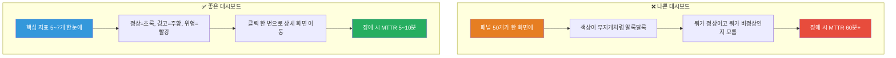
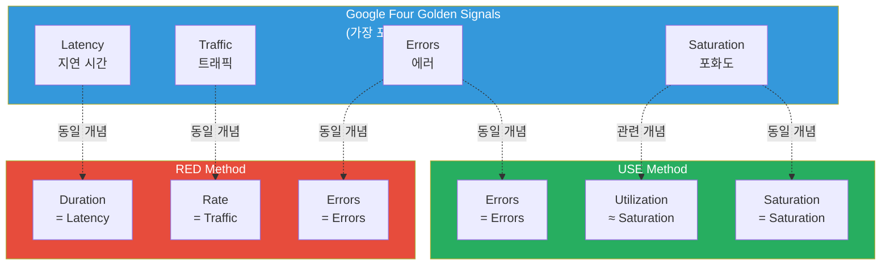
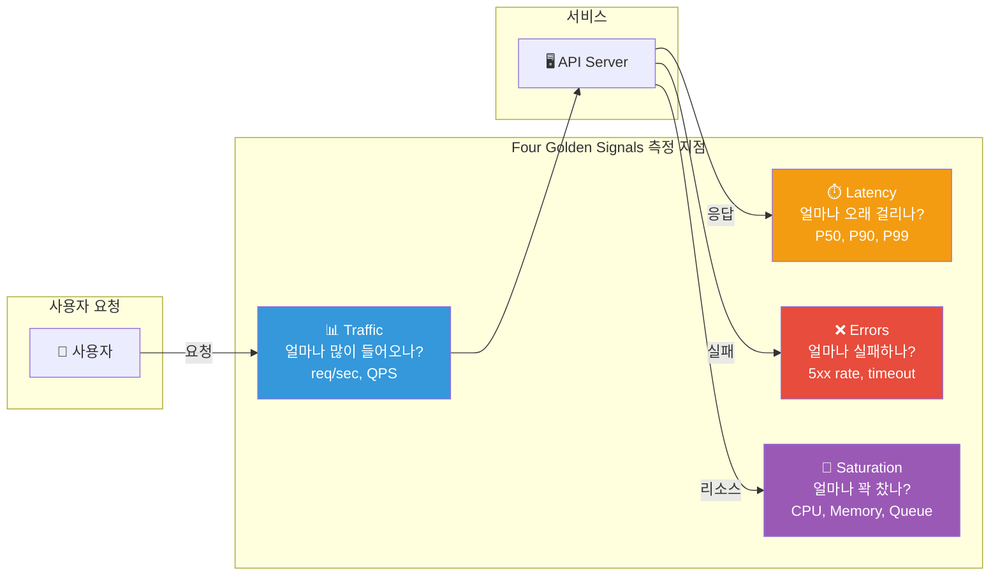
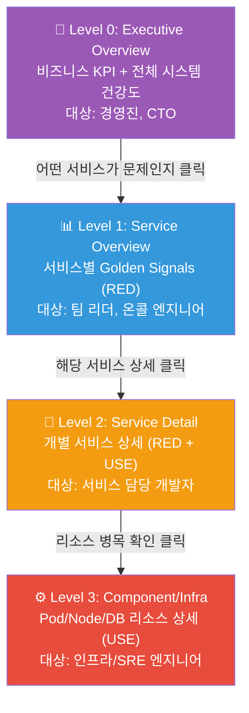
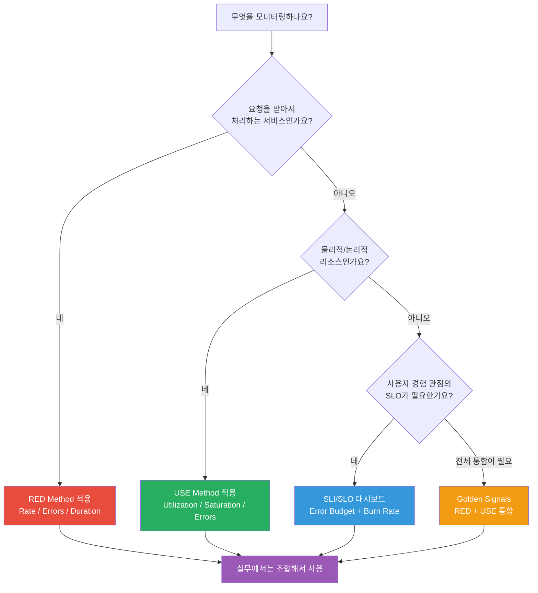

# 대시보드 설계 — 데이터를 이야기로 바꾸는 기술

> 메트릭을 수집하고 [Grafana](./03-grafana)로 시각화하는 것까지 배웠어요. 하지만 패널 수십 개를 무작정 배치한 대시보드는 오히려 혼란만 가중시켜요. "무엇을 보여줄 것인가"보다 "왜 이것을 보여주는가"가 더 중요해요. 이번 장에서는 RED Method, USE Method, Google의 Four Golden Signals, SLI/SLO 대시보드까지 — **목적 중심의 대시보드 설계 원칙**을 체계적으로 다뤄볼 거예요.

---

## 🎯 왜 대시보드 설계를 알아야 하나요?

### 일상 비유: 자동차 계기판 vs 비행기 조종석

자동차 계기판에는 속도, 연료, 엔진 온도 정도만 있어요. 운전에 꼭 필요한 정보만 골라서 보여주죠. 반면에 비행기 조종석에는 수백 개의 계기가 있지만, 이것도 아무렇게나 배치된 게 아니에요.

- **가장 중요한 6개 계기** (Primary Flight Display)가 정중앙에 있어요
- **경고등**은 빨간색으로 가장 눈에 띄는 위치에 있어요
- **엔진 상태**는 오른쪽에 모아져 있어요
- 비상시에는 **우선순위별로** 정보가 강조돼요

만약 비행기 계기판이 아무 규칙 없이 배치되어 있다면? 조종사가 위급한 상황에서 필요한 정보를 찾지 못해 사고가 날 수 있어요.

**서버 대시보드도 마찬가지예요.** 장애 상황에서 3초 안에 문제를 파악할 수 있어야 해요.

```
실무에서 대시보드 설계가 필요한 순간:

• 대시보드가 30개인데 장애 때 어떤 걸 봐야 할지 모르겠어요      → 계층 구조 설계 필요
• 패널이 50개인데 뭐가 중요한 건지 모르겠어요                  → 정보 밀도 최적화 필요
• 개발팀, SRE팀, 경영진이 각각 다른 관점을 원해요              → 대상별 대시보드 분리 필요
• "에러율이 높아요" vs "어떤 서비스 에러율?"                   → RED/USE Method 적용 필요
• SLO 위반 여부를 실시간으로 확인하고 싶어요                   → SLI/SLO 대시보드 필요
• 대시보드를 누가 수정했는지 추적이 안 돼요                    → Dashboard as Code 필요
• 새벽 3시 온콜에서 대시보드를 열었는데 원인을 못 찾겠어요       → 드릴다운 구조 필요
```

### 좋은 대시보드 vs 나쁜 대시보드



### 대시보드 설계 역량이 중요한 이유

```
대시보드 품질과 팀 성과의 관계:

설계 없는 대시보드  ██████████████████████████████████  MTTR 60분, 오탐 50%+
기본 메트릭만 나열  ████████████████████████            MTTR 30분, 오탐 30%
방법론 기반 설계    ████████████████                    MTTR 15분, 오탐 15%
SLI/SLO + 계층구조  ████████                            MTTR 5분,  오탐 5%

→ 체계적인 대시보드 설계는 장애 대응 속도를 10배 이상 높여요
```

---

## 🧠 핵심 개념 잡기

### 1. 대시보드 설계 방법론 개요

대시보드를 설계할 때 "무엇을 모니터링할 것인가?"라는 질문에 답하는 세 가지 대표 방법론이 있어요.

```
대시보드 설계 3대 방법론:

┌─────────────────┬──────────────────┬──────────────────┐
│   RED Method    │   USE Method     │  Golden Signals  │
├─────────────────┼──────────────────┼──────────────────┤
│ 서비스 중심      │ 리소스 중심        │ 사용자 경험 중심   │
│ Rate            │ Utilization      │ Latency          │
│ Errors          │ Saturation       │ Traffic          │
│ Duration        │ Errors           │ Errors           │
│                 │                  │ Saturation       │
├─────────────────┼──────────────────┼──────────────────┤
│ API, 웹서비스    │ CPU, 메모리, 디스크 │ 전체 시스템       │
│ 마이크로서비스    │ 네트워크, 큐       │ SRE 관점         │
└─────────────────┴──────────────────┴──────────────────┘
```

### 2. RED Method — 서비스를 바라보는 눈

> **비유**: 식당의 주문 현황판

식당에서 주문 현황판을 상상해 보세요.

- **Rate** (주문률): "지금 분당 몇 건의 주문이 들어오고 있나?" — 장사가 잘 되는지
- **Errors** (에러율): "주문 실수율이 얼마나 되나?" — 서비스 품질
- **Duration** (소요 시간): "음식 나오는 데 평균 얼마나 걸리나?" — 고객 만족도

이 세 가지만 알면 식당이 잘 돌아가고 있는지 즉시 판단할 수 있어요.

```
RED Method 공식:

Rate     = 초당 처리 요청 수 (throughput)
Errors   = 실패한 요청의 비율 (error rate)
Duration = 요청 처리 소요 시간 (latency distribution)

적용 대상: "요청을 받아서 처리하는 모든 서비스"
→ API Gateway, Web Server, 마이크로서비스, 메시지 컨슈머
```

### 3. USE Method — 리소스를 바라보는 눈

> **비유**: 도로 교통 상황판

도로 교통 상황판을 떠올려 보세요.

- **Utilization** (이용률): "도로가 몇 % 정도 차 있나?" — 현재 사용량
- **Saturation** (포화도): "대기 중인 차가 얼마나 되나?" — 한계에 가까운지
- **Errors** (에러): "사고가 몇 건 발생했나?" — 고장 여부

```
USE Method 공식:

Utilization = 리소스의 사용 비율 (0~100%)
Saturation  = 리소스를 기다리는 작업의 양 (큐 길이, 대기 시간)
Errors      = 에러 이벤트 수 (하드웨어 에러, 타임아웃 등)

적용 대상: "모든 물리/논리 리소스"
→ CPU, 메모리, 디스크, 네트워크, DB 커넥션 풀, 스레드 풀
```

### 4. Google의 Four Golden Signals — SRE의 표준

> **비유**: 환자의 바이탈 사인 (활력 징후)

병원에서 환자의 상태를 볼 때 체온, 맥박, 호흡, 혈압 이 네 가지를 먼저 확인하듯, Google SRE는 시스템의 "활력 징후" 네 가지를 정의했어요.

```
Four Golden Signals:

1. Latency    (지연 시간)   — 요청을 처리하는 데 걸리는 시간
                             성공 요청과 실패 요청을 분리해서 측정해야 해요
2. Traffic    (트래픽)      — 시스템에 들어오는 요청의 양
                             HTTP 요청/초, 초당 트랜잭션 수 등
3. Errors     (에러)        — 실패한 요청의 비율
                             명시적 에러(5xx) + 암묵적 에러(느린 200)
4. Saturation (포화도)      — 시스템이 얼마나 "꽉 차 있는지"
                             CPU, 메모리, I/O, 큐 길이 등
```

### 5. 세 방법론의 관계



> **결론**: Golden Signals = RED + USE의 합집합이에요. 실무에서는 서비스에 RED, 인프라에 USE를 적용하고, 전체를 Golden Signals로 통합하는 접근이 가장 효과적이에요.

### 6. SLI/SLO 대시보드 개념

> **비유**: 학교 성적표

SLI(Service Level Indicator)는 시험 점수이고, SLO(Service Level Objective)는 목표 성적이에요.

- SLI = "이번 시험 수학 85점" (현재 측정값)
- SLO = "수학 평균 80점 이상 유지" (목표)
- Error Budget = "80점까지 5점 여유 있네" (허용 범위)

```
SLI/SLO 대시보드 핵심 요소:

SLI (Service Level Indicator)
→ 측정 가능한 서비스 품질 지표
   예: "200ms 이내 응답 비율", "성공 요청 비율"

SLO (Service Level Objective)
→ SLI의 목표값
   예: "99.9% 요청이 200ms 이내", "에러율 0.1% 미만"

Error Budget (에러 버짓)
→ SLO를 위반하지 않으면서 허용되는 실패 비율
   예: 99.9% SLO → 30일 중 43.2분까지 장애 허용

Burn Rate (소진율)
→ Error Budget이 소진되는 속도
   예: Burn Rate 2.0 → 예상보다 2배 빠르게 버짓 소모 중
```

더 자세한 SRE 개념은 [SRE 파트](../10-sre/)에서 심도 있게 다뤄요.

---

## 🔍 하나씩 자세히 알아보기

### 1. RED Method 대시보드 상세 설계

#### Rate (요청률) 패널

```yaml
# Rate: 초당 요청 수 (QPS)
# PromQL 쿼리 패턴

# 전체 서비스 요청률
sum(rate(http_requests_total[5m]))

# 서비스별 요청률
sum by (service) (rate(http_requests_total[5m]))

# 엔드포인트별 요청률 (Top 10)
topk(10, sum by (handler) (rate(http_requests_total[5m])))

# 상태코드별 요청률
sum by (status_code) (rate(http_requests_total[5m]))
```

```
Rate 패널 설계 가이드:

패널 유형: Time Series (시계열 그래프)
Y축: req/sec
집계 간격: [5m] (안정적인 그래프) 또는 [1m] (민감한 감지)

비교 기준선 추가:
├── 지난주 같은 시간대 (shift 7d)
├── 일일 평균선
└── 피크 트래픽 임계값

주의: rate()의 범위 벡터는 scrape_interval의 최소 4배 이상으로 설정하세요
      scrape_interval=15s → rate()[1m] 이상 권장
```

#### Errors (에러율) 패널

```yaml
# Errors: 에러 비율 (%)
# PromQL 쿼리 패턴

# 전체 에러율 (5xx 기준)
sum(rate(http_requests_total{status_code=~"5.."}[5m]))
/
sum(rate(http_requests_total[5m]))
* 100

# 서비스별 에러율
sum by (service) (rate(http_requests_total{status_code=~"5.."}[5m]))
/
sum by (service) (rate(http_requests_total[5m]))
* 100

# gRPC 에러율
sum(rate(grpc_server_handled_total{grpc_code!="OK"}[5m]))
/
sum(rate(grpc_server_handled_total[5m]))
* 100
```

```
Errors 패널 설계 가이드:

패널 유형: Stat (단일 숫자) + Time Series (추이)
표시 형식: 퍼센트(%)
색상 임계값:
├── 초록: < 0.1% (정상)
├── 주황: 0.1% ~ 1% (주의)
└── 빨강: > 1% (위험)

중요: "성공한 느린 응답"도 사실상 에러일 수 있어요
      → 200 OK이지만 3초 이상 걸린 요청도 "암묵적 에러"로 분류해야 해요
```

#### Duration (지연 시간) 패널

```yaml
# Duration: 응답 시간 분포
# PromQL 쿼리 패턴 (histogram 기반)

# P50 (중앙값)
histogram_quantile(0.50,
  sum by (le) (rate(http_request_duration_seconds_bucket[5m]))
)

# P90
histogram_quantile(0.90,
  sum by (le) (rate(http_request_duration_seconds_bucket[5m]))
)

# P99
histogram_quantile(0.99,
  sum by (le) (rate(http_request_duration_seconds_bucket[5m]))
)

# 평균 응답 시간
sum(rate(http_request_duration_seconds_sum[5m]))
/
sum(rate(http_request_duration_seconds_count[5m]))
```

```
Duration 패널 설계 가이드:

패널 유형: Time Series (P50, P90, P99를 한 그래프에)
Y축: seconds 또는 milliseconds

퍼센타일 색상 약속:
├── P50 (중앙값): 초록 — 대부분의 사용자 경험
├── P90: 주황 — 10%의 사용자가 겪는 지연
├── P99: 빨강 — 최악의 사용자 경험
└── Average: 점선 — 참고용 (절대 평균만 보면 안 돼요!)

주의: 평균(average)만 보면 안 되는 이유
├── P50=50ms, P99=5000ms인데 평균은 200ms로 "정상"처럼 보여요
└── 항상 퍼센타일 분포를 함께 봐야 해요
```

#### RED Method 대시보드 전체 레이아웃

```
┌─────────────────────────────────────────────────────────────────┐
│                    서비스명: payment-service                       │
├──────────────────┬──────────────────┬───────────────────────────┤
│   📊 Rate (QPS)  │   ❌ Error Rate   │      ⏱️ Duration         │
│   [Stat: 1.2K/s] │   [Stat: 0.03%]  │   [Stat: P99=120ms]     │
│   색상: 파란색     │   색상: 초록      │   색상: 초록              │
├──────────────────┴──────────────────┴───────────────────────────┤
│                  Rate 추이 (Time Series)                         │
│   ───── 현재  ─ ─ ─ 지난주                                       │
├─────────────────────────────────────────────────────────────────┤
│                  Error Rate 추이 (Time Series)                   │
│   ▓▓▓ 5xx  ░░░ 4xx                                             │
├─────────────────────────────────────────────────────────────────┤
│                  Latency 분포 (Time Series)                      │
│   ───── P50  ───── P90  ───── P99                               │
├─────────────────────────────────────────────────────────────────┤
│         Top 5 느린 엔드포인트 (Table)                             │
│   /api/search     P99=350ms    1200 req/s                       │
│   /api/checkout   P99=280ms     800 req/s                       │
└─────────────────────────────────────────────────────────────────┘
```

### 2. USE Method 대시보드 상세 설계

#### CPU

```yaml
# USE Method - CPU
# PromQL 쿼리 패턴

# Utilization: CPU 사용률
1 - avg by (instance) (
  rate(node_cpu_seconds_total{mode="idle"}[5m])
)

# Saturation: CPU Run Queue (대기 프로세스 수)
node_load1  # 1분 평균 로드
# 또는 컨테이너 환경:
rate(container_cpu_cfs_throttled_seconds_total[5m])

# Errors: CPU 에러 (보통 하드웨어 레벨)
node_edac_correctable_errors_total  # ECC 메모리 교정 에러
```

#### Memory

```yaml
# USE Method - Memory
# PromQL 쿼리 패턴

# Utilization: 메모리 사용률
1 - (node_memory_MemAvailable_bytes / node_memory_MemTotal_bytes)

# Saturation: Swap 사용량 (메모리가 부족하면 swap으로 넘어감)
node_memory_SwapTotal_bytes - node_memory_SwapFree_bytes

# 또는 OOM Kill 횟수
increase(node_vmstat_oom_kill[1h])

# Errors: 메모리 에러
node_edac_uncorrectable_errors_total
```

#### Disk I/O

```yaml
# USE Method - Disk
# PromQL 쿼리 패턴

# Utilization: 디스크 사용률 (시간 기반)
rate(node_disk_io_time_seconds_total[5m])

# Saturation: I/O 대기 큐
rate(node_disk_io_time_weighted_seconds_total[5m])

# Errors: 디스크 I/O 에러 (OS 로그 기반 별도 수집 필요)

# 디스크 공간 사용률 (용량 관점)
1 - (node_filesystem_avail_bytes / node_filesystem_size_bytes)
```

#### Network

```yaml
# USE Method - Network
# PromQL 쿼리 패턴

# Utilization: 네트워크 대역폭 사용률
rate(node_network_receive_bytes_total[5m]) * 8  # bps
rate(node_network_transmit_bytes_total[5m]) * 8

# Saturation: 네트워크 큐 드롭
rate(node_network_receive_drop_total[5m])
rate(node_network_transmit_drop_total[5m])

# Errors: 네트워크 에러
rate(node_network_receive_errs_total[5m])
rate(node_network_transmit_errs_total[5m])
```

#### USE Method 리소스별 체크리스트

```
USE Method 완전 체크리스트:

┌──────────────┬──────────────────┬──────────────────┬──────────────┐
│   리소스      │  Utilization     │  Saturation      │  Errors      │
├──────────────┼──────────────────┼──────────────────┼──────────────┤
│ CPU          │ CPU 사용률 (%)   │ Run Queue 길이   │ 머신체크 에러 │
│ Memory       │ 메모리 사용률    │ Swap 사용량       │ OOM Kill 횟수│
│ Disk I/O     │ I/O 활용률       │ I/O 대기 큐       │ 디스크 에러  │
│ Disk Space   │ 용량 사용률      │ 파일시스템 Full   │ 읽기/쓰기 에러│
│ Network      │ 대역폭 사용률    │ 드롭된 패킷 수    │ 네트워크 에러│
│ DB Conn Pool │ 활성 커넥션 비율 │ 대기 커넥션 수    │ 타임아웃 수  │
│ Thread Pool  │ 활성 스레드 비율 │ 큐 대기 작업 수   │ 거부된 작업  │
│ File Desc    │ 열린 FD 비율    │ FD 한계 근접      │ EMFILE 에러  │
└──────────────┴──────────────────┴──────────────────┴──────────────┘
```

### 3. Four Golden Signals 대시보드 설계

Golden Signals는 RED Method와 USE Method를 통합한 관점이에요. [Prometheus](./02-prometheus)에서 수집한 메트릭을 Golden Signals 프레임워크로 정리하면 다음과 같아요.



#### Golden Signals PromQL 통합 쿼리 세트

```yaml
# ═══════════════════════════════════════════
# Golden Signals 통합 PromQL 쿼리 세트
# ═══════════════════════════════════════════

# --- 1. Latency ---
# 성공 요청의 P99
histogram_quantile(0.99,
  sum by (le) (
    rate(http_request_duration_seconds_bucket{status_code!~"5.."}[5m])
  )
)

# 실패 요청의 P99 (분리 측정이 중요!)
histogram_quantile(0.99,
  sum by (le) (
    rate(http_request_duration_seconds_bucket{status_code=~"5.."}[5m])
  )
)

# --- 2. Traffic ---
# 초당 요청 수
sum(rate(http_requests_total[5m]))

# 서비스별 트래픽 분포
sum by (service) (rate(http_requests_total[5m]))

# --- 3. Errors ---
# 에러율 (에러 요청 / 전체 요청)
sum(rate(http_requests_total{status_code=~"5.."}[5m]))
/
sum(rate(http_requests_total[5m]))

# --- 4. Saturation ---
# CPU 포화도
avg(1 - rate(node_cpu_seconds_total{mode="idle"}[5m]))

# 메모리 포화도
1 - (sum(node_memory_MemAvailable_bytes) / sum(node_memory_MemTotal_bytes))

# 커넥션 풀 포화도 (HikariCP 예시)
hikaricp_connections_active / hikaricp_connections_max
```

### 4. SLI/SLO 대시보드 설계

#### SLI 정의 패턴

```yaml
# ═══════════════════════════════════════════
# SLI 정의 예시
# ═══════════════════════════════════════════

# 가용성 SLI: 성공 요청 비율
# "전체 요청 중 성공(non-5xx) 비율"
sum(rate(http_requests_total{status_code!~"5.."}[30d]))
/
sum(rate(http_requests_total[30d]))

# 지연 시간 SLI: 빠른 응답 비율
# "전체 요청 중 200ms 이내 응답 비율"
sum(rate(http_request_duration_seconds_bucket{le="0.2"}[30d]))
/
sum(rate(http_request_duration_seconds_count[30d]))

# 처리량 SLI: 정상 처리 비율
# "대기열에 들어온 작업 중 5분 내 처리된 비율"
sum(rate(jobs_completed_total[30d]))
/
sum(rate(jobs_submitted_total[30d]))
```

#### Error Budget 계산

```yaml
# ═══════════════════════════════════════════
# Error Budget 계산 쿼리
# ═══════════════════════════════════════════

# SLO = 99.9% (0.999)
# Error Budget = 1 - SLO = 0.1%

# 30일 기준 에러 버짓 (분 단위)
# 30일 × 24시간 × 60분 × 0.001 = 43.2분

# 현재까지 소진된 에러 버짓 비율
(1 - (
  sum(rate(http_requests_total{status_code!~"5.."}[30d]))
  /
  sum(rate(http_requests_total[30d]))
)) / (1 - 0.999)

# Burn Rate (소진율)
# 현재 에러율이 SLO 허용 에러율의 몇 배인지
(
  sum(rate(http_requests_total{status_code=~"5.."}[1h]))
  /
  sum(rate(http_requests_total[1h]))
) / (1 - 0.999)
```

#### SLI/SLO 대시보드 레이아웃

```
┌─────────────────────────────────────────────────────────────────┐
│                  서비스: checkout-service                         │
│                  SLO: 99.9% | 윈도우: 30일                       │
├───────────────────┬─────────────────┬───────────────────────────┤
│  현재 SLI         │  Error Budget   │  Burn Rate               │
│  [Gauge: 99.95%]  │  [Gauge: 52%]   │  [Stat: 0.8x]           │
│  색상: 초록        │  색상: 주황      │  색상: 초록               │
│  목표: 99.9%      │  남은: 22.5분    │  정상 범위                │
├───────────────────┴─────────────────┴───────────────────────────┤
│              SLI 추이 (30일) — 목표선 99.9% 표시                  │
│  ═══════════════════════════════╗                                │
│  ─── 현재 SLI   ─ ─ SLO 목표선 ║ ← 이 아래로 내려가면 위험       │
│  ═══════════════════════════════╝                                │
├─────────────────────────────────────────────────────────────────┤
│              Error Budget 소진 추이 (30일)                        │
│  100% ████████████████████████████░░░░░░░░░░░░░ 52% 남음         │
│       ^                          ^             ^                │
│       월초                       현재          월말(예상)          │
├─────────────────────────────────────────────────────────────────┤
│              Burn Rate 추이 (최근 6시간)                          │
│  경고선: 2.0x  ─ ─ ─ ─ ─ ─ ─ ─                                  │
│  위험선: 10.0x ─ ─ ─ ─ ─ ─ ─ ─                                  │
│  현재: ─────── 0.8x (정상)                                       │
└─────────────────────────────────────────────────────────────────┘
```

### 5. 대시보드 계층 구조 (Drill-Down)

대시보드는 반드시 계층 구조로 설계해야 해요. 한 화면에 모든 정보를 넣으면 아무것도 안 보여요.



#### Level 0: Executive Overview

```
목적: "전체 시스템이 괜찮은가?" 3초 안에 답하기

┌───────────────────────────────────────────────────┐
│           System Health Overview                   │
├────────┬────────┬────────┬────────┬───────────────┤
│ 주문   │ 결제   │ 배송   │ 인증   │ 검색          │
│ 🟢     │ 🟢     │ 🟡     │ 🟢     │ 🟢            │
│ OK     │ OK     │ WARN   │ OK     │ OK            │
├────────┴────────┴────────┴────────┴───────────────┤
│ 전체 요청률: 12.5K/s    에러율: 0.02%              │
│ P99 Latency: 180ms     SLO 준수율: 99.97%         │
├───────────────────────────────────────────────────┤
│ Error Budget: ████████████████░░░░ 78% 남음        │
│ 활성 인시던트: 0건      최근 배포: 2시간 전          │
└───────────────────────────────────────────────────┘

포함 지표:
• 서비스별 건강 상태 (Traffic Light: 초록/주황/빨강)
• 전체 시스템 SLO 준수율
• Error Budget 잔여량
• 활성 인시던트 수
• 최근 변경 사항 (배포 마커)
```

#### Level 1: Service Overview

```
목적: "어떤 서비스가 문제인가?" 즉시 식별

포함 지표 (서비스당 RED 요약):
• Rate: 현재 요청률 + 지난주 대비 변화율
• Errors: 에러율 + 추이 스파크라인
• Duration: P50, P99 + SLO 대비 상태

구성:
• 행 하나가 서비스 하나
• 이상 징후가 있는 서비스는 맨 위로 정렬
• 클릭하면 Level 2로 이동 (Grafana Data Link 활용)
```

#### Level 2: Service Detail

```
목적: "이 서비스의 무엇이 문제인가?" 원인 좁히기

포함 지표:
• RED Method 전체 패널 (Rate, Errors, Duration 상세)
• 엔드포인트별 분석 (Top 슬로우/에러 엔드포인트)
• 의존성 상태 (downstream 서비스 호출 현황)
• 최근 배포 이벤트 (annotation)
• Pod/컨테이너 상태
```

#### Level 3: Component/Infrastructure

```
목적: "인프라 레벨에서 병목은 어디인가?" 근본 원인 파악

포함 지표:
• USE Method 전체 (CPU, Memory, Disk, Network)
• Pod/Node별 리소스 사용 현황
• DB 커넥션 풀, 슬로우 쿼리
• 캐시 히트율 (Redis, Memcached)
• 메시지 큐 깊이 (Kafka lag, SQS depth)
```

### 6. 정보 밀도 최적화

#### 패널 수의 법칙

```
대시보드 당 최적 패널 수:

❌ 나쁨:   패널 30개+  → "정보 과부하" — 모든 것을 보여주려 하면 아무것도 보이지 않아요
⚠️ 보통:   패널 15~20개 → "약간 복잡" — 스크롤이 필요하면 긴급 상황에서 느려요
✅ 좋음:   패널 7~12개  → "한 화면에 핵심만" — 스크롤 없이 모든 핵심 정보 확인
🎯 최적:   패널 5~7개   → "글랜스 대시보드" — 3초 안에 상태 파악 가능

원칙: "한 대시보드에 하나의 질문만"
├── "서비스가 정상인가?" → Overview 대시보드 (5~7 패널)
├── "어떤 서비스가 문제인가?" → Service 대시보드 (7~10 패널)
├── "왜 문제인가?" → Detail 대시보드 (10~15 패널)
└── "인프라 병목은?" → Infra 대시보드 (10~15 패널)
```

#### 시각적 계층 구조 (Visual Hierarchy)

```
정보 우선순위에 따른 배치:

┌─────────────────────────────────────────────────┐
│  [1순위] 현재 상태 — Stat/Gauge 패널             │
│  "지금 괜찮은가?" → 화면 최상단, 가장 큰 글씨     │
├─────────────────────────────────────────────────┤
│  [2순위] 추이 — Time Series 패널                 │
│  "언제부터 이상해졌나?" → 중간 영역               │
├─────────────────────────────────────────────────┤
│  [3순위] 상세 분석 — Table/Heatmap 패널          │
│  "무엇이 원인인가?" → 하단 영역                   │
└─────────────────────────────────────────────────┘

읽기 방향: 위 → 아래, 왼쪽 → 오른쪽 (Z-패턴)
```

### 7. 색상과 레이아웃 원칙

#### 색상 규칙

```
대시보드 색상 표준:

1. 상태 색상 (절대 바꾸지 마세요):
   🟢 초록 (#27ae60): 정상, SLO 충족
   🟡 주황 (#f39c12): 주의, SLO 접근 중
   🔴 빨강 (#e74c3c): 위험, SLO 위반

2. 데이터 시리즈 색상:
   파랑 (#3498db): 주요 메트릭 (트래픽, Rate)
   보라 (#9b59b6): 보조 메트릭
   청록 (#1abc9c): 비교 기준선

3. 배경 규칙:
   어두운 테마 권장 (눈의 피로 감소, 색상 대비 향상)
   밝은 배경에 빨간색보다 어두운 배경에 빨간색이 더 잘 보여요

4. 절대 하면 안 되는 것:
   ❌ 무지개 색상 (7가지 이상 색상 사용)
   ❌ 빨강-초록 혼용 (색맹 사용자 고려 안 됨)
   ❌ 의미 없는 색상 변경 (기존 약속과 다른 색상)
```

#### 레이아웃 원칙

```
Grafana 레이아웃 설계 원칙:

1. 그리드 시스템: Grafana는 24 column 그리드
   ├── Stat 패널: 4~6 columns (한 줄에 4~6개 배치)
   ├── Time Series: 12~24 columns (넓게)
   └── Table: 12~24 columns (넓게)

2. Row(행) 그룹핑:
   ├── Row 1: "현재 상태" (Stat, Gauge)
   ├── Row 2: "트래픽 & 에러" (Time Series)
   ├── Row 3: "지연 시간" (Time Series, Heatmap)
   └── Row 4: "상세 분석" (Table)

3. Row 접기 활용:
   ├── 기본: 핵심 Row만 펼침
   └── 상세: 필요할 때 Row 펼쳐서 확인

4. 반복(Repeat) 패턴:
   ├── 변수(Variable)로 서비스/인스턴스 선택
   └── 패널이 선택된 값에 따라 자동 반복
```

### 8. 대시보드 운영 관리

#### Dashboard as Code

대시보드는 코드처럼 관리해야 해요. UI에서 수동으로만 관리하면 누가 언제 뭘 바꿨는지 추적할 수 없어요.

```yaml
# Grafana Provisioning 예시 (grafana.ini)
# dashboards.yaml
apiVersion: 1
providers:
  - name: 'team-dashboards'
    orgId: 1
    folder: 'Production'
    type: file
    disableDeletion: true
    updateIntervalSeconds: 30
    options:
      path: /var/lib/grafana/dashboards
      foldersFromFilesStructure: true
```

```
Dashboard as Code 구현 방법:

1. Grafana Provisioning
   ├── JSON 파일을 Git 저장소에 관리
   ├── CI/CD로 자동 배포
   └── 환경별(dev/staging/prod) 변수 분리

2. Grafonnet (Jsonnet 기반)
   ├── 프로그래밍 방식으로 대시보드 생성
   ├── 재사용 가능한 라이브러리
   └── 코드 리뷰 + 테스트 가능

3. Terraform Grafana Provider
   ├── Terraform으로 대시보드 인프라 관리
   ├── 상태 관리 + 변경 추적
   └── 다른 인프라와 함께 관리
```

#### 대시보드 리뷰 프로세스

```
대시보드 변경 워크플로:

┌──────────┐    ┌──────────┐    ┌──────────┐    ┌──────────┐
│ 1. 변경   │ →  │ 2. PR    │ →  │ 3. 리뷰  │ →  │ 4. 배포   │
│ JSON 수정 │    │ 생성     │    │ + 승인   │    │ CI/CD    │
└──────────┘    └──────────┘    └──────────┘    └──────────┘

리뷰 체크리스트:
☐ 대시보드의 목적이 명확한가? (한 문장으로 설명 가능?)
☐ 대상 사용자가 정의되어 있는가?
☐ 패널 수가 적정한가? (7~15개)
☐ 색상 규칙을 따르는가?
☐ PromQL 쿼리가 효율적인가? (Recording Rules 활용?)
☐ 드릴다운 링크가 연결되어 있는가?
☐ 변수(Variable)가 적절히 활용되었는가?
☐ 시간 범위 기본값이 적절한가?
☐ 접근 권한이 적절히 설정되었는가?
```

#### 버전 관리 및 백업 전략

```yaml
# Git 저장소 구조 예시
dashboards/
├── README.md
├── provisioning/
│   └── dashboards.yaml
├── overview/
│   ├── system-health.json         # L0: Executive
│   └── service-overview.json      # L1: Service Overview
├── services/
│   ├── payment-service.json       # L2: Service Detail
│   ├── order-service.json
│   └── user-service.json
├── infrastructure/
│   ├── kubernetes-cluster.json    # L3: Infrastructure
│   ├── node-resources.json
│   └── database-performance.json
├── slo/
│   ├── checkout-slo.json          # SLI/SLO
│   └── search-slo.json
└── libraries/
    ├── red-method-row.libsonnet   # 재사용 가능한 Grafonnet 컴포넌트
    └── use-method-row.libsonnet
```

---

## 💻 직접 해보기

### 실습 1: RED Method 대시보드 만들기

[Grafana](./03-grafana)가 설치되어 있고, [Prometheus](./02-prometheus)에서 메트릭을 수집하고 있다는 전제하에 진행해요.

#### Step 1: 테스트 메트릭 생성 (Demo App)

```yaml
# docker-compose.yaml
version: '3.8'
services:
  prometheus:
    image: prom/prometheus:latest
    ports:
      - "9090:9090"
    volumes:
      - ./prometheus.yml:/etc/prometheus/prometheus.yml

  grafana:
    image: grafana/grafana:latest
    ports:
      - "3000:3000"
    environment:
      - GF_SECURITY_ADMIN_PASSWORD=admin

  # 데모 메트릭을 생성하는 앱
  demo-app:
    image: quay.io/brancz/prometheus-example-app:v0.4.0
    ports:
      - "8080:8080"
```

```yaml
# prometheus.yml
global:
  scrape_interval: 15s

scrape_configs:
  - job_name: 'demo-app'
    static_configs:
      - targets: ['demo-app:8080']
```

```bash
# 실행
docker-compose up -d

# 트래픽 생성 (별도 터미널에서)
while true; do
  curl -s http://localhost:8080/ > /dev/null
  curl -s http://localhost:8080/err > /dev/null  # 에러 발생
  sleep 0.1
done
```

#### Step 2: Grafana에서 RED 대시보드 구성

```
1. Grafana 접속 (http://localhost:3000, admin/admin)
2. Data Source → Prometheus 추가 (URL: http://prometheus:9090)
3. 새 대시보드 생성 → 이름: "RED Method - Demo Service"

패널 구성:

[Row 1: 현재 상태]
├── Panel 1 (Stat): Rate
│   쿼리: sum(rate(http_requests_total[5m]))
│   단위: req/s
│
├── Panel 2 (Stat): Error Rate
│   쿼리: sum(rate(http_requests_total{code=~"5.."}[5m]))
│         / sum(rate(http_requests_total[5m])) * 100
│   단위: percent
│   Thresholds: 0=green, 0.1=orange, 1=red
│
└── Panel 3 (Stat): P99 Latency
    쿼리: histogram_quantile(0.99,
            sum by (le) (rate(http_request_duration_seconds_bucket[5m])))
    단위: seconds

[Row 2: 추이 그래프]
├── Panel 4 (Time Series): Request Rate
│   쿼리 A: sum(rate(http_requests_total[5m]))  별칭: Current
│   쿼리 B: sum(rate(http_requests_total[5m] offset 7d))  별칭: Last Week
│
├── Panel 5 (Time Series): Error Rate Over Time
│   쿼리: sum(rate(http_requests_total{code=~"5.."}[5m]))
│         / sum(rate(http_requests_total[5m])) * 100
│
└── Panel 6 (Time Series): Latency Distribution
    쿼리 A: histogram_quantile(0.50, ...) 별칭: P50
    쿼리 B: histogram_quantile(0.90, ...) 별칭: P90
    쿼리 C: histogram_quantile(0.99, ...) 별칭: P99
```

### 실습 2: USE Method 인프라 대시보드

```
패널 구성:

[Row 1: CPU]
├── Panel 1 (Gauge): CPU Utilization
│   쿼리: 100 - (avg(rate(node_cpu_seconds_total{mode="idle"}[5m])) * 100)
│   Thresholds: 0=green, 70=orange, 90=red
│
├── Panel 2 (Time Series): CPU Utilization Over Time
│   쿼리: avg by (instance) (
│     100 - (rate(node_cpu_seconds_total{mode="idle"}[5m]) * 100))
│
└── Panel 3 (Stat): CPU Saturation (Load Average)
    쿼리: node_load1 / count(node_cpu_seconds_total{mode="idle"})

[Row 2: Memory]
├── Panel 4 (Gauge): Memory Utilization
│   쿼리: (1 - node_memory_MemAvailable_bytes / node_memory_MemTotal_bytes) * 100
│   Thresholds: 0=green, 80=orange, 95=red
│
└── Panel 5 (Time Series): Memory Usage Breakdown
    쿼리 A: node_memory_MemTotal_bytes     별칭: Total
    쿼리 B: node_memory_MemTotal_bytes - node_memory_MemAvailable_bytes  별칭: Used
    Stack: true

[Row 3: Disk]
├── Panel 6 (Bar Gauge): Disk Space Used
│   쿼리: (1 - node_filesystem_avail_bytes{mountpoint="/"}
│         / node_filesystem_size_bytes{mountpoint="/"}) * 100
│
└── Panel 7 (Time Series): Disk I/O
    쿼리 A: rate(node_disk_read_bytes_total[5m])   별칭: Read
    쿼리 B: rate(node_disk_written_bytes_total[5m]) 별칭: Write

[Row 4: Network]
├── Panel 8 (Time Series): Network Traffic
│   쿼리 A: rate(node_network_receive_bytes_total{device="eth0"}[5m]) * 8
│   쿼리 B: rate(node_network_transmit_bytes_total{device="eth0"}[5m]) * 8
│   단위: bits/sec
│
└── Panel 9 (Stat): Network Errors
    쿼리: sum(rate(node_network_receive_errs_total[5m]))
          + sum(rate(node_network_transmit_errs_total[5m]))
    Thresholds: 0=green, 1=orange, 10=red
```

### 실습 3: SLI/SLO 대시보드

```
전제: checkout-service의 SLO
├── 가용성: 99.9% (30일 윈도우)
└── 지연 시간: 99% 요청이 200ms 이내 (30일 윈도우)

패널 구성:

[Row 1: SLO 현황 한눈에]
├── Panel 1 (Gauge): 가용성 SLI
│   쿼리: sum(rate(http_requests_total{service="checkout",code!~"5.."}[30d]))
│         / sum(rate(http_requests_total{service="checkout"}[30d])) * 100
│   Min: 99, Max: 100
│   Thresholds: 99.9=green, 99.5=orange, 0=red
│   목표선: 99.9%
│
├── Panel 2 (Gauge): Error Budget 잔여율
│   쿼리: (위 SLI - 0.999) / (1 - 0.999) * 100 + 100
│   → 양수면 버짓 남음, 음수면 초과
│   Thresholds: 50=green, 20=orange, 0=red
│
└── Panel 3 (Stat): Burn Rate
    쿼리: (현재 1h 에러율) / (1 - 0.999)
    Thresholds: 1=green, 2=orange, 10=red

[Row 2: 추이]
├── Panel 4 (Time Series): SLI 추이 + SLO 목표선
│   쿼리 A: SLI 값 (rolling)
│   쿼리 B: 상수 99.9 (SLO 목표선, 빨간 점선)
│
└── Panel 5 (Time Series): Error Budget 소진 추이
    쿼리: 누적 에러 / 총 허용 에러 * 100
    Fill: below (영역 채우기로 남은 버짓 시각화)

[Row 3: Burn Rate 알림 윈도우]
├── Panel 6 (Time Series): Multi-Window Burn Rate
│   쿼리 A: 1h burn rate  (빠른 소진 감지)
│   쿼리 B: 6h burn rate  (중간 소진 감지)
│   쿼리 C: 24h burn rate (느린 소진 감지)
│   경고선: 2.0x, 위험선: 10.0x
│
└── Panel 7 (Table): SLO 위반 이벤트 목록
    최근 SLO 위반 시간, 지속 기간, 원인 요약
```

### 실습 4: Grafana Data Link로 드릴다운 연결

```
대시보드 간 드릴다운 연결 설정:

Level 1 (Overview) → Level 2 (Service Detail) 연결:

1. Overview 대시보드의 서비스 상태 패널 선택
2. Panel Edit → Data Links 추가
3. 설정:
   Title: "서비스 상세 보기"
   URL: /d/<dashboard-uid>/service-detail?var-service=${__field.labels.service}
   Open in: New Tab

Level 2 (Service Detail) → Level 3 (Infrastructure) 연결:

1. Service Detail의 Pod 패널에 Data Link 추가
2. 설정:
   Title: "인프라 상세 보기"
   URL: /d/<dashboard-uid>/infrastructure?var-instance=${__field.labels.instance}
```

```
Grafana 변수(Variable) 설정:

1. Dashboard Settings → Variables → New Variable
   Name: service
   Type: Query
   Query: label_values(http_requests_total, service)
   Refresh: On time range change

2. 모든 패널의 PromQL에 변수 적용:
   기존: sum(rate(http_requests_total[5m]))
   변경: sum(rate(http_requests_total{service="$service"}[5m]))

3. Multi-value + Include All option 활성화
   → 하나의 대시보드로 모든 서비스를 볼 수 있어요
```

---

## 🏢 실무에서는?

### 실무 사례 1: 이커머스 플랫폼 대시보드 전략

```
회사: 중규모 이커머스 (마이크로서비스 15개, 일 트래픽 500만 요청)

대시보드 구조:
├── L0: Business Health (1개)
│   ├── 주문 성공률, 결제 성공률, 검색 응답 시간
│   └── 매출 KPI (실시간 매출, 전환율)
│
├── L1: Service Map (1개)
│   ├── 15개 서비스 Golden Signals 요약
│   └── 서비스 간 의존성 상태
│
├── L2: Service Detail (서비스당 1개, 총 15개)
│   ├── RED Method 패널 (서비스별)
│   └── 엔드포인트별 상세 분석
│
├── L3: Infrastructure (3개)
│   ├── Kubernetes Cluster Overview
│   ├── Database Performance (MySQL, Redis)
│   └── Kafka & Message Queue
│
└── SLO: SLI/SLO Dashboard (3개)
    ├── Checkout SLO (가용성 99.95%, P99 < 500ms)
    ├── Search SLO (P99 < 200ms)
    └── Payment SLO (가용성 99.99%)

총 대시보드: 23개
온콜 시 보는 순서: L0 → L1 → L2 → L3 (평균 5분 내 원인 파악)
```

### 실무 사례 2: Recording Rules로 대시보드 성능 최적화

```yaml
# 문제: 대시보드 로딩이 10초 이상 걸림
# 원인: 매번 원본 메트릭에서 rate(), histogram_quantile() 계산
# 해결: Recording Rules로 미리 계산해두기

# prometheus-rules.yaml
groups:
  - name: red-method-recording-rules
    interval: 30s
    rules:
      # Rate: 서비스별 QPS (미리 계산)
      - record: service:http_requests:rate5m
        expr: sum by (service) (rate(http_requests_total[5m]))

      # Errors: 서비스별 에러율 (미리 계산)
      - record: service:http_errors:ratio_rate5m
        expr: |
          sum by (service) (rate(http_requests_total{status_code=~"5.."}[5m]))
          /
          sum by (service) (rate(http_requests_total[5m]))

      # Duration: 서비스별 P99 (미리 계산)
      - record: service:http_duration:p99_5m
        expr: |
          histogram_quantile(0.99,
            sum by (service, le) (
              rate(http_request_duration_seconds_bucket[5m])
            )
          )

      # SLI: 30일 가용성 (미리 계산)
      - record: service:sli:availability_30d
        expr: |
          sum by (service) (rate(http_requests_total{status_code!~"5.."}[30d]))
          /
          sum by (service) (rate(http_requests_total[30d]))
```

```
Recording Rules 적용 전후 비교:

대시보드 로딩 시간:
├── Before: 8~12초 (매번 원본 메트릭 집계)
└── After:  0.5~1초 (미리 계산된 결과 조회)

PromQL 변경:
├── Before: sum by (service)(rate(http_requests_total[5m]))
└── After:  service:http_requests:rate5m

규칙: 대시보드에서 같은 PromQL이 3개 이상 패널에서 반복되면
      → Recording Rule로 추출하세요
```

### 실무 사례 3: 팀별 대시보드 접근 전략

```
조직 규모별 대시보드 전략:

[소규모 팀 (5~10명)]
├── 대시보드: 3~5개
├── 관리: UI에서 직접 관리
└── 권한: 전원 Editor

[중규모 팀 (10~50명)]
├── 대시보드: 10~30개
├── 관리: Git + Provisioning
├── 권한: 팀별 Folder + RBAC
└── 리뷰: PR 기반 변경 관리

[대규모 팀 (50명+)]
├── 대시보드: 50~100개+
├── 관리: Grafonnet + CI/CD
├── 권한: LDAP/SSO + 세분화된 RBAC
├── 리뷰: 대시보드 SIG(Special Interest Group) 운영
└── 표준: 대시보드 스타일 가이드 문서화
```

### 실무 사례 4: 배포 마커(Annotation) 활용

```yaml
# 배포 시 Grafana Annotation 생성
# CI/CD 파이프라인에 추가

# GitHub Actions 예시
- name: Annotate Grafana
  run: |
    curl -X POST http://grafana:3000/api/annotations \
      -H "Authorization: Bearer $GRAFANA_API_KEY" \
      -H "Content-Type: application/json" \
      -d '{
        "dashboardUID": "service-overview",
        "time": '$(date +%s000)',
        "tags": ["deploy", "checkout-service", "v2.3.1"],
        "text": "checkout-service v2.3.1 deployed by CI/CD"
      }'
```

```
배포 마커의 가치:

"에러율이 갑자기 올라갔는데 원인이 뭐지?"
→ 그래프 위에 배포 마커가 찍혀 있으면 즉시 연관성 파악 가능

시간 ────────────────────────────────────────────
에러율      ─────┐    ┌─────────
                  │    │
            ─────┘    └─────────
                ↑
           [v2.3.1 배포]  ← Annotation

→ "v2.3.1 배포 직후 에러율 급증 → 롤백 결정" (30초 만에 판단)
```

---

## ⚠️ 자주 하는 실수

### 실수 1: "모든 메트릭을 한 대시보드에"

```
❌ 나쁜 예:
"production-all-in-one" 대시보드에 패널 80개
→ 로딩 10초+, 스크롤 5번, 장애 시 어디를 봐야 할지 모름

✅ 올바른 접근:
계층별 대시보드 분리 (L0→L1→L2→L3)
대시보드 당 패널 7~15개
한 대시보드 = 한 가지 질문에 대한 답
```

### 실수 2: "평균값만 보기"

```
❌ 나쁜 예:
"평균 응답 시간 200ms, 정상이네!"
→ 실제로는 P99이 5초, 1%의 사용자가 극심한 지연 경험 중

✅ 올바른 접근:
P50 (중앙값) + P90 + P99를 항상 함께 표시
평균은 참고용으로만 사용
"P99가 SLO를 초과하면 알림" 설정
```

### 실수 3: "상태 색상 기준 없이 시각화"

```
❌ 나쁜 예:
Gauge 패널에 CPU 사용률을 표시하지만 초록/주황/빨강 기준이 없음
→ "75%가 높은 건가 낮은 건가?" 매번 판단해야 함

✅ 올바른 접근:
모든 상태 패널에 Threshold 설정
├── CPU: 0~70% 초록, 70~90% 주황, 90%+ 빨강
├── 메모리: 0~80% 초록, 80~95% 주황, 95%+ 빨강
├── 에러율: 0~0.1% 초록, 0.1~1% 주황, 1%+ 빨강
└── 디스크: 0~70% 초록, 70~85% 주황, 85%+ 빨강
```

### 실수 4: "PromQL에서 rate() 범위를 너무 짧게"

```
❌ 나쁜 예:
rate(http_requests_total[15s])  # scrape_interval과 동일
→ 데이터 포인트 누락, 불안정한 그래프

✅ 올바른 접근:
rate(http_requests_total[5m])   # scrape_interval의 최소 4배
→ 안정적인 그래프, 신뢰할 수 있는 값

규칙: scrape_interval × 4 이상을 범위 벡터로 사용
      15s interval → [1m] 이상
      30s interval → [2m] 이상
```

### 실수 5: "대시보드 변경 이력 없이 운영"

```
❌ 나쁜 예:
Grafana UI에서 직접 수정, 누가 언제 뭘 바꿨는지 모름
→ "어제까지 잘 됐는데 오늘 대시보드가 이상해요" → 원인 추적 불가

✅ 올바른 접근:
Dashboard as Code (JSON → Git)
PR 기반 변경 관리
Grafana 버전 히스토리 활용 (Settings → Versions)
```

### 실수 6: "SLI/SLO 없이 감(느낌)으로 판단"

```
❌ 나쁜 예:
"에러율 0.5%인데... 이게 높은 건가? 낮은 건가?"
→ 기준이 없으니 매번 주관적 판단, 팀 내 의견 충돌

✅ 올바른 접근:
SLO 정의: "에러율 0.1% 미만 유지"
SLI 측정: 현재 0.5% → SLO 위반 상태
Error Budget: 이미 소진 → 기능 개발 중단, 안정성 작업 우선

→ 숫자로 대화하면 감정적 논쟁이 사라져요
```

### 실수 7: "서비스에 USE, 인프라에 RED 적용"

```
❌ 나쁜 예:
API 서비스에 USE Method 적용 → "API의 Utilization이 뭐지?"
CPU에 RED Method 적용 → "CPU의 Rate? Duration?"

✅ 올바른 접근:
서비스 (요청 처리 주체)  → RED Method (Rate, Errors, Duration)
리소스 (물리/논리 자원)  → USE Method (Utilization, Saturation, Errors)

기억법:
"요청을 받나?" → YES → RED
"사용되나?"    → YES → USE
```

---

## 📝 마무리

### 핵심 정리

```
대시보드 설계 핵심 요약:

1. 방법론 선택
   ├── 서비스 모니터링 → RED Method (Rate, Errors, Duration)
   ├── 리소스 모니터링 → USE Method (Utilization, Saturation, Errors)
   └── 통합 관점      → Golden Signals (Latency, Traffic, Errors, Saturation)

2. SLI/SLO 기반 대시보드
   ├── SLI: 측정 가능한 서비스 품질 지표
   ├── SLO: SLI의 목표값
   ├── Error Budget: 허용 가능한 실패 범위
   └── Burn Rate: 에러 버짓 소진 속도

3. 대시보드 계층 구조
   ├── L0: Executive Overview (3초 안에 상태 파악)
   ├── L1: Service Overview (문제 서비스 식별)
   ├── L2: Service Detail (원인 좁히기)
   └── L3: Infrastructure (근본 원인 파악)

4. 설계 원칙
   ├── 한 대시보드 = 한 가지 질문
   ├── 패널 수 7~15개 (스크롤 최소화)
   ├── 색상: 초록(정상), 주황(주의), 빨강(위험)
   ├── 퍼센타일(P50/P90/P99) 필수, 평균만 보지 않기
   └── 드릴다운 링크로 계층 간 연결

5. 운영 관리
   ├── Dashboard as Code (JSON → Git)
   ├── Recording Rules로 쿼리 성능 최적화
   ├── 배포 마커(Annotation)로 변경 추적
   └── PR 기반 대시보드 리뷰 프로세스
```

### 대시보드 설계 체크리스트

```
새 대시보드를 만들 때 확인하세요:

계획 단계:
☐ 이 대시보드의 목적을 한 문장으로 설명할 수 있는가?
☐ 대상 사용자(경영진/팀 리더/개발자/SRE)가 명확한가?
☐ 대시보드 계층(L0~L3) 중 어디에 위치하는가?
☐ 적절한 방법론(RED/USE/Golden Signals)을 선택했는가?

설계 단계:
☐ 패널 수가 7~15개 이내인가?
☐ 현재 상태(Stat/Gauge) → 추이(Time Series) → 상세(Table) 순서인가?
☐ 색상 규칙(초록/주황/빨강)이 일관되게 적용되었는가?
☐ Threshold가 모든 상태 패널에 설정되어 있는가?
☐ 변수(Variable)로 필터링이 가능한가?
☐ 드릴다운 링크가 연결되어 있는가?

구현 단계:
☐ PromQL의 rate() 범위가 scrape_interval × 4 이상인가?
☐ 반복되는 쿼리에 Recording Rules를 적용했는가?
☐ 대시보드 로딩 시간이 3초 이내인가?
☐ JSON이 Git에 커밋되어 있는가?

운영 단계:
☐ 배포 마커(Annotation)가 설정되어 있는가?
☐ 변경 시 PR 리뷰를 거치는가?
☐ 분기별 대시보드 리뷰 일정이 있는가?
☐ 사용되지 않는 대시보드를 정리하는 프로세스가 있는가?
```

### 방법론 선택 의사결정 트리



---

## 🔗 다음 단계

### 이 장에서 배운 것

```
✅ RED Method — 서비스 관점의 모니터링 (Rate, Errors, Duration)
✅ USE Method — 리소스 관점의 모니터링 (Utilization, Saturation, Errors)
✅ Golden Signals — Google SRE의 4대 신호 (Latency, Traffic, Errors, Saturation)
✅ SLI/SLO 대시보드 — 에러 버짓과 Burn Rate 기반 설계
✅ 대시보드 계층 — Overview → Service → Component 드릴다운
✅ 정보 밀도 최적화 — 패널 수, 시각적 계층, 색상 원칙
✅ PromQL 패턴 — RED/USE/SLO 쿼리 실전 예제
✅ 운영 관리 — Dashboard as Code, 리뷰 프로세스, 버전 관리
```

### 다음으로 학습할 내용

```
추천 학습 경로:

1. [알림 설계](./11-alerting)
   → 대시보드에서 발견한 이상을 자동으로 알리는 방법
   → Multi-Window Burn Rate 알림, 알림 피로 방지

2. [SRE 실천](../10-sre/)
   → SLI/SLO를 조직 문화에 적용하는 방법
   → Error Budget 정책, 인시던트 관리

3. [Prometheus 심화](./02-prometheus)
   → Recording Rules, Federation, Remote Write
   → 대규모 환경의 메트릭 수집 전략

4. [Grafana 활용](./03-grafana)
   → Provisioning, Alerting, Explore 모드
   → Loki/Tempo 연동으로 Metrics-Logs-Traces 통합
```

### 더 공부하기 좋은 자료

```
공식 자료:
• Google SRE Book - Chapter 6: Monitoring Distributed Systems
  (https://sre.google/sre-book/monitoring-distributed-systems/)
• USE Method by Brendan Gregg
  (https://www.brendangregg.com/usemethod.html)
• RED Method by Tom Wilkie
  (https://grafana.com/blog/2018/08/02/the-red-method/)

실전 자료:
• Grafana Dashboard Best Practices
  (https://grafana.com/docs/grafana/latest/dashboards/build-dashboards/best-practices/)
• Prometheus Recording Rules
  (https://prometheus.io/docs/prometheus/latest/configuration/recording_rules/)
• SLO Alerting with Burn Rate
  (https://sre.google/workbook/alerting-on-slos/)
```

---

> **기억하세요**: 좋은 대시보드는 "모든 것을 보여주는 대시보드"가 아니라 "필요한 것만 빠르게 보여주는 대시보드"예요. 장애 상황에서 3초 안에 상태를 파악할 수 없다면, 그 대시보드는 다시 설계해야 해요. RED, USE, Golden Signals는 "무엇을 보여줄 것인가"에 대한 검증된 답이고, SLI/SLO는 "얼마나 잘 하고 있는가"에 대한 객관적 기준이에요.
