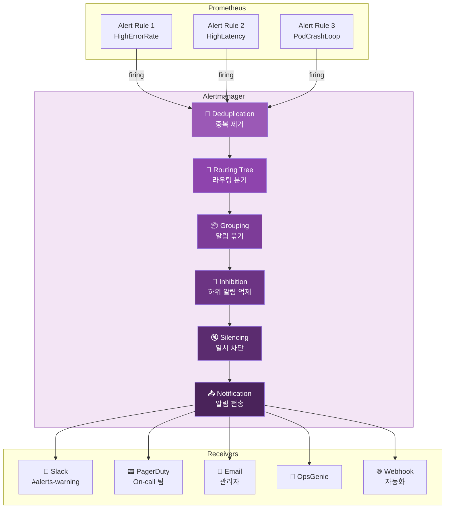
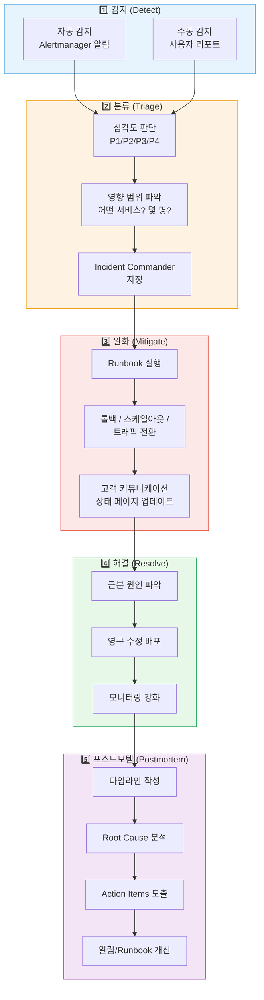

# 알림(Alerting) 완전 정복 — 장애를 가장 먼저 아는 사람이 되기

> 메트릭을 수집하고 대시보드를 만들어도, **아무도 안 보면 소용없어요.** 진짜 중요한 건 "문제가 생겼을 때 올바른 사람에게, 올바른 시점에, 올바른 정보를 전달하는 것"이에요. [Prometheus](./02-prometheus)에서 Alert Rules를, [대시보드 설계](./10-dashboard-design)에서 시각화를 배웠다면, 이제 그 알림이 **어떻게 전달되고, 누가 받고, 어떻게 대응하는지** — 알림의 전체 생명주기를 깊이 파고들어볼 차례예요.

---

## 🎯 왜 알림(Alerting)을/를 알아야 하나요?

### 일상 비유: 아파트 화재 경보 시스템

아파트 화재 경보 시스템을 떠올려보세요.

- 연기 감지기가 연기를 감지해요 (메트릭 수집 + Alert Rule)
- 경보가 울려요 (알림 발생)
- 관리실에서 어느 동 몇 층인지 확인해요 (알림 라우팅)
- 소방서에 신고하고, 동시에 주민에게 대피 안내를 해요 (에스컬레이션)
- 소방관이 출동해서 불을 꺼요 (장애 대응)
- 이후 화재 원인을 조사하고 재발 방지 대책을 세워요 (포스트모템)

만약 이 시스템이 엉망이라면?

- 경보가 **너무 자주** 울려서 다들 무시해요 (Alert Fatigue)
- 경보가 울렸는데 **아무도 안 받아요** (On-call 부재)
- 경보는 받았는데 **뭘 해야 할지 몰라요** (Runbook 부재)
- 1층 화재인데 **20층 주민에게만** 알려요 (잘못된 라우팅)

**Alerting 시스템이 바로 이 화재 경보 시스템이에요.**

```
실무에서 Alerting이 필요한 순간:

• "새벽 3시에 서비스 다운됐는데 아침에야 알았어요"           → 알림 설정 부재
• "하루에 알림이 200개 와서 진짜 중요한 걸 놓쳤어요"        → Alert Fatigue
• "알림 받았는데 뭘 해야 할지 몰라서 시니어 깨웠어요"       → Runbook 부재
• "같은 장애로 3명이 동시에 깨어났어요"                     → 라우팅/그룹핑 미설정
• "DB 장애인데 DB 관련 알림이 50개 동시에 왔어요"           → Inhibition 미설정
• "SLO 위반이 심각한 수준인데 알림이 없었어요"              → SLO 기반 알림 부재
• "장애 복구 후 같은 문제가 3개월 만에 또 발생했어요"        → 포스트모템 미수행
```

### 알림이 없는 팀 vs 잘 갖춘 팀

```mermaid
flowchart TD
    subgraph "❌ 알림 체계 없는 팀"
        A1["장애 발생!<br/>사용자 불만 접수"] -->|"30분 후 인지"| A2["누가 담당이지?"]
        A2 -->|"연락처 찾기"| A3["시니어 엔지니어 전화"]
        A3 -->|"15분 후 응답"| A4["뭐가 문제인지 파악 시작"]
        A4 -->|"원인 추측"| A5["수동 조치 시도"]
        A5 -->|"총 MTTR: 2시간+"| A6["고객 이탈 + 팀 소진"]
    end

    subgraph "✅ 알림 체계 갖춘 팀"
        B1["이상 징후 자동 감지<br/>Error Budget 소진 가속"] -->|"즉시 알림"| B2["On-call 엔지니어<br/>PagerDuty 수신"]
        B2 -->|"Runbook 확인"| B3["대시보드 + 로그 확인<br/>원인 즉시 특정"]
        B3 -->|"5분"| B4["Mitigation 실행<br/>롤백 / 스케일아웃"]
        B4 -->|"총 MTTR: 15분"| B5["빠른 복구 + 포스트모템"]
    end

    style A6 fill:#e74c3c,color:#fff
    style A5 fill:#e74c3c,color:#fff
    style B5 fill:#27ae60,color:#fff
    style B4 fill:#27ae60,color:#fff
```



### 장애 대응 성숙도 모델

```
Level 0: 알림 없음      ████████████████████████████████████████████  고객이 알려줌
Level 1: 기본 알림       ████████████████████████████████              CPU > 80% 같은 원인 기반
Level 2: 증상 기반 알림  ████████████████████████                      에러율, 지연시간 기반
Level 3: SLO 기반 알림   ████████████████                              Error Budget Burn Rate
Level 4: 자동 복구       ████████                                      알림 + 자동 대응

→ Level 3 이상이 되면 "진짜 중요한 알림"만 사람에게 전달돼요
```

---

## 🧠 핵심 개념 잡기

### 1. 알림의 생명주기

> **비유**: 119 신고 시스템 — 감지 → 신고 → 배차 → 출동 → 진화 → 조사

```mermaid
flowchart LR
    RULE["📏 Alert Rule<br/>조건 정의<br/>(Prometheus)"] -->|"조건 충족"| PENDING["⏳ Pending<br/>for 절 대기"]
    PENDING -->|"지속 시간 충족"| FIRING["🔥 Firing<br/>알림 발생"]
    FIRING -->|"전송"| AM["📨 Alertmanager<br/>라우팅 + 그룹핑"]
    AM -->|"알림 전달"| RECEIVER["📱 Receiver<br/>Slack/PD/Email"]
    RECEIVER -->|"확인"| ACK["✅ Acknowledged<br/>담당자 확인"]
    ACK -->|"조치"| RESOLVE["🔧 Resolved<br/>문제 해결"]
    RESOLVE -->|"분석"| PM["📋 Postmortem<br/>재발 방지"]

    style FIRING fill:#e74c3c,color:#fff
    style AM fill:#9b59b6,color:#fff
    style RESOLVE fill:#27ae60,color:#fff
    style PM fill:#3498db,color:#fff
```



### 2. Alertmanager의 역할

> **비유**: 119 상황실 — 신고를 받아서 적절한 소방서로 배차하고, 중복 신고를 걸러내요

| 기능 | 설명 | 비유 |
|------|------|------|
| **Routing** | 알림을 적절한 수신자에게 전달 | 어느 소방서로 보낼지 결정 |
| **Grouping** | 관련 알림을 묶어서 전달 | "강남구 화재" 하나로 묶기 |
| **Inhibition** | 상위 알림이 있으면 하위 알림 억제 | 건물 전체 화재 시 개별 층 알림 억제 |
| **Silencing** | 특정 조건의 알림을 일시적으로 차단 | 공사 중 구역은 경보 끔 |
| **Deduplication** | 같은 알림 중복 전송 방지 | 같은 사고 중복 신고 걸러냄 |

### 3. Symptom-based vs Cause-based 알림

> **비유**: 의사의 진단 방식

| 구분 | Cause-based (원인 기반) | Symptom-based (증상 기반) |
|------|------------------------|--------------------------|
| **예시** | CPU > 80% | 에러율 > 1% |
| **비유** | "혈압이 높아요" | "머리가 아파요" |
| **장점** | 구체적인 원인 알 수 있음 | 사용자 영향 직접 반영 |
| **단점** | 사용자 영향과 무관할 수 있음 | 원인 파악은 별도 필요 |
| **권장** | 대시보드/분석용 | **알림용 (권장)** |

```
알림 설계 원칙:

"사용자가 고통받고 있나?" → 알림
"시스템 리소스가 높나?"   → 대시보드에서 모니터링

예시:
  ✅ 증상 기반: "API 5xx 에러율이 1%를 넘었어요"
  ✅ 증상 기반: "P99 응답시간이 2초를 넘었어요"
  ❌ 원인 기반: "CPU 사용률이 80%를 넘었어요" (사용자에게 영향이 없을 수도!)
  ❌ 원인 기반: "메모리 사용률이 90%를 넘었어요" (GC 직전일 수도!)
```

### 4. SLO 기반 알림 (Burn Rate)

> **비유**: 월급 통장 잔고 감시 — "이 속도로 쓰면 월말 전에 바닥나겠는데?"

```
SLO: 99.9% 가용성 (월간 Error Budget: 43.2분)

시나리오 1: 느린 소진
  - 시간당 0.01% 에러 → 월말까지 괜찮음 → 알림 불필요

시나리오 2: 빠른 소진 (Burn Rate = 14.4x)
  - 시간당 1.44% 에러 → 3시간 후 Error Budget 소진! → 즉시 알림

시나리오 3: 극심한 소진 (Burn Rate = 100x)
  - 전면 장애 → 30분 후 소진! → 긴급 알림 + 에스컬레이션
```

### 5. On-call과 Escalation

> **비유**: 병원 당직 시스템 — 당직 의사가 먼저 보고, 못 다루면 전문의에게

| 개념 | 설명 | 비유 |
|------|------|------|
| **On-call** | 지정된 시간에 알림을 받는 담당자 | 당직 의사 |
| **Rotation** | 순번제로 On-call 교대 | 당직 로테이션 |
| **Escalation** | 미응답 시 다음 단계 담당자에게 전달 | 당직의 → 과장 → 원장 |
| **Runbook** | 알림별 대응 절차 문서 | 환자별 처치 매뉴얼 |

---

## 🔍 하나씩 자세히 알아보기

### 1. Alertmanager 아키텍처



#### Routing Tree (라우팅 트리)

Alertmanager의 핵심은 **라우팅 트리**예요. 알림의 레이블을 보고 어떤 수신자에게 보낼지 결정하는 트리 구조예요.

```yaml
# alertmanager.yml - Routing Tree 설정
route:
  # 기본 수신자 (매칭되지 않는 모든 알림)
  receiver: 'slack-default'

  # 그룹핑 기준: 같은 alertname + cluster의 알림을 묶음
  group_by: ['alertname', 'cluster']

  # 첫 알림 그룹이 형성된 후 대기 시간
  group_wait: 30s

  # 같은 그룹에 새 알림이 추가될 때 재전송 간격
  group_interval: 5m

  # 이미 전송된 알림의 반복 전송 간격
  repeat_interval: 4h

  # 하위 라우팅 규칙 (위에서 아래로 매칭)
  routes:
    # Critical 알림 → PagerDuty (긴급)
    - match:
        severity: critical
      receiver: 'pagerduty-critical'
      group_wait: 10s          # 긴급이니까 빨리 보냄
      repeat_interval: 1h

      # Critical 중에서도 DB 관련은 DBA 팀에게
      routes:
        - match:
            service: database
          receiver: 'pagerduty-dba'

    # Warning 알림 → Slack
    - match:
        severity: warning
      receiver: 'slack-warning'
      repeat_interval: 12h     # 반복은 12시간마다

    # Info 알림 → Slack (별도 채널)
    - match:
        severity: info
      receiver: 'slack-info'
      repeat_interval: 24h

    # 특정 팀 라우팅
    - match_re:
        team: 'platform|infra'
      receiver: 'slack-platform'

    - match:
        team: backend
      receiver: 'slack-backend'
```

```
Routing Tree 작동 원리:

알림: { alertname: "HighErrorRate", severity: "critical", service: "api" }

route (root)
├─ severity: critical? → YES!
│  ├─ receiver: pagerduty-critical
│  └─ service: database? → NO → pagerduty-critical로 전송
├─ severity: warning? → (스킵)
└─ severity: info? → (스킵)

결과: pagerduty-critical 수신자에게 전달
```

#### Grouping (그룹핑)

```yaml
# 시나리오: 100개 Pod에서 동시에 에러 발생
# group_by 없으면: 100개 알림이 개별 전송 → Slack 폭탄
# group_by 있으면: 1개 메시지에 100개 Pod 정보 포함

route:
  group_by: ['alertname', 'namespace']
  group_wait: 30s      # 30초간 모아서 한번에 전송
  group_interval: 5m   # 그룹에 새 알림 추가되면 5분 후 재전송
```

```
Group By 효과:

Before (그룹핑 없음):
  🔔 [FIRING] Pod pod-1 CrashLoopBackOff
  🔔 [FIRING] Pod pod-2 CrashLoopBackOff
  🔔 [FIRING] Pod pod-3 CrashLoopBackOff
  ... (97개 더)
  → 엔지니어: "😱 Slack 알림 100개!!"

After (group_by: [alertname, namespace]):
  🔔 [FIRING:100] PodCrashLoopBackOff
     namespace: production
     Affected pods: pod-1, pod-2, pod-3, ... (+97 more)
  → 엔지니어: "production에서 Pod 100개가 CrashLoop이구나"
```

#### Inhibition (억제)

```yaml
# 상위 장애가 있으면 하위 알림을 억제해요
# 예: 클러스터 전체 장애 시 개별 Pod 알림은 의미 없음

inhibit_rules:
  # 클러스터 다운 시 → 해당 클러스터의 모든 알림 억제
  - source_match:
      alertname: 'ClusterDown'
    target_match_re:
      alertname: '.+'
    equal: ['cluster']

  # Critical 장애 시 → 같은 서비스의 Warning 알림 억제
  - source_match:
      severity: 'critical'
    target_match:
      severity: 'warning'
    equal: ['alertname', 'namespace']

  # Node 다운 시 → 해당 Node의 Pod 알림 억제
  - source_match:
      alertname: 'NodeDown'
    target_match_re:
      alertname: 'Pod.+'
    equal: ['node']
```

```
Inhibition 효과:

시나리오: Node-3이 죽었을 때

Before (Inhibition 없음):
  🔴 [CRITICAL] NodeDown - node-3
  🟡 [WARNING] PodCrashLoop - pod-a on node-3
  🟡 [WARNING] PodCrashLoop - pod-b on node-3
  🟡 [WARNING] HighLatency - service-x on node-3
  🟡 [WARNING] HighMemory - pod-c on node-3
  → 총 5개 알림 (4개는 노이즈)

After (Inhibition 설정):
  🔴 [CRITICAL] NodeDown - node-3
  → 나머지 4개 자동 억제. 진짜 원인 1개만 전달!
```

#### Silencing (일시 차단)

```yaml
# Alertmanager UI 또는 amtool로 설정
# 계획된 점검, 배포 중 알림을 일시적으로 차단

# amtool로 Silence 생성
# 예: 2시간 동안 production 클러스터의 HighCpu 알림 차단
```

```bash
# amtool CLI로 Silence 생성
amtool silence add \
  --alertmanager.url=http://alertmanager:9093 \
  --author="devops-team" \
  --comment="Planned deployment window" \
  --duration=2h \
  alertname="HighCpu" \
  cluster="production"

# 현재 Silence 목록 확인
amtool silence query \
  --alertmanager.url=http://alertmanager:9093

# Silence 해제
amtool silence expire <silence-id> \
  --alertmanager.url=http://alertmanager:9093
```

---

### 2. Alert Rule 설계 원칙

#### Prometheus Alert Rule 기본 구조

```yaml
# prometheus-rules.yml
groups:
  - name: service-alerts
    rules:
      # 기본 구조
      - alert: HighErrorRate          # 알림 이름 (PascalCase)
        expr: |                        # PromQL 조건식
          sum(rate(http_requests_total{status=~"5.."}[5m])) by (service)
          /
          sum(rate(http_requests_total[5m])) by (service)
          > 0.01
        for: 5m                        # 이 조건이 5분간 지속될 때 발생
        labels:
          severity: critical           # 라우팅에 사용되는 레이블
          team: backend
        annotations:
          summary: "{{ $labels.service }} 서비스 에러율 {{ $value | humanizePercentage }}"
          description: |
            {{ $labels.service }} 서비스의 5xx 에러율이 1%를 초과했어요.
            현재 에러율: {{ $value | humanizePercentage }}
          runbook_url: "https://wiki.example.com/runbooks/high-error-rate"
          dashboard_url: "https://grafana.example.com/d/svc-overview?var-service={{ $labels.service }}"
```

#### 좋은 Alert Rule의 5가지 원칙

```
1. Symptom-based (증상 기반)
   → 사용자 영향을 직접 측정하는 조건
   ✅ "에러율 > 1%" / "P99 지연 > 2s"
   ❌ "CPU > 80%" / "메모리 > 90%"

2. for 절 필수
   → 순간 스파이크로 인한 거짓 알림 방지
   ✅ for: 5m (5분 이상 지속)
   ❌ for 절 없음 (1초 스파이크에도 알림)

3. severity 레이블
   → 알림 심각도에 따라 다른 채널로 라우팅
   critical: 즉시 대응 필요 (PagerDuty)
   warning: 업무 시간 내 확인 (Slack)
   info: 참고용 (이메일/로그)

4. Runbook URL 필수
   → 알림 수신자가 즉시 대응 절차를 확인할 수 있어야 함
   ✅ annotations.runbook_url: "https://..."
   ❌ annotations 없이 알림 이름만

5. Actionable (실행 가능)
   → 받은 사람이 뭔가 할 수 있어야 의미 있는 알림
   ✅ "API 지연 증가 — 스케일아웃 필요" (행동 가능)
   ❌ "GC 시간 증가" (그래서 뭘 하라는 건지?)
```

#### 핵심 Alert Rule 예제 모음

```yaml
groups:
  # === 가용성(Availability) 알림 ===
  - name: availability-alerts
    rules:
      # 서비스 에러율 (가장 중요!)
      - alert: HighErrorRate
        expr: |
          sum(rate(http_requests_total{status=~"5.."}[5m])) by (service, namespace)
          /
          sum(rate(http_requests_total[5m])) by (service, namespace)
          > 0.01
        for: 5m
        labels:
          severity: critical
        annotations:
          summary: "{{ $labels.service }} 에러율 {{ $value | humanizePercentage }}"
          runbook_url: "https://wiki.example.com/runbooks/high-error-rate"

      # 서비스 완전 다운
      - alert: ServiceDown
        expr: up{job=~".*-service"} == 0
        for: 1m
        labels:
          severity: critical
        annotations:
          summary: "{{ $labels.instance }} 서비스 다운"
          runbook_url: "https://wiki.example.com/runbooks/service-down"

  # === 지연시간(Latency) 알림 ===
  - name: latency-alerts
    rules:
      - alert: HighLatencyP99
        expr: |
          histogram_quantile(0.99,
            sum(rate(http_request_duration_seconds_bucket[5m])) by (le, service)
          ) > 2.0
        for: 10m
        labels:
          severity: warning
        annotations:
          summary: "{{ $labels.service }} P99 지연 {{ $value }}s"
          runbook_url: "https://wiki.example.com/runbooks/high-latency"

      - alert: HighLatencyP50
        expr: |
          histogram_quantile(0.5,
            sum(rate(http_request_duration_seconds_bucket[5m])) by (le, service)
          ) > 1.0
        for: 15m
        labels:
          severity: critical
        annotations:
          summary: "{{ $labels.service }} P50(중간값)도 느림 {{ $value }}s — 전체 사용자 영향"
          runbook_url: "https://wiki.example.com/runbooks/high-latency-critical"

  # === 인프라 알림 ===
  - name: infrastructure-alerts
    rules:
      # Pod 반복 재시작
      - alert: PodCrashLooping
        expr: |
          increase(kube_pod_container_status_restarts_total[1h]) > 5
        for: 10m
        labels:
          severity: warning
        annotations:
          summary: "{{ $labels.namespace }}/{{ $labels.pod }} 반복 재시작 ({{ $value }}회/1h)"
          runbook_url: "https://wiki.example.com/runbooks/pod-crashloop"

      # 디스크 용량 예측
      - alert: DiskWillFillIn24h
        expr: |
          predict_linear(
            node_filesystem_avail_bytes{mountpoint="/"}[6h], 24*3600
          ) < 0
        for: 30m
        labels:
          severity: warning
        annotations:
          summary: "{{ $labels.instance }} 디스크가 24시간 내 가득 찰 예정"
          runbook_url: "https://wiki.example.com/runbooks/disk-full"

      # 노드 다운
      - alert: NodeNotReady
        expr: |
          kube_node_status_condition{condition="Ready", status="true"} == 0
        for: 5m
        labels:
          severity: critical
        annotations:
          summary: "노드 {{ $labels.node }} NotReady 상태"
          runbook_url: "https://wiki.example.com/runbooks/node-not-ready"

  # === 비즈니스 메트릭 알림 ===
  - name: business-alerts
    rules:
      # 주문 처리량 급감
      - alert: OrderRateDrop
        expr: |
          sum(rate(orders_total[10m]))
          < 0.5 * sum(rate(orders_total[10m] offset 1d))
        for: 15m
        labels:
          severity: critical
          team: business
        annotations:
          summary: "주문량이 전일 대비 50% 이하로 감소"
          runbook_url: "https://wiki.example.com/runbooks/order-rate-drop"
```

---

### 3. SLO 기반 알림 (Burn Rate Alerts)

SLO 기반 알림은 [SRE 섹션](../10-sre/)에서 더 자세히 다루지만, 알림 관점에서 핵심 개념을 알아볼게요.

#### Burn Rate란?

```
SLO: 99.9% (30일 기준 Error Budget = 43.2분)

Burn Rate = 실제 에러 소진 속도 / 허용 소진 속도

Burn Rate 1x  = 정확히 예산대로 소진 (30일 후 소진)
Burn Rate 2x  = 2배 빠르게 소진 (15일 후 소진)
Burn Rate 14.4x = 14.4배 빠르게 소진 (약 50시간 후 소진)
Burn Rate 720x = 전면 장애 (1시간 후 소진!)
```

#### Multi-Window, Multi-Burn-Rate 알림

Google SRE 팀이 제안한 가장 효과적인 SLO 알림 방식이에요. **긴 윈도우**(큰 그림)와 **짧은 윈도우**(최근 상황)를 동시에 확인해서 거짓 양성을 줄여요.

```yaml
groups:
  - name: slo-burn-rate-alerts
    rules:
      # === Page (즉시 대응): Burn Rate 14.4x ===
      # 긴 윈도우(1h)와 짧은 윈도우(5m) 모두 충족해야 발생
      - alert: SLOErrorBudgetBurnHigh
        expr: |
          (
            sum(rate(http_requests_total{status=~"5.."}[1h])) by (service)
            /
            sum(rate(http_requests_total[1h])) by (service)
          ) > (14.4 * 0.001)
          and
          (
            sum(rate(http_requests_total{status=~"5.."}[5m])) by (service)
            /
            sum(rate(http_requests_total[5m])) by (service)
          ) > (14.4 * 0.001)
        for: 2m
        labels:
          severity: critical
          alert_type: burn_rate
        annotations:
          summary: "{{ $labels.service }} Error Budget 14.4x 속도로 소진 중"
          description: |
            현재 burn rate로 약 50시간 후 Error Budget 소진.
            즉시 원인 파악 및 대응 필요.
          runbook_url: "https://wiki.example.com/runbooks/slo-budget-burn-high"

      # === Page (즉시 대응): Burn Rate 6x ===
      - alert: SLOErrorBudgetBurnMedium
        expr: |
          (
            sum(rate(http_requests_total{status=~"5.."}[6h])) by (service)
            /
            sum(rate(http_requests_total[6h])) by (service)
          ) > (6 * 0.001)
          and
          (
            sum(rate(http_requests_total{status=~"5.."}[30m])) by (service)
            /
            sum(rate(http_requests_total[30m])) by (service)
          ) > (6 * 0.001)
        for: 5m
        labels:
          severity: critical
          alert_type: burn_rate
        annotations:
          summary: "{{ $labels.service }} Error Budget 6x 속도로 소진 중"
          runbook_url: "https://wiki.example.com/runbooks/slo-budget-burn-medium"

      # === Ticket (업무 시간 대응): Burn Rate 3x ===
      - alert: SLOErrorBudgetBurnSlow
        expr: |
          (
            sum(rate(http_requests_total{status=~"5.."}[1d])) by (service)
            /
            sum(rate(http_requests_total[1d])) by (service)
          ) > (3 * 0.001)
          and
          (
            sum(rate(http_requests_total{status=~"5.."}[2h])) by (service)
            /
            sum(rate(http_requests_total[2h])) by (service)
          ) > (3 * 0.001)
        for: 15m
        labels:
          severity: warning
          alert_type: burn_rate
        annotations:
          summary: "{{ $labels.service }} Error Budget 3x 속도로 소진 중 (업무시간 확인)"
          runbook_url: "https://wiki.example.com/runbooks/slo-budget-burn-slow"

      # === Ticket (업무 시간 대응): Burn Rate 1x ===
      - alert: SLOErrorBudgetBurnVeryLow
        expr: |
          (
            sum(rate(http_requests_total{status=~"5.."}[3d])) by (service)
            /
            sum(rate(http_requests_total[3d])) by (service)
          ) > (1 * 0.001)
          and
          (
            sum(rate(http_requests_total{status=~"5.."}[6h])) by (service)
            /
            sum(rate(http_requests_total[6h])) by (service)
          ) > (1 * 0.001)
        for: 30m
        labels:
          severity: warning
          alert_type: burn_rate
        annotations:
          summary: "{{ $labels.service }} Error Budget 정상 속도로 소진 중 (추세 주의)"
          runbook_url: "https://wiki.example.com/runbooks/slo-budget-burn-info"
```

#### Multi-Window Burn Rate 전략 요약

| Burn Rate | 긴 윈도우 | 짧은 윈도우 | 예산 소진 시점 | 대응 수준 |
|-----------|----------|----------|-------------|----------|
| **14.4x** | 1h | 5m | ~50시간 | Page (즉시 대응) |
| **6x** | 6h | 30m | ~5일 | Page (즉시 대응) |
| **3x** | 1d | 2h | ~10일 | Ticket (업무 시간) |
| **1x** | 3d | 6h | ~30일 | Ticket (추세 관찰) |

```
왜 Multi-Window인가?

긴 윈도우만 보면:
  - 과거의 에러가 계속 알림을 유지 (이미 복구됐는데도)

짧은 윈도우만 보면:
  - 짧은 스파이크에 거짓 알림 발생

둘 다 확인하면:
  ✅ 긴 윈도우: "전체적으로 에러 예산이 빠르게 줄고 있나?"
  ✅ 짧은 윈도우: "지금 이 순간에도 에러가 계속 나고 있나?"
  → 두 조건 모두 만족할 때만 알림 = 거짓 양성 극적으로 감소!
```

---

### 4. 외부 시스템 연동 (PagerDuty, OpsGenie, Slack)

#### Receivers 설정

```yaml
# alertmanager.yml - Receivers 설정
receivers:
  # === Slack 연동 ===
  - name: 'slack-critical'
    slack_configs:
      - api_url: 'https://hooks.slack.com/services/T00/B00/XXXX'
        channel: '#alerts-critical'
        color: '{{ if eq .Status "firing" }}danger{{ else }}good{{ end }}'
        title: '{{ if eq .Status "firing" }}🔴{{ else }}✅{{ end }} [{{ .Status | toUpper }}] {{ .CommonLabels.alertname }}'
        text: >-
          *환경:* {{ .CommonLabels.namespace }}
          *서비스:* {{ .CommonLabels.service }}
          *심각도:* {{ .CommonLabels.severity }}
          *설명:* {{ .CommonAnnotations.summary }}
          *Runbook:* {{ .CommonAnnotations.runbook_url }}
          *대시보드:* {{ .CommonAnnotations.dashboard_url }}
          {{ range .Alerts }}
          - *{{ .Labels.instance }}*: {{ .Annotations.description }}
          {{ end }}
        send_resolved: true

  - name: 'slack-warning'
    slack_configs:
      - api_url: 'https://hooks.slack.com/services/T00/B00/YYYY'
        channel: '#alerts-warning'
        color: 'warning'
        title: '🟡 [{{ .Status | toUpper }}] {{ .CommonLabels.alertname }}'
        text: >-
          {{ .CommonAnnotations.summary }}
          Runbook: {{ .CommonAnnotations.runbook_url }}
        send_resolved: true

  # === PagerDuty 연동 ===
  - name: 'pagerduty-critical'
    pagerduty_configs:
      - service_key: '<PagerDuty-Integration-Key>'
        severity: '{{ .CommonLabels.severity }}'
        description: '{{ .CommonAnnotations.summary }}'
        details:
          firing: '{{ .Alerts.Firing | len }}'
          resolved: '{{ .Alerts.Resolved | len }}'
          runbook: '{{ .CommonAnnotations.runbook_url }}'

  - name: 'pagerduty-dba'
    pagerduty_configs:
      - service_key: '<PagerDuty-DBA-Team-Key>'
        severity: 'critical'

  # === OpsGenie 연동 ===
  - name: 'opsgenie-oncall'
    opsgenie_configs:
      - api_key: '<OpsGenie-API-Key>'
        message: '{{ .CommonLabels.alertname }}: {{ .CommonAnnotations.summary }}'
        priority: '{{ if eq .CommonLabels.severity "critical" }}P1{{ else }}P3{{ end }}'
        tags: '{{ .CommonLabels.team }},{{ .CommonLabels.severity }}'

  # === Webhook (자동화) ===
  - name: 'auto-remediation'
    webhook_configs:
      - url: 'http://auto-remediation-service:8080/alerts'
        send_resolved: true

  # === Email ===
  - name: 'email-management'
    email_configs:
      - to: 'devops-leads@example.com'
        from: 'alertmanager@example.com'
        smarthost: 'smtp.example.com:587'
        auth_username: 'alertmanager@example.com'
        auth_password: '<smtp-password>'
        send_resolved: true
```

#### PagerDuty 연동 상세

```
PagerDuty 연동 아키텍처:

Alertmanager → PagerDuty API → PagerDuty Service
                                    ├── Escalation Policy
                                    │   ├── Level 1: On-call 엔지니어 (즉시)
                                    │   ├── Level 2: 팀 리드 (5분 후)
                                    │   └── Level 3: 매니저 (15분 후)
                                    ├── On-call Schedule
                                    │   ├── 주간: 09:00-18:00 (팀 A)
                                    │   ├── 야간: 18:00-09:00 (팀 B)
                                    │   └── 주말: 종일 (교대)
                                    └── Notification Rules
                                        ├── Push 알림 (즉시)
                                        ├── SMS (1분 후)
                                        └── 전화 (3분 후)
```

```yaml
# PagerDuty Escalation Policy 예시 (PagerDuty UI에서 설정)
#
# Level 1 (0분):
#   - On-call 엔지니어
#   - 알림: Push → SMS(1분) → Phone(3분)
#
# Level 2 (5분 미응답):
#   - 팀 리드 + Secondary On-call
#   - 알림: Push → SMS(1분) → Phone(3분)
#
# Level 3 (15분 미응답):
#   - Engineering Manager + VP Engineering
#   - 알림: Push → Phone(즉시)
#
# Repeat: 30분마다 Level 1부터 반복 (최대 3회)
```

---

### 5. On-call Rotation 관리

#### On-call 스케줄 설계

```
일반적인 On-call 로테이션:

팀원: Alice, Bob, Charlie, Dave (4명)

Week 1: Alice (Primary) / Bob (Secondary)
Week 2: Bob (Primary) / Charlie (Secondary)
Week 3: Charlie (Primary) / Dave (Secondary)
Week 4: Dave (Primary) / Alice (Secondary)

원칙:
  1. 최소 2명 (Primary + Secondary)
  2. 주간 교대 (월요일 10:00 인수인계)
  3. 공휴일/연차 스왑 허용
  4. 연속 2주 On-call 금지
  5. On-call 수당 또는 보상 대체 휴무 필수
```

#### On-call 핸드오프 체크리스트

```yaml
# on-call-handoff-checklist.md
on_call_handoff:
  outgoing_engineer:
    - 현재 진행 중인 이슈 목록 공유
    - 미해결 알림 상태 전달
    - 최근 변경 사항 (배포, 설정 변경) 공유
    - 알려진 불안정 서비스 목록

  incoming_engineer:
    - Alertmanager/PagerDuty 상태 확인
    - 최근 알림 히스토리 리뷰
    - Silence 목록 확인 (만료 예정 포함)
    - Runbook 접근 가능 여부 확인
    - VPN/SSH 접근 테스트
    - 에스컬레이션 경로 확인

  tools_verification:
    - PagerDuty 앱 알림 테스트
    - Slack 알림 채널 확인
    - Grafana 대시보드 접근
    - kubectl 접근 확인
    - 긴급 연락처 목록 확인
```

---

### 6. Runbook (대응 절차서) 작성

#### Runbook 템플릿

```markdown
# Runbook: HighErrorRate

## 개요
- **알림 이름**: HighErrorRate
- **심각도**: Critical
- **영향**: 사용자 요청의 일부가 5xx 에러를 반환
- **SLO 영향**: 가용성 SLO (99.9%) 위반 가능

## 확인 단계

### 1단계: 현재 상황 파악 (2분)
1. Grafana 대시보드 확인: [서비스 개요 대시보드 링크]
2. 에러율, 트래픽 양, 지연시간 확인
3. 영향받는 엔드포인트 특정

### 2단계: 원인 범위 좁히기 (5분)
1. 최근 배포 여부 확인: `kubectl rollout history deployment/<서비스명>`
2. Pod 상태 확인: `kubectl get pods -n production -l app=<서비스명>`
3. Pod 로그 확인: `kubectl logs -n production -l app=<서비스명> --tail=100`
4. 의존 서비스 상태 확인 (DB, 캐시, 외부 API)

### 3단계: 즉시 조치 (Mitigation)
| 원인 | 조치 |
|------|------|
| 최근 배포 후 발생 | `kubectl rollout undo deployment/<서비스명>` |
| Pod 리소스 부족 | `kubectl scale deployment/<서비스명> --replicas=<N>` |
| DB 연결 이슈 | DB 커넥션 풀 확인, 필요시 Pod 재시작 |
| 외부 API 장애 | Circuit Breaker 확인, Fallback 활성화 |
| 트래픽 급증 | HPA 확인, 수동 스케일아웃 |

### 4단계: 검증
1. 에러율이 정상 수준 (< 0.1%)으로 돌아왔는지 확인
2. 지연시간이 정상 수준으로 돌아왔는지 확인
3. Alertmanager에서 알림이 Resolved로 변경되었는지 확인

## 에스컬레이션 기준
- 15분 이내 해결 불가 → 팀 리드 연락
- 30분 이내 해결 불가 → Engineering Manager + 관련 팀 Incident Bridge 오픈
- 고객 영향 심각 → 상태 페이지 업데이트, 고객 커뮤니케이션
```

---

### 7. Incident Response Workflow (장애 대응 프로세스)



#### 장애 심각도 정의

| 심각도 | 정의 | 응답 시간 | 예시 |
|--------|------|----------|------|
| **P1 (Critical)** | 핵심 서비스 완전 중단 | 5분 이내 | 결제 불가, 전면 장애 |
| **P2 (High)** | 주요 기능 심각한 저하 | 15분 이내 | 일부 사용자 에러, 심한 지연 |
| **P3 (Medium)** | 일부 기능 영향 | 업무 시간 내 | 부가 기능 오류, 관리 도구 문제 |
| **P4 (Low)** | 영향 미미 | 다음 스프린트 | UI 깨짐, 문서 오류 |

#### Incident Commander (IC) 역할

```
Incident Commander의 책임:

1. 커뮤니케이션 총괄
   - Incident Channel 생성 (#incident-2024-0315-api-outage)
   - 10분마다 상태 업데이트
   - 경영진/이해관계자에게 보고

2. 역할 배정
   - IC (본인): 조율 및 커뮤니케이션
   - Ops Lead: 실제 문제 해결
   - Comms Lead: 고객/외부 커뮤니케이션

3. 의사 결정
   - "롤백할까요? 핫픽스할까요?"
   - "에스컬레이션이 필요한가요?"
   - "언제 상태 페이지를 업데이트할까요?"

4. 문서화
   - 모든 조치와 타임라인을 실시간 기록
   - 포스트모템용 데이터 수집
```

#### 포스트모템 (Blameless Postmortem) 템플릿

```markdown
# Postmortem: API 서비스 500 에러 급증

## 요약
- **일시**: 2025-03-15 14:30 ~ 15:45 KST (75분)
- **심각도**: P1
- **영향**: 결제 API 에러율 35%, 약 2,400건 결제 실패
- **감지**: Alertmanager SLO Burn Rate Alert (자동)
- **해결**: DB 커넥션 풀 설정 롤백

## 타임라인
| 시각 | 이벤트 |
|------|--------|
| 14:25 | DB 커넥션 풀 설정 변경 배포 |
| 14:30 | SLOErrorBudgetBurnHigh 알림 발생 (Burn Rate 20x) |
| 14:32 | On-call 엔지니어 확인, Incident 선언 |
| 14:35 | IC 지정, #incident 채널 생성 |
| 14:40 | 대시보드에서 DB 커넥션 에러 급증 확인 |
| 14:50 | 최근 배포 확인 — DB 풀 설정 변경 의심 |
| 15:00 | DB 풀 설정 롤백 실행 |
| 15:15 | 에러율 감소 시작 |
| 15:30 | 에러율 정상 복귀 (< 0.1%) |
| 15:45 | Incident Resolved 선언 |

## Root Cause
DB 커넥션 풀 max 값을 50 → 200으로 변경했으나,
DB 서버의 max_connections(150)을 초과하여 연결 거부 발생.

## Action Items
| 항목 | 담당 | 기한 |
|------|------|------|
| DB max_connections과 풀 설정 동기화 검증 추가 | @alice | 3/22 |
| DB 커넥션 관련 Alert Rule 추가 | @bob | 3/22 |
| 설정 변경 시 canary 배포 적용 | @charlie | 4/1 |
| Runbook에 DB 커넥션 이슈 항목 추가 | @dave | 3/20 |

## 교훈
- 인프라 설정 변경도 코드 배포와 동일한 수준의 검증 필요
- DB 연결 관련 메트릭 알림이 부재했음
- Blameless: 설정 값 자체가 문제가 아니라, 검증 프로세스 부재가 원인
```

---

### 8. Grafana Alerting vs Alertmanager 비교

```
두 시스템 모두 알림을 보낼 수 있지만, 역할이 달라요.

Alertmanager:
  - Prometheus 생태계의 핵심 알림 라우터
  - 고가용성 클러스터링 지원 (Gossip protocol)
  - Inhibition, Grouping 등 고급 라우팅
  - Alert Rule은 Prometheus에서 평가

Grafana Alerting:
  - Grafana 8+에서 도입된 통합 알림
  - 다양한 데이터 소스(Prometheus, Loki, SQL 등)를 하나의 UI에서 관리
  - Alert Rule 평가를 Grafana 자체에서 수행
  - Contact Points, Notification Policies로 라우팅
```

| 비교 항목 | Alertmanager | Grafana Alerting |
|-----------|-------------|-----------------|
| **데이터 소스** | Prometheus만 | Prometheus, Loki, SQL, CloudWatch 등 |
| **Rule 평가** | Prometheus가 평가 | Grafana가 평가 |
| **UI** | 기본 웹 UI (단순) | Grafana 통합 UI (시각적) |
| **HA** | Gossip 클러스터링 | Grafana HA 모드 |
| **Grouping** | 고급 (group_by, 트리 구조) | 기본 제공 |
| **Inhibition** | 지원 | 미지원 (Mute Timings로 부분 대체) |
| **Silence** | amtool + Web UI | Grafana UI에서 관리 |
| **IaC** | YAML 파일 | YAML + Grafana Provisioning |
| **권장 사용처** | 대규모 Prometheus 환경 | 멀티 데이터소스 통합 알림 |

```yaml
# Grafana Alerting - Contact Points 예시 (provisioning YAML)
apiVersion: 1
contactPoints:
  - orgId: 1
    name: slack-critical
    receivers:
      - uid: slack-critical-1
        type: slack
        settings:
          url: "https://hooks.slack.com/services/T00/B00/XXXX"
          recipient: "#alerts-critical"
          title: |
            {{ `{{ if gt (len .Alerts.Firing) 0 }}` }}🔴 FIRING{{ `{{ else }}` }}✅ RESOLVED{{ `{{ end }}` }}
          text: |
            {{ `{{ range .Alerts }}` }}
            Alert: {{ `{{ .Labels.alertname }}` }}
            Summary: {{ `{{ .Annotations.summary }}` }}
            {{ `{{ end }}` }}

# Grafana Alerting - Notification Policy (routing)
apiVersion: 1
policies:
  - orgId: 1
    receiver: slack-default
    group_by: ['alertname', 'grafana_folder']
    routes:
      - receiver: slack-critical
        object_matchers:
          - ['severity', '=', 'critical']
        group_wait: 10s
        repeat_interval: 1h
      - receiver: slack-warning
        object_matchers:
          - ['severity', '=', 'warning']
        repeat_interval: 12h
```

```
어떤 걸 선택해야 할까?

✅ Alertmanager를 쓰세요:
  - Prometheus 중심 환경
  - 고급 Inhibition/Grouping 필요
  - 대규모 알림 라우팅 (수백 개 Rule)
  - GitOps로 알림 설정 관리

✅ Grafana Alerting을 쓰세요:
  - 여러 데이터 소스를 하나로 통합하고 싶을 때
  - 팀이 Grafana UI에 익숙할 때
  - Alert Rule을 시각적으로 관리하고 싶을 때
  - 소규모~중규모 환경

✅ 둘 다 쓰세요 (실무에서 가장 흔함):
  - Prometheus → Alertmanager (인프라 핵심 알림)
  - Grafana Alerting (비즈니스 메트릭, 로그 기반 알림)
```

---

## 💻 직접 해보기

### 실습 1: Docker Compose로 Alertmanager 체험

```yaml
# docker-compose.yml
version: '3.8'

services:
  prometheus:
    image: prom/prometheus:v2.50.0
    ports:
      - "9090:9090"
    volumes:
      - ./prometheus.yml:/etc/prometheus/prometheus.yml
      - ./alert-rules.yml:/etc/prometheus/alert-rules.yml
    command:
      - '--config.file=/etc/prometheus/prometheus.yml'
      - '--storage.tsdb.path=/prometheus'
      - '--web.enable-lifecycle'

  alertmanager:
    image: prom/alertmanager:v0.27.0
    ports:
      - "9093:9093"
    volumes:
      - ./alertmanager.yml:/etc/alertmanager/alertmanager.yml
    command:
      - '--config.file=/etc/alertmanager/alertmanager.yml'

  # 테스트용: 에러를 발생시키는 앱
  error-app:
    image: prom/pushgateway:v1.7.0
    ports:
      - "9091:9091"

  grafana:
    image: grafana/grafana:10.3.0
    ports:
      - "3000:3000"
    environment:
      - GF_SECURITY_ADMIN_PASSWORD=admin
```

```yaml
# prometheus.yml
global:
  scrape_interval: 15s
  evaluation_interval: 15s

# Alert Rule 파일 경로
rule_files:
  - "alert-rules.yml"

# Alertmanager 연결
alerting:
  alertmanagers:
    - static_configs:
        - targets: ['alertmanager:9093']

scrape_configs:
  - job_name: 'prometheus'
    static_configs:
      - targets: ['localhost:9090']

  - job_name: 'alertmanager'
    static_configs:
      - targets: ['alertmanager:9093']
```

```yaml
# alert-rules.yml
groups:
  - name: test-alerts
    rules:
      # 항상 firing하는 테스트 알림
      - alert: Watchdog
        expr: vector(1)
        labels:
          severity: none
        annotations:
          summary: "Watchdog: Alertmanager가 정상 동작 중"

      # Prometheus 타겟 다운 감지
      - alert: TargetDown
        expr: up == 0
        for: 1m
        labels:
          severity: critical
        annotations:
          summary: "{{ $labels.job }}/{{ $labels.instance }} 다운"
          runbook_url: "https://wiki.example.com/runbooks/target-down"

      # Prometheus 자체 메트릭 기반 테스트
      - alert: HighPrometheusScrapeLatency
        expr: prometheus_target_interval_length_seconds{quantile="0.99"} > 20
        for: 5m
        labels:
          severity: warning
        annotations:
          summary: "Prometheus scrape 지연 {{ $value }}s"
```

```yaml
# alertmanager.yml
global:
  resolve_timeout: 5m

route:
  receiver: 'default'
  group_by: ['alertname', 'severity']
  group_wait: 30s
  group_interval: 5m
  repeat_interval: 4h

  routes:
    - match:
        severity: critical
      receiver: 'critical-alerts'
      group_wait: 10s
      repeat_interval: 1h

    - match:
        severity: warning
      receiver: 'warning-alerts'
      repeat_interval: 12h

    - match:
        alertname: Watchdog
      receiver: 'watchdog'
      repeat_interval: 1m

receivers:
  - name: 'default'
    webhook_configs:
      - url: 'http://error-app:9091/api/v1/alerts'
        send_resolved: true

  - name: 'critical-alerts'
    webhook_configs:
      - url: 'http://error-app:9091/api/v1/alerts'
        send_resolved: true
    # 실제로는 PagerDuty나 Slack Webhook을 사용
    # slack_configs:
    #   - api_url: 'https://hooks.slack.com/services/...'
    #     channel: '#alerts-critical'

  - name: 'warning-alerts'
    webhook_configs:
      - url: 'http://error-app:9091/api/v1/alerts'
        send_resolved: true

  - name: 'watchdog'
    webhook_configs:
      - url: 'http://error-app:9091/api/v1/alerts'

# Inhibition 규칙
inhibit_rules:
  - source_match:
      severity: 'critical'
    target_match:
      severity: 'warning'
    equal: ['alertname']
```

### 실습 순서

```bash
# 1. 디렉토리 생성 및 파일 배치
mkdir alerting-lab && cd alerting-lab
# 위의 4개 파일(docker-compose.yml, prometheus.yml, alert-rules.yml, alertmanager.yml)을 생성

# 2. 실행
docker-compose up -d

# 3. 확인
# Prometheus: http://localhost:9090
#   → Status > Rules 에서 Alert Rule 확인
#   → Alerts 탭에서 알림 상태 확인

# Alertmanager: http://localhost:9093
#   → 알림 목록, Silence 설정, 라우팅 확인

# Grafana: http://localhost:3000 (admin/admin)
#   → Data Source에 Prometheus 추가 (http://prometheus:9090)

# 4. 테스트: 타겟을 다운시켜 알림 발생
docker-compose stop error-app
# → 1분 후 TargetDown 알림 발생 확인

# 5. Silence 테스트
# Alertmanager UI에서 Silence 생성:
#   - alertname = TargetDown
#   - Duration = 1h
#   - Comment = "testing silence"
# → 알림이 억제되는지 확인

# 6. 복구
docker-compose start error-app
# → Resolved 알림 확인

# 7. 정리
docker-compose down -v
```

### 실습 2: amtool로 Alertmanager 관리

```bash
# amtool은 Alertmanager CLI 도구예요

# Alertmanager 상태 확인
amtool --alertmanager.url=http://localhost:9093 config show

# 현재 알림 목록
amtool --alertmanager.url=http://localhost:9093 alert query

# 특정 알림만 필터링
amtool --alertmanager.url=http://localhost:9093 alert query \
  alertname="TargetDown"

# Routing Tree 테스트: 이 알림은 어디로 라우팅될까?
amtool --alertmanager.url=http://localhost:9093 config routes test \
  severity="critical" alertname="HighErrorRate"

# Silence 생성
amtool --alertmanager.url=http://localhost:9093 silence add \
  --author="devops" \
  --comment="Planned maintenance" \
  --duration=2h \
  alertname="TargetDown"

# Silence 목록
amtool --alertmanager.url=http://localhost:9093 silence query

# Silence 삭제
amtool --alertmanager.url=http://localhost:9093 silence expire <silence-id>

# 설정 검증 (문법 오류 체크)
amtool check-config alertmanager.yml
```

### 실습 3: Kubernetes 환경에서 kube-prometheus-stack

```bash
# kube-prometheus-stack은 Prometheus + Alertmanager + Grafana를 한번에 설치
helm repo add prometheus-community https://prometheus-community.github.io/helm-charts

helm install kube-prom prometheus-community/kube-prometheus-stack \
  --namespace monitoring \
  --create-namespace \
  --set alertmanager.enabled=true \
  --set alertmanager.config.route.receiver=slack-default \
  --set alertmanager.config.route.group_by=\{alertname,namespace\}

# PrometheusRule CRD로 Alert Rule 추가
kubectl apply -f - <<EOF
apiVersion: monitoring.coreos.com/v1
kind: PrometheusRule
metadata:
  name: custom-alerts
  namespace: monitoring
  labels:
    release: kube-prom  # Helm release 이름과 일치해야 함
spec:
  groups:
    - name: custom.rules
      rules:
        - alert: HighPodRestarts
          expr: |
            increase(kube_pod_container_status_restarts_total[1h]) > 5
          for: 10m
          labels:
            severity: warning
          annotations:
            summary: "{{ \$labels.namespace }}/{{ \$labels.pod }} 반복 재시작"
            runbook_url: "https://wiki.example.com/runbooks/pod-restarts"
EOF

# AlertmanagerConfig CRD로 라우팅 추가 (namespace 수준)
kubectl apply -f - <<EOF
apiVersion: monitoring.coreos.com/v1alpha1
kind: AlertmanagerConfig
metadata:
  name: team-backend-alerts
  namespace: backend
  labels:
    release: kube-prom
spec:
  route:
    receiver: 'slack-backend'
    matchers:
      - name: team
        value: backend
  receivers:
    - name: 'slack-backend'
      slackConfigs:
        - apiURL:
            name: slack-webhook-secret
            key: url
          channel: '#backend-alerts'
          sendResolved: true
EOF
```

---

## 🏢 실무에서는?

### Alert Fatigue(알림 피로) 방지 전략

```
Alert Fatigue란?
  너무 많은 알림 → 무감각 → 중요한 알림도 무시 → 장애 놓침

양치기 소년 효과:
  - 하루 200개 알림 → 진짜 중요한 1개를 놓침
  - "또 그 알림이야" → 무시 습관 → P1 장애 놓침

실무 지표:
  - 좋은 상태: On-call당 하루 2-5개 알림
  - 위험 신호: On-call당 하루 20개+ 알림
  - 긴급 조치: On-call당 하루 50개+ 알림
```

```
Alert Fatigue 방지 체크리스트:

1. 매 알림이 행동 가능한가? (Actionable)
   ❌ "디스크 70%" → 그래서 뭘 해야 하는데?
   ✅ "디스크 24시간 내 가득 찰 예정 — 정리 또는 확장 필요"

2. Symptom-based 알림을 쓰고 있나?
   ❌ CPU, 메모리 같은 원인 기반 = 노이즈 많음
   ✅ 에러율, 지연시간 같은 증상 기반 = 진짜 문제만

3. for 절이 적절한가?
   ❌ for: 0 또는 for: 30s → 순간 스파이크에 거짓 알림
   ✅ for: 5m~15m → 진짜 문제만 감지

4. 정기적으로 알림을 리뷰하나?
   ✅ 월 1회 "알림 위생 회의"
   → 지난달 알림 분석
   → 무시된 알림 삭제 또는 수정
   → 누락된 알림 추가

5. Severity가 적절한가?
   ❌ 모든 알림이 Critical → 전부 무시하게 됨
   ✅ Critical은 진짜 긴급한 것만, 나머지는 Warning/Info
```

### 대기업의 알림 아키텍처

```
일반적인 대기업 알림 구조:

┌─────────────────────────────────────────────────────────┐
│                     Alert Sources                        │
│  Prometheus  │  Grafana  │  CloudWatch  │  Custom App   │
└──────┬───────┴─────┬─────┴──────┬───────┴──────┬────────┘
       │             │            │              │
       ▼             ▼            ▼              ▼
┌─────────────────────────────────────────────────────────┐
│              Alert Routing Layer                         │
│        Alertmanager / Grafana Alerting                   │
│  ┌──────────┐ ┌──────────┐ ┌──────────┐                │
│  │ Grouping │ │Inhibition│ │ Silencing │                │
│  └──────────┘ └──────────┘ └──────────┘                │
└──────────────────────┬──────────────────────────────────┘
                       │
                       ▼
┌─────────────────────────────────────────────────────────┐
│            Incident Management Platform                  │
│          PagerDuty / OpsGenie / ServiceNow              │
│  ┌──────────┐ ┌──────────┐ ┌──────────────┐            │
│  │ On-call  │ │Escalation│ │  Scheduling  │            │
│  │ Routing  │ │ Policies │ │  & Rotation  │            │
│  └──────────┘ └──────────┘ └──────────────┘            │
└──────┬──────────────┬──────────────┬────────────────────┘
       │              │              │
       ▼              ▼              ▼
┌──────────┐  ┌──────────┐  ┌──────────────┐
│  Phone/  │  │  Slack/  │  │   Email /    │
│   SMS    │  │  Teams   │  │   Ticket     │
│(Critical)│  │(Warning) │  │  (Info)      │
└──────────┘  └──────────┘  └──────────────┘
```

### 실무 팁 모음

```
1. Watchdog Alert를 항상 설정하세요
   - vector(1) 알림이 계속 firing → Alertmanager 정상
   - Watchdog이 안 오면 → 모니터링 시스템 자체 장애!
   - DeadManSnitch나 PagerDuty의 Heartbeat로 연동

2. Alert Rule은 GitOps로 관리하세요
   - alertmanager.yml, prometheus-rules.yml → Git 저장소
   - PR 리뷰를 통해 알림 변경 추적
   - CI에서 amtool check-config 자동 검증

3. 알림에 대시보드 링크를 포함하세요
   - annotations.dashboard_url로 Grafana 대시보드 직접 연결
   - 알림 받자마자 1클릭으로 상황 파악

4. On-call 보상을 반드시 마련하세요
   - 수당 또는 대체 휴무 → 팀 번아웃 방지
   - On-call 부담이 특정인에게 집중되지 않도록 관리

5. 포스트모템은 Blameless로 진행하세요
   - "누가 실수했나?" ❌
   - "시스템이 왜 이 실수를 허용했나?" ✅
   - 개인이 아닌 프로세스와 도구를 개선
```

### Alertmanager High Availability (HA) 구성

```yaml
# 프로덕션에서는 Alertmanager를 최소 3대로 클러스터링
# Gossip 프로토콜로 알림 상태 동기화 → 중복 알림 방지

# alertmanager-1
alertmanager --config.file=alertmanager.yml \
  --cluster.listen-address=0.0.0.0:9094 \
  --cluster.peer=alertmanager-2:9094 \
  --cluster.peer=alertmanager-3:9094

# alertmanager-2
alertmanager --config.file=alertmanager.yml \
  --cluster.listen-address=0.0.0.0:9094 \
  --cluster.peer=alertmanager-1:9094 \
  --cluster.peer=alertmanager-3:9094

# alertmanager-3
alertmanager --config.file=alertmanager.yml \
  --cluster.listen-address=0.0.0.0:9094 \
  --cluster.peer=alertmanager-1:9094 \
  --cluster.peer=alertmanager-2:9094

# Prometheus는 모든 Alertmanager에 알림을 전송
# Alertmanager 클러스터가 deduplication 처리
```

---

## ⚠️ 자주 하는 실수

### 실수 1: Alert Rule에 for 절 누락

```yaml
# ❌ 순간 스파이크에도 알림 → Alert Fatigue
- alert: HighCpu
  expr: node_cpu_usage > 80

# ✅ 10분 지속 시에만 알림
- alert: HighCpu
  expr: node_cpu_usage > 80
  for: 10m
```

### 실수 2: 모든 알림을 Critical로 설정

```yaml
# ❌ 모든 알림이 Critical → 진짜 긴급한 것과 구분 불가
- alert: DiskUsageHigh
  labels:
    severity: critical    # 디스크 70%가 정말 Critical?

# ✅ 심각도를 구분해서 적절한 채널로 라우팅
- alert: DiskUsageHigh
  expr: disk_usage > 70
  labels:
    severity: warning     # 업무 시간에 확인

- alert: DiskUsageCritical
  expr: disk_usage > 90
  labels:
    severity: critical    # 즉시 대응
```

### 실수 3: Cause-based 알림만 설정

```yaml
# ❌ 원인 기반만: CPU 높아도 사용자에게 영향 없을 수 있음
- alert: HighCPU
  expr: cpu_usage > 80

# ✅ 증상 기반 우선: 사용자 영향을 직접 측정
- alert: HighErrorRate
  expr: |
    sum(rate(http_requests_total{status=~"5.."}[5m])) by (service)
    / sum(rate(http_requests_total[5m])) by (service)
    > 0.01
```

### 실수 4: Runbook URL 없이 알림 전송

```yaml
# ❌ 알림만 오고 뭘 해야 할지 모름
- alert: DatabaseConnectionPoolExhausted
  expr: db_connections_active / db_connections_max > 0.95
  annotations:
    summary: "DB 커넥션 풀 95% 이상 사용"

# ✅ Runbook URL과 대시보드 링크 포함
- alert: DatabaseConnectionPoolExhausted
  expr: db_connections_active / db_connections_max > 0.95
  for: 5m
  annotations:
    summary: "{{ $labels.instance }} DB 커넥션 풀 {{ $value | humanizePercentage }} 사용"
    runbook_url: "https://wiki.example.com/runbooks/db-connection-pool"
    dashboard_url: "https://grafana.example.com/d/db-overview"
```

### 실수 5: Inhibition 설정 안 함

```yaml
# ❌ 노드 다운인데 해당 노드의 모든 Pod 알림도 동시에 옴
# → 알림 50개 폭탄

# ✅ Inhibition으로 하위 알림 억제
inhibit_rules:
  - source_match:
      alertname: NodeDown
    target_match_re:
      alertname: 'Pod.*|Container.*'
    equal: ['node']
```

### 실수 6: group_by를 설정하지 않음

```yaml
# ❌ 각 Pod마다 개별 알림 전송
route:
  receiver: 'slack-default'
  # group_by 없음 → Pod 100개면 알림 100개

# ✅ 같은 알림 이름 + 네임스페이스로 그룹핑
route:
  receiver: 'slack-default'
  group_by: ['alertname', 'namespace']
  group_wait: 30s       # 30초 모아서 한번에
```

### 실수 7: Alertmanager 자체 모니터링 안 함

```yaml
# Alertmanager가 죽으면 모든 알림이 전달 안 됨!
# Watchdog + 외부 헬스체크 필수

# Prometheus에서 Alertmanager 모니터링
- alert: AlertmanagerDown
  expr: up{job="alertmanager"} == 0
  for: 1m
  labels:
    severity: critical
  annotations:
    summary: "Alertmanager 다운! 알림 전달 불가!"

# Watchdog alert: 항상 firing이어야 함
- alert: Watchdog
  expr: vector(1)
  labels:
    severity: none
# → PagerDuty Heartbeat나 DeadManSnitch에 연동
# → Watchdog이 안 오면 = 모니터링 자체가 죽은 것!
```

### 실수 8: 알림 리뷰를 안 함

```
# ❌ 알림을 한번 설정하고 방치
→ 환경 변경으로 의미 없어진 알림이 계속 firing
→ 새로운 장애 유형에 대한 알림 없음
→ 시간이 지날수록 Alert Fatigue 심화

# ✅ 월 1회 Alert 위생 리뷰
체크리스트:
  1. 지난달 발생한 모든 알림 분석
  2. 조치 없이 무시된 알림 → 삭제 또는 severity 하향
  3. 너무 자주 발생하는 알림 → 임계값 조정 또는 for 절 늘리기
  4. 장애는 발생했으나 알림이 없었던 케이스 → 새 알림 추가
  5. Runbook이 최신 상태인지 확인
```

---

## 📝 마무리

### 핵심 정리

```
1. Alertmanager 아키텍처
   → Routing Tree → Grouping → Inhibition → Silencing → Notification
   → Prometheus가 Alert Rule 평가, Alertmanager가 라우팅/전달

2. Alert Rule 설계 원칙
   → Symptom-based(증상 기반), for 절 필수, severity 구분, Runbook URL, Actionable

3. SLO 기반 알림
   → Burn Rate + Multi-Window로 Error Budget 소진 속도 감시
   → 거짓 양성 최소화, 진짜 SLO 위반만 알림

4. 외부 연동
   → PagerDuty/OpsGenie(On-call), Slack(팀 채널), Webhook(자동화)

5. On-call 관리
   → 로테이션, 에스컬레이션, 핸드오프 체크리스트, 보상 체계

6. 장애 대응
   → Detect → Triage → Mitigate → Resolve → Postmortem
   → Blameless 문화, 시스템과 프로세스 개선에 집중

7. Alert Fatigue 방지
   → 하루 2-5개 알림 유지, 월 1회 알림 리뷰, Actionable한 알림만
```

### 실력 체크리스트

```
Level 1 (입문):
  □ Alertmanager의 역할 설명 가능
  □ Alert Rule 기본 구조 (expr, for, labels, annotations) 이해
  □ Docker Compose로 Prometheus + Alertmanager 실행
  □ Watchdog alert의 의미 이해

Level 2 (중급):
  □ Routing Tree, Grouping, Inhibition, Silencing 설정 가능
  □ Symptom-based vs Cause-based 차이 설명 및 적용
  □ PagerDuty/Slack 연동 설정
  □ Runbook 작성 및 알림에 연결
  □ amtool로 Alertmanager 관리

Level 3 (고급):
  □ SLO 기반 Multi-Window Burn Rate 알림 설계
  □ Alertmanager HA 클러스터링 구성
  □ On-call 로테이션 및 에스컬레이션 정책 설계
  □ Alert Fatigue 분석 및 개선 프로세스 운영
  □ Incident Response Workflow 수립 및 포스트모템 주도
  □ Grafana Alerting과 Alertmanager 역할 분담 설계
```

### 알림 설계 최종 체크리스트

```
새 알림을 만들 때 반드시 확인:

□ Symptom-based인가? (사용자 영향을 직접 측정하는가?)
□ for 절이 적절한가? (최소 5분 이상)
□ severity가 적절한가? (Critical은 정말 긴급한 것만)
□ Runbook URL이 있는가? (대응 절차가 문서화되어 있는가?)
□ Actionable한가? (받은 사람이 행동할 수 있는가?)
□ 대시보드 링크가 있는가? (1클릭으로 상황 파악 가능한가?)
□ group_by가 적절한가? (관련 알림이 묶이는가?)
□ Inhibition이 필요한가? (상위 장애 시 억제해야 하는가?)
□ 기존 알림과 중복되지 않는가?
□ 테스트를 했는가? (amtool check-config, 라우팅 테스트)
```

---

> 🎉 **08-Observability 카테고리를 완료했어요!**
>
> 관측 가능성 개념부터 Prometheus, Grafana, 로깅, 로그 수집, 분산 추적,
> K8s 모니터링, APM, 프로파일링, 대시보드 설계, 알림까지
> 11개 강의를 모두 마쳤어요. 다음은 **Security**를 배워볼게요!

---

## 🔗 다음 단계

| 추천 학습 경로 | 설명 |
|---------------|------|
| [보안 — Identity & Access](../09-security/01-identity) | 다음 섹션: 보안 기초부터 시작하기 |
| [Prometheus 메트릭 수집](./02-prometheus) | Alert Rule의 기반이 되는 PromQL과 메트릭 이해 |
| [대시보드 설계](./10-dashboard-design) | 알림과 연계되는 효과적인 대시보드 만들기 |
| [SRE 프랙티스](../10-sre/) | SLO, Error Budget, Incident Management 심화 |

### 추가 학습 자료

```
공식 문서:
  - https://prometheus.io/docs/alerting/latest/alertmanager/
  - https://prometheus.io/docs/alerting/latest/configuration/
  - https://prometheus.io/docs/practices/alerting/
  - https://grafana.com/docs/grafana/latest/alerting/

SLO/SRE 참고:
  - Google SRE Book - Chapter 6: "Monitoring Distributed Systems"
  - Google SRE Workbook - Chapter 5: "Alerting on SLOs"
  - https://sre.google/workbook/alerting-on-slos/

도구:
  - PagerDuty: https://www.pagerduty.com/
  - OpsGenie: https://www.atlassian.com/software/opsgenie
  - amtool: https://github.com/prometheus/alertmanager#amtool

포스트모템 문화:
  - https://sre.google/sre-book/postmortem-culture/
  - Etsy Debriefing Facilitation Guide
```
