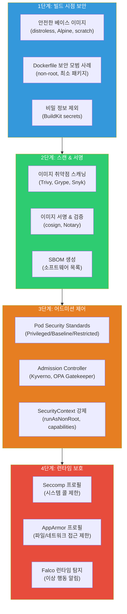
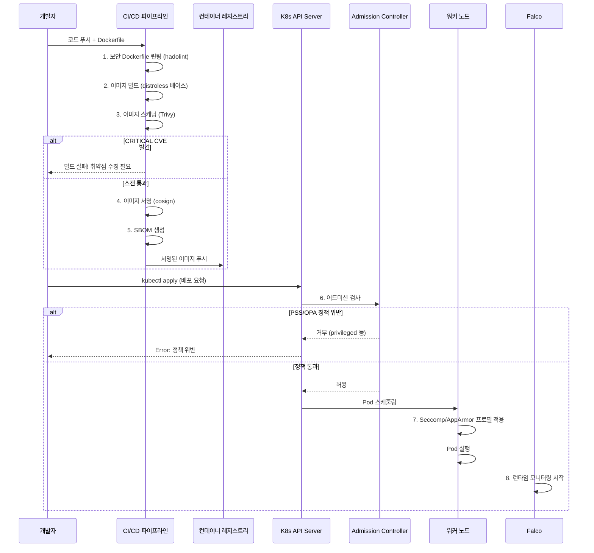
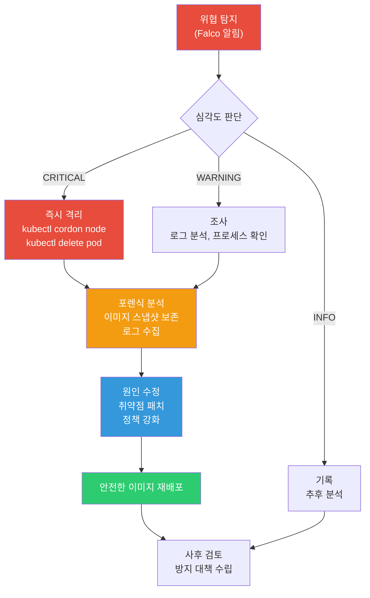

# 컨테이너 보안 (Container Security)

> 컨테이너는 빠르고 편리하지만, **기본 설정 그대로 프로덕션에 배포하면 보안 재앙**이에요. 이미지 취약점, root 실행, 무제한 시스템 콜, 서명 없는 이미지 — 이 모든 위협을 체계적으로 막는 **컨테이너 보안의 전체 그림**을 배워볼게요.

---

## 🎯 왜 컨테이너 보안을 알아야 하나요?

```
실무에서 컨테이너 보안을 모르면 생기는 일:

• 보안 감사: "이미지에 CRITICAL CVE 47개 있어요"         → 이미지 스캐닝 필요
• 침해 사고: "컨테이너에서 호스트로 탈출했어요"           → root 실행 + 무제한 capability
• 규정 준수: "PCI-DSS: 컨테이너 non-root 실행 증명하세요" → Pod Security Standards
• 런타임 위협: "컨테이너 안에서 암호화폐 채굴 중이에요"    → Falco 같은 런타임 탐지 없음
• 공급망 공격: "누가 이 이미지를 수정한 건지 모르겠어요"   → 이미지 서명/검증 없음
• CI/CD: "취약한 이미지가 프로덕션에 배포됐어요"          → 어드미션 컨트롤러 없음
```

이미 [컨테이너 기초 보안](../03-containers/09-security)에서 non-root, 이미지 스캐닝, 이미지 서명의 기본을 배웠고, [Kubernetes 보안](../04-kubernetes/15-security)에서 NetworkPolicy, PSS, Falco를 배웠죠? 이번에는 그 모든 것을 **하나의 체계**로 엮어서, 빌드부터 런타임까지의 **완전한 컨테이너 보안 전략**을 세워볼게요.

---

## 🧠 핵심 개념 잡기

### 비유: 공항 보안 시스템

컨테이너 보안을 **공항 보안 시스템**에 비유해볼게요.

| 공항 보안 | 컨테이너 보안 | 설명 |
|-----------|--------------|------|
| **여권 심사** | 이미지 서명 검증 (cosign) | "이 이미지가 우리 CI에서 빌드된 게 맞나요?" |
| **수하물 X-ray** | 이미지 스캐닝 (Trivy, Grype) | "이미지 안에 위험한 취약점이 있나요?" |
| **탑승 규칙** | Pod Security Standards | "위험한 설정(privileged)으로는 탑승(배포) 불가" |
| **기내 행동 규칙** | Seccomp / AppArmor | "비행 중(런타임) 허용된 행동만 가능" |
| **기내 보안 요원** | Falco (런타임 탐지) | "비행 중 의심스러운 행동 실시간 감시" |
| **세관 검사** | Admission Controller (Kyverno, OPA) | "세부 규칙 위반 시 입국(배포) 거부" |

### 컨테이너 보안의 4단계 방어선



### 보안 적용 시점 — 시간순 흐름



### 핵심 용어 정리

| 용어 | 뜻 | 비유 |
|------|-----|------|
| **CVE** | Common Vulnerabilities and Exposures, 알려진 보안 취약점 | 제품 리콜 목록 |
| **SBOM** | Software Bill of Materials, 소프트웨어 구성 목록 | 식품 성분표 |
| **SLSA** | Supply-chain Levels for Software Artifacts, 공급망 보안 등급 | 식품 안전 인증 등급 |
| **Seccomp** | Secure Computing Mode, 리눅스 시스템 콜 필터링 | "이 행동만 허용" 규칙표 |
| **AppArmor** | 리눅스 보안 모듈, 프로세스 접근 제어 | "이 파일/경로만 접근 가능" 규칙표 |
| **distroless** | Google의 최소 컨테이너 이미지 (쉘, 패키지 매니저 없음) | 필요한 것만 담긴 진공 포장 |
| **cosign** | Sigstore 프로젝트의 컨테이너 이미지 서명 도구 | 공증인의 인감 도장 |
| **Admission Controller** | K8s API 요청을 가로채서 검증/변형하는 컨트롤러 | 건물 출입구 보안 검색대 |

---

## 🔍 하나씩 자세히 알아보기

### 1. 베이스 이미지 선택 — 보안의 시작점

베이스 이미지 선택은 컨테이너 보안에서 **가장 영향력이 큰 결정**이에요. 포함된 패키지가 많을수록 공격 표면(attack surface)이 넓어져요.

#### 베이스 이미지 비교

| 베이스 이미지 | 크기 | 쉘 | 패키지 매니저 | CVE 수 (평균) | 용도 |
|--------------|------|-----|-------------|-------------|------|
| `ubuntu:24.04` | ~77MB | bash | apt | 30~100+ | 개발/디버깅 |
| `debian:bookworm-slim` | ~52MB | bash | apt | 20~50 | 범용 |
| `alpine:3.20` | ~7MB | sh (busybox) | apk | 5~15 | 경량 서비스 |
| `gcr.io/distroless/static` | ~2MB | 없음 | 없음 | 0~3 | Go/Rust 바이너리 |
| `gcr.io/distroless/cc` | ~5MB | 없음 | 없음 | 0~5 | C/C++ 바이너리 |
| `gcr.io/distroless/java21` | ~50MB | 없음 | 없음 | 0~5 | Java 앱 |
| `scratch` | 0MB | 없음 | 없음 | 0 | 완전한 스태틱 바이너리 |

```dockerfile
# === Go 앱: scratch 이미지 (가장 작고 안전) ===
FROM golang:1.22-alpine AS builder
WORKDIR /app
COPY go.mod go.sum ./
RUN go mod download
COPY . .
# CGO 비활성화 → 완전한 스태틱 바이너리
RUN CGO_ENABLED=0 GOOS=linux go build -ldflags="-s -w" -o /app/server .

FROM scratch
# SSL 인증서 (HTTPS 요청 시 필요)
COPY --from=builder /etc/ssl/certs/ca-certificates.crt /etc/ssl/certs/
# 실행 파일만 복사
COPY --from=builder /app/server /server
# non-root (숫자 UID 사용 — scratch에는 /etc/passwd 없음)
USER 65534:65534
ENTRYPOINT ["/server"]
# → 최종 이미지: ~10MB, CVE: 0개!

# === Java 앱: distroless 이미지 ===
FROM eclipse-temurin:21-jdk-alpine AS builder
WORKDIR /app
COPY . .
RUN ./gradlew bootJar --no-daemon

FROM gcr.io/distroless/java21-debian12
COPY --from=builder /app/build/libs/*.jar /app/app.jar
USER 65534:65534
ENTRYPOINT ["java", "-jar", "/app/app.jar"]
# → 쉘 없음 → docker exec로 쉘 접속 불가 → 침입자도 못 들어감!

# === Python 앱: distroless + 가상환경 ===
FROM python:3.12-slim AS builder
WORKDIR /app
COPY requirements.txt .
RUN pip install --no-cache-dir --target=/app/deps -r requirements.txt
COPY . .

FROM gcr.io/distroless/python3-debian12
WORKDIR /app
COPY --from=builder /app/deps /app/deps
COPY --from=builder /app .
ENV PYTHONPATH=/app/deps
USER 65534:65534
ENTRYPOINT ["python", "main.py"]
```

> **실무 팁**: distroless 이미지에는 쉘이 없어서 디버깅이 어려워요. 디버그가 필요하면 `gcr.io/distroless/python3-debian12:debug` 태그를 사용하면 busybox 쉘이 포함돼요. 단, 프로덕션에는 절대 debug 태그를 쓰면 안 돼요!

---

### 2. Dockerfile 보안 모범 사례

```dockerfile
# ✅ 보안 강화 Dockerfile — 종합 모범 사례

# 1. 특정 버전 태그 사용 (latest 금지!)
FROM node:20.11.1-alpine3.19 AS builder

# 2. 작업 디렉토리 설정
WORKDIR /app

# 3. 의존성 파일만 먼저 복사 (캐시 최적화)
COPY package.json package-lock.json ./

# 4. 프로덕션 의존성만 설치 + 캐시 정리
RUN npm ci --omit=dev && npm cache clean --force

# 5. 소스 코드 복사
COPY . .

# 6. 빌드 (필요 시)
RUN npm run build

# === 프로덕션 스테이지 ===
FROM node:20.11.1-alpine3.19

# 7. 불필요한 패키지 설치하지 않기
# (Alpine은 이미 최소한이지만, 필요 없는 건 제거)
RUN apk --no-cache upgrade && \
    rm -rf /var/cache/apk/*

# 8. non-root 사용자 생성 및 전환
RUN addgroup -S appgroup && adduser -S appuser -G appgroup
WORKDIR /app

# 9. 파일 소유권 지정하면서 복사
COPY --from=builder --chown=appuser:appgroup /app/node_modules ./node_modules
COPY --from=builder --chown=appuser:appgroup /app/dist ./dist
COPY --from=builder --chown=appuser:appgroup /app/package.json ./

# 10. 사용자 전환 (이 이후 모든 명령은 appuser로 실행)
USER appuser

# 11. 포트 문서화 (비특권 포트!)
EXPOSE 3000

# 12. 헬스체크
HEALTHCHECK --interval=30s --timeout=3s --start-period=5s --retries=3 \
    CMD node -e "require('http').get('http://localhost:3000/health', (r) => process.exit(r.statusCode === 200 ? 0 : 1))"

# 13. 시작 명령 (exec form 사용 — 시그널 전달을 위해!)
CMD ["node", "dist/server.js"]
```

#### Dockerfile 보안 린팅 — hadolint

```bash
# hadolint: Dockerfile 보안/모범 사례 자동 검사

# 설치
docker pull hadolint/hadolint

# 스캔
docker run --rm -i hadolint/hadolint < Dockerfile
# Dockerfile:1 DL3006 warning: Always tag the version of an image explicitly
# Dockerfile:5 DL3020 error: Use COPY instead of ADD for files and folders
# Dockerfile:8 DL3015 info: Avoid additional packages by specifying --no-install-recommends
# Dockerfile:12 DL3002 warning: Last USER should not be root

# CI에서 사용 (에러가 있으면 빌드 실패)
docker run --rm -i hadolint/hadolint --failure-threshold error < Dockerfile
```

#### .dockerignore — 불필요한 파일 제외

```dockerignore
# .dockerignore — 이미지에 들어가면 안 되는 것들!
.git
.gitignore
.env
.env.*
*.md
docker-compose*.yml
Dockerfile*
node_modules
.npm
.cache
coverage
tests
__tests__
*.test.js
*.spec.js
.vscode
.idea
*.pem
*.key
credentials.json
```

---

### 3. 이미지 스캐닝 — Trivy, Grype, Snyk Container

#### Trivy — 가장 많이 쓰는 오픈소스 스캐너

```bash
# Trivy: Aqua Security의 종합 보안 스캐너
# → 이미지 취약점, 설정 오류, 비밀 정보, 라이선스 스캔

# 설치
curl -sfL https://raw.githubusercontent.com/aquasecurity/trivy/main/contrib/install.sh | \
    sh -s -- -b /usr/local/bin

# === 기본 이미지 스캔 ===
trivy image myapp:v1.0
# myapp:v1.0 (alpine 3.19)
# Total: 15 (UNKNOWN: 0, LOW: 8, MEDIUM: 4, HIGH: 2, CRITICAL: 1)
#
# ┌──────────────┬────────────────┬──────────┬───────────┬──────────────┐
# │   Library    │ Vulnerability  │ Severity │ Installed │    Fixed     │
# ├──────────────┼────────────────┼──────────┼───────────┼──────────────┤
# │ openssl      │ CVE-2024-XXXX  │ CRITICAL │ 3.1.0     │ 3.1.5        │
# │ curl         │ CVE-2024-YYYY  │ HIGH     │ 8.5.0     │ 8.6.0        │
# └──────────────┴────────────────┴──────────┴───────────┴──────────────┘

# CRITICAL/HIGH만 표시
trivy image --severity CRITICAL,HIGH myapp:v1.0

# 수정 가능한 것만 표시 (unfixed 제외)
trivy image --ignore-unfixed myapp:v1.0

# CI/CD 게이트: CRITICAL이 있으면 빌드 실패!
trivy image --exit-code 1 --severity CRITICAL myapp:v1.0

# JSON 출력 (자동화 파이프라인용)
trivy image --format json --output result.json myapp:v1.0

# SBOM 생성 (CycloneDX 형식)
trivy image --format cyclonedx --output sbom.json myapp:v1.0

# 비밀 정보 스캔
trivy image --scanners secret myapp:v1.0

# Dockerfile 자체 스캔 (설정 오류 탐지)
trivy config Dockerfile
# MEDIUM: Specify a tag in the 'FROM' statement
# HIGH: Last USER should not be 'root'

# filesystem 스캔 (소스 코드 디렉토리)
trivy fs --scanners vuln,secret .
```

#### Grype — Anchore의 오픈소스 스캐너

```bash
# Grype: Anchore의 이미지 취약점 스캐너
# → Trivy와 유사하지만 다른 취약점 DB 사용 → 교차 검증에 유용!

# 설치
curl -sSfL https://raw.githubusercontent.com/anchore/grype/main/install.sh | sh -s -- -b /usr/local/bin

# 기본 스캔
grype myapp:v1.0
# NAME        INSTALLED  FIXED-IN  TYPE  VULNERABILITY  SEVERITY
# openssl     3.1.0      3.1.5     apk   CVE-2024-XXXX  Critical
# curl        8.5.0      8.6.0     apk   CVE-2024-YYYY  High

# 심각도 필터
grype myapp:v1.0 --only-fixed --fail-on critical

# SBOM 기반 스캔 (Syft로 SBOM 생성 후 Grype로 스캔)
syft myapp:v1.0 -o cyclonedx-json > sbom.json
grype sbom:sbom.json

# JSON 출력
grype myapp:v1.0 -o json > grype-result.json
```

#### Snyk Container — 상용 스캐너

```bash
# Snyk Container: 상용 취약점 스캐너 (무료 티어 있음)
# → 수정 가이드가 상세하고, 모니터링 기능이 강점

# 인증
snyk auth

# 이미지 스캔
snyk container test myapp:v1.0
# Testing myapp:v1.0...
# ✗ Critical severity vulnerability found in openssl
#   Introduced through: openssl@3.1.0
#   Fixed in: 3.1.5
#   Recommendation: Upgrade base image to node:20.11.1-alpine3.19

# 베이스 이미지 추천 (자동!)
snyk container test myapp:v1.0 --file=Dockerfile
# Recommendations for base image upgrade:
# Current: node:20-alpine (15 vulnerabilities)
# Minor:   node:20.11.1-alpine3.19 (3 vulnerabilities) ← 추천!
# Major:   node:22-alpine (0 vulnerabilities)

# 지속적 모니터링 (Snyk에 등록 → 새 CVE 발견 시 알림!)
snyk container monitor myapp:v1.0
```

#### CI/CD 파이프라인에 스캐닝 통합

```yaml
# .github/workflows/container-security.yml
name: Container Security Scan

on:
  push:
    branches: [main]
  pull_request:

jobs:
  scan:
    runs-on: ubuntu-latest
    steps:
      - uses: actions/checkout@v4

      - name: Build image
        run: docker build -t myapp:${{ github.sha }} .

      # Trivy 스캔
      - name: Trivy scan
        uses: aquasecurity/trivy-action@master
        with:
          image-ref: myapp:${{ github.sha }}
          format: table
          exit-code: 1                    # CRITICAL 발견 시 빌드 실패
          severity: CRITICAL,HIGH
          ignore-unfixed: true

      # Grype 교차 검증
      - name: Grype scan
        uses: anchore/scan-action@v3
        with:
          image: myapp:${{ github.sha }}
          fail-build: true
          severity-cutoff: critical

      # Hadolint (Dockerfile 린팅)
      - name: Hadolint
        uses: hadolint/hadolint-action@v3.1.0
        with:
          dockerfile: Dockerfile
          failure-threshold: error
```

---

### 4. Pod Security Standards (PSS) — K8s 배포 제한

Pod Security Standards는 K8s 1.25부터 **기본 내장**된 Pod 보안 정책이에요. 네임스페이스 단위로 적용하며, 3가지 레벨이 있어요.

#### 3가지 레벨 비교

```mermaid
flowchart LR
    subgraph PRIV["Privileged (특권)"]
        P1["제한 없음"]
        P2["모든 설정 허용"]
        P3["시스템 데몬용"]
    end

    subgraph BASE["Baseline (기본)"]
        B1["알려진 위험 설정 차단"]
        B2["hostNetwork 금지"]
        B3["privileged 금지"]
        B4["hostPID/IPC 금지"]
    end

    subgraph REST["Restricted (제한)"]
        R1["Baseline + 추가 제한"]
        R2["runAsNonRoot 강제"]
        R3["drop ALL capabilities"]
        R4["readOnlyRootFilesystem"]
        R5["Seccomp 프로필 필수"]
    end

    PRIV -->|"보안 강화"| BASE -->|"최대 보안"| REST

    style PRIV fill:#e74c3c,color:#fff
    style BASE fill:#f39c12,color:#fff
    style REST fill:#2ecc71,color:#fff
```



| 레벨 | 설명 | 허용 범위 | 대상 |
|------|------|----------|------|
| **Privileged** | 무제한 | 모든 설정 허용 | kube-system, 시스템 데몬 |
| **Baseline** | 기본 보호 | 알려진 위험 설정 차단 | 일반 워크로드 |
| **Restricted** | 최대 보호 | 최소 권한 강제 | 민감한 워크로드 |

#### PSS 적용 모드

| 모드 | 동작 | 용도 |
|------|------|------|
| `enforce` | 위반 Pod 생성 **차단** | 프로덕션 |
| `audit` | 위반을 감사 로그에 기록 (차단 안 함) | 전환 기간 |
| `warn` | 위반 시 경고 메시지 표시 (차단 안 함) | 개발/테스트 |

```bash
# 네임스페이스에 PSS 적용 (라벨로!)
# 1단계: audit + warn으로 먼저 영향 확인
kubectl label namespace production \
    pod-security.kubernetes.io/audit=restricted \
    pod-security.kubernetes.io/warn=restricted

# 2단계: 문제 없으면 enforce 적용
kubectl label namespace production \
    pod-security.kubernetes.io/enforce=restricted \
    pod-security.kubernetes.io/enforce-version=v1.30

# 결과 확인
kubectl get namespace production -o yaml
# metadata:
#   labels:
#     pod-security.kubernetes.io/enforce: restricted
#     pod-security.kubernetes.io/enforce-version: v1.30
#     pod-security.kubernetes.io/audit: restricted
#     pod-security.kubernetes.io/warn: restricted
```

```yaml
# restricted 네임스페이스 정의 (YAML)
apiVersion: v1
kind: Namespace
metadata:
  name: production
  labels:
    pod-security.kubernetes.io/enforce: restricted
    pod-security.kubernetes.io/enforce-version: v1.30
    pod-security.kubernetes.io/audit: restricted
    pod-security.kubernetes.io/warn: restricted
```

```yaml
# ❌ restricted에서 거부되는 Pod
apiVersion: v1
kind: Pod
metadata:
  name: bad-pod
  namespace: production
spec:
  containers:
    - name: app
      image: myapp:v1.0
      securityContext:
        privileged: true          # ← restricted 위반!
        runAsUser: 0              # ← root 실행 위반!
# Error: pods "bad-pod" is forbidden:
#   violates PodSecurity "restricted:v1.30":
#   privileged (container "app" must not set securityContext.privileged=true)

# ✅ restricted를 통과하는 Pod
apiVersion: v1
kind: Pod
metadata:
  name: good-pod
  namespace: production
spec:
  securityContext:
    runAsNonRoot: true
    seccompProfile:
      type: RuntimeDefault
  containers:
    - name: app
      image: myapp:v1.0
      securityContext:
        allowPrivilegeEscalation: false
        runAsNonRoot: true
        runAsUser: 65534
        readOnlyRootFilesystem: true
        capabilities:
          drop: ["ALL"]
      resources:
        limits:
          memory: "256Mi"
          cpu: "500m"
```

---

### 5. SecurityContext — Pod/컨테이너 보안 설정

SecurityContext는 Pod과 컨테이너 레벨에서 보안 설정을 제어하는 필드예요.

```yaml
apiVersion: v1
kind: Pod
metadata:
  name: secure-pod
spec:
  # === Pod 레벨 SecurityContext ===
  securityContext:
    runAsNonRoot: true              # root 실행 금지
    runAsUser: 65534                # nobody 사용자
    runAsGroup: 65534               # nobody 그룹
    fsGroup: 65534                  # 볼륨 파일 그룹
    seccompProfile:
      type: RuntimeDefault          # 기본 Seccomp 프로필

  containers:
    - name: app
      image: myapp:v1.0

      # === 컨테이너 레벨 SecurityContext ===
      securityContext:
        allowPrivilegeEscalation: false  # 권한 상승 차단 (★ 필수!)
        readOnlyRootFilesystem: true     # 루트 파일시스템 읽기 전용
        runAsNonRoot: true               # root 실행 금지 (이중 체크)
        capabilities:
          drop: ["ALL"]                  # 모든 Linux capability 제거
          # add: ["NET_BIND_SERVICE"]    # 필요한 것만 추가 (1024 이하 포트)

      # 읽기 전용 rootfs 사용 시 임시 쓰기 공간 필요
      volumeMounts:
        - name: tmp
          mountPath: /tmp
        - name: cache
          mountPath: /app/cache

  volumes:
    - name: tmp
      emptyDir:
        sizeLimit: "100Mi"      # 크기 제한!
    - name: cache
      emptyDir:
        sizeLimit: "50Mi"
```

#### SecurityContext 주요 필드 정리

| 필드 | 레벨 | 설명 | 권장 값 |
|------|------|------|--------|
| `runAsNonRoot` | Pod/Container | root 실행 금지 | `true` |
| `runAsUser` | Pod/Container | 실행할 UID | `65534` (nobody) |
| `readOnlyRootFilesystem` | Container | rootfs 읽기 전용 | `true` |
| `allowPrivilegeEscalation` | Container | setuid 등 권한 상승 차단 | `false` |
| `capabilities.drop` | Container | Linux capability 제거 | `["ALL"]` |
| `seccompProfile.type` | Pod | Seccomp 프로필 지정 | `RuntimeDefault` |
| `privileged` | Container | 호스트 모든 권한 획득 | `false` (절대 true 금지!) |

#### Linux Capabilities — "ALL drop + 필요한 것만 add"

```bash
# Linux capabilities: root 권한을 세분화한 것
# root가 아니어도 특정 기능만 부여 가능

# 대표적인 capabilities:
# NET_BIND_SERVICE  — 1024 이하 포트 바인딩
# NET_RAW           — raw 소켓 (ping 등)
# SYS_TIME          — 시스템 시간 변경
# SYS_PTRACE        — 다른 프로세스 디버깅
# SYS_ADMIN         — 각종 관리 작업 (★ 매우 위험!)
# DAC_OVERRIDE      — 파일 권한 무시
# CHOWN             — 파일 소유자 변경
# SETUID/SETGID     — 사용자/그룹 ID 변경
```

```yaml
# ❌ 위험: SYS_ADMIN capability (컨테이너 탈출 가능!)
securityContext:
  capabilities:
    add: ["SYS_ADMIN"]
# → mount, cgroup 조작 등이 가능해져서 호스트 탈출 경로 생김

# ❌ 위험: NET_RAW (ARP spoofing 가능)
securityContext:
  capabilities:
    add: ["NET_RAW"]
# → 같은 노드의 다른 Pod 트래픽 가로채기 가능

# ✅ 안전: 모든 capability 제거
securityContext:
  capabilities:
    drop: ["ALL"]
# → 대부분의 앱은 이것만으로 충분해요!

# ✅ 안전: 필요한 것만 최소 추가
securityContext:
  capabilities:
    drop: ["ALL"]
    add: ["NET_BIND_SERVICE"]   # 80/443 포트 바인딩만 허용
```

---

### 6. Seccomp 프로필 — 시스템 콜 필터링

Seccomp(Secure Computing Mode)은 컨테이너가 호출할 수 있는 **Linux 시스템 콜을 제한**해요. 리눅스에는 약 300개 이상의 시스템 콜이 있지만, 일반적인 웹 앱은 50~60개만 사용해요.

```yaml
# Pod에 Seccomp 프로필 적용

# 1. RuntimeDefault — K8s/컨테이너 런타임의 기본 프로필
apiVersion: v1
kind: Pod
metadata:
  name: seccomp-default
spec:
  securityContext:
    seccompProfile:
      type: RuntimeDefault    # 약 50개 위험 시스템 콜 차단
  containers:
    - name: app
      image: myapp:v1.0
# RuntimeDefault가 차단하는 대표 시스템 콜:
# - mount, umount2       (파일시스템 마운트)
# - reboot              (시스템 재부팅!)
# - kexec_load          (커널 교체!)
# - ptrace              (다른 프로세스 디버깅)
# - personality         (실행 도메인 변경)
```

```json
// 2. 커스텀 Seccomp 프로필 — /var/lib/kubelet/seccomp/profiles/strict.json
{
  "defaultAction": "SCMP_ACT_ERRNO",
  "architectures": [
    "SCMP_ARCH_X86_64",
    "SCMP_ARCH_AARCH64"
  ],
  "syscalls": [
    {
      "names": [
        "accept4", "bind", "brk", "chdir", "clock_gettime",
        "close", "connect", "epoll_create1", "epoll_ctl",
        "epoll_wait", "exit", "exit_group", "fcntl", "fstat",
        "futex", "getdents64", "getpeername", "getpid",
        "getsockname", "getsockopt", "ioctl", "listen",
        "lseek", "madvise", "mmap", "mprotect", "munmap",
        "nanosleep", "newfstatat", "openat", "pipe2", "pread64",
        "read", "recvfrom", "recvmsg", "rt_sigaction",
        "rt_sigprocmask", "rt_sigreturn", "sendmsg", "sendto",
        "set_robust_list", "setsockopt", "shutdown", "sigaltstack",
        "socket", "tgkill", "write", "writev"
      ],
      "action": "SCMP_ACT_ALLOW"
    }
  ]
}
```

```yaml
# 커스텀 프로필 적용
apiVersion: v1
kind: Pod
metadata:
  name: seccomp-custom
spec:
  securityContext:
    seccompProfile:
      type: Localhost
      localhostProfile: profiles/strict.json  # /var/lib/kubelet/seccomp/ 기준
  containers:
    - name: app
      image: myapp:v1.0
```

```bash
# 앱이 사용하는 시스템 콜 프로파일링 (strace)
# → 커스텀 프로필 만들 때 유용!

# 1. strace로 시스템 콜 추적
strace -c -f -p $(pgrep myapp) -e trace=all 2>&1 | tail -20
# % time     seconds  usecs/call     calls    errors syscall
# ------ ----------- ----------- --------- --------- ----------------
#  45.23    0.001234          12       103           read
#  22.10    0.000602           8        75           write
#  15.34    0.000418           6        70           epoll_wait
# ...

# 2. 또는 OCI seccomp-bpf 도구 사용
# → 자동으로 커스텀 프로필 생성해줌
kubectl run --rm -it trace-app \
    --image=myapp:v1.0 \
    --annotations="seccomp-profile.kubernetes.io/trace=true"
```

---

### 7. AppArmor 프로필 — 파일/네트워크 접근 제어

AppArmor는 Seccomp과 다르게 **파일 경로, 네트워크, 프로세스 실행** 등을 제어해요. Seccomp이 "어떤 시스템 콜"을 막는다면, AppArmor는 "어떤 리소스에 접근"을 막아요.

```
# /etc/apparmor.d/container-strict — 커스텀 AppArmor 프로필

#include <tunables/global>

profile container-strict flags=(attach_disconnected,mediate_deleted) {
  #include <abstractions/base>

  # 네트워크: TCP/UDP만 허용
  network inet tcp,
  network inet udp,
  network inet6 tcp,
  network inet6 udp,
  # raw 소켓 차단 (ARP spoofing 방지)
  deny network raw,
  deny network packet,

  # 파일 시스템
  /app/** r,                           # /app 하위만 읽기
  /app/data/** rw,                     # /app/data만 읽기/쓰기
  /tmp/** rw,                          # /tmp 쓰기 허용
  deny /etc/shadow r,                  # shadow 파일 읽기 금지
  deny /etc/passwd w,                  # passwd 쓰기 금지
  deny /proc/*/mem rw,                 # 다른 프로세스 메모리 접근 금지
  deny /sys/** w,                      # /sys 쓰기 금지

  # 실행
  /usr/bin/node ix,                    # node만 실행 허용
  deny /bin/sh x,                      # 쉘 실행 금지!
  deny /bin/bash x,                    # bash 실행 금지!
  deny /usr/bin/wget x,               # wget 금지 (파일 다운로드 차단)
  deny /usr/bin/curl x,               # curl 금지

  # mount 관련 차단
  deny mount,
  deny umount,
  deny pivot_root,
}
```

```bash
# AppArmor 프로필 로드
sudo apparmor_parser -r /etc/apparmor.d/container-strict

# 프로필 상태 확인
sudo aa-status | grep container-strict
# container-strict (enforce)

# Docker에서 AppArmor 프로필 적용
docker run --rm \
    --security-opt apparmor=container-strict \
    myapp:v1.0
```

```yaml
# Kubernetes에서 AppArmor 적용 (v1.30+ 네이티브 필드)
apiVersion: v1
kind: Pod
metadata:
  name: apparmor-pod
spec:
  securityContext:
    appArmorProfile:
      type: Localhost
      localhostProfile: container-strict
  containers:
    - name: app
      image: myapp:v1.0
      securityContext:
        allowPrivilegeEscalation: false
        runAsNonRoot: true

# 레거시 방식 (v1.29 이하 — annotation 사용)
# metadata:
#   annotations:
#     container.apparmor.security.beta.kubernetes.io/app: localhost/container-strict
```

#### Seccomp vs AppArmor 비교

| 구분 | Seccomp | AppArmor |
|------|---------|----------|
| **제어 대상** | 시스템 콜 (syscall) | 파일, 네트워크, 프로세스 |
| **제어 방식** | "이 시스템 콜 차단" | "이 경로/리소스 접근 차단" |
| **세분화** | 시스템 콜 단위 | 파일 경로, 네트워크 프로토콜 단위 |
| **성능 영향** | 거의 없음 (커널 BPF) | 약간 있음 |
| **배포** | JSON 프로필 | 텍스트 프로필 (apparmor_parser) |
| **K8s 지원** | `seccompProfile` 필드 | `appArmorProfile` 필드 (v1.30+) |
| **추천** | 항상 RuntimeDefault 이상 | 민감한 워크로드에 커스텀 |

> **실무 팁**: Seccomp RuntimeDefault는 **반드시** 적용하세요. AppArmor는 추가적인 보호층으로, 민감한 워크로드(결제, 인증 등)에 커스텀 프로필을 적용하면 좋아요. 둘 다 동시에 사용할 수 있어요!

---

### 8. Falco — 런타임 위협 탐지

Falco는 CNCF 졸업 프로젝트로, 컨테이너/K8s의 **런타임 이상 행동을 실시간 탐지**해요. 빌드 시점 스캐닝과 어드미션 컨트롤을 통과한 후에도, 실행 중에 발생하는 위협을 잡아내는 마지막 방어선이에요.

```bash
# Falco 설치 (Helm)
helm repo add falcosecurity https://falcosecurity.github.io/charts
helm repo update

helm install falco falcosecurity/falco \
    --namespace falco --create-namespace \
    --set falcosidekick.enabled=true \
    --set falcosidekick.config.slack.webhookurl="https://hooks.slack.com/..." \
    --set driver.kind=ebpf   # eBPF 드라이버 (커널 모듈 대신 권장)

# 설치 확인
kubectl get pods -n falco
# NAME                                READY   STATUS    RESTARTS   AGE
# falco-xxxxx                         2/2     Running   0          1m
# falco-falcosidekick-xxxxx           1/1     Running   0          1m
```

#### Falco 기본 규칙 — 무엇을 탐지하나요?

```yaml
# Falco가 기본으로 탐지하는 위협들:

# 1. 컨테이너 안에서 쉘 실행
# - rule: Terminal shell in container
#   condition: >
#     spawned_process and container and
#     proc.name in (bash, sh, zsh, csh, ksh)
#   output: >
#     Shell spawned in a container
#     (user=%user.name container=%container.name shell=%proc.name)
#   priority: WARNING

# 2. 민감한 파일 읽기
# - rule: Read sensitive file
#   condition: >
#     open_read and container and
#     fd.name in (/etc/shadow, /etc/sudoers)
#   output: >
#     Sensitive file read in container
#     (file=%fd.name container=%container.name)
#   priority: WARNING

# 3. 패키지 관리자 실행 (런타임에 패키지 설치 = 이상 행동!)
# - rule: Package management in container
#   condition: >
#     spawned_process and container and
#     proc.name in (apt, apt-get, yum, dnf, apk, pip)
#   output: >
#     Package management in running container
#     (command=%proc.cmdline container=%container.name)
#   priority: ERROR
```

#### 커스텀 Falco 규칙

```yaml
# falco-custom-rules.yaml (ConfigMap으로 배포)
apiVersion: v1
kind: ConfigMap
metadata:
  name: falco-custom-rules
  namespace: falco
data:
  custom-rules.yaml: |
    # 1. 암호화폐 채굴 탐지
    - rule: Cryptocurrency mining detected
      desc: Detect cryptocurrency mining processes
      condition: >
        spawned_process and container and
        (proc.name in (xmrig, minerd, minergate, ccminer) or
         proc.cmdline contains "stratum+tcp" or
         proc.cmdline contains "cryptonight")
      output: >
        Crypto mining detected!
        (user=%user.name command=%proc.cmdline container=%container.name
         image=%container.image.repository namespace=%k8s.ns.name pod=%k8s.pod.name)
      priority: CRITICAL
      tags: [cryptomining, runtime]

    # 2. 리버스 쉘 탐지
    - rule: Reverse shell detected
      desc: Detect reverse shell connections
      condition: >
        spawned_process and container and
        ((proc.name = "bash" and proc.cmdline contains "/dev/tcp") or
         (proc.name = "python" and proc.cmdline contains "socket") or
         (proc.name = "nc" and proc.args contains "-e"))
      output: >
        Reverse shell detected!
        (command=%proc.cmdline container=%container.name pod=%k8s.pod.name)
      priority: CRITICAL
      tags: [reverse_shell, runtime]

    # 3. 컨테이너 외부 네트워크 접속 탐지 (예상치 못한)
    - rule: Unexpected outbound connection
      desc: Detect outbound connections from containers that shouldn't make them
      condition: >
        outbound and container and
        k8s.ns.name = "production" and
        not (fd.sport in (80, 443, 8080, 5432, 6379, 53))
      output: >
        Unexpected outbound connection
        (command=%proc.cmdline connection=%fd.name container=%container.name)
      priority: WARNING
      tags: [network, exfiltration]
```

```bash
# Falco 로그 확인
kubectl logs -n falco -l app.kubernetes.io/name=falco --tail=50

# 출력 예시:
# 15:23:45.123456789: Warning Shell spawned in a container
#   (user=root container=web-app shell=bash
#    pod=web-app-7d4f5c image=myapp:v1.0 namespace=production)
#
# 15:24:12.987654321: Error Package management in running container
#   (command=apt-get install nmap container=web-app
#    pod=web-app-7d4f5c namespace=production)
#
# 15:25:33.111222333: Critical Crypto mining detected!
#   (command=xmrig --url=stratum+tcp://pool.example.com
#    container=compromised-pod namespace=production)

# Falcosidekick → Slack/PagerDuty/etc 알림 전송
# → 실시간으로 보안 팀에 알림이 감!
```

---

### 9. Admission Controllers — Kyverno & OPA Gatekeeper

PSS가 "기본 3단계"만 제공한다면, Kyverno와 OPA Gatekeeper는 **세밀한 커스텀 정책**을 강제할 수 있어요.

#### Kyverno — YAML로 정책 작성

```bash
# Kyverno 설치
helm repo add kyverno https://kyverno.github.io/kyverno/
helm install kyverno kyverno/kyverno \
    --namespace kyverno --create-namespace
```

```yaml
# 1. latest 태그 이미지 차단
apiVersion: kyverno.io/v1
kind: ClusterPolicy
metadata:
  name: disallow-latest-tag
spec:
  validationFailureAction: Enforce    # Audit | Enforce
  rules:
    - name: require-image-tag
      match:
        any:
          - resources:
              kinds: ["Pod"]
      validate:
        message: "이미지에 'latest' 태그 사용 금지! 구체적인 버전 태그를 사용하세요."
        pattern:
          spec:
            containers:
              - image: "!*:latest & *:*"  # latest 금지, 태그 필수

---
# 2. 특정 레지스트리의 이미지만 허용
apiVersion: kyverno.io/v1
kind: ClusterPolicy
metadata:
  name: restrict-image-registries
spec:
  validationFailureAction: Enforce
  rules:
    - name: allowed-registries
      match:
        any:
          - resources:
              kinds: ["Pod"]
      validate:
        message: "허용된 레지스트리: 123456789.dkr.ecr.ap-northeast-2.amazonaws.com"
        pattern:
          spec:
            containers:
              - image: "123456789.dkr.ecr.ap-northeast-2.amazonaws.com/*"

---
# 3. resource limits 강제
apiVersion: kyverno.io/v1
kind: ClusterPolicy
metadata:
  name: require-resource-limits
spec:
  validationFailureAction: Enforce
  rules:
    - name: check-limits
      match:
        any:
          - resources:
              kinds: ["Pod"]
      validate:
        message: "CPU와 메모리 limits를 반드시 설정하세요."
        pattern:
          spec:
            containers:
              - resources:
                  limits:
                    memory: "?*"
                    cpu: "?*"

---
# 4. 자동 변형 (Mutate) — SecurityContext 자동 주입
apiVersion: kyverno.io/v1
kind: ClusterPolicy
metadata:
  name: add-default-securitycontext
spec:
  rules:
    - name: add-security-defaults
      match:
        any:
          - resources:
              kinds: ["Pod"]
      mutate:
        patchStrategicMerge:
          spec:
            securityContext:
              runAsNonRoot: true
              seccompProfile:
                type: RuntimeDefault
            containers:
              - (name): "*"
                securityContext:
                  allowPrivilegeEscalation: false
                  readOnlyRootFilesystem: true
                  capabilities:
                    drop: ["ALL"]
```

#### OPA Gatekeeper — Rego 언어로 정책 작성

```bash
# OPA Gatekeeper 설치
helm repo add gatekeeper https://open-policy-agent.github.io/gatekeeper/charts
helm install gatekeeper gatekeeper/gatekeeper \
    --namespace gatekeeper-system --create-namespace
```

```yaml
# 1. ConstraintTemplate 정의 (정책 템플릿)
apiVersion: templates.gatekeeper.sh/v1
kind: ConstraintTemplate
metadata:
  name: k8sdisallowedtags
spec:
  crd:
    spec:
      names:
        kind: K8sDisallowedTags
      validation:
        openAPIV3Schema:
          type: object
          properties:
            tags:
              type: array
              items:
                type: string
  targets:
    - target: admission.k8s.gatekeeper.sh
      rego: |
        package k8sdisallowedtags

        violation[{"msg": msg}] {
          container := input.review.object.spec.containers[_]
          tag := split(container.image, ":")[1]
          tag == input.parameters.tags[_]
          msg := sprintf("이미지 '%v'에 금지된 태그 '%v' 사용!", [container.image, tag])
        }

        violation[{"msg": msg}] {
          container := input.review.object.spec.containers[_]
          not contains(container.image, ":")
          msg := sprintf("이미지 '%v'에 태그가 없어요! (latest로 해석됨)", [container.image])
        }

---
# 2. Constraint 생성 (정책 적용)
apiVersion: constraints.gatekeeper.sh/v1beta1
kind: K8sDisallowedTags
metadata:
  name: no-latest-tag
spec:
  match:
    kinds:
      - apiGroups: [""]
        kinds: ["Pod"]
    namespaces: ["production", "staging"]
  parameters:
    tags: ["latest", "dev", "test"]
```

#### Kyverno 심화 — K8s 네이티브 정책 엔진

Kyverno는 OPA Gatekeeper와 달리 **Rego 언어를 배울 필요 없이 YAML만으로** 정책을 작성할 수 있어요. K8s 리소스 형태 그대로 정책을 정의하기 때문에 K8s에 익숙한 엔지니어라면 바로 사용할 수 있어요.

```
Kyverno의 3가지 정책 유형:

1. Validating (검증)
   → "이 조건을 만족하지 않으면 배포 거부"
   → 예: latest 태그 금지, resource limits 필수

2. Mutating (변형)
   → "배포 시 자동으로 설정을 주입/변경"
   → 예: SecurityContext 자동 추가, 라벨 자동 부여

3. Generating (생성)
   → "리소스 생성 시 다른 리소스를 자동으로 함께 생성"
   → 예: Namespace 생성 시 NetworkPolicy 자동 생성, 기본 ResourceQuota 생성
```

```yaml
# === Kyverno 실무 정책 예시 모음 ===

# 1. 허용된 이미지 레지스트리만 허용 (Validating)
apiVersion: kyverno.io/v1
kind: ClusterPolicy
metadata:
  name: restrict-image-registries
  annotations:
    policies.kyverno.io/title: 이미지 레지스트리 제한
    policies.kyverno.io/severity: high
spec:
  validationFailureAction: Enforce
  background: true
  rules:
    - name: validate-registries
      match:
        any:
          - resources:
              kinds: ["Pod"]
      validate:
        message: >-
          허용된 레지스트리만 사용 가능합니다:
          123456789.dkr.ecr.ap-northeast-2.amazonaws.com, gcr.io/distroless
        pattern:
          spec:
            containers:
              - image: "123456789.dkr.ecr.ap-northeast-2.amazonaws.com/* | gcr.io/distroless/*"

---
# 2. 필수 라벨 강제 (Validating)
apiVersion: kyverno.io/v1
kind: ClusterPolicy
metadata:
  name: require-labels
spec:
  validationFailureAction: Enforce
  rules:
    - name: check-required-labels
      match:
        any:
          - resources:
              kinds: ["Deployment", "StatefulSet"]
      validate:
        message: "app, team, env 라벨이 필수입니다."
        pattern:
          metadata:
            labels:
              app: "?*"
              team: "?*"
              env: "production | staging | dev"

---
# 3. Namespace 생성 시 NetworkPolicy 자동 생성 (Generating)
apiVersion: kyverno.io/v1
kind: ClusterPolicy
metadata:
  name: generate-default-networkpolicy
spec:
  rules:
    - name: default-deny
      match:
        any:
          - resources:
              kinds: ["Namespace"]
      generate:
        apiVersion: networking.k8s.io/v1
        kind: NetworkPolicy
        name: default-deny-all
        namespace: "{{request.object.metadata.name}}"
        data:
          spec:
            podSelector: {}
            policyTypes:
              - Ingress
              - Egress
```

#### Kyverno vs OPA Gatekeeper 상세 비교

| 구분 | Kyverno | OPA Gatekeeper |
|------|---------|----------------|
| **정책 언어** | YAML (학습 곡선 낮음) | Rego (학습 곡선 높음) |
| **정책 작성 방식** | K8s 리소스 패턴 매칭 | 범용 논리 프로그래밍 |
| **Mutate 지원** | 기본 지원 (자동 변형) | 제한적 (Assign/Modify) |
| **Generate 지원** | 기본 지원 (리소스 자동 생성) | 미지원 |
| **이미지 검증** | cosign/Notary 네이티브 지원 | 외부 도구 필요 |
| **복잡한 로직** | 제한적 (단순 패턴 매칭 중심) | 강력 (Rego의 논리 표현력) |
| **외부 데이터 참조** | API Call 지원 | OPA 데이터 소스 연동 |
| **리소스 사용량** | 상대적으로 가벼움 | Audit 기능으로 메모리 많이 사용 |
| **커뮤니티 정책** | Kyverno Policy Library (150+) | Gatekeeper Library |
| **CNCF 상태** | CNCF Incubating | CNCF Graduated |
| **실무 추천** | 중소 규모, K8s 네이티브 선호 | 대규모, 이미 OPA 사용 중, 복잡한 로직 |

```
선택 가이드:

"정책 30개 이하 + K8s 팀" → Kyverno
  → YAML만 알면 되고, Mutate/Generate가 강력
  → 이미지 서명 검증을 기본 지원

"정책 100개 이상 + 복잡한 조직 규칙" → OPA Gatekeeper
  → Rego로 복잡한 비즈니스 로직 표현 가능
  → K8s 외 다른 시스템(Terraform, API Gateway)에도 OPA 활용 가능

"둘 다 처음이면?" → Kyverno부터 시작
  → 학습 비용이 훨씬 낮고, 80%의 사용 사례를 커버
  → 나중에 필요하면 OPA Gatekeeper로 전환/병행 가능
```

---

### 10. 공급망 보안 — cosign & SLSA

#### cosign — 이미지 서명 & 검증

```bash
# cosign: Sigstore 프로젝트의 이미지 서명 도구

# 설치
go install github.com/sigstore/cosign/v2/cmd/cosign@latest
# 또는
brew install cosign

# === 키 기반 서명 ===

# 1. 키 생성
cosign generate-key-pair
# → cosign.key (비밀키) + cosign.pub (공개키)

# 2. 이미지 서명
cosign sign --key cosign.key myregistry.com/myapp:v1.0
# Pushing signature to: myregistry.com/myapp:sha256-abc123.sig

# 3. 이미지 서명 검증
cosign verify --key cosign.pub myregistry.com/myapp:v1.0
# Verification for myregistry.com/myapp:v1.0 --
# The following checks were performed on each of these signatures:
#   - The cosign claims were validated
#   - The signatures were verified against the specified public key
# [{"critical":{"identity":...,"image":...},"optional":{}}]

# === Keyless 서명 (OIDC 기반 — 더 현대적!) ===

# GitHub Actions에서 keyless 서명
cosign sign myregistry.com/myapp:v1.0
# → GitHub OIDC 토큰으로 자동 서명 (키 관리 불필요!)

# keyless 검증
cosign verify \
    --certificate-identity "https://github.com/myorg/myrepo/.github/workflows/build.yml@refs/heads/main" \
    --certificate-oidc-issuer "https://token.actions.githubusercontent.com" \
    myregistry.com/myapp:v1.0
```

```yaml
# CI/CD에서 cosign 자동화 (GitHub Actions)
# .github/workflows/sign-image.yml
name: Build, Sign, Verify

on:
  push:
    branches: [main]

permissions:
  id-token: write    # OIDC 토큰 발급에 필요
  packages: write    # 이미지 푸시에 필요

jobs:
  build-and-sign:
    runs-on: ubuntu-latest
    steps:
      - uses: actions/checkout@v4

      - name: Install cosign
        uses: sigstore/cosign-installer@v3

      - name: Build and push image
        run: |
          docker build -t ghcr.io/${{ github.repository }}:${{ github.sha }} .
          docker push ghcr.io/${{ github.repository }}:${{ github.sha }}

      - name: Sign image (keyless)
        run: |
          cosign sign ghcr.io/${{ github.repository }}:${{ github.sha }}

      - name: Generate and attach SBOM
        run: |
          syft ghcr.io/${{ github.repository }}:${{ github.sha }} \
              -o cyclonedx-json > sbom.json
          cosign attest --predicate sbom.json \
              ghcr.io/${{ github.repository }}:${{ github.sha }}
```

#### Kyverno로 서명 검증 강제

```yaml
# 서명되지 않은 이미지 배포 차단!
apiVersion: kyverno.io/v1
kind: ClusterPolicy
metadata:
  name: verify-image-signature
spec:
  validationFailureAction: Enforce
  rules:
    - name: check-cosign-signature
      match:
        any:
          - resources:
              kinds: ["Pod"]
      verifyImages:
        - imageReferences:
            - "ghcr.io/myorg/*"
          attestors:
            - entries:
                - keyless:
                    subject: "https://github.com/myorg/*"
                    issuer: "https://token.actions.githubusercontent.com"
                    rekor:
                      url: https://rekor.sigstore.dev
```

#### SLSA — 공급망 보안 등급

```
SLSA (Supply-chain Levels for Software Artifacts) — "salsa"로 발음

SLSA Level 0: 보안 요구사항 없음
SLSA Level 1: 빌드 프로세스 문서화 (빌드 provenance 생성)
SLSA Level 2: 호스팅된 빌드 서비스 사용 (GitHub Actions 등)
SLSA Level 3: 빌드 환경 격리 + 변조 방지
SLSA Level 4: 2인 리뷰 + 완전한 provenance

대부분의 조직은 Level 2~3을 목표로 해요.
```

```yaml
# SLSA Level 3 빌드 — GitHub Actions with SLSA generator
# .github/workflows/slsa-build.yml
name: SLSA Build

on:
  push:
    tags: ['v*']

jobs:
  build:
    uses: slsa-framework/slsa-github-generator/.github/workflows/generator_container_slsa3.yml@v2.0.0
    with:
      image: ghcr.io/${{ github.repository }}
      digest: ${{ needs.build-image.outputs.digest }}
    secrets:
      registry-username: ${{ github.actor }}
      registry-password: ${{ secrets.GITHUB_TOKEN }}
```

---

## 💻 직접 해보기

### 실습 1: 보안 강화 이미지 빌드 + 스캐닝

```bash
# 1. 취약한 이미지 vs 안전한 이미지 비교

# 취약한 Dockerfile 생성
cat > Dockerfile.insecure << 'EOF'
FROM node:20
WORKDIR /app
COPY . .
RUN npm install
ENV DB_PASSWORD=secret123
EXPOSE 3000
CMD ["node", "server.js"]
EOF

# 안전한 Dockerfile 생성
cat > Dockerfile.secure << 'EOF'
FROM node:20.11.1-alpine3.19 AS builder
WORKDIR /app
COPY package*.json ./
RUN npm ci --omit=dev

FROM node:20.11.1-alpine3.19
RUN apk --no-cache upgrade && \
    addgroup -S app && adduser -S app -G app
WORKDIR /app
COPY --from=builder --chown=app:app /app/node_modules ./node_modules
COPY --chown=app:app . .
USER app
EXPOSE 3000
HEALTHCHECK --interval=30s --timeout=3s \
    CMD node -e "require('http').get('http://localhost:3000/health', r => process.exit(r.statusCode === 200 ? 0 : 1))"
CMD ["node", "server.js"]
EOF

# 2. 빌드
docker build -t myapp:insecure -f Dockerfile.insecure .
docker build -t myapp:secure -f Dockerfile.secure .

# 3. 이미지 크기 비교
docker images | grep myapp
# myapp   insecure   1.1GB     # 😱
# myapp   secure     180MB     # ✅

# 4. Trivy 스캔 비교
echo "=== 취약한 이미지 ==="
trivy image --severity CRITICAL,HIGH myapp:insecure
# Total: 47 (HIGH: 35, CRITICAL: 12)  😱

echo "=== 안전한 이미지 ==="
trivy image --severity CRITICAL,HIGH myapp:secure
# Total: 2 (HIGH: 2, CRITICAL: 0)     ✅

# 5. 비밀 정보 스캔
trivy image --scanners secret myapp:insecure
# /app/.env — DB_PASSWORD found!  😱

trivy image --scanners secret myapp:secure
# No secrets found                 ✅

# 6. 실행 사용자 확인
docker run --rm myapp:insecure whoami
# root  😱

docker run --rm myapp:secure whoami
# app   ✅
```

### 실습 2: Pod Security Standards 적용

```bash
# 1. 테스트 네임스페이스 생성
kubectl create namespace pss-test

# 2. restricted PSS 적용 (warn + audit 먼저)
kubectl label namespace pss-test \
    pod-security.kubernetes.io/warn=restricted \
    pod-security.kubernetes.io/audit=restricted

# 3. 위반 Pod 배포 시도
cat << 'EOF' | kubectl apply -f -
apiVersion: v1
kind: Pod
metadata:
  name: test-insecure
  namespace: pss-test
spec:
  containers:
    - name: app
      image: nginx:1.25
EOF
# Warning: would violate PodSecurity "restricted:latest":
#   allowPrivilegeEscalation != false
#   unrestricted capabilities
#   runAsNonRoot != true
#   seccompProfile not set
# → warn 모드라서 생성은 되지만 경고가 뜸!

# 4. enforce 모드 적용
kubectl label namespace pss-test \
    pod-security.kubernetes.io/enforce=restricted --overwrite

# 5. 다시 시도
cat << 'EOF' | kubectl apply -f -
apiVersion: v1
kind: Pod
metadata:
  name: test-insecure2
  namespace: pss-test
spec:
  containers:
    - name: app
      image: nginx:1.25
EOF
# Error from server (Forbidden): pods "test-insecure2" is forbidden:
#   violates PodSecurity "restricted:latest"
# → enforce 모드에서는 생성 자체가 차단됨! ✅

# 6. 보안 준수 Pod 배포
cat << 'EOF' | kubectl apply -f -
apiVersion: v1
kind: Pod
metadata:
  name: test-secure
  namespace: pss-test
spec:
  securityContext:
    runAsNonRoot: true
    seccompProfile:
      type: RuntimeDefault
  containers:
    - name: app
      image: nginx:1.25
      securityContext:
        allowPrivilegeEscalation: false
        runAsNonRoot: true
        runAsUser: 101          # nginx 사용자
        readOnlyRootFilesystem: true
        capabilities:
          drop: ["ALL"]
      volumeMounts:
        - name: tmp
          mountPath: /tmp
        - name: cache
          mountPath: /var/cache/nginx
        - name: pid
          mountPath: /var/run
  volumes:
    - name: tmp
      emptyDir: {}
    - name: cache
      emptyDir: {}
    - name: pid
      emptyDir: {}
EOF
# pod/test-secure created  ✅

# 7. 정리
kubectl delete namespace pss-test
```

### 실습 3: Falco로 런타임 위협 탐지

```bash
# 1. Falco 설치 (Helm)
helm install falco falcosecurity/falco \
    --namespace falco --create-namespace \
    --set driver.kind=ebpf \
    --set falcosidekick.enabled=true

# 2. Falco 로그 모니터링 (터미널 1)
kubectl logs -n falco -l app.kubernetes.io/name=falco -f

# 3. 테스트 Pod 생성 (터미널 2)
kubectl run test-app --image=nginx:1.25 --restart=Never

# 4. 쉘 접속 (위협 시뮬레이션)
kubectl exec -it test-app -- /bin/bash

# Falco 로그에 경고 발생! ↓
# Warning: Terminal shell in container
#   (user=root container=test-app shell=bash
#    pod=test-app namespace=default)

# 5. 패키지 설치 시도 (더 심각한 위협)
apt-get update && apt-get install -y nmap

# Falco 로그: ↓
# Error: Package management process launched in container
#   (command=apt-get install -y nmap container=test-app)

# 6. 민감한 파일 접근
cat /etc/shadow

# Falco 로그: ↓
# Warning: Sensitive file opened for reading
#   (file=/etc/shadow container=test-app)

# 7. 정리
kubectl delete pod test-app
```

---

## 🏢 실무에서는?

### 조직 규모별 컨테이너 보안 전략

```
🏠 스타트업 (5~20명):
├── 이미지 스캐닝: Trivy (CI/CD에 통합)
├── 베이스 이미지: Alpine 기반
├── PSS: Baseline (enforce)
├── SecurityContext: 기본 설정 (non-root, drop ALL)
├── 런타임: 없음 (리소스 부족)
└── 서명: 없음
→ 비용: $0 (오픈소스만)

🏢 중견기업 (50~200명):
├── 이미지 스캐닝: Trivy + Snyk Container
├── 베이스 이미지: distroless / Alpine
├── PSS: Restricted (enforce) + Kyverno 정책
├── SecurityContext: 강화 설정 + Seccomp RuntimeDefault
├── 런타임: Falco (기본 규칙)
├── 서명: cosign (keyless)
└── SBOM: 자동 생성 + 저장
→ 비용: ~$500/월 (Snyk 유료)

🏗️ 대기업 (500명+):
├── 이미지 스캐닝: Trivy + Snyk + 자체 스캐너
├── 베이스 이미지: 사내 검증 베이스 이미지 (Golden Image)
├── PSS: Restricted + OPA Gatekeeper (상세 정책 100+)
├── SecurityContext: 강화 + 커스텀 Seccomp + AppArmor
├── 런타임: Falco + 상용 CNAPP (Prisma Cloud, Aqua)
├── 서명: cosign + Notary + 정책 검증 강제
├── SBOM: 자동 생성 + 취약점 자동 추적
└── SLSA: Level 3 빌드 파이프라인
→ 비용: $5,000~$50,000+/월
```

### 실무 보안 체크리스트

```
빌드 시점:
☐ Dockerfile에 USER 지시어 있음 (non-root)
☐ 특정 버전 태그 사용 (latest 금지)
☐ 멀티스테이지 빌드 사용
☐ distroless/Alpine 베이스 이미지
☐ .dockerignore에 민감한 파일 제외
☐ hadolint 린팅 통과

스캔 & 서명:
☐ CI/CD에 Trivy 스캔 통합 (CRITICAL → 빌드 실패)
☐ 비밀 정보 스캔 (trivy --scanners secret)
☐ 이미지 서명 (cosign)
☐ SBOM 생성 및 보관

K8s 배포:
☐ PSS Restricted 적용 (또는 Baseline + 커스텀 정책)
☐ SecurityContext 모든 필드 설정
☐ runAsNonRoot: true
☐ readOnlyRootFilesystem: true
☐ allowPrivilegeEscalation: false
☐ capabilities.drop: ["ALL"]
☐ seccompProfile: RuntimeDefault
☐ resource limits 설정

런타임:
☐ Falco 설치 및 알림 연동
☐ 이상 행동 대응 절차(Runbook) 작성
☐ 정기적인 이미지 재스캔 (새 CVE 대응)
```

### 보안 사고 대응 흐름



### 프로덕션 Deployment 보안 템플릿

```yaml
# production-secure-deployment.yaml
# 실무에서 바로 사용할 수 있는 보안 강화 Deployment 템플릿

apiVersion: apps/v1
kind: Deployment
metadata:
  name: secure-app
  namespace: production
  labels:
    app: secure-app
    version: v1.0.0
spec:
  replicas: 3
  selector:
    matchLabels:
      app: secure-app
  template:
    metadata:
      labels:
        app: secure-app
        version: v1.0.0
    spec:
      # --- Pod 레벨 보안 ---
      securityContext:
        runAsNonRoot: true
        runAsUser: 65534
        runAsGroup: 65534
        fsGroup: 65534
        seccompProfile:
          type: RuntimeDefault

      # Service Account 토큰 자동 마운트 비활성화
      automountServiceAccountToken: false

      # 컨테이너
      containers:
        - name: app
          # 특정 digest 사용 (태그 변조 방지)
          image: 123456789.dkr.ecr.ap-northeast-2.amazonaws.com/myapp@sha256:abc123...
          ports:
            - containerPort: 8080
              protocol: TCP

          # --- 컨테이너 레벨 보안 ---
          securityContext:
            allowPrivilegeEscalation: false
            readOnlyRootFilesystem: true
            runAsNonRoot: true
            capabilities:
              drop: ["ALL"]

          # --- 리소스 제한 ---
          resources:
            requests:
              memory: "128Mi"
              cpu: "100m"
            limits:
              memory: "256Mi"
              cpu: "500m"

          # --- 헬스체크 ---
          livenessProbe:
            httpGet:
              path: /health
              port: 8080
            initialDelaySeconds: 10
            periodSeconds: 15
          readinessProbe:
            httpGet:
              path: /ready
              port: 8080
            initialDelaySeconds: 5
            periodSeconds: 5

          # --- 환경변수 (Secret 참조) ---
          env:
            - name: DB_PASSWORD
              valueFrom:
                secretKeyRef:
                  name: app-secrets
                  key: db-password

          # --- 볼륨 마운트 (읽기 전용 rootfs 보완) ---
          volumeMounts:
            - name: tmp
              mountPath: /tmp
            - name: cache
              mountPath: /app/cache

      # --- 볼륨 ---
      volumes:
        - name: tmp
          emptyDir:
            medium: Memory        # tmpfs (디스크 대신 메모리)
            sizeLimit: "100Mi"
        - name: cache
          emptyDir:
            sizeLimit: "50Mi"

      # --- 토폴로지 분산 (가용성) ---
      topologySpreadConstraints:
        - maxSkew: 1
          topologyKey: kubernetes.io/hostname
          whenUnsatisfiable: DoNotSchedule
          labelSelector:
            matchLabels:
              app: secure-app
```

---

## ⚠️ 자주 하는 실수

### 실수 1: "개발 편의를 위해 privileged로 실행"

```yaml
# ❌ 절대 하면 안 되는 것!
spec:
  containers:
    - name: app
      securityContext:
        privileged: true    # 호스트의 모든 장치, 파일시스템 접근 가능!

# 왜 위험한가?
# privileged 컨테이너에서 호스트 탈출:
# mount /dev/sda1 /mnt → 호스트 디스크 마운트!
# chroot /mnt → 호스트 루트 접근!
# → 클러스터 전체 장악 가능

# ✅ 정말 특수한 경우에만 (CNI, 스토리지 드라이버 등)
# 그마저도 별도의 서비스 어카운트 + 최소 네임스페이스에서만!
```

### 실수 2: "이미지 스캐닝을 빌드 때만 한다"

```bash
# ❌ 빌드 때 스캔 → 통과 → 6개월 후 새 CVE 발견 → 모르고 방치!

# ✅ 정기적 재스캔 설정
# 레지스트리에 있는 모든 이미지를 주기적으로 재스캔
# (CronJob 또는 레지스트리 기능 활용)

# ECR 자동 스캔 (AWS)
aws ecr put-image-scanning-configuration \
    --repository-name myapp \
    --image-scanning-configuration scanOnPush=true

# Harbor 자동 스캔
# Administration → Interrogation Services → Vulnerability →
# "Scan all" 스케줄 설정 (Daily)
```

### 실수 3: "Seccomp 프로필 없이 배포"

```yaml
# ❌ Seccomp 미설정 = Unconfined (모든 시스템 콜 허용!)
spec:
  containers:
    - name: app
      image: myapp:v1.0
      # seccompProfile 설정 없음
      # → 300개+ 시스템 콜 모두 사용 가능

# ✅ 최소한 RuntimeDefault는 반드시 설정!
spec:
  securityContext:
    seccompProfile:
      type: RuntimeDefault    # 위험한 ~50개 시스템 콜 차단
```

### 실수 4: "readOnlyRootFilesystem 적용 후 앱이 죽어요"

```yaml
# readOnlyRootFilesystem: true 설정 후 앱이 시작 안 되는 경우

# 원인: 앱이 /tmp, /var/log 등에 쓰기를 시도
# 해결: 필요한 경로만 emptyDir로 마운트

# ✅ 올바른 설정
spec:
  containers:
    - name: app
      securityContext:
        readOnlyRootFilesystem: true
      volumeMounts:
        - name: tmp
          mountPath: /tmp
        - name: logs
          mountPath: /var/log/app
        - name: pid
          mountPath: /var/run
  volumes:
    - name: tmp
      emptyDir: { sizeLimit: "100Mi" }
    - name: logs
      emptyDir: { sizeLimit: "200Mi" }
    - name: pid
      emptyDir: { sizeLimit: "1Mi" }

# 팁: 앱이 어디에 쓰기하는지 확인하는 방법
# docker run --read-only myapp:v1.0
# → read-only file system 에러가 나는 경로를 확인!
```

### 실수 5: "latest 태그로 프로덕션 배포"

```bash
# ❌ 위험한 이유:
# 1. 재현 불가: "어제 배포한 이미지가 뭐였죠?" → 모름
# 2. 보안 추적 불가: 특정 CVE가 있는 버전인지 확인 불가
# 3. 롤백 불가: latest가 이미 덮어써짐
# 4. 변조 가능: 누군가 latest 태그에 악성 이미지를 올릴 수 있음

# ✅ 올바른 방법:
# 방법 1: 시맨틱 버전
image: myapp:v1.2.3

# 방법 2: Git SHA
image: myapp:a1b2c3d

# 방법 3: 이미지 Digest (가장 안전! 변조 불가능)
image: myapp@sha256:abc123def456...

# Kyverno로 latest 태그 차단 (앞서 설명한 정책 참고)
```

### 실수 6: "capability를 무분별하게 추가"

```yaml
# ❌ "안 되니까 SYS_ADMIN 추가하자"
securityContext:
  capabilities:
    add: ["SYS_ADMIN"]     # 거의 root와 동일한 권한!

# ❌ "NET_RAW 필요하대서 추가"
securityContext:
  capabilities:
    add: ["NET_RAW"]        # ARP spoofing 가능!

# ✅ 올바른 접근:
# 1. 먼저 왜 필요한지 정확히 파악
# 2. 정말 필요하면 가장 작은 범위의 capability만 추가
# 3. SYS_ADMIN은 절대 추가하지 않음 (대안을 찾을 것)
securityContext:
  capabilities:
    drop: ["ALL"]
    add: ["NET_BIND_SERVICE"]   # 이것만으로 충분한 경우가 대부분
```

---

## 📝 마무리

### 컨테이너 보안 핵심 요약

```
1단계 - 빌드 시점:
   • distroless/Alpine 베이스 이미지 사용
   • Dockerfile에 USER (non-root) 지정
   • 멀티스테이지 빌드로 불필요한 도구 제거
   • .dockerignore로 민감한 파일 제외

2단계 - 스캔 & 서명:
   • Trivy/Grype로 이미지 취약점 스캐닝 (CI/CD 통합)
   • CRITICAL CVE → 빌드 실패 게이트
   • cosign으로 이미지 서명 → 배포 시 검증 강제
   • SBOM 생성으로 구성 요소 추적

3단계 - 어드미션 제어:
   • PSS Restricted (또는 최소 Baseline) 적용
   • Kyverno/OPA Gatekeeper로 세밀한 정책 강제
   • latest 태그 차단, 허용 레지스트리 제한

4단계 - 런타임 보호:
   • SecurityContext 모든 필드 설정
   • Seccomp RuntimeDefault 필수 적용
   • AppArmor 커스텀 프로필 (민감 워크로드)
   • Falco로 런타임 위협 실시간 탐지
```

### 한눈에 보는 도구 맵

| 보안 영역 | 오픈소스 도구 | 상용 도구 |
|-----------|-------------|----------|
| 이미지 스캐닝 | Trivy, Grype | Snyk Container, Prisma Cloud |
| Dockerfile 린팅 | hadolint | Snyk IaC |
| 이미지 서명 | cosign (Sigstore) | Notary v2 |
| 어드미션 제어 | Kyverno, OPA Gatekeeper | Styra DAS |
| 런타임 탐지 | Falco | Aqua, Sysdig Secure |
| SBOM 생성 | Syft, Trivy | Snyk SBOM |
| 공급망 보안 | SLSA, in-toto | Chainguard |

---

## 🔗 다음 단계

### 이전에 배운 것과의 연결

| 이전 강의 | 이번 강의에서 확장한 내용 |
|-----------|------------------------|
| [컨테이너 기초 보안](../03-containers/09-security) | non-root, Trivy 기본 → distroless, 공급망 보안까지 |
| [Dockerfile 작성법](../03-containers/03-dockerfile) | 빌드 최적화 → 보안 모범 사례 |
| [K8s 보안](../04-kubernetes/15-security) | NetworkPolicy, PSS 기본 → 어드미션 컨트롤러, Falco 심화 |

### 다음에 배울 내용

| 다음 강의 | 미리보기 |
|-----------|---------|
| [네트워크 보안](./04-network-security) | WAF, DDoS 방어, Zero Trust Network, VPN, mTLS |

### 추천 학습 자료

```
공식 문서:
• K8s Pod Security Standards: https://kubernetes.io/docs/concepts/security/pod-security-standards/
• Trivy 문서: https://aquasecurity.github.io/trivy/
• Falco 문서: https://falco.org/docs/
• Kyverno 문서: https://kyverno.io/docs/
• cosign 문서: https://docs.sigstore.dev/cosign/overview/

실습:
• Kubernetes Goat (취약한 K8s 환경 해킹 실습): https://madhuakula.com/kubernetes-goat/
• OWASP Container Security: https://cheatsheetseries.owasp.org/cheatsheets/Docker_Security_Cheat_Sheet.html

인증:
• CKS (Certified Kubernetes Security Specialist) — K8s 보안 전문 인증
```

> **핵심 메시지**: 컨테이너 보안은 "한 가지 도구로 해결"이 아니에요. 빌드 → 스캔 → 어드미션 → 런타임의 **4단계 방어선**을 모두 갖춰야 해요. 가장 중요한 첫 걸음은 `non-root` + `Trivy 스캔` + `PSS Baseline` — 이 세 가지만 해도 보안 수준이 크게 올라가요!
