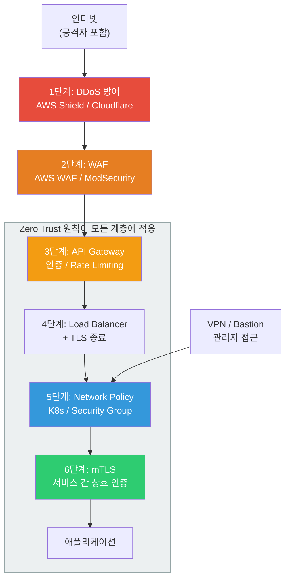
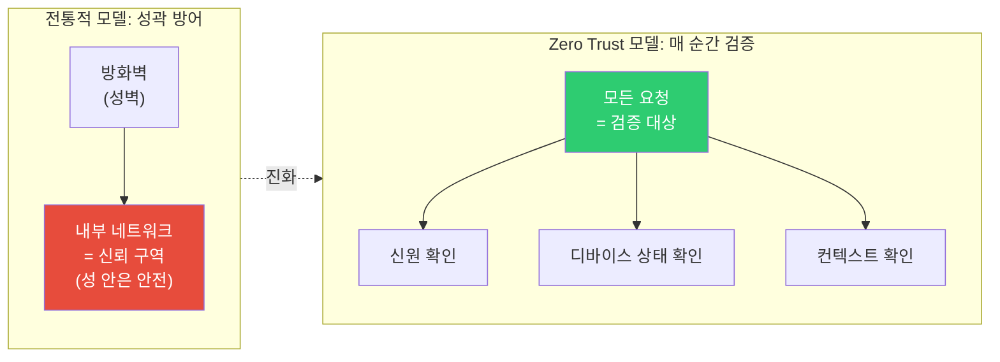
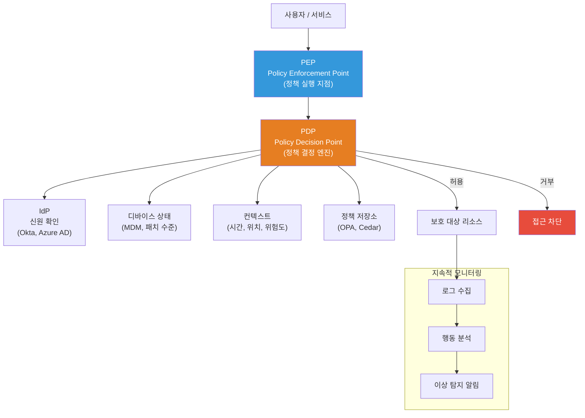
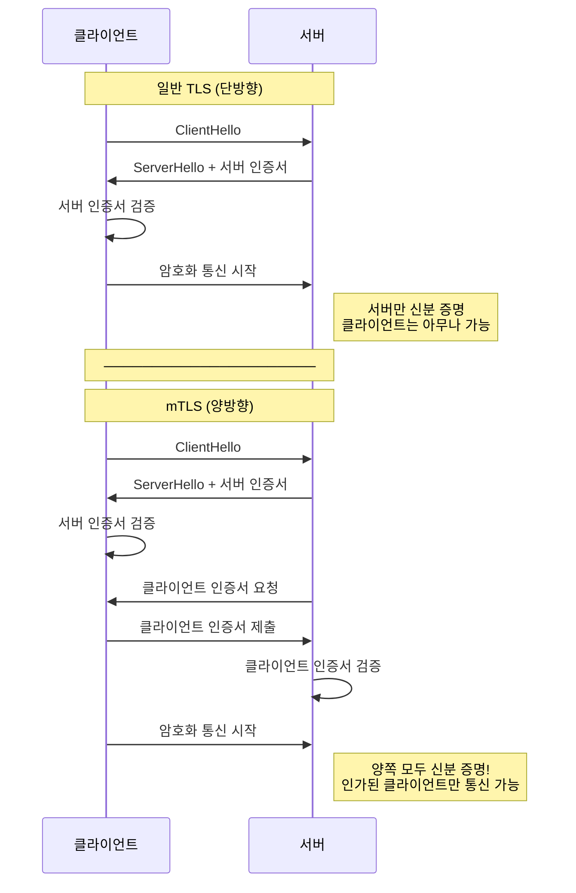
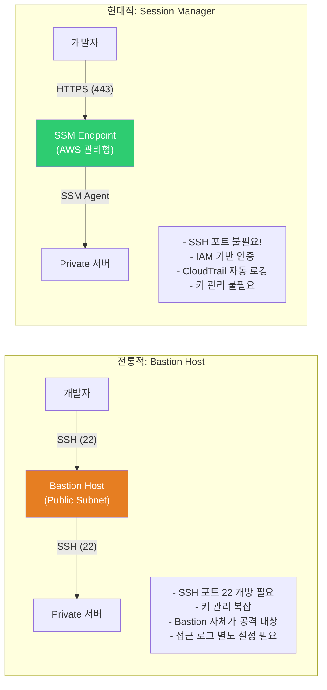
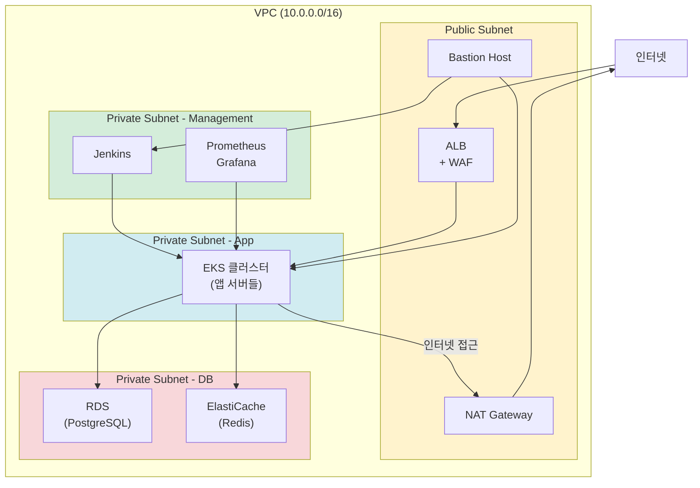
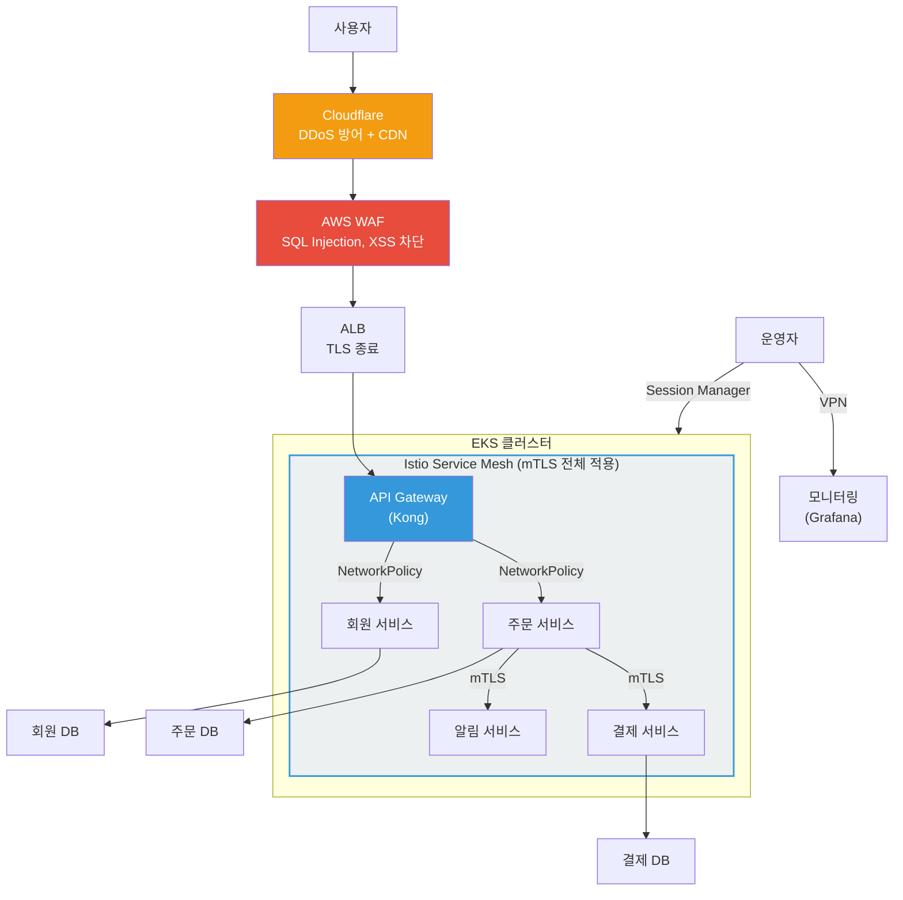

# 네트워크 보안 (WAF / Zero Trust / mTLS / Network Policy / VPN / Bastion)

> 서버를 인터넷에 연결하는 순간 공격은 시작돼요. [네트워크 기초](../02-networking/09-network-security)에서 WAF와 DDoS 방어 개념을 배웠고, [VPC](../05-cloud-aws/02-vpc)에서 클라우드 네트워크 격리를 익혔죠? 이번에는 한 단계 더 깊이 들어가서 — **Zero Trust 아키텍처, mTLS, K8s Network Policy, VPN, Bastion Host**까지 실무 네트워크 보안의 전체 그림을 완성해요.

---

## 🎯 왜 네트워크 보안을 알아야 하나요?

```
실무에서 네트워크 보안이 필요한 순간:
• "외부에서 SQL Injection 공격이 들어와요"           → WAF 룰 설정
• "내부 서비스 간 통신도 암호화해야 해요"             → mTLS (상호 TLS)
• "보안 감사에서 Zero Trust 아키텍처를 요구해요"      → 제로 트러스트 전환
• "특정 Pod만 DB에 접근할 수 있게 해주세요"           → K8s NetworkPolicy
• "재택근무자가 내부 시스템에 접근해야 해요"           → VPN / Client VPN
• "서버에 SSH로 접근하는데 보안이 걱정돼요"           → Bastion Host / Session Manager
• "DDoS 공격으로 서비스가 마비됐어요"                → Shield / Cloudflare
• "API Gateway에 인증을 어떻게 거나요?"              → API GW 보안 정책
• 면접: "Zero Trust가 뭔가요?"                      → 핵심 보안 아키텍처
```

### 이 강의에서 배우는 것

| 주제 | 한 줄 설명 | 실무 활용 |
|------|-----------|----------|
| **WAF** | HTTP 요청 내용을 검사해서 공격 차단 | SQL Injection, XSS 방어 |
| **Zero Trust** | "절대 신뢰하지 말고, 항상 검증해라" | 내부 네트워크 보안 강화 |
| **mTLS** | 서버와 클라이언트 모두 인증서로 상호 인증 | 서비스 간 통신 보안 |
| **Network Policy** | K8s Pod 간 트래픽 제어 | 마이크로서비스 네트워크 격리 |
| **VPN / Bastion** | 내부 네트워크 안전한 접근 경로 | 재택근무, 서버 관리 |
| **DDoS 방어** | 대량 트래픽 공격 차단 | 서비스 가용성 보장 |
| **API Gateway 보안** | API 엔드포인트 보호 | 인증, 속도 제한, 접근 제어 |

---

## 🧠 핵심 개념 잡기

### 비유: 공항 보안 시스템

네트워크 보안을 **공항**에 비유해볼게요. 공항은 여러 단계의 보안을 거쳐야 비행기에 탈 수 있어요.

* **WAF** = 공항 입구 보안 검색대. 여행객의 가방(HTTP 요청)을 X-Ray로 검사해서 위험물(SQL Injection, XSS)을 차단해요
* **Zero Trust** = "공항 안에 있어도 매 구역마다 신분증 확인". 출국장 들어왔다고 끝이 아니라, 라운지, 탑승구마다 다시 검사해요
* **mTLS** = 항공사 직원과 조종사의 상호 신분 확인. 조종사가 신분증을 보여주고, 항공사도 조종사에게 비행 허가증을 보여줘요. 양쪽 모두 검증!
* **Network Policy** = 공항 구역별 출입 통제. "승객은 활주로 진입 불가", "수하물 직원은 여객 터미널 접근 제한"
* **VPN** = 공항까지 가는 전용 리무진 버스. 일반 도로(인터넷)를 달리지만 창문이 차단되어(암호화) 외부에서 안이 안 보여요
* **Bastion Host** = 공항 안내 데스크. 내부 시설에 접근하려면 반드시 이곳을 거쳐야 해요
* **DDoS 방어** = 공항 앞 교통 통제. 수만 대의 차량이 한꺼번에 몰려와서 공항을 마비시키는 걸 막아요

### 네트워크 보안 전체 아키텍처



### 전통적 보안 vs Zero Trust 비교



---

## 🔍 하나씩 자세히 알아보기

### 1. WAF (Web Application Firewall)

WAF는 HTTP 요청의 **내용**(L7)을 검사해서 악성 요청을 차단하는 방화벽이에요. [네트워크 보안 기초](../02-networking/09-network-security)에서 기본 개념을 배웠는데, 여기서는 실무 설정에 집중할게요.

#### AWS WAF 구성 요소

| 구성 요소 | 설명 | 비유 |
|----------|------|------|
| **Web ACL** | WAF 규칙들의 묶음 | 보안 검색대 전체 시스템 |
| **Rule** | 하나의 검사 조건 | "가방에 액체 150ml 이상 불가" |
| **Rule Group** | 규칙들의 그룹 (Managed / Custom) | 보안 검사 매뉴얼 세트 |
| **Condition** | 매칭 조건 (IP, URI, Header 등) | 검사 항목 |
| **Action** | Allow / Block / Count | 통과 / 차단 / 기록만 |

#### AWS WAF 핵심 관리형 규칙

```bash
# AWS에서 제공하는 주요 관리형 규칙 그룹
AWS-AWSManagedRulesCommonRuleSet       # OWASP Top 10 기본 방어
AWS-AWSManagedRulesSQLiRuleSet         # SQL Injection 방어
AWS-AWSManagedRulesKnownBadInputsRuleSet  # 알려진 악성 입력 차단
AWS-AWSManagedRulesAmazonIpReputationList # 악성 IP 차단
AWS-AWSManagedRulesBotControlRuleSet   # Bot 트래픽 제어
AWS-AWSManagedRulesLinuxRuleSet        # Linux 특화 공격 방어
```

#### ModSecurity (오픈소스 WAF)

ModSecurity는 Nginx/Apache 앞에 붙여서 사용하는 오픈소스 WAF예요. OWASP Core Rule Set(CRS)과 함께 쓰면 AWS WAF 못지않은 방어가 가능해요.

```nginx
# Nginx + ModSecurity 설정 예시
# /etc/nginx/nginx.conf

load_module modules/ngx_http_modsecurity_module.so;

http {
    modsecurity on;
    modsecurity_rules_file /etc/nginx/modsec/main.conf;

    server {
        listen 80;
        server_name api.example.com;

        location / {
            proxy_pass http://backend:8080;
        }
    }
}
```

```bash
# /etc/nginx/modsec/main.conf
Include /etc/nginx/modsec/modsecurity.conf
Include /etc/nginx/modsec/crs/crs-setup.conf
Include /etc/nginx/modsec/crs/rules/*.conf

# 커스텀 규칙 예시: 특정 User-Agent 차단
SecRule REQUEST_HEADERS:User-Agent "sqlmap|nikto|nmap" \
    "id:10001,phase:1,deny,status:403,msg:'보안 스캐너 차단'"

# 특정 국가 IP 차단 (GeoIP 활용)
SecRule GEO:COUNTRY_CODE "@pm CN RU" \
    "id:10002,phase:1,deny,status:403,msg:'허용되지 않은 국가'"
```

#### OWASP Top 10 과 WAF 규칙 매핑

| OWASP Top 10 | WAF 대응 규칙 | 설명 |
|--------------|--------------|------|
| A01: Broken Access Control | 접근 제어 규칙 | 인가되지 않은 리소스 접근 차단 |
| A02: Cryptographic Failures | TLS 강제 규칙 | HTTP → HTTPS 리다이렉트 |
| A03: Injection | SQLi/XSS 규칙 | 악성 입력 패턴 탐지/차단 |
| A04: Insecure Design | Rate Limiting | 설계 결함을 보완하는 제한 |
| A05: Security Misconfiguration | 기본 설정 검사 | 서버 정보 노출 차단 |
| A06: Vulnerable Components | 알려진 취약점 규칙 | Log4Shell 등 패턴 차단 |
| A07: Auth Failures | Brute Force 방어 | 로그인 시도 횟수 제한 |
| A09: Logging Failures | WAF 로깅 | 모든 차단 이벤트 기록 |
| A10: SSRF | SSRF 방어 규칙 | 내부 IP 접근 시도 차단 |

---

### 2. Zero Trust Architecture (제로 트러스트)

Zero Trust는 **"절대 신뢰하지 말고, 항상 검증하라"**는 보안 철학이에요. 전통적인 "성벽 안은 안전하다"는 사고방식을 완전히 뒤집어요.

#### Zero Trust 핵심 원칙

```
Zero Trust의 3가지 핵심 원칙:

1. Never Trust, Always Verify (절대 신뢰하지 말고, 항상 검증)
   → 내부 네트워크라도 무조건 인증/인가 필요
   → 위치(IP)가 아닌 신원(Identity) 기반 접근

2. Least Privilege (최소 권한)
   → 필요한 만큼만, 필요한 시간만큼만 접근 허용
   → 과도한 권한 부여 금지

3. Assume Breach (침해를 가정)
   → 이미 내부에 공격자가 있다고 가정
   → 횡이동(lateral movement)을 최소화
   → Microsegmentation으로 폭발 반경(blast radius) 축소
```

#### Zero Trust 아키텍처 구성 요소



#### Microsegmentation (마이크로세그멘테이션)

전통적인 네트워크 세그멘테이션은 서브넷 단위로 분리하지만, 마이크로세그멘테이션은 **워크로드 단위**로 세밀하게 분리해요.

```
전통적 세그멘테이션:
┌─────────────────────────────────┐
│  DMZ 서브넷    │  App 서브넷    │  DB 서브넷    │
│  (웹서버들)    │  (앱서버들)    │  (DB서버들)   │
│  ─ 서로 통신 ─ │  ─ 서로 통신 ─ │  ─ 서로 통신 ─│
└─────────────────────────────────┘
→ 같은 서브넷 안에서는 자유롭게 통신 가능 (위험!)

마이크로세그멘테이션:
┌──────────────────────────────────────┐
│  [웹서버A] ←→ [앱서버A] ←→ [DB-A]   │  ← 주문 서비스
│       ✗           ✗           ✗      │
│  [웹서버B] ←→ [앱서버B] ←→ [DB-B]   │  ← 결제 서비스
│       ✗           ✗           ✗      │
│  [웹서버C] ←→ [앱서버C] ←→ [DB-C]   │  ← 회원 서비스
└──────────────────────────────────────┘
→ 워크로드 단위로 격리. 주문 서비스가 뚫려도 결제 서비스는 안전!
```

#### Zero Trust 도입 단계

| 단계 | 내용 | 도구 |
|------|------|------|
| 1단계: 가시성 확보 | 모든 자산, 트래픽 흐름 파악 | Flow Logs, Service Map |
| 2단계: 신원 기반 접근 | IP 기반 → Identity 기반 전환 | SSO, MFA, OAuth 2.0 |
| 3단계: 최소 권한 적용 | 필요한 리소스만 접근 허용 | IAM, RBAC, Network Policy |
| 4단계: 마이크로세그멘테이션 | 워크로드 단위 네트워크 격리 | Service Mesh, Calico, Cilium |
| 5단계: 지속적 모니터링 | 실시간 위협 탐지, 행동 분석 | SIEM, Falco, GuardDuty |

---

### 3. mTLS (Mutual TLS — 상호 TLS)

#### 일반 TLS vs mTLS

일반 TLS는 **서버만 인증서를 보여줘요** (클라이언트 → 서버: "너 진짜 서버 맞아?"). mTLS는 **양쪽 모두 인증서를 교환해요** (서버와 클라이언트가 서로 "너 누구야?" 확인).



#### cert-manager로 인증서 자동 관리

K8s에서 mTLS를 구현할 때 **cert-manager**가 인증서 발급/갱신을 자동으로 처리해줘요.

```yaml
# cert-manager 설치
# helm install cert-manager jetstack/cert-manager --namespace cert-manager \
#   --set installCRDs=true

# 1. CA (인증 기관) Issuer 생성
apiVersion: cert-manager.io/v1
kind: ClusterIssuer
metadata:
  name: internal-ca-issuer
spec:
  ca:
    secretName: internal-ca-key-pair

---
# 2. 서비스별 인증서 요청
apiVersion: cert-manager.io/v1
kind: Certificate
metadata:
  name: order-service-cert
  namespace: production
spec:
  secretName: order-service-tls
  issuerRef:
    name: internal-ca-issuer
    kind: ClusterIssuer
  commonName: order-service.production.svc.cluster.local
  dnsNames:
    - order-service
    - order-service.production
    - order-service.production.svc.cluster.local
  duration: 2160h    # 90일
  renewBefore: 360h  # 만료 15일 전 자동 갱신
  privateKey:
    algorithm: ECDSA
    size: 256
```

#### Service Mesh에서 mTLS (Istio 예시)

Service Mesh를 사용하면 **애플리케이션 코드 변경 없이** mTLS를 적용할 수 있어요. Sidecar 프록시가 대신 처리해줘요.

```yaml
# Istio PeerAuthentication - namespace 전체에 mTLS 적용
apiVersion: security.istio.io/v1beta1
kind: PeerAuthentication
metadata:
  name: default
  namespace: production
spec:
  mtls:
    mode: STRICT  # mTLS 필수 (PERMISSIVE = 선택적)

---
# DestinationRule - 특정 서비스에 mTLS 적용
apiVersion: networking.istio.io/v1beta1
kind: DestinationRule
metadata:
  name: order-service
  namespace: production
spec:
  host: order-service.production.svc.cluster.local
  trafficPolicy:
    tls:
      mode: ISTIO_MUTUAL  # Istio가 인증서 자동 관리
```

```
mTLS가 적용된 서비스 간 통신 흐름:

[주문 서비스 Pod]                          [결제 서비스 Pod]
┌─────────────────┐                       ┌─────────────────┐
│  App Container   │                       │  App Container   │
│  (HTTP 요청)     │                       │  (HTTP 수신)     │
│       ↓          │                       │       ↑          │
│  Envoy Sidecar   │ ── mTLS 암호화 ───→  │  Envoy Sidecar   │
│  (인증서 관리)    │   (양쪽 인증서 확인)   │  (인증서 관리)    │
└─────────────────┘                       └─────────────────┘

→ App은 그냥 HTTP로 요청하면 되요.
→ Sidecar가 자동으로 mTLS를 처리해요!
```

---

### 4. K8s Network Policy

[K8s 보안](../04-kubernetes/15-security)에서 NetworkPolicy 기초를 배웠어요. 여기서는 실무 패턴과 Calico/Cilium 활용에 집중할게요.

#### NetworkPolicy 기본 동작 원리

```
NetworkPolicy 핵심 규칙:
1. NetworkPolicy가 없으면 → 모든 Pod 간 통신 허용 (기본값)
2. NetworkPolicy가 하나라도 있으면 → 명시적으로 허용한 것만 통과
3. Ingress 규칙 = 들어오는 트래픽 제어
4. Egress 규칙 = 나가는 트래픽 제어
5. CNI가 NetworkPolicy를 지원해야 함 (Calico, Cilium, Weave)
   ※ 기본 kubenet, Flannel은 미지원!
```

#### 실무 패턴: Default Deny + 허용 목록

```yaml
# 1단계: 모든 트래픽 차단 (Default Deny)
apiVersion: networking.k8s.io/v1
kind: NetworkPolicy
metadata:
  name: default-deny-all
  namespace: production
spec:
  podSelector: {}      # 모든 Pod에 적용
  policyTypes:
    - Ingress
    - Egress

---
# 2단계: DNS 조회 허용 (이게 없으면 서비스 이름으로 통신 불가!)
apiVersion: networking.k8s.io/v1
kind: NetworkPolicy
metadata:
  name: allow-dns
  namespace: production
spec:
  podSelector: {}
  policyTypes:
    - Egress
  egress:
    - to:
        - namespaceSelector:
            matchLabels:
              kubernetes.io/metadata.name: kube-system
      ports:
        - protocol: UDP
          port: 53
        - protocol: TCP
          port: 53

---
# 3단계: 프론트엔드 → API 서버 통신만 허용
apiVersion: networking.k8s.io/v1
kind: NetworkPolicy
metadata:
  name: allow-frontend-to-api
  namespace: production
spec:
  podSelector:
    matchLabels:
      app: api-server
  policyTypes:
    - Ingress
  ingress:
    - from:
        - podSelector:
            matchLabels:
              app: frontend
      ports:
        - protocol: TCP
          port: 8080

---
# 4단계: API 서버 → DB 통신만 허용
apiVersion: networking.k8s.io/v1
kind: NetworkPolicy
metadata:
  name: allow-api-to-db
  namespace: production
spec:
  podSelector:
    matchLabels:
      app: database
  policyTypes:
    - Ingress
  ingress:
    - from:
        - podSelector:
            matchLabels:
              app: api-server
      ports:
        - protocol: TCP
          port: 5432
```

#### Calico 고급 Network Policy

Calico는 K8s 기본 NetworkPolicy보다 더 강력한 기능을 제공해요.

```yaml
# Calico GlobalNetworkPolicy - 클러스터 전체에 적용
apiVersion: projectcalico.org/v3
kind: GlobalNetworkPolicy
metadata:
  name: deny-external-egress
spec:
  # production 네임스페이스의 모든 Pod
  selector: projectcalico.org/namespace == 'production'
  types:
    - Egress
  egress:
    # 클러스터 내부 통신만 허용
    - action: Allow
      destination:
        nets:
          - 10.0.0.0/8       # 클러스터 내부 IP
    # 외부 HTTPS만 허용 (패키지 다운로드 등)
    - action: Allow
      protocol: TCP
      destination:
        ports:
          - 443
    # 나머지 외부 통신은 모두 차단
    - action: Deny

---
# Calico NetworkPolicy - L7 규칙 (HTTP 메서드/경로 기반)
apiVersion: projectcalico.org/v3
kind: NetworkPolicy
metadata:
  name: allow-readonly-api
  namespace: production
spec:
  selector: app == 'api-server'
  types:
    - Ingress
  ingress:
    - action: Allow
      protocol: TCP
      source:
        selector: app == 'monitoring'
      destination:
        ports:
          - 8080
      http:
        methods: ["GET"]           # GET만 허용
        paths:
          - exact: "/health"       # /health 경로만 허용
          - prefix: "/metrics"     # /metrics/* 경로 허용
```

#### Cilium L7 Network Policy

Cilium은 eBPF 기반으로 커널 레벨에서 동작해서 더 빠르고 세밀한 제어가 가능해요.

```yaml
# Cilium CiliumNetworkPolicy - L7 HTTP 기반 제어
apiVersion: cilium.io/v2
kind: CiliumNetworkPolicy
metadata:
  name: api-server-policy
  namespace: production
spec:
  endpointSelector:
    matchLabels:
      app: api-server
  ingress:
    - fromEndpoints:
        - matchLabels:
            app: frontend
      toPorts:
        - ports:
            - port: "8080"
              protocol: TCP
          rules:
            http:
              - method: "GET"
                path: "/api/v1/products"
              - method: "POST"
                path: "/api/v1/orders"
                headers:
                  - 'Content-Type: application/json'
  egress:
    - toEndpoints:
        - matchLabels:
            app: database
      toPorts:
        - ports:
            - port: "5432"
              protocol: TCP
    # 외부 API 호출 허용 (FQDN 기반)
    - toFQDNs:
        - matchName: "api.stripe.com"
      toPorts:
        - ports:
            - port: "443"
              protocol: TCP
```

---

### 5. VPN / Bastion Host / Session Manager

[VPN 기초](../02-networking/10-vpn)에서 개념을 배웠어요. 여기서는 실무 구성에 집중할게요.

#### VPN 솔루션 비교

| 솔루션 | 유형 | 장점 | 단점 | 적합한 상황 |
|--------|------|------|------|------------|
| **WireGuard** | P2P / Client | 빠르고, 코드가 간결(4K줄), 현대적 | 관리 UI 없음 | 소규모 팀, 성능 중시 |
| **OpenVPN** | Client / S2S | 성숙한 생태계, 다양한 인증 | 상대적으로 느림 | 대규모 조직, 다양한 OS |
| **AWS Client VPN** | Client | AWS 네이티브, AD 연동 | 비용, 대역폭 제한 | AWS 환경 전용 |
| **Tailscale** | Mesh | WireGuard 기반, 설정 초간단 | 서드파티 의존 | 스타트업, 빠른 구축 |
| **AWS S2S VPN** | Site-to-Site | 관리형, 이중화 | 대역폭 제한(1.25Gbps) | 사무실-AWS 연결 |

#### WireGuard 설정

```bash
# ===== WireGuard 서버 설정 (Ubuntu) =====

# 1. 설치
sudo apt update && sudo apt install wireguard -y

# 2. 키 생성
wg genkey | tee /etc/wireguard/server_private.key | wg pubkey > /etc/wireguard/server_public.key
chmod 600 /etc/wireguard/server_private.key

# 3. 서버 설정 파일
cat <<'EOF' > /etc/wireguard/wg0.conf
[Interface]
Address = 10.200.0.1/24
ListenPort = 51820
PrivateKey = <서버_프라이빗_키>

# IP 포워딩 및 NAT 설정
PostUp = iptables -A FORWARD -i wg0 -j ACCEPT; iptables -t nat -A POSTROUTING -o eth0 -j MASQUERADE
PostDown = iptables -D FORWARD -i wg0 -j ACCEPT; iptables -t nat -D POSTROUTING -o eth0 -j MASQUERADE

# 클라이언트 1 (개발자 A)
[Peer]
PublicKey = <클라이언트1_퍼블릭_키>
AllowedIPs = 10.200.0.2/32

# 클라이언트 2 (개발자 B)
[Peer]
PublicKey = <클라이언트2_퍼블릭_키>
AllowedIPs = 10.200.0.3/32
EOF

# 4. 서비스 시작
sudo systemctl enable --now wg-quick@wg0

# ===== WireGuard 클라이언트 설정 =====
cat <<'EOF' > /etc/wireguard/wg0.conf
[Interface]
Address = 10.200.0.2/24
PrivateKey = <클라이언트_프라이빗_키>
DNS = 10.0.0.2

[Peer]
PublicKey = <서버_퍼블릭_키>
Endpoint = vpn.example.com:51820
AllowedIPs = 10.0.0.0/16, 10.200.0.0/24   # VPC CIDR + VPN CIDR
PersistentKeepalive = 25
EOF

sudo wg-quick up wg0
```

#### Bastion Host vs AWS Systems Manager Session Manager



#### Session Manager 설정

```bash
# EC2 인스턴스에 SSM Agent 역할 부여 (IAM)
# 필요한 관리형 정책: AmazonSSMManagedInstanceCore

# 로컬 PC에서 Session Manager로 접속
aws ssm start-session --target i-0abc123def456

# 포트 포워딩 (로컬 → 프라이빗 서버)
aws ssm start-session \
    --target i-0abc123def456 \
    --document-name AWS-StartPortForwardingSession \
    --parameters '{"portNumber":["5432"],"localPortNumber":["15432"]}'
# → localhost:15432로 접속하면 프라이빗 서버의 5432(PostgreSQL)에 연결!

# SSH over Session Manager (SSH 키 대신 IAM 인증 사용)
# ~/.ssh/config 에 추가:
# Host i-*
#     ProxyCommand sh -c "aws ssm start-session --target %h --document-name AWS-StartSSHSession --parameters 'portNumber=%p'"
```

#### Bastion Host를 써야 한다면 (보안 강화)

```bash
# Bastion Host 보안 강화 체크리스트:
# 1. SSH 포트 변경 (22 → 2222 등)
# 2. 키 기반 인증만 허용 (패스워드 비활성화)
# 3. MFA 적용 (Google Authenticator)
# 4. IP 화이트리스팅 (Security Group)
# 5. 세션 타임아웃 설정
# 6. 접근 로그 기록 (CloudWatch)

# /etc/ssh/sshd_config (Bastion 서버)
Port 2222
PermitRootLogin no
PasswordAuthentication no
MaxAuthTries 3
ClientAliveInterval 300
ClientAliveCountMax 2
AllowUsers admin deploy-user
```

---

### 6. DDoS 방어

#### DDoS 공격 유형과 방어 계층

| 공격 유형 | OSI 계층 | 예시 | 방어 수단 |
|----------|---------|------|----------|
| **Volumetric** | L3/L4 | UDP Flood, ICMP Flood | AWS Shield, Cloudflare |
| **Protocol** | L3/L4 | SYN Flood, Ping of Death | Shield, 방화벽 |
| **Application** | L7 | HTTP Flood, Slowloris | WAF, Rate Limiting |

#### AWS Shield Standard vs Advanced

```
AWS Shield Standard (무료, 자동 적용):
├── L3/L4 DDoS 방어 (SYN Flood, UDP Flood 등)
├── 모든 AWS 리소스에 자동 적용
├── 별도 설정 불필요
└── 대부분의 일반적인 DDoS 공격 차단

AWS Shield Advanced ($3,000/월):
├── L3/L4/L7 DDoS 방어
├── 실시간 공격 탐지 및 알림
├── 24/7 DDoS Response Team (DRT) 지원
├── 비용 보호 (DDoS로 인한 스케일링 비용 환불)
├── 글로벌 위협 대시보드
├── WAF 규칙 자동 생성
└── 적용 대상: CloudFront, ALB, NLB, EIP, Global Accelerator
```

#### Cloudflare를 활용한 DDoS 방어

```
트래픽 흐름 (Cloudflare 적용 시):

사용자 → Cloudflare Edge (280+ PoP)
         ├── DDoS 탐지 및 차단 (L3/L4/L7)
         ├── Bot Management
         ├── WAF (OWASP 규칙)
         ├── Rate Limiting
         └── 정상 트래픽만 → Origin Server (우리 서버)

설정 핵심:
1. DNS를 Cloudflare로 변경 (프록시 모드)
2. Origin IP는 절대 외부에 노출 금지!
3. Origin은 Cloudflare IP만 허용 (Security Group)
4. SSL 모드: Full (Strict) 권장
```

---

### 7. API Gateway 보안

[API Gateway 기초](../02-networking/13-api-gateway)에서 개념을 배웠는데, 보안 관점에서 더 깊이 들어갈게요.

#### API Gateway 보안 계층

```
API Gateway 보안 체크리스트:

1. 인증 (Authentication)
   ├── API Key
   ├── OAuth 2.0 / JWT
   ├── Cognito User Pool
   └── IAM 인증 (AWS SigV4)

2. 인가 (Authorization)
   ├── Lambda Authorizer (커스텀 로직)
   ├── Cognito Authorizer
   └── IAM Policy

3. 트래픽 제어
   ├── Rate Limiting (요청 수 제한)
   ├── Throttling (초당 요청 수 제한)
   ├── Quota (일/월 단위 제한)
   └── Usage Plan (API 키별 제한)

4. 입력 검증
   ├── Request Validation (스키마 검증)
   ├── Request/Response Mapping
   └── Payload Size 제한

5. 전송 보안
   ├── HTTPS 강제 (TLS 1.2+)
   ├── mTLS 인증
   └── Private API (VPC 내부만 접근)
```

#### AWS API Gateway 보안 설정 예시

```yaml
# SAM Template - API Gateway 보안 설정
AWSTemplateFormatVersion: '2010-09-09'
Transform: AWS::Serverless-2016-10-31

Resources:
  # API Gateway
  SecureApi:
    Type: AWS::Serverless::Api
    Properties:
      StageName: prod
      # WAF 연동
      # AWS::WAFv2::WebACLAssociation 으로 별도 연결

      # mTLS 활성화
      MutualTlsAuthentication:
        TruststoreUri: s3://my-bucket/truststore.pem

      # 도메인 + TLS 설정
      Domain:
        DomainName: api.example.com
        CertificateArn: arn:aws:acm:...
        SecurityPolicy: TLS_1_2

      Auth:
        # 기본 인증 방식
        DefaultAuthorizer: MyCognitoAuthorizer
        Authorizers:
          MyCognitoAuthorizer:
            UserPoolArn: !GetAtt UserPool.Arn
        # API 키 필수
        ApiKeyRequired: true
        # Usage Plan
        UsagePlan:
          CreateUsagePlan: PER_API
          Throttle:
            BurstLimit: 100      # 순간 최대 요청
            RateLimit: 50        # 초당 평균 요청
          Quota:
            Limit: 10000         # 일일 최대 요청
            Period: DAY
```

---

### 8. 네트워크 세그멘테이션

#### AWS VPC 기반 네트워크 세그멘테이션



#### Security Group 설계 원칙

```bash
# Security Group 설계 원칙: "필요한 것만 열고, 소스도 SG 참조로"

# ALB Security Group
aws ec2 create-security-group --group-name alb-sg --description "ALB"
# → Inbound: 0.0.0.0/0:443 (HTTPS)
# → Outbound: app-sg:8080

# App Security Group
aws ec2 create-security-group --group-name app-sg --description "App"
# → Inbound: alb-sg:8080 (ALB에서만)
# → Inbound: bastion-sg:22 (Bastion에서만)
# → Outbound: db-sg:5432 (DB로만)
# → Outbound: redis-sg:6379 (Redis로만)

# DB Security Group
aws ec2 create-security-group --group-name db-sg --description "DB"
# → Inbound: app-sg:5432 (App에서만)
# → Outbound: 없음 (DB는 나가는 트래픽 불필요)

# 핵심: IP가 아닌 Security Group ID로 참조!
# → 인스턴스가 교체되어도 규칙 변경 불필요
# → "이 SG에 속한 리소스에서 오는 트래픽만 허용"
```

---

## 💻 직접 해보기

### 실습 1: AWS WAF 설정 (Terraform)

```hcl
# terraform/waf.tf

# WAF Web ACL 생성
resource "aws_wafv2_web_acl" "main" {
  name        = "production-waf"
  description = "Production WAF"
  scope       = "REGIONAL"  # CloudFront면 "CLOUDFRONT"

  default_action {
    allow {}
  }

  # 규칙 1: AWS 관리형 - OWASP Common Rule Set
  rule {
    name     = "AWSManagedRulesCommonRuleSet"
    priority = 1

    override_action {
      none {}  # 관리형 규칙의 동작을 그대로 사용
    }

    statement {
      managed_rule_group_statement {
        name        = "AWSManagedRulesCommonRuleSet"
        vendor_name = "AWS"

        # 특정 규칙만 Count 모드로 (오탐 방지)
        rule_action_override {
          action_to_use {
            count {}
          }
          name = "SizeRestrictions_BODY"
        }
      }
    }

    visibility_config {
      cloudwatch_metrics_enabled = true
      metric_name                = "CommonRuleSet"
      sampled_requests_enabled   = true
    }
  }

  # 규칙 2: SQL Injection 방어
  rule {
    name     = "AWSManagedRulesSQLiRuleSet"
    priority = 2

    override_action {
      none {}
    }

    statement {
      managed_rule_group_statement {
        name        = "AWSManagedRulesSQLiRuleSet"
        vendor_name = "AWS"
      }
    }

    visibility_config {
      cloudwatch_metrics_enabled = true
      metric_name                = "SQLiRuleSet"
      sampled_requests_enabled   = true
    }
  }

  # 규칙 3: Rate Limiting (IP당 분당 2000 요청)
  rule {
    name     = "RateLimitRule"
    priority = 3

    action {
      block {}
    }

    statement {
      rate_based_statement {
        limit              = 2000
        aggregate_key_type = "IP"
      }
    }

    visibility_config {
      cloudwatch_metrics_enabled = true
      metric_name                = "RateLimit"
      sampled_requests_enabled   = true
    }
  }

  # 규칙 4: 특정 국가 차단
  rule {
    name     = "GeoBlockRule"
    priority = 4

    action {
      block {}
    }

    statement {
      geo_match_statement {
        country_codes = ["CN", "RU", "KP"]
      }
    }

    visibility_config {
      cloudwatch_metrics_enabled = true
      metric_name                = "GeoBlock"
      sampled_requests_enabled   = true
    }
  }

  # 규칙 5: 커스텀 - 특정 경로 보호 (/admin)
  rule {
    name     = "ProtectAdminPath"
    priority = 5

    action {
      block {}
    }

    statement {
      and_statement {
        statement {
          byte_match_statement {
            search_string         = "/admin"
            positional_constraint = "STARTS_WITH"
            field_to_match {
              uri_path {}
            }
            text_transformation {
              priority = 0
              type     = "LOWERCASE"
            }
          }
        }
        statement {
          not_statement {
            statement {
              ip_set_reference_statement {
                arn = aws_wafv2_ip_set.admin_whitelist.arn
              }
            }
          }
        }
      }
    }

    visibility_config {
      cloudwatch_metrics_enabled = true
      metric_name                = "AdminProtect"
      sampled_requests_enabled   = true
    }
  }

  visibility_config {
    cloudwatch_metrics_enabled = true
    metric_name                = "ProductionWAF"
    sampled_requests_enabled   = true
  }
}

# 관리자 IP 화이트리스트
resource "aws_wafv2_ip_set" "admin_whitelist" {
  name               = "admin-whitelist"
  scope              = "REGIONAL"
  ip_address_version = "IPV4"
  addresses          = ["203.0.113.0/24"]  # 사무실 IP
}

# WAF → ALB 연결
resource "aws_wafv2_web_acl_association" "alb" {
  resource_arn = aws_lb.main.arn
  web_acl_arn  = aws_wafv2_web_acl.main.arn
}

# WAF 로그 → CloudWatch
resource "aws_wafv2_web_acl_logging_configuration" "main" {
  log_destination_configs = [aws_cloudwatch_log_group.waf.arn]
  resource_arn            = aws_wafv2_web_acl.main.arn

  logging_filter {
    default_behavior = "DROP"  # 기본은 로그 안 남김
    filter {
      behavior    = "KEEP"
      requirement = "MEETS_ANY"
      condition {
        action_condition {
          action = "BLOCK"     # 차단된 요청만 로깅
        }
      }
    }
  }
}
```

### 실습 2: K8s Network Policy 단계별 적용

```bash
# 1단계: 현재 상태 확인
kubectl get networkpolicy -A
# → 아무것도 없으면 모든 Pod 간 자유 통신 중!

# 2단계: 테스트 환경 준비
kubectl create namespace netpol-test

# 프론트엔드 Pod
kubectl run frontend --image=nginx --labels=app=frontend -n netpol-test
# API 서버 Pod
kubectl run api --image=nginx --labels=app=api -n netpol-test --port=80
# DB Pod
kubectl run db --image=postgres:15 --labels=app=db -n netpol-test \
  --env="POSTGRES_PASSWORD=test123" --port=5432

# 서비스 생성
kubectl expose pod api --port=80 -n netpol-test
kubectl expose pod db --port=5432 -n netpol-test

# 3단계: 통신 테스트 (정책 적용 전 - 모두 성공해야 함)
kubectl exec frontend -n netpol-test -- curl -s --max-time 3 api
kubectl exec frontend -n netpol-test -- curl -s --max-time 3 db:5432
kubectl exec api -n netpol-test -- curl -s --max-time 3 db:5432
echo "→ 모든 통신 가능 (NetworkPolicy 없음)"

# 4단계: Default Deny 적용
cat <<'EOF' | kubectl apply -f -
apiVersion: networking.k8s.io/v1
kind: NetworkPolicy
metadata:
  name: default-deny
  namespace: netpol-test
spec:
  podSelector: {}
  policyTypes:
    - Ingress
    - Egress
EOF

# 5단계: 통신 테스트 (모두 실패해야 함)
kubectl exec frontend -n netpol-test -- curl -s --max-time 3 api
echo "→ 타임아웃! (차단됨)"

# 6단계: 필요한 통신만 허용
cat <<'EOF' | kubectl apply -f -
apiVersion: networking.k8s.io/v1
kind: NetworkPolicy
metadata:
  name: allow-dns
  namespace: netpol-test
spec:
  podSelector: {}
  policyTypes:
    - Egress
  egress:
    - to:
        - namespaceSelector:
            matchLabels:
              kubernetes.io/metadata.name: kube-system
      ports:
        - protocol: UDP
          port: 53
---
apiVersion: networking.k8s.io/v1
kind: NetworkPolicy
metadata:
  name: frontend-to-api
  namespace: netpol-test
spec:
  podSelector:
    matchLabels:
      app: api
  ingress:
    - from:
        - podSelector:
            matchLabels:
              app: frontend
      ports:
        - port: 80
---
apiVersion: networking.k8s.io/v1
kind: NetworkPolicy
metadata:
  name: api-to-db
  namespace: netpol-test
spec:
  podSelector:
    matchLabels:
      app: db
  ingress:
    - from:
        - podSelector:
            matchLabels:
              app: api
      ports:
        - port: 5432
EOF

# 7단계: 최종 통신 테스트
kubectl exec frontend -n netpol-test -- curl -s --max-time 3 api
echo "→ 성공! (frontend → api 허용)"

kubectl exec frontend -n netpol-test -- curl -s --max-time 3 db:5432
echo "→ 실패! (frontend → db 차단)"

kubectl exec api -n netpol-test -- curl -s --max-time 3 db:5432
echo "→ 성공! (api → db 허용)"

# 정리
kubectl delete namespace netpol-test
```

### 실습 3: Istio mTLS 활성화

```bash
# 1단계: Istio 설치 (이미 설치되어 있다면 생략)
istioctl install --set profile=default -y

# 2단계: 네임스페이스에 사이드카 자동 주입 활성화
kubectl label namespace production istio-injection=enabled

# 3단계: Strict mTLS 적용
cat <<'EOF' | kubectl apply -f -
apiVersion: security.istio.io/v1beta1
kind: PeerAuthentication
metadata:
  name: default
  namespace: production
spec:
  mtls:
    mode: STRICT
EOF

# 4단계: mTLS 상태 확인
istioctl x describe pod <pod-name> -n production
# 출력에 "mTLS" 관련 정보가 표시됨

# 5단계: 특정 서비스에 JWT 인증 추가 (외부 요청용)
cat <<'EOF' | kubectl apply -f -
apiVersion: security.istio.io/v1beta1
kind: RequestAuthentication
metadata:
  name: jwt-auth
  namespace: production
spec:
  selector:
    matchLabels:
      app: api-server
  jwtRules:
    - issuer: "https://auth.example.com"
      jwksUri: "https://auth.example.com/.well-known/jwks.json"
---
apiVersion: security.istio.io/v1beta1
kind: AuthorizationPolicy
metadata:
  name: require-jwt
  namespace: production
spec:
  selector:
    matchLabels:
      app: api-server
  rules:
    - from:
        - source:
            requestPrincipals: ["*"]  # JWT가 있는 요청만 허용
      to:
        - operation:
            methods: ["GET", "POST"]
            paths: ["/api/*"]
EOF

# 6단계: mTLS 트래픽 확인 (Kiali 대시보드)
kubectl port-forward svc/kiali -n istio-system 20001:20001
# → http://localhost:20001 에서 mTLS 적용 상태 시각적 확인 가능
```

### 실습 4: Session Manager로 안전한 서버 접근

```bash
# 1단계: EC2 인스턴스에 IAM Role 생성 (Terraform)
cat <<'EOF'
resource "aws_iam_role" "ec2_ssm" {
  name = "ec2-ssm-role"
  assume_role_policy = jsonencode({
    Version = "2012-10-17"
    Statement = [{
      Action = "sts:AssumeRole"
      Effect = "Allow"
      Principal = { Service = "ec2.amazonaws.com" }
    }]
  })
}

resource "aws_iam_role_policy_attachment" "ssm" {
  role       = aws_iam_role.ec2_ssm.name
  policy_arn = "arn:aws:iam::aws:policy/AmazonSSMManagedInstanceCore"
}

resource "aws_iam_instance_profile" "ssm" {
  name = "ec2-ssm-profile"
  role = aws_iam_role.ec2_ssm.name
}
EOF

# 2단계: Session Manager로 접속
aws ssm start-session --target i-0abc123def456

# 3단계: 포트 포워딩 (프라이빗 RDS 접근)
aws ssm start-session \
    --target i-0abc123def456 \
    --document-name AWS-StartPortForwardingSessionToRemoteHost \
    --parameters '{
        "host": ["mydb.cluster-xyz.ap-northeast-2.rds.amazonaws.com"],
        "portNumber": ["5432"],
        "localPortNumber": ["15432"]
    }'

# → 이제 localhost:15432로 프라이빗 RDS에 접속 가능!
psql -h localhost -p 15432 -U admin -d mydb

# 4단계: Session Manager 로그 확인
aws ssm describe-sessions --state History \
    --filters "key=Target,value=i-0abc123def456"
```

---

## 🏢 실무에서는?

### 회사 규모별 네트워크 보안 전략

#### 스타트업 (5-20명)

```
최소 비용으로 기본 보안:
├── WAF: AWS WAF (관리형 규칙 세트)
├── DDoS: AWS Shield Standard (무료)
├── VPN: Tailscale 또는 WireGuard
├── 서버 접근: Session Manager
├── K8s: 기본 NetworkPolicy (default deny)
├── TLS: cert-manager + Let's Encrypt
└── 예산: ~$50/월
```

#### 중견기업 (20-200명)

```
체계적인 보안 아키텍처:
├── WAF: AWS WAF + 커스텀 규칙 + Bot Control
├── DDoS: Cloudflare Pro 또는 AWS Shield Advanced
├── Zero Trust: Cloudflare Access 또는 Zscaler
├── VPN: WireGuard + MFA
├── 서버 접근: Session Manager + CloudTrail 감사
├── K8s: Calico NetworkPolicy + Istio mTLS
├── API GW: Kong / AWS API Gateway + JWT 인증
├── 모니터링: GuardDuty + SecurityHub
└── 예산: ~$1,000-5,000/월
```

#### 대기업 / 금융권 (200+명)

```
규정 준수 + 심층 방어:
├── WAF: AWS WAF + ModSecurity + 전용 WAF 장비
├── DDoS: Shield Advanced + Cloudflare Enterprise
├── Zero Trust: 전사 Zero Trust 아키텍처 (BeyondCorp 모델)
├── mTLS: Istio + SPIFFE/SPIRE
├── VPN: AWS S2S VPN + Direct Connect
├── 서버 접근: Session Manager + PAM(Privileged Access Management)
├── K8s: Cilium + OPA/Gatekeeper
├── 네트워크: 마이크로세그멘테이션 (서비스 단위 격리)
├── 감사: SIEM + SOC 운영 + 자동화된 감사 보고서
├── 규정: PCI-DSS, ISMS, SOC2 준수
└── 예산: $10,000+/월
```

### 실무 보안 아키텍처 예시 (이커머스)



### 보안 사고 대응 플로우

```
보안 사고 발생 시 대응 절차:

1. 탐지 (Detection)
   └── WAF 알림 / GuardDuty / Falco / CloudTrail 이상 감지

2. 분석 (Analysis)
   ├── WAF 로그에서 공격 패턴 확인
   ├── 영향 받은 리소스 파악
   └── 공격 벡터 식별

3. 격리 (Containment)
   ├── 공격 IP 즉시 차단 (WAF IP Set)
   ├── 감염된 Pod/인스턴스 네트워크 격리
   └── 임시 NetworkPolicy 강화

4. 제거 (Eradication)
   ├── 취약점 패치
   ├── 감염된 리소스 재생성
   └── 인증 정보 교체

5. 복구 (Recovery)
   ├── 서비스 정상화
   ├── 모니터링 강화
   └── 알림 임계값 조정

6. 교훈 (Lessons Learned)
   ├── 사후 분석 보고서 작성
   ├── WAF 규칙 개선
   └── 재발 방지 대책 수립
```

---

## ⚠️ 자주 하는 실수

### 실수 1: WAF를 설치만 하고 모니터링 안 함

```
❌ 잘못된 방법:
AWS WAF 설치 → 관리형 규칙 적용 → 끝!

✅ 올바른 방법:
1. WAF 설치 후 Count 모드로 먼저 운영 (오탐 확인)
2. 1-2주간 로그 분석해서 정상 트래픽이 차단되는지 확인
3. 오탐이 없으면 Block 모드로 전환
4. 주기적으로 WAF 로그 모니터링
5. 새로운 공격 패턴에 맞춰 규칙 업데이트

→ WAF 오탐으로 정상 사용자가 차단되면 매출 손실!
→ 반드시 Count 모드로 먼저 검증하세요.
```

### 실수 2: NetworkPolicy에서 DNS 허용을 잊음

```yaml
# ❌ 이것만 적용하면 Pod가 서비스 이름을 못 찾음!
apiVersion: networking.k8s.io/v1
kind: NetworkPolicy
metadata:
  name: default-deny
spec:
  podSelector: {}
  policyTypes:
    - Ingress
    - Egress
# → DNS(UDP 53) 통신도 차단됨!
# → "curl api-server" 했을 때 DNS 조회 실패!

# ✅ DNS 허용 정책을 반드시 함께 적용
# (위의 실습에서 allow-dns NetworkPolicy 참고)
```

### 실수 3: Zero Trust를 한 번에 도입하려 함

```
❌ 잘못된 방법:
"우리 회사 전체를 Zero Trust로 전환합시다!" (빅뱅 전환)
→ 서비스 장애, 업무 마비, 직원 반발

✅ 올바른 방법 (점진적 도입):
1단계: 가시성 확보 (트래픽 흐름 파악)           ← 2-4주
2단계: 신규 서비스부터 적용 (기존 서비스 건드리지 말기) ← 1-2개월
3단계: 비핵심 서비스로 확대                      ← 2-3개월
4단계: 핵심 서비스 적용 (충분한 테스트 후)        ← 3-6개월
5단계: 레거시 서비스 전환                        ← 6-12개월
```

### 실수 4: mTLS 인증서 만료를 놓침

```
❌ cert-manager 설치 후 만료 모니터링 안 함
→ 인증서 만료 → 서비스 간 통신 전면 장애!

✅ 인증서 모니터링 체크리스트:
1. cert-manager 자동 갱신 설정 (renewBefore 반드시 설정)
2. Prometheus에서 cert-manager 메트릭 수집
   - certmanager_certificate_expiration_timestamp_seconds
   - certmanager_certificate_ready_status
3. 만료 7일 전 알림 설정
4. 인증서 갱신 실패 시 알림 설정
```

### 실수 5: Bastion Host SSH 포트를 0.0.0.0/0으로 오픈

```
❌ Security Group:
Inbound: 0.0.0.0/0 → TCP 22 (전세계에서 SSH 접근 가능!)
→ 무차별 대입 공격(brute force)의 표적

✅ Security Group:
Inbound: 203.0.113.0/24 → TCP 2222 (사무실 IP + 비표준 포트)
→ 더 좋은 방법: Session Manager 사용 (SSH 포트 자체를 닫기)
```

### 실수 6: VPN 설정 후 Split Tunnel을 고려하지 않음

```
❌ 모든 트래픽을 VPN으로 (Full Tunnel):
YouTube, Netflix 등 일반 인터넷 트래픽도 VPN 통과
→ VPN 서버 대역폭 폭발, 속도 느림, 비용 증가

✅ 업무 트래픽만 VPN으로 (Split Tunnel):
VPC CIDR(10.0.0.0/16)로 가는 트래픽만 VPN 경유
나머지는 사용자의 일반 인터넷 사용
→ WireGuard AllowedIPs에 필요한 CIDR만 지정

[WireGuard 클라이언트]
AllowedIPs = 10.0.0.0/16     # VPC만 VPN으로 (Split Tunnel)
# AllowedIPs = 0.0.0.0/0     # 전부 VPN으로 (Full Tunnel - 비권장)
```

### 실수 7: WAF Rate Limiting만 믿고 DDoS 방어를 안 함

```
❌ "WAF Rate Limiting이면 DDoS도 막을 수 있지 않나요?"
→ WAF는 L7만 처리. L3/L4 공격(SYN Flood, UDP Flood)은 WAF에 도달하기 전에
   네트워크를 마비시킴!

✅ 계층별 DDoS 방어:
L3/L4: AWS Shield / Cloudflare (네트워크 레벨)
L7:    WAF Rate Limiting (애플리케이션 레벨)
→ 두 계층 모두 필요!
```

---

## 📝 마무리

### 핵심 요약 표

| 보안 계층 | 도구 | 핵심 키워드 |
|----------|------|------------|
| **Edge / DDoS** | Shield, Cloudflare | L3/L4 대량 트래픽 차단 |
| **WAF** | AWS WAF, ModSecurity | L7 HTTP 공격 탐지/차단 |
| **API Gateway** | Kong, AWS API GW | 인증, Rate Limiting, 입력 검증 |
| **Zero Trust** | IdP + PDP + PEP | Never Trust, Always Verify |
| **mTLS** | cert-manager, Istio | 서비스 간 상호 인증 |
| **Network Policy** | Calico, Cilium | Pod 단위 트래픽 제어 |
| **VPN** | WireGuard, OpenVPN | 안전한 원격 접근 |
| **Bastion / SSM** | Session Manager | 서버 관리 접근 통제 |
| **Segmentation** | VPC, SG, NACL | 네트워크 격리 |

### 보안 적용 우선순위 (실무 권장)

```
가장 먼저 하세요 (Day 1):
├── 1. Security Group / NACL 정리 (최소 권한)
├── 2. HTTPS 전체 적용 (TLS 인증서)
├── 3. SSH 포트 22 닫고 Session Manager 사용
└── 4. AWS Shield Standard 확인 (자동 적용)

다음에 하세요 (Week 1-2):
├── 5. WAF 설치 (Count 모드)
├── 6. K8s Default Deny NetworkPolicy
├── 7. VPN 구성 (재택근무 / 관리자)
└── 8. CloudTrail + GuardDuty 활성화

성숙해지면 하세요 (Month 1-3):
├── 9. mTLS 적용 (Service Mesh)
├── 10. Zero Trust 아키텍처 점진적 도입
├── 11. 마이크로세그멘테이션
└── 12. SIEM + SOC 운영
```

### 면접 빈출 질문

```
Q: "Zero Trust가 뭔가요?"
A: "네트워크 위치에 관계없이 모든 요청을 검증하는 보안 모델이에요.
   핵심 원칙은 3가지:
   1) Never Trust, Always Verify - 내부 네트워크도 신뢰하지 않고 항상 인증/인가
   2) Least Privilege - 필요한 최소 권한만 부여
   3) Assume Breach - 이미 침해되었다고 가정하고 폭발 반경을 최소화
   전통적 '성벽 모델'과 달리, 마이크로세그멘테이션과 Identity 기반 접근 제어를 사용해요."

Q: "mTLS와 일반 TLS의 차이는?"
A: "일반 TLS는 클라이언트가 서버만 인증하는 단방향이에요.
   mTLS는 서버도 클라이언트의 인증서를 검증하는 양방향 인증이에요.
   마이크로서비스 환경에서 서비스 간 통신 보안에 필수적이고,
   Istio 같은 Service Mesh를 사용하면 앱 코드 변경 없이 적용할 수 있어요."

Q: "WAF와 방화벽의 차이는?"
A: "일반 방화벽(SG, NACL)은 L3/L4에서 IP와 포트만 확인해요.
   WAF는 L7에서 HTTP 요청의 내용(URI, 헤더, 바디)을 검사해서
   SQL Injection, XSS 같은 애플리케이션 레벨 공격을 차단해요.
   AWS 환경에서는 ALB 앞에 AWS WAF를 붙여서 사용해요."

Q: "K8s NetworkPolicy가 안 먹히는 이유는?"
A: "CNI가 NetworkPolicy를 지원해야 해요.
   기본 kubenet이나 Flannel은 지원하지 않아요.
   Calico, Cilium, Weave Net 등을 사용해야 하고,
   또한 Default Deny 없이 Allow 규칙만 추가하면 효과가 없어요.
   DNS(UDP 53) 허용도 자주 빠뜨리는 부분이에요."
```

---

## 🔗 다음 단계

### 이 강의와 연결된 내용

| 이전 학습 | 현재 | 다음 학습 |
|----------|------|----------|
| [네트워크 보안 기초](../02-networking/09-network-security) | **네트워크 보안 심화** | [컴플라이언스](./05-compliance) |
| [VPC](../05-cloud-aws/02-vpc) | WAF, DDoS, Segmentation | |
| [K8s 보안](../04-kubernetes/15-security) | NetworkPolicy, mTLS | |
| [VPN 기초](../02-networking/10-vpn) | VPN 실무 구성 | |
| [TLS/인증서](../02-networking/05-tls-certificate) | mTLS 상호 인증 | |
| [Service Mesh](../04-kubernetes/18-service-mesh) | Istio mTLS | |

### 추천 학습 경로

```
현재 위치: 네트워크 보안 심화
│
├── 보안 심화 경로:
│   └── 컴플라이언스 (./05-compliance)
│       └── PCI-DSS, ISMS, SOC2 규정 준수
│
├── 실무 적용 경로:
│   └── AWS 보안 서비스 (../05-cloud-aws/12-security)
│       └── KMS, Secrets Manager, GuardDuty
│
└── 운영 경로:
    └── K8s Service Mesh (../04-kubernetes/18-service-mesh)
        └── Istio/Linkerd로 mTLS 실무 적용
```

### 추천 자료

| 자료 | 링크 | 설명 |
|------|------|------|
| OWASP Top 10 | owasp.org/Top10 | 웹 애플리케이션 보안 위협 Top 10 |
| NIST Zero Trust | SP 800-207 | Zero Trust 아키텍처 표준 문서 |
| AWS WAF 모범 사례 | AWS 공식 문서 | WAF 규칙 설정 가이드 |
| Calico 문서 | docs.tigera.io | K8s Network Policy 심화 |
| Cilium 문서 | docs.cilium.io | eBPF 기반 네트워크 보안 |
| Istio Security | istio.io/docs | Service Mesh 보안(mTLS) |
| WireGuard | wireguard.com | 현대적 VPN 프로토콜 |

---

> **핵심 한 줄 정리**: 네트워크 보안은 한 겹이 아니라 여러 겹으로 — Edge(DDoS) → WAF → API GW → Network Policy → mTLS → 애플리케이션, 그리고 Zero Trust 원칙이 모든 계층을 관통해야 해요.
